# 第四章：交互式绘图与图形界面

在本章中，我们将展示 Python 的图形功能以及如何与 IPython 交互式使用它们。

NumPy 提供了一种非常高效的方式来处理大量以多维数组结构化的数据。但是，查看数字网格通常比查看图形（如曲线图、散点图、图像等）直观得多。Matplotlib 是一个特别强大的 Python 包，用于从 NumPy 数据生成高质量的图形。它提供了一个简单的高级接口，类似于 Matlab，这是一种在工程和科学界广受欢迎的商业产品。Matplotlib 与 IPython 的集成非常好。

我们还将介绍**图形用户界面**（**GUI**）编程。全面覆盖这一丰富的主题远远超出了本书的范围。因此，我们将在本章中仅展示一些基本示例。我们将涵盖以下几个要点：

+   使用 Matplotlib 绘制图形

+   图像处理技术

+   地理地图

+   图形用户界面介绍

+   使用 IPython 的事件循环集成设计和调试图形用户界面（GUI）

# 使用 Matplotlib 绘制图形

有许多 Python 包可以用于曲线绘制，但目前使用最广泛的仍然是 Matplotlib。它是最完整、最强大的图形库之一。它既可以用于交互式可视化，也可以用于生成高质量的图形，方便在科学出版物中使用。此外，它的高级接口使得它特别容易使用。

在本节中，我们将展示 Matplotlib 提供的一些功能，以及如何将它与 IPython 结合使用。

## 设置 IPython 进行交互式可视化

IPython 实现了一个循环集成系统，允许从命令行界面显示图形窗口，而不会阻塞控制台。这在使用 Matplotlib 或创建图形用户界面时非常有用。

### 使用 Matplotlib

可以使用事件循环集成在 IPython 中交互式地显示图形。然后，它们可以从命令行界面动态更新。`%pylab`魔法命令（或`ipython` shell 命令中的`--pylab`选项）会自动激活这一集成。可以选择用于 Matplotlib 和 IPython 的后端渲染器，例如，`--pylab qt`，这需要 PyQt 或 PySide。

我们假设在本章中，IPython 的`%pylab`模式是处于激活状态的。当从脚本中使用 Matplotlib 而不是 IPython 时，我们可以将`from pylab import *`命令放在脚本的顶部。在 Python 模块中，使用`import matplotlib.pyplot as plt`可能是个更好的选择，这样 Matplotlib 对象就会保持在它们的命名空间内。

此外，在脚本中生成图形的方式与在 IPython 中的方式略有不同。在脚本中，只有在调用`show()`函数时，图形才会显示，通常是在脚本的最后，而在 IPython 命令行界面中，图形会在每次调用`plot`函数时显示和更新。

### 交互式导航

在使用 Matplotlib 显示图形时，窗口中包含一些按钮，可以在图形中进行交互式导航（平移和缩放），以及更改图形的选项。还可以将图形保存为位图或矢量格式。

### Matplotlib 在 IPython 笔记本中的应用

Matplotlib 也可以在笔记本中使用。当使用`ipython notebook --pylab inline`启动笔记本时，绘制的图形会以图像形式出现在输出单元格中，并作为 base64 字符串保存在 IPYNB 文件中。如果没有使用此 inline 选项，图形将像往常一样显示在单独的窗口中。也可以通过使用命令`%pylab inline`在笔记本中激活此选项。

## 标准图形

在本节中，我们将看到一些标准图形的示例，例如线图、曲线图、散点图和条形图。在接下来的章节中，我们还将看到图像和地图。但 Matplotlib 提供的图形类型远远不止我们在这里讲解的内容，包括 3D 图形、几何形状、向量场等。

### 曲线

使用 Matplotlib 绘制曲线实际上是绘制一小段一小段的线段，当线段足够多时，它们会给人一种平滑曲线的错觉。为了绘制一个数学函数，我们需要在给定区间内绘制该函数的样本，就像 NumPy 将函数表示为具有采样值的数组一样。

例如，一个时变信号可以表示为一个一维向量，其中包含在规则时间间隔（例如，每 1 毫秒以 1 kHz 的采样频率）采样的值，这样 1 秒钟的信号就可以表示为一个 1000 个单位长的向量。可以使用`plot`函数将此信号绘制在屏幕上，例如：

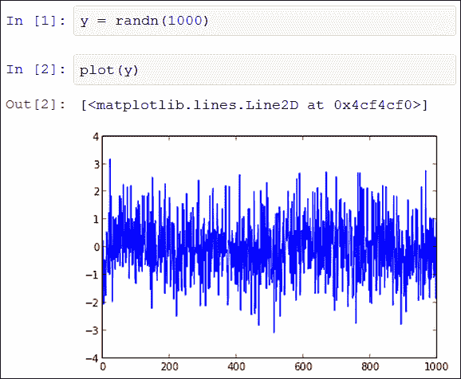

在笔记本中绘制白噪声信号

在这里，我们生成一个包含随机值的向量，这些值遵循独立的正态随机变量。生成的信号是所谓的白噪声信号，即功率谱密度平坦的随机信号。当使用`--pylab inline`选项在笔记本中绘制图形时，Matplotlib 会生成一张表示该曲线的图像，随后图像会自动插入到输出单元格中。

当`plot`函数接收一个单一的向量作为参数时，它假设该向量包含 y 轴的值，而 x 轴的值则自动生成，从`0`到`len(y) - 1`的整数。若要显式指定 x 轴的值，我们可以使用以下命令：`plot(x, y)`。

### 散点图

散点图通过使用像素或其他标记来表示二维空间中的一组点。让我们继续使用我们的城市示例。假设我们已经进入正确的目录（`citiesdata` 别名），我们可以加载数据并尝试绘制所有城市的地理坐标：

```py
In [1]: import pandas as pd
In [2]: cd citiesdata
In [3]: filename = 'worldcitiespop.txt'
In [4]: data = pd.read_csv(filename)
In [5]: plot(data.Longitude, data.Latitude, ',')

```

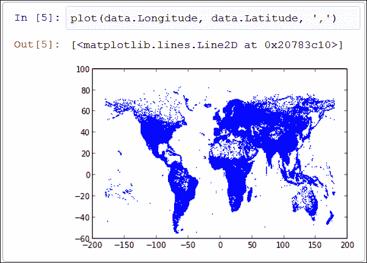

在笔记本中显示城市坐标

在这个示例中，我们绘制了所有城市的纬度（y 轴）与经度（x 轴）。`plot` 函数的第三个参数（`','`）指定了标记类型。在这里，它对应于一个散点图，每个城市用一个像素表示。即使大陆的形状看起来有些扭曲，我们仍然可以轻松识别出它们的轮廓。这是因为我们在笛卡尔坐标系中绘制地理坐标，而使用地图投影方法会更加合适。我们将在本章后面回到这个问题。

### 条形图

条形图通常用于直方图，表示不同区间内值的分布。Matplotlib 中的 `hist` 函数接受一个值的向量并绘制直方图。`bins` 关键字允许指定箱数或箱的列表。

例如，让我们绘制 Facebook 图示例中节点度数的直方图：

```py
In [1]: cd fbdata
In [2]: import networkx as nx
In [3]: g = nx.read_edgelist('0.edges')
In [4]: hist(g.degree().values(), bins=20)

```

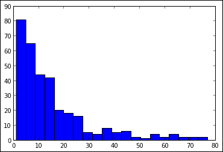

图中节点度数的分布

在这里，`g.degree()` 是一个字典，包含每个节点的度数（即与其连接的其他节点数）。`values` 方法返回所有度数的列表。

在 Matplotlib 中，比我们展示的图形类型要多得多，绘图的可能性几乎是无穷无尽的。可以在 Matplotlib 官方网站的画廊中找到各种图形示例（[`matplotlib.org/gallery.html`](http://matplotlib.org/gallery.html)），以及 Nicolas Rougier 的教程（[`www.loria.fr/~rougier/teaching/matplotlib/`](http://www.loria.fr/~rougier/teaching/matplotlib/)）。

## 绘图自定义

Matplotlib 提供了许多自定义选项。在这里，我们将看到如何更改图形中的样式和颜色，如何配置坐标轴和图例，以及如何在同一图形中显示多个图表。

### 样式和颜色

默认情况下，曲线是连续的，并且具有统一的颜色。可以在 `plot` 函数中轻松指定曲线的样式和颜色。

`plot` 函数的第三个参数指定了曲线的样式和颜色，使用简洁的语法。例如，'`-r`' 表示“连续且为红色”，而 '`--g`' 表示“虚线且为绿色”。有许多可能的样式，例如，`':'` 代表虚线，`'-.'` 代表点划线， `'.'` 代表点， `','` 代表像素， `'o'` 代表圆形标记，等等。

此外，有八种颜色对应一个字符的快捷键，分别是 `b`、`g` 和 `r`（主要的加色性颜色——蓝色、绿色和红色）；`c`、`m` 和 `y`（次要的加色性颜色——青色、品红色和黄色）；以及 `k` 和 `w`（黑色和白色）。任何其他颜色可以通过其十六进制代码、RGB 或 RGBA 元组（值在 `0` 和 `1` 之间）等方式指定。

使用字符串指定样式和颜色只是更一般的指定图表样式和颜色方式的快捷方式，更通用的方式是使用特定的关键字参数。这些参数包括 `linestyle`（或 `ls`）、`linewidth`（或 `lw`）、`marker`、`markerfacecolor`（或 `mfc`）、`markersize`（或 `ms`）等。完整的选项列表可以在 Matplotlib 的参考文档中找到。

此外，当在同一图形中显示多个图表时，每个图表的颜色会按预定义的颜色集轮换，例如蓝色、绿色、红色等。这个循环可以自定义：

```py
In [1]: rcParams['axes.color_cycle'] = ['r', 'k', 'c']

```

### 提示

**自定义 Matplotlib**

`rcParams` 是 Matplotlib 中的一个全局字典样式的变量，用于存储自定义参数。几乎 Matplotlib 的每个方面都可以在这里进行配置。此外，还可以通过将其保存到名为 `matplotlibrc` 的 ASCII 文本文件中来指定永久的自定义选项，该文件可以存储在当前目录（用于本地选项）或 `~/.matplotlib` 目录下（用于全局选项）。在此文件中，每一行包含一个自定义参数，例如 `axes.color_cycle: ['r', 'k', 'c']`。

### 网格、坐标轴和图例

如果没有图例和坐标轴，图形无法传达任何有用的数据。默认情况下，Matplotlib 会自动显示坐标轴和刻度。刻度的位置可以通过 `xticks` 和 `yticks` 设置，可以通过 `grid` 函数添加网格。x 和 y 坐标的范围可以通过 `xlim` 和 `ylim` 指定。坐标轴标签可以通过 `xlabel` 和 `ylabel` 设置。此外，可以通过 `legend` 关键字指定图例；每条线的标签对应于 `plot` 函数的 `label` 关键字参数。最后，`title` 命令会显示图形的名称。以下示例演示了如何使用这些选项：

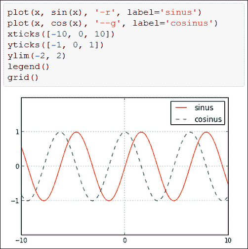

带坐标轴和图例的正弦和余弦函数

### 提示

**图表叠加**

调用不同的绘图函数会更新 Matplotlib 中的同一个图形。这是如何在同一个图形中显示多个图表的方式。要在新窗口中创建一个新图形，我们需要调用 `figure()` 函数。最后，可以通过使用子图，在同一个窗口中显示多个独立的图形，如我们在本节后面将要看到的那样。

### 来自 IPython 的交互

使用事件循环集成在 IPython 控制台中创建 Matplotlib 图形，可以通过编程与其进行交互。可以在一个图形中添加新的图表或实时更新它，以下面的示例为例：

```py
In [1]: plot(randn(1000, 2))
Out[1]: [<matplotlib.lines.Line2D at 0x4cf4310>,
 <matplotlib.lines.Line2D at 0x4cf4450>]

```

我们首先创建一个包含两个白噪声信号的图形（`plot`函数将每一列显示为独立的曲线）。一旦包含该图形的窗口打开，我们就可以在不关闭该窗口的情况下返回到 IPython 控制台。输出`Out[1]`包含一个`Line2D`对象的列表。实际上，Matplotlib 使用面向对象的方式描述图形。让我们按如下方式检索第一个对象（对应第一个曲线）：

```py
In [2]: line = _[0]

```

在`line`变量上使用 Tab 键补全后，显示我们可以用来更新图形的方法列表。例如，要将线条颜色从蓝色更改为红色，我们可以输入以下命令：

```py
In [3]: line.set_color('r')

```

然后，图形会相应地更新。可能需要强制刷新图形，例如通过平移或缩放。

最后，提一下图形窗口中的**编辑**按钮，它提供了一个 GUI 来更新一些图形的属性。

### 绘制多个图表

多个独立的图表可以显示在同一个图形中。我们可以定义一个具有任意行列数的网格，并在每个框内绘制图形。框可以跨越多个行或列（使用`subplot2grid`）。例如，下面的示例展示了如何将两个具有不同坐标系的图形并排绘制：

```py
x = linspace(0, 2 * pi, 1000)
y = 1 + 2 * cos(5 * x)
subplot(1,2,1)
plot(x, y)
subplot(1,2,2, polar=True)
polar(x, y)
```

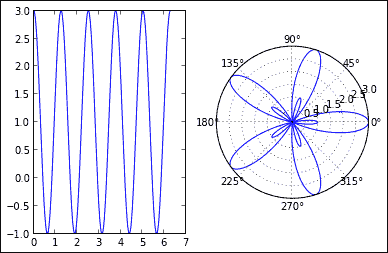

在同一图形中绘制笛卡尔坐标和极坐标图

`subplot`函数同时指定了图形有多少列（第一个参数）和多少行（第二个参数），以及绘制图形的框索引（第三个参数，基于 1 的索引，从左到右、从上到下）。`polar=True`关键字参数指定第二个子图包含极坐标图。`polar`函数类似于`plot`函数，但使用极坐标系，其中包含角度 theta 和半径 r，其中 theta 是角度，r 是半径。

# 高级图形与图表

在本节中，我们将展示 Matplotlib 提供的与图像和地图相关的更高级图形功能。我们还将看看其他一些图形库。

## 图像处理

一幅彩色的 N x M 图像可以表示为一个 N x M x 3 的 NumPy 数组，代表红色、绿色和蓝色通道的三个 N x M 矩阵。然后，可以使用 NumPy 和 SciPy 高效地实现图像处理算法，并通过 Matplotlib 进行可视化。此外，PIL 包（Python Imaging Library）提供了基本的图像处理功能。

### 加载图片

Matplotlib 的`imread`函数从硬盘中打开一个 PNG 图像，并返回一个 N x M x 3（如果存在 alpha 透明度通道，则为 N x M x 4）形状的 NumPy 数组。如果安装了 PIL，它还可以读取其他格式。PIL 还提供了`open`函数来读取任何格式的图像（BMP、GIF、JPEG、TIFF 等）。

在下面的示例中，我们从远程 URL 下载一个 PNG 图像，并使用`imread`加载它：

```py
In [1]: import urllib2
In [2]: png = urllib2.urlopen('http://ipython.rossant.net/squirrel.png')
In [3]: im = imread(png)
In [4]: im.shape
Out[4]: (300, 300, 3)

```

`imread`函数接受图像文件名或 Python 文件类对象（如这里使用的`urlopen`返回的缓冲区）。`imread`函数返回的对象是一个三维 NumPy 数组。

我们还可以使用 PIL 读取图像。我们可以直接使用`Image.open`打开图像文件，或者使用`Image.fromarray`函数将 NumPy 数组转换为 PIL 图像，如下所示：

```py
In [5]: from PIL import Image
In [6]: img = Image.fromarray((im * 255).astype('uint8'))

```

`fromarray`函数接受一个包含无符号 8 位整数的数组，值范围在`0`到`255`之间。这就是为什么我们需要将浮动点值的 NumPy 数组转换为所需的数据类型。相反，要将 PIL 图像转换为 NumPy 数组，我们可以使用`array`函数`im = array(img)`。

### 显示图像

Matplotlib 的`imshow`函数从 NumPy 数组中显示图像，如以下示例所示：

```py
In [7]: imshow(im)

```

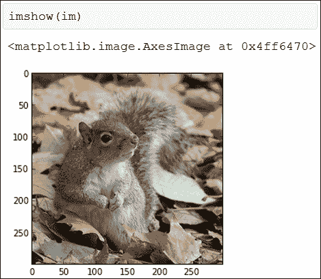

在笔记本中使用 Matplotlib 显示图像

`imshow`函数还接受二维 NumPy 数组（灰度图像）。从`0`到`1`的标量值到实际像素颜色的映射可以通过颜色映射来指定。颜色映射是一个线性渐变的颜色，定义了`0`到`1`之间任何值的颜色。Matplotlib 中有很多预定义的颜色映射，完整的列表可以在此找到：[`www.scipy.org/Cookbook/Matplotlib/Show_colormaps`](http://www.scipy.org/Cookbook/Matplotlib/Show_colormaps)

要在`imshow`中指定颜色映射，我们可以使用`cmap=get_cmap(name)`关键字参数，其中`name`是颜色映射的名称。

### 使用 PIL

基本的图像处理操作，如旋转、裁剪、滤波、复制粘贴、几何变换等，都是 PIL 提供的。例如，要旋转图像，我们可以使用以下命令：

```py
In [9]: imshow(array(img.rotate(45.)))

```

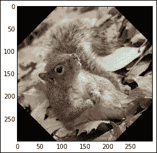

使用 PIL 旋转图像

在这里，我们将图像逆时针旋转 45 度，并将图像从 PIL 转换回 NumPy 以进行显示。

### 高级图像处理 – 颜色量化

PIL 提供了基本的图像处理功能，而 SciPy 可用于更高级的算法。

这里我们将展示一个名为颜色量化的高级图像处理算法的小示例。该算法的原理是减少图像的颜色数量，同时保持图像的大部分视觉结构。在本示例中，我们将使用`scipy.cluster`包实现该算法。我们将使用 k-means 算法将颜色值分组为少量的簇，并将每个像素分配给其所属组的颜色。以下是代码：

```py
In [10]: from scipy.cluster.vq import *
 M = im[:,:,0].ravel()
 centroids, _ = kmeans(M, 4)
 qnt, _ = vq(M, centroids)
 clustered = centroids[reshape(qnt, (300, 300))]

```

我们仅取红色通道，并使用`ravel`函数将图像展平，以便平等处理所有像素（也就是说，我们得到一个一维向量，而不是二维矩阵）。然后，`kmeans`函数在颜色空间中寻找聚类，并返回质心颜色。最后，`vq`函数将每个像素分配到其质心索引，并通过质心颜色（`centroids`）对质心索引（在`qnt`中）进行花式索引，得到最终的聚类图像。由于该算法的输出是灰度图像，我们需要指定一个颜色映射。我们将使用一组曾经流行的颜色，如下所示：

```py
In [11]: cmap = matplotlib.colors.ListedColormap([(0,.2,.3),(.85,.1,.13),(.44,.6,.6),(1.,.9,.65)])
In [12]: imshow(clustered, cmap=cmap)

```

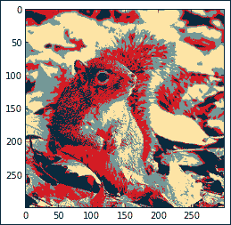

使用 SciPy 进行颜色量化

在这里，`ListedColormap`函数创建了一个具有离散颜色集的自定义颜色映射。

最后，我们可以使用 Matplotlib 的`imsave`函数将生成的图像保存为 PNG 文件，如下所示：

```py
In [13]: imsave('squirrelama.png', clustered, cmap=cmap)

```

## 地图

地图是复杂但重要的图形类型。基础地图工具包（需要单独安装）为 Matplotlib 带来了地理能力。它非常强大，而在本节中我们仅仅是略微触及表面。具体来说，我们将继续使用城市示例，在天球仪上绘制人口密度图。

首先，我们按如下方式获取城市的位置和人口：

```py
In [6]: locations = data[['Longitude','Latitude']].as_matrix()
In [7]: population = data.Population

```

接下来，我们通过指定投影类型和地图边界来初始化世界地图，如下所示：

```py
In [8]: from mpl_toolkits.basemap import Basemap
In [9]: m = Basemap(projection='mill', llcrnrlat=-65, urcrnrlat=85,
 llcrnrlon=-180, urcrnrlon=180)

```

将地球表面投影到平面上的方法有很多种，选择某种投影方式取决于具体应用。在这里，我们使用米勒圆柱投影。其他关键字参数给出了左下角和右上角的纬度和经度。

下一步是生成一个二维图像，显示世界人口密度。为此，我们需要将城市的地理坐标投影到我们的地图上，如下所示：

```py
In [10]: x, y = m(locations[:,0],locations[:,1])

```

调用函数`m(long, lat)`可以获取地理位置的`(x, y)`坐标，给定经纬度。为了生成密度图，我们还需要地图边界的坐标，如下所示：

```py
In [11]: x0, y0 = m(-180, -65)
In [12]: x1, y1 = m(180, 85)

```

现在，让我们生成密度图。我们将使用`histogram2d`函数，该函数从一组点生成一个二维直方图。在这里，每个点对应一个城市。我们还将为每个城市使用一个权重，代表其人口。对于没有人口的城市需要特别处理，我们将这些城市的权重设置为`1000`，如下所示：

```py
In [13]: weights = population.copy()
In [14]: weights[isnan(weights)] = 1000
In [15]: h, _, _ = histogram2d(x, y, weights=weights,bins=(linspace(x0, x1, 500), linspace(y0, y1, 500)))

```

现在，`h`变量包含了一个 500 x 500 网格上每个小矩形的总人口数，覆盖了整个平面图。为了生成密度图，我们可以对`log(h)`应用高斯滤波（相当于一种核密度估计），这可以通过 SciPy 实现。使用对数运算在值跨越多个数量级时非常有用。我们还需要处理零值（对应空白区域），因为零的对数是未定义的：

```py
In [16]: h[h == 0] = 1
In [17]: import scipy.ndimage.filters
In [18]: z = scipy.ndimage.filters.gaussian_filter(log(h.T), 1)

```

该滤波器应用于函数`log(h.T)`，因为`h`变量的坐标系与地图的坐标系相比是转置的。此外，我们在这里使用了`1`的滤波值。

最后，我们展示了密度图以及海岸线，如下所示：

```py
In [19]: m.drawcoastlines()
In [20]: m.imshow(z, origin='lower', extent=[x0,x1,y0,y1],cmap=get_cmap('Reds'))

```

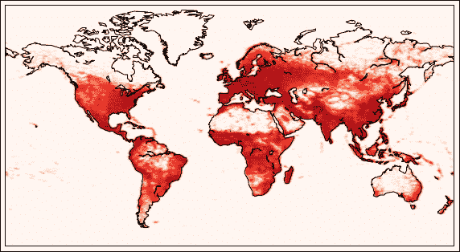

使用 Matplotlib.basemap 的世界人口密度图

## 3D 图

Matplotlib 包括一个名为`mplot3d`的 3D 工具包，可以用于基本的 3D 图，如 3D 曲线、表面图等。举个例子，我们先创建一个表面图。我们首先需要导入`mplot3d`工具包，方法如下：

```py
In [1]: from mpl_toolkits.mplot3d import Axes3D

```

然后，我们使用以下命令创建表面图的 x、y 和 z 坐标：

```py
In [2]: # we create a (X, Y) grid
 X = linspace(-5, 5, 50)
 Y = X
 X, Y = meshgrid(X, Y)
 # we compute the Z values
 R = sqrt(X**2 + Y**2)
 Z = sin(R)

```

NumPy 的函数`meshgrid`返回一个网格中所有点的坐标，这个网格覆盖了由`X`和`Y`向量定义的矩形区域。最后，我们创建一个 3D 画布并绘制表面图，如下所示：

```py
In [3]: ax = gca(projection='3d')
 surf = ax.plot_surface(X, Y, Z, rstride=1, cstride=1,
 cmap=mpl.cm.coolwarm, linewidth=0)

```

Matplotlib 的函数`gca`返回当前的坐标轴实例，我们在这里指定该实例应使用 3D 投影。在`plot_surface`函数中，`rstride`和`cstride`关键字参数分别表示表面的行和列步长，而`cmap`是色图，`linewidth`是线框的宽度。以下截图显示了结果：

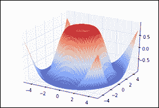

使用 mplot3D 的表面图

## 动画

Matplotlib 能够创建动画，并通过 FFmpeg 或 MEncoder 将其导出为 MP4 视频。其基本思路是创建一个图形，并编写一个函数在定时间隔内更新它。动画模块的文档可以在[`matplotlib.org/api/animation_api.html`](http://matplotlib.org/api/animation_api.html)找到。此外，Jake Vanderplas 制作的教程可以在[`jakevdp.github.com/blog/2012/08/18/matplotlib-animation-tutorial/`](http://jakevdp.github.com/blog/2012/08/18/matplotlib-animation-tutorial/)获得。

## 其他可视化包

Matplotlib 并不是 Python 中唯一的可视化包。这里是一些类似的库：

+   **Chaco**：这是一个替代 Matplotlib 的库（[`code.enthought.com/chaco/`](http://code.enthought.com/chaco/)）

+   **PyQwt**：这是一个基于 PyQt 的绘图库（[`pyqwt.sourceforge.net/`](http://pyqwt.sourceforge.net/)）

+   **PyQtGraph**：这个包也是基于 PyQt 的，提供 2D 和 3D 绘图功能（[`www.pyqtgraph.org/`](http://www.pyqtgraph.org/)）

+   **Visvis**：这个包基于 OpenGL，提供了面向对象的绘图接口（[`code.google.com/p/visvis/`](http://code.google.com/p/visvis/)）

+   **Mayavi**：这个包提供了 3D 交互式可视化功能，如曲线、表面、网格、体积渲染等（[`code.enthought.com/projects/mayavi/`](http://code.enthought.com/projects/mayavi/)）

+   **PyOpenGL**：这个 Python 库提供对流行的 OpenGL 库的原始访问，提供低级别的硬件加速 2D/3D 图形功能（[`pyopengl.sourceforge.net/`](http://pyopengl.sourceforge.net/)）

+   **Galry**：这是一个基于 PyOpenGL 的高性能交互式可视化包，旨在处理非常大的数据集，包含数千万甚至数亿个数据点（[`rossant.github.com/galry/`](http://rossant.github.com/galry/)）

# 图形用户界面（GUI）

曾几何时，人机交互只能通过命令行界面进行。如今，大多数普通计算机用户比起使用键盘和黑屏闪烁的光标，更习惯使用鼠标和图形窗口。因此，任何开发者在某个时刻可能都需要编写一个图形界面，哪怕是最简单的界面，以便让非开发者用户能够方便地与程序进行交互。

GUI 可以轻松地集成到任何 Python 包中。Python 有很多图形工具包，大多数是本地或 C++ 图形库的封装。著名的工具包包括 Qt、wxWidgets、Tkinter、GTK 等。在本书的示例中，我们将使用 Qt。

GUI 编程可能是一个很难的课题，需要深入了解操作系统的底层细节、多线程编程，以及一些关于人机交互的基本概念。在本书中，我们将展示一个 "Hello World" 示例，介绍 PyQt 的基本知识。我们还将展示如何通过 IPython 交互式地操作 GUI。

## 设置 IPython 以进行交互式 GUI 编程

IPython 实现了一个循环集成系统，允许在命令行界面显示图形窗口而不阻塞控制台。在创建 GUI 时，这非常有用，因为可以通过命令行动态地与窗口进行交互。

`%gui` 魔法命令激活事件循环集成。我们需要提供要使用的图形库的名称。可能的名称有 `wx`、`qt`、`gtk` 和 `tk`。在这里我们将使用 Qt。所以我们可以输入 `%gui qt`。然后，IPython 中将自动启动主 Qt 应用程序。另一种方法是使用 `ipython --gui qt` 启动 IPython。

本节中的示例需要使用 PyQt4 或 PySide。我们假设已经安装了 PyQt4，但如果只安装了 PySide，您只需在导入语句中将 `PyQt4` 替换为 `PySide`。这两个库提供的 Qt 绑定 API 几乎是相同的。

## 一个 "Hello World" 示例

在这个"Hello World"示例中，我们将显示一个窗口，里面有一个按钮，点击按钮会触发一个消息框。我们还将展示如何从 IPython 控制台与窗口进行交互。

要定义一个窗口，我们需要创建一个从`QWidget`基类派生的类。`QWidget`是所有 Qt 窗口和控件的基类，也称为小部件。以下是"Hello World"示例的代码：

```py
from PyQt4 import QtGui

class HelloWorld(QtGui.QWidget):
    def __init__(self):
        super(HelloWorld, self).__init__()
        # create the button
        self.button = QtGui.QPushButton('Click me', self)
        self.button.clicked.connect(self.clicked)
        # create the layout
        vbox = QtGui.QVBoxLayout()
        vbox.addWidget(self.button)
        self.setLayout(vbox)
        # show the window
        self.show()

    def clicked(self):
        msg = QtGui.QMessageBox(self)
        msg.setText("Hello World !")
        msg.show()
```

大部分工作发生在`HelloWorld`小部件的构造函数中。我们首先需要调用父类的构造函数。接着，我们执行若干步骤来显示按钮：

1.  我们首先创建一个按钮，类似于`QPushButton`类的实例。第一个参数是按钮的文本，第二个参数是父级小部件的实例（`self`）。每个特定的控件和小部件都是由从`QWidget`基类派生的类定义的，并且可以在`QtGui`命名空间中找到。

1.  我们定义了一个回调方法，当用户点击按钮时，该方法会被调用。`clicked`属性是一个 Qt 信号，一旦用户点击按钮就会发出。我们将这个信号连接到`HelloWorld`小部件的`clicked`方法（称为槽）。信号和槽是 Qt 使不同小部件彼此通信的方式。当某些事件发生时，信号会被触发，连接到这些信号的槽会在信号触发时被调用。任何小部件都包含许多预定义的信号，也可以创建自定义信号。

1.  然后，我们需要将新创建的按钮放置在窗口中的某个位置。我们首先需要创建一个`QVBoxLayout`小部件，它是一个容器小部件，包含一个垂直排列的小部件堆栈。在这里，我们仅将按钮放入其中，使用`addWidget`方法。我们还指定这个框是窗口的布局。通过这种方式，主窗口包含了这个框，而这个框又包含了我们的按钮。

1.  最后，我们需要使用命令`self.show()`来显示窗口。

在`clicked`方法中，我们创建一个`QMessageBox`小部件，它默认表示一个包含文本和单个**OK**按钮的对话框。`setText`方法指定文本，`show`方法显示窗口。

现在，假设与 Qt 的事件循环集成已经在 IPython 中激活，无论是通过`%gui qt`还是`ipython --gui qt`，我们可以通过以下命令显示窗口：

```py
In [1]: window = HelloWorld()

```

窗口随后会出现，且在窗口打开时，IPython 控制台仍然可用。

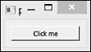

一个基本的 Qt 对话框

点击按钮会显示一个对话框，其中包含**Hello World**。

此外，我们还可以从 IPython 控制台动态地与窗口进行交互。例如，以下命令将显示 Hello World 对话框，就像我们点击了按钮一样：

```py
In [2]: window.clicked()

```

这个功能在设计复杂窗口和调试时特别方便。

# 总结

在本章中，我们发现了 IPython、Matplotlib 和其他一些包提供的图形化功能。我们可以创建图表、图形、直方图、地图，显示和处理图像，图形用户界面等等。图形也可以非常容易地集成到笔记本中。图形的各个方面都可以进行自定义。这些原因解释了为什么这些工具在科学和工程领域中非常受欢迎，在这些领域中，数据可视化在大多数应用中扮演着核心角色。

在下一章中，我们将介绍一些加速 Python 代码的技巧。
