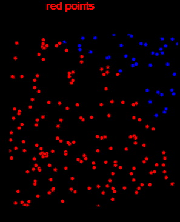
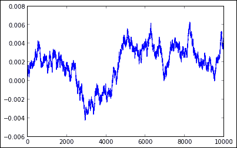

# 第五章. 高性能与并行计算

一个反复出现的观点是，Python 不适合高性能数值计算，因为它是一种动态语言并且是解释型的，速度较慢。像 C 这样的编译型低级语言通常可以快几个数量级。我们在第三章，*使用 IPython 进行数值计算*中提出了第一个反驳，**向量化**的概念。对 NumPy 数组的操作几乎可以和 C 一样快，因为缓慢的 Python 循环会被快速的 C 循环透明替换。然而，有时某些复杂算法可能无法进行向量化，或者实现起来很困难。在这种情况下，幸运的是，除了抛弃所有的 Python 代码并重新用 C 编写一遍外，还有其他解决方案。我们将在本章中介绍其中的一些解决方案。

首先，可以利用现代计算机中普遍存在的多个核心。标准的 Python 进程通常只在单个核心上运行，但可以将任务分布到多个核心，甚至多个计算机上并行处理。使用 IPython 实现这一点特别简单。MPI 也可以通过几行代码轻松使用。

另一个流行的解决方案是首先检测 Python 算法中时间关键部分，然后用 C 代码替换它。通常，只有 Python 代码中的一小部分负责大部分算法的运行时间，因此可以将其余的代码保持为 Python 代码。**Cython** 是一个外部包，它使得这一任务比看起来要容易得多：它提供了一个 Python 的超集，经过编译后，可以无缝地集成到 Python 代码中。与 IPython 一起使用时，它尤其方便。

在本章结束时，我们将讨论以下内容：

+   如何通过 IPython 将独立的函数分布到多个核心

+   如何轻松地从 IPython 使用 MPI

+   如何使用单元魔法将 Python 代码转换为 C 代码

+   如何在 Cython 中使用 NumPy 数组使你的代码快几个数量级

# 交互式任务并行化

在本节中，我们将学习如何通过 IPython 将任务分配到不同的核心上。

## Python 中的并行计算

Python 对并行计算特性的原生支持还有很大改进空间。一个长期存在的问题是，CPython 实现了 **全局解释器锁** (**GIL**)，根据官方 CPython 文档的描述，它是：

> "...一个互斥锁，防止多个原生线程同时执行 Python 字节码。"

GIL 是必需的，因为 CPython 的内存管理不是线程安全的，但一个主要的缺点是，它会阻止多线程的 CPython 程序充分利用多核处理器。

### 注意

**Python 的 GIL**

有兴趣的读者可以在以下参考资料中找到有关 Python GIL 的更多信息：

+   [`wiki.python.org/moin/GlobalInterpreterLock`](http://wiki.python.org/moin/GlobalInterpreterLock)

+   [`www.dabeaz.com/python/UnderstandingGIL.pdf`](http://www.dabeaz.com/python/UnderstandingGIL.pdf)

NumPy 中的一些线性代数函数可能通过释放 GIL 来利用多核处理器，前提是 NumPy 已经与适当的库（如 ATLAS、MKL 等）一起编译。否则，使用不同的 *进程* 而不是不同的 *线程* 来分配任务，是使用 Python 进行并行计算的典型方式。由于进程不共享同一内存空间，因此需要实现某种进程间通信，例如，使用 Python 的原生 **multiprocessing** 模块。一种更强大但更复杂的解决方案是使用 **消息传递接口** (**MPI**)。

IPython 特别适合这两种解决方案，我们将在本节中讨论它们。它提供了一个强大而通用的并行计算架构。多个 IPython 引擎可以运行在不同的核心和/或不同的计算机上。独立任务可以轻松且均匀地分配，得益于 **负载均衡**。数据可以从一个引擎传输到另一个引擎，这使得通过 IPython 实现复杂的分布式算法成为可能。

并行计算是一个特别困难的话题，我们这里只覆盖最基础的内容。

## 在多个核心上分配任务

IPython 的并行计算功能非常丰富且高度可定制，但我们这里只展示最简单的使用方式。此外，我们将重点讨论并行计算的交互式使用，因为这正是 IPython 的精髓所在。

在一台计算机上分配代码到多个核心的步骤如下：

1.  启动多个 IPython 引擎（通常每个处理器一个）。

1.  创建一个 `Client` 对象，它充当这些引擎的代理。

1.  使用客户端在引擎上启动任务并获取结果。

任务可以同步或异步启动：

1.  使用 **同步**（或阻塞）任务时，客户端在任务启动后会阻塞，并在任务完成时返回结果。

1.  使用 **异步**（非阻塞）任务时，客户端在任务启动后立即返回一个 `ASyncResult` 对象。该对象可以用来异步轮询任务状态，并在任务完成后随时获取结果。

### 启动引擎

启动引擎的最简单方法是在系统 shell 中调用 `ipcluster start` 命令。默认情况下，该命令会在本地机器的每个核心上启动一个引擎。可以通过 `-n` 选项指定引擎的数量，例如，`ipcluster start -n 2` 启动两个引擎。你可以通过 `ipcluster -h` 和 `ipcluster start -h` 查看其他可用选项。此外，Notebook 中有一个名为 **Clusters** 的面板，可以通过 Web 界面启动和停止引擎。

### 创建一个 Client 实例

客户端用于将任务发送到引擎。在 IPython 控制台或笔记本中，我们首先需要从`parallel`子包中导入`Client`类。

```py
In [1]: from IPython.parallel import Client

```

下一步是创建一个`Client`实例。

```py
In [2]: rc = Client()

```

IPython 会自动检测正在运行的引擎。要检查正在运行的引擎数目，我们可以执行以下操作：

```py
In [3]: rc.ids
Out[3]: [0, 1]

```

客户端的`ids`属性提供了运行中引擎的标识符。在这里，本地计算机上有两个正在运行的引擎（它具有双核处理单元）。

### 使用并行魔法

从 IPython 发送任务到引擎的最简单方法是使用`%px`魔法。它在引擎上执行单个 Python 命令。

```py
In [4]: import os
In [5]: %px print(os.getpid())
[stdout:0] 6224
[stdout:1] 3736

```

默认情况下，命令会在所有运行中的引擎上执行，并且是同步模式。有几种方法可以指定要针对哪个引擎进行操作。

第一个可能性是使用`%pxconfig`魔法命令：

```py
In [6]: %pxconfig --targets 1
In [7]: %px print(os.getpid())
3736

```

`--targets`选项接受一个索引或切片对象，例如，`::2`表示所有偶数索引的引擎。这里，我们只指定第二个引擎。所有后续对`%px`的调用将在指定的目标上执行。

一个等效的方法是使用`%%px`单元魔法：

```py
In [8]: %%px --targets :-1
 print(os.getpid())
[stdout:0] 6224

```

`%%px`的选项适用于整个单元，这在笔记本中尤其方便。

另一个可用的选项是**阻塞模式**。默认情况下，`%px`魔法假设是阻塞模式。要启用**非阻塞模式**，我们可以使用`--noblock`选项。

```py
In [9]: %%px --noblock
 import time
 time.sleep(1)
 os.getpid()
Out[9]: <AsyncResult: execute>

```

任务随后会异步执行。`%pxresult`魔法命令会阻塞解释器，直到任务完成，并返回结果。

```py
In [10]: %pxresult
Out[1:12]: 3736

```

### 并行映射

内置的`map`函数按元素依次将 Python 函数应用于序列。IPython 提供了一个并行的`map`函数，它语义上等价，但将不同的任务分派到不同的引擎上。这是将任务分发到多个核心的最简单方法。

#### 创建视图

要使用它，我们首先需要使用`Client`实例获取一个引擎的视图。**视图**表示一个或多个引擎，并通过在客户端上的索引语法获取。例如，要获取所有引擎的视图，我们可以使用以下命令：

```py
In [11]: v = rc[:]

```

然后，视图可以用于在引擎上启动任务。此外，我们还可以使用`sync_imports()`方法在引擎上导入包：

```py
In [12]: with v.sync_imports():
 import time
importing time on engine(s)

```

#### 同步映射

让我们定义以下简单函数：

```py
In [13]: def f(x):
 time.sleep(1)
 return x * x

```

该函数接受一个数字，并在返回其平方之前等待一秒钟。要在零到九之间的所有数字上同步执行该函数，并使用我们的两个引擎（即使用两个 CPU），我们可以使用`v.map_sync()`方法：

```py
In [14]: v.map_sync(f, range(10))
Out[14]: [0, 1, 4, 9, 16, 25, 36, 49, 64, 81]

```

我们在几秒钟后获得一组结果。这里，每个引擎处理了五个任务，共计 10 个任务：

```py
In [15]: %timeit -n 1 -r 1 v.map_sync(f, range(10))
1 loops, best of 1: 5.02 s per loop
In [16]: %timeit -n 1 -r 1 map(f, range(10))
1 loops, best of 1: 10 s per loop

```

#### 异步映射

要异步执行该函数并传递参数列表，我们可以使用`v.map()`方法：

```py
In [17]: r = v.map(f, range(10))
In [18]: r.ready(), r.elapsed
Out[18]: False, 2.135
In [19]: r.get()
Out[19]: [0, 1, 4, 9, 16, 25, 36, 49, 64, 81]
In [20]: r.elapsed, r.serial_time
Out[20]: (5.023, 10.008)

```

`r`变量是一个`ASyncResult`对象，具有多个属性和方法，可以用来轮询任务的进度、已用时间，并获取任务的结果。`elapsed`属性返回任务开始以来的已用时间。`serial_time`属性仅在任务完成后可用，返回所有任务在所有引擎上累计花费的时间。`ready()`方法随时返回一个值，表示任务是否完成。`get()`方法会阻塞直到任务完成，并返回结果。

## 一个实际的例子 – 蒙特卡罗模拟

为了说明 IPython 提供的并行计算可能性，我们将考虑一个新的例子。我们想使用*蒙特卡罗模拟*来估算圆周率π。原理是，如果在边长为 1 的正方形内随机且均匀地采样*n*个点，那么当*n*趋近于无穷大时，距离一个固定角落小于 1 的点的比例趋近于*π/4*。下图说明了这一事实：



使用蒙特卡罗模拟估算圆周率π

这是一个特定的*蒙特卡罗模拟*例子，它通过重复进行大量的随机实验，最后取平均值来估算某些难以通过确定性方法获得的量。蒙特卡罗模拟广泛应用于科学、工程和金融领域。它们特别适合并行化，因为通常只是独立执行相同的函数很多次。

在这里，我们将使用这个随机实验来估算圆周率π。使用这种方法获得的精度较低，而且还有许多方法更加高效且精确。但这个示例足以介绍 IPython 的并行计算特性。

首先，我们将编写执行模拟的 Python 代码。`sample`函数在立方体内生成*n*个点，并返回位于四分之一圆盘内的点的数量。

```py
In [1]: def sample(n):
 return (rand(n) ** 2 + rand(n) ** 2 <= 1).sum()

```

由于括号内的*n*长向量是一个掩码数组（即它包含布尔值），它的和就是`True`值的数量，也就是与 0 的欧几里得距离小于 1 的点的数量。

现在，要估算圆周率π，我们只需要将`sample(n)`乘以`4/n`即可：

```py
In [2]: n = 1000000.
In [3]: 4 * sample(n) / n
Out[3]: 3.142184

```

由于圆周率π的真实值是 3.1415926535...，我们看到在一百万个点的情况下（对于这次特定的代码执行）有两个正确的数字。接下来我们将把这个任务分配到多个核心上。假设已经启动了多个引擎，例如使用`ipcluster start`，下面是如何并行化代码：

```py
In [4]: from IPython.parallel import Client
 rc = Client()
 v = rc[:]
 with v.sync_imports():
 from numpy.random import rand
In [5]: 4 * sum(v.map_sync(sample, [n] * len(v))) / (n * len(v))
Out[5]: 3.141353

```

这里，`len(v)` 是引擎的数量。我们使用相同的参数 `n` 调用样本函数 `len(v)` 次。所有结果的总和是红点的总数，点的总数是 `n * len(v)`。最后，我们使用前述公式得到 Pi 的估计。

## 使用 IPython 中的 MPI

MPI 是一种著名的标准化消息传递系统，特别适用于并行计算。我们假设 MPI 实现已经安装在您的系统上（如 **Open-MPI**，[`www.open-mpi.org`](http://www.open-mpi.org))，以及用于从 Python 使用 MPI 的 **mpi4py** 包 ([`mpi4py.scipy.org`](http://mpi4py.scipy.org))。关于如何安装 MPI 的信息可以在这些网站上找到。

### 注意

**Windows 上的 MPI**

如果您使用的是 Windows，一种可能性是安装 Microsoft 的 MPI 实现，该实现可在 HPC Pack 中找到 ([`www.microsoft.com/en-us/download/details.aspx?id=36045`](http://www.microsoft.com/en-us/download/details.aspx?id=36045))。此外，您可能对 Python Tools for Visual Studio ([`pytools.codeplex.com`](http://pytools.codeplex.com)) 感兴趣，它可以将 Visual Studio 转变为 Python IDE。它提供了对 IPython 的原生支持，并专门设计用于 MPI 的高性能计算。

首先，我们需要为 MPI 创建一个特定的 IPython 配置文件。在 shell 中输入以下命令：

```py
ipython profile create --parallel --profile=mpi

```

接下来，编辑文件 `IPYTHONDIR/profile_mpi/ipcluster_config.py`（`IPYTHONDIR` 通常为 `~/.ipython`）并添加以下行：

```py
c.IPClusterEngines.engine_launcher_class = 'MPIEngineSetLauncher'

```

现在，要启动带有四个引擎的集群，请在 shell 中输入以下命令：

```py
ipcluster start -n 4 --profile=mpi

```

要在 IPython 中使用 MPI，我们首先需要通过 mpi4py 编写一个使用 MPI 的函数。在这个例子中，我们将在四个核心上并行计算从 1 到 16 的所有整数的总和。让我们在名为 `psum.py` 的文件中编写以下代码：

```py
from mpi4py import MPI
import numpy as np

# This function will be executed on all processes.
def psum(a):
    # "a" only contains a subset of all integers.
    # They are summed locally on this process. 
    locsum = np.sum(a)

    # We allocate a variable that will contain the final result, that 
# is the sum of all our integers.
    rcvBuf = np.array(0.0,'d')

    # We use a MPI reduce operation:
    #   * locsum is combined from all processes
    #   * these local sums are summed with the MPI.SUM operation
    #   * the result (total sum) is distributed back to all processes in
    #     the rcvBuf variable
    MPI.COMM_WORLD.Allreduce([locsum, MPI.DOUBLE],
        [rcvBuf, MPI.DOUBLE],
        op=MPI.SUM)
    return rcvBuf
```

最后，在 IPython 中可以交互地使用此函数，如下所示：

```py
In [1]: from IPython.parallel import Client
In [2]: c = Client(profile='mpi')
In [3]: view = c[:]
In [4]: view.activate() # enable magics
In [5]: view.run('psum.py') # the script is run on all processes
In [6]: view.scatter('a', np.arange(16)) # this array is scattered across processes
In [7]: %px totalsum = psum(a) # psum is executed on all processes
Parallel execution on engines: [0, 1, 2, 3]
In [8]: view['totalsum']
Out[8]: [120.0, 120.0, 120.0, 120.0]

```

关于如何在 IPython 中使用 MPI 的更多详细信息可以在官方 IPython 文档中的以下网页找到（这个例子来自于这里）：

[`ipython.org/ipython-doc/stable/parallel/parallel_mpi.html`](http://ipython.org/ipython-doc/stable/parallel/parallel_mpi.html)

## IPython 的高级并行计算特性

我们仅覆盖了 IPython 中可用的并行计算特性的基础知识。更高级的特性包括以下内容：

+   动态负载均衡

+   在引擎之间推送和拉取对象

+   在不同计算机上运行引擎，可选地使用 SSH 隧道

+   在 Amazon EC2 集群中使用 StarCluster 运行 IPython

+   将所有请求和结果存储在数据库中

+   使用有向无环图 (DAG) 管理任务依赖关系

这些特性远超出本书的范围。有兴趣的读者可以在官方 IPython 文档中找到关于所有这些特性的详细信息。

# 在 IPython 中使用 C 语言和 Cython

将独立任务分配到多个核心是利用现代计算机并行能力的最简单方式，从而将总执行时间减少一倍或更多。然而，有些算法无法轻易拆分成独立的子任务。此外，某些算法可能在 Python 中非常缓慢，因为它涉及到无法向量化的嵌套循环。在这种情况下，一个非常有趣的选择是将代码中的一个小而关键的部分用 C 语言编写，以显著减少 Python 的开销。这个解决方案并不涉及任何并行计算特性，但仍然可以显著提高 Python 脚本的效率。此外，没有什么能阻止同时使用这两种技术：部分 C 编译和使用 IPython 进行并行计算。

Cython 包允许在不显式转换为 C 代码的情况下编译部分 Python 代码；它提供了在 Python 中调用 C 函数和定义 C 类型的扩展语法。相关的代码会被自动转换成 C 编译，并可以透明地从 Python 中使用。在某些情况下，当只能使用纯 Python 代码，并且由于算法的特殊性质无法使用 NumPy 进行向量化时，速度提升可能会非常显著，达到几个数量级。

在本节中，我们将学习如何在 IPython 中交互式地使用 Cython。我们还将查看一个纯 Python 函数实现的数值算法示例，该算法可以通过 Cython 编译，执行速度比原来快超过 300 倍。

## 安装和配置 Cython

Cython 包的安装比其他包稍微困难一些。原因是使用 Cython 需要编译 C 代码，这显然需要一个 C 编译器（例如流行的 GNU C 编译器 **gcc**）。在 Linux 上，gcc 已经可以使用，或者通过包管理器轻松安装，例如在 Ubuntu 或 Debian 上使用 `sudo apt-get install build-essential`。在 OS X 上，可以选择安装 Apple XCode。在 Windows 上，可以安装 MinGW（[`www.mingw.org`](http://www.mingw.org)），它是 gcc 的一个开源发行版。然后，Cython 可以像安装其他包一样进行安装（见 第一章，*开始使用 IPython*）。更多信息可以在 [`wiki.cython.org/Installing`](http://wiki.cython.org/Installing) 找到。

### 注意

**在 Windows 上配置 MinGW 和 Cython**

在 Windows 上，根据 MinGW 的版本，编译 Cython 代码时可能会出现错误信息。要修复此 bug，您可能需要打开 `C:\Python27\Lib\distutils\cygwinccompiler.py`（或根据您的具体配置类似路径），然后将所有 `-mno-cygwin` 的出现替换为空字符串 `""`。

此外，确保 `C:\MinGW\bin` 在 `PATH` 环境变量中。最后，可能需要编辑（或创建）文件 `C:\Python27\Lib\distutils\distutils.cfg` 并添加以下几行代码：

```py
[build]
compiler = mingw32
```

你可以在 [`wiki.cython.org/InstallingOnWindows`](http://wiki.cython.org/InstallingOnWindows) 上找到更多信息。

## 在 IPython 中使用 Cython

使用 Cython 时，代码通常写在 `.pyx` 文件中，该文件通过 Cython 转换为 C 代码。然后，生成的 C 程序由 C 编译器编译成 `.so` 文件（在 Linux 上）或 `.pyd` 文件（在 Windows 上），可以在 Python 中正常导入。

这个过程通常涉及一个 `distutils setup.py` 脚本，该脚本指定了需要编译的文件和不同的编译器选项。由于这个步骤并不特别困难，我们在这里不会详细介绍。相反，我们将展示如何在 IPython 中轻松使用 Cython。其优点在于 Cython 和 C 编译过程会在后台自动完成，无需手动编写 `setup.py` 脚本。IPython 笔记本在这里尤其有用，因为它比控制台更方便编写多行代码。

在这里，我们将展示如何使用 `%%cython` 单元魔法从 IPython 中执行 Cython 代码。第一步是加载 `cythonmagic` 扩展。

```py
In [1]: %load_ext cythonmagic

```

然后，`%%cython` 单元魔法允许编写会自动编译的 Cython 代码。单元中定义的函数将在交互式会话中可用，并且可以像普通 Python 函数一样使用。

```py
In [2]: %%cython
 def square(x):
 return x * x
In [3]: square(10)
Out[3]: 100

```

在这里，调用 `square(10)` 涉及调用一个编译的 C 函数，该函数计算数字的平方。

## 使用 Cython 加速纯 Python 算法

在这里，我们将看到如何将一个包含嵌套循环的纯 Python 算法转换为 Cython，从而实现大约 10 倍的速度提升。这个算法是**厄拉托斯特尼筛法**，一个用于寻找小于固定数字的所有素数的千年算法。这个非常经典的算法的过程是从 2 到 *n* 之间的所有整数开始，逐步去除已找到的素数的倍数。在算法结束时，剩下的就是素数。我们将用 Python 实现这个算法，并展示如何将其转换为 Cython。

### 纯 Python 版本

在纯 Python 中，该算法仅由十几行代码组成。这个实现可以通过多种方式进行改进和简化（实际上可以用一行代码实现！），但对于这个示例来说，它已经足够，因为我们主要关注的是纯 Python 和 Cython 版本的*相对*执行时间。

```py
In [1]: def primes1(n):
            primes = [False, False] + [True] * (n - 2)
            i = 2
            # The exact code from here to the end of the function
            # will be referred as #SIEVE# in the next examples.
            while i < n:
                # we do not deal with composite numbers
                if not primes[i]:
                    i += 1
                    continue
                k = i * i
                # mark multiples of i as composite numbers
                while k < n:
                    primes[k] = False
                    k += i
                i += 1
            return [i for i in xrange(2, n) if primes[i]]
In [2]: primes(20)
Out[2]: [2, 3, 5, 7, 11, 13, 17, 19]
```

`primes`变量包含布尔值，用于指示关联的索引是否是素数。我们初始化时，只将`0`和`1`标记为合数（非素数），并使用“如果且仅如果一个正整数恰好有两个正除数，则它是素数”这一定义。然后，在每次对`i`的迭代中，我们会标记更多的数为合数，而不会改变素数。每个`i`代表一个素数，`k`的迭代则会将所有`i`的倍数标记为合数。最后，我们返回所有`True`的索引，也就是所有小于`n`的素数。

现在，让我们来看一下这个函数的执行时间：

```py
In [3]: n = 10000
In [4]: %timeit primes1(n)
100 loops, best of 3: 5.54 ms per loop

```

我们将尝试使用 Cython 加速这个函数。

### 初级 Cython 转换

作为第一次尝试，我们将直接使用相同的 Cython 代码。

```py
In [5]: %load_ext cythonmagic
In [6]: %%cython
        def primes2(n):
            primes = [False, False] + [True] * (n - 2)
            i = 2
            #SIEVE#: see full code above
In [7]: timeit primes2(n)
100 loops, best of 3: 3.25 ms per loop
```

我们仅通过在单元格顶部添加`%%cython`，就实现了 70%的速度提升，但如果我们为 Cython 提供类型信息，性能可以更好。

### 添加 C 类型

上一个例子中的速度提升比较温和，因为局部变量是动态类型的 Python 变量。这意味着，由于 Python 的动态特性，其开销仍然是与纯 C 代码相比导致性能差异的重要原因。我们可以通过使用`cdef`关键字将 Python 变量转换为 C 变量，从而提高性能。

```py
In [8]: %%cython
        def primes3(int n):
            primes = [False, False] + [True] * (n - 2)
            cdef int i = 2
            cdef int k = 0
            #SIEVE#: see full code above
```

相较于初级版本，有三个变化：`n`参数被静态声明为整数，局部变量`i`和`k`现在声明为 C 整数变量。因此，性能提升更加明显：

```py
In [9]: timeit primes3(n)
1000 loops, best of 3: 538 us per loop

```

仅通过使用`%%cython`魔法和一些类型声明，这个函数现在比纯 Python 版本快了 10 倍。通过更合适的数据结构，结果可能还会得到进一步的优化。

通常，知道哪些代码部分在转换为 Cython 后能显著提升性能，需要对 Python 的内部机制有一定了解，更重要的是，需要进行广泛的性能分析。Python 循环（尤其是嵌套循环）、Python 函数调用以及在紧密循环中操作高层数据结构，都是 Cython 优化的经典目标。

## 使用 NumPy 和 Cython

在本节中，我们将展示如何将 NumPy 数组与 Cython 代码结合使用。我们还将看到如何通过将 Python 函数转换为 C 函数，显著优化在紧密循环中对 Python 函数的调用。

### Python 版本

在这里，我们将通过一个**随机过程模拟**的示例来演示，具体是布朗运动。该过程描述了一个粒子从`x=0`出发，在每个离散时间步长上进行`+dx`或`-dx`的随机步伐，其中`dx`是一个小常数。这种类型的过程在金融、经济、物理学、生物学等领域中都很常见。

这个特定的过程可以通过 NumPy 的`cumsum()`和`rand()`函数非常高效地模拟。然而，更复杂的过程可能需要进行模拟，例如一些模型要求在位置达到某个阈值时进行瞬时跳跃。在这些情况下，向量化不是一种选择，因此手动循环是不可避免的。

```py
In [1]: def step():
            return sign(rand(1) - .5)

        def sim1(n):
            x = zeros(n)
            dx = 1./n
            for i in xrange(n - 1):
                x[i+1] = x[i] + dx * step()
            return x
```

`step`函数返回一个随机的`+1`或`-1`值。它使用了 NumPy 的`sign()`和`rand()`函数。在`sim1()`函数中，轨迹首先被初始化为一个全为零的 NumPy 向量。然后，在每次迭代中，会向轨迹中添加一个新的随机步长。`then`函数返回完整的轨迹。以下是一个轨迹的示例：

```py
In [2]: plot(sim1(10000))

```



布朗运动的模拟

让我们看看这个函数的执行时间。

```py
In [3]: n = 10000
In [4]: timeit sim1(n)
1 loops, best of 3: 249 ms per loop

```

### Cython 版本

对于 Cython 版本，我们将做两件事。首先，我们将为所有局部变量以及包含轨迹的 NumPy 数组添加 C 类型。同时，我们将把`step()`函数转换为一个纯 C 函数，该函数不调用任何 NumPy 函数。我们将调用在 C 标准库中定义的纯 C 函数。

```py
In [4]: %%cython
        import numpy as np
        cimport numpy as np
        DTYPE = np.double
        ctypedef np.double_t DTYPE_t

        # We redefine step() as a pure C function, using only
        # the C standard library.
        from libc.stdlib cimport rand, RAND_MAX
        from libc.math cimport round

        cdef double step():
            return 2 * round(float(rand()) / RAND_MAX) - 1

        def sim2(int n):
            # Local variables should be defined as C variables.
            cdef int i
            cdef double dx = 1\. / n
            cdef np.ndarray[DTYPE_t, ndim=1] x = np.zeros(n,        dtype=DTYPE)
            for i in range(n - 1):
                x[i+1] = x[i] + dx * step()
            return x
```

我们首先需要导入标准的 NumPy 库，以及一个特殊的 C 库，也叫做`NumPy`，它是 Cython 包的一部分，通过`cimport`引入。我们定义了 NumPy 的数据类型`double`和相应的 C 数据类型`double_t`，使用`ctypedef`。这允许在编译时而非执行时定义`x`数组的确切类型，从而大幅提高速度。`x`的维度数也在`sim2()`函数内指定。所有局部变量都被定义为 C 类型的 C 变量。

`step()`函数已被完全重写。现在它是一个纯 C 函数（使用`cdef`定义）。它使用 C 标准库中的`rand()`函数，该函数返回一个介于 0 和`RAND_MAX`之间的随机数。`math`库中的`round()`函数也被用来生成一个随机的`+1`或`-1`值。

让我们来检查一下`sim2()`函数的执行时间：

```py
In [5]: timeit sim2(n)
1000 loops, best of 3: 670 us per loop

```

Cython 版本比 Python 版本快 370 倍。这一剧烈的速度提升的主要原因在于 Cython 版本仅使用纯 C 代码。所有变量都是 C 变量，之前需要调用 Python 函数的`step`函数，现在只需要调用纯 C 函数，这大大减少了循环中 Python 的开销。

## 加速 Python 代码的更高级选项

Cython 还可以用来将现有的 C 代码或库与 Python 接口，但我们在这里不讨论这种用例。

除了 Cython 之外，还有其他一些加速 Python 代码的包。`SciPy.weave` ([`www.scipy.org/Weave`](http://www.scipy.org/Weave)) 是 SciPy 的一个子包，允许将 C/C++ 代码嵌入到 Python 代码中。**Numba** ([`numba.pydata.org/`](http://numba.pydata.org/)) 使用即时编译的 LLVM 技术，通过动态和透明地编译纯 Python 代码，从而显著加速其执行。它与 NumPy 数组有很好的兼容性。安装时需要 llvmpy 和 meta。

相关项目包括 **Theano** ([`deeplearning.net/software/theano/`](http://deeplearning.net/software/theano/))，它通过在 CPU 或显卡上透明地编译数学表达式，使得在数组上定义、优化和评估这些表达式变得非常高效。同样，**Numexpr** ([`code.google.com/p/numexpr/`](https://code.google.com/p/numexpr/)) 可以编译数组表达式，并利用矢量化 CPU 指令和多核处理器的优势。

**Blaze** ([`blaze.pydata.org/`](http://blaze.pydata.org/)) 是一个仍处于早期开发阶段的项目，旨在将所有这些动态编译技术整合到一个统一的框架中。它还将通过允许类型和形状的异质性、缺失值、标记维度（如在 Pandas 中）等，扩展多维数组的概念。由 NumPy 的创建者开发，它有望在不久的将来成为 Python 计算社区的一个核心项目。

最后，**PyOpenCL** ([`mathema.tician.de/software/pyopencl`](http://mathema.tician.de/software/pyopencl)) 和 **PyCUDA** ([`mathema.tician.de/software/pycuda`](http://mathema.tician.de/software/pycuda)) 是 OpenCL 和 CUDA 的 Python 封装库。这些库实现了类似 C 的低级语言，可以在现代显卡上编译，利用其大规模并行架构。事实上，显卡包含数百个专用核心，可以非常高效地处理大量元素的函数（**单指令多数据** (**SIMD**) 模式）。与纯 C 代码相比，速度提升可能达到一个数量级以上。**OpenCL** 是一种开放标准语言，而 **CUDA** 是由 Nvidia 公司拥有的专有语言。CUDA 代码仅能在 Nvidia 显卡上运行，而 OpenCL 则得到大多数显卡和大多数 CPU 的支持。在后者的情况下，相同的代码会在 CPU 上编译，并利用多核处理器和矢量化指令。

# 摘要

本章介绍了两种加速 Python 代码的方法：通过将 Python 代码转换为低级 C 代码来绕过 Python 的开销，或者通过将 Python 代码分布到多个计算单元上，利用多核处理器的优势。两种方法甚至可以同时使用。IPython 大大简化了这些技术。虽然并行计算和 Cython 可以在没有 IPython 的情况下使用，但它们需要更多的样板代码。

在下一章中，我们将探讨一些高级选项来定制 IPython。
