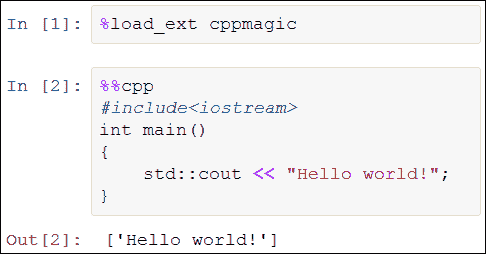
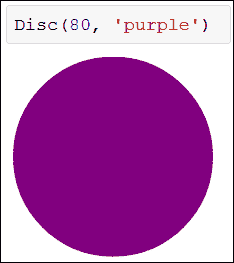
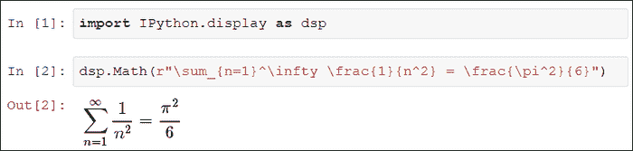

# 第六章. 自定义 IPython

IPython 可以定制和扩展以满足高级用途。在本章结束时，你将了解：

+   如何创建和使用自定义配置文件

+   如何在高级应用中使用 IPython 扩展

+   如何在笔记本中使用不同的语言

+   如何创建你自己的扩展

+   如何在前端使用丰富的表示形式

+   如何将 IPython 嵌入到 Python 代码中

# IPython 配置文件

配置文件是特定于本地计算机上某个用户的，包含 IPython 偏好设置以及历史记录、临时文件、日志文件等。默认情况下，存在一个名为**默认配置文件**的配置文件。要手动创建它，我们可以在系统 shell 中运行以下命令：

```py
ipython profile create

```

要指定配置文件的名称，我们可以使用 `ipython profile create name` 命令。

## 配置文件的位置

配置文件通常存储在 `~/.ipython` 或 `~/.config/ipython` 中，其中 `~` 是当前用户的主目录。这个目录通常被称为**IPython 目录**，有时也称为 `IPYTHONDIR`。要找到配置文件的确切位置，我们可以运行 `ipython locate` 命令来定位 IPython 配置目录，或者运行 `ipython locate profile default` 来定位特定配置文件目录，其中 `default` 是配置文件的名称。配置文件名称通常存储在 IPython 配置文件夹中的名为 `profile_name` 的文件夹中。

默认情况下，IPython 使用默认配置文件启动。要在运行 IPython 时指定不同的配置文件，我们可以使用 `--profile` 命令行参数，例如：

```py
ipython --profile=name

```

## IPython 配置文件

在每个配置文件中，都有一个名为 `ipython_config.py` 的特殊配置文件。这个 Python 脚本是用于指定各种选项的占位符。它包含一个完整的模板，包含了大多数可能的选项，并且有详细文档，因此修改起来应该很简单。

例如，要在配置文件中自动启用**pylab**模式以及 `qt` 事件循环集成系统，以下几行应出现在相应的 `ipython_config.py` 文件中：

```py
# Enable GUI event loop integration ('qt', 'wx', 'gtk', 'glut',
# 'pyglet','osx').
c.InteractiveShellApp.gui = 'qt'

# Pre-load matplotlib and numpy for interactive use, selecting a
# particular matplotlib backend and loop integration.
c.InteractiveShellApp.pylab = 'qt'

# If true, an 'import *' is done from numpy and pylab, when using # pylab
c.InteractiveShellApp.pylab_import_all = True
```

## 在 IPython 启动时加载脚本

你可以在每次启动 IPython 时自动加载一些 Python 脚本，只需将它们放入 `IPYTHONDIR/startup/` 文件夹中。如果你希望每次 IPython 启动时加载模块或执行一些脚本，这个方法会很有用。

# IPython 扩展

IPython 扩展允许在 IPython 中实现完全自定义的行为。它们可以通过简单的魔法命令手动加载，或者在 IPython 启动时自动加载。

多个扩展已原生包含在 IPython 中。它们本质上允许从 IPython 执行非 Python 代码。例如，`cythonmagic` 扩展提供了 `%%cython` 单元魔法，用于直接在 IPython 中编写 Cython 代码，就像我们在第五章，*高性能和并行计算*中看到的那样。类似的内置扩展还包括 `octavemagic` 和 `rmagic`，用于在 IPython 中执行 Octave 和 R 代码。它们在笔记本中尤其有用。

第三方模块也可以实现自己的扩展，正如我们在本节中看到的逐行分析模块。最后，我们将展示如何创建新的扩展。

## 示例 – 逐行分析

`line_profiler` 和 `memory_profiler` 包是逐行分析器，它们提供非常精确的代码段细节，显示哪些部分的代码耗时过长或使用了过多内存。它们提供的魔法命令可以手动与 IPython 集成。首先，我们需要安装这些包，例如使用 `easy_install`、`pip` 或 Christoph Gohlke 的网页（Windows 用户）。在 Windows 上需要 `psutil` 包，它可以在同一个网页上找到。

要激活这两个包中实现的魔法命令，我们需要编辑 IPython 配置文件，并添加以下几行：

```py
c.TerminalIPythonApp.extensions = [
    'line_profiler',
    'memory_profiler'
]
```

此时，`lprun`、`mprun` 和 `memit` 魔法命令可供使用。当要分析的函数定义在文件中而非交互式会话中时，逐行分析器效果最佳，因为此时分析器可以在分析报告中显示每一行的内容。

作为示例，让我们创建一个脚本 `myscript.py`，使用以下代码：

```py
import numpy as np
import matplotlib.pyplot as plt
def myfun():
    dx = np.random.randn(1000, 10000)
    x = np.sum(dx, axis=0)
    plt.hist(x, bins=np.linspace(-100, 100, 20))
```

该函数模拟 10,000 次随机游走（布朗运动），每次 1,000 步，并绘制模拟结束时粒子位置的直方图。

现在，我们将加载这个函数到 IPython 中并进行分析。`%lprun` 魔法命令接受一个 Python 语句以及需要逐行分析的函数列表，函数列表通过 `-f` 选项指定：

```py
In [1]: from myscript import myfun
In [2]: lprun -f myfun myfun()

```

```py
Timer unit: 5.13284e-07 s

File: myscript.py
Function: myfun at line 3
Total time: 1.26848 s

Line #      Hits         Time  Per Hit   % Time  Line Contents
==============================================================
     3                                           def myfun():
     4         1      1783801 1783801.0     72.2      dx = 
np.random.randn(1000, 1000)
     5         1       262352 262352.0     10.6      x = 
np.cumsum(dx, axis=0)
     6         1       425142 425142.0     17.2      t = 
np.arange(1000)
     7                                               
np.histogram2d(t, x)
```

我们可以观察到，大部分执行时间发生在创建 `dx` 数组的过程中。

`%mprun` 魔法命令也可以类似地用于内存分析。

逐行分析器在分析复杂的 Python 应用时特别有用。通过简单的魔法命令在 IPython 中交互式地进行分析尤其方便。

## 创建新扩展

要创建扩展，我们需要在 Python 路径中的目录中创建一个 Python 模块。可以将其放在当前目录，或者放在 `IPYTHONDIR/extensions/` 中。

扩展实现了一个 `load_ipython_extension(ipython)` 函数，该函数以当前的 `InteractiveShell` 实例作为参数（可能还包括 `unload_ipython_extension(ipython)`，该函数在卸载扩展时被调用）。此实例可用于注册新的魔法命令、访问用户命名空间、执行代码等。当扩展被加载时，会调用此加载函数，这通常发生在执行 `%load_ext` 或 `%reload_ext` 魔法命令时。为了在 IPython 启动时自动加载模块，我们需要将模块名添加到 IPython 配置文件中的 `c.TerminalIPythonApp.extensions` 列表中。

### 提示

**InteractiveShell 实例**

`InteractiveShell` 实例代表当前活跃的 IPython 解释器。其有用的方法和属性包括 `register_magics()`，用于创建新的魔法命令，以及 `user_ns`，用于访问用户命名空间。你可以通过 IPython 的自动补全功能交互式地探索实例的所有属性。为此，你需要执行以下命令来获取当前实例：

```py
ip = get_ipython()

```

### 示例 – 在 IPython 中执行 C++ 代码

在这个示例中，我们将创建一个新的扩展，以便直接在 IPython 中执行 C++ 代码。这仅是一个教学示例，在实际项目中，使用 Cython 或 SciPy.weave 可能会是一个更好的选择。

该扩展定义了一个新的单元魔法命令 `cpp`。其理念是能够直接在单元中编写 C++ 代码，并且自动进行编译和执行。单元的输出将包含代码的标准输出。以下是该扩展如何工作的说明：

+   我们创建了一个新的类，继承自 `IPython.core.magic.Magics`

+   在这个类中，我们创建了一个带有 `cell_magic` 装饰器的新方法：它将实现 `cpp` 单元魔法命令

+   该方法接受单元的代码作为输入，将 C++ 代码写入一个临时文件，并调用 g++ 编译器来创建可执行文件

+   该方法随后调用新创建的可执行文件并返回输出

+   在 `load_ipython_extension` 函数中，我们注册了这个魔法类

以下代码应写入 `cppmagic.py` 脚本：

```py
import IPython.core.magic as ipym

@ipym.magics_class
class CppMagics(ipym.Magics):
    @ipym.cell_magic
    def cpp(self, line, cell=None):
        """Compile, execute C++ code, and return the standard output."""
        # Define the source and executable filenames.
        source_filename = 'temp.cpp'
        program_filename = 'temp.exe'
        # Write the code contained in the cell to the C++ file.
        with open(source_filename, 'w') as f:
            f.write(cell)
        # Compile the C++ code into an executable.
        compile = self.shell.getoutput("g++ {0:s} -o {1:s}".format(
            source_filename, program_filename))
        # Execute the executable and return the output.
        output = self.shell.getoutput(program_filename)
        return output

def load_ipython_extension(ipython):
    ipython.register_magics(CppMagics)
```

以下截图展示了如何方便地在 IPython 笔记本中使用这个扩展来编写 C++ 代码：



在 IPython 笔记本中执行 C++ 代码

该代码在 Windows 上有效，并可以很容易地适配到 Unix 系统。

### 提示

**改进这个示例**

这个例子可以在很多方面改进：临时文件可以有唯一的名称，并存储在一个特殊的临时目录中，编译错误可以得到很好的处理并重定向到 IPython 等等。感兴趣的读者可以查看内置的 Cython、Octave 和 R 魔法扩展，这些扩展在`IPython/extensions/`目录下，与这个例子有些相似。更一般地说，相同的技术可以用来在 IPython 中运行非 Python 代码，甚至可能实现 Python 与其他语言之间的变量共享。

IPython 扩展在笔记本环境中尤为强大，因为它们特别允许在单元格代码中实现任意复杂的行为。

### 提示

**扩展索引**

由 IPython 用户创建的 IPython 扩展索引可以在[`github.com/ipython/ipython/wiki/Extensions-Index`](https://github.com/ipython/ipython/wiki/Extensions-Index)找到。如果你开发了自己的扩展，欢迎在此添加！

# 前端的丰富表现

笔记本和 Qt 控制台可以显示更丰富的对象表现。它们都能显示位图和 SVG 图像，且笔记本还支持视频、HTML 代码和 LaTeX 数学方程式。通过类显示丰富的对象特别简单：只需要实现一个名为`_repr_*_`的方法，其中`*`可以是`svg`、`png`、`jpeg`、`html`、`json`、`pretty`或`latex`。例如，定义一个类`Disc`，并实现 SVG 表示方法：

```py
In [1]: class Disc(object):
 def __init__(self, size, color= ared'):
 self.size = size
 self.color = color

 def _repr_svg_(self):
 return """<svg  version="1.1">
 <circle cx="{0:d}" cy="{0:d}" r="{0:d}" fill="{1:s}" />
 </svg>""".format(self.size, self.color)

```

该类的构造函数接受一个以像素为单位的半径大小和一个作为字符串的颜色。然后，当该类的实例指向标准输出时，SVG 表示会自动显示在单元格的输出中，如下图所示：



IPython 笔记本中的 SVG 表示

显示对象丰富表现的另一种方式是使用`IPython.display`模块。你可以通过标签补全交互式地获取所有受支持的表现列表。例如，下面的截图展示了如何在笔记本中渲染 LaTeX 方程式：



IPython 笔记本中的 LaTeX 方程式

笔记本的丰富显示功能使其特别适合创建教学内容、演示文稿、博客文章、书籍等，因为笔记本可以导出为 HTML 或 PDF 等格式。

然而，在未来版本的 IPython 中，支持自定义 JavaScript 扩展和小部件的笔记本可能会实现更丰富的交互式表现。

# 嵌入 IPython

即使在标准的 Python 解释器运行脚本时，也可以从任何 Python 脚本启动 IPython。在某些情况下，当你需要在某个时刻与复杂的 Python 程序交互，而又不希望或无法对整个程序使用 IPython 解释器时，这个功能非常有用。例如，在科学计算中，你可能希望在某些自动计算密集型算法执行完后暂停程序，查看数据、绘制一些图表等，然后再继续程序。另一个可能的使用场景是将小部件集成到图形用户界面中，通过 IPython 命令行界面让用户与 Python 环境进行交互。

在程序中集成 IPython 最简单的方法是在你的 Python 程序的任何位置调用 `IPython.embed()`（在 `import IPython` 之后）。你还可以指定自定义选项，包括命令行界面的输入/输出模板、启动/退出消息等。你可以在 [`ipython.org/ipython-doc/stable/interactive/reference.html#embedding-ipython`](http://ipython.org/ipython-doc/stable/interactive/reference.html#embedding-ipython) 找到更多信息。

# 结束语

到目前为止，你应该已经确信 IPython 的强大功能和灵活性。IPython 不仅本身提供了大量有用的功能，它还允许你在几乎任何方面扩展和定制它。然而，需要注意的是，这个项目仍在不断发展中。尽管它已经创建超过 10 年，但在写本文时，版本 1.0 仍未发布。IPython 的核心功能现在已经相当稳定和成熟。最近的功能——笔记本，预计将在未来几年有重要的发展。预计将在笔记本中创建自定义交互式小部件的功能将成为整个项目的一个重要特点。有关即将到来的开发的更多信息，可以在 [`github.com/ipython/ipython/wiki/Roadmap:-IPython`](https://github.com/ipython/ipython/wiki/Roadmap:-IPython) 和 [`ipython.org/_static/sloangrant/sloan-grant.html`](http://ipython.org/_static/sloangrant/sloan-grant.html) 找到。

最后，IPython 是一个活跃的开源项目，任何人都可以贡献。贡献可以像报告或修复一个 bug 那样简单，但总是非常有用并且受到高度赞赏！相关地，任何人都可以在遵守公共礼仪规则的前提下在线请求帮助。开发人员和最活跃的用户总是愿意提供帮助。以下是一些有用的链接：

+   GitHub 项目页面: [`github.com/ipython/ipython`](https://github.com/ipython/ipython)

+   Wiki: [`github.com/ipython/ipython/wiki`](https://github.com/ipython/ipython/wiki)

+   用户邮件列表: [`mail.scipy.org/mailman/listinfo/ipython-user`](http://mail.scipy.org/mailman/listinfo/ipython-user)

+   聊天室：[`www.hipchat.com/ghSp7E1uY`](https://www.hipchat.com/ghSp7E1uY)

# 摘要

在本章中，我们描述了如何定制和扩展 IPython，特别是通过扩展功能。非 Python 语言也可以通过 IPython 调用，这在笔记本中尤其方便，因为任何代码都可以复制并粘贴到一个单元格中，并在当前的 Python 命名空间中透明地编译和执行。该笔记本还支持丰富的显示功能，并且很快将支持交互式小部件，使其成为目前为止最先进的 Python 交互式编程和计算工具。
