# 第一章：Jupyter 简介

Jupyter 是一款工具，允许数据科学家记录他们的完整分析过程，类似于其他科学家使用**实验室笔记本**来记录实验、进展、结果和结论。

Jupyter 最初是作为 IPython 项目的一部分开发的。IPython 项目用于提供交互式在线访问 Python。随着时间的推移，它变得也可以以相同方式与其他数据分析工具（如 R）交互。随着这一脱离 Python 的过程，该工具发展成了现在的 Jupyter 形式。IPython 仍然是一个可供使用的活跃工具。Jupyter 这个名称本身来源于 Julia、Python 和 R 的结合。

Jupyter 可以作为 web 应用程序从多个地方获取。它也可以在本地通过多种安装方式使用。在本书中，我们将探讨如何在 macOS 和 Windows PC 上使用 Jupyter，以及如何通过其他提供商使用 Jupyter 进行互联网操作。

在 Jupyter 5.0 中，以下内容得到了显著增强：

+   单元格标签

+   自定义键盘快捷键

+   在 Notebooks 之间复制和粘贴单元格

+   为表格提供更具吸引力的默认样式

在本章中，我们将讨论以下主题：

+   初次了解 Jupyter

+   安装 Jupyter

+   Notebook 结构

+   Notebook 工作流程

+   基本的 Notebook 操作

+   Jupyter 的安全性

+   Jupyter 的配置选项

# 初次了解 Jupyter

这是使用 Jupyter 时的一个示例首页（此截图来自 Windows 计算机）：

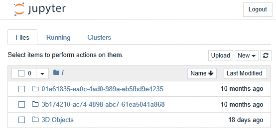

你应该熟悉环境。Jupyter 用户界面有许多组件：

+   产品标题“Jupyter”位于左上角（如预期）。该 logo 和标题是可点击的，点击后将返回到 Jupyter Notebook 的主页。

+   显示了三个选项卡：文件、运行和集群：

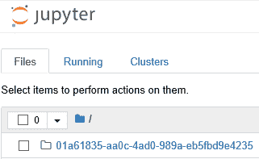

+   “文件”选项卡显示当前页面目录中的文件列表（稍后会详细描述）。

+   “运行”选项卡展示了另一个屏幕，显示当前正在运行的进程和 Notebook。终端和 Notebook 的下拉列表会列出其正在运行的项目：

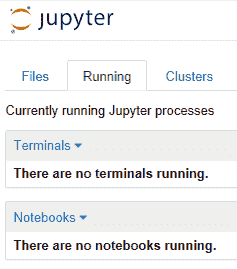

+   “集群”选项卡展示了另一个屏幕，显示可用集群的列表。这个话题将在后续章节中讨论：

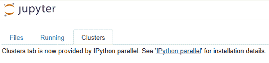

+   在屏幕的右上角，有三个按钮：上传、创建（菜单）和刷新 Notebook 列表按钮。

+   上传按钮用于将文件添加到 Notebook 空间。你也可以像处理文件一样直接拖拽文件。同样，你也可以将 Notebook 拖拽到特定的文件夹中。

+   顶部带有“新建”的菜单呈现了一个进一步的菜单，显示了已安装的不同笔记本引擎（我之前安装了 Jupyter，这些不是默认值）Javascript（Node.js）、Julia 0.6.1、Python 2（本书中不涵盖）和 Python 3。其他的菜单项有`文本文件`、`文件夹`和`终端`：

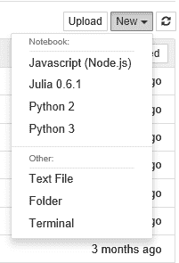

+   `文本文件`选项用于将文本文件添加到当前目录。Jupyter 会为你打开一个新的浏览器窗口，运行一个文本编辑器。输入的文本会自动保存，并显示在你的笔记本文件和目录显示中：

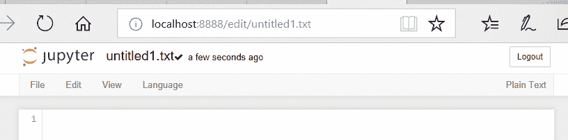

默认的文件名`untitled1.txt`是可以编辑的。请注意，文件名与笔记本的标题对应。

+   `文件夹`选项创建一个名为“未命名文件夹”的新文件夹。记住，所有文件和文件夹名称都是可以编辑的：

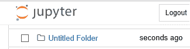

+   `终端`选项用于打开一个新的终端（命令）窗口。Windows 机器上的显示效果如下：

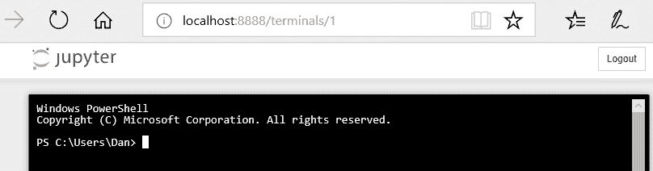

+   `Python 3`选项用于启动一个新的 Python 3 笔记本。界面如下所示。你可以完全编辑你的脚本文件，包括保存为新文件。你还拥有一个完整的 IDE 来编写 Python 脚本：

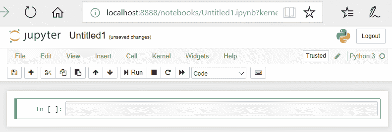

请注意，像`文本文件`和`文件夹`选项一样，你已经在笔记本中创建了一个 Python 脚本文件，并且它正在运行！（你可以在 Jupyter 的主页显示中看到这一点）：

+   `刷新笔记本列表`按钮用于更新显示。其实并不太需要，因为显示会自动响应底层文件结构的任何变化。

+   在文件标签的顶部有一个复选框，一个下拉菜单和一个首页按钮。

+   复选框用于切换项目列表中的所有复选框。

+   下拉菜单呈现一个可用选择的列表，即`文件夹`、`所有笔记本`、`运行中`和`文件`，如下所示：

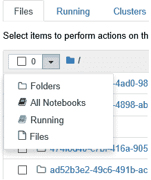

+   文件夹选择将选择显示中的所有文件夹，并在小框中显示文件夹的数量。

+   `所有笔记本`选择将把计数更改为笔记本的数量，并为你提供五个选项：

    +   复制（选定的笔记本）

    +   关闭（选定的笔记本）

    +   查看（选定的笔记本）

    +   编辑（选定的笔记本）

    +   删除（垃圾桶图标；选定的笔记本）

+   你可以在下面的截图中看到它们：

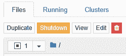

+   运行选择将选择显示中的所有运行脚本，并更新计数为所选脚本的数量：


+   文件选择将选择笔记本显示中的所有文件，并相应地更新计数。

+   “主页”按钮将带您返回到 Notebook 的主页屏幕。

+   每个项目的左侧都有一个复选框、一个图标和项目名称：

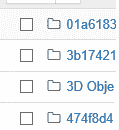

+   复选框用于构建一组文件以供操作。

+   图标指示了项目的类型。在这种情况下，所有的项目都是文件夹。

+   项目的名称对应于对象的名称。在这种情况下，文件名与磁盘上的文件名一致。

# 安装 Jupyter

Jupyter 需要安装 Python（毕竟它是基于 Python 语言的）。有一些工具可以通过图形界面自动安装 Jupyter（并可选地安装 Python）。在这里，我们将展示如何使用 Anaconda 安装 Jupyter，Anaconda 是一个用于分发软件的 Python 工具。

首先，您需要安装 Anaconda。它可以在 Windows 和 macOS 环境下使用。从 [`www.continuum.io/`](https://www.continuum.io/)（生产 Anaconda 的公司）下载可执行文件并运行，以安装 Anaconda。务必选择使用 Python 3.x 的 Anaconda 版本，而不是 Python 2.x 版本。该软件提供了常规的安装设置过程，如下所示：

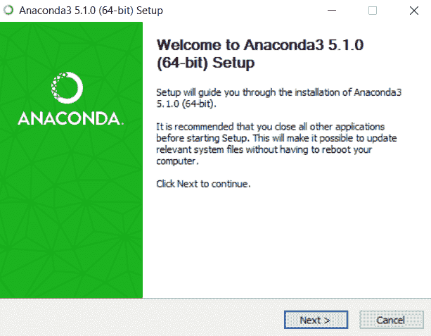

安装过程会经过常规的步骤，要求您同意分发权利许可：

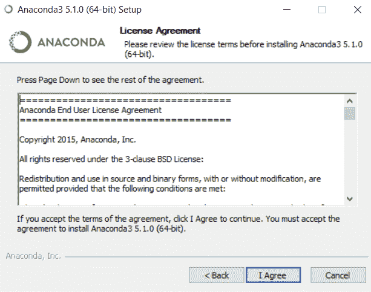

标准的 Windows 安装允许您决定所有用户是否都能在该机器上运行新软件。如果您与其他具有不同权限级别的用户共享一台机器，您可以根据需要选择适当的操作：

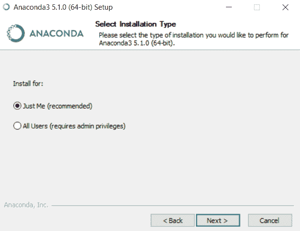

点击“下一步”后，它会要求您选择软件的安装位置（我几乎总是保持默认路径）：

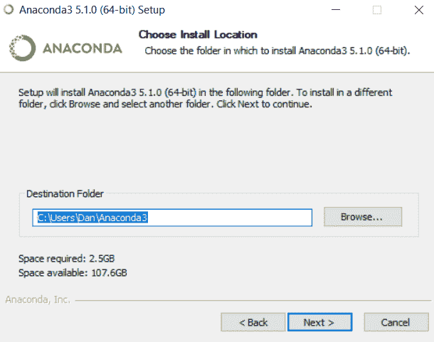

Anaconda 还会调整您的文件路径，使得您可以通过下一个对话框在计算机的任何位置访问 Anaconda，具体如下：

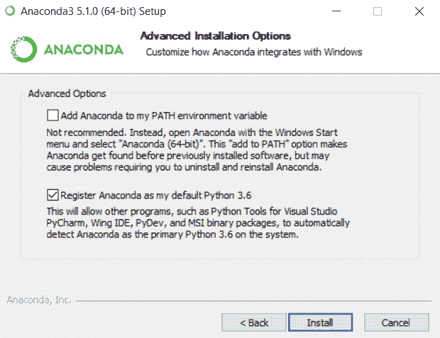

安装过程将开始。这可能需要一些时间，具体取决于您的计算机配置和网络连接：

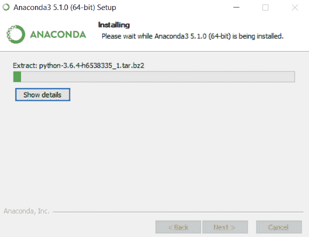

最终，您会看到安装完成的屏幕，如下所示：

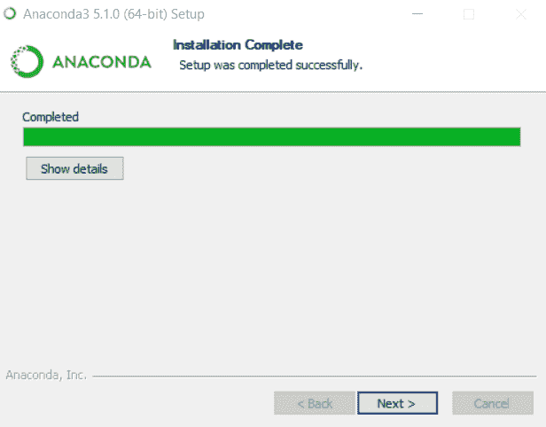

在 Windows 上，Anaconda 利用了 Visual Development Environment 的半内建功能，以本地方式访问 Windows 服务。它会通过以下对话框请求许可：

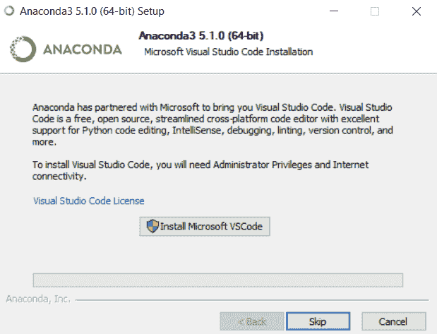

现在我们已经真正安装了 Jupyter：

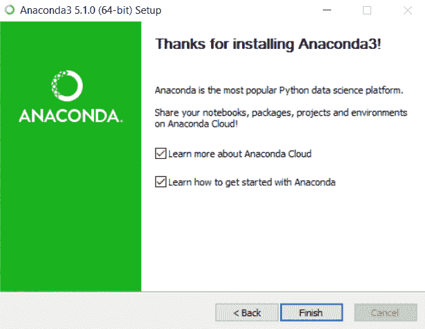

Anaconda 将启动。Anaconda 是一个出色的包装程序，包含了多个工具的分发。对我们来说，重要的工具是 Jupyter。Anaconda 显示了可用工具的状态，是否需要安装，并为每个工具提供了一个起始位置。

你可以直接通过在终端窗口中使用 **`> jupyter notebook`** 命令来启动 Jupyter。

如果我们从 Anaconda 界面选择 Jupyter，它将在一个新的浏览器窗口中启动 Jupyter：

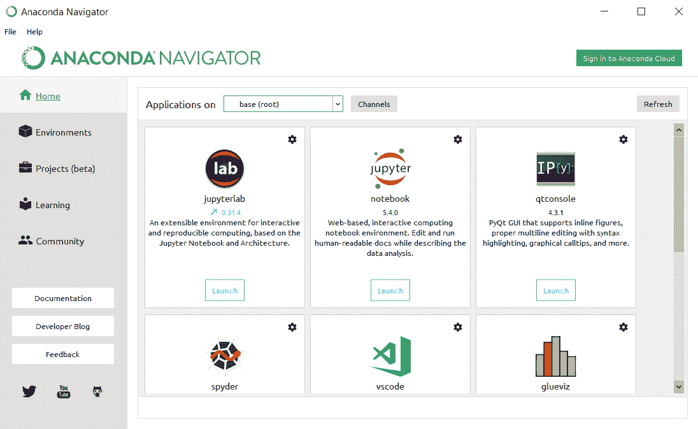

当 Jupyter 正在运行时，我们可以通过使用文件 | 关于 菜单来获取一些关于安装的详细信息，该菜单会提供一个对话框，显示如下 Jupyter 安装的详细信息：

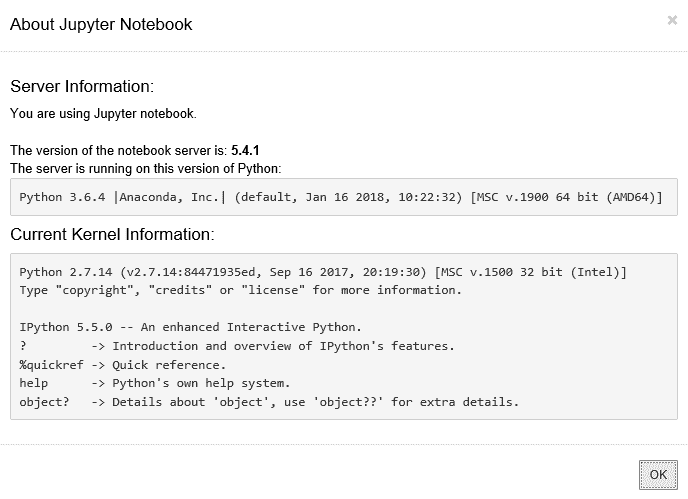

如果你直接从命令行启动 Jupyter，Jupyter 将在一个新的浏览器窗口中打开，你会看到一些日志条目显示在终端窗口中，显示你使用过程中的进度：

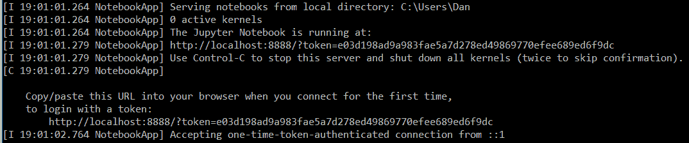

请注意，日志的最后一行是停止服务器时必须使用的指令（在运行服务器的命令行窗口中按 *Ctrl* + *C*）。

如果你在该窗口按 *Ctrl* + *C*，Jupyter 服务器将优雅地关闭：

```py
[W 17:26:36.688 NotebookApp] 404 GET /favicon.ico (::1) 62.00ms referer=None 
[W 17:26:36.750 NotebookApp] 404 GET /favicon.ico (::1) 0.00ms referer=None 
[I 17:28:24.891 NotebookApp] Interrupted... 
[I 17:28:24.891 NotebookApp] Shutting down kernels 
```

你会注意到，Anaconda 包已经被安装在你的应用程序菜单中以供进一步使用：

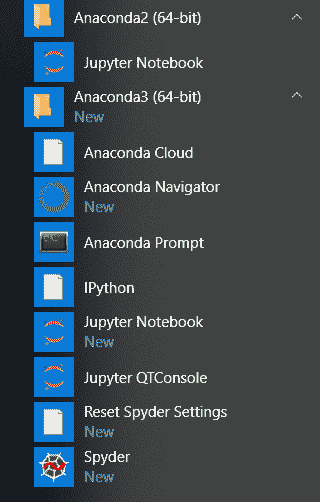

# Notebook 结构

Jupyter Notebook 本质上是一个包含多个注释的 JSON 文件。Notebook 的主要部分如下：

+   **元数据**：用于设置和显示 Notebook 的定义数据字典

+   **Notebook** **格式**：用于创建 Notebook 的软件版本号（版本号用于向后兼容）

+   **单元格列表**：有不同类型的单元格，包括 Markdown（显示）、代码（执行）和输出（代码类型单元格的输出）

# Notebook 工作流

典型的工作流程如下：

+   为项目或数据分析创建一个新的 Notebook。

+   添加你的分析步骤、编码和输出。

+   用组织性和呈现性的 Markdown 包围你的分析，以讲述一个完整的故事。

+   互动式 Notebook（包括小部件和显示模块）将由其他人使用，通过修改参数和数据来记录他们更改的效果。你的 Markdown 会展示用户可能想要调查的案例以及可能的结果。

# 基本的 Notebook 操作

本节将描述你可以在 Jupyter Notebook 上执行的不同操作。大多数操作是菜单功能，将相应地更改你的显示。

# 文件操作

让我们一起浏览基本的文件操作。

在文件选项卡中，我们可以看到当前 Notebook/磁盘文件夹中的文件和文件夹列表。如果我们选择（勾选）其中一个文件，我们会看到左上角的菜单发生变化：

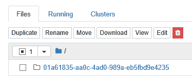

现在我们有复制、重命名和删除（垃圾桶图标）的选项。请注意，选中的文件数（1）也会显示在框中。

# 复制

如果我们点击重复按钮，将出现一个确认提示框，显示已选中的文件名用于复制：

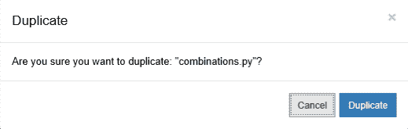

取消将关闭对话框。重复将创建另一个文件副本，并附加副本编号，如下图所示。原始文件名已被使用，并在文件名中添加了`-Copyn`，其中 n 是副本编号。请注意，新文件中保持了原始文件扩展名`.py`：


# 重命名

同样，如果我们点击重命名按钮，另一个对话框将提示输入新的文件名。主文件名已被高亮显示，因为假设你希望保留文件扩展名，因为文件类型没有变化：

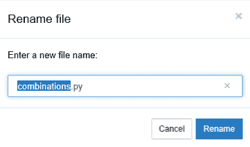

# 删除

我们还可以通过点击垃圾桶图标删除文件。这会弹出一个确认对话框如下所示。我喜欢他们把删除按钮的背景改为红色，以确保你不会轻易点击它：


在屏幕的右上角，我们有上传和新建选项。

# 上传

上传按钮在笔记本存储在网页服务器上时更有意义。在桌面上运行时，它可以让你轻松地将文件从笔记本的一个部分移动到另一个部分。如果点击这个按钮，你将看到一个文件选择对话框。下面的截图是特定于 Windows 环境的，但在 macOS 上会显示类似的界面。选择文件后，它将被添加到你的笔记本空间中：

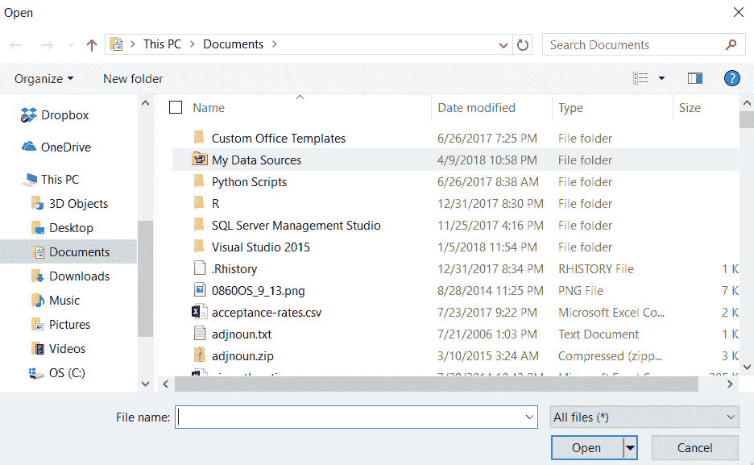

# 新建文本文件

如果我们选择创建一个文本文件，我们会看到一个新的浏览器面板出现在 Jupyter 文本编辑器中（我已缩小屏幕尺寸以便显示适应本书的边界）：


在这个屏幕上有几个重点：

+   我们位于一个新的浏览器面板中（笔记本显示仍然位于其他标签中）。

+   新文件的名字是`untitled1.txt`。使用与复制相同的约定，新文件名以`untitled.txt`开头，并根据需要增加数字。

+   有趣的是，它会显示文件创建的时间。

+   在右上角，我们看到“纯文本”。所以，我们可能会期待看到其他文件类型的描述。

+   我们有一个新菜单，包括文件、编辑、视图和语言。

+   文件菜单有以下选项：

    +   新建：开始另一个新的文本窗口。

    +   保存：保存或更新当前文本文件到笔记本区域。

    +   重命名：更改文件的名字（不太可能，因为你通常会保留`untitledn`这样的名字）。

    +   下载：同样，如果笔记本运行在网络上，这个选项更为有意义。如同上传的解释，桌面版安装中的下载可以让你将文件复制到计算机的其他部分。

+   编辑菜单包含以下选项：

    +   查找：搜索字符串。

    +   查找与替换：搜索并替换字符串。

    +   分隔符：此行下方是调整当前使用的文本编辑器。

    +   键盘映射：为你的键盘设置自定义的功能映射。

    +   默认：已选中，因为它是默认选择。这意味着使用默认的文本编辑器。

    +   Sublime Text：如果你更倾向于使用 Sublime 编辑器。

    +   Vim：如果你更倾向于使用 Vim 编辑器。

    +   emacs：如果你更倾向于使用 emacs 编辑器。

+   视图菜单仅提供一个切换行号的选项。我想未来版本的包可能会有更多功能。类似地，对于其他文件类型，菜单可能会有所不同。

+   语言菜单允许你指定此文本文件是否为特定类型的编程文件。这可以启用语法高亮，这是源代码编辑器的一个主要功能。该列表内容丰富：

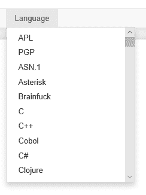

# 新建文件夹

文件夹选项会创建一个命名为`untitled`的文件夹。

# 新 Python 3

新的 Python 3 选项会创建一个新的 Python 3 笔记本。你将看到一个新的浏览器面板，命名方式与此类似，如下截图所示。

这是一种非常不同的展示方式，其中要求在页面的单元格中输入 Python 代码，并在每个单元格内显示结果。

菜单非常丰富，包含文件、编辑、视图、插入、单元格、内核和帮助选项。我们拥有一个相当完整的**集成开发环境**（**IDE**），用于创建 Python 编程：

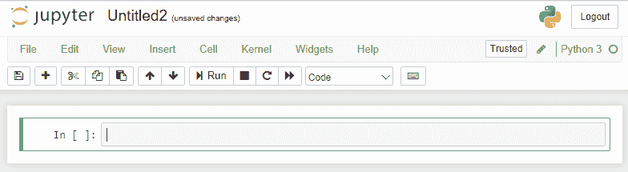

文件菜单包含以下选项：

+   新建笔记本：启动一个新的笔记本（另一个浏览器面板）

+   打开...：从笔记本文件视图中选择一个文件打开

+   另存为副本...：将当前笔记本完整复制到另一个浏览器面板

+   重命名...：重命名当前笔记本

+   保存并检查点：保存当前笔记本并记录检查点

检查点是保存笔记本所有信息的时间点。你可以有多个检查点，并随时将笔记本的状态恢复到之前的检查点状态。这是一个非常好的方式，让你在不担心丢失已完成工作的情况下，尝试新的分析思路。

+   恢复到检查点：将你的笔记本恢复到先前的检查点

+   打印预览：呈现笔记本打印格式的预览

+   另存为：将笔记本以多种格式下载：

    +   IPython 笔记本（其当前形式）

    +   IPython

    +   HTML 表示

    +   Markdown 是一种专门的显示格式

    +   REST – 重构文本，是一种易读的纯文本标记语言

    +   PDF

    +   演示

+   关闭并停止：关闭当前笔记本并停止所有正在运行的脚本

你笔记本中的每个矩形工作区都是一个单元格。最内层的文本区域是你输入代码的地方。下方（但仍在矩形框内），将显示每次代码运行的结果。

+   编辑菜单包含以下选项：

    +   复制单元格：将剪贴板中的单元格复制到当前光标位置。

    +   粘贴单元格到上方：将剪贴板中的单元格粘贴到当前单元格上方。

    +   粘贴单元格到下方：将剪贴板中的单元格粘贴到当前单元格下方。

    +   粘贴单元格并替换：将剪贴板中的单元格粘贴到当前单元格上方并替换它。

    +   删除单元格：删除当前单元格。

    +   撤销删除单元格：撤销上次删除单元格的操作。

    +   拆分单元格：从当前光标位置拆分单元格。

    +   合并上方单元格：将当前单元格与上方的单元格合并。

    +   合并下方单元格：将当前单元格与下方的单元格合并。

    +   编辑笔记本元数据：每个笔记本都有底层元数据，描述了笔记本的特性。高级用户可以直接操作这些数据，以便更容易地调整功能。例如，当前的笔记本元数据如下图所示：

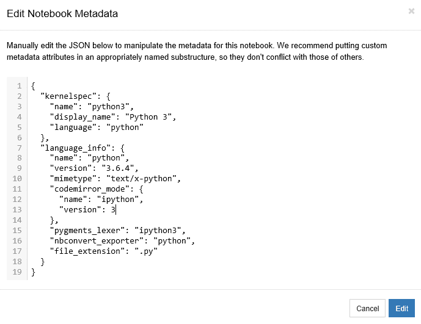

+   查找和替换：允许在选定的单元格中进行查找和替换。此功能有一个标准化的对话框，如下图所示：

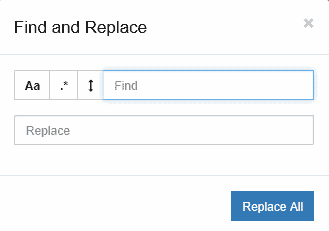

+   如前所示，参数及其功能如下：

    +   Aa 图标切换决定是否进行大小写不敏感的搜索

    +   *图标切换*决定是否进行正则表达式搜索

    +   堆叠线条图标切换决定是否进行替换

    +   查找文本框用于输入搜索条件

    +   替换文本框用于输入替换文本

+   视图菜单包含以下选项：

    +   切换标题：切换 Jupyter 徽标和文件名的显示

    +   切换工具栏：切换工具栏的显示

    +   单元格工具栏：切换单元格操作图标的显示

+   插入菜单包含以下选项：

    +   在上方插入单元格：在当前单元格上方添加一个新单元格

    +   在下方插入单元格：在当前单元格下方添加一个新单元格

+   单元格菜单包含以下选项：

    +   运行单元格：运行选定的（或所有）单元格。

    +   运行单元格并选择下方：运行当前单元格及其以下的单元格，并在下方创建一个新单元格。

    +   运行单元格并插入下方：运行当前单元格并在上方创建一个新单元格。

    +   运行所有：运行所有单元格。

    +   运行所有上方单元格：运行当前单元格之前的所有单元格。

    +   运行所有下方单元格：运行当前单元格以下的所有单元格。

    +   单元格类型：将选定单元格的类型更改为代码、Markdown 或 NBConvert。会显示一个自动消息，说明所有单元格默认是代码类型。

    +   当前输出和所有输出具有切换显示的选项。

+   内核菜单包含以下选项：

    +   中断：向内核发送键盘中断，*Ctrl* + *C*。如果你的代码进入了无限循环，这非常有用。

    +   重启：重启内核。

    +   重启并清除输出：重新启动内核并清除所有输出。

    +   重启并运行所有：重启内核并运行所有单元格。

    +   重新连接：重新连接到远程笔记本。

    +   更换内核：目前只有 Python 2 可用，因此此选项不适用。

+   帮助菜单有以下选项：

    +   用户界面教程：带领用户完成界面巡览

    +   键盘快捷键：展示内置的键盘快捷键列表

    +   笔记本帮助：展示关于笔记本的帮助主题

    +   Markdown：描述笔记本中可用的 markdown

    +   Python 参考文献，IPython 参考文献，NumPy 参考文献，SciPy 参考文献，Matplotlib 参考文献，SymPy 参考文献，Pandas 参考文献：关于笔记本中可使用的各种语言和包的帮助主题

    +   关于：标准的关于框

菜单下方有一个图标面板，包含前述功能的快捷图标：

+   **软盘图标**：保存并创建检查点。

+   **加号**：在下方插入单元格。

+   **剪刀**：剪切选中的单元格。

+   **重复页面**：复制选中的单元格。

+   **向上箭头**：将选中的单元格上移。

+   **向下箭头**：将选中的单元格下移。

+   **像扬声器的图标**：运行当前单元格。

+   **黑色方块**：中断内核。

+   **圆形箭头**：重启内核（带对话框）。

+   用于显示特性的下拉菜单：

    +   代码

    +   Markdown

    +   原始 NBConvert

    +   标题

+   **键盘**：打开命令面板。

+   更改当前使用的工具栏。点击单元格工具栏按钮会自动显示视图菜单中的单元格工具栏选项。

# Jupyter 的安全性

Jupyter 笔记本是为了与其他用户共享而创建的，通常是通过互联网进行分享。然而，Jupyter 笔记本能够执行任意代码并生成任意代码。如果笔记本中包含恶意部分，这可能会成为问题。Jupyter 笔记本的默认安全机制包括以下内容：

+   原始 HTML 总是经过清理（检查是否有恶意代码）。更多信息请访问 [`developers.google.com/caja`](https://developers.google.com/caja)。

+   你无法运行外部 JavaScript。

+   单元格内容（特别是 HTML 和 JavaScript）不被信任（需要用户验证才能继续）。

+   任何单元格的输出都不被信任。

+   所有其他 HTML 或 JavaScript 永不被信任，且清除输出后，保存时笔记本会变为信任状态。

# 安全摘要

笔记本还可以使用安全摘要，确保正确的用户正在修改内容。摘要会考虑整个笔记本内容和一个密钥（仅笔记本创建者知道）。这种组合确保恶意代码不会被添加到笔记本中。

你可以通过以下命令为笔记本添加安全摘要：

```py
~/.jupyter/profile_default/security/notebook_secret 
```

在此，你需要将 `notebook_secret` 部分替换为你的密钥。

# 信任选项

你可以通过使用以下命令行选项，特定地将信任应用到笔记本上：

```py
jupyter trust /path/to/notebook.ipynb 
```

或者，你可以在打开笔记本后，通过“文件 | 信任笔记本”菜单选项进行设置。

# Jupyter 配置选项

你可以配置一些在展示 Notebook 时使用的显示参数。这些参数是可配置的，原因是 Notebook 使用了一个产品（**CodeMirror**）来展示和修改内容。CodeMirror 是一个基于 JavaScript 的编辑器，用于网页（Notebook）中。

可配置选项的列表仍在开发中。以下是一些选项：

+   行分隔符：用于分隔文本行的字符

+   主题：Notebook 中使用的整体展示主题

+   缩进单位：用于缩进代码块的空格数

若要更改某个选项的配置，你可以打开浏览器的 JavaScript 窗口，输入修改选项的代码，然后加载你的 Notebook。接下来，你所做的修改将会应用到 Notebook 的展示中。关于这一点的进一步文档可以参考 [`codemirror.net/doc/manual.html#option_indentUnit.`](https://codemirror.net/doc/manual.html#option_indentUnit.)

例如，要更改 Notebook 的缩进（缩进单位），你可以使用以下 JavaScript：

```py
var mycell = Jupyter.notebook.get_selected_cell(); 
var cell_config = mycell.config; 
var code_patch = { 
      CodeCell:{ 
        cm_config:{indentUnit:2} 
      } 
    } 
cell_config.update(code_patch) 
```

你现在已经看到了在 Jupyter Notebook 中可以使用的所有标准操作。

# 摘要

在本章中，我们研究了 Notebook 中可用的各种用户界面元素。我们学习了如何在 macOS 或 Microsoft PC 上安装软件。我们了解了 Notebook 的结构。我们看到了开发 Notebook 时使用的典型工作流程，并走访了 Notebook 中可用的用户界面操作。最后，我们了解了一些高级用户可以用来配置 Notebook 的选项。

在下一章中，我们将学习关于 Jupyter Notebook 中 Python 脚本编写的所有内容。
