# 第二章：Jupyter Python 脚本编写

Jupyter 最初是 IPython，一个交互式版本的 Python，用作开发环境。因此，当你在开发 Notebook 时，大多数 Python 的特性都可以使用。

在本章中，我们将覆盖以下主题：

+   基础 Python 脚本编写

+   Python 数据集访问（来自库）

+   Python pandas

+   Python 图形

+   Python 随机数

# Jupyter 中的基础 Python

我们必须打开 Notebook 的 Python 部分才能使用 Python 代码。因此，启动你的 Notebook，然后在右上角的菜单中选择 Python 3：

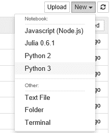

这将打开一个用于工作的 Python 窗口：

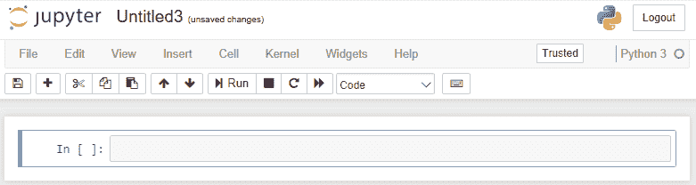

正如上一章所提到的，新窗口显示了一个空单元格，方便你输入 Python 代码。

给新的工作区命名为`Learning Jupyter 5, Chapter 2`。自动保存应该已开启（如你在标题旁边所见）。通过准确的命名，我们可以轻松地从 Notebook 首页再次找到这一部分。如果你选择浏览器的主页标签并刷新它，你将看到这个新窗口名称显示出来：

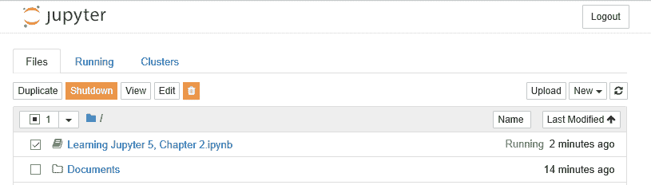

注意，它有一个 Notebook 图标，而不是文件夹图标。自动分配的扩展名是 `.ipynb`（Python Notebook）。并且，由于该项处于 Jupyter 环境中的浏览器中，因此它被标记为正在运行。你的磁盘目录中也有一个相同名称的文件：

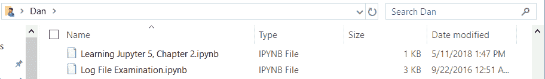

如果你在文本编辑器中打开 `.ipynb` 文件，你会看到 Jupyter 节点的基本内容（如在第一章的 *Notebook 结构* 部分中提到的，*Jupyter 入门*）。我们有一个空的单元格和关于 Notebook 的元数据：

```py
{ 
 "cells": [ 
 { 
   "cell_type": "code", 
   "execution_count": null, 
   "metadata": {}, 
   "outputs": [], 
   "source": [] 
  } 
 ], 
 "metadata": { 
  "kernelspec": { 
   "display_name": "Python 3", 
   "language": "python", 
   "name": "python3" 
  }, 
  "language_info": { 
   "codemirror_mode": { 
    "name": "ipython", 
    "version": 3 
   }, 
   "file_extension": ".py", 
   "mimetype": "text/x-python", 
   "name": "python", 
   "nbconvert_exporter": "python", 
   "pygments_lexer": "ipython3", 
   "version": "3.6.4" 
  } 
 }, 
 "nbformat": 4, 
 "nbformat_minor": 2 
} 
```

现在我们可以在单元格中输入 Python 代码。例如：

+   在第一个单元格中输入一些 Python 代码

+   在末尾添加一个新的单元格（使用“插入单元格上方”或“插入单元格下方”菜单命令）：

```py
   name = "Dan" 
   age = 37 
```

+   在第二个单元格中，输入引用第一个单元格中变量的 Python 代码：

```py
print(name + ' is ' + str(age) + ' years old.') 
```

+   然后我们将看到这个显示：

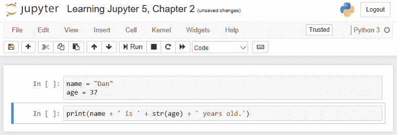

需要注意的是，Jupyter 会为你的 Python 代码着色（就像一个合格的编辑器一样），并且每个代码块的左侧都有这些空的括号。

如果我们执行“运行全部”，结果会以内联的形式显示出来：


现在我们已经填充了括号，显示了单元格编号，单元格的输出被附加在每个单元格的底部。需要注意的是，第二个单元格能够引用在第一个单元格中声明的变量。

如果我们等待自动保存启动或点击保存图标（最左边的软盘图标），我们将更新磁盘上的 `.pynb` 文件，并保存我们的结果：

```py
{ 
 "cells": [ 
  { 
   "cell_type": "code", 
   "execution_count": null, 
   "metadata": {}, 
   "outputs": [], 
   "source": [ 
    "name = \"Dan\"\n", 
    "age = 37" 
   ] 
  }, 
  { 
   "cell_type": "code", 
   "execution_count": null, 
   "metadata": {}, 
   "outputs": [], 
   "source": [ 
    "print(name + ' is ' + str(age) + ' years old.')" 
   ] 
  } 
 ], 
 "metadata... as above 
```

有趣的是，Jupyter 会跟踪最后一次生成的输出，并保存在文件的保存版本中。你也可以使用 Cell| All Output | Clear 命令来清除输出。

如果你重新运行单元格（使用 Cell | Run All），输出将被重新生成（并通过自动保存保存）。如果你这样做，单元格编号会递增——Jupyter 会跟踪每个单元格的最新版本。

同样，如果你关闭浏览器标签页，刷新主页标签页的显示，找到我们创建的新项目（`Learning Jupyter 5, Chapter 2.pynb`），并点击它，之前创建的新标签页将显示出来，展示我们上次运行时生成的输出。

如果你打开服务器命令行窗口（Jupyter 服务运行的地方），你会看到我们在会话中所做的操作列表：

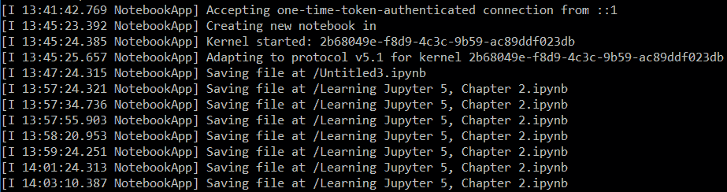

日志条目处于较高的级别。如果遇到困难，可能可以增加日志级别。

# Python 数据访问在 Jupyter 中

现在我们已经了解了 Python 在 Jupyter 中的工作方式，包括底层编码，那么 Python 如何在 Jupyter 中访问一个大型数据集呢？

我为 pandas 创建了另一个视图，使用 Python 数据访问作为名称。从这里开始，我们将读取一个大型数据集，并计算一些标准统计数据。我们感兴趣的是了解如何在 Jupyter 中使用 pandas，脚本的性能如何，以及元数据中存储了哪些信息（尤其是当数据集较大时）。

我们的脚本访问了一个内建于 Python 包中的`iris`数据集。我们要做的仅仅是读取略多数量的项目，并对数据集进行一些基本操作。我们真正感兴趣的是看到有多少数据被缓存到了`.pynb`文件中。

Python 代码如下：

```py
# import the datasets package 
from sklearn import datasets 

# pull in the iris data 
iris_dataset = datasets.load_iris() 
# grab the first two columns of data 
X = iris_dataset.data[:, :2] 

# calculate some basic statistics 
x_count = len(X.flat) 
x_min = X[:, 0].min() - .5 
x_max = X[:, 0].max() + .5 
x_mean = X[:, 0].mean() 

# display our results 
x_count, x_min, x_max, x_mean 
```

我将这些步骤分成了几个 Jupyter 单元格：

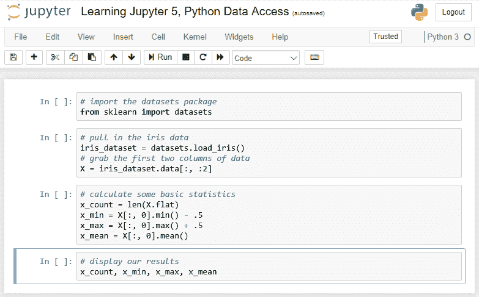

现在，运行单元格（使用 Cell | Run All），我们将看到以下显示。唯一的区别是最后一行输出，我们的值将在那里显示：

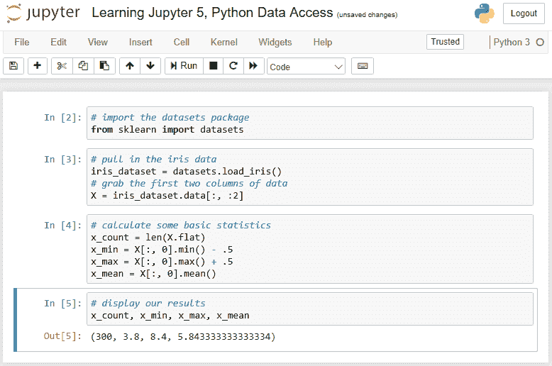

看起来加载库的时间（我第一次运行脚本时）比读取数据和计算统计数据的时间还要长。

如果我们查看这个 Notebook 的`.pynb`文件，我们会发现没有数据被缓存到`.pynb`文件中。我们只是有对库的代码引用、我们的代码和上次计算脚本时的输出：

```py
{ 
 "cells": [ 
  { 
   "cell_type": "code", 
   "execution_count": 2, 
   "metadata": {}, 
   "outputs": [], 
   "source": [ 
    "# import the datasets package\n", 
    "from sklearn import datasets" 
   ] 
  }, 
  { 
   "cell_type": "code", 
   "execution_count": 3, 
   "metadata": {}, 
   "outputs": [], 
   "source": [ 
    "# pull in the iris data\n", 
    "iris_dataset = datasets.load_iris()\n", 
    "# grab the first two columns of data\n", 
    "X = iris_dataset.data[:, :2]" 
   ] 
  }, 
  { 
   "cell_type": "code", 
   "execution_count": 4, 
   "metadata": {}, 
   "outputs": [], 
   "source": [ 
    "# calculate some basic statistics\n", 
    "x_count = len(X.flat)\n", 
    "x_min = X[:, 0].min() - .5\n", 
    "x_max = X[:, 0].max() + .5\n", 
    "x_mean = X[:, 0].mean()" 
   ] 
  }, 
  { 
   "cell_type": "code", 
   "execution_count": 5, 
   "metadata": {}, 
   "outputs": [ 
    { 
     "data": { 
      "text/plain": [ 
       "(300, 3.8, 8.4, 5.843333333333334)" 
      ] 
     }, 
     "execution_count": 5, 
     "metadata": {}, 
     "output_type": "execute_result" 
    } 
   ], 
   "source": [ 
    "# display our results\n", 
    "x_count, x_min, x_max, x_mean" 
   ] 
  } 
 ]... 
```

# Python pandas 在 Jupyter 中

Python 最广泛使用的功能之一是 pandas。pandas 是内建的数据分析库，可以自由使用。在这个示例中，我们将开发一个 Python 脚本，利用 pandas 来查看它们在 Jupyter 中的使用效果。

我使用的是[`www.kaggle.com/c/titanic/data`](https://www.kaggle.com/c/titanic/data)上的 Titanic 数据集。我确信其他来源也有相同的数据。

请注意，你必须注册**Kaggle**才能下载数据，且注册是免费的。

这是我们希望在 Jupyter 中运行的 Python 脚本：

```py
from pandas import * 
training_set = read_csv('train.csv') 
training_set.head() 
male = training_set[training_set.Sex == 'male'] 
female = training_set[training_set.Sex =='female'] 
womens_survival_rate = float(sum(female.Survived))/len(female) 
mens_survival_rate = float(sum(male.Survived))/len(male) 
womens_survival_rate, mens_survival_rate
```

结果是我们根据性别计算了乘客的生存率。

我们创建一个新的 Notebook，将脚本输入到适当的单元格中，在每个步骤中添加计算数据的显示，并生成我们的结果。

这是我们布局的 Notebook，在每个单元格中都添加了计算数据的显示：

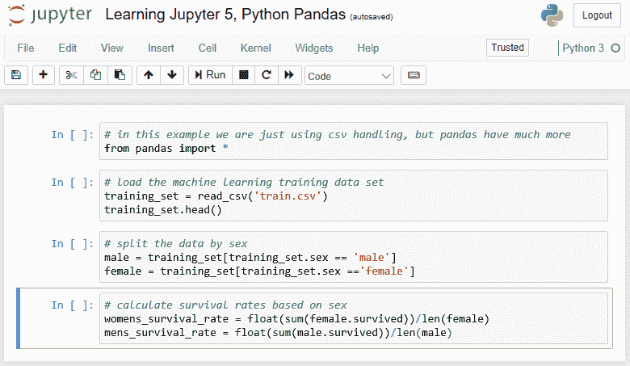

当我运行这个脚本时，我遇到了两个问题：

在 Windows 上，通常使用反斜杠（`\`）来分隔文件名的各部分。然而，这种编码将反斜杠用作特殊字符。因此，我不得不将`.csv`文件路径中的反斜杠改为正斜杠（`/`）。

数据集的列名直接来自文件，并且区分大小写。在这种情况下，我最初在脚本中使用了`sex`字段，但在`.csv`文件中，列名是`Sex`。类似地，我不得不将`survived`改为`Survived`。

当我们运行脚本时，最终的脚本和结果如下所示：

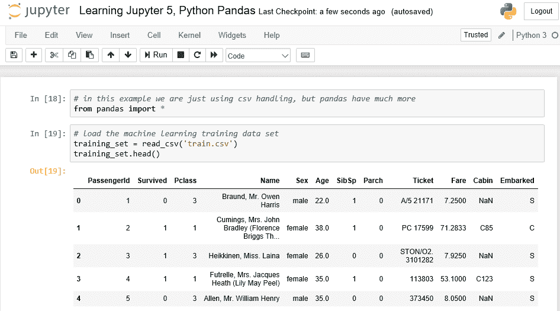

我使用了`head()`函数来显示数据集的前几行。很有趣的是，所有乘客的详细信息都能显示出来。

如果你向下滚动，你将看到结果：

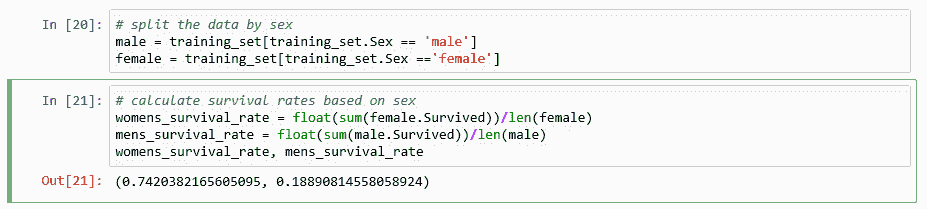

我们可以看到，74%的幸存者是女性，而只有 19%是男性。我希望绅士风度没有消失。

很奇怪，结果总和并不等于 100%。然而，就像我见过的其他数据集一样，这里也存在缺失和/或不准确的数据。

# Jupyter 中的 Python 图形

Python 图形如何在 Jupyter 中工作？

我为此开始了另一个视图，命名为 Python 图形*（s）*，以便区分这部分工作。

如果我们构建一个包含婴儿名字及该名字每年出生数量的样本数据集，我们就可以绘制出数据图表。

Python 编码很简单：

```py
import pandas 
import matplotlib 

%matplotlib inline 

# define our two columns of data 
baby_name = ['Alice','Charles','Diane','Edward'] 
number_births = [96, 155, 66, 272] 

# create a dataset from the to sets 
dataset = list(zip(baby_name,number_births)) 
dataset 

# create a Python dataframe from the dataset 
df = pandas.DataFrame(data = dataset, columns=['Name', 'Number']) 
df 

# plot the data 
df['Number'].plot() 
```

脚本的步骤如下：

1.  导入我们需要的图形库（和数据库）

1.  定义我们的数据

1.  将数据转换为一种便于图形显示的格式

1.  绘制数据

我们可以预期得到一个按婴儿名字分布的出生数量图表。

将之前的脚本放入 Jupyter 单元格后，我们得到如下结果：

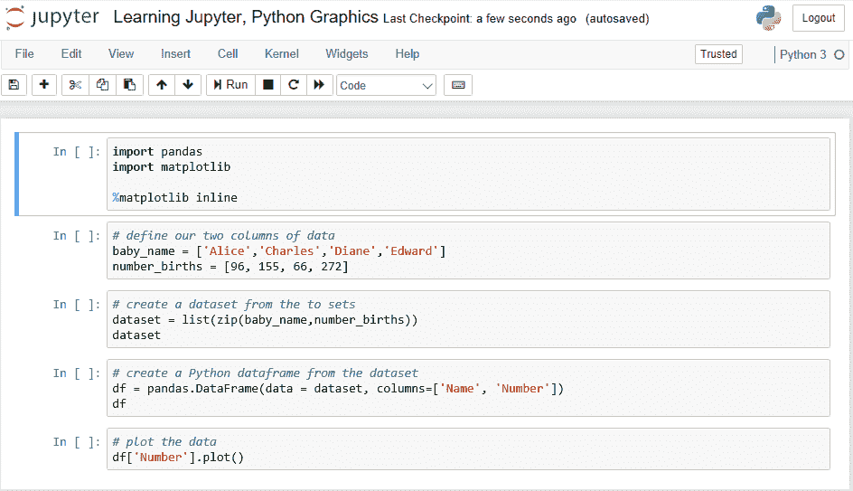

+   我将脚本拆分成不同的单元格，以提高可读性。拥有不同的单元格还允许你一步步地开发脚本，在每个步骤展示计算的值，以验证结果。我在大多数单元格中通过显示数据集和数据框来实现这一点。

+   当我们运行这个脚本（Cell | Run All）时，我们可以看到每一步的结果随着脚本的执行逐步显示：

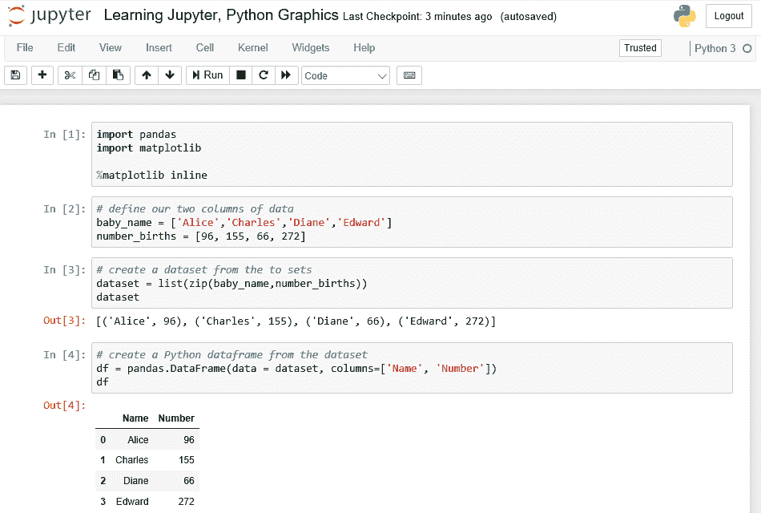

+   最终，我们可以看到我们的出生数据图：

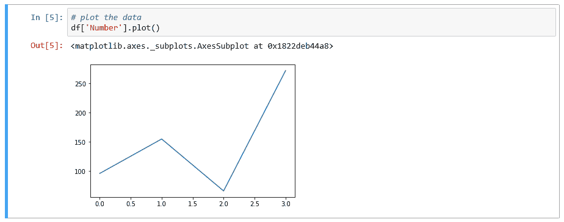

+   我对这个脚本存储了什么元数据感到好奇。通过查看 `.ipynb` 文件，你可以看到公式单元格的期望值。

+   数据框的表格数据以 HTML 格式方便地存储：

```py
...{ 
   "cell_type": "code", 
   "execution_count": 4, 
   "metadata": {}, 
   "outputs": [ 
    { 
     "data": { 
      "text/html": [ 
       "<div>\n", 
       "<style scoped>\n", 
       "    .dataframe tbody tr th:only-of-type {\n", 
       "        vertical-align: middle;\n", 
       "    }\n", 
       "\n", 
       "    .dataframe tbody tr th {\n", 
       "        vertical-align: top;\n", 
       "    }\n", 
       "\n", 
       "    .dataframe thead th {\n", 
       "        text-align: right;\n", 
       "    }\n", 
       "</style>\n", 
       "<table border=\"1\" class=\"dataframe\">\n", 
       "  <thead>\n", 
       "    <tr style=\"text-align: right;\">\n", 
       "      <th></th>\n", 
       "      <th>Name</th>\n", 
       "      <th>Number</th>\n", 
       "    </tr>\n",... 
```

+   图形输出单元格存储如下：

```py
  { 
     { 
   "cell_type": "code", 
   "execution_count": 5, 
   "metadata": {}, 
   "outputs": [ 
    { 
     "data": { 
      "text/plain": [ 
       "<matplotlib.axes._subplots.AxesSubplot at 0x1822deb44a8>" 
      ] 
     }, 
     "execution_count": 5, 
     "metadata": {}, 
     "output_type": "execute_result" 
    }, 
    { 
     "data": { 
      "image/png": "iVBORw0... 
"<a hundred lines of hexcodes> 
...VTRitYII=\n", 
      "text/plain": [ 
       "<matplotlib.figure.Figure at 0x1822e26a828>" 
      ] 
     },... 
```

其中 `image/png` 标签包含一个大型十六进制数字字符串表示屏幕上显示的图形图像（我在显示的代码中简化了这个显示）。因此，实际生成的图像存储在页面的元数据中。

所以，Jupyter 不是缓存，而是记住了每个单元格最后执行时的输出。

# Jupyter 中的 Python 随机数

对于许多分析，我们需要计算可重复的结果。然而，很多分析依赖于使用随机数。在 Python 中，你可以通过 `random.seed()` 函数设置 `seed` 来为随机数生成器实现可重复的结果。

在这个例子中，我们模拟掷一对骰子并观察结果。我们预计两个骰子的总和的平均值是六，这是两个面之间的中点。

我们使用的脚本如下：

```py
# using pylab statistics and histogram
import pylab
import random

# set random seed so we can reproduce results
random.seed(113)
samples = 1000

# declare our dataset store
dice = []

# generate and save the samples
for i in range(samples):
    total = random.randint(1,6) + random.randint(1,6)
    dice.append(total)

# compute some statistics on the dice throws
print("Throw two dice", samples, "times.")
print("Mean of", pylab.mean(dice))
print("Median of", pylab.median(dice))
print("Std Dev of", pylab.std(dice))

# display a histogram of the results
pylab.hist(dice, bins= pylab.arange(1.5,12.6,1.0))
pylab.xlabel("Pips")
pylab.ylabel("Count")
pylab.show()
```

一旦我们在 Jupyter 中执行脚本，我们将得到以下结果：

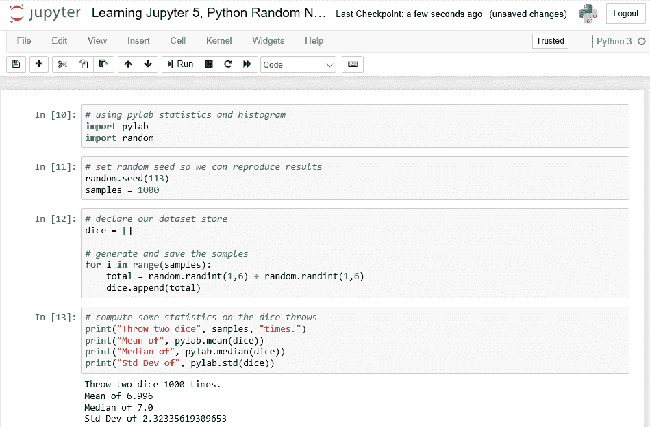

我增加了一些统计数据。我不确定我是否会依赖如此高的标准差。如果我们增加 `samples` 的数量，这个标准差会减少。

结果图形被打开在一个新窗口中，就像你在另一个 Python 开发环境中运行这个脚本时那样：

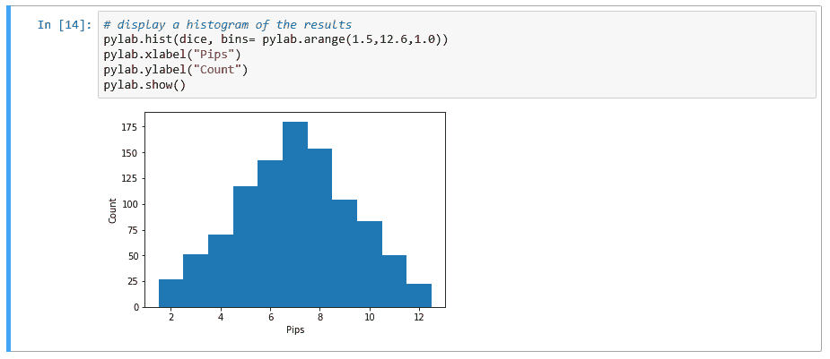

图形看起来比我预期的略显锯齿状，尤其是在一千个样本的情况下。

# 总结

在这一章中，我们介绍了一个简单的 Notebook 及其基础结构。然后，我们看了一个使用 pandas 的示例，并查看了图形示例。最后，我们看了一个使用 Python 脚本生成随机数的示例。

在下一章中，我们将学习在 Jupyter Notebook 中使用 R 脚本。
