# 第三章：Jupyter R 脚本

Jupyter 的本地语言是 Python。自从 Jupyter（在改名之前本质上是 IPython）因数据分析而变得流行后，许多人对在 Jupyter Notebook 中使用 R 编程分析工具套件产生了兴趣。

在本章中，我们将涵盖以下主题：

+   将 R 脚本添加到你的安装中

+   基本 R 脚本

+   R 数据集访问（来自一个库）

+   R 图形

+   R 聚类分析

+   R 预测

+   R 预测

# 将 R 脚本添加到你的安装中

两大安装平台是 macOS 和 Windows。针对这两个平台，添加 R 脚本到 Jupyter 的步骤是分开但相似的。

# 将 R 脚本添加到 macOS 上的 Jupyter

如果你在 macOS 上操作，你可以使用以下命令添加 R 脚本：

```py
conda install -c r r-essentials 
```

这将开始大规模安装 R 环境，其中包含许多常用的包：

```py
bos-mpdc7:~ dtoomey$ conda install -c r r-essentials 
Fetching package metadata: ...... 
Solving package specifications: ......... 

Package plan for installation in environment /Users/dtoomey/miniconda3: 
```

将下载以下包：

```py
 package                    |            build 
 ---------------------------|----------------- 
 jbig-2.1                   |                0          31 KB 
 jpeg-8d                    |                2         210 KB 
 libgcc-4.8.5               |                1         785 KB 
... <<many packages>> 
 r-caret-6.0_62             |        r3.2.2_0a         4.3 MB 
 r-essentials-1.1           |        r3.2.2_1a          726 B 
 ------------------------------------------------------------ 
 Total:       101.0 MB 
```

将安装以下新包：

```py
 jbig:           2.1-0 
 jpeg:           8d-2 
... <<many packages>> 
 r-xts:          0.9_7-r3.2.2_0a 
 r-yaml:         2.1.13-r3.2.2_1a 
 r-zoo:          1.7_12-r3.2.2_1a 
 zeromq:         4.1.3-0 

Proceed ([y]/n)? y 

Fetching packages ... 
jbig-2.1-0.tar 100% |################################| Time: 0:00:00   1.59 MB/s 
jpeg-8d-2.tar. 100% |################################| Time: 0:00:00   2.69 MB/s 
... <<many packages>> 
r-caret-6.0_62 100% |################################| Time: 0:00:00  11.16 MB/s 
r-essentials-1 100% |################################| Time: 0:00:00 537.43 kB/s 
Extracting packages ... 
[      COMPLETE      ]|###################################################| 100% 
Linking packages ... 
[      COMPLETE      ]|###################################################| 100% 
```

从那里，你可以像往常一样调用你的`notebook`：

```py
ipython notebook 
```

# 将 R 脚本添加到 Windows 上的 Jupyter

Anaconda 的默认安装不包含 R——我不确定为什么。安装 Anaconda 后，你需要使用命令行特别安装它。然后，我们将采取措施，添加 R 脚本，这与我们为 macOS 所做的非常相似：

```py
conda install -c r notebook r-irkernel 
```

这会生成一个更新的包的详细视图。在我的例子中，它安装了完整的 R 包和运行时，尽管我之前在机器上的其他地方使用过 R：

```py
C:\Users\Dan>conda install -c r notebook r-irkernel
Solving environment: done
==> WARNING: A newer version of conda exists. <==
current version: 4.4.10
latest version: 4.5.4
Please update conda by running
$ conda update -n base conda
## Package Plan ##
environment location: C:\Users\Dan\Anaconda3
added / updated specs:
- notebook
- r-irkernel The following packages will be downloaded:
package | build
-------------------|-----------------r-pbdzmq-0.2_6 | mro343h889e2dd_0 4.2 MB r
libxml2-2.9.8 | vc14_0 3.2 MB conda-forge
...
r-stringr-1.2.0 | mro343h889e2dd_0 143 KB r
r-repr-0.12.0 | mro343h889e2dd_0 68 KB r
r-irdisplay-0.4.4 | mro343h889e2dd_0 29 KB r
jpeg-9b | vc14_2 314 KB conda-forge
r-r6-2.2.2 | mro343_0 5.4 MB r
r-digest-0.6.13 | mro343h889e2dd_0 168 KB r
------------------------------------------------------------
Total: 140.2 MB
The following NEW packages will be INSTALLED:
mro-base: 3.4.3-0 r
r-crayon: 1.3.4-mro343h889e2dd_0 r
r-digest: 0.6.13-mro343h889e2dd_0 r
r-evaluate: 0.10.1-mro343h889e2dd_0 r
...
r-stringr: 1.2.0-mro343h889e2dd_0 r
r-uuid: 0.1_2-mro343h889e2dd_0 r
The following packages will be UPDATED:
_r-mutex: 1.0.0-anacondar_1 r --> 1.0.0-mro_2 r
jpeg: 9b-hb83a4c4_2 --> 9b-vc14_2 conda-forge [vc14]
libxml2: 2.9.7-h79bbb47_0 --> 2.9.8-vc14_0 conda-forge [vc14]
sqlite: 3.22.0-h9d3ae62_0 --> 3.22.0-vc14_0 conda-forge [vc14] r-base: 3.4.3-h6bb4b03_0 r --> 3.4.1-1 conda-forge
Proceed ([y]/n)? y
Downloading and Extracting Packages
r-pbdzmq 0.2_6: ########################################## | 100%
libxml2 2.9.8: ########################################### | 100%
r-irkernel 0.8.11: ####################################### | 100%
r-magrittr 1.5: ########################################## | 100%
r-evaluate 0.10.1: ####################################### | 100%
_r-mutex 1.0.0: ########################################## | 100%
...
r-digest 0.6.13: ########################################################## | 100%
Preparing transaction: done
Verifying transaction: done
Executing transaction: done
```

现在，当你启动 Jupyter 并下拉内核菜单时，你将看到 R 作为一个选项：

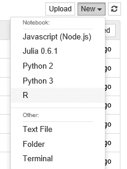

# 将 R 包添加到 Jupyter

Jupyter 下的标准 R 安装包含许多在 R 编程中常用的包。但是，如果你确实需要添加另一个包，需要按照少数几个步骤进行操作：

1.  关闭你的 Notebook（包括服务器）。

1.  在命令行窗口中，输入以下内容：

```py
R install.packages("name of the R package you want to add") 
quit() 
# answer Yes to save 
```

1.  重新启动你的 Notebook，包应该可以在你的 R 脚本中使用，例如，`library (name of the R package you want to add)`。

请注意，你可能仍然会遇到 R 的问题，即你安装的 R 的核心版本已经过时，因此你需要将其升级以使用特定的库。

# Jupyter 中的 R 限制

在本章中，我们使用了多种包，包括预安装的和专门为示例安装的。我使用了 Jupyter 下可用的各种 R 材料，并且没有发现任何限制；你可以在 Jupyter 中执行大部分标准 R 实现中能做到的步骤。唯一的限制是，当你使用*Shiny*或者试图使用大量 Markdown 时：

+   对于 Shiny，我认为你混淆了目的——Jupyter 和 Shiny 都提供 Web 体验——所以我不确定如何决定它是否应该工作。这个问题正在由 Jupyter 开发组处理。

+   使用大量 Markdown 似乎也不是一个好主意。Markdown 的目的是让 Notebook 开发者能够以更具表现力的方式增强标准的 R 输出。我认为，如果你在 Notebook 中加入了大量的 Markdown，你真的应该开发一个网站——也许使用 Shiny，然后你就能使用所有的 HTML Markdown 了。

# 在 Jupyter 中使用基础 R

启动一个新的 R Notebook 并将其命名为 `R Basics`。我们可以输入一个小脚本，以便查看 R 脚本步骤的进展。将以下内容分别输入到 Notebook 的不同单元格中：

```py
myString <- "Hello, World!" 
print (myString) 
```

从这里，你将得到一个看起来像这样的启动屏幕：

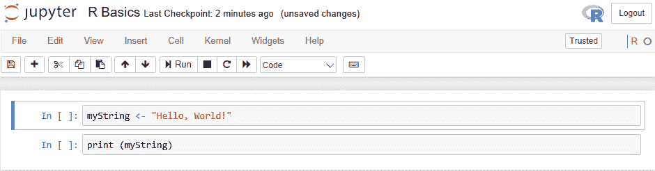

我们应该注意 R Notebook 视图的几个方面：

+   我们在右上角看到 R 标志。你将在其他 R 安装中看到这个标志。

+   下面的 R 图标下方还有一个特殊的 R O。如果 O 是未填充的圆圈，表示内核处于空闲状态；而填充的圆圈表示内核正在工作。

+   剩下的菜单项与我们之前看到的相同。

这是一个非常简单的脚本——在一个单元格中设置一个变量，然后在另一个单元格中打印出它的值。一旦执行（单元格 | 运行所有），你将看到你的结果：

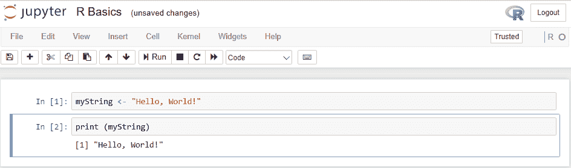

所以，就像在 R 解释器中运行脚本一样，你得到了输出（带有数字前缀）。Jupyter 已经对语句进行了编号，以便我们可以看到单元格的递增编号。Jupyter 并没有做任何特殊的事情来打印变量以供调试；你需要单独做这件事。

如果我们查看 R 服务器的日志语句（在启动 Jupyter 时创建了一个命令行窗口），我们将能够看到发生的操作：

```py
$ jupyter notebook 
[I 11:00:06.965 NotebookApp] Serving notebooks from local directory: /Users/dtoomey/miniconda3/bin 
[I 11:00:06.965 NotebookApp] 0 active kernels  
[I 11:00:06.965 NotebookApp] The Jupyter Notebook is running at: http://localhost:8888/ 
[I 11:00:06.965 NotebookApp] Use Control-C to stop this server and shut down all kernels (twice to skip confirmation). 
[I 11:00:17.447 NotebookApp] Creating new notebook in  
[I 11:00:18.199 NotebookApp] Kernel started: 518308da-460a-4eb9-9959-1411e31dec69 
[1] "Got unhandled msg_type:" "comm_open"               
[I 11:02:18.160 NotebookApp] Saving file at /Untitled.ipynb 
[I 11:08:27.340 NotebookApp] Saving file at /R Basics.ipynb 
[1] "Got unhandled msg_type:" "comm_open"               
[I 11:14:45.204 NotebookApp] Saving file at /R Basics.ipynb 
```

我们启动了服务器，创建了一个新的 Notebook，并将其保存为 `R Basics`。如果我们在磁盘上打开该 IPYNB 文件（使用文本编辑器），我们将能够看到以下内容：

```py
{ 
  "cells": [ 
    ...<similar to previously displayed> 
  ], 
  "metadata": { 
    "kernelspec": { 
      "display_name": "R", 
      "language": "R", 
      "name": "ir" 
    }, 
    "language_info": { 
      "codemirror_mode": "r", 
      "file_extension": ".r", 
      "mimetype": "text/x-r-source", 
      "name": "R", 
      "pygments_lexer": "r", 
      "version": "3.4.3" 
    } 
  }, 
  ...<omitted> 
} 
```

这与我们在前一章关于 Python Notebook 编程中看到的有所不同。特别地，元数据明确指示脚本单元格为 R 脚本。请注意，实际的单元格并不特定于某一种语言——它们只是按照元数据指令执行的脚本。

# R 数据集访问

在这个例子中，我们将使用 Iris 数据集。Iris 是 R 安装包中的内置数据集，可以直接使用。我们只需导入数据，收集一些简单的统计数据，并绘制数据图。这将展示 R 在 Jupyter 中访问数据集，使用 R 内置包，以及一些可用的统计数据（因为我们有 R），并与 R 图形进行交互。

我们将使用的脚本如下：

```py
data(iris) 
summary(iris) 
plot(iris) 
```

如果我们将这段小脚本输入到一个新的 R 笔记本中，我们将得到一个初始显示，类似如下所示：

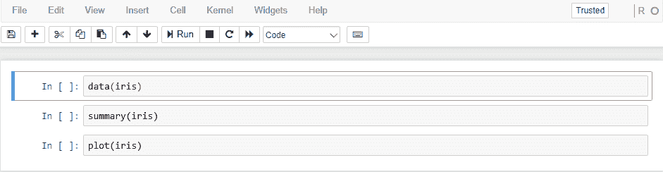

我预计输出会是标准的 R 统计摘要，并且我知道鸢尾花的图形非常有趣。我们可以在以下截图中清楚地看到发生了什么：

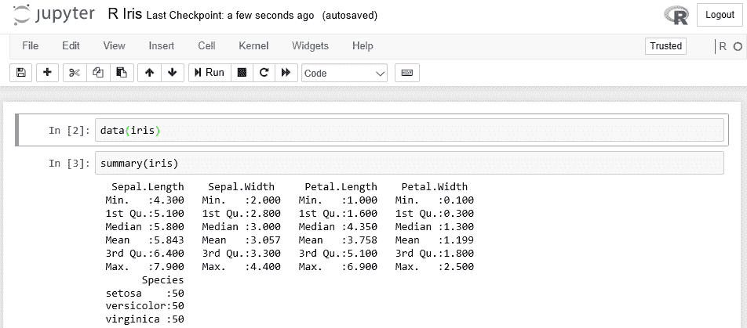

图形在以下截图中继续显示，因为它无法容纳在单一页面内：

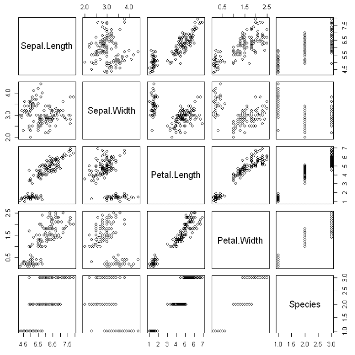

Jupyter 的一个特点是将较大的图形，例如这个，放置到一个视口中，只显示图像的一部分。我能够将图像从视口窗口中完全拖出并拍摄这张照片。你可以通过点击视口并拖动它，消除视口边界并显示整个输出。

# Jupyter 中的 R 可视化

R 的一个常见用途是使用多种可视化，这些可视化会根据底层数据而有所不同。在本节中，我们将介绍其中的一些，看看 R 如何与 Jupyter 互动。

# Jupyter 中的 R 3D 图形

一个可用于 3D 图形的包是 `persp`。`persp` 包绘制在二维空间上的透视图。

我们可以通过在新的笔记本中输入基本的 `persp` 命令，只需使用以下命令：

```py
example(persp) 
```

所以，我们将在笔记本中看到类似的内容：

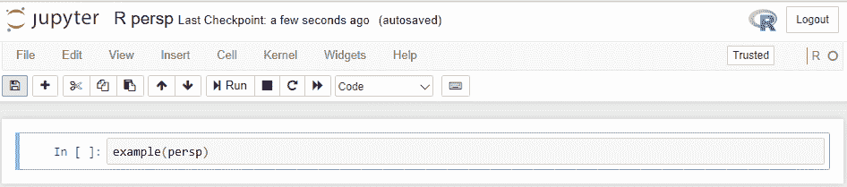

一旦我们运行步骤（Cell | Run All），我们将看到如下截图所示的显示。第一部分是生成图形的脚本（这是示例代码的一部分）：

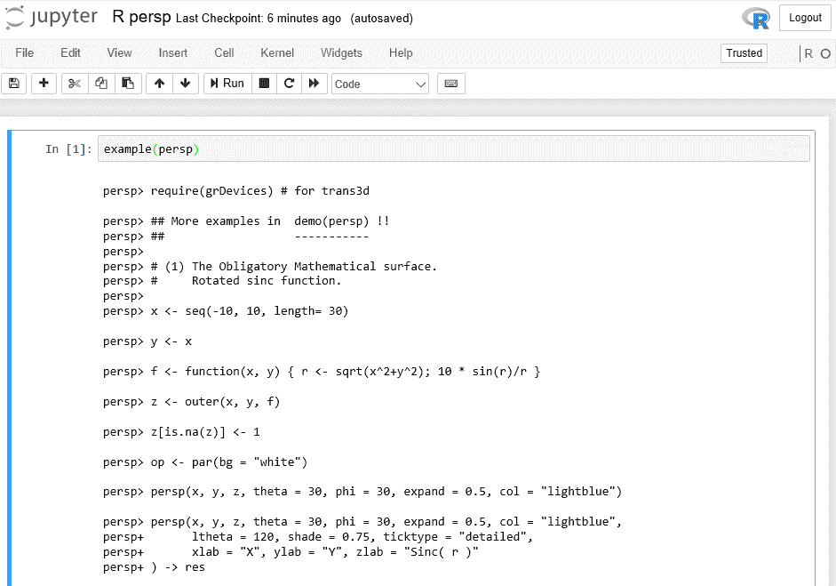

然后，我们将看到以下图形显示：

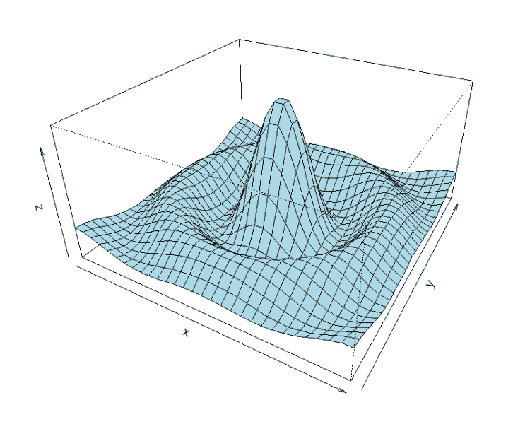

# Jupyter 中的 R 3D 散点图

R 的 `lattice` 包含一个 Cloud 函数，可以生成 3D 散点图。

我们将使用的脚本如下：

```py
# make sure lattice package is installed 
install.packages("lattice") 

# in a standalone R script you would have a command to download the lattice library - this is not needed in Jupyter 

library("lattice") 
# use the automobile data from ics.edu 
mydata <- read.table("http://archive.ics.uci.edu/ml/machine-learning-databases/auto-mpg/auto-mpg.data") 

# define more meaningful column names for the display 
colnames(mydata) <- c("mpg", "cylinders", "displacement", "horsepower", "weight", "acceleration", "model.year", "origin", "car.name") 

# 3-D plot with number of cylinders on x axis, weight of the vehicle on the y axis and miles per gallon on the z axis. 
cloud(mpg~cylinders*weight, data=mydata) 

```

在运行之前，我们将看到如下内容：

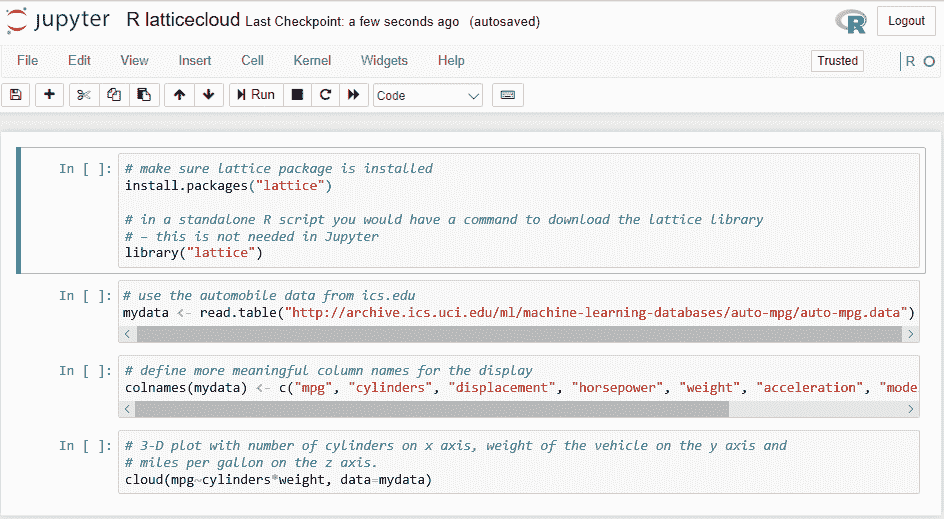

请注意，我们使用了标记类型单元格来注释脚本步骤。它们也没有在左侧列中标明脚本行号。

如果你将 R 脚本复制到 Jupyter 窗口中，可能会遇到一个问题，就是你使用的打印复制中包含非标准的双引号字符（左侧的引号倾向于左侧，而右侧的引号倾向于右侧）。一旦复制到 Jupyter 中，你需要将其更改为正常的双引号（它们不会倾斜，而是垂直的）。

运行此后，我们将看到以下显示：

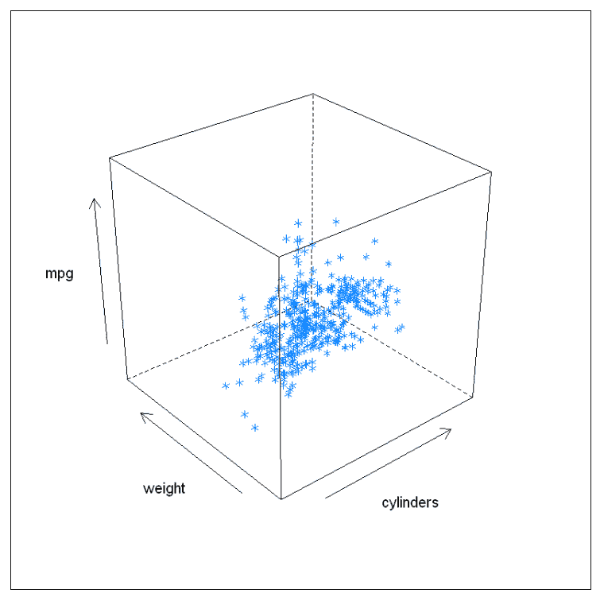

# R 聚类分析

在这个例子中，我们将使用 R 的聚类分析函数来确定来自 [`uci.edu/`](https://uci.edu/) 的小麦数据集的聚类。

我们想在 Jupyter 中使用的 R 脚本如下：

```py
# load the wheat data set from uci.edu 
wheat <- read.csv("http://archive.ics.uci.edu/ml/machine-learning-databases/00236/seeds_dataset.txt", sep="\t") 

# define useful column names 
colnames(wheat) <-c("area", "perimeter", "compactness", "length", "width", "asymmetry", "groove", "undefined") 

# exclude incomplete cases from the data 
wheat <- wheat[complete.cases(wheat),] 

# calculate the clusters 
set.seed(117) #to make reproducible results 
fit <- kmeans(wheat, 5) 
fit 
```

一旦输入到笔记本中，我们将看到如下内容：

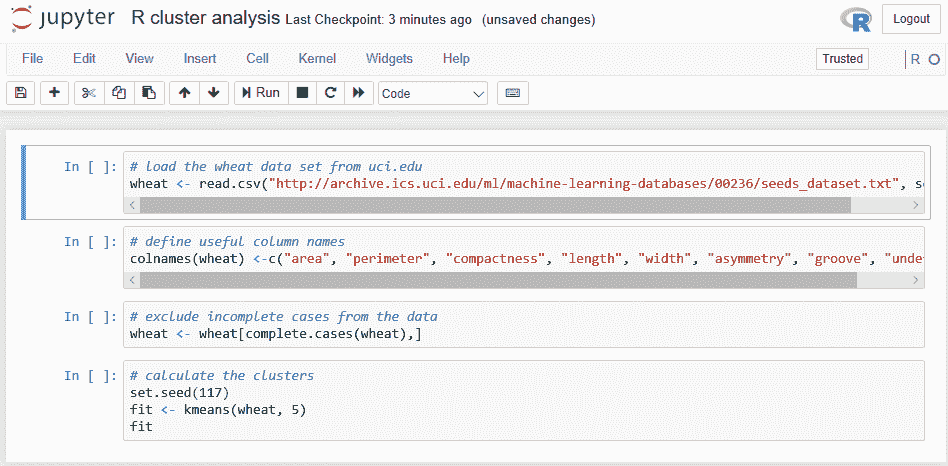

生成的聚类信息是使用 k-means 聚类，包含五个大小为 39、53、47、29 和 30 的聚类（注意，我设置了随机数的种子值，因此你的结果不会有所不同）：

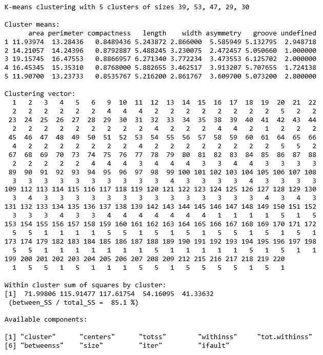

所以，我们生成了五个聚类的信息（传递到拟合语句中的参数）。聚类平方和变化很大，这有点麻烦。

# R 预测

在本示例中，我们将预测 Fraser River 的水位，数据来源于 [`datamarket.com/data/set/22nm/fraser-river-at-hope-1913-1990#!ds=22nm&display=line`](https://datamarket.com/data/set/22nm/fraser-river-at-hope-1913-1990#!ds=22nm&display=line)。我未能找到合适的来源，因此我手动从该网站提取了数据并存储到本地文件中。

我们将使用 R 的 `forecast` 包。你需要将此包添加到你的设置中（如本章开始时所述）。

我们将使用的 R 脚本如下：

```py
library(forecast) 
fraser <- scan("fraser.txt") 
plot(fraser) 
fraser.ts <- ts(fraser, frequency=12, start=c(1913,3)) 
fraser.stl = stl(fraser.ts, s.window="periodic") 
monthplot(fraser.stl) 
seasonplot(fraser.ts) 
```

本示例中感兴趣的输出是三个图表：简单图表、每月图表和计算的季节性图表。

当这被输入到笔记本中时，我们将得到一个熟悉的布局：

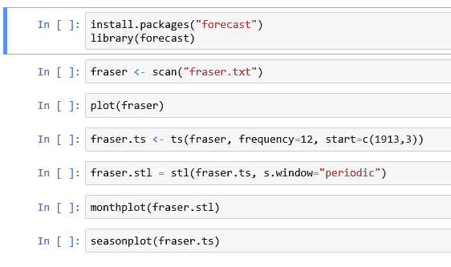

简单图表（使用 R 的 `plot` 命令）类似于以下截图所示。没有明显的组织或结构：

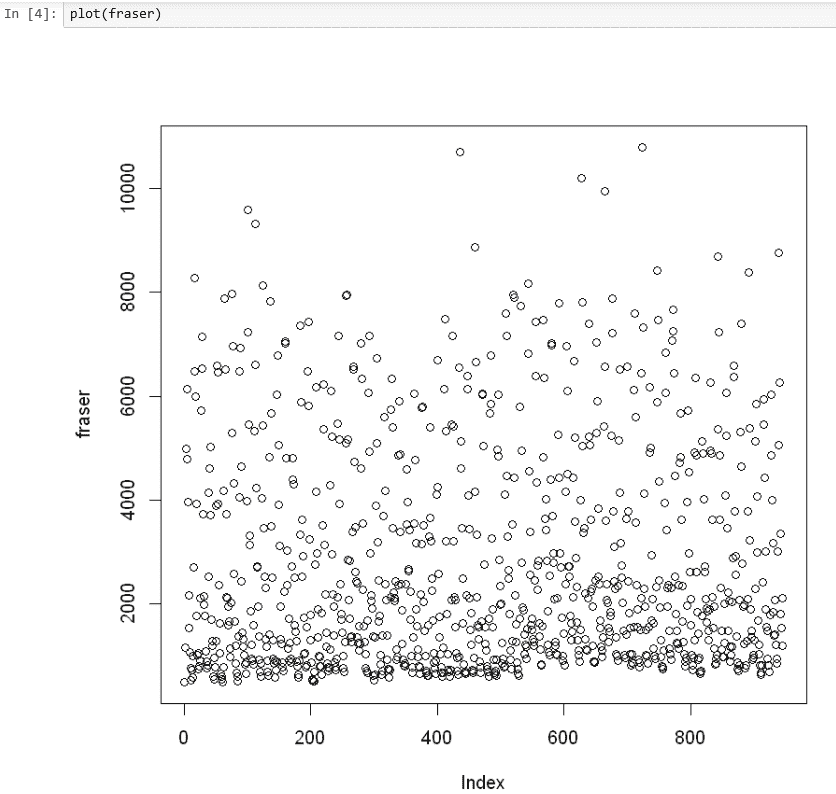

每月图表（使用 `monthplot` 命令）类似于以下截图所示。河流流量在一个月内似乎非常一致：

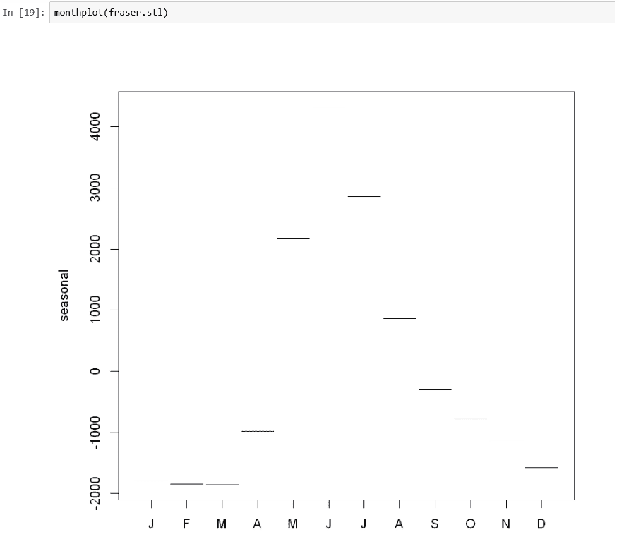

最后，`seasonalplot` 显示了我们试图预测的内容，即河流流量的明显季节性：

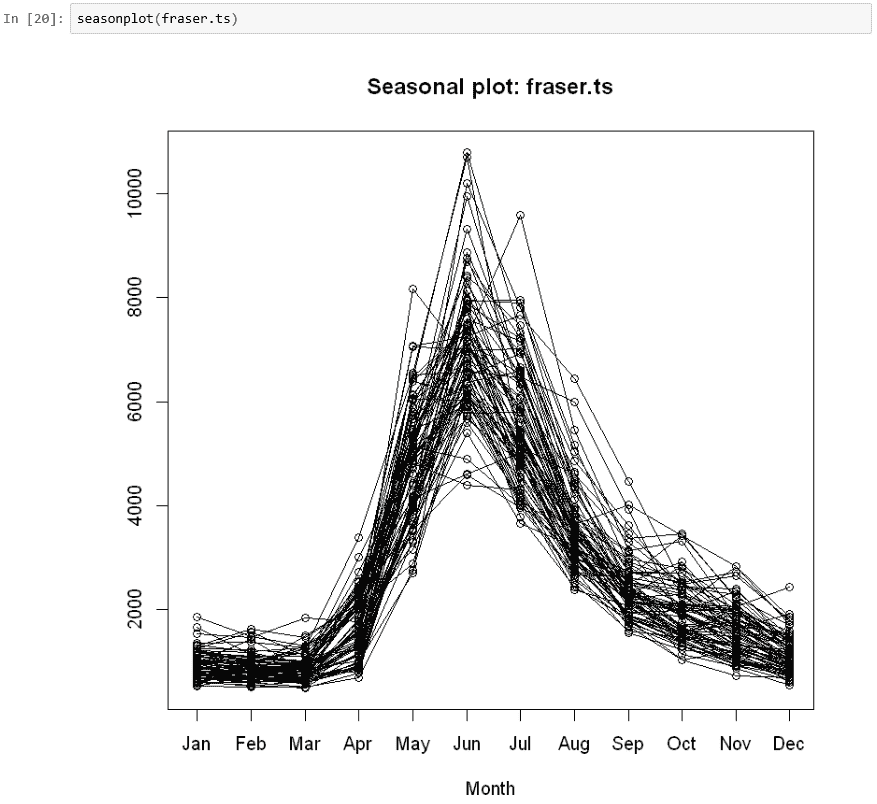

# R 机器学习

在本节中，我们将使用一种机器学习方法，具体如下：

+   将数据集划分为训练集和测试集

+   生成数据的模型

+   测试我们模型的效率

# 数据集

机器学习通过提供一个数据集来工作，我们将把它分成训练部分和测试部分。我们将使用训练数据来构建模型。然后，我们可以证明或测试该模型对测试数据集的适应性。

要使数据集可用，我们至少需要几百个观察值。我使用的是来自 [`uci.edu`](http://uci.edu) 的住房数据。让我们通过以下命令加载数据集：

```py
housing <- read.table("http://archive.ics.uci.edu/ml/machine-learning-databases/housing/housing.data") 
```

该网站记录了变量的名称如下：

| **变量** | **描述** |
| --- | --- |
| CRIM | 人均犯罪率 |
| ZN | 住宅区比例百分比 |
| INDUS | 城镇中非零售业务的比例 |
| CHAS | 到查尔斯河的距离（布尔值） |
| NOX | 氮氧化物浓度 |
| RM | 每个住宅的平均房间数 |
| AGE | 1940 年前建造的住房比例 |
| DIS | 到就业中心的加权距离 |
| RAD | 高速公路可达性 |
| 税收 | 每 $10,000 的税率 |
| B | *1,000(Bk-0.63)² Bk* 代表黑人群体的百分比 |
| LSTAT | 低收入人群百分比 |
| MEDV | 自住房屋的中位数价值（以千美元为单位） |

所以，让我们应用这些方法来理解数据：

```py
colnames(housing) <- c("CRIM","ZN","INDUS","CHAS","NOX","RM","AGE","DIS","RAD", "TAX", "PRATIO","B","LSTAT", "MDEV") 
```

现在，我们可以得到一个总结，以便更好地理解这些值：

```py
summary(housing) 
```

执行时，这会显示如下界面：

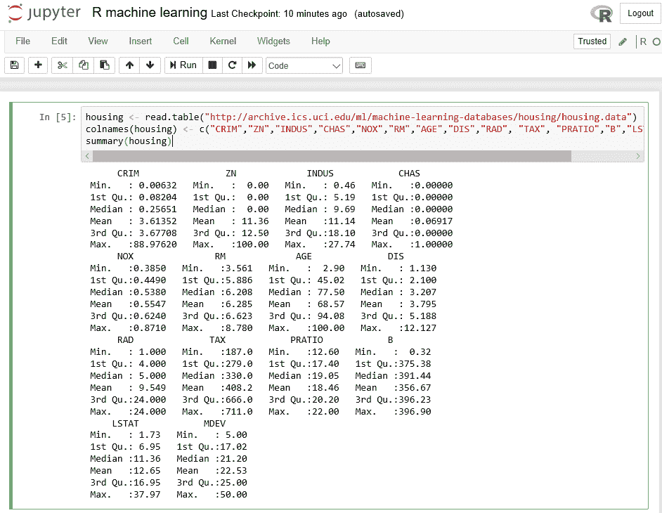

所以，数据有些过时。与该地区当前的房价相比，中位数值非常低。

此外，统计数据并不完全符合政治正确——B 因子是黑人群体的衡量标准。

总的来说，我们有相当多的变量。哪些变量可能是我们模型的候选者呢？我发现最好的工具是将每个变量与其他每个变量做简单的回归图。我们可以使用以下命令来实现：

```py
plot(housing) 
```

R 做了我们需要的操作，显示如下：

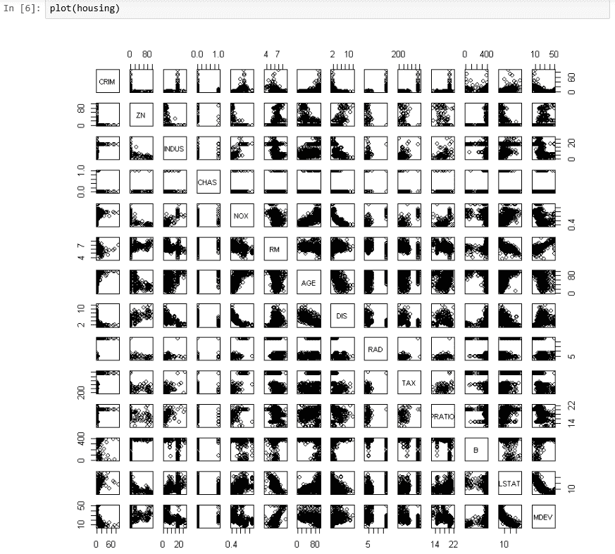

我们在寻找的是正相关或负相关，也就是说，我们在寻找一条大约 45 度的正线或负线。任何呈现杂乱无章、垂直或水平模式的都不会给我们提供有关数据的有用信息。

最好的相关性出现在 RAD（高速公路可达性）和 TAX（每千美元的税率）之间。幸运的是，大多数变量都显示出了良好的相关性。

由于房价是我们的衡量标准，让我们在划分数据之前，先按房价对数据进行排序，使用以下命令：

```py
housing <- housing[order(housing$MDEV),] 
```

我们将使用 caret 包来划分数据，所以让我们先加载它：

```py
install.packages("caret") 
library("caret") 
```

现在，我们可以划分数据：

```py
# set the random seed so we can reproduce results 
set.seed(311) 

# take 3/4 of the data for training 
trainingIndices <- createDataPartition(housing$MDEV, p=0.75, list=FALSE) 

# split the data 
housingTraining <- housing[trainingIndices,] 
housingTesting <- housing[-trainingIndices,] 

# make sure the paritioning is working 
nrow(housingTraining) 
nrow(housingTesting) 
381 
125 
```

划分计数看起来是正确的。让我们创建我们的模型，看看结果：

```py
linearModel <- lm(MDEV ~ CRIM + ZN + INDUS + CHAS + NOX + RM + AGE + DIS + RAD + TAX + PRATIO + B + LSTAT, data=housingTraining) 
summary(linearModel) 
```

这是前面代码的截图：

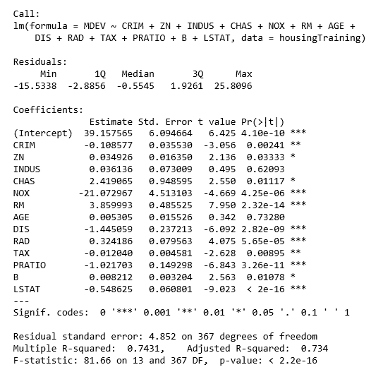

有趣的是，几个变量并没有产生太大影响。这些变量是`AGE`、`TAX`和`B`。

我们已经有了模型，现在可以进行预测：

```py
predicted <- predict(linearModel,newdata=housingTesting) 
summary(predicted) 
Min. 1st Qu. Median Mean 3rd Qu. Max.  
0.1378 17.4939 21.9724 22.0420 25.6669 40.9981 
```

我认为这个总结并没有告诉我们太多信息。将这两个变量对比（包括`abline`函数）的图表要更加具有信息量：

```py
plot(predicted, housingTesting$MDEV) 
abline(lm(predicted ~ housingTesting$MDEV)) 
```

这是前面代码的截图：

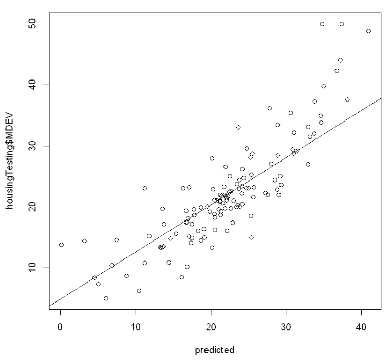

从视觉上来看，两个变量之间似乎有着极好的相关性。

我们做一些数学计算，看看我们有多接近真实值。平方和将为我们提供一个很好的衡量标准。我没有找到内建的方法，所以我加了我自己的：

```py
sumOfSquares <- function(x) { 
    return(sum(x²)) 
} 

#make sure it works 
sumOfSquares(1:5) 
15 
Testing our model: 
diff <- predicted - housingTesting$MDEV 
sumOfSquares(diff) 
2487.85072318584 
```

这里，我们得到了差异的平方和，大约为 2,500。对于几百个观测值来说，这个数值相当显著。

# 总结

在本章中，我们增加了在我们的 Jupyter 笔记本中使用 R 脚本的能力。我们添加了一个不包含在标准 R 安装中的 R 库，并编写了一个 R 的 Hello World 脚本。然后，我们看到了 R 数据访问的内置库，以及一些自动生成的简单图形和统计信息。我们使用一个 R 脚本以几种不同的方式生成了 3D 图形。然后，我们进行了标准的聚类分析（我认为这是 R 的基本用法之一），并使用了其中一个可用的预测工具。我们还建立了一个预测模型并测试了其准确性。

在下一章中，我们将学习如何在 Jupyter 笔记本中使用 Julia 脚本。
