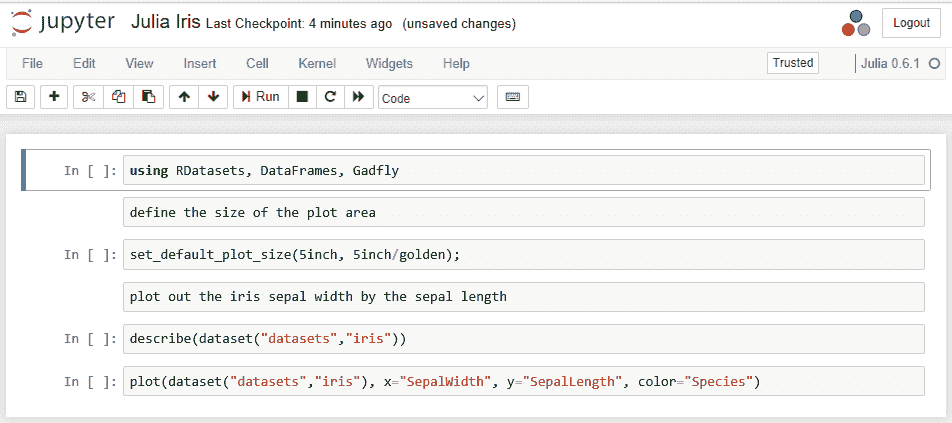
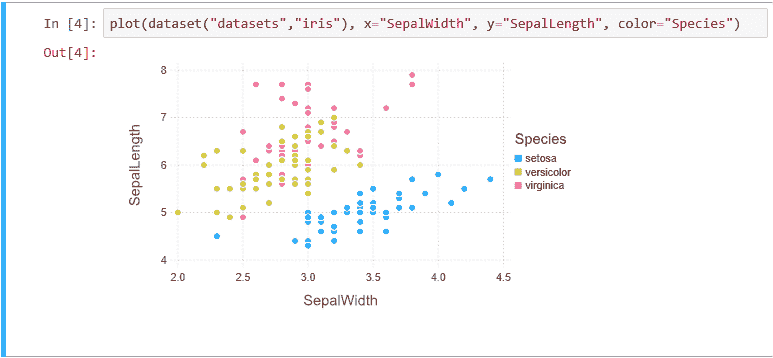
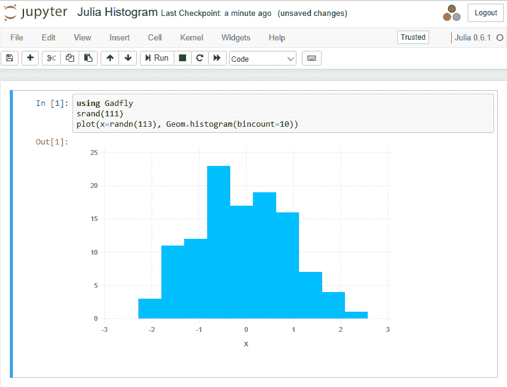
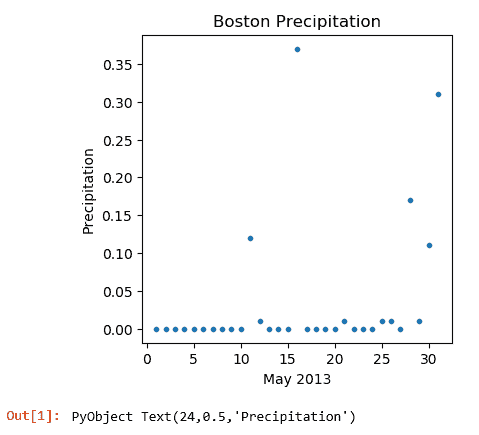

# 第四章：Jupyter Julia 脚本

Julia 是一门专为高性能数值计算设计的编程语言。最重要的是，它与本书中介绍的其他脚本语言（R 和在某种程度上是 Python）不同，因为 Julia 是一门完整的语言，而不仅仅局限于数据处理。

在本章中，我们将涵盖以下主题：

+   将 Julia 脚本添加到你的安装环境中

+   Jupyter 中的基础 Julia

+   Julia 在 Jupyter 中的限制

+   标准 Julia 功能

+   Jupyter 中的 Julia 可视化

+   Julia Vega 绘图

+   Julia 并行处理

+   Julia 控制流程

+   Julia 正则表达式

+   Julia 单元测试

# 将 Julia 脚本添加到你的安装环境中

我们将在 macOS 和 Windows 上安装 Julia。这两个环境中的步骤非常相似，因为安装是基于 Anaconda 的。

# 将 Julia 脚本添加到 Jupyter

一旦 Julia 在你的机器上可用，启用 Jupyter 中的 Julia 就变得非常简单。

首先，我们需要在 Windows 机器上安装 Julia。访问 Julia 下载页面（[`julialang.org/downloads/`](http://julialang.org/downloads/)），下载正确的版本，大多数环境下是 Julia 0.6.1，并使用标准默认设置进行安装。

你必须以管理员身份运行 Julia 安装程序。在下载文件后，打开 `Downloads` 文件夹，右键点击 Julia 可执行文件，并选择“以管理员身份运行”。

安装完成后，你应该验证一切是否正常工作。从程序列表中选择 Julia 并运行该程序，你应该会看到显示 Julia 的命令行，如下图所示：


当前版本的 Julia 不会自动包含可能使用的包的更新。为此，我们运行以下命令将 Julia 添加到 Jupyter：

```py
Pkg.update() 
```

这将导致一系列包被更新或安装到你的机器上。你的显示屏应该会类似于以下截图：


Julia 使用字体颜色作为反馈。我在屏幕顶部输入了白色的文本 `Pkg.update()`；成功执行的步骤显示为蓝色，可能存在的问题显示为红色。你必须等待安装完成。

这是一个相当复杂的过程，系统会检查哪些包需要更新和安装，逐一安装每个包，验证每个包是否成功，然后再继续执行更新，直到没有剩余的包需要更新。

最后一行应该是如下所示：

```py
INFO: Package database updated 
```

到这个时候，你可以关闭 Julia 窗口（使用 `quit()` 命令）。

最后一步是打开你的笔记本（使用 `jupyter notebook` 命令），如果你打开右上角的 New 菜单，你应该会看到一个可用的 Julia 类型，如下图所示：


# 在 Jupyter 中添加 Julia 包

在 Jupyter 中的标准 Julia 安装包含了许多常用的 Julia 编程包。然而，如果你确实需要添加其他包，还是需要按照一些简单的步骤操作：

1.  关闭你的 Notebook（包括服务器）。

1.  运行 Julia 命令行程序：

```py
Pkg.add("DataFrames") 
Pkg.add("RDatasets") 
quit(); 
```

1.  重新启动你的笔记本。这个包应该可以在你的 Julia 脚本中使用，例如，`library("你想添加的包的名称")`。

我建议你立即添加前面提到的两个包，因为它们是许多脚本所必需的。

第一次使用 Julia 中的包时，你会看到一行被浅红色高亮显示，表示 Julia 正在预编译，例如：`INFO: Precompiling module Dataframes...`

你可以直接在脚本中使用 `Pkg.add(...)` 函数，但这似乎不太合适。每次你运行脚本时，系统都会尝试验证你是否已安装指定的包，若没有，则会安装到你的环境中，甚至告诉你它是否过时。这些步骤并不应该属于你的脚本的一部分。

# Jupyter 中的基础 Julia

在这个例子中，我们将使用 Iris 数据集进行一些标准分析。所以，启动一个新的 Julia Notebook，并将其命名为 `Julia Iris`。我们可以输入一个小脚本，查看 Julia 脚本的执行过程。

这个脚本使用了另一个用于绘图的包，叫做 `Gadfly`。你需要像我们在上一节中所做的那样，按照类似的步骤安装该包，然后再运行脚本。

将以下脚本输入到笔记本的不同单元格中：

```py
using RDatasets
using DataFrames
using Gadfly
set_default_plot_size(5inch, 5inch/golden); plot(dataset("datasets","iris"), x="SepalWidth", y="SepalLength", color="Species") 
```

`RDatasets` 是一个包含了几个常用 R 数据集的库，比如 `iris`。这是一个简单的脚本——我们定义了要使用的库，设置 `plot` 区域的大小，并绘制出 `iris` 数据点（根据 `Species` 用不同颜色编码）。

所以，你最终会得到一个启动屏幕，类似下面的截图：



我使用了 Markdown 单元格来展示文本单元格。这些单元格作为处理的文档记录，并不会被引擎解析。

我们应该注意一下 Julia Notebook 视图的几个方面：

+   我们在右上角看到了 Julia 的徽标（那三个彩色圆圈）。你可能已经在其他 Julia 安装中看到过这个徽标（就像我们之前运行 Julia 命令行时看到的那样）。

+   在 Julia 徽标右侧的圆圈是一个忙碌指示器。当你的脚本启动时，表格标题会显示为忙碌，因为 Julia 正在启动。当脚本运行时，圆圈会变成黑色。当它没有运行时，圆圈是空的。

+   剩下的菜单项和以前一样。

在我的 Windows 机器上，第一次启动 Julia Notebook 花了相当长的时间。显示了“Kernel 正在启动，请稍等...”的消息，持续了好几分钟。

如果你运行脚本（使用 **Cell** | Run All 菜单命令），你的输出应该像下图所示：


显示还会继续列出每个数据集的其他统计信息，如 `PetalWidth` 等。

请注意 `WARNING` 消息，提示子库之间存在不兼容问题。即使花了时间安装和更新包，仍然存在未解决的问题。

更有趣的部分是数据点的 `plot`：



我注意到，如果你将鼠标悬停在图形上，会显示网格线和一个滑动条来调整缩放级别（如前面截图右上部分所示）。

所以，就像在 Julia 解释器中运行脚本一样，你会得到输出（带有数字前缀）。Jupyter 已经统计了语句，以便我们可以逐步编号单元格。Jupyter 并没有做任何特殊的处理来打印变量。

我们启动了服务器，创建了一个新的 Notebook，并将其保存为 Julia `iris`。如果我们在磁盘上打开 IPYNB 文件（使用文本编辑器），可以看到以下内容：

```py
{ 
  "cells": [ 
    ...<similar to previously displayed> 
  ], 
  "metadata": { 
  "kernelspec": { 
   "display_name": "Julia 0.6.1", 
   "language": "julia", 
   "name": "julia-0.6" 
  }, 
  "language_info": { 
   "file_extension": ".jl", 
   "mimetype": "application/julia", 
   "name": "julia", 
   "version": "0.6.1" 
  } 
 }, 
 "nbformat": 4, 
 "nbformat_minor": 1 
} 

```

这与我们在前几章中看到的其他 Notebook 语言代码略有不同。特别是，`metadata` 明确指向了要作为 Julia 脚本的脚本单元。

# Julia 在 Jupyter 中的限制

我已经在 Jupyter 中编写了 Julia 脚本并访问了不同的 Julia 库，没有遇到任何问题。我没有注意到使用过程中有任何限制或性能下降。我猜测一些非常依赖屏幕的 Julia 功能（例如使用**Julia webstack**构建网站）可能会受到相同概念冲突的影响。

当我尝试运行 Julia 脚本时，我已经多次看到更新被运行，如下图所示。我不确定为什么他们决定总是更新底层工具，而不是使用当前的工具并让用户决定是否更新库：


我也注意到，一旦打开了 Julia Notebook，即使我已经关闭页面，它仍然会在主页显示“运行中”。我不记得其他脚本语言出现过这种行为。

另一个问题是在我的脚本中尝试使用一个安全的包，例如 `plotly`。获取凭证的过程似乎很简单，但按照规定的方法将凭证传递给 `plotly` 在 Windows 下不起作用。我不愿提供在两种环境下都无法工作的示例。

与 Windows 的进一步交互也有限，例如，尝试通过调用标准 C 库访问环境变量，而这些库在 Windows 安装中通常并不存在。

我在使用 Julia 时遇到的另一个问题，无论是在 Jupyter 下运行与否，都存在。当使用一个包时，它会抱怨包中使用的某些特性已经被弃用或改进。作为包的用户，我无法控制这种行为，所以它对我的工作没有帮助。

最后，运行这些脚本需要几分钟时间。所使用的脚本较小，但似乎 Julia 内核启动的时间比较长。

# 标准 Julia 功能

类似于其他语言中使用的函数，Julia 可以通过使用`describe`函数对数据执行大部分基本统计，如以下示例脚本所示：

```py
using RDatasets 
describe(dataset("datasets", "iris"))
```

这个脚本访问了`iris`数据集，并显示了数据集的汇总统计信息。

如果我们构建一个笔记本，展示如何在`iris`数据集（在前面的示例中已加载）上使用`describe`，我们将得到如下显示：


你可以看到数据集中每个变量所生成的标准统计信息。我觉得很有趣的是，数据集中`NA`值的计数和百分比也被提供了。我发现通常需要在其他语言中进行双重检查，以排除这些数据。这个快速的内置提醒很有用。

警告消息是在抱怨其中一个日期时间库的兼容性问题，尽管它在此笔记本中未被使用。

# Jupyter 中的 Julia 可视化

Julia 中最流行的可视化工具是`Gadfly`包。我们可以通过使用`add`函数来添加`Gadfly`包（如本章开头所述）：

```py
Pkg.add("Gadfly") 
```

从那时起，我们可以通过使用以下代码在任何脚本中引用`Gadfly`包：

```py
using Gadfly 
```

# Julia Gadfly 散点图

我们可以使用`plot()`函数并采用标准默认设置（没有类型参数）来生成散点图。例如，使用以下简单脚本：

```py
using Gadfly 
srand(111) 
plot(x=rand(7), y=rand(7)) 
```

在所有使用随机结果的示例中，我们使用了` srand()`函数。`srand()`函数设置随机数种子值，使得本章中的所有结果都可以重现。

我们生成了一个干净整洁的散点图，如下图所示：


我注意到，如果你点击图形右上方出现的?符号，点击图形时，会显示一个消息框，允许对图形进行更精细的控制，如下所示：

+   在图像上进行平移（特别是当它超出窗口时）。

+   放大，缩小

+   重置：


# Julia Gadfly 直方图

我们还可以生成其他图表类型，例如，使用以下脚本生成`直方图`：

```py
using Gadfly 
srand(111) 
plot(x=randn(113), Geom.histogram(bincount=10)) 
```

这个脚本生成了`113`个随机数，并生成了这些结果的`直方图`。

我们将看到如下截图：



# Julia Winston 绘图

Julia 中另一个图形包是 `Winston`。它具有类似于 `Gadfly` 的绘图功能（我认为 `Gadfly` 更为更新）。我们可以使用以下脚本生成一个随机数的类似图形：

```py
using Winston 
# fix the random seed so we have reproducible results 
srand(111) 
# generate a plot 
pl = plot(cumsum(rand(100) .- 0.5), "g", cumsum(rand(100) .- 0.5), "b") 
# display the plot 
display(pl) 
```

请注意，你需要特别显示该图形。`Winston` 包假设你希望将图形存储为文件，因此 `plot` 函数生成一个对象来处理该图形。

将其移动到 Notebook 中，我们得到以下截图：


# Julia Vega 绘图

另一个流行的图形包是 `Vega`。`Vega` 的主要特点是能够使用语言原语（如 JSON）来描述图形。`Vega` 能够生成大多数标准图形。以下是使用 `Vega` 绘制饼图的示例脚本：

```py
Pkg.add("Vega") 
using Vega 
stock = ["chairs", "tables", "desks", "rugs", "lamps"]; 
quantity = [15, 10, 10, 5, 20]; 
piechart(x = stock, y = quantity) 
```

在 Jupyter 中生成的输出可能如下所示：

****

请注意 `INFO: Precompiling module Vega.` 包。即使该包已经在安装或更新过程中加载，它仍然需要在首次使用时调整库。

在 Jupyter 中生成的图形如下所示：

`Vega` 在结果显示中为你提供将图形保存为 PNG 的选项。我认为这是一个有用的功能，允许你将生成的图形嵌入到另一个文档中：


# Julia PyPlot 绘图

另一个可用的绘图包是 `PyPlot`。`PyPlot` 是 Python 的标准可视化库之一，并可以直接从 Julia 中访问。我们可以使用以下小脚本来生成一个有趣的可视化：

```py
#Pkg.add("PyPlot") 
using PyPlot 
precipitation = [0,0,0,0,0,0,0,0,0,0,0.12,0.01,0,0,0,0.37,0,0,0,0,0.01,0,0,0,0.01,0.01,0,0.17,0.01,0.11,0.31] 
date = collect(1:31) 
fig = figure(1, figsize=(4, 4)) 
plot(date, precipitation, ".") 
title("Boston Precipitation") 
xlabel("May 2013") 
ylabel("Precipitation") 
```

在 Jupyter 中生成的输出可能如下所示：


再次，我们看到 Julia 在执行 Notebook 之前更新了一个包，直到最终我们得到了 `Precipitation` 图形：



有趣的是，波士顿的降水量非常多样——大部分时间没有降水，然后有几天会有大暴雨。

提醒一下：Jupyter 会尝试将大部分输出放入一个小的滚动窗口中。只需点击显示的左侧即可展开滚动面板的全部内容。

# Julia 并行处理

Julia 的一个高级内置功能是能够在脚本中使用并行处理。通常，你可以直接在 Julia 中指定要使用的进程数量。然而，在 Jupyter 中，你需要使用 `addprocs()` 函数来添加额外的进程供脚本使用，例如，看看这个小脚本：

```py
addprocs(1) 
srand(111) 
r = remotecall(rand, 2, 3, 4) 
s = @spawnat 2 1 .+ fetch(r) 
fetch(s) 
```

它调用了`rand`，即随机数生成器，执行该代码时，第二个参数被传递给函数调用（进程`2`），然后将剩余的参数传递给`rand`函数（使得`rand`生成一个 3×4 的随机数矩阵）。`spawnat`是一个宏，用于评估之前提到的进程。接着，`fetch`用于访问已生成进程的结果。

我们可以在 Jupyter 中查看示例结果，如下截图所示：


所以，这并不是一种剧烈的生成进程类型的计算，但你可以轻松想象在 Jupyter 中可以实现更复杂的进程。

# Julia 控制流

Julia 具有完整的控制流。举个例子，我们可以编写一个小函数`larger`，用于确定两个数字中的较大者：

```py
function larger(x, y)  
    if (x>y)  
        return x 
    end 
    return y 
end 
println(larger(7,8)) 
```

有几个特点需要注意：

+   `if`语句的`end`语句

+   `end`，作为函数的结束

+   函数内部语句的缩进

+   在`if`语句中处理条件为真时的缩进

如果我们在 Jupyter 中运行这个，我们会看到预期的输出，如下截图所示：


# Julia 正则表达式

Julia 内建了正则表达式处理功能——就像大多数现代编程语言一样。由于正则表达式是 Julia 字符串的基本功能，所以无需使用声明。

我们可以编写一个小脚本，验证一个字符串是否为有效的电话号码，例如：

```py
ismatch(r"^\([0-9]{3}\)[0-9]{3}-[0-9]{4}$", "(781)244-1212") 
ismatch(r"^\([0-9]{3}\)[0-9]{3}-[0-9]{4}$", "-781-244-1212") 
```

在 Jupyter 中运行时，我们会看到预期的结果。第一个数字符合格式，而第二个则不符合：


# Julia 单元测试

作为一门完整的语言，Julia 具有单元测试功能，确保代码按照预期执行。单元测试通常位于测试文件夹中。

Julia 提供的两个标准单元测试函数是`FactCheck`和`Base.Test`。它们执行相同的操作，但对失败的测试反应不同。`FactCheck`会生成一条错误信息，但在失败时不会停止处理。如果你提供了错误处理器，错误处理器将接管测试。

`Base.Test`会抛出异常，并在第一次测试失败时停止处理。从这个角度来看，它可能更适合作为一种运行时测试，而非单元测试，你可以用它来确保参数在合理范围内，或者避免在出现问题之前停止处理。

这两个包是内置在标准的 Julia 发行版中的。

举个例子，我们可以创建一个单元测试的 Notebook，进行相同的测试，并查看不同的错误响应（意味着测试失败）。

对于`FactCheck`，我们将使用以下脚本：

```py
using FactCheck 
f(x) = x³ 
facts("cubes") do 
    @fact f(2) --> 8 
    @fact f(2) --> 7 
End 
```

我们正在使用`FactCheck`包。我们正在测试的简单函数是对一个数字进行立方运算，但它可以是任何函数。我们将测试封装在`facts() do...End`块中。每个测试都在该块内运行，该块与任何其他块分开——以便将我们的单元测试分组——并且每个测试以`@fact`为前缀。此外，注意我们正在测试函数结果后跟`-->`是否是正确的右侧参数。

当我们在 Jupyter 中运行时，我们会看到预期的结果，如下图所示：


您可以看到失败的测试、它为何失败、它出错的行数等信息，还可以查看执行的`facts`块的总结，即通过的测试数量（`Verified`）和失败的测试数量（`Failed`）。请注意，脚本继续运行到下一行。

对于`Base.Test`，我们有一个类似的脚本：

```py
using Base.Test f(x) = x³ @test f(2) == 8 @test f(2) == 7 
```

我们正在使用`Base.Test`包。我们使用的函数定义是再次进行立方运算。然后，每个测试都是单独进行的——不是作为`test`块的一部分——并且以`@test`为前缀。在 Jupyter 中运行此脚本时，我们会看到与以下截图中显示的类似结果：


显示了失败的测试信息。然而，在这种情况下，脚本在这一点停止执行。因此，我只会将其作为运行时检查来验证输入格式。

# 总结

在这一章中，我们增加了在 Jupyter Notebook 中使用 Julia 脚本的能力。我们添加了一个不包含在标准 Julia 安装中的 Julia 库。我们展示了 Julia 的基本功能，并概述了在 Jupyter 中使用 Julia 时遇到的一些限制。我们使用了可用的图形包（包括`Gadfly`、`Winston`、`Vega`和`PyPlot`）来显示图形。最后，我们看到了并行处理的应用、一个小的控制流示例，以及如何将单元测试添加到 Julia 脚本中。

在下一章中，我们将学习如何在 Jupyter Notebook 中使用 JavaScript。
