# 第五章：Jupyter Java 编程

Java 是一种高级编程语言，最初由 Sun Microsystems 开发，目前归 Oracle 所有。Java 是一种跨平台的编译语言，可以在多种平台上执行。Java 之所以能够跨平台，是因为它生成**p-code**，该代码由特定版本的 Java 解释执行，这个版本就是**Java 虚拟机**（**JVM**）。

Java 通过**Java 运行时可执行文件**（**JRE**）进行分发，适用于只需要执行已编写程序的用户。否则，对于开发 Java 应用程序的用户，则需要**Java 开发工具包**（**JDK**）。

在本章中，我们将讨论以下主题：

+   将 Java 内核添加到 Jupyter

+   Java Hello World Jupyter Notebook

+   Jupyter 中的基础 Java

主要的警告是，这在 Windows 环境中不起作用。Java Notebook 在 Windows 上无法启动。

# 将 Java 内核添加到您的安装中

在本节中，我们将向您的安装中添加 Java 内核。无论您是在 Windows 环境还是 macOS 环境中安装，步骤都非常相似。

Java 内核 IJava 由 Spence Park 开发并维护，地址为[`github.com/SpencerPark/IJava`](https://github.com/SpencerPark/IJava)。使用 Java 内核有一些要求，接下来将介绍。

# 安装 Java 9 或更高版本

您可以通过在命令行提示符中使用以下命令来检查已安装的 Java 版本：

```py
java --version 
```

我们需要 9 或更高版本。

此外，安装的版本必须是 JDK。JRE 是不够的。您可以在[www.oracle.com/technetwork/java](http://www.oracle.com/technetwork/java)下载最新的 Java 版本。在编写本书时，版本 10 已广泛发布，因此我安装了该版本，如下截图所示：

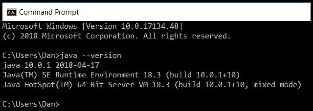

# 需要一个 Jupyter 环境

这可能听起来有些重复，但它的广泛性使得 IJava 可以在所有 Jupyter 环境中运行，包括**JupyterLab**或**nteract**，具体取决于您的需求。

# 配置 IJava

安装完 Java 后，您需要配置 IJava。

# 从 GitHub 下载 IJava 项目

我们可以使用以下命令从 GitHub 下载`IJava`扩展：

```py
> git clone https://github.com/SpencerPark/IJava.git --depth 1
```

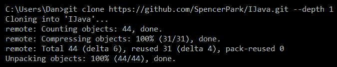

`git clone`命令将项目文件下载到您所在的`IJava`目录（在我的情况下，这是我的默认用户目录）：

```py
> cd IJava/
```

这个命令只是将目录切换到已下载的`IJava`目录。

# 构建和安装内核

以下是特定操作系统的命令：

+   ***nix**: `chmod u+x gradlew && ./gradlew installKernel`

+   **Windows**: `gradlew installKernel`

`gradlew`是 Windows 版本的 Gradle，它是一个流行的脚本系统。Gradle 擅长安装软件。`gradlew`是在您之前运行的`git clone`命令的一部分安装的：

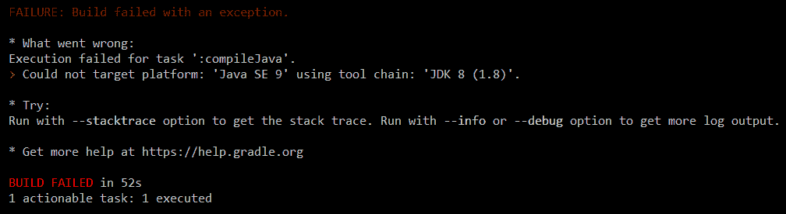

如从安装输出中可以看出，IJava 确实需要安装 Java 9。但 Java 9 已不再是 Oracle 支持的版本。我们需要配置工具以使用 Java 10。就我而言，我之前已安装了 Java，并将环境变量 `JAVA_HOME` 设置为较旧的版本。将环境变量更改为指向 Java 10 安装的路径后，问题解决：

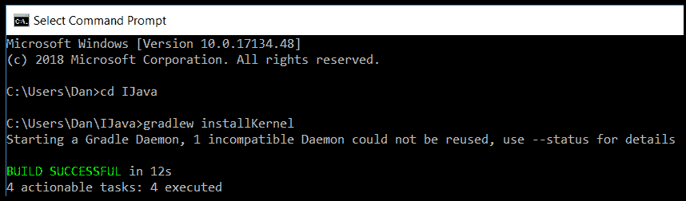

现在，当我们查看内核列表时，我们可以看到可以通过以下命令使用 Java：

```py
>jupyter kernelspec list 
```

执行上述命令后，我们将看到以下结果：

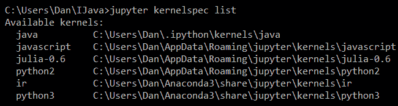

# 可用选项

与其他 Java 安装一样，我们可以根据需要设置一些特定于 Java 的环境变量：

| **设置** | **默认值** | **描述** |
| --- | --- | --- |
| `IJAVA_VM_OPTS` | `""` | 一个以空格分隔的命令行选项列表，这些选项会在运行代码时传递给 `java` 命令。例如，我们可以使用 `-Xmx128m` 来设置堆大小限制，或者使用 `-ea` 来启用 `assert` 语句。 |
| `IJAVA_COMPILER_OPTS` | `""` | 一个以空格分隔的命令行选项列表，这些选项会在编译项目时传递给 `javac` 命令。例如，`-parameters` 用于启用保留参数名称以便反射使用。 |
| `IJAVA_TIMEOUT` | `1` | 一个以毫秒为单位的持续时间，指定长时间运行的代码的超时时间。如果小于零，则禁用超时。 |
| `IJAVA_CLASSPATH` | `""` | `-`，一个以文件路径分隔符分隔的 `classpath` 条目列表，这些条目应该对用户代码可用。 |
| `IJAVA_STARTUP_SCRIPTS_PATH` | `""` | 一个以文件路径分隔符分隔的 `.jshell` 脚本文件路径列表，这些脚本将在启动时运行。包括 `ijava-jshell-init.jshell` 和 `ijava-magics-init.jshell`。 |
| `IJAVA_STARTUP_SCRIPT` | `""` | 在内核启动时执行的 Java 代码块。这可能是类似 `import my.utils;` 的代码，用于设置一些默认的导入，或者是 `void sleep(long time) { try {Thread.sleep(time)} catch (InterruptedException e) {}}` 来声明一个默认的 `utility` 方法，以便在笔记本中使用。 |

从前面的描述中可以看出，这些都不是运行一个有效的 Java 应用程序所必需的。它们通常用于处理特殊情况。

# Jupyter Java 控制台

您可以在 `console` 模式下运行 Jupyter，这意味着可以直接输入命令行，而不是在浏览器中的新笔记本里输入。命令如下：

```py
jupyter console --kernel=java 
```

这意味着您可以在控制台窗口中使用 Java 内核启动 Jupyter。我们将看到一个类似下面的窗口，在其中可以输入一些 Java 代码：

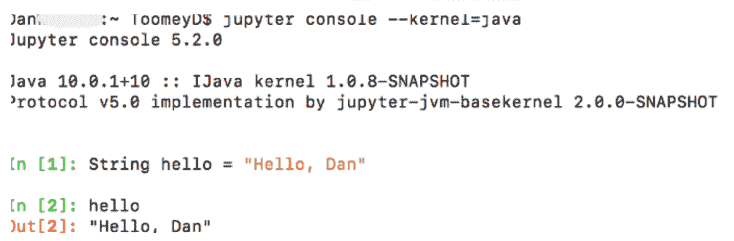

命令行界面屏幕上的奇怪界面行反应得像是笔记本的一部分：

```py
String hello = "Hello, Dan" 
hello 
```

但这不是正常的 Java。行末没有分号。对于单行 Java 语句，分号是可选的。

此外，单行的`hello`只是对`hello`变量的引用。我不确定是什么原因导致它在输出中回显。

我们可以将这个代码片段提取到一个 Java 笔记本中，得到类似的结果：

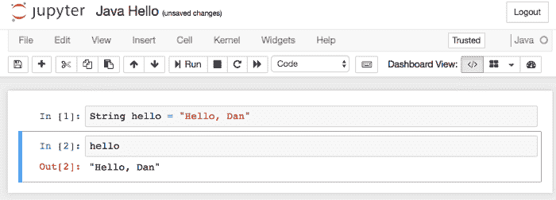

# Jupyter Java 输出

Java 实现能够区分`stdout`和`stderr`，可以通过以下小代码片段看到这一点：

```py
System.out.println("stdout");
System.err.println("stderr");
```

在笔记本中运行时，`stderr`输出会被标记为红色：

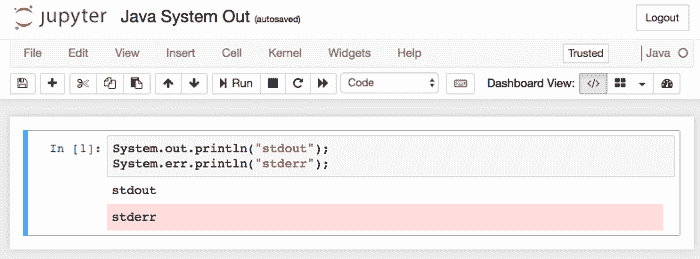

# Java Optional

许多程序员都被`NullPointerException`咬过。尽管在 Java 中比 C 或 C++ 更少出现，但它仍然可能发生。现在，Java 引入了`Optional`字段的概念。一个`Optional`字段可能有值，也可能没有值。你可以测试是否有值存在，而不是尴尬的`null`测试。

我们可以通过以下代码片段运行 `Optional` 的几个方面：

```py
import java.util.Optional; 
public class MyOptional { 
    public static void main() { 
        MyOptional program = new MyOptional(); 
        Integer value1 = null; 
        Integer value2 = 123; 

        //.ofNullable allows null 
        Optional<Integer> a = Optional.ofNullable(value1); 

        //.of does not allow null 
        Optional<Integer> b = Optional.of(value2); 
        System.out.println(program.sum(a,b)); 
    } 

    public Integer sum(Optional<Integer> first, Optional<Integer>
      second) { 
        System.out.println("First parameter present " +
          first.isPresent()); 
        System.out.println("Second parameter present " + 
          second.isPresent()); 
        Integer value1 = first.orElse(1); 
        Integer value2 = second.orElse(1); 
        return value1 + value2; 
    } 
} 
new MyOptional().main(); 
```

我们有一个标准的类前言，用来根据需要`import`库。在这个例子中，我们只使用`Optional`包。

我们将创建一个包含静态`main`函数的 Java 类。

我们之前定义的`main()`函数也是非标准的 Java。其签名应该是`public static void main(String[] args)`。

首先，`main`函数创建了一个类的实例（因为我们稍后会引用类的其他部分）。

然后，我们创建了两个变量，其中一个是邪恶的`null`值。

`Optional`有两个方法，做的是相同的事情，但行为不同：

+   `ofNullable`: 接受一个参数，该参数可以为`null`，并创建一个`Optional`字段

+   `of`: 接受一个参数，该参数不能为`null`，并创建一个`Optional`字段

现在我们有两个`Optional`字段，将它们传递给`sum()`函数。

`sum`函数对每个`Optional`字段使用`orElse()`函数，期望其中一个或两个为`null`，并在这些情况下提供安全的处理。

然后，这就是一个简单的数学问题：

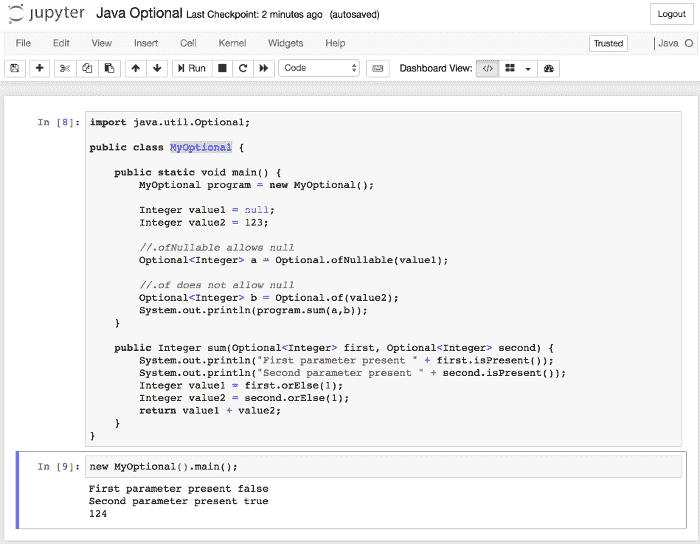

正如你在前面的输出中看到的，第一参数是`null`，但由于`orElse`函数，函数继续处理结果。

# Java 编译器错误

与任何常规 Java 程序一样，你的代码中可能会有编译时错误。Jupyter Java 提供了类似的反馈，行号与笔记本中的行相对应。

例如，当我第一次输入一个示例代码片段时，我们稍后会看到这个例子，出现了一些错误：

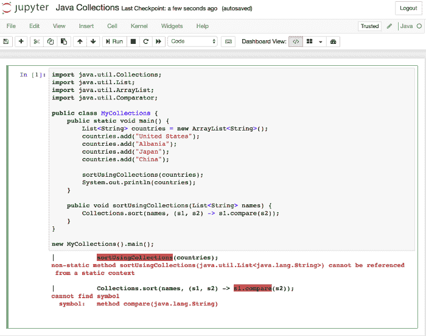

第一个错误是尝试从`static`方法调用`sort`函数。第二个错误是尝试使用错误的函数名称。这两个错误是开发 Java 应用程序时常见的编译错误类型。

# Java Lambda 表达式

Lambda 提供了一种清晰简洁的方式来使用表达式表示一个方法接口。Lambda 通常是单独开发的。Lambda 的形式可以非常接近早期的 Java 实现，也可以完全不同，正如以下示例所示。我们使用越来越简洁的语法来开发 Lambda：

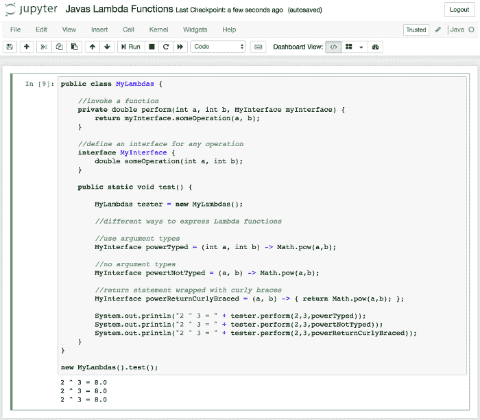

这三个 Lambda 表达式执行相同的步骤（如前面的输出所示）。然而，实现方式逐渐变得更加不符合传统 Java 风格。

# Java 集合

Java 集合在最近的几个版本中经历了重大重构。现在，你可以使用 Lambda 函数来描述你的比较点。如果该对象具有内置的`compareTo`函数（所有标准 Java 对象都有），那么就完成了。

在这个例子中，我们构建了一个包含字符串（国家名称）的列表，并将该列表传递给`Collections.sort`例程。`sort`例程变得非常简单，只是调用 Java 中`String`类型的内置`compareTo`函数：

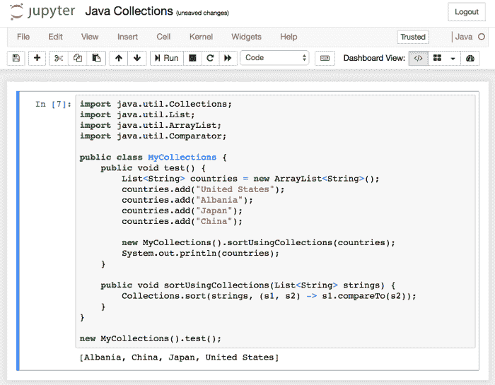

当我们运行时，可以看到结果按排序顺序输出。

很可能有一种方法可以在不修改传入数组的情况下做到这一点。

# Java 流

Java 流（streams）是 Java 8 中的一个重大改进。现在，Java 能够以函数式的方式处理信息流。在这个例子中，我们将通过几个小示例来展示该特性的强大功能。

我们使用的代码片段如下：

```py
public class MyStreams { 

    public static void main(String[] args) { 
          List<Integer> numbers = new ArrayList<Integer>(); 
          numbers.add(3); 
          numbers.add(-1); 
          numbers.add(3); 
          numbers.add(17); 
          numbers.add(7); 

          System.out.println("Numbers greater than 2"); 
          numbers.stream() 
                .filter(number -> number > 2) 
                .forEach(number -> System.out.println(number)); 

          System.out.println("number size = " +
            numbers.stream().count()); 

          Integer big = numbers.stream().max((n1,n2) -> 
            Integer.compare(n1, n2)).get(); 
          System.out.println("biggest number = " + big); 

          Integer small = numbers.stream().min((n1,n2) -> 
            Integer.compare(n1, n2)).get(); 
          System.out.println("smallest number = " + small); 

          System.out.println("Sorted"); 
          numbers.stream() 
                .sorted((n1,n2) -> Integer.compare(n1, n2)) 
                .forEach(number -> System.out.println(number)); 

          Integer total = numbers.stream() 
                      .collect(Collectors.summingInt(i -> i)) 
                      .intValue(); 
          System.out.println("Total " + total); 

          String summary = numbers.stream() 
                .collect(Collectors.summarizingInt(i -> i)) 
                .toString(); 
          System.out.println("Summary " + summary); 

          System.out.println("Squares"); 
          numbers.stream() 
                .map(i -> i * i) 
                .forEach(i -> System.out.println(i)); 

          System.out.println("Growth"); 
          numbers.stream() 
                .flatMap(i -> build(i)) 
                .sorted() 
                .forEach(i -> System.out.println(i)); 

          System.out.println("Distinct growth"); 
          numbers.stream() 
                .flatMap(i -> build(i)) 
                .sorted() 
                .distinct() 
                .forEach(i -> System.out.println(i)); 
    } 

    static Stream<Integer> build(Integer i) { 
          List<Integer> t = new ArrayList<Integer>(); 
          t.add(i); 
          t.add(i*i); 
          t.add(i*i*i); 
          return t.stream(); 
    } 
} 
```

该代码使用一个包含数字的集合（`stream`）进行多个流操作。流内置了许多更多的函数：

1.  首先，我们使用`filter`挑选出感兴趣的元素。

1.  我们使用`count`来找出流中有多少个元素。

1.  我们使用一个 Lambda 函数来查找流中的最小元素。

1.  接下来，我们使用另一个 Lambda 表达式对流元素进行排序。

1.  然后，我们使用`collect`并使用`summingInt`来将所有元素相加。

1.  该流的汇总已生成——这是流的内置功能。

1.  最后，我们使用`map`和`flatMap`对流中的元素进行投影（增长）。

编码和输出如下所示（我添加了水平线来分隔输出，使其更易于阅读）：

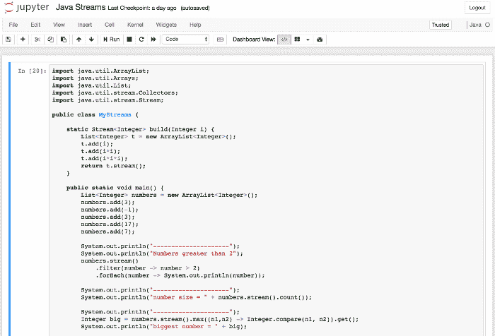

我已截断显示，剩下的与预期一致。

类似地，在以下输出中，我并没有显示所有的输出：

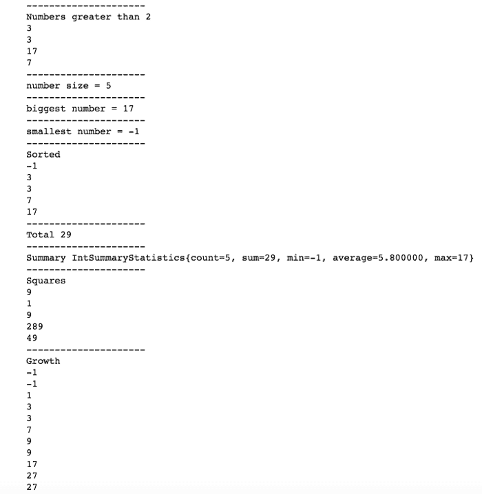

# Java 汇总统计

Java 可以为集合生成汇总统计数据。我们可以获取`Iris`数据集并将其放入集合中，然后直接生成统计数据。

我已经将文件从[`archive.ics.uci.edu/ml/machine-learning-databases/iris/iris.data`](http://archive.ics.uci.edu/ml/machine-learning-databases/iris/iris.data)复制过来，以便使处理过程更为顺畅。

我们读取`Iris`数据，然后调用集合生成汇总。

这个例子的代码如下：

```py
import java.io.IOException; 
import java.nio.file.FileSystems; 
import java.nio.file.Files; 
import java.nio.file.Path; 
import java.text.DateFormat; 
import java.util.ArrayList; 
import java.util.List; 
import java.util.Map; 
import java.util.Optional; 
import java.util.regex.Pattern; 
import java.util.stream.Collectors; 
import java.util.stream.Stream; 

public class Iris { 

    public Iris(Double sepalLength, Double sepalWidth, Double 
     petalLength, Double petalWidth, String irisClass) { 
        this.sepalLength = sepalLength; 
        this.sepalWidth = sepalWidth; 
        this.petalLength = petalLength; 
        this.petalWidth = petalWidth; 
        this.irisClass = irisClass; 
    } 

    private Double sepalLength; 
    private Double sepalWidth; 
    private Double petalLength; 
    private Double petalWidth; 
    private String irisClass; 

    public Double getSepalLength() { 
        return this.sepalLength; 
    } 

    //other getters and setters TBD 
} 

public class JavaIris { 

    public void test() { 

        //file originally at http://archive.ics.uci.edu/ml/machine-learning-databases/iris/iris.data 
        Path path = FileSystems 
            .getDefault() 
            .getPath("/Users/ToomeyD/iris.csv"); 
        List<Iris> irises = load(path); 

        //produce summary statistics for sepal length values 
        String sepalLengthSummary = irises.stream() 
            .collect(Collectors.summarizingDouble(Iris::getSepalLength)) 
            .toString(); 
        System.out.println("\nSepal Length Summary " + sepalLengthSummary); 
    } 

    public List<Iris> load(Path path) { 
        List<Iris> irises = new ArrayList<Iris>(); 

        try (Stream<String> stream = Files.lines(path)) { 
            stream.forEach((line) -> { 
                System.out.println(line); 

                //put each field into array 
                List<String> fields = new ArrayList<String>(); 
                Pattern.compile(",") 
                    .splitAsStream(line) 
                    .forEach((field) -> fields.add(field)); 

                //build up the iris values 
                Double sepalLength = new Double(fields.get(0)); 
                Double sepalWidth = new Double(fields.get(1)); 
                Double petalLength = new Double(fields.get(2)); 
                Double petalWidth = new Double(fields.get(3)); 
                String irisClass = fields.get(4); 
                Iris iris = new Iris(sepalLength, sepalWidth,
                 petalLength, petalWidth, irisClass); 

                //add to array 
                irises.add(iris); 
            }); 
        } catch (IOException e) { 
            e.printStackTrace(); 
        } 

        return irises; 
    } 
} 

new JavaIris().test(); 
```

该代码正在将`iris`数据的每一行解析为一个`Iris`对象，并将该`Iris`对象添加到一个数组中。

然后，主程序调用集合生成摘要。

代码看起来如下，其中我们将`Iris`作为一个单独的对象：

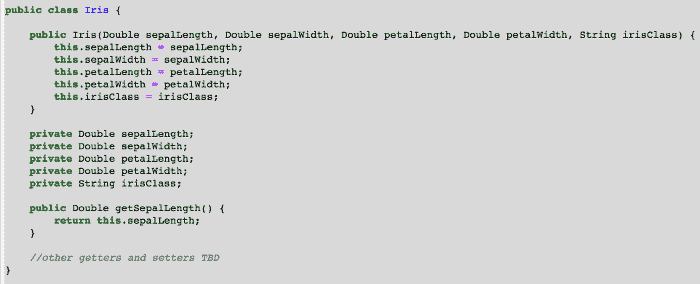

接下来，主程序的编码读取花卉信息并生成统计数据如下：

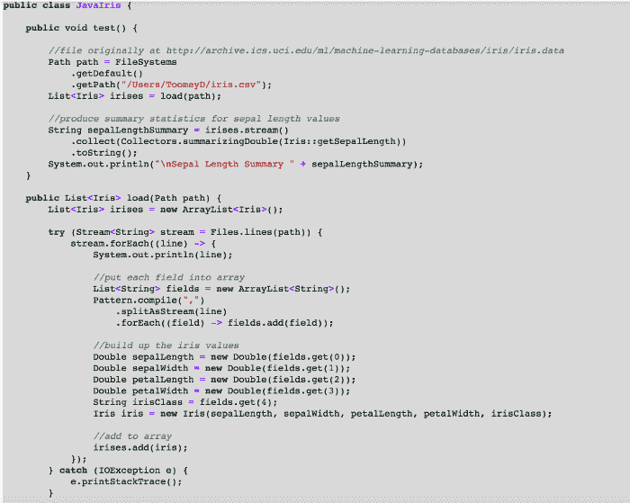

输出的尾部看起来如下：

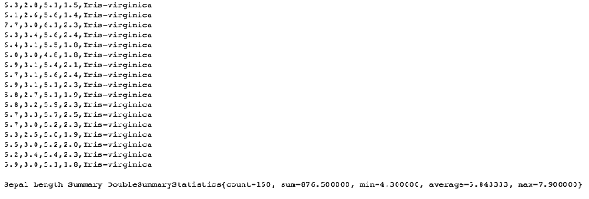

这种处理在 Jupyter 中其他可用的引擎中要容易得多。

# 摘要

在本章中，我们看到了将 Java 引擎安装到 Jupyter 中的步骤。我们看到了 Java 在 Jupyter 中提供的不同输出展示的示例。然后，我们调查了使用`Optional`字段。我们看到了 Java 在 Jupyter 中的编译错误是什么样子。接下来，我们看到了几个 lambda 表达式的示例。我们将集合用于几个目的。最后，我们为`Iris`数据集中的一个数据点生成了汇总统计。

在下一章中，我们将看看如何创建可用于笔记本中的交互式小部件。
