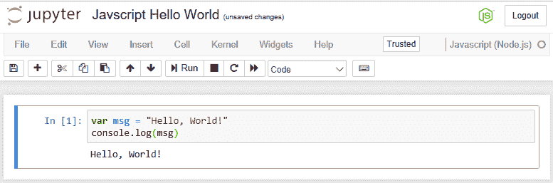

# 第六章：Jupyter JavaScript 编程

JavaScript 是一种高级、动态、无类型并且解释型的编程语言。许多基于 JavaScript 的衍生语言应运而生。对于 Jupyter 来说，底层的 JavaScript 实际上是 Node.js。Node.js 是一个基于事件的框架，使用 JavaScript，可以用于开发大型可扩展的应用程序。需要注意的是，这与本书前面介绍的主要用于数据分析的语言不同（虽然 Python 也是一种通用语言，但它有着明确的数据分析能力）。

在本章中，我们将涵盖以下主题：

+   向 Jupyter 添加 JavaScript 包

+   JavaScript Jupyter Notebook

+   Jupyter 中的基本 JavaScript

+   Node.js `d3` 包

+   Node.js `stats-analysis` 包

+   Node.js JSON 处理

+   Node.js `canvas` 包

+   Node.js `plotly` 包

+   Node.js 异步线程

+   Node.js `decision-tree` 包

# 向你的安装中添加 JavaScript 脚本

在本节中，我们将安装 macOS 和 Windows 上的 JavaScript 脚本。对于每个环境，Jupyter 安装中启用 JavaScript 脚本的步骤是不同的。macOS 的安装非常简洁，而 Windows 的安装仍然在变化中，我预计以下说明将随着时间变化。

# 在 macOS 或 Windows 上向 Jupyter 添加 JavaScript 脚本

我按照 [`github.com/n-riesco/iJavaScript`](https://github.com/n-riesco/ijavascript) 中的说明加载了 Anaconda 的 JavaScript 引擎。步骤如下：

```py
conda install nodejs 
npm install -g iJavaScript 
ijsinstall 
```

此时，启动 Jupyter 时会提供 JavaScript（Node.js）引擎作为选择，如下截图所示：


# JavaScript Hello World Jupyter Notebook

安装完成后，我们可以通过点击“New”菜单并选择 JavaScript 来尝试第一个 JavaScript Notebook。我们将把 Notebook 命名为 `Hello, World!` 并在脚本中输入以下行：

```py
var msg = "Hello, World!" 
console.log(msg) 
```

这个脚本设置了一个变量并显示该变量的内容。输入脚本并运行（单击“Cell | Run All”），我们将看到如下截图所示的 Notebook 界面：



我们应该指出这一页的一些亮点：

+   我们在右上角看到熟悉的语言标识，表示正在使用的脚本类型

+   Notebook 中的每一行都有输出

+   更重要的是，我们可以看到 Notebook 的真实输出（如第一个行所示），其中字符串被回显

+   否则，Notebook 看起来和我们见过的其他类型一样熟悉

如果查看磁盘上的 Notebook 内容，我们也能看到类似的结果：

```py
{ 
  "cells": [ 
    <<same format as seen earlier for the cells>> 
  ], 
  "metadata": { 
    "kernelspec": { 
      "display_name": "JavaScript (Node.js)", 
      "language": "JavaScript", 
      "name": "JavaScript" 
    }, 
    "language_info": { 
      "file_extension": ".js", 
      "mimetype": "application/JavaScript", 
      "name": "JavaScript", 
      "version": "8.9.3" 
    } 
  }, 
  "nbformat": 4, 
  "nbformat_minor": 2 
} 
```

因此，通过使用相同的 Notebook 和 JSON 文件格式，Jupyter 通过适当修改 `metadata` 和 `language_info` 值，提供了不同的语言供 Notebook 使用。

# 向 Jupyter 添加 JavaScript 包

JavaScript 语言通常不会安装额外的包，它通过程序中的运行时包含指令来引用其他包。其他包可以通过网络引用，也可以本地复制到你的环境中。假设通过 CDN 访问库是一种更高效、更快速的机制。

然而，Node.js 为 JavaScript 语法添加了所需的动词。在这个例子中，你的代码需要加载另一个模块，假设它已经安装在你当前的环境中。要安装另一个模块，可以使用 `npm`，例如，在以下命令中：

```py
npm install name-of-module 
```

这将安装被引用的模块（包括所需的嵌入式包）到你的计算机上，以便 `require` 语句可以正常工作。

# Jupyter 中的基础 JavaScript

JavaScript，甚至 Node.js，通常并不以数据处理著称，而是以应用（网站）开发为主。这一点与我们之前讨论的语言有所不同。然而，本章的例子将重点介绍如何使用 JavaScript 进行应用开发，并结合数据访问和分析功能。

# Jupyter 中的 JavaScript 限制

JavaScript 最初是专门为了在 HTML 页面中进行脚本编写而设计的，通常是在客户端（浏览器中）。因此，它被构建为能够操作页面上的 HTML 元素。为进一步扩展这一功能，尤其是使用 Node.js 等扩展，已经开发了多个包，甚至可以用来创建 Web 服务器。

在 Jupyter 中使用任何 HTML 操作和生成特性时都会遇到障碍，因为 Jupyter 期望控制用户的呈现方式。

# Node.js d3 包

`d3` 包具有数据访问功能。在这个例子中，我们将从一个制表符分隔的文件中读取数据并计算平均值。请注意使用了变量名以 _ 开头来表示 `lodash`。以下划线开头的变量名通常被认为是私有的。然而，在这个例子中，它仅仅是我们使用的包名的变体，即 `lodash`，或者叫做 underscore。`lodash` 也是一个广泛使用的 `utility` 包。

为了执行这个脚本，我做了如下操作：

+   安装 `d3`

+   安装 `lodash`

+   安装 `isomorphic-fetch` （`npm install --save isomorphic-fetch es6-promise`）

+   导入 `isomorphic-fetch`

我们将使用的脚本如下：

```py
var fs = require("fs");
var d3 = require("d3");
var _ = require("lodash");
var _ = require("isomorphic-fetch");

//read and parse the animals file
console.log("Animal\tWeight");
d3.csv("http://www.dantoomeysoftware.com/data/animals.csv", function(data) {
    console.log(data.name + '\t' + data.avg_weight);
});
```

这假设我们已经使用 `npm` 加载了 `fs` 和 `d3` 包，如前面的脚本所述。

对于这个例子，我在我的网站上创建了一个 `data` 目录，因为我们输入的 URL 被期望是一个绝对 URL，并在该目录下创建了一个 CSV 文件（`animal.csv`）：

```py
Name,avg_weight 
Lion,400 
Tiger,400 
Human,150 
Elephant,2000 
```

如果我们将这个脚本加载到一个 Notebook 中并运行，它将输出以下内容，正如预期：


需要注意的是，`d3` 函数（实际上有很多）是异步操作的。在我们的例子中，我们只是打印文件的每一行。你可以想象更复杂的功能。

# Node.js 数据分析包

`stats-analysis` 包包含了你可能需要对数据执行的许多常见统计操作。你需要使用 `npm` 安装这个包，正如之前所解释的那样。

如果我们有一小组人的体温数据可以使用，我们可以通过使用这个脚本快速获得数据的一些统计信息：

```py
const stats = require("stats-analysis"); 

var arr = [98, 98.6, 98.4, 98.8, 200, 120, 98.5]; 

//standard deviation 
var my_stddev = stats.stdev(arr).toFixed(2); 

//mean 
var my_mean = stats.mean(arr).toFixed(2); 

//median 
var my_median = stats.median(arr); 

//median absolute deviation 
var my_mad = stats.MAD(arr); 

// Get the index locations of the outliers in the data set 
var my_outliers = stats.indexOfOutliers(arr); 

// Remove the outliers 
var my_without_outliers = stats.filterOutliers(arr); 

//display our stats 
console.log("Raw data is ", arr); 
console.log("Standard Deviation is ", my_stddev); 
console.log("Mean is ", my_mean); 
console.log("Median is ", my_median); 
console.log("Median Abs Deviation is " + my_mad); 
console.log("The outliers of the data set are ", my_outliers); 
console.log("The data set without outliers is ", my_without_outliers); 
```

当这个脚本输入到 Notebook 中时，我们会得到类似于下图所示的内容：


执行时，我们得到如下截图所示的结果：


有趣的是，`98.5` 被认为是一个异常值。我猜测命令中有一个可选参数可以改变使用的限制。否则，结果与预期一致。

异常值来自于将原始数据当作纯数学项处理。所以，技术上来说，从提供的数据中，我们已经识别出异常值。然而，我们可能会使用不同的方法来确定异常值，了解人类体温的领域平均值。

# Node.js JSON 处理

在这个示例中，我们将加载一个 JSON 数据集，并对数据进行一些标准的操作。我引用了来自 [`www.carqueryapi.com/api/0.3/?callback=?&cmd=getModels&make=ford`](http://www.carqueryapi.com/api/0.3/?callback=?&cmd=getModels&make=ford) 的 FORD 模型列表。我不能直接引用这个，因为它不是一个扁平化文件，而是一个 API 调用。因此，我将数据下载到一个名为 `fords.json` 的本地文件中。此外，API 调用的输出会将 JSON 包裹成这样：`?(json);`。在解析之前，这部分需要被移除。

我们将使用的脚本如下。在脚本中，`JSON` 是 Node.js 的内建包，因此我们可以直接引用这个包。`JSON` 包提供了处理 JSON 文件和对象所需的许多标准工具。

这里值得关注的是 JSON 文件读取器，它构建了一个标准的 JavaScript 对象数组。每个对象的属性可以通过 `name` 进行引用，例如 `model.model_name`：

```py
//load the JSON dataset 
//http://www.carqueryapi.com/api/0.3/?callback=?&cmd=getModels&make=ford 
var fords = require('/Users/dtoomey/fords.json'); 

//display how many Ford models are in our data set 
console.log("There are " + fords.Models.length + " Ford models in the data set"); 

//loop over the set 
var index = 1 
for(var i=0; i<fords.Models.length; i++) { 

    //get this model 
    var model = fords.Models[i]; 

    //pull it's name 
    var name = model.model_name; 

    //if the model name does not have numerics in it 
    if(! name.match(/[0-9]/i)) { 
        //display the model name 
        console.log("Model " + index + " is a " + name); 
        index++; 
    } 

    //only display the first 5 
    if (index>5) break; 
} 
```

如果我们将这个脚本引入一个新的 Notebook 条目中，我们会得到以下截图：


当脚本执行时，我们会得到预期的结果，如下所示：


# Node.js canvas 包

`canvas` 包用于在 Node.js 中生成图形。我们可以使用来自 `canvas` 包主页的示例 ([`www.npmjs.com/package/canvas`](https://www.npmjs.com/package/canvas))。

首先，我们需要安装 `canvas` 及其依赖项。不同操作系统的安装指南可以在主页上找到，但它与我们之前见过的工具非常相似（我们已经见过 macOS 的版本）：

```py
npm install canvas 
brew install pkg-config cairo libpng jpeg giflib 
```

这个示例在 Windows 中无法运行。Windows 安装要求安装 Microsoft Visual C++。我尝试了多个版本，但未能成功。

在机器上安装了 `canvas` 包后，我们可以使用一个小的 Node.js 脚本来创建图形：

```py
// create a canvas 200 by 200 pixels 
var Canvas = require('canvas') 
  , Image = Canvas.Image 
  , canvas = new Canvas(200, 200) 
  , ctx = canvas.getContext('2d') 
  , string = "Jupyter!"; 

// place our string on the canvas 
ctx.font = '30px Impact'; 
ctx.rotate(.1); 
ctx.fillText(string, 50, 100); 

var te = ctx.measureText(string); 
ctx.strokeStyle = 'rgba(0,0,0,0.5)'; 
ctx.beginPath(); 
ctx.lineTo(50, 102); 
ctx.lineTo(50 + te.width, 102); 
ctx.stroke(); 

//create an html img tag, with embedded graphics 
console.log(''); 
```

这个脚本在 `canvas` 上写入字符串 `Jupyter!`，然后生成带有图形的 HTML `img` 标签。

在 Notebook 中运行脚本后，我们会得到 `img` 标签作为输出：


我们可以将 `img` 标签保存为 HTML 页面，效果如下：

```py
<html>
 <body>
 CC" />
 </body>
 </head> 
```

然后，我们可以用浏览器打开 HTML 文件来显示我们的图形：


# Node.js plotly 包

`plotly` 是一个与大多数包不同的工具。使用此软件时，您必须注册一个 `username` 账户，这样您就能获得一个 `api_key`（在 [`plot.ly/`](https://plot.ly/)）。然后将 `username` 和 `api_key` 放入您的脚本中。此时，您可以使用 `plotly` 包的所有功能。

首先，像其他包一样，我们需要先安装它：

```py
npm install plotly 
```

安装完成后，我们可以根据需要引用 `plotly` 包。使用一个简单的脚本，我们可以使用 `plotly` 生成一个 `histogram`（直方图）：

```py
//set random seed 
var seedrandom = require('seedrandom'); 
var rng = seedrandom('Jupyter'); 
//setup plotly 
var plotly = require('plotly')(username="<username>", api_key="<key>") 
var x = []; 
for (var i = 0; i < 500; i ++) { 
    x[i] = Math.random(); 
} 
require('plotly')(username, api_key); 
var data = [ 
  { 
    x: x, 
    type: "histogram" 
  } 
]; 
var graphOptions = {filename: "basic-histogram", fileopt: "overwrite"}; 
plotly.plot(data, graphOptions, function (err, msg) { 
    console.log(msg); 
}); 
```

一旦在 Jupyter 中加载并运行为 Notebook，我们将看到以下界面：


与创建本地文件或仅在屏幕上显示图形不同，任何创建的图形都会存储在 Plotly 上。`plot` 命令的输出是一组返回值，其中最重要的是您可以访问图形的 URL。

理想情况下，我应该能够通过提供的 URL 访问我的图形（直方图），URL 为 [`plot.ly/~dantoomey/1`](https://plot.ly/~dantoomey/1)。插入 `~` 字符后，返回的 URL 按预期工作。然而，当我浏览 Plotly 网站时，我发现我的图形位于与预期略有不同的路径中。所有图形都在我的主页上，在我的情况下是 [`plot.ly/~dantoomey`](https://plot.ly/~dantoomey)。现在，我可以访问所有的图形。直方图如下所示：


# Node.js 异步线程

Node.js 内置了创建线程并使其异步执行的机制。借用 [`book.mixu.net/node/ch7.html`](http://book.mixu.net/node/ch7.html) 中的示例，我们可以得到以下代码：

```py
//thread function - invoked for every number in items array 
function async(arg, callback) { 
  console.log('cube \''+arg+'\', and return 2 seconds later'); 
  setTimeout(function() { callback(arg * 3); }, 2000); 
} 

//function called once - after all threads complete 
function final() { console.log('Done', results); } 

//list of numbers to operate upon 
var items = [ 0, 1, 1, 2, 3, 5, 7, 11 ]; 

//results of each step 
var results = []; 

//loop the drives the whole process 
items.forEach(function(item) { 
  async(item, function(result){ 
    results.push(result); 
    if(results.length == items.length) { 
      final(); 
    } 
  }) 
}); 
```

该脚本创建了一个对数字进行操作的异步函数。对于每个数字（`item`），我们调用内联函数，将数字传递给该函数，函数将该数字应用于 `results` 列表。在这个例子中，它只是将数字乘以三并等待两秒钟。主循环（在脚本的底部）为列表中的每个数字创建一个线程，然后等待它们全部完成后再调用 `final()` 例程。

笔记本页面如下所示：


当我们运行脚本时，我们会得到类似于以下的输出：


很奇怪的是，看到最后一行输出（来自 `final()` 例程）显示时有延迟，尽管我们在之前编写 `async` 函数时明确指定了添加延迟。

此外，当我尝试其他函数时，例如对每个数字进行立方运算，`results` 列表的顺序发生了很大的变化。我本来没想到这么基础的数学运算会对性能产生影响。

# Node.js 的 decision-tree 包

`decision-tree` 包是一个机器学习包的例子。它可以在 [`www.npmjs.com/package/decision-tree`](https://www.npmjs.com/package/decision-tree) 获取。该包可以通过以下命令安装：

```py
npm install decision-tree 
```

我们需要一个数据集来用于训练/开发我们的决策树。我使用了以下网页中的汽车 MPG 数据集：[`alliance.seas.upenn.edu/~cis520/wiki/index.php?n=Lectures.DecisionTrees`](https://alliance.seas.upenn.edu/~cis520/wiki/index.php?n=Lectures.DecisionTrees)。它似乎无法直接获得，所以我将其复制到 Excel 并保存为本地 CSV 文件。

机器学习的逻辑非常相似：

+   加载我们的数据集

+   将数据集划分为训练集和测试集

+   使用训练集来开发我们的模型

+   在测试集上测试模式

通常，您可能会将三分之二的数据用于训练，三分之一用于测试。

使用 `decision-tree` 包和 `car-mpg` 数据集，我们将拥有一个类似于以下的脚本：

```py
//Import the modules 
var DecisionTree = require('decision-tree'); 
var fs = require("fs"); 
var d3 = require("d3"); 
var util = require('util'); 

//read in the car/mpg file 
fs.readFile("/Users/dtoomey/car-mpg.csv", "utf8", function(error, data) { 

    //parse out the csv into a dataset 
    var dataset = d3.tsvParse(data); 

    //display on screen - just for debugging 
    //console.log(JSON.stringify(dataset)); 

    var rows = dataset.length; 
    console.log("rows = " + rows); 
    var training_size = rows * 2 / 3; 
    console.log("training_size = " + training_size); 
    var test_size = rows - training_size; 
    console.log("test_size = " + test_size); 

    //Prepare training dataset 
    var training_data = dataset.slice(1, training_size); 

    //Prepare test dataset 
    var test_data = dataset.slice(training_size, rows); 

    //Setup Target Class used for prediction 
    var class_name = "mpg"; 

    //Setup Features to be used by decision tree 
    var features = ["cylinders","displacement","horsepower", "weight", "acceleration", "modelyear", "maker"]; 

    //Create decision tree and train model 
    var dt = new DecisionTree(training_data, class_name, features); 
    console.log("Decision Tree is " + util.inspect(dt, {showHidden: false, depth: null})); 

    //Predict class label for an instance 
    var predicted_class = dt.predict({ 
        cylinders: 8, 
        displacement: 400, 
        horsepower: 200, 
        weight: 4000, 
        acceleration: 12, 
        modelyear: 70, 
        maker: "US" 
    }); 
    console.log("Predicted Class is " + util.inspect(predicted_class, {showHidden: false, depth: null})); 

    //Evaluate model on a dataset 
    var accuracy = dt.evaluate(test_data); 
    console.log("Accuracy is " + accuracy); 

    //Export underlying model for visualization or inspection 
    var treeModel = dt.toJSON(); 
    console.log("Decision Tree JSON is " + util.inspect(treeModel, {showHidden: false, depth: null})); 
}); 
```

`console.log` 被广泛用于显示关于正在进行的处理过程的渐进信息。我进一步使用了 `util()` 函数，以便显示正在使用的对象成员。

这些包也必须使用 `npm` 进行安装。

如果我们在笔记本中运行它，我们会得到如下输出顶部显示的结果：


在这里，系统仅记录它在文件中找到的条目，并根据我们分配的不同变量呈现决策点。例如，当 `cylinders` 为 `8`、`displacement` 为 `400` 时，`mpg` 是 `Bad`，依此类推。

我们得到了一个模型，用于确定车辆的 `mpg` 是否可接受，这取决于车辆的特征。在这种情况下，正如结果中所示，我们有一个不太好的预测器。

# 总结

在本章中，我们学习了如何将 JavaScript 添加到我们的 Jupyter Notebook 中。我们了解了在 Jupyter 中使用 JavaScript 的一些限制。我们还看了一些典型的 Node.js 编程包的示例，包括用于图形的`d3`，用于统计分析的`stats-analysis`，内置的 JSON 处理，`canvas` 用于创建图形文件，以及 `plotly`，它用于通过第三方工具生成图形。我们还看到了如何在 Jupyter 中使用 Node.js 开发多线程应用程序。最后，我们看到了如何进行机器学习以开发决策树。

在下一章中，我们将学习如何创建可以在你的 Notebook 中使用的交互式小部件。
