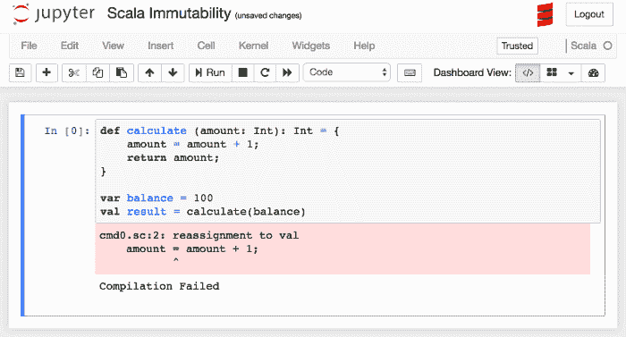

# 第七章：Jupyter Scala

Scala 已经变得非常流行。它是建立在 Java 之上的（因此具有完全的互操作性，包括在 Scala 代码中嵌入 Java）。然而，它的语法更加简洁直观，改进了 Java 中的一些怪异之处。

在本章中，我们将涵盖以下主题：

+   安装 Scala 用于 Jupyter

+   使用 Scala 特性

# 安装 Scala 内核

macOS 的安装步骤如下（摘自 [`developer.ibm.com/hadoop/2016/05/04/install-jupyter-notebook-spark`](https://developer.ibm.com/hadoop/2016/05/04/install-jupyter-notebook-spark)）：

我无法在 Windows 10 机器上使用 Scala 内核的步骤。

1.  使用以下命令安装 `git`：

```py
yum install git 
```

1.  将 `scala` 包复制到本地：

```py
git clone https://github.com/alexarchambault/jupyter-scala.git 
```

1.  通过运行以下命令安装 `sbt` 构建工具：

```py
sudo yum install sbt 
```

1.  将 `jupyter-scala` 目录移动到 `scala` 包：

```py
cd jupyter-scala 
```

1.  构建包：

```py
sbt cli/packArchive 
```

1.  要启动 Scala shell，请使用以下命令：

```py
./jupyter-scala 
```

1.  通过运行此命令检查已安装的内核（现在应该可以在列表中看到 Scala）：

```py
 jupyter kernelspec list  
```

1.  启动 Jupyter Notebook：

```py
jupyter notebook 
```

1.  现在您可以选择使用 Scala 2.11 的 shell。

此时，如果启动 Jupyter，您将看到 Scala 被列出：


如果我们创建一个 Scala Notebook，我们最终会看到熟悉的布局，图标显示我们正在运行 Scala，并且引擎类型字符串标识为 Scala。内核名称也在 Jupyter 的 URL 中指定：


所以，在将我们的 Notebook 命名为 Scala Notebook 并保存后，我们将在主页上看到熟悉的 Notebook 显示，其中新 Notebook 被命名为 `Scala Notebook.ipynb`。

如果我们查看 `.ipynb` 文件，我们可以看到类似于其他 Notebook 类型的标记，带有 Scala 特有的标记：

```py
{ 
 "cells": [ 
  { 
   "cell_type": "code", 
   "execution_count": null, 
   "metadata": {}, 
   "outputs": [], 
   "source": [] 
  } 
 ], 
 "metadata": { 
  "kernelspec": { 
   "display_name": "Scala", 
   "language": "scala", 
   "name": "scala" 
  }, 
  "language_info": { 
   "codemirror_mode": "text/x-scala", 
   "file_extension": ".scala", 
   "mimetype": "text/x-scala", 
   "name": "scala211", 
   "nbconvert_exporter": "script", 
   "pygments_lexer": "scala", 
   "version": "2.11.11" 
  } 
 }, 
 "nbformat": 4, 
 "nbformat_minor": 2 
} 
```

现在，我们可以在某些单元格中输入 Scala 代码。根据之前章节中的语言示例，我们可以输入以下内容：

```py
val name = "Dan" 
val age = 37 
show(name + " is " + age) 
```

Scala 有可变变量（`var`）和不可变变量（`val`）。我们不打算更改字段，因此它们是 `val`。最后一条语句 `show` 是 Jupyter 为 Scala 提供的扩展，用于显示一个变量。

如果我们在 Jupyter 中运行这个脚本，我们将看到如下内容：


在单元格的输出区域，我们看到预期的 `Dan is 37`。有趣的是，Scala 还会在脚本的这一点显示每个变量的当前类型和值。

# Jupyter 中的 Scala 数据访问

在加利福尼亚大学（**Irvine**）的网站上有一个 `iris` 数据集的副本，网址是 [`archive.ics.uci.edu/ml/machine-learning-databases/iris/iris.data`](https://archive.ics.uci.edu/ml/machine-learning-databases/iris/iris.data)。我们将访问此数据并进行几个统计操作：

Scala 代码如下：

```py
import scala.io.Source;
//copied file locally https://archive.ics.uci.edu/ml/machine-learning-databases/iris/iris.data
val filename = "iris.data"
//println("SepalLength, SepalWidth, PetalLength, PetalWidth, Class");
val array = scala.collection.mutable.ArrayBuffer.empty[Float]
for (line <- Source.fromFile(filename).getLines) {
    var cols = line.split(",").map(_.trim);
//println(s"${cols(0)}|${cols(1)}|${cols(2)}|${cols(3)} |${cols(4)}");
   val i = cols(0).toFloat
   array += i;
}
val count = array.length;
var min:Double = 9999.0;
var max:Double = 0.0;
var total:Double = 0.0;
for ( x <- array ) {
    if (x < min) { min = x; }
    if (x > max) { max = x; }
    total += x;
}
val mean:Double = total / count;
```

似乎存在通过互联网访问 CSV 文件的问题。所以，我将文件复制到本地，放入与 Notebook 相同的目录中。

关于这个脚本，有一个值得注意的地方是，我们不必像通常那样将 Scala 代码包裹在一个对象中，因为 Jupyter 提供了`wrapper`类。

当我们运行脚本时，看到这些结果：


这是`iris`数据的不同版本，因此，我们看到的统计结果与之前有所不同。

# Scala 数组操作

Scala 没有 pandas，但我们可以通过自己的编码来模拟其中的一些逻辑。我们将使用第二章中使用的`Titanic`数据集，*Jupyter Python 脚本*，该数据集来自[`titanic-gettingStarted/fdownload/train.csv`](http://titanic-gettingStarted/fdownload/train.csv)，并已下载到我们的本地空间。

我们可以使用类似于第二章中*Jupyter Python 脚本*使用的代码来处理 pandas：

```py
import scala.io.Source; 

val filename = "train.csv" 
//PassengerId,Survived,Pclass,Name,Sex,Age,SibSp,Parch,Ticket,Fare,Cabin,Embarked 
//1,0,3,"Braund, Mr. Owen Harris",male,22,1,0,A/5 21171,7.25,,S 

var males = 0 
var females = 0 
var males_survived = 0 
var females_survived = 0 
for (line <- Source.fromFile(filename).getLines) { 
    var cols = line.split(",").map(_.trim); 
    var sex = cols(5); 
    if (sex == "male") {  
        males = males + 1; 
        if (cols(1).toInt == 1) { 
            males_survived = males_survived + 1; 
        } 
    } 
    if (sex == "female") {  
        females = females + 1;  
        if (cols(1).toInt == 1) { 
            females_survived = females_survived + 1; 
        } 
    }     
} 
val mens_survival_rate = males_survived.toFloat/males.toFloat 
val womens_survival_rate = females_survived.toFloat/females.toFloat 
```

在代码中，我们逐行读取文件，解析出列（它是 CSV 格式），然后根据数据的`sex`列进行计算。有趣的是，Scala 的数组不是零索引的。

当我们运行这个脚本时，我们看到的结果与之前非常相似：


所以，我们看到女性的生存率显著更高。我认为关于“妇女和儿童优先”的故事是事实。

# Scala 随机数在 Jupyter 中的使用

在这个例子中，我们模拟掷骰子并统计每种组合出现的次数。然后我们展示了一个简单的直方图来做说明。

脚本如下：

```py
val r = new scala.util.Random 
r.setSeed(113L) 
val samples = 1000 
var dice = new ArrayInt 
for( i <- 1 to samples){ 
    var total = r.nextInt(6) + r.nextInt(6) 
    dice(total) = dice(total) + 1 
} 
val max = dice.reduceLeft(_ max _) 
for( i <- 0 to 11) { 
    var str = "" 
    for( j <- 1 to dice(i)/3) { 
        str = str + "X" 
    } 
    print(i+1, str, "\n") 
} 
```

我们首先引入了 Scala 的`Random`库。我们设置了种子（以便得到可重复的结果）。我们进行`1000`次掷骰。每次掷骰时，我们都会增加一个计数器，记录骰子一和骰子二上的点数之和出现的次数。然后我们展示结果的简化直方图。

Scala 有许多快捷方法，可以快速扫描列表/集合，如`reduceLeft(_ max _)`语句所示。我们也可以通过在`reduceLeft`语句中使用`min`代替`max`来找到最小值。

当我们运行脚本时，我们得到这些结果：


我们可以看到粗略的直方图，以及脚本中标量变量的当前值显示。请注意，我将结果除以三，以便让结果能适应一页显示。

# Scala 闭包

闭包就是一个函数。这个函数的返回值依赖于函数外部声明的变量值。

我们可以通过以下小脚本进行说明：

```py
var factor = 7
val multiplier = (i:Int) => i * factor
val a = multiplier(11)
val b = multiplier(12)
```

我们定义了一个名为`multiplier`的函数。该函数期望一个`Int`类型的参数。对于每个参数，我们将其与外部`factor`变量相乘。

我们看到以下结果：


闭包的使用感觉很好，它们做了你所期望的事情，而且非常简单直接。

# Scala 高阶函数

高阶函数要么接受其他函数作为参数，要么将一个函数作为结果返回。

我们可以使用以下示例脚本：

```py
def squared(x: Int): Int = x * x
def cubed(x: Int): Int = x * x * x

def process(a: Int, processor: Int => Int): Int = {processor(a) }

val fiveSquared = process(5, squared)
val sevenCubed = process(7, cubed)
```

我们定义了两个函数：一个对传入的数字进行平方，另一个对传入的数字进行立方。

接下来，我们定义了一个高阶函数，该函数接受一个数字进行处理并应用一个处理器。

最后，我们调用每个函数。例如，我们调用`process()`并传入`5`和`squared`函数。`process()`函数将`5`传递给`squared()`函数并返回结果：


我们利用 Scala 的引擎自动打印变量值，以查看预期的结果。

这些函数并没有做太多的事情。当我运行它们时，结果显示花费了几秒钟。我认为在 Scala 中使用高阶函数会导致性能上的大幅下降。

# Scala 模式匹配

Scala 具有非常有用的内置模式匹配。模式匹配可以用于测试整个值、对象的部分内容等的精确匹配和/或部分匹配。

我们可以使用这个示例脚本作为参考：

```py
def matchTest(x: Any): Any = x match { 
  case 7 => "seven" 
  case "two" => 2 
  case _ => "something" 
} 
val isItTwo = matchTest("two") 
val isItTest = matchTest("test") 
val isItSeven = matchTest(7) 
```

我们定义了一个名为`matchTest`的函数。`matchTest`函数可以接受任何类型的参数，并返回任何类型的结果。（不确定这是否是实际编程中的情况）

关键字是`match`。这意味着函数会遍历选择列表，直到找到与传入的`x`值匹配的项，然后返回。

如你所见，我们有数字和字符串作为输入和输出。

最后的`case`语句是一个通配符，`_`是`catchall`，这意味着如果代码执行到这一行，它将匹配任何参数。

我们可以看到以下输出：


# Scala `case`类

`case`类是一种简化类型，可以在不调用`new Classname(..)`的情况下使用。例如，我们可以有以下脚本，定义一个`case`类并使用它：

```py
case class Car(brand: String, model: String) 
val buickLeSabre = Car("Buick", "LeSabre") 
```

所以，我们有一个名为`Car`的`case`类。我们创建了这个类的一个实例，称为`buickLeSabre`。

`case`类最适用于模式匹配，因为我们可以轻松构造复杂对象并检查其内容。例如：

```py
def carType(car: Car) = car match { 
  case Car("Honda", "Accord") => "sedan" 
  case Car("GM", "Denali") => "suv" 
  case Car("Mercedes", "300") => "luxury" 
  case Car("Buick", "LeSabre") => "sedan" 
  case _ => "Car: is of unknown type" 
} 
val typeOfBuick = carType(buickLeSabre) 
```

我们定义一个模式`match`块（如本章前一部分所述）。在`match`块中，我们查看一个`Car`对象，它的`brand`是`GM`，`model`是`Denali`，等等。对于每个感兴趣的模型，我们对其类型进行分类。我们还在末尾使用了`catchall _`，这样我们就可以捕捉到意外的值。

我们可以在 Jupyter 中练习`case`类，如下截图所示：


我们定义并使用了`case`类作为`Car`。然后我们使用`Car`类进行了模式匹配。

# Scala 不变性

不变性意味着你不能改变某些东西。在 Scala 中，除非特别标记，否则所有变量都是不可变的。这与像 Java 这样的语言相反，在这些语言中，所有变量默认都是可变的，除非特别标记为不可变。

在 Java 中，我们可以有如下的函数：

```py
public void calculate(integer amount) { 
} 
```

我们可以在`calculate`函数内部修改`amount`的值。如果我们使用`final`关键字，我们可以告诉 Java 不允许更改该值，如下所示：

```py
public void calculate(final integer amount) { 
} 
```

而在 Scala 中：

```py
def calculate (amount: Int): Int = {  
        amount = amount + 1; 
        return amount; 
} 
var balance = 100
val result = calculate(balance)
```

一个类似的例程将`amount`变量的值保持在例程调用前的状态：



我们可以在显示中看到，即使`balance`是一个变量（标记为`var`），Scala 也不会允许你在函数内部更改它的值。传递给`calculate`函数的`amount`参数被认为是一个`val`，一旦初始化后就不能更改。

# Scala 集合

在 Scala 中，集合根据你的使用方式自动是`mutable`或`immutable`。`scala.collections.immutable`中的所有集合都是`immutable`。反之亦然，对于`scala.collections.mutable`。默认情况下，Scala 选择`immutable`集合，因此你的代码将自动使用`mutable`集合，如下所示：

```py
var List mylist; 
```

或者，你可以在变量前加上`immutable`：

```py
var mylist immutable.List; 
```

我们可以在这个简短的示例中看到这一点：

```py
var mutableList = List(1, 2, 3); 
var immutableList = scala.collection.immutable.List(4, 5, 6); 
mutableList.updated(1,400); 
immutableList.updated(1,700); 
```

正如我们在这个 Notebook 中看到的：


注意，Scala 在这里有一点小伎俩：当我们更新`immutableList`时，它创建了一个新的`collection`，正如你可以看到的变量名`real_3`所示。

# 命名参数

Scala 允许你通过名称而不是仅仅通过位置来指定参数赋值。例如，我们可以有如下代码：

```py
def divide(dividend:Int, divisor:Int): Float =  
{ dividend.toFloat / divisor.toFloat } 
divide(40, 5) 
divide(divisor = 40, dividend = 5) 
```

如果我们在 Notebook 中运行这个代码，我们可以看到结果：


第一次调用通过位置划分传递的参数。第二次调用通过指定参数，而不是使用标准的序号位置分配。

# Scala 特性

Scala 中的`trait`函数定义了一组可以被类实现的特性。`trait`接口类似于 Java 中的接口。

`trait`函数可以部分实现，强制`trait`的使用者（类）来实现具体的细节。

举个例子，我们可以有如下代码：

```py
trait Color {
 def isRed(): Boolean
}
class Red extends Color {
 def isRed() = true
}
class Blue extends Color {
 def isRed() = false
}
var red = new Red();
var blue = new Blue();
red.isRed()
blue.isRed() 
```

该代码创建了一个名为`Color`的`trait`，并包含一个部分实现的函数`isRed`。因此，任何使用`Color`的类都必须实现`isRed()`。

然后我们实现两个类，`Red`和`Blue`，它们继承`Color`特性（这是使用`trait`的 Scala 语法）。由于`isRed()`函数是部分实现的，因此两个类都必须提供`trait`函数的实现。

我们可以在以下 Notebook 显示中看到这如何操作：


我们在输出部分（底部）看到，`trait`和`class`被创建，并且创建了两个实例，同时显示了调用这两个类的`trait`函数的结果。

# 总结

在本章中，我们为 Jupyter 安装了 Scala。我们使用 Scala 编写代码来访问更大的数据集。我们展示了 Scala 如何操作数组。我们在 Scala 中生成了随机数。还展示了高阶函数和模式匹配的例子。我们使用了 `case` 类。我们看到了 Scala 中不变性的例子。我们使用 Scala 包构建了集合。最后，我们了解了 Scala 特质。

在下一章中，我们将学习如何在 Jupyter 中使用大数据。
