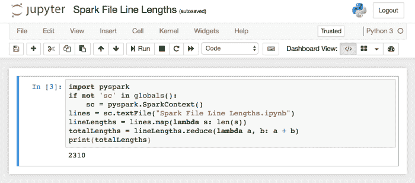
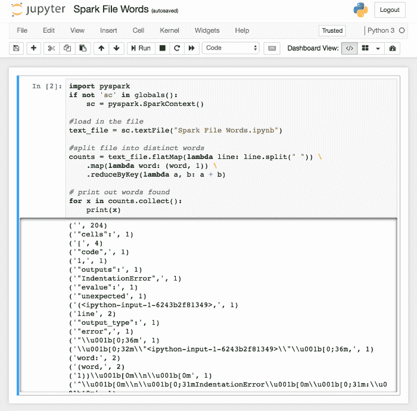
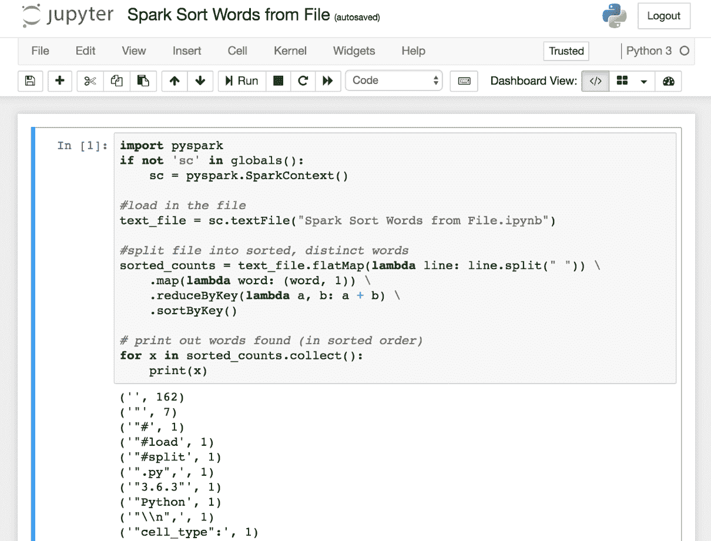
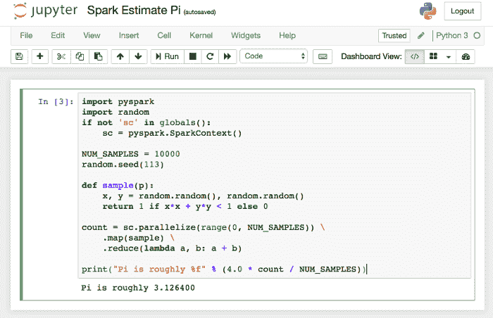
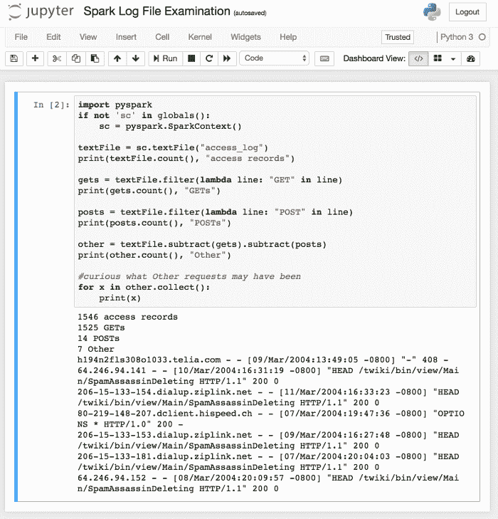
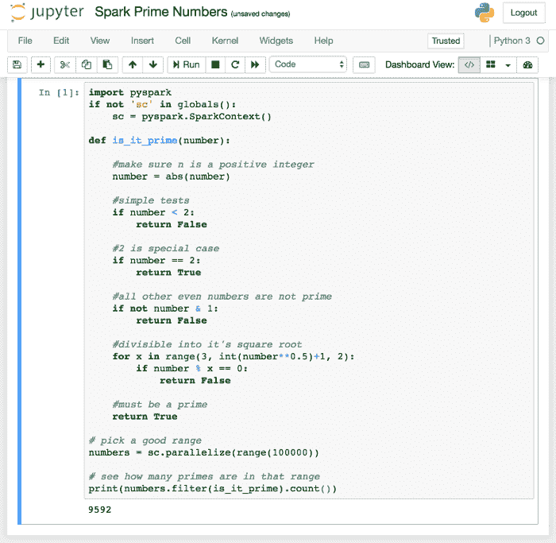
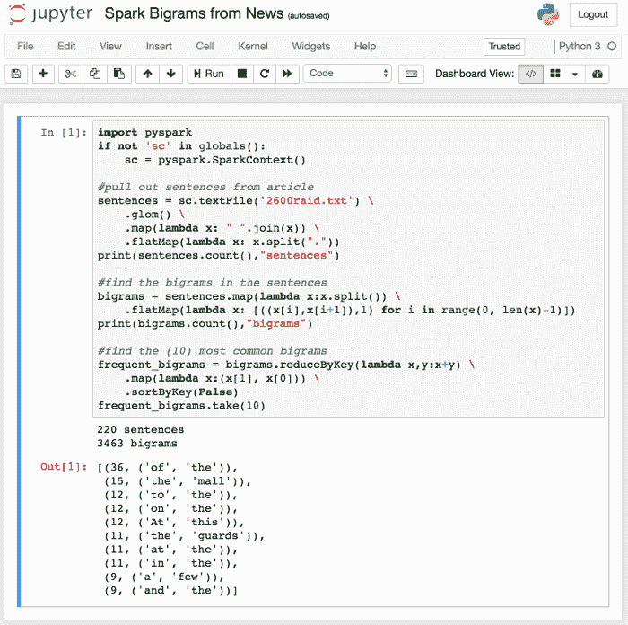
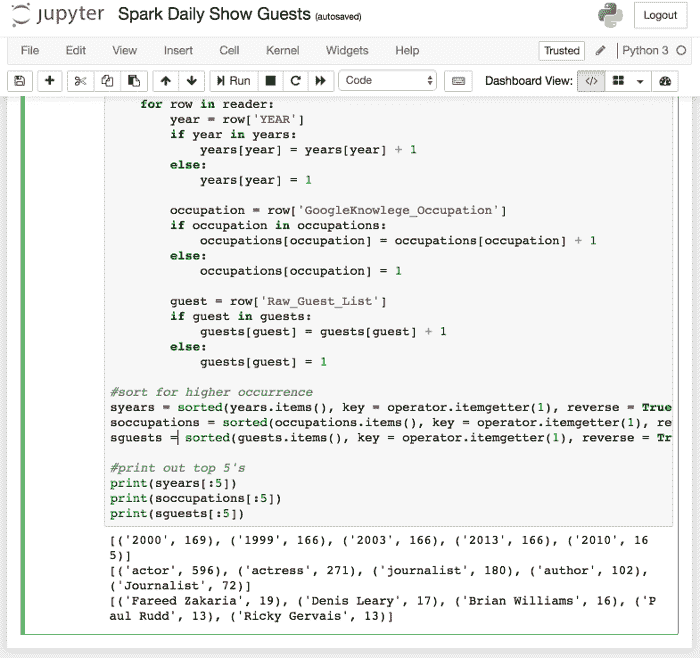

# 第八章：Jupyter 与大数据

大数据是每个人都在关注的话题。我认为在 Jupyter 中看看大数据能做什么会很有意思。一个处理大数据集的新兴语言是 Spark。Spark 是一个开源工具集，我们可以像使用其他语言一样在 Jupyter 中使用 Spark 代码。

在本章中，我们将涵盖以下主题：

+   在 Jupyter 中安装 Spark

+   使用 Spark 的功能

# Apache Spark

我们将使用的工具之一是 Apache Spark。Spark 是一个用于集群计算的开源工具集。虽然我们不会使用集群，但 Spark 的典型用途是将多个机器或集群并行操作，用于分析大数据集。安装说明可以在[`www.dataquest.io/blog/pyspark-installation-guide`](https://www.dataquest.io/blog/pyspark-installation-guide)找到。

# 在 macOS 上安装 Spark

安装 Spark 的最新说明可以在[`medium.freecodecamp.org/installing-scala-and-apache-spark-on-mac-os-837ae57d283f`](https://medium.freecodecamp.org/installing-scala-and-apache-spark-on-mac-os-837ae57d283f)找到。主要步骤如下：

1.  从[`brew.sh`](http://brew.sh)获取 Homebrew。如果你在 macOS 上进行软件开发，你很可能已经安装了 Homebrew。

1.  安装`xcode-select`：`xcode-select`用于不同的编程语言。在 Spark 中，我们使用 Java、Scala，当然还有 Spark，具体如下：

```py
xcode-select -install 
```

同样，很可能你已经为其他软件开发任务安装了此项工具。

1.  使用 Homebrew 安装 Java：

```py
brew cask install java 
```

1.  使用 Homebrew 安装 Scala：

```py
brew install scala 
```

1.  使用 Homebrew 安装 Apache Spark：

```py
brew install apache-spark 
```

1.  你应该使用 Spark shell 测试此功能是否正常，像这样运行命令：

```py
spark-shell 
```

1.  这将显示熟悉的 Logo：

```py
Welcome to 
 ____              __ 
 / __/__  ___ _____/ /__ 
 _\ \/ _ \/ _ `/ __/  '_/ 
 /__ / .__/\_,_/_/ /_/\_\   version 2.0.0 
 /_/ 

Using Python version 2.7.12 (default, Jul  2 2016 17:43:17) 
SparkSession available as 'spark'. 
>>> 
```

该网站继续讨论设置导出等，但我并没有需要做这些。

此时，我们可以启动一个 Python 3 笔记本并开始在 Jupyter 中使用 Spark。

你可以输入`quit()`退出。

现在，当我们在使用 Python 内核时运行笔记本时，我们可以访问 Spark。

# Windows 安装

我以前在 Jupyter 中使用 Python 2 运行过 Spark。对于 Windows，我无法正确安装。

# 第一个 Spark 脚本

我们的第一个脚本读取一个文本文件，并查看每行的长度总和，如下所示。请注意，我们读取的是当前运行的笔记本文件；该笔记本名为`Spark File Lengths`，并存储在`Spark File Lengths.ipynb`文件中：

```py
import pyspark
if not 'sc' in globals():
    sc = pyspark.SparkContext()
lines = sc.textFile("Spark File Line Lengths.ipynb")
lineLengths = lines.map(lambda s: len(s))
totalLengths = lineLengths.reduce(lambda a, b: a + b)
print(totalLengths)
```

在`print(totalLengths)`脚本中，我们首先初始化 Spark，但仅当我们尚未初始化它时才会进行此操作。如果你尝试多次初始化 Spark，它会报错，因此所有 Spark 脚本都应该有这个`if`语句前缀。

该脚本读取一个文本文件（此脚本的源文件），处理每一行，计算其长度，然后将所有长度相加。

`lambda`函数是一个匿名（无名）函数，它接受参数并返回一个值。在第一个例子中，给定一个`s`字符串，返回其长度。

`reduce`函数将每个值作为参数，应用第二个参数，并用结果替换第一个值，然后继续处理剩余的列表。在我们的案例中，它遍历行的长度并将它们加总。

然后，在 Notebook 中运行时，我们看到如下截图。请注意，你的文件大小可能略有不同。

此外，当你第一次启动 Spark 引擎（使用`sc = pyspark.SparkContext()`这一行代码）时，可能需要一些时间，且脚本可能无法成功完成。如果发生这种情况，请再试一次：



# Spark 单词计数

既然我们已经看到了一些功能，接下来让我们进一步探索。我们可以使用类似以下的脚本来统计文件中单词的出现次数：

```py
import pyspark
if not 'sc' in globals():
    sc = pyspark.SparkContext()

#load in the file
text_file = sc.textFile("Spark File Words.ipynb")

#split file into distinct words
counts = text_file.flatMap(lambda line: line.split(" ")) \
    .map(lambda word: (word, 1)) \
    .reduceByKey(lambda a, b: a + b)

# print out words found
for x in counts.collect():
    print(x)
```

我们对编码有相同的引言。然后，我们将文本文件加载到内存中。

一旦文件加载完成，我们将每行拆分成单词，并使用`lambda`函数统计每个单词的出现次数。代码实际上为每个单词出现创建了一个新记录，比如"at"出现一次。这个过程可以分配到多个处理器，每个处理器生成这些低级别的信息位。我们并不关注优化这个过程。

一旦我们拥有了所有这些记录，我们就根据单词出现的次数来减少/总结记录集。

`counts`对象在 Spark 中称为**弹性分布式数据集**（**RDD**）。它是弹性的，因为我们在处理数据集时会确保持久化。RDD 是分布式的，因为它可以被操作集群中的所有节点所处理。当然，它是由各种数据项组成的数据集。

最后的`for`循环对 RDD 执行`collect()`操作。如前所述，RDD 可能分布在多个节点上。`collect()`函数将 RDD 的所有副本拉取到一个位置。然后，我们遍历每条记录。

当我们在 Jupyter 中运行时，我们看到类似于以下的输出：



列表略有缩略，因为单词列表会继续一段时间。值得注意的是，Spark 中的单词拆分逻辑似乎并不十分有效；一些结果并不是单词，比如第一个条目是空字符串。

# 排序后的单词计数

使用相同的脚本，稍微修改一下，我们可以再进行一次调用并对结果进行排序。现在脚本如下所示：

```py
import pyspark
if not 'sc' in globals():
    sc = pyspark.SparkContext()

#load in the file
text_file = sc.textFile("Spark Sort Words from File.ipynb")

#split file into sorted, distinct words
sorted_counts = text_file.flatMap(lambda line: line.split(" ")) \
    .map(lambda word: (word, 1)) \
    .reduceByKey(lambda a, b: a + b) \
    .sortByKey()

# print out words found (in sorted order)
for x in sorted_counts.collect():
    print(x)
```

在这里，我们添加了另一个 RDD 创建函数调用，`sortByKey()`。因此，在我们完成映射/减少操作并得到了单词和出现次数的列表之后，我们可以轻松地对结果进行排序。

结果输出如下所示：



# 估算π值

如果我们有如下代码，我们可以使用`map`或`reduce`来估算π值：

```py
import pyspark 
import random 
if not 'sc' in globals(): 
    sc = pyspark.SparkContext() 

NUM_SAMPLES = 10000 
random.seed(113) 

def sample(p): 
    x, y = random.random(), random.random() 
    return 1 if x*x + y*y < 1 else 0 

count = sc.parallelize(range(0, NUM_SAMPLES)) \ 
    .map(sample) \ 
    .reduce(lambda a, b: a + b) 

print("Pi is roughly %f" % (4.0 * count / NUM_SAMPLES)) 
```

这段代码有相同的引言。我们正在使用 Python 的`random`包，并设定了样本的数量常量。

我们正在构建一个称为`count`的 RDD。我们调用`parallelize`函数来在可用的节点之间分配这个过程。代码只是映射`sample`函数调用的结果。最后，我们通过将生成的映射集合减少来得到总数。

`sample`函数获取两个随机数，并根据它们的大小返回 1 或 0。我们正在寻找一个小范围内的随机数，然后检查它们是否落在同一直径的圆内。足够大的样本，我们将得到`PI(3.141...)`。

如果我们在 Jupyter 中运行，我们会看到以下内容：



当我使用`NUM_SAMPLES = 100000`运行时，最终得到了`PI = 3.126400`。

# 日志文件检查

我从`monitorware.com`下载了一个`access_log`文件。和任何其他的网页访问日志一样，我们每条记录一行，就像这样：

```py
64.242.88.10 - - [07/Mar/2004:16:05:49 -0800] "GET /twiki/bin/edit/Main/Double_bounce_sender?topicparent=Main.ConfigurationVariables HTTP/1.1" 401 12846 
```

第一部分是调用者的 IP 地址，然后是时间戳，HTTP 访问类型，引用的 URL，HTTP 类型，生成的 HTTP 响应代码，最后是响应中的字节数。

我们可以使用 Spark 加载和解析日志条目的一些统计信息，就像这个脚本一样：

```py
import pyspark
if not 'sc' in globals():
    sc = pyspark.SparkContext()

textFile = sc.textFile("access_log")
print(textFile.count(), "access records")

gets = textFile.filter(lambda line: "GET" in line)
print(gets.count(), "GETs")

posts = textFile.filter(lambda line: "POST" in line)
print(posts.count(), "POSTs")

other = textFile.subtract(gets).subtract(posts)
print(other.count(), "Other")

#curious what Other requests may have been
for x in other.collect():
    print(x)
```

这个脚本与其他脚本有相同的序言。我们读取`access_log`文件。然后，我们打印`count`记录。

类似地，我们了解到有多少日志条目是`GET`和`POST`操作。`GET`被认为是最普遍的。

当我第一次这样做时，我真的不希望有任何其他情况发生，所以我从集合中移除了`gets`和`posts`，并打印出离群值，看看它们是什么。

当我们在 Jupyter 中运行时，我们看到了预期的输出：



文本处理速度不是很快（特别是对于如此少量的记录）。

我喜欢能够以这样的方式处理数据框架。以程序化的方式进行基本代数运算，而不必担心边界情况，这确实令人愉悦。

顺便说一句，`HEAD`请求的工作方式与`GET`完全相同，但不返回`HTTP`正文。这允许调用者确定应该返回什么类型的响应，并做出相应的响应。

# Spark 质数

我们可以运行一系列数字通过一个过滤器来确定每个数字是否是质数或不是。我们可以使用这个脚本：

```py
import pyspark
if not 'sc' in globals():
    sc = pyspark.SparkContext()

def is_it_prime(number):

    #make sure n is a positive integer
    number = abs(number)

    #simple tests
    if number < 2:
        return False

    #2 is special case
    if number == 2:
        return True

    #all other even numbers are not prime
    if not number & 1:
        return False

    #divisible into it's square root
    for x in range(3, int(number**0.5)+1, 2):
        if number % x == 0:
            return False

    #must be a prime
    return True

# pick a good range
numbers = sc.parallelize(range(100000))

# see how many primes are in that range
print(numbers.filter(is_it_prime).count())
```

这个脚本生成了最多`100000`的数字。

然后，我们循环遍历每个数字，并将其传递给我们的过滤器。如果过滤器返回`True`，我们就得到一条记录。然后，我们只需计算找到的结果数量。

在 Jupyter 中运行时，我们看到以下内容：



这个速度非常快。我在等待中没有注意到它如此迅速。

# Spark 文本文件分析

在这个示例中，我们将浏览一篇新闻文章，以确定文章的一些基本信息。

我们将会使用以下脚本对来自[`www.newsitem.com`](https://www.newsitem.com)的 2600 条新闻文章进行处理：

```py
import pyspark
if not 'sc' in globals():
    sc = pyspark.SparkContext()

#pull out sentences from article
sentences = sc.textFile('2600raid.txt') \
    .glom() \
    .map(lambda x: " ".join(x)) \
    .flatMap(lambda x: x.split("."))
print(sentences.count(),"sentences")

#find the bigrams in the sentences
bigrams = sentences.map(lambda x:x.split()) \
    .flatMap(lambda x: [((x[i],x[i+1]),1) for i in range(0, len(x)-1)])
print(bigrams.count(),"bigrams")

#find the (10) most common bigrams
frequent_bigrams = bigrams.reduceByKey(lambda x,y:x+y) \
    .map(lambda x:(x[1], x[0])) \
    .sortByKey(False)
frequent_bigrams.take(10)
```

代码读取文章并根据句点的出现将其拆分成`sentences`。然后，代码映射出出现的`bigrams`。bigram 是一对相邻的单词。接着，我们对列表进行排序，打印出前十个最常见的词对。

当我们在 Notebook 中运行这个时，看到以下结果：



我完全不知道从输出中该期待什么。很奇怪的是，你可以从文章中获取一些洞察力，因为`the`和`mall`出现了`15`次，而`the`和`guards`出现了`11`次——应该是发生了一次袭击，地点是在商场，且某种程度上涉及了保安。

# Spark 正在评估历史数据

在这个例子中，我们结合前面几个部分，查看一些历史数据并确定一些有用的属性。

我们使用的历史数据是 Jon Stewart 电视节目的嘉宾名单。数据中的典型记录如下所示：

```py
1999,actor,1/11/99,Acting,Michael J. Fox 
```

这包含了年份、嘉宾的职业、出现日期、职业的逻辑分组和嘉宾的姓名。

对于我们的分析，我们将查看每年出现的次数、最常出现的职业以及最常出现的人物。

我们将使用这个脚本：

```py
#Spark Daily Show Guests
import pyspark
import csv
import operator
import itertools
import collections

if not 'sc' in globals():
 sc = pyspark.SparkContext()

years = {}
occupations = {}
guests = {}

#file header contains column descriptors:
#YEAR, GoogleKnowledge_Occupation, Show, Group, Raw_Guest_List

with open('daily_show_guests.csv', 'rt', errors = 'ignore') as csvfile: 
 reader = csv.DictReader(csvfile)
 for row in reader:
 year = row['YEAR']
 if year in years:
 years[year] = years[year] + 1
 else:
 years[year] = 1

 occupation = row['GoogleKnowlege_Occupation']
 if occupation in occupations:
 occupations[occupation] = occupations[occupation] + 1
 else:
 occupations[occupation] = 1

 guest = row['Raw_Guest_List']
 if guest in guests:
 guests[guest] = guests[guest] + 1
 else:
 guests[guest] = 1

#sort for higher occurrence
syears = sorted(years.items(), key = operator.itemgetter(1), reverse = True)
soccupations = sorted(occupations.items(), key = operator.itemgetter(1), reverse = True)
sguests = sorted(guests.items(), key = operator.itemgetter(1), reverse = True)

#print out top 5's
print(syears[:5])
print(soccupations[:5])
print(sguests[:5]) 
```

该脚本有一些特点：

+   我们使用了几个包。

+   它有熟悉的上下文序言。

+   我们为`years`、`occupations`和`guests`启动字典。字典包含`key`和值。对于此用例，键将是来自 CSV 的原始值，值将是数据集中该项出现的次数。

+   我们打开文件并开始逐行读取，使用`reader`对象。由于文件中有一些空值，我们在读取时忽略错误。

+   在每一行中，我们获取感兴趣的值（`year`、`occupation`、`name`）。

+   我们查看该值是否存在于相应的字典中。

+   如果存在，递增该值（计数器）。

+   否则，初始化字典中的一个条目。

+   然后我们按照每个项目出现次数的逆序对字典进行排序。

+   最后，我们展示每个字典的前五个值。

如果我们在 Notebook 中运行这个，我们会得到以下输出：



我们展示脚本的尾部和之前的输出。

可能有更聪明的方法来做这些事情，但我并不清楚。

累加器的构建方式相当标准，无论你使用什么语言。我认为这里有机会使用`map()`函数。

我真的很喜欢只需要轻松去除列表/数组，而不需要调用函数。

每年嘉宾的数量非常一致。演员占据主导地位——他们大概是观众最感兴趣的群体。嘉宾名单有点令人惊讶。嘉宾大多数是演员，但我认为所有人都有强烈的政治倾向。

# 总结

在本章中，我们通过 Python 编程在 Jupyter 中使用了 Spark 功能。首先，我们安装了 Spark 插件到 Jupyter。我们编写了一个初始脚本，它只是从文本文件中读取行。我们进一步分析了该文件中的单词计数，并对结果进行了排序。我们编写了一个脚本来估算 pi 值。我们评估了网页日志文件中的异常。我们确定了一组素数，并对文本流进行了某些特征的评估。
