# 第九章：交互式小部件

Jupyter 有一个机制可以在脚本运行时收集用户的输入。为了实现这一点，我们在脚本中使用小部件或用户界面控制进行编码。本章中我们将使用的小部件定义在[`ipywidgets.readthedocs.io/en/latest/`](http://ipywidgets.readthedocs.io/en/latest/)

例如，有以下小部件：

+   **文本输入**：Notebook 用户输入一个字符串，该字符串将在后续脚本中使用。

+   **按钮点击**：这些通过按钮向用户展示多个选项。然后，依据选择的按钮（点击的按钮），你的脚本可以根据用户选择的按钮改变方向。

+   **滑块**：你可以为用户提供一个滑块，让用户在你指定的范围内选择一个值，然后你的脚本可以根据这个值进行相应的操作。

+   **切换框和复选框**：这些让用户选择他们有兴趣操作的脚本选项。

+   **进度条**：进度条可以用来显示他们在多步骤过程中已完成的进度。

在某些情况下，这个机制可以完全开放，因为底层的*从用户收集输入*通常是可用的。因此，你可以制作出不符合标准用户输入控制范式的非常有趣的小部件。例如，有一个小部件允许用户点击地理地图以发现数据。

在本章中，我们将讨论以下主题：

+   安装小部件

+   小部件基础

+   Interact 小部件

+   交互式小部件

+   小部件包

# 安装小部件

+   小部件包是对标准 Jupyter 安装的升级。你可以使用这个命令来更新小部件包：

```py
pip install ipywidgets
```

+   完成后，你必须使用这个命令来升级你的 Jupyter 安装：

```py
jupyter nbextension enable --py widgetsnbextension
```

+   然后你必须使用这个命令：

```py
conda update jupyter_core jupyter_client
```

+   我们整理了一个基本示例小部件笔记本，以确保一切正常工作：

```py
 #import our libraries 
from ipywidgets import * 
from IPython.display import display 

#create a slider and message box 
slider = widgets.FloatSlider() 
message = widgets.Text(value = 'Hello World') 

#add them to the container 
container = widgets.Box(children = (slider, message)) 
container.layout.border = '1px black solid' 

display(container) 
```

+   最终我们得到了以下截图，其中显示了包含滑块和消息框的容器小部件：

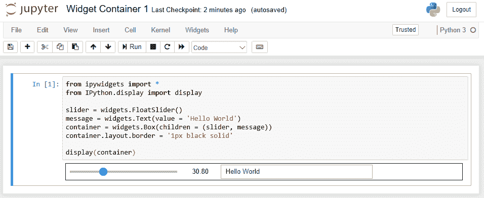

# 小部件基础

所有小部件通常以相同的方式工作：

+   你可以创建或定义一个小部件实例。

+   你可以预设小部件的属性，比如它的初始值或要显示的标签。

+   小部件可以对用户的不同输入做出反应。这些输入是通过一个处理器或 Python 函数收集的，当用户对小部件执行某些操作时，函数就会被调用。例如，当用户点击按钮时，调用处理器。

+   小部件的值可以像任何其他变量一样在脚本中使用。例如，你可以使用一个小部件来确定绘制多少个圆。

# Interact 小部件

Interact 是一个基本的小部件，似乎用于衍生所有其他小部件。它具有可变参数，依赖于参数的不同，将呈现不同种类的用户输入控制。

# Interact 小部件滑动条

我们可以使用 interact 通过传入一个范围来生成一个滑动条。例如，以下是我们的脚本：

```py
#imports 
from ipywidgets import interact 

# define a function to work with (cubes the number) 
def myfunction(arg): 
    return arg+1 

#take values from slidebar and apply to function provided 
interact(myfunction, arg=9); 
```

请注意，`interact`函数调用后的分号是必须的。

我们有一个脚本，它会执行以下操作：

+   引用我们要使用的包

+   定义一个函数，每次用户输入一个值时都会调用此函数。

+   调用`interact`，传递我们的处理函数和一系列值

当我们运行此脚本时，我们会得到一个用户可修改的滚动条：

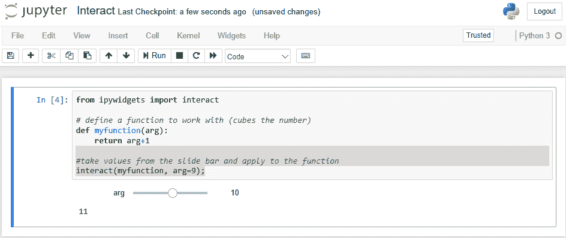

用户可以通过滑动垂直条在值的范围内滑动。上限为 27，下限为-1（假设我们可以向`interact`传递额外的参数来设置可选择的值范围）。每次`interact`小部件中的值更改时，`myfunction`都会被调用，并打印结果。因此，我们看到选中的是 27，显示的是数字 28（经过`myfunction`处理后 - 27 + 1）。

# 交互式复选框控件

我们可以根据传递给`interact`的参数来更改生成的控件类型。如果我们有以下脚本：

```py
from ipywidgets import interact
def myfunction(x):
    return x
# the second argument defines which of the interact widgets to use
interact(myfunction, x=False);
```

我们正在执行与之前相同的步骤；然而，传递的值是`False`（但它也可以是`True`）。`interact`函数检查传入的参数，判断它是布尔值，并为布尔值提供适当的控件：复选框。

如果我们在 Notebook 中运行上面的脚本，我们将得到如下显示：

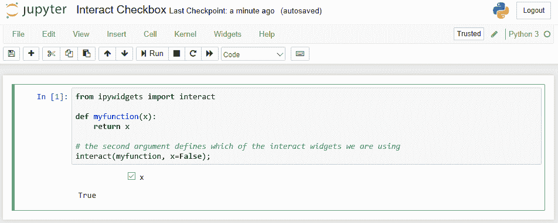

# 交互式文本框控件

我们可以通过传递不同的参数给`interact`来生成文本输入控件。例如，参见以下脚本：

```py
from ipywidgets import interact
def myfunction(x):
    return x
#since argument is a text string, interact generates a textbox control for it
interact(myfunction, x= "Hello World");
```

这会生成一个初始值为`Hello World`的文本输入控件：

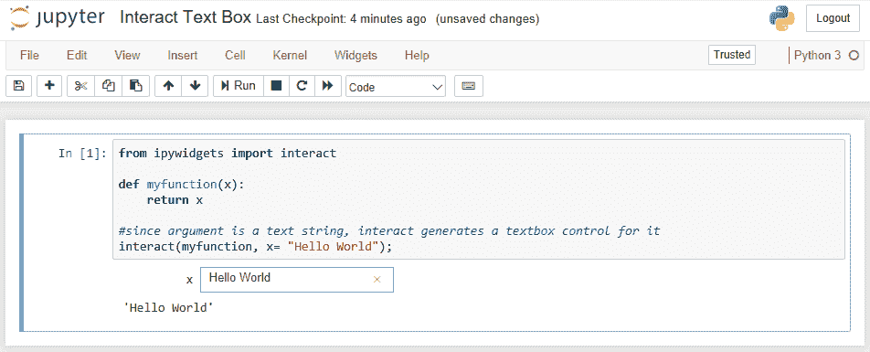

# 交互式下拉菜单

我们还可以使用`interact`函数为用户生成一个下拉列表框，让他们选择。例如，在下面的脚本中，我们生成一个包含两个选项的下拉菜单：

```py
from ipywidgets import interact 
def myfunction(x): 
    return x 
interact(myfunction, x=['red','green']); 
```

这个脚本将执行以下操作：

+   引入`interact`引用，

+   定义一个函数，每当用户更改控件值时都会调用该函数

+   调用`interact`函数并传入一组值，`interact`将解释这些值，意味着为用户创建一个下拉菜单。

如果我们在 Notebook 中运行此脚本，我们将得到以下显示：

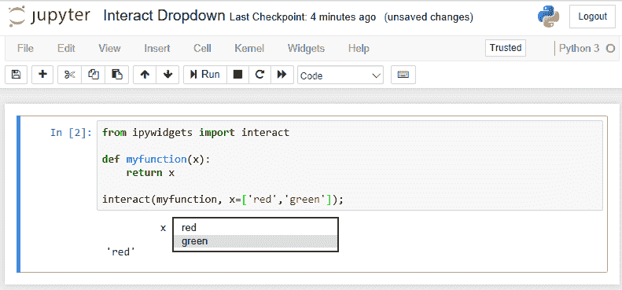

上面的截图显示，我们在底部打印的值将根据用户在下拉菜单中选择的内容而变化。

# 交互式小部件

还有一个交互式小部件。交互式小部件类似于`interact`小部件，但不会在脚本直接调用时显示用户输入控件。如果你有一些需要计算的参数，或者想在运行时决定是否需要显示控件，这会非常有用。

例如，我们可以有一个类似于之前脚本的脚本，如下所示：

```py
from ipywidgets import interactive
from IPython.display import display
def myfunction(x):
return x
w = interactive(myfunction, x= "Hello World ");
display(w)
```

我们对脚本做了几个更改：

+   我们正在引用交互式小部件

+   交互式函数返回的是一个控件，而不是立即显示一个值。

+   我们必须自己编写显示控件的脚本

如果我们运行以下脚本，用户看到的效果非常相似：

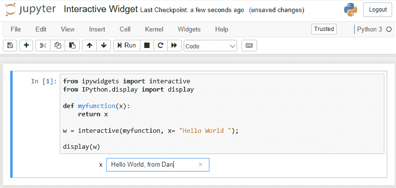

# 控件

还有另一个控件包，叫做`widgets`，它包含了你可能想要使用的所有标准控件，提供了许多可选参数，允许你自定义显示效果。

# 进度条控件

这个包中有一个控件可以向用户显示进度条。我们可以使用以下脚本：

```py
import ipywidgets as widgets 
widgets.FloatProgress( 
    value=45, 
    min=0, 
    max=100, 
    step=5, 
    description='Percent:', 
) 
```

上面的脚本将会如下所示显示我们的进度条：

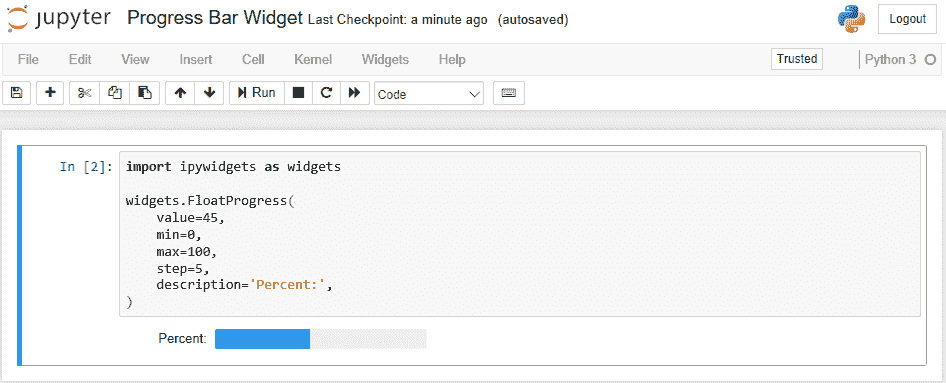

我们看到一个进度条，看起来大约是 45%。

# 列表框控件

我们也可以使用`listbox`控件，称为`Dropdown`，如下脚本所示：

```py
import ipywidgets as widgets 
from IPython.display import display 
w = widgets.Dropdown( 
    options={'Pen': 7732, 'Pencil': 102, 'Pad': 33331}, 
    description='Item:', 
) 
display(w) 
w.value 
```

这个脚本会向用户显示一个包含`Pen`、`Pencil`和`Pad`值的列表框。当用户选择其中一个值时，相关的值会返回并存储在`w`变量中，我们会像以下截图那样显示它：

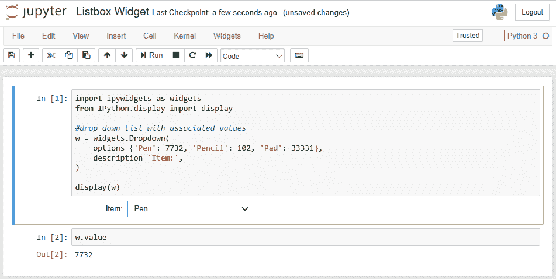

因此，我们看到了与笔相关的库存值。

# 文本控件

`text`控件从用户那里收集一个文本字符串，供脚本中的其他地方重用。文本控件有一个描述（标签）和一个值（由用户输入或在脚本中预设）。

在这个示例中，我们只会收集一个文本字符串，并将其作为脚本输出的一部分显示在屏幕上。我们将使用以下脚本：

```py
from ipywidgets import widgets
from IPython.display import display
#take the text from the box, define variable for handler
text = widgets.Text()
#display it
display(text)
def handle_submit(sender):
    print(text.value)
#when we hit return in the textbox call upon the handler
text.on_submit(handle_submit)
```

包含基本控件的 Python 包是`ipywidgets`，所以我们需要引用它。我们为文本字段定义了一个处理程序，当用户输入文本值并点击提交时，该处理程序会被调用。在这里，我们使用了`text`控件。

如果我们在 Notebook 中运行上面的脚本，显示效果如下：

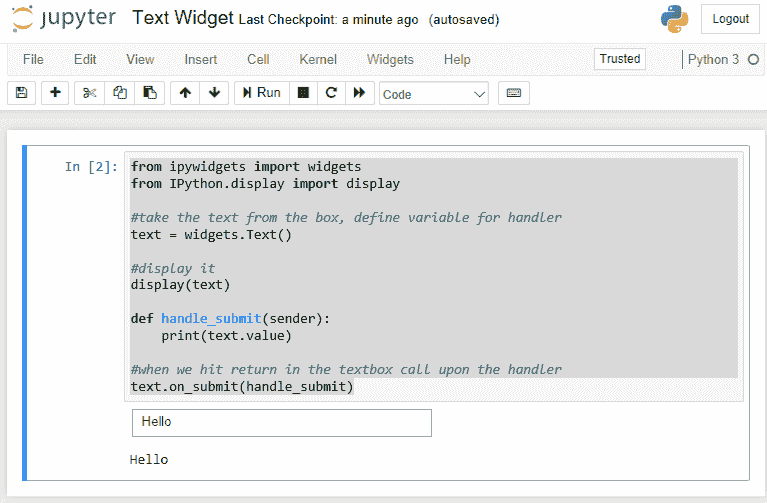

我们应该指出本页的一些亮点：

+   页面元素的排列顺序很重要。处理程序引用的文本字段必须在引用之前定义。

+   当调用控件时，控件会自动寻找与脚本相关联的处理程序。在这种情况下，我们有一个`submit`处理程序。还有许多其他处理程序可以使用。`text.on_submit`将处理程序分配给控件。

+   否则，我们将得到一个标准的 Python Notebook。

+   如果我们运行脚本（单元格 | 运行全部），我们将得到上面的截图（等待我们在文本框中输入值）：

+   所以，我们的脚本已经设置了一个控件，用于收集用户的输入，之后对这个值进行处理。（我们这里只是显示它，但我们也可以使用这个输入进行进一步处理。）

# 按钮控件

类似地，我们也可以在脚本中使用一个`Button`控件，如下例所示：

```py
from ipywidgets import widgets 
from IPython.display import display 

button = widgets.Button(description="Submit"); 
display(button) 

def on_button_clicked(widget): 
    print("Clicked Button:" + widget.description); 

button.on_click(on_button_clicked); 
```

这个脚本的功能如下：

+   引用我们想要使用的`widgets`包中的功能。

+   创建我们的按钮。

+   定义了一个按钮点击事件的处理程序。该处理程序接收被点击的`Button`对象（小部件）。

+   该处理程序显示了关于点击按钮的信息（你可以想象，如果我们有多个按钮在同一界面上，我们会希望确定是哪个按钮被点击了）。

+   最后，我们将定义的处理程序分配给我们创建的`Button`对象。

请注意处理程序代码的缩进；这是标准的 Python 风格，必须遵循。

如果我们在 Notebook 中运行前面的脚本，我们会看到如下截图：

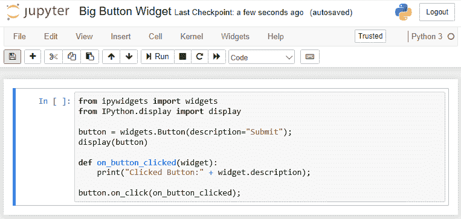

请注意以下图片底部的`Submit`按钮。你可以更改按钮的其他属性，例如位置、大小、颜色等。

如果我们点击`Submit`按钮，则会显示以下界面，显示我们关于按钮被点击的消息：

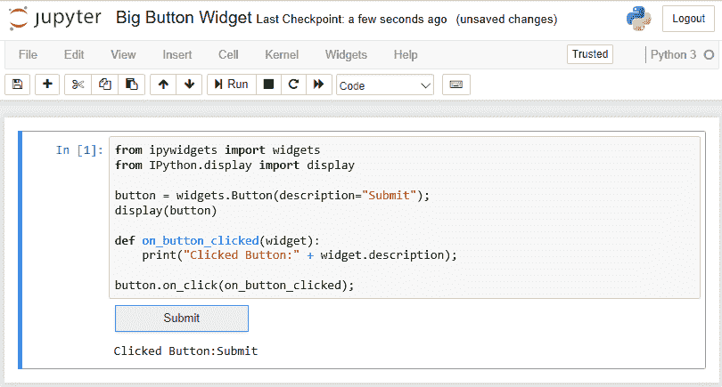

# 小部件属性

所有小部件控件都有一组可调整的显示属性。你可以通过获取一个控件的实例，并在 Notebook 中运行`control.keys`命令来查看属性列表，如下例所示：

```py
from ipywidgets import * 
w = IntSlider() 
w.keys 
```

这个脚本引入了所有小部件控件的一个通用引用。接着，我们创建一个`IntSlider`实例，并显示可以调整的属性列表。最终，我们得到如下所示的界面：

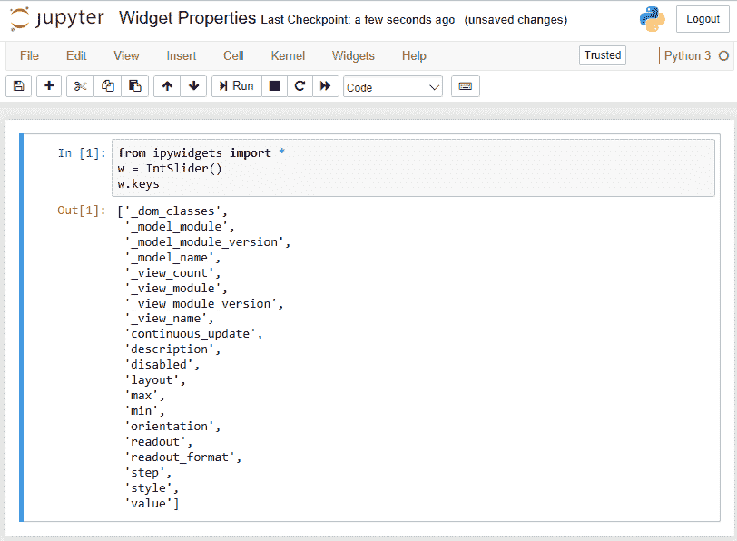

如你所见，这个列表非常全面：

| **属性** | **描述** |
| --- | --- |
| `orientation` | 是否左对齐、右对齐或居中对齐 |
| `color` | 字体颜色 |
| `height` | 控件的高度 |
| `disabled` | 控件是否被禁用 |
| `visible` | 控件是否显示？ |
| `font_style` | 字体样式，例如，斜体 |
| `min` | 最小值（在范围列表中使用） |
| `background_color` | 控件的背景颜色 |
| `width` | 控件的宽度 |
| `font_family` | 控件中文本使用的字体系列 |
| `description` | 描述字段用于文档说明 |
| `max` | 最大值（范围内） |
| `padding` | 应用的内边距（控件边缘） |
| `font_weight` | 控件中使用的字体粗细，例如，粗体 |
| `font_size` | 控件中文本的字体大小 |
| `value` | 控件选定和输入的值 |
| `margin` | 显示控件时使用的边距 |

# 调整小部件属性

我们可以在脚本中调整这些属性，例如使用以下脚本来禁用文本框（文本框仍然会显示，但用户不能输入任何值）。我们可以使用以下脚本：

```py
from ipywidgets import * 
Text(value='You can not change this text!', disabled=True) 
```

这是前面代码的截图：

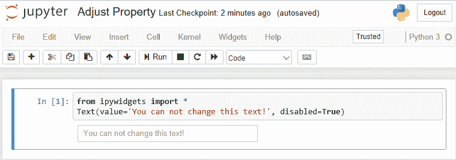

当一个字段被禁用时，文本框会变灰。当用户将光标悬停在该字段上时，会出现一个带有斜线的红色圆圈，表示该字段不能被更改。

# 调整属性

所有之前显示的属性都可以读写。我们可以通过一个小脚本来展示这个过渡，脚本如下：

```py
from ipywidgets import * 
w = IntSlider() 
original = w.value 
w.value = 5 
original, w.value 
```

该脚本创建一个滑块，获取其当前值，将值更改为 `5`，然后显示控件的原始值和当前值。

如果我们在 Notebook 中运行前面的脚本，我们将看到以下预期的结果：

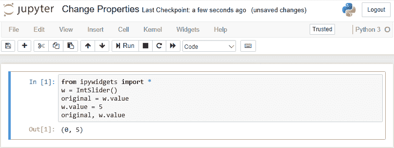

# 控件事件

所有控件都通过响应用户的操作来工作，无论是鼠标还是键盘。控件的默认操作是内置在软件中的，但你可以添加自己的事件处理（用户操作）。

我们之前见过这种事件处理（例如，在滑块的部分，每当用户改变滑块值时，都会调用一个函数）。但是，让我们更深入地探讨一下。

我们可以有以下脚本：

```py
from ipywidgets import widgets
from IPython.display import display
button = widgets.Button(description="Click Me!")
display(button)
def on_button_clicked(b):
    print("Button clicked.")
button.on_click(on_button_clicked)
```

这个脚本执行了以下操作：

+   创建一个按钮。

+   向用户显示按钮。

+   定义了一个事件处理程序的点击事件。它打印出你点击了屏幕上的消息。你可以在处理程序中写入任何你想要的 Python 语句。

+   最后，我们将点击事件处理程序与我们创建的按钮关联。所以，现在当用户点击我们的按钮时，事件处理程序被调用，并且 `Button clicked` 消息显示在屏幕上（如下面的截图所示）：

如果我们在 Notebook 中运行上面的脚本，并点击按钮几次，我们将得到以下显示：

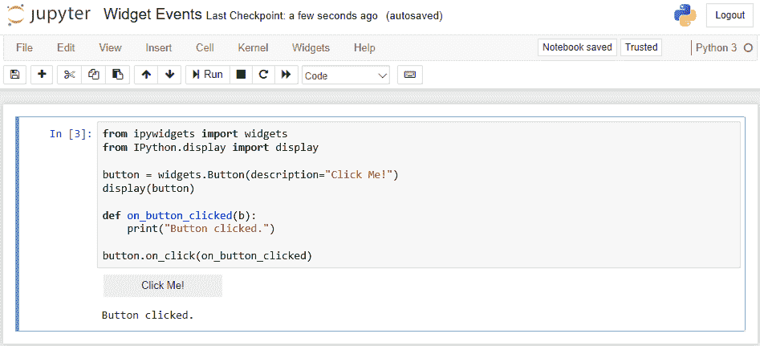

# 控件容器

你也可以直接使用 Python 语法通过将子元素传递给构造函数来组合控件容器。例如，我们可以有以下脚本：

```py
 #import our libraries 
from ipywidgets import * 
from IPython.display import display 

#create a slider and message box 
slider = widgets.FloatSlider() 
message = widgets.Text(value = 'Hello World') 

#add them to the container 
container = widgets.Box(children = (slider, message)) 
container.layout.border = '1px black solid' 

display(container) 
```

上面的脚本显示了我们正在创建一个容器（这是一个 `Box` 控件），在其中我们指定了子控件。调用显示容器的命令时，也会依次显示子元素。所以，我们最终会得到如下截图所示的显示：


你可以看到框周围的边框和框中的两个控件。

类似地，我们也可以在容器显示后，使用如下语法将子元素添加到容器中：

```py
from ipywidgets import * 
from IPython.display import display 
container = widgets.Box() 
container.layout.border = '1px black solid' 
display(container) 
slider = widgets.FloatSlider() 
message = widgets.Text(value='Hello World') 
container.children=[slider, message] 
```

当我们将子元素添加到容器时，容器会重新绘制，这会导致所有子元素的重新绘制。

如果我们在另一个 Notebook 中运行这个脚本，我们将得到一个与之前示例非常相似的结果，显示如下截图所示：

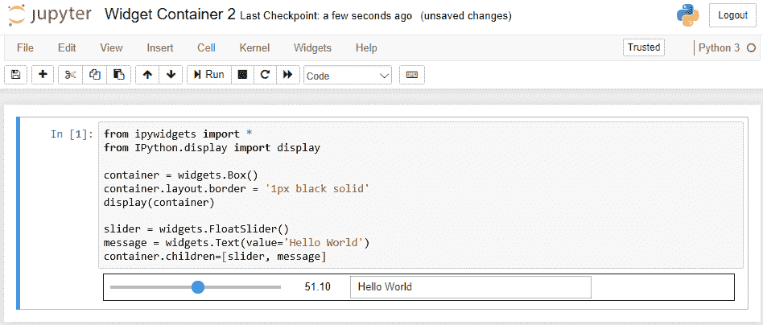

# 总结

在本章中，我们将控件添加到了我们的 Jupyter 安装中，并使用了 interact 和 interactive 控件来产生各种用户输入控件。然后，我们深入研究了控件包，调查了可用的用户控件、容器中的可用属性、从控件发出的事件以及如何为控件构建容器。

在下一章中，我们将探讨共享笔记本并将其转换为不同格式。
