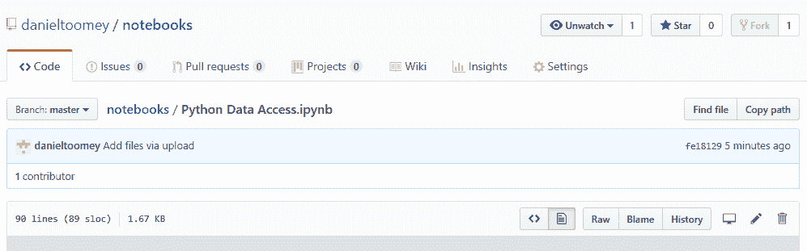
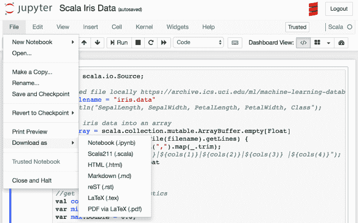
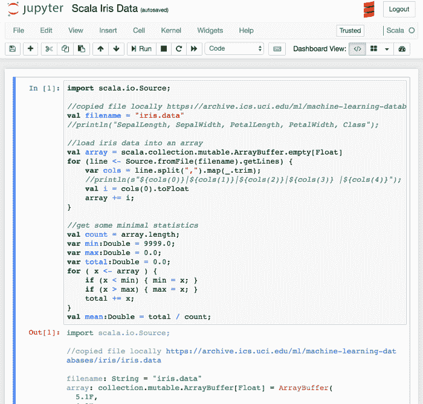
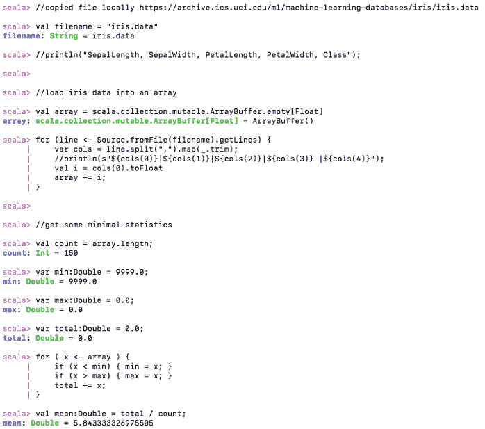
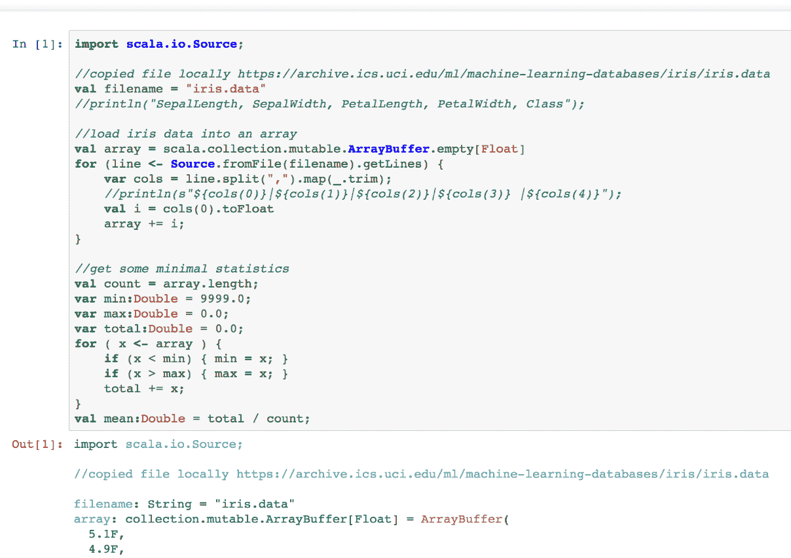
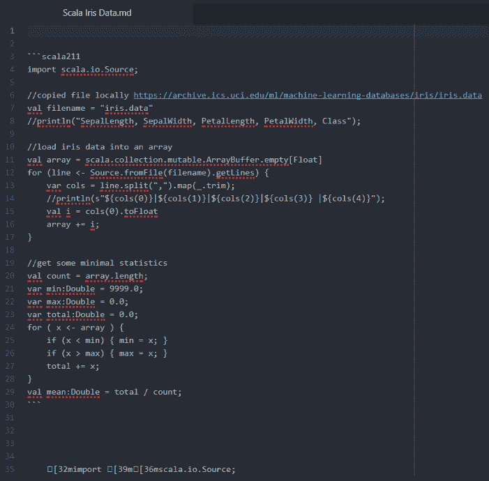
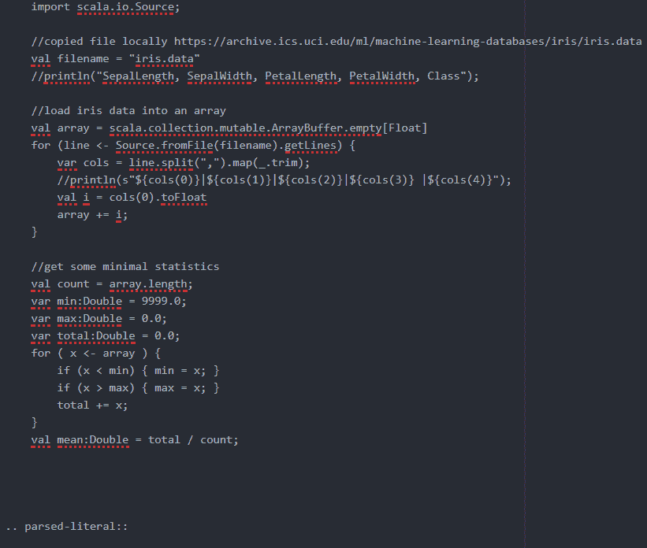

# 第十章：分享与转换 Jupyter 笔记本

一旦你开发好了笔记本，你就可能希望与其他人分享。我们将在本章中介绍一个典型的分享机制——将你的笔记本放置在一个可访问的互联网上的服务器上。

当你将一个笔记本提供给另一个人时，他们可能需要以不同的格式接收笔记本，以满足他们的系统要求。我们还将介绍一些机制，帮助你将笔记本以不同格式提供给他人。

在本章中，我们将涵盖以下主题：

+   分享笔记本

+   转换笔记本

# 分享笔记本

分享笔记本的典型机制是将笔记本放置在一个网站上。网站运行在一个服务器或分配的机器空间上。服务器处理所有与运行网站相关的事务，例如跟踪多个用户并进行用户登录和注销。

然而，为了使笔记本能够被使用，网站必须安装笔记本逻辑。一个典型的网站知道如何根据一些源文件将内容作为 HTML 交付。最基本的形式是纯 HTML，其中你在网站上访问的每一页都与 Web 服务器上的一个 HTML 文件完全对应。其他语言也可以用来开发网站（例如 Java 或 PHP），因此服务器需要知道如何从这些源文件中访问所需的 HTML。在我们的上下文中，服务器需要知道如何访问你的笔记本，以便将 HTML 交付给用户。

即使笔记本仅在你的本地机器上运行，它们也是通过浏览器访问你的本地机器（服务器），而不是通过互联网——因此，Web、HTML 和互联网访问已经被提供。

如果笔记本位于一个真实的网站上，那么所有能够访问该网站的人都可以使用它——无论服务器是在你办公室环境中的本地网络上运行，还是可以通过互联网供所有用户访问。

你始终可以为网站增加安全措施，以确保只有那些你授权的用户才能使用你的笔记本。安全机制取决于所使用的 Web 服务器软件类型。

# 在笔记本服务器上分享笔记本

Jupyter 过程内置了将笔记本暴露为其自身 Web 服务器的功能。假设服务器是一个其他用户可以访问的机器，你可以配置 Jupyter 在该服务器上运行。你必须向 Jupyter 提供配置信息，以便它知道如何进行。生成 Jupyter 安装配置文件的命令如下所示：

请注意，由于我们是在 Anaconda 中运行，我正在从该目录中运行命令：

```py
C:\Users\Dan\Anaconda3\Scripts>jupyter notebook --generate-config
```

默认的`config`文件被写入：`C:\Users\Dan\.jupyter\jupyter_notebook_config.py`。

此命令将在你的`~./jupyter`目录中生成一个`jupyter_notebook_config.py`文件。对于 Microsoft 用户，该目录是你主目录下的一个子目录。

配置文件包含了您可以用来将笔记本暴露为服务器的设置：

```py
c.NotebookApp.certfile = u'/path/to/your/cert/cert.pem'
c.NotebookApp.keyfile = u'/ path/to/your/cert/key.key'
c.NotebookApp.ip = '*'
c.NotebookApp.password = u'hashed-password'
c.NotebookApp.open_browser = False
c.NotebookApp.port = 8888
```

文件中的设置在下表中进行了说明：

| **设置** | **描述** |
| --- | --- |
| `c.NotebookApp.certfile` | 这是您网站证书的文件路径。如果您有 SSL 证书，您需要更改该设置以指向文件的位置。该文件可能不是 `.PEM` 扩展名的文件。SSL 证书有多种格式。 |
| `c.NotebookApp.keyfile` | 这是访问您网站证书密钥位置的路径。与其直接指定证书密钥，您应该将密钥存储在一个文件中。所以，如果您想为您的笔记本应用 SSL 证书，您需要指定该文件的位置。密钥通常是一个非常大的十六进制数字，因此它被存储在自己的文件中。此外，将其存储在文件中提供了额外的保护，因为密钥存储所在的目录通常有有限的访问权限。 |
| `c.NotebookApp.ip` | 机器的 IP 地址。使用通配符 `*` 来开放给所有人。这里，我们指定了访问笔记本网站的机器的 IP 地址。 |
| `c.NotebookApp.password` | 哈希密码——用户访问您的笔记本时需要提供密码，以响应标准的登录验证。 |
| `c.NotebookApp.open_browser` | `True`/`False`——启动笔记本服务器时是否打开浏览器窗口？ |
| `c.NotebookApp.port` | 用于访问您的服务器的端口；它应该对机器开放。 |

每个网站在较低层次上通过 IP 地址进行定位。IP 地址是一个四部分的数字，用于标识所涉及服务器的位置。IP 地址可能类似于 `172.32.88.7`。

网络浏览器与互联网软件协同工作，知道如何使用 IP 地址来定位目标服务器。该软件套件也知道如何将您在浏览器中提到的 URL（例如 [`www.microsoft.com`](http://www.microsoft.com)）转化为 IP 地址。

一旦您适当地更改了设置，您应该能够在浏览器中访问配置的 URL 来访问您的笔记本。该 URL 将是 HTTP 或 HTTPS（取决于是否应用了 SSL 证书）、IP 地址和端口的组合，例如 `HTTPS://123.45.56.9:8888`。

# 在笔记本服务器上共享加密的笔记本

如果您有 SSL 证书可以应用，之前展示的两项设置可以使用。如果没有 SSL 证书，密码（如前所述）以及所有其他交互将在用户的浏览器和服务器之间以明文传输。如果您在笔记本中处理敏感信息，应该获取 SSL 证书并为您的服务器做出相应的设置更改。

如果你需要更高的安全性来保护笔记本的访问，下一步是提供一个 SSL 证书（将证书放在你的计算机上，并在配置文件中提供路径）。有许多公司提供 SSL 证书。截止目前，最便宜的是*Let's encrypt*，它会免费提供一个低级别的 SSL 证书。（SSL 证书有不同等级，有些是需要付费的。）

再次说明，一旦你设置了有关证书的前述设置，你就可以通过`HTTPS://`前缀访问你的笔记本服务器，并且可以确保用户浏览器和笔记本服务器之间的所有传输都是加密的，因此是安全的。

# 在 Web 服务器上共享笔记本

为了将你的笔记本添加到现有的 Web 服务器中，你需要执行前面的步骤，并在笔记本的配置文件中添加一些额外的信息，如下例所示：

```py
c.NotebookApp.tornado_settings = {
'headers': {
'Content-Security-Policy': "frame-ancestors 'https://yourwebsite.com' 'self' "
}
}
```

在这里，你需要将`yourwebsite.com`替换为你网站的 URL。

完成后，你可以通过你的网站访问笔记本。

# 通过 Docker 共享笔记本

Docker 是一个开源的、轻量级的容器，用于分发软件。一个典型的 Docker 实例在机器的某个端口上运行着一个完整的 Web 服务器和一个特定的 Web 应用。Docker 实例中运行的软件的具体信息由 Dockerfile 控制。该文件向 Docker 环境提供命令，指示使用哪些组件来配置该实例。一个用于 Jupyter 实现的 Dockerfile 示例如下：

```py
ENV TINI_VERSION v0.6.0
ADD https://github.com/krallin/tini/releases/download/${TINI_VERSION}/tini /usr/bin/tini
RUN chmod +x /usr/bin/tini
ENTRYPOINT ["/usr/bin/tini", "--"]
EXPOSE 8888
CMD ["jupyter", "Notebook", "--port=8888", "--no-browser", "--ip=0.0.0.0"]
```

以下是对每个 Dockerfile 命令的讨论：

+   `ENV`命令告诉 Docker 使用一个专用的操作系统。这是必要的，因为 Jupyter 存在一个缺陷，会不断地从你的计算机上获取和释放资源。

+   `ADD`命令告诉 Docker`tini`代码的位置。

+   `RUN`命令改变`tini`目录的访问权限。

+   `ENTRYPOINT`命令告诉 Docker 使用什么作为 Docker 实例的操作系统。

+   `EXPOSE`命令告诉 Docker 要在哪个端口上公开你的笔记本。

+   `CMD`命令告诉 Docker 在环境设置好之后运行哪些命令。`CMD`参数告诉你熟悉的`jupyter Notebook`命令，它用于在你的机器上启动 Jupyter。

一旦 Docker 实例部署到你的 Docker 机器上，你可以在指定的端口（`8888`）访问该 Docker 实例，例如，`http://machinename.com:8888`。

# 在公共服务器上共享笔记本

当前，有一个托管公司允许你免费托管笔记本：GitHub。GitHub 是源代码管理系统（Git 源代码管理）的标准 Web 提供商。源代码管理用于保持文件的历史版本，帮助你回溯步骤。

GitHub 的实现包括了您在笔记本中使用所需的所有工具，这些工具已经安装在服务器上。例如，在前面的章节中，如果您想在笔记本中使用 R 编程，您需要在自己的计算机上安装 R 工具集。而 GitHub 已经完成了这些步骤。

访问 [`github.com/`](https://github.com/) 网站并注册一个免费的账户。

登录后，您将获得一个可以添加内容的网站。如果您有开发工具（`git` 推送命令是程序员用来将文件存储到 Git 服务器上的命令），您可以使用这些工具，或者直接将您的笔记本文件（`ipynb`）拖放到您的 GitHub 网站上。

我在那里创建了一个帐户，包含一个 `notebooks` 目录，并将其中一个 `notebooks` 文件放置到该网站上。我的 GitHub 网站如下所示：



您可以看到 `Python Data Access.ipynb` 文件位于屏幕的顶部。

如果您点击该 `notebooks` 文件，您将在浏览器中看到预期的笔记本运行效果。

注意：目前在 GitHub 上运行 `notebooks` 存在问题。之前是可以正常工作的。我预计会有修复措施来重新启用 Jupyter。

如果您回顾上一章，您会看到相同的显示（去掉了 GitHub 装饰元素）。

这个笔记本可以通过以下 URL 直接访问： [`github.com/danieltoomey/notebooks/blob/master/Python%20Data%20Access.ipynb`](https://github.com/danieltoomey/notebooks/blob/master/Python%20Data%20Access.ipynb)。因此，您可以将您的笔记本提供给其他用户，只需将 URL 交给他们即可。

当您登录 GitHub 后，显示界面会略有不同，因为您将对 GitHub 内容有更多的控制权限。

# 转换笔记本

将笔记本转换为其他格式的标准工具是使用 `nbconvert` 工具。它已内置在您的 Jupyter 安装中。您可以直接在笔记本的用户界面中访问该工具。如果您打开一个笔记本并选择 Jupyter 文件菜单项，您将看到多个“另存为”选项：



选项包括：

| **格式类型** | **文件扩展名** |
| --- | --- |
| Notebook | `.ipynb` |
| Scala211 | `.scala` |
| HTML | `.html` |
| Markdown | `.md` |
| reST | `.rst` |
| LaTeX | `.tex` |
| PDF via LaTeX | `.pdf` |

注意：由于我们使用的是 Scala 笔记本，因此第二个选项中提供的是该语言。如果我们有其他语言的笔记本，那么该语言将是选择项。

对于这些示例，如果我们从前一章节中取出一个笔记本，Jupyter 笔记本看起来是这样的：



# 笔记本格式

笔记本格式（`.ipynb`）是笔记本的原生格式。我们在前面的章节中已经查看过该文件，了解 Jupyter 在笔记本中存储了什么内容。

如果您想让其他用户完全访问您的 Notebook，可以使用 Notebook 格式，因为他们将从自己的系统运行您的 Notebook。

您也可能想这样做，以便将您的 Notebook 保存在其他介质中。

# Scala 格式

Scala 格式（`.scala`）对应于您的 Notebook 的 Scala 实现。如果您使用 JavaScript 作为 Notebook 的语言，这将是 Notebook 页面的直接导出。

如果您使用了其他语言（例如 Python）编写 Notebook 脚本，那么“下载为”选项会相应变化，例如“下载为 | Python（`.py`）”。

使用我们的示例，如预期的那样，Scala 格式等同于 Jupyter 显示：

```py
import scala.io.Source; 

//copied file locally https://archive.ics.uci.edu/ml/machine-learning-databases/iris/iris.data 
val filename = "iris.data" 
//println("SepalLength, SepalWidth, PetalLength, PetalWidth, Class"); 

//load iris data into an array 
val array = scala.collection.mutable.ArrayBuffer.empty[Float] 
for (line <- Source.fromFile(filename).getLines) { 
 var cols = line.split(",").map(_.trim); 
 //println(s"${cols(0)}|${cols(1)}|${cols(2)}|${cols(3)} |${cols(4)}"); 
 val i = cols(0).toFloat 
 array += i; 
} 

//get some minimal statistics 
val count = array.length; 
var min:Double = 9999.0; 
var max:Double = 0.0; 
var total:Double = 0.0; 
for ( x <- array ) { 
 if (x < min) { min = x; } 
 if (x > max) { max = x; } 
 total += x; 
} 
val mean:Double = total / count; 
```

使用 Scala 格式，您可以直接使用 Scala 解释器运行脚本。在 macOS 下，有 `scala` 命令。Windows 系统也有类似的工具。

此外，对于其他脚本语言，您应该能够在适当的解释器中运行脚本。

如果我们从命令行窗口运行此 Scala 文件，我们可以看到预期的结果：



# HTML 格式

HTML（`.html`）格式对应于在网页浏览器中显示页面所需的 HTML，就像在 Notebook 中看到的那样。生成的 HTML 没有任何编码逻辑；它仅包含显示类似页面所需的 HTML。

HTML 格式对传递 Notebook 的结果给另一个用户也非常有用。如果您想将 Notebook 通过电子邮件发送给其他用户（此时原始 HTML 会通过电子邮件客户端应用程序传输并可查看），那么使用 HTML 格式非常合适。

如果您有可用的 web 服务，可以插入新页面，那么 HTML 格式也很有用。如果 web 服务器不支持 Jupyter 文件（请参考本章的第一节），那么 HTML 可能是您的唯一选择。同样，即使 web 服务器支持 Jupyter，您可能也不希望直接交给用户您的源 Jupyter Notebook（`.ipynb`）文件。

导出的 HTML 格式在浏览器中的显示效果如下：



请注意，Jupyter 的标题信息不会显示或提供。否则，它看起来与 Jupyter 显示完全相同。

# Markdown 格式

markdown（`.md`）格式是 **超文本标记语言**（**HTML**）的简化版本。`.md` 文件可由某些工具使用，通常作为软件分发的 README 文件格式（在这种情况下，客户端的显示能力可能非常有限）。

例如，同一 Notebook 的 markdown 格式如下所示：

```py

```scala211

import scala.io.Source;

//从本地复制文件 https://archive.ics.uci.edu/ml/machine-learning-databases/iris/iris.data

val filename = "iris.data"

//println("花萼长度, 花萼宽度, 花瓣长度, 花瓣宽度, 分类");

//将 iris 数据加载到数组中

val array = scala.collection.mutable.ArrayBuffer.empty[Float]

for (line <- Source.fromFile(filename).getLines) {

var cols = line.split(",").map(_.trim);

//println(s"${cols(0)}|${cols(1)}|${cols(2)}|${cols(3)} |${cols(4)}");

val i = cols(0).toFloat

array += i;

}

//获取一些最小统计数据

val count = array.length;

var min:Double = 9999.0;

var max:Double = 0.0;

var total:Double = 0.0;

for ( x <- array ) {

if (x < min) { min = x; }

if (x > max) { max = x; }

total += x;

}

val mean:Double = total / count;

```py 
```

显然，Markdown 格式是一种非常基础的显示格式。它只有少量的文本标记，帮助读者区分不同的格式。我使用 Atom 编辑器查看在解析时的显示效果：



再次显示的是非常干净的界面，仍然类似于 Jupyter Notebook 的显示，文件底部有一些奇怪的编码和大量的转义字符。不确定为什么会这样。

# 重结构化文本格式

重结构化文本格式（`.rst`）是一种简单的纯文本标记语言，偶尔用于编程文档。它看起来与前面讨论的 `.md` 格式非常相似。

例如，示例页面的 RST 格式如下所示：

```py

.. code:: scala 

 import scala.io.Source; 

 //copied file locally https://archive.ics.uci.edu/ml/machine-learning-databases/iris/iris.data 
 val filename = "iris.data" 
 //println("SepalLength, SepalWidth, PetalLength, PetalWidth, Class"); 

 //load iris data into an array 
 val array = scala.collection.mutable.ArrayBuffer.empty[Float] 
 for (line <- Source.fromFile(filename).getLines) { 
 var cols = line.split(",").map(_.trim); 
 //println(s"${cols(0)}|${cols(1)}|${cols(2)}|${cols(3)} |${cols(4)}"); 
 val i = cols(0).toFloat 
 array += i; 
 } 

 //get some minimal statistics 
 val count = array.length; 
 var min:Double = 9999.0; 
 var max:Double = 0.0; 
 var total:Double = 0.0; 
 for ( x <- array ) { 
 if (x < min) { min = x; } 
 if (x > max) { max = x; } 
 total += x; 
 } 
 val mean:Double = total / count; 

.. parsed-literal:: 
... 
```

如你所见，这与前面的 Markdown 示例类似；代码大致分为几个块。

使用 Atom 显示 `.rst` 文件会得到如下结果：



`.rst` 显示没有其他格式那样漂亮。

# LaTeX 格式

LaTeX 是一种来自 1970 年代末的排版格式，至今仍在许多 Unix 衍生系统中用于生成手册等。

Jupyter 使用 LaTeX 包将笔记本的图像导出为 PDF 文件。为了使其正常工作，你需要在计算机上安装这个包。在 macOS 上，这涉及以下步骤：

+   安装 LaTeX —— Windows 和 macOS 有不同的安装方式。

+   在 macOS 上，我尝试使用 MacTeX。你必须使用 Safari 下载该包。它提示格式错误，我不得不多次重试。

+   在 Windows 上，我尝试使用 TeXLive。它试图下载数百个字体。

+   以下是（macOS）字体相关的命令：

    +   `sudo tlmgr install adjustbox`

    +   `sudo tlmgr install collection-fontsrecommended`

请注意，这个安装过程相当繁琐。我已经安装了完整的 LaTeX，但后来又有提示要安装一个小版本的 LaTeX，并且安装字体时非常麻烦。我对这些步骤在 Windows 机器上是否能正确执行信心不足。

如果你没有完整的包，尝试下载 PDF 文件时，Notebook 会打开一个新屏幕，并显示一条长长的错误信息，告诉你缺少哪个部分。

你可以下载一个适用于你使用的操作系统的文本文件阅读器。我为我的 macOS 下载了 MacTeX。

注意：你需要一个 Tex 解释器，才能进行下一步的 PDF 下载，因为它使用 Tex 作为开发 PDF 文件的基础。

# PDF 格式

PDF（`.pdf`）格式是一种广泛使用的展示格式，适用于多种用途。PDF 是一个很好的格式，能够向其他用户传递不可修改的内容。其他用户将无法以任何方式修改结果，但他们能够查看并理解你的逻辑。

PDF 生成依赖于 LaTeX 正确安装。这次我没能成功运行它。在之前的版本中，我曾在 Windows 和 Mac 上成功安装过。

# 总结

在这一章中，我们在 Notebook 服务器上共享了 Notebooks。我们将 Notebook 添加到我们的 Web 服务器，并通过 GitHub 分发了一个 Notebook。我们还探讨了将 Notebooks 转换为不同格式的方式，如 HTML 和 PDF。

在下一章，我们将探讨如何允许多个用户同时与 Notebook 进行交互。
