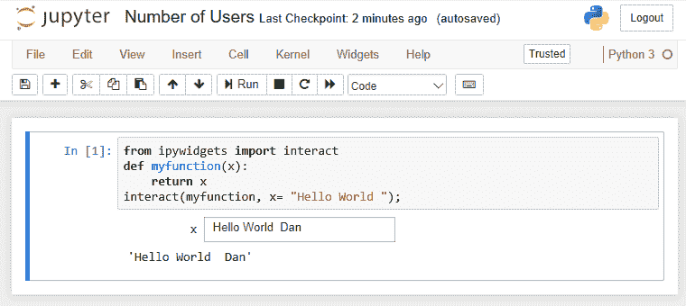
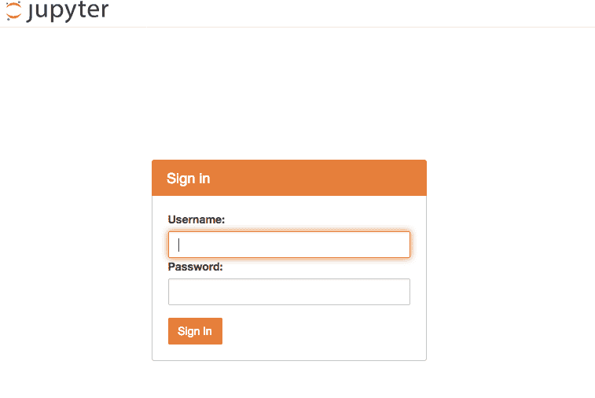
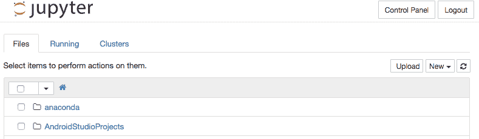
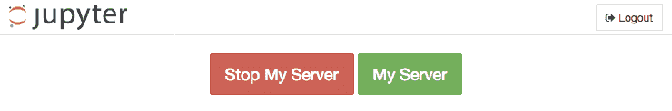
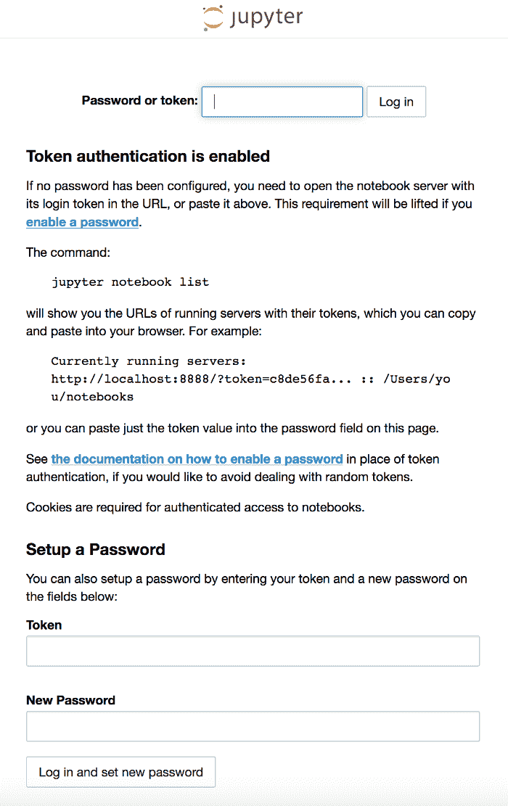
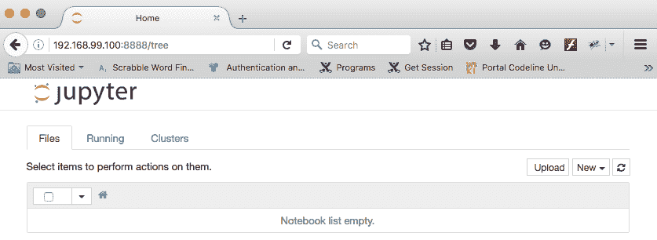
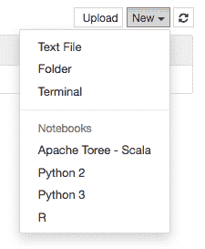

# 第十一章：多用户 Jupyter Notebooks

Jupyter Notebooks 本身具有可被用户修改的能力，当用户输入数据或做出选择时，Notebook 会做出相应变化。然而，标准的 Notebook 服务器软件存在一个问题，它没有考虑到同时有多个用户在同一个 Notebook 上工作。Notebook 服务器软件是底层的 Jupyter 软件，负责显示页面并与用户交互——它根据你的 Notebook 中的指令进行显示和交互。

一个 Notebook 服务器，实际上是一个专用的互联网 Web 服务器，通常会为每个用户创建一个新的执行路径或线程，以便支持多个用户。当一个较低级别的子例程用于所有实例时，如果没有正确考虑每个用户拥有自己一组数据的情况，就会出现问题。

请注意，本章中的一些代码/安装可能在 Windows 环境下无法运行。

在本章中，我们将探讨以下内容：

+   给出一个例子，说明在标准 Jupyter 安装中，当多个用户同时访问同一个 Notebook 时会发生的问题。

+   使用新版本的 Jupyter，JupyterHub，它是通过扩展 Jupyter 特别为解决多用户问题而开发的。

+   另外，使用 Docker，一种允许多个软件实例同时运行的工具，以解决这个问题。

# 一个示例交互式 Notebook

在本章中，我们将使用一个简单的 Notebook，要求用户提供一些信息，并显示特定的信息。

例如，我们可以有一个像这样的脚本（取自前面章节 第九章，*交互式小部件*）：

```py
from ipywidgets import interact 
def myfunction(x): 
    return x 
interact(myfunction, x= "Hello World "); 
```

这个脚本向用户展示一个文本框，文本框内的原始值为 `Hello World` 字符串。当用户与输入字段互动并修改其值时，脚本中的 `x` 变量的值也会相应变化，并显示在屏幕上。例如，我将值更改为字母 `A`：



我们可以看到多用户问题：如果我们在另一个浏览器窗口中打开相同的页面（复制 URL，打开新浏览器窗口，粘贴 URL，按下*Enter*键），我们会看到完全相同的显示。新窗口应该从一个新的脚本开始，只是提示你默认的 `Hello World` 信息。然而，由于 Jupyter 服务器软件只期望一个用户，因此只有一个 `x` 变量的副本，所以它显示了它的值。

# JupyterHub

一旦 Jupyter Notebooks 被共享，显然需要解决多用户问题。于是开发了一个新的 Jupyter 软件版本，叫做**JupyterHub**。JupyterHub 专门设计用来处理多个用户，每个用户都有自己的一组变量来操作。实际上，系统会为每个用户提供一个全新的 Jupyter 软件实例——这是一种**强力方法**，但它有效。

当 JupyterHub 启动时，它会启动一个中心或控制代理。该中心将启动一个用于处理 Jupyter 请求的监听器或代理。当代理接收到 Jupyter 的请求时，它将它们交给中心处理。如果中心判断这是一个新用户，它将为他们生成一个新的 Jupyter 服务器实例，并将所有后续的用户与 Jupyter 的交互附加到他们自己的服务器版本上。

# 安装

JupyterHub 需要 Python 3.3 或更高版本，并且我们将使用 Python 工具 `pip3` 来安装 JupyterHub。您可以通过在命令行中输入 `Python` 来检查您正在运行的 Python 版本，前言将回显当前版本。例如，请参阅以下内容：

```py
Python 
Python 3.6.0a4 (v3.6.0a4:017cf260936b, Aug 15 2016, 13:38:16)  
[GCC 4.2.1 (Apple Inc. build 5666) (dot 3)] on darwin 
Type "help", "copyright", "credits" or "license" for more information. 
```

如果您需要升级到新版本，请参考 [`python.org`](http://python.org) 上的说明，因为它们针对操作系统和 Python 版本有具体的要求。

JupyterHub 的安装方式与其他软件类似，使用以下命令：

```py
npm install -g configurable-http-proxy
pip3 install jupyterhub
```

首先，安装代理。在代理安装中 `-g` 表示将该软件对所有用户可用：

```py
npm install -g configurable-http-proxy 
/usr/local/bin/configurable-http-proxy -> /usr/local/lib/node_modules/configurable-http-proxy/bin/configurable-http-proxy 
/usr/local/lib 
└─┬ configurable-http-proxy@1.3.0  
 ├─┬ commander@2.9.0 
 │ └── graceful-readlink@1.0.1 
 ├─┬ http-proxy@1.13.3 
 │ ├── eventemitter3@1.2.0 
 │ └── requires-port@1.0.0 
 ├─┬ lynx@0.2.0 
 │ ├── mersenne@0.0.3 
 │ └── statsd-parser@0.0.4 
 ├── strftime@0.9.2 
 └─┬ winston@2.2.0 
 ├── async@1.0.0 
 ├── colors@1.0.3 
 ├── cycle@1.0.3 
 ├── eyes@0.1.8 
 ├── isstream@0.1.2 
 ├── pkginfo@0.3.1 
 └── stack-trace@0.0.9 

```

然后，我们安装 JupyterHub：

```py
pip3.6 install jupyterhub 
Collecting jupyterhub 
 Downloading jupyterhub-0.6.1-py3-none-any.whl (1.3MB) 
 100% |████████████████████████████████| 1.4MB 789kB/s 
Collecting requests (from jupyterhub) 
 Downloading requests-2.11.1-py2.py3-none-any.whl (514kB) 
 100% |████████████████████████████████| 522kB 1.5MB/s 
Collecting traitlets>=4.1 (from jupyterhub) 
 Downloading traitlets-4.2.2-py2.py3-none-any.whl (68kB) 
 100% |████████████████████████████████| 71kB 4.3MB/s 
Collecting sqlalchemy>=1.0 (from jupyterhub) 
 Downloading SQLAlchemy-1.0.14.tar.gz (4.8MB) 
 100% |████████████████████████████████| 4.8MB 267kB/s 
Collecting jinja2 (from jupyterhub) 
 Downloading Jinja2-2.8-py2.py3-none-any.whl (263kB) 
 100% |████████████████████████████████| 266kB 838kB/s 
... 
```

# 操作

现在我们可以直接从命令行启动 JupyterHub：

```py
jupyterhub 
```

这将导致在命令控制台窗口中显示以下内容：

```py
[I 2016-08-28 14:30:57.895 JupyterHub app:643] Writing cookie_secret to /Users/dtoomey/jupyterhub_cookie_secret 
[W 2016-08-28 14:30:57.953 JupyterHub app:304]  
 Generating CONFIGPROXY_AUTH_TOKEN. Restarting the Hub will require restarting the proxy. 
 Set CONFIGPROXY_AUTH_TOKEN env or JupyterHub.proxy_auth_token config to avoid this message. 

[W 2016-08-28 14:30:57.962 JupyterHub app:757] No admin users, admin interface will be unavailable. 
[W 2016-08-28 14:30:57.962 JupyterHub app:758] Add any administrative users to `c.Authenticator.admin_users` in config. 
[I 2016-08-28 14:30:57.962 JupyterHub app:785] Not using whitelist. Any authenticated user will be allowed. 
[I 2016-08-28 14:30:57.992 JupyterHub app:1231] Hub API listening on http://127.0.0.1:8081/hub/ 
[E 2016-08-28 14:30:57.998 JupyterHub app:963] Refusing to run JuptyterHub without SSL. If you are terminating SSL in another layer, pass --no-ssl to tell JupyterHub to allow the proxy to listen on HTTP. 
```

请注意，脚本已完成，但默认情况下不会为您在浏览器中打开窗口，就像标准 Jupyter 安装中那样。

更重要的是最后一行的输出（也以红色打印在屏幕上），`拒绝在没有 SSL 的情况下运行 JupyterHub`。JupyterHub 特别构建用于多用户登录和使用单个 Notebook，因此它在抱怨期望它具有运行 SSL（以确保用户交互安全）。

最后一行的后半部分提示我们应该怎么做 —— 我们需要告诉 JupyterHub 我们没有使用证书/SSL。我们可以使用 `--no-ssl` 参数来做到这一点，如下所示：

```py
Jupyterhub --no-ssl 
```

这将导致在控制台中显示预期的结果，并使服务器继续运行：

```py
[I 2016-08-28 14:43:15.423 JupyterHub app:622] Loading cookie_secret from /Users/dtoomey/jupyterhub_cookie_secret 
[W 2016-08-28 14:43:15.447 JupyterHub app:304]  
 Generating CONFIGPROXY_AUTH_TOKEN. Restarting the Hub will require restarting the proxy. 
 Set CONFIGPROXY_AUTH_TOKEN env or JupyterHub.proxy_auth_token config to avoid this message. 

[W 2016-08-28 14:43:15.450 JupyterHub app:757] No admin users, admin interface will be unavailable. 
[W 2016-08-28 14:43:15.450 JupyterHub app:758] Add any administrative users to `c.Authenticator.admin_users` in config. 
[I 2016-08-28 14:43:15.451 JupyterHub app:785] Not using whitelist. Any authenticated user will be allowed. 
[I 2016-08-28 14:43:15.462 JupyterHub app:1231] Hub API listening on http://127.0.0.1:8081/hub/ 
[W 2016-08-28 14:43:15.468 JupyterHub app:959] Running JupyterHub without SSL. There better be SSL termination happening somewhere else... 
[I 2016-08-28 14:43:15.468 JupyterHub app:968] Starting proxy @ http://*:8000/ 
14:43:15.867 - info: [ConfigProxy] Proxying http://*:8000 to http://127.0.0.1:8081 
14:43:15.871 - info: [ConfigProxy] Proxy API at http://127.0.0.1:8001/api/routes 
[I 2016-08-28 14:43:15.900 JupyterHub app:1254] JupyterHub is now running at http://127.0.0.1:8000/ 
```

如果现在我们访问最后一行输出中显示的 URL（`http://127.0.0.1:8000/`[)](http://127.0.0.1:8000/)），我们将进入 JupyterHub 的登录界面：



因此，我们已经避免了需要 SSL，但我们仍然需要为系统配置用户。

JupyterHub 软件使用配置文件来确定其工作方式。您可以使用 JupyterHub 生成配置文件，并使用以下命令提供默认值：

```py
jupyterhub --generate-config 
Writing default config to: jupyterhub_config.py 
```

生成的配置文件可用近 500 行。示例文件的开头如下所示：

```py
# Configuration file for jupyterhub.
c = get_config()

#------------------------------------------------------------------------------
# JupyterHub configuration
#------------------------------------------------------------------------------

# An Application for starting a Multi-User Jupyter Notebook server.
# JupyterHub will inherit config from: Application

# Include any kwargs to pass to the database connection. See
# sqlalchemy.create_engine for details.
# c.JupyterHub.db_kwargs = {}

# The base URL of the entire application

# c.JupyterHub.base_url = '/'
…
```

如您所见，大多数配置设置前面都有一个井号（`#`），表示它们已被注释掉。提到的设置是将要应用的默认值。如果您需要更改某个设置，您需要去掉前面的井号并更改等号（`=`）右侧的值。顺便说一下，这是一种测试更改的好方法：进行一次更改，保存文件，尝试更改，继续进行其他更改。如果过程中某个更改未按预期工作，您只需恢复井号前缀即可恢复到工作状态。

我们将查看一些可用的配置选项。值得注意的是，文件中的许多设置是 Python 设置，而不是特定于 JupyterHub 的。项目列表包括此处显示的项目：

| **区域** | **描述** |
| --- | --- |
| `JupyterHub` | JupyterHub 本身的设置 |
| `LoggingConfigurable` | 日志信息布局 |
| `SingletonConfigurable` | 仅允许一个实例的可配置项 |
| `Application` | 日期格式和日志级别 |
| `Security` | SSL 证书 |
| `Spawner` | Hub 如何为新用户启动新的 Jupyter 实例 |
| `LocalProcessSpawner` | 使用 popen 作为用户启动本地进程 |
| `Authenticator` | 主要 API 是一个方法 `authenticate` |
| `PAMAuthenticator` | 与 Linux 交互以登录 |
| `LocalAuthenticator` | 检查本地用户，并且如果用户存在，可以尝试创建它们 |

# 正在继续操作

我没有更改配置文件就使我的安装正常运行。默认情况下，配置使用 PEM 系统，它会连接到您正在运行的操作系统，以传入凭据（就像登录到机器一样）进行验证。

如果在尝试登录到您的 JupyterHub 安装时，控制台日志中出现了 `JupyterHub single-user server requires notebook >= 4.0` 消息，您需要使用以下命令更新基础 Jupyter：

```py
pip3 install jupyter
```

这将把您的基础 Jupyter 更新到最新版本，目前是 4.1。

如果您没有安装 `pip3`，您需要升级到 Python 3 或更高版本。有关您的系统需要采取的步骤，请参阅 [`python.org`](http://python.org) 上的文档。

现在，您可以使用以下命令行启动 JupyterHub：

```py
jupyterhub --no-ssl
```

使用您登录机器时使用的相同凭据登录到登录页面（如前所示）（记住 JupyterHub 使用 PEM，它会调用您的操作系统来验证凭据）。您将进入一个非常像标准 Jupyter 首页的页面：



它看起来非常相似，只是现在屏幕右上角有两个额外的按钮：

+   控制面板

+   注销

单击注销按钮将您从 JupyterHub 注销并重定向到登录页面。

点击控制面板按钮会带你进入一个新屏幕，提供两个选项，如下所示：

+   停止我的服务器

+   我的服务器



点击“停止我的服务器”按钮会停止你的 Jupyter 安装，并带你进入一个只包含一个按钮的页面：我的服务器（如下节所示）。你可能还注意到命令行控制台日志中发生的变化：

```py
[I 2016-08-28 20:22:16.578 JupyterHub log:100] 200 GET /hub/api/authorizations/cookie/jupyter-hub-token-dtoomey/[secret] (dtoomey@127.0.0.1) 13.31ms 
[I 2016-08-28 20:23:01.181 JupyterHub orm:178] Removing user dtoomey from proxy 
[I 2016-08-28 20:23:01.186 dtoomey notebookapp:1083] Shutting down kernels 
[I 2016-08-28 20:23:01.417 JupyterHub base:367] User dtoomey server took 0.236 seconds to stop 
[I 2016-08-28 20:23:01.422 JupyterHub log:100] 204 DELETE /hub/api/users/dtoomey/server (dtoomey@127.0.0.1) 243.06ms 

```


点击“我的服务器”按钮将带你回到 Jupyter 首页。如果你之前点击过“停止我的服务器”按钮，那么底层的 Jupyter 软件将会重新启动，正如你在控制台输出中可能会注意到的那样（如下所示）：

```py
I 2016-08-28 20:26:16.356 JupyterHub base:306] User dtoomey server took 1.007 seconds to start 
[I 2016-08-28 20:26:16.356 JupyterHub orm:159] Adding user dtoomey to proxy /user/dtoomey => http://127.0.0.1:50972 
[I 2016-08-28 20:26:16.372 dtoomey log:47] 302 GET /user/dtoomey (127.0.0.1) 0.73ms 
[I 2016-08-28 20:26:16.376 JupyterHub log:100] 302 GET /hub/user/dtoomey (dtoomey@127.0.0.1) 1019.24ms 
[I 2016-08-28 20:26:16.413 JupyterHub log:100] 200 GET /hub/api/authorizations/cookie/jupyter-hub-token-dtoomey/[secret] (dtoomey@127.0.0.1) 10.75ms 
```

# JupyterHub 概述

总结一下，通过 JupyterHub，我们安装了一个 Jupyter 实例，它会为每个用户保持一个独立的 Jupyter 软件实例，从而避免变量值的冲突。软件能够识别是否需要实例化新的 Jupyter 实例，因为用户会登录应用程序，而系统会维护用户列表。

# Docker

Docker 是另一种可以让多个用户共享同一个 Notebook 而不发生冲突的机制。Docker 是一个允许你将应用程序集成成镜像并在容器中运行的系统。Docker 适用于大多数环境。Docker 允许在同一台机器上运行多个镜像实例，但保持独立的地址空间。因此，Docker 镜像的每个用户都有自己的软件实例和独立的数据/变量集。

每个镜像是运行所需软件的完整堆栈，例如，Web 服务器、Web 应用程序、API 等。

将 Notebook 的镜像进行思考并不是一件难事。该镜像包含 Jupyter 服务器代码和你的 Notebook，结果是一个完全独立的单元，不与其他实例共享任何空间。

# 安装

安装 Docker 涉及下载最新的文件（macOS 的 `docker.dmg` 文件和 Windows 的 `.exe` 安装文件），然后将 Docker 应用程序复制到你的 `Applications` 文件夹中。**Docker QuickStart** **终端** 是大多数开发者使用的主要应用程序。Docker QuickStart 会在本地机器上启动 Docker，为 Docker 应用程序分配一个 IP 地址 / 端口号，并进入 Docker 终端。一旦 QuickStart 完成，如果你已安装镜像，你可以访问你的应用程序（在本例中是 Jupyter Notebook）。

从 Docker 终端，你可以加载镜像、删除镜像、检查状态等。

# 启动 Docker

如果你运行 `Docker QuickStart`，你将进入 Docker 终端窗口，显示类似于以下内容：

```py
bash --login '/Applications/Docker/Docker Quickstart Terminal.app/Contents/Resources/Scripts/start.sh' 
Last login: Tue Aug 30 08:25:11 on ttys000 
bos-mpdc7:Applications dtoomey$ bash --login '/Applications/Docker/Docker Quickstart Terminal.app/Contents/Resources/Scripts/start.sh' 

Starting "default"... 
(default) Check network to re-create if needed... 
(default) Waiting for an IP... 
Machine "default" was started. 
Waiting for SSH to be available... 
Detecting the provisioner... 
Started machines may have new IP addresses. You may need to re-run the `docker-machine env` command. 
Regenerate TLS machine certs?  Warning: this is irreversible. (y/n): Regenerating TLS certificates 
Waiting for SSH to be available... 
Detecting the provisioner... 
Copying certs to the local machine directory... 
Copying certs to the remote machine... 
Setting Docker configuration on the remote daemon... 

 ##         . 
 ## ## ##        == 
 ## ## ## ## ##    === 
 /"""""""""""""""""\___/ === 
 ~~~ {~~ ~~~~ ~~~ ~~~~ ~~~ ~ /  ===- ~~~ 
 \______ o           __/ 
 \    \         __/ 
 \____\_______/ 

docker is configured to use the default machine with IP 192.168.99.100 
For help getting started, check out the docs at [`docs.docker.com`](https://docs.docker.com) 
```

（显示末尾附近的奇怪图形是鲸鱼的字符表示——Docker 的标志。）

你可以从输出中看到以下内容：

+   Docker 机器已启动——Docker 机器控制着在你的空间中运行的镜像。

+   如果你正在使用证书，证书将被复制到你的 Docker 空间中。

+   最后，它会告诉你在访问 Docker 实例时使用的 IP 地址——应该是你正在使用的机器的 IP 地址。

# 为 Docker 构建你的 Jupyter 镜像

Docker 知道包含运行应用程序所需整个软件堆栈的镜像。我们需要构建一个包含 Notebook 的镜像，并将其放入 Docker 中。

我们需要下载所有必要的 Jupyter-Docker 编码。在 Docker 终端窗口中，我们运行以下命令：

```py
$ docker pull jupyter/all-spark-notebook 
Using default tag: latest 
latest: Pulling from jupyter/all-spark-notebook 
8b87079b7a06: Pulling fs layer  
872e508604af: Pulling fs layer  
8e8d83eda71c: Pull complete  
... 
```

这是一个较大的下载过程，需要一些时间。它正在下载并安装运行 Jupyter 所需的所有可能组件。请记住，每个镜像都是完全自包含的，所以每个镜像都有运行 Jupyter 所需的全部软件。

下载完成后，我们可以使用以下命令启动一个 Notebook 镜像：

```py
docker run -d -p 8888:8888 -v /disk-directory:/virtual-notebook jupyter/all-spark-notebook 
The parts of this command are: 
```

+   `docker run`：告诉 Docker 执行一个镜像的命令。

+   `-d`：将镜像作为服务器（守护进程）运行，直到用户手动停止。

+   `-p 8888:8888`：将内部端口 `8888` 暴露给外部用户，使用相同的端口地址。Notebook 默认已经使用端口 `8888`，所以我们只是表示暴露相同的端口。

+   `-v /disk-directory:/virtual-notebook`：将来自 `disk-directory` 的 Notebook 以 `virtual-notebook` 名称暴露出来。

+   最后的参数是使用 `all-spark-notebook` 作为该镜像的基础。在我的例子中，我使用了以下命令：

```py
$ docker run -d -p 8888:8888 -v /Users/dtoomey:/dan-notebook jupyter/all-spark-notebook 
b59eaf0cae67506e4f475a9861f61c01c5af3556489992104c4ce39343e8eb02
```

显示的长 hex 数字是镜像标识符。我们可以使用 `docker ps -l` 命令检查镜像是否正在运行，这个命令会列出我们 Docker 中的所有镜像：

```py
$ docker ps -l 
CONTAINER ID        IMAGE                        COMMAND                  CREATED             STATUS              PORTS                    NAMES 
b59eaf0cae67        jupyter/all-spark-notebook   "tini -- start-notebo"   8 seconds ago       Up 7 seconds        0.0.0.0:8888->8888/tcp   modest_bardeen 
```

显示的部分如下：

+   第一个名称 `b59...` 是容器的分配 ID。Docker 中的每个镜像都被分配给一个容器。

+   镜像是 `jupyter/all-spark-notebook`，它包含运行 Notebook 所需的所有软件。

+   该命令告诉 Docker 启动镜像。

+   端口访问点是我们预期的：`8888`。

+   最后，Docker 为每个正在运行的镜像分配随机名称 `modest_bardeen`（不确定为什么这么做）。

如果我们此时尝试访问 Docker Jupyter，我们将被要求为系统设置安全性，如此显示所示：

****

一旦我们设置好安全性，我们应该能够通过浏览器访问 Notebook，地址为 `http:// 127.0.0.1:8888`。我们在 Docker 启动时看到过前面的 IP 地址（`0.0.0.0`），并且我们使用的是指定的端口 `8888`：

****

你可以在左上角看到 URL。在其下方，我们有一个标准的空 Notebook。所使用的 Docker 镜像包含了所有最新版本，因此你无需做任何额外操作就能获取更新的软件或组件。你可以通过下拉 "New" 菜单来查看可用的语言选项：

****

# Docker 总结

我们已经安装了 Docker，并且创建了一个包含我们的 Notebook 的镜像。我们还将该 Docker 镜像放入 Docker 中，并且访问了我们的 Docker Notebook 镜像。

# 总结

在本章中，我们学习了如何暴露一个 Notebook，以便多个用户可以同时使用该 Notebook。我们看到了一个错误发生的例子。我们安装了一个解决该问题的 Jupyter 服务器，并且使用 Docker 来缓解这个问题。

在下一章，我们将会看看 Jupyter 的一些即将发布的功能增强。
