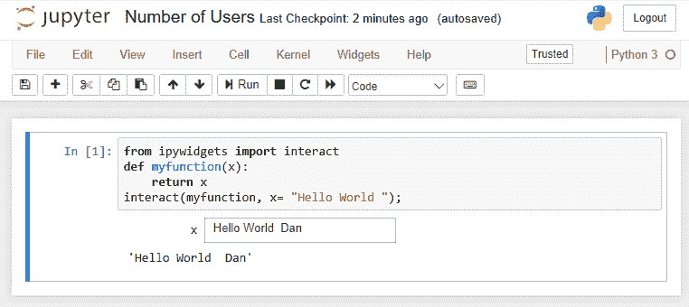

# 第十二章：接下来是什么？

在这一章节中，我们将做以下内容：

+   强调一些即将到来的 Jupyter 特性，您可能会期待它们。（这些例子大多数是计划的截图和描述，没有提供任何代码。这些构思仍处于初期阶段，且尚未广泛提供。）

+   给出一个在标准 Jupyter 安装中多个用户访问同一个 Notebook 时可能出现的问题的例子。

# JupyterHub

我们在前一章节中已经看到过 JupyterHub。

JupyterHub 是 Jupyter 的多用户实例。所有需要多个用户与 Jupyter 实现交互的方向都将通过 Jupyter 展示。

第一步是支持多个用户。这要求 Jupyter 为每个用户分配独立的空间。

下一步是共享服务，由一个 Jupyter 实现访问，但由多个用户使用。服务需要有身份验证（这真的是用户 xyzzy 吗？），Jupyter 正在朝着使用 OAUTH 标准的方向发展，OAUTH 是 Web 服务身份验证的标准。

# JupyterLab

我们在前一章节中已经讨论过 JupyterLab。

JupyterLab 致力于为 Jupyter 制作下一代用户界面设计。

# 扩展性

目前 Jupyter 的实现存在扩展性问题，因为随着用户数量的增加，性能会显著下降。

随着 Jupyter 的广泛应用，随着使用者的增加，问题变得更加显著。

Jupyter 团队正在将他们的大部分近期努力集中在提升 Jupyter 的可扩展性，以便无缝处理大量用户。正在开发的一些解决方案包括以下内容：

+   代理 API 在浏览器和服务器服务之间提供 API，从而扩展应用程序

+   MOAR 服务器，允许每个用户使用多个服务器

+   在整个服务器/服务中进一步整合 OAUTH

+   Jupyter 团队在市场发布前进行的压力测试工作

# 自定义前端

随着用户界面组件处理的提取，用户现在可以为他们的实现定制完全独立的前端。所有入口点都有文档记录，用户可以按需执行必要的步骤。

# 交互式计算标准

Jupyter 本质上是一个交互式计算平台。Jupyter 团队正在与行业成员合作，在以下领域制定标准（Jupyter 将符合这些标准）：

+   Notebook 文件格式

+   交互式计算协议

+   内核交互

对于本章节，我们将使用一个简单的 Notebook，它会要求用户提供一些信息，示例如下截图：

# 总结

在这一章节中，我们学习了如何暴露 Notebook，以便多个用户可以同时使用一个 Notebook。我们看到出现错误的例子，安装了一个解决此问题的 Jupyter 服务器，并且使用 Docker 来缓解该问题。
