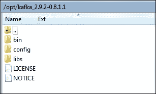

# 第一章：介绍 Kafka

在当今世界，实时信息不断由应用程序（商业、社交或任何其他类型）生成，并且这些信息需要可靠快速地路由到多种类型的接收方。大多数情况下，生成信息的应用程序和消费此信息的应用程序相距甚远，彼此无法访问。这些异构应用程序导致了为它们之间提供集成点的重新开发。因此，需要一种机制来无缝集成来自生产者和消费者的信息，以避免任何一端的应用程序重写。

# 欢迎来到 Apache Kafka 的世界

在当前的大数据时代，第一个挑战是收集数据，因为数据量巨大，第二个挑战是分析数据。这种分析通常包括以下类型的数据以及更多：

+   用户行为数据

+   应用程序性能跟踪

+   以日志形式的活动数据

+   事件消息

消息发布是一种通过消息连接各种应用程序的机制，例如通过消息代理（如 Kafka）。Kafka 是解决任何软件解决方案的实时问题的解决方案；也就是说，处理实时信息量并快速路由到多个消费者。Kafka 提供了生产者和消费者信息之间的无缝集成，而不会阻塞信息的生产者，也不会让生产者知道最终的消费者是谁。

Apache Kafka 是一个开源的、分布式的、分区的、复制的基于提交日志的发布-订阅消息系统，主要具有以下特点：

+   **持久化消息**：为了从大数据中获得真正的价值，不能承受任何信息丢失。Apache Kafka 设计了 O(1)磁盘结构，即使存储的消息量达到 TB 级别，也能提供恒定的性能。使用 Kafka，消息被持久化在磁盘上，并在集群内复制，以防止数据丢失。

+   **高吞吐量**：考虑到大数据，Kafka 被设计为在商品硬件上运行，并且能够处理来自大量客户端的每秒数百 MB 的读写。

+   **分布式**：Apache Kafka 以其集群中心的设计明确支持 Kafka 服务器上的消息分区，并在维护每个分区的顺序语义的同时，在消费者机器集群上分发消费。Kafka 集群可以在没有任何停机时间的情况下弹性地透明地增长。

+   **多客户端支持**：Apache Kafka 系统支持轻松集成来自不同平台的客户端，如 Java、.NET、PHP、Ruby 和 Python。

+   **实时**：生产者线程产生的消息应立即对消费者线程可见；这个特性对于基于事件的系统（如**复杂事件处理**（**CEP**）系统）至关重要。

Kafka 提供了一个实时的发布-订阅解决方案，克服了消费实时和批量数据量的挑战，这些数据量可能增长到比真实数据更大的数量级。Kafka 还支持在 Hadoop 系统中进行并行数据加载。

以下图表显示了 Apache Kafka 消息系统支持的典型大数据聚合和分析场景：

欢迎来到 Apache Kafka 的世界

在生产方面，有不同类型的生产者，例如以下类型：

+   生成应用程序日志的前端 Web 应用程序

+   生成网络分析日志的生产者代理

+   生成转换日志的生产者适配器

+   生成调用跟踪日志的生产者服务

在消费方面，有不同类型的消费者，例如以下类型：

+   消费消息并将其存储在 Hadoop 或传统数据仓库中进行离线分析的离线消费者

+   消费者几乎实时地消费消息并将其存储在任何 NoSQL 数据存储中，例如 HBase 或 Cassandra，以进行几乎实时的分析

+   实时消费者，如 Spark 或 Storm，在内存中过滤消息并触发相关组的警报事件

# 我们为什么需要 Kafka？

任何形式的网络或设备活动都会产生大量数据。数据是这些基于互联网的系统中的新成分之一，通常包括用户活动；与登录对应的事件；页面访问；点击；社交网络活动，如点赞、分享和评论；以及操作和系统指标。由于吞吐量高（每秒数百万条消息），这些数据通常由日志记录和传统的日志聚合解决方案处理。这些传统解决方案是为向离线分析系统（如 Hadoop）提供日志数据而设计的可行解决方案。然而，这些解决方案对于构建实时处理系统来说非常有限。

根据互联网应用的新趋势，活动数据已成为生产数据的一部分，并用于实时运行分析。这些分析可以是：

+   基于相关性的搜索

+   基于流行度、共现或情感分析的推荐

+   向大众投放广告

+   互联网应用程序安全，防止垃圾邮件或未经授权的数据抓取

+   设备传感器发送高温警报

+   任何异常的用户行为或应用程序黑客攻击

由于收集和处理的数据量大，从生产系统中收集的这些多组数据的实时使用已经成为一个挑战。

Apache Kafka 旨在通过提供在 Hadoop 系统中进行并行加载的机制以及在一组机器的集群上对实时消费进行分区的能力，统一离线和在线处理。Kafka 可以与 Scribe 或 Flume 进行比较，因为它对于处理活动流数据非常有用；但从架构的角度来看，它更接近于传统的消息系统，如 ActiveMQ 或 RabitMQ。

# Kafka 的用例

Kafka 可以在任何架构中以多种方式使用。本节讨论了 Apache Kafka 的一些热门用例以及采用 Kafka 的知名公司。以下是热门的 Kafka 用例：

+   日志聚合：这是从服务器收集物理日志文件并将它们放在一个中心位置（文件服务器或 HDFS）进行处理的过程。使用 Kafka 提供了对日志或事件数据的干净抽象，作为一系列消息流，从而消除了对文件细节的任何依赖。这还提供了更低的延迟处理和对多个数据源和分布式数据消费的支持。

+   流处理：Kafka 可用于收集的数据在多个阶段进行处理的用例，一个例子是从主题消耗的原始数据，并对其进行丰富或转换为新的 Kafka 主题以供进一步消费。因此，这种处理也被称为流处理。

+   提交日志：Kafka 可用于表示任何大规模分布式系统的外部提交日志。Kafka 集群上的复制日志帮助失败的节点恢复其状态。

+   点击流跟踪：Kafka 的另一个非常重要的用例是捕获用户点击流数据，例如页面浏览，搜索等，作为实时发布订阅源。这些数据以每种活动类型一个主题的形式发布到中央主题，因为数据量非常大。这些主题可供订阅，由许多消费者用于各种应用，包括实时处理和监控。

+   消息传递：消息代理用于将数据处理与数据生产者解耦。Kafka 可以取代许多流行的消息代理，因为它提供更好的吞吐量、内置分区、复制和容错性。

一些正在使用 Apache Kafka 的公司及其各自的用例如下：

+   LinkedIn（www.linkedin.com）：Apache Kafka 在 LinkedIn 用于活动数据和运营指标的流式传输。这些数据支持 LinkedIn 新闻动态和 LinkedIn 今日等各种产品，以及 Hadoop 等离线分析系统。

+   DataSift（www.datasift.com）：在 DataSift，Kafka 用作事件监视器的收集器，以及实时跟踪用户对数据流的消耗。

+   Twitter（www.twitter.com）：Twitter 将 Kafka 作为其 Storm 流处理基础设施的一部分使用。

+   Foursquare（www.foursquare.com）：Kafka 在 Foursquare 的在线到在线和在线到离线消息传递中发挥作用。它用于将 Foursquare 监控和生产系统与基于 Foursquare 和 Hadoop 的离线基础设施集成。

+   Square（www.squareup.com）：Square 使用 Kafka 作为*总线*，将所有系统事件通过 Square 的各个数据中心传输。这包括指标、日志、自定义事件等。在消费者端，它输出到 Splunk、Graphite 或类似实时警报的 Esper 中。

### 注意

上述信息的来源是 https://cwiki.apache.org/confluence/display/KAFKA/Powered+By。

# 安装 Kafka

Kafka 是一个 Apache 项目，其当前版本 0.8.1.1 可作为稳定版本使用。与旧版本（0.8.x 之前）相比，Kafka 0.8.x 提供了许多高级功能。其一些进步如下：

+   在 0.8.x 之前，如果代理失败，主题中的任何未消耗分区都可能会丢失。现在，分区提供了一个复制因子。这确保了任何已提交的消息不会丢失，因为至少有一个副本可用。

+   先前的功能还确保所有生产者和消费者都具有复制意识（复制因子是可配置属性）。默认情况下，生产者的消息发送请求会被阻塞，直到消息提交到所有活动副本；但是，生产者也可以配置为将消息提交到单个代理。

+   与 Kafka 生产者一样，Kafka 消费者的轮询模型变为长轮询模型，并在从生产者获取可用的已提交消息之前被阻塞，从而避免频繁轮询。

+   此外，Kafka 0.8.x 还配备了一套管理工具，例如受控集群关闭和领导副本选举工具，用于管理 Kafka 集群。

Kafka 0.8.x 的主要限制是它无法替换 0.8 之前的版本，因为它不向后兼容。

回到安装 Kafka，作为第一步，我们需要下载可用的稳定版本（所有过程都在 64 位 CentOS 6.4 操作系统上进行了测试，可能在其他基于内核的操作系统上有所不同）。现在让我们看看安装 Kafka 需要遵循哪些步骤。

## 安装先决条件

Kafka 是用 Scala 实现的，并使用构建工具 Gradle 构建 Kafka 二进制文件。Gradle 是 Scala、Groovy 和 Java 项目的构建自动化工具，需要 Java 1.7 或更高版本。

## 安装 Java 1.7 或更高版本

执行以下步骤安装 Java 1.7 或更高版本：

1.  从 Oracle 的网站下载`jdk-7u67-linux-x64.rpm`版本：http://www.oracle.com/technetwork/java/javase/downloads/index.html。

1.  更改文件模式如下：

```java
[root@localhost opt]#chmod +x jdk-7u67-linux-x64.rpm 

```

1.  切换到要执行安装的目录。为此，请键入以下命令：

```java
[root@localhost opt]# cd <directory path name>

```

例如，要在`/usr/java/`目录中安装软件，请键入以下命令：

```java
[root@localhost opt]# cd /usr/java

```

1.  使用以下命令运行安装程序：

```java
[root@localhost java]# rpm -ivh jdk-7u67-linux-x64.rpm 

```

1.  最后，添加环境变量`JAVA_HOME`。以下命令将`JAVA_HOME`环境变量写入包含系统范围环境配置的文件`/etc/profile`：

```java
[root@localhost opt]# echo "export JAVA_HOME=/usr/java/jdk1.7.0_67 " >> /etc/profile

```

## 下载 Kafka

执行以下步骤下载 Kafka 0.8.1.1 版本：

1.  下载当前的 Kafka（0.8）beta 版本到文件系统上的文件夹中（例如，`/opt`），使用以下命令：

```java
[root@localhost opt]#wget http://apache.tradebit.com/pub/kafka/0.8.1.1/kafka_2.9.2-0.8.1.1.tgz

```

### 注意

上述 URL 可能会更改。请在[`kafka.apache.org/downloads.html`](http://kafka.apache.org/downloads.html)检查正确的下载版本和位置。

1.  使用以下命令解压下载的`kafka_2.9.2-0.8.1.1.tgz`文件：

```java
[root@localhost opt]# tar xzf kafka_2.9.2-0.8.1.1.tgz

```

1.  解压`kafka_2.9.2-0.8.1.1.tgz`文件后，Kafka 0.8.1.1 的目录结构如下所示：

1.  最后，将 Kafka bin 文件夹添加到`PATH`中，如下所示：

```java
[root@localhost opt]# export KAFKA_HOME=/opt/kafka_2.9.2-0.8.1.1
[root@localhost opt]# export PATH=$PATH:$KAFKA_HOME/bin

```

## 构建 Kafka

用于构建 Kafka 0.8.1.1 版本的默认 Scala 版本是 Scala 2.9.2，但 Kafka 源代码也可以从其他 Scala 版本编译，比如 2.8.0、2.8.2、2.9.1 或 2.10.1。使用以下命令构建 Kafka 源代码：

```java
[root@localhost opt]# ./gradlew -PscalaVersion=2.9.1 jar

```

在 Kafka 8.x 及以后的版本中，Gradle 工具用于编译 Kafka 源代码（包含在`kafka-0.8.1.1-src.tgz`中）并构建 Kafka 二进制文件（JAR 文件）。类似于 Kafka JAR，单元测试或源代码 JAR 也可以使用 Gradle 构建工具构建。有关构建相关说明的更多信息，请参阅[`github.com/apache/kafka/blob/0.8.1/README.md`](https://github.com/apache/kafka/blob/0.8.1/README.md)。

# 摘要

在本章中，我们已经看到公司如何演变收集和处理应用生成的数据的机制，并学会了通过对其进行分析来利用这些数据的真正力量。

您还学会了如何安装 0.8.1.x。以下章节讨论了设置单个或多个 broker Kafka 集群所需的步骤。
