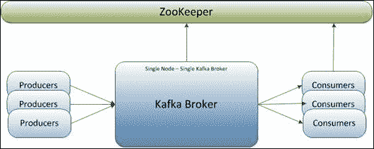
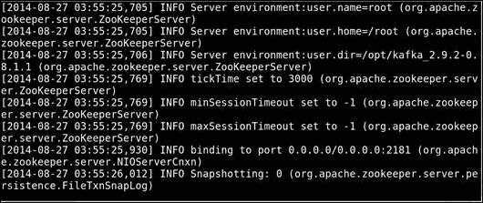
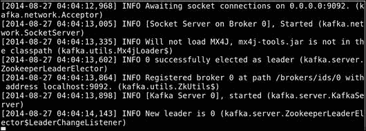
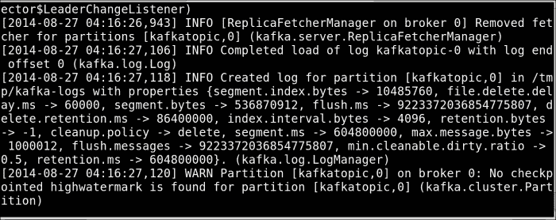
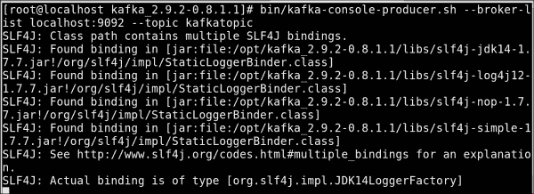
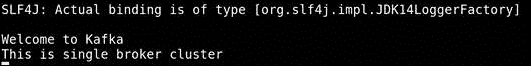
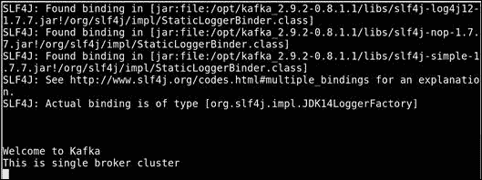
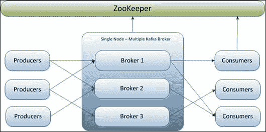
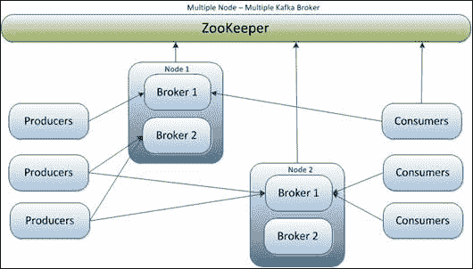

# 第二章：设置 Kafka 集群

现在我们准备使用 Apache Kafka 发布者-订阅者消息系统。使用 Kafka，我们可以创建多种类型的集群，例如以下：

+   单节点-单 broker 集群

+   单节点-多 broker 集群

+   多节点-多 broker 集群

Kafka 集群主要有五个主要组件：

+   **主题**：主题是消息生产者发布消息的类别或源名称。在 Kafka 中，主题被分区，每个分区由有序的不可变消息序列表示。Kafka 集群为每个主题维护分区日志。分区中的每条消息都被分配一个称为*偏移量*的唯一顺序 ID。

+   **Broker**：Kafka 集群由一个或多个服务器组成，每个服务器可能运行一个或多个服务器进程，并称为 broker。主题是在 broker 进程的上下文中创建的。

+   **Zookeeper**：ZooKeeper 充当 Kafka broker 和消费者之间的协调接口。Hadoop Wiki 网站上给出的 ZooKeeper 概述如下（[`wiki.apache.org/hadoop/ZooKeeper/ProjectDescription`](http://wiki.apache.org/hadoop/ZooKeeper/ProjectDescription)）：

> *"ZooKeeper 允许分布式进程通过共享的分层数据寄存器（我们称这些寄存器为 znodes）协调彼此，就像文件系统一样。"*

ZooKeeper 和标准文件系统之间的主要区别在于每个 znode 都可以与其关联数据，并且 znode 的数据量是有限的。ZooKeeper 旨在存储协调数据：状态信息、配置、位置信息等。

+   **生产者**：生产者通过选择主题内的适当分区向主题发布数据。为了负载平衡，可以以循环方式或使用自定义定义的函数将消息分配给主题分区。

+   **消费者**：消费者是订阅主题并处理发布消息的应用程序或进程。

让我们从一个非常基本的集群设置开始。

# 单节点-单 broker 集群

这是学习 Kafka 的起点。在上一章中，我们在单台机器上安装了 Kafka。现在是时候设置一个基于单节点-单 broker 的 Kafka 集群，如下图所示：



## 启动 ZooKeeper 服务器

Kafka 提供了默认和简单的 ZooKeeper 配置文件，用于启动单个本地 ZooKeeper 实例，尽管在设置 Kafka 集群时也可以进行单独的 ZooKeeper 安装。首先使用以下命令启动本地 ZooKeeper 实例：

```java
[root@localhost kafka_2.9.2-0.8.1.1]# bin/zookeeper-server-start.sh  config/zookeeper.properties

```

您应该得到如下屏幕截图中显示的输出：



### 注意

Kafka 带有定义单个 broker-单节点集群所需的最小属性的必需属性文件。

`zookeeper.properties`中定义的重要属性如下所示：

```java
# Data directory where the zookeeper snapshot is stored.
dataDir=/tmp/zookeeper

# The port listening for client request
clientPort=2181
# disable the per-ip limit on the number of connections since this is a non-production config
maxClientCnxns=0
```

默认情况下，ZooKeeper 服务器将侦听`*:2181/tcp`。有关如何设置多个 ZooKeeper 服务器的详细信息，请访问[`zookeeper.apache.org/`](http://zookeeper.apache.org/)。

## 启动 Kafka broker

现在使用以下命令在新的控制台窗口中启动 Kafka broker：

```java
[root@localhost kafka_2.9.2-0.8.1.1]# bin/kafka-server-start.sh config/server.properties

```

现在您应该看到如下屏幕截图中显示的输出：



`server.properties`文件定义了 Kafka broker 所需的以下重要属性：

```java
# The id of the broker. This must be set to a unique integer for each broker.
Broker.id=0

# The port the socket server listens on
port=9092

# The directory under which to store log files
log.dir=/tmp/kafka8-logs

# The default number of log partitions per topic. 
num.partitions=2

# Zookeeper connection string 
zookeeper.connect=localhost:2181
```

本章的最后一部分定义了 Kafka broker 可用的一些其他重要属性。

## 创建 Kafka 主题

Kafka 提供了一个命令行实用程序，在 Kafka 服务器上创建主题。让我们使用此实用程序创建一个名为`kafkatopic`的主题，该主题只有一个分区和一个副本：

```java
[root@localhost kafka_2.9.2-0.8.1.1]#bin/kafka-topics.sh --create --zookeeper localhost:2181 --replication-factor 1 --partitions 1 --topic kafkatopic

Created topic "kafkatopic".

```

您应该会在 Kafka 服务器窗口上得到如下截图所示的输出：



`kafka-topics.sh`实用程序将创建一个主题，将默认的分区数从两个覆盖为一个，并显示成功创建消息。它还需要 ZooKeeper 服务器信息，如在本例中：`localhost:2181`。要在任何 Kafka 服务器上获取主题列表，请在新的控制台窗口中使用以下命令：

```java
[root@localhost kafka_2.9.2-0.8.1.1]# bin/kafka-topics.sh --list --zookeeper localhost:2181
kafkatopic

```

## 启动生产者以发送消息

Kafka 为用户提供了一个命令行生产者客户端，可以从命令行接受输入，并将其作为消息发布到 Kafka 集群。默认情况下，每输入一行被视为一个新消息。以下命令用于在新的控制台窗口中启动基于控制台的生产者以发送消息：

```java
[root@localhost kafka_2.9.2-0.8.1.1]# bin/kafka-console-producer.sh --broker-list localhost:9092 --topic kafkatopic

```

输出将如下截图所示：



在启动生产者的命令行客户端时，需要以下参数：

+   `broker-list`

+   `topic`

`broker-list`参数指定要连接的代理为`<node_address:port>`—即`localhost:9092`。`kafkatopic`主题是在*创建 Kafka 主题*部分创建的。要将消息发送到订阅了相同主题`kafkatopic`的一组特定消费者，需要主题名称。

现在在控制台窗口上键入以下消息：

+   键入`欢迎来到 Kafka`并按*Enter*

+   键入`这是单个代理集群`并按*Enter*

您应该会看到如下截图所示的输出：



尝试一些更多的消息。消费者的默认属性在`producer.properties`中定义。重要的属性是：

```java
# list of brokers used for bootstrapping knowledge about the rest of the cluster
# format: host1:port1,host2:port2 ...
metadata.broker.list=localhost:9092

# specify the compression codec for all data generated: none , gzip, snappy.
compression.codec=none
```

有关如何为 Kafka 编写生产者和生产者属性的详细信息将在第四章中讨论，*编写生产者*。

## 启动消费者以消费消息

Kafka 还为消息消费提供了一个命令行消费者客户端。以下命令用于启动基于控制台的消费者，一旦订阅了 Kafka 代理中创建的主题，就会在命令行上显示输出：

```java
[root@localhost kafka_2.9.2-0.8.1.1]# bin/kafka-console-consumer.sh --zookeeper localhost:2181 --topic kafkatopic --from-beginning

```

在执行上一个命令时，您应该会得到如下截图所示的输出：



消费者的默认属性在`/config/consumer.properties`中定义。重要的属性是：

```java
# consumer group id (A string that uniquely identifies a set of consumers # within the same consumer group)
group.id=test-consumer-group
```

有关如何为 Kafka 编写消费者和消费者属性的详细信息将在第五章中讨论，*编写消费者*。

通过在不同的终端中运行所有四个组件（`zookeeper`，`broker`，`producer`和`consumer`），您将能够从生产者的终端输入消息，并在订阅的消费者的终端中看到它们出现。

可以通过不带参数运行命令来查看生产者和消费者命令行工具的使用信息。

# 单节点 - 多代理集群

现在我们已经来到 Kafka 集群的下一个级别。让我们现在设置一个单节点 - 多代理的 Kafka 集群，如下图所示：



## 启动 ZooKeeper

在启动 ZooKeeper 的第一步对于这种类型的集群是相同的。

## 启动 Kafka 代理

要在单个节点上设置多个代理，需要为每个代理准备不同的服务器属性文件。每个属性文件将为以下属性定义唯一的不同值：

+   `broker.id`

+   `port`

+   `log.dir`

例如，在用于`broker1`的`server-1.properties`中，我们定义如下：

+   `broker.id=1`

+   `port=9093`

+   `log.dir=/tmp/kafka-logs-1`

同样，对于`broker2`使用的`server-2.properties`，我们定义如下：

+   `broker.id=2`

+   `port=9094`

+   `log.dir=/tmp/kafka-logs-2`

所有新代理都遵循类似的过程。在定义属性时，我们已更改端口号，因为所有附加代理仍将在同一台机器上运行，但在生产环境中，代理将在多台机器上运行。现在，我们使用以下命令在单独的控制台窗口中启动每个新代理：

```java
[root@localhost kafka_2.9.2-0.8.1.1]# bin/kafka-server-start.sh config/server-1.properties
[root@localhost kafka_2.9.2-0.8.1.1]# bin/kafka-server-start.sh config/server-2.properties
…

```

## 使用命令行创建 Kafka 主题

使用 Kafka 服务器上的命令行实用程序创建主题，让我们创建一个名为`replicated-kafkatopic`的主题，其中包含两个分区和两个副本：

```java
[root@localhost kafka_2.9.2-0.8.1.1]# bin/kafka-topics.sh --create --zookeeper localhost:2181 --replication-factor 3 --partitions 1 --topic replicated-kafkatopic
Created topic "replicated-kafkatopic".

```

## 启动生产者发送消息

如果我们使用单个生产者连接到所有代理，我们需要传递代理的初始列表，并且剩余代理的信息是通过查询传递给`broker-list`的代理来识别的，如下命令所示。此元数据信息基于主题名称：

```java
--broker-list localhost:9092, localhost:9093

```

使用以下命令启动生产者：

```java
[root@localhost kafka_2.9.2-0.8.1.1]# bin/kafka-console-producer.sh --broker-list localhost:9092, localhost:9093 --topic replicated-kafkatopic

```

如果我们有多个生产者连接到不同组合的代理的要求，我们需要为每个生产者指定代理列表，就像在多个代理的情况下所做的那样。

## 启动消费者以消费消息

与上一个示例中一样的消费者客户端将在此过程中使用。就像以前一样，它在订阅 Kafka 代理中创建的主题后立即在命令行上显示输出：

```java
[root@localhost kafka_2.9.2-0.8.1.1]# bin/kafka-console-consumer.sh --zookeeper localhost:2181 --from-beginning --topic replicated-kafkatopic

```

# 多个节点-多个代理集群

这本书没有详细讨论此集群方案，但是，就像在单节点-多代理 Kafka 集群的情况下，在每个节点上设置多个代理一样，我们应该在集群的每个节点上安装 Kafka，并且来自不同节点的所有代理都需要连接到相同的 ZooKeeper。

出于测试目的，所有命令将保持与我们在单节点-多代理集群中使用的命令相同。

下图显示了在多个节点（在本例中为节点 1 和节点 2）上配置多个代理的集群方案，生产者和消费者以不同的组合连接：



# Kafka 经纪人属性列表

以下是可以为 Kafka 代理配置的一些重要属性列表。有关完整列表，请访问[`kafka.apache.org/documentation.html#brokerconfig`](http://kafka.apache.org/documentation.html#brokerconfig)。

| 属性名称 | 描述 | 默认值 |
| --- | --- | --- |
| `broker.id` | 每个代理都由非负整数 ID 唯一标识。此 ID 用作代理的名称，并允许将代理移动到不同的主机/端口而不会使消费者困惑。 | `0` |
| `log.dirs` | 这些是存储日志数据的目录。创建的每个新分区将放置在当前具有最少分区的目录中。 | `/tmp/kafka-logs` |
| `zookeeper.connect` | 这指定了 ZooKeeper 的连接字符串，格式为`hostname:port/chroot`。在这里，`chroot`是一个基本目录，它被预先添加到所有路径操作（这有效地为所有 Kafka znode 命名空间，以允许与 ZooKeeper 集群上的其他应用程序共享）。 | `localhost:2181` |
| `host.name` | 这是代理的主机名。如果设置了这个，它将只绑定到这个地址。如果没有设置，它将绑定到所有接口，并发布到 ZooKeeper。 | `Null` |
| `num.partitions` | 如果在创建主题时没有给出分区计数，则这是每个主题的默认分区数。 | `1` |
| `auto.create.topics.enable` | 这启用了服务器上主题的自动创建。如果设置为 true，则尝试生成、消费或获取不存在的主题的元数据将自动使用默认的复制因子和分区数创建它。 | `True` |
| `default.replication.factor` | 这是自动创建主题的默认复制因子。 | `1` |

# 摘要

在本章中，您学习了如何在单个节点上设置具有单个/多个代理的 Kafka 集群，运行命令行生产者和消费者，并交换一些消息。我们还讨论了 Kafka 代理的重要设置。

在下一章中，我们将看一下 Kafka 的内部设计。
