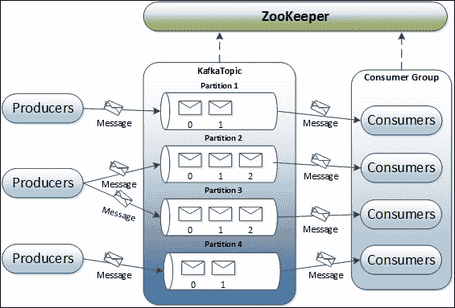
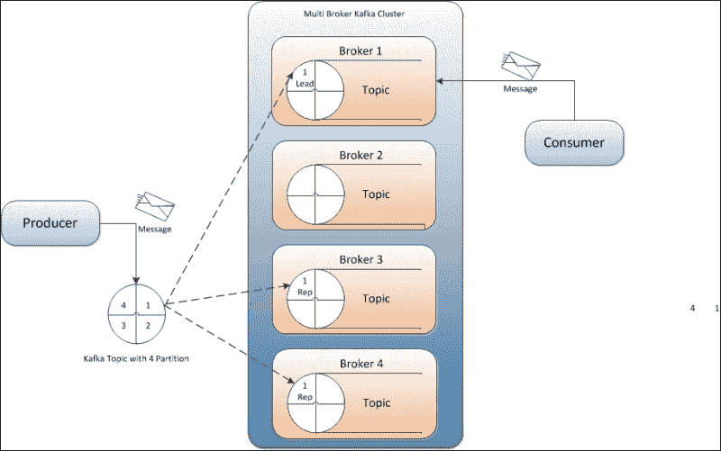

# 第三章：Kafka 设计

在我们开始编写 Kafka 生产者和消费者的代码之前，让我们快速讨论一下 Kafka 的内部设计。

在本章中，我们将重点关注以下主题：

+   Kafka 设计基础

+   Kafka 中的消息压缩

+   Kafka 中的复制

由于与 JMS 及其各种实现相关的开销以及缩放架构的限制，LinkedIn（[www.linkedin.com](http://www.linkedin.com)）决定构建 Kafka 来满足其对监控活动流数据和操作指标（如 CPU、I/O 使用情况和请求时间）的需求。

在开发 Kafka 时，主要关注以下内容：

+   为生产者和消费者提供支持自定义实现的 API

+   网络和存储的低开销，消息在磁盘上持久化

+   支持发布和订阅数百万条消息的高吞吐量，例如实时日志聚合或数据源

+   分布式和高度可扩展的架构，以处理低延迟传递

+   在故障情况下自动平衡多个消费者

+   在服务器故障的情况下保证容错

# Kafka 设计基础

Kafka 既不是一个消息队列平台，消息在其中由消费者池中的单个消费者接收，也不是一个发布-订阅平台，消息在其中发布给所有消费者。在一个非常基本的结构中，生产者将消息发布到 Kafka 主题（与“消息队列”同义）。主题也被视为消息类别或订阅名称，消息被发布到其中。Kafka 主题在充当 Kafka 服务器的 Kafka 代理上创建。Kafka 代理还在需要时存储消息。然后消费者订阅 Kafka 主题（一个或多个）以获取消息。在这里，代理和消费者使用 Zookeeper 获取状态信息和分别跟踪消息偏移量。这在下图中描述：

在上图中，显示了单节点-单代理架构，其中一个主题有四个分区。在组件方面，上图显示了 Kafka 集群的所有五个组件：Zookeeper、代理、主题、生产者和消费者。

在 Kafka 主题中，每个分区都映射到一个逻辑日志文件，表示为相等大小的一组段文件。每个分区都是有序的、不可变的消息序列；每次将消息发布到分区时，代理将消息附加到最后一个段文件。这些段文件在发布可配置数量的消息后或经过一定时间后被刷新到磁盘。刷新段文件后，消息就可以供消费者消费了。

所有消息分区都被分配一个称为*偏移量*的唯一顺序号，用于标识分区内的每条消息。每个分区可以选择在可配置数量的服务器上进行复制，以实现容错。

每个服务器上的每个分区都充当*领导者*，并且有零个或多个服务器充当*跟随者*。在这里，领导者负责处理分区的所有读写请求，而跟随者异步地从领导者复制数据。Kafka 动态地维护一组**同步副本**（**ISR**），这些副本已经追赶上了领导者，并且始终将最新的 ISR 集合持久化到 ZooKeeper。如果领导者失败，其中一个跟随者（同步副本）将自动成为新的领导者。在 Kafka 集群中，每个服务器都扮演双重角色；它既是一些分区的领导者，也是其他分区的跟随者。这确保了 Kafka 集群内的负载平衡。

Kafka 平台是基于从传统平台学到的东西构建的，并且具有消费者组的概念。在这里，每个消费者都表示为一个进程，并且这些进程组织在称为**消费者组**的组中。

主题中的消息由消费者组内的单个进程（消费者）消费，如果要求是单个消息由多个消费者消费，则所有这些消费者都需要保持在不同的消费者组中。消费者始终按顺序从特定分区消费消息，并确认消息偏移量。这种确认意味着消费者已经消费了所有先前的消息。消费者向代理发出包含要消费的消息偏移量的异步拉取请求，并获取字节缓冲区。

与 Kafka 的设计一致，代理是无状态的，这意味着任何消费的消息的状态都在消息消费者内部维护，Kafka 代理不会记录谁消费了什么。如果实现不好，消费者最终会多次读取相同的消息。如果消息从代理中被删除（因为代理不知道消息是否被消费），Kafka 定义了基于时间的 SLA（服务级别协议）作为消息保留策略。根据这个策略，如果消息在代理中保留的时间超过了定义的 SLA 期限，消息将被自动删除。这个消息保留策略使消费者能够有意地倒带到旧的偏移量并重新消费数据，尽管与传统的消息系统一样，这违反了与消费者的排队合同。

让我们讨论 Kafka 在生产者和消费者之间提供的消息传递语义。有多种可能的消息传递方式，例如：

+   消息永远不会被重新传递，但可能会丢失

+   消息可能会被重新传递，但永远不会丢失

+   消息只会被传递一次

在发布时，消息被提交到日志中。如果生产者在发布时遇到网络错误，它永远无法确定此错误是在消息提交之前还是之后发生的。一旦提交，只要复制写入该消息的分区的任何代理仍然可用，消息就不会丢失。对于保证消息发布，生产者端提供了配置，如获取确认和等待消息提交的时间。

从消费者的角度来看，副本具有完全相同的日志和相同的偏移量，消费者控制其在此日志中的位置。对于消费者，Kafka 保证消息将至少被读取一次，通过读取消息、处理消息，最后保存它们的位置。如果消费者进程在处理消息后崩溃，但在保存它们的位置之前崩溃，另一个消费者进程将接管主题分区，并可能接收已经处理的前几条消息。

# 日志压缩

日志压缩是一种实现更精细的、基于每条消息的保留，而不是粗粒度的、基于时间的保留的机制。它确保了主题分区日志中每条消息键的最后已知值必须保留，方法是删除具有相同主键的更近更新的记录。日志压缩还解决了系统故障情况或系统重新启动等问题。

在 Kafka 集群中，保留策略可以根据每个主题进行设置，例如基于时间、基于大小或基于日志压缩。日志压缩确保以下内容：

+   消息的顺序始终保持不变

+   消息将具有顺序偏移量，偏移量永远不会改变

+   从偏移量 0 开始读取，或者从日志开头开始的消费者，将至少看到按写入顺序的所有记录的最终状态

日志压缩由一组后台线程处理，它们重新复制日志段文件，删除出现在日志头部的键的记录。

以下要点总结了重要的 Kafka 设计事实：

+   Kafka 的基本支柱是消息缓存和存储在文件系统中。在 Kafka 中，数据立即写入操作系统内核页面。数据缓存和刷新到磁盘是可配置的。

+   Kafka 提供了更长时间的消息保留，即使在消费后，也允许消费者重新消费。

+   Kafka 使用消息集来组合消息，以减少网络开销。

+   与大多数消息系统不同，在 Kafka 中，消费消息的状态是在消费者级别维护的，而不是在服务器级别维护的。这也解决了诸如：

+   由于故障而丢失消息

+   同一消息的多次传递

默认情况下，消费者将状态存储在 Zookeeper 中，但 Kafka 也允许将其存储在用于在线事务处理（OLTP）应用程序的其他存储系统中。

+   在 Kafka 中，生产者和消费者采用传统的推送和拉取模型工作，其中生产者将消息推送到 Kafka 代理，消费者从代理拉取消息。

+   Kafka 没有任何主节点的概念，并将所有代理视为对等体。这种方法使得可以在任何时候添加和删除 Kafka 代理，因为代理的元数据在 Zookeeper 中进行维护并与消费者共享。

+   生产者还可以选择异步或同步模式将消息发送到代理。

# Kafka 中的消息压缩

对于网络带宽成为瓶颈的情况，Kafka 提供了消息组压缩功能，以实现高效的消息传递。Kafka 通过允许递归消息集来支持高效的压缩，其中压缩消息可能相对于其中的消息具有无限深度。高效的压缩需要将多个消息一起压缩并发送到代理。压缩消息集的网络开销减少，解压缩也吸引了非常少的额外开销。

在 Kafka 的早期版本 0.7 中，消息的压缩批次在日志文件中保持压缩状态，并且作为单个消息呈现给稍后对其进行解压缩的消费者。因此，解压缩的额外开销仅存在于消费者端。

在 Kafka 0.8 中，对代理处理消息偏移量的方式进行了更改；这也可能导致在压缩消息的情况下降低代理性能。

### 注意

在 Kafka 0.7 中，消息是通过分区日志中的物理字节偏移量进行寻址的，而在 Kafka 0.8 中，每条消息都是通过一个不可比较的、逻辑偏移量进行寻址的，这个偏移量对每个分区是唯一的——也就是说，第一条消息的偏移量为`1`，第十条消息的偏移量为`10`，依此类推。在 Kafka 0.8 中，对偏移量管理的更改简化了消费者重置消息偏移量的能力。

在 Kafka 0.8 中，领导代理负责通过为每条消息分配唯一的逻辑偏移量来为分区提供消息，然后将其附加到日志中。在压缩数据的情况下，领导代理必须解压消息集以便为压缩消息集中的消息分配偏移量。一旦偏移量被分配，领导者再次压缩数据，然后将其附加到磁盘上。领导代理对其接收到的每个压缩消息集都遵循此过程，这会导致 Kafka 代理的 CPU 负载。

在 Kafka 中，数据由消息生产者使用 GZIP 或 Snappy 压缩协议进行压缩。需要提供以下生产者配置以在生产者端使用压缩。

| 属性名称 | 描述 | 默认值 |
| --- | --- | --- |
| `compression.codec` | 此参数指定此生产者生成的所有数据的压缩编解码器。有效值为`none`、`gzip`和`snappy`。 | `none` |
| `compressed.topics` | 此参数允许您设置是否应为特定主题打开压缩。如果压缩编解码器不是`none`，则仅为指定的主题启用压缩。如果压缩主题列表为空，则为所有主题启用指定的压缩编解码器。如果压缩编解码器是`none`，则为所有主题禁用压缩。 | `null` |

代表消息集的`ByteBufferMessageSet`类可能包含未压缩和压缩数据。为了区分压缩和未压缩的消息，在消息头中引入了一个压缩属性字节。在这个压缩字节中，最低的两位用于表示用于压缩的压缩编解码器，这两位的值为 0 表示未压缩的消息。

使用 Kafka 在数据中心之间镜像数据时，消息压缩技术非常有用，其中大量数据以压缩格式从活动数据中心传输到被动数据中心。

# Kafka 中的复制

在我们讨论 Kafka 中的复制之前，让我们先谈谈消息分区。在 Kafka 中，消息分区策略是在 Kafka 代理端使用的。关于消息如何分区的决定由生产者做出，代理存储消息的顺序与它们到达的顺序相同。可以为 Kafka 代理中的每个主题配置分区数。

Kafka 复制是 Kafka 0.8 中引入的非常重要的功能之一。尽管 Kafka 具有高度可扩展性，但为了更好地保证消息的耐久性和 Kafka 集群的高可用性，复制保证了即使在经纪人故障的情况下（可能由任何原因引起），消息也将被发布和消费。Kafka 中的生产者和消费者都具有复制意识。以下图解释了 Kafka 中的复制：

让我们详细讨论前面的图表。

在复制中，消息的每个分区都有*n*个副本，并且可以承受*n-1*个故障以保证消息传递。在*n*个副本中，一个副本充当其余副本的领导副本。Zookeeper 保存有关领导副本和当前跟随者**同步副本**（**ISR**）的信息。领导副本维护所有同步跟随者副本的列表。

每个副本将其消息的一部分存储在本地日志和偏移量中，并定期同步到磁盘。这个过程还确保消息要么被写入所有副本，要么一个也没有被写入。

Kafka 支持以下复制模式：

+   **同步复制**：在同步复制中，生产者首先从 ZooKeeper 中识别领导副本并发布消息。一旦消息发布，它就会被写入领导副本的日志，并且所有领导的跟随者开始拉取消息；通过使用单个通道，确保消息的顺序。每个跟随者副本在将消息写入其各自的日志后向领导副本发送确认。一旦复制完成并收到所有预期的确认，领导副本会向生产者发送确认。在消费者方面，所有消息的拉取都是从领导副本进行的。

+   **异步复制**：这种模式的唯一区别是，一旦领导副本将消息写入其本地日志，它会向消息客户端发送确认，而不会等待来自跟随者副本的确认。但是，作为缺点，这种模式在经纪人故障的情况下不能确保消息传递。

如果任何追随者的同步副本失败，领导者将在配置的超时期后从其 ISR 列表中删除失败的追随者，并且写操作将继续在剩余的 ISR 中进行。每当失败的追随者回来时，它首先将其日志截断到最后一个检查点（最后提交消息的偏移量），然后开始从领导者那里赶上所有消息，从检查点开始。一旦追随者与领导者完全同步，领导者将其重新添加到当前的 ISR 列表中。

如果领导复制品在将消息分区写入其本地日志之前或在向消息生产者发送确认之前失败，消息分区将由生产者重新发送到新的领导代理。

选择新的领导复制品的过程涉及所有追随者的 ISR 向 Zookeeper 注册自己。第一个注册的复制品成为新的领导复制品，其**日志结束偏移量**（**LEO**）成为最后提交消息的偏移量（也称为**高水位标记**（**HW**））。其余注册的复制品成为新选举领导者的追随者。每个复制品在 Zookeeper 中注册一个监听器，以便在发生任何领导者更改时得到通知。每当选举出新的领导者并且被通知的复制品不是领导者时，它会将其日志截断到最后提交消息的偏移量，然后开始从新的领导者那里赶上。新选举的领导者等待直到经过配置的时间或直到所有活动的复制品同步，然后领导者将当前的 ISR 写入 Zookeeper，并对消息的读写都开放。

Kafka 中的复制确保更强的耐用性和更高的可用性。它保证任何成功发布的消息都不会丢失，并且即使在经纪人故障的情况下也会被消费。

### 注意

有关 Kafka 复制实现的更多见解，请访问[`cwiki.apache.org/confluence/display/KAFKA/kafka+Detailed+Replication+Design+V3`](https://cwiki.apache.org/confluence/display/KAFKA/kafka+Detailed+Replication+Design+V3)。

# 摘要

在本章中，您了解了构建 Kafka 坚实基础所使用的设计概念。您还了解了 Kafka 中消息压缩和复制的实现方式。

在下一章中，我们将重点介绍如何使用提供的 API 编写 Kafka 生产者。
