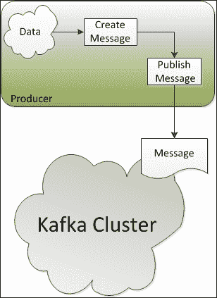
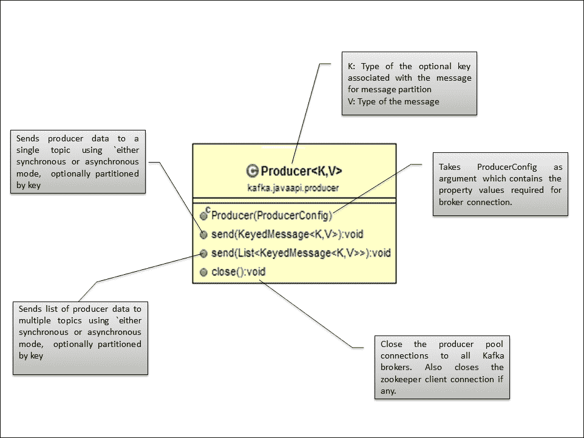

# 第四章：编写生产者

生产者是创建消息并将其发布到 Kafka 代理以供进一步消费的应用程序。这些生产者可以是不同的性质；例如，前端应用程序、后端服务、代理应用程序、适配器到传统系统以及用于 Hadoop 的生产者。这些生产者也可以用不同的语言实现，比如 Java、C 和 Python。

在本章中，我们将重点关注以下主题：

+   消息生产者的 Kafka API

+   基于 Java 的 Kafka 生产者

+   使用自定义消息分区的基于 Java 的生产者

在本章的最后，我们还将探讨 Kafka 生产者所需的一些重要配置。

让我们开始。以下图解释了 Kafka 生产者在生成消息时的高级工作原理：



生产者连接到任何存活的节点，并请求有关主题分区的领导者的元数据。这允许生产者直接将消息放到分区的领导代理中。

Kafka 生产者 API 通过允许生产者指定一个键进行语义分区来公开接口，并使用此键进行哈希分区。因此，生产者可以完全控制将消息发布到哪个分区；例如，如果选择客户 ID 作为键，则给定客户的所有数据将被发送到同一个分区。这也允许数据消费者对客户数据进行局部性假设。

为了在 Kafka 中实现高效，生产者还可以以批处理方式发布消息，只能在异步模式下工作。在异步模式下，生产者可以使用生产者配置中定义的固定消息数量或固定延迟（例如 10 秒或 50 条消息）工作。数据在生产者端在内存中累积，并以批处理方式在单个请求中发布。异步模式还会带来风险，即在生产者崩溃时会丢失未发布的内存中的数据。

### 注意

对于异步生产者，提议将回调方法功能用于将来的发布；这将用于注册处理程序以捕获发送的错误。

在接下来的几节中，我们将讨论 Kafka 为编写基于 Java 的自定义生产者提供的 API。

# Java 生产者 API

让我们首先了解导入的重要类，以便为 Kafka 集群编写基本的基于 Java 的生产者：

+   `Producer`：Kafka 提供了`kafka.javaapi.producer.Producer`类（`class Producer<K, V>`）用于为单个或多个主题创建消息，消息分区是一个可选功能。默认的消息分区器是基于键的哈希值。在这里，`Producer`是一种在 Scala 中编写的 Java 泛型（[`en.wikipedia.org/wiki/Generics_in_Java`](http://en.wikipedia.org/wiki/Generics_in_Java)），我们需要指定参数的类型；`K`和`V`分别指定分区键和消息值的类型。以下是类图及其解释：

+   `KeyedMessage`：`kafka.producer.KeyedMessage`类接受需要从生产者传递的主题名称、分区键和消息值。

```java
class KeyedMessageK, V 
```

在这里，`KeyedMessage`是一种在 Scala 中编写的 Java 泛型，我们需要指定参数的类型；`K`和`V`分别指定分区键和消息值的类型，而主题始终是`String`类型。

+   `ProducerConfig`：`kafka.producer.ProducerConfig`类封装了与代理建立连接所需的值，例如代理列表、消息分区类、消息的序列化器类和分区键。

生产者 API 包装了同步（默认行为）和异步生产者的低级生产者实现，这些实现是基于生产者配置`producer.type`选择的。例如，在异步生产者的情况下，`kafka.producer.Producer`类处理生产者数据的缓冲，然后将数据序列化并分派到适当的 Kafka 经纪人分区。在内部，`kafka.producer.async.ProducerSendThread`实例出列消息批次，`kafka.producer.EventHandler`序列化并分派数据。Kafka 生产者配置`event.handler`还提供了定义自定义事件处理程序的能力。

### 注意

所有示例都是为多经纪人集群（单个或多个节点）开发和测试的。有关如何设置单节点 - 多经纪人集群的更多信息，请参阅第二章，“设置 Kafka 集群”。

# 简单的 Java 生产者

现在我们将开始编写一个简单的基于 Java 的生产者，将消息传输到经纪人。这个`SimpleProducer`类用于为特定主题创建消息，并使用默认的消息分区传输它。

## 导入类

作为第一步，我们需要导入以下类：

```java
import kafka.javaapi.producer.Producer;
import kafka.producer.KeyedMessage;
import kafka.producer.ProducerConfig;
```

## 定义属性

在编写生产者的下一步中，我们需要定义用于与 Kafka 经纪人建立连接的属性，并将这些属性传递给 Kafka 生产者：

```java
Properties props = new Properties();
props.put("metadata.broker.list","localhost:9092, localhost:9093, localhost:9094");
props.put("serializer.class","kafka.serializer.StringEncoder");
props.put("request.required.acks", "1");
ProducerConfig config = new ProducerConfig(props); 
Producer<String, String> producer = new Producer<String, String> (config);
```

现在让我们看看代码中提到的主要属性：

+   `metadata.broker.list`：此属性指定生产者需要连接的经纪人列表（以`[<node:port>, <node:port>]`格式）。Kafka 生产者会自动确定主题的主要经纪人，通过提出元数据请求对其进行分区，并在发布任何消息之前连接到正确的经纪人。

+   `serializer.class`：此属性指定在从生产者到经纪人传输消息时需要使用的`serializer`类。在本例中，我们将使用 Kafka 提供的字符串编码器。默认情况下，密钥和消息的`serializer`类相同，但我们也可以通过扩展基于 Scala 的`kafka.serializer.Encoder`实现来实现自定义`serializer`类。生产者配置`key.serializer.class`用于设置自定义编码器。

+   `request.required.acks`：此属性指示 Kafka 经纪人在接收到消息时向生产者发送确认。值`1`表示一旦主副本接收到数据，生产者就会收到确认。此选项提供更好的耐久性，因为生产者会等到经纪人确认请求成功。默认情况下，生产者以“发送并忘记”的模式工作，在消息丢失的情况下不会收到通知。

## 构建消息并发送

作为最后一步，我们需要构建消息并将其发送到经纪人，如下所示的代码：

```java
String runtime = new Date().toString();;
String msg = "Message Publishing Time - " + runtime;
KeyedMessage<String, String> data = new KeyedMessage<String, String> (topic, msg);
producer.send(data); 
```

完整的程序如下所示：

```java
package kafka.examples.ch4;

import java.util.Date;
import java.util.Properties;

import kafka.javaapi.producer.Producer;
import kafka.producer.KeyedMessage;
import kafka.producer.ProducerConfig;

public class SimpleProducer {
  private static Producer<String, String> producer;

  public SimpleProducer() {
    Properties props = new Properties();

    // Set the broker list for requesting metadata to find the lead broker
    props.put("metadata.broker.list",
            "192.168.146.132:9092, 192.168.146.132:9093, 192.168.146.132:9094");

    //This specifies the serializer class for keys 
    props.put("serializer.class", "kafka.serializer.StringEncoder");

    // 1 means the producer receives an acknowledgment once the lead replica 
    // has received the data. This option provides better durability as the 
    // client waits until the server acknowledges the request as successful.
    props.put("request.required.acks", "1");

    ProducerConfig config = new ProducerConfig(props);
    producer = new Producer<String, String>(config);
  }

  public static void main(String[] args) {
    int argsCount = args.length;
    if (argsCount == 0 || argsCount == 1)
      throw new IllegalArgumentException(
        "Please provide topic name and Message count as arguments");

    // Topic name and the message count to be published is passed from the
    // command line 
    String topic = (String) args[0];
    String count = (String) args[1];
    int messageCount = Integer.parseInt(count);
    System.out.println("Topic Name - " + topic);
    System.out.println("Message Count - " + messageCount);

    SimpleProducer simpleProducer = new SimpleProducer();
    simpleProducer.publishMessage(topic, messageCount);
  }

  private void publishMessage(String topic, int messageCount) {
    for (int mCount = 0; mCount < messageCount; mCount++) {
      String runtime = new Date().toString();

      String msg = "Message Publishing Time - " + runtime;
      System.out.println(msg);
      // Creates a KeyedMessage instance
      KeyedMessage<String, String> data = 
        new KeyedMessage<String, String>(topic, msg);

      // Publish the message
      producer.send(data);
    }
    // Close producer connection with broker.
    producer.close();
  }
}
```

在运行之前，请确保您已经创建了主题`kafkatopic`，可以使用 API 或命令行创建，如下所示：

```java
[root@localhost kafka_2.9.2-0.8.1.1]#bin/kafka-topics.sh --create --zookeeper localhost:2181 --replication-factor 1 --partitions 3 --topic kafkatopic

```

### 注意

在控制台中编译和运行基于 Java 的 Kafka 程序之前，请确保您从[`www.slf4j.org/download.html`](http://www.slf4j.org/download.html)下载`slf4j-1.7.7.tar.gz`文件，并将其中包含的`slf4j-log4j12-1.7.7.jar`复制到`/opt/kafka_2.9.2-0.8.1.1/libs`目录。添加`KAFKA_LIB`环境变量，并使用以下命令将`/opt/kafka_2.9.2-0.8.1.1/libs`中的所有库添加到类路径中：

```java
[root@localhost kafka_2.9.2-0.8.1.1]# export KAFKA_LIB=/opt/kafka_2.9.2-0.8.1.1/libs
[root@localhost kafka_2.9.2-0.8.1.1]# export CLASSPATH=.:$KAFKA_LIB/jopt-simple-3.2.jar:$KAFKA_LIB/kafka_2.9.2-0.8.1.1.jar:$KAFKA_LIB/log4j-1.2.15.jar:$KAFKA_LIB/metrics-core-2.2.0.jar:$KAFKA_LIB/scala-library-2.9.2.jar:$KAFKA_LIB/slf4j-api-1.7.2.jar:$KAFKA_LIB/slf4j-log4j12-1.7.7.jar:$KAFKA_LIB/snappy-java-1.0.5.jar:$KAFKA_LIB/zkclient-0.3.jar:$KAFKA_LIB/zookeeper-3.3.4.jar

```

使用以下命令编译上述程序：

```java
[root@localhost kafka_2.9.2-0.8.1.1]# javac -d . kafka/examples/ch4/SimpleProducer.java

```

使用以下命令运行简单的生产者：

```java
[root@localhost kafka_2.9.2-0.8.1.1]# java kafka.examples.ch4.SimpleProducer kafkatopic 10

```

`SimpleProducer`类需要两个参数；首先是主题名称，其次是要发布的消息数量。一旦生产者成功执行并开始将消息发布到代理程序，就运行命令行消费者来消费消息，因为它订阅了在 Kafka 代理程序中创建的主题：

```java
[root@localhost kafka_2.9.2-0.8.1.1]# bin/kafka-console-consumer.sh --zookeeper localhost:2181 --from-beginning --topic kafkatopic

```

# 使用自定义分区创建 Java 生产者

先前的示例是一个在单节点、多代理程序集群上运行的基本`Producer`类的非常基本的示例，没有明确对消息进行分区。跳到下一个级别，让我们编写另一个程序，该程序使用自定义消息分区。在这个例子中，捕获并发布了来自任何 IP 地址的网站访问的日志消息。这条日志消息有三个部分：

+   网站点击的时间戳

+   网站的名称本身

+   正在访问网站的 IP 地址

让我们从编码开始。

## 导入类

首先导入以下类：

```java
import java.util.Date;
import java.util.Properties;
import java.util.Random;

import kafka.javaapi.producer.Producer;
import kafka.producer.KeyedMessage;
import kafka.producer.ProducerConfig;
```

## 定义属性

作为下一步，我们需要定义用于与 Kafka 代理程序建立连接的属性，如下面的代码所示，并将这些属性传递给 Kafka 生产者：

```java
Properties props = new Properties();
props.put("metadata.broker.list","localhost:9092, localhost:9093, localhost:9094");
props.put("serializer.class","kafka.serializer.StringEncoder"); 
props.put("partitioner.class", "kafka.examples.ch4.SimplePartitioner");
props.put("request.required.acks", "1");
ProducerConfig config = new ProducerConfig(props); 
Producer<Integer, String> producer = new Producer<Integer, String>(config);
```

在先前的属性列表中唯一的更改是添加了`partitioner.class`配置。

`partitioner.class`属性定义了用于确定消息需要发送到的主题中的分区的类。如果键为空，Kafka 将使用键的哈希值。

## 实现 Partitioner 类

接下来，我们需要通过实现`Partitioner`类（Scala 中编写的一个抽象类）来开发自定义分区类`SimplePartitioner`，该类需要接受在本例中是 IP 地址的键。然后找到最后一个八位并对 Kafka 为主题定义的分区数量进行模运算。以下是`SimplePartitioner`类的代码：

```java
package kafka.examples.ch4;

import kafka.producer.Partitioner;

public class SimplePartitioner implements Partitioner {

  public SimplePartitioner (VerifiableProperties props) {

  }

  /*
   * The method takes the key, which in this case is the IP address, 
   * It finds the last octet and does a modulo operation on the number 
   * of partitions defined within Kafka for the topic.
   * 
   * @see kafka.producer.Partitioner#partition(java.lang.Object, int)
   */
  public int partition(Object key, int a_numPartitions) {
    int partition = 0;
    String partitionKey = (String) key;
    int offset = partitionKey.lastIndexOf('.');
    if (offset > 0) {
      partition = Integer.parseInt(partitionKey.substring(offset + 1))
          % a_numPartitions;
    }
    return partition;
  }
}
```

## 构建消息并发送

作为最后一步，我们需要构建消息并将其发送到代理程序。以下是程序的完整列表：

```java
package kafka.examples.ch4;

import java.util.Date;
import java.util.Properties;
import java.util.Random;

import kafka.javaapi.producer.Producer;
import kafka.producer.KeyedMessage;
import kafka.producer.ProducerConfig;

public class CustomPartitionProducer {
  private static Producer<String, String> producer;

  public CustomPartitionProducer() {
    Properties props = new Properties();

    // Set the broker list for requesting metadata to find the lead broker
    props.put("metadata.broker.list",
          "192.168.146.132:9092, 192.168.146.132:9093, 192.168.146.132:9094");

    // This specifies the serializer class for keys 
    props.put("serializer.class", "kafka.serializer.StringEncoder");

    // Defines the class to be used for determining the partition 
    // in the topic where the message needs to be sent.
    props.put("partitioner.class", "kafka.examples.ch4.SimplePartitioner");

    // 1 means the producer receives an acknowledgment once the lead replica 
    // has received the data. This option provides better durability as the 
    // client waits until the server acknowledges the request as successful.
    props.put("request.required.acks", "1");

    ProducerConfig config = new ProducerConfig(props);
    producer = new Producer<String, String>(config);
  }

  public static void main(String[] args) {
    int argsCount = args.length;
    if (argsCount == 0 || argsCount == 1)
      throw new IllegalArgumentException(
        "Please provide topic name and Message count as arguments");

    // Topic name and the message count to be published is passed from the
    // command line
    String topic = (String) args[0];
    String count = (String) args[1];
    int messageCount = Integer.parseInt(count);

    System.out.println("Topic Name - " + topic);
    System.out.println("Message Count - " + messageCount);

    CustomPartitionProducer simpleProducer = new CustomPartitionProducer();
    simpleProducer.publishMessage(topic, messageCount);
  }

  private void publishMessage(String topic, int messageCount) {
    Random random = new Random();
    for (int mCount = 0; mCount < messageCount; mCount++) {

    String clientIP = "192.168.14." + random.nextInt(255); 
    String accessTime = new Date().toString();

    String message = accessTime + ",kafka.apache.org," + clientIP; 
      System.out.println(message);

      // Creates a KeyedMessage instance
      KeyedMessage<String, String> data = 
        new KeyedMessage<String, String>(topic, clientIP, message);

      // Publish the message
      producer.send(data);
    }
    // Close producer connection with broker.
    producer.close();
  }
}
```

在运行此之前，请确保您已从命令行创建了主题`website-hits`：

```java
[root@localhost kafka_2.9.2-0.8.1.1]# bin/kafka-topics.sh --create --zookeeper localhost:2181 --replication-factor 3 --partitions 5 --topic website-hits

```

还有，如前面的示例中所指定的，如果尚未完成，请进行类路径设置。现在使用以下命令编译分区器类和前面的生产者程序：

```java
[root@localhost kafka_2.9.2-0.8.1.1]# javac -d . kafka/examples/ch4/SimplePartitioner.java

[root@localhost kafka_2.9.2-0.8.1.1]# javac -d . kafka/examples/ch4/CustomPartitionProducer.java

```

使用以下命令运行自定义分区生产者：

```java
[root@localhost kafka_2.9.2-0.8.1.1]# java kafka.examples.ch4.CustomPartitionProducer website-hits 100

```

`CustomPartitionProducer`程序需要两个参数；首先是主题名称，其次是要发布的日志消息数量。一旦生产者成功执行并开始将消息发布到代理程序，就运行命令行消费者来消费消息，因为它订阅了在 Kafka 代理程序中创建的主题：

```java
[root@localhost kafka_2.9.2-0.8.1.1]# bin/kafka-console-consumer.sh --zookeeper localhost:2181 --from-beginning --topic kafkatopic

```

在前面的示例中，使用自定义分区逻辑的好处是，为同一客户端 IP 地址生成的所有日志消息最终都将进入同一个分区。此外，同一个分区可能具有不同 IP 地址的批量日志消息。

### 注意

分区逻辑也需要为消费者所知，以便消费者可以消费为所需 IP 地址发布的消息。这部分在第五章*编写消费者*中有所涵盖。

# Kafka 生产者属性列表

以下表格显示了可以为 Kafka 生产者配置的一些重要属性列表。Scala 类`kafka.producer.ProducerConfig`提供了生产者配置的实现级别细节。有关完整列表，请访问[`kafka.apache.org/documentation.html#producerconfigs`](http://kafka.apache.org/documentation.html#producerconfigs)。

| 属性名称 | 描述 | 默认值 |
| --- | --- | --- |
| `metadata.broker.list` | 生产者使用此属性来获取元数据（主题、分区和副本）。根据元数据返回的代理信息，将建立用于发送实际数据的套接字连接。格式为 `host1:port1,host2:port2`。 |   |
| `serializer.class` | 这指定了消息的 `serializer` 类。默认编码器接受一个字节并返回相同的字节。 | `kafka.serializer.DefaultEncoder` |

`producer.type` | 此属性指定消息将如何发送：

+   `async` 用于异步发送（与消息批处理一起使用）

+   `sync` 用于同步发送

| `sync` |
| --- |

| `request.required.acks` | 此值控制生产者请求何时被视为完成以及生产者是否从代理接收确认：

+   `0` 表示生产者永远不会等待来自代理的确认。这用于最低延迟，但耐久性最弱。

+   `1` 表示一旦主副本接收到数据，生产者将收到确认。此选项提供更好的耐久性，因为客户端会等待服务器确认请求成功。

+   `-1` 表示一旦所有同步副本接收到数据，生产者将收到确认。此选项提供了最佳的耐久性。

| `0` |
| --- |
| `key.serializer.class` | 这指定了键的序列化程序类。 | `${serializer.class}` |
| `partitioner.class` | 这是用于在子主题之间分区消息的分区器类。默认的分区器基于键的哈希值。 | `kafka.producer.DefaultPartitioner` |
| `compression.codec` | 此参数指定此生产者生成的所有数据的压缩编解码器。有效值为 `none`、`gzip` 和 `snappy`。 | `none` |
| `batch.num.messages` | 当使用异步模式时，此属性指定要在一批中发送的消息数量。生产者将等待，直到准备发送此数量的消息或达到 `queue.buffer.max.ms`。 | `200` |

# 摘要

在本章中，我们学习了如何编写基本的生产者和一些使用消息分区的高级 Java 生产者。我们还介绍了 Kafka 生产者的属性细节。

在下一章中，我们将学习如何编写基于 Java 的消费者来消费消息。
