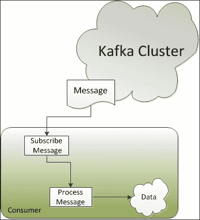
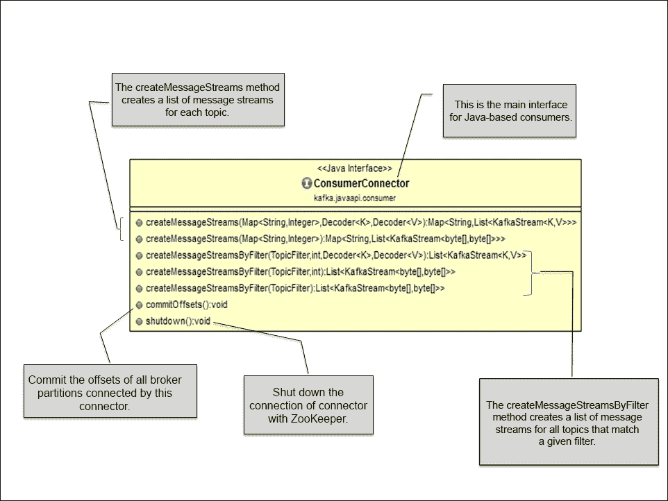
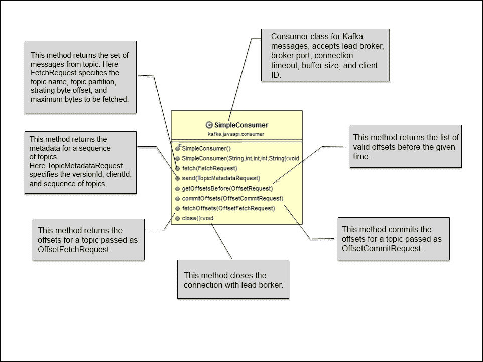

# 第五章：编写消费者

消费者是消费 Kafka 生产者发布的消息并处理从中提取的数据的应用程序。与生产者一样，消费者也可以是不同性质的，例如进行实时或准实时分析的应用程序、具有 NoSQL 或数据仓库解决方案的应用程序、后端服务、用于 Hadoop 的消费者或其他基于订阅者的解决方案。这些消费者也可以用不同的语言实现，如 Java、C 和 Python。

在本章中，我们将重点关注以下主题：

+   Kafka 消费者 API

+   基于 Java 的 Kafka 消费者

+   基于 Java 的 Kafka 消费者消费分区消息

在本章末尾，我们将探讨一些可以为 Kafka 消费者设置的重要属性。所以，让我们开始吧。



前面的图解释了 Kafka 消费者在消费消息时的高级工作原理。消费者订阅来自 Kafka 经纪人特定主题的消息消费。然后，消费者通过指定消息偏移量（消息偏移量的起始位置）向领导经纪人发出获取请求以消费消息分区。因此，Kafka 消费者以拉模型工作，并始终在 Kafka 日志（Kafka 内部数据表示）中当前位置之后拉取所有可用的消息。

在订阅时，消费者连接到任何活动节点，并请求有关主题分区领导者的元数据。这允许消费者直接与接收消息的领导经纪人通信。Kafka 主题被分成一组有序的分区，每个分区只能被一个消费者消费。一旦分区被消费，消费者就会将消息偏移量更改为下一个要消费的分区。这代表了已经被消费的状态，并且还提供了有意地倒带到旧偏移量并重新消费分区的灵活性。在接下来的几节中，我们将讨论 Kafka 为编写基于 Java 的自定义消费者提供的 API。

### 注意

本书中提到的所有 Kafka 类实际上都是用 Scala 编写的。

# Kafka 消费者 API

Kafka 为 Java 消费者提供了两种类型的 API：

+   高级 API

+   低级 API

## 高级消费者 API

当只需要数据而不需要处理消息偏移量时，使用高级消费者 API。此 API 将经纪人的细节隐藏在消费者之外，并通过提供对低级实现的抽象来轻松与 Kafka 集群通信。高级消费者在 Zookeeper 中存储最后的偏移量（消费者离开消费消息的消息分区内的位置），并且基于在进程开始时提供给 Kafka 的消费者组名称存储此偏移量。

消费者组名称在 Kafka 集群中是唯一且全局的，任何具有正在使用的消费者组名称的新消费者可能会导致系统中的模糊行为。当使用现有的消费者组名称启动新进程时，Kafka 会在消费者组的新旧进程线程之间触发重新平衡。重新平衡后，一些意图用于新进程的消息可能会发送到旧进程，导致意外结果。为避免这种模糊行为，在启动现有消费者组名称的新消费者之前，应关闭任何现有的消费者。

以下是导入的类，用于使用 Kafka 集群的高级消费者 API 编写基于 Java 的基本消费者：

+   `ConsumerConnector`：Kafka 提供了`ConsumerConnector`接口（`interface ConsumerConnector`），该接口由`ZookeeperConsumerConnector`类（`kafka.javaapi.consumer.ZookeeperConsumerConnector`）进一步实现。该类负责消费者与 ZooKeeper 的所有交互。

以下是`ConsumerConnector`类的类图：



+   `KafkaStream`：`kafka.consumer.KafkaStream`类的对象是由`ConsumerConnector`实现的`createMessageStreams`调用返回的。这些`KafkaStream`对象的列表是为每个主题返回的，可以进一步在流中创建迭代器。以下是基于 Scala 的类声明：

```java
class KafkaStreamK,V
```

这里，参数`K`和`V`分别指定了分区键和消息值的类型。

在`ConsumerConnector`类的 create 调用中，客户端可以指定所需流的数量，其中每个流对象用于单线程处理。这些流对象可以表示多个唯一分区的合并。

+   `ConsumerConfig`：`kafka.consumer.ConsumerConfig`类封装了与 ZooKeeper 建立连接所需的属性值，例如 ZooKeeper URL、ZooKeeper 会话超时和 ZooKeeper 接收时间。它还包含了消费者所需的属性值，例如组 ID 等。

在下一节之后将讨论基于高级 API 的工作消费者示例。

## 低级消费者 API

高级 API 不允许消费者控制与代理的交互。低级消费者 API 也称为“简单消费者 API”，它是无状态的，并且提供了对 Kafka 代理和消费者之间通信的精细控制。它允许消费者在向代理发出的每个请求中设置消息偏移量，并在消费者端维护元数据。这个 API 可以被在线和离线消费者（如 Hadoop）使用。这些类型的消费者也可以对同一消息执行多次读取，或者管理事务以确保消息只被消费一次。

与高级消费者 API 相比，开发人员需要付出额外的努力来获得消费者内的低级控制，例如跟踪偏移量、找出主题和分区的领导代理、处理领导代理变更等。

在低级消费者 API 中，消费者首先查询活动代理以了解有关领导代理的详细信息。有关活动代理的信息可以通过属性文件或命令行传递给消费者。`kafka.javaapi.TopicMetadataResponse`类的`topicsMetadata()`方法用于从领导代理那里找到感兴趣的主题的元数据。对于消息分区读取，`kafka.api.OffsetRequest`类定义了两个常量：`EarliestTime`和`LatestTime`，用于查找日志中数据的开始和新消息流。这些常量还帮助消费者跟踪已经读取的消息。

低级消费者 API 中使用的主要类是`SimpleConsumer`（`kafka.javaapi.consumer.SimpleConsumer`）类。以下是`SimpleConsumer`类的类图：



简单消费者类提供了与领导代理建立连接以从主题获取消息以及获取主题元数据和偏移量列表的方法。

用于构建不同请求对象的几个重要类是`FetchRequest`（`kafka.api.FetchRequest`）、`OffsetRequest`（`kafka.javaapi.OffsetRequest`）、`OffsetFetchRequest`（`kafka.javaapi.OffsetFetchRequest`）、`OffsetCommitRequest`（`kafka.javaapi.OffsetCommitRequest`）和`TopicMetadataRequest`（`kafka.javaapi.TopicMetadataRequest`）。

### 注意

本章中的所有示例都是基于高级消费者 API 的。有关基于低级消费者 API 的示例，请参阅[`cwiki.apache.org/confluence/display/KAFKA/0.8.0+SimpleConsumer+Example`](https://cwiki.apache.org/confluence/display/KAFKA/0.8.0+SimpleConsumer+Example)。

# 简单 Java 消费者

现在我们将开始编写一个使用高级消费者 API 开发的单线程简单的 Java 消费者，用于从主题中消费消息。`SimpleHLConsumer` 类用于从特定主题获取消息并消费它，假设主题内有一个单个分区。

## 导入类

首先，我们需要导入以下类：

```java
import kafka.consumer.ConsumerConfig;
import kafka.consumer.ConsumerIterator;
import kafka.consumer.KafkaStream;
import kafka.javaapi.consumer.ConsumerConnector;
```

## 定义属性

作为下一步，我们需要定义用于与 Zookeeper 建立连接的属性，并使用以下代码将这些属性传递给 Kafka 消费者：

```java
Properties props = new Properties();
props.put("zookeeper.connect", "localhost:2181");
props.put("group.id", "testgroup");
props.put("zookeeper.session.timeout.ms", "500");
props.put("zookeeper.sync.time.ms", "250");
props.put("auto.commit.interval.ms", "1000");
new ConsumerConfig(props);
```

现在让我们看一下代码中提到的主要属性：

+   `zookeeper.connect`：此属性指定了用于在集群中查找运行的 Zookeeper 实例的 ZooKeeper `<node:port>` 连接详细信息。在 Kafka 集群中，Zookeeper 用于存储此消费者组消费的特定主题和分区的偏移量。

+   `group.id`：此属性指定了消费者组的名称，该组由组内的所有消费者共享。这也是 Zookeeper 用于存储偏移量的进程名称。

+   `zookeeper.session.timeout.ms`：此属性指定了 Zookeeper 会话超时时间（以毫秒为单位），表示 Kafka 等待 Zookeeper 响应请求的时间量，然后放弃并继续消费消息。

+   `zookeeper.sync.time.ms`：此属性指定了 ZooKeeper 领导者和跟随者之间的 ZooKeeper 同步时间（以毫秒为单位）。

+   `auto.commit.interval.ms`：此属性定义了消费者偏移量提交到 Zookeeper 的频率（以毫秒为单位）。

# 从主题中读取消息并打印它们

最后一步，我们需要使用以下代码读取消息：

```java
Map<String, Integer> topicMap = new HashMap<String, Integer>();
// 1 represents the single thread
topicCount.put(topic, new Integer(1));

Map<String, List<KafkaStream<byte[], byte[]>>> consumerStreamsMap = consumer.createMessageStreams(topicMap);

// Get the list of message streams for each topic, using the default decoder.
List<KafkaStream<byte[], byte[]>>streamList =  consumerStreamsMap.get(topic);

for (final KafkaStream <byte[], byte[]> stream : streamList) {
ConsumerIterator<byte[], byte[]> consumerIte = stream.iterator();
  while (consumerIte.hasNext())
    System.out.println("Message from Single Topic :: "
    + new String(consumerIte.next().message()));
} 
```

因此，完整的程序将如下代码所示：

```java
package kafka.examples.ch5;

import java.util.HashMap;
import java.util.List;
import java.util.Map;
import java.util.Properties;

import kafka.consumer.ConsumerConfig;
import kafka.consumer.ConsumerIterator;
import kafka.consumer.KafkaStream;
import kafka.javaapi.consumer.ConsumerConnector;

public class SimpleHLConsumer {
  private final ConsumerConnector consumer;
  private final String topic;

  public SimpleHLConsumer(String zookeeper, String groupId, String topic) {
    consumer = kafka.consumer.Consumer
        .createJavaConsumerConnector(createConsumerConfig(zookeeper,
            groupId));
    this.topic = topic;
  }

  private static ConsumerConfig createConsumerConfig(String zookeeper,
        String groupId) {
    Properties props = new Properties();
    props.put("zookeeper.connect", zookeeper);
    props.put("group.id", groupId);
    props.put("zookeeper.session.timeout.ms", "500");
    props.put("zookeeper.sync.time.ms", "250");
    props.put("auto.commit.interval.ms", "1000");

    return new ConsumerConfig(props);

  }

  public void testConsumer() {

    Map<String, Integer> topicMap = new HashMap<String, Integer>();

    // Define single thread for topic
    topicMap.put(topic, new Integer(1));

    Map<String, List<KafkaStream<byte[], byte[]>>> consumerStreamsMap = 
        consumer.createMessageStreams(topicMap);

    List<KafkaStream<byte[], byte[]>> streamList = consumerStreamsMap
        .get(topic);

    for (final KafkaStream<byte[], byte[]> stream : streamList) {
      ConsumerIterator<byte[], byte[]> consumerIte = stream.iterator();
      while (consumerIte.hasNext())
        System.out.println("Message from Single Topic :: "
          + new String(consumerIte.next().message()));
    }
    if (consumer != null)
      consumer.shutdown();
  }

  public static void main(String[] args) {

    String zooKeeper = args[0];
    String groupId = args[1];
    String topic = args[2];
    SimpleHLConsumer simpleHLConsumer = new SimpleHLConsumer(
          zooKeeper, groupId, topic);
    simpleHLConsumer.testConsumer();
  }

}
```

在运行此命令之前，请确保您已从命令行创建了主题 `kafkatopic`：

```java
[root@localhost kafka_2.9.2-0.8.1.1]#bin/kafka-topics.sh --create --zookeeper localhost:2181 --replication-factor 1 --partitions 3 --topic kafkatopic

```

### 注意

在控制台中编译和运行基于 Java 的 Kafka 程序之前，请确保您从 [`www.slf4j.org/download.html`](http://www.slf4j.org/download.html) 下载了 `slf4j-1.7.7.tar.gz` 文件，并将 `slf4j-1.7.7.tar.gz` 中包含的 `slf4j-log4j12-1.7.7.jar` 复制到 `/opt/kafka_2.9.2-0.8.1.1/libs` 目录。还要使用以下命令将 `/opt/kafka_2.9.2-0.8.1.1/libs` 中的所有库添加到类路径中：

```java
[root@localhost kafka_2.9.2-0.8.1.1]# export KAFKA_LIB=/opt/kafka_2.9.2-0.8.1.1/libs
[root@localhost kafka_2.9.2-0.8.1.1]# export CLASSPATH=.:$KAFKA_LIB/jopt-simple-3.2.jar:$KAFKA_LIB/kafka_2.9.2-0.8.1.1.jar:$KAFKA_LIB/log4j-1.2.15.jar:$KAFKA_LIB/metrics-core-2.2.0.jar:$KAFKA_LIB/scala-library-2.9.2.jar:$KAFKA_LIB/slf4j-api-1.7.2.jar:$KAFKA_LIB/slf4j-log4j12-1.7.7.jar:$KAFKA_LIB/snappy-java-1.0.5.jar:$KAFKA_LIB/zkclient-0.3.jar:$KAFKA_LIB/zookeeper-3.3.4.jar

```

还要运行在第四章 *编写生产者* 中开发的 `SimpleProducer` 类，它需要两个参数：第一个是主题名称，第二个是要发布的消息数量，如下所示：

```java
[root@localhost kafka_2.9.2-0.8.1.1]# java kafka.examples.ch4.SimpleProducer kafkatopic 100

```

使用以下命令编译上述的 `SimpleHLConsumer` 类：

```java
[root@localhost kafka_2.9.2-0.8.1.1]# javac -d . kafka/examples/ch5/SimpleHLConsumer.java

```

在单独的控制台窗口中使用以下命令运行简单的高级消费者：

```java
[root@localhost kafka_2.9.2-0.8.1.1]# java kafka.examples.ch5.SimpleHLConsumer localhost:2181 testgroup kafkatopic

```

为了成功执行，`SimpleHLConsumer` 类需要三个参数：第一个是 Zookeeper 连接字符串 `<host:port>`；第二个是唯一的组 ID；第三个是 Kafka 主题名称。

# 多线程 Java 消费者

上一个例子是一个非常基本的消费者示例，它从单个代理消费消息，主题内没有明确的消息分区。让我们跳到下一个级别，编写另一个程序，从单个/多个主题连接到多个分区来消费消息。

基于多线程、高级、基于消费者 API 的设计通常基于主题中的分区数，并遵循线程与主题内分区之间的一对一映射方法。例如，如果为任何主题定义了四个分区，作为最佳实践，应该使用消费者应用程序启动只有四个线程，否则可能会发生一些冲突行为，例如线程永远不会接收到消息或线程从多个分区接收消息。此外，接收多个消息不会保证消息按顺序放置。例如，一个线程可能从第一个分区接收两条消息，从第二个分区接收三条消息，然后从第一个分区再接收三条消息，然后再从第一个分区接收更多消息，即使第二个分区有可用数据。

让我们继续前进。

## 导入类

作为第一步，我们需要导入以下类：

```java
import kafka.consumer.ConsumerConfig;
import kafka.consumer.ConsumerIterator;
import kafka.consumer.KafkaStream;
import kafka.javaapi.consumer.ConsumerConnector;
```

## 定义属性

作为下一步，我们需要为与 Zookeeper 建立连接定义属性，并使用以下代码将这些属性传递给 Kafka 消费者：

```java
Properties props = new Properties();
props.put("zookeeper.connect", "localhost:2181");
props.put("group.id", "testgroup");
props.put("zookeeper.session.timeout.ms", "500");
props.put("zookeeper.sync.time.ms", "250");
props.put("auto.commit.interval.ms", "1000");
new ConsumerConfig(props);
```

前面的属性已经在前面的示例中讨论过。有关 Kafka 消费者属性的更多详细信息，请参阅本章的最后一节。

## 从线程中读取消息并打印它

此部分与上一部分的唯一区别在于我们首先创建一个线程池，并在线程池内的每个线程中获取与每个线程相关联的 Kafka 流，如下面的代码所示：

```java
// Define thread count for each topic
topicMap.put(topic, new Integer(threadCount));

// Here we have used a single topic but we can also add
// multiple topics to topicCount MAP
Map<String, List<KafkaStream<byte[], byte[]>>> consumerStreamsMap 
           = consumer.createMessageStreams(topicMap);

List<KafkaStream<byte[], byte[]>> streamList = consumerStreamsMap.get(topic);

// Launching the thread pool
executor = Executors.newFixedThreadPool(threadCount);
```

基于 Kafka 高级消费者 API 的多线程 Kafka 消费者的完整程序列表如下：

```java
package kafka.examples.ch5;

import java.util.HashMap;
import java.util.List;
import java.util.Map;
import java.util.Properties;
import java.util.concurrent.ExecutorService;
import java.util.concurrent.Executors;

import kafka.consumer.ConsumerConfig;
import kafka.consumer.ConsumerIterator;
import kafka.consumer.KafkaStream;
import kafka.javaapi.consumer.ConsumerConnector;

public class MultiThreadHLConsumer {

  private ExecutorService executor;
  private final ConsumerConnector consumer;
  private final String topic;

  public MultiThreadHLConsumer(String zookeeper, String groupId, String topic) {
    consumer = kafka.consumer.Consumer
        .createJavaConsumerConnector(createConsumerConfig(zookeeper, groupId));
    this.topic = topic;
  }

  private static ConsumerConfig createConsumerConfig(String zookeeper,
        String groupId) {
    Properties props = new Properties();
    props.put("zookeeper.connect", zookeeper);
    props.put("group.id", groupId);
    props.put("zookeeper.session.timeout.ms", "500");
    props.put("zookeeper.sync.time.ms", "250");
    props.put("auto.commit.interval.ms", "1000");

    return new ConsumerConfig(props);

  }

  public void shutdown() {
    if (consumer != null)
      consumer.shutdown();
    if (executor != null)
      executor.shutdown();
  }

  public void testMultiThreadConsumer(int threadCount) {

    Map<String, Integer> topicMap = new HashMap<String, Integer>();

    // Define thread count for each topic
    topicMap.put(topic, new Integer(threadCount));

    // Here we have used a single topic but we can also add
    // multiple topics to topicCount MAP
    Map<String, List<KafkaStream<byte[], byte[]>>> consumerStreamsMap = 
        consumer.createMessageStreams(topicMap);

    List<KafkaStream<byte[], byte[]>> streamList = consumerStreamsMap
        .get(topic);

    // Launching the thread pool
    executor = Executors.newFixedThreadPool(threadCount);

    // Creating an object messages consumption
    int count = 0;
    for (final KafkaStream<byte[], byte[]> stream : streamList) {
      final int threadNumber = count;
      executor.submit(new Runnable() {
      public void run() {
      ConsumerIterator<byte[], byte[]> consumerIte = stream.iterator();
      while (consumerIte.hasNext())
        System.out.println("Thread Number " + threadNumber + ": "
        + new String(consumerIte.next().message()));
        System.out.println("Shutting down Thread Number: " + 
        threadNumber);
        }
      });
      count++;
    }
    if (consumer != null)
      consumer.shutdown();
    if (executor != null)
      executor.shutdown();
  }

  public static void main(String[] args) {

    String zooKeeper = args[0];
    String groupId = args[1];
    String topic = args[2];
    int threadCount = Integer.parseInt(args[3]);
    MultiThreadHLConsumer multiThreadHLConsumer = 
        new MultiThreadHLConsumer(zooKeeper, groupId, topic);
    multiThreadHLConsumer.testMultiThreadConsumer(threadCount);
    try {
      Thread.sleep(10000);
    } catch (InterruptedException ie) {

    }
    multiThreadHLConsumer.shutdown();

  }
}
```

编译上述程序，并在运行之前阅读以下提示。

### 提示

在运行此程序之前，我们需要确保我们的集群作为多代理集群（包括单个或多个节点）正在运行。有关如何设置单节点-多代理集群的更多信息，请参阅第二章, *设置 Kafka 集群*。

一旦您的多代理集群启动，使用以下命令创建一个具有四个分区并将复制因子设置为`2`的主题，然后运行此程序：

```java
[root@localhost kafka-0.8]# bin/kafka-topics.sh --zookeeper localhost:2181 --create --topic kafkatopic --partitions 4 --replication-factor 2

```

此外，运行在第四章中开发的`SimpleProducer`类，*编写生产者*，它需要两个参数：首先是主题名称，其次是要发布的消息数量，如下所示：

```java
[root@localhost kafka_2.9.2-0.8.1.1]# java kafka.examples.ch4.SimpleProducer kafkatopic 100

```

使用以下命令编译前述`MultiThreadHLConsumer`类：

```java
[root@localhost kafka_2.9.2-0.8.1.1]# javac -d . kafka/examples/ch5/MultiThreadHLConsumer.java

```

现在在单独的控制台窗口中使用以下命令运行多线程高级消费者：

```java
[root@localhost kafka_2.9.2-0.8.1.1]# java kafka.examples.ch5.MultiThreadHLConsumer localhost:2181 testgroup kafkatopic 4

```

为了成功执行，`SimpleHLConsumer`类需要四个参数：

+   Zookeeper 连接字符串`<host:port>`

+   唯一的组 ID

+   Kafka 主题名称

+   线程计数

此程序将打印与每个线程相关联的所有消息的所有分区。

# Kafka 消费者属性列表

以下是一些可以为基于高级消费者 API 的 Kafka 消费者配置的重要属性列表。Scala 类`kafka.consumer.ConsumerConfig`提供了消费者配置的实现级细节。要获取完整列表，请访问[`kafka.apache.org/documentation.html#consumerconfigs`](http://kafka.apache.org/documentation.html#consumerconfigs)。

| 属性名称 | 描述 | 默认值 |
| --- | --- | --- |
| `group.id` | 此属性为同一消费者组内的一组消费者定义了唯一标识。 |   |
| `consumer.id` | 此属性为 Kafka 消费者指定，如果未定义，则会自动生成。 | `null` |
| `zookeeper.connect` | 此属性指定 Zookeeper 连接字符串，`<hostname:port/chroot/path>`。Kafka 使用 Zookeeper 来存储消费者组对特定主题和分区消耗的消息的偏移量。`/chroot/path`定义了全局 zookeeper 命名空间中的数据位置。 |   |
| `client.id` | 每个请求都由 Kafka 客户端指定 `client.id` 值，并用于标识发出请求的客户端。 | `${group.id}` |
| `zookeeper.session.timeout.ms` | 此属性定义了 Kafka 消费者在等待 Zookeeper 脉冲之前的时间（以毫秒为单位），在此时间内如果没有脉冲，消费者将被声明为死亡并启动重新平衡。 | `6000` |
| `zookeeper.connection.timeout.ms` | 此值定义了客户端与 ZooKeeper 建立连接的最长等待时间（以毫秒为单位）。 | `6000` |
| `zookeeper.sync.time.ms` | 此属性定义了将 Zookeeper 跟随者与 Zookeeper 领导者同步所需的时间（以毫秒为单位）。 | `2000` |
| `auto.commit.enable` | 此属性启用了定期将消费者已获取的消息偏移量提交到 Zookeeper。在消费者故障的情况下，这些提交的偏移量将被新的消费者用作起始位置。 | `true` |
| `auto.commit.interval.ms` | 此属性定义了将消费的偏移量提交到 ZooKeeper 的频率（以毫秒为单位）。 | `60 * 1000` |

| `auto.offset.reset` | 此属性定义了如果在 Zookeeper 中有初始偏移量或偏移量超出范围时的偏移值。可能的值有：

+   `largest`: 重置为最大偏移量

+   `smallest`: 重置为最小偏移量

+   其他任何值：抛出异常

| `largest` |
| --- |
| `consumer.timeout.ms` | 如果在指定的时间间隔后没有消息可供消费，此属性将向消费者抛出异常。 | `-1` |

# 摘要

在本章中，我们已经学习了如何编写基本的消费者，并了解了一些从分区消费消息的高级 Java 消费者。

在下一章中，我们将学习如何将 Kafka 与 Storm 和 Hadoop 集成。
