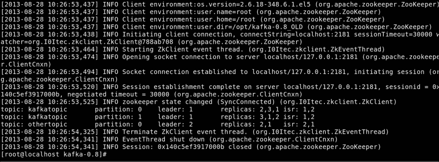
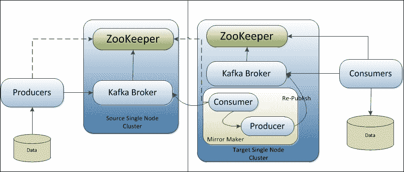

# 第七章：Kafka 的操作

在本章的最后，我们将探讨用于 Kafka 集群管理和 Kafka 主题管理的工具。此外，我们还将简要讨论 Kafka 集群镜像和 Kafka 与第三方工具的集成。

本章的主要重点领域如下：

+   Kafka 管理工具

+   Kafka 集群镜像

+   与其他工具的集成

# Kafka 管理工具

Kafka 0.8.x 提供了许多用于管理集群、主题工具、集群镜像等功能的工具或实用程序。让我们快速看一下这些工具。

## Kafka 集群工具

集群管理是 Kafka 管理员的主要责任之一。一旦集群成功启动，就需要对其进行维护，以进行服务器关闭、领导平衡、复制、集群镜像和扩展 Kafka 集群等活动。让我们详细讨论这些。

正如我们从 Kafka 的设计中了解到，在复制中，多个分区可以具有复制的数据，而在这些多个副本中，一个副本充当领导，其余的副本充当领导副本的同步跟随者。在领导副本不可用的情况下，可能是由于代理关闭，需要选择新的领导副本。

对于像关闭 Kafka 代理进行维护活动这样的场景，新领导的选举是顺序进行的，这会导致 Zookeeper 的大量读/写操作。在具有许多主题/分区的大集群中，领导副本的顺序选举会导致可用性延迟。

为了确保高可用性，Kafka 提供了用于受控关闭 Kafka 代理的工具。如果代理具有领导分区关闭，此工具将主动将领导权转移到另一个代理上的其他同步副本。如果没有可用的同步副本，该工具将无法关闭代理，以确保不会丢失数据。

以下是使用此工具的格式：

```java
[root@localhost kafka_2.9.2-0.8.1.1]# bin/kafka-run-class.sh kafka.admin.ShutdownBroker --zookeeper <zookeeper_host:port/namespace> --broker <brokerID> --num.retries 3 --retry.interval.ms 100

```

需要关闭的 ZooKeeper 主机和代理 ID 是必需的参数。我们还可以指定可选参数，重试次数（`--num.retries，默认值 0`）和重试间隔（以毫秒为单位，`--retry.interval.ms，默认值 1000`）。

当服务器正常停止时，它将自动将所有日志同步到磁盘，以避免在重新启动时进行任何日志恢复，因为日志恢复是一项耗时的活动。在关闭之前，它还将领导分区迁移到其他副本。这确保了每个分区的最小停机时间（最多几毫秒）。还需要启用服务器的受控关闭，如下所示：

```java
    controlled.shutdown.enable=true
```

接下来，在任何具有许多代理、主题和分区的大型 Kafka 集群中，Kafka 确保分区的首选/领导副本在代理之间均匀分布。但是，如果发生关闭（受控或非受控）或代理故障，领导副本的均衡分布可能会在集群内失衡。

Kafka 提供了一个工具，用于在 Kafka 集群中的可用代理之间维护平衡的领导副本分布。

以下是使用此工具的格式：

```java
[root@localhost kafka_2.9.2-0.8.1.1]# bin/kafka-preferred-replica-election.sh --zookeeper <zookeeper_host:port/namespace>

```

此工具使用主题分区列表更新 ZooKeeper 路径，其中需要将领导者移动到首选副本列表。更新列表后，控制器会异步从 ZooKeeper 检索首选主题分区列表，并对于每个主题分区，控制器验证首选副本是否为领导者。如果控制器发现首选副本不是领导者并且不在 ISR 列表中，则会向代理发出请求，以使首选副本成为分区的领导者，以创建平衡的分布。如果首选副本不在 ISR 列表中，控制器将失败操作以避免任何数据丢失。对于此工具，还可以提供 JSON 文件格式的主题分区列表，如下所示：

```java
[root@localhost kafka_2.9.2-0.8.1.1]# bin/kafka-preferred-replica-election.sh --zookeeper <zookeeper_host:port/namespace> --path-to-json-file topicPartitionList.json

```

以下是`topicPartitionList.json`文件的格式：

```java
{
  "partitions":
  [
    {"topic": "Kafkatopic", "partition": "0"},
    {"topic": "Kafkatopic", "partition": "1"},
    {"topic": "Kafkatopic", "partition": "2"},

    {"topic": "Kafkatopic1", "partition": "0"},
    {"topic": "Kafkatopic1", "partition": "1"},
    {"topic": "Kafkatopic1", "partition": "2"},
  ]
}
```

## 添加服务器

要向 Kafka 集群添加服务器，需要为新服务器分配一个唯一的代理 ID，以在新服务器上设置/启动 Kafka。这种添加新服务器的方式不会自动分配任何数据分区。因此，除非将现有分区迁移到服务器或创建新主题，否则新添加的服务器将不执行任何工作。

现有分区的迁移过程由 Kafka 管理员手动启动，因为管理员必须找出应移动哪些主题或分区。一旦管理员确定了分区，就会使用分区重新分配工具（`bin/kafka-reassign-partitions.sh`）将分区移动到代理之间，该工具会处理一切。作为迁移过程，Kafka 将使新添加的服务器成为正在迁移的分区的追随者。这允许新服务器完全复制该分区中的现有数据。一旦新服务器完全复制了分区的内容并成为同步副本的一部分，现有副本将删除分区的数据。分区重新分配工具（`kafka-reassign-partitions.sh`）以三种不同的模式运行：

+   `--generate`：在此模式下，工具根据与工具共享的主题和代理列表生成候选重新分配，以将指定主题的所有分区移动到新服务器

+   --execute：在此模式下，工具根据用户提供的重新分配计划启动分区的重新分配，该计划由`--reassignment-json-file`选项指定

+   `--verify`：在此模式下，工具验证上次`--execute`期间列出的所有分区的重新分配状态（成功完成/失败/进行中）

分区重新分配工具可用于将选定的主题从当前一组代理移动到新添加的代理（服务器）。管理员应提供要移动到新服务器的主题列表以及新代理 ID 的目标列表。该工具均匀分布给定主题的所有分区到新代理，并将输入主题列表的所有分区的副本移动到新代理。

```java
[root@localhost kafka_2.9.2-0.8.1.1]# cat topics-for-new-server.json
{"partitions":
 [{"topic": "kafkatopic",
 {"topic": "kafkatopic1"}],
 "version":1
}

[root@localhost kafka_2.9.2-0.8.1.1]# bin/kafka-reassign-partitions.sh --zookeeper localhost:2181 
--topics-to-move-json-file topics-for-new-server.json --broker-list "4,5" -–generate new-topic-reassignment.json

```

前面的命令生成了分配（`new-topic-reassignment.json`）计划，将主题`kafkatopic`和`kafkatopic1`的所有分区移动到具有 ID`4`和`5`的新一组代理中。在此移动结束时，主题`foo1`和`foo2`的所有分区将仅存在于代理`5`和`6`上。要启动分配，使用`kafka-reassign-partitions.sh`工具：

```java
[root@localhost kafka_2.9.2-0.8.1.1]# bin/kafka-reassign-partitions.sh --zookeeper localhost:2181 --reassignment-json-file new-topic-reassignment.json --execute

```

此工具还可以用于有选择地将分区从现有代理移动到新代理：

```java
[root@localhost kafka_2.9.2-0.8.1.1]# cat partitions-reassignment.json
{"partitions":
 [{"topic": "kafkatopic",
 "partition": 1,
 "replicas": [1,2,4] }], 
 }],
 "version":1
}

[root@localhost kafka_2.9.2-0.8.1.1]# bin/kafka-reassign-partitions.sh --zookeeper localhost:2181
 --reassignment-json-file partitions-reassignment.json --execute

```

前面的命令有选择地将某些分区的副本移动到新服务器。重新分配完成后，可以验证操作：

```java
[root@localhost kafka_2.9.2-0.8.1.1]# bin/kafka-reassign-partitions.sh --zookeeper localhost:2181 --reassignment-json-file new-topic-reassignment.json --verify

Status of partition reassignment:
Reassignment of partition [kafkatopic,0] completed successfully
Reassignment of partition [kafkatopic,1] is in progress
Reassignment of partition [kafkatopic,2] completed successfully
Reassignment of partition [kafkatopic1,0] completed successfully
Reassignment of partition [kafkatopic1,1] completed successfully
Reassignment of partition [kafkatopic1,2] is in progress 

```

要从 Kafka 集群中停用任何服务器，管理员必须将托管在要停用的代理（服务器）上的所有分区的副本移动到剩余的代理中，以实现均匀分布。`kafka-reassign-partitions.sh`工具还可用于增加分区的复制因子，如下所示：

```java
[root@localhost kafka_2.9.2-0.8.1.1]# cat increase-replication-factor.json
{"partitions":[{"topic":"kafkatopic","partition":0,"replicas":[2,3]}],
 "version":1
}

[root@localhost kafka_2.9.2-0.8.1.1]# bin/kafka-reassign-partitions.sh --zookeeper localhost:2181
 --reassignment-json-file increase-replication-factor.json --execute

```

上述命令假设`kafkatopic`主题的分区`0`具有复制因子`1`，存在于 broker 2；现在将复制因子从`1`增加到`2`，并在 broker 3 上创建新的副本。

## Kafka 主题工具

默认情况下，Kafka 使用默认的分区数和复制因子创建主题（默认值为`1`）。但是，在实际场景中，我们可能需要多次定义分区数和复制因子。

以下是使用特定参数创建主题的命令：

```java
[root@localhost kafka_2.9.2-0.8.1.1]# bin/kafka-topics.sh --create --zookeeper localhost:2181/chroot --replication-factor 3 --partitions 10 --topic kafkatopic

```

在上述命令中，复制因子控制每个消息生产者发布的消息将由多少服务器复制。例如，复制因子`3`表示在丢失数据访问之前最多可以有两台服务器故障。启用消费者并行处理的分区计数反映了主题将被分片成的日志数量。在这里，每个分区必须完全适合单个服务器。例如，如果为一个主题定义了 10 个分区，则完整数据集将由不超过 10 台服务器处理，不包括副本。

Kafka 主题实用程序`kafka-topics.sh`也可以用于修改 Kafka 主题，如下所示：

```java
[root@localhost kafka_2.9.2-0.8.1.1]# bin/kafka-topics.sh --alter --zookeeper localhost:2181/chroot --partitions 20 --topic kafkatopic

```

在上述命令中，Kafka 主题的分区增加了 10 个。目前，Kafka 不支持减少主题的分区数或更改复制因子。要删除 Kafka 主题，使用以下命令：

```java
[root@localhost kafka_2.9.2-0.8.1.1]# bin/kafka-topics.sh --delete --zookeeper localhost:2181/chroot --topic kafkatopic

```

使用`kafka-topics.sh` Kafka 主题实用程序，也可以添加配置到 Kafka 主题，如下所示：

```java
[root@localhost kafka_2.9.2-0.8.1.1]# bin/kafka-topics.sh --alter --zookeeper localhost:2181/chroot --topic kafkatopic --config <key>=<value>

```

要从 Kafka 主题中删除配置，请使用以下命令：

```java
[root@localhost kafka_2.9.2-0.8.1.1]# bin/kafka-topics.sh --alter --zookeeper localhost:2181/chroot --topic kafkatopic --deleteconfig <key>=<value>

```

Kafka 还提供了一个实用程序来搜索 Kafka 服务器中的主题列表。列表主题工具通过查询 Zookeeper 提供主题列表和有关它们的分区、副本或领导者的信息。

以下命令获取主题列表：

```java
[root@localhost kafka_2.9.2-0.8.1.1]# bin/kafka-topics.sh --list --zookeeper localhost:2181

```

在执行上述命令时，您应该会得到以下截图中显示的输出：



上述控制台输出显示，我们可以获取有关主题和复制数据的分区的信息。前面截图的输出可以解释如下：

+   `leader`：这是特定部分分区的随机选择节点，负责该分区的所有读写操作

+   `replicas`：这代表保存指定分区日志的节点列表

+   `isr`：这代表当前活着并与领导者同步的同步副本列表的子集

请注意，`kafkatopic`有两个分区（分区`0`和`1`）和三个副本，而`othertopic`只有一个分区和两个副本。

在获取 Kafka 主题列表时，还可以提供两个可选参数：`under-replicated-partitions`和`unavailable-partitions`。`under-replicated-partitions`参数用于获取那些具有副本未复制的主题/分区的详细信息。`unavailable-partitions`参数用于获取那些领导者不可用的主题/分区的详细信息。

# Kafka 集群镜像

Kafka 镜像功能用于创建现有集群的副本，例如，将活动数据中心复制到被动数据中心。Kafka 提供了一个镜像制造工具，用于将源集群镜像到目标集群。

以下图表描述了架构形式中镜像工具的放置：



在这种架构中，镜像工具的作用是从源集群消费消息，并使用内嵌的生产者将它们重新发布到目标集群。Kafka 迁移工具也使用类似的方法，从 0.7.x Kafka 集群迁移到 0.8.x Kafka 集群。

为了镜像源集群，启动目标集群并按以下方式启动 MirrorMaker 进程：

```java
[root@localhost kafka_2.9.2-0.8.1.1]# bin/kafka-run-class.sh kafka.tools.MirrorMaker --consumer.config sourceClusterConsumer.config --num.streams 2 --producer.config targetClusterProducer.config --whitelist=".*"

```

成功启动 MirrorMaker 工具所需的最小参数是一个或多个消费者配置、一个生产者配置，以及一个白名单或黑名单作为标准的 Java 正则表达式模式——例如，使用`--whitelist 'A|B'`来镜像名为`A`和`B`的两个主题，或者使用`--whitelist '*'`来镜像所有主题。`--blacklist`配置也可以作为标准的 Java 正则表达式模式来指定在镜像时要排除的内容。它还需要镜像工具的消费者连接到源集群的 ZooKeeper，生产者连接到镜像集群的 ZooKeeper，或者`broker.list`参数。

为了实现高吞吐量，使用配置为阻塞模式的异步嵌入式生产者。这确保了消息不会丢失，并且阻塞生产者会等待，直到消息被写入目标集群，如果生产者的队列已满。生产者的队列一直满表示 MirrorMaker 在重新发布消息到目标镜像集群和/或将消息刷新到磁盘上受到了瓶颈的影响。`--num.producers`选项也可以用于在 MirrorMaker 中表示生产者池，以增加吞吐量，因为多个生产者请求可以由目标集群的多个消费流处理。`--num.streams`选项指定要创建的镜像消费者线程的数量。

镜像通常用于跨数据中心的场景，并且通常在 MirrorMaker 的消费者配置上使用较高的套接字缓冲区大小（`socket.buffersize`）和源集群代理配置上的`socket.send.buffer`。此外，MirrorMaker 消费者的获取大小（`fetch.size`）应该高于消费者的套接字缓冲区大小。如果在生产者配置中使用了`broker.list`以及硬件负载均衡器，还可以提供有关生产者故障重试尝试次数的配置。

Kafka 还提供了用于检查镜像或一般情况下消费者位置的工具。该工具显示消费者组中所有消费者的位置以及消费者在日志末尾之后的距离；它指示集群镜像的执行情况。该工具可以按以下方式使用：

```java
[root@localhost kafka_2.9.2-0.8.1.1]#bin/kafka-run-class.sh kafka.tools.ConsumerOffsetChecker --group MirrorGroup --zkconnect localhost:2181 --topic kafkatopic

Group         Topic      Pid Offset   logSize     Lag       Owner
MirrorGroup  kafkatopic   0    5         5         0        none
MirrorGroup kafkatopic    1    3         4         1        none
MirrorGroup kafkatopic    2    6         9         3        none

```

这里的`--zkconnect`参数指向源集群的 ZooKeeper（例如，源数据中心）。`--topic`参数是一个可选参数，如果未指定主题，则工具将打印指定消费者组下所有主题的信息。

# 与其他工具的集成

本节讨论了许多贡献者的贡献，为 Apache Kafka 提供了与日志记录、打包、云集成和 Hadoop 集成等各种需求的集成。

Camus ([`github.com/linkedin/camus`](https://github.com/linkedin/camus))提供了从 Kafka 到 HDFS 的管道。在这个项目下，一个单独的 MapReduce 作业执行以下步骤以分布式方式将数据加载到 HDFS 中：

1.  作为第一步，它从 ZooKeeper 中发现最新的主题和分区偏移量。

1.  MapReduce 作业中的每个任务从 Kafka 代理中获取事件，并将拉取的数据以及审核计数提交到输出文件夹。

1.  作业完成后，最终偏移量被写入 HDFS，并可以由后续的 MapReduce 作业进一步消费。

1.  有关已消费消息的信息也会更新到 Kafka 集群中。

一些其他有用的贡献包括：

+   在亚马逊上自动部署和配置 Kafka 和 ZooKeeper ([`github.com/nathanmarz/kafka-deploy`](https://github.com/nathanmarz/kafka-deploy))

+   一个日志实用程序 ([`github.com/leandrosilva/klogd2`](https://github.com/leandrosilva/klogd2))

+   Mozilla Metrics 的 REST 服务 ([`github.com/mozilla-metrics/bagheera`](https://github.com/mozilla-metrics/bagheera))

+   Apache Camel-Kafka 集成（[`github.com/BreizhBeans/camel-kafka/wiki`](https://github.com/BreizhBeans/camel-kafka/wiki)）

### 注意

有关 Kafka 生态系统工具的详细列表，请参阅[`cwiki.apache.org/confluence/display/KAFKA/Ecosystem`](https://cwiki.apache.org/confluence/display/KAFKA/Ecosystem)。

# 总结

在这一章中，我们添加了关于 Kafka 的更多信息，比如它的管理员工具、集成以及 Kafka 非 Java 客户端。

在这次完整的 Apache Kafka 之旅中，我们触及了许多关于 Kafka 的重要事实。您已经了解了 Kafka 开发的原因、安装程序以及对不同类型集群的支持。我们还探讨了 Kafka 的设计方法，并编写了一些基本的生产者和消费者。

最后，我们讨论了 Kafka 与 Hadoop 和 Storm 等技术的集成。

进化之旅永无止境。
