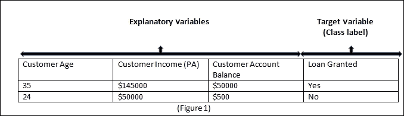
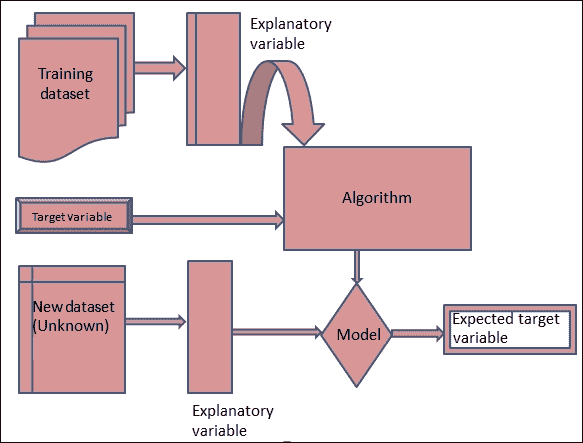
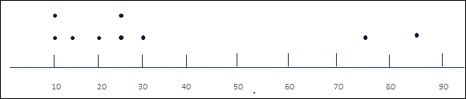
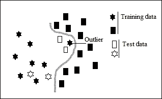
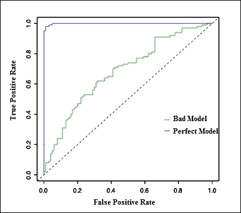

# 第一章. 数据分析中的分类

在过去十年中，我们见证了社交网络和电子商务网站的大幅增长。我确信你一定在 Facebook、Twitter 或其他网站上看到过这本书的信息。你也很可能在手机或平板电脑上订购后阅读了这本书的电子版。

这必须让你意识到我们每天在互联网上生成多少数据。现在，为了从数据中获得所有必要的信息，我们不仅创建数据，还存储这些数据。这些数据对于获得对业务的某些重要见解极为有用。对这些数据的分析可以增加客户群并为企业创造利润。以电子商务网站为例。你访问网站购买书籍。你会得到关于相关主题或同一主题、出版社或作者的书籍信息，这有助于你做出更好的决定，同时也帮助网站更多地了解其客户。这最终将导致销售额的增加。

寻找相关项目或向用户推荐新项目都是数据分析的一部分，我们分析数据并试图获取有用的模式。

数据分析是检查历史数据并创建模型以获取有助于决策的有用信息的流程。它在许多行业中都有帮助，例如电子商务、银行、金融、医疗保健、电信、零售、海洋学等等。

让我们以天气预报系统为例。这是一个可以预测特定地点大气状态的系统。在这个过程中，科学家收集该地点的大气历史数据，并试图基于这些数据创建一个模型，以预测大气在一段时间内的演变。

在机器学习中，分类是从过去的例子中学习并自动模拟这些决策的决策过程自动化。自动模拟决策是预测分析的核心概念。在本章中，我们将探讨以下要点：

+   理解分类

+   分类系统的工作原理

+   分类算法

+   模型评估方法

# 介绍分类

每当我们提到“分类”这个词时，总会让我们想起生物学课程，在那里我们学习了动物分类。我们学习了不同类别的动物，如哺乳动物、爬行动物、鸟类、两栖动物等等。

如果你记得这些类别是如何定义的，你就会意识到科学家在现有的动物中发现了某些特性，并且基于这些特性，他们对新的动物进行了分类。

其他分类的实际例子可以是，例如，当你去看医生时。他会问你一些问题，然后根据你的回答，他能够判断你是否患有某种疾病。

分类是将潜在答案进行分类的过程，在机器学习中，我们希望自动化这个过程。生物分类是**多类**分类的一个例子，而发现疾病是**二元**分类的一个例子。

在数据分析中，我们希望使用机器学习概念。为了分析数据，我们希望构建一个系统，帮助我们找出单个项目属于哪个类别。通常，这些类别是互斥的。这个领域的一个相关问题是要找出单个属于某个特定类别的概率。

分类是一种监督学习技术。在这种技术中，机器——基于历史数据——学习和获得预测未知的能力。在机器学习中，另一种流行的技术是无监督学习。在监督学习中，我们已经知道输出类别，但在无监督学习中，我们一无所知。让我们用一个快速例子来理解这一点：假设我们有一个水果篮，我们想要对水果进行分类。当我们说分类时，意味着在训练数据中，我们已经有输出变量，如大小和颜色，我们知道颜色是红色，大小在 2.3"到 3.7"之间。我们将该水果分类为苹果。与此相反，在无监督学习中，我们想要将不同的水果分开，在训练数据集中我们没有任何输出信息，因此学习算法将根据数据集中存在的不同特征来分离不同的水果，但它无法对它们进行标记。换句话说，它无法告诉哪个是苹果，哪个是香蕉，尽管它能够将它们分开。

## 分类系统的应用

分类用于预测。在电子邮件分类的情况下，它用于将电子邮件分类为垃圾邮件或非垃圾邮件。如今，Gmail 还将电子邮件分类为主要邮件、社交邮件和促销邮件。分类在预测信用卡欺诈、为贷款资格分类客户等方面非常有用。它也用于预测保险和电信行业的客户流失。在医疗保健行业也非常有用。基于历史数据，它有助于对疾病的特定症状进行分类，以提前预测疾病。分类可以用于分类热带气旋。因此，它在所有行业中都有用。

## 分类系统的运作原理

让我们更详细地了解分类过程。在分类过程中，我们使用给定的数据集，试图找到信息变量，通过这些变量我们可以减少不确定性并对某事物进行分类。这些信息变量被称为**解释变量**或特征。

我们感兴趣的最后类别被称为目标变量或标签。解释变量可以是以下任何一种形式：

+   连续的（数值类型）

+   分类别

+   类似于单词的

+   类似于文本的

### 注意

如果数值类型对任何数学函数都没有用，那么这些将被视为分类数据（如邮政编码、街道号码等）。

例如，我们有一个客户贷款申请的数据集，我们想要构建一个分类器来找出新客户是否有资格获得贷款。在这个数据集中，我们可以有以下字段：

+   **客户年龄**

+   **客户收入（PA**）

+   **客户账户余额**

+   **贷款批准**

从这些字段中，**客户年龄**、**客户收入（PA**）和**客户账户余额**将作为解释变量，**贷款批准**将是目标变量，如下截图所示：

为了理解分类器的创建，我们需要了解一些术语，如下面的图所示：

+   **训练数据集**：从给定的数据集中，一部分数据被用来创建训练数据集（可能是给定数据的 70%）。这个数据集用于构建分类器。在这个数据集中使用了所有的特征集。

+   **测试数据集**：在训练数据集被使用后剩下的数据集用于测试创建的模型。使用这些数据，仅使用特征集，并使用模型来预测目标变量或标签。

+   **模型**：这是用来理解生成目标变量的算法。

在构建分类器时，我们遵循以下步骤：

+   收集历史数据

+   清洗数据（这里涉及许多活动，如空格删除等）

+   定义目标变量

+   定义解释变量

+   选择算法

+   训练模型（使用训练数据集）

+   运行测试数据

+   评估模型

+   调整解释变量

+   重新运行测试

在准备模型时，应注意异常值检测。**异常值检测**是一种找出数据集中不符合预期模式的项目的方法。输入数据集中的异常值可能会误导算法的训练过程。这可能会影响模型精度。有一些算法可以找出数据集中的这些异常值。基于距离的技术和基于模糊逻辑的方法通常用于找出数据集中的异常值。让我们通过一个例子来了解异常值。

我们有一组数字，我们想要找出这些数字的平均值：

10, 75, 10, 15, 20, 85, 25, 30, 25

只需绘制这些数字，结果将如以下截图所示：

显然，数字 75 和 85 是异常值（在图中远离其他数字）。

平均值 = 值的总和/值的数量 = 32.78

去除异常值后的平均值：= 19.29

因此，现在你可以理解异常值如何影响结果。

在创建模型时，我们可能会遇到两个主要问题——**过拟合**和**欠拟合**。

当算法捕捉到数据的噪声，并且算法拟合数据过于完美时，就会发生过拟合。通常，如果我们使用所有给定数据通过纯记忆来构建模型时，会发生过拟合。模型不是找出泛化模式，而是仅仅记住模式。通常，在过拟合的情况下，模型变得更加复杂，并且允许它选择虚假的相关性。这些相关性仅针对训练数据集，并不代表整个数据集的一般特征。

以下图表是过拟合的一个例子。存在一个异常值，算法考虑了这一点，并创建了一个完美分类训练集的模型，但由于这一点，测试数据被错误分类（测试数据中的两个矩形都被分类为星星）：

没有一种单一的方法可以避免过拟合；然而，我们有一些方法，例如减少特征数量和将一些特征进行正则化。另一种方法是使用一些数据集来训练模型，并使用剩余的数据集进行测试。一种常用的方法称为交叉验证，用于生成多个性能指标。这样，单个数据集被分割并用于创建性能指标。

当算法无法捕捉数据中的模式，并且数据拟合得不好时，就会发生欠拟合。欠拟合也称为高偏差。这意味着你的算法对其假设有如此强烈的偏差，以至于它无法很好地拟合数据。对于欠拟合错误，更多的数据不会有所帮助。它可能会增加训练错误。更多的解释变量可以帮助处理欠拟合问题。更多的解释字段会扩展假设空间，并有助于克服这个问题。

无论是过拟合还是欠拟合，在使用新数据集时都会产生较差的结果。

# 分类算法

我们现在将讨论本书中由 Apache Mahout 支持的以下算法：

+   **逻辑回归 / 随机梯度下降（SGD）**：我们通常将回归与分类一起阅读，但实际上，两者之间是有区别的。分类涉及分类目标变量，而回归涉及数值目标变量。分类预测某事是否会发生，而回归预测某事会发生多少。我们将介绍这个算法在第三章 *学习逻辑回归/随机梯度下降使用 Mahout* 中。Mahout 支持通过随机梯度下降训练的逻辑回归。

+   **朴素贝叶斯分类**：这是文本分类中非常流行的一个算法。朴素贝叶斯使用概率的概念来分类新项目。它基于贝叶斯定理。我们将在第四章，*使用 Mahout 学习朴素贝叶斯分类*中讨论这个算法。在这一章中，我们将看到 Mahout 在文本分类方面的应用，这在数据分析领域是必需的。我们将讨论向量化、词袋、n-gram 以及文本分类中使用的其他术语。

+   **隐马尔可夫模型（HMM）**：它在各种领域都有应用，如语音识别、词性标注、基因预测、时间序列分析等。在 HMM 中，我们观察到一系列的发射序列，但没有模型使用的状态序列来生成发射。在第五章，*使用 Mahout 学习隐马尔可夫模型*中，我们将讨论另一个由 Mahout 支持的算法。我们将详细讨论 HMM，并了解 Mahout 如何支持这个算法。

+   **随机森林**：这是分类中最广泛使用的算法。随机森林由一组简单的树预测器组成，每个预测器都能在给定一组解释变量时产生响应。在第六章，*使用 Mahout 学习随机森林*中，我们将详细讨论这个算法，并讨论如何使用 Mahout 实现这个算法。

+   **多层感知器（MLP）**：在第七章，*使用 Mahout 学习多层感知器*中，我们将讨论 Mahout 中新实现的这个算法。MLP 由一个有向图中的多个层节点组成，每一层都与下一层完全连接。它是神经网络实现的基础。我们将在详细讨论 Mahout 中的 MLP 之后，简要讨论神经网络。

我们将在本书中讨论 Apache Mahout 支持的所有的分类算法，并检查 Apache Mahout 提供的模型评估技术。

# 模型评估技术

我们不能有一个单一的评估指标来适应所有的分类器模型，但我们可以找出评估中的一些常见问题，并且我们有技术来处理这些问题。我们将在 Mahout 中使用以下技术进行讨论：

+   混淆矩阵

+   ROC 图

+   AUC

+   熵矩阵

## 混淆矩阵

混淆矩阵为我们提供了模型与数据中实际结果（目标值）相比所做出的正确和错误预测的数量。混淆矩阵是一个 N*N 矩阵，其中 N 是标签（类别）的数量。每一列是预测类中的一个实例，每一行是实际类中的一个实例。使用这个矩阵，我们可以找出一个类别是如何与其他类别混淆的。假设我们有一个将三种水果分类的分类器：草莓、樱桃和葡萄。假设我们有 24 个水果的样本：7 个草莓，8 个樱桃和 9 个葡萄，得到的混淆矩阵如下表所示：

| 模型预测的类别 |
| --- |
| **实际类别** |   | **草莓** | **樱桃** | **葡萄** |
| **草莓** | 4 | 3 | 0 |
| **樱桃** | 2 | 5 | 1 |
| **葡萄** | 0 | 1 | 8 |

因此，在这个模型中，从 8 个草莓中，有 3 个被分类为樱桃。从 8 个樱桃中，有 2 个被分类为草莓，1 个被分类为葡萄。从 9 个葡萄中，有 1 个被分类为樱桃。从这个矩阵中，我们将创建混淆表格。混淆表格有两行两列，报告关于真阳性、真阴性、假阳性和假阴性的信息。

因此，如果我们为特定类别构建这个表格，比如说草莓，它会是这样的：

| **真阳性**4（正确分类的实际草莓）(a) | **假阳性**2（被分类为草莓的樱桃）(b) |
| --- | --- |
| **假阴性**3（错误分类为樱桃的草莓）(c) | **真阴性**15（所有其他水果正确地没有被分类为草莓）(d) |

使用这个混淆表格，我们可以找出以下术语：

+   **准确率**：这是正确分类的总预测数与预测总数的比例。它计算为（真阳性 + 真阴性）/ 阳性 + 阴性。因此，*准确率 = (a+d)/(a+b+c+d)*。

+   **精确率或阳性预测值**：这是正确分类的阳性案例的比例。它计算为（真阳性）/（真阳性 + 假阳性）。因此，*精确率 = a/(a+b)*。

+   **阴性预测值**：这是正确分类的阴性案例的比例。它计算为真阴性/(真阴性 + 假阴性)。因此，*阴性预测值 = d/(c+d)*。

+   **灵敏度/真阳性率/召回率**：这是正确识别的实际阳性案例的比例。它计算为真阳性/(真阳性 + 假阴性)。因此，*灵敏度 = a/(a+c)*。

+   **特异性**：这是实际阴性案例的比例。它计算为 *真阴性/(假阳性 + 真阴性)*。因此，*特异性 = d/(b+d)*。

+   **F1 分数**：这是测试准确度的度量，其计算如下：*F1 = 2.((阳性预测值（精确度）* 灵敏度（召回率))/(阳性预测值（精确度）+ 灵敏度（召回率)))*。

## 接收者操作特征（ROC）图

ROC 是分类器的二维图，其假阳性率在 x 轴上，真阳性率在 y 轴上。图中的低点（0,0）表示从不发出阳性分类。点（0,1）表示完美分类。从（0,0）到（1,1）的对角线将 ROC 空间分割。对角线以上的点表示好的分类结果，而对角线以下的点表示差的结果，如下面的图所示：

## ROC 曲线下的面积

这是 ROC 曲线下的面积，也称为 AUC。它用于衡量分类模型的质量。在实践中，大多数分类模型的 AUC 值介于 0.5 和 1 之间。该值越接近 1，你的分类器就越强大。

## 熵矩阵

在深入了解熵矩阵之前，我们首先需要理解**熵**。信息论中熵的概念是由香农提出的。

熵是应用于集合的混乱度度量。它被定义为：

*熵 = -p1log(p1) – p2log(p2)- …….*

每个 p 是该集合中特定属性的概率。让我们回顾一下我们的客户贷款申请数据集。例如，假设我们有 10 个客户，其中 6 个有资格贷款，4 个没有。在这里，我们有两个属性（类别）：合格或不合格。

*P(合格) = 6/10 = 0.6*

*P(不合格) = 4/10 = 0.4*

因此，数据集的熵将是：

*熵 = -[0.6*log2(0.6)+0.4*log2(0.4)]*

*= -[0.6*-0.74 +0.4*-1.32]*

*= 0.972*

熵在获取信息增益知识方面很有用。信息增益衡量由于在模型创建过程中添加任何新信息而导致的熵的变化。因此，如果熵由于新信息而减少，这表明模型现在表现良好。信息增益的计算如下：

*IG (类别，子类别) = 熵(类别) –(p(子类别 1)*熵(子类别 1)+ p(子类别 2)*熵(子类别 2) + …)*

熵矩阵基本上与之前定义的混淆矩阵相同；唯一的区别是矩阵中的元素是每个真实或估计类别组合的概率得分的对数平均。一个好的模型将对角线上的数字将是小的负数，而在对角线位置将有大的负数。

# 摘要

我们已经讨论了分类及其应用，以及 Mahout 支持哪些算法和分类器评估技术。我们讨论了如混淆矩阵、ROC 图、AUC 和熵矩阵等技术。

现在，我们将进入下一章，设置 Apache Mahout 和开发环境。我们还将讨论 Apache Mahout 的架构，并找出为什么 Mahout 是分类的一个好选择。
