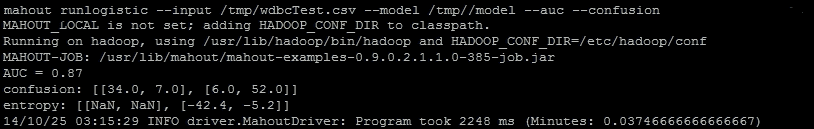

# 第三章。使用 Mahout 学习逻辑回归/SGD

在直接跳入逻辑回归之前，让我们先尝试理解其几个概念。在本章中，我们将探讨以下主题：

+   介绍回归

+   理解线性回归

+   成本函数

+   梯度下降

+   逻辑回归

+   理解 SGD

+   使用 Mahout 进行逻辑回归

# 介绍回归

回归分析用于预测和预测。它用于找出解释变量和目标变量之间的关系。本质上，它是一个用于找出数据集中变量之间关系的统计模型。为了更好地理解这个术语，你可以参考以下例子：确定特定行业中工人的收入。在这里，我们将试图找出影响工人工资的因素。这些因素可以是年龄、教育、工作经验年数、特定的技能组合、位置等等。我们将尝试构建一个模型，考虑所有这些变量，并尝试预测工资。在回归分析中，我们描述目标变量围绕回归函数的变化，这可以通过一个也是感兴趣的概率分布来描述。有许多回归分析技术可供选择。例如，线性回归、普通最小二乘回归、逻辑回归等等。

## 理解线性回归

在线性回归中，我们创建一个模型，通过解释变量来预测目标变量的值。为了更好地理解这一点，让我们来看一个例子。

一家名为 X 的公司从事咖啡销售，注意到在雨季期间，他们的销售额大幅增加。因此，他们提出了一种公式来找出雨量和每杯咖啡销售额之间的关系，如下所示：

*C = 1.5R+800*

因此，对于 2 毫米的降雨量，咖啡的需求量为 803 杯。现在，如果你深入到细节中，你会意识到我们有了降雨量和每杯咖啡销售额的数据，我们正在尝试构建一个模型，可以根据降雨量预测咖啡的需求。我们的数据形式为 *(R1, C1), (R2, C2)…. (Ri, Ci)*。在这里，我们将以使实际值和预测值之间的误差最小化的方式构建模型。

### 成本函数

在方程 *C = 1.5R+800* 中，两个值 1.5 和 800 是参数，这些值会影响最终结果。我们可以将此方程写成 *C= p0+p1R*。正如我们之前讨论的，我们的目标是减少实际值和预测值之间的差异，这取决于 *p0* 和 *p1* 的值。让我们假设预测值为 *Cp*，实际值为 *C*，这样差异将是 *(Cp-C)*。为了最小化这个误差，我们定义了一个误差函数，这也就是所谓的**成本函数**。

成本函数可以用以下公式定义：


在这里，**i**是第 i 个样本，**N**是训练样本的数量。我们计算不同组*p0*和*p1*的成本，并最终选择成本最低的*p0*和*p1*（*C*）。这是将用于对新输入进行预测的模型。

### 梯度下降

梯度下降从一组初始参数值开始，*p0*和*p1*，并通过迭代移动到一组使成本函数最小化的参数值。我们可以通过图形化地可视化这个误差函数，其中宽度和长度可以被认为是参数*p0*和*p1*，高度是成本函数。我们的目标是找到*p0*和*p1*的值，使得我们的成本函数最小。我们以*p0*和*p1*的一些值开始算法，并通过迭代工作以达到最小值。确保梯度下降正确工作的一种好方法是确保成本函数在每次迭代中都会降低。在这种情况下，成本函数表面是凸的，我们将尝试找到最小值。这可以在以下图中看到：


## 逻辑回归

逻辑回归用于确定事件发生的概率。通常，逻辑回归指的是结果为二元的概率问题，例如，在构建基于客户收入、旅行用途、性别和其他特征的模型来预测他或她是否会购买特定汽车的问题。因此，答案将是简单的“是”或“否”。当结果由多个类别组成时，这被称为**多项式逻辑回归**。

逻辑回归基于**sigmoid 函数**。预测变量与线性权重结合后传递到该函数，该函数生成 0 到 1 范围内的输出。输出接近 1 表示某个项目属于某个特定类别。让我们首先了解 sigmoid 或逻辑函数。它可以由以下公式定义：

*F (z) = 1/(1+e^(-z))*

对于一个解释变量*z*，它将被定义为*z = β0 + β1*x*。这个方程可以这样解释：

+   **z**: 这被称为因变量。这是我们想要预测的变量。在创建模型的过程中，我们在训练集中拥有这个变量，并构建模型来预测这个变量。z 的已知值被称为观测值。

+   **x**: 这是指解释变量或独立变量。这些变量用于预测因变量 z。例如，为了预测在特定地点新推出的产品的销售额，我们可能包括解释变量，如产品的价格、该地点人们的平均收入等。

+   **β0**：这被称为回归截距。如果所有解释变量都为零，则此参数等于因变量 z。

+   **β1**：这些是每个解释变量的值。

对数逻辑函数的图像如下：


通过一点数学，我们可以将此方程式修改如下：

*ln(F(x)/(1-F(x))) = β0 + β1*x*

在线性回归的情况下，成本函数图是凸的，但在这里，它将不会是凸的。以使我们的预测输出接近实际值的方式找到参数的最小值将很困难。在成本函数中，计算逻辑回归时，我们将线性回归的*Cp*值替换为函数*F(z*)。为了使对数逻辑回归成本函数凸，我们将*(p0+p1Ri-Ci)2*替换为以下之一：

+   *log (1/1+e (-(β0 + β1*x)))* 如果事件的实际发生为 1，此函数将表示成本。

+   *log (1-(1/1+e (-(β0 + β1*x))))* 如果事件的实际发生为 0，此函数将表示成本。

我们必须记住，在逻辑回归中，我们计算类概率。因此，如果事件发生的概率（客户购买汽车、被骗等）为*p*，则不发生的概率为*1-p*。

## 随机梯度下降

梯度下降法最小化成本函数。对于非常大的数据集，梯度下降是一个非常昂贵的程序。随机梯度下降（SGD）是对梯度下降算法的一种修改，用于处理大型数据集。梯度下降使用整个数据集来计算梯度，而 SGD 使用单个样本来计算梯度。因此，梯度下降加载整个数据集并试图在图上找到局部最小值，然后再次重复整个过程，而 SGD 则逐个调整每个样本的成本函数。SGD 相对于梯度下降的一个主要优势是其计算速度要快得多。在 RAM 中通常无法容纳大型数据集，因为存储是有限的。在 SGD 中，对 RAM 的负担减轻了，其中每个样本或样本批次被加载并处理，其结果被存储，等等。

## 使用 Mahout 进行逻辑回归

Mahout 提供了使用 SGD 进行逻辑回归的实现。它非常易于理解和使用。因此，让我们开始吧。

**数据集**

我们将使用**威斯康星诊断乳腺癌**（**WDBC**）数据集。这是一个乳腺癌肿瘤数据集，数据从 1995 年开始可用。它有 569 个乳腺癌病例实例，有 30 个特征来预测诊断，这些诊断被分类为良性或恶性。

### 注意

关于前面数据集的更多详细信息，请参阅[`archive.ics.uci.edu/ml/machine-learning-databases/breast-cancer-wisconsin/wdbc.names`](http://archive.ics.uci.edu/ml/machine-learning-databases/breast-cancer-wisconsin/wdbc.names)。

**准备训练和测试数据**

您可以从[`archive.ics.uci.edu/ml/machine-learning-databases/breast-cancer-wisconsin/wdbc.data`](http://archive.ics.uci.edu/ml/machine-learning-databases/breast-cancer-wisconsin/wdbc.data)下载`wdbc.data`数据集。

现在，将其保存为 CSV 文件，并包含以下标题行：

`ID_Number,Diagnosis,Radius,Texture,Perimeter,Area,Smoothness,Compactness,Concavity,ConcavePoints,Symmetry,Fractal_Dimension,RadiusStdError,TextureStdError,PerimeterStdError,AreaStdError,SmoothnessStdError,CompactnessStdError,ConcavityStdError,ConcavePointStdError,Symmetrystderror,FractalDimensionStderror,WorstRadius,worsttexture,worstperimeter,worstarea,worstsmoothness,worstcompactness,worstconcavity,worstconcavepoints,worstsymmentry,worstfractaldimensions`

现在，我们必须执行以下步骤来准备这些数据，以便由 Mahout 逻辑回归算法使用：

1.  我们将目标类别转换为数值。在这种情况下，第二个字段诊断是目标变量。我们将恶性标记为 0，良性标记为 1。使用以下代码片段介绍这些更改。对于小型数据集，我们可以使用这种策略，但对于大型数据集，我们有不同的策略，这些策略将在第四章中介绍，*使用 Mahout 学习朴素贝叶斯分类*：

    ```py
    public void convertTargetToInteger() throws IOException{
      //Read the data
      BufferedReader br = new BufferedReader(new FileReader("wdbc.csv"));
      String line =null;
      //Create the file to save the resulted data
      File wdbcData = new File("<Your Destination location for file.>");
      FileWriter fw = new FileWriter(wdbcData);
      //We are adding header to the new file
      fw.write("ID_Number"+","+"Diagnosis"+","+"Radius"+","+"Texture"+","+"Perimeter"+","+"Area"+","+"Smoothness"+","+"Compactness"+","+"Concavity"+","+"ConcavePoints"+","+"Symmetry"+","+"Fractal_Dimension"+","+"RadiusStdError"+","+"TextureStdError"+","+"PerimeterStdError"+","+"AreaStdError"+","+"SmoothnessStdError"+","+"CompactnessStdError"+","+"ConcavityStdError"+","+"ConcavePointStdError"+","+"Symmetrystderror"+","+"FractalDimensionStderror"+","+"WorstRadius"+","+"worsttexture"+","+"worstperimeter"+","+"worstarea"+","+"worstsmoothness"+","+"worstcompactness"+","+"worstconcavity"+","+"worstconcavepoints"+","+"worstsymmentry"+","+"worstfractaldimensions"+"\n");

      /*In the while loop we are reading line by line and checking the last field- parts[1] and changing it to numeric value accordingly*/
      while((line=br.readLine())!=null){
        String []parts = line.split(",");
        if(parts[1].equals("M")){
        fw.write(parts[0]+","+"0"+","+parts[2]+","+parts[3]+","+parts[4]+","+parts[5]+","+parts[6]+","+parts[7]+","+parts[8]+","+parts[9]+","+parts[10]+","+parts[11]+","+parts[12]+","+parts[13]+","+parts[14]+","+parts[15]+","+parts[16]+","+parts[17]+","+parts[18]+","+parts[19]+","+parts[20]+","+parts[21]+","+parts[22]+","+parts[23]+","+parts[24]+","+parts[25]+","+parts[26]+","+parts[27]+","+parts[28]+","+parts[29]+","+parts[30]+","+parts[31]+"\n");
        }

        if(parts[1].equals("B")){
          fw.write(parts[0]+","+"1"+","+parts[2]+","+parts[3]+","+parts[4]+","+parts[5]+","+parts[6]+","+parts[7]+","+parts[8]+","+parts[9]+","+parts[10]+","+parts[11]+","+parts[12]+","+parts[13]+","+parts[14]+","+parts[15]+","+parts[16]+","+parts[17]+","+parts[18]+","+parts[19]+","+parts[20]+","+parts[21]+","+parts[22]+","+parts[23]+","+parts[24]+","+parts[25]+","+parts[26]+","+parts[27]+","+parts[28]+","+parts[29]+","+parts[30]+","+parts[31]+"\n");
        }
      }
      fw.close();
      br.close();
    }
    ```

    ### 提示

    **下载示例代码**

    您可以从您在[`www.packtpub.com`](http://www.packtpub.com)的账户下载所有已购买的 Packt Publishing 书籍的示例代码文件。如果您在其他地方购买了此书，您可以访问[`www.packtpub.com/support`](http://www.packtpub.com/support)并注册，以便将文件直接通过电子邮件发送给您。

1.  我们必须将数据集拆分为训练集和测试集，然后对数据集进行洗牌，以便我们可以混合它们，这可以通过以下代码片段完成：

    ```py
    public void dataPrepration() throws Exception {
      // Reading the dataset created by earlier method convertTargetToInteger and here we are using google guava api's.
      List<String> result = Resources.readLines(Resources.getResource("wdbc.csv"), Charsets.UTF_8);
      //This is to remove header before the randomization process. Otherwise it can appear in the middle of dataset.
      List<String> raw = result.subList(1, 570);
      Random random = new Random();
      //Shuffling the dataset.
      Collections.shuffle(raw, random);
      //Splitting dataset into training and test examples.
      List<String> train = raw.subList(0, 470);
      List<String> test = raw.subList(470, 569);
      File trainingData = new File("<your Location>/ wdbcTrain.csv");
      File testData = new File("<your Location>/ wdbcTest.csv");
      writeCSV(train, trainingData);
      writeCSV(test, testData);
    }
    //This method is writing the list to desired file location.
    public void writeCSV(List<String> list, File file) throws IOException{
      FileWriter fw = new FileWriter(file);
      fw.write("ID_Number"+","+"Diagnosis"+","+"Radius"+","+"Texture"+","+"Perimeter"+","+"Area"+","+"Smoothness"+","+"Compactness"+","+"Concavity"+","+"ConcavePoints"+","+"Symmetry"+","+"Fractal_Dimension"+","+"RadiusStdError"+","+"TextureStdError"+","+"PerimeterStdError"+","+"AreaStdError"+","+"SmoothnessStdError"+","+"CompactnessStdError"+","+"ConcavityStdError"+","+"ConcavePointStdError"+","+"Symmetrystderror"+","+"FractalDimensionStderror"+","+"WorstRadius"+","+"worsttexture"+","+"worstperimeter"+","+"worstarea"+","+"worstsmoothness"+","+"worstcompactness"+","+"worstconcavity"+","+"worstconcavepoints"+","+"worstsymmentry"+","+"worstfractaldimensions"+"\n");
      for(int i=0;i< list.size();i++){
        fw.write(list.get(i)+"\n");
      }
      fw.close();
    }
    ```

**训练模型**

我们将使用训练数据集和 trainlogistic 算法来准备模型。使用以下命令创建模型：

```py
mahout trainlogistic --input /tmp/wdbcTrain.csv --output /tmp//model --target Diagnosis --categories 2 --predictors Radius Texture Perimeter Area Smoothness Compactness Concavity ConcavePoints Symmetry Fractal_Dimension RadiusStdError TextureStdError PerimeterStdError AreaStdError SmoothnessStdError CompactnessStdError ConcavityStdError ConcavePointStdError Symmetrystderror FractalDimensionStderror WorstRadius worsttexture worstperimeter worstarea worstsmoothness worstcompactness worstconcavity worstconcavepoints worstsymmentry worstfractaldimensions  --types numeric --features 30 --passes 90 --rate 300

```

此命令将给出以下输出：


让我们了解此命令中使用的参数：

+   `trainlogistic`：这是 Mahout 提供的算法，用于使用您的输入参数构建模型。

+   `input`：这是输入文件的位置。

+   `output`：这是模型文件的位置。

+   `target`：这是我们想从数据集中预测的目标变量的名称。

+   `categories`：这是预测类别的数量。

+   `predictors`：这是数据集中用于预测目标变量的特征。

+   `types`：这是一系列预测变量类型。（这里所有都是数值型，但也可能是单词或文本。）

+   `features`：这是构建模型使用的特征向量的大小。

+   `passes`: 这指定了在训练过程中输入数据应该被重新检查的次数。小输入文件可能需要检查数十次。非常大的输入文件甚至可能不需要完全检查。

+   `rate`: 这设置初始学习率。如果你有很多数据或使用了多次遍历，它可能很大，因为它随着数据的检查而逐渐减少。

现在我们模型已经准备好进入评估的下一步。为了进一步评估模型，我们可以使用相同的数据集并检查混淆和 AUC 矩阵。此命令如下：

```py
mahout runlogistic --input /tmp/wdbcTrain.csv --model /tmp//model  --auc --confusion

```

+   `runlogistic`: 这是运行逻辑回归模型在输入数据集上的算法

+   `model`: 这是模型文件的位置

+   `auc`: 在读取数据后，这会打印模型与输入数据的 AUC 分数

+   `confusion`: 这将打印特定阈值下的混淆矩阵

上一条命令的输出显示在下图中：


现在，这些矩阵显示模型表现不错。AUC 的值为 0.88 是好的，但我们也会在测试数据上检查这一点。混淆矩阵告诉我们，在 172 个恶性肿瘤中，它正确分类了 151 个实例，并且 34 个良性肿瘤也被错误地分类为恶性。在良性肿瘤的情况下，在 298 个中，它正确分类了 264 个。

如果模型没有提供良好的结果，我们有多种选择。

改变特征向量的参数，如果我们正在选择少量特征，则增加它们。这应该一次只做一次，并且我们应该用每个生成的模型再次测试结果。我们应该得到一个 AUC 接近 1 的模型。

让我们在测试数据上也运行相同的算法：

```py
mahout runlogistic --input /tmp/wdbcTest.csv --model /tmp//model  --auc –confusion

```



因此，这个模型在测试数据上也几乎表现相同。它正确分类了 40 个恶性肿瘤中的 34 个。

# 摘要

在本章中，我们讨论了逻辑回归以及我们如何使用 Apache Mahout 中可用的此算法。我们使用了威斯康星诊断乳腺癌数据集，并将其随机分为两个数据集：一个用于训练，另一个用于测试。我们使用 Mahout 创建了逻辑回归模型，并在此模型上运行了测试数据。现在，我们将进入下一章，你将学习关于朴素贝叶斯分类以及最常用的分类技术：文本分类。
