# 第六章. 使用 Mahout 学习随机森林

随机森林是分类中最受欢迎的技术之一。它从一个称为**决策树**的机器学习技术开始。在本章中，我们将探讨以下主题：

+   决策树

+   随机森林

+   使用 Mahout 进行随机森林

# 决策树

决策树用于分类和回归问题。简单来说，它是一个使用二元规则计算目标变量的预测模型。在决策树中，我们使用迭代过程将数据分割成分区，然后在分支上进一步分割。与其他分类模型创建过程一样，我们从定义目标变量或类标签的训练数据集开始。算法试图根据一个解释变量将训练数据集中的所有记录分成两部分。然后将分区应用于每个新的分区，这个过程一直持续到不能再进行分区为止。算法的核心是找出决定初始分割的规则。有创建决策树的算法，例如**迭代二分器 3**（**ID3**）、**分类和回归树**（**CART**）、**卡方自动交互检测器**（**CHAID**）等。可以在[`www.cse.unsw.edu.au/~billw/cs9414/notes/ml/06prop/id3/id3.html`](http://www.cse.unsw.edu.au/~billw/cs9414/notes/ml/06prop/id3/id3.html)找到对 ID3 的良好解释。

在节点中选择最佳分割器的解释变量形成过程中，算法依次考虑每个变量。考虑并尝试了所有可能的分割，最佳分割是产生每个分区中分类标签多样性最大减少的那个分割。这个过程对所有变量重复进行，胜出的变量被选为该节点的最佳分割器。这个过程在下一个节点中继续，直到我们达到一个可以做出决策的节点。

我们从训练数据集中创建决策树，因此它可能会出现过拟合问题。这种行为在真实数据集中造成问题。为了改善这种情况，使用了一个称为**剪枝**的过程。在这个过程中，我们移除树的分支和叶子来提高性能。用于构建树的算法在起始或根节点上效果最好，因为那里有所有信息。随后，随着每次分割，数据越来越少，到树的末端，特定的节点可能会显示出与用于分割的数据集相关的模式。这些模式在用于预测真实数据集时会产生问题。剪枝方法允许树生长并移除无法泛化的较小分支。现在举一个例子来理解决策树。

考虑我们有一个鸢尾花数据集。这个数据集在机器学习领域非常流行。它是由罗纳德·费舍尔爵士引入的。它包含来自三种鸢尾花物种（鸢尾花、Iris virginica 和 Iris versicolor）的 50 个样本。四个解释变量是萼片和花瓣的长度和宽度（以厘米为单位），目标变量是花朵所属的类别。

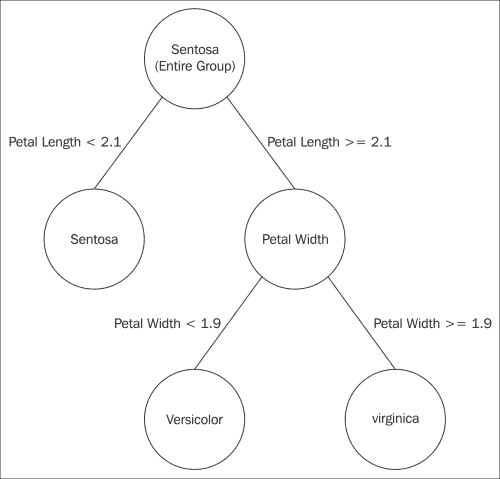

如前图所示，所有组最初都被认为是 Sentosa 物种，然后进一步使用解释变量和花瓣长度来划分组。在每一步，也会进行误分类项的计算，这显示了有多少项被错误分类。此外，还考虑了花瓣宽度变量。通常，叶节点上的项目被正确分类。

# 随机森林

随机森林算法是由 Leo Breiman 和 Adele Cutler 开发的。随机森林生长出许多分类树。它们是用于分类和回归的集成学习方法，在训练时构建多个决策树，并输出由单个树输出的类别的众数。

单个决策树显示了偏差-方差权衡。因此，它们通常具有高方差或高偏差。以下是算法中的参数：

+   **偏差**: 这是由学习算法中的错误假设引起的误差

+   **方差**: 这是一种误差，它从对训练集中微小波动的敏感性到较大的波动

随机森林试图通过平均来减轻这个问题，以在两个极端之间找到自然的平衡。随机森林基于袋装的思想，即平均噪声和无偏模型以创建一个低方差模型。随机森林算法作为一个大量 decorrelated 决策树的集合工作。为了理解随机森林算法的概念，让我们通过一个例子来操作。

考虑我们有一个包含大量特征（解释变量）和目标变量或类别的训练数据集：

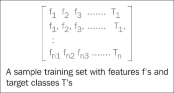

我们从给定的数据集中创建一个样本集：

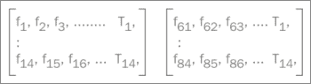

为了创建随机子数据集，考虑了不同的一组随机特征。现在，从这些子数据集中，将创建不同的决策树。所以实际上我们已经创建了一个不同决策树的森林。使用这些不同的树，我们将为所有分类器创建一个排名系统。为了预测一个新未知项的类别，我们将使用所有决策树并分别找出这些树预测的类别。参见以下图表以更好地理解这个概念：

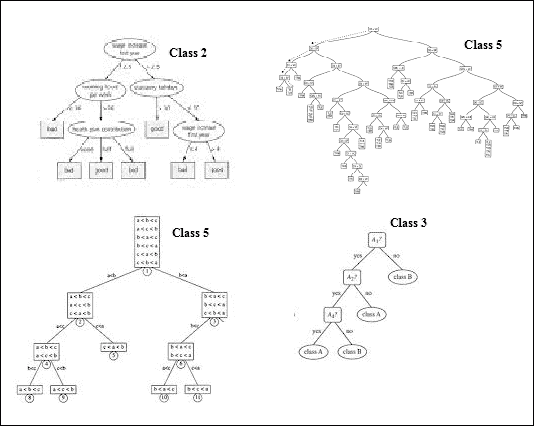

用于预测未知项类别的不同决策树

在这个特定案例中，我们有四个不同的决策树。我们使用每个树来预测未知数据集的类别。根据前面的图示，第一个决策树预测类别 2，第二个决策树预测类别 5，第三个决策树预测类别 5，第四个决策树预测类别 3。现在，随机森林将为每个类别投票。因此，类别 2 和类别 3 各获得一票，类别 5 获得两票。因此，它决定对于新的未知数据集，预测的类别是类别 5。所以，获得更高投票的类别被决定用于新的数据集。随机森林在分类中有许多优点，以下列举了一些：

+   学习模型的组合增加了分类的准确性

+   在大型数据集上也能有效运行

+   生成的森林可以保存并用于其他数据集

+   可以处理大量的解释变量

现在我们已经从理论上了解了随机森林，让我们继续使用 Mahout，并使用 Apache Mahout 中可用的随机森林算法。

# 使用 Mahout 进行随机森林

Mahout 对随机森林算法有实现。它非常容易理解和使用。所以，让我们开始吧。

**数据集**

我们将使用 NSL-KDD 数据集。自 1999 年以来，KDD'99 已经成为评估异常检测方法最广泛使用的数据集。这个数据集由 S. J. Stolfo 准备，并基于在 DARPA'98 IDS 评估计划中捕获的数据构建（*R. P. Lippmann, D. J. Fried, I. Graf, J. W. Haines, K. R. Kendall, D. McClung, D. Weber, S. E. Webster, D. Wyschogrod, R. K. Cunningham, and M. A. Zissman, "Evaluating intrusion detection systems: The 1998 darpa off-line intrusion detection evaluation," discex, vol. 02, p. 1012, 2000*）。

DARPA'98 是关于 7 周网络流量的约 4 GB 压缩原始（二进制）tcp 捕包数据，可以处理成约 500 万个连接记录，每个记录大约有 100 字节。两周的测试数据大约有 200 万个连接记录。KDD 训练数据集由大约 4,900,000 个单独的连接向量组成，每个向量包含 41 个特征，并标记为正常或攻击，具体为一种特定的攻击类型。

NSL-KDD 是一个数据集，建议解决 KDD'99 数据集的一些固有问题。您可以从 [`nsl.cs.unb.ca/NSL-KDD/`](http://nsl.cs.unb.ca/NSL-KDD/) 下载此数据集。

我们将下载 **KDDTrain+_20Percent.ARFF** 和 **KDDTest+.ARFF** 数据集。

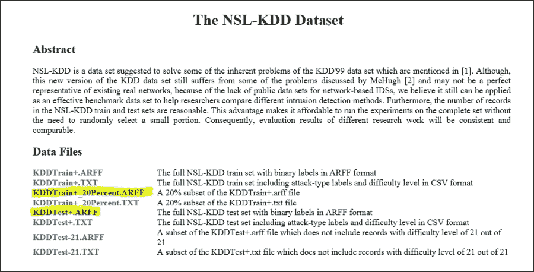

### 注意

在 **KDDTrain+_20Percent.ARFF** 和 **KDDTest+.ARFF** 文件中，删除前 44 行（即所有以 @attribute 开头的行）。如果不这样做，我们将无法生成描述符文件。

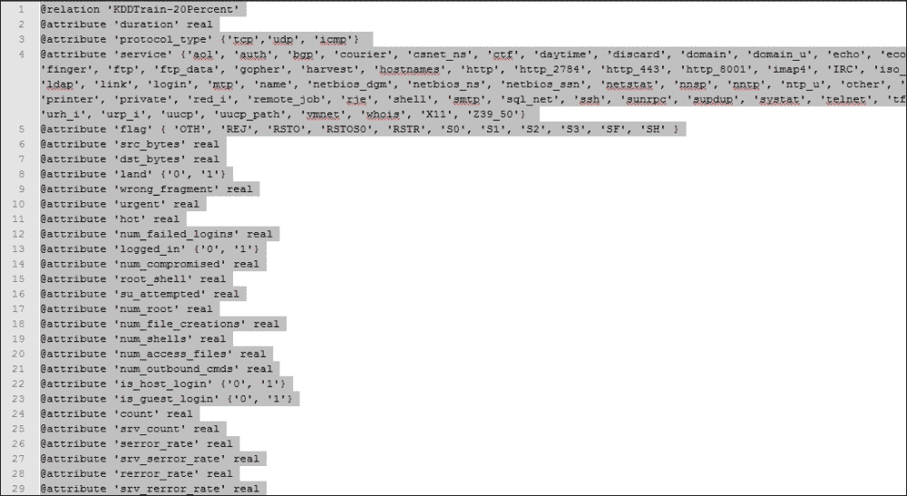

## 在 Mahout 中使用随机森林算法的步骤

在 Apache Mahout 中实现随机森林算法的步骤如下：

1.  使用以下命令将测试和训练数据集传输到 `hdfs`：

    ```py
    hadoop fs -mkdir /user/hue/KDDTrain
    hadoop fs -mkdir /user/hue/KDDTest
    hadoop fs –put /tmp/KDDTrain+_20Percent.arff  /user/hue/KDDTrain
    hadoop fs –put /tmp/KDDTest+.arff  /user/hue/KDDTest

    ```

1.  生成描述符文件。在基于 **KDDTrain+.arff** 中的训练数据构建随机森林模型之前，需要一个描述符文件。这是因为训练数据集中的所有信息都需要标记。从标记的数据集中，算法可以理解哪些是数值的，哪些是分类的。使用以下命令生成描述符文件：

    ```py
    hadoop jar  $MAHOUT_HOME/core/target/mahout-core-xyz.job.jar 
    org.apache.mahout.classifier.df.tools.Describe 
    -p /user/hue/KDDTrain/KDDTrain+_20Percent.arff 
    -f /user/hue/KDDTrain/KDDTrain+.info 
    -d N 3 C 2 N C 4 N C 8 N 2 C 19 N L

    ```

    Jar: Mahout 核心 jar (`xyz` 代表版本)。如果你直接安装了 Mahout，它可以在 `/usr/lib/mahout` 文件夹下找到。这里使用的主类是 `Describe`，它接受三个参数：

    `p` 代表要描述的数据的路径。

    `f` 代表生成的描述符文件的位置。

    `d` 是数据属性上的信息。N 3 C 2 N C 4 N C 8 N 2 C 19 N L 定义了数据集以数值 (N) 开头，后面跟着三个分类属性，等等。最后，L 定义了标签。

    上一条命令的输出如下所示：

    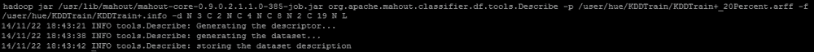

1.  使用以下命令构建随机森林：

    ```py
    hadoop jar $MAHOUT_HOME/examples/target/mahout-examples-xyz-job.jar org.apache.mahout.classifier.df.mapreduce.BuildForest 
    -Dmapred.max.split.size=1874231 -d /user/hue/KDDTrain/KDDTrain+_20Percent.arff 
    -ds /user/hue/KDDTrain/KDDTrain+.info 
    -sl 5 -p -t 100 –o /user/hue/ nsl-forest

    ```

    Jar: Mahout 示例 jar (`xyz` 代表版本)。如果你直接安装了 Mahout，它可以在 `/usr/lib/mahout` 文件夹下找到。主类 `build forest` 用于构建森林，其他参数如下所示：

    `Dmapred.max.split.size` 通知 Hadoop 每个分区的最大大小。

    `d` 代表数据路径。

    `ds` 代表描述符文件的位置。

    `sl` 是在每个树节点随机选择的变量。在这里，每个树节点使用五个随机选择的属性来构建。

    `p` 使用部分数据实现。

    `t` 代表要生长的树的数量。在这里，使用部分实现构建了 100 棵树。

    `o` 代表包含决策森林的输出路径。

    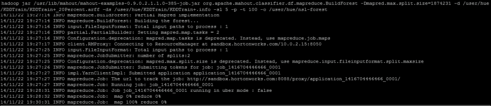

    最后，过程将显示以下结果：

    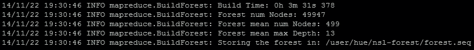

1.  使用此模型对新数据集进行分类：

    ```py
    hadoop jar $MAHOUT_HOME/examples/target/mahout-examples-xyz-job.jar org.apache.mahout.classifier.df.mapreduce.TestForest 
    -i /user/hue/KDDTest/KDDTest+.arff 
    -ds /user/hue/KDDTrain/KDDTrain+.info -m /user/hue/nsl-forest -a –mr
     -o /user/hue/predictions

    ```

    Jar: Mahout 示例 jar (`xyz` 代表版本)。如果你直接安装了 Mahout，它可以在 `/usr/lib/mahout` 文件夹下找到。用于测试森林的类有以下参数：

    `I` 表示测试数据的路径

    `ds` 代表描述符文件的位置

    `m` 代表上一条命令生成的森林的位置

    `a` 通知运行分析器以计算混淆矩阵

    `mr` 通知 Hadoop 分发分类

    `o` 代表存储预测结果的存储位置

    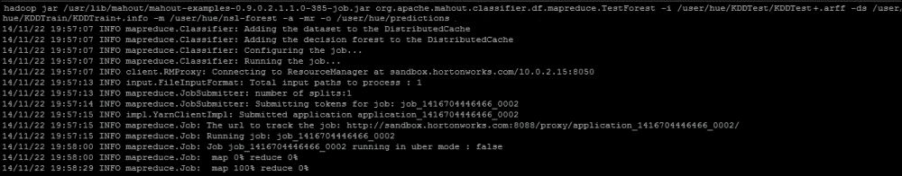

    该作业提供了以下混淆矩阵：

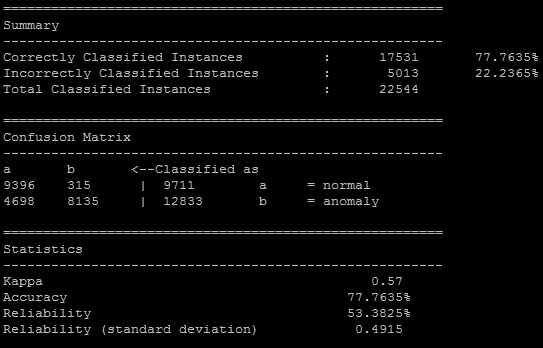

因此，从混淆矩阵中可以清楚地看出，有 9,396 个实例被正确分类，315 个正常实例被错误地分类为异常。准确率百分比为 77.7635（模型正确分类的实例数 / 分类实例数）。预测文件夹中的输出文件包含一个列表，其中 0 和 1。0 表示正常数据集，1 表示异常。

# 摘要

在本章中，我们讨论了随机森林算法。我们首先通过理解决策树开始我们的讨论，然后继续理解随机森林。我们使用了 NSL-KDD 数据集，该数据集用于构建网络安全预测系统。我们使用 Mahout 构建随机森林树，并用测试数据集进行测试，生成了混淆矩阵和其他统计数据。

在下一章中，我们将探讨 Apache Mahout 中可用的最终分类算法。所以请保持关注！
