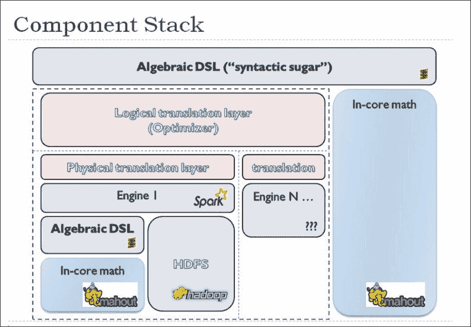
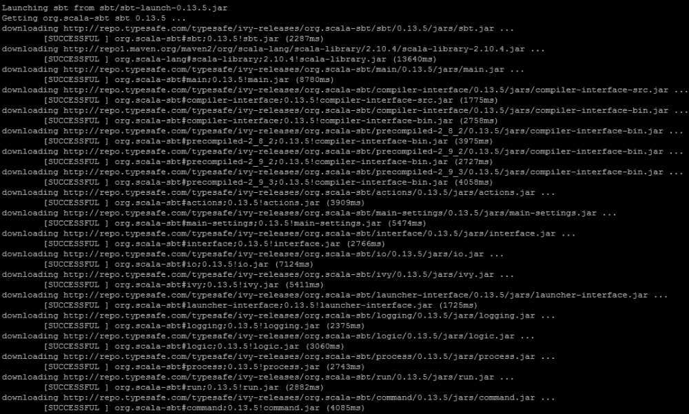
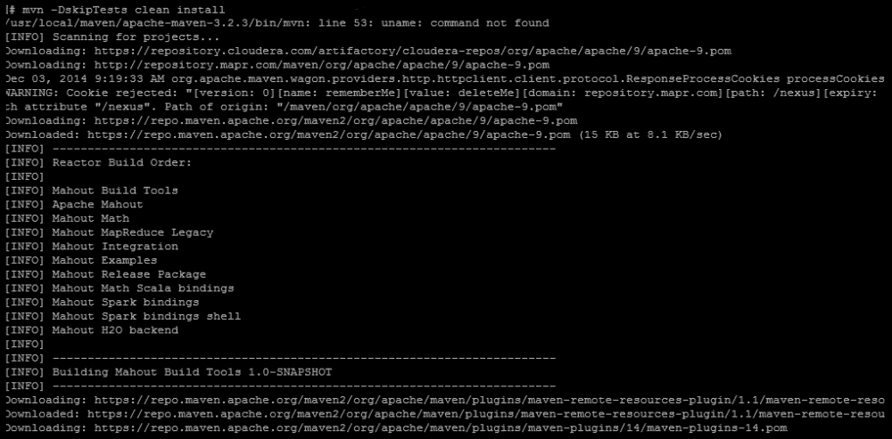
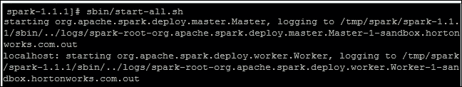

# 第八章：即将发布的 Mahout 变更

Mahout 是一个社区驱动的项目，其社区非常强大。这个社区决定了一些即将在 1.0 版本中发布的重大变更。在本章中，我们将探讨 Apache Mahout 即将到来的变更和发展。我们将简要介绍以下主题：

+   Mahout 1.0 中的新变更

+   Apache Spark

+   Apache Mahout 中的 H20-platform 相关工作

# Mahout 的新变更

Mahout 之前使用 MapReduce 编程模型来处理大数据集。从 2014 年 4 月底开始，社区决定停止实施新的 MapReduce 算法。这个决定有合理的理由。Mahout 的代码库将迁移到提供更丰富编程模型和比 Hadoop MapReduce 更高效执行的现代数据处理系统。

Mahout 已经开始在 **领域特定语言**（**DSL**）的顶部实现线性代数操作。用这种 DSL 编写的程序将自动优化并在 Apache Spark 上并行执行。Scala DSL 和代数优化器是 Mahout 的 Scala 和 Spark 绑定。

## Mahout Scala 和 Spark 绑定

通过 Mahout Scala 绑定和 Mahout Spark 绑定线性代数子程序，Mahout 中的开发者试图将语义明确性引入 Mahout 的内存和内存外线性代数子程序。他们在添加 Scala 强大编程环境的好处的同时，利用 Spark 和 GraphX 的可扩展性优势。Scala 绑定用于提供对 Scala DSL 的支持，这将使编写机器学习程序变得更加容易。

Mahout 的 Scala 和 Spark 绑定是旨在为 Mahout 的内存和内存外 Spark 支持的线性代数提供类似 R 语言外观和感觉的包。Spark 绑定的重要组成部分是表达式优化器。这个优化器会查看整个表达式，并决定如何简化它以及应该选择哪些物理操作符。绑定堆栈的高级图示如下所示（[`issues.apache.org/jira/secure/attachment/12638098/BindingsStack.jpg`](https://issues.apache.org/jira/secure/attachment/12638098/BindingsStack.jpg)）：



Mahout 1.0 中也实现了 Spark 绑定 shell。让我们首先了解 Apache Spark 项目，然后我们将重新审视 Mahout 中的 Spark 绑定 shell。

# Apache Spark

Apache Spark 是一个开源的、内存中的通用计算系统。Spark 的内存技术提供了比传统基于磁盘的计算快 100 倍的性能。Spark 不同于 Hadoop 类似的基于磁盘的计算，它使用集群内存将所有数据上传到内存中，并且这些数据可以被重复查询。

Apache Spark 提供了 Java、Python 和 Scala 的高级 API 以及支持通用执行图的高级优化引擎。它提供了以下高级工具：

+   **Spark SQL**：这是用于 SQL 和结构化数据处理的功能。

+   **MLib**：这是 Spark 的可扩展机器学习库，包括常见的学习算法和实用工具，如分类、回归、聚类、协同过滤、降维以及底层的优化原语。

+   **GraphX**：这是 Spark 的新图和图并行计算 API。

+   **Spark streaming**：这可以从多个来源收集数据，在处理这些数据后，它使用复杂算法并将数据推送到文件系统、数据库和实时仪表板。

随着 Spark 在数据科学家中的流行，Mahout 社区也在迅速努力使 Mahout 算法在 Spark 的执行引擎上运行，以加快其计算速度 10 到 100 倍。Mahout 提供了几个重要的构建块，用于使用 Spark 创建推荐。Spark-item 相似度可以用于创建 *其他人也喜欢这些内容* 类型的推荐，并且当与搜索引擎配合使用时，可以为单个用户个性化推荐。Spark-row 相似度可以根据推荐提供非个性化内容，并且当与搜索引擎配合使用时，可以用于根据推荐个性化内容 ([`comments.gmane.org/gmane.comp.apache.mahout.scm/6513`](http://comments.gmane.org/gmane.comp.apache.mahout.scm/6513))).

## 使用 Mahout 的 Spark shell

您可以通过以下步骤使用 Mahout 的 Spark shell：

1.  从 [`spark.apache.org/downloads.html`](http://spark.apache.org/downloads.html) 下载 Spark。

1.  使用以下命令创建一个名为 `spark` 的新文件夹，并将下载的文件移动到该文件夹中：

    ```py
    mkdir /tmp/spark
    mv ~/Downloads/spark-1.1.1.tgz/tmp/spark

    ```

1.  使用以下命令在文件夹中解压归档文件：

    ```py
    cd /tmp/spark
    tar xzf spark-1.1.1.tgz

    ```

1.  这将解压 `under/tmp/spark/spark-1.1.1` 中的文件。现在，移动到新创建的文件夹并运行以下命令：

    ```py
    cd /spark-1.1.1
    sbt/sbt assembly

    ```

    这将在您的系统上构建 Spark，如下截图所示：

    

1.  现在创建一个 Mahout 目录，并使用以下命令将文件移动到该目录：

    ```py
    mkdir /tmp/Mahout

    ```

1.  使用以下命令从 GitHub 检出 Mahout 的主分支：

    ```py
    git clone https://github.com/apache/mahout mahout

    ```

    前一个命令的输出如下截图所示：

    

1.  将您的目录切换到新创建的 Mahout 目录，并构建 Mahout：

    ```py
    cd mahout
    mvn -DskipTests clean install

    ```

    前一个命令的输出如下截图所示：

    

1.  移动到您解压 Spark 的目录，并输入以下命令以在本地启动 Spark：

    ```py
    cd /tmp/spark/spark-1.1.1
    sbin/start-all-sh

    ```

    前一个命令的输出如下截图所示：

    

1.  打开浏览器；将其指向 `http://localhost:8080/` 以检查 Spark 是否已成功启动。复制页面顶部 Spark 主机的 URL（以 `spark://` 开头）。

1.  定义以下环境变量：

    ```py
    export MAHOUT_HOME=[directory into which you checked out Mahout]
    export SPARK_HOME=[directory where you unpacked Spark]
    export MASTER=[url of the Spark master]

    ```

1.  最后，切换到您解压 Mahout 的目录，并输入`bin/mahout spark-shell`；您应该看到 shell 启动并出现`mahout>`提示符。

现在您的 Mahout Spark shell 已经准备好了，您可以从数据处理开始。有关此主题的更多信息，请参阅[`mahout.apache.org/users/sparkbindings/play-with-shell.html`](https://mahout.apache.org/users/sparkbindings/play-with-shell.html)中的实现部分。

# H2O 平台集成

如前所述，将 Mahout 和 H2O 平台集成的实验性工作也在进行中。该集成为 Mahout 代数 DSL 提供了 H2O 后端。

H2O 让 Hadoop 做数学！H2O 在大数据上扩展统计、机器学习和数学。它是可扩展的，用户可以使用核心中的简单数学积木构建块。H2O 保留了熟悉的接口，如 R、Excel 和 JSON，以便大数据爱好者和专业人员可以使用一系列简单到高级的算法来探索、处理、建模和评分数据集。数据收集容易，而决策困难。H2O 通过更快、更好的预测建模使从数据中提取见解变得快速且简单。它还拥有在线评分和建模的单平台愿景（[`0xdata.com/download/`](http://0xdata.com/download/)）。

H2O 本质上是一个对等网络系统。H2O 节点联合起来形成一个云，可以在其上执行高性能分布式数学运算。每个节点加入一个具有特定名称的云。只要它们的名称不同，同一网络中可以同时存在多个云。同样，同一服务器上也可以存在多个节点（它们甚至可以属于同一个云）。

Mahout H2O 集成通过具有 N-1 个工作节点和一个驱动节点，所有节点都属于同一个云名称来适应此模型。用于集成的默认云名称是`mah2out`。云必须根据其任务/作业启动。

更多详细信息可以在[`issues.apache.org/jira/browse/MAHOUT-1500`](https://issues.apache.org/jira/browse/MAHOUT-1500)中找到。

# 摘要

在本章中，我们讨论了即将发布的 Mahout 1.0 版本，以及目前正在进行的更改。我们还简要介绍了 Spark、Scala 绑定和 Apache Spark。我们还讨论了 H2O Mahout 集成的概述。

现在让我们继续到这本书的最后一章，我们将开发一个生产就绪的分类器。
