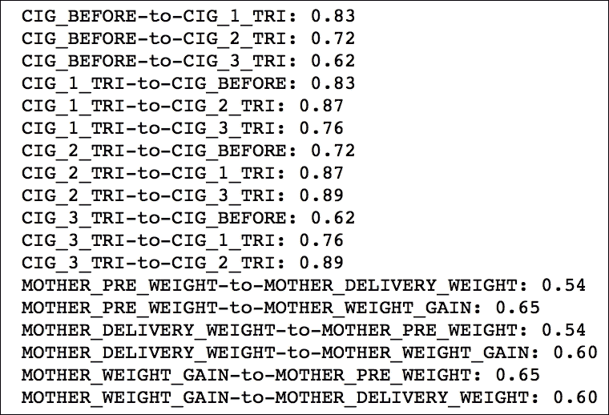
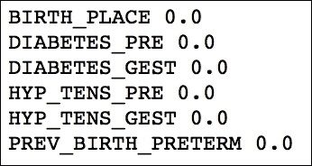

# 第五章。介绍 MLlib

在上一章中，我们学习了如何为建模准备数据。在本章中，我们将实际使用这些知识来构建一个使用 PySpark 的 MLlib 包的分类模型。

MLlib 代表机器学习库。尽管 MLlib 目前处于维护模式，即它不再积极开发（并且很可能会被弃用），但我们仍然有必要介绍该库的一些功能。此外，MLlib 是目前唯一支持训练流模型（streaming）的库。

### 注意

从 Spark 2.0 开始，ML 是主要的机器学习库，它操作的是 DataFrame 而不是 RDD，这与 MLlib 的情况不同。

`MLlib`的文档可以在这里找到：[`spark.apache.org/docs/latest/api/python/pyspark.mllib.html`](http://spark.apache.org/docs/latest/api/python/pyspark.mllib.html)。

在本章中，您将学习以下内容：

+   使用 MLlib 准备建模数据

+   执行统计测试

+   使用逻辑回归预测婴儿的生存机会

+   选择最可预测的特征并训练随机森林模型

# 包含概述

在高层次上，MLlib 暴露了三个核心机器学习功能：

+   **数据准备**：特征提取、转换、选择、分类特征的哈希以及一些自然语言处理方法

+   **机器学习算法**：实现了某些流行的和高级的回归、分类和聚类算法

+   **实用工具**：描述性统计、卡方检验、线性代数（稀疏和密集矩阵和向量）以及模型评估方法

如您所见，可用的功能调色板允许您执行几乎所有基本的数据科学任务。

在本章中，我们将构建两个分类模型：线性回归和随机森林。我们将使用我们从[`www.cdc.gov/nchs/data_access/vitalstatsonline.htm`](http://www.cdc.gov/nchs/data_access/vitalstatsonline.htm)下载的美国 2014 年和 2015 年出生数据的一部分；从总共 300 个变量中我们选择了 85 个特征来构建我们的模型。此外，从近 799 万条记录中，我们选择了 45,429 条平衡样本：22,080 条记录报告婴儿死亡，23,349 条记录婴儿存活。

### 小贴士

本章我们将使用的数据集可以从[`www.tomdrabas.com/data/LearningPySpark/births_train.csv.gz`](http://www.tomdrabas.com/data/LearningPySpark/births_train.csv.gz)下载。

# 加载数据和转换数据

尽管 MLlib 的设计重点是 RDD 和 DStreams，为了便于转换数据，我们将读取数据并将其转换为 DataFrame。

### 注意

DStreams 是 Spark Streaming 的基本数据抽象（见[`bit.ly/2jIDT2A`](http://bit.ly/2jIDT2A)）

就像在前一章中一样，我们首先指定数据集的模式。

### 注意

注意，在这里（为了简洁），我们只展示了少量特征。你应该始终检查我们 GitHub 账户上这本书的最新代码版本：[`github.com/drabastomek/learningPySpark`](https://github.com/drabastomek/learningPySpark)。

下面是代码：

```py
import pyspark.sql.types as typ
labels = [
    ('INFANT_ALIVE_AT_REPORT', typ.StringType()),
    ('BIRTH_YEAR', typ.IntegerType()),
    ('BIRTH_MONTH', typ.IntegerType()),
    ('BIRTH_PLACE', typ.StringType()),
    ('MOTHER_AGE_YEARS', typ.IntegerType()),
    ('MOTHER_RACE_6CODE', typ.StringType()),
    ('MOTHER_EDUCATION', typ.StringType()),
    ('FATHER_COMBINED_AGE', typ.IntegerType()),
    ('FATHER_EDUCATION', typ.StringType()),
    ('MONTH_PRECARE_RECODE', typ.StringType()),
    ...
    ('INFANT_BREASTFED', typ.StringType())
]
schema = typ.StructType([
        typ.StructField(e[0], e[1], False) for e in labels
    ])
```

接下来，我们加载数据。`.read.csv(...)`方法可以读取未压缩的或（如我们的情况）GZipped 逗号分隔值。`header`参数设置为`True`表示第一行包含标题，我们使用`schema`来指定正确的数据类型：

```py
births = spark.read.csv('births_train.csv.gz', 
                        header=True, 
                        schema=schema)
```

我们的数据集中有很多字符串类型的特点。这些大多是类别变量，我们需要以某种方式将它们转换为数值形式。

### 提示

你可以在这里查看原始文件的模式规范：ftp://ftp.cdc.gov/pub/Health_Statistics/NCHS/Dataset_Documentation/DVS/natality/UserGuide2015.pdf。

我们首先将指定我们的重编码字典：

```py
recode_dictionary = {
    'YNU': {
        'Y': 1,
        'N': 0,
        'U': 0
    }
}
```

本章的目标是预测`'INFANT_ALIVE_AT_REPORT'`是`1`还是`0`。因此，我们将删除所有与婴儿相关的特征，并尝试仅基于与母亲、父亲和出生地相关的特征来预测婴儿的生存机会：

```py
selected_features = [
    'INFANT_ALIVE_AT_REPORT', 
    'BIRTH_PLACE', 
    'MOTHER_AGE_YEARS', 
    'FATHER_COMBINED_AGE', 
    'CIG_BEFORE', 
    'CIG_1_TRI', 
    'CIG_2_TRI', 
    'CIG_3_TRI', 
    'MOTHER_HEIGHT_IN', 
    'MOTHER_PRE_WEIGHT', 
    'MOTHER_DELIVERY_WEIGHT', 
    'MOTHER_WEIGHT_GAIN', 
    'DIABETES_PRE', 
    'DIABETES_GEST', 
    'HYP_TENS_PRE', 
    'HYP_TENS_GEST', 
    'PREV_BIRTH_PRETERM'
]
births_trimmed = births.select(selected_features)
```

在我们的数据集中，有很多具有是/否/未知值的特征；我们只将“是”编码为`1`；其他所有内容都将设置为`0`。

关于母亲吸烟数量编码的小问题：0 表示母亲在怀孕前或怀孕期间没有吸烟，1-97 表示实际吸烟的数量，98 表示 98 或更多，而 99 表示未知；我们将假设未知为 0，并相应地进行重编码。

因此，接下来我们将指定我们的重编码方法：

```py
import pyspark.sql.functions as func
def recode(col, key):
    return recode_dictionary[key][col] 
def correct_cig(feat):
    return func \
        .when(func.col(feat) != 99, func.col(feat))\
        .otherwise(0)
rec_integer = func.udf(recode, typ.IntegerType())
```

`recode`方法从`recode_dictionary`（给定`key`）中查找正确的键并返回修正后的值。`correct_cig`方法检查特征`feat`的值是否不等于 99，并且（对于这种情况）返回特征的值；如果值等于 99，则返回 0，否则返回。

我们不能直接在`DataFrame`上使用`recode`函数；它需要转换为 Spark 可以理解的 UDF。`rec_integer`就是这样一种函数：通过传递我们指定的重编码函数并指定返回值数据类型，我们可以使用它来编码我们的是/否/未知特征。

那么，让我们开始吧。首先，我们将纠正与吸烟数量相关的特征：

```py
births_transformed = births_trimmed \
    .withColumn('CIG_BEFORE', correct_cig('CIG_BEFORE'))\
    .withColumn('CIG_1_TRI', correct_cig('CIG_1_TRI'))\
    .withColumn('CIG_2_TRI', correct_cig('CIG_2_TRI'))\
    .withColumn('CIG_3_TRI', correct_cig('CIG_3_TRI'))
```

`.withColumn(...)`方法将其第一个参数作为列名，第二个参数作为转换。在前面的例子中，我们没有创建新列，而是重用了相同的列。

现在我们将专注于纠正 Yes/No/Unknown 特征。首先，我们将通过以下片段来确定这些特征：

```py
cols = [(col.name, col.dataType) for col in births_trimmed.schema]
YNU_cols = []
for i, s in enumerate(cols):
    if s[1] == typ.StringType():
        dis = births.select(s[0]) \
            .distinct() \
            .rdd \
            .map(lambda row: row[0]) \
            .collect() 
        if 'Y' in dis:
            YNU_cols.append(s[0])
```

首先，我们创建了一个包含列名和对应数据类型的元组列表（`cols`）。接下来，我们遍历所有这些，计算所有字符串列的唯一值；如果返回列表中包含 `'Y'`，我们将列名追加到 `YNU_cols` 列表中。

DataFrames 可以在选择特征的同时批量转换特征。为了说明这个概念，考虑以下示例：

```py
births.select([
        'INFANT_NICU_ADMISSION', 
        rec_integer(
            'INFANT_NICU_ADMISSION', func.lit('YNU')
        ) \
        .alias('INFANT_NICU_ADMISSION_RECODE')]
     ).take(5)
```

这是我们的返回结果：


我们选择 `'INFANT_NICU_ADMISSION'` 列，并将特征的名称传递给 `rec_integer` 方法。我们还把新转换的列别名为 `'INFANT_NICU_ADMISSION_RECODE'`。这样我们也将确认我们的 UDF 是按预期工作的。

因此，为了一次性转换所有的 `YNU_cols`，我们将创建一个这样的转换列表，如下所示：

```py
exprs_YNU = [
    rec_integer(x, func.lit('YNU')).alias(x) 
    if x in YNU_cols 
    else x 
    for x in births_transformed.columns
]
births_transformed = births_transformed.select(exprs_YNU)
```

让我们检查我们是否正确理解了：

```py
births_transformed.select(YNU_cols[-5:]).show(5)
```

这是我们的结果：


看起来一切如我们所愿地工作，所以让我们更好地了解我们的数据。

# 了解你的数据

为了以有信息的方式构建统计模型，需要对数据集有深入了解。不知道数据，你仍然可以构建一个成功的模型，但这将是一个更加艰巨的任务，或者需要更多的技术资源来测试所有可能的特征组合。因此，在花费了所需 80% 的时间清理数据之后，我们接下来花费 15% 的时间来了解它！

## 描述性统计

我通常从描述性统计开始。尽管 DataFrames 提供了 `.describe()` 方法，但由于我们正在使用 `MLlib`，我们将使用 `.colStats(...)` 方法。

### 备注

一个警告：`.colStats(...)` 是基于样本计算描述性统计的。对于现实世界的数据集，这实际上不应该很重要，但如果你的数据集观察值少于 100，你可能会得到一些奇怪的结果。

该方法接受一个用于计算描述性统计的 `RDD` 数据，并返回一个包含以下描述性统计的 `MultivariateStatisticalSummary` 对象：

+   `count()`: 这包含行数

+   `max()`: 这包含列中的最大值

+   `mean()`: 这包含列中值的平均值

+   `min()`: 这包含列中的最小值

+   `normL1()`: 这包含列中值的 L1-Norm 值

+   `normL2()`: 这包含列中值的 L2-Norm 值

+   `numNonzeros()`: 这包含列中非零值的数量

+   `variance()`: 这包含列中值的方差

### 备注

你可以在这里了解更多关于 L1-和 L2-范数的知识 [`bit.ly/2jJJPJ0`](http://bit.ly/2jJJPJ0)

我们建议检查 Spark 的文档以了解更多信息。以下是一个计算数值特征描述性统计的代码片段：

```py
import pyspark.mllib.stat as st
import numpy as np
numeric_cols = ['MOTHER_AGE_YEARS','FATHER_COMBINED_AGE',
                'CIG_BEFORE','CIG_1_TRI','CIG_2_TRI','CIG_3_TRI',
                'MOTHER_HEIGHT_IN','MOTHER_PRE_WEIGHT',
                'MOTHER_DELIVERY_WEIGHT','MOTHER_WEIGHT_GAIN'
               ]
numeric_rdd = births_transformed\
                       .select(numeric_cols)\
                       .rdd \
                       .map(lambda row: [e for e in row])
mllib_stats = st.Statistics.colStats(numeric_rdd)
for col, m, v in zip(numeric_cols, 
                     mllib_stats.mean(), 
                     mllib_stats.variance()):
    print('{0}: \t{1:.2f} \t {2:.2f}'.format(col, m, np.sqrt(v)))
```

前面的代码产生了以下结果：


如您所见，与父亲相比，母亲更年轻：母亲的平均年龄为 28 岁，而父亲的平均年龄超过 44 岁。一个很好的迹象（至少对于一些婴儿来说）是许多母亲在怀孕期间戒烟；尽管如此，仍然有一些人继续吸烟，这令人震惊。

对于分类变量，我们将计算其值的频率：

```py
categorical_cols = [e for e in births_transformed.columns 
                    if e not in numeric_cols]
categorical_rdd = births_transformed\
                       .select(categorical_cols)\
                       .rdd \
                       .map(lambda row: [e for e in row])
for i, col in enumerate(categorical_cols):
    agg = categorical_rdd \
        .groupBy(lambda row: row[i]) \
        .map(lambda row: (row[0], len(row[1])))
    print(col, sorted(agg.collect(), 
                      key=lambda el: el[1], 
                      reverse=True))
```

这是结果看起来像什么：


大多数分娩发生在医院（`BIRTH_PLACE` 等于 `1`）。大约有 550 次分娩发生在家里：一些是故意发生的（`'BIRTH_PLACE'` 等于 `3`），一些则不是（`'BIRTH_PLACE'` 等于 `4`）。

## 相关系数

相关系数有助于识别共线性数值特征并适当处理它们。让我们检查特征之间的相关性：

```py
corrs = st.Statistics.corr(numeric_rdd)
for i, el in enumerate(corrs > 0.5):
    correlated = [
        (numeric_cols[j], corrs[i][j]) 
        for j, e in enumerate(el) 
        if e == 1.0 and j != i]
    if len(correlated) > 0:
        for e in correlated:
            print('{0}-to-{1}: {2:.2f}' \
                  .format(numeric_cols[i], e[0], e[1]))
```

前面的代码将计算相关矩阵，并且只打印出那些相关系数大于 `0.5` 的特征：`corrs > 0.5` 这一部分负责这个。

这是我们的结果：



如您所见，`'CIG_...'` 特征高度相关，因此我们可以删除大部分。由于我们希望尽快预测婴儿的存活机会，我们将只保留 `'CIG_1_TRI'`。此外，正如预期的那样，权重特征也高度相关，我们将只保留 `'MOTHER_PRE_WEIGHT'`：

```py
features_to_keep = [
    'INFANT_ALIVE_AT_REPORT', 
    'BIRTH_PLACE', 
    'MOTHER_AGE_YEARS', 
    'FATHER_COMBINED_AGE', 
    'CIG_1_TRI', 
    'MOTHER_HEIGHT_IN', 
    'MOTHER_PRE_WEIGHT', 
    'DIABETES_PRE', 
    'DIABETES_GEST', 
    'HYP_TENS_PRE', 
    'HYP_TENS_GEST', 
    'PREV_BIRTH_PRETERM'
]
births_transformed = births_transformed.select([e for e in features_to_keep])
```

## 统计测试

我们不能对分类特征计算相关性。然而，我们可以运行卡方测试来确定是否存在显著差异。

这是您可以使用 `MLlib` 的 `.chiSqTest(...)` 方法来完成的方法：

```py
import pyspark.mllib.linalg as ln
for cat in categorical_cols[1:]:
    agg = births_transformed \
        .groupby('INFANT_ALIVE_AT_REPORT') \
        .pivot(cat) \
        .count()    
    agg_rdd = agg \
        .rdd \
        .map(lambda row: (row[1:])) \
        .flatMap(lambda row: 
                 [0 if e == None else e for e in row]) \
        .collect()
    row_length = len(agg.collect()[0]) - 1
    agg = ln.Matrices.dense(row_length, 2, agg_rdd)

    test = st.Statistics.chiSqTest(agg)
    print(cat, round(test.pValue, 4))
```

我们遍历所有分类变量，并通过 `'INFANT_ALIVE_AT_REPORT'` 特征进行转置以获取计数。接下来，我们将它们转换成一个 RDD，然后我们可以使用 `pyspark.mllib.linalg` 模块将它们转换成一个矩阵。`.Matrices.dense(...)` 方法的第一个参数指定了矩阵中的行数；在我们的情况下，它是分类特征的唯一值的长度。

第二个参数指定了列数：我们有两个，因为我们的 `'INFANT_ALIVE_AT_REPORT'` 目标变量只有两个值。

最后一个参数是要转换成矩阵的值列表。

这是一个更清楚地展示这个的例子：

```py
print(ln.Matrices.dense(3,2, [1,2,3,4,5,6]))
```

前面的代码产生了以下矩阵：


一旦我们将计数以矩阵形式表示，我们就可以使用 `.chiSqTest(...)` 来计算我们的测试。

这是返回的结果：



我们的测试表明，所有特征都应该有显著差异，并有助于我们预测婴儿存活的概率。

# 创建最终数据集

因此，现在是时候创建我们的最终数据集了，我们将使用它来构建我们的模型。我们将我们的 DataFrame 转换为`LabeledPoints`的 RDD。

`LabeledPoint`是 MLlib 结构，用于训练机器学习模型。它由两个属性组成：`label`和`features`。

`label`是我们的目标变量，`features`可以是 NumPy `array`、`list`、`pyspark.mllib.linalg.SparseVector`、`pyspark.mllib.linalg.DenseVector`或`scipy.sparse`列矩阵。

## 创建 LabeledPoints 的 RDD

在我们构建最终数据集之前，我们首先需要解决一个最后的障碍：我们的`'BIRTH_PLACE'`特征仍然是一个字符串。虽然其他任何分类变量都可以直接使用（因为它们现在是虚拟变量），但我们将使用哈希技巧来编码`'BIRTH_PLACE'`特征：

```py
import pyspark.mllib.feature as ft
import pyspark.mllib.regression as reg
hashing = ft.HashingTF(7)
births_hashed = births_transformed \
    .rdd \
    .map(lambda row: [
            list(hashing.transform(row[1]).toArray()) 
                if col == 'BIRTH_PLACE' 
                else row[i] 
            for i, col 
            in enumerate(features_to_keep)]) \
    .map(lambda row: [[e] if type(e) == int else e 
                      for e in row]) \
    .map(lambda row: [item for sublist in row 
                      for item in sublist]) \
    .map(lambda row: reg.LabeledPoint(
            row[0], 
            ln.Vectors.dense(row[1:]))
        )
```

首先，我们创建哈希模型。我们的特征有七个级别，所以我们使用与哈希技巧相同数量的特征。接下来，我们实际上使用模型将我们的`'BIRTH_PLACE'`特征转换为`SparseVector`；如果您的数据集有很多列但只有少数几列具有非零值，则这种数据结构是首选的。然后我们将所有特征组合在一起，最后创建一个`LabeledPoint`。

## 划分为训练集和测试集

在我们进入建模阶段之前，我们需要将我们的数据集分为两个集合：一个用于训练，另一个用于测试。幸运的是，RDD 有一个方便的方法来做这件事：`.randomSplit(...)`。该方法接受一个比例列表，用于随机划分数据集。

下面是如何操作的：

```py
births_train, births_test = births_hashed.randomSplit([0.6, 0.4])
```

就这样！不需要做更多的事情了。

# 预测婴儿存活

最后，我们可以转向预测婴儿的存活机会。在本节中，我们将构建两个模型：一个线性分类器——逻辑回归，以及一个非线性模型——随机森林。对于前者，我们将使用我们所有的特征，而对于后者，我们将使用`ChiSqSelector(...)`方法选择前四个特征。

## MLlib 中的逻辑回归

逻辑回归在构建任何分类模型方面某种程度上是一个基准。MLlib 曾经提供使用**随机梯度下降**（**SGD**）算法估计的逻辑回归模型。在 Spark 2.0 中，这个模型已被弃用，转而使用`LogisticRegressionWithLBFGS`模型。

`LogisticRegressionWithLBFGS`模型使用**有限记忆 Broyden-Fletcher-Goldfarb-Shanno**（**BFGS**）优化算法。它是一种拟牛顿方法，近似 BFGS 算法。

### 注意

对于那些数学能力强且对此感兴趣的人，我们建议阅读这篇博客文章，它是对优化算法的精彩概述：[`aria42.com/blog/2014/12/understanding-lbfgs`](http://aria42.com/blog/2014/12/understanding-lbfgs)。

首先，我们在我们的数据上训练模型：

```py
from pyspark.mllib.classification \
    import LogisticRegressionWithLBFGS
LR_Model = LogisticRegressionWithLBFGS \
    .train(births_train, iterations=10)
```

训练模型非常简单：我们只需要调用`.train(...)`方法。所需的参数是带有`LabeledPoints`的 RDD；我们还指定了`iterations`的数量，这样它不会运行得太久。

使用`births_train`数据集训练模型后，让我们使用该模型来预测测试集的类别：

```py
LR_results = (
        births_test.map(lambda row: row.label) \
        .zip(LR_Model \
             .predict(births_test\
                      .map(lambda row: row.features)))
    ).map(lambda row: (row[0], row[1] * 1.0))
```

前面的代码片段创建了一个 RDD，其中每个元素都是一个元组，第一个元素是实际标签，第二个元素是模型的预测。

MLlib 为分类和回归提供了评估指标。让我们检查一下我们的模型表现如何：

```py
import pyspark.mllib.evaluation as ev
LR_evaluation = ev.BinaryClassificationMetrics(LR_results)
print('Area under PR: {0:.2f}' \
      .format(LR_evaluation.areaUnderPR))
print('Area under ROC: {0:.2f}' \
      .format(LR_evaluation.areaUnderROC))
LR_evaluation.unpersist()
```

下面是我们的结果：


模型的表现相当不错！精确-召回曲线下的 85%区域表示拟合良好。在这种情况下，我们可能会得到稍微更多的预测死亡（真实和假阳性）。在这种情况下，这实际上是一件好事，因为它可以让医生对预期母亲和婴儿进行特殊护理。

**接收者操作特征**（ROC）曲线下的面积可以理解为模型将随机选择的正实例排名高于随机选择的负实例的概率。63%的值可以被认为是可接受的。

### 注意

更多关于这些指标的信息，我们建议感兴趣的读者参考[`stats.stackexchange.com/questions/7207/roc-vs-precision-and-recall-curves`](http://stats.stackexchange.com/questions/7207/roc-vs-precision-and-recall-curves)和[`gim.unmc.edu/dxtests/roc3.htm`](http://gim.unmc.edu/dxtests/roc3.htm)。

## 仅选择最可预测的特征

任何使用更少特征准确预测类别的模型都应该优先于更复杂的模型。MLlib 允许我们使用卡方选择器选择最可预测的特征。

下面是如何做到这一点的步骤：

```py
selector = ft.ChiSqSelector(4).fit(births_train)
topFeatures_train = (
        births_train.map(lambda row: row.label) \
        .zip(selector \
             .transform(births_train \
                        .map(lambda row: row.features)))
    ).map(lambda row: reg.LabeledPoint(row[0], row[1]))
topFeatures_test = (
        births_test.map(lambda row: row.label) \
        .zip(selector \
             .transform(births_test \
                        .map(lambda row: row.features)))
    ).map(lambda row: reg.LabeledPoint(row[0], row[1]))
```

我们要求选择器从数据集中返回四个最可预测的特征，并使用`births_train`数据集来训练选择器。然后我们使用模型从我们的训练和测试数据集中提取仅这些特征。

`.ChiSqSelector(...)`方法只能用于数值特征；分类变量在使用选择器之前需要被哈希化或转换为虚拟变量。

## MLlib 中的随机森林

我们现在准备好构建随机森林模型。

以下代码展示了如何实现：

```py
from pyspark.mllib.tree import RandomForest
RF_model = RandomForest \
    .trainClassifier(data=topFeatures_train, 
                     numClasses=2, 
                     categoricalFeaturesInfo={}, 
                     numTrees=6,  
                     featureSubsetStrategy='all',
                     seed=666)
```

`.trainClassifier(...)` 方法的第一个参数指定了训练数据集。`numClasses` 参数表示我们的目标变量有多少个类别。作为第三个参数，您可以传递一个字典，其中键是我们 RDD 中分类特征的索引，而键的值表示分类特征有多少个级别。`numTrees` 指定了森林中的树的数量。下一个参数告诉模型使用我们数据集中的所有特征，而不是只保留最具描述性的特征，而最后一个参数指定了模型随机部分的种子。

让我们看看我们的模型表现如何：

```py
RF_results = (
        topFeatures_test.map(lambda row: row.label) \
        .zip(RF_model \
             .predict(topFeatures_test \
                      .map(lambda row: row.features)))
    )
RF_evaluation = ev.BinaryClassificationMetrics(RF_results)
print('Area under PR: {0:.2f}' \
      .format(RF_evaluation.areaUnderPR))
print('Area under ROC: {0:.2f}' \
      .format(RF_evaluation.areaUnderROC))
model_evaluation.unpersist()
```

这里是结果：


如您所见，具有较少特征的随机森林模型甚至比逻辑回归模型表现更好。让我们看看逻辑回归在特征数量减少的情况下会如何表现：

```py
LR_Model_2 = LogisticRegressionWithLBFGS \
    .train(topFeatures_train, iterations=10)
LR_results_2 = (
        topFeatures_test.map(lambda row: row.label) \
        .zip(LR_Model_2 \
             .predict(topFeatures_test \
                      .map(lambda row: row.features)))
    ).map(lambda row: (row[0], row[1] * 1.0))
LR_evaluation_2 = ev.BinaryClassificationMetrics(LR_results_2)
print('Area under PR: {0:.2f}' \
      .format(LR_evaluation_2.areaUnderPR))
print('Area under ROC: {0:.2f}' \
      .format(LR_evaluation_2.areaUnderROC))
LR_evaluation_2.unpersist()
```

结果可能会让您感到惊讶：


如您所见，这两个模型可以简化，同时仍然达到相同的准确度水平。话虽如此，您应该始终选择具有较少变量的模型。

# 摘要

在本章中，我们探讨了 PySpark 的`MLlib`包的功能。尽管该包目前处于维护模式，并且没有积极开发，但了解如何使用它仍然是有益的。此外，目前它是唯一可用于在流数据时训练模型的包。我们使用`MLlib`清理、转换并熟悉婴儿死亡数据集。利用这些知识，我们成功构建了两个模型，旨在根据母亲、父亲和出生地信息预测婴儿存活的机会。

在下一章中，我们将重新审视相同的问题，但使用目前 Spark 推荐的机器学习新包。
