# 第八章。TensorFrames

本章将提供一个关于新兴领域深度学习及其重要性的高级入门，它将提供围绕特征学习和神经网络的基本原理，这些是深度学习所必需的。此外，本章还将为 Apache Spark 的 TensorFrames 提供快速入门。

在本章中，你将学习关于：

+   什么是深度学习？

+   特征学习入门

+   什么是特征工程？

+   什么是 TensorFlow？

+   介绍 TensorFrames

+   TensorFrames – 快速入门

如前所述，我们将首先讨论深度学习——更具体地说，我们将从神经网络开始。

# 什么是深度学习？

深度学习是机器学习技术家族的一部分，它基于*学习*数据表示。深度学习松散地基于我们大脑自己的神经网络，这个结构的目的在于提供大量高度相互连接的元素（在生物系统中，这将是我们的大脑中的神经元）；我们的大脑中大约有 1000 亿个神经元，每个神经元连接到大约 10000 个其他神经元，从而产生了令人难以置信的 10¹⁵ 个突触连接。这些元素通过学习过程共同解决问题——例如模式识别和数据分类。

在这个架构中学习涉及对相互连接的元素之间连接的修改，类似于我们自己的大脑如何调整神经元之间的突触连接：

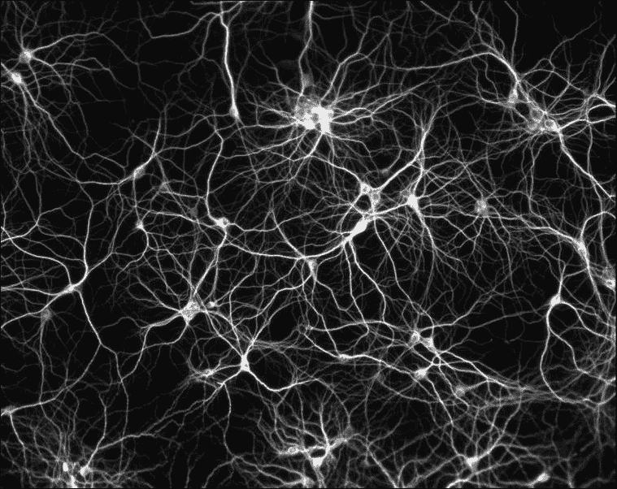

来源：*维基媒体共享资源：文件：神经元网络.jpg*；[`commons.wikimedia.org/wiki/File:Réseau_de_neurones.jpg`](https://commons.wikimedia.org/wiki/File:R%C3%A9seau_de_neurones.jpg)。

传统的算法方法涉及编程已知的步骤或数量，也就是说，你已经知道解决特定问题的步骤，现在重复解决方案并使其运行更快。神经网络是一个有趣的范例，因为神经网络通过示例学习，实际上并没有被编程去执行特定的任务。这使得神经网络（和深度学习）的训练过程非常重要，你必须提供好的示例供神经网络学习，否则它将“学习”错误的东西（即提供不可预测的结果）。

建立人工神经网络最常见的方法涉及创建三个层次：输入、隐藏和输出；如下面的图所示：

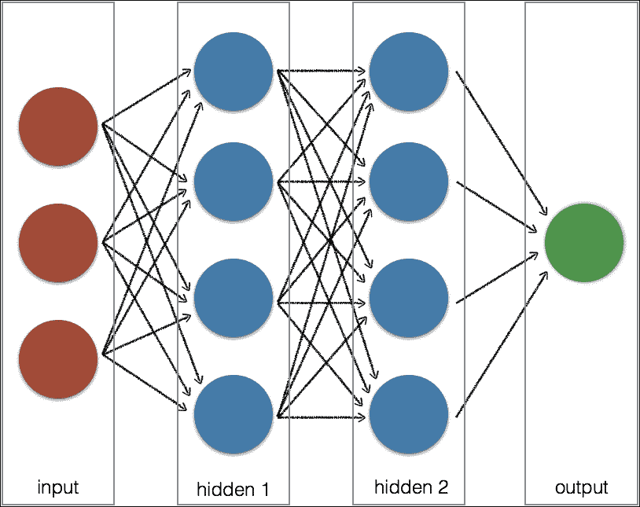

每一层由一个或多个节点组成，这些节点之间有连接（即数据流），正如前面图中所注明的。输入节点是被动接收数据，但不修改信息。隐藏层和输出层中的节点将积极修改数据。例如，从输入层中的三个节点到第一个隐藏层中的一个节点的连接在以下图中表示：

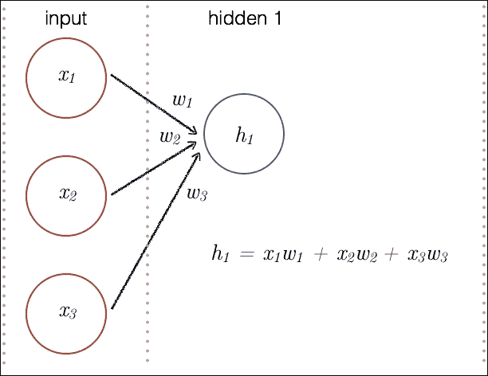

参考信号处理神经网络示例，每个输入（表示为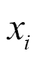）都应用了一个权重（表示为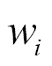），这产生了新的值。在这种情况下，一个隐藏节点（表示为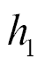）是三个修改后的输入节点的结果：

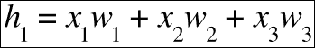

在训练过程中，还会应用一个偏差，以常数的形式调整总和。总和（在我们的例子中是*h* *1*）通过所谓的激活函数，该函数决定了神经元的输出。以下图像中展示了此类激活函数的一些示例：

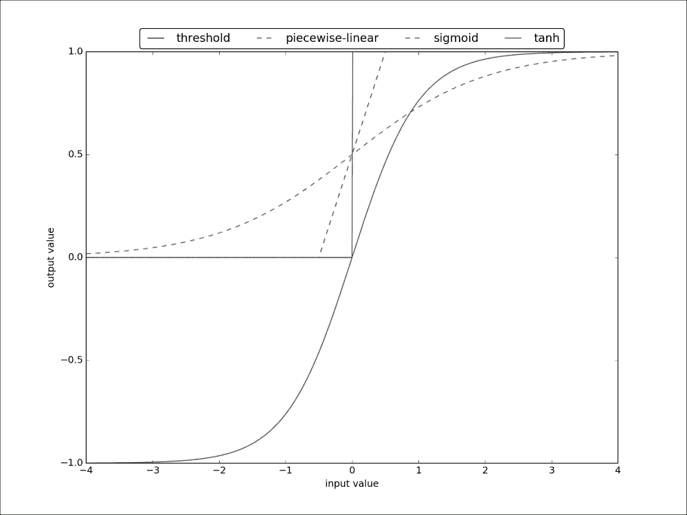

此过程在隐藏层以及输出层中的每个节点上都会重复进行。输出节点是所有应用于每个激活层节点的输入值的权重的累积。学习过程是许多并行运行的迭代的结果，应用并重新应用这些权重（在本场景中）。

神经网络以各种大小和形状出现。最流行的是单层和多层前馈网络，类似于前面展示的结构；这种结构（即使只有两层和一个神经元！）在输出层中的神经元能够解决简单的回归问题（如线性回归和逻辑回归）到高度复杂的回归和分类任务（具有许多隐藏层和多个神经元）。另一种常用的类型是自组织图，有时也称为 Kohonen 网络，以芬兰研究者 Teuvo Kohonen 的名字命名，他首先提出了这种结构。这些结构是在没有教师的情况下进行训练的，也就是说，它们不需要目标（一个无监督学习范式）。这种结构最常用于解决聚类问题，其目的是在数据中找到潜在的规律。

### 注意

关于神经网络类型的更多信息，我们建议查看以下文档：[`www.ieee.cz/knihovna/Zhang/Zhang100-ch03.pdf`](http://www.ieee.cz/knihovna/Zhang/Zhang100-ch03.pdf)

注意，除了 TensorFlow 之外，还有许多其他有趣的深度学习库；包括但不限于 Theano、Torch、Caffe、Microsoft 认知工具包（CNTK）、mxnet 和 DL4J。

## 神经网络和深度学习的需求

神经网络（以及深度学习）有许多潜在的应用。其中一些更受欢迎的应用包括面部识别、手写数字识别、游戏、语音识别、语言翻译和物体分类。关键之处在于它涉及到学习和模式识别。

尽管神经网络已经存在很长时间（至少在计算机科学的历史背景下），但它们现在变得更加流行，这得益于以下主题：分布式计算和研究的进步与可用性：

+   **分布式计算和硬件的进步与可用性**：如 Apache Spark 这样的分布式计算框架允许你通过并行运行更多模型来更快地完成更多训练迭代，从而确定机器学习模型的最佳参数。随着 GPU（最初设计用于显示图形的图形处理单元）的普及，这些处理器擅长执行机器学习所需的资源密集型数学计算。与云计算相结合，由于前期成本较低、部署时间短、易于弹性扩展，因此更容易利用分布式计算和 GPU 的力量。

+   **深度学习研究的进步**：这些硬件进步帮助神经网络重新回到了数据科学的前沿，例如 TensorFlow 以及其他流行的项目，如 Theano、Caffe、Torch、微软认知工具包（CNTK）、mxnet 和 DL4J。

要深入了解这些主题，两个很好的参考资料包括：

+   *从大规模部署深度学习中学到的经验* ([`blog.algorithmia.com/deploying-deep-learning-cloud-services/`](http://blog.algorithmia.com/deploying-deep-learning-cloud-services/)): 这篇博客文章由 Algorithmia 团队撰写，讨论了他们在大规模部署深度学习解决方案中的经验。

+   *《神经网络》由 Christos Stergio 和 Dimitrios Siganos 编写* ([`bit.ly/2hNSWar`](http://bit.ly/2hNSWar))：这是一本关于神经网络的优秀入门书籍。

如前所述，深度学习是机器学习方法家族的一部分，基于学习数据表示。在学习表示的情况下，这也可以定义为*特征学习*。使深度学习如此令人兴奋的是，它有潜力取代或最小化对*手动*特征工程的需求。深度学习将使机器不仅能够学习特定任务，还能够学习完成该任务所需的*特征*。更简洁地说，自动化特征工程或教会机器*如何学习学习*（关于特征学习的一个很好的参考资料是斯坦福大学的无监督特征学习和深度学习教程：[`deeplearning.stanford.edu/tutorial/`](http://deeplearning.stanford.edu/tutorial/)）。

将这些概念分解到基础，让我们从*特征*开始。正如在 Christopher Bishop 的《模式识别与机器学习》（柏林：Springer. ISBN 0-387-31073-8\. 2006）中观察到的那样，以及在 MLlib 和 ML 的前几章中提到的，特征是观察现象的可测量属性。

如果你更熟悉统计学领域，一个*特征*将指的是在随机线性回归模型中的独立变量（*x[1]，x[2]，…，x[n]*）：

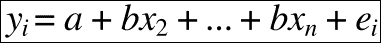

在这个特定例子中，*y*是因变量，*x* *i*是自变量。

在机器学习场景的背景下，特征示例包括：

+   **餐厅推荐**：特征包括评论、评分以及其他与餐厅相关的内容和用户个人资料属性。这个模型的一个好例子是*Yelp 食品推荐系统*：[`cs229.stanford.edu/proj2013/SawantPai-YelpFoodRecommendationSystem.pdf`](http://cs229.stanford.edu/proj2013/SawantPai-YelpFoodRecommendationSystem.pdf)。

+   **手写数字识别**：特征包括块状直方图（沿 2D 方向的像素计数）、空洞、笔画检测等。示例包括：

    +   *手写数字分类*: [`ttic.uchicago.edu/~smaji/projects/digits/`](http://ttic.uchicago.edu/~smaji/projects/digits/)

    +   *识别手写数字和字符*: [`cs231n.stanford.edu/reports/vishnu_final.pdf`](http://cs231n.stanford.edu/reports/vishnu_final.pdf)

+   **图像处理**：特征包括图像中的点、边缘和对象；一些好的例子包括：

    +   研讨会：André Aichert 的“特征提取”，[`home.in.tum.de/~aichert/featurepres.pdf`](http://home.in.tum.de/~aichert/featurepres.pdf)

    +   华盛顿大学计算机科学与工程学院 CSE455：计算机视觉讲座 6，[`courses.cs.washington.edu/courses/cse455/09wi/Lects/lect6.pdf`](https://courses.cs.washington.edu/courses/cse455/09wi/Lects/lect6.pdf)

特征工程是确定这些特征（例如，在统计学中，独立变量）中哪些对于定义你正在创建的模型是重要的过程。通常，它涉及到使用领域知识来创建特征，以便 ML 模型能够工作。

> 提出特征是困难的，耗时，需要专业知识。
> 
> “应用机器学习”基本上是特征工程。
> 
> —Andrew Ng，《通过脑模拟进行机器学习和人工智能》([`helper.ipam.ucla.edu/publications/gss2012/gss2012_10595.pdf`](http://helper.ipam.ucla.edu/publications/gss2012/gss2012_10595.pdf))

## 特征工程是什么？

通常，执行特征工程涉及诸如特征选择（选择原始特征集的子集）或特征提取（从原始特征集中构建新的特征集）等概念：

+   在*特征选择*中，基于领域知识，你可以过滤掉你认为定义模型的变量（例如，根据转换次数预测足球比分）。通常，数据分析技术如回归和分类也可以用来帮助你确定这一点。

+   在*特征提取*中，想法是将数据从高维空间（即许多不同的独立变量）转换到更小的空间，维度更少。继续使用足球的比喻，这将类似于四分卫评分，它基于几个选定的特征（例如，完成率、达阵、拦截、每次传球尝试的平均增益等）。在线性数据转换空间内进行特征提取的常见方法之一是**主成分分析**（PCA）：[`spark.apache.org/docs/latest/mllib-dimensionality-reduction.html#principal-component-analysis-pca`](http://spark.apache.org/docs/latest/mllib-dimensionality-reduction.html#principal-component-analysis-pca)。其他常见机制包括：

    +   *非线性降维*: [`en.wikipedia.org/wiki/Nonlinear_dimensionality_reduction`](https://en.wikipedia.org/wiki/Nonlinear_dimensionality_reduction)

    +   *多线性子空间学习*: [`en.wikipedia.org/wiki/Multilinear_subspace_learning`](https://en.wikipedia.org/wiki/Multilinear_subspace_learning)

        ### 小贴士

        关于特征选择与特征提取的主题，一本很好的参考书是*什么是降维？* *特征选择与提取的区别是什么？* [`datascience.stackexchange.com/questions/130/what-is-dimensionality-reduction-what-is-the-difference-between-feature-selecti/132#132`](http://datascience.stackexchange.com/questions/130/what-is-dimensionality-reduction-what-is-the-difference-between-feature-selecti/132#132)

## 数据与算法的桥梁

让我们以餐厅推荐为例，在特征选择的情况下，将特征和特征工程定义联系起来：

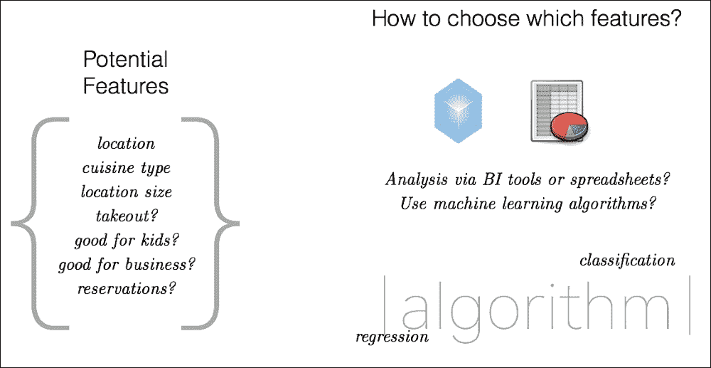

虽然这是一个简化的模型，但这个比喻描述了应用机器学习的基本前提。确定这个餐厅推荐模型的关键特征将取决于数据科学家分析数据。

在我们的餐厅推荐案例中，虽然可能很容易假设地理位置和菜系类型是主要因素，但要了解用户（即餐厅顾客）是如何选择他们的餐厅偏好的，可能需要深入挖掘数据。不同的餐厅往往有不同的特征或权重。

例如，高端餐厅餐饮业务的关键特征通常与位置（即，靠近客户的位置）有关，能够为大型团体预订，以及酒单的多样性：

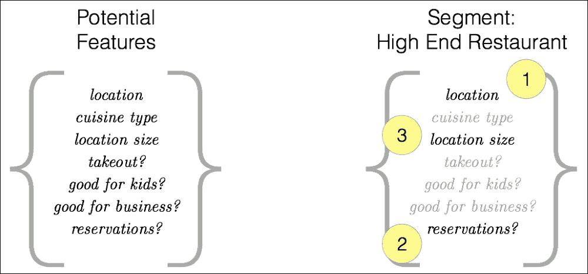

同时，对于特色餐厅，往往很少涉及之前提到的因素；相反，重点是评论、评分、社交媒体的热度，以及，可能的话，餐厅是否适合孩子：

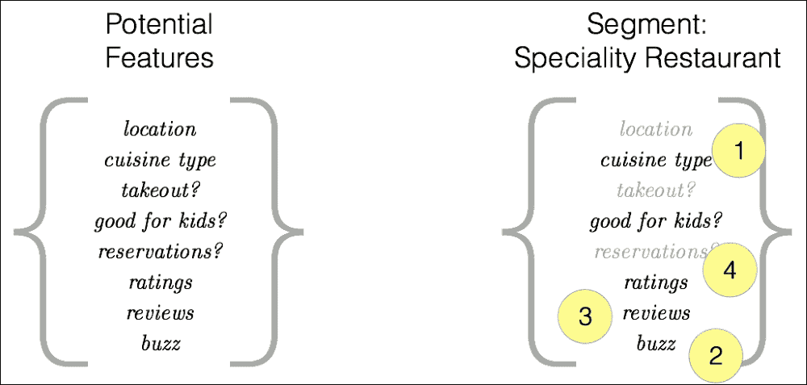

将这些不同的餐厅（及其目标受众）进行细分的能力是应用机器学习的关键方面。这可能是一个费时的过程，你尝试不同的模型和算法，使用不同的变量和权重，然后在迭代训练和测试许多不同组合后重新尝试。但请注意，这种耗时迭代的本身就是一个可以潜在自动化的过程？这是构建算法、帮助机器“学会学习”的关键背景：深度学习有潜力在构建我们的模型时自动化学习过程。

# 什么是 TensorFlow？

TensorFlow 是一个使用数据流图进行数值计算的 Google 开源软件库；也就是说，一个专注于深度学习的开源机器学习库。基于神经网络，TensorFlow 是 Google Brain 团队的研究人员和工程师将深度学习应用于 Google 产品并构建各种 Google 团队（包括但不限于搜索、照片和语音）的生产模型的成果。

基于 C++ 并具有 Python 接口构建，它迅速成为短时间内最受欢迎的深度学习项目之一。以下截图显示了四个流行深度学习库之间的 Google 趋势比较；请注意，2015 年 11 月 8 日至 14 日（TensorFlow 发布时）的峰值以及过去一年内的快速上升（此快照是在 2016 年 12 月底拍摄的）：

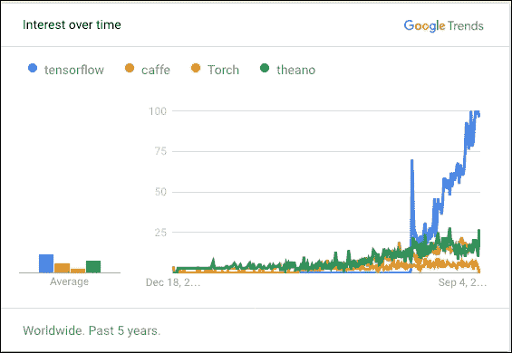

另一种衡量 TensorFlow 受欢迎程度的方法是注意到，根据[`www.theverge.com/2016/4/13/11420144/google-machine-learning-tensorflow-upgrade`](http://www.theverge.com/2016/4/13/11420144/google-machine-learning-tensorflow-upgrade)，TensorFlow 是 GitHub 上最受欢迎的机器学习框架。请注意，TensorFlow 仅在 2015 年 11 月发布，两个月后它已经成为最受欢迎的 GitHub ML 分支库。在下图中，您可以查看 2015 年创建的 GitHub 仓库（交互式可视化）[`donnemartin.com/viz/pages/2015`](http://donnemartin.com/viz/pages/2015)：

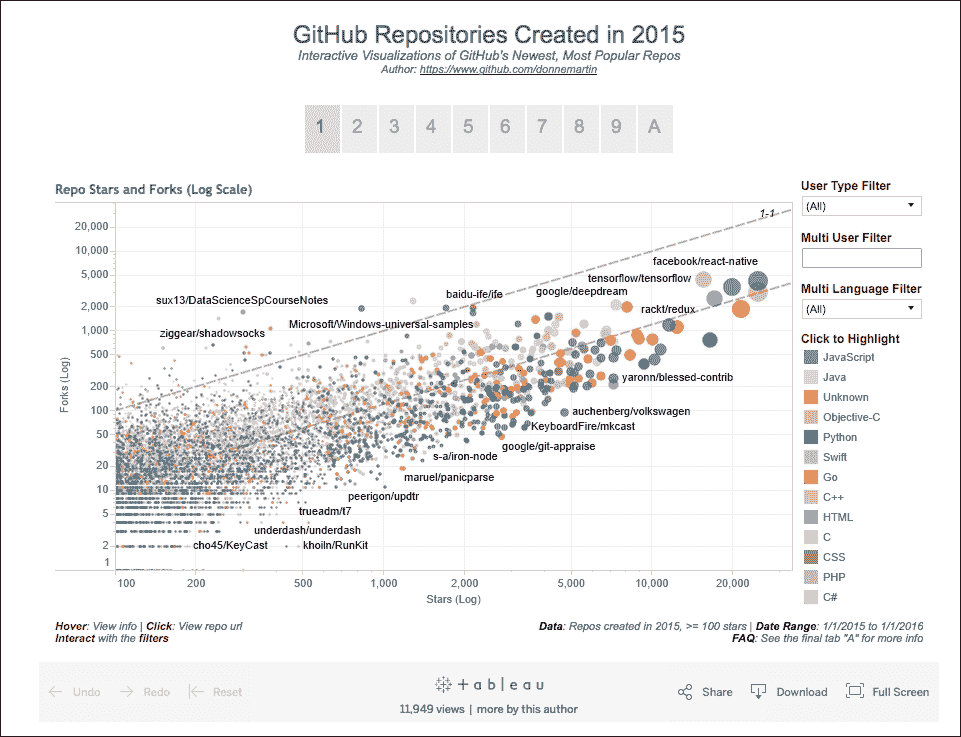

如前所述，TensorFlow 使用数据流图进行数值计算。当思考图（如前一章所述的 GraphFrames）时，该图的节点（或顶点）代表数学运算，而图边代表在不同节点（即数学运算）之间通信的多维数组（即张量）。

参考以下图，`t` `1` 是一个 **2x3** 矩阵，而 `t` `2` 是一个 **3x2** 矩阵；这些是张量（或张量图的边）。节点是表示为 `op` `1` 的数学操作：

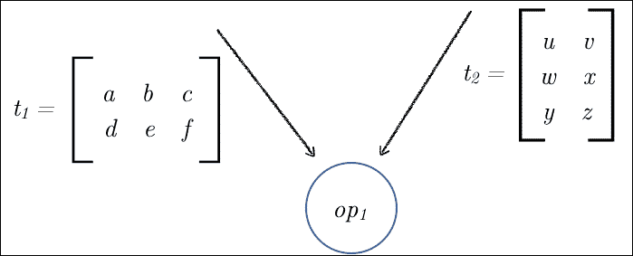

在这个例子中，`op` `1` 是由以下图表示的矩阵乘法操作，尽管这可以是 TensorFlow 中可用的许多数学操作之一：

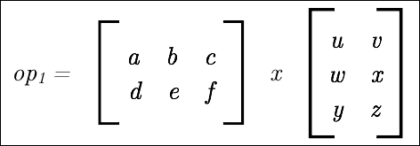

一起，为了在图中进行数值计算，多维数组（即张量）在数学操作（节点）之间流动，即张量的流动，或称 *TensorFlow*。

为了更好地理解 TensorFlow 的工作原理，让我们首先在你的 Python 环境中安装 TensorFlow（最初不带 Spark）。完整的说明请参阅 TensorFlow | 下载和设置：[`www.tensorflow.org/versions/r0.12/get_started/os_setup.html`](https://www.tensorflow.org/versions/r0.12/get_started/os_setup.html)。

对于本章，让我们专注于在 Linux 或 Mac OS 上安装 Python `pip` 软件包管理系统。

## 安装 Pip

确保你已经安装了 `pip`；如果没有，请使用以下命令安装 Ubuntu/Linux 的 Python 软件包安装管理器：

```py
# Ubuntu/Linux 64-bit 
$ sudo apt-get install python-pip python-dev

```

对于 Mac OS，你会使用以下命令：

```py
# macOS 
$ sudo easy_install pip 
$ sudo easy_install --upgrade six

```

注意，对于 Ubuntu/Linux，你可能还想升级 `pip`，因为 Ubuntu 仓库中的 `pip` 很旧，可能不与新软件包兼容。为此，你可以运行以下命令：

```py
# Ubuntu/Linux pip upgrade
$ pip install --upgrade pip 

```

## 安装 TensorFlow

要安装 TensorFlow（`pip` 已安装），你只需要执行以下命令：

```py
$ pip install tensorflow

```

如果你有一台支持 GPU 的计算机，你可以*改用*以下命令：

```py
$ pip install tensorflow-gpu

```

注意，如果前面的命令不起作用，根据你的 Python 版本（即 2.7、3.4 或 3.5）和 GPU 支持情况，有特定的说明来安装带有 GPU 支持的 TensorFlow。

例如，如果我想在 Mac OS 上为 Python 2.7 安装带有 GPU 启用的 TensorFlow，请执行以下命令：

```py
# macOS, GPU enabled, Python 2.7: 
$ export TF_BINARY_URL=https://storage.googleapis.com/tensorflow/mac/gpu/tensorflow_gpu-0.12.0rc1-py2-none-any.whl
# Python 2 
$ sudo pip install --upgrade $TF_BINARY_URL

```

### 注意

请参阅 [`www.tensorflow.org/versions/r0.12/get_started/os_setup.html`](https://www.tensorflow.org/versions/r0.12/get_started/os_setup.html) 获取最新的安装说明。

## 使用常数的矩阵乘法

为了更好地描述张量以及 TensorFlow 的工作原理，让我们从一个涉及两个常数的矩阵乘法计算开始。如以下图所示，我们有 `c` `1` （**3x1** 矩阵）和 `c` `2` （**1x3** 矩阵），其中操作（`op` `1`）是矩阵乘法：

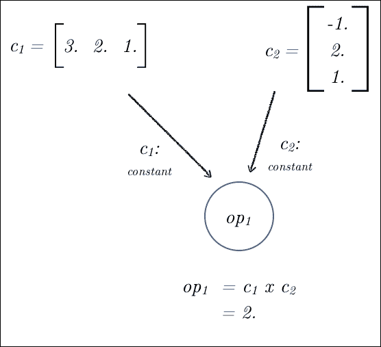

我们现在将使用以下代码定义 `c` `1` （**1x3** 矩阵）和 `c` `2` （**3x1** 矩阵）：

```py
# Import TensorFlow
import tensorflow as tf
# Setup the matrix
#   c1: 1x3 matrix
#   c2: 3x1 matrix
c1 = tf.constant([[3., 2., 1.]])
c2 = tf.constant([[-1.], [2.], [1.]])
```

现在我们有了我们的常量，让我们使用以下代码运行我们的矩阵乘法。在 TensorFlow 图的上下文中，请记住，图中的节点被称为操作（或`ops`）。以下矩阵乘法是`ops`，而两个矩阵（`c1`，`c2`）是张量（类型化的多维数组）。一个`op`可以接受零个或多个张量作为其输入，执行数学计算等操作，输出为零个或多个以`numpy ndarray`对象或 C，C++中的`tensorflow::Tensor interfaces`形式存在的张量：

```py
# m3: matrix multiplication (m1 x m3)
mp = tf.matmul(c1, c2)
```

现在这个 TensorFlow 图已经建立，这个操作的执行（例如，在这种情况下，矩阵乘法）是在`session`的上下文中完成的；`session`将图`ops`放置在 CPU 或 GPU（即设备）上以执行：

```py
# Launch the default graph
s = tf.Session()

# run: Execute the ops in graph
r = s.run(mp)
print(r)
```

输出为：

```py
# [[ 2.]]
```

一旦你完成了你的操作，你可以关闭会话：

```py
# Close the Session when completed
s.close()
```

## 使用占位符进行矩阵乘法

现在我们将执行与之前相同的任务，但这次我们将使用张量而不是常量。如以下图所示，我们将从两个矩阵（`m1: 3x1, m2: 1x3`）开始，使用与上一节相同的值：

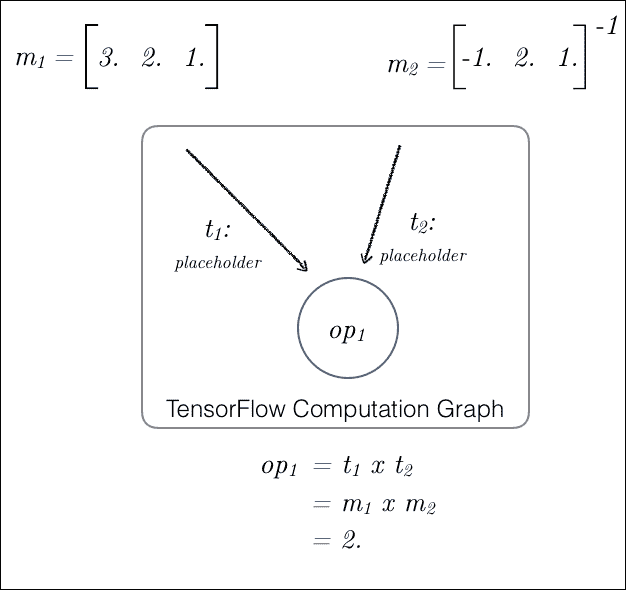

在 TensorFlow 中，我们将使用`placeholder`来定义我们的两个张量，如下代码片段所示：

```py
# Setup placeholder for your model
#   t1: placeholder tensor
#   t2: placeholder tensor
t1 = tf.placeholder(tf.float32)
t2 = tf.placeholder(tf.float32)

# t3: matrix multiplication (m1 x m3)
tp = tf.matmul(t1, t2)
```

这种方法的优势在于，使用占位符，你可以使用相同的操作（即在这种情况下，矩阵乘法）与不同大小和形状的张量（只要它们满足操作的标准）。就像上一节中的操作一样，让我们定义两个矩阵并执行图（使用简化的会话执行）。

### 运行模型

以下代码片段与上一节的代码片段类似，但现在它使用占位符而不是常量：

```py
# Define input matrices
m1 = [[3., 2., 1.]]
m2 = [[-1.], [2.], [1.]]

# Execute the graph within a session
with tf.Session() as s:
     print(s.run([tp], feed_dict={t1:m1, t2:m2}))
```

输出既包括值，也包括数据类型：

```py
[array([[ 2.]], dtype=float32)]
```

### 运行另一个模型

现在我们已经有一个使用`placeholders`的图（尽管是一个简单的图），我们可以使用不同的张量来执行相同的操作，使用不同的输入矩阵。如以下图所示，我们有`m1`（4x1）和`m2`（1x4）：

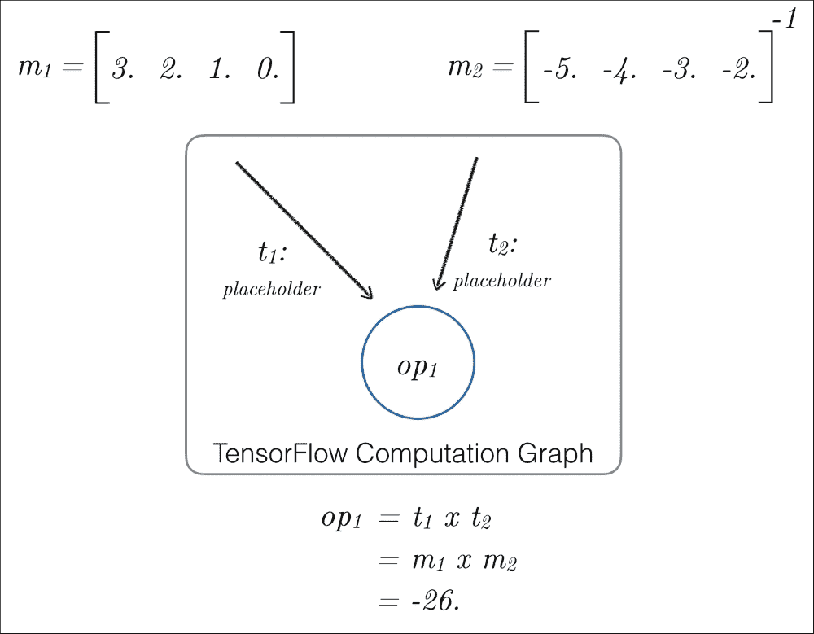

由于我们使用`placeholders`，我们可以轻松地在新的会话中重用相同的图，使用新的输入：

```py
# setup input matrices
m1 = [[3., 2., 1., 0.]]
m2 = [[-5.], [-4.], [-3.], [-2.]]
# Execute the graph within a session
with tf.Session() as s:
     print(s.run([tp], feed_dict={t1:m1, t2:m2}))
```

输出为：

```py
[array([[-26.]], dtype=float32)]
```

## 讨论

如前所述，TensorFlow 通过将计算表示为图来为用户提供使用 Python 库执行深度学习的能力，其中张量代表数据（图的边），操作代表要执行的内容（例如，数学计算）（图的顶点）。

更多信息请参阅：

+   TensorFlow | 入门 | 基本用法 [`www.tensorflow.org/get_started/get_started#basic_usage`](https://www.tensorflow.org/get_started/get_started#basic_usage)

+   Shannon McCormick 的神经网络和 Google TensorFlow [`www.slideshare.net/ShannonMcCormick4/neural-networks-and-google-tensor-flow`](http://www.slideshare.net/ShannonMcCormick4/neural-networks-and-google-tensor-flow)

# 介绍 TensorFrames

在撰写本文时，TensorFrames 是 Apache Spark 的一个实验性绑定；它于 2016 年初推出，紧随 TensorFlow 的发布之后。使用 TensorFrames，可以通过 TensorFlow 程序操作 Spark DataFrames。参考上一节中的张量图，我们已更新了以下图示，以展示 Spark DataFrames 如何与 TensorFlow 协同工作：

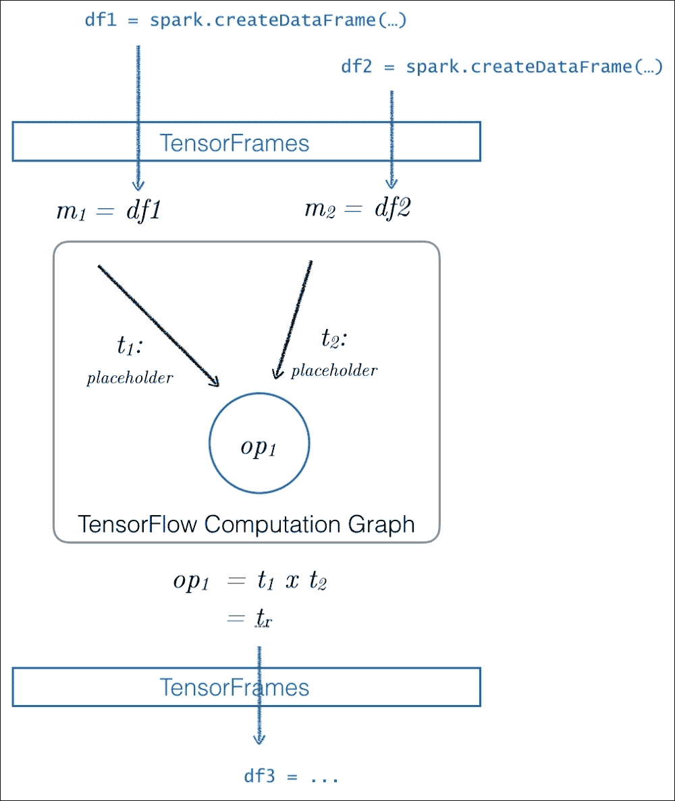

如前图所示，TensorFrames 在 Spark DataFrames 和 TensorFlow 之间提供了一个桥梁。这使得您可以将您的 DataFrames 作为输入应用到 TensorFlow 的计算图中。TensorFrames 还允许您将 TensorFlow 计算图的输出推回 DataFrames，以便您可以继续您的下游 Spark 处理。

在 TensorFrames 的常见使用场景中，通常包括以下内容：

**利用 TensorFlow 处理您的数据**

TensorFlow 与 Apache Spark 的集成，通过 TensorFrames 允许数据科学家扩展他们的分析、流处理、图和机器学习能力，包括通过 TensorFlow 进行深度学习。这允许您在大规模上训练和部署模型。

**并行训练以确定最佳超参数**

在构建深度学习模型时，有几个配置参数（即超参数）会影响模型的训练方式。在深度学习/人工神经网络中常见的超参数包括定义学习率（如果速率高，则学习速度快，但它可能不会考虑到高度可变性的输入——也就是说，如果数据和速率的可变性太高，它可能学不好）以及您神经网络中每层的神经元数量（神经元太多会导致估计噪声，而神经元太少会导致网络学不好）。

如在《Apache Spark 和 TensorFlow 的深度学习》([`databricks.com/blog/2016/01/25/deep-learning-with-apache-spark-and-tensorflow.html`](https://databricks.com/blog/2016/01/25/deep-learning-with-apache-spark-and-tensorflow.html))中观察到的那样，使用 Spark 与 TensorFlow 结合以帮助找到神经网络训练的最佳超参数集，这导致训练时间减少了 10 个数量级，并且手写数字识别数据集的错误率降低了 34%。

如需了解更多关于深度学习和超参数的信息，请参阅：

+   *通过进化算法优化深度学习超参数* [`ornlcda.github.io/MLHPC2015/presentations/4-Steven.pdf`](http://ornlcda.github.io/MLHPC2015/presentations/4-Steven.pdf)

+   *CS231n 卷积网络视觉识别网络* [`cs231n.github.io/`](http://cs231n.github.io/)

+   *使用 Apache Spark 和 TensorFlow 进行深度学习* [`databricks.com/blog/2016/01/25/deep-learning-with-apache-spark-and-tensorflow.html`](https://databricks.com/blog/2016/01/25/deep-learning-with-apache-spark-and-tensorflow.html)

在撰写本文时，TensorFrames 作为 Apache Spark 1.6（Scala 2.10）的官方支持，尽管目前大多数贡献都集中在 Spark 2.0（Scala 2.11）上。使用 TensorFrames 的最简单方法是通过 Spark Packages ([`spark-packages.org`](https://spark-packages.org)) 访问它。

# TensorFrames – 快速入门

在所有这些前言之后，让我们通过这个快速入门教程快速开始使用 TensorFrames。您可以在 Databricks Community Edition 中下载并使用完整的笔记本，网址为 [`bit.ly/2hwGyuC`](http://bit.ly/2hwGyuC)。

您也可以从 PySpark shell（或其他 Spark 环境）中运行此命令，就像运行任何其他 Spark 包一样：

```py
# The version we're using in this notebook
$SPARK_HOME/bin/pyspark --packages tjhunter:tensorframes:0.2.2-s_2.10  

# Or use the latest version 
$SPARK_HOME/bin/pyspark --packages databricks:tensorframes:0.2.3-s_2.10
```

注意，您将只使用上述命令中的一个（即，不是两个）。有关更多信息，请参阅 `databricks/tensorframes` GitHub 仓库 ([`github.com/databricks/tensorframes`](https://github.com/databricks/tensorframes))。

## 配置和设置

请按照以下顺序遵循配置和设置步骤：

### 启动 Spark 集群

使用 Spark 1.6（Hadoop 1）和 Scala 2.10 启动 Spark 集群。这已经在 Databricks Community Edition 上的 Spark 1.6、Spark 1.6.2 和 Spark 1.6.3（Hadoop 1）上进行了测试 ([`databricks.com/try-databricks`](http://databricks.com/try-databricks))。

### 创建 TensorFrames 库

创建一个库以将 TensorFrames 0.2.2 附加到您的集群：`tensorframes-0.2.2-s_2.10`。请参阅第七章，*GraphFrames*，以回忆如何创建库。

### 在您的集群上安装 TensorFlow

在笔记本中运行以下命令之一以安装 TensorFlow。这已经与 TensorFlow 0.9 CPU 版本进行了测试：

+   TensorFlow 0.9，Ubuntu/Linux 64 位，仅 CPU，Python 2.7：

    ```py
    /databricks/python/bin/pip install https://storage.googleapis.com/tensorflow/linux/cpu/tensorflow-0.9.0rc0-cp27-none-linux_x86_64.whl
    ```

+   TensorFlow 0.9，Ubuntu/Linux 64 位，启用 GPU，Python 2.7：

    ```py
    /databricks/python/bin/pip install https://storage.googleapis.com/tensorflow/linux/gpu/tensorflow-0.9.0rc0-cp27-none-linux_x86_64.whl
    ```

以下是将 TensorFlow 安装到 Apache Spark 驱动器的 `pip` 安装命令：

```py
%sh
/databricks/python/bin/pip install https://storage.googleapis.com/tensorflow/linux/cpu/tensorflow-0.9.0rc0-cp27-none-linux_x86_64.whl
```

成功安装应该有类似以下输出：

```py
Collecting tensorflow==0.9.0rc0 from https://storage.googleapis.com/tensorflow/linux/cpu/tensorflow-0.9.0rc0-cp27-none-linux_x86_64.whl Downloading https://storage.googleapis.com/tensorflow/linux/cpu/tensorflow-0.9.0rc0-cp27-none-linux_x86_64.whl (27.6MB) Requirement already satisfied (use --upgrade to upgrade): numpy>=1.8.2 in /databricks/python/lib/python2.7/site-packages (from tensorflow==0.9.0rc0) Requirement already satisfied (use --upgrade to upgrade): six>=1.10.0 in /usr/lib/python2.7/dist-packages (from tensorflow==0.9.0rc0) Collecting protobuf==3.0.0b2 (from tensorflow==0.9.0rc0) Downloading protobuf-3.0.0b2-py2.py3-none-any.whl (326kB) Requirement already satisfied (use --upgrade to upgrade): wheel in /databricks/python/lib/python2.7/site-packages (from tensorflow==0.9.0rc0) Requirement already satisfied (use --upgrade to upgrade): setuptools in /databricks/python/lib/python2.7/site-packages (from protobuf==3.0.0b2->tensorflow==0.9.0rc0) Installing collected packages: protobuf, tensorflow Successfully installed protobuf-3.0.0b2 tensorflow-0.9.0rc0
```

在成功安装 TensorFlow 后，断开并重新连接您刚刚运行此命令的笔记本。您的集群现在已配置；您可以在驱动器上运行纯 TensorFlow 程序，或在整个集群上运行 TensorFrames 示例。

## 使用 TensorFlow 向现有列添加常数

这是一个简单的 TensorFrames 程序，其中`op`是执行简单的加法。请注意，原始源代码可以在`databricks/tensorframes` GitHub 存储库中找到。这是关于 TensorFrames `Readme.md` | *如何在 Python 中运行*部分（[`github.com/databricks/tensorframes#how-to-run-in-python`](https://github.com/databricks/tensorframes#how-to-run-in-python)）。

我们首先将导入`TensorFlow`、`TensorFrames`和`pyspark.sql.row`，然后基于浮点 RDD 创建一个 DataFrame：

```py
# Import TensorFlow, TensorFrames, and Row
import tensorflow as tf
import tensorframes as tfs
from pyspark.sql import Row

# Create RDD of floats and convert into DataFrame `df`
rdd = [Row(x=float(x)) for x in range(10)]
df = sqlContext.createDataFrame(rdd)
```

要查看由浮点 RDD 生成的`df` DataFrame，我们可以使用`show`命令：

```py
df.show()
```

这会产生以下结果：

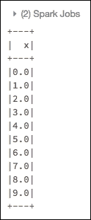

### 执行 Tensor 图

如前所述，这个张量图由将 3 加到由浮点 RDD 生成的`df` DataFrame 创建的张量组成。我们现在将执行以下代码片段：

```py
# Run TensorFlow program executes:
#   The 'op' performs the addition (i.e. 'x' + '3')
#   Place the data back into a DataFrame
with tf.Graph().as_default() as g:

#   The placeholder that corresponds to column 'x'.
#   The shape of the placeholder is automatically
#   inferred from the DataFrame.
    x = tfs.block(df, "x")

    # The output that adds 3 to x
    z = tf.add(x, 3, name='z')

    # The resulting `df2` DataFrame
    df2 = tfs.map_blocks(z, df)

# Note that 'z' is the tensor output from the
# 'tf.add' operation
print z

## Output
Tensor("z:0", shape=(?,), dtype=float64)
```

这里是对前面代码片段的一些具体说明：

+   `x`使用`tfs.block`，其中`block`基于 DataFrame 中列的内容构建块占位符

+   `z`是 TensorFlow `add`方法（`tf.add`）的输出张量

+   `df2`是新的 DataFrame，它通过分块将`z`张量添加到`df` DataFrame 的额外列中

虽然`z`是张量（如前所述），但为了处理 TensorFlow 程序的结果，我们将使用`df2` dataframe。`df2.show()`的输出如下：

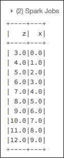

## 分块减少操作示例

在下一节中，我们将展示如何处理分块减少操作。具体来说，我们将计算字段向量的和与最小值，通过处理行块以实现更有效的处理。

### 构建向量 DataFrame

首先，我们将创建一个包含向量的单列 DataFrame：

```py
# Build a DataFrame of vectors
data = [Row(y=[float(y), float(-y)]) for y in range(10)]
df = sqlContext.createDataFrame(data)
df.show()
```

输出如下：

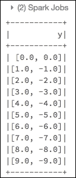

### 分析 DataFrame

我们需要分析 DataFrame 以确定其形状（即向量的维度）。例如，在以下代码片段中，我们使用`tfs.print_schema`命令对`df` DataFrame 进行操作：

```py
# Print the information gathered by TensorFlow to check the content of the DataFrame
tfs.print_schema(df)

## Output
root 
|-- y: array (nullable = true) double[?,?]
```

注意`double[?,?]`，这意味着 TensorFlow 不知道向量的维度：

```py
# Because the dataframe contains vectors, we need to analyze it
# first to find the dimensions of the vectors.
df2 = tfs.analyze(df)

# The information gathered by TF can be printed 
# to check the content:
tfs.print_schema(df2)

## Output
root 
|-- y: array (nullable = true) double[?,2] 
```

在分析`df2` DataFrame 后，TensorFlow 推断出`y`包含大小为 2 的向量。对于小张量（标量和向量），TensorFrames 通常不需要初步分析就能推断出张量的形状。如果它无法做到这一点，错误信息将指示您首先运行 DataFrame 通过`tfs.analyze()`。

### 计算所有向量的逐元素和与最小值

现在，让我们分析`df` DataFrame，使用`tf.reduce_sum`和`tf.reduce_min`计算所有向量的`sum`和逐元素`min`：

+   `tf.reduce_sum`：计算张量跨维度的元素总和，例如，如果`x = [[3, 2, 1], [-1, 2, 1]]`，则`tf.reduce_sum(x) ==> 8`。更多信息可以在：`https://www.tensorflow.org/api_docs/python/tf/reduce_sum`找到。

+   `tf.reduce_min`：计算张量跨维度的元素最小值，例如，如果`x = [[3, 2, 1], [-1, 2, 1]]`，则`tf.reduce_min(x) ==> -1`。更多信息可以在：`https://www.tensorflow.org/api_docs/python/tf/reduce_min`找到。

以下代码片段允许我们使用 TensorFlow 执行高效的元素级缩减，其中源数据位于 DataFrame 中：

```py
# Note: First, let's make a copy of the 'y' column. 
# This is an inexpensive operation in Spark 2.0+
df3 = df2.select(df2.y, df2.y.alias("z"))

# Execute the Tensor Graph
with tf.Graph().as_default() as g:

  # The placeholders. 
  # Note the special name that end with '_input':
    y_input = tfs.block(df3, 'y', tf_name="y_input")
    z_input = tfs.block(df3, 'z', tf_name="z_input")

    # Perform elementwise sum and minimum 
    y = tf.reduce_sum(y_input, [0], name='y')
    z = tf.reduce_min(z_input, [0], name='z')

# The resulting dataframe
(data_sum, data_min) = tfs.reduce_blocks([y, z], df3)

# The finalresults are numpy arrays:
print "Elementwise sum: %s and minimum: %s " % (data_sum, data_min)

## Output
Elementwise sum: [ 45\. -45.] and minimum: [ 0\. -9.] 
```

使用 TensorFrames 的几行 TensorFlow 代码，我们可以从存储在`df` DataFrame 中的数据中提取数据，执行 Tensor 图以执行元素级求和和最小值，将数据合并回 DataFrame，并在我们的案例中打印出最终值。

# 摘要

在本章中，我们回顾了神经网络和深度学习的基础知识，包括特征工程组件。随着深度学习的所有这些新兴奋点，我们介绍了 TensorFlow 以及它是如何通过 TensorFrames 与 Apache Spark 紧密协作的。

TensorFrames 是一个强大的深度学习工具，允许数据科学家和工程师使用存储在 Spark DataFrame 中的数据与 TensorFlow 一起工作。这使您能够将 Apache Spark 的功能扩展到基于神经网络学习过程的强大深度学习工具集。为了帮助您继续深度学习之旅，以下是一些优秀的 TensorFlow 和 TensorFrames 资源：

+   TensorFlow：[`www.tensorflow.org/`](https://www.tensorflow.org/)

+   TensorFlow | 入门：[`www.tensorflow.org/get_started/get_started`](https://www.tensorflow.org/get_started/get_started)

+   TensorFlow | 指南：[`www.tensorflow.org/tutorials/`](https://www.tensorflow.org/tutorials/)

+   Databricks 上的深度学习：[`databricks.com/blog/2016/12/21/deep-learning-on-databricks.html`](https://databricks.com/blog/2016/12/21/deep-learning-on-databricks.html)

+   TensorFrames（GitHub）：[`github.com/databricks/tensorframes`](https://github.com/databricks/tensorframes)

+   TensorFrames 用户指南：[`github.com/databricks/tensorframes/wiki/TensorFrames-user-guide`](https://github.com/databricks/tensorframes/wiki/TensorFrames-user-guide)
