# 第三章：数据创建和编辑

在本章中，我们将首先创建一些新的矢量图层，并介绍如何选择要素和进行测量。然后，我们将继续编辑要素几何和属性。接着，我们将重新投影矢量和栅格数据，在结束本章之前，我们将学习如何通过将数据从文本文件和电子表格合并到我们的空间数据中来在不同文件格式之间进行转换。

# 创建新的矢量图层

在这个练习中，我们将从头开始创建一个新的图层。QGIS 提供了一系列功能来创建不同的图层。**图层** | **新建**菜单列出了创建新 Shapefile 和 SpatiaLite 图层的功能，但我们可以使用 DB Manager 插件创建新的数据库表。界面略有不同，以适应每种格式支持的功能。

让我们创建一个新的 Shapefile 来查看它是如何工作的。通过访问**图层** | **新建**或*Ctrl* + *Shift* + *N*，可以打开一个新矢量图层对话框，其中包含不同几何类型、CRS 和属性选项。整个过程非常快，因为所有必填字段已经设置了默认值。默认情况下，它将创建一个新的点图层，使用 WGS84 CRS（除非在**设置** | **选项** | **CRS**中指定了其他设置）和一个名为**id**的整数字段。我们只需点击**确定**，指定一个文件名，新的图层就会出现在图层列表中。

接下来，我们还会创建一个线和多边形图层。我们将向这些图层添加一些额外的字段。除了整数字段外，Shapefiles 还支持文本和小数值。要添加字段，我们只需插入一个名称，选择类型和宽度，然后点击**添加到属性列表**。对于小数数字，我们还需要定义**精度**值，它决定了小数点后的位数。**宽度**为**3**，**精度**为**1**的值将允许从-99.9 到+99.9 的值范围。以下截图显示了**新矢量图层**对话框和我的示例多边形图层的**属性...**窗口：

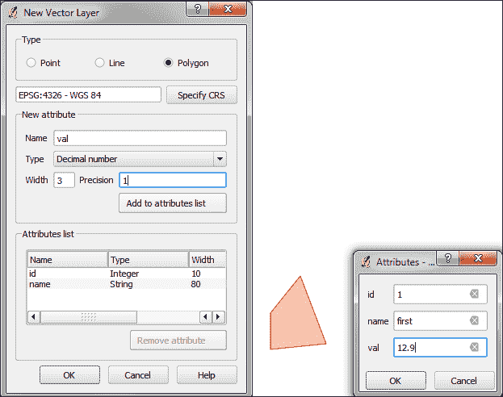

所有的新图层目前都是空的，但我们将现在创建一些要素。如果我们想向图层添加要素，我们首先必须启用该图层的编辑功能。可以通过选择**图层** | **切换编辑**、图层名称上下文菜单中的**切换编辑**或**数字化**工具栏中的**切换编辑**按钮来打开或关闭编辑。注意图层列表中的图层图标如何改变以反映编辑是否开启。当我们为图层开启编辑时，QGIS 会自动启用适合图层几何类型的数字化工具。

现在，我们可以使用编辑工具栏中的**添加要素**工具来创建新要素。要放置一个点，我们只需在地图上单击。然后我们会提示填写属性表单，一旦我们点击**确定**，新要素就会被创建。与点一样，我们可以通过在地图上放置节点来创建新的线和多边形。要完成一条线或一个多边形，我们只需在地图上右键单击。在每个图层中创建一些要素，然后保存您的更改。我们可以在即将到来的练习中重新使用这些测试图层。

### 注意

新要素和要素编辑只有在点击**数字化**工具栏中的**保存图层编辑**按钮或完成编辑并确认要保存后才会永久保存。

# 使用特征选择工具

选择特征是任何 GIS 的核心功能之一，在我们开始编辑几何形状和属性之前了解它们是有用的。根据用例，选择工具有多种不同的类型。QGIS 提供了三种不同的工具来使用鼠标、表达式或另一个图层选择特征。

**属性**工具栏中的第一组工具允许我们使用鼠标在地图上选择特征，一次选择一个或通过绘制不同的形状，如矩形或围绕特征的自由手绘区域。所有与绘制形状相交的特征都被选中。按住*Ctrl*键会将新选择添加到现有选择中。

类似地，按住*Ctrl* + *Shift*键将新选择从现有选择中删除。以下截图显示了这些工具：

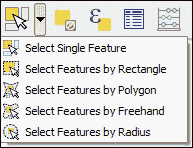

第二种选择工具被称为**表达式选择**，它也存在于**属性**工具栏中。它根据可以包含引用和函数的表达式来选择特征，这些函数可以使用特征属性和/或几何形状。可用的函数列表相当长，但我们可以使用搜索框通过名称过滤列表，以便更快地找到所需的函数。在窗口的右侧，我们可以找到**所选函数帮助**，它解释了功能及其在表达式中的使用方法。**函数列表**还显示了图层属性字段，通过点击**加载所有唯一值**或**加载 10 个样本值**，我们可以轻松访问其内容。与鼠标工具一样，我们可以选择创建新的选择或添加到现有选择或从现有选择中删除。此外，我们还可以选择仅从现有选择中选择特征。让我们看看一些示例表达式，您可以在自己的工作中构建和使用它们：

+   使用我们样本数据中的`lakes.shp`文件，例如，我们可以通过简单的属性查询选择面积大于 1,000 平方英里的湖泊：`"AREA_MI" > 1000.0`，或者使用几何函数如`$area > (1000.0 * 27878400)`。请注意，`lakes.shp`的 CRS 使用英尺，因此我们必须乘以 27,878,400 将平方英尺转换为平方英里。

+   我们还可以使用字符串函数，例如，查找名称较长的湖泊：`length("NAMES") > 12`，或者名称中包含“s”或“S”的湖泊：`lower("NAMES") LIKE '%s%'`，这首先将名称转换为小写，然后查找“s”的任何出现。对话框将看起来像以下屏幕截图：

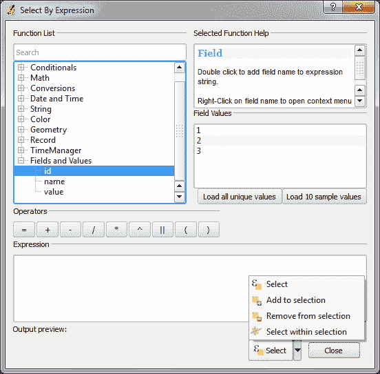

第三种工具允许我们根据要素在第二层中的相对位置选择第一层中的要素。这些工具可以通过访问**矢量** | **研究工具** | **按位置选择**和**矢量** | **空间查询** | **空间查询**来访问。如果无法在**矢量**菜单中找到它，请在**插件管理器**中启用它。通常，我们想要使用空间查询插件，因为它支持各种空间操作，如**交叉**、**等于**、**相交**、**不相交**、**重叠**、**接触**和**包含**，具体取决于图层几何类型。

让我们使用样本数据中的`railroads.shp`和`pipelines.shp`测试空间查询插件。例如，我们可能想要找到所有穿过管道的铁路要素；因此，我们选择**railroads**图层、**Crosses**操作和**pipelines**图层。点击**应用**后，插件会展示查询结果。您可以在以下屏幕截图的窗口右侧看到结果要素的 ID 列表。在此列表下方，我们可以勾选**缩放到项目**复选框，QGIS 会缩放到所选 ID 所属的要素。此外，插件还提供按钮，可以直接将所有结果要素保存到新图层。

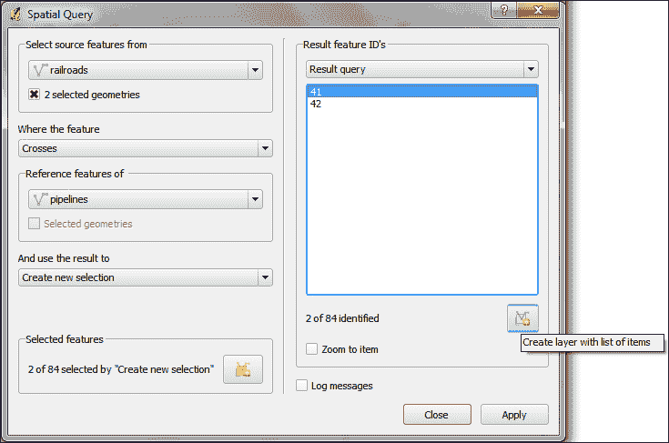

# 编辑矢量几何

现在我们知道了如何创建和选择要素，我们可以更仔细地查看**绘图**和**高级绘图**工具栏中的其他工具。绘图工具栏将看起来像以下屏幕截图：

基本绘图工具栏包含创建和移动要素以及节点、删除、复制、剪切和粘贴要素的工具，如下所示：

+   使用**移动要素**工具，通过拖动它们到新位置，可以轻松地一次移动一个或多个要素。

+   类似地，**节点工具**功能允许我们移动同一特征的一个或多个节点。第一次点击激活特征，而第二次点击选择节点。按住鼠标键拖动节点到其新位置。除了移动单个节点外，我们还可以通过单击并拖动线来移动边。最后，我们可以按住*Ctrl*键选择并移动多个节点。

+   **删除选定内容**、**剪切特征**和**复制特征**仅在选中一个或多个图层特征时才可用。同样，**粘贴特征**仅在特征已被剪切或复制后才能工作。

**高级数字化**工具栏提供了非常实用的**撤销**和**重做**功能，以及用于更复杂几何编辑的附加工具：

+   **旋转特征（s）**使我们能够围绕中心点旋转一个或多个选定的特征。

+   使用**简化特征**工具，我们只需单击特征并拉动弹出窗口中的公差滑块，就可以简化/泛化特征几何形状。

+   以下工具允许我们在现有多边形中**添加环**（也称为“洞”）或**添加部分**。当然，还有**删除环**和**删除部分**的工具。

+   **重塑特征**可以通过切割或添加部分来改变特征的几何形状。您可以通过在原始特征内开始绘制新形状以添加部分，或者在外部开始切割部分来控制行为，如下面的示例图所示：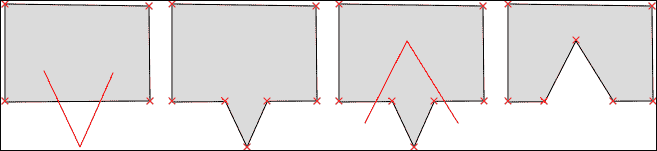

+   **偏移曲线**工具仅适用于线条，并允许我们通过给定的偏移量移动线条几何形状。

+   **分割特征**允许我们沿着切割线切割一个或多个特征。

+   **合并选定的特征**使我们能够在保持对输出特征中哪些特征的属性将可用的控制的同时合并多个特征。

+   类似地，**合并选定特征的属性**允许我们将多个特征的属性合并，但不会将它们合并为一个特征。相反，所有原始特征保持原样，但属性值已更新。

+   最后，**旋转点符号**仅适用于具有**旋转字段**功能启用的点图层（我们将在第五章，*创建优秀的地图*中介绍）。

# 使用测量工具

任何 GIS 的核心功能之一是测量工具。在 QGIS 中，我们可以在**属性**工具栏中找到测量线条、面积和角度的工具，如下面的屏幕截图所示：

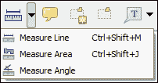

当我们绘制测量线、面积或角度时，测量值会持续更新。当我们绘制由多个段组成的线时，工具将显示每个段以及所有段的总长度。要停止测量，我们只需右键单击。如果我们想将测量单位从米更改为英尺，或者从度更改为弧度，我们可以在 **设置** | **选项** | **地图工具** 中进行更改。

# 编辑属性

属性编辑有三个主要用例。首先，我们可能想要编辑特定要素的属性，例如，更正一个错误的名字。其次，我们可能想要编辑一组要素的属性。或者第三，我们可能想要更改图层中所有要素的属性。所有这些用例都由属性表提供的功能覆盖。我们可以通过访问 **图层** | **打开属性表**，**属性**工具栏中的 **打开属性表** 按钮，或者在图层名称上下文菜单中来实现。

要更改属性值，我们总是首先需要启用编辑功能。然后我们可以双击属性表中的任何单元格以激活输入模式。点击 *Enter* 确认更改，但为了永久保存新值，我们还需要点击 **保存编辑(s)** 按钮，或者按 *Ctrl* + *S*。在属性表对话框的右下角，我们可以从表格视图切换到表单视图，如下面的截图所示，并从这里开始编辑。

### 小贴士

编辑单个要素属性的另一种选项是直接通过点击地图上的要素并使用 **识别工具** 来打开属性表单。默认情况下，**识别工具** 以只读模式显示属性值，但我们可以通过访问 **设置** | **选项** | **地图工具** 来启用 **如果识别到单个要素，则打开要素表单**。

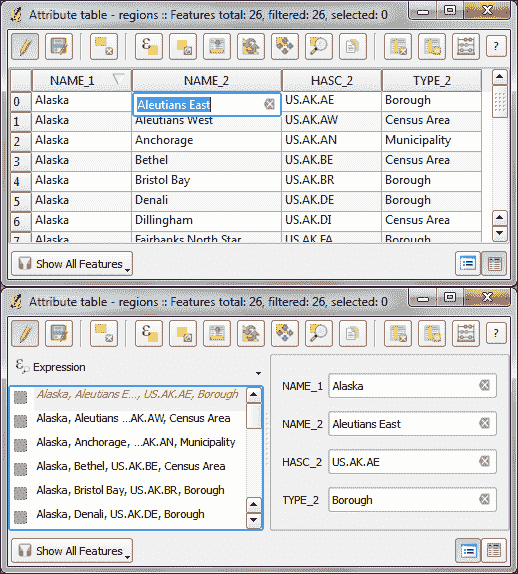

### 注意

在属性表中，我们还找到处理选择（从左到右，从第三个按钮开始）的工具：删除选定的要素，通过表达式选择，取消选择，将选定的要素移动到表顶，反转选择，平移到选定的要素，缩放到选定的要素，以及复制选定的要素。在属性表中选择要素的另一种方法是点击行号。

下两个按钮允许我们添加和删除列。当我们点击删除列按钮时，会弹出一个列列表供我们选择。同样，添加列按钮会弹出一个对话框，用于指定新列的名称和数据类型。

如果我们想要更改图层中多个或所有要素的属性，手动编辑通常不是一个选择。这正是**字段计算器**的作用所在。我们可以通过在属性表中的**打开字段计算器**按钮或使用*Ctrl* + *I*键来访问它。在**字段计算器**中，我们可以选择仅更新所选要素或更新图层中的所有要素。除了更新现有字段外，我们还可以创建一个新字段。函数列表与我们之前在通过表达式选择要素时探索的相同。我们可以使用这些函数中的任何一个来填充新字段或更新现有字段。以下是一些常用表达式的示例：

+   我们可以使用`$rownum`函数创建一个`id`列，该列填充了如图所示行号

+   另一个常见用例是使用几何函数`$length`和`$area`分别计算线长度或多边形面积

+   同样，我们可以使用`$x`和`$y`获取点坐标

+   如果我们想要获取一条线的起点或终点，可以使用 `xat(0)` 和 `yat(0)` 或 `xat(-1)` 和 `yat(-1)` 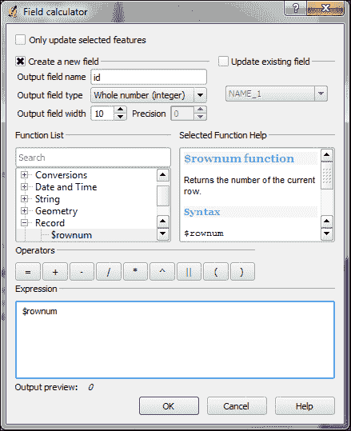

# 重投影和转换矢量及栅格数据

在第二章中，我们讨论了 CRS 以及 QGIS 如何提供即时重投影以显示存储在不同 CRS 中的空间数据集，这些数据集在同一个地图中显示。尽管如此，在某些情况下，我们可能希望永久性地重投影数据集，例如稍后进行地理处理。

在 QGIS 中，通过简单地保存图层为新的 CRS 来重投影矢量或栅格图层。我们可以通过**图层** | **另存为...**或图层名称上下文菜单中的**另存为…**来保存图层。选择目标文件格式和文件名，然后点击 CRS 字段旁边的**浏览**按钮来选择新的 CRS。

除了更改 CRS 外，保存矢量/栅格图层对话框的主要用例是在不同文件格式之间进行转换。例如，我们可以加载 Shapefile 并将其导出为 GeoJSON、Mapinfo MIF、CSV 等，或者相反。

保存栅格图层对话框也是一个方便的裁剪/裁剪栅格的方法，因为我们可以指定我们想要保存的范围。

类似地，对于矢量图层，**图层**菜单和图层名称上下文菜单中都有**保存选择为…**，它将打开相同的对话框，但它只会保存所选要素。

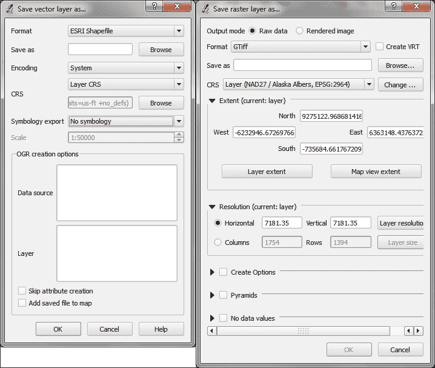

### 小贴士

启用**将保存的文件添加到地图中**（目前仅在矢量对话框中可用）非常方便，因为它节省了我们保存文件后手动加载新文件的麻烦。

# 联接表格数据

在许多实际情况下，我们以电子表格或文本文件的形式获得额外的非空间数据。好消息是我们可以通过简单地从文件浏览器拖动它们到 QGIS 或使用 **添加矢量图层** 来加载 XLS 文件。不要被措辞误导！它真的可以在文件中没有几何数据的情况下工作。文件甚至可以包含不止一个表格。你会看到以下对话框，它允许你选择你想要加载的表格（s）：

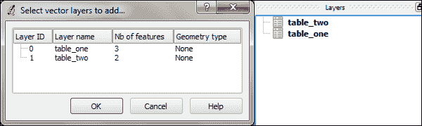

QGIS 将自动识别 XLS 表格中列的名称和数据类型。这很容易辨认，因为数值在属性表中是右对齐的，如下面的截图所示：

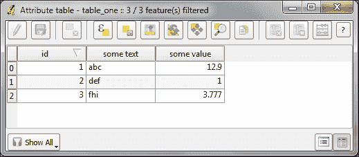

我们也可以从类似于我们在 第二章 中看到的，*查看空间数据*，当我们从一个分隔符文本文件加载点图层时，加载来自分隔符文本文件的表格数据。要加载仅包含表格数据而不包含几何信息的数据的分隔符文本文件，我们只需启用 **无几何**（仅属性表）选项。

在从电子表格或文本文件加载表格数据后，我们可以继续将此非空间数据连接到矢量层。为此，我们转到矢量 **图层属性** | **连接** 选项卡。在那里，我们可以通过按绿色加号按钮添加一个新的连接。我们只需选择表格的 **连接层** 和 **连接字段** 字段（表格层的字段），这些字段应包含与矢量层的 **目标字段** 字段（的值）匹配的值。页面将类似于下面的截图。

### 注意

QGIS 中连接的工作方式是，连接层的属性被附加到原始层的属性表中。原始层的要素数量不会改变。每当连接和目标字段之间有匹配时，属性值将被填充；否则，你会看到 NULL 条目。

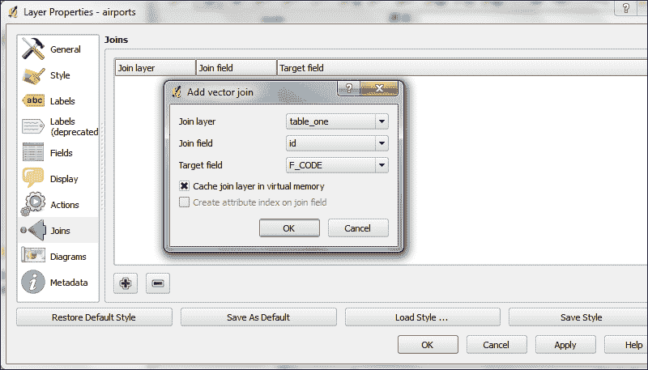

一旦添加了连接，我们就可以看到扩展的属性表，并可以使用新附加的属性进行样式和标签化。

### 小贴士

您可以永久保存连接层。只需使用 **另存为…** 创建新文件。

# 摘要

在本章中，我们介绍了从头创建新图层的方法。我们使用了不同的工具以不同的方式创建和编辑要素几何形状。然后，我们进入了编辑单个要素的属性、要素选择和整个图层的属性。接下来，我们重新投影了矢量和栅格图层，并学习了如何在不同文件格式之间进行转换。最后，我们通过介绍表格数据、如何将其加载到 QGIS 以及如何将其连接到我们的空间数据来结束本章关于图层创建和编辑的内容。

在下一章中，我们将把我们的数据用于实际用途，并学习如何在矢量和栅格数据上执行不同类型的空间分析。
