# 第四章. 空间分析

在本章中，我们将从栅格处理和分析任务开始，例如裁剪和地形分析。我们将介绍栅格和矢量格式之间的转换基本知识，然后继续介绍常见的矢量地理处理任务，例如生成热图和计算区域内面积份额。我们将以介绍使用 QGIS 处理模型器自动地理处理工作流程结束本章。

# 裁剪栅格

在栅格处理中，一个常见的任务是使用多边形裁剪栅格。这个任务由位于**栅格** | **提取** | **裁剪器**的 Clipper 工具很好地处理。此工具支持裁剪到指定范围或使用多边形掩膜层裁剪，如下所示：

+   范围可以手动设置，也可以通过在地图中选择来设置。为此，我们只需在 QGIS 主窗口的地形区域拖动一个矩形即可。

+   掩膜层可以是项目中当前加载的任何多边形图层，或者任何其他多边形图层，可以使用**选择…**指定。

    ### 小贴士

    如果我们只想将栅格裁剪到一定范围（当前地图视图范围或其他），我们也可以使用栅格**另存为...**，如第三章中所述的*数据创建和编辑*。

为了快速练习，我们将使用阿拉斯加 Shapefile（均来自我们的样本数据）作为掩膜层来裁剪阴影栅格。在窗口底部，我们可以看到 QGIS 用于裁剪栅格的**gdalwarp**命令。如果你也想学习如何使用 GDAL，这将非常有用。

默认的**无数据值**是**0**，但在必要时我们可以覆盖它。另一个好选项是**创建输出 alpha 波段**，这将设置掩膜外的所有区域为透明，如下面的截图所示：

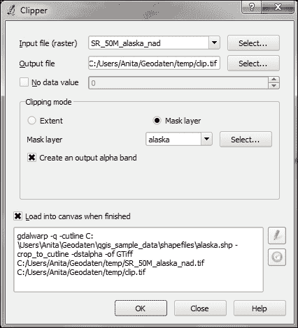

由于我们启用了**完成时加载到画布**选项，结果图层将自动加载。QGIS 还应自动识别我们创建的 alpha 图层，并且位于阿拉斯加陆地之外的区域应该是透明的。如果由于某种原因，QGIS 未能自动识别 alpha 图层，我们可以通过在栅格图层属性的**透明度**部分使用**透明度波段**选项手动启用它。此对话框也是指定任何我们想要使用的**无数据值**的正确位置，如下面的截图所示：


# 分析高程/地形数据

栅格地形分析可用于计算坡度、方位、阴影、崎岖度指数和从高程栅格中提取的起伏，如下面的截图所示。这些工具通过**栅格** | **地形分析**插件提供，该插件是 QGIS 默认提供的，但我们必须在插件管理器中启用它。

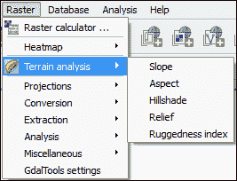

地形分析包括以下工具：

+   **坡度**：此工具计算每个单元格的坡度角度（基于一阶导数估计），单位为度

+   **坡向**：此工具计算坡向（逆时针度数，从北方的 0 度开始）

+   **阴影图**：此工具创建一个基本的阴影图栅格，包含光照区域和阴影

+   **地形图**：此工具创建一个具有不同高程范围不同颜色的阴影地形图

+   **崎岖度指数**：此工具通过总结 3 x 3 单元格网格内的海拔变化来计算每个单元格的崎岖度指数

当然，要使用这些地形分析工具之一，我们需要一个高程栅格。如果您手头没有，您可以从 [`dwtkns.com/srtm/`](http://dwtkns.com/srtm/) 或其他 SRTM 下载服务中简单地下载一个数据集。

### 注意

如果您想精确复制以下练习的结果，请获取名为 `srtm_05_01.zip` 的数据集，它覆盖了阿拉斯加的一小部分。

在所有地形分析工具中，**Z 因子**是一个重要元素。当 x/y 单位与 z（高程）单位不同时，会使用 z 因子。例如，如果我们尝试从 x/y 为度数、z 为米的高程数据创建地形图，结果的地形图看起来会极度夸张。z 因子的值如下：

+   如果 x/y 和 z 都在米或英尺中，请使用默认的 z 因子 1.0

+   如果 x/y 在度数中，而 z 在英尺中，请使用 z 因子 370,400

+   如果 x/y 在度数中，而 z 在米中，请使用 z 因子 111,120

由于 SRTM 栅格数据提供的是 WGS84 EPSG:4326，我们在练习中需要使用 **Z 因子** 111120。让我们创建一个地形图！该工具可以自动计算地形颜色范围；我们只需点击 **自动创建**，如图下所示。当然，我们仍然可以编辑高程范围的上下限以及颜色。

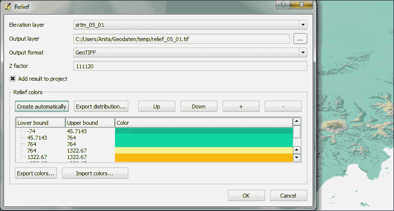

虽然地形图是三色栅格，主要用于可视化目的，但坡度栅格是空间分析工作流程中的常见中间步骤。我们现在将创建一个坡度栅格，我们可以在以下章节的示例工作流程中使用它。生成的坡度栅格将自动以灰度形式加载，如图下所示：

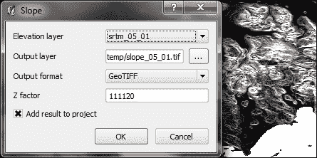

# 栅格计算器

通过访问 **栅格** | **栅格计算器**，我们可以根据当前 QGIS 项目中加载的一个或多个栅格中的值创建一个新的栅格图层。所有可用的栅格波段以列表形式显示在对话框的左上角，形式为 `raster_name@band_number`，如图下所示。

在我们之前的练习中，我们创建了一个坡度栅格，我们可以使用以下表达式找到海拔超过 1,000 米且坡度小于 5 度的区域（你可能需要根据你使用的数据集调整值）：

```py
srtm_05_01@1 > 1000 AND slope_05_01@1 < 5
```

满足高海拔和均匀性两个条件的单元格将在结果栅格中被赋予值 1，而未满足条件的单元格将被设置为 0。只有南部较大的区域具有值 1。

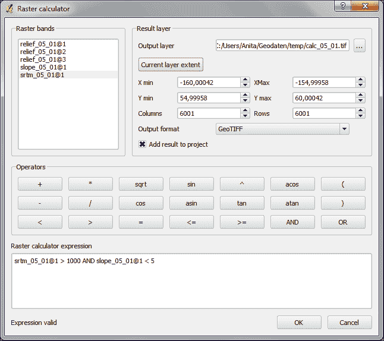

另一个典型用例是对栅格进行重新分类。例如，我们可能希望将样本数据中的土地覆盖栅格重新分类，使得所有土地覆盖类别从 1 到 5 的区域得到值 100，从 6 到 10 的区域得到值 101，而超过 11 的区域得到新的值 102。我们将使用以下代码来完成这项工作：

```py
( landcover@1 > 0 AND landcover@1 <= 6 ) * 100
+ ( landcover@1 >= 7 AND landcover@1 <= 10 ) * 101
+ ( landcover@1 >= 11 ) * 102
```

之前的栅格计算器表达式由三部分组成，包括一个检查和一个乘法。对于每个单元格，只有三个检查中的一个可以是真实的，真实用 1 表示。因此，如果一个土地覆盖单元格的值为 4，第一个检查将是真实的，表达式计算为`1*100 + 0*101 + 0*102 = 100`。

# 在栅格和矢量之间转换

在**栅格** | **转换**中提供了在栅格和矢量格式之间转换的工具，它们被称为**栅格化**和**多边形化**。与之前使用的栅格裁剪工具类似，这个工具也是基于 GDAL，并在对话框底部显示命令。

**多边形化**将栅格转换为多边形图层；根据栅格的大小，转换可能需要一些时间。当过程完成后，QGIS 将通过弹出窗口通知我们。例如，为了快速测试，我们可以将重新分类的土地覆盖栅格转换为多边形。结果矢量多边形图层包含多个具有单个属性`lc`的多边形要素，该属性取决于原始栅格值，如下面的屏幕截图所示：

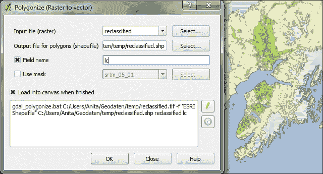

**栅格化**工具与**多边形化**工具非常相似。唯一的区别是我们可以指定结果栅格的像素/单元格大小。我们还可以指定属性字段，这将提供输入给栅格单元格值。我们`alaska.shp`数据集的**cat**属性相当没有意义，但你可以从下面的屏幕截图中了解工具的工作原理：

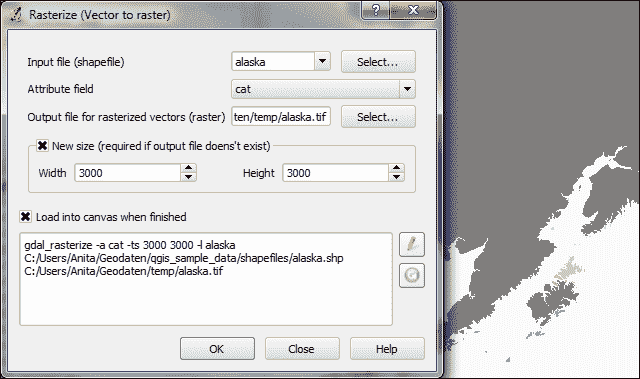

# 访问栅格和矢量图层统计信息

每当我们得到一个新的数据集时，检查图层统计信息以了解数据的感觉是有用的。栅格图层统计信息在**图层属性**对话框中很容易获得，特别是在以下标签页中：

+   **元数据**显示了最小和最大单元格值以及平均值和标准差

+   **直方图**展示了栅格值的分布

+   对于矢量图层，我们可以使用**矢量** | **分析工具**中的两个工具来获取摘要统计信息：

    +   **基本统计**对于数值字段非常有用。它计算诸如平均值和中位数、最小值和最大值、特征计数 *n* 以及唯一值的数量等参数，对于图层上的所有特征或仅对于选定的特征。

    +   **列出唯一值**有助于获取某个字段的全部唯一值。

在这两个工具中，我们可以轻松地使用 *Ctrl* + *C* 复制结果，并将它们粘贴到文本文件或电子表格中。以下屏幕截图展示了探索我们机场样本数据集内容的示例：

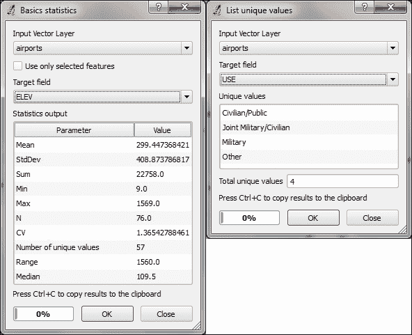

# 从点创建热力图

热力图非常适合可视化点的分布。要创建它们，QGIS 提供了一个简单易用的**热力图插件**，我们需在**插件管理器**中激活它，然后可以通过访问**栅格** | **热力图** | **热力图**来使用它。该插件提供了不同的核形状供选择，并允许我们控制栅格大小（以单元格为单位）以及单元格大小。**热力图插件**的外观如下所示：

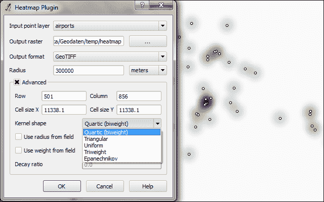

# 使用 Processing 进行矢量地理处理

最全面的空間分析工具集可通过 Processing 插件访问，我们也可以在**插件管理器**中启用它。当插件启用时，我们会发现一个**分析**菜单，其中我们可以激活工具箱，如下面的屏幕截图所示。在工具箱中，由于顶部动态搜索框的存在，很容易通过名称找到空间分析工具。这使得在工具箱中查找工具比在矢量或栅格菜单中更容易。习惯于 Processing 工具的另一个优点是，它们可以用 Python 和地理处理模型自动化。

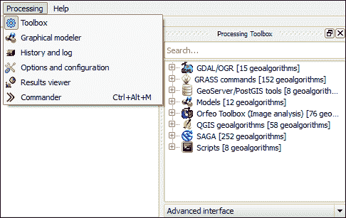

注意，前面的屏幕截图显示了工具箱的高级界面。您可以使用工具箱底部的下拉按钮从简化界面切换到高级界面。我更喜欢使用高级版本，因为它显示了所有可用的算法，并清楚地显示了各个工具如何与不同的组件（如 GDAL/OGR 或 GRASS）相关联。

在以下章节中，我们将介绍一些可用的地理处理工具，并查看我们如何使用模型器来自动化我们的任务。

## 识别其他特征附近的特征

一个常见的空间分析任务是识别某些其他特征附近的特征。一个例子就是找到所有靠近河流的机场。使用我们样本数据中的`airports.shp`和`majrivers.shp`，我们可以使用**固定距离缓冲区**和**按位置选择**工具的组合，在距离河流 5,000 英尺内的机场进行查找，如下面的屏幕截图所示：

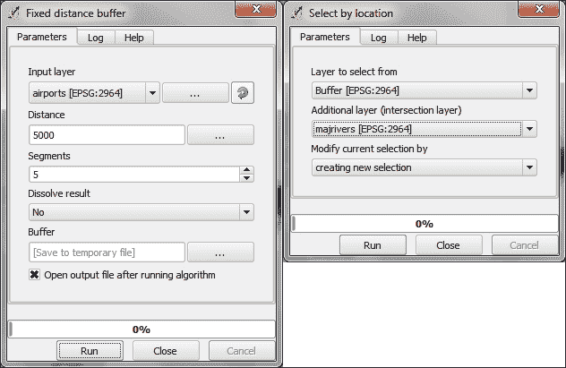

在缓冲机场点位置后，**按位置选择**选项选择与河流相交的所有机场缓冲区。结果，76 个机场中有 14 个被选中。此信息显示在 QGIS 主窗口底部的信息区域中，如下面的截图所示：

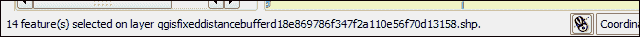

### 小贴士

如果你忘记了曾经使用的设置，或者需要检查是否使用了正确的输入图层，你可以转到**分析** | **历史和日志**。**算法**部分列出了我们运行的所有算法以及使用的设置。这也是查找**警告**部分错误消息的正确地方，如下面的截图所示：

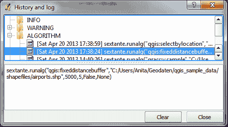

**算法**下列出的命令也可以通过转到**插件** **|** **Python 控制台**从 QGIS Python 控制台调用 Processing 工具。以下截图所示的 Python 命令运行了缓冲区算法并将结果加载到地图中：

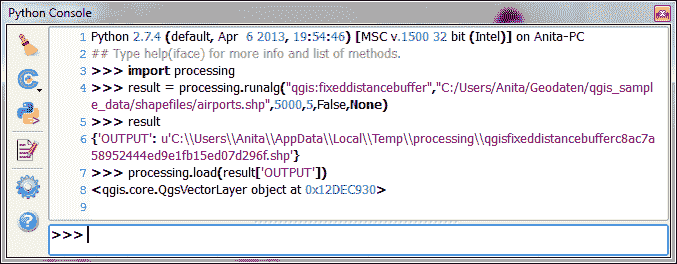

## 在点位置进行栅格采样

另一个常见任务是在特定点位置采样栅格。使用 Processing，我们可以通过一个名为 v.sample 的 GRASS 工具来解决这个问题。要使用 GRASS 工具，请确保 GRASS 已安装，并且 Processing 在**分析** | **选项和配置**中配置正确。在 OSGeo4W 默认系统上，配置将类似于以下截图：

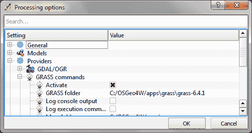

对于这个练习，让我们假设我们想要在我们的样本数据中采样机场位置的覆盖层。我们只需指定包含样本点的矢量图层和应采样的栅格图层。在这个例子中，我们可以将所有其他设置保留为默认值。该工具不仅会采样栅格，还会比较点属性与采样栅格值，但我们在当前示例中不需要这种比较。

对话框将类似于以下截图：

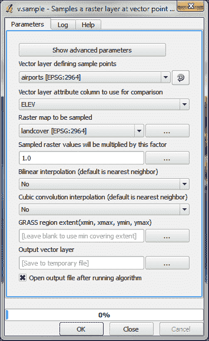

## 使用六边形网格映射密度

使用六边形网格映射点密度已成为创建热图的一种相当流行的替代方法。处理功能为我们提供了快速创建此类分析的方法。已经有一个预先制作的脚本称为**从图层边界创建六边形网格**，我们可以使用它首先创建一个覆盖输入图层中所有点的六边形网格。人口地点数据集`popp.shp`是本练习的一个很好的示例数据集。一旦网格准备就绪，我们可以运行**在多边形中计数点**来计算统计数据。如果你看不到结果图层，请转到**图层属性** | **常规**选项卡，并确保**CRS**字段设置为**NAD 27 / 阿拉斯加阿尔伯斯**。工具对话框将类似于以下截图：


## 在区域内计算面积份额

另一个我们经常遇到的空间分析任务是计算一定区域内的面积份额，例如，沿特定河流的植被份额。使用`majrivers.shp`和`trees.shp`，我们可以计算沿`Susitna 河`的 5,000 英尺土地带中林地份额。我们首先通过选择河流并对其进行缓冲来定义分析区域。请注意，**溶解结果**选项应设置为**是**，以确保缓冲结果是一个连续的多边形，如图所示。

### 注意

QGIS 处理功能只会将缓冲区应用于输入图层中选定的要素。这种默认行为可以在**分析** | **选项和配置**中通过禁用**仅使用选定要素**选项来更改。

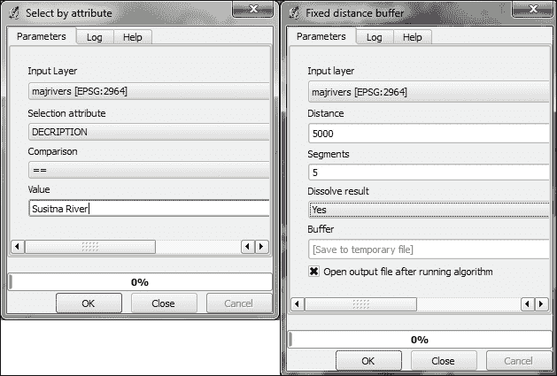

接下来，我们计算河流周围土地带的大小。这可以使用**导出/添加几何列**工具来完成，该工具将面积和参数添加到属性表中。然后我们可以计算河流沿线区域与`trees.shp`中的林地之间的**交集**字段，如图所示：

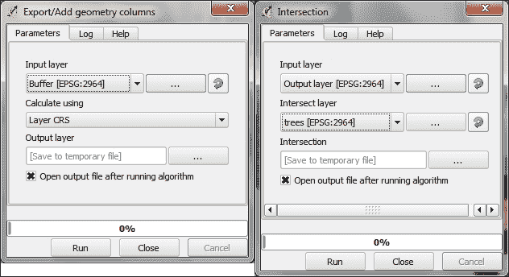

使用**溶解**工具，我们可以将交集中所有区域重新组合成一个大的多边形，代表河流周围的总体林地面积。最后，我们可以使用**高级 Python 字段计算器**来计算林地面积的最后份额。公式`value = $geom.area()/<area>`将最终多边形的面积(`$geom.area()`)除以“面积”属性中的值(`<area>`)，这是我们通过运行**导出/添加几何列**在之前步骤中创建的。工具将显示如下截图：

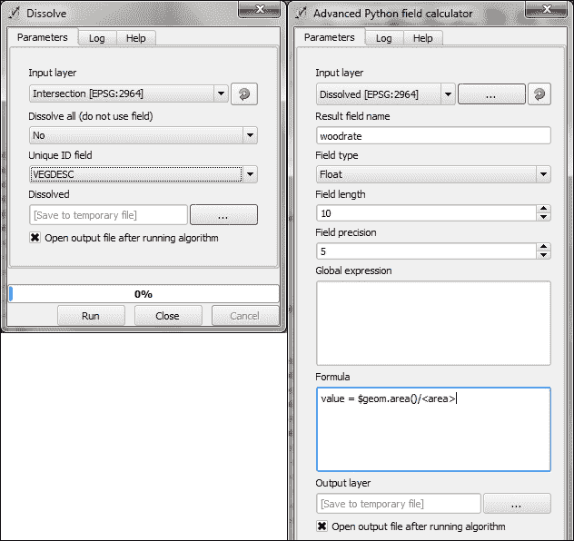

此计算结果为**落叶**树木的木材份额为 0.31601，**混合**树木为 0.09666。因此，我们可以得出结论，在`Susitna 河`沿岸，总共 41.27%的土地是林地。

# 使用图形模型器进行自动地理处理

使用图形模型器，我们可以将整个地理处理和分析工作流程转换为自动化模型。要创建模型，我们转到**分析** | **图形模型器**以打开模型器，在那里我们可以为我们的模型选择不同的**输入**和**算法**。

让我们创建一个自动化创建六边形热图的模型！通过双击**输入**列表中的**矢量图层**条目，我们可以为点图层添加一个输入字段。使用描述性参数名称是一个好主意，这样我们就可以识别模型中哪个输入是第一个，哪个是后来的。在适当的情况下，限制**形状类型**字段也是有用的。在我们的示例中，我们将输入限制为**点**。这将使处理能够预先过滤可用的图层，并只向我们展示正确类型的图层。我们需要第二个输入是一个**数字**字段，用于指定所需的六边形单元格大小。工具将类似于以下截图：


添加输入后，我们现在可以继续创建模型，通过组装算法。在**算法**部分，我们可以使用顶部的过滤器来缩小我们对正确算法的搜索范围。要将算法添加到模型中，我们只需双击算法列表中的条目。这会打开算法对话框，在那里我们必须指定输入和进一步的算法特定参数。

在我们的示例中，我们希望使用点矢量图层作为**输入**图层，并将数字输入**六边形单元格大小**作为**单元格大小**参数。我们可以通过下拉列表访问可用的输入。或者，也可以硬编码参数，如单元格大小。

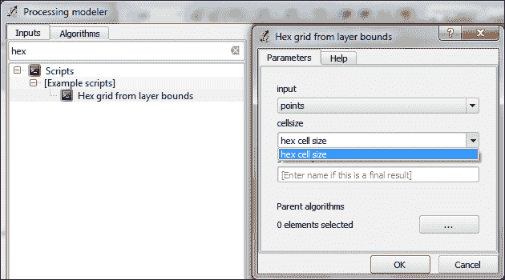

在添加以下算法时，根据前面的处理步骤始终选择正确的**输入**图层非常重要。我们可以使用模型器自动绘制的模型图中的箭头连接来验证正确的流程。工具将类似于以下截图：

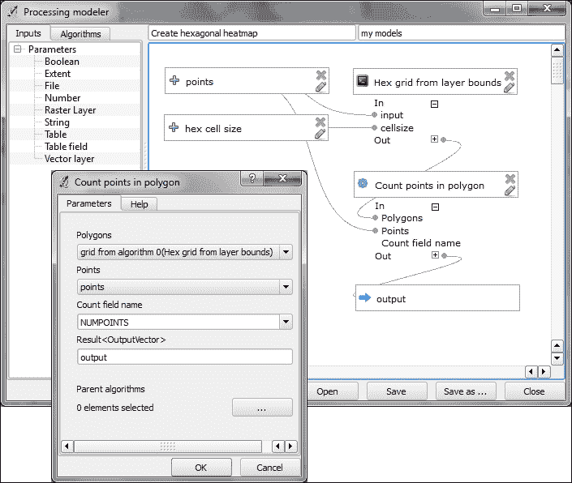

要完成模型，我们应该输入一个模型名称（例如，`创建六边形热图`）和一个组名称（例如，`我的模型`）。处理过程将使用组名称来组织我们创建的所有模型。一旦我们选择了名称和组，我们就可以保存模型并运行它。关闭模型器后，我们可以像使用任何其他工具一样从工具箱中运行保存的模型。甚至可以将一个模型作为另一个模型的构建块使用。

另一个有用的功能是，我们可以指定一个图层样式，该样式将自动应用于处理结果。此默认样式可以通过在工具箱中创建的模型的上下文菜单中的**编辑输出渲染样式**来设置，如下面的截图所示：

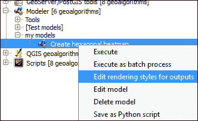

# 摘要

在本章中，我们介绍了各种栅格和矢量地理处理和分析工具，以及如何将它们应用于常见任务。我们看到了如何使用处理工具箱运行单个工具，以及如何使用模型器从多个工具创建复杂的地理处理模型。使用模型器，我们可以自动化我们的工作流程并提高我们的生产力，尤其是在处理重复性任务方面。

在下一章中，我们将学习如何将所有知识结合起来，使用高级样式和地图组合功能创建美丽的地图。
