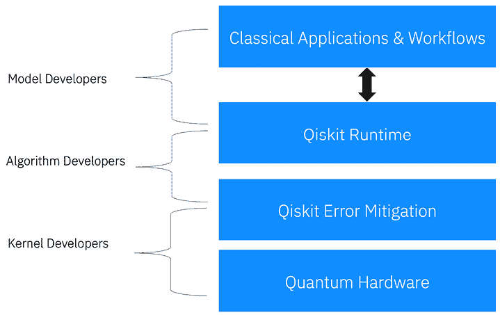
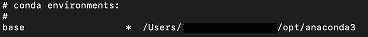
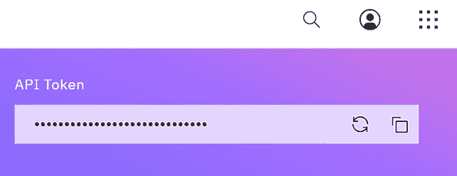
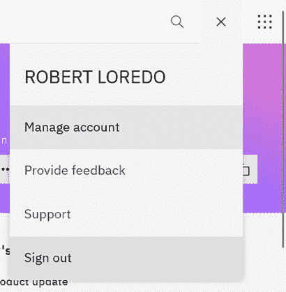
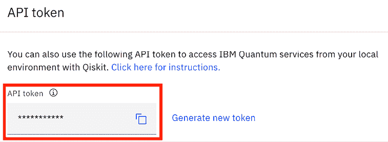
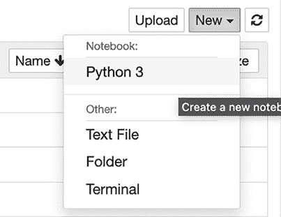

# 第三章：介绍和安装 Qiskit

在本章中，您将了解**量子信息科学套件**（**Qiskit**）及其高级功能，用于开发和管理各种量子算法、量子应用模块和噪声模型。Qiskit（发音为 kiss-kit）包含各种功能，可以帮助您轻松构建量子电路、算法和应用，并允许您在经典模拟器和真实量子系统上运行它们，并可视化结果。在本章中，您还将看到如何在您的本地机器上安装 Qiskit 以创建量子电路并在量子计算机上运行它们的说明。

本章还将讨论如何为开源社区和未来量子应用的开发做出贡献，以及如何通过**Qiskit 社区**连接到其他志同道合的开发者和爱好者。

本章将涵盖以下主题：

+   理解量子与经典系统互连

+   理解 Qiskit API

+   在您的本地机器上安装和配置 Qiskit

+   从 Qiskit 社区获取支持

# 技术要求

推荐了解 GitHub，因为我们将在本章中回顾如何为托管在 GitHub 上的 Qiskit 开源项目做出贡献。推荐采用**敏捷**和**开源开发**实践，但不是必需的。以下是本书中使用的源代码：[`github.com/PacktPublishing/Learning-Quantum-Computing-with-Python-and-IBM-Quantum-Second-Edition`](https://github.com/PacktPublishing/Learning-Quantum-Computing-with-Python-and-IBM-Quantum-Second-Edition)。

# 理解量子与经典系统互连

在本节中，我们将回顾量子计算系统如何与经典系统集成。由于量子计算机没有存储量子比特状态的方法，因此需要依赖经典系统为发送到或从量子计算机接收的信息提供持久存储。

由于大多数数据源自经典来源，无论是来自数据存储库还是远程传感器，因此需要准备数据以便在量子系统中使用。同样，量子系统的结果需要以二进制形式返回，而不是量子状态，以便它们可以被读取回经典系统进行任何所需的后期处理。

本节将回顾经典系统和量子系统之间的这种混合或互连性，以便您了解这两个系统如何协同工作以提供最优化结果。Qiskit Runtime，这是 2022 年初引入的新功能，有一些很好的示例您可以尝试。有许多论文描述了其他形式集成经典和量子资源的方法，例如这篇论文，*用于量子计算的 Serverless 云集成*：[`arxiv.org/abs/2107.02007`](https://arxiv.org/abs/2107.02007)。

## 查看 Qiskit 库

如果您已经学习了前面的一些章节，那么您就会注意到我们使用了 Qiskit 来创建示例电路，我们用这些电路来描述一些量子概念。作为 Python 开发者，您也会注意到 Qiskit 在功能上与使用任何其他 Python 库（如**NumPy**、**scikit-learn**等）并无不同。我们在 Python 笔记本中使用它的方式也与使用任何其他包相同，我们可以导入整个包或仅导入类和函数的子集。通过在 Python 中提供 Qiskit 模块，这使得我们能够将经典算法和应用集成到量子系统中。利用 Qiskit 中的库创建在经典开发环境（如 Python）上执行的量子电路，使得与现有经典应用的集成非常顺畅且简单。

Qiskit 与其他大多数开源项目一样，设置起来非常简单，无论是作为 Python 的包，还是如果您只是作为贡献者，作为分支或分叉。它非常紧凑，在本地机器上运行时对资源的需求不大。

将其创建为现有平台（如 Python）的包的另一个优点是无需安装单独的集成开发环境或设置复杂的构建系统，这些系统具有令人困惑的依赖关系。对于那些已经安装了当前支持版本的 Python 的用户，您可以使用简单的`pip`命令安装 Qiskit：

```py
pip install qiskit 
```

但我们不要过于急躁。现在我们已经了解了 Qiskit 的目的和其一般功能，我们将通过首先了解其组织结构来逐步安装 Qiskit。然后，我们将介绍它是如何与您的经典系统（如笔记本电脑、服务器或云应用）交互的。

## 理解如何组织和与 Qiskit 交互

如果您的大部分开发工作都是使用 Python，根据这本书的标题，我假设您确实如此，那么您会理解大多数包都是以某种形式创建的层次结构。在最高级别，有应用模块，而较低级别则指每个模块内的组件。

Qiskit 有诸如类或对象之类的组件，在每个组件下，您都有函数和成员。在组织方式上，Qiskit 与其他大多数包并无不同，这使得找到某些功能变得非常容易。

在基础层，您有硬件连接器；这些是连接 Qiskit 到各种量子提供商的东西。除了硬件连接器之外，还有经典模拟器；在这本书中，我们将使用 Qiskit Runtime 服务来运行我们的电路，这包括一些本地安装的 Qiskit 模拟器。当然，由于这些模拟器在经典系统上运行，它们在模拟量子电路的资源数量上是有限的。随着量子电路变得更加复杂，资源成本增长相当快。这一点已在各种出版物中得到强调，其中某些复杂的量子电路可以在经典系统上模拟；然而，各种经典结果之间的准确性存在差异。这就是为什么拥有可供运行复杂电路的硬件连接器很重要，因为它允许您将复杂电路从经典模拟器卸载到运行在实用规模的真正量子系统。您可能会问自己，“什么使电路变得复杂？”好吧，我可以这样说，这并不涉及关系状态。这更多关于电路的宽度，它与量子比特的数量相关，以及电路的深度，这与操作的深度相关，尤其是将两个或更多量子比特纠缠在一起的多量子比特门的数量。随着您在本书中的进展，我们将更详细地介绍这些细节。

在连接器和模拟器之上，是研究人员和开发者所依赖的基本构建块，即 Qiskit Runtime。我们将在后续章节中更深入地探讨 Qiskit Runtime 是什么，但在此阶段，只需将其视为一个提供大量功能以创建、运行和优化您的量子电路的运行时。

在 Qiskit 的先前版本中，模块的设置使得每个算法的领域分布较广：我的意思是，这些模块涵盖了纠错、模拟器、门和电路组件以及应用。在这种情况下，算法开发者必须学习如何将多个模块结合在一起，因此开发者必须理解基础层面的各种组件和模块，以便将它们集成到他们的应用中。自从引入 Qiskit 的最新代码更改后，这种情况已经发生了变化。

首先，我们需要介绍三个开发层或部分，这些层允许开发者相互提供模块以帮助创建量子应用。这三个层与经典应用开发没有太大区别，使得经典开发者可以专注于自己的层，从而消除了完全理解另一层发生的必要。让我们快速看一下这三个开发层。

+   **内核**开发者是在三个层次中开发代码的人。他们主要工作于创建量子电路、门组合、硬件脉冲级控制和其他接近硬件的功能。Qiskit Terra 是内核开发者将与之合作的模块，其中包括电路库，使他们能够创建新电路或使用现有电路。

+   **算法**开发者是利用内核开发者创建的电路来创建量子算法的人。这些算法可以提供将经典数据编码成量子状态的方法。例如，像素的信息可以表示为一个量子状态，其中量子比特将代表图像中每个像素的位置和颜色值。他们还可以创建一个不需要编码任何经典数据的量子算法。算法开发者还可以包括一些最新的 Qiskit 特性，如 Qiskit Runtime，以提供基础设施优化，从而使经典和量子系统的集成更加稳健。

+   **模型**开发者是将算法应用于创建解决现实世界问题的应用程序的人。这些模型开发者可以是领域或行业专家，他们了解经典系统可能难以处理的问题，并确定如何将这些量子算法应用于这些问题。通过为某些问题创建模型，模型开发者可以提供一个量子应用程序，例如，可以作为大型工作流程的一部分或作为服务提供商，经典应用程序可以根据需要调用。

这三个层次共同工作，使开发者能够专注于其层内开发组件，这些组件可以为其他人提供他们需要增强应用程序的工具。这也促进了开发者之间的协作，因为他们可以相互提供反馈，以进一步优化他们的组件。

下面的图示说明了层以及 Qiskit 库或组件通常适用于每种开发者类型。



图 3.1：内核、算法和模型开发者层次

当然，前面的信息是基于 Qiskit 当前版本的。在未来，像许多项目一样，这可能会改变。我强烈建议您保持与当前**应用程序编程接口**（**API**）文档的最新同步，以确保在编写代码时使用正确的调用。此 API 可以在 Qiskit 文档页面上找到，网址为[`www.qiskit.org/documentation/`](https://www.qiskit.org/documentation/)。

文档页面提供了有关四个可用模块的最新信息，通常由于它们的名称而被称为元素，如本章开头所述。

到目前为止，我们已经定义了三个不同的开发层次，这些层次有助于简化开发者跳入编程量子应用的过程，而无需过多的学习曲线。例如，一个模型开发者可能只需要了解量子算法是如何工作的，以便为经典应用创建一个模型，而不是还需要学习创建算法所使用的哪些门。

以下部分将描述 API 参考，以便您了解如何在代码中利用它们。开发的具体细节将在未来的章节中介绍，我们将讨论每个 API 可以提供的功能和操作。

# 理解 Qiskit API

Qiskit 是为任何想在各个层次和领域与量子计算机一起工作的人而构建的。通过这种方式，我们是指，如果量子研究人员想研究量子设备上脉冲的安排方式，他们可以非常容易地做到这一点。同样，对于只想将他们的应用程序扩展以利用量子计算机来计算信息的人来说也是如此。

在本节中，我们将了解 Qiskit 当今可用的各种 API。如前所述，Qiskit 拥有多种层次，任何领域的专家都可以利用这些层次开始在其应用中使用量子计算。

以化学研究人员为例，他们希望计算两个分子的能量状态，但不想费心学习量子门和脉冲。他们只想将他们的数据集经典地加载到量子算法中，并透明地获得结果。Qiskit 被构建为一个全栈开源软件包，以促进这些以及其他更多用户场景的应用模块。

量子物理学家可以通过研究如何安排脉冲到单比特和多比特硬件级别进行实验。量子研究人员可以致力于开发量子电路，以最小化噪声，这将优化您的量子电路的结果。

算法研究人员和开发者通常致力于创建量子算法，这些算法可以被各个领域和行业使用，要么更快地解决问题，要么提供更准确的结果。

最后，领域研究人员，如化学家、数据科学家、经济学家以及许多人，可以将他们的经典应用集成到量子系统中，利用各种功能，如 Qiskit Runtime，以更优化或更准确地计算复杂问题。

在撰写本文时，Qiskit 已经发布了其最新版本，Qiskit 1.0。这个新版本为您提供了许多出色的功能，将把您的开发技能提升到新的水平。尤其是针对量子实用性的新时代！

让我们从了解 Qiskit 中可用的内置模拟器开始。模拟器非常适合入门，但随着你的开发技能和对量子计算的深入理解，你对运行更复杂电路的需求也会增加，而经典模拟器，如本文中描述的，可能存在一些限制。

## Aer

在深入了解 Aer 之前，我们首先确保已经安装了它，因为 Aer 已经迁移到其独立的组件中，并且当开始运行一些模拟时，将其安装到你的系统中是有意义的，因为它现在是你计划在经典系统上运行本地模拟的必要条件。只需从你的命令行或 Python 环境中运行 `pip install qiskit-aer` 即可，这样应该就足够了。Aer 提供了一个框架，可用于开发调试工具和创建噪声模型。这些工具通过模拟影响不仅仅是量子比特，还包括环境和计算的噪声，从而帮助复制量子系统的大量特性。在 Aer 中通常有五种高度高效的编译**模拟器类别**可用；它们是：

+   **AerProvider**，包含所有模拟器的主要类

+   **QasmSimulator**，一个允许进行模拟方法和选项的量子模拟器

+   **StatevectorSimulator**，一个理想的量子状态矢量模拟器，用于从你的电路中产生无噪声的结果

+   **UnitarySimulator**，一个理想的量子单位算子模拟器

+   **Pulse**，一个用于生成和调度脉冲操作的模拟器

注意，关于**Pulse**是否将在不久的将来被移除存在讨论。它被包含在这里是为了完整性，但它可能并不总是可用。因此，我们不会在本章中进一步探讨 Pulse。

我们将在接下来的章节中查看每个模拟器类别之间的差异，并在第九章“模拟量子系统和噪声模型”中，你将了解每个类别中特定的模拟器，包括 Aer 中的那些模拟器。 

### Aer 模拟器

Aer 本身也是一个类别，其中包含其自己的模拟器列表，这些模拟器专门用于获取有关量子电路的特定信息，例如密度矩阵、矩阵乘积状态和多稳定器模拟器。这个模拟器是主要的模拟器，用于再现实际后端系统可能的行为，并包括一个 `options` 对象，该对象可用于提供如密度矩阵等参数，以再现量子系统中通常发现的噪声。

### Qasm 模拟器

**Qasm**模拟器允许我们在干净和有噪声的模拟环境中运行我们的电路。两者之间的区别是您希望应用到模拟器中的噪声量。一方面，它可以作为一个无错误的理想系统运行，您可以使用它来确认电路的计算结果。另一方面，您可以通过包含噪声模型的模拟器运行您的电路，以便您可以复制噪声并了解它如何影响您的计算。我们将在第十章*理解和缓解量子噪声*中了解更多关于噪声和噪声模型的内容。

Qasm 模拟器还具有多功能能力和模拟电路的方法，例如`statevector`、`density_matrix`、`stabilizer`、`matrix_product_state`等。通过允许您使用这些方法中的任何一种来配置 Qasm 模拟器，您可以期望从测量的电路中获得理想的结果，以及您希望结合的任何模型。

Qasm 模拟器还提供了一组后端选项，您可以使用这些选项来执行您的量子电路。这些选项包括设置阈值值以截断结果或设置浮点精度值和执行电路的最大值约束。这些功能使 Aer 成为那些希望开发理想或复制的有噪声系统的理想组件。通常，研究人员使用 Aer 来开发噪声缓解或错误校正技术。

### 状态向量模拟器

**状态向量**模拟器，正如其名称所暗示的，是一个状态向量模拟器，它提供电路的最终状态向量，而不包括最后的测量操作。

可以通过利用量子状态的多种可视化工具来可视化状态向量模拟器的结果，例如**直方图**和**城市景观**。**城市景观**选项提供了一个关于密度矩阵的实部和虚部的 3D 视图（）。其他可视化图包括**Hinton**图、**Pauli 向量**图和**Bloch 球**等。其中一些，如 Bloch 球、qsphere 和其他可视化工具将在未来的章节中介绍，因为它们将帮助您可视化门对量子比特产生的一些效果。

### 单元模拟器

**单元**模拟器非常简单，就是那样——它通过计算电路的整体矩阵来提供电路的单元矩阵结果。其理念是，一个仅由单元算子/门组成、每个门操作量子比特子集的电路可以表示为一个单一的单元算子。这可以通过将电路中所有算子矩阵相乘来实现，从而得到一个单一的总体矩阵/算子。

这对于您想要确认对量子比特应用的操作与您的预期计算相匹配非常有帮助。

当您开始处理具有许多算子的多个量子位时，您可以想象这将多么有帮助。单元模拟器有助于提供状态信息，以确保结果符合您的预期。

# 在您的本地机器上安装和配置 Qiskit

在本节中，我们将向您介绍 Qiskit 的安装过程。需要注意的是，为了完成本书中的示例，您需要在您的机器上本地安装 Qiskit，因为 IBM 量子平台不再有实验室，也没有任何云上运行的电路模拟器，只有实际的量子系统，您将只能有限地访问。安装将包括安装 Anaconda，这是许多 Qiskit 开发者用来安装 Python、Jupyter Notebooks、Qiskit 以及许多其他数据科学包的工具。它还提供了一种简单的方式来管理包以及它们在本地机器上的安装。在我们的案例中，它将帮助我们安装我们将需要的预包装依赖项，例如 Python、Jupyter Notebooks、`pip` 以及许多其他。

安装完成后，您可以创建一个包含所有依赖项和功能的特定于量子开发的虚拟环境。通过本地安装，您可以从本地系统运行电路到本地设备上的模拟器。

## 准备安装

Qiskit 是一个开源项目，对所有人免费提供。它遵循 **Apache 2.0** 许可协议 ([`apache.org/licenses/LICENSE-2.0`](https://apache.org/licenses/LICENSE-2.0))。每个 Qiskit 模块（例如，[`www.github.com/Qiskit/qiskit/blob/master/LICENSE.txt`](https://www.github.com/Qiskit/qiskit/blob/master/LICENSE.txt)）中也包含了一份副本。这允许您使用源代码，以及根据许可证定义的所有权利和特权。

Qiskit 的安装相当简单，尤其是如果你已经熟悉名为 **pip** 的包管理应用。要查看 Qiskit 元数据包信息，例如其当前稳定版本、构建状态和其他细节，请访问 [`pypi.org/project/qiskit`](https://pypi.org/project/qiskit)。

我们已经强调，您应该安装完整版本，因为迷你版本存在一些问题。当然，您可以尝试安装任意一个版本，但如果迷你版本出现问题，建议您安装完整版本。

## 安装 Anaconda

Anaconda ([`www.anaconda.com/distribution`](https://www.anaconda.com/distribution)) 是一个开源的跨平台 Python 发行版。它允许用户创建独立的虚拟环境，以便他们可以安装多个 Python 版本。这对你们这些已经在机器上安装了 Python 版本的 Python 开发者来说非常有用。

通过使用 Anaconda 创建一个单独的环境，你可以消除由于安装不同版本的 Python 可能引起的问题，这可能会影响你的现有 Python 项目或应用程序。拥有单独的环境还使你能够拥有多个版本的 Qiskit。在你安装更新时，你需要有一个正在运行的 Qiskit 版本，以便你可以测试你的量子应用程序是否支持最新的发布，而不用担心依赖性问题。

*建议遵循 Anaconda 网站上的安装说明*。Anaconda 的安装步骤还包括 Jupyter Notebook 的版本，这很有用，因为 Qiskit 笔记本将不会在本地可用。然而，由于 Qiskit 笔记本是基于 Jupyter Notebook 构建的，你不应该期望两者之间有太大的区别。

在使用支持的 Python 版本安装 Anaconda（在撰写本文时，当前支持的版本是 3.9）后，务必在你的安装中创建一个环境，并在继续安装 Qiskit 之前切换到该环境。否则，它将安装在你的基础环境中。在成功完成安装并创建你的 Anaconda 环境后，你现在就可以安装 Qiskit 了！

## 安装 Qiskit

在安装 Qiskit 之前，务必检查安装页面([`docs.quantum.ibm.com/start/install`](https://docs.quantum.ibm.com/start/install))，查看有关安装或配置步骤的任何更新，因为事情可能会发生变化。以下步骤将引导你完成安装过程：

1.  我们首先确保你处于你创建的环境中。确定这一点最好的方法是启动你的命令行并输入以下内容：

    ```py
    conda info --envs 
    ```

前面的代码将列出你系统上的所有环境。你会看到一个标题为`base`的，另一个是你创建的环境的名称。当前环境通过一个星号标识，如下面的截图所示：



图 3.2：当前环境命令的输出

如前一个截图所示，识别环境的一种方法是查看机器名之前命令行最左侧的内容。在那里，括号内显示的是当前环境。在前一个截图中，我创建了一个名为`QiskitEnv`的环境。现在，让我们在命令行中运行以下命令来激活环境，以便我们可以启用它并开始安装过程：

```py
conda activate QiskitEnv 
```

这将现在激活你的机器上的环境。

对于详细信息，我建议查看这里关于如何开始使用`conda`的文档：[`docs.conda.io/projects/conda/en/latest/user-guide/getting-started.html`](https://docs.conda.io/projects/conda/en/latest/user-guide/getting-started.html)。

1.  在上一步激活 Qiskit 环境后，您现在可以运行 `pip` 命令来安装 Qiskit：

    ```py
    >pip install qiskit 
    ```

根据您的机器和网络速度，这可能需要几分钟时间。

1.  完成后，您可以通过在命令行中输入以下内容来验证安装：

    ```py
    >pip list | grep qiskit 
    ```

这将列出已安装的 Qiskit 包及其相应的版本，您应该看到包括所有各种 Qiskit 库。要查看可选包的最新列表，请访问 Qiskit 元数据包信息页面 [`pypi.org/project/qiskit`](https://pypi.org/project/qiskit)。

到此为止，您已经安装并验证了 Qiskit 已安装在本地的设备上。现在，您可以启动一个 Jupyter Notebook 并开始使用 Qiskit！

*等等！不要这么快*。在我们开始编码和运行电路之前，还有一些步骤需要介绍。我们想确保您的本地机器已配置好。首先，您需要确保您的 **令牌 ID** 已保存在本地设备上。这样，当您准备好在真实设备或云上的模拟器上运行实验时，您可以非常容易地做到这一点。

## 配置您的本地 Qiskit 环境

接下来，我们需要安装一些新功能，以利用最新的构建块和可视化包。IBM 运行时包和可选的可视化包将允许您在量子系统上高效地运行电路，并分别可视化您的电路结果。后续步骤包括将您的账户信息保存到您的本地机器上，这将用于连接和使用 IBM 量子系统。

启动并运行所需的步骤如下。注意对于 **Mac** 用户，括号中的字符串，在本例中为 `visualization`，需要用单引号括起来（即 `'visualization'`）——否则您将得到一个错误：

1.  打开您的终端并运行以下每个命令：

    ```py
    pip install qiskit-ibm-runtime
    pip install qiskit[visualization] 
    ```

安装完成后，您可以继续下一步，即在您的本地机器上设置账户信息，通过复制您的账户 API 令牌。

1.  您可以从两个地方获取您的 API 令牌；第一个是从 IBM 量子平台页面上的仪表板 ([`quantum.ibm.com`](https://quantum.ibm.com))，如图所示：



图 3.3：仪表板上的 API 令牌

1.  获取您的 API 令牌的第二种方式是通过 **管理账户** 页面。要转到您的账户页面，只需点击页面右上角的头像，然后从下拉列表中选择 **管理账户**，如图所示：



图 3.4：管理账户页面上的 API 令牌

1.  账户页面打开后，点击位于 **API 令牌** 字段右侧的 **复制令牌** 图标，如图所示：



图 3.5：复制您的账户 API 令牌

现在您已经复制了您的**API 令牌**，让我们将其保存在您的本地机器上。

1.  通过在命令行中输入以下内容来启动**Jupyter Notebook**：

    ```py
    jupyter notebook 
    ```

1.  由于我们是在本地启动，这里没有创建新笔记本的启动器，因此我们必须自己创建一个。现在让我们通过点击 Jupyter Notebook 右上角的**新建** | **Python 3**来完成，如图所示：



图 3.6：创建新的 Python 3 笔记本

这将创建一个新的 Python 3 笔记本。请注意，这创建了一个空白笔记本，因此我们也没有导入大量常用类和函数的漂亮模板单元格。我们将不得不根据需要导入它们，或者您也可以直接从包含模板单元格的先前创建的笔记本中复制/粘贴模板代码。在以下内容中，我们将根据需要添加类和函数。

1.  一旦启动，请将以下内容输入到第一个单元格中。您还希望这样做“`setup_save_account.ipynb`"文件，该文件包含您可访问的代码示例。此文件将在早期章节中导入和使用，以便请确保您也更新那里的 API 令牌信息；否则，在运行示例代码时您将看到错误：

    ```py
    from qiskit_ibm_runtime import QiskitRuntimeService
    # Save your IBM Quantum account to allow you to use systems:
    QiskitRuntimeService.save_account(channel="ibm_quantum", token='PASTE-API-TOKEN-HERE', set_as_default=True) 
    ```

    请确保在参数周围包含单引号(`'` `'`)，否则您可能会收到错误。

现在我们已经将 API 令牌保存在本地，除非我们删除或更改 API 令牌值，否则我们不需要再次将其保存在本地系统中。请记住，按照前面的命令复制您的令牌。

**重要提示**

注意，您只需运行此命令一次。如果不幸忘记并再次运行上述功能，您可能会收到警告。您可以在 Qiskit API 文档中找到其他账户设置命令：[`docs.quantum-computing.ibm.com/start/setup-channel#select-and-set-up-an-ibm-quantum-channel`](https://docs.quantum-computing.ibm.com/start/setup-channel#select-and-set-up-an-ibm-quantum-channel)。

恭喜！您已成功配置了您的本地 Qiskit 版本！

您现在可以在系统上本地运行电路。当您无法获得网络访问时，现在可以在模拟器上本地创建和执行电路。当然，一旦您重新上线，您可以使用本地版本在真实设备上执行电路。这也允许您轻松地将自己的应用程序或系统集成。通过能够在本地运行代码，您可以轻松地将新代码集成到自己的本地应用程序中。

在本节中，你学习了如何安装 Anaconda，它包括安装 Qiskit 所需的许多依赖项；如何创建量子电路；如何在模拟器上执行电路；以及如何在量子计算机上执行电路。现在，我们将学习如何贡献、协作，并从 Qiskit 全球社区获得支持。

# 从 Qiskit 社区获得支持

Qiskit 社区是一个全球性的开发者、研究人员和几乎所有对量子计算感兴趣的人组成的群体，他们聚集在一起，协作并相互支持，以帮助所有社区成员构建知识。它还用于让每个人都能了解量子研究、教育、活动和更新的最新动态：[`www.ibm.com/quantum/events`](https://www.ibm.com/quantum/events)。最近新增的功能是可以通过**Qiskit 开发者认证**考试获得 Qiskit 开发者认证。目前有一个基于 Qiskit 1.x 版本的更新课程将在 2024 年晚些时候推出。

在本节中，你将了解社区、其众多项目以及你如何贡献并成为**Qiskit 活动家**([`www.ibm.com/quantum/community#advocates`](https://www.ibm.com/quantum/community#advocates))。Qiskit 活动家是 Qiskit 社区的成员，他们已经通过了一项严格的考试，对 Qiskit 社区做出了许多贡献，并在旅途中帮助了许多其他人。让我们首先向你介绍社区本身。

## 介绍 Qiskit 社区

自从 Qiskit 首次作为开源项目部署以来，开源社区已经贡献了许多功能和改进，它随着时间的推移而不断改进。本身的发展生态系统已经繁荣发展，以至于它被用于世界各地的大学、工业和政府，甚至在南极洲！

Qiskit 社区的成员，通常被称为**Qiskitters**，通常作为一个稳固的多元化团队一起工作，以确保每个人都得到支持。无论是量子计算的新手还是经验丰富的量子研究人员，他们都对在各种项目上进行协作和连接有着共同的热情。有关 Qiskit 和社区的信息链接可以在 [`www.ibm.com/quantum/qiskit`](https://www.ibm.com/quantum/qiskit) 找到，在那里你可以在页面顶部和底部找到各种教程链接，以及如何加入 Qiskit 社区和成为世界上最大的量子生态系统的一部分。

早期的一个项目是为那些刚开始接触量子计算的人创建资源。这些资源包括从生成启用材料到**YouTube**视频系列。这些主题涵盖了硬件和软件，描述了后端发生的事情，以及描述其他人正在进行的新的研究。除了资源之外，还有在世界各地任何给定时间都计划举行的活动。这包括研讨会等活动，社区成员可以亲自或虚拟地参加，以了解量子计算的最新进展。

其他活动还包括**黑客马拉松**和编码营，其中最大的活动是**Qiskit Camp**，IBM 量子团队在每个季度在世界不同大陆举办。为期 3 到 4 天的营通常包括在非常异国他乡的住宿、餐食、机场往返交通等。来自**IBM 研究**的研究人员也作为讲师、教练和评委参与。团队被创建出来，在周末共同构思项目想法，他们一起工作，竞争并赢得奖品。这非常类似于黑客马拉松。

最近，Qiskit 社区启动了**Qiskit 倡导者计划**。该计划旨在为那些积极参与 Qiskit 社区并在一段时间内做出贡献的个人提供支持。要成为 Qiskit 倡导者，您需要在线申请([`www.ibm.com/quantum/community#advocates`](https://www.ibm.com/quantum/community#advocates))，在那里您将接受考试以测试您对 Qiskit 的了解，并至少指定三个社区贡献。当然，这些资格可能会随时间而变化，因此建议您检查网站以获取任何更新和申请截止日期。

一旦被接受加入 Qiskit 倡导者计划，您将有机会与其他专家建立联系，并访问 Qiskit 开发团队的核心成员。您还将通过 Qiskit 社区从 IBM 获得支持和认可，并收到参加 Qiskit 暑期学校、研讨会和其他重大活动的邀请，在这些活动中，您不仅可以与其他人合作，还可以担任领导或导师。

## 为 Qiskit 社区做出贡献

成员间的支持至关重要，不仅对于 Qiskit 倡导者，对于所有成员也是如此。Qiskit 社区已经建立了各种渠道，为社区的所有成员提供支持。他们有一个非常活跃的**Slack 工作空间**([`qisk.it/join-slack`](https://qisk.it/join-slack))，拥有多个频道，成员可以提问、发布活动更新，或者只是讨论最近发表的量子研究。还有其他 Qiskit 通过的合作资源。当前的合作工具列表可以在主要量子社区页面上找到：[`www.ibm.com/quantum/community`](https://www.ibm.com/quantum/community)。

### 在 Qiskit 社区中专业化你的技能集

关于为 Qiskit 社区做出贡献，尤其是那些有兴趣成为 Qiskit 拥趸的人提出的最常见问题之一是，*你可以通过哪些不同的方式做出贡献？* 你可以通过许多方式为 Qiskit 社区做出贡献。理想情况下，你希望熟悉不同的贡献形式，如下所示：

+   **代码贡献**：如果你是开发者，添加新功能、优化函数性能和修复错误是一些好的开始方式。如果你是编程新手，Qiskit 开发团队为此创建了一个标签，称为 **good first issue**。这是一个涵盖对新代码库新手理想的议题的通用术语。

+   **在你的地区或虚拟举办 Qiskit 活动**：你可以举办活动并邀请 Qiskit 拥趸进行研讨会或与一群人讨论 Qiskit 的最新更新。

+   **帮助他人**：你可以通过回答其他社区成员提出的问题、报告错误、识别可能增强电路开发的功能等方式来帮助他人。

在噪声缓解、错误纠正或算法设计等领域专业化是社区的一个优势。**Qiskit Slack 社区**有几个专注于量子计算特定领域的频道：量子系统、IBM Quantum 平台、Qiskit Runtime、量子算法和应用、Qiskit 在 Raspberry Pi 上，等等。如果你在这些领域中的任何一个领域专业化，你可以加入 Slack 群组，并在许多技术和主题上进行合作。

在本节中，你了解了开源贡献流程以及如何找到适合初学者和专家的任务，以便每个人都能做出贡献。

# 摘要

在本章中，你了解了 Qiskit 提供的通用功能和特性，以便你可以创建高效的量子算法。然后，你学习了如何在本地安装 Qiskit，以及如何为 Qiskit 社区做出贡献并寻求支持。

我们更多地了解了 Qiskit 以及它在开发堆栈中的位置，并概述了 Qiskit 库中提供的应用模块和模拟器。这为你提供了创建电路的一般技能和功能，然后你可以使用这些电路通过门和算子对量子比特应用各种操作。

然后，我们学习了 Aer，它允许我们创建更好的模拟器，以及如何在本地和 IBM Quantum 平台上执行它们。

你学习了如何在你的平台上使用 Anaconda 安装你自己的 Qiskit 版本。最后，我们了解了 Qiskit 社区及其对所有人，尤其是那些对量子计算新手需要一点支持以理解一些具有挑战性的内容或找到合作者以拓宽视野的人的优势。

现在，你已经拥有了在本地机器上安装和配置 Qiskit 的技能，以便在离线模式下创建和执行量子电路。

在下一章中，我们将开始深入了解量子计算的基本原理，以便我们学习如何创建和执行量子电路。

# 提问

1.  用你自己的话描述内核开发者和应用程序开发者之间的区别。

1.  如果你想要获取电路的单位矩阵，哪个模拟器会提供单位矩阵的结果？

1.  请用你自己的话命名并描述 Aer 提供的五个模拟器类别。

1.  你需要导入哪个模块来绘制直方图？

# 加入我们的 Discord 社区

加入我们社区的 Discord 空间，与作者和其他读者进行讨论：

`packt.link/3FyN1`


