# 第四章：理解基本量子计算原理

量子计算，尤其是其算法，利用了三个量子计算原理，即**叠加**、**纠缠**和**干涉**。在本章中，我们将回顾这些原理，以便我们了解它们各自提供的内容，它们对每个量子比特的影响，以及如何使用我们提供的量子门集来表示它们。在**IBM 量子平台**上运行的量子计算机利用各种量子门，其中一些你在本书的前面部分已经使用过。

本章将涵盖以下主题：

+   介绍量子计算

+   理解叠加

+   理解纠缠

+   理解干涉

+   探索贝尔态

# 技术要求

在本章中，建议你具备一些物理学的一般知识；然而，我的目标是让解释帮助你理解量子原理，而无需你注册物理课程。以下是本书中使用的完整源代码：[`github.com/PacktPublishing/Learn-Quantum-Computing-with-Python-and-IBM-Quantum-Experience`](https://github.com/PacktPublishing/Learn-Quantum-Computing-with-Python-and-IBM-Quantum-Experience)。

# 介绍量子计算

量子计算并不是像学习代数或阅读一些文学经典那样常见的主题。然而，对于大多数科学家和工程师，或者任何包括学习物理在内的其他领域的人来说，量子计算是课程的一部分。对于我们那些不太记得物理学习内容，或者从未学习过物理的人来说，不必担心，因为本节旨在提供信息，以刷新你对这个主题的记忆，或者至少，也许，帮助你理解量子计算中使用的每个原理的含义。让我们从量子力学的一般定义开始。

**量子力学**，如大多数文本所定义的，是研究自然在其最小尺度上的学问——在这种情况下，是亚原子尺度。量子力学的研究并非新鲜事物。它的增长始于 20 世纪初，得益于许多物理学家的努力，他们的名字至今仍在许多当前的理论和实验中回响。这些物理学家的名字包括埃尔温·薛定谔、马克斯·普朗克、维尔纳·海森堡、马克斯·玻恩、保罗·狄拉克和阿尔伯特·爱因斯坦等。随着时间的推移，许多其他科学家在量子力学的基础上进行了扩展，并开始进行实验，挑战了许多经典理论，如光电效应以及更现代的方法，如波函数，它被用来提供粒子的各种物理属性。

从量子力学中涌现出的更受欢迎的实验之一是**双缝实验**。尽管这在经典力学中是存在的，但它被引用在量子计算中，用来描述**量子比特**（**qubit**）的行为。正是在这个实验中，研究人员能够证明光（或光子）可以同时被描述为波和粒子。

这些年来，许多不同的实验已经进行了，以说明这一现象，其中之一是将光子粒子一个接一个地通过双缝发射，在双缝的另一侧，有一个屏幕捕捉每个粒子击中的位置，作为一个点。当只有一个狭缝打开时，所有粒子都会以点堆的形式出现在狭缝后面，如下面的图所示：

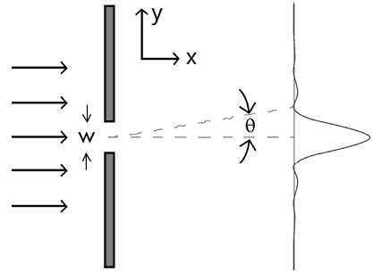

图 4.1：单缝实验（图片来源：https://commons.wikimedia.org/wiki/File:SingleSlitDiffraction.GIF）

从前面的图中，你可以看到所有粒子都被捕获在直接穿过狭缝的区域。在这里，角度θ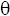表示从狭缝（图案）中心到第一个最小强度的角度。

然而，当第二个狭缝打开时，想象中屏幕上会有一个相同的点堆，因此有两个堆。但事实并非如此，因为捕捉到的图像似乎与从粒子那里预期的完全不同。实际上，它具有波的特性，因为屏幕上的点似乎显示出衍射图案，如下面的图所示：

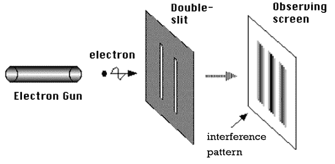

图 4.2：双缝实验（图片来源：https://commons.wikimedia.org/wiki/File:Double-slit.PNG）

从前面的图中，你可以看到所有粒子都从中心向外扩散，形成干涉条纹。

这种衍射图案是由通过狭缝的光波相互干涉造成的。在这里，屏幕中心比观察屏幕的外端有更多的点。这种单个粒子的干涉是现在所知的**波粒二象性**的基础，它通常推断光子可以同时表现出波和粒子的特性。这种特性被用于量子计算，特别是在 Grover 算法和 Shor 算法等算法中。

这种波粒二象性现象催生了大量有趣的研究和开发，如**哥本哈根解释**、**多世界解释**和**德布罗意-波姆理论**。

这说明光以一定的概率出现在板上的某些区域，形成光带。通过观察前面的图示，你可以看到电子从枪中发射后更有可能落在屏幕的中心带，而不是外带，如较深的灰色阴影所示。此外，由于干涉，捕获电子的带之间的空间概率较低（带之间的空白区域）。

本章我们将涵盖这些波干涉和概率效应，但首先，我们将从电子本身开始，以理解叠加原理。

# 理解叠加原理

**叠加**是我们通常无法用肉眼看到的。它被定义为同时发生的两种相似但不同的现象的组合：例如，同时吹口哨和哼歌。两者相同之处在于它们都是可听见的波，但不同之处在于它们的声音。你可以单独吹口哨而不哼歌，反之亦然；然而，同时做这两件事就是将它们置于叠加状态，因为你同时创造了两种不同的声音组合。

在量子力学中，我们通常讨论的是电子的叠加。由于电子非常小，而且数量众多，即使使用高倍显微镜也难以区分它们。它们通常被称为基本粒子。然而，在经典世界中，有一些类比可以帮助我们说明叠加原理。例如，旋转的硬币是大多数文本用来描述叠加原理的例子。

当硬币旋转时，我们可以认为它同时处于正面和反面的状态。直到硬币坍缩，我们才能看到硬币的最终状态。这从概率的角度解释了叠加；然而，正式的定义通常可以在任何经典物理书中找到，当描述电子的自旋时。我将留给你去搜索，因为网上有大量的参考资料和资源可以深入了解。

在本章中，我们将使用旋转硬币的类比，只是为了帮助你理解叠加原理的一般原理。然而，一旦我们开始构建量子电路，你将看到叠加及其在经典世界和量子世界中的概率行为之间的差异。

让我们先回顾一下在经典世界中狭缝实验中观察到的随机效应。

## 了解经典随机性

之前，我们以旋转硬币的随机性为例进行了讨论。然而，旋转硬币及其结果并不像我们想象的那样随机。仅仅因为我们无法在桌子上旋转硬币或在空中抛掷硬币时猜出正确答案，并不意味着它是随机的。让我们相信它是随机的是这样一个事实：我们没有所有必要的信息来了解、预测或实际上确定硬币会落在正面还是反面。

所有相关的信息，例如硬币的重量、其形状、旋转硬币所需的力、空气阻力、硬币滚动平台的摩擦力等等，以及环境本身的信息，我们都不了解，以便我们确定旋转硬币后的结果会是什么。正是因为这种信息不足，我们才假设硬币的旋转是随机的。如果我们有一个能够计算所有这些信息的函数，那么我们就可以始终成功地确定旋转硬币的结果。

这同样适用于随机数生成器。例如，当我们触发计算机生成随机数时，计算机使用各种信息来计算和生成所谓的随机数。这些参数可以包括请求触发时的当前时间、关于用户或系统本身的信息等等。

这类随机数生成器通常被称为**伪随机数生成器（PSRN**）或**确定性随机比特（DRB）生成器**。它们的随机性仅限于允许的计算或种子值。例如，如果我们知道用于生成这个随机数的参数以及它们是如何被使用的，那么我们就可以确定每次生成的随机数。

现在我不想让你担心任何人确定你可能生成的计算或加密密钥。我们使用这些 PSRN 生成器是因为它们包含的精度和粒度可以生成这样的数字，任何偏差都会极大地改变结果。

*那么，为什么还要回顾旋转硬币的概率和随机性质呢？* 一，是为了解释经典世界中的随机性，或者说我们认为是随机性，与量子世界中的随机性之间的区别。二，在某个时候，我们将需要放弃任何形式的经典类比，并接受量子行为并不明显也不容易测量的这一事实。如果您希望更深入地了解这些现象，这些现象我们无法轻易用经典物理学或类比来描述，我建议阅读**海森堡不确定性原理**。

在经典世界中，我们了解到如果我们拥有所有可用信息，我们很可能确定一个结果。然而，在上一节中，当我们描述双缝实验时，我们看到我们无法确定电子会在屏幕上的哪个位置击中。我们根据实验理解了它可能落下的概率。但即使如此，我们也不能确定地识别电子在屏幕上的确切位置。当我们在下一节创建我们的叠加电路时，你将看到这个例子。

对于那些想了解更多关于这个光子现象的人来说，我建议阅读著名物理学家理查德·费曼所著的书籍 *QED: 光和物质的奇异理论*。

## 准备一个处于叠加态的量子比特

在本节中，我们将创建一个包含单个量子比特的电路，并在量子比特上设置一个操作员以将其置于叠加态。但在我们这样做之前，让我们快速定义什么是叠加态。

我们将量子比特定义为具有两个基态能量，其中一个基态是基态（0）状态，另一个基态是激发态（1）状态，如图 *4.3* 所示。每个基态的状态值名称可以是任何我们选择的，但由于我们的电路结果将反馈到经典系统中，我们将使用二进制值来定义我们的状态——在这种情况下，二进制值 0 和 1。说两个状态的叠加是*同时处于 0 和 1*是不正确的。正确表述量子比特处于叠加态的方式是说它处于一个复杂线性组合的状态中，在这种情况下，状态是 0 和 1。

这个简单的类比可能就是将比特想象成一个标准的开关。在一个位置上，灯是亮的，在另一个位置上，灯是关的。它要么是其中一个，要么是另一个。这与比特类似，要么是*0*，要么是*1*（分别对应关和开）。现在考虑一个调光开关（技术上称为变阻器），其中开关可以旋转到开的位置，然后旋转到底部关的位置。你还可以用调光开关将开关滑动到开和关之间的任何位置，这反过来会调整发出的光的强度或振幅。现在，当你将调光开关置于开和关之间时，你不会说灯“同时开和关”吧？当然不会。这更多的是两种状态的结合。当然，记住，这并不是量子比特的定义，它只是说明说某物同时是两件事并不完全正确的一个简单例子。

可视化量子比特的状态通常很困难，尤其是多量子比特状态，它们涉及多个量子比特和多个量子态。早期开发的一种可视化模型是 2 态球体，它提供了一个二维量子力学系统（称为**布洛赫球**）的几何表示。以下是一个布洛赫球的示例，它代表一个量子比特及其两个正交基态，这些基态位于相反的极点。在北极，我们有基态![img/B18420_04_006.png]，而在南极，我们有基态![img/B18420_04_007.png]。围绕基态值的符号是大多数量子计算文本中常用的符号。这被称为**狄拉克符号**，它是以英国理论物理学家保罗·狄拉克的名字命名的，他首先构想了这个符号，他称之为**括号符号**。括号和狄拉克符号通常可以互换使用，因为它们指的是同一件事，我们稍后会看到。每个都有其独特的形式，**括号**具有以下形式，![img/_eqn_004.png]，而**括号**具有以下形式，![img/B18420_04_006.png]，其中每个分别表示一个数学**线性形式**和**向量**。

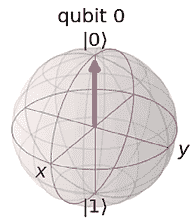

图 4.3：在布洛赫球上的一个量子比特的两个基态

好的，那么让我们停止谈论，开始编码。我们将创建一个包含单个量子比特的量子电路。然后我们将执行该电路，以便我们可以获得与前面截图相同的结果，即量子比特的初始状态，状态![img/B18420_04_006.png]。

在我们开始之前，首先将辅助文件导入到你的工作目录中。它包含一系列函数，将帮助我们以两种方式。首先，它将提供一系列函数，我们可以快速使用它们来执行电路，而不必立即覆盖任何细节。但不用担心，随着我们继续阅读本书，你将学习到这些细节，辅助文件的依赖性肯定会消失。其次，这也有助于保持代码库的更新，因为新功能和更改发生时，可以更新代码以保持远超当前版本。辅助文件的位置在本章开头提到的 GitHub 仓库中，标题为`helper_file_1.0.ipynb`。请注意，如果你想使用量子系统而不是设备上的本地模拟器，你可能需要设置你的账户。如果是这样，请打开`setup_save_account.ipynb`文件，并在指定的属性中输入你的 API 令牌并运行该文件。一旦这样做，它将在你的本地机器上保存你的 API，因此你不必每次都设置。

打开一个新的 Qiskit 笔记本，并在下一个空单元格中输入以下代码：

```py
# Load helper file
%run helper_file_1.0.ipynb
# Create a simple circuit
qc = QuantumCircuit(1,1)
# Get the state vector of the circuit
stateVectorResult = Statevector(qc)
# Display the state vector results onto a Bloch sphere
plot_bloch_multivector(stateVectorResult) 
```

第一行将加载辅助文件到工作笔记本中。该文件包含我们将使用的函数，例如用于在模拟器和后端系统上执行电路并返回电路结果的函数。下一行创建一个包含 1 个量子比特和 1 个经典比特的量子电路，在下一行我们将量子电路传递给`Statevector`对象，这将生成量子电路的状态向量。这将返回结果对象，其中将包含状态向量结果。最后，我们在 Bloch 球体上显示结果，应该显示你在*图 4.3*中看到的内容。

每个量子比特，如前所述，由两个基态组成，在这个例子中，它们位于 Bloch 球体的相反极点。这两个基态就是我们提交给经典系统的结果——要么是一个，要么是另一个。代表这两个点的向量起源于 Bloch 球体的原点，正如你可以在之前的图中或实验结果中看到的那样。如果我们将其表示为一个向量，我们将写成以下形式：

![img/B18420_04_002.png]

由于相反的情况适用于相反的极点，我们将如下表示：

![img/B18420_04_003.png]

从观察向量值中，你可以看到翻转向量的值就像经典比特翻转一样。现在我们理解了量子比特的向量表示，让我们继续并设置量子比特处于叠加态：

1.  在当前笔记本的底部插入一个新单元格，并输入以下代码：

    ```py
    # Place the qubit in a superposition state
    # by adding a Hadamard (H) gate
    qc.h(0)
    # Draw the circuit
    qc.draw(output='mpl') 
    ```

    +   第一行将**Hadamard（H）**门放置在第一个量子比特上，该量子比特由量子比特的索引值（`0`）标识。然后它调用`draw()`函数，这将绘制电路图；请注意，添加了`output`参数只是为了获得更好的输出。如果你想要包括这些可视化功能，请确保从 pip 中安装`qiskit[visualization]`（`pip install qiskit[visualization]`）。否则，你可以删除该参数并获取标准的文本可视化输出。

运行上一个单元格后，你应该看到以下电路图像，它表示将 Hadamard 门添加到量子比特和其下方的经典比特：

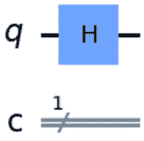

图 4.4：添加了 Hadamard（H）门的量子比特电路

**Hadamard 门**（H 门）是一个量子门，它将量子比特置于叠加态，或者更具体地说，是基态的复线性组合，这意味着当我们测量量子比特时，它将以相等的概率测量到 0 或 1。或者换句话说，它将塌缩到基态值之一，如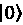或![img/B18420_02_003.png]。

从数学上讲，叠加状态是通过应用 Hadamard 门获得的，其结果表示在以下两个叠加方程中，正如你所看到的，这取决于在应用 Hadamard 门之前它处于哪个基态，或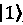。第一个叠加方程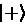如下，起源于状态，通常被称为正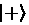叠加状态：

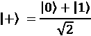

第二个叠加方程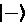，起源于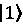状态，如下所示，通常被称为负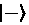叠加状态：

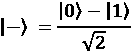

在 Bloch 球上，这等于对 Bloch 球的*X*和*Z*轴进行π⁄2 旋转。这些旋转是笛卡尔旋转，围绕指定的轴逆时针旋转，在这种情况下，是*X*和*Z*轴。

1.  现在，让我们获取电路的状态向量，并查看结果量子状态将是什么样子，以及状态向量在 Bloch 球上的位置。在下面的代码中，你将调用`Statevector`对象并将量子电路传递给`constructor`参数，这将改变 qubit 的状态，从初始状态变为叠加状态，你将在结果 Bloch 球输出中看到：

    ```py
    # Get the state vector of the circuit
    stateVectorResult = Statevector(qc)
    # Display the Bloch sphere
    plot_bloch_multivector(stateVectorResult) 
    ```

你现在应该能看到结果在 Bloch 球上以和的叠加形式绘制出来，如图所示：

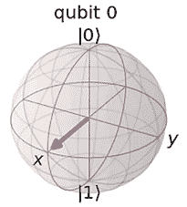

图 4.5：90°旋转后的 qubit 的叠加状态

如前一个屏幕截图所示，这已经将向量放置在正*X*轴上，正如之前在从基态添加 H 门时描述的那样。需要注意的是，从视觉上看，这也可以通过将*Y*轴旋转 90 度来完成。

1.  现在，让我们通过重新创建具有相同名称的`QuantumCircuit`对象来清除电路。这次，我们将首先将 qubit 初始化为状态，然后应用 Hadamard 门来观察向量会发生什么。将`qubit`初始化为状态并将其置于叠加状态。在应用 Hadamard 门之前，清除电路并将 qubit 初始化为`1`：

    ```py
    #Reset our quantum circuit
    qc = QuantumCircuit(1)
    #Rotate the qubit from 0 to 1 using the X (NOT) gate
    qc.x(0)
    #Add a Hadamard gate
    qc.h(0)
    #Draw the circuit
    qc.draw(output='mpl') 
    ```

你现在应该看到以下电路；在这种情况下，我们在构建量子电路时省略了经典比特，这就是为什么你不会在下面的图中看到经典比特：

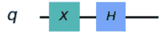

图 4.6：对基态  应用 H 门叠加

1.  现在，让我们执行电路，并使用与执行先前电路相同的代码在布洛赫球上绘制结果：

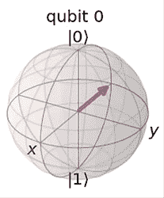

图 4.7：从  状态进行 90°绕 X 和 Z 轴旋转后的量子比特叠加

你能看出在  *状态（图 4.5）中向一个量子比特添加一个 H 门与在先前的图中向  *状态中的量子比特添加它之间的区别吗？

当然，区别在于它落在 *X* 轴上的位置！因为当对  状态应用哈达玛门时，向量落在正 *X* 轴上，这通常表示为 。从逻辑上讲，这意味着当对  状态应用哈达玛门时，向量落在负 *X* 轴上。这通常表示为 。

现在，看看叠加方程的右侧，并注意其中的符号：


注意，符号与哈达玛门应用后向量落点的方向相匹配。从  状态，它移动到 *X* 轴的正方向（+），而从  状态，它移动到 *X* 轴的负方向（-）。

这种差异被称为两个结果之间的相位差。这在本书的后续章节中将会非常重要，因为相位差在许多量子算法中扮演着重要角色，并且它将自身融入到我们很快将要学习的干涉主题中。

在我们继续之前，我们最后要讨论的一件事是现在回顾一下我们之前关于概率的讨论。现在我们已经学会了电路和布洛赫球上叠加看起来是什么样子，让我们执行并看看当我们测量处于叠加状态的量子比特时的概率是什么。如您从我们的第一次类比——抛硬币或旋转硬币——中回忆的那样，我们说过，一旦硬币开始旋转，它就处于正面或反面（或在这个例子中，0 或 1）的叠加状态。

一旦我们观察到了结果，硬币的结果将是其中一个。然而，在经典计算中，这是伪随机的，正如我们所学的。但在量子计算中，电子检测是真正的随机，因为没有方法在不干扰它的前提下确定其结果，这是由于**海森堡不确定性原理**。

**海森堡不确定性原理**，由 Werner Heisenberg 于 1927 年提出，描述了当位置更精确地确定时，不可能从初始条件预测粒子的动量。同样，对于反向情况，如果动量更精确地确定，则不可能从初始条件预测粒子的位置。

这与测量量子比特相同；本质上，我们正在测量它，因此迫使它折叠到两个基态之一。

1.  然后，在量子比特处于叠加态后进行测量，并重新创建电路。让我们从  状态开始，并应用一个 Hadamard 门，就像我们之前做的那样：

    ```py
    # Recreate the circuit with a single qubit and classical bit
    qc = QuantumCircuit(1,1)
    # Add a Hadamard gate
    qc.h(0) 
    ```

1.  现在，使用我们的辅助函数，让我们创建一个包含测量算子的电路，这样我们就可以测量量子比特，它将折叠到两种状态之一，如下所示：

    ```py
    # Create a measurement circuit with 1 qubit and 1 bit
    measurement_circuit = create_circuit(1,True)
    # Concatenate the circuits together
    full_circuit = qc.compose(measurement_circuit)
    # Draw the full circuit
    full_circuit.draw(output='mpl') 
    ```

在之前的代码中，我们创建了一个包含测量操作的测量电路，该操作基本上将量子比特从其当前状态折叠到 0 或 1。代码的第二行然后将第一个电路 `qc` 和这个新的 `measurement_circuit` 连接起来，创建了一个新的电路，称为 `full_circuit`，其绘制如下：

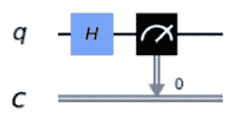

图 4.8：从量子比特（q）到经典比特（c）的完整电路，包括旋转和测量

之前的图示说明了我们的完整电路，你现在可以看到它包括两个新的组件，第一个是量子寄存器下面的经典寄存器。第二个组件是测量算子，它将提取量子比特的结果并将其传递给经典比特。结果将使量子比特的状态折叠到 1 或 0。

1.  现在，让我们运行这个电路，看看我们得到什么结果。我们将添加一些 `shots` 并查看结果。`Shots` 指的是多次运行实验并汇总其结果。我们将使用我们的辅助文件来帮助我们运行这个电路：

    ```py
    # Run the quantum circuit and obtain results
    transpiled_QC, result, stateVectorResult = simulate_on_sampler(full_circuit, None, None)
    counts = result[0].data.c.get_counts()
    print(counts) 
    ```

之前的代码现在将使用我们辅助文件中的不同后端，即 `BasicSimulator` 而不是 `Statevector`，这将使我们能够获得电路的测量结果。在这种情况下，我们将提取 `counts`，它存储了在 `1024` 次射击中测量结果为 0 或 1 的次数。

之前代码的结果如下：

```py
{'1': 478, '0': 546} 
```

注意，结果几乎为 50%，这说明了对于每次射击，落在 0 或 1 状态上的概率是相等的！

注意，你实际的结果可能与之前显示的不同，但概率应该接近 50%。尝试多次运行代码，并调整 `shots` 的数量，看看是否能得到任何差异。`shots` 的限制可以在每个模拟器和量子系统的 `max_shots` 值中找到。

我们运行电路多次的原因是为了获得足够的测量值，从而获得对叠加态上测量操作的准确统计。系统中的噪声导致计数中 50/50 的完美统计出现偏差，因为目前使用的近端量子设备还不是容错的。容错设备是具有逻辑量子比特的设备，可以由一个或多个物理量子比特组成，用于最小化错误，以便操作按量子电路指定的方式完成。它们表现出非常低的错误率和大的量子体积，我们将在*第九章*，*优化和可视化电路*中介绍。当前的近端设备需要运行多次以提供良好的概率结果。

## 构建抛硬币实验

如果你曾经上过概率和统计学课程，你可能见过抛硬币的例子。在这个例子中，你被给了一个公正的硬币进行多次抛掷，并跟踪每次抛掷（实验）的结果，无论是正面还是反面。这个实验说明的是，使用公正的硬币和足够的样本，你会看到正面或反面的概率开始收敛到大约 50%。

这意味着，在运行足够多的实验后，硬币落在正面和反面的次数变得非常接近。

让我们在 IBM 量子作曲家上试一试，以更好地可视化正在发生的事情（注意，后端系统可能不可用或不同，所以使用你看到的任何后端。像本书中的大多数后端一样，我们将使用撰写本文时可用的一些后端：

1.  打开作曲家编辑器并创建一个新的空白电路。

1.  为了简单起见，让我们移除除了一个量子比特之外的所有量子比特。这将简化我们的结果。

1.  点击并拖动 Hadamard 门到第一个量子比特上。

1.  在 H 门之后点击并拖动测量操作到第一个量子比特上。这将表明你希望测量这个量子比特的值，并将它的结果值（1 或 0）分配给相应的经典比特；在这种情况下，位置为 0 的比特，如下面的截图所示：

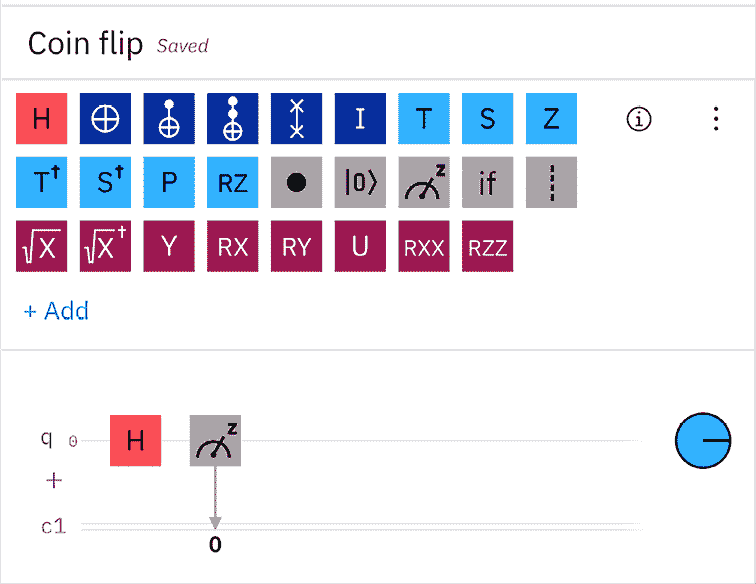

图 4.9：抛硬币实验

1.  将你的电路命名为`Coin flip`并保存。

1.  点击**设置和运行**以展开选项。

1.  选择一个后端设备，并将运行次数设置为`1024`。这将运行实验 1,024 次。注意，在撰写本文时，有一些变化正在进行，可能会改变使用 Composer 运行电路的方式。如果发生这种情况，请参阅平台上的说明以了解任何更改。

1.  点击**在‘所选设备’上运行**。

1.  完成后，点击**作曲家作业**列表中的完成实验。

测量结果将现在显示两种不同的状态。记住，计算基态表示在 *X* 轴上，你可以看到它是 0 或 1：

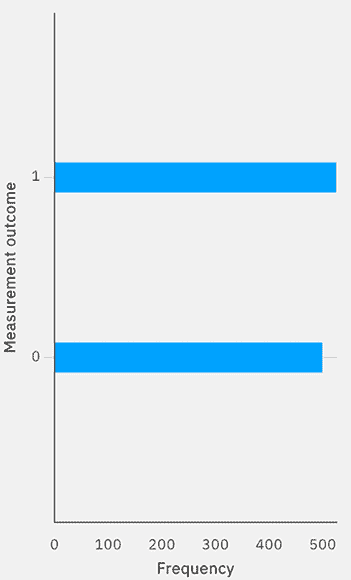

图 4.10：抛硬币结果

另一点需要注意的是，每个状态的**频率**（*X* 轴）。每次运行实验时，这都会有所不同，因为它代表每次射击结果为 0 或 1 的次数。

从前面的截图你可以注意到，每次运行实验，结果都会接近 50%。再运行几次实验，亲自检查结果。使用 Hadamard 门可以使你将一个量子位放置在电路中，使其处于两个基态 0 和 1 的线性组合中。如前所述，这有助于利用叠加。

# 理解纠缠

量子计算机使用的第二个量子计算原理是**纠缠**。通过纠缠两个或更多量子位，我们本质上是在将一个量子位的值与一个或多个其他量子位同步。通过同步，我们指的是，如果我们测量（观察）纠缠量子位中的一个的值，那么我们可以确信另一个量子位将具有相同的值，无论我们是在同一时间测量还是稍后测量。

**纠缠**可能是三个量子计算原理中最有趣的一个。这主要是因为它至今仍然让物理学家感到困惑，许多人在讨论中采取了不同的哲学立场。我不会让你感到厌烦，但我会尽力提供足够的信息，让你理解纠缠是什么，但不会提供一种证明纠缠如何工作以创建量子算法和应用的方法。是的，听起来很复杂，但请相信我，魔鬼藏在细节中，我们根本没有足够的空间来制定一个全面的答案来解释纠缠是如何工作的。但这些都足够了——让我们开始工作吧！

量子纠缠，或简称纠缠，简单定义为当两个或更多粒子具有相关状态时发生的量子力学现象。本质上，这意味着如果你有两个粒子，或者在我们的情况下，量子位，它们是纠缠的，这意味着当我们测量一个量子位时，我们可以根据第一个量子位的测量结果确定另一个量子位的测量结果。

如你所回忆的，在我们的前一个例子中，如果我们把一个量子位放在叠加态，并测量这个量子位，那么这个量子位会以 50/50 的概率坍缩到两个状态之一， 或 。

现在，如果同样的量子比特与另一个量子比特纠缠在一起，并且我们测量其中一个量子比特，那么这个量子比特将会是  或 。然而，如果我们测量第二个量子比特，无论是精确地在同一时间还是稍后，它也将具有与第一个我们测量的量子比特相同的值！

有一个需要注意的事情是，如果你选择的话，这也可以是相反的情况。例如，假设你在纠缠之前将第二个量子比特设置为 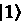 状态。你现在已经纠缠了相反的状态。这些纠缠状态的组合将在我们讨论第十二章“应用量子算法”时更详细地介绍。

你可能正在想，“这怎么可能呢？”如果我们取两个量子比特并将它们置于叠加态，然后分别测量它们，我们会正确地看到每个量子比特都会塌缩到 1 或 0 的值，每次我们单独测量量子比特时，它们可能不会同时塌缩到相同的值。这意味着如果我们一次运行一个实验，我们有时会看到第一个量子比特测量为 0，而第二个量子比特可能测量为 0 或 1。

两者都是独立的，并且在测量之前、测量过程中或测量之后都不知道彼此的值。然而，如果我们纠缠这两个量子比特并重复相同的实验，我们会看到量子比特每次都会测量出完全相同的值！每个结果都将导致四种不同的结果之一：00、11、01 或 10。这四种结果中的每一种都是基于所谓的贝尔态，这将在本章后面介绍。

你会说，“这不可能？”好吧，对我们来说，现在有一个量子计算机可以运行并尝试这个实验是好事！

## 实现纠缠量子比特的行为

在下面的代码中，我们将看到当量子比特没有纠缠时，它们的结果是这样的，我们不能根据另一个量子比特的结果推断出一个量子比特的结果。由于我们正在测量两个量子比特，我们的结果将以两位值的形式列出：

1.  首先，我们将创建一个新的电路，包含两个量子比特，将它们各自置于叠加态，并测量它们：

    ```py
    #Create a circuit with 2 qubits and 2 classical bits
    qc = QuantumCircuit(2,2)
    #Add an H gate to each
    qc.h(0)
    qc.h(1)
    #Measure the qubits to the classical bit
    qc.measure([0,1],[0,1])
    #Draw the circuit
    qc.draw(output='mpl') 
    ```

在前面的代码中，我们创建了一个包含两个量子比特的量子电路，为每个量子比特添加了一个 H 门，以便我们可以将每个量子比特置于叠加态，最后，为每个量子比特添加了对其相应比特的测量。

之前代码的结果应该显示以下电路，其中我们可以看到每个量子比特都有一个与其相应的经典比特寄存器进行测量的 H 门；也就是说，量子比特 0 对应比特 0，量子比特 1 对应比特 1：

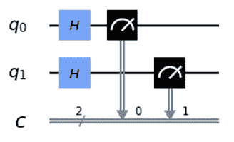

图 4.11：两个叠加的量子比特及其相应的经典比特

1.  然后，我们执行电路并显示结果：

    ```py
    # Run the quantum circuit
    transpiledQC, result, stateVectorResult = simulate_on_sampler(qc, None, None)
    #Obtain the results and display on a histogram
    counts = result[0].data.c.get_counts()
    plot_histogram(counts) 
    ```

在之前的代码中，我们创建了一个后端，以`1000`次`射击`运行在模拟器上，并将结果绘制在直方图中以供审查。

注意以下结果，每个量子位的输出都非常随机，这正是我们所期望的。我还想就符号顺序提一点，即量子位的顺序。在书写时，量子位的顺序与位顺序略有不同。在量子符号中，第一个量子位也列在左侧，而后续的量子位则添加到右侧。然而，在二进制表示法中，第一个位位于右侧，而后续的位则添加到左侧。

例如，如果我们想表示数字 5 的 3 量子位值，我们会使用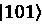来表示，这与相同数字的位表示相同。然而，这里的量子位顺序是不同的，因为第一个量子位位于左侧位置（q[0]），第二个量子位（q[1]）位于中间位置，最后一个量子位（q[2]）位于右侧位置。

另一方面，在二进制表示法中，第一个位（b[0]）位于右侧，并按顺序向上移动到左侧。在测量时，我们将量子位的结果链接到位（如前一个截图所示），这正确地将每个量子位的结果映射到其相应的二进制位置，以便我们的结果按照预期的位顺序排列。

绘制的直方图如下截图所示：

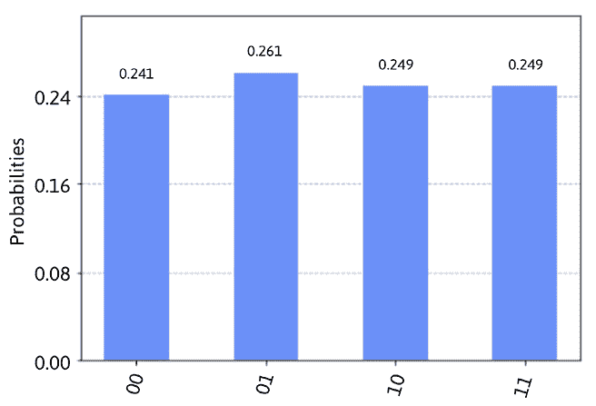

图 4.12：两个量子位的所有组合的随机结果

在之前的截图里，每个量子位都坍缩到了 0 或 1 的状态，因此既然有两个量子位，我们应该期望看到所有四种随机结果，即**00**、**01**、**10**和**11**。你的概率结果可能会有所不同，但总体上，它们都应该接近 25%的概率。

1.  这是预期的，所以让我们纠缠这两个量子位，看看会发生什么。为此，我们将纠缠这两个量子位并重新运行实验。

让我们通过添加一个多量子位门，称为**控制** **非**（**CNOT**）门来纠缠这两个量子位。在我们将其包含到电路中之前，让我先解释一下这个门是什么。

CNOT 门是一个多量子位门，它根据另一个量子位的值来操作一个量子位。这意味着量子位门有两个连接点——一个称为**控制**，另一个称为**目标**。目标通常是一个算子，例如**非**（*X*）门，它会将量子位从 0 翻转到 1，或者相反。

然而，目标算子也可以是几乎任何操作，例如 H 门、Y 门（它在*Y*轴周围翻转 180°）等等。甚至还可以是另一个控制，但我们将会在*第六章*，*理解量子逻辑门*中详细介绍这些花哨的门。

CNOT 门以这种方式起作用，当连接到控制的量子比特设置为 0 时，目标量子比特的值不会改变，这意味着目标操作将不会被启用。然而，如果控制量子比特的值为 1，这将触发目标操作。因此，在 CNOT 门的情况下，这将启用目标量子比特上的 NOT 操作，使其围绕*X*轴从当前位置翻转 180°。这如图*图 4.13*所示，其中量子比特 0 是控制比特，量子比特 1 是目标比特；在这种情况下，目标是 NOT 门，因此这是一个 CNOT 门。

下面的逻辑表表示基于 CNOT 门控制比特的值，控制比特和目标比特值更新的状态，以及 CNOT 门前后状态：

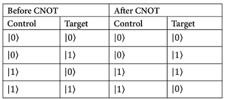

表 4.1：两个量子比特 CNOT 逻辑表

现在我们已经看到了 CNOT 门在两个量子比特上的工作方式，我们将更新我们的电路，以便我们可以将量子比特纠缠在一起。在下面的代码中，我们将创建一个包含 2 个量子比特的电路，我们将对第一个量子比特应用 Hadamard 门，然后使用 CNOT 门将第一个量子比特与第二个量子比特纠缠起来：

```py
# Create a circuit with 2 qubits and 2 classic bits
qc = QuantumCircuit(2,2)
# Add an H gate to just the first qubit
qc.h(0)
# Add the CNOT gate to entangle the two qubits,
# where the first qubit is the control, and the
# second qubit is the target.
qc.cx(0,1)
# Measure the qubits to the classical bit
qc.measure([0,1],[0,1])
# Draw the circuit
qc.draw(output='mpl') 
```

电路的结果图应该看起来如下所示：

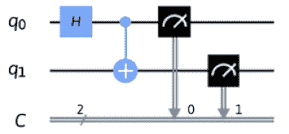

图 4.13：两个量子比特的纠缠

之前的截图显示，这次我们只在第一个量子比特上放置一个 Hadamard 门，而第二个量子比特只由 CNOT 门操作。由于量子比特 1（q[1]）被设置为目标，它将依赖于控制量子比特，在这种情况下，是量子比特 0（q[0]）。

1.  现在，我们将运行实验并绘制结果。这与我们之前完成的实验类似，我们将执行电路，提取结果计数，并将它们绘制在直方图上以可视化结果：

    ```py
    # Run the quantum circuit
    transpiledQC, result = run_qasm_circuit(qc, None, None)
    counts = result.get_counts(qc)
    plot_distribution(counts) 
    ```

下面的截图显示的结果展示了两个量子计算原理——量子比特 0 和 1 的叠加，以及纠缠——其中两个量子比特（控制比特和目标比特）的结果强烈相关，要么是**00**，要么是**11**：

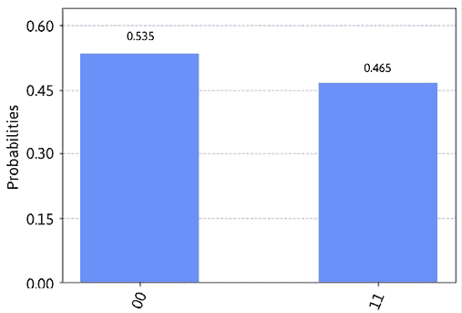

图 4.14：两个纠缠量子比特的结果

让我们通过添加另一枚硬币并将它们纠缠在一起来扩展我们的抛硬币示例，这样当我们运行实验时，我们可以确定一枚硬币的值，而无需测量另一枚。

## 将两个硬币纠缠在一起

与我们之前的实验一样，每个量子比特将代表一枚硬币。为了做到这一点，我们将使用 CNOT 门，它连接两个量子比特，其中一个作为源，另一个作为目标。

让我们尝试将我们的硬币（量子比特）纠缠起来，看看这是如何工作的：

1.  打开 Composer 并创建一个新的空白电路，包含 2 个量子位。提醒一下，你可以通过选择量子位并点击 + 或垃圾桶图标来增加或减少量子位的数量，分别添加或删除量子位。

1.  点击并拖动一个 Hadamard 门到第一个量子位，q[0]。

1.  点击并拖动 CNOT 门（*蓝色背景上的白色圆门，带有交叉线*）到第一个量子位，q[1]。这将控制量子位分配给第一个量子位。在选择 CNOT 门时，你放置它的第一个量子位将被设置为控制位。从视觉上看，CNOT 门的源控制是一个实心点，位于被拖动门到的量子位上（参见 *图 4.15*）。

默认情况下，目标会自动设置为下一个量子位。在这种情况下，它将降至量子位 2。从视觉上看，CNOT 的目标是中间带有十字的大型圆点，设计得像靶子。

1.  点击并拖动一个测量算子到两个第一个量子位，如下截图所示：

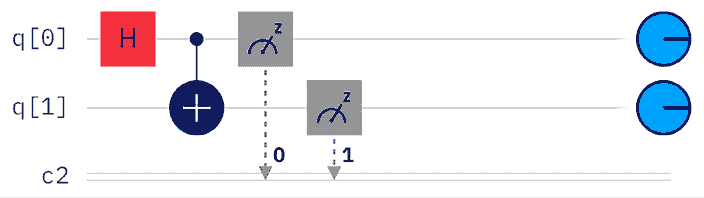

图 4.15：表示纠缠硬币的纠缠量子位电路

1.  将你的实验命名为 `Entangled coins` 并保存。

1.  在电路中点击 **Setup and run** 以启动 **Setup and run** 对话框。

1.  从后端选择中选取任何设备作为后端设备，并将 `shots` 值设置为 `1024`。这将运行实验 1,024 次，这是默认值，如果需要可以更改。

1.  点击 **Run on** 并选择你在上一步中选择的设备。

1.  完成后，从 `Completed jobs` 列表中点击 `Entangled coins` 实验项目。

现在我们来回顾一下结果，看看当我们纠缠两个量子位时会发生什么：

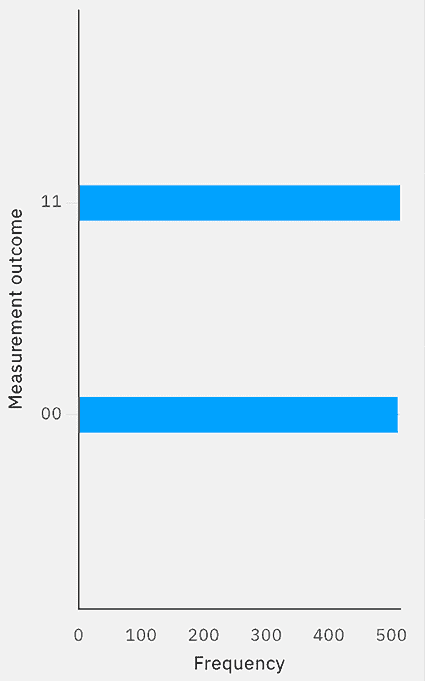

图 4.16：纠缠硬币的结果

如前一个截图所示，结果仍然有两个状态，就像上一个实验中一样。然而，这里要注意的是两个量子位的结果。请注意，两个量子位的状态要么是 00，要么是 11。

使这个实验变得有趣的是，当我们翻转上一个实验中的一个硬币时，你看到结果是 50%（0 或 1）。然而，现在我们正在运行相同的实验，但我们正在纠缠另一个硬币。实际上，这导致两个硬币都纠缠在一起，因此它们的状态将始终相同。这意味着如果我们翻转两个硬币并观察其中一个硬币的值，那么我们知道另一个纠缠硬币的值将相同。

现在你已经熟悉了叠加和纠缠，让我们继续到最后一个量子计算原理，即干涉。

# 理解干涉

量子计算的一个好处是它能够以这种方式交织这些原理，通常在解释一个原理的同时，你能够非常容易地描述另一个原理。我们在本章 earlier 部分已经用关于干涉的例子做了这样的说明。现在让我们回顾一下，看看我们迄今为止在哪里遇到过这种现象及其应用。

首先，回想一下，在本章的开头，我们描述了双缝实验。在那里，我们讨论了电子如何同时作为波和粒子存在。当它像波一样行动时，我们看到实验展示了电子如何移动并在观察屏幕上的特定位置着陆。它显示的图案通常是我们在经典物理学中认识到的波干涉图案。

模式在篮板上显示出概率性结果，如图 *图 4.2* 中的观察屏幕所示，屏幕中心有最多的电子，而两侧的空白区域电子最少甚至没有。这是由于粒子波的两类干涉，即**建设性**和**破坏性**。当两个波的峰值相加时，结果振幅等于两个单独波的总体正和时，发生建设性干涉。

破坏性干涉与建设性干涉发生的方式相似，只是波的振幅是相反的，在将它们相加时，两个波会相互抵消。

下面的图示说明了当两个波叠加时，它们的建设性和破坏性波干涉：

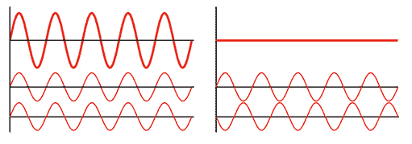

图 4.17：建设性（左）和破坏性（右）的波干涉（图片来源：https://commons.wikimedia.org/wiki/File:Interference_of_two_waves.svg）

前面的图示说明了两个波如何以建设性和破坏性的方式相互干涉。图示底部的两个波代表每个波的单独振幅，而顶部的一行代表叠加的振幅值，这些值代表了两个波之间干涉的结果。

现在你已经理解了建设性和破坏性干涉之间的区别，*我们如何将这一知识应用到我们迄今为止所学的内容中呢？* 好吧，如果你还记得，之前当我们将量子比特置于叠加态时，我们得到了两个不同的结果。

一个是从基态  出发，而另一个是从基态  出发。你还记得我们最初是从这两个量子基态之一开始的吗？在量子比特的 *X* 轴上，Hadamard 变换会落在哪个位置？从  出发，它会落在 *X* 轴的正侧，但如果我们从  状态开始将量子比特置于叠加态，它就会落在负 *X* 轴上。

能够将量子比特状态矢量放置在正或负 *X* 轴上，为我们提供了将量子比特放置在正或负状态的方法。这与前一个图中展示的波非常相似，这些波具有正（峰值）和负（谷值）振幅，量子比特也可以表示类似的状态。让我们通过重新引入两个狄拉克符号值， 和 ，来简化这一点，其中  状态代表正 *X* 轴上的状态矢量，而  状态代表负 *X* 轴上的状态矢量。

这些新的矢量定义，代表叠加态中一个量子比特的矢量状态，将被某些算法用作识别特定值并使用干涉来对其做出反应的技术，例如**振幅估计**和搜索算法如**Grover 算法**。

在本节中，我们回顾了量子计算中的干涉原理。随着你了解这些原理如何在量子算法中提供潜在的速度提升，这些原理（叠加、纠缠和干涉）将非常有用。为了做到这一点，我们将回顾一个我们将贯穿整本书的例子，以了解所有量子算法的坚实基础，即**贝尔态**。

# 探索贝尔态

在本书的大部分例子中，你会发现我们重复使用一个简单的双量子比特量子电路来运行许多实验。这个电路包含两个门，一个单量子比特门和一个多量子比特门，分别是 Hadamard 和 CNOT。

选择这个的原因并非随机。事实上，这个电路有一个名字，贝尔态。贝尔态最初由约翰·贝尔在 1964 年发表的一篇理论论文中描述，描述了两个处于叠加态的量子比特之间存在四种最大纠缠量子状态。这四种状态通常被称为**贝尔态**。

在这一点上，你可能想知道这为什么如此重要。好吧，如果我们能将量子比特准备到特定状态，在这种情况下，最大纠缠状态，这有助于简化各种量子电路和算法的创建。为了了解更多关于这方面的信息，让我们首先准备四个贝尔态，也许在这个过程中，你可能会看到其重要性，并理解其在量子隐形传态或超密集编码等用例中的重要性。

## 准备贝尔态

我们将首先准备我们将贯穿整本书使用的贝尔态。

我们将在创建每个状态时对其进行标记，这个第一个状态被标记为 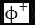。准备贝尔态包括三个简单步骤：

1.  准备你的双量子比特输入值。对于这个第一个状态，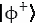，我们将使用初始化状态 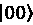：

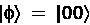

1.  接下来，向第一个量子比特添加一个哈达玛门。这将使第一个量子比特处于叠加态：

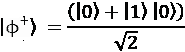

1.  最后，添加一个 CNOT 门，其中控制位设置为叠加态的量子比特。在这种情况下，第一个量子比特和目标位都设置为第二个量子比特。这样做将确保当第一个量子比特为 1 时，这将触发目标量子比特绕 *X* 轴从  状态旋转到 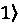 状态，否则它将保持在  状态。这给我们带来了最终状态：

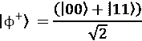

这个最终状态是第一个贝尔态 ，这将导致出现相等概率的  或 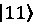。

准备第一个贝尔态与其他态之间的唯一区别仅在于 *步骤 1*，在那里你需要准备你的输入。*步骤 2* 和 *步骤 3* 对所有态都是相同的。这意味着对于双量子比特电路，*步骤 1* 中准备剩余的输入状态是 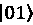，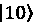，和 。幸运的是，以下公式可以帮助我们识别剩余的贝尔态：

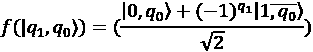

通过使用这个公式，我们可以计算出所有四个贝尔态如下：

+   对于输入状态 ，我们得到以下方程：

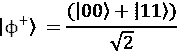

+   对于输入状态 ，我们得到以下方程：

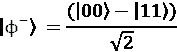

+   对于输入状态 ，我们得到以下方程：

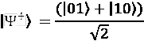

+   对于输入状态 ，我们得到以下方程：

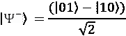

现在，让我们通过在模拟器和量子计算机上执行所有贝尔态来创建这些电路。

## 实现贝尔态

在本节中，我们将创建前两个初始状态  和 ，并留给你创建剩余的输入状态：

1.  我们将从创建第一个贝尔态  开始。让我们创建一个双量子比特 `QuantumCircuit` 电路，并准备输入状态 。由于所有量子电路都初始化为状态 ，我们不需要对电路进行任何操作。我们将添加一个屏障来指示步骤之间的分隔：

    ```py
    # State 1: |/+>
    state1 = QuantumCircuit(2)
    # Initialize input to |0,0>
    state1.barrier() 
    ```

1.  然后，向第一个量子比特添加一个哈达玛门：

    ```py
    # Prepare the Bell state
    state1.h(0) 
    ```

1.  添加一个 CNOT 门，其中控制位是第一个量子比特，目标位是第二个量子比特：

    ```py
    state1.cx(0,1) 
    ```

1.  最后，向所有量子比特添加测量并绘制电路：

    ```py
    state1.measure_all()
    state1.draw(output='mpl') 
    ```

这将生成我们第一个贝尔态  的最终电路，如下所示：

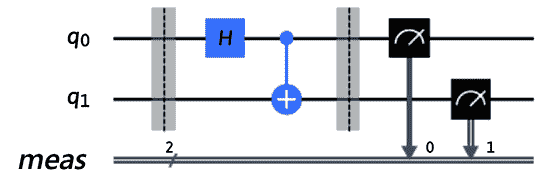

图 4.18：制备好的贝尔态 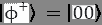

1.  现在，让我们使用我们的辅助函数执行这个电路。设置`simulator`参数来指定你想要在模拟器还是量子系统上执行它。为了避免结果中的任何噪声，在这个例子中，我们将电路在量子模拟器上运行以验证我们的结果是否符合预期：

    ```py
    # Execute the Bell state |/+>
    transpiledQC, result, stateVectorResult = simulate_on_sampler(state1, None, None)
    # Obtain the results and display on a histogram
    counts = result[0].data.meas.get_counts()
    plot_histogram(counts) 
    ```

这个实验的结果产生了以下熟悉的输出，这证实了第一个贝尔态，00：

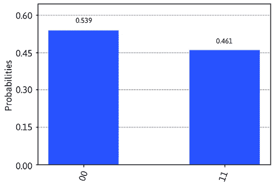

图 4.19：第一个状态的结果，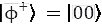

1.  我们现在将继续表示下一个状态，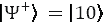，并像之前一样确认结果。

如前所述，四个贝尔态之间的唯一区别在于第一步，即准备输入状态。在这种情况下，我们的输入状态是。在给第二个量子比特添加一个*X*门之后，我们可以遵循之前的相同步骤：

```py
# State 2: |/+>
state2 = QuantumCircuit(2)
# Initialize input state to |1,0>
state2.x(1)
state2.barrier()
# Prepare the Bell state
state2.h(0)
state2.cx(0,1)
state2.measure_all()
state2.draw(output='mpl') 
```

这将导致以下电路，它与第一个电路非常相似，只是在准备步骤中添加了一个*X*门：


图 4.20：准备好的贝尔态，

1.  与第一个贝尔态一样，让我们执行这个电路并观察结果：

    ```py
    # Execute the Bell state |/+>
    transpiledQC, result, stateVectorResult = simulate_on_sampler(state1, None, None)
    # Obtain the results and display on a histogram
    counts = result[0].data.meas.get_counts()
    plot_histogram(counts) 
    ```

执行前面电路的结果如下：


图 4.21：贝尔态的结果，

在审查了这两项结果之后，我们应该注意以下几点。首先，我们可以从第一个贝尔态中看到，两个量子比特是同等纠缠的，也就是说，如果你要测量一个量子比特，比如说第一个，那么你就会知道第二个量子比特应该处于相同的状态。因此，如果你测量第一个量子比特，结果是 0，那么你无需测量就能知道第二个量子比特的状态。

无论你是在同一时间还是稍后测量第二个量子比特，对于第二个贝尔态，情况也是一样的；唯一的区别在于，如果你测量一个量子比特，那么你就知道另一个将导致相反的基态值。因此，如果第一个量子比特的结果是 0，那么第二个量子比特的结果将是 1，反之亦然。

这两个量子比特之间的相关性是两个著名量子应用——**量子隐形传态**和**超密集编码**的基础，在这些应用中，每个应用都有两个处于纠缠态的量子比特。这两个量子比特的准备状态由贝尔态表示，这种准备可以是之前描述的四个贝尔态中的任何一个。

当阅读描述量子隐形传态用例的文章时，你会听到一个与此类似的例子：*爱娃准备了一对纠缠量子比特，并将其中一个发送给爱丽丝，另一个发送给鲍勃*；你现在将知道爱娃是如何准备这对纠缠量子比特的。

现在我们已经了解了贝尔态及其在量子隐形传态和超密集编码等应用中的应用，我们将在后面的章节中继续我们的旅程，以说明量子算法如何提供比经典系统更优越的计算优势。

# 摘要

在本章中，你学习了量子计算中使用的三个原理。你创建了一个量子电路，并在量子电路中将一个量子比特置于叠加态，并在两个量子比特之间处于纠缠态。

你还理解了两种类型的干涉，即建设性和破坏性，并学习了它们如何通过将它们放置在叠加中以创建  和  模拟来表示和表示为量子比特。

你还通过利用一些量子门，如 Hadamard 门和 CNOT 门，以及测量等操作，提前了解了一些 Qiskit 开发技能。这将为你准备未来章节，届时你将创建电路，在这些电路中，这些门和操作在各种算法中普遍使用。这很有意义，因为这些门和操作代表了我们所学的核心量子计算原理。

你还进行了一些实验：第一个实验是模拟抛硬币的实验，其中使用 Hadamard 门创建了一个电路，利用了叠加原理。第二个实验也模拟了抛硬币，只是我们将两个硬币都纠缠在一起。这是第二个电路的扩展，其中包含了你的第一个多门，一个 CNOT 门。这些使你能够检查叠加和纠缠的结果如何从你的量子电路映射到经典比特输出。我们还了解了贝尔态，它展示了量子纠缠的使用和优势。这四个特殊状态代表了叠加态的线性组合，将在本书后面的章节中学习量子算法时使用。

在下一章中，我们将学习所有其他门，包括单门和多门，以了解它们在每个量子比特上执行的操作。

# 问题

1.  你将如何创建一个纠缠两个不同量子比特（即 01、10）的电路？

1.  创建一个包含多量子比特门（如受控 Hadamard 门）的电路。

1.  在电路中创建所有 4 个贝尔态。

1.  量子计算的三项原理是什么？

# 加入我们 Discord

加入我们社区的 Discord 空间，与作者和其他读者进行讨论：

`packt.link/3FyN1`


