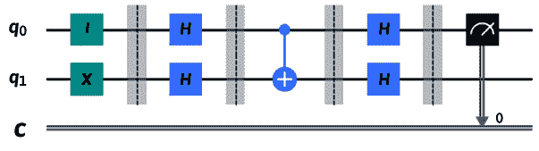

# 第十一章：理解量子算法

如果你一直在阅读有关量子计算的新闻，你会注意到来自各种公司（无论大小）的大量文章，它们都在从事与量子计算相关的不同项目。原因很大程度上是基于量子系统与经典系统相比所提供的潜在计算能力。提供加速、质量和可扩展性的潜力是大多数公司和研究机构目前重点关注的领域。

通过掌握各种量子算法的复杂性，并学习如何将它们应用于特定的问题集或行业，研究人员和开发者可以进一步扩展他们对小问题的理解，并将它们应用于大型现实世界的企业解决方案。使用量子计算机解决经典计算机难以处理的现实世界问题这一时代被称为**量子优势**。目前，大部分工作集中在理解和创建量子计算算法上，这些算法通常集中在较小的**玩具问题**上，因为它们通常被称为。

然而，在 2021 年，IBM Quantum 推出了一款 127 量子比特处理器，打破了 100 量子比特的壁垒。这标志着向前迈出了重要的一步，因为它代表了一个壁垒，在这个壁垒中，经典模拟可能再也无法模仿同等规模的量子计算机。2023 年早期，这种迹象在 127 量子比特的 Eagle 处理器中得到了证实，它能够对超越经典穷举法的计算问题进行精确求解。关于这一点的详细信息可以在《自然》杂志的文章《在容错之前量子计算的有用性证据》中找到（[`www.nature.com/articles/s41586-023-06096-3`](https://www.nature.com/articles/s41586-023-06096-3)）。

这使我们更接近于大家都在竞相实现的量子优势阶段。当然，这会因问题而异，有些问题可能需要比其他问题更多的量子计算能力，但，随着时间的推移，不同的行业最终会很快实现这一点。为了让自己准备好并加入这场竞赛，你需要了解一些基础量子算法以及它们是如何应用于解决一般问题的。

本章将涵盖以下主题：

+   理解超越经典系统的意义

+   了解 Deutsch 算法

+   理解 Deutsch-Jozsa 算法

+   了解基于基础预言机量子算法

在本章中，我们将回顾目前使用的各种量子算法。在学习量子算法时，最难以克服的障碍之一是它并非是从经典到量子的一蹴而就。简单地将经典算法的步骤从经典系统转移到量子系统，例如一个简单的加法器，并不会自动使其成为量子加速算法。这比那还要复杂一些。

在*第五章*，*理解量子比特*中，我们讨论了量子状态的操控方法，而在*第七章*，*使用 Qiskit 编程*中，我们介绍了如何在量子系统上运行电路。现在，我们将把这些部分放在一起，学习并创建量子算法，并展示它们如何在本章中优于经典算法。我们将首先提供一个量子算法的例子，这个算法是基础性的，并通过回顾**Deutsch**和**Deutsch-Jozsa**算法来展示量子系统如何通过操作更快。接下来，我们将介绍更通用的算法，这些算法专注于使用**Bernstein**-**Vazirani**算法解决简单问题。

这绝不是量子算法的详尽列表，但本章将为你提供一些早期的基础算法，这些算法将帮助你理解高级算法以及它们与经典算法的比较。如果你想看到一个更完整的算法列表，请参考*附录 A*，*资源*，其中包含一些跟踪量子算法和研究的网站链接。当然，随着技术和算法的进步，可能会发现新的算法，这些算法可能具有与以下不同的方法，但在所有这些算法中，理想的情况是理解基础知识，这样你就可以快速上手，而不必深入研究物理学。

# 技术要求

在本章中，我们期望你已经具备线性代数的基本知识，以便理解每个算法的方程。你还应该有一些编程基本电路并在本地模拟器和**IBM Quantum**平台上的量子设备上执行这些电路的经验。最后，你应该熟悉经典比特表示法和逻辑、量子**狄拉克表示法**（或括号表示法），以及理解前几章中涵盖的基本量子计算原理，如叠加、纠缠和干涉。

在本书中使用的完整源代码如下：[`github.com/PacktPublishing/Learning-Quantum-Computing-with-Python-and-IBM-Quantum-Second-Edition`](https://github.com/PacktPublishing/Learning-Quantum-Computing-with-Python-and-IBM-Quantum-Second-Edition).

# 理解优于经典系统的意义

在本节中，我们将通过研究一些早期示例来了解量子系统相对于经典系统的潜在优势，尽管其中一些示例只是简单说明了优势，而这些优势本身并没有任何实际用途。

声称量子系统可能在快速速度上解决方程式，超过经典系统，或者具有更大的计算空间的能力，这些都听起来非常吸引人。然而，回想一下，在撰写本章时，还没有可用的量子系统能够在解决现实世界的商业问题方面超越当前的经典系统。“*那么为什么会有这么多议论？*”你可能会问。

答案很简单——潜力。从理论上讲，存在描述量子加速问题解决方案的量子算法，例如肖尔算法。然而，我们预计在看到量子加密的突破之前，我们将先看到量子优势。这是因为达到量子优势是基于特定问题的。它不会针对所有特定数据；它将随着技术能够计算非常庞大和复杂的电路而发展。为了实现复杂的电路或算法，我们需要包含错误缓解、抑制，最终是纠正的系统，以获得准确的结果。当然，这可能与大多数新技术相似。一个很好的例子是**视频流**。

多媒体压缩已经存在了几十年，视频流是在 20 世纪 90 年代初发明的。当视频压缩首次商业化时，互联网带宽已经增加，并且更广泛地可用，尽管视频和音频的质量不如今天丰富；分辨率大约是 150 x 76 像素，刷新率大约是每秒 8-12 帧，音频质量较差。那时的限制是压缩技术降低多媒体质量以及带宽将多媒体内容流式传输到多个观众同时观看。

确保适当解压缩和最小化信息损失的基础设施依赖于纠错，以及一个适当的协议来避免低质量和经常抖动的分辨率。当然，仅仅二十多年后，我们可以看到进步：我们可以以低错误率和高分辨率流式传输实时多媒体事件。现在，将视频流到拥有大尺寸 4K 高清屏幕的家庭影院系统，你不必太担心视频质量，这已经成为一种常态。

量子系统拥有相同的**路线图**，我们现在有硬件（量子系统）和算法以中等分辨率做事。这里的区别在于，我们有一些当时没有的东西：一个全球性的基础设施，任何人，无论何地，都可以通过云访问量子系统。IBM 量子计算机任何人都可以通过简单地注册免费账户来访问。

在视频流媒体早期，很少有人能够访问带宽。那些能够访问的人受到基础设施的限制，无法协作。通过拥有云访问的系统，许多行业和学术机构正在对量子硬件和算法进行更多研究。当然，在多媒体流媒体早期，被解决的问题被归类为玩具问题。然而，不要被这个名字欺骗。这些玩具问题远非仅仅是用来玩耍和向同事炫耀的东西。它们是通往现实世界解决方案的垫脚石。

例如，如果你找到一个解决方案，它展示了量子速度相对于经典的速度，只需要几个量子比特和非常小的量子体积，那么这可能对解决许多当今的商业或现实世界问题没有用。

它所提供的是将你的解决方案扩展到具有必要量子体积以解决实际问题的系统的基本信息。要理解通往量子优势的道路是什么，在哪里存在一个量子解决方案可以比经典系统更有效地解决实际问题时，首先理解基本的量子算法以及它们不仅与经典算法不同，而且比它们提供优势，这一点很重要。这将简化你对其他更复杂算法的理解以及它们如何被用于解决各个行业的各种问题。

在下一节中，我们将讨论各种基础量子算法，从最初展示对经典系统优势的算法开始。

## 了解德施特算法

大卫·德施特，牛津大学的物理学家，首先发现了一个可以用量子计算机比经典计算机更快解决的问题。这个问题本身在计算机问题中没有任何重要性或用途，但它确实用来说明量子计算相对于经典计算的优势。让我们在下一节中理解这个问题。

### 理解问题

这个问题非常简单。我们将用一个简单的类比来解释它。想象有人在每个手里藏了一枚硬币。每枚硬币，当揭示时，要么是正面要么是反面。由于有两枚硬币，一枚在手，一枚在手，所以有四种可能的结果，如下表所示：

| **事件** | **左手** | **右手** |
| --- | --- | --- |
| 1 | 正面 | 正面 |
| 2 | 正面 | 反面 |
| 3 | 反面 | 正面 |
| 4 | 反面 | 反面 |

表 11.1：所有四种可能的结果

从前面的事件列表中，我们可以看到有两种类型。第一和第四个事件是恒定结果的一个例子，其中左手和右手都产生相同的结果，要么是正面要么是反面。第二和第三个事件是平衡结果的一个例子。

在这里，事件结果是相互对立的，这表明如果一个结果是正面，那么另一个将是反面，反之亦然。使用这个相同的类比，如果我要逐个揭示一只手，比如说左手，那么仅通过查看左手的结果，你将没有足够的信息来确定结果将是恒定还是平衡，因为你还需要知道另一只手的内容。

现在，想象你面前有 100 只手，你必须逐个检查每只手，以确定是否有平衡数量的正面和反面，或者所有手都只包含正面或只包含反面。在最佳情况下，你会在前两次尝试中得出结论，这意味着如果第一只手是正面，第二只手是反面，你就可以得出结论，其他手的结果将是平衡的。另一方面（有意为之），如果前两只手显示相同，无论是正面还是反面，那么你不能得出它是平衡的还是恒定的结论。

在最坏的情况下，你可能需要继续检查，直到第 51 只手被揭示，因为如果前 50 只手都是正面，那么第 51 只手将表明整个集合是恒定的（如果第 51 只是正面）还是平衡的（如果第 51 只是反面）。然而，我们有点超前了，所以让我们专注于当前的问题范围，即只有两个事件。

使用德鲁茨提出的量子算法来解决这个问题，相当于一次性打开所有手并确定前两个量子位是恒定还是平衡的。*有趣，不是吗？* 让我们看看它是如何工作的！

我们将从将问题的类比迁移到数学方程式开始。这将简化稍后对解决方案的描述：

1.  首先，将正面和反面分别用二进制数 0 和 1 表示。

1.  接下来，我们将每个手的结果称为一个函数 ![img/B18420_11_002.png]，其中自变量可以指左或右，![img/B18420_11_003.png] 或 ![img/B18420_11_004.png]，分别。

因此，结果如下。在这种情况下，函数 ![img/B18420_11_002.png] 是 ![img/B18420_11_006.png]，其中自变量 *x* 可以是 0 或 1（左或右）。结果表示每个具有不同结果的事件，其中每个事件要么是平衡的，要么是恒定的：

| **事件** | ![img/B18420_11_007.png] | ![img/B18420_11_008.png] | **结果** |
| --- | --- | --- | --- |
| 1 | 0 | 0 | 恒定 |
| 2 | 0 | 1 | 平衡 |
| 3 | 1 | 0 | 平衡 |
| 4 | 1 | 1 | 恒定 |

表 11.2：结果的数学表示

如前表所示，现在我们可以将我们的问题重新表述为一个函数 ，它将单个比特 {0,1} 映射到 {0,1} 的结果，如果  和  的结果相同，例如 *事件 1* 和 *事件 4*（来自前表），则结果将是常数；否则，结果将是平衡的。现在我们理解了问题，让我们来找出解决方案。

### 定义问题

我们现在知道，如果  = ，那么我们说  是 *常数*；否则， 是 *平衡的*。如果我们引入一个 **黑盒**，有时被称为神谕，对我们来说是隐藏的，那么问题就变得有趣了。我们不知道隐藏在黑盒中的函数是常数还是平衡的，这正是我们被要求解决的问题。以下图示是我们输入值 *x* 进入黑盒函数 ，并输出结果值  的图形示例：


图 11.1：我们问题的黑盒表示

如前图所示，这个问题可以用经典方法解决。但是，它需要两个查询来确定  是常数还是平衡的，其中每个查询都会查看  和  的结果，以判断它是常数还是平衡的。当使用德意志的量子算法时，我们将看到是否可以通过利用叠加原理仅用一个查询来确定 。让我们在下一节中看看。 

### 将问题描述为一个量子问题

由于我们正在处理量子计算，我们首先需要将我们的函数和值表示为矢量。因此，我们的常数函数，其中两个输入都产生相同的输出，可以用以下矢量形式表示：


该函数对不同输入产生相同结果的输出可以表示如下：


函数  可以用以下矩阵表示：


同样，以下是一个平衡函数的例子，其结果是两个输入值的相反数：


 将成为我们的黑盒，或称为神谕函数。为此，我们需要扩展我们之前的图示，包括创建我们的神谕所需的额外组件：

1.  首先，我们将我们的输入和输出寄存器转换为狄拉克 **矢量表示法** 。

1.  接下来，我们将创建两个输入寄存器， 和 ，其中输入寄存器将输入到我们的黑盒，或或然函数 ，而  寄存器用作辅助量子比特。辅助量子比特是额外的位，用于存储可能稍后使用的信息或在整个量子电路中跟踪信息。

1.  最后，我们将定义我们的两个输出寄存器：一个与输入  相同，另一个是输入寄存器 *x* 和与函数  XORed 的输入寄存器 x 的 **XOR**，如 。

因此，我们现在可以定义或然函数如下：


这如下所示：


图 11.2：Deutsch 算法的图形表示

另一个要求是该函数应该是可逆的，我们可以通过反向工作来测试它：


现在我们已经将函数定义为我们的问题的量子函数，我们将看到 Deutsch 算法是如何工作的。

### 实现 Deutsch 算法

在本节中，我们将以平衡函数为例实现算法，但将代码更新以实现常量函数的任务留给你。我们将检查 Deutsch 算法，并在构建 IQL 算法时逐步执行每个任务如下：

1.  在你已安装 Qiskit 的新 Jupyter 笔记本中打开，并在第一个单元中包含辅助文件：

    ```py
    %run helper_file_1.0.ipynb 
    ```

1.  接下来，我们将创建一个双量子比特电路，并为每个输入准备，第一个到 ，第二个到 。我们将使用恒等门来表示 ，即初始状态，以及 X 门来表示 的初始状态：

    ```py
    # Implement Deutsch's algorithm for a balanced function
    qc = QuantumCircuit(2,1)
    # Prepare the input qubits, where q0=0, q1=1
    print('Step 1: Prepare the input qubits, where q0=0, q1=1')
    qc.id(0)
    qc.x(1)
    qc.barrier()
    qc.draw(output='mpl') 
    ```

这导致了以下电路图：


图 11.3：初始化量子比特为 0 和 1

如前图所示，**q**[0] 被设置为 ，**q**[1] 被设置为 ，这创建了第一个状态在障碍()处为 。使用障碍只是为了在遍历电路中的每个操作时指示检查点。

1.  现在我们已经设置了输入，我们将使用 Hadamard 门将它们置于叠加态。这将使我们能够利用所有四个状态进行一次迭代，而不是逐个迭代：

    ```py
    # Place each qubit in superposition by applying a
    # Hadamard
    print('Step 2: Place each qubit in superposition by     applying a Hadamard')
    qc.h(0)
    qc.h(1)
    qc.barrier()
    qc.draw(output='mpl') 
    ```

前述代码的结果如下所示。障碍用于分隔每个步骤，以便简化电路的阅读：


图 11.4：对两个量子比特应用 Hadamard 门

如前图所示，Hadamard 门将每个量子比特的基向量转换为以下形式：


这在第二个势垒处生成以下状态 ，其中  描述了一个单个量子比特：


1.  在量子比特应用了前面的 Hadamard 门之后，量子寄存器的结果值将如下所示：


这里有一点需要注意，我们现在将第二个量子比特置于  超叠加状态，。这允许我们定义  中的第一个和第二个量子比特，如下所示：


从前一个方程中，你可以看到第二个量子比特，分组在第二组括号中，具有相同的值，即  超叠加状态，。

然而，我们看到的第一个量子比特有一个有趣的结果。让我们深入挖掘以了解这意味着什么。

在这里，我们看到如果  是恒定的，我们将得到以下结果：


如果  是平衡的，那么我们将得到以下结果：


注意，第二个量子比特始终相同，但第一个量子比特如果恒定则会有正相位回弹，如果平衡则会有负相位回弹。这种相位回弹是许多量子算法中常用的技巧，所以请放心，我们还会再次看到它。

1.  接下来，通过将 Hadamard 门应用于第一个量子比特，我们可以看到一些有趣的结果。让我们逐个来看。

对于一个恒定函数，第一个量子比特被设置为以下状态：


我们回忆一下，将 Hadamard 门应用于这个超叠加状态将带我们回到  状态。

对于平衡函数，第一个量子比特被设置为以下超叠加状态：


我们还可以回忆一下，将 Hadamard 门应用于前面的超叠加状态将带我们回到  状态。

这意味着在将 Hadamard 门应用于它之后仅测量第一个量子比特将为我们提供以下结果状态之一： 或 ，分别是恒定或平衡状态。

1.  让我们使用我们的 Qiskit 笔记本来实现这一点。

这是我们希望设置一个量子门来操作 q[1]，它代表*y*值，基于 q[0]的值，它代表*x*值的地方。因此，这个操作符，我们将称之为，将有输入(*x*, *y*)。我们将使用表示这个的**控制非**（**CNOT**）门。使用这个平衡函数的原因是因为它产生 Bell 态 01 和 10，输入量子比特。当然，通过添加 X 门，这可以切换到其他两个 Bell 态，00 和 11，这将使其成为一个常数函数。

在这种情况下，我们正在努力创建一个平衡函数，一对一，这相当于以下内容：


为了完成这个，我们需要定义我们的状态算符，如下所示：


现在，我们将放置一个控制位在第一个量子比特**q**[0]，目标在第二个量子比特**q**[1]上的 CNOT 门：

```py
# Add a CNOT gate with the Control on q0 and Target on q1
qc.cx(0,1)
# Draw the circuit
qc.draw(output='mpl') 
```

这现在应该包括生成函数类型（平衡）的 CNOT 门，并呈现以下图示：


图 11.5：定义函数类型（平衡）

1.  接下来，我们将向所有量子比特添加 Hadamard 门，并将测量算符添加到第一个量子比特：

    ```py
    # Add the Hadamard gates to all qubits
    qc.h(0)
    qc.h(1)
    qc.barrier() 
    ```

如我们之前方程中看到的，我们只需要对第一个量子比特应用 Hadamard 门，因为我们只测量一个量子比特：


图 11.6：在测量之前对量子比特应用 Hadamard 门

这导致以下状态，：


现在，让我们对结果应用一些代数来简化它们：


由于我们只测量第一个量子比特，我们可以丢弃第二个量子比特，或者根本不测量它，因为在这种情况下它只是一个辅助量子比特。

1.  让我们对第一个量子比特进行测量，如下所示，其结果将确定函数的类别，要么是平衡（`1`），要么是常数（`0`）：

    ```py
    # Add measurement operator to the first qubit
    qc.measure(0,0) 
    ```

我们已经从之前的方程中知道，这应该等于一个平衡函数：



图 11.7：仅对第一个量子比特应用测量算符

1.  接下来，为了简化一些事情，让我们定义一个函数来在我们的本地机器上安装的采样器上运行我们的电路。我们将使用以下函数，该函数利用`StatevectorSampler`：

    ```py
    # Run on a Sampler
    def run_on_sampler(circuit):
        from qiskit.primitives import StatevectorSampler
        # Construct a Statevector Sampler
        sampler = StatevectorSampler()
        # Run using the Sampler
        result = sampler.run([circuit]).result()
        return result 
    ```

1.  现在我们可以运行前面的电路，并使用以下代码验证我们的结果：

    ```py
    # Execute the quantum circuit on the simulator first to
    # confirm our results.
    print('Step 6: Execute the circuit to view results.')
    result = run_on_sampler(qc)
    counts = result[0].data.c.get_counts()
    # Print and plot our results
    print(counts)
    plot_distribution(counts, title='Balanced function') 
    ```

如前所述计算，这个实验的结果表明这是一个平衡函数，如结果`1`所示，而不是`0`。

这导致以下输出：


图 11.8：值为 1 的结果，表示平衡函数

如预期的那样，我们看到结果是 **1**，表明这是一个平衡函数。

注意，要从结果中检索计数，我们需要映射到数据对象，然后映射到我们希望从中提取计数的经典寄存器的名称。

从前面的输出中，结果显示与我们所期望的给定函数相同，在这种情况下，是一个平衡函数，其中 1 的概率更高。在 *问题* 部分有一个练习，要求你创建一个常数函数。

我们在这里展示的是量子算法执行操作比经典系统更快的能力，否则它需要为每个输入按顺序计算每个函数。当然，这个练习并不提供任何实际应用，但它有助于理解这些系统具有潜在的加速特性。在下一节中，我们将通过将其应用于多个量子比特来推广这个例子。

## 理解 Deutsch-Jozsa 算法

在上一节中，Deutsch 算法为我们提供了一个量子加速的例子，我们使用了两个量子比特，但只测量了一个量子比特。在这里，**Deutsch-Jozsa** 算法提供了一个更通用的算法形式。它可以应用于多个量子比特。该问题最初由 David Deutsch 和 Richard Jozsa 在 1992 年提出，并在 1998 年由 Richard Cleve、Artur Ekert、Chiara Macchiavello 和 Michele Mosca 进行了改进，问题仍然是相同的，但正如我们在上一节末提到的，问题现在扩展到了不仅仅是单个量子比特。Deutsch-Jozsa 算法将同时作用于多个量子比特，当然，与经典计算相比，它仍然会提供量子加速，因为它需要按顺序计算每个事件，正如我们将在下一节中看到的。

### 理解 Deutsch-Jozsa 问题

在这个例子中，我们将扩展之前的问题定义。之前，我们在单比特值函数上定义了我们的问题，以确定一个函数是常数还是平衡的，如下所示：


在这个例子中，我们将问题扩展到包含多个比特作为输入，以便：


您可以从前面的方程式中看到，如果对于所有情况  是相同的，即 ，那么  是**常数**的。否则，如果对于 x 的一半  和 x 的另一半 ，那么  是**平衡**的。例如，如果我们把输入值中的 *n* 设置为 2，即 ，那么这将产生四个不同的输入值，即 00、01、10 和 11。

根据这四个可能的输入值 x，为了创建一个平衡函数，我们可以将结果的前半部分设置为 0，如下所示：

| **输入 1** | **输入 2** | **输出** |
| --- | --- | --- |
| 0 | 0 | 0 |
| 0 | 1 | 0 |

我们可以将结果的后半部分设置为 1：

| **输入 1** | **输入 2** | **输出** |
| --- | --- | --- |
| 1 | 0 | 1 |
| 1 | 1 | 1 |

如果我们用经典方法来解决这个问题，我们需要  次查询来确定结果是否恒定或平衡。另一方面，Deutsch-Jozsa 算法只需要一次查询就能确定函数是否恒定或平衡，就像在 Deutsch 算法中一样。

### 使用 Deutsch-Jozsa 算法生成量子解

要生成实现 Deutsch-Jozsa 算法的量子电路，我们将使用之前的一些相同组件：

1.  让我们从黑盒（或门）的输入开始。第一个输入寄存器是一个 *n* 比特字符串，表示输入 X。我们用大写 X 表示，因为大多数文本用小写变量（如 ）来引用单个量子比特或比特值，而多量子比特用大写变量（如 ）表示。

第二个输入寄存器是一个表示输入 y 的单比特字符串，正如之前一样，它被初始化为 1。这通常被称为 **辅助量子比特**。

1.  接下来，我们定义类似之前形式的或门函数。然而，这里的区别在于  现在是一个多量子比特输入，。 定义如下：


因此，我们的输出将类似于两个输出。第一个与第一个输入  相同，第二个输出是我们的函数 。这导致了以下图形表示：


图 11.9：Deutsch-Jozsa 算法的图形表示

现在我们已经定义了我们的组件，让我们在下一节中将这个框图实现为一个电路。

### 实现 Deutsch-Jozsa 算法

在这个例子中，我们将实现 Deutsch-Jozsa 算法，以确定给定的函数在一次查询中是恒定的，而在经典系统中确定相同的结果将需要多次查询，从而说明使用量子计算可以提供加速。

为了实现 Deutsch-Jozsa 算法，创建一个新的 Qiskit 笔记本并运行模板单元格以加载所有 Qiskit 模块。一旦设置完成，让我们一步一步地创建我们的电路，并看看它如何随着我们的进展解决我们的问题：

1.  首先，让我们设置我们的输入值。我们将从创建一个具有两个输入的量子电路开始，第一个设置为 `X`，我们将创建一个 4 量子比特输入，然后是一个表示 `y` 的单个量子比特，我们将它初始化为 `1`。然后我们将 Hadamard 门应用于所有输入量子比特：

    ```py
    # Create the quantum circuit with both input registers X,
    # and y
    input_qubits = 4  # Refers to our X input register,
    #4-qubits
    ancilla_qubit = 1 # Refers to our y input register,
    #1--qubit
    # Total qubits in our quantum circuit
    total_qubits = input_qubits + ancilla_qubit
    # Generate the circuit
    qc = QuantumCircuit(total_qubits, input_qubits)
    # Set the X qubits in superposition
    for idx in range(input_qubits):
        qc.h(idx)

    # Set the y qubit to 1, then apply a Hadamard
    qc.x(input_qubits)
    qc.h(input_qubits)
    qc.barrier()
    qc.draw(output='mpl') 
    ```

这将导致以下图：


图 11.10：准备我们的量子电路的输入值

输入状态的结果如下：


当我们将 Hadamard 门应用于前面的方程时，它分解为以下方程：


当我们将 Hadamard 门应用于单个量子比特  时，这给我们以下方程：


简化  和  得到以下方程：


1.  接下来，我们将为我们的电路创建预言机函数 ，类似于我们在上一节关于 Deutsch 算法的部分中创建它的方式。我们将在这里使用相同的，只是这次，我们有了 ket X，它包含的信息不止一个比特：


x 的值是位串 X 的 0 或 1 的位表示。

1.  现在，让我们使用位串来设置我们的输入状态，以表示平衡的  函数——在这种情况下，`'1010'`，我们通过放置一个 X 门到设置位和其余的恒等门来构建它。这将使我们能够确定输入是平衡的还是常数——在这种情况下，因为我们有相等数量的 1 和 0，它是平衡的。你也可以不添加恒等门，但为了现在，我们将添加一个，以便直观地表示位串的 `0` 值：

    ```py
    # Set the bit string which we wish to evaluate,
    # in this case set '1010', where I indicates value 0,
    # and x indicates value 1.
    qc.id(0)
    qc.x(1)
    qc.id(2)
    qc.x(3)
    qc.barrier()
    qc.draw(output='mpl') 
    ```

这将在我们的电路中添加以下部分，其中添加的部分表示根据位串 `1010` 设置输入状态 ：


图 11.11：位串 1010 的状态表示 

1.  接下来，我们将应用我们的预言机。在这种情况下，我们将它设置为常数输出，其中所有输出都应该是 1，0 的概率为零。我们将通过添加 CNOT 门来实现这一点，其中控制位应用于每个量子比特，目标设置为最后一个量子比特：

    ```py
    # Set oracle to either constant (output = 0s)
    # or balanced (output = 1s)
    # In this example we will choose a balanced function
    for idx in range(input_qubits):
        qc.cx(idx, input_qubits)
    qc.barrier()
    qc.draw(output='mpl') 
    ```

这个结果应该是这样的，其中我们设置了每个 CNOT 门的控制位到所有量子比特，目标到我们的辅助量子比特 **q**[4]：


图 11.12：添加的平衡预言机的表示

1.  接下来，我们将设置关闭的位串，我们用它来封装我们的预言机——在这种情况下，`'1010'`：

    ```py
    # Set the closing bit string we selected earlier to
    # evaluate
    qc.id(0)
    qc.x(1)
    qc.id(2)
    qc.x(3)
    qc.barrier()
    qc.draw(output='mpl') 
    ```

前面的代码将给出以下图，正如我们所期望的，其中预言机被位串绑定：


图 11.13：由位串表示限定的 Oracle

1.  接下来，我们将应用 Hadamard 门到所有的量子位上：

    ```py
    # Add the Hadamard gates to complete wrapping the oracle
    for idx in range(4):
        qc.h(idx)
    qc.barrier()
    qc.draw(output='mpl') 
    ```

这个结果如下所示：


图 11.14：平衡函数的 Deutsch-Jozsa 算法的完整量子电路

1.  最后，我们将添加我们的测量，以便我们可以读取结果。我们只将对前四个量子位应用测量：

    ```py
    # Add measurements only to our inputs
    qc.measure(range(4),range(4))
    # Draw the circuit
    qc.draw(output='mpl') 
    ```

因此，我们的最终量子电路应该是这样的。创建 Deutsch-Jozsa 算法的每一步都由壁垒分开，第一步是准备，第二步是设置位串 `1010`，第三步是设置我们的 Oracle ![img/B18420_11_028.png]，然后我们反转前两步，接着进行测量：


图 11.15：Deutsch-Jozsa 算法的最终电路

1.  现在我们已经创建了 Deutsch-Jozsa 算法的量子电路，让我们首先在模拟器上执行电路，以可视化我们得到的结果：

    ```py
    # Run the circuit
    result = run_on_sampler(qc)
    counts = result[0].data.c.get_counts()
    # Print and plot results
    print(counts)
    plot_distribution(counts) 
    ```

如预期的那样，我们的结果返回了一个平衡电路 100% 的 1s 概率：


图 11.16：平衡函数模拟器的结果

如预期的那样，我们看到我们有一个高准概率的 `1111`。这是通过单次查询计算的，而不是我们通常在经典计算中需要的多次查询。

现在我们已经完成了 Deutsch 和 Deutsch-Jozsa 算法，我们可以看到与经典系统相比，它们确实有一定的加速。然而，我们也可以看到，目前还没有实际或现实世界的例子可以应用这些算法。话虽如此，我们已经了解了如何使用叠加和纠缠来加速某些功能，与经典技术相比。在下一节中，我们将扩展我们对算法的理解，将其扩展到更通用的量子算法，即 Bernstein-Vazirani 算法。

# 了解基于 Oracle 的基础量子算法

在上一节中，我们了解到非常早期的量子算法展示了量子速度相对于经典系统在简单问题上的加速。在本节中，我们将扩展这一点，以查看一个更复杂的问题。为此，我们将学习另一个基于 Oracle 的算法，即 **Bernstein-Vazirani 算法**。与之前的基算法相比，Bernstein-Vazirani 算法将使用 Oracle 函数在单次查询中识别隐藏的位串。

## 了解 Bernstein-Vazirani 算法

原创于 1992 年由 Ethan Bernstein 和 Umesh Vazirani 发明，Bernstein-Vazirani 算法将 Deutsch-Jozsa 算法扩展到寻找未知或秘密比特字符串的泛化。在 Deutsch-Jozsa 算法旨在解决确定给定函数是否为常数或平衡的问题时，Bernstein-Vazirani 算法通过应用将输入映射到其输出的函数来确定秘密数字。

### 理解 Bernstein-Vazirani 问题

Bernstein-Vazirani 算法解决的问题非常直接，与先前的问题类似。给定一个未知函数，或黑盒（预言机），类似于 Deutsch-Jozsa 预言机，一个比特字符串的输入会产生 0 或 1 的输出。一个简单的例子可能是一个逻辑表达式，将输入值映射到单个 0 或 1 的输出值：


对于这个函数，我们可以保证以下成立：


从前面的方程中，*s*是一个未知或秘密字符串，使得：


因此，问题是要找到秘密值 *s*。

类似于前面的例子，用经典方法解决这个问题，我们需要逐位检查每个值以确定秘密值，*s*。然而，正如我们前面所看到的，我们可以使用执行单个查询的量子算法来解决这个问题。让我们通过 Bernstein-Vazirani 算法的例子来了解如何解决这个问题。

### 使用 Bernstein-Vazirani 算法生成量子解决方案

Bernstein-Vazirani 算法与 Deutsch-Jozsa 算法非常相似，因为它执行相同的步骤来创建算法的量子电路：

1.  将所有*n*个输入量子比特初始化为基态。

1.  将辅助量子比特初始化为激发态。

1.  对所有输入量子比特和辅助量子比特应用 Hadamard 门，。

1.  使用 CNOT 门根据秘密字符串值查询预言机以应用相变。

1.  对输入量子比特应用另一组 Hadamard 门。

1.  测量输入量子比特以获得秘密字符串。

如前所述，算法非常相似。然而，这里的主要区别在于*步骤 4*和*步骤 5*。当一个量子比特遇到秘密密钥时，我们就会应用相移，即当，其中*s*[i]是秘密字符串的第*i*个项。然后，在*步骤 5*中，当我们应用第二组 Hadamard 门时，如果，量子比特将从返回到，或者如果，则从返回到。

让我们一步一步地实现这些步骤并回顾状态的变化。像以前一样，我们将使用屏障来分隔每个步骤，这样我们就可以在过程中可视化每个步骤。

### 实现 Bernstein-Vazirani 算法

以下步骤是创建**Bernstein-Vazirani**算法的逐步指南，并描述每个步骤的结果，以帮助您了解每个步骤如何影响状态，最终产生秘密字符串：

1.  首先，创建一个新的 Qiskit 笔记本，包含通常的样板单元格，该单元格将加载许多基础 Qiskit 模块和我们的账户，这样我们就可以在实际量子计算机上执行量子电路。

首先，我们将创建我们的量子电路，它将由四个量子比特和一个辅助量子比特组成，我们将定义我们的**秘密比特字符串**（`shh`）：

```py
# Create your secret number
shh = '1010'
# Set the number of qubits to represent secret number and
# an ancilla qubit
input_qubits = len(shh)
ancilla_qubit = 1
total_qubits = input_qubits + ancilla_qubit
# Create the quantum circuit
qc = QuantumCircuit(total_qubits, input_qubits) 
```

上述代码创建我们的基础量子电路`qc`，我们将用它来构建 Bernstein-Vazirani 算法。输入量子比特的长度必须至少与我们的秘密字符串长度相同，在这个例子中是值`1010`。我们的输入寄存器长度至少需要这么多量子比特。然后我们添加了一个辅助量子比特，在之前的例子中我们称之为输出量子比特。从现在开始，我们将开始将这个量子比特称为辅助量子比特，因为它更像是工具量子比特，它不会被测量或输出到我们的结果中。

1.  接下来，我们将向输入量子比特添加 Hadamard 门，以确保所有输入量子比特都设置为叠加态：

    ```py
    # Add Hadamard gates to the input qubits
    for idx in range(input_qubits):
        qc.h(idx)
    # Draw the input circuit
    qc.draw(output='mpl') 
    ```

这将渲染我们的量子电路如下：


图 11.17：将输入量子比特的状态从![img/B18420_06_015.png]初始化为叠加态![img/B18420_11_124.png]

1.  接下来，我们需要准备我们的辅助量子比特**q**[4]，就像我们之前做的那样，首先将其初始化为![img/B18420_06_018.png]状态，然后是一个 Hadamard 门，这将准备辅助量子比特的状态为![img/B18420_11_056.png]：

    ```py
    # Prepare the ancilla qubit of the circuit
    qc.x(total_qubits-1)
    qc.h(total_qubits-1)
    qc.barrier()

    # Draw the prepared circuit
    qc.draw(output='mpl') 
    ```

前面的代码将渲染以下电路，我们看到这与我们之前的电路初始化相同。这是大多数量子算法初始化的方式，允许处理所有可能的量子比特状态组合。屏障的添加只是为了观察各种状态变化：


图 11.18：所有量子比特的初始化

第一个屏障处的状态现在设置为以下内容，其中输入量子比特如下：

![img/B18420_11_127.png]

辅助量子比特被设置为：

![img/B18420_11_128.png]

1.  接下来，在我们应用预言函数之前，我们需要进行快速位顺序调整。由于量子比特是从右到左排序的，因此我们需要反转我们的秘密数字的顺序：

    ```py
    # Before creating the oracle, we need to adjust the
    # qubits. Since they are ordered from left to right,
    # we will reverse the secret number's current value
    print('Secret before reverse: ', shh)
    # Reverse order
    shh = shh[::-1]
    print('Secret after reverse: ', shh) 
    ```

如您从以下输出中可以看到，现在的顺序是`0101`，因此我们现在可以应用我们的预言函数：

```py
Secret before reverse:  1010
Secret after reverse:  0101 
```

1.  为了应用量子计算器函数，我们希望在秘密字符串中每次遇到'1'时触发相移。为此，我们将对每个量子比特应用一个 CNOT 门，其中控制位设置为每个量子比特，目标位连接到辅助位。在我们的情况下，秘密字符串在**量子比特 1**（q[1]）和**量子比特 3**（q[3]）上设置了'1'：

    ```py
    # Now that we have the right order,
    # let's create the oracle by applying a CNOT,
    # where the qubits set to '1' are the source
    # and the target would be the ancilla qubit
    for idx in range(input_qubits):
        if shh[idx] == '1':
            qc.cx(idx, input_qubits)
    qc.barrier()
    qc.draw(output='mpl') 
    ```

前面的代码生成了直到量子计算器的量子电路：


图 11.19：量子计算器应用 CNOT，其中秘密字符串设置为‘1’

由于所有我们的量子比特都处于叠加态，通过根据秘密字符串|S⟩应用相移，我们得到以下方程：

![img/B18420_11_129.png]

因此，根据前面的方程，我们的秘密字符串![img/B18420_11_130.png]将对设置为字符串的每个量子比特应用相移。这将使![img/B18420_11_124.png]在输入比特 x 和秘密字符串 s 等于 1 时转换为![img/B18420_11_056.png]。

1.  最后，在我们对输入量子比特应用测量之前，我们应用另一组 Hadamard 门。这组 Hadamard 门达到的效果是，它将每个量子比特的状态返回到![img/B18420_06_015.png]或![img/B18420_06_018.png]状态。

这完全取决于量子比特在通过量子计算器时是否经历了相移。如果没有，那么状态将从![img/B18420_11_124.png]变为![img/B18420_06_015.png]，或者从![img/B18420_11_056.png]变为![img/B18420_06_018.png]：

```py
# Now let's close up our circuit with Hadamard gates
# applied to the input qubits
for idx in range(input_qubits):
    qc.h(idx)
qc.barrier()
# Finally, let's add measurements to our input qubits
qc.measure(range(input_qubits), range(input_qubits))
qc.draw(output='mpl') 
```

这将生成以下电路图，它完成了实现 Bernstein-Vazirani 算法以及测量算子的步骤：


图 11.20：实现 Bernstein-Vazirani 算法的最终电路

1.  现在电路已经完成并准备就绪，我们可以在本地模拟器上执行电路，然后在实际量子设备上执行：

    ```py
    # Execute the circuit and plot the results
    result = run_on_sampler(qc)
    counts = result[0].data.c.get_counts()
    plot_distribution(counts) 
    ```

结果应该有 100%的概率对应于我们秘密字符串的值，如下面的直方图所示：


图 11.21：结果以 100%的概率识别出我们的秘密字符串的值

如前所述的结果所示，像早期的量子算法一样，我们可以通过单次查询解决某些问题，而经典系统需要多次查询才能解决。这些问题利用了**相回弹**，我们使用相移来解决函数是否平衡或常数的问题。

回顾我们应用最后层 Hadamard 门的那一步，看起来控制量子比特被翻转了，而不是其他量子比特。

在本节中，我们了解了基于预言机的基础算法以及它们如何展示量子系统相对于经典系统在解决问题上的优势。我们还学习了如何利用预言机和辅助量子比特来获得一些解决方案，这反过来又可以帮助你在扩展知识和研究时理解更复杂的算法。尽管这些是简单的没有商业价值的问题，但它们确实成功地激发了对量子信息科学领域的兴趣，而这个领域至今仍在不断发展。

# 摘要

在本章中，我们介绍了一些使用在许多其他量子算法中常见的技术的量子算法。

本章的目标是系统地探索每一个，以便你能对每个算法解决的问题有一个良好的理解。这里讨论的主题当然是基础的和基于预言机的，尽管这些技术也常见于许多其他量子算法中。

在下一章中，我们将从基于预言机的基础算法转向另一种解决类似问题的算法形式。然而，它们将不会使用相位来识别解决方案，而是利用周期性，这也是它们被称为**周期算法**的主要原因。

# 问题

1.  你会用哪个算法来确定一个 *n*-位字符串是否平衡？

1.  实现伯恩斯坦-瓦齐拉尼算法以找到状态 `170`。

1.  有多少个预言机函数？

# 加入我们的 Discord

加入我们社区的 Discord 空间，与作者和其他读者进行讨论：

`packt.link/3FyN1`


