# 第十二章：应用量子算法

在上一章中，我们考虑了强调经典和量子系统之间差异的基本原理，特别是叠加和纠缠的使用。在本章中，我们将关注那些有可能解决更实用问题的算法，例如周期性和搜索。这些算法与早期算法的不同之处在于它们被用于各种领域，并包含在许多现代量子算法中。这些量子算法的几个例子包括**量子振幅估计**、**变分量子本征值求解器**和**量子支持向量机**算法。对这些算法有良好的理解将有助于您在学习或创建自己的算法时，因为所使用的技术可以应用于许多行业。在本章中，我们将介绍这些更现代、更复杂的算法所依赖的一些基本原理和技术，以帮助您更好地理解它们。

**周期算法**可以用来解决因式分解或相位估计问题。**搜索算法**也可以通过利用振幅放大来找到指定条目，从而在速度上比经典算法有所提升。

本章将涵盖以下主题：

+   理解周期量子算法

+   理解量子傅里叶变换算法

+   理解 Grover 搜索算法

完成本章后，您将能够掌握这些算法的概念，并利用**Qiskit**中已提供的算法，这样您就可以使用它们而无需重新发明轮子。

# 技术要求

本章假设您已经熟悉一些基本的量子算法组件，例如叠加、预言机、相位回冲以及使用 Qiskit 进行编程。您还应该理解基本的线性代数，例如矩阵乘法、矩阵的复共轭和内积。还假设您了解一些高级数学，例如**傅里叶变换**。

本书所使用的源代码如下：[`github.com/PacktPublishing/Learning-Quantum-Computing-with-Python-and-IBM-Quantum-Second-Edition`](https://github.com/PacktPublishing/Learning-Quantum-Computing-with-Python-and-IBM-Quantum-Second-Edition)。

# 理解周期量子算法

在第十一章“理解量子算法”中，我们介绍了使用相位回冲来解决各种问题的算法。

在本节中，我们将首先理解周期量子算法。周期函数是指随时间重复其值的函数。例如，您的手表就是周期性的，因为每一分钟有 60 秒，每一小时有 60 分钟，每一天有 24 小时。

如果你将你的手表设置为从 1 到 12 小时，那么你的手表每天有 2 个周期，因为你的手表将在一天内两次循环通过数字 1 到 12。当然，这独立于 AM 和 PM 指示器，无论是上午还是下午。周期函数以许多方式出现在我们周围，因此理解如何将它们与量子电路联系起来是理解许多量子算法的关键，包括最著名的**Grover 算法**之一。

但现在，我们将从扩展我们对周期函数的理解开始，特别是我们如何理解和实现**量子傅里叶变换**（**QFT**）算法。

## 学习 QFT 算法

QFT 与**离散傅里叶变换**（**DFT**）相关，因为它也能从一个域转换到另一个域。

**DFT**将有限序列的样本转换成频率的复值函数，用于分析许多应用，如图像处理和信号处理，还可以用来帮助解决偏微分方程。

DFT 用于将信号从时域转换到频域，或者用更广义的描述来说，将一个域*x*映射到另一个域，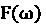，以下公式：

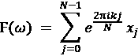

类似地，我们可以定义量子变换为从一个基到另一个基的变换。例如，到目前为止，我们在这本书中所做的所有计算都是根据*Z*基进行的。这意味着我们的基态已经被设置在量子比特的*Z*-轴上，状态和分别对应于 Bloch 球上*Z*-轴的正负两端。

当然，如果需要，我们还可以转换到其他基态。一个例子是量子比特的*X*-轴，那里的基态是和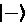，分别对应于 Bloch 球上*X*-轴的正负两端。QFT 会在这两个基态之间转换。QFT 被许多量子算法使用，包括 Shor 算法，因为它已被证明在经典离散傅里叶变换的实现上有所改进。

在本节中，我们将通过一个简单的 QFT 算法示例来加深我们对它的理解，当我们看到它在许多其他量子算法中使用时。

我们将首先将 QFT 应用于一个简单的三量子比特量子态。

### 理解 QFT 算法

在深入细节之前，让我们首先了解每个轴代表什么。如您从玻色球体回忆的那样，它是量子比特的一种视觉表示，由三个轴组成，即 *X*、*Y* 和 *Z* 轴。绕 *X* 和 *Y* 轴的旋转是我们用来调整量子比特振幅的方法，即沿着玻色球体的经度（北极到南极）。绕 *Z*-轴的旋转是我们用来调整量子比特相位的，即沿着玻色球体的纬度。

每个轴都是一个基态，由轴命名，即 *X*-基态、*Y*-基态和 *Z*-基态。在量子计算中，*Z*-轴通常被称为计算基，而 *X* 和 *Y*-轴可以是傅里叶基。在这个例子中，我们将 *X*-基设为傅里叶基。QFT 变换通常是从一个基到另一个基的变换，在这种情况下，是从计算基（*Z*）到傅里叶基（*X*）。

为了将我们的量子函数从一个基态转换到另一个基态，我们需要应用 QFT，如下所示：

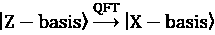

在前面的方程中，*Z – basis* 指的是 *Z*-轴上的基态， 和 ，而 *X – basis* 指的是 *X*-轴上的基态（通常被称为相位态，因为绕它们的旋转指的是绕 *Z*-轴的旋转），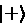 和 。Qiskit 文档（[`docs.quantum.ibm.com/`](https://docs.quantum.ibm.com/））使用波浪号（*~*）表示傅里叶基，其中 *QFT* 是应用于状态  的 QFT 变换，如下所示：

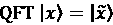

这可以等同于以下公式，其中变换由 QFT 在 *x*[j] 和 *y*[k] 的振幅之间表示：

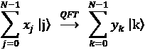

现在，让我们看看我们如何在量子电路中实现 QFT。

### 实现量子傅里叶变换（QFT）算法

让我们从基于输入状态 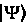 的实现推导开始。

另一种方法是按顺序将其应用于以下公式，随着我们从量子比特到量子比特的移动。对于这个例子，我们将按以下方式操作；给定一个状态 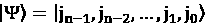，我们将应用一个哈达玛门，其中我们根据状态  添加相位，其中每个值，j[i]，都附加到相位上，如下所示：

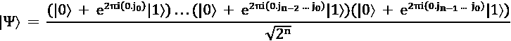

在以下练习中，我们将实现 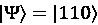 的 QFT，其中 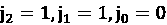。重要的是要注意，指数的分数部分是二进制，而不是十进制：

1.  我们将首先打开一个新的 Jupyter 笔记本，导入一些常用对象并运行我们的辅助文件：

    ```py
    # Importing standard Qiskit libraries
    from qiskit import QuantumCircuit, transpile
    from qiskit.transpiler.preset_passmanagers import
                 generate_preset_pass_manager
    from qiskit.visualization import *
    from qiskit_ibm_runtime import QiskitRuntimeService, Sampler, Estimator, Session, Options
    service = QiskitRuntimeService(channel="ibm_quantum") 
    ```

1.  接下来，我们将创建一个量子电路，其宽度等于我们的状态值长度，`'110'`：

    ```py
    # Initialize the 3-qubit quantum circuit
    # Set the state '110'
    s = '110'
    num_qubits = len(s)
    qc = QuantumCircuit(num_qubits) 
    ```

1.  现在我们已经创建了我们自己的量子电路，让我们将状态，*s*，初始化为 。由于我们从最不显著的位置开始写，我们将相应地反转`s`：

    ```py
    # Set reverse ordering
    s = s[::-1]
    # Construct the state 110
    for idx in range(num_qubits):
        if s[idx] == '1':
            qc.x(idx)   
    qc.barrier()
    qc.draw(output='mpl') 
    ```

前面的代码将初始化并渲染我们的电路如下：

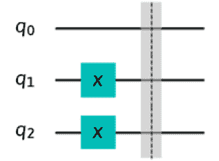

图 12.1：初始化状态，s，为 

1.  现在我们已经准备好了我们的状态，我们可以开始使用 QFT 对其进行变换。

让我们回顾一下我们的变换方程，使用我们的状态 ：

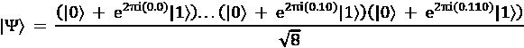

这表示对于每个我们应用 Hadamard 门的量子位，在遍历从量子位到最不显著的量子位的过程中，我们需要包括旋转——因此，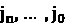。当我们向下遍历，量子位的状态会逐度减少。这意味着每个受控相位旋转，**控制旋转**（**CROT**），基于以下矩阵表示：

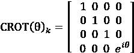

在前面的方程中，CROT(q)k 是 CU[1]门，参数*q*设置如下：

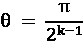

因此，我们将从我们的状态  中的最显著的量子位，*q*[2]，开始，如下所示。

1.  从最显著的量子位开始，我们将向电路中添加一个 Hadamard 门：

    ```py
    # Import the value pi for our rotations
    from numpy import pi
    # Always start from the most significant qubit,
    # in this case it's q2.
    # Step 1, add a Hadamard gate
    qc.h(2) 
    ```

1.  现在我们有了第一步，下一步是添加 CROT(![添加 CROT 门，从最显著的到最不显著的，从)）门，从*k=2*开始，这是最显著的量子位位置，q[2]的索引，我们的参数  从以下开始：

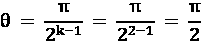

我们从最显著的量子位开始，添加 CROT 门，从最显著的到最不显著的，从  开始，并且随着我们向下移动到每个量子位，参数的分母加倍：

```py
# Step 2, add CROT gates from most significant qubit
qc.cp(pi/2, 1, 2) 
```

1.  然后，我们重复这个过程，当我们从当前量子位遍历到下一个量子位时——在这种情况下，*q*[0]：

    ```py
    # Step 3, add another CROT from 2 to the next qubit down,
    # while doubling the phase denominator
    qc.cp(pi/4, 0, 2)
    # Draw the circuit
    qc.draw(output='mpl') 
    ```

当我们向下遍历，参数的分母也在加倍，下一个参数  如下（注意，所有量子位都初始化为  的状态）：

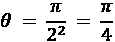

这渲染了以下电路，现在包括 Hadamard 门和两个 CROT 门：

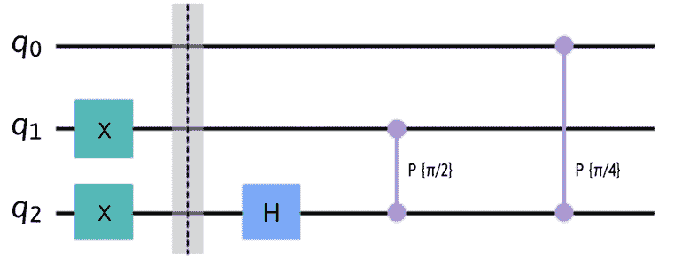

图 12.2：从最显著的量子位开始的第一个变换集

1.  这完成了第一级，处理了最显著的量子位。我们现在将向下移动到下一个量子位（第二最显著的量子位），并重复添加 Hadamard 门的过程，然后添加 CROT(q)门，其中相位旋转随着我们向下遍历每个量子位而减小。让我们继续到下一个量子位：

    ```py
    # Now that we finished from 2 down to 0
    # We'll drop to the next least significant qubit and
    # start again,
    # Step 1, add a Hadamard gate
    qc.h(1) 
    ```

1.  这与*步骤 4*添加 Hadamard 门相同；现在，我们以与之前相同的方式应用控制旋转门，然后绘制电路：

    ```py
    # Step 2, add Control Rotation (CROT) gates from most
    # significant towards
    # least significant starting a pi/2, and doubling the
    # denominator
    # as you go down each qubit.
    qc.cp(pi/2, 0, 1)
    # Draw the circuit
    qc.draw(output='mpl')
    # Now that we finished from 1 down to 0
    # We'll drop to the next least significant qubit and
    # start again. 
    ```

这将完成第二次变换，这将生成以下电路，它以 Hadamard 门开始，然后附加 CROT 门：

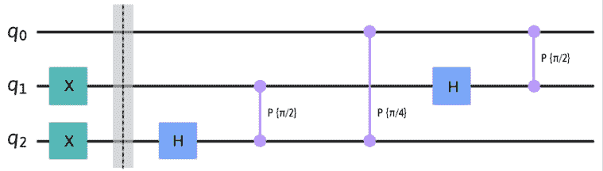

图 12.3：从下一个量子比特开始的下一个变换集

1.  接下来，我们将对最后一个量子比特运行变换，然后绘制电路：

    ```py
    # Step 1, add a Hadamard gate
    qc.h(0)
    # Since we are at the least significant qubit,
    # we are done!
    # Draw the circuit
    qc.draw(output='mpl') 
    ```

由于这是最后一个量子比特，也是最低有效位量子比特，它没有更低的级别，所以我们完成了 QFT 的 CROT 相位。这生成了以下电路：

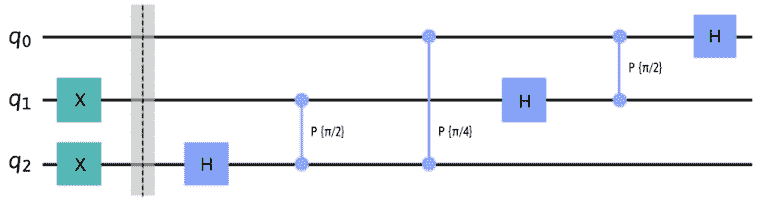

图 12.4：我们 QFT 电路的最终变换

1.  最后，一旦我们设置了所有旋转，我们需要应用交换门来反转我们的结果。我们需要这样做以完成 QFT 并按正确的顺序设置值。交换是从最外层的量子比特向内进行，直到达到中间的最后两个量子比特（如果量子比特总数是偶数），或者直到达到中间的最后两个带有单个量子比特的配对（如果量子比特总数是奇数）。

为了简化这个过程，我们可以创建一个函数来交换外层量子比特，并逐步向中间工作。在这种情况下，因为我们只有三个量子比特，所以我们只会交换外层的两个量子比特，如下所示：

```py
# Define a function which will add the swap gates to the
# outer pair of qubits
def add_swap_gates(qc_swaps, qubits):
    for qubit in range(qubits//2):
        qc_swaps.swap(qubit, qubits-qubit-1)
    return qc_swaps 
```

1.  现在，我们可以通过`add_swap_gates`函数运行我们的量子电路，并完成电路：

    ```py
    qft_circuit = add_swap_gates(qc, num_qubits)
    qft_circuit.draw(output='mpl') 
    ```

这将生成我们的 QFT 电路，它编码了我们的`'110'`值，如下所示：


图 12.5：编码‘110’的 QFT 电路

1.  让我们包含一些辅助函数，类似于我们在上一章中创建的函数，这些函数可以在模拟器或量子系统上运行。这次，我们将包括一个选项来选择射击次数。

    ```py
    # Run on a local Sampler
    def run_on_sampler(circuit, shots):
        from qiskit.transpiler.preset_passmanagers import generate_preset_pass_manager
        from qiskit_ibm_runtime import SamplerV2 as Sampler
        from qiskit_ibm_runtime.fake_provider import FakeManilaV2
        # Run the sampler job locally using FakeManilaV2
        fake_manila = FakeManilaV2()
        pass_manager = generate_preset_pass_manager(backend=fake_manila, optimization_level=1)
        transpiled_qc = pass_manager.run(circuit)
        # To ensure we get fixed results, set seed
        options = {"simulator": {"seed_simulator": 10258}}
        sampler = Sampler(mode=fake_manila, options=options)

        result = sampler.run([transpiled_qc], shots=shots).result()[0]
        return result
    # Run on the least busy quantum computer
    def run_on_qc(circuit, shots):
        # At the time of this writing we are using the latest version of 
        # the Sampler primitive (V2), please review the documentation to follow updates if you are using a previous version.
        from qiskit_ibm_runtime import SamplerV2 as Sampler2
        # Assign least busy device to backend
        backend = 
                        service.least_busy(min_num_qubits=circuit.num_qubits,
                 simulator=False, operational=True)
        #Print the least busy device
        print('The least busy device: {}'.format(backend))
        result = {}

       transpiler = generate_preset_pass_manager(backend=backend, optimization_level=3) 
       transpiled_qc = transpiler.run(circuit)
       sampler = Sampler2(backend)
       job = sampler.run([transpiled_qc], shots=shots)
       job_result = job.result()

       # Extract the results
       result = job_result[0]
       return result 
    ```

1.  为了可视化我们的量子场论（QFT）结果，我们可以使用状态向量模拟器执行前面的电路，以查看每个量子比特的最终 QFT 编码：

    ```py
    # Get the state vector simulator to view our final QFT
    # state
    from qiskit.quantum_info import Statevector
    statevector = Statevector(qft_circuit)
    plot_bloch_multivector(statevector) 
    ```

前面的代码为每个量子比特生成以下编码：

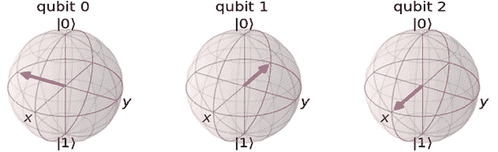

图 12.6：编码值为‘110’的 QFT 的布洛赫球体表示

注意，q[0]（交换前的 q[2]）旋转了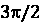（这是一个 Hadamard（H）加上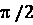旋转），q[1]旋转了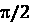(H)，而*q*[2]（交换前的 q[0]）旋转了 0，这主要是因为交换前 q[0]的值为 0，因为它被初始化为。

注意，每个量子比特都处于叠加态，并且根据编码的`'110'`值按相位变化。我们还可以使用`qsphere`对象来表示这一点，它将包含相同的信息，只是在一个单独的球体对象中表示：

```py
plot_state_qsphere(statevector) 
```

在下面的图中，我们可以看到信息被编码到 QSphere 中，并且其编码表示分别由颜色轮和 QSphere 指示的相位和状态向量：

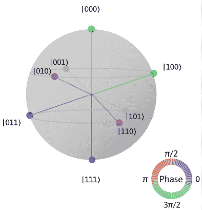

图 12.7：'110'状态的 QFT 表示的 QSphere 表示

注意，颜色表示结果中每个状态的相位，在撰写本文时，绿色表示对旋转状态‘000’和‘100’进行-度相位旋转![img/B18420_12_036.png]

恭喜！你已经完成了你的第一个 QFT 编码！这是一个你将在许多依赖周期性功能的算法中看到的算法。

在本节中，我们学习了 QFT 算法，并实现了它。有一件事我们没有涉及，但很重要，那就是 QFT 还有一个逆函数，称为**逆量子傅里叶变换**（**IQFT**）。这很简单，就是 QFT 的逆过程，本质上是将量子状态从量子傅里叶基转换回计算基。这是通过反转在转换 QFT 时执行的功能来完成的，包括反向旋转。也就是说，如果我们旋转了一个量子比特![img/B18420_12_041.png]，那么在执行 IQFT 时，我们会以相同的角度旋转量子比特，但这次是相反的方向，即![img/B18420_12_042.png]。

通过理解状态转换的基础，你现在能够利用这在许多周期性函数和算法中，例如估计特征值或单位矩阵，以及分解离散对数。

接下来，我们将探讨一个更著名的搜索算法："Grover 算法"。

# 学习 Grover 搜索算法

搜索算法的独特之处在于，它们可以被各种算法利用来查找信息，无论是在数据存储库还是在值列表中，例如图像中的特征。当然，量子计算的优势在于加速搜索的潜力。"Grover 算法"就是一个这样的例子。它使用一种众所周知的技术，允许使用干涉来放大我们量子电路中的某些状态，从而增加我们正在搜索的值的振幅，并减少我们不需要的值。让我们像往常一样，先描述问题，其中每个状态都类似于无序列表中的一个条目。

## 理解问题

这里的问题也非常简单：我们给定了一组状态，其中所有状态都设置为 0，除了一个状态设置为 1。我们希望识别出哪个状态被设置为 1。

在经典情况下，如果第一个值被设置，这可以在最佳情况下一步完成。在最坏的情况下，需要*N*步，其中*N*是总状态数，最后一个状态被设置。这意味着平均来说，需要*N/2*步来找到值，因为我们需要逐个检查每个值。

显然，如果我们的集合是一个非常长的列表，这并不是理想的。我们需要找到一种更好的方法来找到我们的值。这就是在 1996 年，Lov Grover 出现并发现了一种使用他现在著名的量子算法来解决这个问题的方法。当我们尝试在一个三量子比特电路中搜索一个值时，我们将逐步实现 Grover 算法。

要使用函数描述这个问题，我们可以陈述以下内容，给定一个函数：

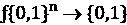

从前面的方程中，对于所有除了特定情况*x*以外的*x*的情况，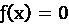。找出*x*的值。由于我们将使用量子比特，让我们选择一个值*N*，使得*N* = 2^n。

现在我们已经定义了我们的问题，让我们逐步通过 Grover 的搜索算法。

## 理解 Grover 的搜索算法

Grover 算法与 Deutsch-Jozsa 和 Bernstein-Vazirani 算法类似，因为它也利用了预言机。然而，请注意，这里给出的例子展示了一个非常简单的预言机，我们事先知道标记的状态。这是为了演示目的；然而，在实际应用中，预言机不仅会更复杂，而且我们也不知道哪个状态会被标记。

Deutsch-Josza 和 Grover 算法之间的另一个相似之处是，Grover 也以某种方式利用了干涉，它会增加我们正在搜索的状态的振幅，同时减少所有其他状态，这反过来又通过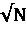增加了速度，其中*N*是要搜索的状态数。这意味着我们不需要迭代 N 中的每个值，而是获得指数级的加速，类似于我们在 Deutsch-Jozsa 中做的那样。

我们将首先解释 Grover 的搜索过程，以便了解它是如何工作的。对于这个背后的数学的更深入描述，我推荐 Robert S. Sutor 的书籍《与量子比特共舞》，它对此有更详细的介绍。

Grover 的搜索算法可以分为两个主要组件——如果你把初始化所有量子比特到叠加态和在最后添加测量算子算作第三个组件的话，那么就是三个——但这是大多数量子算法都会做的事情，所以我们将只关注两个主要点。第一个被称为**Grover 的预言机**，第二个是**Grover 扩散算子**。

在这个例子中，我们将描述一个双量子比特系统，当通过给每个量子比特应用 Hadamard 门将其置于叠加态时，提供四种可能的状态——**00**、**01**、**10**和**11**——如下所示：

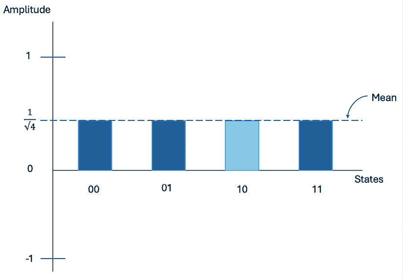

图 12.8：两个处于叠加状态的反转量子比特

当处于这种状态时，平均值等于概率振幅，在这种情况下是**0.25**，如每个状态顶部的虚线所示。

对于这个例子，我们假设我们想要搜索的状态是状态`'10'`。

第一部分是**oracles**，*U*[f]。这是我们通常标记我们正在寻找的值的地方。通过标记，我的意思是我们将发出信号，即我们正在寻找的状态将通过简单地改变状态的符号从正变为负来识别。过渡将如下所示：

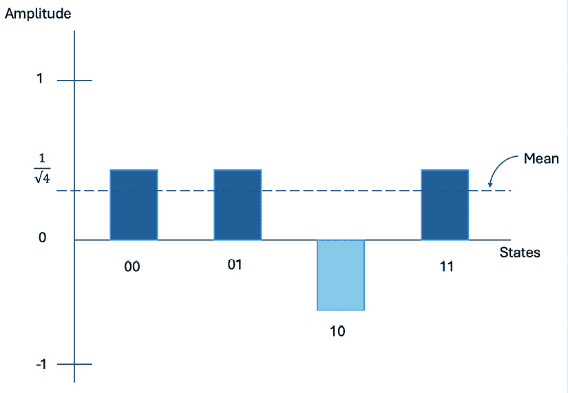

图 12.9：将状态符号改为负

现在我们已经改变了符号，不幸的是，我们在这个点上不能只是进行测量然后继续——主要是因为，正如我们所知，概率振幅是平方的，所以我们的结果仍然都会相等，这并没有给我们提供任何关于我们正在寻找的信息的新信息。然而，由于我们正在处理振幅，我们可以通过增加我们标记的状态的振幅并减少其他状态的振幅来利用干涉。*我们如何做到这一点？* 通过结合 Grover 搜索的第二部分，即**扩散算子**。

Grover 算法的第二部分是**Grover 扩散算子**。在这里，我们将执行一个称为*关于平均值的反转*的数学步骤。这样做的作用是反转每个状态的平均值与峰值之间的距离。这相当于每个状态相对于平均值进行反射翻转。直观上看，过渡将如下所示：

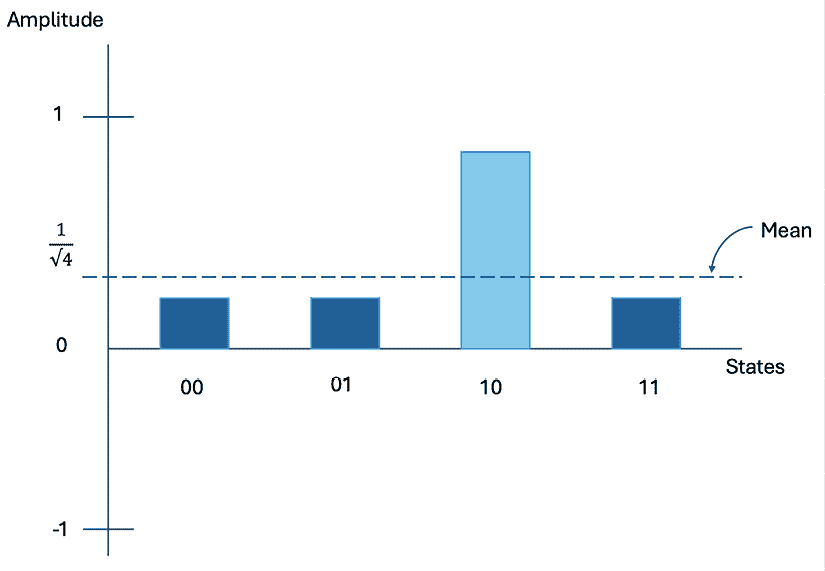

图 12.10：关于平均值的反转以建设性和破坏性方式放大状态

从对平均值进行反转操作的结果中我们可以看出，标记状态的放大现在显著高于其他状态。如果我们现在进行测量，我们会看到结果中概率更高的状态就是我们正在寻找的状态。当然，记住，这一切都是通过对我们量子电路的单次查询完成的！

需要注意的一点是，当状态的数量，*N*，很大时，这意味着我们需要多次重复扩散算子步骤（而不是或 acles 构造步骤），这是构建和破坏振幅的过程。优化结果所需的次数是 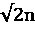，其中 *n* 是量子比特的数量。

让我们接下来实现 Grover 搜索算法。

## 实现 Grover 搜索算法

如同往常一样，当我们逐步通过算法时，我们将解释上一节中描述的每个步骤。首先，为这个例子创建一个新的 Qiskit 笔记本，并逐步完成以下步骤：

1.  我们首先声明我们想要设置的值。让我们将值设置为`110`。这样，我们可以使用一个三量子比特电路来实现 Grover 算法，并通过在每个量子比特上添加一个 H 门来使所有量子比特处于叠加态：

    ```py
    # Set the state we wish to search
    N = '110'
    num_qubits = len(N)
    # Create the quantum circuit
    qc = QuantumCircuit(num_qubits)
    # Set all qubits in superposition
    qc.h(range(num_qubits))
    qc.barrier()
    #Draw the circuit
    qc.draw(output='mpl') 
    ```

这将生成我们的初始化电路：

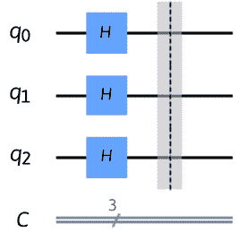

图 12.11：初始化的叠加量子电路

1.  接下来，我们想要编码我们想要搜索的态——在这种情况下，它是态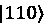。在这里，我们将反转态并在电路中编码`N`：

    ```py
    # Reverse the state so it's in proper qubit ordering
    N = N[::-1]
    # Encode N into our circuit
    for idx in range(num_qubits):
        if N[idx] == '0':
            qc.x(idx)
    qc.barrier()
    # Draw the circuit
    qc.draw(output='mpl') 
    ```

对于每一步，我们都会添加一个障碍，以便我们可以看到渲染的过程：

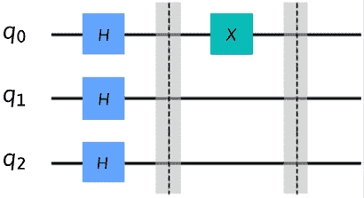

图 12.12：编码我们的状态‘110’，我们用 X 门标记状态中的‘0’量子比特

1.  接下来，我们将创建 Grover 的或门。我们在这里要做的首先是设置最显著量子比特的叠加态，然后是一个目标为最显著量子比特、源为所有其他量子比特的 CNOT 门。然后，在最显著量子比特上放置另一个 H 门来完成或门。这将否定我们在上一个源单元格中设置的态，：

    ```py
    # Create the Grover oracle for our 3-qubit quantum circuit
    qc.h(2)
    qc.ccx(0, 1, 2)
    qc.h(2)
    qc.barrier()
    # Draw the circuit
    qc.draw(output='mpl') 
    ```

上述代码生成了以下电路，我们可以看到它设置了围绕最显著量子比特的**H**门的我们或门中的两个 CNOT 门：

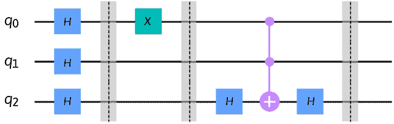

图 12.13：将 Grover 的或门应用于电路

1.  现在，我们想要将电路中我们正在搜索的态重置，使其返回到叠加值：

    ```py
    # Reset the value after the oracle
    for idx in range(num_qubits):
        if N[idx] == '0':
            qc.x(idx)
    qc.barrier()
    # Draw the circuit
    qc.draw(output='mpl') 
    ```

上述代码完成了我们之前描述的 Grover 或门，它是 Grover 搜索算法的第一个组件：

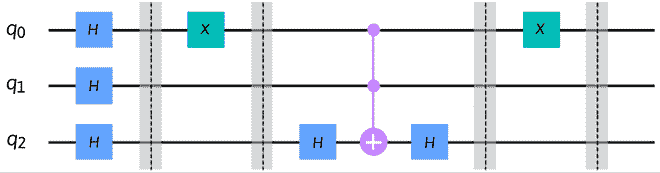

图 12.14：Grover 搜索算法的第一个组件

1.  接下来，我们将实现第二个组件，Grover 扩散算子。我们首先将所有量子比特置于叠加态：

    ```py
    # Set all qubits in superposition
    qc.h(range(num_qubits))
    qc.x(range(num_qubits))
    qc.barrier()
    # Draw the circuit
    qc.draw(output='mpl') 
    ```

这将生成以下叠加态，然后是 Grover 的或门：

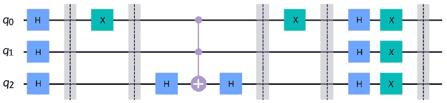

图 12.15：Grover 扩散算子的第一步：对所有量子比特应用 H 门

1.  接下来，我们将翻转所有 0 态量子比特到它们的负相。在这里，最显著量子比特被设置为两个 CNOT 门的目标：

    ```py
    # Apply another oracle, same as the previous
    qc.h(2)
    qc.ccx(0, 1, 2)
    qc.h(2)
    qc.barrier()
    # Draw the circuit
    qc.draw(output='mpl') 
    ```

这将渲染扩散算器的下一步——即关于平均值的反转：

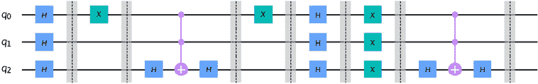

图 12.16：扩散算子的第二步：关于平均值的反转

1.  最后，我们通过逆向应用第一步来总结 Grover 扩散算子。由于我们在所有量子位上应用了一组 H 门，随后又应用了一组 X 门，也是跨所有量子位，我们将在以下方式中逆转这一过程。首先在所有量子位上应用 X 门，然后应用所有量子位上的 H 门：

    ```py
    # Reapply the X rotations on all qubits
    qc.x(range(num_qubits))
    qc.barrier()
    # Reapply Hadamard gates to all qubits
    qc.h(range(num_qubits))
    # Draw the circuit
    qc.draw(output='mpl') 
    ```

上述代码完成了量子电路的 Grover 扩散算子组件：

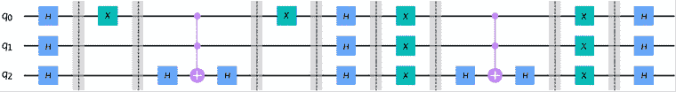

图 12.17：完整的 Grover 算法电路

为了确定重复扩散算子的理想次数 `n`，我们只需按照以下方式计算 n，

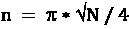

其中 N 是量子位数量（log N），对于两个量子位，N=4；在这个例子中，我们应该添加第二个扩散算子，将错误率从 3% 降低到 1%。

1.  现在，我们将添加测量算子并准备在后端运行电路，但首先在您的设备上的本地模拟器上：

    ```py
    # Add measurement operators
    qc.measure_all()
    # Draw the circuit
    qc.draw(output='mpl') 
    ```

上述代码将准备以下量子电路，以便在模拟器或量子计算机上运行：

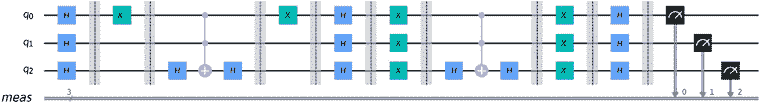

图 12.18：准备在模拟器或量子系统上运行的完整量子电路

1.  我们将首先运行我们创建的用于执行电路的函数，使用 Sampler 原语：

    ```py
    # Run on the sampler
    result = run_on_sampler(qc, shots=4000)
    counts = result.data.meas.get_counts()
    # Print and plot results
    print(counts)
    plot_distribution(counts) 
    ```

执行电路后，这将按照以下方式打印和绘制我们的结果：

```py
{'010': 274, '110': 2237, '000': 198, '100': 499, '101': 175, '111': 238, '001': 191, '011': 188} 
```

在以下图中，我们可以看到我们正在搜索的状态具有更高的概率，准概率为 0.559%，而所有其他状态的概率显著较低，约为 0.05%：

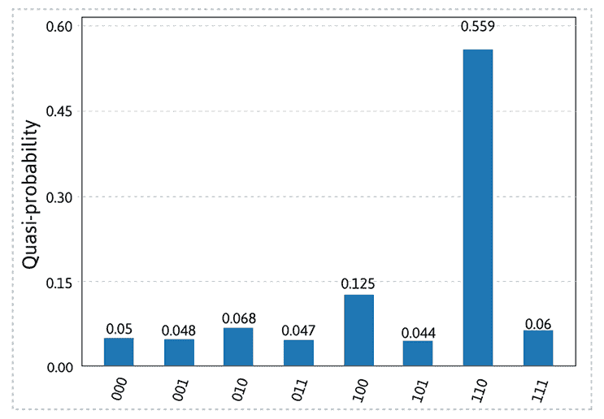

图 12.19：在 Sampler 上执行 Grover 搜索状态 110 的结果

成功！正如预期的那样，我们的 Grover 算法实现在一个查询内找到了状态。

1.  现在，让我们在一个量子设备上尝试。我们将选择最不繁忙且可操作的量子计算机，并且具有运行我们的量子电路所需的量子位数量。

    ```py
    # Execute the circuit on the least busy quantum computer
    backend = service.least_busy(min_num_qubits = num_qubits,
                                 simulator = False,                    
                                 operational = True)
    print("Set backend: ", backend) 
    ```

上述代码将打印出最不繁忙的量子计算机并将其分配给 `backend` 变量。

1.  我们现在可以像之前使用模拟器一样执行它，然后打印和绘制结果：

    ```py
    # Run the circuit on the backend
    shots = 1000
    results = run_on_qc(qc, shots)
    counts = results.data.meas.get_counts()
    # Print results
    print(counts) 
    ```

1.  一旦完成，你应该会看到以下类似的输出：

    ```py
    The least busy device: <IBMBackend('ibm_osaka')>
    {'000': 85, '100': 52, '111': 219, '010': 61, '110': 373, '001': 73, '011': 71, '101': 66} 
    ```

1.  我们现在可以使用以下方法在图上绘制结果的准分布：

    ```py
    # Plot results
    plot_distribution(counts) 
    ```

这将显示以下输出：

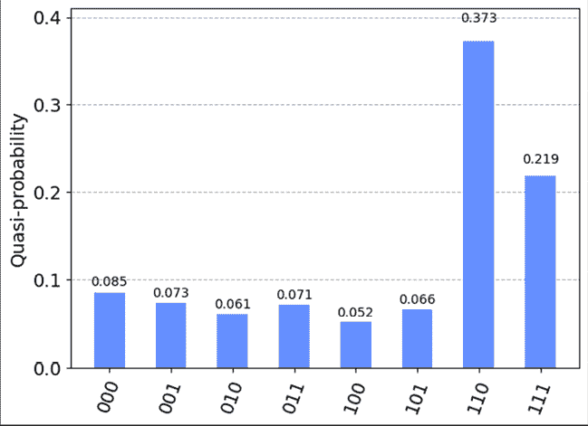

图 12.20：概率分布

当然，这取决于设备本身，因为每个系统都彼此不同。然而，结果应该是清晰的，即概率最高的状态就是我们正在寻找的状态——在这种情况下，。

正如我们所看到的，概率最高的状态就是我们正在寻找的状态，其他状态的概率较低。我们可以观察到每个状态之间的足够差异，以观察到我们实现的 Grover 搜索算法确实识别了我们正在寻找的状态。您也可以尝试使用更大的值 N，这样您就可以观察到结果。

恭喜！您已经成功实现了多种量子算法，这些算法是理解量子计算机如何与经典系统在解决问题上的不同，以及它们如何有可能解决现实世界问题的基石。

# 摘要

有许多算法实现了我们在本章和上一章量子算法章节中讨论的许多技术，其中许多您将在其他算法中看到使用，例如**量子振幅估计**和**变分量子本征值求解器**算法等。

我强烈建议您亲自尝试这些算法的变体，以更好地了解它们的工作原理。

在下一章和最后一章中，我们将探讨 Qiskit 内置的功能，这些功能允许您作为研究人员或开发者利用它们来创建自己的量子算法。您将获得将算法集成到现有研究或应用中的技能，而无需担心开发电路、降低噪声或构成 Qiskit 中算法的其他任何组件。这本书已经为您做了大量工作，因此您可以简单地实现算法，并按您的需求处理结果。

# 问题

1.  使用周期函数可以解决哪些其他问题？

1.  在五量子比特状态上实现 QFT——例如，`'10110'`。

1.  使用 Grover 算法找到以下状态：`'101'`，`'001'`，和`'010'`。

1.  您需要运行多少次 Grover 的扩散算子才能找到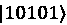的状态？

1.  重新运行 Grover 搜索示例。只重复 Grover 的扩散算子两次，并注意结果的不同。您看到了什么不同之处？如果您运行超过三次，您预计会发生什么变化？

# 加入我们的 Discord

加入我们社区的 Discord 空间，与作者和其他读者进行讨论：

`packt.link/3FyN1`


