# 第一章. 快速入门

没有适当的工具，数据分析是困难的。从一大堆按行和列排列的数字中直接提取模式并得出任何结论几乎是不可能的，即使是专家也是如此。一个合适的工具，如 R，将显著提高你在处理数据方面的生产力。根据我的经验，学习编程语言有点像学习人类语言。在了解大局、获得动力并从小处着手之前，直接跳入词汇和语法的细节可能不是一个好主意。本章通过深入概述 R 编程语言，为你提供一个快速入门。

在本章中，我们将涵盖以下主题：

+   介绍 R

+   R 的需求

+   安装 R

+   编写 R 代码所需的工具

一旦软件和工具准备就绪，你将编写一个简单的 R 程序来体验它基本的工作方式。一旦完成，R 之旅将从基础知识到高级技术和应用展开。

# 介绍 R

R 是一种强大的编程语言和环境，用于统计计算、数据探索、分析和可视化。它是免费的、开源的，并且有一个强大且快速增长的社区，用户和开发者在这里分享他们的经验，并积极为超过 7,500 个包的开发做出贡献，从而使 R 能够处理广泛领域的各种问题（参考[`cran.r-project.org/web/views/`](https://cran.r-project.org/web/views/)）。

尽管 R 编程语言的起源可以追溯到 1993 年，但其在 R 编程语言数据相关研究行业的普及在过去十年中迅速增长，并已成为数据科学的通用语言。

通常，R 应该被视为不仅仅是编程语言；它是一个全面的计算环境、一个强大而活跃的社区，以及一个快速发展和扩张的生态系统。

## R 作为一种编程语言

R 作为一种编程语言，在过去 20 年里一直在发展和演变。其目标是相当明确的，即使其易于灵活地进行全面的统计计算、数据探索和可视化。

然而，易用性和灵活性通常会产生冲突。在统计分析中，点击几个按钮轻松完成各种任务可能非常简单，但如果需要定制、自动化，并且你的工作需要可重复性，那么它就不会灵活。使用数十个功能来转换数据和制作复杂的图形可能非常灵活，但正确学习和组合这些功能却不会容易。R 因其恰到好处的平衡而脱颖而出。

## R 作为一个计算环境

R 作为一个计算环境，轻量级且易于使用。与其他一些著名的统计软件，例如 Matlab 和 SAS 相比，R 要小得多，部署也更容易。

在这本书中，我们将使用 RStudio 来处理我们几乎所有在 R 中的工作。这个集成开发环境提供了诸如语法高亮、自动完成、包管理、图形查看器、帮助查看器、环境查看器和调试等丰富功能。这些功能极大地提高了你的生产力。

## R 作为一个社区

R 作为一个社区，强大而活跃。你可以立即访问 Try R ([`tryr.codeschool.com/`](http://tryr.codeschool.com/))，并通过一个交互式教程来获得 R 基础的第一印象。在实践中，当你编码时，你可能不会自己解决每一个问题。你可能会在 Google 上搜索一个 R 问题，并发现它几乎总是有 StackOverflow ([`stackoverflow.com/questions/tagged/r`](http://stackoverflow.com/questions/tagged/r))上的答案。如果你的问题没有得到完全解决，你可以提出问题，并且可能几分钟内就能得到答案。

如果你需要使用一个包，但又想详细了解其工作原理，你可以访问其在线仓库（或 repo）的源代码。许多仓库由 GitHub 托管（[`www.github.com`](https://www.github.com)）。在 GitHub 上，你可以做很多事情。当你发现一个包运行不正常时，你可以通过在问题报告上提交一个 bug 来报告问题。如果你需要一个符合包用途的功能，你也可以通过提交一个需求报告来请求功能。如果你有兴趣通过解决 bug 和实现功能来为这个包做出贡献，你可以 fork 项目，编辑代码，并发送合并请求，以便你的更改可以被所有者接受。如果你的更改被接受，恭喜你，你已经成为了这个包的贡献者！令人惊讶的是，R 及其成千上万的包是由世界各地的贡献者共同构建的。

## R 作为一个生态系统

R 作为一个生态系统，正在快速成长和扩展，涵盖了所有与数据相关的领域，而不仅仅是 IT 行业。其大多数用户不是专业开发者，而是数据分析师和统计学家。这些用户可能不会编写最佳质量的代码，但他们可能会用 R 语言为生态系统贡献前沿的工具，而其他人可以免费访问这些工具，无需重新发明轮子。

例如，假设一个计量经济学家编写了一个扩展包，其中包含了一种检测时间序列模式类别的新方法；它可能会吸引一些觉得它有趣和有用的用户。一些专业用户可能会改进原始代码，使其运行更快、更通用。过了一段时间，一个量化投资者可能会发现将这种方法纳入交易策略很有帮助，因为它可以检测通常会导致其投资组合风险的模式。最终，计量经济学家的工具被应用于现实世界的行业，而投资者发现其投资组合的风险降低了。

这就是生态系统的运作方式。这也是为什么 R 在这些领域如此受欢迎的原因之一：它能够快速将 IT 行业（通常是数据科学、学术界和工业）外的尖端知识转化为生态系统中普遍可用和适用的工具。换句话说，它促进了从领域知识和数据科学到生产力和价值的转换。

# 对 R 的需求

R 在众多统计软件中脱颖而出，原因如下：

+   **免费**：R 完全免费。您不需要购买许可证，因此使用它以及其大多数扩展包没有财务门槛。

+   **开源**：R 语言及其大多数包都是完全开源的。成千上万的开发者持续审查这些包的源代码，以检查是否有需要修复的错误或需要改进的地方。如果您遇到异常，甚至可以深入源代码，找到问题所在，并贡献于修复它。

+   **流行**：R 语言是非常流行，如果不是最受欢迎的，用于数据挖掘、分析和可视化的统计编程语言和平台。高流行度通常意味着您与其他用户之间的沟通更加容易，因为您“说”的是同一种语言。

+   **灵活**：R 是一种动态脚本语言。它高度灵活，允许使用多种范式进行编程，包括函数式编程和面向对象编程。它还支持灵活的元编程。其灵活性使您能够执行高度定制和全面的数据转换和可视化。

+   **可重复性**：当使用基于图形用户界面的软件时，您只需从菜单中选择并点击按钮即可。然而，如果不编写脚本，很难自动准确地重现您所做的工作。

    在大多数科学研究和许多工业应用中，可重复性因多种原因而成为必要。R 脚本可以精确描述您在计算环境和数据上所做的工作，从而可以从头开始完全重复。

+   **丰富的资源**：R 语言拥有大量且不断增长的在线资源。其中一种资源是扩展包。截至撰写本文时，**CRAN**（即**综合 R 档案网络**）上已有超过 7,500 个包可供使用，这是一个全球镜像服务器网络，您可以从这里获取相同且最新的 R 分布和包。

    这些包是由近 4,500 名包开发者创建和维护的，几乎涵盖了所有与数据相关的领域，例如多元分析、时间序列分析、计量经济学、贝叶斯推断、优化、金融、遗传学、化学计量学、计算物理学等。您可以查看 CRAN 任务视图（[`cran.r-project.org/web/views/`](https://cran.r-project.org/web/views/））以获得良好的总结。

    除了大量的包之外，还有许多作者定期撰写个人博客和 Stack Overflow 回答，分享他们的想法、经验和推荐的最佳实践。此外，还有很多专注于 R 的网站，例如 R 博客园([http://www.r-bloggers.com/](http://www.r-bloggers.com/))、R 文档([`www.rdocumentation.org/`](http://www.rdocumentation.org/))和 METACRAN([`www.r-pkg.org/`](http://www.r-pkg.org/))。

+   **强大的社区**：R 社区不仅包括 R 的开发者，还包括来自统计学、计量经济学、金融、生物信息学、机械工程、物理学、医学等众多背景的 R 用户（大多数）。

    许多 R 开发者积极为开源项目或用 R 编写的包做出贡献。社区的目标是使数据分析、探索和可视化变得更加容易和有趣。

    如果你遇到 R 中的问题，只需谷歌一下让你困惑的问题；可能，已经有了一些关于你问题的答案。如果没有，只需在 Stack Overflow 上提问，你将在很短的时间内得到回复。

+   **前沿技术**：许多 R 用户是统计学、计量经济学或其他学科的专业研究人员。他们经常在发布新包的同时发表新论文，这些包中包含了论文中展示的前沿技术。这可能是一个新的统计测试、一种模式识别方法，或者是一个更好的优化算法。

    无论是什么，R 社区都有特权在其他人之前将前沿的数据科学知识应用于现实世界，从而提高其功能并揭示其潜力。

# 安装 R

要安装 R，你需要访问 R 的官方网站([`www.r-project.org/`](https://www.r-project.org/))，下载 R([`cran.r-project.org/mirrors.html`](https://cran.r-project.org/mirrors.html))，选择一个附近的镜像，并下载适合你操作系统的版本。在撰写本文时，最新版本是 3.2.3。本书中的示例是在 Windows 和 Linux 下创建和运行的，但与先前版本或其他支持的操作系统中的输出应该没有显著差异。

如果你使用 Windows，只需下载最新版本的安装程序。要安装 R，运行你刚刚下载的 Windows 安装程序。安装过程易于处理，但许多用户可能仍会在几个步骤上遇到问题。

在 Windows 下拉菜单中，当选择要安装的组件时，安装程序列出了四个组件。在这里，**核心文件**意味着 R 的核心库，而**消息翻译**组件提供了支持语言列表中许多警告和错误消息的多个版本。然而，可能让你感到困惑的是**32 位文件**和**64 位文件**选项。只需不用担心；你只需要知道 64 位 R 可以在单个进程中处理比其 32 位对应版本多得多的数据。如果你使用的是近年来购买的现代计算机，它很可能支持 64 位程序，并且应该运行 64 位操作系统，所以默认选项将是 64 位文件。如果你使用的是 32 位操作系统，很遗憾，除非你的硬件支持，否则你无法使用 64 位 R。

无论如何，我建议你安装默认选项，如下面的截图所示：

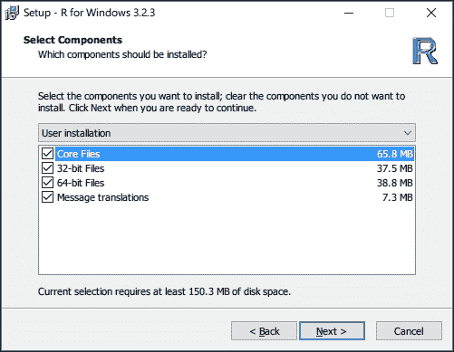

你可能感到困惑的另一个选项是是否在注册表中保存 R 版本号。检查这些选项使得其他程序更容易检测已安装的 R 版本。如果你确定你只在自己的环境中使用 R，那么就继续使用默认设置。

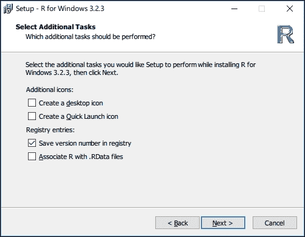

然后，安装程序开始将文件复制到你的硬盘上。


最后，R 被部署到你的计算机上。目前，你只有两种方式可以使用 R：在命令提示符（或终端）中或在 R GUI 中。

如果你允许安装程序在你的桌面上创建程序快捷方式，你将在那里找到两个 R 快捷方式。R 在命令提示符中运行，而 RGUI 在一个非常简单的 GUI 中运行。

虽然你现在可以开始使用 R，但这并不意味着你必须以这种方式使用它。我强烈推荐使用 RStudio 来编辑和调试 R 脚本。实际上，这本书也是用 RStudio 中的 R Markdown 编写的。虽然 RStudio 功能强大，但没有正确安装 R 是无法工作的。换句话说，R 是后端，而 RStudio 是一个前端，它可以帮助你更好地与后端协同工作。

如果你使用的是 Windows，你也可以安装 Rtools ([`cran.rstudio.com/bin/windows/Rtools/`](http://cran.rstudio.com/bin/windows/Rtools/))，这样你就可以编写 C++ 代码，编译它，并在 R 中调用它，你还可以从它们的源代码中安装和编译包含 C/C++ 代码的包。

# RStudio

RStudio 是 R 编程的强大用户界面。它是免费的、开源的，并且可以在包括 Windows、Mac 和 Linux 在内的多个平台上运行。

RStudio 具有非常强大的功能，这些功能极大地提高了你在数据分析和可视化中的生产力。它支持语法高亮、自动完成、多标签视图、文件管理、图形视口、包管理、集成帮助查看器、代码格式化、版本控制、交互式调试以及许多其他功能。

您可以在[`www.rstudio.com/products/rstudio/download`](https://www.rstudio.com/products/rstudio/download)下载最新版本的 RStudio。如果您想尝试带有新功能的预览版本，请从[`www.rstudio.com/products/rstudio/download/preview`](https://www.rstudio.com/products/rstudio/download/preview)下载。请注意，RStudio 不包括 R，因此在 RStudio 中工作时，您需要确保已安装 R。

在接下来的章节中，我将为您简要介绍 RStudio 的用户界面。

## RStudio 的用户界面

以下截图显示了 Windows 操作系统中的 RStudio 用户界面。如果您使用 Mac OS X 或支持的 Linux 版本，屏幕应该看起来几乎相同。

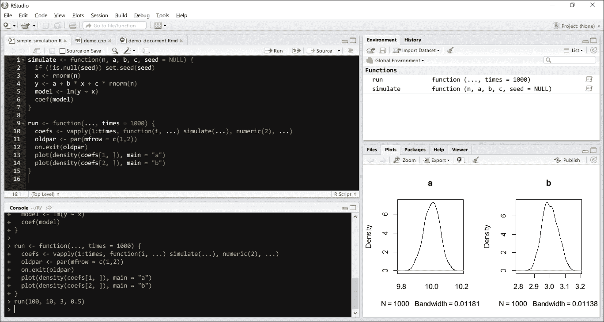

您可能会注意到主窗口由几个部分组成。每个部分被称为面板，并执行不同的功能。这些面板为数据分析师处理数据而精心设计。

### 控制台

以下截图显示了嵌入在 RStudio 中的 R 控制台。在大多数情况下，控制台的工作方式与命令提示符或终端完全相同。实际上，当您在控制台中输入命令时，RStudio 会将请求提交给 R 引擎。执行所有命令的是 R 引擎。RStudio 的作用是站在中间，从用户那里获取输入到 R 引擎，并展示它返回的结果。

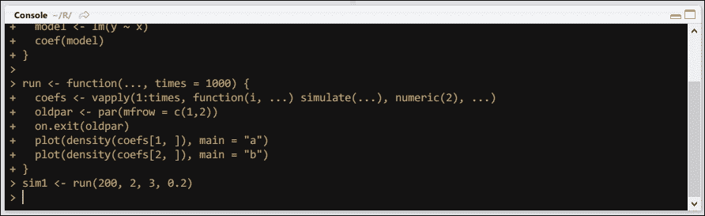

使用控制台，您可以轻松执行命令、定义变量或交互式地评估表达式以计算统计量、转换数据或生成图表。

### 编辑器

在控制台中输入命令不是我们通常处理数据的方式。相反，我们编写脚本，一组代表逻辑流程的命令，可以从文件中读取并由 R 引擎执行。编辑器用于编辑 R 脚本、Markdown 文档、网页、许多类型的配置文件，甚至 C++源代码。

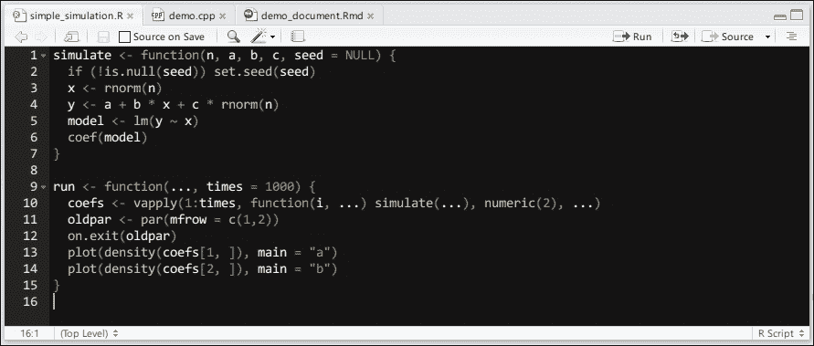

代码编辑器的功能远不止是一个纯文本编辑器：它支持语法高亮、R 代码的自动完成、带有断点的调试等。更具体地说，当编辑 R 脚本时，您可以使用以下快捷键：

+   按*Ctrl + Enter*以执行所选行

+   按*Ctrl + Shift + S*以源当前文档，即按顺序评估当前文档中的所有表达式

+   按*Tab 键或 Ctrl + Space*以显示与您当前输入匹配的变量和函数的自动完成列表

+   点击行号左侧的边缘设置断点；现在，当此行再次执行时，程序将暂停并等待您进行检查

### 环境面板

**环境**面板显示了您创建并可供重复使用的变量和函数。默认情况下，它显示全局环境中的变量，即您在其中工作的用户工作区。

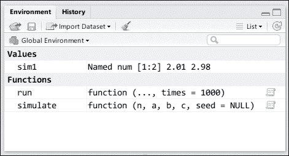

每次您创建一个新的对象（变量或函数），**环境**面板中都会出现一个新的条目。该条目显示了变量名及其值的简短描述。当您更改符号的值或甚至删除该符号时，您实际上是在修改环境，以便环境面板反映您的更改。

### 历史面板

**历史**面板显示了在控制台中评估过的先前表达式。您可以通过在控制台中向上键来重复之前执行的任务。

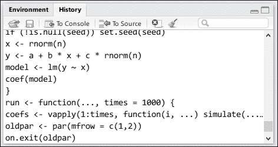

历史记录可能存储在工作目录中的`.Rhistory`文件中。

### 文件面板

文件面板显示了文件夹中的文件。您可以在文件夹之间导航，创建新文件夹，删除或重命名文件夹或文件，等等。

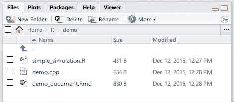

如果您正在处理 RStudio 项目，**文件**面板对于查看和组织项目文件非常方便。

### 绘图面板

**绘图**面板用于显示由 R 代码生成的图形。如果您生成多个绘图，之前的绘图将被存储，您可以导航来回查看所有绘图（直到您清除它们）。

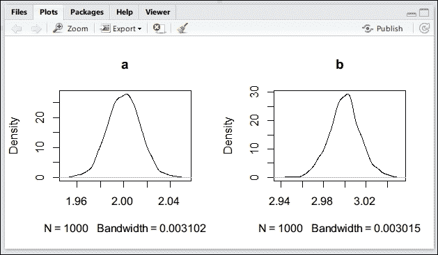

当您调整绘图面板的大小时，图形将适应其大小，以便它们看起来与调整大小之前一样好。您还可以将绘图导出为文件以供将来使用。

### 包面板

R 的许多功能都源于其包。**包**面板显示了所有已安装的包。您还可以轻松地从 CRAN 安装或更新包，或从您的库中删除现有的包。

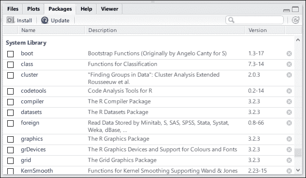

### 帮助面板

R 的许多功能也源于其详细的文档。**帮助**面板显示了文档，以便您可以轻松学习如何使用函数。

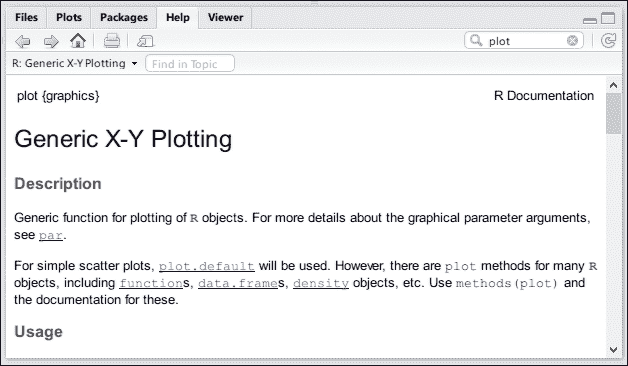

有许多方式可以查看函数的文档：

+   在搜索框中输入函数名并直接查找

+   在控制台中输入函数名并按*F1*

+   在函数名前输入`?`并执行它

在实践中，您不必记住 R 的所有函数；您只需要记住如何获取不熟悉的函数的帮助。

### 查看器面板

**查看器**面板是一个新功能；它是在越来越多的 R 包结合 R 和现有的 JavaScript 库的功能以制作丰富和交互式数据展示时引入的。

以下截图是我可格式化的([`renkun.me/formattable`](http://renkun.me/formattable))包的示例，该包提供了在 Excel 中使用 R 数据框进行条件格式化的一种简单实现：

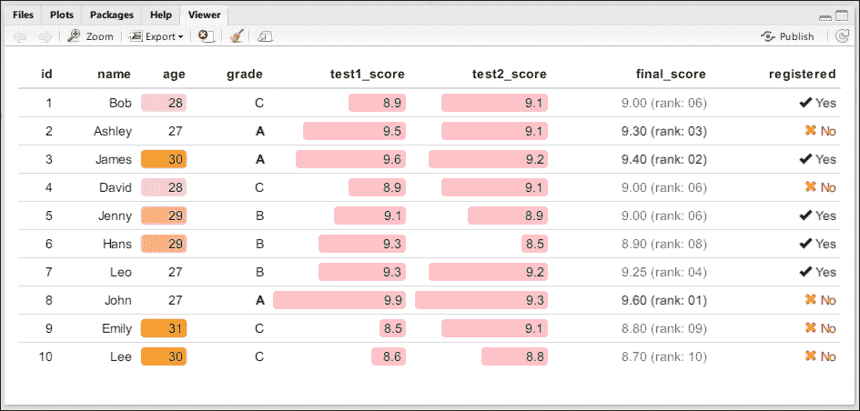

## RStudio Server

如果你使用的是支持的 Linux 版本，你可以轻松地设置 RStudio 的服务器版本或 RStudio Server。它运行在主机服务器上（可能比你的笔记本电脑更强大和稳定），你可以在你的网络浏览器中运行 RStudio 的 R 会话。用户界面大致相同，但你可以使用服务器的计算和内存资源，就像你使用本地计算机一样。

# 快速示例

在本节中，我将通过在控制台中输入命令来演示计算、模型拟合和生成图形的简单示例。

首先，让我们创建一个包含`100`个正态分布随机数的向量`x`。然后，创建另一个包含`100`个数字的向量`y`，每个数字是`x`中相应元素的 3 倍加上`2`和一些随机噪声。注意，`<-`是赋值运算符，我们将在后面介绍。我使用`str()`来打印向量的结构：

```py
x <- rnorm(100) y <- 2 + 3 * x + rnorm(100) * 0.5 str(x) 
##  num [1:100] -0.4458 -1.2059 0.0411 0.6394 -0.7866 ... 
str(y) 
##  num [1:100] -0.022 -1.536 2.067 4.348 -0.295 ... 

```

由于我们知道*X*和*Y*之间的真实关系是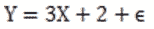，因此我们可以在样本*X*和*Y*上运行简单的线性回归，看看线性模型如何恢复模型的线性参数（即*2*和*3*）。我们通过调用`lm(y ~ x)`来拟合这样的模型：

```py
model1 <- lm(y ~ x) 

```

模型拟合的结果存储在一个名为`model1`的对象中。我们可以通过简单地输入`model1`或明确输入`print(model1)`来查看模型拟合：

```py
model1 
##  
## Call: 
## lm(formula = y ~ x) 
##  
## Coefficients: 
## (Intercept)            x   
##       2.051        2.973 

```

如果你想查看更多细节，请使用`model1`调用`summary()`：

```py
summary(model1) 
##  
## Call: 
## lm(formula = y ~ x) 
##  
## Residuals: 
##      Min       1Q   Median       3Q      Max  
## -1.14529 -0.30477  0.03154  0.30042  0.98045  
##  
## Coefficients: 
##             Estimate Std. Error t value Pr(>|t|)     
## (Intercept)  2.05065    0.04533   45.24   <2e-16 *** 
## x            2.97343    0.04525   65.71   <2e-16 *** 
## --- 
## Signif. codes:  0 '***' 0.001 '**' 0.01 '*' 0.05 '.' 0.1 ' ' 1 
##  
## Residual standard error: 0.4532 on 98 degrees of freedom 
## Multiple R-squared:  0.9778, Adjusted R-squared:  0.9776 
## F-statistic:  4318 on 1 and 98 DF,  p-value: < 2.2e-16 

```

我们可以将点和拟合的模型一起绘制：

```py
plot(x, y, main = "Simple linear regression") 
abline(model1$coefficients, col = "blue") 

```

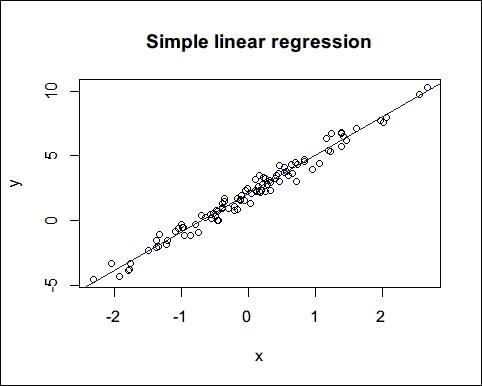

上述截图演示了一些简单函数，以便你能够对使用 R 有一个初步的了解。如果你不熟悉示例中的符号和函数，不要担心：接下来的几章将涵盖你需要了解的基本对象和函数。

# 摘要

在本章中，你了解了一些关于 R 及其主要优势的基本事实。我们学习了如何在 Windows 操作系统上安装 R。为了使 R 编程更简单，我们选择使用 RStudio，并了解了 RStudio 的用户界面，你了解到每个窗格的功能是其主窗口。最后，我们运行了几个 R 命令来拟合模型和绘制简单的图形，从而对使用 R 的方式有一个初步的了解。

在下一章中，我们将介绍 R 中的基本概念和数据结构，以帮助你熟悉基本 R 对象的行为。只有在你熟悉了这些之后，你才能轻松地表示、操作和处理各种数据。
