# 第七章。处理数据

在前面的章节中，你学习了在 R 中工作的最常用的对象类型和函数。我们知道如何创建和修改向量、列表和数据框，如何定义我们自己的函数以及如何使用适当的表达式将我们心中的逻辑翻译成编辑器中的 R 代码。有了这些对象、函数和表达式，我们可以开始处理数据。

在本章中，我们将开始一段处理数据之旅，并涵盖以下主题：

+   在文件中读取和写入数据

+   使用绘图函数可视化数据

+   使用简单的统计模型和数据挖掘工具分析数据

# 读取和写入数据

在 R 中任何类型的数据分析的第一步是加载数据，即导入一个数据集到环境中。在此之前，我们必须确定数据文件的类型并选择合适的工具来读取数据。

## 在文件中读取和写入文本格式数据

在所有用于存储数据的文件类型中，可能最广泛使用的是 CSV。在一个典型的 CSV 文件中，第一行是列标题，每一行后续的行代表一个数据记录，列之间由逗号分隔。以下是一个以这种格式编写的学生记录示例：

```py
Name,Gender,Age,Major
Ken,Male,24,Finance
Ashley,Female,25,Statistics
Jennifer,Female,23,Computer Science
```

### 通过 RStudio IDE 导入数据

RStudio 提供了一个交互式的方式来导入数据。你可以导航到**工具** | **导入数据集** | **从本地文件**，并选择一个本地文件，如`.csv`和`.txt`格式的文本文件。然后，你可以调整参数并预览结果数据框：

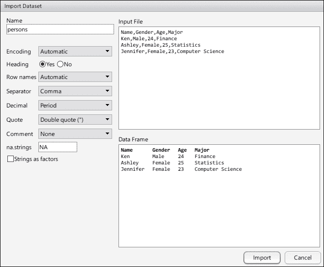

注意，只有当你打算将字符串列转换为因子时，才应该检查**字符串作为因子**。

文件导入器并非魔法，它将文件路径和选项转换为 R 代码。一旦你设置了数据导入参数并点击**导入**，它将执行对`read.csv()`的调用。使用这个交互式工具导入数据非常方便，并有助于你在第一次导入数据文件时避免许多错误。

### 使用内置函数导入数据

当你编写脚本时，你不能期望用户每次都与文件导入器交互。你可以将生成的代码复制到你的脚本中，这样每次运行脚本时它都会自动工作。因此，了解如何使用内置函数导入数据是有用的。

如前所述，最简单的内置函数是`readLines()`，它读取一个文本文件并返回一个字符向量作为多行：

```py
readLines("data/persons.csv")
## [1] "Name,Gender,Age,Major" 
## [2] "Ken,Male,24,Finance" 
## [3] "Ashley,Female,25,Statistics" 
## [4] "Jennifer,Female,23,Computer Science"
```

默认情况下，它将读取文件的所有行。要预览前两行，请运行以下代码：

```py
readLines("data/persons.csv", n = 2)
## [1] "Name,Gender,Age,Major" "Ken,Male,24,Finance"
```

对于实际的数据导入，`readLines()`在大多数情况下太简单了。它通过读取字符串行而不是将它们解析成数据框来工作。如果你想导入类似于前面代码的 CSV 文件中的数据，直接调用`read.csv()`：

```py
persons1 <- read.csv("data/persons.csv", stringsAsFactors = FALSE)str(persons1)
## 'data.frame': 3 obs. of 4 variables:
## $ Name : chr "Ken" "Ashley" "Jennifer"
## $ Gender: chr "Male" "Female" "Female"
## $ Age : int 24 25 23
## $ Major : chr "Finance" "Statistics" "Computer Science"
```

注意，我们希望字符串值保持不变，因此在函数调用中设置 `stringsAsFactors = FALSE` 以避免将字符串转换为因子。

该函数提供了许多有用的参数来定制导入。例如，我们可以使用 `colClasses` 来显式指定列的类型，并使用 `col.names` 来替换数据文件中的原始列名：

```py
persons2 <- read.csv("data/persons.csv", colClasses = c("character", "factor", "integer", "character"),  col.names = c("name", "sex", "age", "major"))  str(persons2)
## 'data.frame': 3 obs. of 4 variables:
## $ name : chr "Ken" "Ashley" "Jennifer"
## $ sex : Factor w/ 2 levels "Female","Male": 2 1 1
## $ age : int 24 25 23
## $ major: chr "Finance" "Statistics" "Computer Science"
```

注意，CSV 是分隔数据格式的一个特例。技术上讲，CSV 格式是一种使用逗号 (,) 分隔列和换行符分隔行的分隔数据格式。更普遍地说，任何字符都可以作为列分隔符和行分隔符。许多数据集以制表符分隔的格式存储，即它们使用制表符字符来分隔列。在这种情况下，您可能尝试使用基于此的更通用版本 `read.table()`，`read.csv()` 就是基于它实现的。

### 使用 `readr` 包导入数据

由于历史原因，`read.*` 函数存在一些不一致性，在某些情况下不太友好。`readr` 包是快速且一致地导入表格数据的良好选择。

要安装该包，请运行 `install.packages("readr")`。然后您可以使用一系列 `read_*` 函数导入表格数据：

```py
persons3 <- readr::read_csv("data/persons.csv")str(persons3)
## Classes 'tbl_df', 'tbl' and 'data.frame': 3 obs. of 4 variables:
## $ Name : chr "Ken" "Ashley" "Jennifer"
## $ Gender: chr "Male" "Female" "Female"
## $ Age : int 24 25 23
## $ Major : chr "Finance" "Statistics" "Computer Science"
```

在这里，我们使用 `readr::read_csv` 而不是先使用 `library(readr)`，然后直接调用 `read_csv`，因为它们的行为略有不同，容易混淆 `read_csv` 与内置的 `read.csv`：

此外，请注意，`read_csv` 的默认行为足够智能，可以处理大多数情况。为了与内置函数进行对比，让我们导入一个格式不规则的数据文件（`data/persons.txt`）：

```py
Name     Gender Age Major
Ken      Male   24  Finance
Ashley   Female 25  Statistics
Jennifer Female 23  Computer Science
```

文件内容看起来非常标准且表格化，但每列之间的空格数量在行之间不等，这使得 `read.table()` 无法使用 `sep = " "`：

```py
read.table("data/persons.txt", sep = " ")
## Error in scan(file, what, nmax, sep, dec, quote, skip, nlines, na.strings, : line 1 did not have 20 elements
```

如果您坚持使用 `read.table()` 导入数据，您可能会浪费大量时间试图找出控制行为的正确参数。然而，对于相同的输入，`readr` 中的 `read_table` 默认行为足够智能，因此可以帮助您节省时间：

```py
readr::read_table("data/persons.txt")
##   Name     Gender Age Major
## 1 Ken      Male   24  Finance
## 2 Ashley   Female 25  Statistics
## 3 Jennifer Female 23  Computer Science
```

正因如此，我强烈建议您使用 `readr` 中的函数将表格数据导入 R。`readr` 中的函数速度快、智能且一致，并支持内置函数的功能，这些内置函数更容易使用。要了解更多关于 `readr` 包的信息，请访问 [`github.com/hadley/readr`](https://github.com/hadley/readr)。

### 将数据框写入文件

数据分析中的一个典型程序是从数据源导入数据，转换数据，应用适当的工具和模型，最后创建一些新的数据以供决策存储。将数据写入文件的接口与读取数据的接口非常相似——我们使用 `write.*` 函数将数据框导出到文件。

例如，我们可以创建一个任意的数据框并将其存储在 CSV 文件中：

```py
some_data <- data.frame(
id = 1:4,
grade = c("A", "A", "B", NA), width = c(1.51, 1.52, 1.46, NA),check_date = as.Date(c("2016-03-05", "2016-03-06", "2016-03-10", "2016-03-11")))some_data
##   id grade width check_date
## 1 1   A    1.51  2016-03-05
## 2 2   A    1.52  2016-03-06
## 3 3   B    1.46  2016-03-10
## 4 4  <NA>   NA   2016-03-11
write.csv(some_data, "data/some_data.csv")
```

要检查 CSV 文件是否正确保留了缺失值和日期，我们可以以纯文本格式读取输出文件：

```py
cat(readLines("data/some_data.csv"), sep = "\n")
## "","id","grade","width","check_date"
## "1",1,"A",1.51,2016-03-05
## "2",2,"A",1.52,2016-03-06
## "3",3,"B",1.46,2016-03-10
## "4",4,NA,NA,2016-03-11
```

尽管数据是正确的，有时我们可能对存储此类数据有不同的标准。`write.csv()` 函数允许我们修改写入行为。从前面的输出中，我们可能会认为其中有一些不必要的组件。例如，我们通常不希望导出行名，因为它们似乎有点冗余，因为 id 已经完成了它的任务。我们不需要字符串值周围的引号。我们希望缺失值用 `-` 而不是 `NA` 表示。为了进行下一步，我们可以运行以下代码以以我们想要的特性和标准导出相同的数据框：

```py
write.csv(some_data, "data/some_data.csv", quote =FALSE, na = "-", row.names = FALSE)
```

现在，输出数据是一个简化的 CSV 文件：

```py
cat(readLines("data/some_data.csv"), sep = "\n")
## id,grade,width,check_date
## 1,A,1.51,2016-03-05
## 2,A,1.52,2016-03-06
## 3,B,1.46,2016-03-10
## 4,-,-,2016-03-11
```

我们可以使用 `readr::read_csv()` 导入具有自定义缺失值和日期列的此类 CSV 文件：

```py
readr::read_csv("data/some_data.csv", na = "-")
##   id grade width check_date
## 1 1   A    1.51  2016-03-05
## 2 2   A    1.52  2016-03-06
## 3 3   B    1.46  2016-03-10
## 4 4  <NA>   NA   2016-03-11
```

注意，`-` 被正确转换为缺失值，日期列也被正确导入为日期对象：

```py
## [1] TRUE
```

## 阅读和编写 Excel 工作表

文本格式数据（如 CSV）的一个导入优势是软件中立性，也就是说，你不需要依赖特定的软件来读取数据，文件可以直接由人类阅读。然而，其缺点也很明显——我们无法直接在文本编辑器中对表示在文本编辑器中的数据进行计算，因为内容是纯文本。

存储表格数据的另一种流行格式是 Excel 工作簿。Excel 工作簿包含一个或多个工作表。每个工作表是一个网格，你可以在其中填写文本和值来制作表格。有了表格，你可以在表格内、表格之间，甚至跨工作表轻松地进行计算。Microsoft Excel 是一款功能强大的软件，但它的数据格式（`.xls` 用于 Excel 97-2003 和 `.xlsx` 自 Excel 2007 以来）不能直接读取。

例如，`data/prices.xlsx` 是一个简单的 Excel 工作簿，如下面的截图所示：

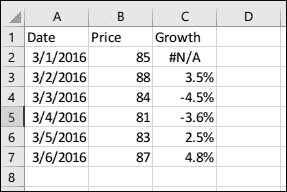

虽然没有内置函数可以读取 Excel 工作簿，但有几个 R 包被设计用来与之配合工作。最简单的一个是 readxl ([`github.com/hadley/readxl`](https://github.com/hadley/readxl))，它使得从 Excel 工作簿的单个工作表中提取表格变得容易得多。要从 CRAN 安装此包，使用 `install.package("readxl")`：

```py
readxl::read_excel("data/prices.xlsx")
##   Date        Price Growth
## 1 2016-03-01  85    NA
## 2 2016-03-02  88    0.03529412
## 3 2016-03-03  84   -0.04545455
## 4 2016-03-04  81   -0.03571429
## 5 2016-03-05  83    0.02469136
## 6 2016-03-06  87    0.04819277
```

从前面的数据框中可以看出，`read_excel()` 自动将 Excel 中的日期转换为 R 中的日期，并正确保留了 `Growth` 列中的缺失值。

另一个用于处理 Excel 工作簿的包是 `openxlsx`。此包可以读取、写入和编辑 XLSX 文件，比 `readr` 设计的功能更全面。要安装此包，运行 `install.package("openxlsx")`。

使用 `openxlsx`，我们可以调用 `read.xlsx` 从指定的工作簿中读取数据到数据框中，就像 `readr::read_excel()` 一样：

```py
openxlsx::read.xlsx("data/prices.xlsx", detectDates = TRUE)
##   Date       Price Growth
## 1 2016-03-01  85    NA
## 2 2016-03-02  88    0.03529412
## 3 2016-03-03  84   -0.04545455
## 4 2016-03-04  81   -0.03571429
## 5 2016-03-05  83    0.02469136
## 6 2016-03-06  87    0.04819277
```

为了确保日期值被正确导入，我们需要指定 `detectDates = TRUE`；否则，日期将保留为数字，就像你可能尝试的那样。除了读取数据外，`openxlsx` 还能够创建包含现有数据框的工作簿：

```py
openxlsx::write.xlsx(mtcars, "data/mtcars.xlsx")
```

该包支持更高级的功能，例如通过创建样式和插入图表来编辑现有工作簿，但这些功能超出了本书的范围。更多详情，请参阅该包的文档。

有其他包是为处理 Excel 工作簿而设计的。XLConnect ([`cran.r-project.org/web/packages/XLConnect`](http://cran.r-project.org/web/packages/XLConnect)) 是另一个跨平台的 Excel 连接器，它不依赖于现有的 Microsoft Excel 安装，但确实依赖于现有的 Java 运行时环境 (JRE)。RODBC ([`cran.r-project.org/web/packages/RODBC`](http://cran.r-project.org/web/packages/RODBC)) 是一个更通用的数据库连接器，能够在 Windows 上安装了适当的 ODBC 驱动程序后连接到 Access 数据库和 Excel 工作簿。由于这两个包有更重的依赖性，我们不会在本节中介绍它们。

## 读取和写入原生数据文件

在前面的章节中，我们介绍了 CSV 文件和 Excel 工作簿的读取器和写入器函数。这些是非原生数据格式，即 R 与原始数据对象和输出文件之间存在差距。

例如，如果我们将具有许多不同类型列的数据框导出到 CSV 文件中，列类型的信息将被丢弃。无论列是数值型、字符串型还是日期型，它总是以文本格式表示。这当然使得人类可以直接从输出文件中读取数据变得更容易，但我们将不得不依赖于计算机如何猜测每列的类型。换句话说，有时读取器函数很难将 CSV 格式的数据恢复成与原始数据框完全相同的数据，因为写入过程会丢弃列类型以换取可移植性（例如，其他软件也可以读取数据）。

如果你不在乎可移植性，并且仅使用 R 处理数据，你可以使用原生格式来读取和写入数据。你不能再使用任意文本编辑器来读取数据，也不能从其他软件中读取数据，但可以高效地读写单个对象，甚至整个环境，而不会丢失数据。换句话说，原生格式允许你将对象保存到文件中，并恢复完全相同的数据，无需担心诸如缺失值的符号、列的类型、类和属性等问题。

### 以原生格式读取和写入单个对象

与原生数据格式相关的有两组函数。一组是设计用来将单个对象写入 RDS 文件或从 RDS 文件中读取单个对象，这是一种以序列化形式存储单个 R 对象的文件格式。另一组与多个 R 对象一起工作，我们将在下一节中介绍。在以下示例中，我们将 `some_data` 写入 RDS 文件，并从同一文件中读取它，以查看两个数据框是否完全相同。

首先，我们使用 `saveRDS` 将 `some_data` 保存到 `data/some_data.rds`：

```py
saveRDS(some_data, "data/some_data.rds")
```

然后，我们从同一文件中读取数据，并将数据框存储在 `some_data2` 中：

```py
some_data2 <- readRDS("data/some_data.rds")
```

最后，我们使用 `identical()` 测试两个数据框是否完全相同：

```py
identical(some_data, some_data2)
## [1] TRUE
```

两个数据框完全相同，正如预期的那样。

原生格式有两个显著优点：空间效率和时间效率。在以下示例中，我们将创建一个包含 200,000 行随机数据的大型数据框。然后，我们分别计时将数据框保存到 CSV 文件和 RDS 文件的过程：

```py
rows <- 200000
large_data <- data.frame(id = 1:rows, x = rnorm(rows), y = rnorm(rows))system.time(write.csv(large_data, "data/large_data.csv"))
## user system elapsed 
## 1.33 0.06 1.41
system.time(saveRDS(large_data, "data/large_data.rds"))
## user system elapsed 
## 0.23 0.03 0.26
```

很明显，`saveRDS` 的写入效率比 `write.csv` 高得多。

然后，我们使用 `file.info()` 来查看两个输出文件的大小：

```py
fileinfo <- file.info("data/large_data.csv", "data/large_data.rds")fileinfo[, "size", drop = FALSE]
## size
## data/large_data.csv 10442030
## data/large_data.rds 3498284
```

两个文件大小之间的差距很大——CSV 文件的大小几乎是 RDS 文件的三倍，这表明原生格式具有更高的存储或空间效率。

最后，我们读取 CSV 和 RDS 文件，看看这两种格式消耗了多少时间。为了读取 CSV 文件，我们使用了内置函数 `read.csv` 和由 `readr` 包提供的更快实现 `read_csv()`：

```py
system.time(read.csv("data/large_data.csv"))
## user system elapsed 
## 1.46 0.07 1.53
system.time(readr::read_csv("data/large_data.csv"))
## user system elapsed 
## 0.17 0.01 0.19
```

在这种情况下，看到 `read_csv()` 的速度几乎比内置的 `read.csv()` 快四倍可能会令人惊讶。但使用原生格式，这两个 CSV 读取函数的性能是不可比的：

```py
system.time(readRDS("data/large_data.rds"))
## user system elapsed 
## 0.03 0.00 0.03
```

原生格式显然具有更高的写入效率。

此外，`saveRDS` 和 `readRDS` 不仅与数据框一起工作，还可以与任何 R 对象一起工作。例如，我们创建了一个包含缺失值的数值向量和具有嵌套结构的列表。然后，我们将它们分别保存到单独的 RDS 文件中：

```py
nums <- c(1.5, 2.5, NA, 3)
list1 <- list(x = c(1, 2, 3),  
    y = list(a =c("a", "b"), 
    b = c(NA, 1, 2.5)))
saveRDS(nums, "data/nums.rds")
saveRDS(list1, "data/list1.rds")
```

现在，我们读取 RDS 文件，这两个对象分别被完全恢复：

```py
readRDS("data/nums.rds")
## [1] 1.5 2.5 NA 3.0
readRDS("data/list1.rds")
## $x
## [1] 1 2 3
## 
## $y
## $y$a
## [1] "a" "b"
## 
## $y$b
## [1] NA 1.0 2.5
```

### 保存和恢复工作环境

当 RDS 格式用于存储单个 R 对象时，RData 格式用于存储多个 R 对象。我们可以调用 `save()` 将 `some_data`、`nums` 和 `list1` 一起保存到单个 RData 文件中：

```py
save(some_data, nums, list1, file = "data/bundle1.RData")
```

为了验证三个对象是否已存储并可恢复，我们首先将它们移除，然后调用 `load()` 从文件中恢复对象：

```py
rm(some_data, nums, list1)
load("data/bundle1.RData")
```

现在，三个对象已完全恢复：

```py
some_data
##   id grade width check_date
## 1 1   A    1.51  2016-03-05
## 2 2   A    1.52  2016-03-06
## 3 3   B    1.46  2016-03-10
## 4 4 <NA>    NA   2016-03-11
nums
## [1] 1.5 2.5 NA 3.0
list1
## $x
## [1] 1 2 3
## 
## $y
## $y$a
## [1] "a" "b"
## 
## $y$b
## [1] NA 1.0 2.5
## [1] TRUE TRUE TRUE TRUE TRUE TRUE
```

## 加载内置数据集

在 R 中，已经存在大量内置数据集。它们可以轻松加载并投入使用，主要用于演示和测试目的。内置数据集大多是数据框，并附带详细说明。

例如，爱丽丝和 mtcars 可能是 R 中最著名的两个数据集之一。你可以使用 `? iris` 和 `? mtcars` 分别读取数据集的描述。通常，描述非常具体——它不仅告诉你数据中有什么，如何收集和格式化，以及每一列的含义，还提供了相关的来源和参考。阅读描述有助于你更多地了解数据集。

在内置数据集上对数据分析工具进行实验非常方便，因为这些数据集一旦 R 准备好就可以立即使用。例如，你可以直接使用爱丽丝和 mtcars，而无需从某处显式加载它们。

以下是爱丽丝的前六行视图：

```py
head(iris)
##   Sepal.Length Sepal.Width Petal.Length Petal.Width Species
## 1     5.1          3.5         1.4          0.2      setosa
## 2     4.9          3.0         1.4          0.2      setosa
## 3     4.7          3.2         1.3          0.2      setosa
## 4     4.6          3.1         1.5          0.2      setosa
## 5     5.0          3.6         1.4          0.2      setosa
## 6     5.4          3.9         1.7          0.4      setosa
```

以下代码显示了其结构：

```py
str(iris)
## 'data.frame': 150 obs. of 5 variables:
## $ Sepal.Length: num 5.1 4.9 4.7 4.6 5 5.4 4.6 5 4.4 4.9 ...
## $ Sepal.Width : num 3.5 3 3.2 3.1 3.6 3.9 3.4 3.4 2.9 3.1 ...
## $ Petal.Length: num 1.4 1.4 1.3 1.5 1.4 1.7 1.4 1.5 1.4 1.5 ...
## $ Petal.Width : num 0.2 0.2 0.2 0.2 0.2 0.4 0.3 0.2 0.2 0.1 ...
## $ Species : Factor w/ 3 levels "setosa","versicolor",..: 1 1 1 1 1 1 1 1 1 1 ...
```

爱丽丝的结构很简单。你可以通过打印 `iris` 来在控制台查看整个数据框，或者在一个网格面板或窗口中使用 `View(iris)`。

要查看 mtcars 的前六行并查看其结构：

```py
head(mtcars)
##                    mpg cyl disp  hp drat    wt  qsec vs am
## Mazda RX4         21.0   6  160 110 3.90 2.620 16.46  0  1
## Mazda RX4 Wag     21.0   6  160 110 3.90 2.875 17.02  0  1
## Datsun 710        22.8   4  108  93 3.85 2.320 18.61  1  1
## Hornet 4 Drive    21.4   6  258 110 3.08 3.215 19.44  1  0
## Hornet Sportabout 18.7   8  360 175 3.15 3.440 17.02  0  0
## Valiant           18.1   6  225 105 2.76 3.460 20.22  1  0
##                   gear carb
## Mazda RX4            4    4
## Mazda RX4 Wag        4    4
## Datsun 710           4    1
## Hornet 4 Drive       3    1
## Hornet Sportabout    3    2
## Valiant              3    1
str(mtcars)
## 'data.frame':    32 obs. of  11 variables:
##  $ mpg : num  21 21 22.8 21.4 18.7 18.1 14.3 24.4 22.8 19.2 ...
##  $ cyl : num  6 6 4 6 8 6 8 4 4 6 ...
##  $ disp: num  160 160 108 258 360 ...
##  $ hp  : num  110 110 93 110 175 105 245 62 95 123 ...
##  $ drat: num  3.9 3.9 3.85 3.08 3.15 2.76 3.21 3.69 3.92 3.92 ...
##  $ wt  : num  2.62 2.88 2.32 3.21 3.44 ...
##  $ qsec: num  16.5 17 18.6 19.4 17 ...
##  $ vs  : num  0 0 1 1 0 1 0 1 1 1 ...
##  $ am  : num  1 1 1 0 0 0 0 0 0 0 ...
##  $ gear: num  4 4 4 3 3 3 3 4 4 4 ...
##  $ carb: num  4 4 1 1 2 1 4 2 2 4 ...
```

如你所见，爱丽丝和 mtcars 都很小且简单。实际上，大多数内置数据集只有几十行或几百行，以及几列。它们通常用于演示特定数据分析工具的使用。

如果你想要实验更大的数据，你可以转向一些附带数据集的 R 包。例如，最著名的数据可视化包 `ggplot2` 提供了一个名为 `diamonds` 的数据集，其中包含大量钻石的价格和其他属性。使用 `?ggplot2::diamonds` 来了解数据规范。如果你还没有安装该包，运行 `install.package("ggplot2")`。

要在包中加载数据，我们可以使用 `data()`：

```py
data("diamonds", package = "ggplot2")dim(diamonds)
## [1] 53940 10
```

输出显示 diamonds 有 `53940` 行和 `10` 列。这里是一个预览：

```py
head(diamonds)
##   carat       cut color clarity depth table price    x    y
## 1  0.23     Ideal     E     SI2  61.5    55   326 3.95 3.98
## 2  0.21   Premium     E     SI1  59.8    61   326 3.89 3.84
## 3  0.23      Good     E     VS1  56.9    65   327 4.05 4.07
## 4  0.29   Premium     I     VS2  62.4    58   334 4.20 4.23
## 5  0.31      Good     J     SI2  63.3    58   335 4.34 4.35
## 6  0.24 Very Good     J    VVS2  62.8    57   336 3.94 3.96
##      z
## 1 2.43
## 2 2.31
## 3 2.31
## 4 2.63
## 5 2.75
## 6 2.48
```

除了提供有用函数的包之外，还有一些只提供数据集的包。例如，nycflights13 和 babynames 每个都只包含几个数据集。在其中加载数据的方法与前面的例子完全相同。要安装这两个包，运行 `install.package(c("nycflights13", "babynames"))`。

在接下来的几节中，我们将使用这些数据集来演示基本的图形工具和数据分析工具。

# 数据可视化

在上一节中，我们介绍了一些导入数据的函数，这是大多数数据分析的第一步。通常，在将数据倒入模型之前查看数据是一个好的做法，这就是我们下一步要做的。原因很简单——不同的模型有不同的优势，而且没有哪个模型是所有情况下都最佳的选择，因为它们有不同的假设集。在没有检查数据是否符合其假设的情况下任意应用模型通常会导致误导性的结论。

选择一个模型并进行此类检查的一种初始方法是通过观察数据的边界和模式来直观地检查数据。换句话说，我们首先需要可视化数据。在本节中，你将学习基本图形函数来生成简单的图表以可视化给定的数据集。

我们将使用`nycflights13`和`babynames`包中的数据集。如果您还没有安装它们，请运行以下代码：

```py
install.package(c("nycflights13", "babynames"))
```

## 创建散点图

在 R 中，可视化数据的基本函数是`plot()`。如果我们仅仅向`plot()`提供一个数值或整数向量，它将根据索引生成值的散点图。例如，以下代码创建了一个按递增顺序排列的 10 个点的散点图：

```py
plot(1:10)
```

生成的图表如下：


我们可以通过生成两个线性相关的随机数值向量来创建一个更逼真的散点图：

```py
x <- rnorm(100)
y <- 2 * x + rnorm(100)
plot(x, y)
```

生成的图表如下：

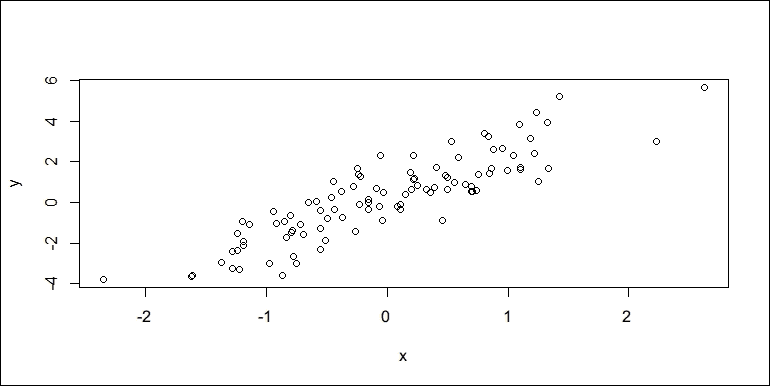

### 自定义图表元素

在图表中，有许多可以自定义的图表元素。最常见的是标题（主标题或`title()`）、`x`轴的标签（`xlab`）、`y`轴的标签（`ylab`）、`x`轴的范围（`xlim`）和`y`轴的范围（`ylim`）：

```py
plot(x, y,
  main = "Linearly correlated random numbers",
  xlab = "x", ylab = "2x + noise",
  xlim = c(-4, 4), ylim = c(-4, 4))
```

生成的图表如下：

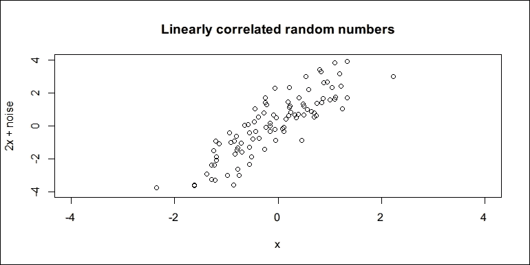

图表标题可以通过`main`参数或单独的`title()`函数调用来指定。因此，前面的代码等同于以下代码：

```py
plot(x, y,
   xlim = c(-4, 4), ylim = c(-4, 4),
   xlab = "x", ylab = "2x + noise")
 title("Linearly correlated random numbers")
```

### 自定义点样式

散点图默认的点样式是圆圈。通过指定`pch`参数（绘图字符），我们可以更改点样式。共有 26 种点样式可供选择：

```py
plot(0:25, 0:25, pch = 0:25,
   xlim = c(-1, 26), ylim = c(-1, 26),
   main = "Point styles (pch)")
text(0:25+1, 0:25, 0:25)
```

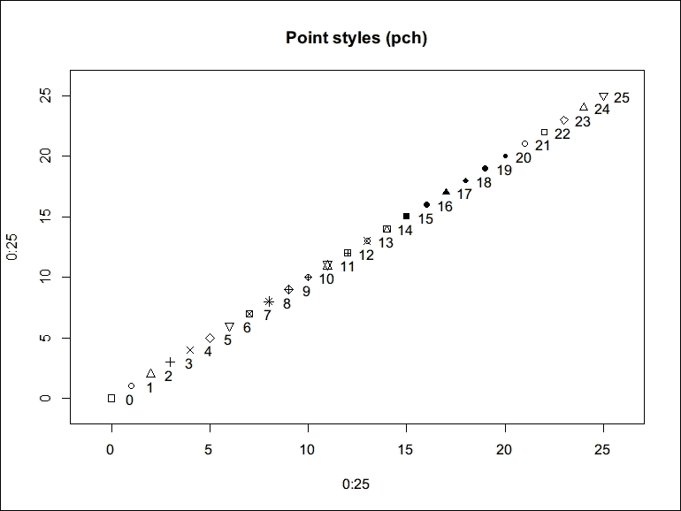

上述代码生成了一个包含所有可用点样式及其相应`pch`编号的散点图。首先，`plot()`创建了一个简单的散点图，然后`text()`在每个点的右侧打印`pch`编号。

与许多其他内置函数一样，`plot()`在`pch`和几个其他参数上进行了向量化。这使得我们可以自定义散点图中每个点的样式。例如，最简单的情况是我们通过设置`pch = 16`为所有点使用一个非默认的点样式：

```py
x <- rnorm(100)
y <- 2 * x + rnorm(100)
plot(x, y, pch = 16,
  main = "Scatter plot with customized point style")
```

生成的图表如下：

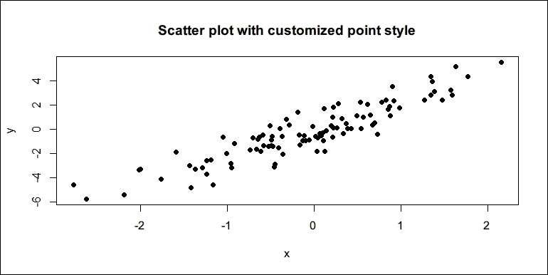

有时候，我们需要通过逻辑条件来区分两组点。知道`pch`是向量化的，我们可以使用`ifelse()`函数通过检查一个点是否满足条件来指定每个观察值的点样式。在下面的例子中，我们希望将`pch = 16`应用于满足`x * y > 1`条件的点，否则使用`pch = 1`：

```py
plot(x, y,
   pch = ifelse(x * y > 1, 16, 1),
   main = "Scatter plot with conditional point styles")
```

生成的图表如下：

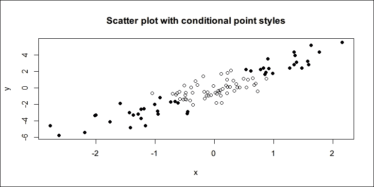

我们还可以使用 `plot()` 和 `points()` 在两个共享相同 x 轴的不同数据集中绘制点。在先前的例子中，我们生成了一个正态分布的随机向量 `x` 和一个线性相关的随机向量 `y`。现在，我们生成另一个与 `x` 具有非线性关系的随机向量 `z`，并将 `y` 和 `z` 分别与 `x` 绘制，但使用不同的点样式：

```py
z <- sqrt(1 + x ^ 2) + rnorm(100)
plot(x, y, pch = 1,
   xlim = range(x), ylim = range(y, z),
   xlab = "x", ylab = "value")
points(x, z, pch = 17)
title("Scatter plot with two series")
```

生成的图形如下：

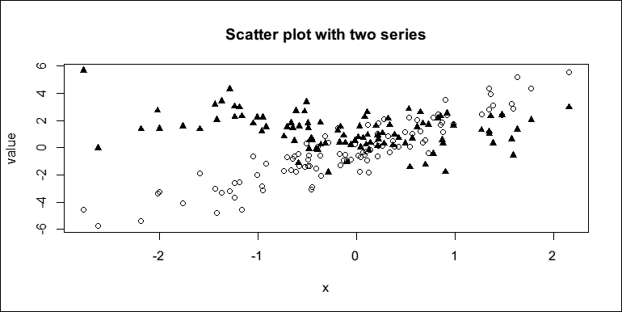

在我们生成 `z` 后，首先创建 `x` 和 `y` 的图形，然后添加另一组具有不同 `pch` 的点 `z`。请注意，如果我们不指定 `ylim = range(y, z)`，绘图构建器将只考虑 `y` 的范围，因此 *y* 轴的范围可能比 `z` 的范围窄。不幸的是，`points()` 并不会自动扩展由 `plot()` 创建的轴，因此任何超出轴范围的点将消失。前面的代码设置了一个合适的 *y* 轴范围，以便在绘图区域内显示 `y` 和 `z` 中的所有点。

### 自定义点颜色

如果图形不受灰度打印的限制，我们还可以通过设置 `plot()` 的列来使用不同的点颜色：

```py
plot(x, y, pch = 16, col = "blue",
   main = "Scatter plot with blue points")
```

生成的图形如下：

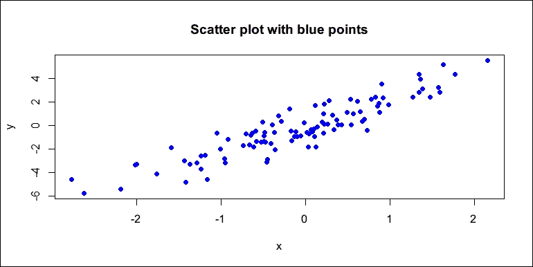

就像 `pch` 一样，`col` 也是一个向量化参数。使用相同的方法，我们可以根据是否满足某个条件，将不同的颜色应用到不同的点上，将它们分为两个不同的类别：

```py
plot(x, y, pch = 16, 
  col = ifelse(y >= mean(y), "red", "green"),
  main = "Scatter plot with conditional colors")
```

生成的图形如下：

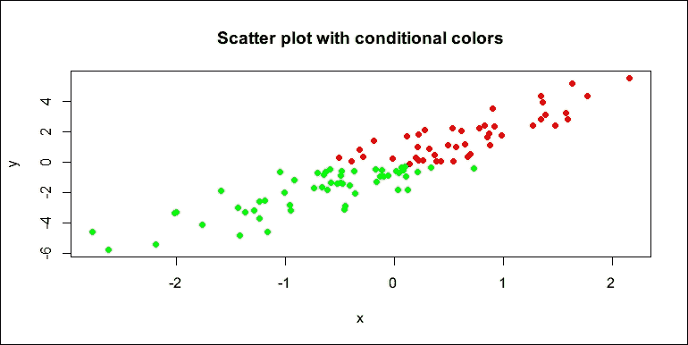

注意，如果散点图以灰度打印，颜色只能以不同灰度的强度来查看。

此外，我们还可以再次使用 `plot()` 和 `points()`，但使用不同的 `col` 来区分不同组别的点：

```py
plot(x, y, col = "blue", pch = 0,
  xlim = range(x), ylim = range(y, z),
  xlab = "x", ylab = "value")
points(x, z, col = "red", pch = 1)
title("Scatter plot with two series")
```

生成的图形如下：

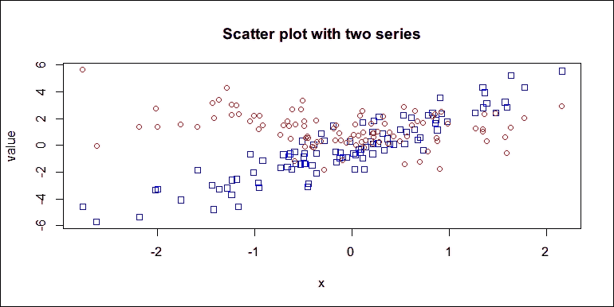

R 支持常用的颜色名称以及许多其他颜色（总共 657 种）。通过调用 `colors()` 获取 R 支持的所有颜色列表。

## 创建线图

对于时间序列数据，线图更有助于展示随时间的变化趋势和变化。要创建线图，我们只需要在调用 `plot()` 时设置 `type = "l"`：

```py
t <- 1:50
y <- 3 * sin(t * pi / 60) + rnorm(t)
plot(t, y, type = "l",
   main = "Simple line plot")
```

生成的图形如下：

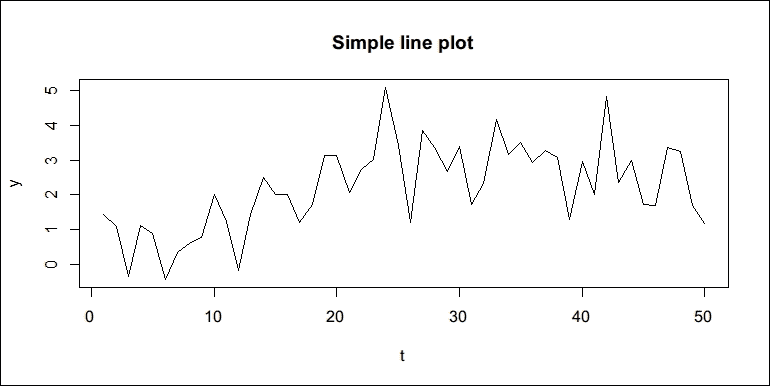

### 自定义线型和宽度

就像散点图的 `pch` 一样，`lty` 用于指定线图的线型。以下展示了 R 支持的六种线型预览：

```py
lty_values <- 1:6
plot(lty_values, type = "n", axes = FALSE, ann = FALSE)
abline(h =lty_values, lty = lty_values, lwd = 2
mtext(lty_values, side = 2, at = lty_values)
title("Line types (lty)")
```

生成的图形如下：

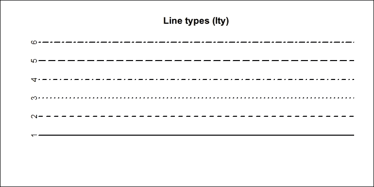

前面的代码创建了一个带有`type = "n"`的空画布，具有适当的坐标轴范围，并关闭了坐标轴，另一个标签`elements.abline()`用于绘制具有不同线型但相同线宽（`lwd = 2`）的水平线。`mtext()`函数用于在边缘绘制文本。请注意，`abline()`和`mtext()`在它们的参数上是向量化的，因此我们不需要使用`for`循环依次绘制每条线和边缘文本。

以下示例演示了`abline()`如何有助于在图表中绘制辅助线。首先，我们创建了一个`y`与时间`t`的线图，这是我们之前创建第一个线图时定义的。假设我们还想让图表显示`y`的均值和范围，以及最大值和最小值出现的时间。使用`abline()`，我们可以轻松地用不同类型和颜色的线绘制这些辅助线，以避免歧义：

```py
plot(t, y, type = "l", lwd = 2)
abline(h = mean(y), lty = 2, col = "blue")
abline(h = range(y), lty = 3, col = "red")
abline(v = t[c(which.min(y), which.max(y))], lty = 3, col = "darkgray")
title("Line plot with auxiliary lines")
```

生成的图表如下：

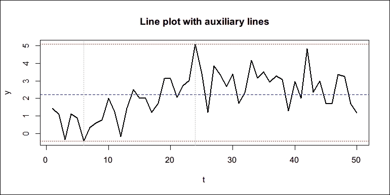

### 多周期折线图绘制

另一种混合不同线型的折线图是多周期折线图。典型形式是第一个周期是历史数据，第二个周期是预测数据。假设`y`的第一个周期包含前 40 个观测值，其余点是基于历史数据的预测。我们希望用实线表示历史数据，用虚线表示预测。在这里，我们绘制第一个周期的数据，并为图表的第二周期添加虚线`lines()`。请注意，`lines()`对于折线图就像`points()`对于散点图：

```py
p <- 40
plot(t[t <= p], y[t <= p], type = "l",
   xlim = range(t), xlab = "t")
lines(t[t >= p], y[t >= p], lty = 2)
title("Simple line plot with two periods")
```

生成的图表如下：

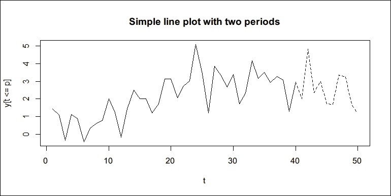

### 使用点和线绘制折线图

有时，在同一张图表中绘制线和点很有用，以强调观测值是离散的，或者简单地使图表更清晰。方法是简单的，只需绘制一个折线图，并将相同数据的`points()`再次添加到图表中：

```py
plot(y, type = "l")
points(y, pch = 16)
title("Lines with points")
```

生成的图表如下所示：

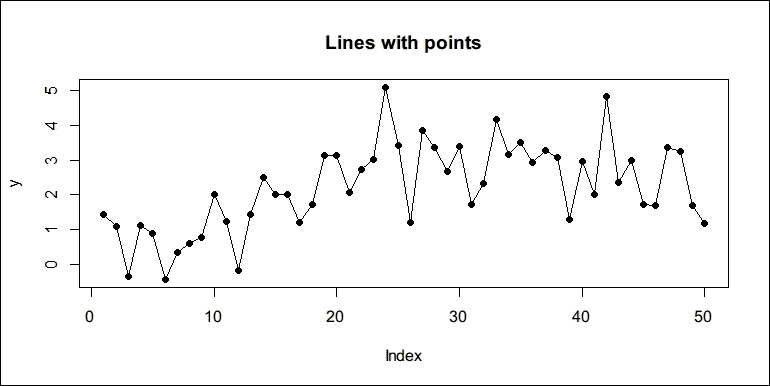

完成此操作的另一种方法是首先使用`plot()`函数绘制散点图，然后使用相同数据的`lines()`函数再次将线添加到图表中。因此，以下代码应产生与上一个示例完全相同的图形：

```py
plot(y, pch = 16)
lines(y)
title("Lines with points")
```

### 绘制带有图例的多序列图表

一个完整的多序列图表应包括由线和点表示的多个序列，以及一个图例来说明图表中的序列。

以下代码随机生成两个时间序列`y`和`z`，以及时间`x`，并将这些数据组合在一起创建图表：

```py
x <- 1:30
y <- 2 * x + 6 * rnorm(30)
z <- 3 * sqrt(x) + 8 * rnorm(30)
plot(x, y, type = "l",
   ylim = range(y, z), col = "black")
points(y, pch = 15)
lines(z, lty = 2, col = "blue")
points(z, pch = 16, col = "blue")
title ("Plot of two series")
legend("topleft",
  legend = c("y", "z"),
  col = c("black", "blue"),
  lty = c(1, 2), pch = c(15, 16),
  cex = 0.8, x.intersp = 0.5, y.intersp = 0.8)
```

生成的图表如下：

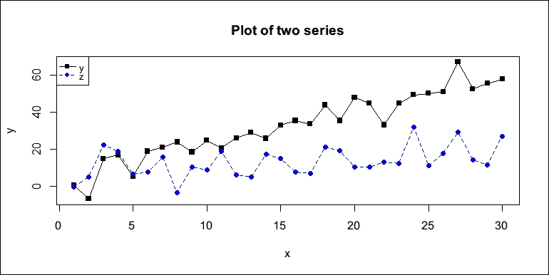

之前的代码使用 `plot()` 创建 `y` 的线点图，并添加了 `z` 的 `lines()` 和 `points()`。最后，我们在左上角添加了一个 `legend()` 来展示 `y` 和 `z` 的线条和点样式，注意 `cex` 用于调整图例的字体大小，而 `x.intersp` 和 `y.intersp` 用于对图例进行细微调整。

另一种有用的折线图类型是阶梯线图。我们在 `plot()` 和 `lines()` 中使用 `type = "s"` 来创建阶梯线图：

```py
plot(x, y, type = "s",
  main = "A simple step plot")
```

生成的图表如下：

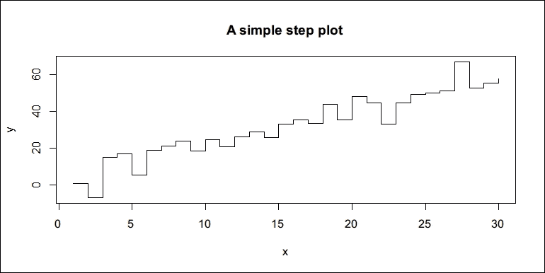

## 创建条形图

在前面的章节中，你学习了如何创建散点图和折线图。还有一些其他类型的图表很有用，值得提及。条形图是最常用的之一。条形图的高度可以在不同类别之间进行定量的对比。

我们可以创建的最简单的条形图如下。在这里，我们使用 `barplot()` 而不是 `plot()`：

```py
barplot(1:10, names.arg = LETTERS[1:10])
```

生成的图表如下：

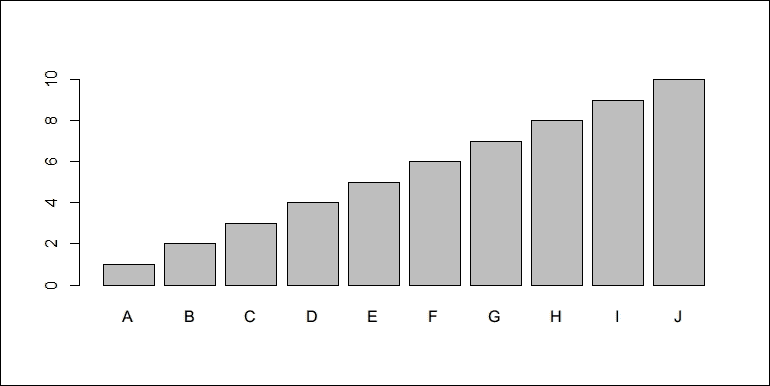

如果数值向量有名称，则名称将自动成为 *x* 轴上的名称。因此，以下代码将产生与上一个图表完全相同的条形图：

```py
ints <- 1:10
names(ints) <- LETTERS[1:10]
barplot(ints)
```

制作条形图看起来很简单。现在我们有了 `nycflights13` 中的航班数据集，我们可以创建记录中最常飞行的前八个承运人的条形图：

```py
data("flights", package = "nycflights13")
carriers <- table(flights$carrier)
carriers
## 
##    9E    AA    AS    B6    DL    EV    F9    FL    HA    MQ 
## 18460 32729   714 54635 48110 54173   685  3260   342 26397 
##    OO    UA    US    VX    WN    YV 
##    32 58665 20536  5162 12275   601
```

在前面的代码中，`table()` 用于计算每个承运人在记录中的航班数量：

```py
sorted_carriers <- sort(carriers, decreasing = TRUE)
sorted_carriers
## 
##    UA    B6    EV    DL    AA    MQ    US    9E    WN    VX 
## 58665 54635 54173 48110 32729 26397 20536 18460 12275  5162 
##    FL    AS    F9    YV    HA    OO 
##  3260   714   685   601   342    32
```

如前述代码所示，承运人按降序排列。我们可以从表中取出前 `8` 个元素，并制作一个条形图：

```py
barplot(head(sorted_carriers, 8),
   ylim = c(0, max(sorted_carriers) * 1.1),
   xlab = "Carrier", ylab = "Flights",
   main ="Top 8 carriers with the most flights in record")
```

生成的图表如下：


## 创建饼图

另一种有用的图表是饼图。创建饼图的函数 `pie()` 的工作方式与 `barplot()` 类似。它使用带有标签的数值向量；它也可以直接与命名数值向量一起使用。以下是一个简单的示例：

```py
grades <- c(A = 2, B = 10, C = 12, D = 8)
pie(grades, main = "Grades", radius = 1)
```

生成的图表如下：


## 创建直方图和密度图

之前，你学习了如何创建几种不同类型的图表。散点图和折线图是数据集中观察的直接展示。条形图和饼图通常用于展示不同类别数据点的粗略总结。

图表有两个限制：散点图和折线图传达了过多的信息，难以从中得出见解，而条形图和饼图则丢失了过多的信息，因此使用这些图表时也难以自信地得出结论。

直方图显示了数值向量的分布，它总结了数据中的信息，而没有丢失太多，因此更容易使用。以下示例演示了如何使用 `hist()` 生成正态分布的随机数值向量的直方图和正态分布的密度函数：

```py
random_normal <- norm(10000)
hist(random_normal)
```

生成的图表如下：

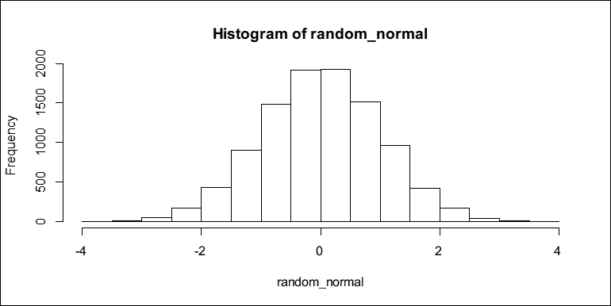

默认情况下，直方图的 *y* 轴是数据中值的频率。我们可以验证直方图与从 `random_normal` 生成的标准正态分布非常接近。为了叠加标准正态分布概率密度函数的曲线 `dnorm()`，我们需要确保直方图的 *y* 轴是概率，并且曲线要添加到直方图上：

```py
hist(random_normal, probability = TRUE, col = "lightgray")
curve(dnorm, add = TRUE, lwd = 2, col ="blue")
```

生成的图表如下：

生成的图表如下：

现在，让我们绘制飞行中飞机速度的直方图。基本上，飞机在旅行中的平均速度是旅行距离（`distance`）除以飞行时间（`air_time`）：

```py
flight_speed <- flights$distance / flights$air_time
hist(flight_speed, main = "Histogram of flight speed")
```

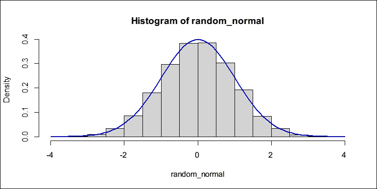

生成的图表如下：

直方图似乎与正态分布略有不同。在这种情况下，我们使用 `density()` 来估计速度的经验分布，从中绘制出平滑的概率分布曲线，并添加一条垂直线来指示所有观察值的全局平均值：

```py
plot(density(flight_speed, from = 2, na.rm = TRUE),
   main ="Empirical distribution of flight speed")
abline(v = mean(flight_speed, na.rm = TRUE),
   col = "blue", lty = 2)
```

生成的图表如下：

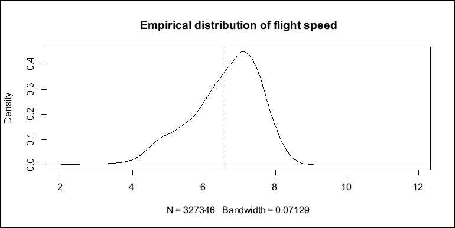

就像第一个直方图和曲线示例一样，我们可以将两个图形结合起来，以获得更好的数据视图：

```py
hist(flight_speed, 
  probability = TRUE, ylim = c(0, 0.5), 
  main ="Histogram and empirical distribution of flight speed",
  border ="gray", col = "lightgray")
lines(density(flight_speed, from = 2, na.rm = TRUE),
  col ="darkgray", lwd = 2)
abline(v = mean(flight_speed, na.rm = TRUE),
   col ="blue", lty =2)
```

生成的图表如下：

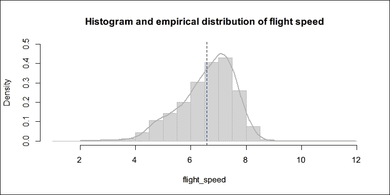

## 创建箱线图

直方图和密度图是展示数据分布的两种方式。通常，我们只需要几个关键分位数就能对整个分布有一个印象。箱线图（或箱线图）是一种简单的方法来做这件事。对于随机生成的数值向量，我们可以调用 `boxplot()` 来绘制箱线图：

```py
x <- rnorm(1000)
boxplot(x)
```

生成的图表如下：

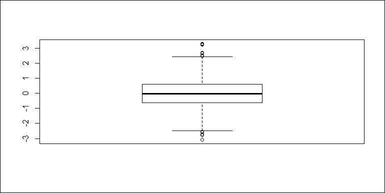

箱线图包含几个组成部分，用于显示数据的临界四分位数水平和异常值。以下图像清楚地解释了箱线图的意义：

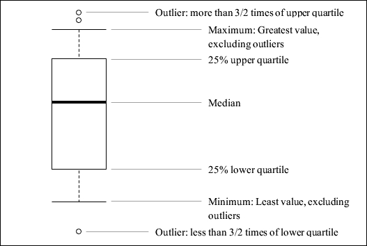

以下代码绘制了每个航空公司的飞行速度箱线图。一张图表中将有 16 个箱子，这使得粗略比较不同航空公司的分布变得更容易。为了进行，我们使用公式 *distance / air_time ~carrier* 来表示 *y* 轴表示从 *distance / air_time* 计算出的飞行速度，而 *x* 轴表示航空公司。通过这种表示，我们得到以下箱线图：

```py
boxplot(distance / air_time ~ carrier, data =flights,
  main = "Box plot of flight speed by carrier")
```

生成的图表如下：

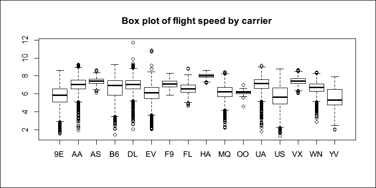

注意，我们在`boxplot()`中使用创建图形的公式界面。在这里，`distance / air_time ~ carrier`基本上意味着*y*轴应该表示`distance / air_time`的值，即飞行速度，而*x*轴应该表示不同的运营商。`data = flights`告诉`boxplot()`在哪里找到我们指定的公式中的符号。因此，飞行速度的箱线图被创建并按运营商分组。

数据可视化和分析公式界面非常表达性和强大。在下一节中，我们将介绍一些基本工具和模型来分析数据。实现这些工具和模型的函数背后不仅包含算法，还有一个用户友好的界面（公式），以便更容易地指定模型拟合的关系。

还有其他专门针对数据可视化的包。一个很好的例子是`ggplot2`，它实现了一种非常强大的图形语法，用于创建、组合和自定义不同类型的图表。然而，这超出了本书的范围。要了解更多信息，我建议您阅读 Hadley Wickham 的《ggplot2: Elegant Graphics for Data Analysis》。

# 数据分析

在实际数据分析中，大部分时间都花在数据清洗上，即过滤和转换原始数据（或原始数据）到一个更容易分析的形式。过滤和转换过程也称为数据处理。我们将专门用一章来介绍这个主题。

在本节中，我们直接假设数据已经准备好进行分析。我们不会深入探讨模型，而是应用一些简单的模型，让您了解如何用数据拟合模型，如何与拟合的模型交互，以及如何将拟合的模型应用于预测。

## 拟合线性模型

R 中最简单的模型是线性模型，即我们使用线性函数来描述在一定假设下两个随机变量之间的关系。在以下示例中，我们将创建一个将*x*映射到`3 + 2 * x`的线性函数。然后我们生成一个正态分布的随机数值向量`x`，并通过`f(x)`加上一些独立噪声生成`y`：

```py
f <- function(x) 3 + 2 * x
x <- rnorm(100)
y <- f(x) + 0.5 * rnorm(100)
```

如果我们假装不知道`y`是如何由`x`生成的，我们能否使用线性模型来恢复它们之间的关系，即恢复线性函数的系数？以下代码使用`slm()`拟合`x`和`y`的线性模型。请注意，公式`y ~ x`是向`m()`传达线性回归是因变量`y`和单个回归变量`x`之间关系的一种可访问表示：

```py
model1 <- lm(y ~ x)model1
## 
## Call:
## lm(formula = y ~ x)
## 
## Coefficients:
## (Intercept) x 
##   2.969    1.972
```

真实的系数是 3（截距）和 2（斜率），并且使用样本数据`x`和`y`，拟合的模型具有系数`2.9692146`（截距）和`1.9716588`（斜率），这两个系数非常接近真实的系数。

我们将模型存储在`model1`中。要访问模型的系数，我们可以使用以下代码：

```py
coef(model1)
## (Intercept)   x 
##  2.969215   1.971659
```

或者，我们可以使用`model1$`系数，因为`model1`本质上是一个列表。

然后，我们可以调用`summary()`来了解更多关于线性模型的统计特性：

```py
summary(model1)
## 
## Call:
## lm(formula = y ~ x)
## 
## Residuals:
##      Min       1Q   Median       3Q      Max 
## -0.96258 -0.31646 -0.04893  0.34962  1.08491 
## 
## Coefficients:
##             Estimate Std. Error t value Pr(>|t|)    
## (Intercept)  2.96921    0.04782    62.1   <2e-16 ***
## x            1.97166    0.05216    37.8   <2e-16 ***
## ---
## Signif. codes:  
## 0 '***' 0.001 '**' 0.01 '*' 0.05 '.' 0.1 ' ' 1
## 
## Residual standard error: 0.476 on 98 degrees of freedom
## Multiple R-squared:  0.9358, Adjusted R-squared:  0.9352 
## F-statistic:  1429 on 1 and 98 DF,  p-value: < 2.2e-16
```

要解释摘要，你最好复习一下统计学教材中关于线性回归的章节。下面的图表将数据和拟合模型放在一起：

```py
plot(x, y, main = "A simple linear regression")
abline(coef(model1), col = "blue")
```

生成的图表如下所示：

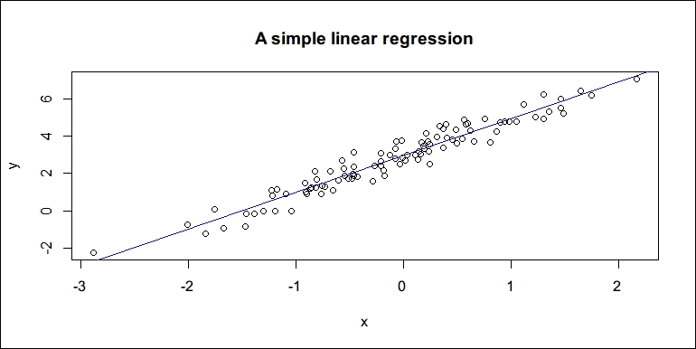

在前面的代码中，我们直接向`abline()`提供一个包含估计回归系数的两个元素的数值向量，因此它智能地绘制了回归线。

然后，我们可以调用`predict()`来使用拟合的模型进行预测。当`x = -1`和`x = 0.5`时，预测`y`并带有标准误差，请运行以下代码：

```py
predict(model1, list(x = c(-1, 0.5)), se.fit = TRUE)
## $fit
## 1         2 
## 0.9975559 3.9550440 
## 
## $se.fit
## 1          2 
## 0.06730363 0.05661319 
## 
## $df
## [1] 98
## 
## $residual.scale
## [1] 0.4759621
```

预测结果是`y`的预测值列表（`$fit`）、拟合值的标准误差（`$se.fit`）、自由度（`$df`）和`$residual.scale`。

现在你已经了解了如何根据一些数据拟合线性模型的基本方法，是时候看看一些现实世界的数据了。在下面的例子中，我们尝试使用不同复杂度的线性模型来预测航班的飞行时间。对于预测飞行时间来说，最明显的有帮助的变量是距离。

首先，我们加载数据集并绘制距离和`飞行时间`的散点图。我们使用`pch = "."`来使每个点非常小，因为数据集中的记录数量很大：

```py
data("flights", package = "nycflights13")
plot(air_time ~ distance, data = flights,
  pch = ".", 
  main = "flight speed plot")
```

生成的图表如下：

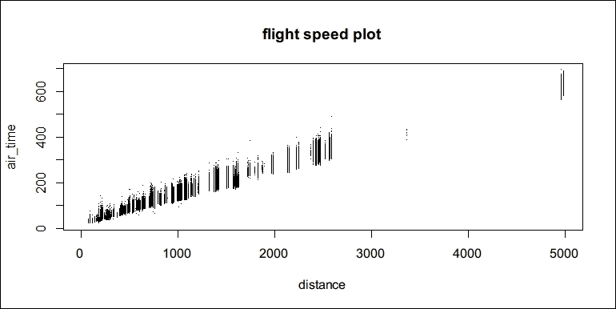

图表清楚地表明距离和`飞行时间`之间存在正相关关系。因此，在两个变量之间拟合线性模型是合理的。

在将整个数据集放入线性模型之前，我们将数据集分为两部分：一个训练集和一个测试集。划分数据集的目的是我们不仅想要进行样本评估，还想要进行模型的外部样本评估。更具体地说，我们将 75%的数据放入训练集，剩余的 25%数据放入测试集。在下面的代码中，我们使用`sample()`从原始数据中抽取 75%的随机样本，并使用`setdiff()`获取剩余的记录：

```py
rows <- nrow(flights)
rows_id <- 1:rows
sample_id <- sample(rows_id, rows * 0.75, replace = FALSE)
flights_train <- flights[sample_id,]
flights_test <- flights[setdiff (rows_id, sample_id), ]
```

注意，`setdiff(rows_id, sample_id)`返回`rows_id`中但不在`sample_id`中的索引。

现在`flights_train`是训练集，而`flights_test`是测试集。有了划分的数据集，模型拟合和模型评估的过程就变得简单直接。首先，使用训练集来拟合模型，然后进行样本预测以查看样本误差的大小：

```py
model2 <- lm(air_time ~ distance, data = flights_train)
predict2_train <- predict(model2, flights_train)
error2_train <- flights_train$air_time - predict2_train
```

为了评估误差的大小，我们定义了一个名为`evaluate_error()`的函数来计算平均绝对误差和误差的标准差：

```py
evaluate_error <- function(x) {
  c(abs_err = mean(abs(x), na.rm = TRUE),
  std_dev = sd(x, na.rm = TRUE))
  }
```

使用这个函数，我们可以评估`model2`的样本预测误差：

```py
evaluate_error(error2_train)
## abs_err  std_dev 
## 9.413836 12.763126
```

绝对平均误差表明，平均而言，预测值与正确值在绝对值上偏差约为 9.45 分钟，标准差为 12.8 分钟。

然后，我们通过使用模型对测试集进行预测来执行一个简单的样本外评估：

```py
predict2_test <- predict (model2, flights_test)
error2_test <- flights_test$air_time - predict2_test
evaluate_error(error2_test)
## abs_err std_dev 
## 9.482135 12.838225
```

预测结果是一个包含预测值的数值向量。绝对平均误差和误差的标准差略有上升，这表明样本外预测的质量没有显著变差，表明`model2`似乎不是过拟合的结果。

由于`model2`只有一个回归器，即`distance`，因此考虑是否更多的回归器会提高预测质量是自然的。以下代码拟合了一个新的线性模型，不仅包括距离，还包括`carrier`、`month`和出发时间(`dep_time`)作为回归器：

```py
model3 <- lm(air_time ~ carrier + distance + month + dep_time,
  data = flights_train)predict3_train
<- predict(model3, flights_train)
error3_train <- flights_train$air_time - predict3_train
evaluate_error(error3_train)
## abs_err  std_dev 
## 9.312961 12.626790
```

样本内误差在幅度和变化上都有所降低：

```py
predict3_test <- predict(model3, flights_test)
error3_test <- flights_test$air_time - predict3_test
evaluate_error(error3_test)
## abs_err std_dev 
## 9.38309 12.70168
```

此外，样本外误差看起来略好于`model2`。为了比较在将新回归器添加到线性模型之前和之后样本外误差的分布，我们叠加了两个密度曲线：

```py
plot(density(error2_test, na.rm = TRUE),
  main = "Empirical distributions of out-of-sample errors")
lines(density(error3_test, na.rm = TRUE), lty = 2)
legend("topright", legend = c("model2", "model3"), 
  lty = c(1, 2), cex = 0.8,
  x.intersp = 0.6, y.intersp = 0.6)
```

生成的图表如下：

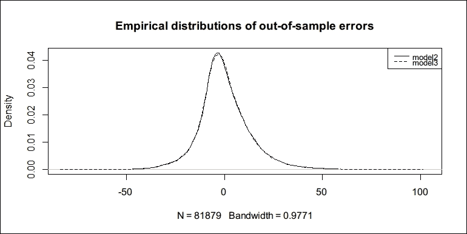

从前面的密度图中可以看出，从`model2`到`model3`的改进非常小，几乎无法察觉，也就是说，没有任何显著的改进。

## 拟合回归树

在本节中，我们尝试使用另一个模型来拟合数据。该模型被称为**回归树** ([`en.wikipedia.org/wiki/Decision_tree_learning`](https://en.wikipedia.org/wiki/Decision_tree_learning))，是机器学习模型之一。它不是简单的线性回归，而是使用决策树来拟合数据。

假设我们想要根据太阳辐射(`Solar.R`)、平均风速(`Wind`)和最高日温度(`Temp`)预测每日空气质量(`Ozone`)，内置数据集`airquality`作为训练集。以下图表说明了拟合回归树的工作原理：

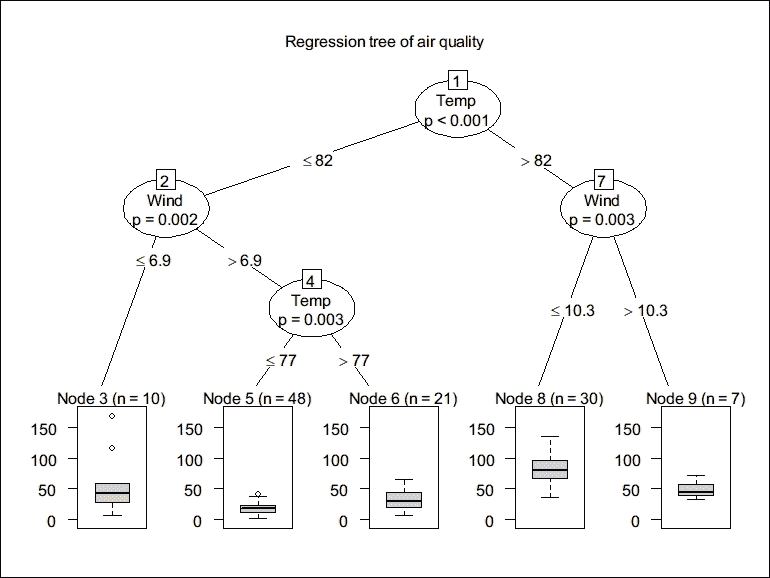

在树中，每个圆圈代表一个问题，有两个可能的答案。为了预测`Ozone`，我们需要从上到下沿着树提问，每个观测值位于底部的某个案例中。每个底部的节点都有一个与其他节点不同的分布，这通过箱线图表示。每个箱子中的中位数或平均值应该是每个案例的合理预测。

有许多软件包实现了决策树学习算法。在本节中，我们使用一个名为 party ([`cran.r-project.org/web/packages/party`](https://cran.r-project.org/web/packages/party)) 的简单软件包。如果您还没有安装它，请运行 `install.package("party")`。

现在我们使用相同的公式和数据来训练一个回归树模型。请注意，我们选取了没有`air_time`缺失值的数据子集，因为`ctree`不接受响应变量中的缺失值：

```py
model4 <- party::ctree(air_time ~ distance + month + dep_time,
  data = subset(flights_train, !is.na(air_time)))
predict4_train <- predict(model4, flights_train)
error4_train <- flights_train$air_time - predict4_train[, 1]
evaluate_error(error4_train)
## abs_err  std_dev 
## 7.418982 10.296528
```

看起来`model4`的表现优于`model3`。然后，我们来看看它的样本外表现：

```py
predict4_test <- predict(model4, flights_test)
error4_test <- flights_test$air_time - predict4_test[, 1]
evaluate_error(error4_test)
## abs_err  std_dev 
## 7.499769 10.391071
```

前面的输出表明，回归树平均来说可以更好地预测这个问题。以下密度图对比了`model3`和`model4`的样本外预测误差分布：

```py
plot(density(error3_test, na.rm = TRUE),
   ylim = range(0, 0.06),
   main = "Empirical distributions of out-of-sample errors")
lines(density(error4_test, na.rm = TRUE), lty = 2)
legend("topright", legend = c("model3", "model4"),
  lty = c(1, 2), cex = 0.8,
  x.intersp = 0.6, y.intersp = 0.6)
```

生成的情节如下：

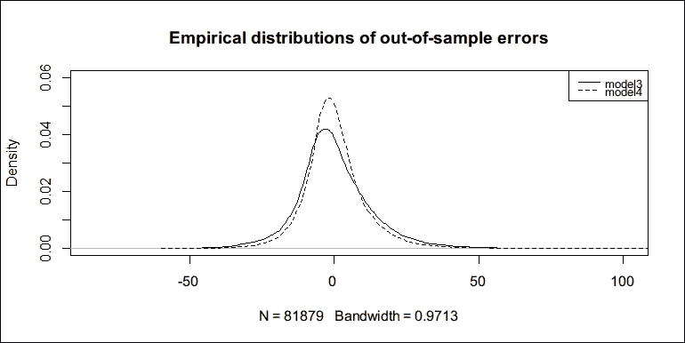

对于前面的图，我们可以看到`model4`的预测误差的方差低于`model3`。

前面的例子可能存在许多问题，因为我们应用线性模型和机器学习模型时没有对数据进行任何严肃的检查。这些章节的目的不在于模型，而是为了展示在 R 中拟合模型的常见过程和界面。对于现实世界的问题，您需要对数据进行更仔细的分析，而不是直接将它们倒入任意模型并得出结论。

# 摘要

在本章中，您学习了如何以各种格式读取和写入数据，如何使用绘图函数可视化数据，以及如何将基本模型应用于数据。现在，您已经了解了与数据工作相关的基本工具和界面。然而，您可能需要从其他来源学习更多的数据分析工具。

对于统计和计量经济学模型，我建议您不仅阅读统计学和计量经济学的教科书，还要阅读专注于统计分析的 R 语言书籍。对于如人工神经网络、支持向量机和随机森林等机器学习模型，我建议您阅读机器学习书籍并访问 *CRAN 任务视图：机器学习与统计学习* ([`cran.r-project.org/web/views/MachineLearning.html`](https://cran.r-project.org/web/views/MachineLearning.html))。

由于本书专注于 R 编程语言而不是任何特定模型，我们将在下一章继续我们的旅程，深入探讨 R。如果您不熟悉 R 代码的工作方式，您几乎无法预测会发生什么，这会减慢您的编码速度，一个小问题可能会浪费您很多时间。

接下来的几章将帮助您建立对 R 的评估模型、元编程设施、面向对象系统和 R 选择以促进数据分析的几个其他机制的直观理解，这使您能够使用更高级的数据操作包，并处理更复杂的任务。
