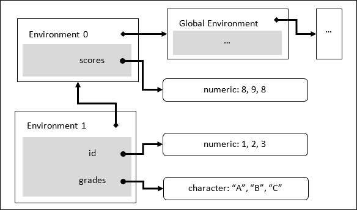

# 第八章。R 内部

在前面的章节中，你学习了 R 编程语言的基础知识，了解了如何使用向量、矩阵、列表和数据框以不同的形状表示数据。你也看到了我们如何使用内置函数来解决简单问题。然而，仅仅了解这些特性并不能帮助你解决每一个问题。现实世界的数据分析通常涉及对数据进行仔细和详细地转换和聚合，这可以通过各种函数来完成，无论是内置的还是由扩展包提供的。

为了最好地使用这些函数而不是让它们因意外结果而让你困惑，你需要对 R 函数的工作方式有一个基本但具体的理解。在本章中，我们将涵盖以下主题：

+   惰性求值

+   复制修改机制

+   词法作用域

+   环境

如果你理解了这些概念及其在代码中的作用，大多数 R 代码应该对你来说非常可预测，这意味着在查找错误和编写正确功能的代码方面有更高的生产力。

# 理解惰性求值

理解 R 语言的工作原理很大一部分可以通过弄清楚 R 函数的工作方式来实现。在阅读了前面的章节之后，你应该已经了解了最常用的基本函数。然而，你可能仍然对它们的精确行为感到困惑。假设我们创建以下函数：

```py
test0 <- function(x, y) {
  if (x > 0) x else y
} 

```

函数有些特殊，因为`y`似乎只在`x`大于零时才需要。如果我们只为`x`提供一个正数而忽略`y`，函数会因为我们没有提供定义中的所有参数而失败吗？让我们通过调用以下函数来找出答案：

```py
test0(1)
## [1] 1 

```

函数在没有提供`y`的情况下也能正常工作。看起来当我们调用一个函数时，我们不需要为所有参数提供值，而只需要为那些需要的参数提供值。如果我们用负数调用`test0`，则需要`y`：

```py
test0(-1)
## Error in test0(-1): argument "y" is missing, with no default 

```

由于我们没有指定`y`的值，函数停止了，报告说`y`缺失。

从前面的例子中，你了解到如果一个函数不需要所有参数来返回值，那么它不需要指定所有参数。如果我们坚持指定那些在函数中未使用的参数，它们会在我们调用函数之前被评估，或者根本不会被评估？让我们通过在参数`y`的位置放置一个`stop()`函数来找出答案。如果表达式以任何方式在任何地方被评估，它应该在`x`返回之前立即停止：

```py
test0(1, stop("Stop now"))
## [1] 1 

```

输出表明`stop()`没有发生，这表明它根本就没有被评估。如果我们将`x`的值改为负数，函数应该停止执行：

```py
test0(-1, stop("Stop now"))
## Error in test0(-1, stop("Stop now")): Stop now 

```

现在，很明显，在这种情况下`stop()`被评估了。机制变得相当透明。在函数调用中，只有当需要参数的值时，才会评估参数的表达式。这种机制被称为**惰性求值**，因此，我们也可以说函数调用的参数是惰性求值的，即只在需要时评估。

如果你不知道惰性求值机制，你可能会认为以下函数调用将非常耗时，并且可能会耗尽你的所有计算机内存。然而，惰性求值阻止了这种情况的发生，因为`rnorm(1000000)`永远不会被评估。这是因为当评估`if (x > 0) x else y`时，它永远不会被需要，这可以通过使用`system.time()`依次计时函数调用来验证：

```py
system.time(rnorm(10000000))
## user system elapsed
## 0.91  0.01   0.92 

```

生成一千万个随机数不是一件容易的事情。它需要超过一秒钟。相比之下，评估一个数字应该是 R 能做的最容易的事情，而且它非常快，以至于计时器本身都无法感知：

```py
system.time(1)
## user system elapsed
##  0     0      0 

```

如果我们根据`test0`的逻辑和惰性求值的了解来计时以下表达式，那么根据合理的猜测，它应该是零：

```py
system.time(test0(1, rnorm(10000000)))
## user system elapsed
##  0     0      0 

```

另一个可能发生的惰性求值场景是参数的默认值。更准确地说，函数参数的默认值应该真正是默认表达式，因为值只有在表达式实际评估时才可用。考虑以下函数：

```py
test1 <- function(x, y = stop("Stop now")) {
  if (x > 0) x else y
} 

```

我们给`y`一个默认值，该值调用`stop()`。如果惰性求值不适用，即无论是否需要，`y`都会被评估，那么只要我们不提供`y`就调用`test1()`，我们应该收到一个错误。然而，如果惰性求值适用，使用正数`x`参数调用`test1()`不应该导致错误，因为`y`的`stop()`表达式永远不会被评估。

让我们做一个实验来找出哪个是正确的。首先，我们将使用正数`x`参数调用`test1()`：

```py
test1(1)
## [1] 1 

```

输出表明惰性求值在这里也起作用。函数只使用`x`，而`y`的默认表达式根本不会被评估。如果我们提供一个负数的`x`参数，函数应该像预期的那样停止：

```py
test1(-1)
## Error in test1(-1): Stop now 

```

上述示例展示了惰性求值的一个优点：它使得节省时间和避免不必要的表达式评估成为可能。此外，它还允许更灵活地指定函数参数的默认值。例如，你可以在函数参数的表达式中使用其他参数：

```py
test2 <- function(x, n = floor(length(x) / 2)) {
  x[1:n]
} 

```

这允许你以更合理或更期望的方式设置函数的默认行为，同时函数参数仍然可以像没有这些默认值一样进行自定义。

如果我们不指定`n`就调用`test2`，默认行为会取出`x`的前半部分元素：

```py
test2(1:10)
## [1] 1 2 3 4 5 

```

函数保持灵活，因为你总是可以通过指定另一个`n`的值来覆盖其默认行为：

```py
test2(1:10, 3)
## [1] 1 2 3 

```

就像所有其他特性一样，惰性求值也有其优缺点。由于函数的参数在函数调用时只进行解析而不进行求值，我们只能确保提供给参数的表达式在语法上是正确的。很难确保参数将按预期工作。

例如，如果默认值中出现未定义的变量，则在创建函数时不会出现警告或错误。在以下示例中，我们创建了一个`test3`函数，它与`test2`完全相同，除了`n`中的`x`被错误地写成了未定义的变量`m`。

```py
test3 <- function(x, n = floor(length(m) / 2)) {
  x[1:n]
} 

```

当我们创建`test3`时，没有警告或错误，因为`floor(length(m) / 2)`在调用`test3`之前从未被求值，而`n`的值是由`1:n`要求的。函数只有在实际调用时才会停止：

```py
test3(1:10)
## Error in test3(1:10): object 'm' not found 

```

如果我们在调用`test3`之前定义了`m`，函数将正常工作，但方式出乎意料：

```py
m <- c(1, 2, 3)
test3(1:10)
## [1] 1 

```

另一个使惰性求值的工作方式更加明确的例子如下：

```py
test4 <- function(x, y = p) {
  p <- x + 1
  c(x, y)
} 

```

注意，`y`的默认值是`p`，这与之前的例子一样，在函数调用之前没有定义。这两个例子之间的一个显著区别是，第二个参数默认值中缺失的符号何时被提供。在之前的例子中，`p`在函数调用之前被定义。然而，在这个例子中，`p`是在函数内部定义的，在`y`被使用之前。

让我们看看调用函数时会发生什么：

```py
test4(1)
## [1] 1 2 

```

看起来函数是正常工作的，而不是导致错误。如果我们通过`test4(1)`的执行详细过程来分析，这将更容易理解：

1.  找到一个名为`test4`的函数。

1.  匹配给定的参数，但`x`和`y`都没有被求值。

1.  `p <- x + 1`求值`x + 1`并将值赋给新变量`p`。

1.  `c(x, y)`求值`x`和`y`，其中`x`取值为`1`，`y`取值为`p`，恰好得到`x + 1`的值，即`2`。

1.  函数返回一个数值向量`c(1, 2)`。

因此，在整个`test4(1)`的评估过程中，没有出现警告或错误，因为没有违反任何规则。这里最重要的技巧是`p`的定义是在使用`y`之前。

上述例子有助于解释惰性求值的工作方式，但这确实是一种不良实践。我不会推荐以这种方式编写函数，因为这种技巧只会使函数的行为更不透明。一种好的做法是简化参数，并避免在函数外部使用未定义的符号。否则，由于其对外部环境的依赖，可能会很难预测其行为或调试函数。

尽管如此，也有一些明智地使用懒加载的情况。例如，`stop()`可以与`switch()`一起在最后一个参数中使用，以便在没有匹配到任何情况时停止函数。以下函数`check_input()`使用`switch()`来规范`x`的输入，使其只接受`y`或`n`，并在提供其他字符串时停止：

```py
check_input <- function(x) {
  switch(x,
    y = message("yes"),
    n = message("no"),
    stop("Invalid input"))
} 

```

当`x`取`y`时，显示一条消息说`yes`：

```py
check_input("y")
## yes 

```

当`x`取`n`时，显示一条消息说`no`：

```py
check_input("n")
## no 

```

否则，函数停止：

```py
check_input("what")
## Error in check_input("what"): Invalid input 

```

这个例子之所以有效，是因为`stop()`作为`switch()`的一个参数被懒加载评估。

作为这些例子的总结，这里提醒的是，你不能过分依赖解析器来检查代码。它只检查代码的语法，并且不会告诉你代码是否编写得很好。为了避免懒加载可能引起的潜在陷阱，在函数中进行必要的检查，以确保可以正确处理输入。

# 理解复制修改机制

在上一节中，我们展示了懒加载评估的工作原理以及它如何通过避免不必要的函数参数评估来节省计算时间和工作内存。在本节中，我将向您展示 R 的一个重要特性，这使得处理数据更加安全。假设我们创建一个简单的数值向量`x1`：

```py
x1 <- c(1, 2, 3) 

```

然后，我们将`x1`的值赋给`x2`：

```py
x2 <- x1 

```

现在，`x1`和`x2`具有完全相同的值。如果我们修改两个向量中的一个元素会发生什么？两个向量都会改变吗？

```py
x1[1] <- 0
x1
## [1] 0 2 3
x2
## [1] 1 2 3 

```

输出显示，当`x1`被修改时，`x2`将保持不变。你可能猜测赋值会自动复制值并使新变量指向数据的副本而不是原始数据。让我们使用`tracemem()`来跟踪数据在内存中的足迹。

让我们重置向量并通过跟踪`x1`和`x2`的内存地址来进行实验：

```py
x1 <- c(1, 2, 3)
x2 <- x1 

```

当我们对两个向量调用`tracemem()`时，它显示了数据的当前内存地址。如果被跟踪的内存地址发生变化，将显示一个文本，其中包含原始地址和新地址，表明数据已被复制：

```py
tracemem(x1)
## [1] "<0000000013597028>"
tracemem(x2)
## [1] "<0000000013597028>" 

```

现在，两个向量具有相同的值，`x1`和`x2`共享相同的地址，这意味着它们指向内存中完全相同的同一块数据，并且赋值操作不会自动复制数据。但是数据何时被复制？

现在，我们将`x1`的第一个元素修改为`0`：

```py
x1[1] <- 0
## tracemem[0x0000000013597028 -> 0x00000000170c7968] 

```

内存跟踪显示`x1`的地址已更改为一个新的地址。更具体地说，原始向量`x1`和`x2`所指向的那块内存被复制到了一个新的位置。现在我们在两个不同的位置有了相同数据的两个副本。然后，修改副本的第一个元素，最后，使`x1`指向修改后的副本。

现在，`x1`和`x2`有不同的值：`x1`指向修改后的向量，而`x2`仍然指向原始向量。

换句话说，如果多个变量引用同一个对象，修改一个变量将导致对象的复制。这种机制被称为 **复制修改**。

复制修改机制发生的另一个场景是在修改函数参数时。假设我们创建以下函数：

```py
modify_first <- function(x) {
  x[1] <- 0
  x
} 

```

当函数执行时，它试图修改参数 `x` 的第一个元素。让我们通过向量和列表做一些实验，看看 `modify_first()` 是否可以修改它们。

对于一个数字向量 `v1`：

```py
v1 <- c(1, 2, 3)
modify_first(v1)
## [1] 0 2 3
v1
## [1] 1 2 3 

```

对于一个列表 `v2`：

```py
v2 <- list(x = 1, y = 2)
modify_first(v2)
## $x
## [1] 0
##
## $y
## [1] 2
v2
## $x
## [1] 1
##
## $y
## [1] 2 

```

在这两个实验中，函数只返回了原始对象的修改版本，但没有修改原始对象。然而，在函数外部直接修改向量是有效的：

```py
v1[1] <- 0
v1
## [1] 0 2 3
v2[1] <- 0
v2
## $x
## [1] 0
##
## $y
## [1] 2 

```

要使用修改后的版本，我们需要将其分配给原始变量：

```py
v3 <- 1:5
v3 <- modify_first(v3)
v3
## [1] 0 2 3 4 5 

```

前面的例子表明，修改函数参数也会导致复制，以确保修改不会影响函数外部的事物。

当修改属性时，复制修改机制也会发生。以下函数删除数据框的行名，并将其列名替换为大写字母：

```py
change_names <- function(x) {
  if (is.data.frame(x)) {
    rownames(x) <- NULL
    if (ncol(x) <= length(LETTERS)) {
      colnames(x) <- LETTERS[1:ncol(x)]
    } else {
      stop("Too many columns to rename")
    }
  } else {
    stop("x must be a data frame")
  }
  x
} 

```

为了测试该函数，我们将创建一个具有随机生成数据的简单数据框：

```py
small_df <- data.frame(
  id = 1:3,
  width = runif(3, 5, 10),
  height = runif(3, 5, 10))
small_df
##   id    width   height
## 1  1  7.605076 9.991836
## 2  2  8.763025 7.360011
## 3  3  9.689882 8.550459 

```

现在，我们将使用数据框调用该函数并查看修改后的版本：

```py
change_names(small_df)
##   A     B        C
## 1 1 7.605076 9.991836
## 2 2 8.763025 7.360011
## 3 3 9.689882 8.550459 

```

根据复制修改机制，`small_df` 在其行名被移除时第一次被复制，然后，所有后续的更改都是对复制的版本而不是原始版本进行的。我们可以通过查看 `small_df` 来验证这一点：

```py
small_df
##   id   width   height
## 1  1 7.605076 9.991836
## 2  2 8.763025 7.360011
## 3  3 9.689882 8.550459 

```

原始版本没有任何变化。

## 函数外部的对象修改

尽管有复制修改机制，仍然可以在函数外部修改一个向量。`<<-` 运算符被设计来执行这项任务。假设我们有一个变量 `x` 并创建一个函数 `modify_x()`，该函数简单地分配一个新的值给 `x`：

```py
x <- 0
modify_x <- function(value) {
  x <<- value
} 

```

当我们调用函数时，`x` 的值将被替换：

```py
modify_x(3)
x
## [1] 3 

```

当你尝试将一个向量映射到一个新的列表并同时进行计数时，这可能会很有用。以下代码创建了一个具有递增元素数量的向量列表。在 `lapply()` 的每次迭代中，`count` 用于计算生成的向量中元素的总数：

```py
count <- 0
lapply(1:3, function(x) {
  result <- 1:x
  count <<- count + length(result)
  result
})
## [[1]]
## [1] 1
##
## [[2]]
## [1] 1 2
##
## [[3]]
## [1] 1 2 3
count
## [1] 6 

```

`<<-` 运算符有用的另一个例子是将嵌套列表展平。假设我们有一个像下面这样的嵌套列表：

```py
nested_list <- list(
  a = c(1, 2, 3),
  b = list(
    x = c("a", "b", "c"),
    y = list(
      z = c(TRUE, FALSE),
      w = c(2, 3, 4))
  )
)
str(nested_list)
## List of 2
## $ a: num [1:3] 1 2 3
## $ b:List of 2
## ..$ x: chr [1:3] "a" "b" "c"
## ..$ y:List of 2
## .. ..$ z: logi [1:2] TRUE FALSE
##   .. ..$ w: num [1:3] 2 3 4 

```

我们希望将列表展平，使得嵌套的级别都提升到第一级。以下代码使用 `rapply()` 和 `<<-` 解决了这个问题：

首先，我们需要知道 `rapply()` 是 `lapply()` 的递归版本。在每次迭代中，提供的函数都会在列表的特定级别上调用一个原子向量，直到所有级别的原子向量都耗尽。调用 `rapply(nested_list, f)` 基本上按以下方式运行：

```py
f(c(1, 2, 3))
f(c("a", "b", "c"))
f(c(TRUE, FALSE))
f(c(2, 3, 4)) 

```

请记住，我们应该找出一个解决方案来扁平化`nested_list`。我们将讨论的解决方案受到了 Stackoverflow 答案（[`stackoverflow.com/a/8139959/2906900`](http://stackoverflow.com/a/8139959/2906900)）的启发，该答案巧妙地使用了`rapply()`。首先，我们将创建一个空列表来接收嵌套列表中的单个向量和一个计数器：

```py
flat_list <- list()
i <- 1 

```

然后，我们将使用`rapply()`递归地将函数应用于`nested_list`。在每次迭代中，函数通过`x`接收`nested_list`中的原子向量。函数将`flat_list`的第`i`个元素设置为`x`并增加计数器`i`：

```py
res <- rapply(nested_list, function(x) {
flat_list[[i]] <<- x
i <<- i + 1
}) 

```

迭代完成后，所有原子向量都存储在`flat_list`的第一级。`rapply()`返回的值如下：

```py
res
## a  b.x b.y.z b.y.w
## 2   3   4     5 

```

由于`i <<- i + 1`，`res`中的值并不重要。然而，`res`的名称对于指示`flat_list`中每个元素的原始级别和名称是有用的。因此，我们让`flat_list`也具有`res`的名称，以指示每个元素的来源：

```py
names(flat_list) <- names(res)
str(flat_list)
## List of 4
## $ a : num [1:3] 1 2 3
## $ b.x : chr [1:3] "a" "b" "c"
## $ b.y.z: logi [1:2] TRUE FALSE
## $ b.y.w: num [1:3] 2 3 4 

```

最后，`nested_list`中的所有元素都以扁平的方式存储在`flat_list`中。

# 理解词法作用域

在上一节中，我们介绍了复制修改机制。示例演示了这种机制发生的两种情况。当一个对象有多个名称或作为函数的参数传递时，修改它会导致对象被复制，并且实际上被修改的是复制的版本。

要修改函数外部的对象，我们引入了`<<-`的使用，它会首先找到函数外部的变量并修改该对象，而不是复制一个局部对象。这引出了一个重要观点，即函数内部和外部。在函数内部，我们可以以某种方式引用外部变量和函数。

例如，以下函数使用了两个外部变量：

```py
start_num <- 1
end_num <- 10
fun1 <- function(x) {
  c(start_num, x, end_num)
} 

```

我们首先创建两个变量并定义一个名为`fun1`的函数。该函数简单地将`start_num`、参数`x`和`end_num`组合成一个新的向量。很明显，`start_num`和`end_num`在函数外部定义，而`x`是函数的参数。让我们看看它是否工作：

```py
fun1(c(4, 5, 6))
## [1]  1  4  5  6 10 

```

该函数通过成功获取函数外部的两个变量的值来工作。你可能猜到，当我们定义函数时，值被捕获，所以`fun1`中的`start_num`和`end_num`只是从外部获取值。实际上，可以进行两个实验来证明它是错误的。

第一个实验很简单。让我们移除这两个变量：

```py
rm(start_num, end_num)
fun1(c(4, 5, 6))
## Error in fun1(c(4, 5, 6)): object 'start_num' not found 

```

然后，该函数不再工作。如果函数定义时捕获了两个变量的值，那么移除它们不应该使函数瘫痪。

第二个实验是相反的。让我们同时移除函数和两个变量。我们首先定义函数：

```py
rm(fun1, start_num, end_num)
## Warning in rm(fun1, start_num, end_num): object 'start_num'
## not found
## Warning in rm(fun1, start_num, end_num): object 'end_num'
## not found
fun1 <- function(x) {
c(start_num, x, end_num)
} 

```

如果函数的创建必须捕获它内部不存在的两个变量，前面的代码应该会产生一个错误，指出`start_num`和`end_num`缺失。显然，没有错误，函数已经成功创建。现在让我们调用它：

```py
fun1(c(4, 5, 6))
## Error in fun1(c(4, 5, 6)): object 'start_num' not found 

```

函数无法工作是因为没有找到两个变量。然后我们将定义这两个变量，并再次使用相同的参数调用函数：

```py
start_num <- 1
end_num <- 10
fun1(c(4, 5, 6))
## [1]  1  4  5  6 10 

```

函数再次工作。这导致结论，函数实际上是在被调用时尝试寻找变量的。实际上，在函数执行过程中，当遇到一个符号时，它首先会在函数内部寻找。更具体地说，如果符号作为参数传入或在函数内部创建，符号将被解析并使用其值。

假设我们首先创建一个变量`p`，然后定义一个函数`fun2`，在这个函数中创建另一个`p`变量并用于返回值：

```py
p <- 0
fun2 <- function(x) {
  p <- 1
  x + p
} 

```

当我们调用函数时，`fun2`在`x + p`中将使用哪个`p`？让我们找出答案；

```py
fun2(1)
## [1] 2 

```

输出清楚地表明`x + p`使用了函数内部定义的`p`。流程很简单。首先，`p <- 1`创建了一个新的变量`p`，其值为`1`，而不是改变函数外部的`p`。然后，计算`x + p`，其中`x`被解析为传入的参数，`p`为刚刚定义的局部变量。规则是，只有当变量在函数内部不存在时，才会在外部搜索。

然而，“外部”究竟是什么意思？这个问题比它看起来要微妙。假设我们创建了以下两个函数：

```py
f1 <- function(x) {
  x + p
}
g1 <- function(x) {
  p <- 1
  f1(x)
} 

```

第一个函数`f1`简单地添加两个变量：`x`是一个参数，`p`是一个尚未在外部找到的变量。第二个函数`g1`在内部定义了一个`p`变量并调用了`f1`。问题是，“当`g1`被调用时，`f1`是否会在`g1`内部找到`p`？”

```py
g1(0)
## [1] 0 

```

不幸的是，即使在`g1`中调用了`f1`，`f1`也无法在`g1`内部找到`p`。如果我们定义`p`然后再次调用`g1`，函数就能正常工作：

```py
p <- 1
g1(0)
## [1] 1 

```

使`g1`工作的是，当调用`f1`且在`f1`内部找不到`p`时，它会搜索`f1`的定义位置而不是调用位置。这种机制被称为**词法作用域**。在前面的代码中，我们在与`f1`定义相同的范围内定义了`p`。然后，当在`g1`内部调用`f1`时，`f1`可以找到`p`。

相同的作用域规则也适用于`<<-`如何查找变量。例如，以下代码在相同的作用域中定义了一个变量`m`和两个函数`f2`和`g2`。在`f2`中，`m`被设置为`2`。然而，在`g2`中，定义了一个局部变量`m`，然后调用了`f2`：

```py
m <- 1
f2 <- function(x) {
  m <<- 2
  x
}
g2 <- function(x) {
  m <- 1
  f2(x)
  cat(sprintf("[g2] m: %d\n", m))
} 

```

一旦调用`f2`，`g2`中的`m`的值就会被打印出来。让我们调用`g2`看看会发生什么：

```py
g2(1)
## [g2] m: 1 

```

打印的文本显示，`g2`中的`m`的值保持不变，但`f2`和`g2`外部的`m`的值发生了变化，这可以通过验证得到：

```py
m
## [1] 2 

```

前面的实验证实了`m <<- 2`遵循词法作用域的规则。

以下两个例子看起来更加复杂。函数是嵌套的。在`f`中，我们不仅创建了局部变量如`p`和`q`，还创建了一个局部函数`f2`，在其中定义了另一个局部`p`变量：

```py
f <- function(x) {
  p <- 1
  q <- 2
  cat(sprintf("1\. [f1] p: %d, q: %d\n", p, q))
  f2 <- function(x) {
    p <- 3
    cat(sprintf("2\. [f2] p: %d, q: %d\n", p, q))
    c(x = x, p = p, q = q)
  }
  cat(sprintf("3\. [f1] p: %d, q: %d\n", p, q))
  f2(x)
} 

```

如果你理解了词法作用域，你应该能够根据任意输入`x`预测结果。我们添加了一些`cat()`函数来更容易地跟踪每个作用域级别的变量值。`cat()`消息包括顺序、函数作用域和`p`和`q`的值。现在，我们将运行`f(0)`，你可以预测结果：

```py
f(0)
## 1\. [f1] p: 1, q: 2
## 3\. [f1] p: 1, q: 2
## 2\. [f2] p: 3, q: 2
## x p q
## 0 3 2 

```

三个`cat()`函数的执行顺序是`1`、`3`和`2`，每个作用域中`p`和`q`的值都符合词法作用域规则。在以下示例中，我们也将使用`<<-`：

```py
g <- function(x) {
  p <- 1
  q <- 2
  cat(sprintf("1\. [f1] p: %d, q: %d\n", p, q))
  g2 <- function(x) {
    p <<- 3
    p <- 2
    cat(sprintf("2\. [f2] p: %d, q: %d\n", p, q))
    c(x = x, p = p, q = q)
  }
  cat(sprintf("3\. [f1] p: %d, q: %d\n", p, q))
  result <- g2(x)
  cat(sprintf("4\. [f1] p: %d, q: %d\n", p, q))
  result
} 

```

你可以通过预测执行顺序和打印变量的值来分析函数的流程：

```py
g(0)
## 1\. [f1] p: 1, q: 2
## 3\. [f1] p: 1, q: 2
## 2\. [f2] p: 2, q: 2
## 4\. [f1] p: 3, q: 2
## x p q
## 0 2 2 

```

如果你没有成功预测前面函数的行为，请更仔细地阅读本节中的例子。

# 理解环境的工作原理

在前面的章节中，你学习了懒加载、修改时复制和词法作用域。这些机制与一种称为**环境**的对象高度相关。实际上，词法作用域正是由环境实现的。尽管环境看起来与列表非常相似，但它们在几个方面确实有根本的不同。在接下来的章节中，我们将通过创建和操作环境来了解环境对象的行为，并看到其结构如何决定 R 函数的工作方式。

## 了解环境对象

环境是一个包含一组名称的对象，并有一个父环境。每个名称（也称为符号或变量）指向一个对象。当我们在一个环境中查找符号时，它将搜索符号集，并在环境中存在该符号时返回符号指向的对象。否则，它将继续在其父环境中查找。以下图示说明了环境的结构和环境之间的关系：



在前面的图中，**环境 1**包含两个名称（**id**和**grades**），其父环境是**环境 0**，包含一个名称（**scores**）。这些环境中的每个名称都指向内存中某个位置存储的对象。如果我们查找**环境 1**中的**id**，我们将直接得到它指向的数值向量。如果我们查找**scores**，**环境 1**不包含**scores**，因此它将在其父环境**环境 0**中查找，并成功获取其值。对于其他名称，它将沿着父环境链查找，直到找到或最终出现符号未找到的错误。

在接下来的章节中，我们将详细讲解这些概念。

## 创建和链接环境

我们可以使用 `new.env()` 函数创建一个新的环境：

```py
e1 <- new.env() 

```

环境通常用十六进制数字表示，这是一个内存地址：

```py
e1
## <environment: 0x0000000014a45748> 

```

提取运算符 (`$` 和 `[[`) 可以用来在环境中创建变量，就像修改列表一样：

```py
e1$x <- 1
e1[["x"]]
## [1] 1 

```

然而，环境与列表之间有三个主要区别：

+   环境没有索引

+   环境有一个父环境

+   环境具有引用语义

在接下来的章节中，我们将详细解释它们。

### 访问环境

环境没有索引。这意味着我们既不能对环境进行子集操作，也不能通过索引从它中提取元素。如果我们尝试使用位置范围来子集环境，我们会得到一个错误：

```py
e1[1:3]
## Error in e1[1:3]: object of type 'environment' is not subsettable 

```

当我们尝试使用索引从环境中提取变量时，我们会得到不同的错误：

```py
e1[[1]]
## Error in e1[[1]]: wrong arguments for subsetting an environment 

```

正确处理环境的方式是使用名称和环境访问函数。例如，我们可以使用 `exists()` 来检测一个变量是否存在于环境中：

```py
exists("x", e1)
## [1] TRUE 

```

对于一个已存在的变量，我们可以调用 `get()` 来检索其值：

```py
get("x", e1)
## [1] 1 

```

我们可以调用 `ls()` 来查看给定环境中的所有变量名，就像我们在第三章中提到的，*管理你的工作空间*：

```py
ls(e1)
## [1] "x" 

```

如果我们使用 `$` 或 `[[` 来访问环境中不存在的变量，我们会得到 `NULL`，就像我们使用非存在的名称从列表中提取元素时得到的结果一样：

```py
e1$y
## NULL
e1[["y"]]
## NULL 

```

然而，如果我们在一个不存在的变量上使用 `get()` 函数，我们肯定会收到一个错误，就像我们在不小心引用一个不存在的变量时发生的情况一样：

```py
get("y", e1)
## Error in get("y", e1): object 'y' not found 

```

为了更好地处理错误发生之前的情况，我们可以在使用 `get()` 函数访问变量之前使用 `exists()` 来进行检测：

```py
exists("y", e1)
## [1] FALSE 

```

## 环境链

环境有一个父环境，这是在原始环境中不存在符号时查找符号的下一个地方。假设我们正在尝试使用 `get()` 函数访问环境中的变量。如果变量直接在其中找到，我们就得到值。否则，`get()` 将在其父环境中查找变量。

在以下示例中，我们将创建一个新的环境 `e2`，其父环境（或封装环境）是 `e1`，就像我们在上一节中创建的那样：

```py
e2 <- new.env(parent = e1) 

```

不同的环境有不同的内存地址：

```py
e2
## <environment: 0x000000001772ef70>
e1
## <environment: 0x0000000014a45748> 

```

然而，`e2` 的父环境，按照定义，与 `e1` 指向的环境完全相同，这可以通过 `parent.env()` 来验证：

```py
parent.env(e2)
## <environment: 0x0000000014a45748> 

```

现在，我们在 `e2` 中创建一个变量 `y`：

```py
e2$y <- 2 

```

我们可以使用 `ls()` 来检查 `e2` 中的所有变量名：

```py
ls(e2)
## [1] "y" 

```

我们也可以使用 `$`、`[[`、`exists()` 或 `get()` 来访问变量的值：

```py
e2$y
## [1] 2
e2[["y"]]
## [1] 2
exists("y", e2)
## [1] TRUE
get("y", e2)
## [1] 2 

```

然而，提取运算符 (`$` 和 `[[`) 和环境访问函数有一个显著的区别。运算符仅在单个环境的作用域内工作，但函数在环境链中工作。

注意，我们在 `e2` 中没有定义任何名为 `x` 的变量。不出所料，提取 `x` 的两个运算符都导致 `NULL`：

```py
e2$x
## NULL
e2[["x"]]
## NULL 

```

然而，当我们使用 `exists()` 和 `get()` 时，父环境会发挥作用。由于 `x` 在 `e2` 中未找到，函数将在其父环境 `e1` 中继续搜索：

```py
exists("x", e2)
## [1] TRUE
get("x", e1)
## [1] 1 

```

这就是为什么我们从前面的函数调用中得到了积极的结果。如果我们不希望函数搜索父环境，我们可以设置 `inherits = FALSE`。在这种情况下，如果变量在给定环境中不可用，则搜索不会继续。相反，`exists()` 将返回 `FALSE`：

```py
exists("x", e2, inherits = FALSE)
## [1] FALSE 

```

此外，`get()` 函数将导致错误：

```py
get("x", e2, inherits = FALSE)
## Error in get("x", e2, inherits = FALSE): object 'x' not found 

```

环境的链式工作在许多层面上。例如，你可能会创建一个名为 `e3` 的环境，其父环境为 `e2`。当你使用 `get()` 函数从 `e3` 中获取变量时，搜索将沿着环境链进行。

### 使用环境进行引用语义

环境具有引用语义。这意味着与原子向量、列表等数据类型不同，当修改环境时，环境不会被复制，无论它具有多个名称还是作为函数的参数传递。

例如，我们将 `e1` 的值赋给另一个变量 `e3`：

```py
ls(e1)
## [1] "x"
e3 <- e1 

```

如果我们有两个变量指向同一个列表，修改其中一个变量会首先创建一个副本，然后修改副本，这不会影响另一个列表。引用语义的行为则不同。当我们通过任一变量修改环境时，不会创建副本。因此，我们可以通过 `e1` 和 `e3` 都看到变化，因为它们指向完全相同的环境。

以下代码演示了引用语义是如何工作的：

```py
e3$y
## NULL
e1$y <- 2
e3$y
## [1] 2 

```

首先，在 `e3` 中没有定义 `y`。然后，我们在 `e1` 中创建了一个新的变量 `y`。由于 `e1` 和 `e3` 指向完全相同的环境，我们也可以通过 `e3` 访问 `y`。

当我们将环境作为函数的参数传递时，也会发生相同的情况。假设我们定义以下函数，尝试将 `e` 的 `z` 设置为 `10`：

```py
modify <- function(e) {
  e$z <- 10
} 

```

如果我们将列表传递给此函数，则修改将不起作用。相反，将创建并修改一个局部版本，但在函数调用结束后将被丢弃：

```py
list1 <- list(x = 1, y = 2)
list1$z
## NULL
modify(list1)
list1$z
## NULL 

```

然而，如果我们将环境传递给函数，修改环境不会产生局部副本，而是直接在环境中创建一个新的变量 `z`：

```py
e1$z
## NULL
modify(e1)
e1$z
## [1] 10 

```

### 了解内置环境

环境是 R 中一种相当特殊类型的对象，但它从函数调用的实现到词法作用域的机制无处不在。实际上，当你运行一段 R 代码时，你是在某个环境中运行的。为了知道我们在哪个环境中运行代码，我们可以调用 `environment()`：

```py
environment()
## <environment: R_GlobalEnv> 

```

输出表明当前环境是全局环境。实际上，当一个新的 R 会话准备好用户输入时，工作环境总是全局环境。正是在这个环境中，我们通常在数据分析中创建变量和函数。

如前例所示，环境也是一个我们可以创建并与之交互的对象。例如，我们可以将当前环境赋值给一个变量，并在该环境中创建新的符号：

```py
global <- environment()
global$some_obj <- 1 

```

之前的赋值等同于直接调用`some_obj <- 1`，因为这在全局环境中已经存在。只要运行前面的代码，全局环境就会被修改，并且`some_obj`将获得一个值：

```py
some_obj
## [1] 1 

```

有其他方法可以访问全局环境。例如，`globalenv()`和`.GlobalEnv`都指向全局环境：

```py
globalenv()
## <environment: R_GlobalEnv>
.GlobalEnv
## <environment: R_GlobalEnv> 

```

全局环境(`globalenv()`)是用户工作空间，而基础环境(`baseenv()`)提供基本函数和操作符：

```py
baseenv()
## <environment: base> 

```

如果你在 RStudio 编辑器中输入`base::`，应该会显示一个长列表的函数。我们之前章节中介绍的大多数函数都是在基础环境中定义的，包括例如创建基本数据结构（例如，`list()`和`data.frame()`）的函数以及操作这些数据结构的操作符（例如，`[`, `:`甚至`+`）。

全局环境和基础环境是最重要的内置环境。现在，你可能想知道“全局环境的父环境是什么？基础环境的呢？他们的祖父母又是谁？”

以下函数可以用来找出给定环境的链：

```py
parents <- function(env) {
  while (TRUE) {
    name <- environmentName(env)
    txt <- if (nzchar(name)) name else format(env)
    cat(txt, "\n")
    env <- parent.env(env)
  }
} 

```

之前的功能递归地打印环境的名称，每个环境的父环境是下一个。现在，我们可以找出全局环境的所有父环境级别：

```py
parents(globalenv())
## R_GlobalEnv
## package:stats
## package:graphics
## package:grDevices
## package:utils
## package:datasets
## package:methods
## Autoloads
## base
## R_EmptyEnv
## Error in parent.env(env): the empty environment has no parent 

```

注意，链在被称为**空环境**的环境中终止，这是唯一一个没有任何内容且没有父环境的环境。还有一个`emptyenv()`函数指向空环境，但`parent.env(emptyenv())`将导致错误。这也解释了为什么`parents()`最终会出错。

环境链是内置环境和包环境的组合。我们可以调用`search()`来获取从全局环境角度的符号查找搜索路径：

```py
search()
## [1] ".GlobalEnv" "package:stats"
## [3] "package:graphics" "package:grDevices"
## [5] "package:utils" "package:datasets"
## [7] "package:methods" "Autoloads"
## [9] "package:base" 

```

基于对环境链中符号查找的了解，我们可以详细地了解以下代码在全局环境中是如何评估的：

```py
median(c(1, 2, 1 + 3)) 

```

表达式看起来很简单，但它的评估过程比看起来要复杂。首先，沿着链查找`median`。它在`stats`包环境中找到。然后，查找`c`。它在基础环境中找到。最后，当你查找`+`（这同样也是一个函数！）时，你可能会感到惊讶，因为它也在基础环境中找到。

事实上，每次你附加一个包时，包环境都会在搜索路径中插入到全局环境之前。如果有两个包导出具有冲突名称的函数，那么后来附加的包中定义的函数将覆盖先前定义的函数，因为它们成为全局环境更近的父环境。

## 理解与函数相关的环境

环境不仅控制全局级别的符号查找，也控制函数级别的符号查找。与函数及其执行过程相关的有三个重要的环境：执行环境、封闭环境和调用环境。

每次函数被调用时，都会创建一个新的环境来承载执行过程。这就是函数调用的执行环境。函数的参数以及我们在函数中创建的变量实际上都是执行环境中的变量。

与所有其他环境一样，函数的执行环境是用父环境创建的。这个父环境也称为函数的封闭环境，是函数被定义的环境。这意味着在函数执行期间，任何未在执行环境中定义的变量都会在封闭环境中查找。这正是词法作用域成为可能的原因。

有时了解调用环境也很有用，即函数被调用的环境。我们可以使用`parent.frame()`来获取当前正在执行函数的调用环境。

为了演示这些概念，假设我们定义以下函数：

```py
simple_fun <- function() {
  cat("Executing environment: ")
  print(environment())
  cat("Enclosing environment: ")
  print(parent.env(environment()))
} 

```

函数在被调用时什么也不做，只是打印执行环境和封闭环境：

```py
simple_fun()
## Executing environment: <environment: 0x0000000014955db0>
## Enclosing environment: <environment: R_GlobalEnv>
simple_fun()
## Executing environment: <environment: 0x000000001488f430>
## Enclosing environment: <environment: R_GlobalEnv>
simple_fun()
## Executing environment: <environment: 0x00000000146a23c8>
## Enclosing environment: <environment: R_GlobalEnv> 

```

注意，每次函数被调用时，执行环境是不同的，但封闭环境保持不变。实际上，当函数被定义时，其封闭环境就已经确定。我们可以通过在函数上调用`environment()`来获取其封闭环境：

```py
environment(simple_fun)
## <environment: R_GlobalEnv> 

```

以下示例涉及三个嵌套函数的三个环境。在每个函数中，执行环境、封闭环境和调用环境都会被打印出来。如果你对这些概念有深刻的理解，我建议你预测哪些是相同的，哪些是不同的：

```py
f1 <- function() {
  cat("[f1] Executing in ")
  print(environment())
  cat("[f1] Enclosed by ")
  print(parent.env(environment()))
  cat("[f1] Calling from ")
  print(parent.frame())
  f2 <- function() {
    cat("[f2] Executing in ")
    print(environment())
    cat("[f2] Enclosed by ")
    print(parent.env(environment()))
    cat("[f2] Calling from ")
    print(parent.frame())
  }
  f3 <- function() {
    cat("[f3] Executing in ")
    print(environment())
    cat("[f3] Enclosed by ")
    print(parent.env(environment()))
    cat("[f3] Calling from ")
    print(parent.frame())
    f2()
  }
  f3()
} 

```

让我们调用`f1`并找出每次消息打印的时间。原始形式的输出需要一些努力才能阅读。我们将其分成几块以便更容易阅读，同时保持输出的顺序以保持一致性。

注意，临时创建的环境只有内存地址（例如，`0x0000000016a39fe8`），而不是像全局环境（`R_GlobalEnv`）那样的通用名称。为了更容易地识别相同的环境，我们在环境文本输出的每一行末尾给出相同的内存地址相同的标签（例如，`*A`）：

```py
f1()
## [f1] Executing in <environment: 0x0000000016a39fe8> *A
## [f1] Enclosed by <environment: R_GlobalEnv>
## [f1] Calling from <environment: R_GlobalEnv> 

```

当我们调用 `f1` 时，其关联的环境按预期打印，然后定义 `f2` 和 `f3`，最后调用 `f3`，继续产生以下文本输出：

```py
## [f3] Executing in <environment: 0x0000000016a3def8> *B
## [f3] Enclosed by <environment: 0x0000000016a39fe8> *A
## [f3] Calling from <environment: 0x0000000016a39fe8> *A 

```

然后，在 `f3` 中调用 `f2`，进一步产生以下文本输出：

```py
## [f2] Executing in <environment: 0x0000000016a41f90> *C
## [f2] Enclosed by <environment: 0x0000000016a39fe8> *A
## [f2] Calling from <environment: 0x0000000016a3def8> *B 

```

打印的消息显示了以下事实：

+   `f1` 的封装环境和调用环境都是全局环境

+   `f3` 的封装环境和调用环境，以及 `f2` 的封装环境，是 `f1` 的执行环境

+   `f2` 的调用环境是 `f3` 的执行环境

上述事实与以下事实一致：

+   `f1` 在全局环境中既被定义又被调用

+   `f3` 在 `f1` 中既被定义又被调用

+   `f2` 在 `f1` 中定义但在 `f3` 中调用

如果你成功地做出了正确的预测，说明你对环境和函数的基本工作原理有很好的理解。要进一步深入，我强烈推荐 Hadley Wickham 的《Advanced R》([`amzn.com/1466586966?tag=devtools-20`](http://amzn.com/1466586966?tag=devtools-20))。

# 摘要

在本章中，我们深入 R 中学习了 R 函数的基本工作原理。更具体地说，你学习了惰性求值、修改时复制、词法作用域以及环境是如何工作以允许这些机制。对 R 代码运行方式的直观理解不仅有助于你编写正确的代码，而且使你更容易从意外结果中找到错误。

在下一章中，我们将在此基础上构建。你将学习元编程的基础，这为交互式分析提供了强大的功能。
