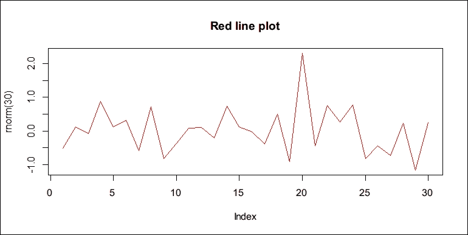
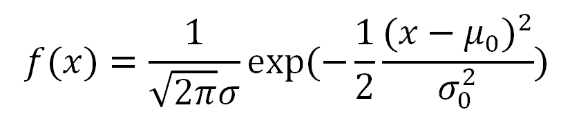
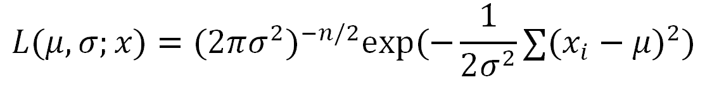
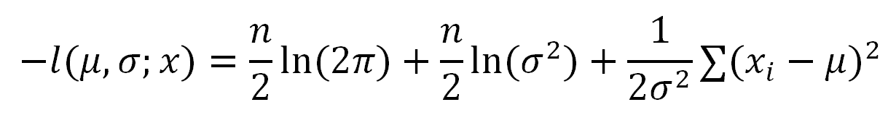
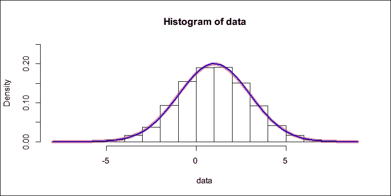

# 第九章。元编程

在上一章中，你学习了环境和其特性的结构，也学习了如何创建和访问一个环境。环境在懒加载、修改时复制和词法作用域中扮演着重要角色，这些都是在函数创建和调用时通过环境实现的。

现在我们对函数的工作原理有了坚实的理解，我们将在本章中进一步学习如何以更高级的形式与函数一起工作。你将学习使 R 在交互式分析中灵活的元编程功能。更具体地说，本章将涵盖以下主题：

+   函数式编程：闭包和高阶函数

+   使用语言对象进行语言计算

+   理解非标准评估

# 理解函数式编程

在上一章中，你详细学习了函数的行为，包括当参数被评估时（懒加载）、尝试修改参数时会发生什么（修改时复制），以及在哪里查找函数内部未定义的变量（词法作用域）。描述这些行为的术语可能看起来比实际要难。在接下来的章节中，你将了解两种类型的函数：在函数中定义的函数和与函数一起工作的函数。

## 创建和使用闭包

在函数中定义的函数称为**闭包**。它很特别，因为在闭包的函数体中，不仅可以使用局部参数，还可以使用父函数中创建的变量。

例如，假设我们有以下函数：

```py
add <- function(x, y) {
  x + y
} 

```

这个函数有两个参数。每次我们调用`add()`时，我们都应该提供两个参数。如果我们使用闭包，我们可以生成具有预指定参数的特殊版本的这个函数。在下一节中，我们将创建一个简单的闭包来完成这个任务。

### 创建简单的闭包

在这里，我们将创建一个名为`addn`的函数，它有一个参数`y`。这个函数并不执行实际的加法计算，而是创建一个子函数，该子函数将`y`加到提供的任何数字`x`上：

```py
addn <- function(y) {
  function(x) {
    x + y
  }
} 

```

可能需要额外的努力才能意识到`addn`并不像典型函数那样返回一个数字，而是返回一个闭包：即在函数中定义的函数。闭包计算`x + y`，其中`x`指的是局部参数，而`y`指的是其封装环境中的参数。换句话说，`addn()`不再是一个计算器，而是一个制造计算器的计算器工厂。

工厂函数使我们能够创建计算器的专用版本。例如，我们可以创建两个函数，分别将`1`和`2`加到数值向量上：

```py
add1 <- addn(1)
add2 <- addn(2) 

```

这两个函数表现得好像`add(x, y)`的第二个参数是固定的。以下代码验证了`addn()`制作的计算器：

```py
add1(10)
## [1] 11
add2(10)
## [1] 12 

```

以`add1`为例。`add1 <- addn(1)`代码评估`addn(1)`，结果将一个函数分配给`add1`：

```py
add1
## function(x) {
## x + y
## }
## <environment: 0x00000000139b0e58> 

```

当我们打印`add1`时，它略有不同，因为`add1`的环境也被附加了。如果函数的环境不是当前环境，则函数的环境将被打印出来——在这种情况下，是全局环境。在`add1`的环境中，`y`是在`addn(1)`中指定的，可以通过运行以下代码来验证：

```py
environment(add1)$y
## [1] 1 

```

我们可以用`add1`调用`environment()`来访问其封闭环境，该环境捕获`y`。这正是闭包的工作方式。我们可以对`add2`做同样的事情，看看我们用`addn(2)`指定的`y`的值：

```py
environment(add2)$y
## [1] 2 

```

### 制作专用函数

闭包对于制作专用函数很有用。例如，由于图形生产的灵活性，绘图函数通常提供大量的参数。如果我们经常只使用所有参数的一个特定子集，我们可以制作专门的版本，使代码更容易编写和阅读。

以下`color_line`函数是`plot`的一个版本，专门用于颜色选择，但固定了绘图类型和线条类型。它相当于一个制造所有颜色笔的工厂：

```py
color_line<- function(col) {
  function(...) {
 plot(..., type = "l", lty = 1, col = col)
  }
} 

```

如果我们想要一支红笔，我们调用`color_line`并得到一个专门绘制红色线条的函数。生成的函数也接受其他参数，例如标题和字体：

```py
red_line<- color_line("red")
red_line(rnorm(30), main = "Red line plot") 

```

此函数生成以下线图：



上述代码比没有使用此类专用函数的原始版本更易于阅读：

```py
plot(rnorm(30), type = "l", lty = 1, col = "red",
  main = "Red line plot") 

```

### 使用最大似然估计（MLE）拟合正态分布

当我们与某些给定数据一起工作算法时，闭包很有用。例如，优化是一个寻找一组参数的问题，这些参数在满足某些约束和数据的情况下最大化或最小化预定义的目标函数。在统计学中，许多参数估计问题本质上都是优化问题。一个很好的例子是**最大似然估计（MLE）**，它展示了闭包的使用。当我们用数据估计统计模型的参数时，我们通常使用最大似然估计法（MLE，见[`en.wikipedia.org/wiki/Maximum_likelihood`](https://en.wikipedia.org/wiki/Maximum_likelihood)）。MLE 背后的思想很简单：参数的估计值应该使观察到的数据在给定模型下最有可能。

要执行最大似然估计（MLE），我们需要一个函数来衡量在特定模型下观察给定数据集的可能性。然后，我们应用优化技术来找出最大化概率的参数值。

例如，我们知道一组观测数据是由正态分布生成的，但问题在于，我们不知道参数：均值和标准差。然后，我们可以使用最大似然估计（MLE）来估计它们，给定观测数据。

首先，我们知道均值为*μ[0]*和标准差*σ[0]*的正态分布的概率密度函数是：



因此，给定观测数据*x*的似然函数是：



为了使优化更容易，我们将取自然对数并在两边取负，得到负对数似然函数：



负对数似然函数与原始函数具有相同的单调性。此函数的优化解与原始函数相同，但可能更容易解决。这就是为什么我们在估计中使用此函数的原因。

以下`nloglik` R 函数根据观测数据`x`返回正态分布的两个参数的闭包：

```py
nloglik<- function(x) {
  n <- length(x)
  function(mean, sd) {
 log(2 * pi) * n / 2 + log(sd ^ 2) * n / 2 + sum((x - mean) ^ 2) / (2 * sd ^ 2)
  }
} 

```

以这种方式，对于任何给定的观测数据集，我们调用`nloglike`来获取关于均值和标准差的负对数似然函数。它告诉我们，在假设真实模型取我们指定的`mean`和`sd`值的情况下，观察到给定数据`x`有多不可能。

例如，我们使用`rnorm()`生成 10,000 个服从均值为`1`和标准差为`2`的正态分布的随机数。因此，`mean = 1`和`sd = 2`是分布参数的真实值：

```py
data <- rnorm(10000, 1, 2) 

```

然后，我们转向`stats4`包中的`mle()`函数。此函数实现了一系列数值方法来找到给定负对数似然函数的极小值，并带有某些参数。它接受数值搜索的起点，以及解的下界和上界：

```py
fit <- stats4::mle(nloglik(data),
  start = list(mean = 0, sd = 1), method = "L-BFGS-B",
  lower =c(-5, 0.01), upper = c(5, 10)) 

```

经过几次迭代后，它找到了最大似然估计解并返回一个 S4 对象，其中包含与解相关的数据。为了查看估计值与真实值有多接近，我们将从对象中提取`coef`槽：

```py
fit@coef
## mean sd
## 1.007548 1.990121 

```

显然，估计值非常接近真实值。相对而言，两个估计值都有低于 1%的误差，这可以在下面验证：

```py
(fit@coef - c(1, 2)) / c(1, 2)
## mean sd
##  0.007547752 -0.004939595 

```

以下函数是`data`的直方图和具有真实参数（红色曲线）和估计参数（蓝色曲线）的正态分布密度函数的组合：

```py
hist(data, freq =FALSE, ylim =c(0, 0.25))
curve(dnorm(x, 1, 2), add =TRUE, col =rgb(1, 0, 0, 0.5), lwd =6)
curve(dnorm(x, fit@coef[["mean"]], fit@coef[["sd"]]),
    add =TRUE, col ="blue", lwd =2) 

```

这产生了以下直方图，以及一个拟合的正态密度曲线：



我们可以看到，由估计参数产生的密度函数非常接近真实模型。

## 使用高阶函数

在上一节中，我们讨论了闭包，即在父函数中定义的函数。在本节中，我们将讨论高阶函数，即接受另一个函数作为参数的函数。

在深入这个主题之前，我们需要更多关于函数在作为变量或函数参数传递时的行为的知识。

### 为函数创建别名

第一个问题：如果我们将现有函数赋值给另一个变量，它会影响函数的封装环境吗？如果是这样，那么未在局部定义的符号的搜索路径将不同。

以下代码演示了为什么将函数赋值给另一个符号时，封装环境不会改变。我们定义了一个简单的函数`f1`，它在被调用时打印执行环境、封装环境和调用环境。然后，我们定义了`f2`，它也打印了这三个环境，但除此之外，它还将`f1`的函数赋值给局部变量`p`，并在`f2`内部调用`p`。

如果`p <- f1`在局部定义了函数，则`p`的封装环境将是`f2`的执行环境。否则，封装环境将保持为定义`f1`的全局环境：

```py
f1 <- function() {
  cat("[f1] executing in ")
  print(environment())
  cat("[f1] enclosed by ")
  print(parent.env(environment()))
  cat("[f1] calling from ")
  print(parent.frame())
}
f2 <- function() {
  cat("[f2] executing in ")
  print(environment())
  cat("[f2] enclosed by ")
  print(parent.env(environment()))
  cat("[f2] calling from ")
  print(parent.frame())
  p <- f1
  p()
}
f1()
## [f1] executing in <environment: 0x000000001435d700>
## [f1] enclosed by <environment: R_GlobalEnv>
## [f1] calling from <environment: R_GlobalEnv>
f2()
## [f2] executing in <environment: 0x0000000014eb2200>
## [f2] enclosed by <environment: R_GlobalEnv>
## [f2] calling from <environment: R_GlobalEnv>
## [f1] executing in <environment: 0x0000000014eaedf0>
## [f1] enclosed by <environment: R_GlobalEnv>
## [f1] calling from <environment: 0x0000000014eb2200> 

```

我们依次调用了这两个函数，发现`p`是在`f2`的执行环境中被调用的，但封装的环境没有改变。换句话说，`p`和`f1`的搜索路径完全相同。实际上，`p <- f1`将`f1`表示的相同函数赋值给`p`，然后它们都指向同一个函数。

### 将函数用作变量

R 中的函数并不像在其他编程语言中那样特殊。一切都是对象。函数也是对象，并且可以通过变量引用。

假设我们有一个这样的函数：

```py
f1 <- function(x, y) {
  if (x > y) {
    x + y
  } else {
    x - y
  }
} 

```

在前面的函数中，两个条件分支导致不同的表达式，可能产生不同的值。为了达到相同的目的，我们也可以让条件分支产生不同的函数，将结果存储在变量中，最后调用变量表示的函数以获取结果：

```py
f2 <- function(x, y) {
  op <- if (x > y) `+` else `-`
 op(x, y)
} 

```

注意，在 R 中，我们做的所有事情都是通过函数完成的。最基本的运算符`+`和`-`也是函数。它们可以被赋值给变量`op`，如果`op`确实是一个函数，我们就可以调用它。

### 将函数作为参数传递

之前的例子表明，我们可以像传递其他任何东西一样轻松地传递函数，包括在参数中传递函数。

在以下示例中，我们将定义两个函数，分别称为`add`和`product`：

```py
add <- function(x, y, z) {
  x + y + z
}
product <- function(x, y, z) {
  x * y * z
} 

```

然后，我们将定义另一个名为`combine`的函数，它试图以参数`f`指定的某种方式组合`x`、`y`和`z`。在这里，`f`被假设为一个接受三个参数的函数，正如我们调用它时那样。这样，`combine`就更加灵活。它不仅限于特定的组合输入方式，还允许用户指定：

```py
combine <- function(f, x, y, z) {
 f(x, y, z)
} 

```

我们可以将我们刚刚定义的`add`和`product`传递过去，看看它是否工作：

```py
combine(add, 3, 4, 5)
## [1] 12
combine(product, 3, 4, 5)
## [1] 60 

```

当我们调用`combine(add, 3, 4, 5)`时，函数体有`f = add`和`f(x, y, z)`，这导致`add(x, y, z)`。同样的逻辑也适用于使用`product`调用`combine`。由于`combine`接受一个函数作为其第一个参数，它确实是一个高阶函数。

另一个我们需要高阶函数的原因是，在更高层次的抽象级别上，代码更容易阅读和编写。在许多情况下，使用高阶函数可以使代码更短，但表达更丰富。例如，for 循环是一个普通的流程控制设备，它沿着向量或列表进行迭代。

假设我们需要将一个名为`f`的函数应用到向量`x`的每个元素上。如果函数本身是向量化的，最好直接调用`f(x)`。然而，并不是每个函数都支持向量化操作，也不是每个函数都需要向量化。如果我们想这样做，像以下这样的 for 循环可以解决问题：

```py
result<-list()
for (i in seq_along(x)) {
    result[[i]] <-f(x[[i]])
}
result 

```

在前面的循环中，`seq_along(x)`生成从`1`到`x`长度的序列，这相当于`1:length(x)`。代码看起来简单且易于实现，但如果我们总是使用它，缺点就会变得明显。

假设每次迭代的操作变得更加复杂：这将很难阅读。如果你仔细想想，你会发现代码告诉 R 如何完成任务，而不是任务本身是什么。当你查看非常长，有时嵌套的循环时，你可能会很难弄清楚它实际上在做什么。

相反，我们可以通过调用我们在前面的章节中介绍的`lapply`，将函数（`f`）应用到向量或列表（`x`）的每个元素上：

```py
lapply(x, f) 

```

实际上，`lapply`本质上与以下代码相同，尽管它是用 C 实现的：

```py
lapply <- function(x, f, ...) {
  result <- list()
  for (i in seq_along(x)) {
      result[[i]] <-f(x[i], ...)
  }
} 

```

这个函数是一个高阶函数，因为它在更高层次的抽象级别上工作。尽管它仍然在内部使用 for 循环，但它将工作分为两个抽象级别，使得每个级别看起来都很简单。

实际上，`lapply`也支持通过额外的参数扩展`f`。例如，`+`有两个参数，如下面的代码所示：

```py
lapply(1:3, `+`, 3)
## [[1]]
## [1] 4
##
## [[2]]
## [1] 5
##
## [[3]]
## [1] 6 

```

上一行代码等同于：

```py
list(1 +3, 2 +3, 3 +3) 

```

上一行代码也等同于我们使用闭包来生成`x+3`函数的情况：

```py
lapply(1:3, addn(3))
## [[1]]
## [1] 4
##
## [[2]]
## [1] 5
##
## [[3]]
## [1] 6 

```

正如我们在前面的章节中提到的，`lapply`只返回一个列表。如果我们想得到一个向量，我们应该在交互模式下使用`sapply`：

```py
sapply(1:3, addn(3))
## [1] 4 5 6 

```

或者，我们应该在编程代码中使用类型检查的`vapply`：

```py
vapply(1:3, addn(3), numeric(1))
## [1] 4 5 6 

```

除了这些函数之外，R 还提供了几个其他 apply 家族函数，正如我们在前面的章节中提到的，以及`Filter`、`Map`、`Reduce`、`Find`、`Position`和`Negate`。更多详细信息，请参阅文档中的`?Filter`。

此外，使用高阶函数不仅使代码更容易阅读和表达，而且这些函数还分离了每个抽象级别的实现，使它们相互独立。比一个逻辑耦合的整体更容易改进简单的组件。

例如，我们可以使用 apply-family 函数执行向量映射，给定一个函数。如果每个迭代与其他迭代独立，我们可以使用多个 CPU 核心并行化映射，以便同时执行更多任务。然而，如果我们最初没有使用高阶函数，而是使用 for 循环，那么将其转换为并行代码需要一段时间。

例如，让我们假设我们使用 for 循环来获取结果。在每次迭代中，我们执行一个繁重的计算任务。即使我们发现每个迭代与其他迭代独立，也不总是容易将其转换为并行代码：

```py
result <- list()
for (i in seq_along(x)) {
  # heavy computing task
  result[[i]] <- f(x[[i]])
}
result 

```

然而，如果我们使用高阶函数 `lapply()`，事情将会简单得多：

```py
result <- lapply(x, f) 

```

只需对代码进行一点小的修改，就可以将其转换为并行版本。使用 `parallel::mclapply()`，我们可以使用多个核心将 `f` 应用到 `x` 的每个元素上：

```py
result <- parallel::mclapply(x, f) 

```

很遗憾，`mclapply()` 不支持 Windows 系统。在 Windows 上执行并行应用函数需要更多的代码。我们将在高性能计算章节中介绍这个话题。

# 语言上的计算

在上一节中，我们介绍了 R 中的函数式编程设施。你了解到函数只是我们可以传递的另一种类型的对象。当我们创建一个新的函数，比如 `fun`，我们创建的环境将与该函数相关联。这个环境被称为函数的封装环境，可以通过 `environment(fun)` 访问。每次我们调用函数时，都会创建一个新的执行环境，该环境包含未评估的参数（承诺），以托管函数的执行，这实现了惰性求值。执行环境的父环境是函数的封装环境，这实现了词法作用域。

函数式编程允许我们在更高的抽象级别编写代码。元编程更进一步。它允许我们调整语言本身，并使某些语言结构在某些场景下更容易使用。一些流行的 R 包在其函数中使用元编程来简化事物。在本节中，我将向你展示元编程的力量以及其优缺点，以便你了解相关包和函数是如何工作的。

在深入了解事物是如何工作的知识之前，我们可能先看看一些使用元编程来简化事物的内置函数。

假设我们想要过滤内置数据集 `iris`，以找到每个数值列都大于所有记录 80% 的记录。

标准方法是通过对逻辑向量进行组合来对数据框的行进行子集化：

```py
iris[iris$Sepal.Length > quantile(iris$Sepal.Length, 0.8) &
    iris$Sepal.Width > quantile(iris$Sepal.Width, 0.8) &
    iris$Petal.Length > quantile(iris$Petal.Length, 0.8) &
    iris$Petal.Width > quantile(iris$Petal.Width, 0.8), ]
##     Sepal.Length  Sepal.Width  Petal.Length  Petal.Width
## 110     7.2           3.6          6.1           2.5
## 118     7.7           3.8          6.7           2.2
## 132     7.9           3.8          6.4           2.0
## Species
## 110 virginica
## 118 virginica
## 132 virginica 

```

在前面的代码中，每次调用`quantile()`都会为一个列提供一个 80%的阈值。尽管代码可以工作，但它相当冗余，因为每次我们使用一个列时，都必须以`iris$`开始。总共，`iris$`出现了九次。

内置函数`subset`非常有用，可以使事情变得更简单：

```py
subset(iris,
    Sepal.Length > quantile(Sepal.Length, 0.8) &
    Sepal.Width > quantile(Sepal.Width, 0.8) &
    Petal.Length > quantile(Petal.Length, 0.8) &
    Petal.Width > quantile(Petal.Width, 0.8))
##      Sepal.Length Sepal.Width Petal.Length Petal.Width
## 110      7.2          3.6         6.1          2.5
## 118      7.7          3.8         6.7          2.2
## 132      7.9          3.8         6.4          2.0
## Species
## 110 virginica 
## 118 virginica
## 132 virginica 

```

前面的代码返回了完全相同的结果，但代码更简洁。但为什么在先前的例子中省略`iris$`却不起作用呢？

```py
iris[Sepal.Length > quantile(Sepal.Length, 0.8) &
    Sepal.Width > quantile(Sepal.Width, 0.8) &
    Petal.Length > quantile(Petal.Length, 0.8) &
    Petal.Width > quantile(Petal.Width, 0.8), ]
## Error in `[.data.frame`(iris, Sepal.Length > quantile(Sepal.Length, 0.8) & : object 'Sepal.Length' not found 

```

前面的代码无法正常工作，因为`Sepal.Length`和其他列没有定义在我们评估子集表达式的范围（或环境）中。神奇的函数`subset`使用元编程技术调整其参数的评估环境，以便`Sepal.Length>quantile(Sepal.Length, 0.8)`在`iris`的列的环境中评估。

此外，`subset`不仅与行一起工作，而且在选择列时也非常有用。例如，我们也可以通过直接使用列名作为变量来指定`select`参数，而不是使用字符向量来选择列：

```py
subset(iris,
    Sepal.Length > quantile(Sepal.Length, 0.8) &
    Sepal.Width > quantile(Sepal.Width, 0.8) &
    Petal.Length > quantile(Petal.Length, 0.8) &
    Petal.Width > quantile(Petal.Width, 0.8),
select = c(Sepal.Length, Petal.Length, Species))
##     Sepal.Length Petal.Length  Species
## 110     7.2          6.1      virginica
## 118     7.7          6.7      virginica
## 132     7.9          6.4      virginica 

```

看看`subset`如何调整其第二个参数（`subset`）和第三个参数（`select`）的评估方式。结果是我们可以用更简洁的代码和更少的冗余来编写代码。

在接下来的几节中，你将了解幕后发生的事情以及它是如何设计的来工作的。

## 捕获和修改表达式

当我们输入一个表达式并按下*Enter*（或回车）键时，R 将评估该表达式并显示输出。以下是一个示例：

```py
rnorm(5)
## [1] 0.54744813 1.15202065 0.74930997 -0.02514251
## [5]  0.99714852 

```

它显示了生成的五个随机数。`subset`的神奇之处在于它调整了参数评估的环境。这分为两个步骤：首先捕获表达式，然后干扰表达式的评估。

### 将表达式作为语言对象捕获

捕获一个表达式意味着阻止表达式被评估，但将表达式本身存储为变量。执行此操作的是`quote()`函数；我们可以调用`quote()`来捕获括号之间的表达式：

```py
call1 <- quote(rnorm(5))
call1
## rnorm(5) 

```

前面的代码并没有产生五个随机数，而是函数调用本身。我们可以使用`typeof()`和`class()`来查看结果对象`call1`的类型和类：

```py
typeof(call1)
## [1] "language"
class(call1)
## [1] "call" 

```

我们可以看到`call1`本质上是一个语言对象，它是一个调用。我们也可以在`quote()`中写入一个函数名：

```py
name1 <- quote(rnorm)
name1
## rnorm
typeof(name1)
## [1] "symbol"
class(name1)
## [1] "name" 

```

在这种情况下，我们没有得到一个调用，而是一个符号（或名称）。

事实上，如果捕获了一个函数调用，`quote()`将返回一个调用，如果捕获了一个变量名，则返回一个符号。唯一的要求是捕获代码的有效性；也就是说，只要代码在语法上是正确的，`quote()`就会返回代表捕获表达式的语言对象。

即使函数不存在或变量尚未定义，表达式也可以单独捕获：

```py
quote(pvar)
## pvar
quote(xfun(a = 1:n))
## xfun(a = 1:n) 

```

在前面的语言对象中，可能 `pvar`、`xfun` 和 `n` 都尚未定义，但我们仍然可以 `quote()` 它们。

理解变量和符号对象，以及函数和调用对象之间的区别是很重要的。变量是一个对象的名称，而符号对象是名称本身。函数是一个可调用的对象，而调用对象是一个表示这种函数调用的语言对象，它尚未评估。在这种情况下，`rnorm` 是一个函数，它是可调用的（例如，`rnorm(5)` 返回五个随机数），但 `quote(rnorm)` 返回一个符号对象，而 `quote(rnorm(5))` 返回一个调用对象，它们都只是语言本身的表示。

我们可以将调用对象转换为列表，这样我们就可以看到其内部结构：

```py
as.list(call1)
## [[1]]
## rnorm
##
## [[2]]
## [1] 5 

```

这表明调用由两个组件组成：函数的符号和一个参数。我们可以从调用对象中提取对象：

```py
call1[[1]]
## rnorm
typeof(call1[[1]])
## [1] "symbol"
class(call1[[1]])
## [1] "name" 

```

`call1` 的第一个元素是一个符号：

```py
call1[[2]]
## [1] 5
typeof(call1[[2]])
## [1] "double"
class(call1[[2]])
## [1] "numeric" 

```

`call1` 的第二个元素是一个数值。从前面的例子中，我们知道 `quote()` 将变量名称捕获为符号对象，将函数调用捕获为调用对象。它们都是语言对象。像典型数据结构一样，我们可以使用 `is.symbol()`/`is.name()` 和 `is.call()` 来检测一个对象是否是符号或调用，更普遍地，我们也可以使用 `is.language()` 来检测符号和调用。

另一个问题，“如果我们对字面值调用 `quote()` 会怎样？如果是数字或字符串呢？”以下代码创建了一个数值 `num1` 和一个引用的数值 `num2`：

```py
num1 <- 100
num2 <- quote(100) 

```

它们有完全相同的表示：

```py
num1
## [1] 100
num2
## [1] 100 

```

实际上，它们的值完全相同：

```py
identical(num1, num2) 
## [1] TRUE 

```

因此，`quote()` 并不会将字面值（如数字、逻辑值、字符串等）转换为语言对象，而是保持原样。然而，将几个字面值组合成向量的表达式仍然会被转换为调用对象。以下是一个例子：

```py
call2 <- quote(c("a", "b")) 
call2 
## c("a", "b") 

```

它是一致的，因为 `c()` 确实是一个结合值和向量的函数。此外，如果你使用 `as.list()` 查看调用列表的表示，我们可以看到调用的结构：

```py
as.list(call2) 
## [[1]] 
## c 
##  
## [[2]] 
## [1] "a" 
##  
## [[3]] 
## [1] "b" 

```

调用中元素的类型可以通过 `str()` 来揭示：

```py
str(as.list(call2)) 
## List of 3 
##  $ : symbol c 
##  $ : chr "a" 
##  $ : chr "b" 

```

另一个值得注意的事实是，简单的算术计算也被捕获为调用，因为它们肯定是算术运算符（如 `+` 和 `*`）的函数调用，这些运算符本质上都是内置函数。例如，我们可以使用 `quote()` 函数对最简单的算术计算进行操作，执行 `1 + 1`：

```py
call3 <- quote(1 + 1) 
call3 
## 1 + 1 

```

运算表示被保留，但它是一个调用，并且具有与调用完全相同的结构：

```py
is.call(call3) 
## [1] TRUE 
str(as.list(call3)) 
## List of 3 
##  $ : symbol + 
##  $ : num 1 
##  $ : num 1 

```

在了解了所有关于捕获表达式的知识之后，我们现在可以捕获嵌套调用；也就是说，一个包含更多调用的调用。

```py
call4 <- quote(sqrt(1 + x ^ 2)) 
call4 
## sqrt(1 + x ^ 2) 

```

我们可以使用 `pryr` 包中的函数来查看调用的递归结构。要安装该包，运行 `install.package("pryr")`。一旦包准备就绪，我们可以调用 `pryr::call_tree` 来实现：

```py
pryr::call_tree(call4) 
## \- () 
## \- `sqrt 
## \- () 
## \- `+ 
## \-  1 
## \- () 
## \- `^ 
## \- `x 
## \-  2 

```

对于 `call4`，递归结构以树状结构打印。`\- ()` 操作符表示一个调用，然后 `` `var `` 表示一个符号对象 `var`，其余的是文字值。在前面的输出中，我们可以看到符号和调用被捕获，而文字值被保留。

如果你好奇一个表达式的调用树，你总是可以使用这个函数，因为它精确地反映了 R 处理表达式的方式。

### 修改表达式

当我们将表达式捕获为调用对象时，调用可以像列表一样进行修改。例如，我们可以通过将调用的第一个元素替换为另一个符号来更改要调用的函数：

```py
call1 
## rnorm(5) 
call1[[1]] <- quote(runif) 
call1 
## runif(5) 

```

因此，`rnorm(5)` 被更改为 `runif(5)`。

我们还可以向调用中添加新参数：

```py
call1[[3]] <- -1 
names(call1)[[3]] <- "min" 
call1 
## runif(5, min = -1) 

```

然后，调用现在有另一个参数：`min = -1`。

### 捕获函数参数的表达式

在前面的示例中，你学习了如何使用 `quote()` 捕获已知表达式，但 `subset` 与任意用户输入的表达式一起工作。假设我们想捕获参数 `x` 的表达式。

第一种实现使用 `quote()`：

```py
fun1 <- function(x) { 
  quote(x) 
} 

```

让我们看看当使用 `rnorm(5)` 调用函数时，`fun1` 是否可以捕获输入表达式：

```py
fun1(rnorm(5)) 
## x 

```

显然，`quote(x)` 只捕获 `x`，与输入表达式 `rnorm(5)` 没有关系。为了正确捕获它，我们需要使用 `substitute()`。该函数捕获一个表达式，并用它们的表达式替换现有符号。此函数的最简单用法是捕获函数参数的表达式：

```py
fun2 <- function(x) { 
  substitute(x) 
} 
fun2(rnorm(5)) 
## rnorm(5) 

```

使用这种实现，`fun2` 返回输入表达式而不是 `x`，因为 `x` 被替换为输入表达式，在这种情况下，`rnorm(5)`。

以下示例演示了当我们提供一个语言对象或文字值的列表时，`substitute` 的行为。在第一个示例中，我们将给定表达式中每个符号 `x` 替换为 `1`：

```py
substitute(x + y + x ^ 2, list(x = 1)) 
## 1 + y + 1 ^ 2 

```

在第二个示例中，我们将应该作为函数名的每个符号 `f` 替换为另一个引用函数名 `sin`：

```py
substitute(f(x + f(y)), list(f = quote(sin))) 
## sin(x + sin(y)) 

```

现在，我们能够使用 `quote()` 捕获某些表达式，并使用 `substitute()` 捕获用户输入的表达式。

### 构造函数调用

除了捕获表达式外，我们还可以直接使用内置函数构建语言对象。例如，`call1` 是使用 `quote()` 捕获的调用：

```py
call1 <- quote(rnorm(5, mean = 3)) 
call1 
## rnorm(5, mean = 3) 

```

我们可以使用 `call()` 创建具有相同参数的相同函数的调用：

```py
call2 <- call("rnorm", 5,  mean = 3) 
call2 
## rnorm(5, mean = 3) 

```

或者，我们可以使用 `as.call()` 将调用组件列表转换为调用：

```py
call3 <- as.call(list(quote(rnorm), 5, mean = 3)) 
call3 
## rnorm(5, mean = 3) 

```

这三种方法创建相同的调用；也就是说，它们调用具有相同名称和相同参数的函数，这可以通过使用 `identical()` 调用三个结果调用对象来确认：

```py
identical(call1, call2) 
## [1] TRUE 
identical(call2, call3) 
## [1] TRUE 

```

## 评估表达式

在捕获一个表达式之后，下一步是评估它。这可以通过`eval()`函数来完成。

例如，如果我们输入`sin(1)`并回车，值将立即显示：

```py
sin(1) 
## [1] 0.841471 

```

为了控制`sin(1)`的评估，我们可以使用`quote()`来捕获表达式，然后使用`eval()`来评估函数调用：

```py
call1 <- quote(sin(1)) 
call1 
## sin(1) 
eval(call1) 
## [1] 0.841471 

```

我们可以捕获任何语法正确的表达式，这允许我们`quote()`一个使用未定义变量的表达式：

```py
call2 <- quote(sin(x)) 
call2 
## sin(x) 

```

在`call2`中，`sin(x)`使用了一个未定义的变量`x`。如果我们直接评估它，将发生错误：

```py
eval(call2) 
## Error in eval(expr, envir, enclos): object 'x' not found 

```

这个错误类似于当我们直接运行未定义的`x`的`sin(x)`时发生的情况：

```py
sin(x) 
## Error in eval(expr, envir, enclos): object 'x' not found 

```

直接在控制台运行和使用`eval()`之间的区别在于`eval()`允许我们提供一个列表来评估给定的表达式。在这种情况下，我们不需要创建变量`x`，而是提供一个包含`x`的临时列表，这样表达式就可以在列表中查找符号：

```py
eval(call2, list(x = 1)) 
## [1] 0.841471 

```

另外，`eval()`函数也接受一个用于符号查找的环境。在这里，我们将创建一个新的环境`e1`，在其中我们创建一个值为`1`的变量`x`，然后我们在`e1`中的调用中使用`eval()`：

```py
e1 <- new.env() 
e1$x <- 1 
eval(call2, e1) 
## [1] 0.841471 

```

当捕获的表达式有更多未定义变量时，同样的逻辑也适用：

```py
call3 <- quote(x ^ 2 + y ^ 2) 
call3 
## x ^ 2 + y ^ 2 

```

如果没有完全指定未定义符号的表达式，直接评估表达式将导致错误：

```py
eval(call3) 
## Error in eval(expr, envir, enclos): object 'x' not found 

```

部分指定也是如此：

```py
eval(call3, list(x = 2)) 
## Error in eval(expr, envir, enclos): object 'y' not found 

```

只有当我们完全指定表达式中的符号值时，评估才能得到一个值：

```py
eval(call3, list(x = 2, y = 3)) 
## [1] 13 

```

`eval(expr, envir, enclos)`的评估模型与调用函数相同。函数体是`expr`，执行环境是`envir`。如果`envir`被给定为列表，则封装环境是`enclos`，否则封装环境是`envir`的父环境：

这个模型意味着符号查找的确切行为。假设我们使用一个环境来评估`call3`。由于`e1`只包含变量`x`，评估不会继续：

```py
e1 <- new.env() 
e1$x <- 2 
eval(call3, e1) 
## Error in eval(expr, envir, enclos): object 'y' not found 

```

然后，我们创建一个新的环境，其父环境是`e1`并包含变量`y`。如果我们现在在`e2`中评估`call3`，`x`和`y`都被找到，评估工作正常：

```py
e2 <- new.env(parent = e1) 
e2$y <- 3 
eval(call3, e2) 
## [1] 13 

```

在前面的代码中，`eval(call3, e2)`尝试评估`call3`，其中`e2`是执行环境。现在，我们可以通过评估过程来更好地理解它是如何工作的。评估过程通过`pryr::call_tree()`产生的调用树递归地反映出来：

```py
pryr::call_tree(call3) 
## \- () 
## \- `+ 
## \- () 
## \- `^ 
## \- `x 
## \-  2 
## \- () 
## \- `^ 
## \- `y 
## \-  2 

```

首先，它试图找到一个名为 `+` 的函数。它遍历 `e2` 和 `e1`，直到达到基础环境（`baseenv()`），在那里定义了所有基本算术运算符，才找到 `+`。然后，`+` 需要评估其参数，因此它寻找另一个名为 `^` 的函数，并通过相同的流程找到它。然后，`^` 再次需要评估其参数，因此它寻找 `e2` 中的符号 `x`。环境 `e2` 不包含变量 `x`，因此它继续在 `e2` 类的父环境 `e1` 中搜索，并在那里找到 `x`。最后，它在 `e2` 中寻找符号 `y` 并立即找到它。当调用所需的参数准备就绪时，调用可以评估为结果。

另一种方法是向 `envir` 提供一个列表和一个封装的环境：

```py
e3 <- new.env() 
e3$y <- 3 
eval(call3, list(x = 2), e3) 
## [1] 13 

```

评估过程从从列表生成的执行环境开始，其父环境是按指定方式指定的 `e3`。然后，过程与前面的示例完全相同。

由于我们做的所有事情本质上都是调用函数，`quote()` 和 `substitute()` 可以捕获一切，包括赋值和其他看起来不像调用函数的操作。事实上，例如，`x <- 1` 实质上是调用 `<-` 并传递 `(x, 1)`，而 `length(x) <- 10` 实质上是调用 `length<-` 并传递 `(x, 10)`。

为了说明这一点，我们可能构造另一个示例，其中我们创建一个新的变量。

在以下示例中，我们提供一个列表来生成执行环境，并将 `e3` 作为封装环境：

```py
eval(quote(z <- x + y + 1), list(x = 1), e3) 
e3$z 
## NULL 

```

因此，`z` 不会在 `e3` 中创建，而是在从列表创建的临时执行环境中创建。如果我们，相反，指定 `e3` 作为执行环境，变量将在其中创建：

```py
eval(quote(z <- y + 1), e3) 
e3$z 
## [1] 4 

```

总之，`eval()` 的工作方式与函数调用的行为极为相似，但 `eval()` 允许我们通过调整其执行和封装环境来自定义表达式的评估，这使我们能够做一些好事，比如 `subset`，以及一些坏事，如下所示：

```py
eval(quote(1 + 1), list(`+` = `-`)) 
## [1] 0 

```

## 理解非标准评估

在前面的章节中，你学习了如何使用 `quote()` 和 `substitute()` 来捕获一个表达式作为语言对象，以及如何使用 `eval()` 在给定的列表或环境中评估它。这些函数构成了 R 中的元编程功能，允许我们调整标准评估。元编程的主要应用是执行非标准评估，以使某些使用更加容易。在接下来的章节中，我们将讨论一些示例，以更好地理解它是如何工作的。

### 使用非标准评估实现快速子集选择

通常，我们需要从一个向量中提取某个子集。子集的范围可能是前几个元素，最后几个元素，或者中间的一些元素。

前两种情况可以通过 `head(x, n)` 和 `tail(x, n)` 容易地处理。第三种情况需要输入向量的长度。

例如，假设我们有一个整数向量，并想要取出从第三个到最后第五个的元素：

```py
x <- 1:10 
x[3:(length(x) -5)] 
## [1] 3 4 5 

```

前面的子集表达式使用了 `x` 两次，看起来有点冗余。我们可以定义一个快速子集函数，它使用元编程功能提供一个特殊符号来引用输入向量的长度。以下函数 `qs` 是这个想法的简单实现，它允许我们使用点 (`.`) 来表示输入向量 `x` 的长度：

```py
qs <- function(x, range) { 
 range <- substitute(range) 
  selector <- eval(range, list(. =length(x))) 
  x[selector] 
} 

```

使用这个函数，我们可以用 `3:(. - 5)` 来表示与激励示例相同的范围：

```py
qs(x, 3:(. -5)) 
## [1] 3 4 5 

```

我们也可以很容易地通过从最后一个元素开始计数来挑选出一个数字：

```py
qs(x, . -1) 
## [1] 9 

```

基于 `qs()`，以下函数被设计用来从输入向量 `x` 中修剪 `n` 个元素的边缘；也就是说，它返回一个没有 `x` 的第一个 `n` 个和最后一个 `n` 个元素的向量：

```py
trim_margin <- function(x, n) { 
  qs(x, (n + 1):(. -n -1)) 
} 

```

函数看起来没问题，但当我们用普通输入调用它时，会发生错误：

```py
trim_margin(x, 3) 
## Error in eval(expr, envir, enclos): object 'n' not found 

```

为什么找不到 `n`？为了理解为什么会发生这种情况，我们需要分析 `trim_margin` 被调用时符号查找的路径。在下一节中，我们将详细讨论这个问题，并介绍动态作用域的概念来解决该问题。

### 理解动态作用域

在尝试解决这个问题之前，让我们用你所学到的知识来分析发生了什么错误。当我们调用 `trim_margin(x, 3)` 时，我们在一个新的执行环境中调用 `qs(x, (n + 1):(. - n - 1))`，并带有 `x` 和 `n`。`qs()` 是特殊的，因为它使用非标准评估。更具体地说，它首先将 `range` 作为语言对象捕获，然后使用一个包含要提供的额外符号的列表来评估它，此时，这个列表只包含 `. = length(x)`。

错误刚好发生在 `eval(range, list(. = length(x)))`。要修剪的边缘元素数量 `n` 在这里找不到。评估的包围环境肯定有问题。现在，我们将更仔细地查看 `eval()` 函数的 `enclos` 参数的默认值：

```py
eval 
## function (expr, envir = parent.frame(), enclos = if (is.list(envir) ||  
## is.pairlist(envir)) parent.frame() else baseenv())  
## .Internal(eval(expr, envir, enclos)) 
## <bytecode: 0x00000000106722c0> 
## <environment: namespace:base> 

```

`eval()` 的定义说明，如果我们向 `envir` 提供一个列表，这正是我们所做的，`enclos` 将默认取 `parent.frame()`，即 `eval()` 的调用环境；也就是说，当我们调用 `qs()` 时执行的 环境。当然，`qs()` 的任何执行环境中都没有 `n`。

在这里，我们暴露了在 `trim_margin()` 中使用 `substitute()` 的一个缺点，因为表达式只有在正确的上下文中才有完全的意义，即 `trim_margin()` 的执行环境，也是 `qs()` 的调用环境。不幸的是，`substitute()` 只捕获表达式；它不捕获表达式有意义的上下文。因此，我们必须自己来做这件事。

现在，我们知道问题出在哪里了。解决方案很简单：始终使用捕获表达式定义的正确封装环境。在这种情况下，我们指定 `enclos = parent.frame()`，这样 `eval()` 就会在 `qs()` 的调用环境中寻找所有除 `.` 之外的符号，即 `trim_margin()` 的执行环境，其中提供了 `n`。

以下代码行是 `qs()` 的固定版本：

```py
qs <- function(x, range) { 
 range <- substitute(range) 
  selector <- eval(range, list(. =length(x)), parent.frame()) 
  x[selector] 
} 

```

我们可以用之前出错的相同代码测试这个函数：

```py
trim_margin(x, 3) 
## [1] 4 5 6 

```

现在，函数以正确的方式工作。实际上，这种机制就是所谓的**动态作用域**。回想一下你在上一章中学到的内容。每次函数被调用时，都会创建一个执行环境。如果一个符号在执行环境中找不到，它将搜索封装环境。

在标准评估中使用的词法作用域中，函数的封装环境在函数定义时确定，其定义的环境也是如此。

然而，与在非标准评估中使用的动态作用域相比，封装环境应该是捕获表达式定义的调用环境，以便符号可以在自定义执行环境或封装环境中找到，包括其父环境。

总之，当一个函数使用非标准评估时，确保动态作用域正确实现是非常重要的。

### 使用公式捕获表达式和环境

正确实现动态作用域，我们使用 `parent.frame()` 来追踪 `substitute()` 捕获的表达式。一个更简单的方法是使用公式同时捕获表达式和环境。

在数据处理章节中，我们看到了公式通常用来表示变量之间的关系。大多数模型函数（如 `lm()`）接受一个公式来指定响应变量和解释变量之间的关系。

实际上，公式对象比这要简单得多。它自动捕获 `~` 旁边的表达式及其创建的环境。例如，我们可以直接创建一个公式并将其存储在一个变量中：

```py
formula1 <- z ~ x ^ 2 + y ^ 2 

```

我们可以看到，公式本质上是一个具有 `formula` 类的语言对象：

```py
typeof(formula1) 
## [1] "language" 
class(formula1) 
## [1] "formula" 

```

如果我们将公式转换为列表，我们可以更仔细地查看其结构：

```py
str(as.list(formula1)) 
## List of 3 
##  $ : symbol ~ 
##  $ : symbol z 
##  $ : language x² + y² 
##  - attr(*, "class")= chr "formula" 
##  - attr(*, ".Environment") =< environment: R_GlobalEnv> 

```

我们可以看到，`formula1` 不仅捕获了 `~` 两边的语言对象表达式，还捕获了其创建的环境。实际上，一个公式仅仅是捕获了参数和调用环境的 `~` 函数调用。如果 `~` 的两边都指定了，调用的长度是 `3`：

```py
is.call(formula1) 
## [1] TRUE 
length(formula1) 
## [1] 3 

```

要访问它捕获的语言对象，我们可以提取第二个和第三个元素：

```py
formula1[[2]] 
## z 
formula1[[3]] 
## x² + y² 

```

要访问其创建的环境，我们可以调用 `environment()`：

```py
environment(formula1) 
## <environment: R_GlobalEnv> 

```

公式也可以是右侧的，即只指定 `~` 的右侧。以下是一个例子：

```py
formula2 <- ~x + y 
str(as.list(formula2)) 
## List of 2 
##  $ : symbol ~ 
##  $ : language x + y 
##  - attr(*, "class")= chr "formula" 
##  - attr(*, ".Environment")=<environment: R_GlobalEnv> 

```

在这种情况下，只提供了一个`~`的参数并捕获了它，因此我们有两个语言对象的调用，我们可以通过提取其第二个元素来访问它捕获的表达式：

```py
length(formula2) 
## [1] 2 
formula2[[2]] 
## x + y 

```

了解了公式的运作方式，我们可以使用该公式实现`qs()`和`trim_margin()`的另一个版本。

以下函数`qs2`在`range`是公式时与`qs`的行为一致，否则它直接使用`range`来子集`x`：

```py
qs2 <- function(x, range) { 
 selector <- if (inherits(range, "formula")) { 
eval(range[[2]], list(. = length(x)), environment(range)) 
  } else range 
  x[selector] 
} 

```

注意，我们使用`inherits(range, "formula")`来检查`range`是否是公式，并使用`environment(range)`来实现动态作用域。然后，我们可以使用右侧公式来激活非标准评估：

```py
qs2(1:10, ~3:(. -2)) 
## [1] 3 4 5 6 7 8 

```

否则，我们可以使用标准评估：

```py
qs2(1:10, 3) 
## [1] 3 

```

现在，我们可以使用公式重新实现`trim_margin`，使用`qs2`：

```py
trim_margin2 <- function(x, n) { 
  qs2(x, ~ (n + 1):(. -n -1)) 
} 

```

可以验证，动态作用域工作正常，因为`trim_margin2`中使用的公式自动捕获执行环境，这也是公式和`n`定义的环境：

```py
trim_margin2(x, 3) 
## [1] 4 5 6 

```

### 使用元编程实现子集

在了解了语言对象、评估函数和动态作用域之后，我们现在有能力实现`subset`的一个版本。

实现的底层思想很简单：

+   捕获行子集表达式，并在本质上是一个列表的数据框内评估它：

+   捕获列选择表达式，并在命名整数索引列表中评估它：

+   使用生成的行选择器（逻辑向量）和列选择器（整数向量）来子集数据框：

这里是前面逻辑的实现：

```py
subset2 <- function(x, subset = TRUE, select = TRUE) { 
  enclos <- parent.frame() 
  subset <- substitute(subset) 
  select <- substitute(select) 
  row_selector <- eval(subset, x, enclos) 
  col_envir <- as.list(seq_along(x)) 
  names(col_envir) <- colnames(x) 
  col_selector <- eval(select, col_envir, enclos) 
  x[row_selector, col_selector] 
} 

```

行子集的功能比列选择部分更容易实现。要执行行子集，我们只需要捕获`subset`并在数据框内评估它。

在这里，列子集更复杂。我们将创建一个整数索引列表，并为它们提供相应的名称。例如，具有三列（例如，`x`、`y`和`z`）的数据框需要一个索引列表，如`list(a = 1, b = 2, c = 3)`，这允许我们以`select = c(x, y)`的形式选择行，因为`c(x, y)`是在列表内评估的。

现在，`subset2`的行为与内置函数`subset`非常接近：

```py
subset2(mtcars, mpg >= quantile(mpg, 0.9), c(mpg, cyl, qsec)) 
##                 mpg  cyl  qsec 
## Fiat 128       32.4   4  19.47 
## Honda Civic    30.4   4  18.52 
## Toyota Corolla 33.9   4  19.90 
## Lotus Europa   30.4   4  16.90 

```

两种实现都允许我们使用`a:b`来选择`a`和`b`之间的所有列，包括两边：

```py
subset2(mtcars, mpg >= quantile(mpg, 0.9), mpg:drat) 
##                 mpg   cyl disp  hp  drat 
## Fiat 128       32.4   4   78.7  66  4.08 
## Honda Civic    30.4   4   75.7  52  4.93 
## Toyota Corolla 33.9   4   71.1  65  4.22 
## Lotus Europa   30.4   4   95.1  113 3.77 

```

# 摘要

在本章中，你学习了函数式编程的概念和用法，包括闭包和高阶函数。我们进一步深入研究了元编程功能，包括语言对象、评估函数、公式以及动态作用域的实现，以确保在自定义评估行为时正确处理用户输入的表达式。由于许多流行的包使用元编程和非标准评估来简化交互式分析，因此了解其工作原理非常重要，这样我们才能更有信心预测和调试代码。

在下一章中，我们将步入 R 的另一个基础设施：面向对象编程系统。你将学习面向对象编程的基本理念，这一理念如何在 R 中实现，以及它如何有用。更具体地说，我们将从较为宽松的 S3 系统开始，涵盖提供更丰富功能的严格系统 S4，并介绍参考类以及新实现的 R5 系统。
