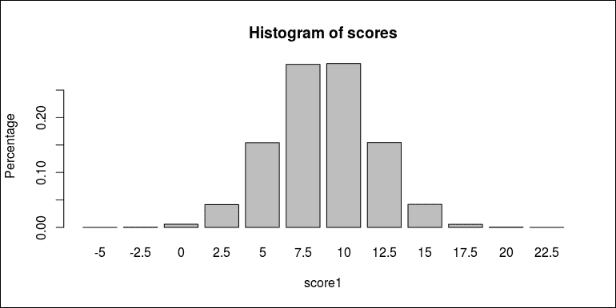

# 第十一章。与数据库一起工作

在上一章中，你学习了面向对象编程的基本概念。这包括类和方法，以及它们如何通过 R 中的泛型函数通过方法调度相互连接。你了解了 S3、S4、RC 和 R6 的基本用法，包括定义类和泛型函数以及为特定类实现方法。

现在我们已经涵盖了 R 的大部分重要特性，是时候继续讨论更多实际的话题了。在本章中，我们将从 R 如何用于与数据库一起工作开始讨论，这可能是许多数据分析项目的第一步：从数据库中提取数据。更具体地说，我们将涵盖以下主题：

+   理解关系型数据库

+   使用 SQL 查询关系型数据库，如 SQLite 和 MySQL

+   与 NoSQL 数据库一起工作，如 MongoDB 和 Redis

# 与关系型数据库一起工作

在之前的章节中，我们使用了一系列内置函数，如`read.csv`和`read.table`，从分隔符分隔的文件中导入数据，例如 csv 格式的文件。使用文本格式存储数据很方便且易于携带。然而，当数据文件很大时，这种存储方法可能不是最佳选择。

文本格式不再容易使用有三个主要原因。如下所述：

1.  `read.csv()`等函数主要用于将整个文件加载到内存中，即 R 中的数据框。如果数据太大而无法适应计算机内存，我们就无法完成它。

1.  即使数据集很大，我们在处理任务时通常也不需要将整个数据集加载到内存中。相反，我们通常需要提取满足一定条件的数据集子集。内置的数据导入函数根本不支持查询 csv 文件。

1.  数据集仍在更新中，也就是说，我们需要定期将记录插入数据集中。如果我们使用 csv 格式，插入数据可能会很痛苦，尤其是如果我们想在文件的中间插入记录并保持其顺序。

在这些场景中使用数据库是最佳解决方案。它使得存储可能超过计算机内存的数据变得容易得多。数据库中的数据可以根据用户提供的条件进行查询，这也使得更新现有记录和在数据库中插入新记录变得更加容易。

关系型数据库是一组表和表之间的关系。关系型数据库中的表与 R 中的数据框具有相同的表示。表可以具有关系，这使得连接多个表的信息变得更容易。

在本节中，我们将从最简单的数据库 SQLite（[`sqlite.org/`](http://sqlite.org/)）开始，它是一个便携式、轻量级的数据库引擎。

要在 R 中使用`RSQLite`包与 SQLite 数据库一起工作，请从 CRAN 安装它，运行以下代码：

```py
install.packages("RSQLite") 

```

## 创建 SQLite 数据库

首先，让我们看看如何创建一个 SQLite 数据库。如果我们想在 `data/example.sqlite` 创建一个示例数据库，我们需要确保目录可用。如果目录不存在，我们必须创建一个：

```py
if (!dir.exists("data")) dir.create("data") 

```

现在，`data/` 目录可用。接下来，我们将加载 `RSQLite` 包，并通过提供数据库驱动程序（`SQLite()`）和数据库文件（`data/example.sqlite`）来创建连接。尽管文件不存在，但驱动程序会创建一个空文件，这是一个空的 SQLite 数据库：

```py
library(RSQLite) 
## Loading required package: DBI 
con <- dbConnect(SQLite(), "data/example.sqlite") 

```

数据库连接 `con` 是用户和系统之间的一个层。我们可以通过它创建到关系数据库的连接，并通过它查询、检索或更新数据。连接将在所有后续操作中使用，直到我们关闭连接。在一个典型的关系数据库中，我们可以使用名称和某些名称和数据类型的列创建表，将记录作为行插入到表中，并更新现有记录。关系数据库中的表看起来非常类似于 R 中的数据框。

现在，我们将创建一个简单的数据框，该数据框将被插入到数据库中的表中：

```py
example1 <- data.frame( 
id = 1:5,  
type = c("A", "A", "B", "B", "C"), 
score = c(8, 9, 8, 10, 9),  
stringsAsFactors = FALSE) 
example1 
##   id type score 
## 1  1    A     8 
## 2  2    A     9 
## 3  3    B     8 
## 4  4    B    10 
## 5  5    C     9 

```

数据框已准备好，我们将调用 `dbWriteTable()` 将此数据框作为表写入数据库：

```py
dbWriteTable(con, "example1", example1) 
## [1] TRUE 

```

在前面的代码中，我们可能使用其他表名，但仍然存储相同的数据。最后，我们将使用 `dbDisconnect()` 断开数据库连接，这样 `con` 就不再可用于数据操作：

```py
dbDisconnect(con) 
## [1] TRUE 

```

### 将多个表格写入数据库

SQLite 数据库是一组表。因此，我们可以在一个数据库中存储多个表。

这次，我们将 `diamonds` 数据集放入 `ggplot2`，将 `flights` 数据集放入 `nycflights13`，作为一个数据库中的两个表。如果您还没有安装这两个包，请运行以下代码：

```py
install.packages(c("ggplot2", "nycflights13")) 

```

当包可用时，我们将调用 `data()` 来加载两个数据框：

```py
data("diamonds", package ="ggplot2") 
data("flights", package ="nycflights13") 

```

我们将重复之前所做的相同操作，但 `dbWriteTable()` 最终会出错：

```py
con <- dbConnect(SQLite(), "data/datasets.sqlite") 
dbWriteTable(con, "diamonds", diamonds, row.names = FALSE) 
## Error in (function (classes, fdef, mtable) : unable to find an inherited method for function 'dbWriteTable' for signature '"SQLiteConnection", "character", "tbl_df"' 
dbWriteTable(con, "flights", flights, row.names = FALSE) 
## Error in (function (classes, fdef, mtable) : unable to find an inherited method for function 'dbWriteTable' for signature '"SQLiteConnection", "character", "tbl_df"' 
dbDisconnect(con) 
## [1] TRUE 

```

查看这两个变量的类可能很有用：

```py
class(diamonds) 
## [1] "tbl_df"     "tbl"        "data.frame" 
class(flights) 
## [1] "tbl_df"     "tbl"        "data.frame" 

```

注意，`diamonds` 和 `flights` 并不仅仅是 `data.frame` 类，而是更复杂的东西。要将它们写入数据库，我们需要使用 `as.data.frame()` 将它们转换为普通的 `data.frame` 对象：

```py
con <- dbConnect(SQLite(), "data/datasets.sqlite") 
dbWriteTable(con, "diamonds", as.data.frame(diamonds), row.names = FALSE) 
## [1] TRUE 
dbWriteTable(con, "flights", as.data.frame(flights), row.names = FALSE) 
## [1] TRUE 
dbDisconnect(con) 
## [1] TRUE 

```

现在，数据库包含两个表。

### 将数据追加到表

如本节开头所述，将记录追加到数据库中的表相对简单。这里有一个简单的例子，我们生成几个数据块，并依次将它们追加到数据库表：

```py
con <- dbConnect(SQLite(), "data/example2.sqlite") 
chunk_size <- 10 
id <- 0 
for (i in 1:6) { 
  chunk <- data.frame(id = ((i - 1L) * chunk_size):(i * chunk_size -1L),  
    type = LETTERS[[i]], 
    score =rbinom(chunk_size, 10, (10 - i) /10), 
    stringsAsFactors =FALSE) 
  dbWriteTable(con, "products", chunk,  
    append = i > 1, row.names = FALSE) 
} 
dbDisconnect(con) 
## [1] TRUE 

```

注意，每个块都是一个数据框，包含一些确定的数据和一些随机数。每次，我们将这些记录追加到名为 `products` 的表中。与之前的示例不同的是，当我们调用 `dbWriteTable()` 时，我们为第一个块使用 `append = FALSE` 来在数据库中创建该表，并为每个后续块使用 `append = TRUE` 来追加到现有表中。

## 访问表和表字段

一旦我们有了 SQLite 数据库，我们不仅可以访问存储在表中的数据，还可以访问一些元数据，例如所有表的名称和表的列。

为了演示，我们将连接到之前创建的 SQLite 数据库：

```py
con <- dbConnect(SQLite(), "data/datasets.sqlite") 

```

我们可以使用`dbExistsTable()`来检测数据库中是否存在表：

```py
dbExistsTable(con, "diamonds") 
## [1] TRUE 
dbExistsTable(con, "mtcars") 
## [1] FALSE 

```

由于我们之前只在`datasets.sqlite`中写入了`diamonds`和`flights`，所以`dbExistsTable()`返回正确的值。与检测表存在性相反，我们可以使用`dbListTables()`来列出数据库中所有现有的表：

```py
dbListTables(con) 
## [1] "diamonds" "flights" 

```

对于某个表，我们也可以使用`dbListFields()`列出所有列（或字段）的名称：

```py
dbListFields(con, "diamonds") 
##  [1] "carat"   "cut"     "color"   "clarity" "depth"   
##  [6] "table"   "price"   "x"       "y"       "z" 

```

与`dbWriteTable()`相反，`dbReadTable()`将整个表读入一个数据框：

```py
db_diamonds <- dbReadTable(con, "diamonds") 
dbDisconnect(con) 
## [1] TRUE 

```

我们可以将我们从数据库中读取的数据框（`db_diamonds`）与原始版本（`diamonds`）进行比较：

```py
head(db_diamonds, 3) 
##   carat     cut color clarity depth table price    x    y 
## 1  0.23   Ideal     E     SI2  61.5    55   326 3.95 3.98 
## 2  0.21 Premium     E     SI1  59.8    61   326 3.89 3.84 
## 3  0.23    Good     E     VS1  56.9    65   327 4.05 4.07 
##      z 
## 1 2.43 
## 2 2.31 
## 3 2.31 
head(diamonds, 3) 
##   carat     cut color clarity depth table price    x    y 
## 1  0.23   Ideal     E     SI2  61.5    55   326 3.95 3.98 
## 2  0.21 Premium     E     SI1  59.8    61   326 3.89 3.84 
## 3  0.23    Good     E     VS1  56.9    65   327 4.05 4.07 
##      z 
## 1 2.43 
## 2 2.31 
## 3 2.31 

```

两个数据框中的数据看起来完全相同。然而，如果我们使用`identical()`来比较它们，它们实际上并不相同：

```py
identical(diamonds, db_diamonds) 
## [1] FALSE 

```

为了找出差异，我们可以调用`str()`来揭示两个数据框的结构。首先，这是数据库中数据框的结构：

```py
str(db_diamonds) 
## 'data.frame':    53940 obs. of  10 variables: 
##  $ carat  : num  0.23 0.21 0.23 0.29 0.31 0.24 0.24... 
##  $ cut    : chr  "Ideal" "Premium" "Good" "Premium" ... 
##  $ color  : chr  "E" "E" "E" "I" ... 
##  $ clarity: chr  "SI2" "SI1" "VS1" "VS2" ... 
##  $ depth  : num  61.5 59.8 56.9 62.4 63.3 62.8 62.3... 
##  $ table  : num  55 61 65 58 58 57 57 55 61 61 ... 
##  $ price  : int  326 326 327 334 335 336 336 337 337 ... 
##  $ x      : num  3.95 3.89 4.05 4.2 4.34 3.94 3.95... 
##  $ y      : num  3.98 3.84 4.07 4.23 4.35 3.96 3.98... 
##  $ z      : num  2.43 2.31 2.31 2.63 2.75 2.48 2.47... 

```

然后，这是原始版本的结构：

```py
str(diamonds) 
## Classes 'tbl_df', 'tbl' and 'data.frame':    53940 obs. of  10 variables: 
##  $ carat  : num  0.23 0.21 0.23 0.29 0.31 0.24 0.24... 
##  $ cut    : Ord.factor w/ 5 levels "Fair"<"Good"<..: 5 4 2 4 2 3 3 3 1 3 ... 
##  $ color  : Ord.factor w/ 7 levels "D"<"E"<"F"<"G"<..: 2 2 2 6 7 7 6 5 2 5 ... 
##  $ clarity: Ord.factor w/ 8 levels "I1"<"SI2"<"SI1"<..: 2 3 5 4 2 6 7 3 4 5 ... 
##  $ depth  : num  61.5 59.8 56.9 62.4 63.3 62.8 62.3 61.9 65.1 59.4 ... 
##  $ table  : num  55 61 65 58 58 57 57 55 61 61 ... 
##  $ price  : int  326 326 327 334 335 336 336 337 337... 
##  $ x      : num  3.95 3.89 4.05 4.2 4.34 3.94 3.95... 
##  $ y      : num  3.98 3.84 4.07 4.23 4.35 3.96 3.98... 
##  $ z      : num  2.43 2.31 2.31 2.63 2.75 2.48 2.47... 

```

现在，差异很明显。在原始版本中，`cut`、`color`和`clarity`是有序因子变量，本质上是有一些元数据的整数（有序级别）。相比之下，在数据库版本中，这些列以文本形式存储。这种变化仅仅是因为 SQLite 没有内置对有序因子的支持。因此，除了常见的数据类型（数字、文本、逻辑等）之外，R 特定的类型将在数据框插入之前转换为 SQLite 支持的类型。

## 学习 SQL 以查询关系型数据库

在上一节中，你学习了如何将数据写入 SQLite 数据库。在本节中，你将学习如何查询此类数据库，以便我们可以根据我们的需求从中获取数据。以下示例我们将使用`data/datasets.sqlite`（我们之前创建的）。

首先，我们需要与数据库建立连接：

```py
con <- dbConnect(SQLite(), "data/datasets.sqlite") 
dbListTables(con) 
## [1] "diamonds" "flights" 

```

数据库中有两个表。然后，我们可以使用`select`语句从`diamonds`中选择所有数据。在这里，我们想要选择所有列（或字段）。因此，我们将使用数据库连接`con`和查询字符串调用`dbGetQuery()`：

```py
db_diamonds <- dbGetQuery(con,  
"select * from diamonds") 
head(db_diamonds, 3) 
##   carat     cut color clarity depth table price    x    y 
## 1  0.23   Ideal     E     SI2  61.5    55   326 3.95 3.98 
## 2  0.21 Premium     E     SI1  59.8    61   326 3.89 3.84 
## 3  0.23    Good     E     VS1  56.9    65   327 4.05 4.07 
##      z 
## 1 2.43 
## 2 2.31 
## 3 2.31 

```

注意，`*`表示所有字段（或等价地，列）。如果我们只需要字段的子集，我们可以依次命名字段：

```py
db_diamonds <-dbGetQuery(con,  
"select carat, cut, color, clarity, depth, price  
  from diamonds") 
head(db_diamonds, 3) 
##   carat     cut color clarity depth price 
## 1  0.23   Ideal     E     SI2  61.5   326 
## 2  0.21 Premium     E     SI1  59.8   326 
## 3  0.23    Good     E     VS1  56.9   327 

```

如果我们想要选择数据中出现的所有不同情况，我们可以使用`select distinct`。例如，以下代码返回`diamonds`中`cut`的所有不同值：

```py
dbGetQuery(con, "select distinct cut from diamonds") 
##         cut 
## 1     Ideal 
## 2   Premium 
## 3      Good 
## 4 Very Good 
## 5      Fair 

```

注意，`dbGetQuery()`始终返回`data.frame`，即使有时只有一个列。要检索作为原子向量的值，只需从数据框中提取第一列：

```py
dbGetQuery(con, "select distinct clarity from diamonds")[[1]] 
## [1] "SI2"  "SI1"  "VS1"  "VS2"  "VVS2" "VVS1" "I1"   "IF" 

```

当我们使用 `select` 来选择查询的列时，有时列名可能不是我们想要的。在这种情况下，我们可以使用 `A as B` 来获取与 `A` 相同数据的列 `B`：

```py
db_diamonds <- dbGetQuery(con,  
"select carat, price, clarity as clarity_level from diamonds") 
head(db_diamonds, 3) 
##   carat price clarity_level 
## 1  0.23   326           SI2 
## 2  0.21   326           SI1 
## 3  0.23   327           VS1 

```

在某些其他情况下，我们想要的值不在数据库中，但需要一些计算来确定。现在，我们将使用 `A as B`，其中 `A` 可以是现有列之间的算术计算：

```py
db_diamonds <- dbGetQuery(con, 
"select carat, price, x * y * z as size from diamonds") 
head(db_diamonds, 3) 
##   carat  price     size 
## 1  0.23   326  38.20203 
## 2  0.21   326  34.50586 
## 3  0.23   327  38.07688 

```

如果我们创建一个新列，该列由现有列组成，然后再创建一个新列，该列由新列组成，就像以下示例一样？

```py
db_diamonds <- dbGetQuery(con, 
"select carat, price, x * y * z as size, 
  price / size as value_density 
  from diamonds") 
## Error in sqliteSendQuery(con, statement, bind.data): error in statement: no such column: size 

```

我们根本无法做到这一点。在 `A as B` 中，`A` 必须由现有列组成。然而，如果我们坚持这样做，我们可以使用嵌套查询，即从嵌套 `select` 生成的临时表中 `select` 列：

```py
db_diamonds <- dbGetQuery(con, 
"select *, price / size as value_density from 
  (select carat, price, x * y * z as size from diamonds)") 
head(db_diamonds, 3) 
##   carat  price    size   value_density 
## 1  0.23   326  38.20203      8.533578 
## 2  0.21   326  34.50586      9.447672 
## 3  0.23   327  38.07688      8.587887 

```

在这种情况下，`size` 是在计算 `price / size` 时在临时表中定义的。

数据库查询的下一个重要组成部分是条件。我们可以使用 `where` 来指定结果必须满足的条件。例如，我们可以选择 `Good` 切工的钻石：

```py
good_diamonds <- dbGetQuery(con,  
"select carat, cut, price from diamonds where cut = 'Good'") 
head(good_diamonds, 3) 
##   carat  cut price 
## 1  0.23 Good   327 
## 2  0.31 Good   335 
## 3  0.30 Good   339 

```

注意，具有良好切工的记录只占所有记录的一小部分：

```py
nrow(good_diamonds) /nrow(diamonds) 
## [1] 0.09095291 

```

如果我们有多个必须同时满足的条件，我们可以使用 `and` 来组合这些条件。例如，我们将选择所有 `Good` 切工和颜色为 `E` 的记录：

```py
good_e_diamonds <- dbGetQuery(con,  
"select carat, cut, color, price from diamonds  
  where cut = 'Good' and color = 'E'") 
head(good_e_diamonds, 3) 
##   carat  cut color price 
## 1  0.23 Good     E   327 
## 2  0.23 Good     E   402 
## 3  0.26 Good     E   554 
nrow(good_e_diamonds) /nrow(diamonds) 
## [1] 0.017297 

```

类似的逻辑运算还包括 `or` 和 `not`。

除了简单的逻辑运算外，我们还可以使用 `in` 通过检查字段的值是否包含在给定的集合中来过滤记录。例如，我们可以选择颜色为 `E` 和 `F` 的记录：

```py
color_ef_diamonds <- dbGetQuery(con, 
"select carat, cut, color, price from diamonds 
  where color in ('E','F')") 
nrow(color_ef_diamonds) 
## [1] 19339 

```

我们可以通过以下表格验证结果：

```py
table(diamonds$color) 
##  
##     D     E     F     G     H     I     J  
##  6775  9797  9542 11292  8304  5422  2808 

```

要使用 `in`，我们需要指定一个集合。类似于 `in`，我们还可以使用 `between and`，它允许我们指定一个范围：

```py
some_price_diamonds <- dbGetQuery(con, 
"select carat, cut, color, price from diamonds 
  where price between 5000 and 5500") 
nrow(some_price_diamonds) /nrow(diamonds) 
## [1] 0.03285132 

```

实际上，范围不必是数字。只要字段的数据类型是可比较的，我们就可以指定一个范围。对于字符串列，我们可以写 `between 'string1' to 'string2'` 来通过词序过滤记录。

另一个对字符串列有用的运算符是 `like`，它使我们能够通过简单的字符串模式过滤记录。例如，我们可以选择所有 `cut` 变量以 `Good` 结尾的记录。它可以是 `Good` 或 `Very Good`。表示法是 `like '%Good'`，其中 `%` 匹配所有字符串：

```py
good_cut_diamonds <- dbGetQuery(con,  
"select carat, cut, color, price from diamonds 
  where cut like '%Good'") 
nrow(good_cut_diamonds) /nrow(diamonds) 
## [1] 0.3149425 

```

数据库查询的另一个主要功能是使用指定列对数据进行排序。我们可以使用 `order by` 来做这件事。例如，我们可以按 `price` 的升序获取所有记录的 `carat` 和 `price`：

```py
cheapest_diamonds <- dbGetQuery(con, 
"select carat, price from diamonds 
  order by price") 

```

因此，我们有一个按从最便宜到最贵的顺序排列的钻石数据帧：

```py
head(cheapest_diamonds) 
##   carat price 
## 1  0.23   326 
## 2  0.21   326 
## 3  0.23   327 
## 4  0.29   334 
## 5  0.31   335 
## 6  0.24   336 

```

我们可以通过在排序列中添加 `desc` 来做相反的操作，这样我们得到的数据帧就是按相反的顺序排序的：

```py
most_expensive_diamonds <- dbGetQuery(con, 
"select carat, price from diamonds 
  order by price desc") 
head(most_expensive_diamonds) 
##   carat price 
## 1  2.29 18823 
## 2  2.00 18818 
## 3  1.51 18806 
## 4  2.07 18804 
## 5  2.00 18803 
## 6  2.29 18797 

```

我们也可以按多个列对记录进行排序。例如，以下结果首先按价格升序排序。如果两个记录的价格相同，则具有更大 `carat` 的记录将被放在前面：

```py
cheapest_diamonds <- dbGetQuery(con,  
"select carat, price from diamonds 
  order by price, carat desc") 
head(cheapest_diamonds) 
##   carat price 
## 1  0.23   326 
## 2  0.21   326 
## 3  0.23   327 
## 4  0.29   334 
## 5  0.31   335 
## 6  0.24   336 

```

与`select`类似，排序的列可以由现有列计算得出：

```py
dense_diamonds <- dbGetQuery(con, 
"select carat, price, x * y * z as size from diamonds 
  order by carat / size desc") 
head(dense_diamonds) 
##   carat  price     size 
## 1  1.07  5909  47.24628 
## 2  1.41  9752  74.41726 
## 3  1.53  8971  85.25925 
## 4  1.51  7188 133.10400 
## 5  1.22  3156 108.24890 
## 6  1.12  6115 100.97448 

```

我们还可以同时使用`where`和`order by`查询所有记录的排序子集：

```py
head(dbGetQuery(con,  
"select carat, price from diamonds 
   where cut = 'Ideal' and clarity = 'IF' and color = 'J' 
   order by price")) 
##   carat price 
## 1  0.30   489 
## 2  0.30   489 
## 3  0.32   521 
## 4  0.32   533 
## 5  0.32   533 
## 6  0.35   569 

```

如果我们只关心前几个结果，我们可以使用`limit`来限制要检索的记录数：

```py
dbGetQuery(con,  
"select carat, price from diamonds 
  order by carat desc limit 3") 
##   carat price 
## 1  5.01 18018 
## 2  4.50 18531 
## 3  4.13 17329 

```

除了列选择、条件过滤和排序之外，我们还可以在数据库中以组的形式聚合记录。例如，我们可以计算每种颜色的记录数量：

```py
dbGetQuery(con, 
"select color, count(*) as number from diamonds 
  group by color") 
##   color number 
## 1     D   6775 
## 2     E   9797 
## 3     F   9542 
## 4     G  11292 
## 5     H   8304 
## 6     I   5422 
## 7     J   2808 

```

可以通过调用`table()`与原始数据一起验证结果：

```py
table(diamonds$color) 
##  
##     D     E     F     G     H     I     J  
##  6775  9797  9542 11292  8304  5422  2808 

```

除了计数之外，我们还有如`avg()`、`max()`、`min()`和`sum()`之类的聚合函数。例如，我们可以通过查看每个清晰度级别的平均价格来总结数据：

```py
dbGetQuery(con, 
"select clarity, avg(price) as avg_price  
   from diamonds 
   group by clarity  
   order by avg_price desc") 
##   clarity avg_price 
## 1     SI2  5063.029 
## 2     SI1  3996.001 
## 3     VS2  3924.989 
## 4      I1  3924.169 
## 5     VS1  3839.455 
## 6    VVS2  3283.737 
## 7      IF  2864.839 
## 8    VVS1  2523.115 

```

我们还可以检查五个最低价格的最大克拉数：

```py
dbGetQuery(con, 
"select price, max(carat) as max_carat  
   from diamonds 
   group by price 
   order by price 
   limit 5") 
##   price max_carat 
## 1   326      0.23 
## 2   327      0.23 
## 3   334      0.29 
## 4   335      0.31 
## 5   336      0.24 

```

我们还可以在组内执行多个计算。以下代码计算了每个清晰度级别的价格范围及其平均值：

```py
dbGetQuery(con, 
"select clarity,  
     min(price) as min_price,  
     max(price) as max_price, 
     avg(price) as avg_price 
   from diamonds 
   group by clarity  
   order by avg_price desc") 
##   clarity min_price max_price avg_price 
## 1     SI2       326     18804  5063.029 
## 2     SI1       326     18818  3996.001 
## 3     VS2       334     18823  3924.989 
## 4      I1       345     18531  3924.169 
## 5     VS1       327     18795  3839.455 
## 6    VVS2       336     18768  3283.737 
## 7      IF       369     18806  2864.839 
## 8    VVS1       336     18777  2523.115 

```

以下示例计算了每个清晰度级别的加权平均价格，即克拉数更大的价格具有更大的权重：

```py
dbGetQuery(con, 
"select clarity, 
     sum(price * carat) / sum(carat) as wprice 
   from diamonds 
   group by clarity  
   order by wprice desc") 
##   clarity   wprice 
## 1     SI2 7012.257 
## 2     VS2 6173.858 
## 3     VS1 6059.505 
## 4     SI1 5919.187 
## 5    VVS2 5470.156 
## 6      I1 5233.937 
## 7      IF 5124.584 
## 8    VVS1 4389.112 

```

就像按多个列排序一样，我们也可以按多个列对数据进行分组。以下代码计算了每个清晰度和颜色对的平均价格，并显示了平均价格最高的前五个对：

```py
dbGetQuery(con, 
"select clarity, color, 
     avg(price) as avg_price 
   from diamonds 
   group by clarity, color  
   order by avg_price desc  
   limit 5") 
##   clarity color avg_price 
## 1      IF     D  8307.370 
## 2     SI2     I  7002.649 
## 3     SI2     J  6520.958 
## 4     SI2     H  6099.895 
## 5     VS2     I  5690.506 

```

在关系数据库中最相关的操作应该是表连接，即通过某些列将多个表连接在一起。例如，我们将创建一个包含`cut`、`color`和`clarity`的数据帧，以选择与`diamond_selector`中三个案例完全相同的字段值的记录：

```py
diamond_selector <- data.frame( 
cut = c("Ideal", "Good", "Fair"), 
color = c("E", "I", "D"), 
clarity = c("VS1", "I1", "IF"), 
stringsAsFactors = FALSE 
) 
diamond_selector 
##     cut color clarity 
## 1 Ideal     E     VS1 
## 2  Good     I      I1 
## 3  Fair     D      IF 

```

创建数据帧后，我们将其写入数据库，以便我们可以将`diamonds`和`diamond_selector`连接起来以过滤所需的记录：

```py
dbWriteTable(con, "diamond_selector", diamond_selector,  
row.names = FALSE, overwrite = TRUE) 
## [1] TRUE 

```

我们可以在连接子句中指定要匹配的列：

```py
subset_diamonds <- dbGetQuery(con,  
"select cut, color, clarity, carat, price 
   from diamonds 
   join diamond_selector using (cut, color, clarity)") 
head(subset_diamonds) 
##     cut color clarity carat price 
## 1 Ideal     E     VS1  0.60  2774 
## 2 Ideal     E     VS1  0.26   556 
## 3 Ideal     E     VS1  0.70  2818 
## 4 Ideal     E     VS1  0.70  2837 
## 5  Good     I      I1  1.01  2844 
## 6 Ideal     E     VS1  0.26   556 

```

总体来说，我们只有所有记录中极小的一部分满足以下三种情况之一：

```py
nrow(subset_diamonds) /nrow(diamonds) 
## [1] 0.01121617 

```

最后，别忘了断开数据库连接，以确保所有资源都得到适当释放：

```py
dbDisconnect(con) 
## [1] TRUE 

```

在前面的示例中，我们只展示了使用 SQL 查询关系数据库（如 SQLite）的基本用法。实际上，SQL 比我们展示的更丰富、更强大。有关更多详细信息，请访问[`www.w3schools.com/sql`](http://www.w3schools.com/sql)并了解更多。

## 分块获取查询结果

在本节的开头，我们提到使用关系数据库的一个优点是我们可以存储大量数据。通常，我们只取出数据库的子集进行一些研究。然而，有时我们需要处理的数据量超出了计算机内存的容量。显然，我们不能将所有数据加载到内存中，而必须分块处理数据。

大多数合理的关联数据库都支持分块获取查询结果集。在下面的示例中，我们将使用 `dbSendQuery()` 而不是 `dbGetQuery()` 来获取结果集。然后，我们将重复从结果集中获取数据块（行数）直到所有结果都被获取。这样，我们可以分块处理数据，而不需要使用大量的工作内存：

```py
con <- dbConnect(SQLite(), "data/datasets.sqlite") 
res <- dbSendQuery(con,  
"select carat, cut, color, price from diamonds 
  where cut = 'Ideal' and color = 'E'") 
while (!dbHasCompleted(res)) { 
  chunk <- dbFetch(res, 800) 
cat(nrow(chunk), "records fetched\n") 
# do something with chunk 
} 
## 800 records fetched 
## 800 records fetched 
## 800 records fetched 
## 800 records fetched 
## 703 records fetched 
dbClearResult(res) 
## [1] TRUE 
dbDisconnect(con) 
## [1] TRUE 

```

在实践中，数据库可能有数十亿条记录。查询可能返回数千万条记录。如果你使用 `dbGetQuery()` 一次性获取整个结果集，你的内存可能不足。如果任务可以通过处理数据块来完成，那么分块处理会便宜得多。

## 使用事务保证一致性

流行的关系数据库具有强大的确保一致性的能力。当我们插入或更新数据时，我们通过事务来完成。如果事务失败，我们可以撤销事务并回滚数据库，以确保一切保持一致。

以下示例是对可能在过程中失败的数据累积过程的简单模拟。假设我们需要累积某些产品的数据并将其存储在 `data/products.sqlite` 中。每次产生数据块时，我们需要将其追加到数据库中的表中。然而，在每次迭代中，这个过程有 20%的概率会失败：

```py
set.seed(123) 
con <- dbConnect(SQLite(), "data/products.sqlite") 
chunk_size <- 10 
for (i in 1:6) { 
  cat("Processing chunk", i, "\n") 
  if (runif(1) <= 0.2) stop("Data error") 
  chunk <- data.frame(id = ((i - 1L) * chunk_size):(i * chunk_size - 1L),  
    type = LETTERS[[i]], 
    score = rbinom(chunk_size, 10, (10 - i) /10), 
    stringsAsFactors = FALSE) 
  dbWriteTable(con, "products", chunk,  
    append = i > 1, row.names = FALSE) 
} 
## Processing chunk 1  
## Processing chunk 2  
## Processing chunk 3  
## Processing chunk 4  
## Processing chunk 5 
## Error in eval(expr, envir, enclos): Data error 

```

在处理第 5 个数据块时，累积失败。然后，我们将计算表中的记录数：

```py
dbGetQuery(con, "select COUNT(*) from products") 
##   COUNT(*) 
## 1      40 
dbDisconnect(con) 
## [1] TRUE 

```

我们可以发现表中存储了许多记录。在某些情况下，我们希望所有记录都得到适当的存储，或者我们希望什么也不放入数据库。在这两种情况下，数据库都是一致的。然而，如果只有一半的数据被存储，可能会出现其他问题。为了确保一系列数据库更改成功或失败作为一个整体，我们可以在写入任何数据之前调用 `dbBegin()`，在所有更改完成后调用 `dbCommit()`，如果出现问题，则调用 `dbRollback()`：

以下代码是前一个示例的增强版本。我们使用事务来确保所有数据块要么都写入数据库，要么一个都不写。更具体地说，我们将数据写入过程放在 `tryCatch` 中。在写入开始之前，我们通过调用 `dbBegin()` 开始一个事务。然后，在 `tryCatch` 中，我们将数据块逐个写入数据库。如果一切顺利，我们将调用 `dbCommit()` 提交事务，以便所有更改都得到提交。如果出现问题，错误将被错误函数捕获，我们产生一个警告并通过 `dbRollback()` 回滚：

```py
set.seed(123) 
file.remove("data/products.sqlite") 
## [1] TRUE 
con <- dbConnect(SQLite(), "data/products.sqlite") 
chunk_size <- 10 
dbBegin(con) 
## [1] TRUE 
res <- tryCatch({ 
  for (i in 1:6) { 
cat("Processing chunk", i, "\n") 
    if (runif(1) <= 0.2) stop("Data error") 
    chunk <- data.frame(id = ((i - 1L) * chunk_size):(i * chunk_size - 1L),  
type = LETTERS[[i]], 
score = rbinom(chunk_size, 10, (10 - i) /10), 
stringsAsFactors = FALSE) 
dbWriteTable(con, "products", chunk,  
append = i > 1, row.names = FALSE) 
  } 
dbCommit(con) 
}, error = function(e) { 
warning("An error occurs: ", e, "\nRolling back", immediate. = TRUE) 
dbRollback(con) 
}) 
## Processing chunk 1  
## Processing chunk 2  
## Processing chunk 3  
## Processing chunk 4  
## Processing chunk 5 
## Warning in value[[3L]](cond): An error occurs: Error in doTryCatch(return(expr), name, parentenv, handler): Data error 
##  
## Rolling back 

```

我们可以看到同样的错误再次发生。然而，这次，错误被捕获，事务被取消，数据库回滚。为了验证，我们再次计算 `products` 表中的记录数：

```py
dbGetQuery(con, "select COUNT(*) from products") 
## Error in sqliteSendQuery(con, statement, bind.data): error in statement: no such table: products 
dbDisconnect(con) 
## [1] TRUE 

```

可能会令人惊讶的是，计数查询会导致错误。为什么它不返回 0？如果我们仔细观察示例，我们应该理解，当我们第一次调用 `dbWriteTable()` 时，它首先创建一个新表，然后插入第一块数据。换句话说，表创建包含在事务中。因此，当我们回滚时，表创建也会被撤销。结果，先前的计数查询产生错误，因为 `products` 实际上并不存在。如果我们开始事务之前表已经存在，计数应该等于事务之前的记录数，就像什么都没发生一样。

另一个需要强一致性的例子是账户转账。当我们从一个账户向另一个账户转账一定金额时，我们需要确保系统从第一个账户中扣除相应金额，并将相同金额存入第二个账户。这两个变更必须同时发生或同时失败以保持一致性。这可以通过关系型数据库的事务轻松实现。

假设我们定义一个函数来创建一个虚拟银行的 SQLite 数据库。我们将使用 `dbSendQuery()` 发送命令来创建账户表和事务表：

```py
create_bank <- function(dbfile) { 
  if (file.exists(dbfile)) file.remove(dbfile) 
  con <- dbConnect(SQLite(), dbfile) 
  dbSendQuery(con,  
    "create table accounts  
    (name text primary key, balance real)") 
  dbSendQuery(con, 
    "create table transactions  
    (time text, account_from text, account_to text, value real)") 
  con 
} 

```

账户表有两个列：`name` 和 `balance`。事务表有四个列：`time`、`account_from`、`account_to` 和 `value`。第一个表存储所有账户信息，第二个表存储所有历史交易。

我们还将定义一个函数，用于创建一个具有名称和初始余额的账户。该函数使用 `insert into` 语句将一条新记录写入账户表：

```py
create_account <- function(con, name, balance) { 
  dbSendQuery(con,  
    sprintf("insert into accounts (name, balance) values ('%s', %.2f)", name, balance)) 
  TRUE 
} 

```

注意，我们使用 `sprintf` 生成前面的 SQL 语句。它适用于本地和个人使用，但通常不适用于网络应用程序，因为黑客可以轻松地编写部分表达式来运行任何灾难性的语句来操纵整个数据库。

接下来，我们将定义一个转账函数。该函数检查提款账户和收款账户是否都存在于数据库中。它确保提款账户的余额足以进行此类转账。如果转账有效，则更新两个账户的余额，并将一条事务记录添加到数据库中：

```py
transfer <- function(con, from, to, value) { 
  get_account <- function(name) { 
    account <- dbGetQuery(con,  
      sprintf("select * from accounts  
              where name = '%s'", name)) 
    if (nrow(account) == 0)  
      stop(sprintf("Account '%s' does not exist", name)) 
    account 
  } 
  account_from <- get_account(from) 
  account_to <- get_account(to) 
  if (account_from$balance < value) { 
    stop(sprintf("Insufficient money to transfer from '%s'", 
                 from)) 
  } else { 
    dbSendQuery(con,  
      sprintf("update accounts set balance = %.2f  
              where name = '%s'", 
        account_from$balance - value, from)) 
dbSendQuery(con, 
sprintf("update accounts set balance = %.2f  
where name = '%s'", 
        account_to$balance + value, to)) 
      dbSendQuery(con, 
        sprintf("insert into transactions (time, account_from,  
                account_to, value) values 
        ('%s', '%s', '%s', %.2f)",  
        format(Sys.time(), "%Y-%m-%d %H:%M:%S"), 
        from, to, value)) 
  } 
TRUE 
} 

```

虽然我们对提款账户可能的资金不足进行了一些基本检查，但我们仍然不能确保转账的安全性，因为它可能被其他原因中断。因此，我们将实现一个安全的 `transfer` 版本，其中我们将使用事务来确保如果发生任何错误，`transfer` 所做的任何更改都可以撤销：

```py
safe_transfer <- function(con, ...) { 
  dbBegin(con) 
  tryCatch({ 
    transfer(con, ...) 
    dbCommit(con) 
  }, error = function(e) { 
    message("An error occurs in the transaction. Rollback...") 
    dbRollback(con) 
    stop(e) 
  }) 
} 

```

实际上，`safe_transfer` 是 `transfer` 的包装函数。它只是将 `transfer` 放入 `tryCatch` 的沙盒中。如果发生错误，我们调用 `dbRollback()` 来确保数据库的一致性。

在将函数放入测试之前，我们需要函数来查看给定账户的余额以及账户之间发生的所有成功交易：

```py
get_balance <- function(con, name) { 
  res <- dbGetQuery(con,  
    sprintf("select balance from accounts  
            where name = '%s'", name)) 
  res$balance 
} 
get_transactions <- function(con, from, to) { 
  dbGetQuery(con, 
    sprintf("select * from transactions  
      where account_from = '%s' and account_to = '%s'",  
      from, to)) 
} 

```

现在，我们可以进行一些测试。首先，我们将使用 `create_bank()` 创建一个虚拟银行，该函数返回数据库文件的 SQLite 连接。然后，我们将创建两个账户并设置一些初始余额：

```py
con <- create_bank("data/bank.sqlite") 
create_account(con, "David", 5000) 
## [1] TRUE 
create_account(con, "Jenny", 6500) 
## [1] TRUE 
get_balance(con, "David") 
## [1] 5000 
get_balance(con, "Jenny") 
## [1] 6500 

```

然后，我们将使用 `safe_transfer()` 将一些钱从大卫的账户转到珍妮的账户：

```py
safe_transfer(con, "David", "Jenny", 1500) 
## [1] TRUE 
get_balance(con, "David") 
## [1] 3500 
get_balance(con, "Jenny") 
## [1] 8000 

```

转账成功，两个账户的余额以一致的方式改变。现在，我们将进行另一笔转账。这次，大卫的账户余额不足，所以转账将以错误结束：

```py
safe_transfer(con, "David", "Jenny", 6500) 
## An error occurs in the transaction. Rollback... 
## Error in transfer(con, ...): Insufficient money to transfer from 'David' 
get_balance(con, "David") 
## [1] 3500 
get_balance(con, "Jenny") 
## [1] 8000 

```

错误被捕获，函数回滚数据库。两个账户的余额都没有变化。现在，我们将查询所有成功的交易：

```py
get_transactions(con, "David", "Jenny") 
##                  time   account_from  account_to value 
## 1 2016-06-08 23:24:39        David      Jenny  1500 

```

我们可以看到第一笔交易，但失败的交易没有出现在数据库中。最后，我们应始终记得关闭数据库连接：

```py
dbDisconnect(con) 
## [1] TRUE 

```

## 将数据存储在文件到数据库中

当我们处理大型数据文件时，我们可能会遇到读写数据的问题。在实践中，有两种极端情况。一种极端是极其庞大的文本格式数据源，几乎不可能将其加载到内存中。另一种是大量的小数据文件，需要一些努力将它们整合到一个数据框中。

对于第一种情况，我们可以分块读取大源数据，并将每个块追加到数据库中的一个特定表中。以下函数是为从大源文件向数据库表追加行而设计的，给定输入文件、输出数据库、表名和块大小。考虑到输入数据可能太大而无法加载到内存中，所以该函数将每次读取一个块以写入数据库，因此只需要很少的工作内存：

```py
chunk_rw <- function(input, output, table, chunk_size = 10000) { 
  first_row <- read.csv(input, nrows = 1, header = TRUE) 
  header <- colnames(first_row) 
  n <- 0 
  con <- dbConnect(SQLite(), output) 
on.exit(dbDisconnect(con)) 
  while (TRUE) { 
    df <- read.csv(input,  
skip = 1 + n * chunk_size, nrows = chunk_size,  
header = FALSE, col.names = header, 
stringsAsFactors = FALSE) 
    if (nrow(df) == 0) break; 
dbWriteTable(con, table, df, row.names = FALSE, append = n > 0) 
    n <- n + 1 
cat(sprintf("%d records written\n", nrow(df))) 
  } 
} 

```

这里的技巧是正确计算输入文件中每个块的位置偏移量。

为了测试函数，我们首先将 `diamonds` 写入一个 csv 文件，并使用 `chunk_rw()` 将 csv 文件分块写入 SQLite 数据库。使用这种方法，写入过程只需要比将整个数据加载到内存中所需的内存小得多：

```py
write.csv(diamonds, "data/diamonds.csv", quote = FALSE, row.names = FALSE) 
chunk_rw("data/diamonds.csv", "data/diamonds.sqlite", "diamonds") 
## 10000 records written 
## 10000 records written 
## 10000 records written 
## 10000 records written 
## 10000 records written 
## 3940 records written 

```

加载数据的另一种极端情况是我们需要从许多小数据文件中读取。在这种情况下，我们可以将这些文件中分布的所有数据放入数据库中，这样我们就可以轻松地查询数据。以下函数旨在将文件夹中所有 csv 文件的数据放入一个数据库中：

```py
batch_rw <- function(dir, output, table, overwrite = TRUE) { 
  files <- list.files(dir, "\\.csv$", full.names = TRUE) 
  con <- dbConnect(SQLite(), output) 
on.exit(dbDisconnect(con)) 
  exist <- dbExistsTable(con, table) 
  if (exist) { 
    if (overwrite) dbRemoveTable(con, table) 
    else stop(sprintf("Table '%s' already exists", table)) 
  } 
  exist <- FALSE 
  for (file in files) { 
cat(file, "... ") 
    df <- read.csv(file, header = TRUE,  
stringsAsFactors = FALSE) 
dbWriteTable(con, table, df, row.names = FALSE,  
append = exist) 
    exist <- TRUE 
cat("done\n") 
  } 
} 

```

为了演示，我们在 `data/groups` 中有一些小的 csv 文件，并使用 `batch_rw()` 将所有数据放入数据库中：

```py
batch_rw("data/groups", "data/groups.sqlite", "groups") 
## data/groups/group1.csv ... done 
## data/groups/group2.csv ... done 
## data/groups/group3.csv ... done 

```

现在，所有文件中的数据都已放入数据库中。我们可以查询或读取整个表，看看它看起来像什么：

```py
con <- dbConnect(SQLite(), "data/groups.sqlite") 
dbReadTable(con, "groups") 
##    group   id   grade 
## 1     1   I-1     A 
## 2     1   I-2     B 
## 3     1   I-3     A 
## 4     2  II-1     C 
## 5     2  II-2     C 
## 6     3 III-1     B 
## 7     3 III-2     B 
## 8     3 III-3     A 
## 9     3 III-4     C 
dbDisconnect(con) 
## [1] TRUE 

```

在本节中，你了解了一些 SQLite 数据库的基本知识和用法。然而，许多流行的关系型数据库在功能和查询语言方面有许多共同特征。几乎相同的知识，你可以通过 RMySQL 使用 MySQL，通过 RPostges 使用 PostgreSQL，通过 RSQLServer 使用 Microsoft SQL Server，以及通过 RODBC 使用 ODBC 兼容的数据库（Microsoft Access 和 Excel）。它们具有几乎相同的操作功能，所以如果你熟悉其中一个，你就不应该有在使用其他数据库时的问题。

# 与 NoSQL 数据库一起工作

在本章的前一节中，你学习了关系型数据库的基础知识以及如何使用 SQL 查询数据。关系型数据通常以表格形式组织，即作为具有关系的表集合。

然而，当数据量超过服务器的容量时，由于传统的关系型数据库模型不容易支持水平扩展，即不是存储在单个服务器上而是在服务器集群中存储数据，因此会出现问题。这增加了数据库管理的复杂性，因为数据以分布式形式存储，同时仍然作为一个逻辑数据库访问。

近年来，由于新数据库模型的引入以及它们在大数据分析实时应用中展现的卓越性能，NoSQL 或非关系型数据库比以前更加流行。一些非关系型数据库旨在实现高可用性、可扩展性和灵活性，而另一些则旨在实现高性能。

关系型数据库和非关系型数据库在存储模型上的差异非常明显。例如，对于一个购物网站，商品和评论可以存储在关系型数据库的两个表中：商品和评论。所有商品信息存储在一个表中，每个商品的评论存储在另一个表中。以下代码显示了此类表的基本结构：

```py
products: 
code,name,type,price,amount 
A0000001,Product-A,Type-I,29.5,500 

```

每条评论都有一个字段指向它所针对的产品：

```py
comments: 
code,user,score,text 
A0000001,david,8,"This is a good product" 
A0000001,jenny,5,"Just so so" 

```

当一个产品有许多相关表且记录数量如此之大以至于数据库必须分布到大量服务器上时，查询这样的数据库会非常困难，因为执行一个简单的查询可能非常低效。如果我们使用 MongoDB 来存储这样的数据，每个商品都将作为一个文档存储，而这个商品的评论都作为文档的字段存储在一个数组中。因此，查询数据将变得非常容易，数据库可以轻松地分布到大量服务器上。

## 与 MongoDB 一起工作

MongoDB 是一个流行的非关系型数据库，它提供了一种面向文档的数据存储方式。每个产品都是一个集合中的文档。产品有一些描述性信息的字段，还有一个包含评论的数组字段。所有评论都是子文档，这样每个逻辑项都可以以它们自己的逻辑形式存储。

这里是集合中一个商品的 JSON ([`en.wikipedia.org/wiki/JSON`](https://en.wikipedia.org/wiki/JSON)) 表示：

```py
{ 
  "code":"A0000001", 
  "name":"Product-A", 
  "type":"Type-I", 
  "price":29.5, 
  "amount":500, 
  "comments":[ 
    { 
      "user":"david", 
      "score":8, 
      "text":"This is a good product" 
    }, 
    { 
      "user":"jenny", 
      "score":5, 
      "text":"Just so so" 
    } 
  ] 
} 

```

关系型数据库可能包含许多模式。每个模式（或数据库）可能包含许多表。每个表可能包含许多记录。同样，MongoDB 实例可以托管许多数据库。每个数据库可以包含许多集合。每个集合可能包含许多文档。主要区别在于关系型数据库表中的记录需要具有相同的结构，但 MongoDB 数据库集合中的文档是无模式的，并且足够灵活，可以具有嵌套结构。

在前面的 JSON 代码中，例如，一个商品由以下文档表示，其中 `code`、`name`、`type`、`price` 和 `amount` 是具有简单数据类型的数据字段，而 `comments` 是对象的数组。每个评论由 `comments` 中的一个对象表示，并具有 `user`、`score` 和 `text` 的结构。一个商品的所有评论都存储在 `comments` 中的一个对象中。因此，在产品信息和评论方面，一个商品高度自包含。如果我们需要产品的信息，我们不再需要连接两个表，只需挑选几个字段即可。

要安装 MongoDB，请访问 [`docs.mongodb.com/manual/installation/`](https://docs.mongodb.com/manual/installation/) 并按照说明操作。它支持几乎所有主要平台。

### 从 MongoDB 查询数据

假设我们有一个在本地机器上运行的正常 MongoDB 实例。我们可以使用 `mongolite` 包来与 MongoDB 一起工作。要安装该包，请运行以下代码：

```py
install.packages("mongolite") 

```

一旦安装了包，我们就可以通过指定集合、数据库和 MongoDB 地址来创建 Mongo 连接：

```py
library(mongolite) 
m <- mongo("students", "test", "mongodb://localhost") 

```

首先，我们将创建到本地 MongoDB 实例的连接。最初，`products` 集合没有文档：

```py
m$count() 
## [1] 0 

```

要插入带有注释的产品，我们可以直接将 JSON 文档作为字符串传递给 `m$insert()`：

```py
m$insert(' 
{ 
  "code": "A0000001", 
  "name": "Product-A", 
  "type": "Type-I", 
  "price": 29.5, 
  "amount": 500, 
  "comments": [ 
    { 
      "user": "david", 
      "score": 8, 
      "text": "This is a good product" 
    }, 
    { 
      "user": "jenny", 
      "score": 5, 
      "text": "Just so so" 
    } 
  ] 
}') 

```

现在，集合中有一个文档：

```py
m$count() 
## [1] 1 

```

或者，我们可以使用 R 中的列表对象来表示相同的结构。以下代码使用 `list` 插入第二个产品：

```py
m$insert(list( 
  code = "A0000002", 
  name = "Product-B", 
  type = "Type-II", 
  price = 59.9, 
  amount = 200L, 
  comments = list( 
    list(user = "tom", score = 6L, 
      text = "Just fine"), 
    list(user = "mike", score = 9L, 
      text = "great product!") 
  ) 
), auto_unbox = TRUE) 

```

注意，R 不提供标量类型，因此默认情况下，所有向量在 MongoDB 中都被解释为 JSON 数组，除非 `auto_unbox = TRUE`，这会将单元素向量转换为 JSON 中的标量。如果没有 `auto_unbox = TRUE`，就必须使用 `jsonlite::unbox()` 来确保标量输出或使用 `I()` 来确保数组输出。

现在，集合中有两个文档：

```py
m$count() 
## [1] 2 

```

然后，我们可以使用 `m$find()` 来检索集合中的所有文档，结果会自动简化为数据框，以便更容易地进行数据处理：

```py
products <- m$find() 
##  
 Found 2 records... 
 Imported 2 records. Simplifying into dataframe... 
str(products) 
## 'data.frame':    2 obs. of  6 variables: 
##  $ code    : chr  "A0000001" "A0000002" 
##  $ name    : chr  "Product-A" "Product-B" 
##  $ type    : chr  "Type-I" "Type-II" 
##  $ price   : num  29.5 59.9 
##  $ amount  : int  500 200 
##  $ comments:List of 2 
##   ..$ :'data.frame': 2 obs. of  3 variables: 
##   .. ..$ user : chr  "david" "jenny" 
##   .. ..$ score: int  8 5 
##   .. ..$ text : chr  "This is a good product" "Just so so" 
##   ..$ :'data.frame': 2 obs. of  3 variables: 
##   .. ..$ user : chr  "tom" "mike" 
##   .. ..$ score: int  6 9 
##   .. ..$ text : chr  "Just fine" "great product!" 

```

为了避免自动转换，我们可以使用 `m$iterate()` 遍历集合，并获取表示原始存储形式的列表对象：

```py
iter <- m$iterate() 
products <- iter$batch(2) 
str(products) 
## List of 2 
##  $ :List of 6 
##   ..$ code    : chr "A0000001" 
##   ..$ name    : chr "Product-A" 
##   ..$ type    : chr "Type-I" 
##   ..$ price   : num 29.5 
##   ..$ amount  : int 500 
##   ..$ comments:List of 2 
##   .. ..$ :List of 3 
##   .. .. ..$ user : chr "david" 
##   .. .. ..$ score: int 8 
##   .. .. ..$ text : chr "This is a good product" 
##   .. ..$ :List of 3 
##   .. .. ..$ user : chr "jenny" 
##   .. .. ..$ score: int 5 
##   .. .. ..$ text : chr "Just so so" 
##  $ :List of 6 
##   ..$ code    : chr "A0000002" 
##   ..$ name    : chr "Product-B" 
##   ..$ type    : chr "Type-II" 
##   ..$ price   : num 59.9 
##   ..$ amount  : int 200 
##   ..$ comments:List of 2 
##   .. ..$ :List of 3 
##   .. .. ..$ user : chr "tom" 
##   .. .. ..$ score: int 6 
##   .. .. ..$ text : chr "Just fine" 
##   .. ..$ :List of 3 
##   .. .. ..$ user : chr "mike" 
##   .. .. ..$ score: int 9 
##   .. .. ..$ text : chr "great product!" 

```

要过滤集合，我们可以在 `m$find()` 中指定条件查询和字段。

首先，我们将查询`code`为`A0000001`的文档，并检索`name`、`price`和`amount`字段：

```py
m$find('{ "code": "A0000001" }',  
'{ "_id": 0, "name": 1, "price": 1, "amount": 1 }') 
##  
 Found 1 records... 
 Imported 1 records. Simplifying into dataframe... 
##        name price amount 
## 1 Product-A  29.5    500 

```

然后，我们将查询`price`大于或等于`40`的文档，这是通过条件查询中的`$gte`运算符完成的：

```py
m$find('{ "price": { "$gte": 40 } }', 
'{ "_id": 0, "name": 1, "price": 1, "amount": 1 }') 
##  
 Found 1 records... 
 Imported 1 records. Simplifying into dataframe... 
##        name price amount 
## 1 Product-B  59.9    200 

```

我们不仅可以查询文档字段，还可以查询数组字段中的对象字段。以下代码检索所有包含任何给出 9 分评论的文档：

```py
m$find('{ "comments.score": 9 }',  
'{ "_id": 0, "code": 1, "name": 1}') 
##  
 Found 1 records... 
 Imported 1 records. Simplifying into dataframe... 
##       code      name 
## 1 A0000002 Product-B 

```

类似地，以下代码检索所有包含任何给出低于 6 分评论的文档：

```py
m$find('{ "comments.score": { "$lt": 6 }}', 
'{ "_id": 0, "code": 1, "name": 1}') 
##  
 Found 1 records... 
 Imported 1 records. Simplifying into dataframe... 
##       code      name 
## 1 A0000001 Product-A 

```

注意，通过使用`.`符号，可以轻松访问子文档的字段，这使得处理嵌套结构变得相当容易：

```py
## [1] TRUE 

```

`m$insert()`函数也适用于 R 中的数据框。现在，我们将创建一个新的 MongoDB 连接到另一个集合：

```py
m <- mongo("students", "test", "mongodb://localhost") 

```

我们将创建一个 MongoDB 连接`m`，以在本地 MongoDB 实例中的`test`数据库的`students`集合中工作：

```py
m$count() 
## [1] 0 

```

初始时，集合中没有文档。为了插入一些数据，我们将创建一个简单的数据框：

```py
students <- data.frame( 
  name = c("David", "Jenny", "Sara", "John"), 
  age = c(25, 23, 26, 23), 
  major = c("Statistics", "Physics", "Computer Science", "Statistics"), 
  projects = c(2, 1, 3, 1), 
  stringsAsFactors = FALSE 
) 
students 
##    name age            major projects 
## 1 David  25       Statistics        2 
## 2 Jenny  23          Physics        1 
## 3  Sara  26 Computer Science        3 
## 4  John  23       Statistics        1 

```

然后，我们将作为文档将行插入到集合中：

```py
m$insert(students) 
##  
Complete! Processed total of 4 rows. 

```

现在，集合中已经有了一些文档：

```py
m$count() 
## [1] 4 

```

我们可以使用`find()`从集合中检索所有文档：

```py
m$find() 
##  
 Found 4 records... 
 Imported 4 records. Simplifying into dataframe... 
##    name age            major projects 
## 1 David  25       Statistics        2 
## 2 Jenny  23          Physics        1 
## 3  Sara  26 Computer Science        3 
## 4  John  23       Statistics        1 

```

正如我们在前面的示例中提到的，文档在 MongoDB 集合中的存储方式与关系数据库表中列的存储方式不同。MongoDB 集合中的一个文档更像是 JSON 文档，但实际上它是以二进制形式存储的，以实现超级性能和紧凑性。`m$find()`函数首先以类似 JSON 的形式检索数据，并将其简化为数据形式，以便于数据操作。

为了过滤数据，我们可以通过向`find()`提供查询条件来指定查询条件。例如，我们想要找到所有名为`Jenny`的文档：

```py
m$find('{ "name": "Jenny" }') 
##  
 Found 1 records... 
 Imported 1 records. Simplifying into dataframe... 
##    name age   major projects 
## 1 Jenny  23 Physics        1 

```

结果会自动转换为数据框，以便更容易使用。然后，我们将查询所有项目数量大于或等于`2`的文档：

```py
m$find('{ "projects": { "$gte": 2 }}') 
##  
 Found 2 records... 
 Imported 2 records. Simplifying into dataframe... 
##    name age            major projects 
## 1 David  25       Statistics        2 
## 2  Sara  26 Computer Science        3 

```

要选择字段，我们将指定`find()`的`fields`参数：

```py
m$find('{ "projects": { "$gte": 2 }}',  
'{ "_id": 0, "name": 1, "major": 1 }') 
##  
 Found 2 records... 
 Imported 2 records. Simplifying into dataframe... 
##    name            major 
## 1 David       Statistics 
## 2  Sara Computer Science 

```

我们还可以通过指定`sort`参数对数据进行排序：

```py
m$find('{ "projects": { "$gte": 2 }}',  
fields ='{ "_id": 0, "name": 1, "age": 1 }', 
sort ='{ "age": -1 }') 
##  
 Found 2 records... 
 Imported 2 records. Simplifying into dataframe... 
##    name age 
## 1  Sara  26 
## 2 David  25 

```

为了限制返回的文档数量，我们将指定`limit`：

```py
m$find('{ "projects": { "$gte": 2 }}',  
fields ='{ "_id": 0, "name": 1, "age": 1 }', 
sort ='{ "age": -1 }', 
limit =1) 
##  
 Found 1 records... 
 Imported 1 records. Simplifying into dataframe... 
##   name age 
## 1 Sara  26 

```

此外，我们还可以获取所有文档中某个字段的全部唯一值：

```py
m$distinct("major") 
## [1] "Statistics"       "Physics"          "Computer Science" 

```

我们可以获取满足条件的唯一值：

```py
m$distinct("major", '{ "projects": { "$gte": 2 } }') 
## [1] "Statistics"       "Computer Science" 

```

要更新文档，我们将调用`update()`，找到选择中的文档，并设置某些字段的值：

```py
m$update('{ "name": "Jenny" }', '{ "$set": { "age": 24 } }') 
## [1] TRUE 
m$find() 
##  
 Found 4 records... 
 Imported 4 records. Simplifying into dataframe... 
##    name age            major projects 
## 1 David  25       Statistics        2 
## 2 Jenny  24          Physics        1 
## 3  Sara  26 Computer Science        3 
## 4  John  23       Statistics        1 

```

### 创建和删除索引

与关系数据库类似，MongoDB 也支持索引。每个集合可能有多个索引，索引字段被缓存在内存中以实现快速查找。正确创建的索引可以使文档查找非常高效。

使用`mongolite`在 MongoDB 中创建索引很容易。可以在将数据导入集合之前或之后进行。然而，如果我们已经导入数十亿个文档，创建索引可能需要很长时间。如果我们创建许多索引，然后在集合中放入任何文档之前，插入文档的性能可能会受到影响。

在这里，我们将为`students`集合创建一个索引：

```py
m$index('{ "name": 1 }') 
##   v key._id key.name   name            ns 
## 1 1       1       NA   _id_ test.students 
## 2 1      NA        1 name_1 test.students 

```

现在，如果我们找到具有索引字段的文档，性能将非常出色：

```py
m$find('{ "name": "Sara" }') 
##  
 Found 1 records... 
 Imported 1 records. Simplifying into dataframe... 
##   name age            major projects 
## 1 Sara  26 Computer Science        3 

```

如果没有文档满足条件，将返回一个空的数据框：

```py
m$find('{ "name": "Jane" }') 
##  
 Imported 0 records. Simplifying into dataframe... 
## data frame with 0 columns and 0 rows 

```

最后，可以使用`drop()`方法丢弃集合：

```py
m$drop() 
## [1] TRUE 

```

如果数据量小，使用索引带来的性能提升并不明显。在下一个示例中，我们将创建一个具有许多行的数据框，以便我们可以比较使用索引和不使用索引查找文档的性能：

在这里，我们将使用`expand.grid()`创建一个数据框，该数据框穷尽了所有可能的参数中提供的向量的组合：

```py
set.seed(123) 
m <- mongo("simulation", "test") 
sim_data <- expand.grid( 
type = c("A", "B", "C", "D", "E"),  
category = c("P-1", "P-2", "P-3"), 
group = 1:20000,  
stringsAsFactors = FALSE) 
head(sim_data) 
##   type category group 
## 1    A      P-1     1 
## 2    B      P-1     1 
## 3    C      P-1     1 
## 4    D      P-1     1 
## 5    E      P-1     1 
## 6    A      P-2     1 

```

索引列已创建。接下来，我们需要模拟一些随机数：

```py
sim_data$score1 <- rnorm(nrow(sim_data), 10, 3) 
sim_data$test1 <- rbinom(nrow(sim_data), 100, 0.8) 

```

现在的数据框看起来像这样：

```py
head(sim_data) 
##   type category group    score1 test1 
## 1    A      P-1     1  8.318573    80 
## 2    B      P-1     1  9.309468    75 
## 3    C      P-1     1 14.676125    77 
## 4    D      P-1     1 10.211525    79 
## 5    E      P-1     1 10.387863    80 
## 6    A      P-2     1 15.145195    76 

```

然后，我们将所有数据插入到`simulation`集合中：

```py
m$insert(sim_data) 
Complete! Processed total of 300000 rows. 
[1] TRUE 

```

第一次测试试图回答在没有索引的情况下查询文档需要多长时间：

```py
system.time(rec <- m$find('{ "type": "C", "category": "P-3", "group": 87 }')) 
##  
 Found 1 records... 
 Imported 1 records. Simplifying into dataframe... 
##    user  system elapsed  
##   0.000   0.000   0.104 
rec 
##   type category  group   score1 test1 
## 1    C      P-3    87  6.556688    72 

```

第二次测试是关于使用联合条件查找文档的性能：

```py
system.time({ 
  recs <- m$find('{ "type": { "$in": ["B", "D"]  },  
    "category": { "$in": ["P-1", "P-2"] },  
    "group": { "$gte": 25, "$lte": 75 } }') 
}) 
##  
Found 204 records... 
 Imported 204 records. Simplifying into dataframe... 
##    user  system elapsed  
##   0.004   0.000   0.094 

```

然后，生成的数据框看起来像这样：

```py
head(recs) 
##   type category group    score1 test1 
## 1    B      P-1    25 11.953580    80 
## 2    D      P-1    25 13.074020    84 
## 3    B      P-2    25 11.134503    76 
## 4    D      P-2    25 12.570769    74 
## 5    B      P-1    26  7.009658    77 
## 6    D      P-1    26  9.957078    85 

```

第三次测试是关于使用非索引字段查找文档的性能：

```py
system.time(recs2 <- m$find('{ "score1": { "$gte": 20 } }')) 
##  
Found 158 records... 
 Imported 158 records. Simplifying into dataframe... 
##    user  system elapsed  
##   0.000   0.000   0.096 

```

生成的数据框看起来像这样：

```py
head(recs2) 
##   type category group   score1 test1 
## 1    D      P-1    89 20.17111    76 
## 2    B      P-3   199 20.26328    80 
## 3    E      P-2   294 20.33798    75 
## 4    E      P-2   400 21.14716    83 
## 5    A      P-3   544 21.54330    73 
## 6    A      P-1   545 20.19368    80 

```

所有三个测试都是在没有为集合创建索引的情况下完成的。为了对比，我们现在将创建一个索引：

```py
m$index('{ "type": 1, "category": 1, "group": 1 }') 
##   v key._id key.type key.category key.group 
## 1 1       1       NA           NA        NA 
## 2 1      NA        1            1         1 
##                        name              ns 
## 1                      _id_ test.simulation 
## 2 type_1_category_1_group_1 test.simulation 

```

一旦创建了索引，使用索引字段进行第一次测试查询就变得快速：

```py
system.time({ 
  rec <- m$find('{ "type": "C", "category": "P-3", "group": 87 }') 
}) 
##  
 Found 1 records... 
 Imported 1 records. Simplifying into dataframe... 
##    user  system elapsed  
##   0.000   0.000   0.001 

```

第二次测试也很快得出结果：

```py
system.time({ 
  recs <- m$find('{ "type": { "$in": ["B", "D"]  },  
    "category": { "$in": ["P-1", "P-2"] },  
    "group": { "$gte": 25, "$lte": 75 } }') 
}) 
##  
 Found 204 records... 
 Imported 204 records. Simplifying into dataframe... 
##    user  system elapsed  
##   0.000   0.000   0.002 

```

然而，非索引字段不会对文档的索引搜索做出贡献：

```py
system.time({ 
  recs2 <- m$find('{ "score1": { "$gte": 20 } }') 
}) 
##  
 Found 158 records... 
 Imported 158 records. Simplifying into dataframe... 
##    user  system elapsed  
##   0.000   0.000   0.095 

```

MongoDB 的另一个重要特性是其聚合管道。当我们进行数据聚合时，我们提供一个聚合操作的数组，以便它们由 MongoDB 实例调度。例如，以下代码按`type`对数据进行分组。每个组都有一个计数字段、平均分数、最低测试分数和最高测试分数。由于输出可能很长，这里没有打印出来。您可以自己执行代码并查看结果：

```py
m$aggregate('[ 
  { "$group": {  
      "_id": "$type",  
      "count": { "$sum": 1 }, 
      "avg_score": { "$avg": "$score1" }, 
      "min_test": { "$min": "$test1" }, 
      "max_test": { "$max": "$test1" } 
    } 
  } 
]') 

```

我们也可以使用多个字段作为组的键，这类似于 SQL 中的`group by A, B`：

```py
m$aggregate('[ 
  { "$group": {  
      "_id": { "type": "$type", "category": "$category" },  
      "count": { "$sum": 1 }, 
      "avg_score": { "$avg": "$score1" }, 
      "min_test": { "$min": "$test1" }, 
      "max_test": { "$max": "$test1" } 
    } 
  } 
]') 

```

聚合管道支持在流式处理中运行聚合操作：

```py
m$aggregate('[ 
  { "$group": {  
      "_id": { "type": "$type", "category": "$category" },  
      "count": { "$sum": 1 }, 
      "avg_score": { "$avg": "$score1" }, 
      "min_test": { "$min": "$test1" }, 
      "max_test": { "$max": "$test1" } 
    } 
  },  
  { 
    "$sort": { "_id.type": 1, "avg_score": -1 } 
  } 
]') 

```

我们可以通过添加更多操作来延长管道。例如，以下代码创建组并聚合数据。然后，它按平均分数降序排序文档，取出前三个文档，并将字段投影到有用的内容中：

```py
m$aggregate('[ 
  { "$group": {  
      "_id": { "type": "$type", "category": "$category" },  
      "count": { "$sum": 1 }, 
      "avg_score": { "$avg": "$score1" }, 
      "min_test": { "$min": "$test1" }, 
      "max_test": { "$max": "$test1" } 
    } 
  },  
  { 
    "$sort": { "avg_score": -1 } 
  },  
  { 
    "$limit": 3 
  },  
  { 
    "$project": {  
      "_id.type": 1,  
      "_id.category": 1,  
      "avg_score": 1,  
      "test_range": { "$subtract": ["$max_test", "$min_test"] } 
    } 
  } 
]') 

```

除了我们在示例中使用的聚合运算符之外，还有很多其他更强大的运算符。更多详情，请访问 [`docs.mongodb.com/manual/reference/operator/aggregation-pipeline/`](https://docs.mongodb.com/manual/reference/operator/aggregation-pipeline/) 和 [`docs.mongodb.com/manual/reference/operator/aggregation-arithmetic/`](https://docs.mongodb.com/manual/reference/operator/aggregation-arithmetic/).

MongoDB 的另一个重要特性是它在内部级别支持 MapReduce ([`en.wikipedia.org/wiki/MapReduce`](https://en.wikipedia.org/wiki/MapReduce))。MapReduce 模型在分布式集群的大数据分析中得到了广泛应用。在我们的环境中，我们可以编写一个非常简单的 MapReduce 代码，尝试生成某些数据的直方图：

```py
bins <- m$mapreduce( 
map = 'function() { 
    emit(Math.floor(this.score1 / 2.5) * 2.5, 1); 
  }', 
reduce = 'function(id, counts) { 
    return Array.sum(counts); 
  }' 
) 

```

MapReduce 的第一步是 map。在这一步中，所有值都被映射到一个键值对。然后，reduce 步骤聚合键值对。在上面的例子中，我们简单地计算了每个 bin 的记录数：

```py
bins 
##     _id  value 
## 1  -5.0     6 
## 2  -2.5   126 
## 3   0.0  1747 
## 4   2.5 12476 
## 5   5.0 46248 
## 6   7.5 89086 
## 7  10.0 89489 
## 8  12.5 46357 
## 9  15.0 12603 
## 10 17.5  1704 
## 11 20.0   153 
## 12 22.5     5 

```

我们还可以从 `bins` 创建条形图：

```py
with(bins, barplot(value /sum(value), names.arg = `_id`, 
main = "Histogram of scores",  
xlab = "score1", ylab = "Percentage")) 

```

生成的图表如下所示：



如果集合不再使用，我们可以使用 `drop()` 函数将其删除：

```py
m$drop() 
## [1] TRUE 

```

由于本节是入门级内容，MongoDB 的更高级用法超出了本书的范围。如果您对 MongoDB 感兴趣，请通过官方教程进行学习 [`docs.mongodb.com/manual/tutorial/`](https://docs.mongodb.com/manual/tutorial/).

## 使用 Redis

Redis ([`redis.io/`](http://redis.io/)) 与存储数据为表格形式的 SQLite 或允许存储和查询嵌套结构的 MongoDB 不同，它是一个内存数据结构存储。它将键值存储在内存中，因此具有非常高的键查找性能。然而，它不支持像 SQL 数据库或 MongoDB 中使用的查询语言。

Redis 通常用作高性能数据缓存。我们可以在其中存储和操作一系列基本数据结构。要安装 Redis，请访问 [`redis.io/download`](http://redis.io/download)。不幸的是，Windows 操作系统未得到官方支持，但微软开源技术组开发和维护了 Redis 的 Win64 端口，请访问 [`github.com/MSOpenTech/redis`](https://github.com/MSOpenTech/redis)。

虽然 SQL 数据库存储表，MongoDB 存储文档，但 Redis 将键值对存储如下：

```py
name: Something 
type: 1 
grade: A 

```

值可以是更复杂的数据结构（例如，哈希表、集合和有序集合），而不仅仅是简单值，Redis 提供了一个简单的接口，以高性能和低延迟的方式与这些数据结构交互。

### 从 R 访问 Redis

要从 R 访问 Redis 实例，我们可以使用提供简单函数与 Redis 交互的 `rredis` 包。要安装此包，请运行以下代码：

```py
install.packages("rredis") 

```

一旦包准备就绪，我们就可以连接到 Redis 实例：

```py
library(rredis) 
redisConnect() 

```

如果我们留空参数，它默认连接到本地 Redis 实例。它还允许我们连接到远程实例。

### 从 Redis 服务器设置和获取值

Redis 最基本的使用方法是调用`redisSet(key, value)`来存储值。在 R 中，默认情况下，值会被序列化，这样我们就可以在 Redis 中存储任何 R 对象：

```py
redisSet("num1", 100) 
## [1] "OK" 

```

命令成功后，我们可以使用相同的键来检索值：

```py
redisGet("num1") 
## [1] 100 

```

我们可以存储一个整数向量：

```py
redisSet("vec1", 1:5) 
## [1] "OK" 
redisGet("vec1") 
## [1] 1 2 3 4 5 

```

我们甚至可以存储一个数据框：

```py
redisSet("mtcars_head", head(mtcars, 3)) 
## [1] "OK" 
redisGet("mtcars_head") 
##                mpg cyl disp  hp drat    wt  qsec vs am gear 
## Mazda RX4     21.0   6  160 110 3.90 2.620 16.46  0  1    4 
## Mazda RX4 Wag 21.0   6  160 110 3.90 2.875 17.02  0  1    4 
## Datsun 710    22.8   4  108  93 3.85 2.320 18.61  1  1    4 
##               carb 
## Mazda RX4        4 
## Mazda RX4 Wag    4 
## Datsun 710       1 

```

实际上，如果其他计算机可以访问您的 Redis 实例，它们将使用`redisGet()`在 R 中得到相同的数据：

然而，如果键根本不存在，我们只能得到`NULL`：

```py
redisGet("something") 
## NULL 

```

我们可以使用`redisExists()`来检测一个键是否已定义，而不是得到`NULL`：

```py
redisExists("something") 
## [1] FALSE 
redisExists("num1") 
## [1] TRUE 

```

如果我们不再需要键，我们可以使用`redisDelete()`来删除它：

```py
redisDelete("num1") 
## [1] "1" 
## attr(,"redis string value") 
## [1] TRUE 
redisExists("num1") 
## [1] FALSE 

```

除了简单的键值对之外，Redis 还支持更高级的数据结构。例如，我们可以使用`redisHSet()`来创建一个水果哈希表，其中不同的水果有不同的数量：

```py
redisHSet("fruits", "apple", 5) 
## [1] "1" 
## attr(,"redis string value") 
## [1] TRUE 
redisHSet("fruits", "pear", 2) 
## [1] "1" 
## attr(,"redis string value") 
## [1] TRUE 
redisHSet("fruits", "banana", 9) 
## [1] "1" 
## attr(,"redis string value") 
## [1] TRUE 

```

我们可以通过调用`redisHGet()`来获取哈希表字段的值：

```py
redisHGet("fruits", "banana") 
## [1] 9 

```

我们还可以获取一个列表来表示哈希表的结构：

```py
redisHGetAll("fruits") 
## $apple 
## [1] 5 
##  
## $pear 
## [1] 2 
##  
## $banana 
## [1] 9 

```

或者，我们可以获取哈希表的键：

```py
redisHKeys("fruits") 
## [[1]] 
## [1] "apple" 
## attr(,"redis string value") 
## [1] TRUE 
##  
## [[2]] 
## [1] "pear" 
## attr(,"redis string value") 
## [1] TRUE 
##  
## [[3]] 
## [1] "banana" 
## attr(,"redis string value") 
## [1] TRUE 

```

我们还可以只获取哈希表的值：

```py
redisHVals("fruits") 
## [[1]] 
## [1] 5 
##  
## [[2]] 
## [1] 2 
##  
## [[3]] 
## [1] 9 

```

此外，我们还可以简单地获取哈希表中的字段数量：

```py
redisHLen("fruits") 
## [1] "3" 
## attr(,"redis string value") 
## [1] TRUE 

```

我们可以一次性获取多个字段的值：

```py
redisHMGet("fruits", c("apple", "banana")) 
## $apple 
## [1] 5 
##  
## $banana 
## [1] 9 

```

我们还可以通过提供一个列表来设置多个字段的值：

```py
redisHMSet("fruits", list(apple = 4, pear = 1)) 
## [1] "OK" 

```

现在，字段的值已更新：

```py
redisHGetAll("fruits") 
## $apple 
## [1] 4 
##  
## $pear 
## [1] 1 
##  
## $banana 
## [1] 9 

```

除了哈希表之外，Redis 还支持队列。我们可以从队列的左侧或右侧推送值。例如，我们可以从队列的右侧推送整数`1`到`3`：

```py
for (qi in 1:3) { 
  redisRPush("queue", qi)   
} 

```

我们可以使用`redisLLen()`来获取队列的当前长度：

```py
redisLLen("queue") 
## [1] "3" 
## attr(,"redis string value") 
## [1] TRUE 

```

现在，队列有三个元素。请注意，值是一个字符向量，而不是整数。因此，如果我们需要在其他地方将其用作数字，我们需要将其转换。

然后，我们可以从队列的左侧持续弹出值：

```py
redisLPop("queue") 
## [1] 1 
redisLPop("queue") 
## [1] 2 
redisLPop("queue") 
## [1] 3 
redisLPop("queue") 
## NULL 

```

注意，队列只有三个元素可以弹出。第四次尝试返回`NULL`，这可以作为一个检查队列是否为空的准则。

最后，我们应该关闭与 Redis 的连接以释放所有资源：

```py
redisClose() 

```

Redis 具有本章范围之外的高级功能。它不仅支持数据结构存储，还支持消息代理，即我们可以使用它在不同程序之间传递消息。有关更高级的使用方法，请参阅官方文档[`redis.io/documentation`](http://redis.io/documentation)。

# 摘要

在本章中，你学习了如何从 R 访问不同类型的数据库。我们介绍了关系型数据库（如 SQLite）和非关系型数据库（如 MongoDB 和 Redis）的基本用法。在了解它们的功能和特性集的主要差异后，我们需要根据我们的目的和需求选择一个合适的数据库来在我们的项目中使用。

在许多与数据相关的项目中，数据存储和数据导入是初始步骤，但数据清洗和数据操作占据了大部分时间。在下一章中，我们将继续探讨数据操作技术。你将了解一些专门为便捷但强大的数据操作而量身定制的软件包。为了更好地使用这些软件包，我们需要更深入地了解它们的工作原理，这需要前面章节中介绍的良好知识基础。
