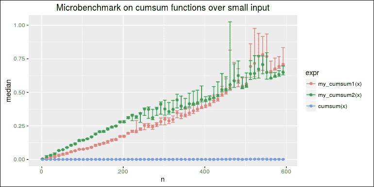
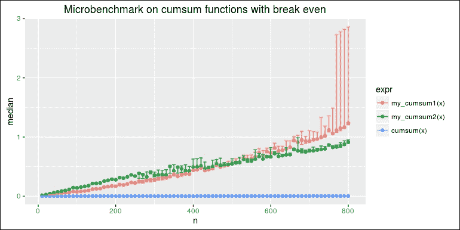
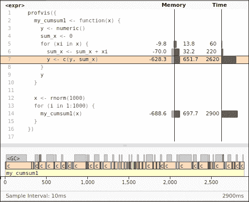
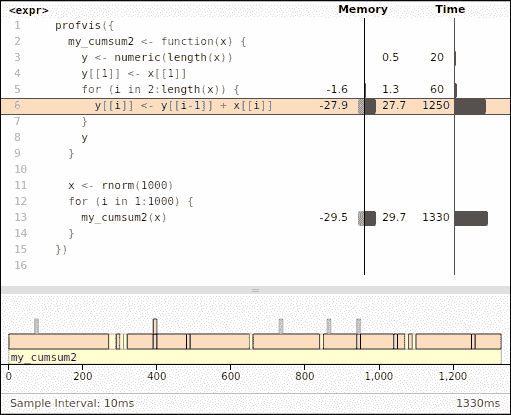
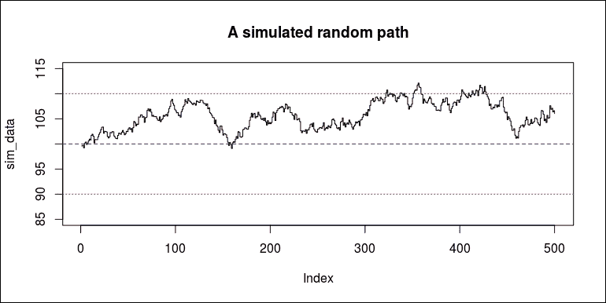

# 第十三章。高性能计算

在上一章中，您学习了关于数据操作的一些内置函数和针对数据操作的各种包。尽管这些包依赖于不同的技术，并且可能在不同的哲学指导下构建，但它们都使得数据过滤和聚合变得容易得多。

然而，数据处理不仅仅是简单的过滤和聚合。有时，它涉及到模拟和其他计算密集型任务。与 C 和 C++ 等高性能编程语言相比，R 由于其动态设计以及当前实现中优先考虑稳定性和在统计分析与可视化中的易用性和强大功能，而不是性能和语言特性，运行速度要慢得多。然而，编写良好的 R 代码仍然足够快，可以满足大多数用途。

在本章中，我将展示以下技术，以帮助您以高性能编写 R 代码：

+   测量代码性能

+   分析代码以找到瓶颈

+   使用内置函数和向量化

+   通过并行计算使用多个核心

+   使用 Rcpp 和相关包编写 C++

# 理解代码性能问题

从一开始，R 就是为统计计算和数据可视化而设计的，并且被学术界和工业界广泛使用。对于大多数数据分析目的，正确性比性能更重要。换句话说，在 1 分钟内得到正确的结果应该比在 20 秒内得到错误的结果要好。一个速度快三倍的结果并不自动比一个慢但正确的结果多三倍的有效性。因此，在您确信代码的正确性之前，性能不应成为担忧的问题。

假设您百分之百确信您的代码是正确的，但运行速度有点慢。现在，您是否需要优化代码以使其运行更快？嗯，这取决于。在做出决定之前，将问题解决的时间分为三个部分是有帮助的：开发时间、执行时间和未来的维护时间。

假设我们已经在一个问题上工作了一个小时。由于我们在一开始没有考虑性能，代码运行得并不快。我们花了 50 分钟来思考问题并实现解决方案。然后，又花了 1 分钟来运行并产生答案。由于代码与问题匹配得很好，看起来很直接，未来的改进可以很容易地集成到解决方案中，因此我们花费的时间较少来维护。

然后，假设另一位开发者一直在处理相同的问题，但一开始就试图编写一个极端高性能的代码。解决问题需要时间，但优化代码结构以使其运行更快则需要更多时间。可能需要两小时来思考和实现一个高性能解决方案。然后，运行并产生答案只需要 0.1 秒。由于代码特别优化以挤压硬件，它可能不适合未来的改进，尤其是在问题更新时，这会花费更多时间来维护。

第二位开发者可以高兴地宣称她的代码的性能是我们的代码的 600 倍，但这可能不值得这样做，因为它可能需要更多的人工时间。在许多情况下，人工时间比计算机时间更昂贵。

然而，如果代码经常被使用，比如说，如果需要数十亿次迭代，每次迭代的性能微小提升可以帮助节省大量时间。在这种情况下，代码性能真的很重要。

让我们以一个简单的算法为例，该算法生成一个累积和的数值向量，即输出向量的每个元素是输入向量所有前一个元素的累加和。接下来的讨论中，代码将在不同的上下文中被检查。

虽然 R 提供了一个内置函数`cumsum`来完成这个任务，但我们现在将实现一个 R 版本来帮助理解性能问题。算法的实现如下：

```py
x <- c(1, 2, 3, 4, 5) 
y <- numeric() 
sum_x <- 0 
for (xi in x) { 
  sum_x <- sum_x + xi 
  y <- c(y, sum_x) 
} 
y 
## [1]  1  3  6 10 15 

```

该算法仅使用 `for` 循环将输入向量 `x` 的每个元素累加到 `sum_x` 中。在每次迭代中，它将 `sum_x` 添加到输出向量 `y` 中。我们可以将算法重写为以下函数：

```py
my_cumsum1 <- function(x) { 
  y <- numeric() 
  sum_x <- 0 
  for (xi in x) { 
    sum_x <- sum_x + xi 
    y <- c(y, sum_x) 
  } 
  y 
} 

```

另一种实现方法是使用索引来访问输入向量 `x` 并访问/修改输出向量 `y`：

```py
my_cumsum2 <- function(x) { 
  y <- numeric(length(x)) 
  if (length(y)) { 
    y[[1]] <- x[[1]] 
    for (i in 2:length(x)) { 
      y[[i]] <- y[[I - 1]] + x[[i]] 
    } 
  } 
  y 
} 

```

我们知道 R 提供了一个内置函数 `cumsum()` 来执行完全相同的事情。前面的两种实现应该会产生与 `cumsum()` 完全相同的结果。在这里，我们将生成一些随机数并检查它们是否一致：

```py
x <- rnorm(100) 
all.equal(cumsum(x), my_cumsum1(x)) 
## [1] TRUE 
all.equal(cumsum(x), my_cumsum2(x)) 
## [1] TRUE 

```

在前面的代码中，`all.equal()` 检查两个向量的所有对应元素是否相等。从结果来看，我们可以确信 `my_cumsum1()`、`my_cumsum2()` 和 `cumsum()` 是一致的。在下一节中，我们将测量 `cumsum` 的每个版本的执行时间。

## 测量代码性能

虽然这三个函数在给定相同输入的情况下会输出相同的结果，但它们的性能差异可能非常明显。为了揭示性能差异，我们需要工具来测量代码的执行时间。最简单的一个是 `system.time()`。

要测量任何表达式的执行时间，我们只需用函数将其包装起来。在这里，我们将测量 `my_cumsum1()` 计算一个包含 100 个元素的数值向量所需的时间：

```py
x <- rnorm(100) 
system.time(my_cumsum1(x)) 
##    user  system elapsed  
##       0       0       0 

```

计时器结果显示了三列：`user`、`system` 和 `elapsed`。我们应该更加关注的是 `user` 时间。它衡量的是执行代码所花费的 CPU 时间。对于更多细节，运行 `?proc.time` 并查看这些度量之间的差异。

结果表明代码运行得太快，无法进行测量。我们可以尝试计时 `my_cumsum2()`，结果大致相同：

```py
system.time(my_cumsum2(x)) 
##    user  system elapsed  
##   0.000   0.000   0.001 

```

对于内置函数 `cumsum()` 也是如此：

```py
system.time(cumsum(x)) 
##    user  system elapsed  
##       0       0       0 

```

由于输入太小，计时并没有真正起作用。现在，我们将生成一个包含 `1000` 个数字的向量并再次进行测试：

```py
x <- rnorm(1000) 
system.time(my_cumsum1(x)) 
##    user  system elapsed  
##   0.000   0.000   0.003 
system.time(my_cumsum2(x)) 
##    user  system elapsed  
##   0.004   0.000   0.001 
system.time(cumsum(x)) 
##    user  system elapsed  
##       0       0       0 

```

现在，我们确信 `my_cumsum1()` 和 `my_cumsum2()` 确实需要一些时间来计算结果，但它们之间没有明显的差异。然而，`cumsum()` 函数仍然非常快，难以测量。

我们将再次使用更大的输入值来测试这三个函数，看看它们的性能差异是否可以被揭示：

```py
x <- rnorm(10000) 
system.time(my_cumsum1(x)) 
##    user  system elapsed  
##   0.208   0.000   0.211 
system.time(my_cumsum2(x)) 
##    user  system elapsed  
##   0.012   0.004   0.013 
system.time(cumsum(x)) 
##    user  system elapsed  
##       0       0       0 

```

结果非常清晰：`my_cumsum1()` 的速度看起来比 `my_cumsum2()` 慢 10 多倍，而 `cumsum()` 函数的速度仍然远远超过我们的两个实现。

注意，性能差异可能不是恒定的，尤其是当我们提供更大的输入时，如下所示：

```py
x <- rnorm(100000) 
system.time(my_cumsum1(x)) 
##    user  system elapsed  
##  25.732   0.964  26.699 
system.time(my_cumsum2(x)) 
##    user  system elapsed  
##   0.124   0.000   0.123 
system.time(cumsum(x)) 
##    user  system elapsed  
##       0       0       0 

```

前面的结果形成了一个相当惊人的对比：当输入向量的长度达到 100,000 级别时，`my_cumsum1()` 可以比 `my_cumsum2()` 慢 200 倍。在所有之前的结果中，`cumsum()` 函数始终非常快。

`system.time()` 函数可以帮助测量代码块执行时间，但它并不非常准确。一方面，每次测量可能会得到不同的值，因此我们应该重复计时足够多次，以便进行有效的比较。另一方面，计时器的分辨率可能不足以反映我们感兴趣的代码的实际性能差异。

一个名为 `microbenchmark` 的包可以作为比较不同表达式性能的更准确解决方案。要安装该包，请运行以下代码：

```py
install.packages("microbenchmark") 

```

当包准备就绪时，我们将加载该包并调用 `microbenchmark()` 来直接比较这三个函数的性能：

```py
library(microbenchmark) 
x <- rnorm(100) 
microbenchmark(my_cumsum1(x), my_cumsum2(x), cumsum(x)) 
## Unit: nanoseconds 
##           expr    min       lq      mean   median       uq 
##  my_cumsum1(x)  58250  64732.5  68353.51  66396.0  71840.0 
##  my_cumsum2(x) 120150 127634.5 131042.40 130739.5 133287.5 
##      cumsum(x)    295    376.5    593.47    440.5    537.5 
##     max neval cld 
##   88228   100  b  
##  152845   100   c 
##    7182   100 a 

```

注意，默认情况下，`microbenchmark()` 函数会运行每个表达式 100 次，以便提供更多执行时间的分位数。也许会让你感到惊讶，当输入向量为 100 个元素时，`my_cumsum1()` 比起 `my_cumsum2()` 来说要快一点。另外，请注意，时间数字的单位是纳秒（1 秒等于 1,000,000,000 纳秒）。

然后，我们将尝试一个包含 `1000` 个数字的输入：

```py
x <- rnorm(1000) 
microbenchmark(my_cumsum1(x), my_cumsum2(x), cumsum(x)) 
## Unit: microseconds 
##           expr      min        lq       mean    median 
##  my_cumsum1(x) 1600.186 1620.5190 2238.67494 1667.5605 
##  my_cumsum2(x) 1034.973 1068.4600 1145.00544 1088.4090 
##      cumsum(x)    1.806    2.1505    3.43945    3.4405 
##         uq      max neval cld 
##  3142.4610 3750.516   100   c 
##  1116.2280 2596.908   100  b  
##     4.0415   11.007   100 a 

```

现在，`my_cumsum2()` 的速度比 `my_cumsum1()` 快一点，但两者都比内置的 `cumsum()` 慢得多。请注意，单位现在变成了微秒。

对于 `5000` 个数字的输入，`my_cumsum1()` 和 `my_cumsum2()` 之间的性能差异变得更大：

```py
x <- rnorm(5000) 
microbenchmark(my_cumsum1(x), my_cumsum2(x), cumsum(x)) 
## Unit: microseconds 
##           expr       min        lq        mean     median 
##  my_cumsum1(x) 42646.201 44043.050 51715.59988 44808.9745 
##  my_cumsum2(x)  5291.242  5364.568  5718.19744  5422.8950 
##      cumsum(x)    10.183    11.565    14.52506    14.6765 
##         uq        max neval cld 
##  46153.351 135805.947   100   c 
##   5794.821  10619.352   100  b  
##     15.536     37.202   100 a 

```

当输入为 `10000` 个元素时，同样的事情发生了：

```py
x <- rnorm(10000) 
microbenchmark(my_cumsum1(x), my_cumsum2(x), cumsum(x), times = 10) 
## Unit: microseconds 
##           expr        min         lq        mean     median 
##  my_cumsum1(x) 169609.730 170687.964 198782.7958 173248.004 
##  my_cumsum2(x)  10682.121  10724.513  11278.0974  10813.395 
##      cumsum(x)     20.744     25.627     26.0943     26.544 
##         uq        max neval cld 
##  253662.89 264469.677    10   b 
##   11588.99  13487.812    10  a  
##      27.64     29.163    10  a 

```

在所有之前的基准测试中，`cumsum()` 的性能看起来非常稳定，并且随着输入长度的增加，性能没有显著增加。

为了更好地理解三个函数的性能动态，我们将创建以下函数来可视化它们在不同长度输入下的表现：

```py
library(data.table) 
benchmark <- function(ns, times = 30) { 
  results <- lapply(ns, function(n) { 
    x <- rnorm(n) 
    result <- microbenchmark(my_cumsum1(x), my_cumsum2(x), cumsum(x),  
times = times, unit = "ms") 
    data <- setDT(summary(result)) 
    data[, n := n] 
    data 
  }) 
rbindlist(results) 
} 

```

函数的逻辑非常直接：`ns` 是一个向量，包含了我们想要用这些函数测试的所有输入向量的长度。请注意，`microbenchmark()` 返回一个包含所有测试结果的数据框，而 `summary(microbenchmark())` 返回我们之前看到的摘要表。我们用 `n` 标记每个摘要，堆叠所有基准测试结果，并使用 `ggplot2` 包来可视化结果。

首先，我们将从 `100` 到 `3000` 个元素，步长为 `100` 进行基准测试：

```py
benchmarks <- benchmark(seq(100, 3000, 100)) 

```

然后，我们将创建一个图表来展示三个函数性能的对比：

```py
library(ggplot2) 
ggplot(benchmarks, aes(x = n, color = expr)) + 
  ggtitle("Microbenchmark on cumsum functions") + 
  geom_point(aes(y = median)) + 
  geom_errorbar(aes(ymin = lq, ymax = uq)) 

```

这产生了以下三个版本的 `cumsum` 的基准测试，我们打算进行比较：


在前面的图表中，我们将三个函数的结果汇总在一起。点表示中位数，误差条表示第 75 分位数和第 25 分位数。

很明显，`my_cumsum1()` 在较长输入下的性能下降得更快，`my_cumsum2()` 的性能几乎随着输入长度的增加而线性下降，而 `cumsum(x)` 非常快，其性能似乎不会随着输入长度的增加而显著下降。

对于小输入，`my_cumsum1()` 可以比 `my_cumsum2()` 快，正如我们之前所展示的。我们可以进行一个更专注于小输入的基准测试：

```py
benchmarks2 <- benchmark(seq(2, 600, 10), times = 50) 

```

这次，我们将输入向量的长度限制在 `2` 到 `500` 个元素，停止条件为 `10`。由于函数将执行的次数几乎是之前基准测试的两倍，为了保持总执行时间较低，我们将 `times` 从默认的 `100` 减少到 `50`：

```py
ggplot(benchmarks2, aes(x = n, color = expr)) + 
  ggtitle("Microbenchmark on cumsum functions over small input") + 
  geom_point(aes(y = median)) + 
  geom_errorbar(aes(ymin = lq, ymax = uq)) 

```

下面的图形说明了较小输入下的性能差异：



从图表中，我们可以看到，对于小于大约 `400` 个数字的小输入，`my_cumsum1()` 比较快。随着输入元素的增加，`my_cumsum1()` 的性能衰减比 `my_cumsum2()` 快得多。

通过对从 `10` 到 `800` 个元素的输入进行基准测试，可以更好地说明性能排名的动态：

```py
benchmarks3 <- benchmark(seq(10, 800, 10), times = 50) 
ggplot(benchmarks3, aes(x = n, color = expr)) + 
  ggtitle("Microbenchmark on cumsum functions with break even") + 
  geom_point(aes(y = median)) + 
  geom_errorbar(aes(ymin = lq, ymax = uq)) 

```

生成的图表如下所示：



总之，实现上的微小差异可能会导致性能差距很大。对于小输入，差距通常不明显，但当输入变大时，性能差异可能非常显著，因此不应被忽视。为了比较多个表达式的性能，我们可以使用 `microbenchmark` 而不是 `system.time()` 来获得更准确和更有用的结果。

# 性能分析代码

在前面的章节中，你学习了如何使用 `microbenchmark()` 来基准测试表达式。这在我们有几个问题解决方案的替代方案并想看到哪个性能更好，或者当我们优化一个表达式并想看到性能是否真的比原始代码更好时非常有用。

然而，通常情况下，当我们觉得代码运行缓慢时，很难定位到对整个程序减慢贡献最大的表达式。这样的表达式被称为“性能瓶颈”。为了提高代码性能，最好先解决瓶颈。

幸运的是，R 提供了分析工具来帮助我们找到瓶颈，即运行最慢的代码，这应该是提高代码性能的首要关注点。

## 使用 Rprof 进行代码分析

R 提供了一个内置函数 `Rprof()` 用于代码分析。当分析开始时，会运行一个采样过程，直到分析结束。默认情况下，采样会查看 R 每隔 20 毫秒执行哪个函数。这样，如果一个函数非常慢，那么大部分执行时间可能都花在了这个函数调用上。

样本方法可能不会产生非常准确的结果，但在大多数情况下它都能满足我们的需求。在下面的例子中，我们将使用 `Rprof()` 来分析调用 `my_cumsum1()` 的代码，并尝试找出哪个部分减慢了代码。

使用 `Rprof()` 的方法非常简单：调用 `Rprof()` 开始分析，运行你想要分析的代码，调用 `Rprof(NULL)` 停止分析，最后调用 `summaryRprof()` 查看分析摘要：

```py
x <- rnorm(1000) 
tmp <- tempfile(fileext = ".out") 
Rprof(tmp) 
for (i in 1:1000) { 
  my_cumsum1(x) 
} 
Rprof(NULL) 
summaryRprof(tmp) 
## $by.self 
##              self.time self.pct total.time total.pct 
## "c"               2.42    82.88       2.42     82.88 
## "my_cumsum1"      0.46    15.75       2.92    100.00 
## "+"               0.04     1.37       0.04      1.37 
## $by.total 
##              total.time total.pct self.time self.pct 
## "my_cumsum1"       2.92    100.00      0.46    15.75 
## "c"                2.42     82.88      2.42    82.88 
## "+"                0.04      1.37      0.04     1.37 
##  
## $sample.interval 
## [1] 0.02 
##  
## $sampling.time 
## [1] 2.92 

```

注意，我们使用了 `tempfile()` 创建一个临时文件来存储分析数据。如果我们不向 `Rprof()` 提供这样的文件，它将自动在当前工作目录中创建 `Rprof.out`。默认情况下，这也适用于 `summaryRprof()`。

分析结果将分析数据总结成可读的格式：`$by.self` 按照执行时间 `self.time` 排序，而 `$by.total` 按照总执行时间 `total.time` 排序。更具体地说，一个函数的 `self.time` 是该函数中执行代码所花费的时间，而一个函数的 `total.time` 是该函数的总执行时间。

为了找出哪个部分减慢了函数，我们应该更加关注 `self.time`，因为它涉及到每个函数执行的独立时间。

前面的分析结果显示，`c` 占用了主要的执行时间，也就是说，`y <- c(y, sum_x)` 对函数的减慢贡献最大。

我们可以对 `my_cumsum2()` 做同样的事情。分析结果显示，大部分时间都花在了 `my_cumsum2()` 上，这是正常的，因为代码中我们只做了这件事。`my_cumsum2()` 中没有特定的函数占用了大量的执行时间：

```py
tmp <- tempfile(fileext = ".out") 
Rprof(tmp) 
for (i in 1:1000) { 
  my_cumsum2(x) 
} 
Rprof(NULL) 
summaryRprof(tmp) 
## $by.self 
##              self.time self.pct total.time total.pct 
## "my_cumsum2"      1.42    97.26       1.46    100.00 
## "-"               0.04     2.74       0.04      2.74 
##  
## $by.total 
##              total.time total.pct self.time self.pct 
## "my_cumsum2"       1.46    100.00      1.42    97.26 
## "-"                0.04      2.74      0.04     2.74 
##  
## $sample.interval 
## [1] 0.02 
##  
## $sampling.time 
## [1] 1.46 

```

在实际情况下，我们想要分析的性能代码通常足够复杂。它可能涉及许多不同的函数。如果我们只看到跟踪的每个函数的计时，这样的分析总结可能不太有帮助。幸运的是，`Rprof()` 支持行分析，也就是说，当我们指定 `line.profiling = TRUE` 并使用 `source(..., keep.source = TRUE)` 时，它可以告诉我们每行代码的计时。

我们将在 `code/my_cumsum1.R` 创建一个脚本文件，包含以下代码：

```py
my_cumsum1 <- function(x) {
   y <- numeric()
   sum_x <- 0
   for (xi in x) {
     sum_x <- sum_x + xi
     y <- c(y, sum_x)
   }
   y
 }

 x <- rnorm(1000)

 for (i in 1:1000) {
   my_cumsum1(x)
 }
```

然后，我们将使用 `Rprof()` 和 `source()` 来分析这个脚本文件：

```py
tmp <- tempfile(fileext = ".out") 
Rprof(tmp, line.profiling = TRUE) 
source("code/my_cumsum1.R", keep.source = TRUE) 
Rprof(NULL) 
summaryRprof(tmp, lines = "show") 
## $by.self 
##                self.time self.pct total.time total.pct 
## my_cumsum1.R#6      2.38    88.15       2.38     88.15 
## my_cumsum1.R#5      0.26     9.63       0.26      9.63 
## my_cumsum1.R#4      0.06     2.22       0.06      2.22 
##  
## $by.total 
##                 total.time total.pct self.time self.pct 
## my_cumsum1.R#14       2.70    100.00      0.00     0.00 
## my_cumsum1.R#6        2.38     88.15      2.38    88.15 
## my_cumsum1.R#5        0.26      9.63      0.26     9.63 
## my_cumsum1.R#4        0.06      2.22      0.06     2.22 
##  
## $by.line 
##                 self.time self.pct total.time total.pct 
## my_cumsum1.R#4       0.06     2.22       0.06      2.22 
## my_cumsum1.R#5       0.26     9.63       0.26      9.63 
## my_cumsum1.R#6       2.38    88.15       2.38     88.15 
## my_cumsum1.R#14      0.00     0.00       2.70    100.00 
##  
## $sample.interval 
## [1] 0.02 
##  
## $sampling.time 
## [1] 2.7 

```

这次，它不再显示函数名，而是显示脚本文件中的行号。我们可以通过查看 `$by.self` 的顶部行轻松地定位耗时最多的行。`my_cumsum1.R#6` 文件指的是 `y <- c(y, sum_x)`，这与之前的分析结果一致。

## 使用 profvis 分析代码

`Rprof()` 函数提供了有用的信息，帮助我们找到代码中太慢的部分，以便我们可以改进实现。RStudio 还发布了一个增强的分析工具 `profvis` ([`rstudio.github.io/profvis/`](https://rstudio.github.io/profvis/))，它为 R 代码提供了交互式可视化分析。

它是一个 R 包，并且已经集成到 RStudio 中。要安装包，请运行以下代码：

```py
install.packages("profvis") 

```

一旦安装了包，我们就可以使用 `profvis` 来分析一个表达式并可视化结果：

```py
library(profvis)
profvis({
  my_cumsum1 <- function(x) {
    y <- numeric()
    sum_x <- 0
    for (xi in x) {
      sum_x <- sum_x + xi
      y <- c(y, sum_x)
    }
    y
  }

  x <- rnorm(1000)

  for (i in 1:1000) {
    my_cumsum1(x)
  }
})
```

分析完成后，将出现一个带有交互式用户界面的新标签页：



上半部分显示代码、内存使用和计时，而下半部分显示函数调用的时序以及垃圾回收发生的时间。我们可以点击并选择特定的代码行，查看函数执行的时序。与 `summaryRprof()` 生成的结果相比，这种交互式可视化提供了更丰富的信息，使我们能够更多地了解代码在长时间内的执行情况。这样，我们可以轻松地识别出耗时的代码和一些可能引起问题的模式。

我们可以用 `my_cumsum2()` 做同样的事情：

```py
profvis({
  my_cumsum2 <- function(x) {
    y <- numeric(length(x))
    y[[1]] <- x[[1]]
    for (i in 2:length(x)) {
      y[[i]] <- y[[i-1]] + x[[i]]
    }
    y
  }

  x <- rnorm(1000)

  for (i in 1:1000) {
    my_cumsum2(x)
  }
})
```

这次，分析结果如下所示：



我们可以轻松地识别出哪个部分耗时最多，并决定是否可以接受。在所有代码中，总有一部分耗时最多，但这并不一定意味着它太慢。如果代码满足我们的需求且性能可接受，那么可能没有必要为了修改代码而冒出错误版本的风险来优化性能。

## 理解代码为什么可能慢

在前面的章节中，你学习了关于代码计时和分析的工具。为了解决相同的问题，一个函数可能运行得非常快，而另一个可能运行得非常慢。了解什么因素会导致代码慢是有帮助的。

首先，R 是一种动态编程语言。按照设计，它提供了高度灵活的数据结构和代码执行机制。因此，代码解释器在函数实际被调用之前很难预先知道如何处理下一个函数调用。这与强类型静态编程语言（如 C 和 C++）的情况不同。许多事情都是在编译时而不是在运行时确定的，因此程序在事先知道很多信息的情况下，可以进行密集的优化。相比之下，R 以灵活性换取性能，但编写良好的 R 代码可以表现出可接受，甚至良好的性能。

R 代码可能运行缓慢的最主要原因是我们可能密集地创建、分配或复制数据结构。这正是为什么当输入变长时，`my_cumsum1()`和`my_cumsum2()`在性能上表现出巨大差异的原因。`my_cumsum1()`函数始终扩展向量，这意味着在每个迭代中，向量都会被复制到新的地址，并添加一个新元素。因此，迭代次数越多，它需要复制的元素就越多，然后代码就会变慢。

这可以通过以下基准测试来明确：`grow_by_index`表示我们初始化一个空列表。`preallocated`函数表示我们初始化一个带有预分配位置的列表，即一个包含`n`个`NULL`值的列表，所有位置都已分配。在两种情况下，我们都会修改列表的第`i`个元素，但区别在于我们将在每次迭代中扩展第一个列表，而第二个列表不会发生这种情况，因为它已经完全分配了：

```py
n <- 10000 
microbenchmark(grow_by_index = { 
  x <- list() 
  for (i in 1:n) x[[i]] <- i 
}, preallocated = { 
  x <- vector("list", n) 
  for (i in 1:n) x[[i]] <- i 
}, times = 20) 
## Unit: milliseconds 
##           expr        min         lq       mean     median 
##  grow_by_index 258.584783 261.639465 299.781601 263.896162 
##   preallocated   7.151352   7.222043   7.372342   7.257661 
##          uq        max neval cld 
##  351.887538 375.447134    20   b 
##    7.382103   8.612665    20  a 

```

结果是清晰的：密集地扩展列表可以显著减慢代码，而在范围内修改预分配的列表则很快。同样的逻辑也适用于原子向量和矩阵。在 R 中扩展数据结构通常很慢，因为它会触发重新分配，即把原始数据结构复制到新的内存地址。这在 R 中非常昂贵，尤其是当数据量很大时。

然而，精确的预分配并不总是可行的，因为这要求我们在迭代之前知道总数。有时，我们可能只能反复请求一个结果来存储，而不知道确切的总量。在这种情况下，预先分配一个合理长度的列表或向量可能仍然是一个好主意。当迭代结束时，如果迭代次数没有达到预分配的长度，我们可以取列表或向量的子集。这样，我们可以避免数据结构的密集重新分配。

# 提升代码性能

在上一节中，我们展示了如何使用分析工具来识别代码中的性能瓶颈。在本节中，你将了解许多提升代码性能的方法。

## 使用内置函数

之前，我们展示了`my_cumsum1()`、`my_cumsum2()`和内置函数`cumsum()`之间的性能差异。尽管`my_cumsum2()`比`my_cumsum1()`快，但当输入向量包含许多数字时，`cumsum()`比它们快得多。而且，即使输入变长，其性能也不会显著下降。如果我们评估`cumsum`，我们可以看到它是一个原始函数：

```py
cumsum 
## function (x)  .Primitive("cumsum") 

```

R 中的原始函数是用 C/C++/Fortran 实现的，编译成本地指令，因此效率极高。另一个例子是`diff()`。在这里，我们将实现 R 中的向量差分序列计算：

```py
diff_for <- function(x) { 
  n <- length(x) - 1 
  res <- numeric(n) 
  for (i in seq_len(n)) { 
    res[[i]] <- x[[i + 1]] - x[[i]] 
  } 
  res 
} 

```

我们可以验证实现是否正确：

```py
diff_for(c(2, 3, 1, 5)) 
## [1]  1 -2  4 

```

因此，`diff_for()`和内置的`diff()`必须对相同的输入返回相同的结果：

```py
x <- rnorm(1000) 
all.equal(diff_for(x), diff(x)) 
## [1] TRUE 

```

然而，这两个函数在性能上存在很大的差距。

```py
microbenchmark(diff_for(x), diff(x)) 
## Unit: microseconds 
##         expr      min        lq       mean    median 
##  diff_for(x) 1034.028 1078.9075 1256.01075 1139.1270 
##      diff(x)   12.057   14.2535   21.72772   17.5705 
##         uq      max neval cld 
##  1372.1145 2634.128   100   b 
##    25.4525   75.850   100  a 

```

内置函数在大多数情况下都比等效的 R 实现要快得多。这不仅适用于向量函数，也适用于矩阵。例如，这里是一个简单的 3 行 4 列的整数矩阵：

```py
mat <- matrix(1:12, nrow = 3) 
mat 
##      [,1] [,2] [,3] [,4] 
## [1,]    1    4    7   10 
## [2,]    2    5    8   11 
## [3,]    3    6    9   12 

```

我们可以编写一个函数来转置矩阵：

```py
my_transpose <- function(x) {
   stopifnot(is.matrix(x))
   res <- matrix(vector(mode(x), length(x)), 
     nrow = ncol(x), ncol = nrow(x), 
     dimnames = dimnames(x)[c(2, 1)])
   for (i in seq_len(ncol(x))) {
     for (j in seq_len(nrow(x))) {
       res[i, j] <- x[j, i]
     }
   }
   res
 }
```

在函数中，我们首先创建一个与输入相同类型的矩阵，但行和列的数量和名称分别交换。然后，我们将遍历列和行以转置矩阵：

```py
my_transpose(mat) 
##      [,1] [,2] [,3] 
## [1,]    1    2    3 
## [2,]    4    5    6 
## [3,]    7    8    9 
## [4,]   10   11   12 

```

矩阵转置的内置函数是`t()`。我们可以很容易地验证这两个函数返回相同的结果：

```py
all.equal(my_transpose(mat), t(mat)) 
## [1] TRUE 

```

然而，它们在性能上可能存在很大差异：

```py
microbenchmark(my_transpose(mat), t(mat)) 
## Unit: microseconds 
##               expr    min     lq     mean  median      uq 
##  my_transpose(mat) 22.795 24.633 29.47941 26.0865 35.5055 
##             t(mat)  1.576  1.978  2.87349  2.3375  2.7695 
##     max neval cld 
##  71.509   100   b 
##  16.171   100  a 

```

当输入矩阵更大时，性能差异变得更加显著。在这里，我们将创建一个新的矩阵，具有`1000`行和`25`列。虽然结果相同，但性能可能会有很大差异：

```py
mat <- matrix(rnorm(25000), nrow = 1000) 
all.equal(my_transpose(mat), t(mat)) 
## [1] TRUE 
microbenchmark(my_transpose(mat), t(mat)) 
## Unit: microseconds 
##               expr       min         lq      mean 
##  my_transpose(mat) 21786.241 22456.3990 24466.055 
##             t(mat)    36.611    46.2045    61.047 
##      median        uq        max neval cld 
##  23821.5905 24225.142 113395.811   100   b 
##     57.7505    68.694    142.126   100   a 

```

注意，`t()`是一个通用函数，它既适用于矩阵也适用于数据框。S3 调度以找到适合输入的正确方法，这也带来了一些开销。因此，直接在矩阵上调用`t.default()`会稍微快一些：

```py
microbenchmark(my_transpose(mat), t(mat), t.default(mat)) 
## Unit: microseconds 
##               expr       min         lq        mean 
##  my_transpose(mat) 21773.751 22498.6420 23673.26089 
##             t(mat)    37.853    48.8475    63.57713 
##     t.default(mat)    35.518    41.0305    52.97680 
##      median         uq       max neval cld 
##  23848.6625 24139.7675 29034.267   100   b 
##     61.3565    69.6655   140.061   100   a  
##     46.3095    54.0655   146.755   100   a 

```

所有之前的例子都表明，在大多数情况下，如果提供了内置函数，使用它们要比在 R 中重新发明轮子要好得多。这些函数消除了 R 代码的开销，因此即使输入很大，也可以非常高效。

## 使用向量操作

内置函数的特殊子集是算术运算符，如`+`、`-`、`*`、`/`、`^`和`%%`。这些运算符不仅效率极高，而且支持向量操作。

假设我们在 R 中实现`+`操作符：

```py
add <- function(x, y) {
   stopifnot(length(x) == length(y),
     is.numeric(x), is.numeric(y))
   z <- numeric(length(x))
   for (i in seq_along(x)) {
     z[[i]] <- x[[i]] + y[[i]]
   }
   z
 }
```

然后，我们将随机生成`x`和`y`。`add(x, y)`和`x + y`参数应该返回完全相同的结果：

```py
x <- rnorm(10000) 
y <- rnorm(10000) 
all.equal(add(x, y), x + y) 
## [1] TRUE 

```

以下基准测试表明性能差异巨大：

```py
microbenchmark(add(x, y), x + y) 
## Unit: microseconds 
##       expr      min         lq        mean     median 
##  add(x, y) 9815.495 10055.7045 11478.95003 10712.7710 
##      x + y   10.260    12.0345    17.31862    13.3995 
##         uq       max neval cld 
##  12598.366 18754.504   100   b 
##     22.208    56.969   100  a 

```

现在，假设我们需要计算前`n`个正整数的倒数平方和。我们可以很容易地使用`for`循环实现算法，如下面的函数`algo1_for`所示：

```py
algo1_for <- function(n) { 
  res <- 0 
  for (i in seq_len(n)) { 
    res <- res + 1 /i ^ 2 
  } 
  res 
} 

```

该函数接受一个输入`n`，迭代`n`次以累积，然后返回结果。

更好的方法是直接使用向量化计算，而不需要任何 `for` 循环的必要性，就像 `algo1_vec()` 的实现一样：

```py
algo1_vec <- function(n) { 
  sum(1 / seq_len(n) ^ 2) 
} 

```

这两个函数在普通输入下产生相同的结果：

```py
algo1_for(10) 
## [1] 1.549768 
algo1_vec(10) 
## [1] 1.549768 

```

然而，它们的性能却非常不同：

```py
microbenchmark(algo1_for(200), algo1_vec(200)) 
## Unit: microseconds 
##            expr    min       lq      mean   median      uq 
##  algo1_for(200) 91.727 101.2285 104.26857 103.6445 105.632 
##  algo1_vec(200)  2.465   2.8015   3.51926   3.0355   3.211 
##      max neval cld 
##  206.295   100   b 
##   19.426   100  a 
microbenchmark(algo1_for(1000), algo1_vec(1000)) 
## Unit: microseconds 
##             expr     min       lq      mean  median 
##  algo1_for(1000) 376.335 498.9320 516.63954 506.859 
##  algo1_vec(1000)   8.718   9.1175   9.82515   9.426 
##        uq      max neval cld 
##  519.2420 1823.502   100   b 
##    9.8955   20.564   100  a 

```

向量化是编写 R 代码的强烈推荐方式。它不仅性能高，而且使代码更容易理解。

## 使用字节码编译器

在上一节中，我们看到了向化的强大功能。然而，有时问题要求使用 for 循环，而代码难以向量化。在这种情况下，我们可能考虑使用 R 字节码编译器编译函数，这样函数就不再需要解析，可能运行得更快。

首先，我们将加载与 R 一起分发的编译器包。我们将使用 `cmpfun()` 编译给定的 R 函数。例如，我们将编译 `diff_for()` 并将编译后的函数存储为 `diff_cmp()`：

```py
library(compiler) 
diff_cmp <- cmpfun(diff_for) 
diff_cmp 
## function(x) { 
##   n <- length(x) - 1 
##   res <- numeric(n) 
##   for (i in seq_len(n)) { 
##     res[[i]] <- x[[i + 1]] - x[[i]] 
##   } 
##   res 
## } 
## <bytecode: 0x93aec08> 

```

当我们查看 `diff_cmp()` 时，它与 `diff_for()` 并没有太大的不同，但它有一个额外的 `bytecode` 地址标签。

然后，我们将再次使用 `diff_cmp()` 运行基准测试：

```py
x <- rnorm(10000) 
microbenchmark(diff_for(x), diff_cmp(x), diff(x)) 
## Unit: microseconds 
##         expr       min         lq       mean     median 
##  diff_for(x) 10664.387 10940.0840 11684.3285 11357.9330 
##  diff_cmp(x)   732.110   740.7610   760.1985   751.0295 
##      diff(x)    80.824    91.2775   107.8473   103.8535 
##        uq       max neval cld 
##  12179.98 16606.291   100   c 
##    763.66  1015.234   100  b  
##    115.11   219.396   100 a 

```

看起来很神奇，编译版本 `diff_cmp()` 比原始的 `diff_for()` 快得多，尽管我们没有修改任何东西，只是将其编译成字节码。

现在，我们将使用 `algo1_for()` 做同样的事情：

```py
algo1_cmp <- cmpfun(algo1_for) 
algo1_cmp 
## function(n) { 
##   res <- 0 
##   for (i in seq_len(n)) { 
##     res <- res + 1 / i ^ 2 
##   } 
##   res 
## } 
## <bytecode: 0xa87e2a8> 

```

然后，我们将包含编译版本进行基准测试：

```py
n <- 1000 
microbenchmark(algo1_for(n), algo1_cmp(n), algo1_vec(n)) 
## Unit: microseconds 
##          expr     min       lq      mean   median       uq 
##  algo1_for(n) 490.791 499.5295 509.46589 505.7560 517.5770 
##  algo1_cmp(n)  55.588  56.8355  58.10490  57.8270  58.7140 
##  algo1_vec(n)   8.688   9.2150   9.79685   9.4955   9.8895 
##      max neval cld 
##  567.680   100   c 
##   69.734   100  b  
##   19.765   100 a 

```

再次，编译版本比原始版本快了六倍以上，即使我们没有改变任何代码。

然而，如果用于编译完全向量化函数，编译并不是魔法。在这里，我们将编译 `algo1_vec()` 并将其性能与原始版本进行比较：

```py
algo1_vec_cmp <- cmpfun(algo1_vec) 
microbenchmark(algo1_vec(n), algo1_vec_cmp(n), times = 10000) 
## Unit: microseconds 
##              expr  min    lq      mean median    uq 
##      algo1_vec(n) 8.47 8.678 20.454858  8.812 9.008 
##  algo1_vec_cmp(n) 8.35 8.560  9.701012  8.687 8.864 
##        max neval cld 
##  96376.483 10000   a 
##   1751.431 10000   a 

```

注意，编译函数没有显示出明显的性能提升。要了解更多关于编译器如何工作，请输入 `?compile` 并阅读文档。

## 使用 Intel MKL 驱动的 R 分发

我们通常使用的 R 分发是单线程的，也就是说，只有一个 CPU 线程用于执行所有 R 代码。好处是执行模型简单且安全，但它没有利用多核计算。

Microsoft R Open (MRO，见 [`mran.microsoft.com/open/`](https://mran.microsoft.com/open/)) 是 R 的增强版分发。由 Intel Math Kernel Library (MKL，见 [`software.intel.com/en-us/intel-mkl`](https://software.intel.com/en-us/intel-mkl)) 驱动，MRO 通过自动利用多线程计算来增强矩阵算法。在多核计算机上，MRO 在矩阵乘法、Cholesky 分解、QR 分解、奇异值分解、主成分分析和线性判别分析等方面，可以比官方 R 实现快 10-80 倍。更多详情，请访问 [`mran.microsoft.com/documents/rro/multithread/`](https://mran.microsoft.com/documents/rro/multithread/) 并查看基准测试。

## 使用并行计算

正如我们在上一节中提到的，R 在设计上是单线程的，但仍然允许多进程并行计算，即运行多个 R 会话进行计算。这项技术由一个并行库支持，该库也随 R 一起分发。

假设我们需要进行一个模拟：我们需要生成一个遵循特定随机过程的随机路径，并查看在任意一点，值是否超出围绕起点的固定边界。

以下代码生成一个实现：

```py
set.seed(1) 
sim_data <- 100 * cumprod(1 + rnorm(500, 0, 0.006)) 
plot(sim_data, type = "s", ylim = c(85, 115), 
  main = "A simulated random path") 
abline(h = 100, lty = 2, col = "blue") 
abline(h = 100 * (1 + 0.1 * c(1, -1)), lty = 3, col = "red") 

```

生成的图表如下所示：



前面的图表显示了路径和 10% 的边界。很明显，在索引 300 到 500 之间，值多次超出上限边界。

这只是其中一条路径。一个有效的模拟需要生成器运行足够多的次数，以产生具有统计意义的成果。以下函数参数化了随机路径生成器，并返回一系列感兴趣的总结指标。请注意，`signal` 表示路径上的任何一点是否超出边界：

```py
simulate <- function(i, p = 100, n = 10000, 
   r = 0, sigma = 0.0005, margin = 0.1) {
   ps <- p * cumprod(1 + rnorm(n, r, sigma))
   list(id = i, 
     first = ps[[1]], 
     high = max(ps), 
     low = min(ps), 
     last = ps[[n]],
     signal = any(ps > p * (1 + margin) | ps < p * (1 - margin)))
 }
```

然后，我们可以运行生成器一次，并查看其总结结果：

```py
simulate(1) 
## $id 
## [1] 1 
##  
## $first 
## [1] 100.0039 
##  
## $high 
## [1] 101.4578 
##  
## $low 
## [1] 94.15108 
##  
## $last 
## [1] 96.13973 
##  
## $signal 
## [1] FALSE 

```

要进行模拟，我们需要多次运行该函数。在实践中，我们可能需要运行至少数百万次实现，这可能会花费我们相当多的时间。在这里，我们将测量运行这个模拟的一万次迭代的耗时：

```py
system.time(res <- lapply(1:10000, simulate)) 
##    user  system elapsed  
##   8.768   0.000   8.768 

```

模拟完成后，我们可以将所有结果转换成一个数据表：

```py
library(data.table) 
res_table <- rbindlist(res) 
head(res_table) 
##    id     first     high      low      last signal 
## 1:  1 100.03526 100.7157 93.80330 100.55324  FALSE 
## 2:  2 100.03014 104.7150 98.85049 101.97831  FALSE 
## 3:  3  99.99356 104.9834 95.28500  95.59243  FALSE 
## 4:  4  99.93058 103.4315 96.10691  97.22223  FALSE 
## 5:  5  99.99785 100.6041 94.12958  95.97975  FALSE 
## 6:  6 100.03235 102.1770 94.65729  96.49873  FALSE 

```

我们可以计算 `signal == TRUE` 的实现概率：

```py
res_table[, sum(signal) /.N] 
## [1] 0.0881 

```

如果问题变得更加实际，需要我们运行数百万次，在这种情况下，一些研究人员可能会转向使用性能更高的编程语言，如 C 和 C++，这些语言非常高效且灵活。它们在实现算法方面是很好的工具，但需要更多努力来处理编译器、链接器和数据输入/输出。

注意，前面模拟中的每次迭代都是完全独立的，因此最好通过并行计算来完成。

由于不同的操作系统对进程和线程模型有不同的实现，Linux 和 MacOS 上可用的某些功能在 Windows 上不可用。因此，在 Windows 上进行并行计算可能需要更多的说明。

### 在 Windows 上使用并行计算

在 Windows 上，我们需要创建一个由多个 R 会话组成的本地集群以运行并行计算：

```py
library(parallel) 
cl <- makeCluster(detectCores()) 

```

`detectCores()` 函数返回计算机配备的核心数。创建超过该数量节点的集群是允许的，但通常没有好处，因为计算机不能同时执行超过该数量的任务。

然后，我们可以调用 `parLapply()`，它是 `lapply()` 的并行版本：

```py
system.time(res <- parLapply(cl, 1:10000, simulate)) 
##    user  system elapsed  
##   0.024   0.008   3.772 

```

注意，消耗的时间减少到原始时间的一半以上。现在，我们不再需要集群。我们可以调用 `stopCluster()` 来终止刚刚创建的 R 会话：

```py
stopCluster(cl) 

```

当我们调用 `parLapply()` 时，它将自动为每个集群节点调度任务。更具体地说，所有集群节点同时以 `1:10000` 之一独占运行 `simulate()`，以便并行计算。最后，收集所有结果，以便我们得到一个类似于 `lapply()` 的结果列表：

```py
length(res) 
## [1] 10000 
res_table <- rbindlist(res) 
res_table[, sum(signal) /.N] 
## [1] 0.0889 

```

并行代码看起来很简单，因为 `simulate()` 是自包含的，并且不依赖于用户定义的外部变量或数据集。如果我们并行运行一个引用主会话（创建集群的当前会话）中变量的函数，它将找不到该变量：

```py
cl <- makeCluster(detectCores()) 
n <- 1 
parLapply(cl, 1:3, function(x) x + n) 
## Error in checkForRemoteErrors(val): 3 nodes produced errors; first error: object 'n' not found 
stopCluster(cl) 

```

所有节点都失败了，因为每个节点都是以一个全新的 R 会话启动的，没有定义用户变量。为了让集群节点获取它们需要的变量值，我们必须将它们导出到所有节点。

以下示例演示了它是如何工作的。假设我们有一个数字的数据框。我们想要从这个数据框中抽取随机样本：

```py
n <- 100 
data <- data.frame(id = 1:n,  x = rnorm(n), y = rnorm(n)) 

take_sample <- function(n) { 
  data[sample(seq_len(nrow(data)), 
    size = n, replace = FALSE), ] 
} 

```

如果我们在并行中进行抽样，所有节点必须共享数据框和函数。为此，我们可以使用 `clusterEvalQ()` 在每个集群节点上评估一个表达式。首先，我们将创建一个集群，就像我们之前做的那样：

```py
cl <- makeCluster(detectCores()) 

```

`Sys.getpid()` 函数返回当前 R 会话的进程 ID。由于集群中有四个节点，每个节点都是一个具有唯一进程 ID 的 R 会话。我们可以使用 `clusterEvalQ()` 和 `Sys.getpid()` 来查看每个节点的进程 ID：

```py
clusterEvalQ(cl, Sys.getpid()) 
## [[1]] 
## [1] 20714 
##  
## [[2]] 
## [1] 20723 
##  
## [[3]] 
## [1] 20732 
##  
## [[4]] 
## [1] 20741 

```

要查看每个节点的全局环境中的变量，我们可以调用 `ls()`，就像我们在自己的工作环境中调用一样：

```py
clusterEvalQ(cl, ls()) 
## [[1]] 
## character(0) 
##  
## [[2]] 
## character(0) 
##  
## [[3]] 
## character(0) 
##  
## [[4]] 
## character(0) 

```

正如我们提到的，所有集群节点默认情况下都是初始化为空的全球环境。要将 `data` 和 `take_sample` 导出至每个节点，我们可以调用 `clusterExport()`：

```py
clusterExport(cl, c("data", "take_sample")) 
clusterEvalQ(cl, ls()) 
## [[1]] 
## [1] "data"        "take_sample" 
##  
## [[2]] 
## [1] "data"        "take_sample" 
##  
## [[3]] 
## [1] "data"        "take_sample" 
##  
## [[4]] 
## [1] "data"        "take_sample" 

```

现在，我们可以看到所有节点都有 `data` 和 `take_sample`。现在，我们可以让每个节点调用 `take_sample()`：

```py
clusterEvalQ(cl, take_sample(2)) 
## [[1]] 
##    id         x           y 
## 88 88 0.6519981  1.43142886 
## 80 80 0.7985715 -0.04409101 
##  
## [[2]] 
##    id          x          y 
## 65 65 -0.4705287 -1.0859630 
## 35 35  0.6240227 -0.3634574 
##  
## [[3]] 
##    id         x          y 
## 75 75 0.3994768 -0.1489621 
## 8   8 1.4234844  1.8903637 
##  
## [[4]] 
##    id         x         y 
## 77 77 0.4458477  1.420187 
## 9   9 0.3943990 -0.196291 

```

或者，我们可以使用 `clusterCall()` 和 `<<-` 在每个节点中创建全局变量，而 `<-` 只在函数中创建局部变量：

```py
invisible(clusterCall(cl, function() { 
  local_var <- 10 
  global_var <<- 100 
})) 
clusterEvalQ(cl, ls()) 
## [[1]] 
## [1] "data"        "global_var"  "take_sample" 
##  
## [[2]] 
## [1] "data"        "global_var"  "take_sample" 
##  
## [[3]] 
## [1] "data"        "global_var"  "take_sample" 
##  
## [[4]] 
## [1] "data"        "global_var"  "take_sample" 

```

注意，`clusterCall()` 返回每个节点的返回值。在前面代码中，我们将使用 `invisible()` 来抑制它们返回的值。

由于每个集群节点都是以一个全新的状态启动的，它们只加载基本包。为了让每个节点加载给定的包，我们也可以使用 `clusterEvalQ()`。以下代码让每个节点附加 `data.table` 包，以便 `parLapply()` 可以在每个节点上运行使用 `data.table` 函数的函数：

```py
clusterExport(cl, "simulate") 
invisible(clusterEvalQ(cl, { 
  library(data.table) 
})) 
res <- parLapply(cl, 1:3, function(i) { 
  res_table <- rbindlist(lapply(1:1000, simulate)) 
  res_table[, id := NULL] 
  summary(res_table) 
}) 

```

返回一个数据摘要列表：

```py
res 
## [[1]] 
##      first             high             low         
##  Min.   : 99.86   Min.   : 99.95   Min.   : 84.39   
##  1st Qu.: 99.97   1st Qu.:101.44   1st Qu.: 94.20   
##  Median :100.00   Median :103.32   Median : 96.60   
##  Mean   :100.00   Mean   :103.95   Mean   : 96.04   
##  3rd Qu.:100.03   3rd Qu.:105.63   3rd Qu.: 98.40   
##  Max.   :100.17   Max.   :121.00   Max.   :100.06   
##       last          signal        
##  Min.   : 84.99   Mode :logical   
##  1st Qu.: 96.53   FALSE:911       
##  Median : 99.99   TRUE :89        
##  Mean   : 99.92   NA's :0         
##  3rd Qu.:103.11                   
##  Max.   :119.66                   
##  
## [[2]] 
##      first             high             low         
##  Min.   : 99.81   Min.   : 99.86   Min.   : 83.67   
##  1st Qu.: 99.96   1st Qu.:101.48   1st Qu.: 94.32   
##  Median :100.00   Median :103.14   Median : 96.42   
##  Mean   :100.00   Mean   :103.91   Mean   : 96.05   
##  3rd Qu.:100.04   3rd Qu.:105.76   3rd Qu.: 98.48   
##  Max.   :100.16   Max.   :119.80   Max.   :100.12   
##       last          signal        
##  Min.   : 85.81   Mode :logical   
##  1st Qu.: 96.34   FALSE:914       
##  Median : 99.69   TRUE :86        
##  Mean   : 99.87   NA's :0         
##  3rd Qu.:103.31                   
##  Max.   :119.39                   
##  
## [[3]] 
##      first             high             low         
##  Min.   : 99.84   Min.   : 99.88   Min.   : 85.88   
##  1st Qu.: 99.97   1st Qu.:101.61   1st Qu.: 94.26   
##  Median :100.00   Median :103.42   Median : 96.72   
##  Mean   :100.00   Mean   :104.05   Mean   : 96.12   
##  3rd Qu.:100.03   3rd Qu.:105.89   3rd Qu.: 98.35   
##  Max.   :100.15   Max.   :117.60   Max.   :100.03   
##       last          signal        
##  Min.   : 86.05   Mode :logical   
##  1st Qu.: 96.70   FALSE:920       
##  Median :100.16   TRUE :80        
##  Mean   :100.04   NA's :0         
##  3rd Qu.:103.24                   
##  Max.   :114.80 

```

当我们不再需要集群时，我们将运行以下代码来释放它：

```py
stopCluster(cl) 

```

### 在 Linux 和 MacOS 上使用并行计算

在 Linux 和 MacOS 上使用并行计算可能比在 Windows 上更容易。无需手动创建基于套接字的集群，`mclapply()` 直接将当前的 R 会话分叉成多个 R 会话，保留所有内容以继续并行运行，并为每个子 R 会话调度任务：

```py
system.time(res <- mclapply(1:10000, simulate,  
  mc.cores = detectCores())) 
##    user  system elapsed  
##   9.732   0.060   3.415 

```

因此，我们不需要导出变量，因为它们在每个分叉过程中都是立即可用的：

```py
mclapply(1:3, take_sample, mc.cores = detectCores()) 
## [[1]] 
##    id         x          y 
## 62 62 0.1679572 -0.5948647 
##  
## [[2]] 
##    id         x           y 
## 56 56 1.5678983  0.08655707 
## 39 39 0.1015022 -1.98006684 
##  
## [[3]] 
##    id           x          y 
## 98 98  0.13892696 -0.1672610 
## 4   4  0.07533799 -0.6346651 
## 76 76 -0.57345242 -0.5234832 

```

此外，我们可以创建具有很大灵活性的并行作业。例如，我们将创建一个生成 `10` 个随机数的作业：

```py
job1 <- mcparallel(rnorm(10), "job1") 

```

只要创建了作业，我们就可以选择使用 `mccollect()` 收集作业的结果。然后，函数将不会返回，直到作业完成：

```py
mccollect(job1) 
## $`20772` 
##  [1]  1.1295953 -0.6173255  1.2859549 -0.9442054  0.1482608 
##  [6]  0.4242623  0.9463755  0.6662561  0.4313663  0.6231939 

```

我们还可以通过编程创建多个并行运行的作业。例如，我们创建 `8` 个作业，每个作业随机休眠一段时间。然后，`mccollect()` 不会返回，直到所有作业都完成休眠。由于作业是并行运行的，`mccollect()` 所花费的时间不会太长：

```py
jobs <- lapply(1:8, function(i) {
   mcparallel({
     t <- rbinom(1, 5, 0.6)
     Sys.sleep(t)
     t
   }, paste0("job", i))
 })
 system.time(res <- mccollect(jobs))
##    user  system elapsed 
##   0.012   0.040   4.852
```

这允许我们自定义任务调度机制。

## 使用 Rcpp

正如我们提到的，并行计算在每次迭代都是独立的情况下才会工作，这样最终结果就不会依赖于执行顺序。然而，并非所有任务都像这样理想。因此，并行计算的使用可能会受到影响。如果我们真的希望算法运行得快并且容易与 R 交互，答案是通过 Rcpp 将算法用 C++ 编写（[`www.rcpp.org/`](http://www.rcpp.org/))。

C++ 代码通常运行得非常快，因为它被编译成本地指令，因此比像 R 这样的脚本语言更接近硬件级别。Rcpp 是一个包，它使我们能够以无缝的方式将 R 和 C++ 集成在一起编写 C++ 代码。通过 Rcpp，我们可以编写可以调用 R 函数并利用 R 数据结构的 C++ 代码。它允许我们编写高性能的代码，同时保留 R 中数据操作的能力。

要使用 Rcpp，我们首先需要确保系统已经准备好使用正确的工具链来计算本地代码。在 Windows 上，需要 Rtools，可以在 [`cran.r-project.org/bin/windows/Rtools/`](https://cran.r-project.org/bin/windows/Rtools/) 找到。在 Linux 和 MacOS 上，需要正确安装的 C/C++ 工具链。

一旦工具链安装正确，运行以下代码来安装包：

```py
install.packages("Rcpp") 

```

然后，我们将在 `code/rcpp-demo.cpp` 创建一个 C++ 源文件，其中包含以下代码：

```py
#include <Rcpp.h> 
usingnamespace Rcpp; 

// [[Rcpp::export]] 
NumericVector timesTwo(NumericVector x) { 
  return x * 2; 
} 

```

上述代码是用 C++ 编写的。如果你不熟悉 C++ 语法，可以通过访问 [`www.learncpp.com/`](http://www.learncpp.com/) 快速掌握最简单的部分。C++ 的语言设计和支持的功能比 R 更丰富、更复杂。不要期望在短时间内成为专家，但通常通过学习基础知识，你可以编写简单的算法。

如果你阅读前面的代码，它看起来与典型的 R 代码非常不同。由于 C++是强类型语言，我们需要指定函数参数的类型和函数的返回类型。带有`[[Rcpp::export]]`注释的函数将被 Rcpp 捕获，当我们使用 RStudio 中的`source`命令或直接使用`Rcpp::sourceCpp`时，这些 C++函数将被自动编译并移植到我们的 R 工作环境中。

前面的 C++函数简单地接受一个数值向量，并返回一个新的数值向量，其中所有`x`元素都被加倍。请注意，`NumericVector`类是由源文件开头包含的`Rcpp.h`提供的。实际上，`Rcpp.h`提供了所有常用 R 数据结构的 C++代理。现在，我们将调用`Rcpp::sourceCpp()`来编译和加载源文件：

```py
Rcpp::sourceCpp("code/rcpp-demo.cpp") 

```

函数编译源代码，将其链接到必要的共享库，并将 R 函数暴露给环境。美的是，所有这些操作都是自动完成的，这使得非专业 C++开发者编写算法变得更加容易。现在，我们有一个可以调用的 R 函数：

```py
timesTwo 
## function (x)  
## .Primitive(".Call")(<pointer: 0x7f81735528c0>, x) 

```

我们可以看到，R 中的`timeTwo`看起来不像一个普通函数，而是对 C++函数的本地调用。该函数与单个数值输入一起工作：

```py
timesTwo(10) 
## [1] 20 

```

它也可以与多元素数值向量一起工作：

```py
timesTwo(c(1, 2, 3)) 
## [1] 2 4 6 

```

现在，我们可以使用非常简单的 C++语言结构重新实现`algo1_for`算法。现在，我们将在`code/rcpp-algo1.cpp`创建一个 C++源文件，包含以下代码：

```py
#include <Rcpp.h>
 using namespace Rcpp;

 // [[Rcpp::export]]
 double algo1_cpp(int n) {
   double res = 0;
   for (double i = 1; i < n; i++) {
     res += 1 / (i * i);
   }
   return res;
 }
```

注意，我们在`algo1_cpp`中没有使用任何 R 数据结构，而是使用 C++数据结构。当我们使用`source`命令时，Rcpp 将为我们处理所有移植工作：

```py
Rcpp::sourceCpp("code/rcpp-algo1.cpp") 

```

函数与单个数值输入一起工作：

```py
algo1_cpp(10) 
## [1] 1.539768 

```

如果我们提供一个数值向量，将会发生错误：

```py
algo1_cpp(c(10, 15)) 
## Error in eval(expr, envir, enclos): expecting a single value 

```

现在，我们可以再次进行基准测试。这次，我们将`algo1_cpp`添加到替代实现列表中。在这里，我们将比较使用 R 中的`for`循环的版本、使用 R 中的 for 循环的字节码编译版本、矢量化版本和 C++版本：

```py
n <- 1000 
microbenchmark( 
  algo1_for(n),  
  algo1_cmp(n),  
  algo1_vec(n),  
  algo1_cpp(n)) 
## Unit: microseconds 
##          expr     min       lq      mean   median       uq 
##  algo1_for(n) 493.312 507.7220 533.41701 513.8250 531.5470 
##  algo1_cmp(n)  57.262  59.1375  61.44986  60.0160  61.1190 
##  algo1_vec(n)  10.091  10.8340  11.60346  11.3045  11.7735 
##  algo1_cpp(n)   5.493   6.0765   7.13512   6.6210   7.2775 
##      max neval cld 
##  789.799   100   c 
##  105.260   100  b  
##   23.007   100 a   
##   22.131   100 a 

```

真是令人惊讶，C++版本甚至比矢量化版本还要快。尽管矢量化版本使用的函数是原始函数并且已经非常快，但由于方法调度和参数检查，它们仍然有一些开销。我们的 C++版本针对任务进行了优化，因此可以稍微快于矢量化版本。

另一个例子是`diff_for()`的 C++实现，如下所示：

```py
#include <Rcpp.h> 
usingnamespace Rcpp; 

// [[Rcpp::export]] 
NumericVector diff_cpp(NumericVector x) { 
  NumericVector res(x.size() - 1); 
  for (int i = 0; i < x.size() - 1; i++) { 
    res[i] = x[i + 1] - x[i]; 
  } 
  return res; 
} 

```

在前面的 C++代码中，`diff_cpp()`接受一个数值向量并返回一个数值向量。该函数简单地创建一个新的向量，并迭代地计算并存储`x`中连续两个元素之间的差异。然后，我们将源代码文件：

```py
Rcpp::sourceCpp("code/rcpp-diff.cpp") 

```

很容易验证函数是否按预期工作：

```py
diff_cpp(c(1, 2, 3, 5)) 
## [1] 1 1 2 

```

然后，我们将使用五种不同的调用再次进行基准测试：在 R 中使用循环的版本（`diff_for`）、字节码编译版本（`diff_cmp`）、向量化版本（`diff`）、不带方法调用的向量化版本（`diff.default`）以及我们的 C++版本（`diff_cpp`）：

```py
x <- rnorm(1000) 
microbenchmark( 
  diff_for(x),  
  diff_cmp(x),  
  diff(x),  
  diff.default(x),  
  diff_cpp(x)) 
## Unit: microseconds 
##             expr      min        lq       mean    median 
##      diff_for(x) 1055.177 1113.8875 1297.82994 1282.9675 
##      diff_cmp(x)   75.511   78.4210   88.46485   88.2135 
##          diff(x)   12.899   14.9340   20.64854   18.3975 
##  diff.default(x)   10.750   11.6865   13.90939   12.6400 
##      diff_cpp(x)    5.314    6.4260    8.62119    7.5330 
##         uq      max neval cld 
##  1400.8250 2930.690   100   c 
##    90.3485  179.620   100  b  
##    24.2335   65.172   100 a   
##    15.3810   25.455   100 a   
##     8.9570   54.455   100 a 

```

看起来 C++版本是最快的。

近年来，越来越多的 R 包开始使用 Rcpp 来提高性能或直接链接到提供高性能算法的流行库。例如，RcppArmadillo 和 RcppEigen 提供了高性能的线性代数算法，RcppDE 提供了 C++中全局优化差分演化的快速实现，等等。

要了解更多关于 Rcpp 和相关包的信息，请访问其官方网站 ([`www.rcpp.org/`](http://www.rcpp.org/))。我还推荐 Rcpp 的作者 Dirk Eddelbuettel 所著的书籍*Seamless R and C++ Integration with Rcpp*，可在[`www.rcpp.org/book/`](http://www.rcpp.org/book/)找到。

### OpenMP

正如我们在并行计算部分提到的，R 会话在一个单独的线程中运行。然而，在 Rcpp 代码中，我们可以使用多线程来提高性能。一种多线程技术是 OpenMP ([`openmp.org`](http://openmp.org))，它被大多数现代 C++编译器支持（参见[`openmp.org/wp/openmp-compilers/`](http://openmp.org/wp/openmp-compilers/))）。

几篇文章讨论并展示了 Rcpp 与 OpenMP 的使用，可在[`gallery.rcpp.org/tags/openmp/`](http://gallery.rcpp.org/tags/openmp/)找到。在这里，我们将提供一个简单的示例。我们将在`code/rcpp-diff-openmp.cpp`创建一个包含以下代码的 C++源文件：

```py
// [[Rcpp::plugins(openmp)]] 
#include <omp.h> 
#include <Rcpp.h> 
usingnamespace Rcpp; 

// [[Rcpp::export]] 
NumericVector diff_cpp_omp(NumericVector x) { 
  omp_set_num_threads(3); 
  NumericVector res(x.size() - 1); 
#pragma omp parallel for  
  for (int i = 0; i < x.size() - 1; i++) { 
    res[i] = x[i + 1] - x[i]; 
  } 
  return res; 
} 

```

注意，Rcpp 将识别第一行的注释并为编译器添加必要的选项，以便启用 OpenMP。要使用 OpenMP，我们需要包含`omp.h`。然后，我们可以通过调用`omp_set_num_threads(n)`来设置线程数，并使用`#pragma omp parallel for`来指示下面的循环应该并行化。如果线程数设置为`1`，则代码也可以正常运行。

我们将源 C++代码文件：

```py
Rcpp::sourceCpp("code/rcpp-diff-openmp.cpp") 

```

首先，让我们看看这个函数是否工作正常：

```py
diff_cpp_omp(c(1, 2, 4, 8)) 
## [1] 1 2 4 

```

然后，我们将使用 1000 个数字的输入向量开始基准测试：

```py
x <- rnorm(1000) 
microbenchmark( 
  diff_for(x),  
  diff_cmp(x),  
  diff(x),  
  diff.default(x),  
  diff_cpp(x), 
  diff_cpp_omp(x)) 
## Unit: microseconds 
##             expr      min        lq       mean    median 
##      diff_for(x) 1010.367 1097.9015 1275.67358 1236.7620 
##      diff_cmp(x)   75.729   78.6645   88.20651   88.9505 
##          diff(x)   12.615   16.4200   21.13281   20.5400 
##  diff.default(x)   10.555   12.1690   16.07964   14.8210 
##      diff_cpp(x)    5.640    6.4825    8.24118    7.5400 
##  diff_cpp_omp(x)    3.505    4.4390   26.76233    5.6625 
##         uq      max neval cld 
##  1393.5430 2839.485   100   c 
##    94.3970  186.660   100  b  
##    24.4260   43.893   100 a   
##    18.4635   72.940   100 a   
##     8.6365   50.533   100 a   
##    13.9585 1430.605   100 a 

```

不幸的是，即使使用多线程，`diff_cpp_omp()`也比其单线程的 C++实现慢。这是因为使用多线程有一些开销。如果输入较小，初始化多个线程所需的时间可能会占整个计算时间的很大一部分。然而，如果输入足够大，多线程的优势将超过其成本。在这里，我们将使用`100000`个数字作为输入向量：

```py
x <- rnorm(100000) 
microbenchmark( 
  diff_for(x),  
  diff_cmp(x),  
  diff(x),  
  diff.default(x),  
  diff_cpp(x), 
  diff_cpp_omp(x)) 
## Unit: microseconds 
##             expr        min          lq        mean 
##      diff_for(x) 112216.936 114617.4975 121631.8135 
##      diff_cmp(x)   7355.241   7440.7105   8800.0184 
##          diff(x)    863.672    897.2060   1595.9434 
##  diff.default(x)    844.186    877.4030   3451.6377 
##      diff_cpp(x)    418.207    429.3125    560.3064 
##  diff_cpp_omp(x)    125.572    149.9855    237.5871 
##      median          uq        max neval cld 
##  115284.377 116165.3140 214787.857   100   c 
##    7537.405   8439.9260 102712.582   100  b  
##    1029.642   2195.5620   8020.990   100 a   
##     931.306   2365.6920  99832.513   100 a   
##     436.638    552.5110   2165.091   100 a   
##     166.834    190.7765   1983.299   100 a 

```

创建多个线程的成本相对于使用它们带来的性能提升来说是小的。因此，由 OpenMP 驱动的版本甚至比简单的 C++版本还要快。

实际上，OpenMP 的功能集比我们所展示的丰富得多。更多详情，请参阅官方文档。更多示例，我推荐阅读 Joel Yliluoma 所著的*《OpenMP 指南：C++的简单多线程编程》*，链接为[`bisqwit.iki.fi/story/howto/openmp/`](http://bisqwit.iki.fi/story/howto/openmp/)。

### RcppParallel

利用 Rcpp 利用多线程的另一种方法是 RcppParallel ([`rcppcore.github.io/RcppParallel/`](http://rcppcore.github.io/RcppParallel/))。这个包包括 Intel TBB ([`www.threadingbuildingblocks.org/`](https://www.threadingbuildingblocks.org/)) 和 TinyThread ([`tinythreadpp.bitsnbites.eu/`](http://tinythreadpp.bitsnbites.eu/))。它提供了线程安全的向量和矩阵包装数据结构以及高级并行函数。

要使用 RcppParallel 执行多线程并行计算，我们需要实现一个`Worker`来处理如何将输入的一部分转换为输出。然后，RcppParallel 将负责其余的工作，例如多线程任务调度。

下面是一个简短的演示。我们将在`code/rcpp-parallel.cpp`创建一个包含以下代码的 C++源文件。请注意，我们需要向 Rcpp 声明它依赖于 RcppParallel，并使用 C++ 11 来使用 lambda 函数。

在这里，我们将实现一个名为`Transformer`的`Worker`，它将矩阵中的每个元素`x`转换为`1 / (1 + x ^ 2)`。然后，在`par_transform`中，我们将创建一个`Transformer`实例，并使用它调用`parallelFor`，以便自动利用多线程：

```py
// [[Rcpp::plugins(cpp11)]]
 // [[Rcpp::depends(RcppParallel)]]
 #include <Rcpp.h>
 #include <RcppParallel.h>

 using namespace Rcpp;
 using namespace RcppParallel;

 struct Transformer : public Worker {
   const RMatrix<double> input;
   RMatrix<double> output;
   Transformer(const NumericMatrix input, NumericMatrix output)
     : input(input), output(output) {}
   void operator()(std::size_t begin, std::size_t end) {
     std::transform(input.begin() + begin, input.begin() + end,
       output.begin() + begin, [](double x) {
         return 1 / (1 + x * x);
       });
   }
 };

// [[Rcpp::export]]
NumericMatrix par_transform (NumericMatrix x) {
  NumericMatrix output(x.nrow(), x.ncol());
  Transformer transformer(x, output);
  parallelFor(0, x.length(), transformer);
  return output;
}
```

我们可以轻松地通过一个小矩阵验证该函数是否工作：

```py
mat <- matrix(1:12, nrow = 3) 
mat 
##      [,1] [,2] [,3] [,4] 
## [1,]    1    4    7   10 
## [2,]    2    5    8   11 
## [3,]    3    6    9   12 
par_transform(mat) 
##      [,1]       [,2]       [,3]        [,4] 
## [1,]  0.5 0.05882353 0.02000000 0.009900990 
## [2,]  0.2 0.03846154 0.01538462 0.008196721 
## [3,]  0.1 0.02702703 0.01219512 0.006896552 
all.equal(par_transform(mat), 1 /(1 + mat ^ 2)) 
## [1] TRUE 

```

它产生的结果与向量化的 R 表达式完全相同。现在，我们可以看看当输入矩阵非常大时它的性能表现：

```py
mat <- matrix(rnorm(1000 * 2000), nrow = 1000) 
microbenchmark(1 /(1 + mat ^ 2), par_transform(mat)) 
## Unit: milliseconds 
##                expr      min        lq     mean    median 
##       1/(1 + mat ^ 2) 14.50142 15.588700 19.78580 15.768088 
##  par_transform(mat)  7.73545  8.654449 13.88619  9.277798 
##        uq      max neval cld 
##  18.79235 127.1912   100   b 
##  11.65137 110.6236   100  a 

```

看起来，多线程版本几乎比向量化版本快 1 倍。

RcppParallel 的功能比我们所展示的更强大。更多详细介绍和示例，请访问[`rcppcore.github.io/RcppParallel`](http://rcppcore.github.io/RcppParallel)。

# 摘要

在本章中，你学习了性能可能重要或不重要的时刻，如何测量 R 代码的性能，如何使用分析工具来识别代码中最慢的部分，以及为什么这样的代码可能会慢。然后，我们介绍了提高代码性能最重要的方法：如果可能，使用内置函数，利用向量化，使用字节码编译器，使用并行计算，通过 Rcpp 用 C++编写代码，以及在 C++中使用多线程技术。高性能计算是一个相当高级的话题，如果你想在实践中应用它，还有很多东西要学习。本章表明，使用 R 并不意味着代码总是慢。相反，如果我们想，我们可以实现高性能。

在下一章中，我们将介绍另一个有用的主题：网页抓取。要从网页中抓取数据，我们需要了解网页的结构以及如何从它们的源代码中提取数据。你将学习 HTML、XML 和 CSS 的基本概念和表示方法，以及如何分析目标网页，以便我们能够正确地从网页中提取所需的信息。
