# 第十五章。提高生产力

在前一章中，我们学习了如何使用 R 从网页中提取信息。为了理解其工作原理，我们学习了 HTML、CSS 和 XPath 等几种语言。实际上，R 提供的不仅仅是统计计算环境。R 社区提供了从数据收集、数据操作、统计建模、可视化到报告和演示等一切工具。

在本章中，我们将了解一些提高我们生产力的软件包。我们将回顾本书中我们学习过的几种语言，并了解另一种：Markdown。我们将看到 R 和 Markdown 如何结合以生成强大的动态文档。具体来说，我们将：

+   了解 Markdown 和 R Markdown

+   嵌入表格、图表、图表和交互式图表

+   创建交互式应用程序

# 编写 R Markdown 文档

数据分析师的工作不仅仅是将数据放入模型并得出一些结论。我们通常需要经历一个完整的工作流程，从数据收集、数据清洗、可视化、建模，最后编写报告或进行演示。

在前几章中，我们从不同方面学习了 R 编程语言，从而提高了我们的生产力。在本章中，我们将通过关注最后一步：报告和演示，进一步提升我们的生产力。在接下来的几节中，我们将学习一种非常简单的语言来编写文档：Markdown。

## 了解 Markdown

在本书的整个过程中，我们已经学习了许多语言。这些语言各不相同，可能会让初学者感到困惑。但如果你记住它们的目的，使用起来就不会太难。在学习 Markdown 之前，我们将快速回顾一下前几章中我们学习过的语言。

第一当然是 R 编程语言。编程语言是为了解决问题而设计的。R 专门设计和定制用于统计计算，并由社区赋予能力，能够做许多其他事情；以下是一个示例：

```py
n <- 100 
x <- rnorm(n) 
y <- 2 * x + rnorm(n) 
m <- lm(y ~ x) 
coef(m) 

```

在第十二章《数据操作》中，我们学习了 SQL 来查询关系型数据库。它被设计成一种编程语言，但用于表达关系型数据库操作，如插入或更新记录和查询数据：

```py
SELECT name, price 
FROM products 
WHERE category = 'Food' 
ORDER BY price desc 

```

R 编程语言由 R 解释器执行，SQL 由数据库引擎执行。然而，我们也学习了不是为执行而设计，而是为了表示数据的语言。在编程世界中，最常用的数据表示语言可能是 JSON 和 XML：

```py
[ 
  { 
    "id": 1, 
    "name": "Product-A", 
    "price": 199.95 
  }, 
  { 
    "id": 2, 
    "name": "Product-B", 
    "price": 129.95 
  } 
] 

```

JSON 的规范定义了诸如值`(1, "text")`、数组`[]`和对象`{}`等元素，而 XML 不提供类型支持，但允许使用属性和节点：

```py
<?xml version="1.0"?> 
<root> 
  <product id="1"> 
    <name>Product-A<name> 
    <price>$199.95</price> 
  </product> 
  <product id="2"> 
    <name>Product-B</name> 
    <price>$129.95</price> 
  </product> 
</root> 

```

在上一章关于网络爬取的内容中，我们学习了 HTML 的基础知识，它与 XML 非常相似。由于 HTML 在内容表示和布局方面的灵活性，大多数网页都是用 HTML 编写的：

```py
<!DOCTYPE html> 
<html> 
<head> 
  <title>Simple page</title> 
</head> 
<body> 
  <h1>Heading 1</h1> 
  <p>This is a paragraph.</p> 
</body> 
</html> 

```

在本章中，我们将学习 Markdown，这是一种轻量级的标记语言，其语法专为纯文本格式化设计，并且可以转换为许多其他文档格式。熟悉 Markdown 后，我们将进一步学习 R Markdown，它专为动态文档设计，并得到 RStudio 及其社区的大力支持。该格式非常简单，我们可以使用任何纯文本编辑器来编写 Markdown 文档。

以下代码块显示了其语法：

```py
# Heading 1 

This is a top level section. This paragraph contains both __bold__ text and _italic_ text. There are more than one syntax to represent **bold** text and *italic* text. 

## Heading 2 

This is a second level section. The following are some bullets. 

* Point 1 
* Point 2 
* Point 3 

### Heading 3 

This is a third level section. Here are some numbered bullets. 

1\. hello 
2\. world 

Link: [click here](https://r-project.org) 
Image:  
Image link: [](https://r-project.org) 

```

语法极其简单：一些字符用于表示不同的格式。在纯文本编辑器中，我们无法预览这些格式，正如它所指示的那样。但是当转换为 HTML 文档时，文本将根据语法进行格式化。

以下截图显示了 Markdown 文档在 Abricotine ([`abricotine.brrd.fr/`](http://abricotine.brrd.fr/)) 中的预览，这是一个开源的 Markdown 编辑器，具有实时预览功能：

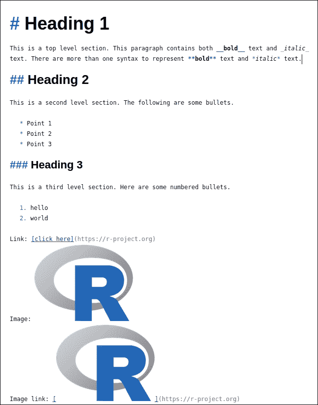

此外，还有具有出色功能的在线 Markdown 编辑器。我最喜欢的一个是 StackEdit ([`stackedit.io/`](https://stackedit.io/))。您可以在编辑器中创建一个新的空白文档，并将上面的 Markdown 文本复制进去，然后您就可以看到作为 HTML 页面的即时预览：

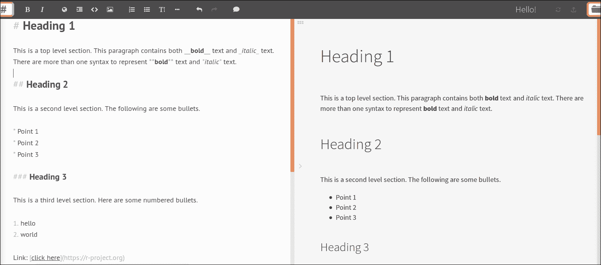

Markdown 在在线讨论中被广泛使用。最大的开源代码托管平台 GitHub ([`github.com`](https://github.com)) 支持使用 Markdown 编写问题，如下面的截图所示：

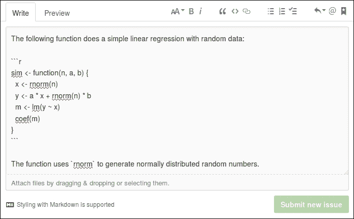

注意，反引号（`` ` ``）用于创建源代码符号，以及三个反引号（```py` ```X ```py`) are used to contain a code block written in language X. Code blocks are shown in fixed-width font which is better for presenting program code. Also, we can preview what we have written so far:

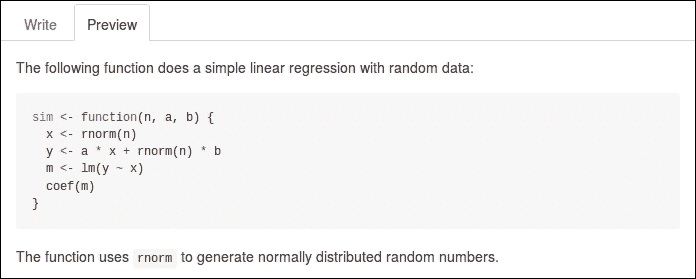

Another special symbol, `$`, is used to quote math formulas. Single dollar (`$`) indicates inline math whereas double dollars (`$$`) displays math (in a new line). The math formula should be written in LaTeX math syntax ([`en.wikibooks.org/wiki/LaTeX/Mathematics`](https://en.wikibooks.org/wiki/LaTeX/Mathematics)).

The following math equation is not that simple: *$$x²+y²=z²$$*, where *$x$*,*$y$*, and *$z$* are integers.

Not all markdown editors support the preview of math formulas. In StackEdit, the preceding markdown is previewed as follows:

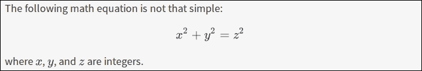

In addition, many markdown renderers support the table syntax shown as follows:

```）

| Sepal.Length | Sepal.Width | Petal.Length | Petal.Width | Species |
| --- | --- | --- | --- | --- |

|------------:|-----------:|------------:|-----------:|:-------|

|          5.1 |         3.5 |          1.4 |         0.2 | setosa  |
| --- | --- | --- | --- | --- |
|          4.9 |         3.0 |          1.4 |         0.2 | setosa  |
|          4.7 |         3.2 |          1.3 |         0.2 | setosa  |
|          4.6 |         3.1 |          1.5 |         0.2 | setosa  |
|          5.0 |         3.6 |          1.4 |         0.2 | setosa  |
|          5.4 |         3.9 |          1.7 |         0.4 | setosa  |

```py

In StackEdit, the preceding text table is rendered as follows:

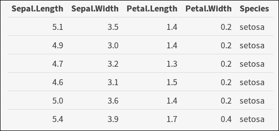

## Integrating R into Markdown

Markdown is easy to write and read, and has most necessary features for writing reports such as simple text formatting, embedding images, links, tables, quotes, math formula, and code blocks.

Although writing plain texts in markdown is easy, creating reports with many images and tables is not, especially when the images and tables are produced dynamically by code. R Markdown is the killer app that integrates R into markdown.

More specifically, the markdowns we showed earlier in this chapter are all static documents; that is, they were determined when we wrote them. However, R Markdown is a combination of R code and markdown texts. The output of R code can be text, table, images, and interactive widgets. It can be rendered as an HTML web page, a PDF document, and even a Word document. Visit [`rmarkdown.rstudio.com/formats.html`](http://rmarkdown.rstudio.com/formats.html) to learn more about supported formats.

To create an R Markdown document, click the menu item, as shown in the following screenshot:

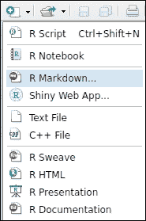

If you don't have `rmarkdown` and `knitr` installed, RStudio will install these necessary packages automatically. Then you can write a title and author and choose a default output format, as shown in the following screenshot:

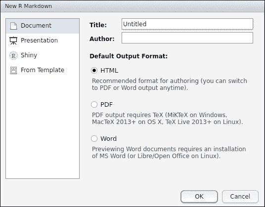

Then a new R Markdown document will be created. The new document is not empty but a demo document that shows the basics of writing texts and embedding R code which produces images. In the template document, we can see some code chunks like:

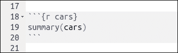

The preceding chunk evaluates `summary(cars)` and will produce some text output:

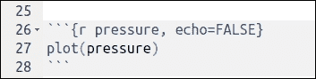

The preceding chunk evaluates `plot(pressure)` and will produce an image. Note that we can specify options for each chunk in the form of `{r [chunk_name], [options]}` where `[chunk_name]` is optional and is used to name the produced image and `[options]` is optional and may specify whether the code should appear in the output document, the width and height of the produced graphics, and so on. To find more options, visit [`yihui.name/knitr/options/`](http://yihui.name/knitr/options/).

To render the document, just click on the **Knit** button:

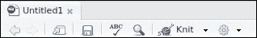

When the document is properly saved to disk, RStudio will call functions to render the document into a web page. More specifically, the document is rendered in two steps:

1.  The `knitr` module runs the code of each chunk and places the code and output according to the chunk options so that `Rmd` is fully rendered as a static markdown document.
2.  The `pandoc` module renders the resulted markdown document as HTML, PDF, or DOCX according to the `Rmd` options specified in file header.

As we are editing an R Markdown document in RStudio, we can choose which format to produce anytime and then it will automatically call the `knitr` module to render the document into markdown and then run the `pandoc` module with the proper arguments to produce a document in that format. This can also be done with code using functions provided by `knitr` and `rmarkdown` modules.

In the new document dialog, we can also choose presentation and create slides using R Markdown. Since writing documents and writing slides are similar, we won't go into detail on this topic.

## Embedding tables and charts

Without R code chunks, R Markdown is no different from a plain markdown document. With code chunks, the output of code is embedded into the document so that the final content is dynamic. If a code chunk uses a random number generator without fixing the random seed, each time we knit the document we will get different results.

By default, the output of a code chunk is put directly beneath the code in fixed-width font starting with `##` as if the code is run in the console. This form of output works but is not always satisfactory, especially when we want to present the data in more straightforward forms.

### Embedding tables

When writing a report, we often need to put tables within the contents. In an R Markdown document, we can directly evaluate a `data.frame` variable. Suppose we have the following `data.frame`:

```

toys <- data.frame(

id = 1:3,

name = c("Car", "Plane", "Motocycle"),

price = c(15, 25, 14),

share = c(0.3, 0.1, 0.2),

stringsAsFactors = FALSE

)

```py

To output the variable in plain text, we only need to type the variable name in a code chunk:

```

toys

## id      name price share

## 1  1       Car    15   0.3

## 2  2     Plane    25   0.1

## 3  3 Motocycle    14   0.2

```py

Note that HTML, PDF, and Word documents all support native tables. To produce a native table for the chosen format, we can use `knitr::kable()` to produce the markdown representation of the table just like the following:

```

| id|name      | price| share|

|--:|:---------|-----:|-----:|

|  1|Car       |    15|   0.3|

|  2|Plane     |    25|   0.1|

|  3|Motocycle |    14|   0.2|

```py

When `pandoc` renders the resulted markdown document to other formats, it will produce a native table from the markdown representation:

```

knitr::kable(toys)

```py

The table generated native table is shown as follows:

| **id** | **name** | **price** | **share** |
| 1 | Car | 15 | 0.3 |
| 2 | Plane | 25 | 0.1 |
| 3 | Motocycle | 14 | 0.2 |

There are other packages that produce native tables but with enhanced features. For example, the `xtable` package not only supports converting `data.frame` to LaTeX, it also provides pre-defined templates to present the results of a number of statistical models.

```

xtable::xtable(lm(mpg ~ cyl + vs, data = mtcars))

```py

When the preceding code is knitted with the `results='asis'` option, the linear model will be shown as the following table in the output PDF document:

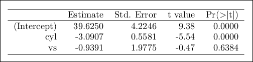

The most well-known data software is perhaps Microsoft Excel. A very interesting feature of Excel is conditional formatting. To implement such features in R, I developed `formattable` package. To install, run `install.packages("formattable")`. It enables cell formatting in a data frame to exhibit more comparative information:

```

library(formattable)

formattable(toys,

list(price = color_bar("lightpink"), share = percent))

```py

The generated table is shown as follows:

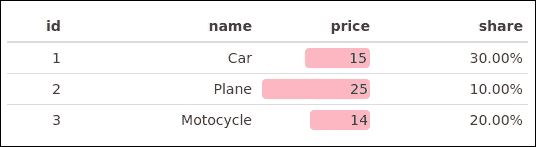

Sometimes, the data has many rows, which makes embedding such a table into the document not a good idea. But JavaScript libraries such as DataTables ([`datatables.net/`](https://datatables.net/)) make it easier to embed large data sets in a web page because it automatically performs paging and also supports search and filtering. Since an R Markdown document can be rendered into an HTML web page, it is natural to leverage the JavaScript package. An R package called DT ([`rstudio.github.io/DT/`](http://rstudio.github.io/DT/)) ports DataTables to R data frames and we can easily put a large data set into a document to let the reader explore and inspect the data in detail:

```

library(DT)

datatable(mtcars)

```py

The generated table is shown as follows:

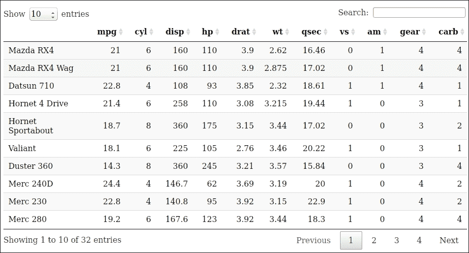

The preceding packages, `formattable` and `DT` are two examples of a wide range of HTML widgets ([`www.htmlwidgets.org/`](http://www.htmlwidgets.org/)). Many of them are adapted from popular JavaScript libraries since there are already a good number of high quality JavaScript libraries in the community.

### Embedding charts and diagrams

Embedding charts is as easy as embedding tables as we demonstrated. If a code chunk produces a plot, `knitr` will save the image to a file with the name of the code chunk and write `name` below the code so that when `pandoc` renders the document the image will be found and inserted to the right place:

```

set.seed(123)

x <- rnorm(1000)

y <- 2 * x + rnorm(1000)

m <- lm(y ~ x)

plot(x, y, main = "线性回归", col = "darkgray")

abline(coef(m))

```py

The plot generated is shown as follows:

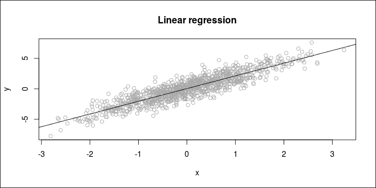

The default image size may not apply to all scenarios. We can specify chunk options `fig.height` and `fig.width` to alter the size of the image.

In addition to creating charts with basic graphics and packages like `ggplot2`, we can also create diagrams and graphs using `DiagrammeR` package. To install the package from CRAN, run `install.packages("DiagrammeR")`.

This package uses Graphviz ([`en.wikipedia.org/wiki/Graphviz`](https://en.wikipedia.org/wiki/Graphviz)) to describe the relations and styling of a diagram. The following code produces a very simple directed graph:

```

library(DiagrammeR)

grViz("

digraph rmarkdown {

A -> B;

B -> C;

C -> A;

}")

```py

The generated graph is shown as follows:

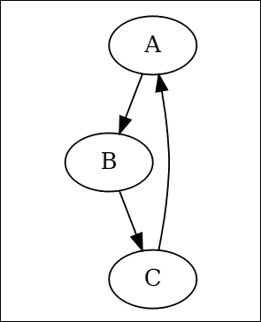

DiagrammeR also provides a more programmable way to construct diagrams. It exports a set of functions to perform operations on a graph. Each function takes a graph and outputs a modified graph. Therefore it is easy to use pipeline to connect all operations to produce a graph in a streamline. For more details, visit the package website at [`rich-iannone.github.io/DiagrammeR`](http://rich-iannone.github.io/DiagrammeR).

### Embedding interactive plots

Previously, we demonstrated both static tables (`knitr::kable`, `xtable`, and `formattable`) and interactive tables (`DT`). Similar things happen to plots too. We can not only place static images in the document as we did in the previous section, but also create dynamic and interactive plots in either the viewer or the output document.

In fact, there are more packages designed to produce interactive graphics than tables. Most of them take advantage of existing JavaScript libraries and make R data structures easier to work with them. In the following code, we introduce some of the most popular packages used to create interactive graphics.

The ggvis ([`ggvis.rstudio.com/`](http://ggvis.rstudio.com/)) developed by RStudio uses Vega ([`vega.github.io/vega/`](https://vega.github.io/vega/)) as its graphics backend:

```

library(ggvis)

mtcars %>%

ggvis(~mpg, ~disp, opacity := 0.6) %>%

layer_points(size := input_slider(1, 100, value = 50, label = "size")) %>%

layer_smooths(span = input_slider(0.5, 1, value = 1, label = "span"))

```py

The plot generated is shown as follows:

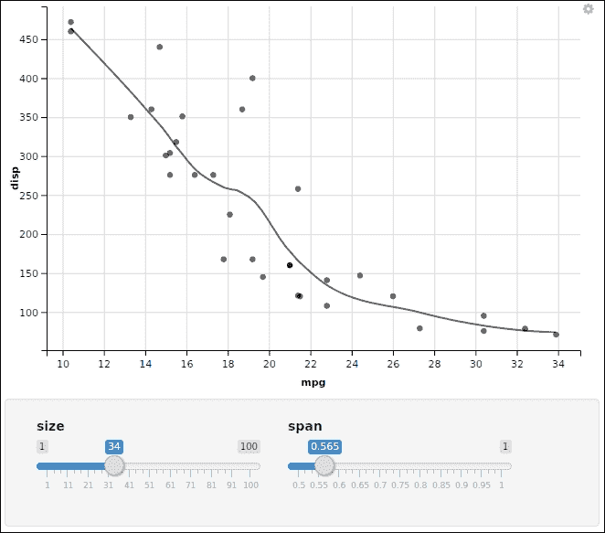

Note that its grammar is a bit like `ggplot2`. It best works with a pipeline operator.

Another package is called `dygraphs` ([`rstudio.github.io/dygraphs/`](https://rstudio.github.io/dygraphs/)) which uses the JavaScript library ([`dygraphs.com/`](http://dygraphs.com/)) of the same name. This package specializes in plotting time series data with interactive capabilities.

In the following example, we use the temperature data of airports provided in the `nycflights13` package. To plot the daily temperature time series of each airport present in the data, we need to summarize the data by computing the mean temperature on each day, reshape the long-format data to wide-format, and convert the results to an `xts` time series object with a date index and temperature columns corresponding to each airport:

```

library(dygraphs)

library(xts)

library(dplyr)

library(reshape2)

data(weather, package = "nycflights13")

temp <- weather %>%

group_by(origin, year, month, day) %>%

summarize(temp = mean(temp)) %>%

ungroup() %>%

mutate(date = as.Date(sprintf("%d-%02d-%02d",

    year, month, day))) %>%

select(origin, date, temp) %>%

dcast(date ~ origin, value.var = "temp")

temp_xts <- as.xts(temp[-1], order.by = temp[[1]])

head(temp_xts)

## EWR     JFK      LGA

## 2013-01-01 38.4800 38.8713 39.23913

## 2013-01-02 28.8350 28.5425 28.72250

## 2013-01-03 29.4575 29.7725 29.70500

## 2013-01-04 33.4775 34.0325 35.26250

## 2013-01-05 36.7325 36.8975 37.73750

## 2013-01-06 37.9700 37.4525 39.70250

```py

Then we supply `temp_xts` to `dygraph()` to create an interactive time series plot with a range selector and dynamic highlighting:

```

dygraph(temp_xts, main = "机场温度") %>%

dyRangeSelector() %>%

dyHighlight(highlightCircleSize = 3,

    highlightSeriesBackgroundAlpha = 0.3,

    hideOnMouseOut = FALSE)

```py

The plot generated is shown as follows:

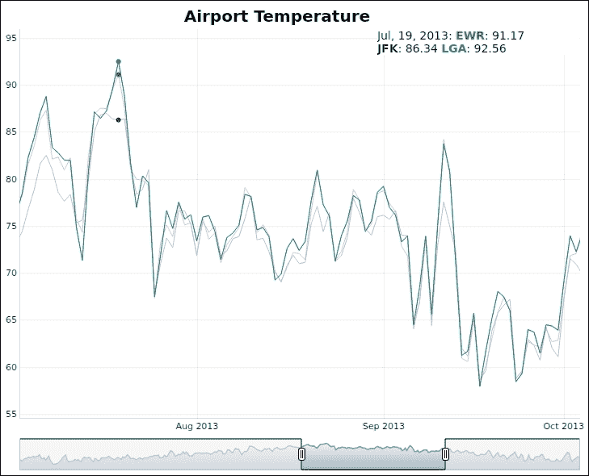

If the code is run in R terminal, the web browser will launch and show a web page containing the plot. If the code is run in RStudio, the plot will show up in the **Viewer** pane. If the code is a chunk in R Markdown document, the plot will be embedded into the rendered document.

The main advantage of interactive graphics over static plots is that interactivity allows users to further examine and explore the data rather than forcing users to view it from a fixed perspective.

There are other remarkable packages of interactive graphics. For example, `plotly` ([`plot.ly/r/`](https://plot.ly/r/)) and `highcharter` ([`jkunst.com/highcharter/`](http://jkunst.com/highcharter/)) are nice packages to produce a wide range of interactive plots based on JavaScript backends.

In addition to the features we demonstrated in the previous sections, R Markdown can also be used to create presentation slides, journal articles, books and websites. Visit the official website at [`rmarkdown.rstudio.com`](http://rmarkdown.rstudio.com) to learn more.

# Creating interactive apps

In the previous section, we demonstrated the use of R Markdown that is designed for creating dynamic documents. In this section, we will take a quick tour of creating interactive apps where we use a graphical user interface to interact with the data.

## Creating a shiny app

R itself is a great environment for data analysis and visualization. However, it is not usual to deliver R and some analytic scripts to the customers to run by themselves. The outcome of data analysis can be presented not only in a HTML page, PDF document, or a Word document, but also in an interactive app that allows readers to interact with the data by modifying some parameters and see what happens with the outcome.

A powerful package, `shiny` ([`shiny.rstudio.com/`](http://shiny.rstudio.com/)), developed by RStudio, is designed exactly for this purpose. A shiny app is different from the interactive graphics we demonstrated previously. It works in a web browser and the developer has all the say about what appears in the web page and how users can interact with it. To achieve this, a shiny app basically consists of two important parts: An HTTP server that interacts with the web browser, and an R session that interacts with the HTTP server.

The following is a minimal shiny app. We write an R script to define its user interface (`ui`) and `server` logic. The user interface is a `boostrapPage` which contains a `numericInput` to take an integer of sample size and a `textOutput` to show the mean of the randomly generated sample. The logic behind `server` is to simply generate random numbers according to the sample size (`n`) in the `input` and put the mean of the random sample to the `output`:

```

library(shiny)

ui <- bootstrapPage(

numericInput("n", label = "Sample size", value = 10, min = 10, max = 100),

textOutput("mean")

)

server <- function(input, output) {

output$mean <- renderText(mean(rnorm(input$n)))

}

app <- shinyApp(ui, server)

runApp(app)

```py

The definition is now complete and we can source the code in RStudio to play with this minimal shiny app, as shown in the following screenshot:

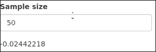

Each time we change the number of the sample size, the HTTP server will ask the R backend to rerun the server logic and refresh the output mean.

Although the preceding example is not useful, it at least demonstrates the basic components of a shiny app. Now we look at a more complicated but useful example.

The following example is a visualizer of many paths generated by geometric Brownian motion which is often used to model stock prices. As we know, a geometric Brownian motion is characterized by starting value, expected growth rate (`r`), volatility (`sigma`), duration (`T`) and the number of `periods`. Expect for `T = 1`, we allow users to modify all other parameters.

Now we can define the user interface of the shiny app according to the parameters we want to expose to users. The `shiny` package provides a rich set of input controls listed as follows:

```

shiny_vars <- ls(getNamespace("shiny"))

shiny_vars[grep("Input$", shiny_vars)]

## [1] "checkboxGroupInput"       "checkboxInput"

## [3] "dateInput"                "dateRangeInput"

## [5] "fileInput"                "numericInput"

## [7] "passwordInput"            "selectInput"

## [9] "selectizeInput"           "sliderInput"

## [11] "textInput"                "updateCheckboxGroupInput"

## [13] "updateCheckboxInput"      "updateDateInput"

## [15] "updateDateRangeInput"     "updateNumericInput"

## [17] "updateSelectInput"        "updateSelectizeInput"

## [19] "updateSliderInput"        "updateTextInput"

```py

To control the randomness of the generated paths, we allow users to specify the random seed (`seed`) so that the same seed produces the same paths. In the following code where `ui` is defined, we use `numericInput` for `seed` and `sliderInput` for other parameters. The `sliderInput` control has a certain range and step so that we can force a parameter to take reasonable values.

The user interface not only defines the input part but also the output part, that is, where to show what. The following is all output types shiny provides:

```

shiny_vars[grep("Output$", shiny_vars)]

## [1] "dataTableOutput"    "htmlOutput"

## [3] "imageOutput"        "plotOutput"

## [5] "tableOutput"        "textOutput"

## [7] "uiOutput"           "verbatimTextOutput"

```py

In this example, the shiny app only shows a plot of all paths put together to indicate different possibilities with the same set of parameters:

```

library(shiny)

ui <- fluidPage(

titlePanel("Random walk"),

sidebarLayout(

    sidebarPanel(

    numericInput("seed", "Random seed", 123),

    sliderInput("paths", "Paths", 1, 100, 1),

    sliderInput("start", "Starting value", 1, 10, 1, 1),

    sliderInput("r", "Expected return", -0.1, 0.1, 0, 0.001),

    sliderInput("sigma", "Sigma", 0.001, 1, 0.01, 0.001),

    sliderInput("periods", "Periods", 10, 1000, 200, 10)),

mainPanel(

    plotOutput("plot", width = "100%", height = "600px")

))

)

```py

Once the user interface is defined, we need to implement the server logic which is basically about generating random paths according to user-specified parameters and put them together in the same plot.

The following code is a simple implementation of the server logic. First we set the random seed. Then we iteratively call `sde::GBM` to generate random paths from geometric Brownian motion. To install the package, run `install.packages("sde")` before calling `GBM`:

The `GBM` package is responsible for generating one path while `sapply` is used to combine all generated paths into a matrix (`mat`) where each column represents a path. Finally, we use `matplot` to plot each path in different colors together in one chart.

The calculation is done in `render*` functions no matter whether it is a text, image, or a table. The following lists all the render functions shiny provides:

```

shiny_vars[grep("^render", shiny_vars)]

## [1] "renderDataTable" "renderImage"     "renderPage"

## [4] "renderPlot"      "renderPrint"     "renderReactLog"

## [7] "renderTable"     "renderText"      "renderUI"

```py

In this example, we only need `renderPlot()` and to put the plotting code in it. The `output$plot` function will go to `plotOutput("plot")` in the user interface when the input is modified:

```

server <- function(input, output) {

output$plot <- renderPlot({

    set.seed(input$seed)

    mat <- sapply(seq_len(input$paths), function(i) {

    sde::GBM(input$start,

        input$r, input$sigma, 1, input$periods)

    })

    matplot(mat, type = "l", lty = 1,

    main = "Geometric Brownian motions")

})

}

```py

Now both user interface and server logic are ready. We can combine them together to create a shiny app and run it in the web browser.

```

app <- shinyApp(ui, server)

runApp(app)

```py

When the parameters are modified, the plot will be refreshed automatically:

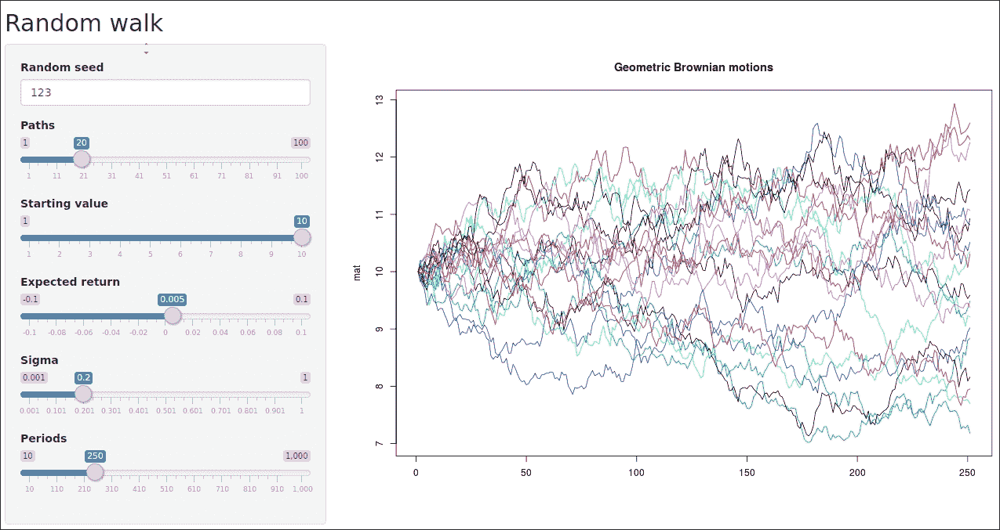

If we set a significantly positive annualized expected return, the generated paths will tend to grow more than decline:

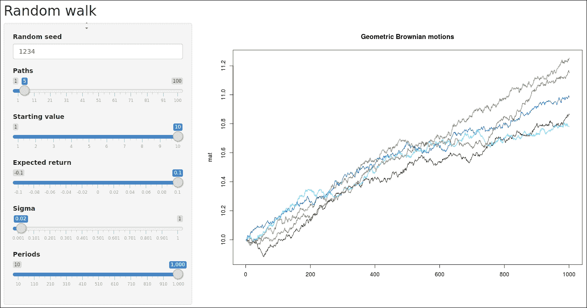

## Using shinydashboard

In addition to the functions `shiny` provides, RStudio also develops `shinydashboard` ([`rstudio.github.io/shinydashboard/`](http://rstudio.github.io/shinydashboard/)) which is specialized in presenting data for overview or monitoring purposes.

The following example demonstrates how easy it is to create a simple dashboard to show the most popular R packages on CRAN with the most downloads in weekly and monthly time scale.

The data source is provided by `cranlogs` ([`cranlogs.r-pkg.org`](http://cranlogs.r-pkg.org)). First run the following code to install the packages we need:

```

install_packages(c("shinydashboard", "cranlogs"))

```py

Then we take a quick view of the data source of CRAN downloads:

```

library(cranlogs)

cran_top_downloads()

## No encoding supplied: defaulting to UTF-8\.

## rank  package count       from         to

## 1     1     Rcpp  9682 2016-08-18 2016-08-18

## 2     2   digest  8937 2016-08-18 2016-08-18

## 3     3  ggplot2  8269 2016-08-18 2016-08-18

## 4     4     plyr  7816 2016-08-18 2016-08-18

## 5     5  stringi  7471 2016-08-18 2016-08-18

## 6     6  stringr  7242 2016-08-18 2016-08-18

## 7     7 jsonlite  7100 2016-08-18 2016-08-18

## 8     8 magrittr  6824 2016-08-18 2016-08-18

## 9     9   scales  6397 2016-08-18 2016-08-18

## 10   10     curl  6383 2016-08-18 2016-08-18

cran_top_downloads("last-week")

## No encoding supplied: defaulting to UTF-8\.

## rank  package count       from         to

## 1     1     Rcpp 50505 2016-08-12 2016-08-18

## 2     2   digest 46086 2016-08-12 2016-08-18

## 3     3  ggplot2 39808 2016-08-12 2016-08-18

## 4     4     plyr 38593 2016-08-12 2016-08-18

## 5     5 jsonlite 36984 2016-08-12 2016-08-18

## 6     6  stringi 36271 2016-08-12 2016-08-18

## 7     7  stringr 34800 2016-08-12 2016-08-18

## 8     8     curl 33739 2016-08-12 2016-08-18

## 9     9      DBI 33595 2016-08-12 2016-08-18

## 10   10 magrittr 32880 2016-08-12 2016-08-18

```py

After getting familiar with the form of data we want to present in the dashboard, we can now think about constructing the dashboard in exactly the same way as constructing a typical shiny app. To make the most of `shinydashboard`, it is better to go through [`rstudio.github.io/shinydashboard/structure.html`](http://rstudio.github.io/shinydashboard/structure.html) to get a general idea of the nice components it provides.

Similarly to shiny app, we start by creating the user interface. This time, we use `dashboardPage`, `dashboardSidebar` and `dashboardBody`. In the dashboard, we want to present the package download dynamics and tables of the most popular packages with top downloads in both monthly and weekly scales.

We put the menu of monthly and weekly in the side bar so users can choose which to see. In each tab page, we can put plots and tables together. In this example, we use `formattable` to add color bars on the download column to make the numbers more comparable and straightforward.

```

library(shiny)

library(shinydashboard)

library(formattable)

library(cranlogs)

ui <- dashboardPage(

dashboardHeader(title = "CRAN Downloads"),

dashboardSidebar(sidebarMenu(

    menuItem("Last week",

    tabName = "last_week", icon = icon("list")),

    menuItem("Last month",

    tabName = "last_month", icon = icon("list"))

)),

dashboardBody(tabItems(

    tabItem(tabName = "last_week",

    fluidRow(tabBox(title = "Total downloads",

        tabPanel("Total", formattableOutput("last_week_table"))),

        tabBox(title = "Top downloads",

        tabPanel("Top", formattableOutput("last_week_top_table"))))),

    tabItem(tabName = "last_month",

    fluidRow(tabBox(title = "Total downloads",

        tabPanel("Total", plotOutput("last_month_barplot"))),

        tabBox(title = "Top downloads",

        tabPanel("Top", formattableOutput("last_month_top_table"))))),

))

)

```py

Note that `plotOutput` is provided by `shiny` while `formattableOutput` is provided by `formattable` package. In fact, developers can create all kinds of HTML widgets that can be embedded into a shiny app as long as the package properly defines the `render*` function and `*Output` function to produce the correct HTML code.

Then we define the server logic. Since the output relies purely on the data source, we download the data before calling `formattable` and `plot`.

```

server <- function(input, output) {

output$last_week_table <- renderFormattable({

    data <- cran_downloads(when = "last-week")

    formattable(data, list(count = color_bar("lightblue")))

})

output$last_week_top_table <- renderFormattable({

    data <- cran_top_downloads("last-week")

    formattable(data, list(count = color_bar("lightblue"),

    package = formatter("span",

        style = "font-family: monospace;")))

})

output$last_month_barplot <- renderPlot({

    data <- subset(cran_downloads(when = "last-month"),

    count > 0)

    with(data, barplot(count, names.arg = date),

    main = "Last month downloads")

})

output$last_month_top_table <- renderFormattable({

    data <- cran_top_downloads("last-month")

    formattable(data, list(count = color_bar("lightblue"),

    package = formatter("span",

        style = "font-family: monospace;")))

})

}

```py

In fact, if the data is updating, we can create a dynamic dashboard where the tables and charts periodically refresh. Using `?reactiveTimer` and `?reactive` will be the key to achieve this. Read the documentation for more information.

Both the user interface and the server logic are ready, so we can run the app now:

```

runApp(shinyApp(ui, server))

```

默认情况下，shiny 应用在首次访问时显示第一页。以下是一个截图，展示了**上周**标签页，它由两个`formattable`数据框的标签面板组成：

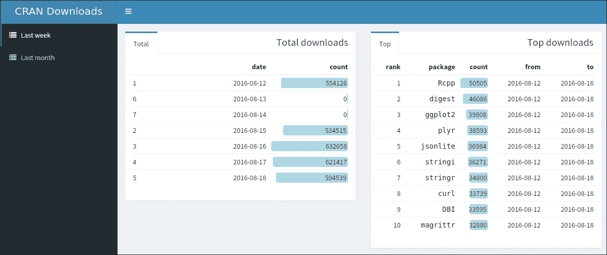

以下截图显示了**上个月**标签页，它由一个直方图和一个`formattable`数据框组成：

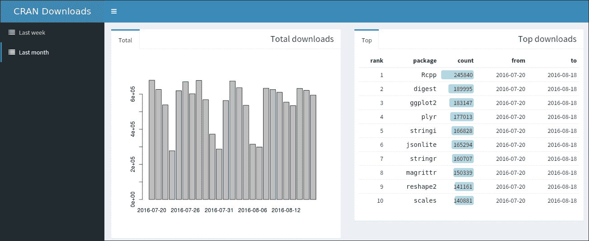

### 注意

要查看更多示例及其背后的代码，请访问[`rstudio.github.io/shinydashboard/examples.html`](http://rstudio.github.io/shinydashboard/examples.html)。

# 摘要

在本章中，我们展示了如何使用 R Markdown 生成动态文档，其中可以轻松嵌入表格、图形和交互式图表。然后我们看到了几个简单的 shiny 应用示例，这些应用基本上是基于 R 后端的网络交互式应用。有了这些强大的生产力工具，数据分析可以变得更加有趣和充满乐趣，因为结果可以通过一种优雅、交互的方式展示出来，这通常更有利于传达更多信息、获得更多见解和做出更好的决策。

现在我们已经完成了这本书。我们通过熟悉基本概念、数据结构和语言构造与特性来开始学习 R。我们通过一系列的例子来理解这些是如何满足实际数据分析需求的。为了对 R 编程语言和数据结构的行为有一个具体和一致的理解，我们讨论了几个高级主题，例如 R 的评估模型、元编程和面向对象系统。在上述知识的基础上，我们进一步探索了一系列更实用的主题，例如与数据库工作、数据操作技术、高性能计算、网络爬虫技术、动态文档和交互式应用。

本书涵盖了各种主题，以拓宽对 R 及其扩展包可能性的视野。现在你应该感到更有能力，并且在使用 R 解决数据分析问题时更有信心。更重要的是，我希望这本书能帮助你更好地处理数据，并在可视化、专业统计建模和机器学习等其他有用主题上更进一步。如果你有兴趣深入了解，我强烈推荐你阅读 Hadley Wickham 的《Advanced R》。
