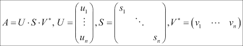

# 第三章。SciPy 线性代数

在本章中，我们将通过有意义的示例继续探索 SciPy 的不同模块。我们将从使用线性代数模块`linalg`和`sparse`处理矩阵（无论是正常还是稀疏）开始。请注意，`linalg`扩展了同名的 NumPy 模块。

这门数学学科研究向量空间及其之间的线性映射。矩阵以这种方式代表该领域的对象，通过在表示矩阵上执行适当的操作，可以获取底层对象的任何属性。在本章中，我们假设您至少熟悉线性代学的基础知识，特别是矩阵乘法、求矩阵的行列式和逆矩阵以及它们在**向量微积分**中的直接应用。

因此，在本章中，我们将探讨 Numpy/SciPy 中如何处理向量和矩阵，如何创建它们，如何编程它们之间的标准数学运算，以及如何在函数形式上表示这些运算。接下来，我们将解决以矩阵形式表示的线性方程组，涉及稠密或稀疏矩阵。相应的 IPython Notebook 将帮助您测试涉及模块的功能，并根据您的具体需求修改每个示例。

# 向量创建

如同第二章中提到的，*作为 SciPy 入门的 NumPy 数组处理*，SciPy 依赖于 NumPy 的主要对象`ndarray`数据结构。您可以将一维数组视为向量，反之亦然（n 维空间中的有向点）。因此，可以通过 Numpy 创建一个向量如下所示：

```py
>>> import numpy
>>> vectorA = numpy.array([1,2,3,4,5,6,7])
>>> vectorA

```

输出如下所示：

```py
array([1, 2, 3, 4, 5, 6, 7])

```

我们也可以使用已经定义的数组来创建一个新的候选者。前一章中已经提供了几个例子。这里我们可以将已经创建的向量反转并分配给一个新的向量：

```py
>>> vectorB = vectorA[::-1].copy()
>>> vectorB

```

输出如下所示：

```py
array([7, 6, 5, 4, 3, 2, 1])

```

注意，在这个例子中，我们必须复制`vectorA`元素的逆序并将其分配给`vectorB`。这样，通过改变`vectorB`的元素，`vectorA`的元素保持不变，如下所示：

```py
>>> vectorB[0]=123
>>> vectorB

```

输出如下所示：

```py
array([123,   6,   5,   4,   3,   2,   1])

```

让我们看看`vectorA`：

```py
>>> vectorA

```

输出如下所示：

```py
array([1, 2, 3, 4, 5, 6, 7])

```

让我们通过反转其元素并将结果分配给`vectorB`来复制`vectorA`：

```py
>>> vectorB = vectorA[::-1].copy()
>>> vectorB

```

输出如下所示：

```py
array([7, 6, 5, 4, 3, 2, 1])

```

在最后的代码语句中，我们重复了之前的赋值给`vectorB`的操作，使其再次回到其初始值，即`vectorA`的逆序。

# 向量运算

除了是线性代数中研究的数学实体外，向量在物理学和工程学中被广泛用作表示物理量（如**位移**、**速度**、**加速度**、力等）的便捷方式。因此，向量之间的基本运算可以通过 Numpy/SciPy 操作如下进行：

## 加法/减法

向量的加法/减法不需要任何显式的循环来执行。让我们看看两个向量的加法：

```py
>>> vectorC = vectorA + vectorB
>>> vectorC

```

输出如下所示：

```py
array([8, 8, 8, 8, 8, 8, 8])

```

进一步，我们对两个向量进行减法操作：

```py
>>> vectorD = vectorB - vectorA
>>> vectorD

```

输出如下所示：

```py
array([ 6,  4,  2,  0, -2, -4, -6])

```

## 标量/点积

Numpy 有一个内置函数`dot`，用于计算两个向量之间的标量（`dot`）积。我们展示了如何使用它来计算前一个代码片段中`vectorA`和`vectorB`的`dot`积：

```py
>>> dotProduct1 = numpy.dot(vectorA,vectorB)
>>> dotProduct1

```

输出如下所示：

```py
84

```

或者，为了计算这个乘积，我们可以执行向量的各分量之间的逐元素乘积，然后将相应的结果相加。这已在以下代码行中实现：

```py
>>> dotProduct2 = (vectorA*vectorB).sum()
>>> dotProduct2

```

输出如下所示：

```py
84

```

## 交叉/向量积 – 在三维空间向量上

首先，在应用 NumPy 的内置函数计算向量的叉积之前，创建了三个维度的两个向量：

```py
>>> vectorA = numpy.array([5, 6, 7])
>>> vectorB = numpy.array([7, 6, 5])
>>> crossProduct = numpy.cross(vectorA,vectorB)
>>> crossProduct

```

输出如下所示：

```py
array([-12,  24, -12])

```

进一步，我们对`vectorB`在`vectorA`上执行`cross`操作：

```py
>>> crossProduct = numpy.cross(vectorB,vectorA)
>>> crossProduct

```

输出如下所示：

```py
array([ 12, -24,  12])

```

注意到最后一个表达式显示了预期的结果，即`vectorA`与`vectorB`的叉积是`vectorB`与`vectorA`叉积的相反数。

# 创建一个矩阵

在 SciPy 中，任何一维或二维`ndarray`都可以通过`matrix`或`mat`命令获得矩阵结构。完整的语法如下：

```py
numpy.matrix(data=object, dtype=None, copy=True)
```

创建矩阵时，数据可以以`ndarray`、字符串或 Python 列表（如下面的第二个示例）的形式给出，这非常方便。当使用字符串时，分号表示行变化，逗号表示列变化：

```py
>>> A=numpy.matrix("1,2,3;4,5,6")
>>> A

```

输出如下所示：

```py
matrix([[1, 2, 3],
 [4, 5, 6]])

```

让我们来看另一个例子：

```py
>>> A=numpy.matrix([[1,2,3],[4,5,6]])
>>> A

```

输出如下所示：

```py
matrix([[1, 2, 3],
 [4, 5, 6]])

```

从一个二维数组创建矩阵的另一种技术是将矩阵结构强加到新对象上，通过`asmatrix`例程复制前者的数据。

一个矩阵被称为稀疏矩阵 ([`en.wikipedia.org/wiki/Sparse_matrix`](http://en.wikipedia.org/wiki/Sparse_matrix))，如果其大多数条目都是零。以通常的方式输入这样的矩阵是浪费内存的，尤其是如果维度很大。SciPy 提供了不同的程序来有效地在内存中存储这样的矩阵。SciPy 中的 `scipy.sparse` 模块考虑了大多数输入稀疏矩阵的常规方法作为例程。其中一些方法包括 **块稀疏行** (`bsr_matrix`)，**坐标格式** (`coo_matrix`)，压缩稀疏列或行 (`csc_matrix`，`csr_matrix`)，具有对角存储的稀疏矩阵 (`dia_matrix`)，基于 **键排序** 的字典 (`dok_matrix`)，以及 **基于行的链表** (`lil_matrix`)。

在这个阶段，我们想介绍其中之一：坐标格式。在这个格式中，给定一个稀疏矩阵 `A`，我们识别非零元素的位置，比如说有 *n* 个，然后我们创建两个 n 维的 `ndarray` 数组，包含这些条目的列和行，以及一个包含相应条目值的第三个 `ndarray`。例如，注意以下稀疏矩阵：


创建此类矩阵的标准形式如下：

```py
>>> A=numpy.matrix([ [0,10,0,0,0], [0,0,20,0,0], [0,0,0,30,0], [0,0,0,0,40], [0,0,0,0,0] ])
>>> A

```

输出如下所示：

```py
matrix([[ 0, 10,  0,  0,  0],
 [ 0,  0, 20,  0,  0],
 [ 0,  0,  0, 30,  0],
 [ 0,  0,  0,  0, 40],
 [ 0,  0,  0,  0,  0]])

```

创建这些矩阵的一种更节省内存的方法是正确存储非零元素。在这种情况下，一个非零条目位于第 1 行第 2 列（或 Python 中的位置 `(0, 1)`），值为 `10`。另一个非零条目位于 `(1, 2)`，值为 `20`。第三个非零条目，值为 `30`，位于 `(2, 3)`。`A` 的最后一个非零条目位于 `(3, 4)`，值为 `40`。

然后，我们有行 `ndarray`，列 `ndarray`，以及另一个值 `ndarray`：

```py
>>> import numpy
>>> rows=numpy.array([0,1,2,3])
>>> cols=numpy.array([1,2,3,4])
>>> vals=numpy.array([10,20,30,40])

```

我们如下创建矩阵 `A`：

```py
>>> import scipy.sparse
>>> A=scipy.sparse.coo_matrix( (vals,(rows,cols)) )
>>> print (A); print (A.todense())

```

输出如下所示：

```py
 (0, 1)  10
 (1, 2)  20
 (2, 3)  30
 (3, 4)  40
[[  0\.  10   0\.   0\.   0.]
 [  0\.   0\.  20   0\.   0.]
 [  0\.   0\.   0\.  30   0.]
 [  0\.   0\.   0\.   0\.  40]]

```

注意 `todense` 方法如何将稀疏矩阵转换为全矩阵。还请注意，它消除了最后一个非零元素之后的任何全零行或列。

与每种输入方法相关联，我们都有识别每种类型稀疏矩阵的函数。例如，如果我们怀疑 `A` 是 `coo_matrix` 格式的稀疏矩阵，我们可以使用以下命令：

```py
>>> scipy.sparse.isspmatrix_coo(A)

```

输出如下所示：

```py
True

```

所有数组例程都转换为矩阵，只要输入是矩阵。这对于矩阵创建非常方便，尤其是在堆叠命令（`hstack`，`vstack`，`tile`）的帮助下。除此之外，矩阵还有一个令人惊叹的堆叠命令，`bmat`。这个例程允许通过字符串堆叠矩阵，利用以下约定：分号用于行变化，逗号用于列变化。它还允许在字符串内部评估矩阵名称。以下示例很有启发性：

```py
>>> B=numpy.mat(numpy.ones((3,3)))
>>> W=numpy.mat(numpy.zeros((3,3)))
>>> print (numpy.bmat('B,W;W,B'))

```

输出如下所示：

```py
[[ 1\.  1\.  1\.  0\.  0\.  0.]
 [ 1\.  1\.  1\.  0\.  0\.  0.]
 [ 1\.  1\.  1\.  0\.  0\.  0.]
 [ 0\.  0\.  0\.  1\.  1\.  1.]
 [ 0\.  0\.  0\.  1\.  1\.  1.]
 [ 0\.  0\.  0\.  1\.  1\.  1.]]

```

数组和矩阵之间的主要区别在于相同类型两个对象的乘积行为。例如，两个数组之间的乘法意味着*两个数组条目的逐元素乘法*，并且需要具有相同形状的两个对象。以下是一个两个数组乘法示例的代码片段：

```py
>>> a=numpy.array([[1,2],[3,4]])
>>> a*a

```

输出如下所示：

```py
array([[ 1,  4],
 [ 9, 16]])

```

另一方面，矩阵乘法需要一个形状为(*m*，*n*)的第一个矩阵和一个形状为(*n*，*p*)的第二个矩阵——第一个矩阵的列数必须与第二个矩阵的行数相同。这个操作会提供一个形状为(*m*，*p*)的新矩阵，如下面的图所示：


以下是一个代码片段：

```py
>>> A=numpy.mat(a)
>>> A*A

```

输出如下所示：

```py
matrix([[ 7, 10],
 [15, 22]])

```

或者，为了获得两个符合规范的矩阵作为`ndarray`对象的矩阵乘积，如果不需要，我们实际上不需要将`ndarray`对象转换为矩阵对象。矩阵乘积可以通过本章*标量/点积*部分中介绍过的`numpy.dot`函数直接获得。让我们看看以下`numpy.dot`命令的示例：

```py
>>> b=numpy.array([[1,2,3],[3,4,5]])
>>> numpy.dot(a,b)

```

输出如下所示：

```py
array([[ 7, 10, 13],
 [15, 22, 29]])

```

如果我们想要对两个矩阵的元素进行逐元素乘法，我们可以使用多功能的`numpy.multiply`命令，如下所示：

```py
>>> numpy.multiply(A,A)

```

输出如下所示：

```py
matrix([[ 1,  4],
 [ 9, 16]])

```

数组和矩阵之间另一个值得注意的区别在于它们的形状。虽然我们允许数组有一个维度；它们对应的矩阵必须至少有两个维度。当我们转置任一对象时，这一点非常重要。让我们看看以下实现`shape()`和`transpose()`命令的代码片段：

```py
>>> a=numpy.arange(5); A=numpy.mat(a)
>>> a.shape, A.shape, a.transpose().shape, A.transpose().shape

```

输出如下所示：

```py
((5,), (1, 5), (5,), (5, 1))

```

如前所示，SciPy 提供了相当多的基本工具来实例化和操作矩阵，还有许多相关的方法可以继续使用。这也允许我们在使用特殊矩阵的情况下加快计算速度。

`scipy.linalg`模块提供了创建特殊矩阵的命令，例如从提供的数组创建块对角矩阵（`block_diag`）、**循环矩阵**（circulant）、伴随矩阵（`companion`）、**Hadamard 矩阵**（`hadamard`）、**Hankel 矩阵**（`hankel`）、**Hilbert**和**逆 Hilbert 矩阵**（`hilbert`，`invhilbert`）、**Leslie 矩阵**（`leslie`）、**平方 Pascal 矩阵**（`pascal`）、**Toeplitz 矩阵**（`toeplitz`）、**下三角矩阵**（`tril`）和**上三角矩阵**（`triu`）。

让我们来看一个关于**最优称重**的例子。

假设我们给定 *p* 个物体需要在 *n* 次称重中使用双盘天平进行称重。我们创建一个 *n* x *p* 的矩阵，其中包含加号和减号，其中在 *(i, j)* 位置的正值表示在 *i^(th)* 次称重中，*j^(th)* 物体被放置在天平的左盘上，而负值表示相应的 *j^(th)* 物体在右盘上。

已知最优称重是由哈达玛矩阵的子矩阵设计的。对于设计八个物体的三次称重问题，我们可以探索八阶哈达玛矩阵的三行不同的选择。唯一的要求是矩阵行的元素之和为零（这样每个天平上放置的物体数量相同）。通过切片，我们可以实现这一点：

```py
>>> import scipy.linalg
>>> A=scipy.linalg.hadamard(8)
>>> zero_sum_rows = (numpy.sum(A,0)==0)
>>> B=A[zero_sum_rows,:]
>>> print (B[0:3,:])

```

输出如下所示：

```py
[[ 1 -1  1 -1  1 -1  1 -1]
 [ 1  1 -1 -1  1  1 -1 -1]
 [ 1 -1 -1  1  1 -1 -1  1]]

```

`scipy.sparse` 模块有其自己的一套特殊矩阵。最常见的是对角线上的矩阵（`eye`）、单位矩阵（`identity`）、从对角线生成的矩阵（`diags`, `spdiags`）、从稀疏矩阵生成的分块对角矩阵（`block_diag`）、从稀疏子块生成的矩阵（`bmat`）、按列和按行堆叠的矩阵（`hstack`, `vstack`），以及给定形状和密度的随机矩阵，其值均匀分布（`rand`）。

# 矩阵方法

除了继承所有数组方法外，矩阵还享有四个额外的属性：`T` 用于转置，`H` 用于共轭转置，`I` 用于求逆，以及 `A` 用于转换为 `ndarray`：

```py
>>> A = numpy.matrix("1+1j, 2-1j; 3-1j, 4+1j")
>>> print (A.T); print (A.H)

```

输出如下所示：

```py
[[ 1.+1.j  3.-1.j]
 [ 2.-1.j  4.+1.j]]
[[ 1.-1.j  3.+1.j]
 [ 2.+1.j  4.-1.j]]

```

## 矩阵之间的运算

我们简要介绍了两个矩阵之间最基本的操作；矩阵乘法。对于任何其他类型的乘法，我们求助于 NumPy 库中的基本工具，如：数组或向量的点积（`dot`, `vdot`）、两个数组的内积和外积（`inner`, `outer`）、沿指定轴的**张量点积**（`tensordot`）或两个数组的**克罗内克积**（`kron`）。

让我们看看创建一个**正交**基的例子。

从三维实空间的正交归一基中创建九维实空间的正交归一基。

例如，让我们选择如下图中所示的由向量构成的正交归一基：


我们通过将这些向量收集到一个矩阵中并使用克罗内克积来计算所需的基，如下所示：

```py
>>> import numpy
>>> import scipy.linalg
>>> mu = 1/numpy.sqrt(2)
>>> A = numpy.matrix([[mu,0,mu],[0,1,0],[mu,0,-mu]])
>>> B = scipy.linalg.kron(A,A)

```

之前显示的矩阵 `B` 的列直接给出了一个正交归一基。例如，奇数索引的向量将是以下子矩阵的列：

```py
>>> print (B[:,0:-1:2])

```

输出如下所示：

```py
[[ 0.5  0.5  0\.   0.5]
 [ 0\.   0\.   0\.   0\. ]
 [ 0.5 -0.5  0\.   0.5]
 [ 0\.   0\.   0\.   0\. ]
 [ 0\.   0\.   1\.   0\. ]
 [ 0\.  -0\.   0\.   0\. ]
 [ 0.5  0.5  0\.  -0.5]
 [ 0\.   0\.   0\.  -0\. ]
 [ 0.5 -0.5  0\.  -0.5]]

```

## 矩阵上的函数

`scipy.linalg`模块为矩阵提供了一组有用的函数。对于方阵的基本两个命令是`inv`（矩阵的逆）和`det`（行列式）。方阵的幂由标准的指数运算给出；也就是说，如果`A`是一个方阵，那么`A**2`表示矩阵乘积`A*A`，如下面的代码片段所示：

```py
>>> A=numpy.matrix("1,1j;21,3")
>>> A; A*A; A**2

```

输出如下所示：

```py
matrix([[  1.+0.j,   0.+1.j],
 [ 21.+0.j,   3.+0.j]])
matrix([[  1.+21.j,   0\. +4.j],
 [ 84\. +0.j,   9.+21.j]])
matrix([[  1.+21.j,   0\. +4.j],
 [ 84\. +0.j,   9.+21.j]])

```

应该指出的是，作为一个类型数组，`A*A`（或`A**2`）的乘积是通过平方数组的每个元素来计算的：

```py
>>> numpy.asarray(A); numpy.asarray(A)*numpy.asarray(A); numpy.asarray(A)**2

```

输出如下所示：

```py
array([[  1.+0.j,   0.+1.j],
 [ 21.+0.j,   3.+0.j]])
array([[   1.+0.j,   -1.+0.j],
 [ 441.+0.j,    9.+0.j]])
array([[   1.+0.j,   -1.+0.j],
 [ 441.+0.j,    9.+0.j]])

```

更高级的命令计算依赖于涉及矩阵幂的表达式的幂级数表示的矩阵函数，例如矩阵**指数**（有三种可能性——`expm`、`expm2`和`expm3`），矩阵**对数**（`logm`），矩阵**三角函数**（`cosm`、`sinm`、`tanm`），矩阵**双曲三角函数**（`coshm`、`sinhm`、`tanhm`），**矩阵符号函数**（`signm`），或**矩阵平方根**（`sqrtm`）。

注意矩阵上正常指数函数的应用与矩阵指数函数的结果之间的区别。

在前一种情况下，我们获得矩阵中每个元素的`numpy.exp`应用；在后一种情况下，我们实际上根据幂级数表示计算矩阵的指数：


以下代码片段展示了前面的公式：

```py
>>> import numpy
>>> import scipy.linalg
>>> a=numpy.arange(0,2*numpy.pi,1.6)
>>> A = scipy.linalg.toeplitz(a)
>>> print (A)

```

输出如下所示：

```py
[[ 0\.   1.6  3.2  4.8]
 [ 1.6  0\.   1.6  3.2]
 [ 3.2  1.6  0\.   1.6]
 [ 4.8  3.2  1.6  0\. ]]

```

让我们对`A`执行`exp()`操作：

```py
>>> print (numpy.exp(A))

```

输出如下所示：

```py
[[   1\.            4.95303242   24.5325302   121.51041752]
 [   4.95303242    1\.            4.95303242   24.5325302 ]
 [  24.5325302     4.95303242    1\.            4.95303242]
 [ 121.51041752   24.5325302     4.95303242    1\.        ]]

```

让我们对`A`执行`expm()`操作：

```py
>>> print (scipy.linalg.expm(A))

```

输出如下所示：

```py
[[ 1271.76972856   916.49316549   916.63015271  1271.70874469]
 [  916.49316549   660.86560972   660.5306514    916.63015271]
 [  916.63015271   660.5306514    660.86560972   916.49316549]
 [ 1271.70874469   916.63015271   916.49316549  1271.76972856]]

```

对于稀疏方阵，我们有一个优化的逆函数，以及矩阵指数——`scipy.sparse.linalg.inv`、`scipy.sparse.linalg.expm`。

对于一般矩阵，我们有基本的范数函数（norm），以及两种版本的**Moore-Penrose 伪逆**（`pinv`和`pinv2`）。

再次强调，依赖这些函数而不是手动编码它们的等效表达式是多么重要。例如，注意向量的或矩阵的`norm`计算，`scipy.linalg.norm`。让我们通过以下示例向您展示二维向量`v=numpy.matrix([x,y])`的 2-范数，其中至少一个`x`和`y`的值非常大——大到使得`x*x`溢出：

```py
>>> import numpy
>>> import scipy.linalg
>>> x=10**100; y=9; v=numpy.matrix([x,y])
>>> scipy.linalg.norm(v,2)

```

输出如下所示：

```py
1e+100

```

现在，让我们执行`sqrt()`操作：

```py
>>> numpy.sqrt(x*x+y*y)

```

输出是一个错误，如下所示：

```py
Traceback (most recent call last)
 File "<stdin>", line 1, in <module>
AttributeError: 'long' object has no attribute 'sqrt'

```

## 特征值问题和矩阵分解

在矩阵上广泛使用的一组操作是计算和处理方阵的特征值和特征向量。这两个问题在我们能对方阵进行的复杂操作中排名很高，为此已经进行了大量研究，以获得低复杂度和最优内存资源使用的良好算法。SciPy 提供了实现这些想法的先进代码。

对于特征值的计算，`scipy.linalg`模块提供了三个例程：`eigvals`（用于任何普通或一般特征值问题）、`eigvalsh`（如果矩阵是对称的或复数的**厄米特**矩阵），以及`eigvals_banded`（如果矩阵是带状的）。为了计算特征向量，我们同样有三个相应的选择：`eig`、`eigh`和`eigh_banded`。

所用语法在所有情况下都非常相似。例如，对于特征值的通用情况，我们使用以下代码行，其中矩阵`A`必须是方阵：

```py
eigvals(A, B=None, overwrite_a=False)
```

如果我们希望解决一个普通的特征值问题，那么应该只将这个参数传递给该例程。如果我们想推广这个概念，我们可以提供一个额外的方阵（与矩阵`A`具有相同的维度）。这个方阵通过`B`参数传递。

该模块还提供了一组广泛的函数，用于计算矩阵的不同分解，如下所示：

+   **主元 LU 分解**：此函数允许我们使用`lu`和`lufactor`命令。

+   **奇异值分解**：此函数允许我们使用`svd`命令。为了计算奇异值，我们发出`svdvals`。如果我们想从奇异值组成奇异值分解中的 sigma 矩阵，我们使用`diagsvd`例程。如果我们想使用 SVD 计算矩阵范围的正交基，我们可以使用`orth`命令。

+   **Cholesky 分解**：此函数允许我们使用`cholesky`、`cholesky_banded`和`cho_factor`命令。

+   **QR 和 QZ 分解**：此函数允许我们使用`qr`和`qz`命令。如果我们想将矩阵与分解的矩阵 Q 相乘，我们使用语法糖`qr_multiply`，而不是分两步执行此过程。

+   **Schur 和 Hessenberg 分解**：此函数允许我们使用`schur`和`Hessenberg`命令。如果我们想将实 Schur 形式转换为复数，我们有`rsf2csf`例程。

在这一点上，我们有一个有趣的应用——图像压缩，它利用了之前解释的一些例程。

## 通过奇异值分解进行图像压缩

这是一个非常简单的应用，其中大小为*n* x *n*的方阵图像`A`，存储为`ndarray`被视为矩阵，并且对其执行奇异值分解（SVD）。此操作在以下图中可见：



从`s`的所有奇异值中选择一个分数，以及它们对应的左奇异向量`u`和右奇异向量`v`。我们根据以下图表中给出的公式收集它们来计算一个新的矩阵：


例如，注意原始（512 个奇异值）和仅使用 32 个奇异值进行的近似之间的相似性：

```py
>>> import numpy
>>> import scipy.misc
>>> from scipy.linalg import svd
>>> import matplotlib.pyplot as plt
>>> img=scipy.misc.lena()
>>> U,s,Vh=svd(img)      # Singular Value Decomposition
>>> A = numpy.dot( U[:,0:32],  # use only 32 singular values
 numpy.dot( numpy.diag(s[0:32]),
 Vh[0:32,:]))
>>> plt.subplot(121,aspect='equal'); plt.imshow(img); plt.gray()
>>> plt.subplot(122,aspect='equal'); plt.imshow(A)
>>> plt.show()

```

这产生了以下图像，其中左边的图片是原始图像，右边的图片是使用 32 个奇异值进行的近似：


使用`svd`近似，我们成功将原始图像的 262,144 个系数（512 * 512）压缩到仅有 32,800 个系数（(2 * 32 * 512) + 32），即原始信息的八分之一。

## 求解器

线性代数的一个基本应用是求解大型线性方程组。对于形式为*Ax=b*的基本系统，对于任何方阵`A`和一般矩阵`b`（`A`的行数与列数相同），我们有两种通用的方法来找到*x*（对于密集矩阵使用`solve`，对于稀疏矩阵使用`spsolve`），语法如下：

```py
solve(A, b, sym_pos=False, lower=False, overwrite_a=False, overwrite_b=False, debug=False)
spsolve(A, b[, permc_spec, use_umfpack])
```

在 SciPy 中，有一些求解器比这更复杂，它们在矩阵`A`的结构已知的情况下具有增强的性能。对于密集矩阵，我们在`scipy.linalg`模块中有三个命令：`solve_banded`（用于带状矩阵），`solveh_banded`（如果除了带状，`A`是厄米特矩阵），以及`solve_triangular`（用于三角矩阵）。

当无法找到解（例如，如果`A`是一个奇异矩阵）时，仍然可以找到一个矩阵*x*，它在最小二乘意义上最小化*b-Ax*的`norm`。我们可以使用`lstsq`命令来计算这样一个矩阵，其语法如下：

```py
lstsq(A, b, cond=None, overwrite_a=False, overwrite_b=False)
```

此函数的输出是一个包含以下内容的元组：

+   找到的解（作为`ndarray`）

+   残差的和（作为另一个`ndarray`）

+   矩阵`A`的有效秩

+   矩阵`A`的奇异值（作为另一个`ndarray`）

让我们用一个简单的例子来说明这个例程，以求解以下系统：


以下是一个代码片段：

```py
>>> import numpy
>>> import scipy.linalg
>>> A=numpy.mat(numpy.eye(3,k=1))
>>> print(A)

```

输出如下所示：

```py
[[ 0\.  1\.  0.]
 [ 0\.  0\.  1.]
 [ 0\.  0\.  0.]]

```

让我们进一步进入代码，并在`b`上执行以下操作：

```py
>>> b=numpy.mat(numpy.arange(3) + 1).T
>>> print(b)

```

输出如下所示：

```py
[[1]
 [2]
 [3]]

```

进一步，让我们执行`lstsq`操作：

```py
>>> xinfo=scipy.linalg.lstsq(A,b)
>>> print (xinfo[0].T)      # output the solution

```

输出如下所示：

```py
[[ 0\.  1\.  2.]]

```

`overwrite_`选项旨在提高算法的性能，应谨慎使用，因为它们会破坏原始数据。

SciPy 中真正最快的求解器基于矩阵分解。将系统简化为更简单的东西可以轻松解决巨大且真正复杂的线性方程组。我们可以使用本章“矩阵方法”部分的“特征值问题和矩阵分解”以及“通过奇异值分解进行图像压缩”子部分中提出的分解技术来完成这项工作，但当然，SciPy 的哲学是帮助我们内部处理所有与内存和资源相关的烦恼。为此，该模块还提供了`lu_solve`（基于 LU 分解的解）、`cho_solve`、`cho_solve_banded`（基于 Cholesky 分解的解）。

最后，你还会找到非常复杂的矩阵方程的求解器——**Sylvester**方程（`solve_sylvester`），包括连续和离散的代数**Riccati**方程（`solve_continuous_are`, `solve_discrete_are`）以及连续和离散的**Lyapunov**方程（`solve_discrete_lyapunov`, `solve_lyapunov`）。

大多数矩阵分解和特征值问题的解都是在`scipy.sparse.linalg`模块中针对稀疏矩阵考虑的，命名约定相似，但计算机资源的使用和错误控制更加稳健。

# 摘要

本章探讨了使用线性代数模块——`linalg`和`sparse.linalg`处理向量、矩阵（无论是普通还是稀疏）的方法，这些模块扩展并改进了同名的 NumPy 模块。

在第四章《SciPy 数值分析》中，我们将继续讨论 SciPy 中用于高效执行数值计算的可选项的细节，将涵盖如何评估应用数学和数学物理问题中找到的特殊函数。这将在本章“矩阵方法”部分的“特征值问题和矩阵分解”以及“通过奇异值分解进行图像压缩”子部分的细节中进行讨论。
