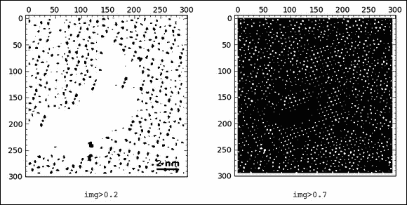
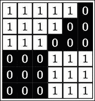
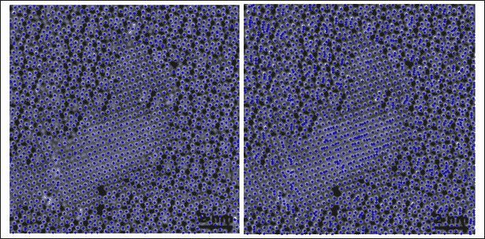
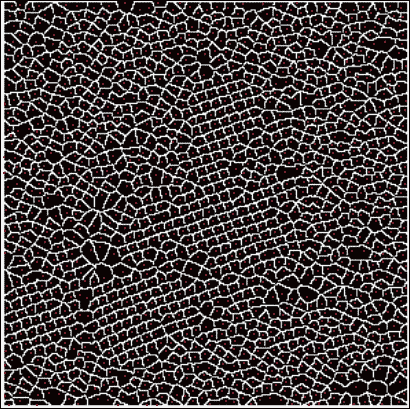
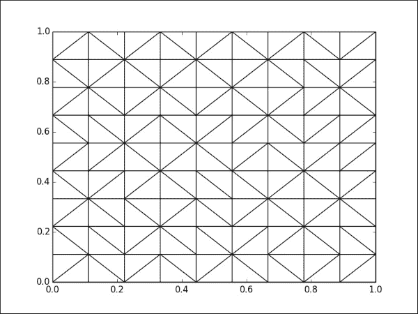
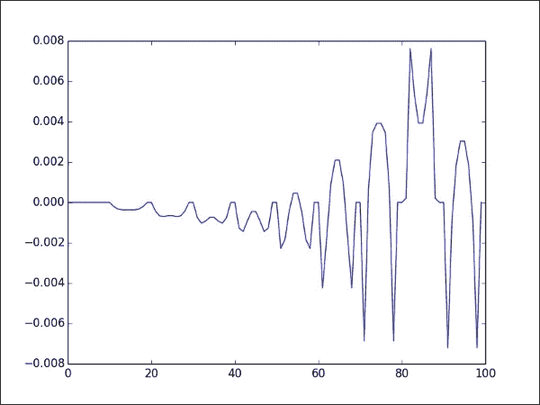

# 第七章。SciPy 计算几何

在本章中，我们将介绍 SciPy 的基础知识，以开发涉及此非常专业主题的程序：**计算几何**。我们将使用两个示例来说明 SciPy 函数在该领域的应用。为了能够从第一个示例中受益，你可能需要手头有一本 *Computational Geometry: Algorithms and Applications Third Edition*，作者 *de Berg M.*，*Cheong O.*，*van Kreveld M.*，和 *Overmars M.*，由 *Springer Publishing* 出版。第二个示例，其中使用 **有限元法**来解决涉及拉普拉斯方程数值解的两个维问题，可以在了解 *Introduction to the Finite Element Method*，作者 *Ottosen N. S.* 和 *Petersson H.*，由 *Prentice Hall* 出版的该主题的情况下无困难地跟随。

让我们先介绍 `scipy.spatial` 模块中处理任何维度空间中点三角剖分及其相应凸包构建的例程。

程序很简单；给定一个包含在 *n*- 维空间中的 *m* 个点（我们将其表示为一个 *m* x *n* 的 NumPy 数组），我们创建一个 `scipy.spatial` 类的 `Delaunay`，它包含由这些点形成的三角剖分：

```py
>>> import scipy.stats 
>>> import scipy.spatial 
>>> data = scipy.stats.randint.rvs(0.4,10,size=(10,2))
>>> triangulation = scipy.spatial.Delaunay(data)

```

任何 `Delaunay` 类都有基本的搜索属性，例如 `points`（用于获取三角剖分中的点集），`vertices`（提供构成三角剖分单纯形的顶点的索引），`neighbors`（用于每个单纯形的相邻单纯形的索引——约定“-1”表示边界上的单纯形没有相邻单纯形）。

更高级的属性，例如 `convex_hull`，指示构成给定点凸包的顶点索引。如果我们想搜索共享给定顶点的单纯形，我们可以使用 `vertex_to_simplex` 方法。如果我们想定位包含空间中任何给定点的单纯形，我们可以使用 `find_simplex` 方法。

在这个阶段，我们想指出三角剖分和 Voronoi 图之间的密切关系，并提出一个简单的编码练习。让我们首先选择一组随机点，并获取相应的三角剖分：

```py
>>> from numpy.random import RandomState
>>> rv = RandomState(123456789)
>>> locations = rv.randint(0, 511, size=(2,8))
>>> triangulation=scipy.spatial.Delaunay(locations.T)

```

我们可以使用 `matplotlib.pyplot` 的 `triplot` 程序来获取这个三角剖分的图形表示。我们首先需要获取计算出的单纯形的集合。`Delaunay` 提供了这个集合，但它通过顶点的索引而不是坐标来提供。因此，在将单纯形的集合输入到 `triplot` 程序之前，我们需要将这些索引映射到实际点上：

```py
>>> import matplotlib.pyplot as plt 
>>> assign_vertex = lambda index: triangulation.points[index]
>>> triangle_set = map(assign_vertex, triangulation.vertices)

```

我们现在将以与之前类似的方式（这次使用 `scipy.spatial.Voronoi` 模块）获取 Voronoi 图的边图，并将其与三角剖分一起绘制。这是通过以下代码行完成的：

```py
>>> voronoiSet=scipy.spatial.Voronoi(locations.T)
>>> scipy.spatial.voronoi_plot_2d(voronoiSet)
>>> fig = plt.figure()
>>> thefig = plt.subplot(1,1,1)
>>> scipy.spatial.voronoi_plot_2d(voronoiSet, ax=thefig)
>>> plt.triplot(locations[1], locations[0], triangles=triangle_set, color='r')

```

让我们看看下面的 `xlim()` 命令：

```py
>>> plt.xlim((0,550))

```

输出如下所示：

```py
 (0, 550)

```

现在，让我们看一下下面的 `ylim()` 命令：

```py
>>> plt.ylim((0,550))

```

输出如下所示：

```py
 (0, 550)

```

现在，我们在下面的 `plt.show()` 命令中绘制 Voronoi 图的边缘图以及三角剖分：

```py
>>> plt.show()

```

输出如下所示：


注意到三角剖分和相应的 Voronoi 图是彼此的补集；三角剖分中的每条边（红色）与 Voronoi 图中的边（白色）垂直。我们应该如何利用这个观察结果来为点云编码实际的 Voronoi 图？实际的 Voronoi 图是由组成它的顶点和边构成的集合。

### 注意

可以在[`stackoverflow.com/questions/10650645/python-calculate-voronoi-tesselation-from-scipys-delaunay-triangulation-in-3d`](http://stackoverflow.com/questions/10650645/python-calculate-voronoi-tesselation-from-scipys-delaunay-triangulation-in-3d)找到寻找 Voronoi 图的有意思的方法。

让我们以两个科学计算的应用来结束这一章，这两个应用广泛使用了这些技术，并结合了其他 SciPy 模块的例程。

# 氧化物的结构模型

在本例中，我们将介绍从青铜型**氧化铌**分子的**HAADF-STEM**显微照片中提取结构模型（关于此主题的更多背景信息可以在书籍《电子显微镜中的纳米尺度成像建模》的*第五章*，*通过应用于高角环形暗场扫描透射电子显微镜（HAADF-STEM）的非局部均值方法形成高质量图像*中找到，作者：*Vogt T.*，*Dahmen W.*，和*Binev P.*，*Springer Publishing*）。

下面的图显示了青铜型氧化铌的 HAADF-STEM 显微照片（取自[`www.microscopy.ethz.ch/BFDF-STEM.htm`](http://www.microscopy.ethz.ch/BFDF-STEM.htm)）：


感谢：ETH Zurich

为了教学目的，我们采取了以下方法来解决此问题：

+   通过阈值和形态学操作对原子进行分割。

+   通过连接组件标记来提取每个单独的原子，以便进行后续检查。

+   计算每个被识别为原子的标签的质量中心。这向我们展示了一个平面上的点阵，它展示了氧化物结构模型的第一手资料。

+   计算前一个点阵的 Voronoi 图。将信息与上一步的输出相结合将使我们得到一个相当好的（实际结构模型的近似）样品结构模型。

让我们继续这个方向。

一旦检索并保存在当前工作目录中，我们的 HAADF-STEM 图像将在 Python 中读取，并默认存储为`float32`或`float64`精度的大的矩阵（取决于您的计算机架构）。对于这个项目，只需要从`scipy.ndimage`模块检索一些工具，以及从`matplotlib`库中的一些过程。然后，前导代码如下：

```py
>>> import numpy
>>> import scipy
>>> from scipy.ndimage import *
>>> from scipy.misc import imfilter
>>> import matplotlib.pyplot as plt
>>> import matplotlib.cm as cm

```

该图像使用`imread(filename)`命令加载。这将以`dtype = float32`将图像存储为`numpy.array`。请注意，图像被缩放，使得最大值和最小值分别为`1.0`和`0.0`。有关图像的其他有趣信息可以通过以下方式检索：

```py
>>> img=imread('./NbW-STEM.png')
>>> minVal = numpy.min(img) 
>>> maxVal = numpy.max(img) 
>>> img = (1.0/(maxVal-minVal))*(img - minVal) 
>>> plt.imshow(img, cmap = cm.Greys_r)
>>> plt.show()
>>> print "Image dtype: %s"%(img.dtype)
>>> print "Image size: %6d"%(img.size)
>>> print "Image shape: %3dx%3d"%(img.shape[0],img.shape[1])
>>> print "Max value %1.2f at pixel %6d"%(img.max(),img.argmax())
>>> print "Min value %1.2f at pixel %6d"%(img.min(),img.argmin())
>>> print "Variance: %1.5f\nStandard deviation: \ 
 %1.5f"%(img.var(),img.std())

```

这提供了以下输出：

```py
Image dtype: float64
Image size:  87025
Image shape: 295x295
Max value 1.00 at pixel  75440
Min value 0.00 at pixel   5703
Variance: 0.02580
Standard deviation: 0.16062

```

我们通过在包含数据的数组中施加不等式来进行阈值处理。输出是一个布尔数组，其中`True`（白色）表示不等式已被满足，而`False`（黑色）则表示未满足。我们可以在这一点上执行多个阈值处理操作，并可视化它们以获得用于分割的最佳阈值。以下图像显示了几个示例（对不同氧化物图像应用的不同阈值）：



以下代码行生成了该氧化物图像：

```py
>>> plt.subplot(1, 2, 1)
>>> plt.imshow(img > 0.2, cmap = cm.Greys_r)
>>> plt.xlabel('img > 0.2')
>>> plt.subplot(1, 2, 2) 
>>> plt.imshow(img > 0.7, cmap = cm.Greys_r)
>>> plt.xlabel('img > 0.7')
>>> plt.show()

```

通过对几个不同的阈值进行视觉检查，我们选择`0.62`作为给我们提供良好映射的阈值，该映射显示了我们需要用于分割的内容。尽管如此，我们需要去除*异常值*：可能满足给定阈值但足够小以至于不被视为实际原子的微小颗粒。因此，在下一步中，我们执行开运算来去除这些小颗粒。我们决定，任何小于 2 x 2 大小的正方形都将从阈值处理的输出中消除：

```py
>>> BWatoms = (img> 0.62)
>>> BWatoms = binary_opening(BWatoms,structure=numpy.ones((2,2)))

```

我们已经准备好进行分割，这将使用来自`scipy.ndimage`模块的`label`例程来完成。它为每个分割的原子收集一个切片，并提供了计算出的切片数量。我们需要指出连接类型。例如，在下面的玩具示例中，我们是否希望将这种情况视为两个原子还是一个原子？



这取决于情况；我们宁愿现在将其视为两个不同的连通组件，但对于某些其他应用，我们可能认为它们是一个。我们将连接信息指示给`label`例程的方式是通过一个定义特征连接的结构元素。例如，如果我们的两个像素之间的连接标准是它们的边缘是相邻的，那么结构元素看起来就像在下一张图中左侧显示的图像。如果我们的两个像素之间的连接标准是它们也可以共享一个角落，那么结构元素看起来就像在右侧显示的图像。

对于每个像素，我们施加选定的结构元素并计算交点；如果没有交点，则这两个像素不相连。否则，它们属于同一个连通分量。


我们需要确保那些对角线距离太近的原子被计为两个，而不是一个，所以我们选择了左侧的结构元素。然后脚本如下所示：

```py
>>> structuring_element = [[0,1,0],[1,1,1],[0,1,0]]
>>> segmentation,segments = label(BWatoms,structuring_element)

```

`segmentation` 对象包含一个切片列表，每个切片都有一个布尔矩阵，包含每个找到的氧化物原子。对于每个切片，我们可以获得大量有用的信息。例如，可以使用以下命令检索每个原子的质心坐标（`centers_of_mass`）：

```py
>>> coords = center_of_mass(img, segmentation, range(1,segments+1))
>>> xcoords = numpy.array([x[1] for x in coords])
>>> ycoords = numpy.array([x[0] for x in coords])

```

注意，由于矩阵在内存中的存储方式，像素位置的 `x` 和 `y` 坐标发生了转置。我们需要考虑这一点。

注意到计算的点阵与原始图像（下一张图中左侧的图像）的重叠。我们可以使用以下命令获得它：

```py
>>> plt.imshow(img, cmap = cm.Greys_r) 
>>> plt.axis('off') 
>>> plt.plot(xcoords,ycoords,'b.') 
>>> plt.show() 

```

我们已经成功找到了大多数原子的质心，尽管仍有大约十几个区域我们对结果不太满意。现在是时候通过改变一些变量的值来微调，比如调整阈值、结构元素、不同的形态学操作等等。我们甚至可以添加关于这些变量的广泛信息，并过滤掉异常值。以下是一个优化分割的示例（请看右侧图像）：



为了本演示的目的，我们很高兴保持简单，并继续使用我们已经计算出的坐标集。现在我们将提供一个关于氧化物晶格的近似，它是通过计算晶格的沃罗诺伊图的边缘图得到的：

```py
>>> L1,L2 = distance_transform_edt(segmentation==0, return_distances=False, return_indices=True)
>>> Voronoi = segmentation[L1,L2]
>>> Voronoi_edges= imfilter(Voronoi,'find_edges')
>>> Voronoi_edges=(Voronoi_edges>0)

```

让我们将 `Voronoi_edges` 的结果叠加到找到的原子位置上：

```py
>>> plt.imshow(Voronoi_edges); plt.axis('off'); plt.gray()
>>> plt.plot(xcoords,ycoords,'r.',markersize=2.0)
>>> plt.show()

```

这给出了以下输出，它代表了我们所寻找的结构模型（回想一下，我们是从一个想要找到分子结构模型的图像开始的）：



# 拉普拉斯方程的有限元求解器

当数据的大小如此之大以至于其结果禁止使用有限差分法处理时，我们使用有限元。为了说明这种情况，我们想探索在特定边界条件下的拉普拉斯方程的数值解。

我们将首先定义计算域并使用三角形作为局部有限元来划分这个域。这将是我们使用有限元方法解决这个问题的起点，因为我们将在计算域上放置一个分段连续函数，其部分是线性的，并且在每个三角形上都有支撑。

我们首先调用必要的模块来构建网格（其他模块将在需要时调用）：

```py
>>> import numpy
>>> from numpy import linspace
>>> import scipy
>>> import matplotlib.pyplot as plt
>>> from scipy.spatial import Delaunay

```

首先，我们定义区域：

```py
>>> xmin = 0 ; xmax = 1 ; nXpoints = 10
>>> ymin = 0 ; ymax = 1 ; nYpoints = 10
>>> horizontal = linspace(xmin,xmax,nXpoints)
>>> vertical = linspace(ymin,ymax,nYpoints)
>>> y, x = numpy.meshgrid(horizontal, vertical)
>>> vertices = numpy.array([x.flatten(),y.flatten()])

```

现在，我们可以创建三角剖分：

```py
>>> triangulation = Delaunay(vertices.T)
>>> index2point = lambda index: triangulation.points[index]
>>> all_centers = index2point(triangulation.vertices).mean(axis=1)
>>> trngl_set=triangulation.vertices

```

然后，我们有以下三角剖分：

```py
>>> plt.triplot(vertices[0],vertices[1],triangles=trngl_set)
>>> plt.show()

```

这产生了以下图：



在这种情况下，我们选择的问题是在物理学和工程数学中的标准问题，它包括在单位正方形区域内求解二维拉普拉斯方程，三边上的**Dirichlet**边界条件为零，在第四边上的条件是常数。从物理学的角度来看，这个问题可以代表二维板上的温度扩散。从数学的角度来看，问题表述如下：


这种形式的解可以用傅里叶级数表示如下：


这很重要，因为在你尝试使用你的数值方案来解决复杂计算域中的更复杂问题之前，你可以检查所获得的数值解的正确性。然而，应该提到的是，Python 中存在其他实现有限元方法来解决偏微分方程的替代方案。在这方面，读者可以参考**Fenics**项目([`fenicsproject.org/book/`](http://fenicsproject.org/book/))和**SfePy**项目([`sfepy.org/doc-devel/index.html`](http://sfepy.org/doc-devel/index.html))。

我们按照常规方式编写代码求解。我们首先计算刚度矩阵*A*（由于显而易见的原因，它是`sparse`的）。然后，定义包含全局边界条件的向量*R*的构造（我们构建网格的方式使得定义这个向量变得简单）。有了它们，系统的解来自于通过求解形式为*AX=R*的矩阵方程获得的解*X*，使用与边界上的节点不同的节点对应的矩阵*A*和*R*的子集。这对 SciPy 来说应该不成问题。让我们从刚度矩阵开始：

```py
>>> from numpy import  cross 
>>> from scipy.sparse import dok_matrix 
>>> points=triangulation.points.shape[0]
>>> stiff_matrix=dok_matrix((points,points))
>>> for triangle in triangulation.vertices:
 helper_matrix=dok_matrix((points,points))
 pt1,pt2,pt3=index2point(triangle)
 area=abs(0.5*cross(pt2-pt1,pt3-pt1))
 coeffs=0.5*numpy.vstack((pt2-pt3,pt3-pt1,pt1-pt2))/area
 #helper_matrix[triangle,triangle] = \ 
 array(mat(coeffs)*mat(coeffs).T)
 u=None 
 u=numpy.array(numpy.mat(coeffs)*numpy.mat(coeffs).T) 
 for i in range(len(triangle)):
 for j in range(len(triangle)):
 helper_matrix[triangle[i],triangle[j]] = u[i,j] 
 stiff_matrix=stiff_matrix+helper_matrix

```

注意，这是更新`stiff_matrix`矩阵的繁琐方式。这是由于矩阵是`sparse`的，并且当前的选择在索引方面表现不佳。

为了计算全局边界向量，我们首先需要收集边界上的所有边，然后将函数值为 1 分配给*x=1*的节点，将函数值为 0 分配给其他节点。由于我们设置网格的方式，这很容易，因为函数值为 1 的节点总是全局边界向量的最后几个条目。这是通过以下代码行实现的：

```py
>>> allNodes = numpy.unique(trngl_set) 
>>> boundaryNodes = numpy.unique(triangulation.convex_hull) 
>>> NonBoundaryNodes = numpy.array([]) 
>>> for x in allNodes: 
 if x not in boundaryNodes: 
 NonBoundaryNodes = numpy.append(NonBoundaryNodes,x) 
 NonBoundaryNodes = NonBoundaryNodes.astype(int) 
 nbnodes = len(boundaryNodes) # number of boundary nodes 
 FbVals=numpy.zeros([nbnodes,1]) # Values on the boundary 
 FbVals[(nbnodes-nXpoints+1):-1]=numpy.ones([nXpoints-2, 1])

```

我们已经准备好使用在前一步骤中获得的数据来寻找问题的数值解：

```py
>>> totalNodes = len(allNodes) 
>>> stiff_matrixDense = stiff_matrix.todense() 
>>> stiffNonb = \ 
 stiff_matrixDense[numpy.ix_(NonBoundaryNodes,NonBoundaryNodes)] 
>>> stiffAtb = \ 
 stiff_matrixDense[numpy.ix_(NonBoundaryNodes,boundaryNodes)] 
>>> U=numpy.zeros([totalNodes, 1]) 
>>> U[NonBoundaryNodes] = numpy.linalg.solve( - stiffNonb , \
 stiffAtb * FbVals ) 
>>> U[boundaryNodes] = FbVals 

```

这产生了以下图像，展示了方形内部温度的扩散：


该图是通过以下方式获得的：

```py
>>> X = vertices[0] 
>>> Y = vertices[1] 
>>> Z = U.T.flatten() 
>>> from mpl_toolkits.mplot3d import axes3d
>>> fig = plt.figure() 
>>> ax = fig.add_subplot(111, projection='3d') 
>>> surf = ax.plot_trisurf(X, Y, Z, cmap=cm.jet, linewidth=0) 
>>> fig.colorbar(surf) 
>>> fig.tight_layout() 
>>> ax.set_xlabel('X',fontsize=16)
>>> ax.set_ylabel('Y',fontsize=16)
>>> ax.set_zlabel(r"$\phi$",fontsize=36)
>>> plt.show() 

```

数值分析中的一个重要点是评估任何问题获得的数值解的质量。在这种情况下，我们选择了一个具有解析解的问题（参见前面的代码），因此可以检查（而不是证明）用于解决我们问题的数值算法的有效性。在这种情况下，解析解可以以以下方式编码：

```py
>>> from numpy import pi, sinh, sin, cos, sum
>>> def f(x,y): 
 return sum( 2*(1.0/(n*pi) - \
 cos(n*pi)/(n*pi))*(sinh(n*pi*x)/ \
 sinh(n*pi))*sin(n*pi*y) 
 for n in range(1,200)) 
>>> Ze = f(X,Y) 
>>> ZdiffZe = Ze - Z 
>>> plt.plot(ZdiffZe) 
>>> plt.show() 

```

这产生了以下图表，显示了精确解（评估到 200 项）与问题的数值解之间的差异（通过相应的 IPython 笔记本，你可以对数值解进行进一步分析，以更加确信获得的结果是正确的）：



# 摘要

在本书的七个章节中，我们以结构化的方式详细介绍了 SciPy 库中包含的所有不同模块，这些模块是从数学不同分支的逻辑划分中得出的。

我们还见证了该系统以最少的编码和最优的资源使用，在不同科学领域的科学研究问题中实现最先进应用的能力。

在第八章中，我们将介绍 SciPy 的主要优势之一：与其他语言交互的能力。
