# 第一章：开始使用 Spark SQL

Spark SQL 是使用 Spark 开发的所有应用程序的核心。在本书中，我们将详细探讨 Spark SQL 的使用方式，包括其在各种类型的应用程序中的使用以及其内部工作原理。开发人员和架构师将欣赏到每一章中呈现的技术概念和实践会话，因为他们在阅读本书时会逐步进展。

在本章中，我们将向您介绍与 Spark SQL 相关的关键概念。我们将从 SparkSession 开始，这是 Spark 2.0 中 Spark SQL 的新入口点。然后，我们将探索 Spark SQL 的接口 RDDs、DataFrames 和 Dataset APIs。随后，我们将解释有关 Catalyst 优化器和 Project Tungsten 的开发人员级细节。

最后，我们将介绍 Spark 2.0 中针对流应用程序的一项令人兴奋的新功能，称为结构化流。本章中将提供特定的实践练习（使用公开可用的数据集），以便您在阅读各个部分时能够积极参与其中。 

更具体地，本章的各节将涵盖以下主题以及实践会话：

+   什么是 Spark SQL？

+   介绍 SparkSession

+   了解 Spark SQL 概念

+   了解 RDDs、DataFrames 和 Datasets

+   了解 Catalyst 优化器

+   了解 Project Tungsten

+   在连续应用程序中使用 Spark SQL

+   了解结构化流内部

# 什么是 Spark SQL？

Spark SQL 是 Apache Spark 最先进的组件之一。自 Spark 1.0 以来一直是核心分发的一部分，并支持 Python、Scala、Java 和 R 编程 API。如下图所示，Spark SQL 组件为 Spark 机器学习应用程序、流应用程序、图应用程序以及许多其他类型的应用程序架构提供了基础。

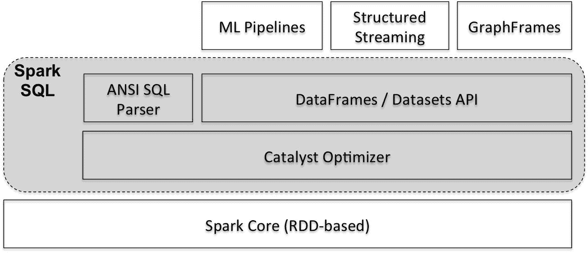

这些应用程序通常使用 Spark ML pipelines、结构化流和 GraphFrames，这些都是基于 Spark SQL 接口（DataFrame/Dataset API）的。这些应用程序以及 SQL、DataFrames 和 Datasets API 等构造自动获得 Catalyst 优化器的好处。该优化器还负责根据较低级别的 RDD 接口生成可执行的查询计划。

我们将在第六章中更详细地探讨 ML pipelines，*在机器学习应用程序中使用 Spark SQL*。GraphFrames 将在第七章中介绍，*在图应用程序中使用 Spark SQL*。而在本章中，我们将介绍有关结构化流和 Catalyst 优化器的关键概念，我们将在第五章和第十一章中获得更多关于它们的细节，*在流应用程序中使用 Spark SQL*和*Tuning Spark SQL Components for Performance*。

在 Spark 2.0 中，DataFrame API 已与 Dataset API 合并，从而统一了跨 Spark 库的数据处理能力。这也使开发人员能够使用单一的高级和类型安全的 API。但是，Spark 软件堆栈并不阻止开发人员直接在其应用程序中使用低级别的 RDD 接口。尽管低级别的 RDD API 将继续可用，但预计绝大多数开发人员将（并建议）使用高级 API，即 Dataset 和 DataFrame API。

此外，Spark 2.0 通过包括一个新的 ANSI SQL 解析器扩展了 Spark SQL 的功能，支持子查询和 SQL:2003 标准。更具体地，子查询支持现在包括相关/不相关子查询，以及`IN / NOT IN`和`EXISTS / NOT EXISTS`谓词在`WHERE / HAVING`子句中。

Spark SQL 的核心是 Catalyst 优化器，它利用 Scala 的高级特性（如模式匹配）来提供可扩展的查询优化器。DataFrame、数据集和 SQL 查询共享相同的执行和优化管道；因此，使用这些结构中的任何一个（或使用任何受支持的编程 API）都不会对性能产生影响。开发人员编写的高级基于 DataFrame 的代码被转换为 Catalyst 表达式，然后通过该管道转换为低级 Java 字节码。

`SparkSession`是与 Spark SQL 相关功能的入口点，我们将在下一节中对其进行更详细的描述。

# 介绍 SparkSession

在 Spark 2.0 中，`SparkSession`表示操作 Spark 中数据的统一入口点。它最小化了开发人员在使用 Spark 时必须使用的不同上下文的数量。`SparkSession`取代了多个上下文对象，如`SparkContext`、`SQLContext`和`HiveContext`。这些上下文现在封装在`SparkSession`对象中。

在 Spark 程序中，我们使用构建器设计模式来实例化`SparkSession`对象。但是，在 REPL 环境（即在 Spark shell 会话中），`SparkSession`会自动创建并通过名为**Spark**的实例对象提供给您。

此时，在您的计算机上启动 Spark shell 以交互式地执行本节中的代码片段。随着 shell 的启动，您会注意到屏幕上出现了一堆消息，如下图所示。您应该看到显示`SparkSession`对象（作为 Spark）、Spark 版本为 2.2.0、Scala 版本为 2.11.8 和 Java 版本为 1.8.x 的消息。

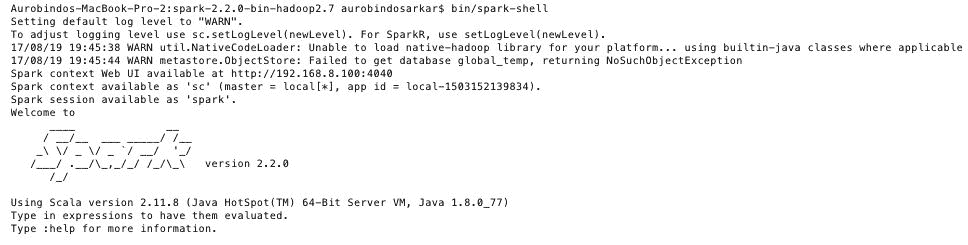

`SparkSession`对象可用于配置 Spark 的运行时配置属性。例如，Spark 和 Yarn 管理的两个主要资源是 CPU 和内存。如果要设置 Spark 执行程序的核心数和堆大小，可以分别通过设置`spark.executor.cores`和`spark.executor.memory`属性来实现。在本例中，我们将这些运行时属性分别设置为`2`个核心和`4`GB，如下所示：

```scala
    scala> spark.conf.set("spark.executor.cores", "2")

    scala> spark.conf.set("spark.executor.memory", "4g")
```

`SparkSession`对象可用于从各种来源读取数据，如 CSV、JSON、JDBC、流等。此外，它还可用于执行 SQL 语句、注册用户定义函数（UDFs）以及处理数据集和 DataFrame。以下会话演示了 Spark 中的一些基本操作。

在本例中，我们使用由威斯康星大学医院麦迪逊分校的 William H. Wolberg 博士创建的乳腺癌数据库。您可以从[`archive.ics.uci.edu/ml/datasets/Breast+Cancer+Wisconsin+(Original)`](https://archive.ics.uci.edu/ml/datasets/Breast+Cancer+Wisconsin+(Original))下载原始数据集。数据集中的每一行包含样本编号、乳腺细针抽吸的九个细胞学特征（分级为`1`到`10`）以及`label`类别，即`良性（2）`或`恶性（4）`。

首先，我们为文件中的记录定义一个模式。字段描述可以在数据集的下载站点上找到。

```scala
scala> import org.apache.spark.sql.types._

scala> val recordSchema = new StructType().add("sample", "long").add("cThick", "integer").add("uCSize", "integer").add("uCShape", "integer").add("mAdhes", "integer").add("sECSize", "integer").add("bNuc", "integer").add("bChrom", "integer").add("nNuc", "integer").add("mitosis", "integer").add("clas", "integer")

```

接下来，我们使用在前一步中定义的记录模式从输入 CSV 文件创建一个 DataFrame：

```scala
val df = spark.read.format("csv").option("header", false).schema(recordSchema).load("file:///Users/aurobindosarkar/Downloads/breast-cancer-wisconsin.data")
```

新创建的 DataFrame 可以使用`show()`方法显示：

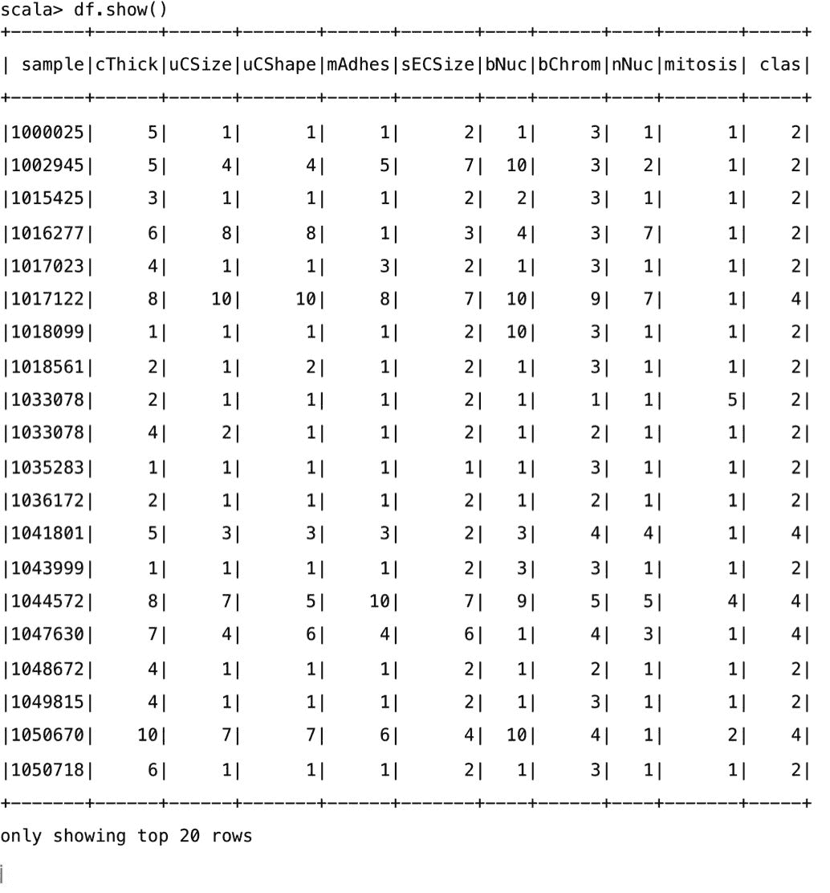

DataFrame 可以使用`createOrReplaceTempView()`方法注册为 SQL 临时视图。这允许应用程序使用 SparkSession 对象的`sql`函数运行 SQL 查询，并将结果作为 DataFrame 返回。

接下来，我们为 DataFrame 创建一个临时视图，并对其执行一个简单的 SQL 语句：

```scala
scala> df.createOrReplaceTempView("cancerTable") 

scala> val sqlDF = spark.sql("SELECT sample, bNuc from cancerTable") 
```

使用`show()`方法显示结果 DataFrame 的内容：

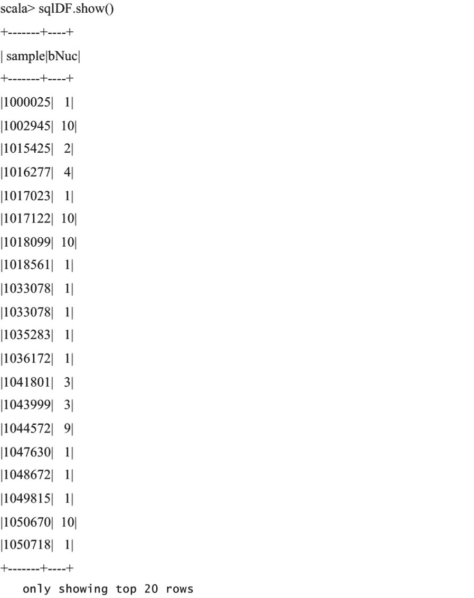

```scala
case class and the toDS() method. Then, we define a UDF to convert the clas column, currently containing 2's and 4's to  0's and 1's respectively. We register the UDF using the SparkSession object and use it in a SQL statement:
```

```scala
scala> case class CancerClass(sample: Long, cThick: Int, uCSize: Int, uCShape: Int, mAdhes: Int, sECSize: Int, bNuc: Int, bChrom: Int, nNuc: Int, mitosis: Int, clas: Int)

scala> val cancerDS = spark.sparkContext.textFile("file:///Users/aurobindosarkar/Documents/SparkBook/data/breast-cancer-wisconsin.data").map(_.split(",")).map(attributes => CancerClass(attributes(0).trim.toLong, attributes(1).trim.toInt, attributes(2).trim.toInt, attributes(3).trim.toInt, attributes(4).trim.toInt, attributes(5).trim.toInt, attributes(6).trim.toInt, attributes(7).trim.toInt, attributes(8).trim.toInt, attributes(9).trim.toInt, attributes(10).trim.toInt)).toDS()

scala> def binarize(s: Int): Int = s match {case 2 => 0 case 4 => 1 }

scala> spark.udf.register("udfValueToCategory", (arg: Int) => binarize(arg))

scala> val sqlUDF = spark.sql("SELECT *, udfValueToCategory(clas) from cancerTable")

scala> sqlUDF.show()
```

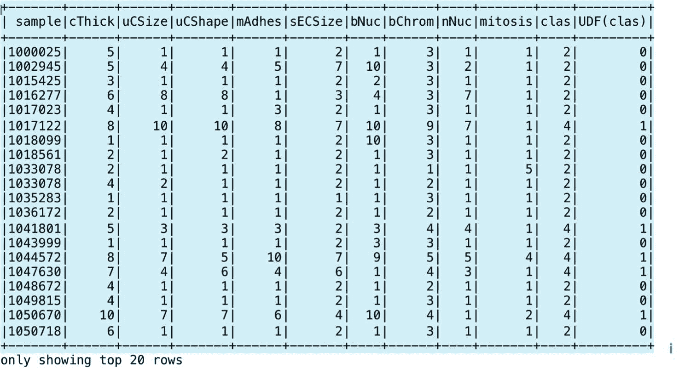

`SparkSession`公开了访问底层元数据的方法（通过 catalog 属性），例如可用数据库和表、注册的 UDF、临时视图等。此外，我们还可以缓存表、删除临时视图和清除缓存。这里展示了一些这些语句及其相应的输出：

```scala
scala> spark.catalog.currentDatabase

res5: String = default

scala> spark.catalog.isCached("cancerTable") 

res6: Boolean = false 

scala> spark.catalog.cacheTable("cancerTable") 

scala> spark.catalog.isCached("cancerTable") 

res8: Boolean = true 

scala> spark.catalog.clearCache 

scala> spark.catalog.isCached("cancerTable") 

res10: Boolean = false 

scala> spark.catalog.listDatabases.show()
```

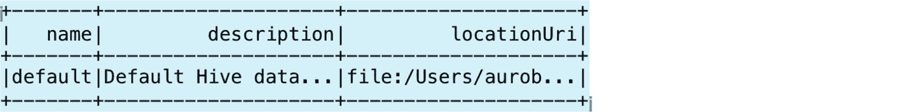

还可以使用`take`方法在 DataFrame 中显示特定数量的记录：

```scala
scala> spark.catalog.listDatabases.take(1)
res13: Array[org.apache.spark.sql.catalog.Database] = Array(Database[name='default', description='Default Hive database', path='file:/Users/aurobindosarkar/Downloads/spark-2.2.0-bin-hadoop2.7/spark-warehouse'])

scala> spark.catalog.listTables.show()
```

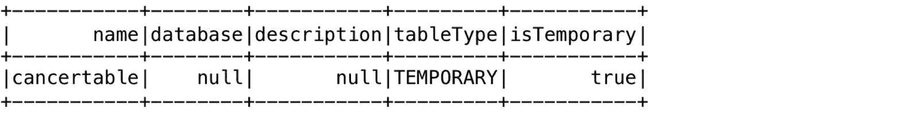

我们可以使用以下语句删除之前创建的临时表：

```scala
scala> spark.catalog.dropTempView("cancerTable")

scala> spark.catalog.listTables.show()
```

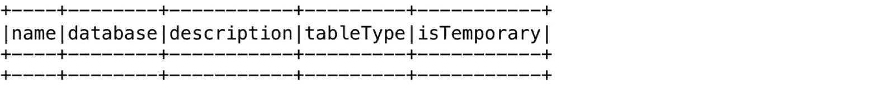

在接下来的几节中，我们将更详细地描述 RDD、DataFrame 和 Dataset 的构造。

# 理解 Spark SQL 概念

在本节中，我们将探讨与弹性分布式数据集（RDD）、DataFrame 和 Dataset、Catalyst Optimizer 和 Project Tungsten 相关的关键概念。

# 理解弹性分布式数据集（RDD）

RDD 是 Spark 的主要分布式数据集抽象。它是一个不可变的、分布式的、惰性评估的、类型推断的、可缓存的数据集合。在执行之前，开发人员的代码（使用诸如 SQL、DataFrame 和 Dataset API 等更高级别的构造）被转换为 RDD 的 DAG（准备执行）。

您可以通过并行化现有数据集合或访问存储在外部存储系统中的数据集合（例如文件系统或各种基于 Hadoop 的数据源）来创建 RDD。并行化的集合形成了一个分布式数据集，使得可以对其进行并行操作。

您可以从指定了分区数量的输入文件创建 RDD，如下所示：

```scala
scala> val cancerRDD = sc.textFile("file:///Users/aurobindosarkar/Downloads/breast-cancer-wisconsin.data", 4)

scala> cancerRDD.partitions.size
res37: Int = 4
```

您可以通过导入`spark.implicits`包并使用`toDF()`方法将 RDD 隐式转换为 DataFrame：

```scala
scala> import spark.implicits._scala> 
val cancerDF = cancerRDD.toDF()
```

要创建具有特定模式的 DataFrame，我们为 DataFrame 中包含的行定义一个 Row 对象。此外，我们将逗号分隔的数据拆分，转换为字段列表，然后将其映射到 Row 对象。最后，我们使用`createDataFrame()`创建具有指定模式的 DataFrame：

```scala
def row(line: List[String]): Row = { Row(line(0).toLong, line(1).toInt, line(2).toInt, line(3).toInt, line(4).toInt, line(5).toInt, line(6).toInt, line(7).toInt, line(8).toInt, line(9).toInt, line(10).toInt) }
val data = cancerRDD.map(_.split(",").to[List]).map(row)
val cancerDF = spark.createDataFrame(data, recordSchema)
```

此外，我们可以轻松地使用之前定义的`case`类将前述 DataFrame 转换为数据集：

```scala
scala> val cancerDS = cancerDF.as[CancerClass]
```

RDD 数据在逻辑上被划分为一组分区；此外，所有输入、中间和输出数据也被表示为分区。RDD 分区的数量定义了数据的碎片化程度。这些分区也是并行性的基本单元。Spark 执行作业被分成多个阶段，每个阶段一次操作一个分区，因此调整分区的数量非常重要。比活跃阶段少的分区意味着您的集群可能被低效利用，而过多的分区可能会影响性能，因为会导致更高的磁盘和网络 I/O。

RDD 的编程接口支持两种类型的操作：转换和动作。转换从现有数据集创建一个新的数据集，而动作返回计算结果的值。所有转换都是惰性评估的--实际执行只发生在执行动作以计算结果时。转换形成一个谱系图，而不是实际在多台机器上复制数据。这种基于图的方法实现了高效的容错模型。例如，如果丢失了一个 RDD 分区，那么可以根据谱系图重新计算它。

您可以控制数据持久性（例如缓存）并指定 RDD 分区的放置偏好，然后使用特定的操作符对其进行操作。默认情况下，Spark 将 RDD 持久化在内存中，但如果内存不足，它可以将它们溢出到磁盘。缓存通过几个数量级提高了性能；然而，它通常占用大量内存。其他持久性选项包括将 RDD 存储到磁盘并在集群中的节点之间复制它们。持久 RDD 的内存存储可以是反序列化或序列化的 Java 对象形式。反序列化选项更快，而序列化选项更节省内存（但更慢）。未使用的 RDD 将自动从缓存中删除，但根据您的要求；如果不再需要特定的 RDD，则也可以显式释放它。

# 理解 DataFrames 和 Datasets

DataFrame 类似于关系数据库中的表、pandas dataframe 或 R 中的数据框。它是一个分布式的行集合，组织成列。它使用 RDD 的不可变、内存中、弹性、分布式和并行能力，并对数据应用模式。DataFrames 也是惰性评估的。此外，它们为分布式数据操作提供了领域特定语言（DSL）。

从概念上讲，DataFrame 是一组通用对象`Dataset[Row]`的别名，其中行是通用的无类型对象。这意味着 DataFrame 的语法错误在编译阶段被捕获；然而，分析错误只在运行时被检测到。

DataFrame 可以从各种来源构建，例如结构化数据文件、Hive 表、数据库或 RDD。源数据可以从本地文件系统、HDFS、Amazon S3 和 RDBMS 中读取。此外，还支持其他流行的数据格式，如 CSV、JSON、Avro、Parquet 等。此外，您还可以创建和使用自定义数据源。

DataFrame API 支持 Scala、Java、Python 和 R 编程 API。DataFrame API 是声明式的，并与 Spark 的过程式代码结合使用，为应用程序中的关系和过程式处理提供了更紧密的集成。可以使用 Spark 的过程式 API 或使用关系 API（具有更丰富的优化）来操作 DataFrame。

在 Spark 的早期版本中，您必须编写操作 RDD 的任意 Java、Python 或 Scala 函数。在这种情况下，函数是在不透明的 Java 对象上执行的。因此，用户函数本质上是执行不透明计算的黑匣子，使用不透明对象和数据类型。这种方法非常通用，这样的程序可以完全控制每个数据操作的执行。然而，由于引擎不知道您正在执行的代码或数据的性质，因此无法优化这些任意的 Java 对象。此外，开发人员需要编写依赖于特定工作负载性质的高效程序。

在 Spark 2.0 中，使用 SQL、DataFrames 和 Datasets 的主要好处是，使用这些高级编程接口编程更容易，同时自动获得性能改进的好处。您只需编写更少的代码行，程序就会自动优化，并为您生成高效的代码。这样可以提高性能，同时显著减轻开发人员的负担。现在，开发人员可以专注于“做什么”，而不是“如何完成”。

数据集 API 首次添加到 Spark 1.6 中，以提供 RDD 和 Spark SQL 优化器的优点。数据集可以从 JVM 对象构造，然后使用`map`、`filter`等函数变换进行操作。由于数据集是使用用户定义的 case 类指定的强类型对象的集合，因此可以在编译时检测到语法错误和分析错误。

统一的数据集 API 可以在 Scala 和 Java 中使用。但是 Python 目前还不支持数据集 API。

在下面的示例中，我们介绍了一些基本的 DataFrame/Dataset 操作。为此，我们将使用两个餐厅列表数据集，这些数据集通常用于重复记录检测和记录链接应用。来自 Zagat 和 Fodor 餐厅指南的两个列表之间存在重复记录。为了使这个例子简单，我们手动将输入文件转换为 CSV 格式。您可以从[`www.cs.utexas.edu/users/ml/riddle/data.html`](http://www.cs.utexas.edu/users/ml/riddle/data.html)下载原始数据集。

首先，我们为两个文件中的记录定义一个`case`类：

```scala
scala> case class RestClass(name: String, street: String, city: String, phone: String, cuisine: String)
```

接下来，我们从两个文件创建数据集：

```scala
scala> val rest1DS = spark.sparkContext.textFile("file:///Users/aurobindosarkar/Documents/SparkBook/data/zagats.csv").map(_.split(",")).map(attributes => RestClass(attributes(0).trim, attributes(1).trim, attributes(2).trim, attributes(3).trim, attributes(4).trim)).toDS()

scala> val rest2DS = spark.sparkContext.textFile("file:///Users/aurobindosarkar/Documents/SparkBook/data/fodors.csv").map(_.split(",")).map(attributes => RestClass(attributes(0).trim, attributes(1).trim, attributes(2).trim, attributes(3).trim, attributes(4).trim)).toDS()
```

我们定义一个 UDF 来清理和转换第二个数据集中的电话号码，以匹配第一个文件中的格式：

```scala
scala> def formatPhoneNo(s: String): String = s match {case s if s.contains("/") => s.replaceAll("/", "-").replaceAll("- ", "-").replaceAll("--", "-") case _ => s } 

scala> val udfStandardizePhoneNos = udfString, String ) 

scala> val rest2DSM1 = rest2DS.withColumn("stdphone", udfStandardizePhoneNos(rest2DS.col("phone")))
```

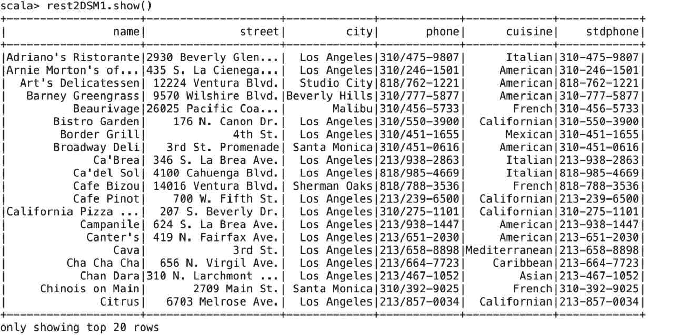

接下来，我们从我们的数据集创建临时视图：

```scala
scala> rest1DS.createOrReplaceTempView("rest1Table") 

scala> rest2DSM1.createOrReplaceTempView("rest2Table")
```

我们可以通过在这些表上执行 SQL 语句来获取重复记录的数量：

```scala
scala> spark.sql("SELECT count(*) from rest1Table, rest2Table where rest1Table.phone = rest2Table.stdphone").show()
```

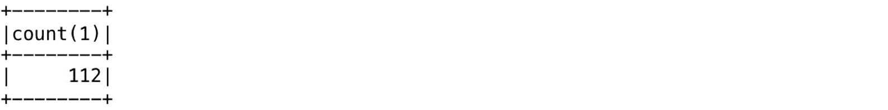

接下来，我们执行一个返回包含匹配电话号码的行的 DataFrame 的 SQL 语句：

```scala
scala> val sqlDF = spark.sql("SELECT a.name, b.name, a.phone, b.stdphone from rest1Table a, rest2Table b where a.phone = b.stdphone")
```

从两个表中列出的名称和电话号码列的结果可以显示，以直观地验证结果是否可能重复：

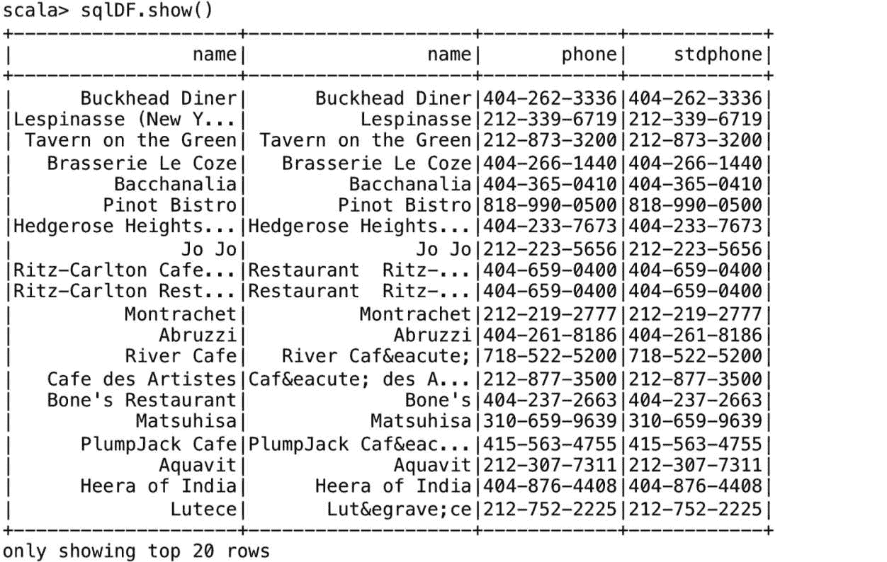

在下一节中，我们将把重点转移到 Spark SQL 内部，更具体地说，是 Catalyst 优化器和 Project Tungsten。

# 理解 Catalyst 优化器

Catalyst 优化器是 Spark SQL 的核心，用 Scala 实现。它实现了一些关键功能，例如模式推断（从 JSON 数据中），这在数据分析工作中非常有用。

下图显示了从包含 DataFrame/Dataset 的开发人员程序到最终执行计划的高级转换过程：

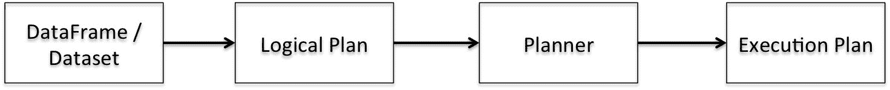

程序的内部表示是查询计划。查询计划描述诸如聚合、连接和过滤等数据操作，这些操作与查询中定义的内容相匹配。这些操作从输入数据集生成一个新的数据集。在我们有查询计划的初始版本后，Catalyst 优化器将应用一系列转换将其转换为优化的查询计划。最后，Spark SQL 代码生成机制将优化的查询计划转换为准备执行的 RDD 的 DAG。查询计划和优化的查询计划在内部表示为树。因此，在其核心，Catalyst 优化器包含一个用于表示树和应用规则来操作它们的通用库。在这个库之上，还有几个更具体于关系查询处理的其他库。

Catalyst 有两种类型的查询计划：**逻辑**和**物理计划**。逻辑计划描述了数据集上的计算，而没有定义如何执行具体的计算。通常，逻辑计划在生成的行的一组约束下生成属性或列的列表作为输出。物理计划描述了数据集上的计算，并具体定义了如何执行它们（可执行）。

让我们更详细地探讨转换步骤。初始查询计划本质上是一个未解析的逻辑计划，也就是说，在这个阶段我们不知道数据集的来源或数据集中包含的列，我们也不知道列的类型。这个管道的第一步是分析步骤。在分析过程中，使用目录信息将未解析的逻辑计划转换为已解析的逻辑计划。

在下一步中，一组逻辑优化规则被应用于已解析的逻辑计划，从而产生一个优化的逻辑计划。在下一步中，优化器可能生成多个物理计划，并比较它们的成本以选择最佳的一个。建立在 Spark SQL 之上的第一个版本的**基于成本的优化器**（**CBO**）已经在 Spark 2.2 中发布。有关基于成本的优化的更多细节，请参阅第十一章，*调整 Spark SQL 组件以提高性能*。

所有三个--**DataFrame**、**Dataset**和 SQL--都共享如下图所示的相同优化管道：

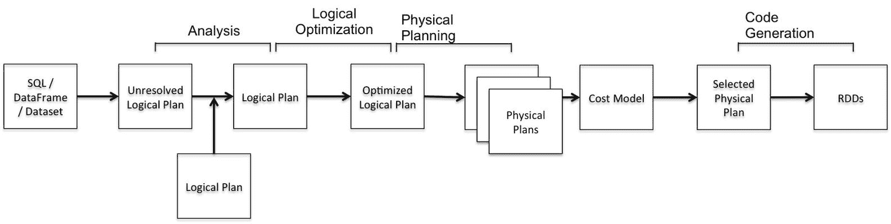

# 理解 Catalyst 优化

在 Catalyst 中，有两种主要类型的优化：逻辑和物理：

+   **逻辑优化**：这包括优化器将过滤谓词下推到数据源并使执行跳过无关数据的能力。例如，在 Parquet 文件的情况下，整个块可以被跳过，并且字符串的比较可以通过字典编码转换为更便宜的整数比较。在关系型数据库的情况下，谓词被下推到数据库以减少数据流量。

+   **物理优化**：这包括智能地选择广播连接和洗牌连接以减少网络流量，执行更低级别的优化，如消除昂贵的对象分配和减少虚拟函数调用。因此，当在程序中引入 DataFrame 时，性能通常会提高。

规则执行器负责分析和逻辑优化步骤，而一组策略和规则执行器负责物理规划步骤。规则执行器通过批量应用一组规则将一个树转换为另一个相同类型的树。这些规则可以应用一次或多次。此外，每个规则都被实现为一个转换。转换基本上是一个函数，与每个树相关联，并用于实现单个规则。在 Scala 术语中，转换被定义为部分函数（对其可能的参数子集定义的函数）。这些通常被定义为 case 语句，以确定部分函数（使用模式匹配）是否对给定输入定义。

规则执行器使物理计划准备好执行，通过准备标量子查询，确保输入行满足特定操作的要求，并应用物理优化。例如，在排序合并连接操作中，输入行需要根据连接条件进行排序。优化器在执行排序合并连接操作之前插入适当的排序操作，如有必要。

# 理解 Catalyst 转换

在概念上，Catalyst 优化器执行两种类型的转换。第一种将输入树类型转换为相同的树类型（即，不改变树类型）。这种类型的转换包括将一个表达式转换为另一个表达式，一个逻辑计划转换为另一个逻辑计划，一个物理计划转换为另一个物理计划。第二种类型的转换将一个树类型转换为另一个类型，例如，从逻辑计划转换为物理计划。通过应用一组策略，逻辑计划被转换为物理计划。这些策略使用模式匹配将树转换为另一种类型。例如，我们有特定的模式用于匹配逻辑项目和过滤运算符到物理项目和过滤运算符。

一组规则也可以合并成一个单一的规则来完成特定的转换。例如，根据您的查询，诸如过滤器之类的谓词可以被推送下来以减少执行连接操作之前的总行数。此外，如果您的查询中有一个带有常量的表达式，那么常量折叠优化会在编译时一次计算表达式，而不是在运行时为每一行重复计算。此外，如果您的查询需要一部分列，那么列修剪可以帮助减少列到必要的列。所有这些规则可以合并成一个单一的规则，以实现所有三种转换。

在下面的示例中，我们测量了 Spark 1.6 和 Spark 2.2 上的执行时间差异。我们在下一个示例中使用 iPinYou 实时竞价数据集进行计算广告研究。该数据集包含 iPinYou 全球 RTB 竞价算法竞赛的三个赛季的数据。您可以从伦敦大学学院的数据服务器上下载该数据集，网址为[`data.computational-advertising.org/`](http://data.computational-advertising.org/)。

首先，我们为`bid transactions`和`region`文件中的记录定义`case`类：

```scala
scala> case class PinTrans(bidid: String, timestamp: String, ipinyouid: String, useragent: String, IP: String, region: String, city: String, adexchange: String, domain: String, url:String, urlid: String, slotid: String, slotwidth: String, slotheight: String, slotvisibility: String, slotformat: String, slotprice: String, creative: String, bidprice: String) 

scala> case class PinRegion(region: String, regionName: String)
```

接下来，我们从一个`bids`文件和`region`文件创建 DataFrames：

```scala
scala> val pintransDF = spark.sparkContext.textFile("file:///Users/aurobindosarkar/Downloads/make-ipinyou-data-master/original-data/ipinyou.contest.dataset/training1st/bid.20130314.txt").map(_.split("\t")).map(attributes => PinTrans(attributes(0).trim, attributes(1).trim, attributes(2).trim, attributes(3).trim, attributes(4).trim, attributes(5).trim, attributes(6).trim, attributes(7).trim, attributes(8).trim, attributes(9).trim, attributes(10).trim, attributes(11).trim, attributes(12).trim, attributes(13).trim, attributes(14).trim, attributes(15).trim, attributes(16).trim, attributes(17).trim, attributes(18).trim)).toDF() 

scala> val pinregionDF = spark.sparkContext.textFile("file:///Users/aurobindosarkar/Downloads/make-ipinyou-data-master/original-data/ipinyou.contest.dataset/region.en.txt").map(_.split("\t")).map(attributes => PinRegion(attributes(0).trim, attributes(1).trim)).toDF()
```

接下来，我们借用一个简单的基准函数（在几个 Databricks 示例笔记本中可用）来测量执行时间：

```scala
scala> def benchmark(name: String)(f: => Unit) { 
 val startTime = System.nanoTime 
 f 
 val endTime = System.nanoTime 
 println(s"Time taken in $name: " + (endTime - startTime).toDouble / 1000000000 + " seconds") 
}
```

我们使用 SparkSession 对象将整体阶段代码生成参数关闭（这大致相当于 Spark 1.6 环境）。我们还测量了两个 DataFrame 之间的`join`操作的执行时间：

```scala
scala> spark.conf.set("spark.sql.codegen.wholeStage", false) 
scala> benchmark("Spark 1.6") {  
|  pintransDF.join(pinregionDF, "region").count()  
| }
Time taken in Spark 1.6: 3.742190552 seconds 
```

接下来，我们将整体阶段代码生成参数设置为 true，并测量执行时间。我们注意到在 Spark 2.2 中，相同代码的执行时间要低得多：

```scala
scala> spark.conf.set("spark.sql.codegen.wholeStage", true) 
scala> benchmark("Spark 2.2") {  
|  pintransDF.join(pinregionDF, "region").count()  
| }
Time taken in Spark 2.2: 1.881881579 seconds    
```

我们使用`explain()`函数来打印出 Catalyst 转换管道中的各个阶段。我们将在第十一章中更详细地解释以下输出，*调整 Spark SQL 组件以提高性能*：

```scala
scala> pintransDF.join(pinregionDF, "region").selectExpr("count(*)").explain(true) 
```

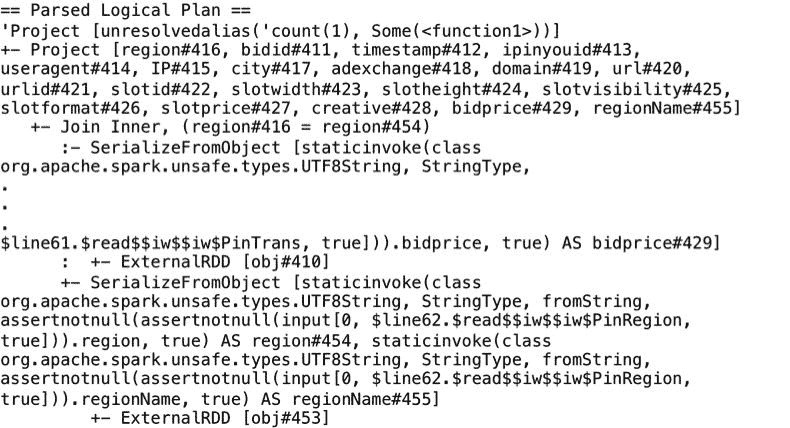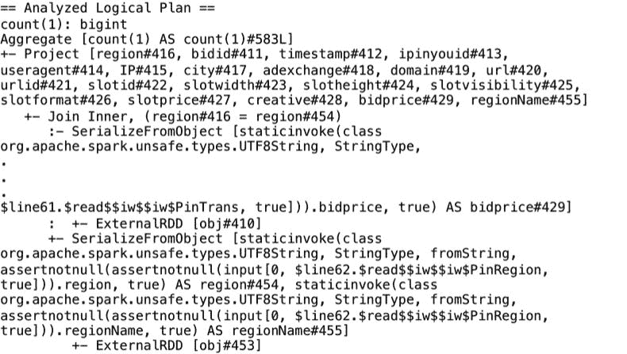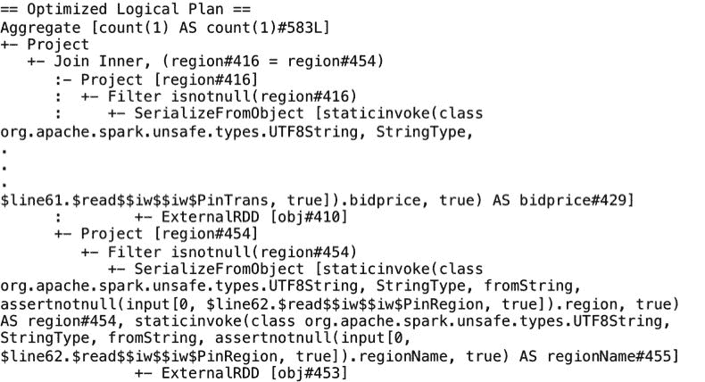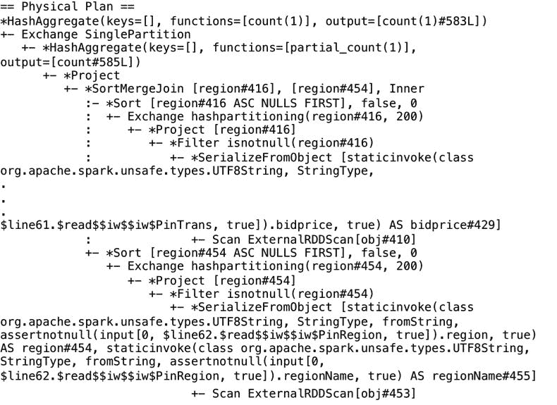

在接下来的部分中，我们将介绍 Project Tungsten 的与开发人员相关的细节。

# 引入 Project Tungsten

Project Tungsten 被吹捧为自项目成立以来对 Spark 执行引擎的最大改变。Project Tungsten 的动机是观察到在大多数 Spark 工作负载中，CPU 和内存而不是 I/O 和网络是瓶颈。

由于硬件改进（例如 SSD 和条带化 HDD 阵列用于存储）、Spark I/O 的优化（例如 shuffle 和网络层实现、输入数据修剪以减少磁盘 I/O 等）和数据格式的改进（例如 Parquet、二进制数据格式等），CPU 现在成为瓶颈。此外，Spark 中的大规模序列化和哈希任务是 CPU 绑定操作。

Spark 1.x 使用基于迭代器模型的查询评估策略（称为 Volcano 模型）。由于查询中的每个运算符都呈现了一个接口，该接口每次返回一个元组给树中的下一个运算符，因此这个接口允许查询执行引擎组合任意组合的运算符。在 Spark 2.0 之前，大部分 CPU 周期都花在无用的工作上，比如进行虚拟函数调用或者读取/写入中间数据到 CPU 缓存或内存。

Tungsten 项目专注于三个领域，以提高内存和 CPU 的效率，将性能推向底层硬件的极限。这三个领域是内存管理和二进制处理、缓存感知计算和代码生成。此外，集成在 Spark 2.0 中的第二代 Tungsten 执行引擎使用一种称为整体代码生成的技术。这种技术使引擎能够消除虚拟函数调度，并将中间数据从内存移动到 CPU 寄存器，并通过循环展开和 SIMD 利用现代 CPU 特性。此外，Spark 2.0 引擎还通过使用另一种称为矢量化的技术加速了被认为对于代码生成过于复杂的操作。

整体代码生成将整个查询折叠成一个单一函数。此外，它消除了虚拟函数调用，并使用 CPU 寄存器存储中间数据。这反过来显著提高了 CPU 效率和运行时性能。它实现了手写代码的性能，同时继续保持通用引擎。

在矢量化中，引擎以列格式批处理多行数据，每个运算符在一个批次内对数据进行迭代。然而，它仍然需要将中间数据放入内存，而不是保留在 CPU 寄存器中。因此，只有在无法进行整体代码生成时才使用矢量化。

Tungsten 内存管理改进侧重于将 Java 对象以紧凑的二进制格式存储，以减少 GC 开销，将内存中的数据格式更加密集，以减少溢出（例如 Parquet 格式），并且对于了解数据类型的运算符（在 DataFrames、Datasets 和 SQL 的情况下）直接针对内存中的二进制格式进行操作，而不是进行序列化/反序列化等操作。

代码生成利用现代编译器和 CPU 来实现改进。这包括更快的表达式评估和 DataFrame/SQL 运算符，以及更快的序列化器。在 JVM 上对表达式的通用评估非常昂贵，因为涉及虚拟函数调用、基于表达式类型的分支、对象创建和由于原始装箱而导致的内存消耗。通过动态生成自定义字节码，这些开销大大减少了。

在这里，我们介绍了启用了整体代码生成的前一节中的投标和地区 DataFrames 之间的连接操作的物理计划。在`explain()`输出中，当一个运算符标有星号`*`时，这意味着该运算符已启用整体代码生成。在以下物理计划中，这包括 Aggregate、Project、`SortMergeJoin`、Filter 和 Sort 运算符。然而，Exchange 不实现整体代码生成，因为它正在通过网络发送数据：

```scala
scala> pintransDF.join(pinregionDF, "region").selectExpr("count(*)").explain() 
```

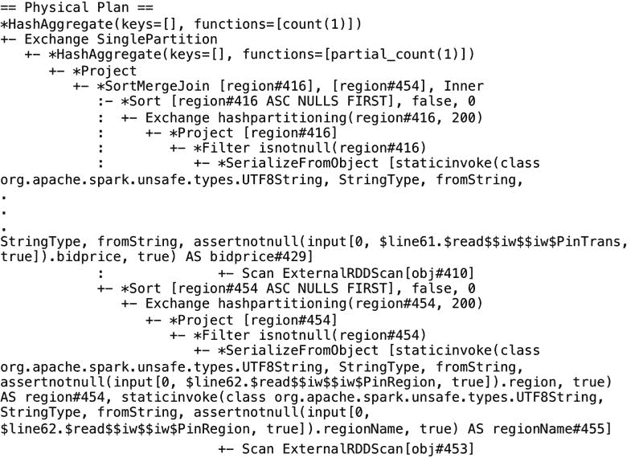

Tungsten 项目极大地改进了 DataFrames 和 Datasets（适用于所有编程 API - Java、Scala、Python 和 R）和 Spark SQL 查询。此外，对于许多数据处理运算符，新引擎的速度提高了数个数量级。

在接下来的部分中，我们将把重点转移到一个名为 Structured Streaming 的新 Spark 2.0 功能，它支持基于 Spark 的流应用程序。

# 在流应用程序中使用 Spark SQL

流应用变得越来越复杂，因为这样的计算不是孤立运行的。它们需要与批处理数据交互，支持交互式分析，支持复杂的机器学习应用等。通常，这样的应用将传入的事件流存储在长期存储中，持续监视事件，并在存储的数据上运行机器学习模型，同时在传入流上启用持续学习。它们还具有交互式查询存储的数据的能力，同时提供精确一次的写入保证，处理延迟到达的数据，执行聚合等。这些类型的应用远不止是简单的流应用，因此被称为连续应用。

在 Spark 2.0 之前，流应用是建立在 DStreams 的概念上的。使用 DStreams 存在一些痛点。在 DStreams 中，时间戳是事件实际进入 Spark 系统的时间；事件中嵌入的时间不被考虑。此外，尽管相同的引擎可以处理批处理和流处理计算，但涉及的 API 虽然在 RDD（批处理）和 DStream（流处理）之间相似，但需要开发人员进行代码更改。DStream 流模型让开发人员承担了处理各种故障条件的负担，并且很难推理数据一致性问题。在 Spark 2.0 中，引入了结构化流处理来解决所有这些痛点。

结构化流处理是一种快速、容错、精确一次的有状态流处理方法。它使流分析无需考虑流的基本机制。在新模型中，输入可以被视为来自一个不断增长的追加表的数据。触发器指定了检查输入以获取新数据到达的时间间隔。如下图所示，查询表示查询或操作，例如 map、filter 和 reduce 在输入上的操作，结果表示根据指定的操作在每个触发间隔更新的最终表。输出定义了每个时间间隔写入数据接收器的结果的部分。

输出模式可以是 complete、delta 或 append，其中 complete 输出模式表示每次写入完整的结果表，delta 输出模式写入前一批次的更改行，append 输出模式分别只写入新行：

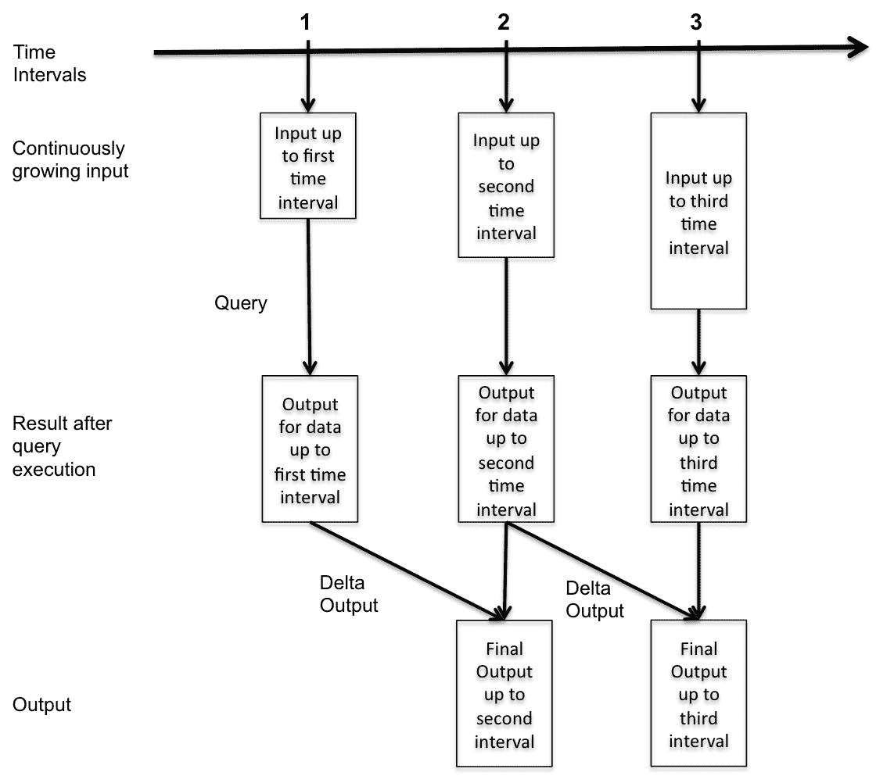

在 Spark 2.0 中，除了静态有界的 DataFrame，我们还有连续无界的 DataFrame 的概念。静态和连续的 DataFrame 都使用相同的 API，从而统一了流、交互和批处理查询。例如，您可以在流中聚合数据，然后使用 JDBC 提供服务。高级流 API 建立在 Spark SQL 引擎上，并与 SQL 查询和 DataFrame/Dataset API 紧密集成。主要好处是您可以使用相同的高级 Spark DataFrame 和 Dataset API，Spark 引擎会找出所需的增量和连续执行操作。

此外，还有查询管理 API，您可以使用它来管理多个并发运行的流查询。例如，您可以列出运行中的查询，停止和重新启动查询，在失败的情况下检索异常等。我们将在第五章中详细了解结构化流处理，*在流应用中使用 Spark SQL*。

在下面的示例代码中，我们使用 iPinYou 数据集中的两个出价文件作为我们流数据的来源。首先，我们定义我们的输入记录模式并创建一个流输入 DataFrame：

```scala
scala> import org.apache.spark.sql.types._ 
scala> import org.apache.spark.sql.functions._ 
scala> import scala.concurrent.duration._ 
scala> import org.apache.spark.sql.streaming.ProcessingTime 
scala> import org.apache.spark.sql.streaming.OutputMode.Complete 

scala> val bidSchema = new StructType().add("bidid", StringType).add("timestamp", StringType).add("ipinyouid", StringType).add("useragent", StringType).add("IP", StringType).add("region", IntegerType).add("city", IntegerType).add("adexchange", StringType).add("domain", StringType).add("url:String", StringType).add("urlid: String", StringType).add("slotid: String", StringType).add("slotwidth", StringType).add("slotheight", StringType).add("slotvisibility", StringType).add("slotformat", StringType).add("slotprice", StringType).add("creative", StringType).add("bidprice", StringType) 

scala> val streamingInputDF = spark.readStream.format("csv").schema(bidSchema).option("header", false).option("inferSchema", true).option("sep", "\t").option("maxFilesPerTrigger", 1).load("file:///Users/aurobindosarkar/Downloads/make-ipinyou-data-master/original-data/ipinyou.contest.dataset/bidfiles")
```

接下来，我们定义我们的查询时间间隔为`20 秒`，输出模式为`Complete`：

```scala
scala> val streamingCountsDF = streamingInputDF.groupBy($"city").count() 

scala> val query = streamingCountsDF.writeStream.format("console").trigger(ProcessingTime(20.seconds)).queryName("counts").outputMode(Complete).start()
```

在输出中，您将观察到每个区域的出价数量在每个时间间隔中随着新数据的到达而更新。您需要将新的出价文件（或者从原始数据集中开始使用多个出价文件，它们将根据`maxFilesPerTrigger`的值依次被处理）放入`bidfiles`目录中，以查看更新后的结果：

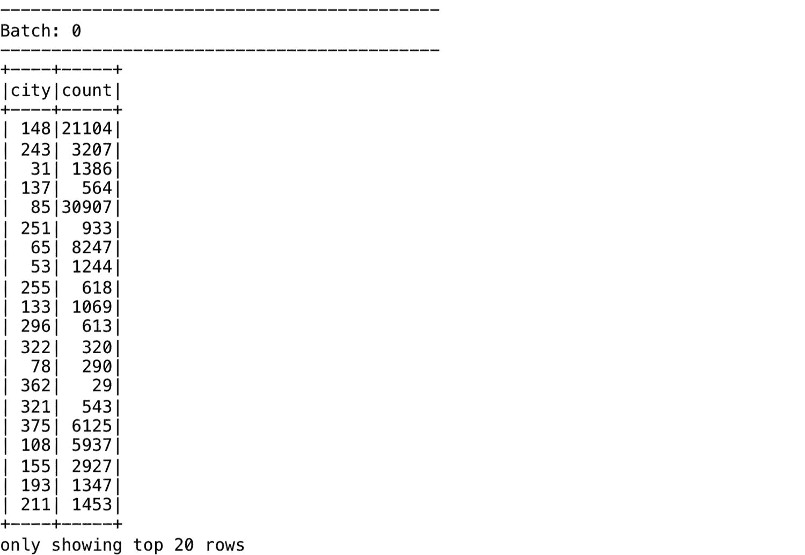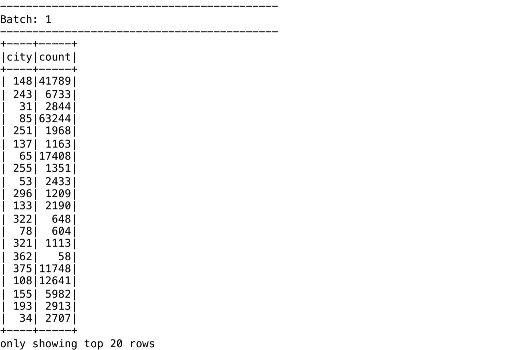

此外，您还可以查询系统中的活动流，如下所示：

```scala
scala> spark.streams.active.foreach(println) 
Streaming Query - counts [state = ACTIVE]
```

最后，您可以使用`stop()`方法停止流应用程序的执行，如下所示：

```scala
//Execute the stop() function after you have finished executing the code in the next section.
scala> query.stop()
```

在下一节中，我们将从概念上描述结构化流的内部工作原理。

# 理解结构化流的内部机制

为了启用结构化流功能，规划器会从源中轮询新数据，并在写入到接收器之前对其进行增量计算。此外，应用程序所需的任何运行聚合都将作为由**Write-Ahead Log**（**WAL**）支持的内存状态进行维护。内存状态数据是在增量执行中生成和使用的。这类应用程序的容错需求包括能够恢复和重放系统中的所有数据和元数据。规划器在执行之前将偏移量写入到持久存储（如 HDFS）上的容错 WAL 中，如图所示：

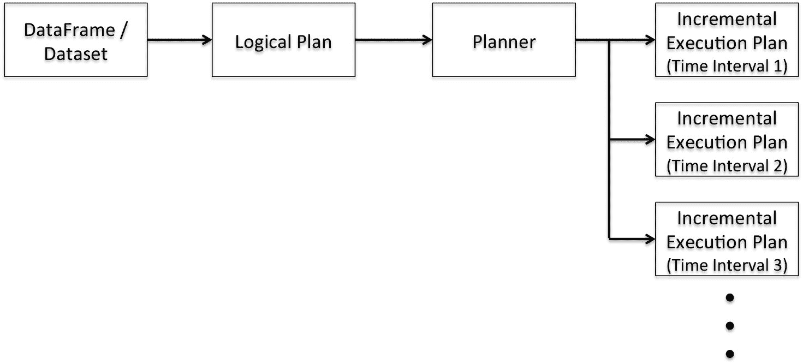

如果规划器在当前的增量执行中失败，重新启动的规划器将从 WAL 中读取并重新执行所需的确切偏移范围。通常，诸如 Kafka 之类的源也是容错的，并且在规划器恢复的适当偏移量的情况下生成原始事务数据。状态数据通常在 Spark 工作节点中以版本化的键值映射形式进行维护，并由 HDFS 上的 WAL 支持。规划器确保使用正确的状态版本来重新执行故障后的事务。此外，接收器在设计上是幂等的，并且可以处理输出的重复执行而不会出现重复提交。因此，偏移跟踪在 WAL 中，状态管理以及容错源和接收器的整体组合提供了端到端的精确一次性保证。

我们可以使用`explain`方法列出结构化流示例的物理计划，如下所示：

```scala
scala> spark.streams.active(0).explain 
```

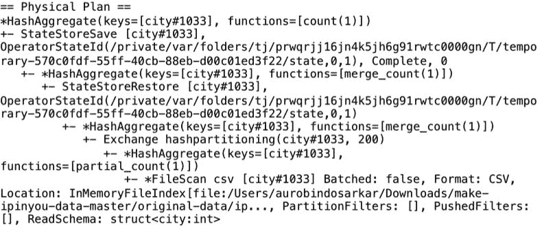

我们将在第十一章中更详细地解释上述输出，*调整 Spark SQL 组件以提高性能*。

# 总结

在本章中，我们向您介绍了 Spark SQL、SparkSession（Spark SQL 的主要入口点）和 Spark SQL 接口（RDD、DataFrames 和 Dataset）。然后，我们描述了 Spark SQL 的一些内部机制，包括基于 Catalyst 和 Project Tungsten 的优化。最后，我们探讨了如何在流应用程序中使用 Spark SQL 以及结构化流的概念。本章的主要目标是让您了解 Spark SQL 的概况，同时通过实际操作（使用公共数据集）让您熟悉 Spark 环境。

在下一章中，我们将详细介绍如何使用 Spark SQL 来探索大数据应用程序中典型的结构化和半结构化数据。
