# 第二章：使用 Spark SQL 处理结构化和半结构化数据

在本章中，我们将介绍如何使用 Spark SQL 与不同类型的数据源和数据存储格式。Spark 提供了易于使用的标准结构（即 RDD 和 DataFrame/Datasets），可用于处理结构化和半结构化数据。我们包括一些在大数据应用中最常用的数据源，如关系数据、NoSQL 数据库和文件（CSV、JSON、Parquet 和 Avro）。Spark 还允许您定义和使用自定义数据源。本章中的一系列实践练习将使您能够使用 Spark 处理不同类型的数据源和数据格式。

在本章中，您将学习以下主题：

+   了解 Spark 应用中的数据源

+   使用 JDBC 与关系数据库交互

+   使用 Spark 与 MongoDB（NoSQL 数据库）

+   处理 JSON 数据

+   使用 Spark 与 Avro 和 Parquet 数据集

# 了解 Spark 应用中的数据源

Spark 可以连接到许多不同的数据源，包括文件、SQL 和 NoSQL 数据库。一些更受欢迎的数据源包括文件（CSV、JSON、Parquet、AVRO）、MySQL、MongoDB、HBase 和 Cassandra。

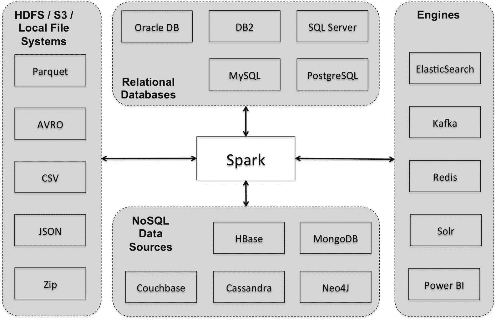

此外，它还可以连接到专用引擎和数据源，如 ElasticSearch、Apache Kafka 和 Redis。这些引擎可以在 Spark 应用中实现特定功能，如搜索、流处理、缓存等。例如，Redis 可以在高性能应用中部署缓存的机器学习模型。我们将在第十二章中讨论更多关于基于 Redis 的应用部署的内容，即*大规模应用架构中的 Spark SQL*。Kafka 在 Spark 流处理应用中非常受欢迎，我们将在第五章和第十二章中详细介绍基于 Kafka 的流处理应用，即*在流处理应用中使用 Spark SQL*和*大规模应用架构中的 Spark SQL*。DataSource API 使 Spark 能够连接到各种数据源，包括自定义数据源。

请参考 Spark 软件包网站[`spark-packages.org/`](https://spark-packages.org/)，以使用各种数据源、算法和专用数据集。

在第一章中，*开始使用 Spark SQL*，我们使用文件系统上的 CSV 和 JSON 文件作为输入数据源，并使用 SQL 进行查询。但是，使用 Spark SQL 查询存储在文件中的数据并不是使用数据库的替代品。最初，一些人使用 HDFS 作为数据源，因为使用 Spark SQL 查询此类数据的简单性和便利性。然而，执行性能可能会根据执行的查询和工作负载的性质而有显著差异。架构师和开发人员需要了解使用哪些数据存储来最好地满足其处理需求。我们将在下面讨论选择 Spark 数据源的一些高级考虑因素。

# 选择 Spark 数据源

文件系统是存储大量数据和支持大型数据集通用处理的理想场所。使用文件的一些好处包括廉价的存储、灵活的处理和可扩展性。将大规模数据存储在文件中的决定通常是由商业数据库存储同样数据的成本限制所驱动的。此外，当数据的性质不适合典型的数据库优化时，例如非结构化数据时，通常也会优先选择文件存储。此外，具有迭代内存处理需求和分布式算法的工作负载，例如机器学习应用，可能更适合在分布式文件系统上运行。

通常在文件系统上存储的数据类型包括归档数据、非结构化数据、大规模社交媒体和其他网络规模数据集，以及主要数据存储的备份副本。最适合在文件上支持的工作负载类型包括批处理工作负载、探索性数据分析、多阶段处理管道和迭代工作负载。使用文件的热门案例包括 ETL 管道、跨多种数据源拼接数据，如日志文件、CSV、Parquet、压缩文件格式等。此外，您可以选择以针对特定处理需求进行优化的多种格式存储相同的数据。

与 Spark 连接到文件系统不太适合的是频繁的随机访问、频繁的插入、频繁/增量更新以及在多用户情况下承受重负载条件下的报告或搜索操作。随着我们的深入，将更详细地讨论这些使用案例。

在 Spark 中支持从分布式存储中选择少量记录的查询，但效率不高，因为通常需要 Spark 浏览所有文件以找到结果行。这对于数据探索任务可能是可以接受的，但对于来自多个并发用户的持续处理负载则不行。如果您需要频繁和随机地访问数据，使用数据库可能是更有效的解决方案。使用传统的 SQL 数据库使数据可用于用户，并在关键列上创建索引可以更好地支持这种使用案例。另外，键值 NoSQL 存储也可以更有效地检索键的值。

每次插入都会创建一个新文件，插入速度相当快，但查询速度较慢，因为 Spark 作业需要打开所有这些文件并从中读取以支持查询。同样，用于支持频繁插入的数据库可能是更好的解决方案。另外，您还可以定期压缩 Spark SQL 表文件，以减少总文件数量。使用`Select *`和`coalesce` DataFrame 命令，将从多个输入文件创建的 DataFrame 中的数据写入单个/组合输出文件。

其他操作和使用案例，如频繁/增量更新、报告和搜索，最好使用数据库或专门的引擎来处理。文件不适合更新随机行。然而，数据库非常适合执行高效的更新操作。您可以将 Spark 连接到 HDFS 并使用 BI 工具，如 Tableau，但最好将数据转储到数据库以为承受负载的并发用户提供服务。通常，最好使用 Spark 读取数据，执行聚合等操作，然后将结果写入为最终用户提供服务的数据库。在搜索使用案例中，Spark 将需要浏览每一行以查找并返回搜索结果，从而影响性能。在这种情况下，使用专门的引擎，如 ElasticSearch 和 Apache Solr，可能比使用 Spark 更好。

在数据严重倾斜的情况下，或者在集群上执行更快的连接时，我们可以使用集群或分桶技术来提高性能。

# 使用 Spark 与关系数据库

关于关系数据库是否适合大数据处理场景存在着巨大的争论。然而，不可否认的是，企业中大量结构化数据存储在这些数据库中，并且组织在关键业务交易中严重依赖现有的关系数据库管理系统。

绝大多数开发人员最喜欢使用关系数据库和主要供应商提供的丰富工具集。越来越多的云服务提供商，如亚马逊 AWS，已经简化了许多组织将其大型关系数据库转移到云端的管理、复制和扩展。

关系数据库的一些很好的大数据使用案例包括以下内容：

+   复杂的 OLTP 事务

+   需要 ACID 合规性的应用程序或功能

+   支持标准 SQL

+   实时自发查询功能

+   实施许多复杂关系的系统

有关 NoSQL 和关系使用情况的出色覆盖，请参阅标题为“你到底在使用 NoSQL 做什么？”的博客[`highscalability.com/blog/2010/12/6/what-the-heck-are-you-actually-using-nosql-for.html`](http://highscalability.com/blog/2010/12/6/what-the-heck-are-you-actually-using-nosql-for.html)。

在 Spark 中，很容易处理关系数据并将其与不同形式和格式的其他数据源结合起来：

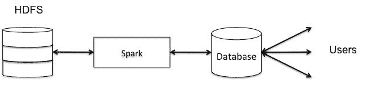

作为使用 Spark 与 MySQL 数据库的示例，我们将实现一个用例，其中我们将数据在 HDFS 和 MySQL 之间进行分割。MySQL 数据库将用于支持来自并发用户的交互式查询，而 HDFS 上的数据将用于批处理、运行机器学习应用程序以及向 BI 工具提供数据。在此示例中，我们假设交互式查询仅针对当前月份的数据。因此，我们将只保留当前月份的数据在 MySQL 中，并将其余数据写入 HDFS（以 JSON 格式）。

我们将遵循的实施步骤如下：

1.  创建 MySQL 数据库。

1.  定义一个表。

1.  创建用户 ID 并授予权限。

1.  使用 MySQL JDBC 驱动程序启动 Spark shell。

1.  从输入数据文件创建一个 RDD，分离标题，定义模式并创建一个 DataFrame。

1.  为时间戳创建一个新列。

1.  根据时间戳值（当前月份数据和以前月份的其余数据）将数据分成两个 DataFrame。

1.  删除原始 invoiceDate 列，然后将时间戳列重命名为 invoiceDate。

1.  将包含当前月份数据的 DataFrame 写入 MySQL 表中。

1.  将包含数据（除当前月份数据之外的数据）的 DataFrame 写入 HDFS（以 JSON 格式）。

如果您尚未安装和可用 MySQL，可以从[`www.mysql.com/downloads/`](https://www.mysql.com/downloads/)下载。按照特定操作系统的安装说明安装数据库。此外，从同一网站下载可用的 JDBC 连接器。

在您的 MySQL 数据库服务器运行起来后，启动 MySQL shell。在接下来的步骤中，我们将创建一个新数据库并定义一个交易表。我们使用一个包含所有发生在 2010 年 12 月 1 日至 2011 年 12 月 9 日之间的交易的交易数据集，这是一个基于英国注册的非实体在线零售的数据集。该数据集由伦敦南岸大学工程学院公共分析小组主任 Dr Daqing Chen 贡献，并可在[`archive.ics.uci.edu/ml/datasets/Online+Retail`](https://archive.ics.uci.edu/ml/datasets/Online+Retail)上找到。

当您启动 MySQL shell 时，应该看到类似以下的屏幕：

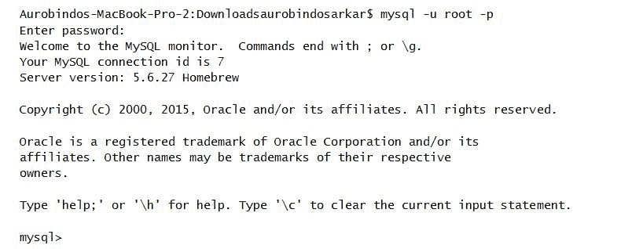

1.  创建一个名为`retailDB`的新数据库来存储我们的客户交易数据：

```scala
      mysql> create database retailDB;
      Connect to retailDB as follows:
      mysql> use retailDB;
```

1.  在这里，我们使用`transactionID`作为主键定义了一个交易表。在生产场景中，您还将在其他字段上创建索引，例如`CustomerID`，以更有效地支持查询：

```scala
      mysql>create table transactions(transactionID integer not null 
      auto_increment, invoiceNovarchar(20), stockCodevarchar(20), 
      description varchar(255), quantity integer, unitPrice double, 
      customerIDvarchar(20), country varchar(100), invoiceDate 
      Timestamp, primary key(transactionID));
```

接下来，使用`describe`命令验证交易表模式，以确保它完全符合我们的要求：

```scala
mysql> describe transactions;
```

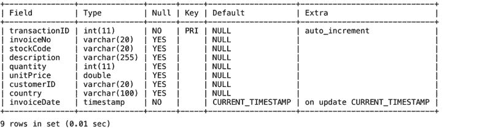

1.  创建一个名为`retaildbuser`的用户 ID 并授予其所有权限。我们将从我们的 Spark shell 中使用此用户进行连接和执行查询。

```scala
      mysql> CREATE USER 'retaildbuser'@'localhost' IDENTIFIED BY 
             'mypass';
      mysql> GRANT ALL ON retailDB.* TO 'retaildbuser'@'localhost';
```

1.  启动包含 MySQL JDBC 驱动程序路径的 Spark shell，如下所示：

```scala
      SPARK_CLASSPATH=/Users/aurobindosarkar/Downloads/mysql-connector-
      java-5.1.38/mysql-connector-java-5.1.38-bin.jar bin/spark-shell
```

1.  创建一个包含我们下载的数据集中所有行的`RDD`：

```scala
      scala> import org.apache.spark.sql.types._
      scala> import org.apache.spark.sql.Row
      scala> import java.util.Properties

      scala>val inFileRDD =       
      sc.textFile("file:///Users/aurobindosarkar/Downloads/UCI Online  
      Retail.txt")
```

1.  将标题与其余数据分开：

```scala
      scala>val allRowsRDD = inFileRDD.map(line 
      =>line.split("\t").map(_.trim))
      scala>val header = allRowsRDD.first
      scala>val data = allRowsRDD.filter(_(0) != header(0))
```

1.  定义字段并为我们的数据记录定义模式，如下所示：

```scala
      scala>val fields = Seq(
      | StructField("invoiceNo", StringType, true),
      | StructField("stockCode", StringType, true),
      | StructField("description", StringType, true),
      | StructField("quantity", IntegerType, true),
      | StructField("invoiceDate", StringType, true),
      | StructField("unitPrice", DoubleType, true),
      | StructField("customerID", StringType, true),
      | StructField("country", StringType, true)
      | )
      scala>val schema = StructType(fields)
```

1.  创建一个包含 Row 对象的`RDD`，使用先前创建的模式创建一个 DataFrame：

```scala
      scala>val rowRDD = data.map(attributes => Row(attributes(0), 
      attributes(1), attributes(2), attributes(3).toInt, attributes(4), 
      attributes(5).toDouble, attributes(6), attributes(7)))

      scala>val r1DF = spark.createDataFrame(rowRDD, schema)
```

1.  向 DataFrame 添加名为`ts`（时间戳列）的列，如下所示：

```scala
      scala>val ts = 
      unix_timestamp($"invoiceDate","dd/MM/yyHH:mm").cast("timestamp")
      scala>val r2DF = r1DF.withColumn("ts", ts)
      scala>r2DF.show()
```

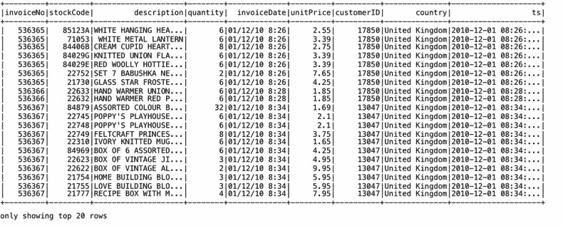

1.  创建一个表对象，并执行适当的 SQL 将表数据基于时间戳分成两个 DataFrame：

```scala
      scala> r2DF.createOrReplaceTempView("retailTable")
      scala>val r3DF = spark.sql("select * from retailTable where ts< 
      '2011-12-01'")
      scala>val r4DF = spark.sql("select * from retailTable where ts>= 
      '2011-12-01'")
```

1.  删除我们新 DataFrame 中的`invoiceDate`列。

```scala
      scala>val selectData = r4DF.select("invoiceNo", "stockCode", 
      "description", "quantity", "unitPrice", "customerID", "country", 
      "ts")
```

1.  将`ts`列重命名为`invoiceDate`，如下所示：

```scala
      scala>val writeData = selectData.withColumnRenamed("ts", 
      "invoiceDate")
      scala>writeData.show()
```

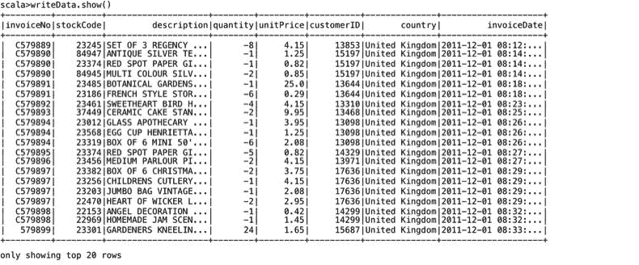

1.  创建一个指向数据库 URL 的变量。另外，创建一个`Properties`对象来保存连接到`retailDB`所需的用户 ID 和密码。接下来，连接到 MySQL 数据库，并将“当前月份”的记录插入到 transactions 表中：

```scala
      scala>val dbUrl = "jdbc:mysql://localhost:3306/retailDB"
      scala>val prop = new Properties()
      scala>prop.setProperty("user", "retaildbuser")
      scala>prop.setProperty("password", "mypass")
      scala>writeData.write.mode("append").jdbc(dbUrl, "transactions", 
      prop)
```

1.  从 DataFrame 中选择感兴趣的列（包含当前月份以外的数据），并以 JSON 格式将其写入 HDFS 文件系统：

```scala
      scala>val selectData = r3DF.select("invoiceNo", "stockCode", 
      "description", "quantity", "unitPrice", "customerID", "country", 
      "ts")

      scala>val writeData = selectData.withColumnRenamed("ts", 
      "invoiceDate")
      scala>writeData.select("*").write.format("json")
      .save("hdfs://localhost:9000/Users/r3DF")
```

# 使用 Spark 处理 MongoDB（NoSQL 数据库）

在本节中，我们将使用 Spark 与最流行的 NoSQL 数据库之一 - MongoDB。 MongoDB 是一个分布式文档数据库，以类似 JSON 的格式存储数据。与关系数据库中的严格模式不同，MongoDB 中的数据结构更加灵活，存储的文档可以具有任意字段。这种灵活性与高可用性和可扩展性功能结合在一起，使其成为许多应用程序中存储数据的良好选择。它还是免费和开源软件。

如果您尚未安装和可用 MongoDB，则可以从[`www.mongodb.org/downloads`](https://www.mongodb.com/download-center#community)下载。按照特定操作系统的安装说明安装数据库。

本示例的纽约市学校目录数据集来自纽约市开放数据网站，可从[`nycplatform.socrata.com/data?browseSearch=&scope=&agency=&cat=education&type=datasets`](https://nycplatform.socrata.com/data?browseSearch=&scope=&agency=&cat=education&type=datasets)下载。

在您的 MongoDB 数据库服务器运行后，启动 MongoDB shell。在接下来的步骤中，我们将创建一个新数据库，定义一个集合，并使用命令行中的 MongoDB 导入实用程序插入纽约市学校的数据。

当您启动 MongoDB shell 时，应该看到类似以下的屏幕：

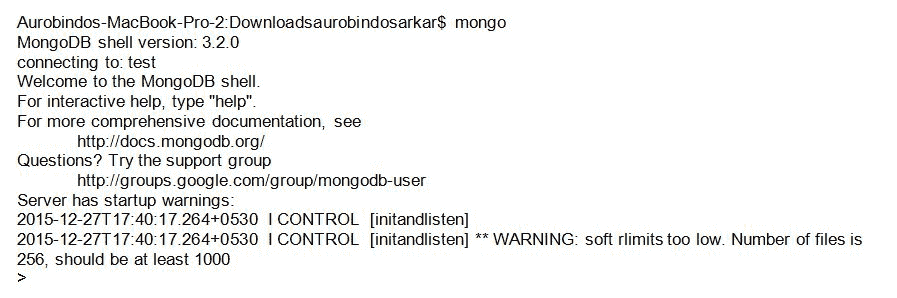

接下来，执行`use <DATABASE>`命令选择现有数据库或创建一个新数据库（如果不存在）。

如果在创建新集合时出现错误，可以使用`db.dropDatabase()`和/或`db.collection.drop()`命令分别删除数据库和/或集合，然后根据需要重新创建它。

```scala
>use nycschoolsDB
switched to dbnycschoolsDB
```

`mongoimport`实用程序需要从命令提示符（而不是`mongodb` shell）中执行：

```scala

mongoimport --host localhost --port 27017 --username <your user name here> --password "<your password here>" --collection schools --db nycschoolsDB --file <your download file name here>
```

您可以列出导入的集合并打印记录以验证导入操作，如下所示：

```scala
>show collections
 schools
 >db.schools.findOne()
```

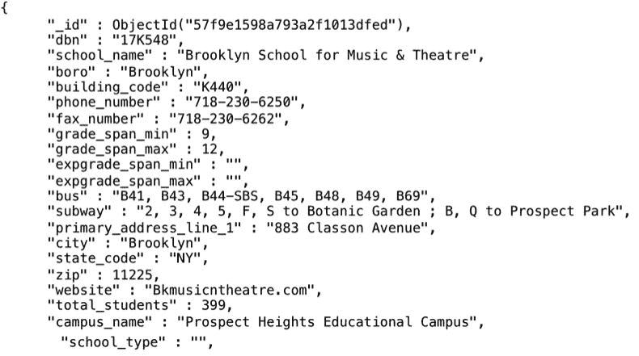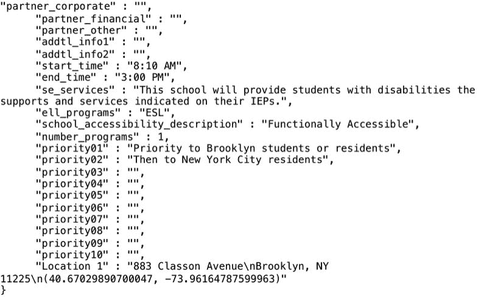

您可以从[`repo1.maven.org/maven2/org/mongodb/spark/mongo-spark-connector_2.11/2.2.0/`](http://repo1.maven.org/maven2/org/mongodb/spark/mongo-spark-connector_2.11/2.2.0/)下载适用于 Spark 2.2 的`mongo-spark-connector jar`（`mongo-spark-connector_2.11-2.2.0-assembly.jar`）。

接下来，使用命令行指定`mongo-spark-connector_2.11-2.2.0-assembly.jar`文件启动 Spark shell：

```scala
./bin/spark-shell --jars /Users/aurobindosarkar/Downloads/mongo-spark-connector_2.11-2.2.0-assembly.jar
scala> import org.apache.spark.sql.SQLContext
scala> import org.apache.spark.{SparkConf, SparkContext}
scala> import com.mongodb.spark.MongoSpark
scala> import com.mongodb.spark.config.{ReadConfig, WriteConfig}
```

接下来，我们定义了从 Spark 进行`read`和`write`操作的 URI：

```scala
scala>val readConfig = ReadConfig(Map("uri" -> "mongodb://localhost:27017/nycschoolsDB.schools?readPreference=primaryPreferred"))

scala>val writeConfig = WriteConfig(Map("uri" -> "mongodb://localhost:27017/nycschoolsDB.outCollection"))
```

定义一个学校记录的`case`类，如下所示：

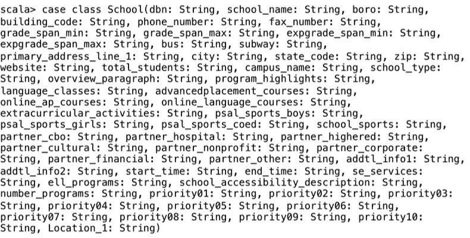

接下来，您可以从我们的集合创建一个 DataFrame，并显示新创建的 DataFrame 中的记录。

```scala
scala>val schoolsDF = MongoSpark.load(sc, readConfig).toDF[School]

scala>schoolsDF.take(1).foreach(println)
```


注意：以下各节将在稍后使用最新版本的连接器包进行更新。

在接下来的几节中，我们将描述使用 Spark 处理几种流行的大数据文件格式。

# 使用 Spark 处理 JSON 数据

JSON 是一种简单、灵活和紧凑的格式，在 Web 服务中广泛用作数据交换格式。Spark 对 JSON 的支持非常好。不需要为 JSON 数据定义模式，因为模式会自动推断。此外，Spark 极大地简化了访问复杂 JSON 数据结构中字段所需的查询语法。我们将在第十二章《大规模应用架构中的 Spark SQL》中详细介绍 JSON 数据的示例。

此示例的数据集包含大约 169 万条电子产品类别的亚马逊评论，可从以下网址下载：[`jmcauley.ucsd.edu/data/amazon/`](http://jmcauley.ucsd.edu/data/amazon/)。

我们可以直接读取 JSON 数据集以创建 Spark SQL DataFrame。我们将从 JSON 文件中读取一组订单记录的示例集：

```scala
scala>val reviewsDF = spark.read.json("file:///Users/aurobindosarkar/Downloads/reviews_Electronics_5.json")
```

您可以使用`printSchema`方法打印新创建的 DataFrame 的模式，以验证字段及其特性。

```scala
scala> reviewsDF.printSchema()
```

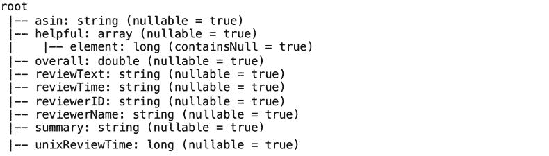

一旦 JSON 数据集转换为 Spark SQL DataFrame，您可以以标准方式进行大量操作。接下来，我们将执行 SQL 语句，从特定年龄段的客户接收的订单中选择特定列：

```scala
scala>reviewsDF.createOrReplaceTempView("reviewsTable")
scala>val selectedDF = spark.sql("SELECT asin, overall, reviewTime, reviewerID, reviewerName FROM reviewsTable WHERE overall >= 3")
```

使用`show`方法显示 SQL 执行结果（存储在另一个 DataFrame 中），如下所示：

```scala
scala> selectedDF.show()
```

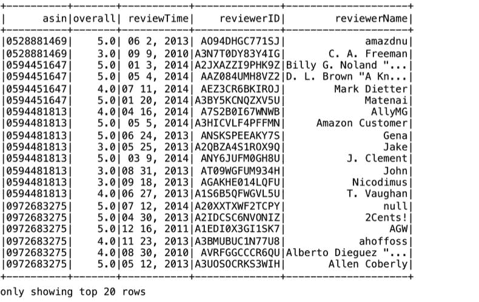

我们可以使用 DSL 访问`reviewDF` DataFrame 中`helpful`列的数组元素，如下所示：

```scala
scala> val selectedJSONArrayElementDF = reviewsDF.select($"asin", $"overall", $"helpful").where($"helpful".getItem(0) < 3)

scala>selectedJSONArrayElementDF.show()
```

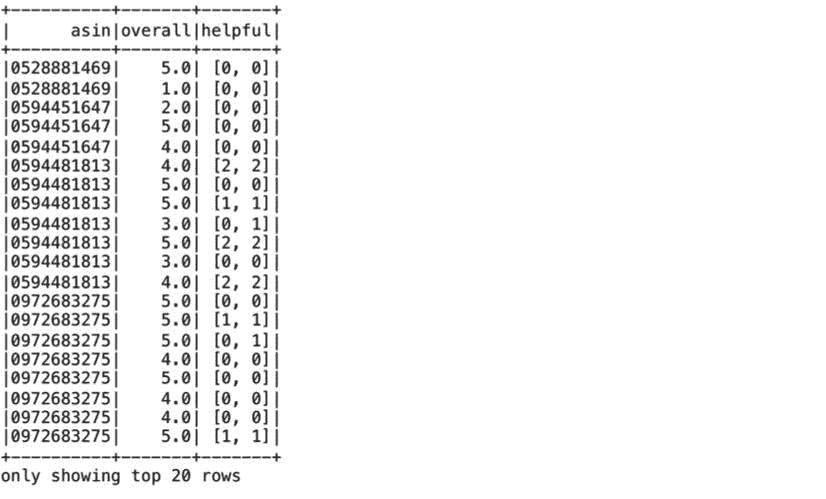

在前面的部分中，我们演示了将 DataFrame 写出为 JSON 文件的示例，其中我们从 DataFrame 中选择了感兴趣的列（包含当前月份之外的数据），并将其写出为 JSON 格式到 HDFS 文件系统。

# 使用 Avro 文件的 Spark

Avro 是一个非常流行的数据序列化系统，提供了紧凑和快速的二进制数据格式。Avro 文件是自描述的，因为模式与数据一起存储。

您可以从[`mvnrepository.com/artifact/com.databricks/spark-avro_2.11/3.2.0`](https://mvnrepository.com/artifact/com.databricks/spark-avro_2.11/3.2.0)下载`spark-avro connector` JAR。

我们将在本节切换到 Spark 2.1。在撰写本书时，由于`spark-avro connector`库中的已记录的错误，我们在使用`spark-avro connector 3.2`与 Spark 2.2 时遇到异常。

启动包含 spark-avro JAR 的 Spark shell 会话：

```scala
Aurobindos-MacBook-Pro-2:spark-2.1.0-bin-hadoop2.7 aurobindosarkar$ bin/spark-shell --jars /Users/aurobindosarkar/Downloads/spark-avro_2.11-3.2.0.jar
```

我们将使用前一节中包含亚马逊评论数据的 JSON 文件来创建`Avro`文件。从输入 JSON 文件创建一个 DataFrame，并显示记录数：

```scala
scala> import com.databricks.spark.avro._
scala> val reviewsDF = spark.read.json("file:///Users/aurobindosarkar/Downloads/reviews_Electronics_5.json")

scala> reviewsDF.count()
res4: Long = 1689188  
```

接下来，我们过滤所有评分低于`3`的评论，将输出合并为单个文件，并将结果 DataFrame 写出为`Avro`文件：

```scala
scala> reviewsDF.filter("overall < 3").coalesce(1).write.avro("file:///Users/aurobindosarkar/Downloads/amazon_reviews/avro")

```

接下来，我们展示如何通过从上一步创建的`Avro`文件创建一个 DataFrame 来读取`Avro`文件，并显示其中的记录数：

```scala
scala> val reviewsAvroDF = spark.read.avro("file:///Users/aurobindosarkar/Downloads/amazon_reviews/avro/part-00000-c6b6b423-70d6-440f-acbe-0de65a6a7f2e.avro")

scala> reviewsAvroDF.count()
res5: Long = 190864
```

接下来，我们选择几列，并通过指定`show(5)`显示结果 DataFrame 的前五条记录：

```scala
scala> reviewsAvroDF.select("asin", "helpful", "overall", "reviewTime", "reviewerID", "reviewerName").show(5)
```

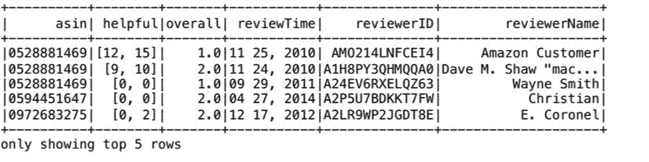

接下来，通过设置 Spark 会话配置值为`Avro`文件指定压缩选项：

```scala
scala> spark.conf.set("spark.sql.avro.compression.codec", "deflate")
scala> spark.conf.set("spark.sql.avro.deflate.level", "5")
```

现在，当我们写入 DataFrame 时，`Avro`文件以压缩格式存储：

```scala
scala> val reviewsAvroDF = spark.read.avro("file:////Users/aurobindosarkar/Downloads/amazon_reviews/avro/part-00000-c6b6b423-70d6-440f-acbe-0de65a6a7f2e.avro")
```

您还可以按特定列对 DataFrame 进行分区。在这里，我们基于`overall`列（每行包含`值<3`）进行分区：

```scala
scala> reviewsAvroDF.write.partitionBy("overall").avro("file:////Users/aurobindosarkar/Downloads/amazon_reviews/avro/partitioned")
```

此会话中 Avro 文件的屏幕截图显示在此处。请注意压缩版本（67 MB）与原始文件（97.4 MB）的大小。此外，请注意为分区（按`overall`值）`Avro`文件创建的两个单独目录。

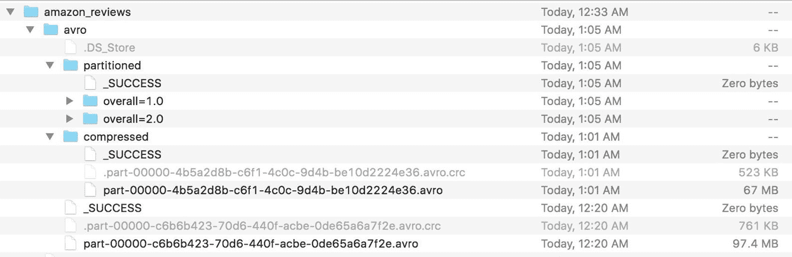

有关`spark-avro`的更多详细信息，请参阅：[`github.com/databricks/spark-avro`](https://github.com/databricks/spark-avro)

# 使用 Parquet 文件的 Spark

Apache Parquet 是一种流行的列存储格式。它在 Hadoop 生态系统中的许多大数据应用程序中使用。Parquet 支持非常高效的压缩和编码方案，可以显著提高这些应用程序的性能。在本节中，我们向您展示了您可以直接将 Parquet 文件读入标准 Spark SQL DataFrame 的简单性。

在这里，我们使用之前从 Amazon 评论的 JSON 格式文件中创建的 reviewsDF，并将其以 Parquet 格式写出，以创建 Parquet 文件。我们使用`coalesce(1)`来创建一个单一的输出文件：

```scala
scala> reviewsDF.filter("overall < 3").coalesce(1).write.parquet("file:///Users/aurobindosarkar/Downloads/amazon_reviews/parquet")
```

在下一步中，我们使用一个语句从 Parquet 文件创建一个 DataFrame：

```scala
scala> val reviewsParquetDF = spark.read.parquet("file:///Users/aurobindosarkar/Downloads/amazon_reviews/parquet/part-00000-3b512935-ec11-48fa-8720-e52a6a29416b.snappy.parquet")
```

创建 DataFrame 后，您可以像处理来自任何其他数据源创建的 DataFrame 一样对其进行操作。在这里，我们将 DataFrame 注册为临时视图，并使用 SQL 进行查询：

```scala
scala> reviewsParquetDF.createOrReplaceTempView("reviewsTable")
scala> val reviews1RatingsDF = spark.sql("select asin, overall, reviewerID, reviewerName from reviewsTable where overall < 2")
```

在这里，我们指定了两个参数来显示结果 DataFrame 中的记录。第一个参数指定要显示的记录数，第二个参数的值为 false 时显示列中的完整值（不截断）。

```scala
scala> reviews1RatingsDF.show(5, false)
```

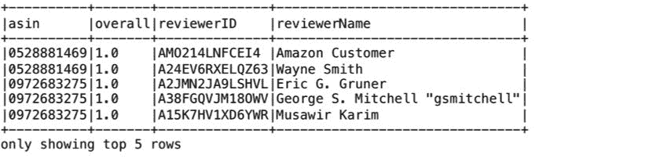

# 在 Spark 中定义和使用自定义数据源

您可以定义自己的数据源，并将这些数据源的数据与其他更标准的数据源（例如关系数据库、Parquet 文件等）的数据结合起来。在第五章中，*在流应用中使用 Spark SQL*，我们为从**伦敦交通**（TfL）网站提供的公共 API 中流式数据定义了一个自定义数据源。

参考视频*Spark DataFrames Simple and Fast Analysis of Structured Data - Michael Armbrust (Databricks)* [`www.youtube.com/watch?v=xWkJCUcD55w`](https://www.youtube.com/watch?v=xWkJCUcD55w) 中定义 Jira 数据源并从中创建 Spark SQL DataFrame 的良好示例。

# 总结

在本章中，我们演示了使用 Spark 与各种数据源和数据格式。我们使用 Spark 来处理关系数据库（MySQL）、NoSQL 数据库（MongoDB）、半结构化数据（JSON）以及在 Hadoop 生态系统中常用的数据存储格式（Avro 和 Parquet）。这为您非常好地准备了接下来更高级的 Spark 应用程序导向章节。

在下一章中，我们将把焦点从处理 Spark 的机制转移到如何使用 Spark SQL 来探索数据、执行数据质量检查和可视化数据。
