# 第三章：使用 Spark SQL 进行数据探索

在本章中，我们将介绍如何使用 Spark SQL 进行探索性数据分析。我们将介绍计算一些基本统计数据、识别异常值和可视化、抽样和透视数据的初步技术。本章中的一系列实践练习将使您能够使用 Spark SQL 以及 Apache Zeppelin 等工具来开发对数据的直觉。

在本章中，我们将讨论以下主题：

+   什么是探索性数据分析（EDA）

+   为什么 EDA 很重要？

+   使用 Spark SQL 进行基本数据分析

+   使用 Apache Zeppelin 可视化数据

+   使用 Spark SQL API 对数据进行抽样

+   使用 Spark SQL 创建透视表

# 引入探索性数据分析（EDA）

探索性数据分析（EDA）或初始数据分析（IDA）是一种试图最大程度地洞察数据的数据分析方法。这包括评估数据的质量和结构，计算摘要或描述性统计数据，并绘制适当的图表。它可以揭示潜在的结构，并建议如何对数据进行建模。此外，EDA 帮助我们检测数据中的异常值、错误和异常，并决定如何处理这些数据通常比其他更复杂的分析更重要。EDA 使我们能够测试我们的基本假设，发现数据中的聚类和其他模式，并确定各种变量之间可能的关系。仔细的 EDA 过程对于理解数据至关重要，有时足以揭示数据质量差劣，以至于使用基于模型的更复杂分析是不合理的。

典型情况下，探索性数据分析（EDA）中使用的图形技术是简单的，包括绘制原始数据和简单的统计。重点是数据所揭示的结构和模型，或者最适合数据的模型。EDA 技术包括散点图、箱线图、直方图、概率图等。在大多数 EDA 技术中，我们使用所有数据，而不做任何基本假设。分析师通过这种探索建立直觉或获得对数据集的“感觉”。更具体地说，图形技术使我们能够有效地选择和验证适当的模型，测试我们的假设，识别关系，选择估计量，检测异常值等。

EDA 涉及大量的试错和多次迭代。最好的方法是从简单开始，然后随着进展逐渐增加复杂性。在建模中存在着简单和更准确之间的重大折衷。简单模型可能更容易解释和理解。这些模型可以让您很快达到 90%的准确性，而更复杂的模型可能需要几周甚至几个月才能让您获得额外的 2%的改进。例如，您应该绘制简单的直方图和散点图，以快速开始对数据进行直觉开发。

# 使用 Spark SQL 进行基本数据分析

交互式地处理和可视化大型数据是具有挑战性的，因为查询可能需要很长时间才能执行，而可视化界面无法容纳与数据点一样多的像素。Spark 支持内存计算和高度的并行性，以实现与大规模分布式数据的交互性。此外，Spark 能够处理百万亿字节的数据，并提供一组多功能的编程接口和库。这些包括 SQL、Scala、Python、Java 和 R API，以及用于分布式统计和机器学习的库。

对于适合放入单台计算机的数据，有许多好的工具可用，如 R、MATLAB 等。然而，如果数据不适合放入单台计算机，或者将数据传输到该计算机非常复杂，或者单台计算机无法轻松处理数据，那么本节将提供一些用于数据探索的好工具和技术。

在本节中，我们将进行一些基本的数据探索练习，以了解一个样本数据集。我们将使用一个包含与葡萄牙银行机构的直接营销活动（电话营销）相关数据的数据集。这些营销活动是基于对客户的电话呼叫。我们将使用包含 41,188 条记录和 20 个输入字段的`bank-additional-full.csv`文件，按日期排序（从 2008 年 5 月到 2010 年 11 月）。该数据集由 S. Moro、P. Cortez 和 P. Rita 贡献，并可从[`archive.ics.uci.edu/ml/datasets/Bank+Marketing`](https://archive.ics.uci.edu/ml/datasets/Bank+Marketing)下载。

1.  首先，让我们定义一个模式并读取 CSV 文件以创建一个数据框架。您可以使用`:paste`命令将初始一组语句粘贴到您的 Spark shell 会话中（使用*Ctrl*+*D*退出粘贴模式），如下所示：

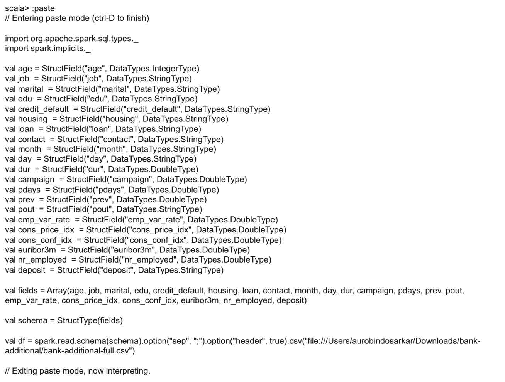

1.  创建了数据框架之后，我们首先验证记录的数量：

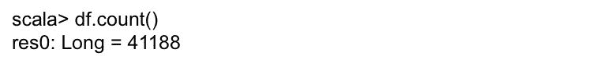

1.  我们还可以为我们的输入记录定义一个名为`Call`的`case`类，然后创建一个强类型的数据集，如下所示：

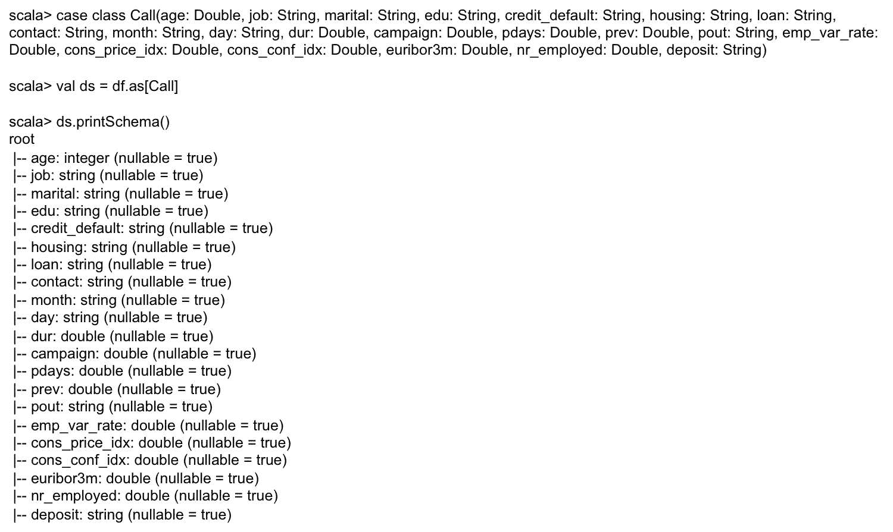

在下一节中，我们将通过识别数据集中的缺失数据来开始我们的数据探索。

# 识别缺失数据

数据集中的缺失数据可能是由于从疏忽到受访者拒绝提供特定数据点的原因而导致的。然而，在所有情况下，缺失数据都是真实世界数据集中的常见现象。缺失数据可能会在数据分析中造成问题，有时会导致错误的决策或结论。因此，识别缺失数据并制定有效的处理策略非常重要。

在本节中，我们分析了样本数据集中具有缺失数据字段的记录数量。为了模拟缺失数据，我们将编辑我们的样本数据集，将包含“unknown”值的字段替换为空字符串。

首先，我们从我们编辑的文件中创建了一个数据框架/数据集，如下所示：

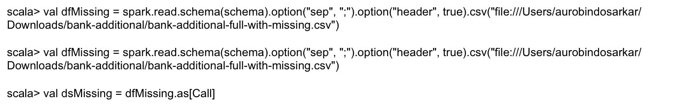

以下两个语句给出了具有某些字段缺失数据的行数：

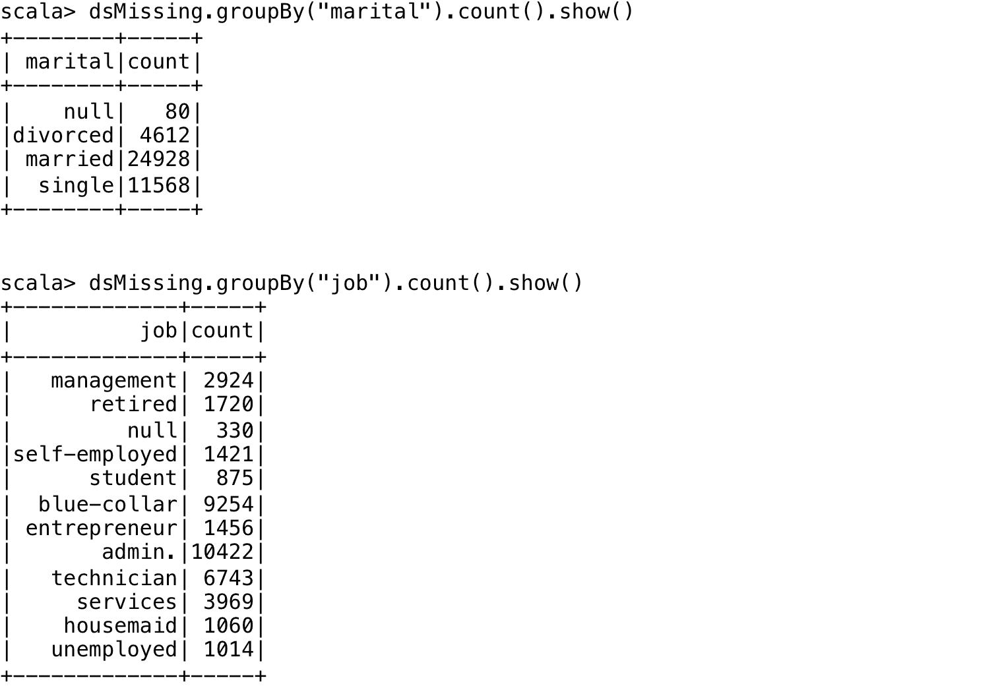

在第四章中，*使用 Spark SQL 进行数据整理*，我们将探讨处理缺失数据的有效方法。在下一节中，我们将计算样本数据集的一些基本统计数据，以改善我们对数据的理解。

# 计算基本统计数据

计算基本统计数据对于对我们的数据有一个良好的初步了解是至关重要的。首先，为了方便起见，我们创建了一个案例类和一个数据集，其中包含来自我们原始数据框架的一部分字段。在以下示例中，我们选择了一些数值字段和结果字段，即“订阅定期存款”的字段：

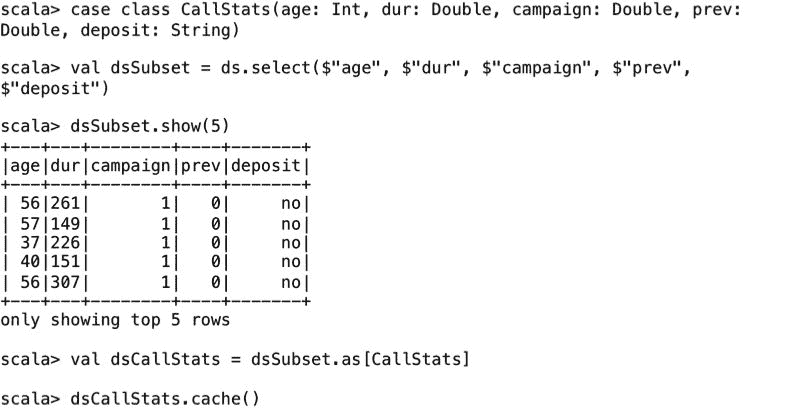

接下来，我们使用`describe()`计算数据集中数值列的`count`、`mean`、`stdev`、`min`和`max`值。`describe()`命令提供了一种快速检查数据的方法。例如，所选列的行数与数据框架中的总记录数匹配（没有空值或无效行），年龄列的平均值和值范围是否符合您的预期等。根据平均值和标准差的值，您可以选择某些数据元素进行更深入的分析。例如，假设正态分布，年龄的平均值和标准差值表明大多数年龄值在 30 到 50 岁的范围内，对于其他列，标准差值可能表明数据的偏斜（因为标准差大于平均值）。

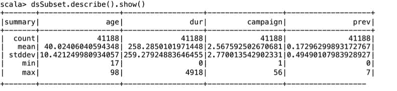

此外，我们可以使用 stat 包计算额外的统计数据，如协方差和 Pearson 相关系数。协方差表示两个随机变量的联合变异性。由于我们处于 EDA 阶段，这些测量可以为我们提供有关一个变量如何相对于另一个变量变化的指标。例如，协方差的符号表示两个变量之间变异性的方向。在以下示例中，年龄和最后一次联系的持续时间之间的协方差方向相反，即随着年龄的增加，持续时间减少。相关性给出了这两个变量之间关系强度的大小。

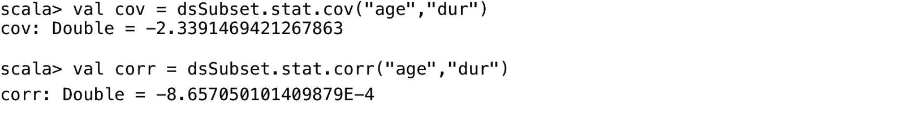

我们可以创建两个变量之间的交叉表或交叉表，以评估它们之间的相互关系。例如，在以下示例中，我们创建了一个代表 2x2 列联表的年龄和婚姻状况的交叉表。从表中，我们了解到，对于给定年龄，各种婚姻状况下的个体总数的分布情况。我们还可以提取数据 DataFrame 列中最频繁出现的项目。在这里，我们选择教育水平作为列，并指定支持水平为`0.3`，即我们希望在 DataFrame 中找到出现频率大于`0.3`（至少观察到 30%的时间）的教育水平。最后，我们还可以计算 DataFrame 中数值列的近似分位数。在这里，我们计算年龄列的分位数概率为`0.25`、`0.5`和`0.75`（值为`0`是最小值，`1`是最大值，`0.5`是中位数）。

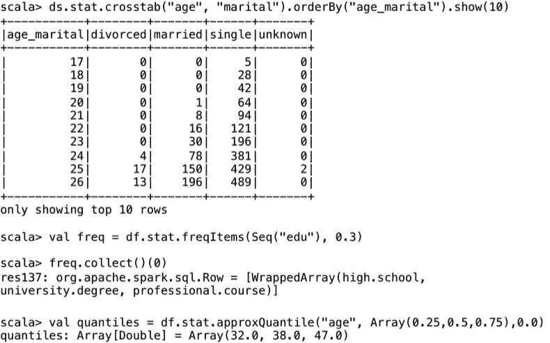

接下来，我们使用聚合函数对我们的数据进行汇总，以更好地了解它。在以下语句中，我们按是否订阅定期存款以及联系的客户总数、每位客户平均拨打电话次数、通话平均持续时间和向这些客户拨打的平均上次电话次数进行聚合。结果四舍五入到小数点后两位：

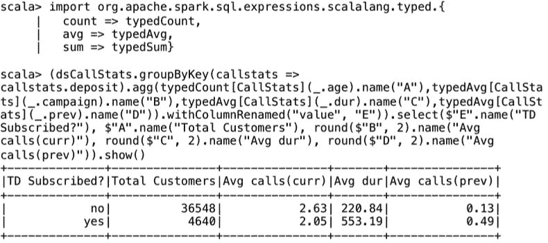

同样，执行以下语句会按客户年龄给出类似的结果：

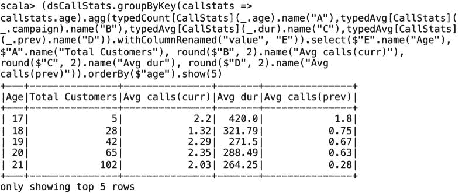

在通过计算基本统计数据更好地了解我们的数据之后，我们将重点转向识别数据中的异常值。

# 识别数据异常值

异常值或异常值是数据中明显偏离数据集中其他观察值的观察值。这些错误的异常值可能是由于数据收集中的错误或测量的变异性。它们可能会对结果产生重大影响，因此在 EDA 过程中识别它们至关重要。

然而，这些技术将异常值定义为不属于簇的点。用户必须使用统计分布对数据点进行建模，并根据它们在与基础模型的关系中的出现方式来识别异常值。这些方法的主要问题是在 EDA 过程中，用户通常对基础数据分布没有足够的了解。

使用建模和可视化方法进行探索性数据分析（EDA）是获得对数据更深刻理解的好方法。Spark MLlib 支持大量（并不断增加）的分布式机器学习算法，使这项任务变得更简单。例如，我们可以应用聚类算法并可视化结果，以检测组合列中的异常值。在以下示例中，我们使用最后一次联系持续时间（以秒为单位）、在此客户（campaign）的此次活动期间执行的联系次数、在上一次活动期间客户最后一次联系后经过的天数（pdays）和在此客户（prev）的此次活动之前执行的联系次数来应用 k 均值聚类算法在我们的数据中计算两个簇：

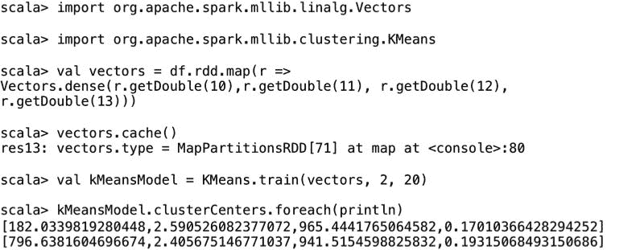

用于探索性数据分析的其他分布式算法包括分类、回归、降维、相关性和假设检验。有关使用 Spark SQL 和这些算法的更多细节，请参阅第六章中的*在机器学习应用中使用 Spark SQL*。

# 使用 Apache Zeppelin 可视化数据

通常，我们会生成许多图表来验证我们对数据的直觉。在探索性数据分析期间使用的许多快速而肮脏的图表最终被丢弃。探索性数据可视化对于数据分析和建模至关重要。然而，我们经常因为难以处理而跳过大数据的探索性可视化。例如，浏览器通常无法处理数百万个数据点。因此，我们必须在有效可视化数据之前对数据进行总结、抽样或建模。

传统上，BI 工具提供了广泛的聚合和透视功能来可视化数据。然而，这些工具通常使用夜间作业来总结大量数据。随后，总结的数据被下载并在从业者的工作站上可视化。Spark 可以消除许多这些批处理作业，以支持交互式数据可视化。

在本节中，我们将使用 Apache Zeppelin 探索一些基本的数据可视化技术。Apache Zeppelin 是一个支持交互式数据分析和可视化的基于 Web 的工具。它支持多种语言解释器，并具有内置的 Spark 集成。因此，使用 Apache Zeppelin 进行探索性数据分析是快速而简单的：

1.  您可以从[`zeppelin.apache.org/`](https://zeppelin.apache.org/)下载 Appache Zeppelin。在硬盘上解压缩软件包，并使用以下命令启动 Zeppelin：

```scala
      Aurobindos-MacBook-Pro-2:zeppelin-0.6.2-bin-all aurobindosarkar$ 
      bin/zeppelin-daemon.sh start

```

1.  您应该看到以下消息：

```scala
      Zeppelin start                                           [ OK  ] 
```

1.  您应该能够在`http://localhost:8080/`看到 Zeppelin 主页：

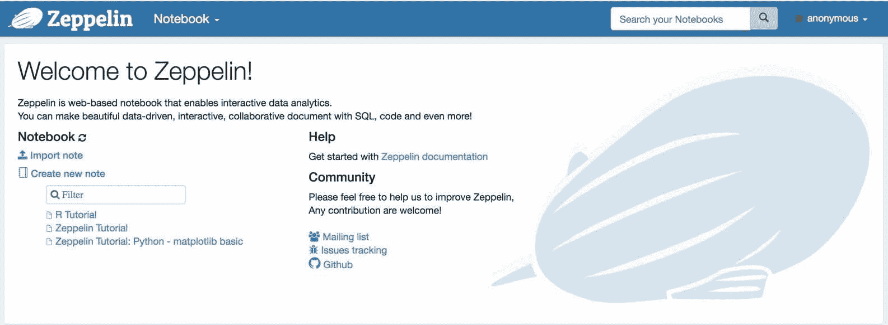

1.  单击“创建新笔记”链接，并指定笔记本的路径和名称，如下所示：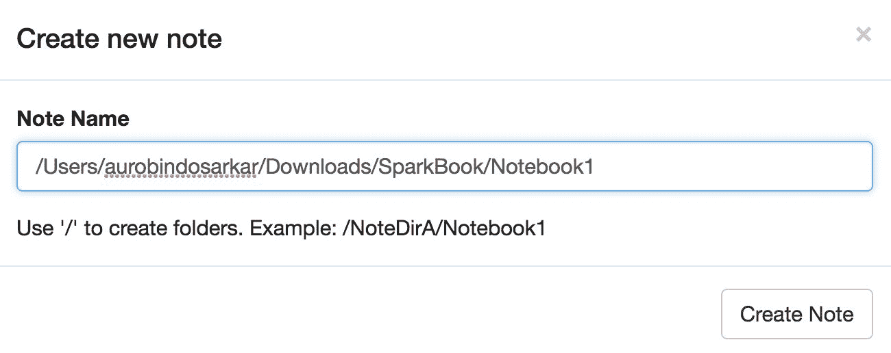

1.  在下一步中，我们将粘贴本章开头的相同代码，以创建我们样本数据集的 DataFrame：

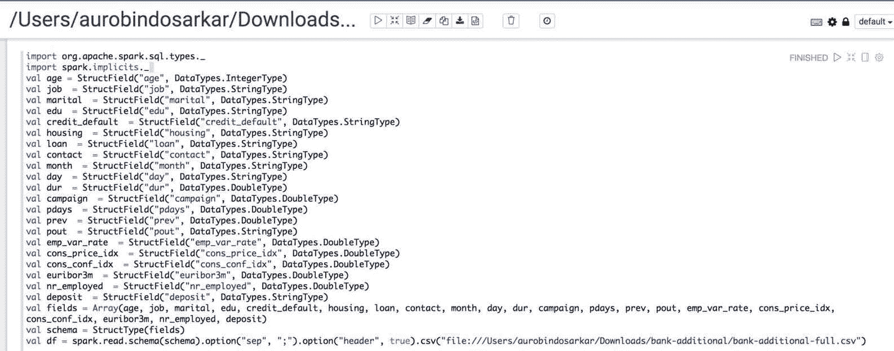

1.  我们可以执行典型的 DataFrame 操作，如下所示：

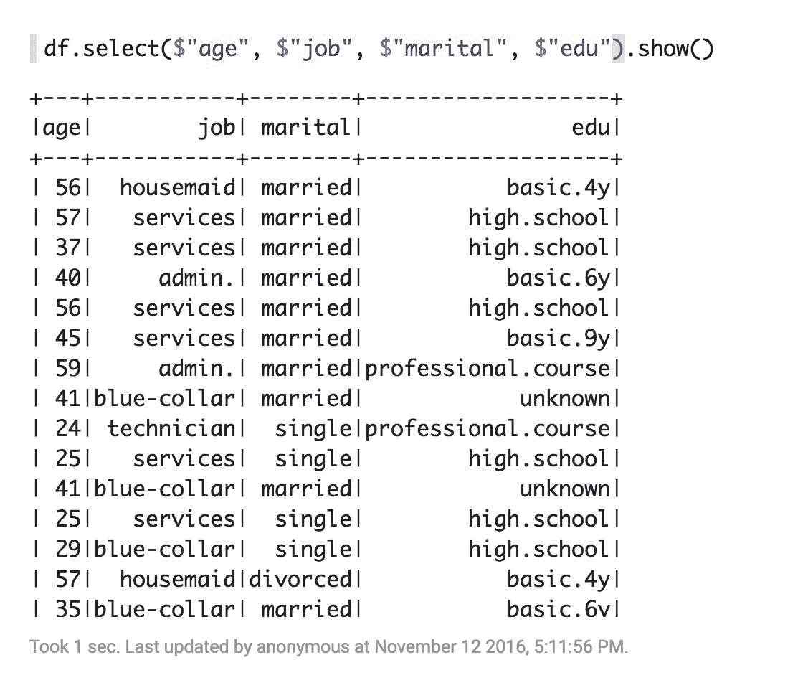

1.  接下来，我们从 DataFrame 创建一个表，并对其执行一些 SQL。单击所需的图表类型，可以对 SQL 语句的执行结果进行图表化。在这里，我们创建条形图，作为总结和可视化数据的示例：

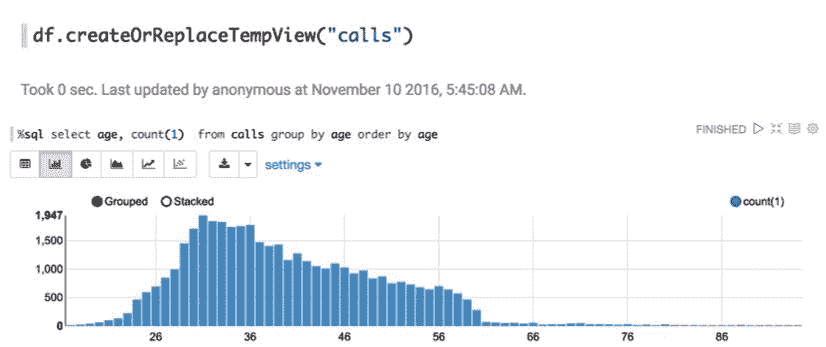

1.  我们可以创建散点图，如下图所示：

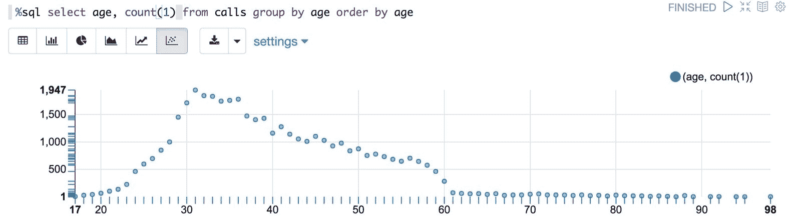

您还可以读取每个绘制点的坐标值：

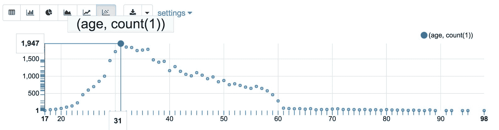

1.  此外，我们可以创建一个接受输入值的文本框，使体验更加交互式。在下图中，我们创建了一个文本框，可以接受不同的年龄参数值，并相应地更新条形图：

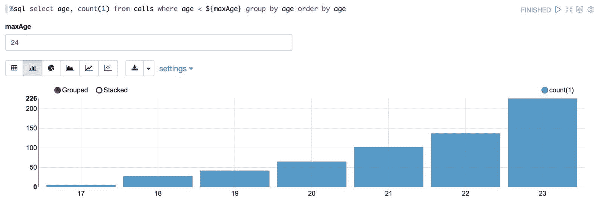

1.  同样，我们还可以创建下拉列表，用户可以选择适当的选项：

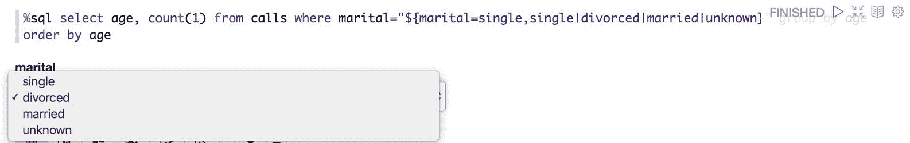

表格的值或图表会自动更新：

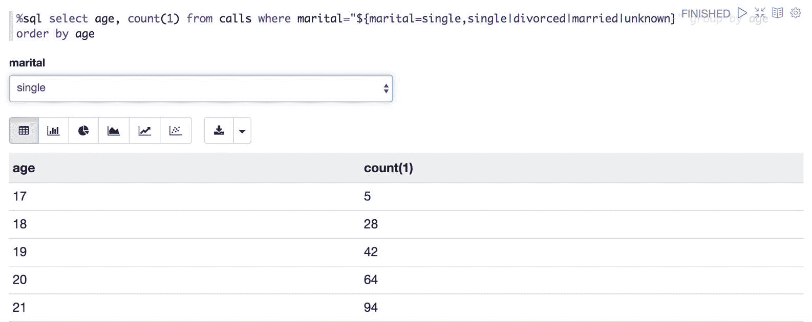

我们将在第八章中使用 Spark SQL 和 SparkR 进行更高级的可视化。在下一节中，我们将探讨用于从数据中生成样本的方法。

# 使用 Spark SQL API 对数据进行抽样

通常，我们需要可视化个别数据点以了解我们数据的性质。统计学家广泛使用抽样技术进行数据分析。Spark 支持近似和精确的样本生成。近似抽样速度更快，在大多数情况下通常足够好。

在本节中，我们将探索用于生成样本的 Spark SQL API。我们将通过一些示例来演示使用 DataFrame/Dataset API 和基于 RDD 的方法生成近似和精确的分层样本，有放回和无放回。

# 使用 DataFrame/Dataset API 进行抽样

我们可以使用`sampleBy`创建一个无放回的分层样本。我们可以指定每个值被选入样本的百分比。

样本的大小和每种类型的记录数如下所示：

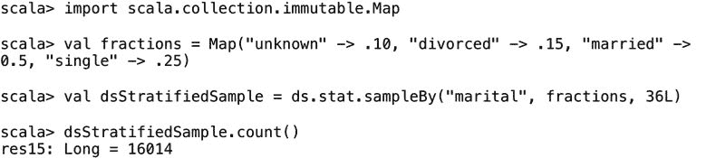

接下来，我们创建一个有放回的样本，选择总记录的一部分（总记录的 10%），并使用随机种子。使用`sample`不能保证提供数据集中总记录数的确切分数。我们还打印出样本中每种类型的记录数：

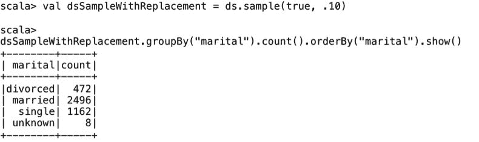

在下一节中，我们将探索使用 RDD 的抽样方法。

# 使用 RDD API 进行抽样

在本节中，我们使用 RDD 来创建有放回和无放回的分层样本。

首先，我们从 DataFrame 创建一个 RDD：

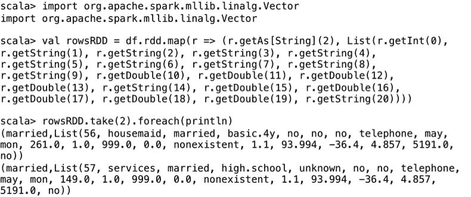

我们可以指定样本中每种记录类型的分数，如图所示：

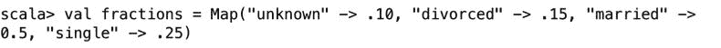

在下面的示例中，我们使用`sampleByKey`和`sampleByKeyExact`方法来创建我们的样本。前者是一个近似样本，而后者是一个精确样本。第一个参数指定样本是有放回还是无放回生成的：

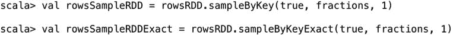

接下来，我们打印出人口总记录数和每个样本中的记录数。您会注意到`sampleByKeyExact`会给出与指定分数完全相符的记录数：

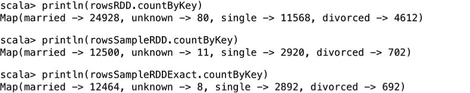

sample 方法可用于创建包含指定记录分数的随机样本。接下来，我们创建一个有放回的样本，包含总记录的 10%：

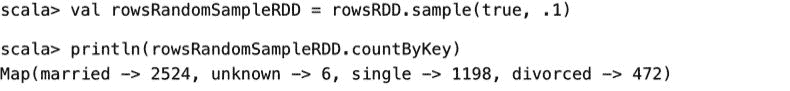

其他统计操作，如假设检验、随机数据生成、可视化概率分布等，将在后面的章节中介绍。在下一节中，我们将使用 Spark SQL 来创建数据透视表来探索我们的数据。

# 使用 Spark SQL 创建数据透视表

数据透视表创建数据的替代视图，在数据探索过程中通常被使用。在下面的示例中，我们演示了如何使用 Spark DataFrames 进行数据透视：

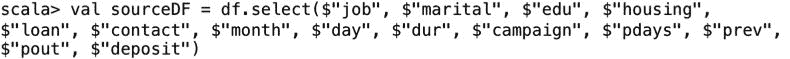

下面的示例在已经采取的住房贷款上进行数据透视，并按婚姻状况计算数字：

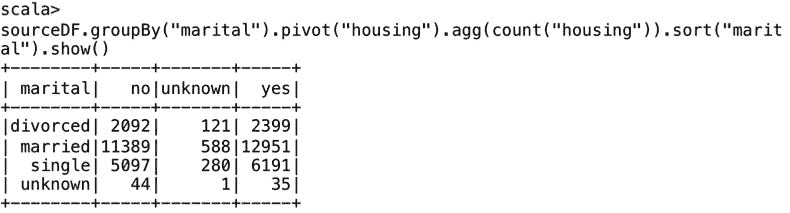

在下一个示例中，我们创建一个 DataFrame，其中包含适当的列名，用于呼叫总数和平均呼叫次数：

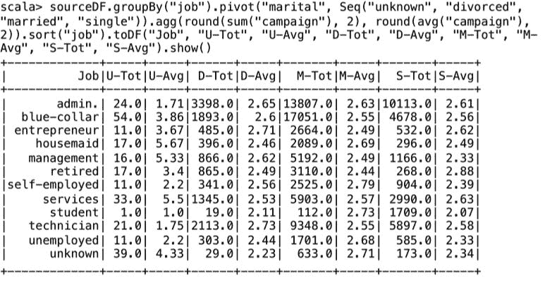

在下一个示例中，我们创建一个 DataFrame，其中包含适当的列名，用于每个工作类别的呼叫总数和平均持续时间：

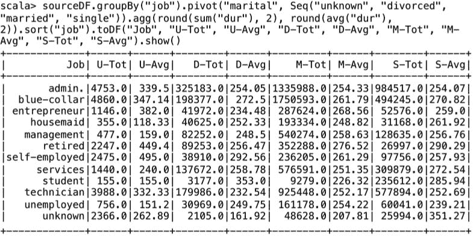

在下面的示例中，我们展示了数据透视，计算每个工作类别的平均呼叫持续时间，同时指定了一些婚姻状况的子集：

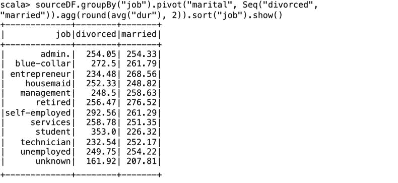

下一个示例与前一个相同，只是在这种情况下，我们还按住房贷款字段拆分了平均呼叫持续时间值：

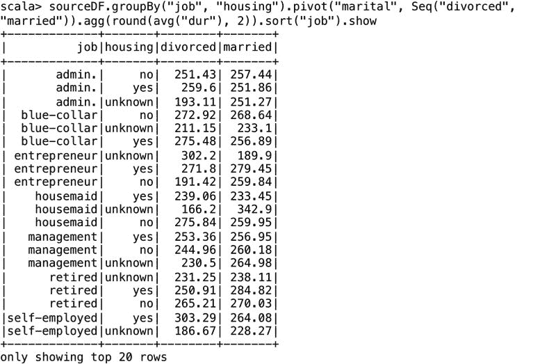

接下来，我们将展示如何创建一个按月订阅的定期存款数据透视表的 DataFrame，将其保存到磁盘，并将其读取回 RDD：

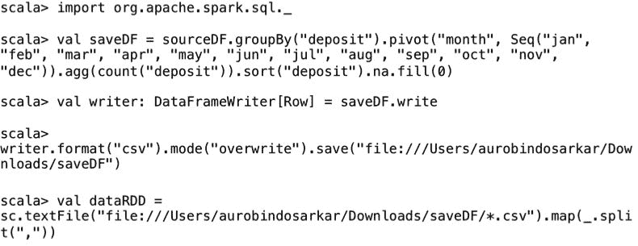

此外，我们使用前面步骤中的 RDD 来计算订阅和未订阅定期贷款的季度总数：

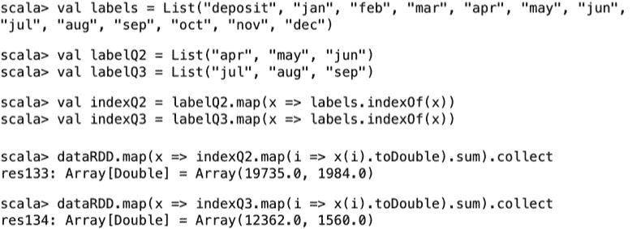

我们将在本书的后面介绍其他类型数据的详细分析，包括流数据、大规模图形、时间序列数据等。

# 总结

在本章中，我们演示了使用 Spark SQL 来探索数据集，执行基本数据质量检查，生成样本和数据透视表，并使用 Apache Zeppelin 可视化数据。

在下一章中，我们将把重点转移到数据处理/整理。我们将介绍处理缺失数据、错误数据、重复记录等技术。我们还将进行大量的实践演练，演示使用 Spark SQL 处理常见数据整理任务。
