# 第四章：使用 Spark SQL 进行数据整理

在这个代码密集的章节中，我们将介绍用于将原始数据转换为可用格式进行分析的关键数据整理技术。我们首先介绍适用于各种场景的一些通用数据整理步骤。然后，我们将把重点转移到特定类型的数据，包括时间序列数据、文本和用于 Spark MLlib 机器学习流水线的数据预处理步骤。我们将使用几个数据集来说明这些技术。

在本章中，我们将学习：

+   什么是数据整理？

+   探索数据整理技术

+   使用连接合并数据

+   文本数据整理

+   时间序列数据整理

+   处理可变长度记录

+   为机器学习流水线准备数据

# 介绍数据整理

原始数据通常混乱不堪，需要经过一系列转换才能变得有用，用于建模和分析工作。这样的数据集可能存在缺失数据、重复记录、损坏数据、不完整记录等问题。在其最简单的形式中，数据整理或数据整理基本上是将原始数据转换为可用格式。在大多数项目中，这是最具挑战性和耗时的步骤。

然而，如果没有数据整理，您的项目可能会陷入垃圾进垃圾出的境地。

通常，您将执行一系列函数和过程，如子集、过滤、聚合、排序、合并、重塑等。此外，您还将进行类型转换、添加新字段/列、重命名字段/列等操作。

一个大型项目可能包含各种数据，数据质量不同。可能会混合使用数字、文本、时间序列、结构化和非结构化数据，包括音频和视频数据，一起或分开用于分析。这类项目的一个重要部分包括清洗和转换步骤，结合一些统计分析和可视化。

我们将使用几个数据集来演示为准备数据进行后续建模和分析所需的关键数据整理技术。以下是这些数据集及其来源：

+   **个人家庭电力消耗数据集**：数据集的原始来源是法国 EDF R&D 的高级研究员 Georges Hebrail 和法国 Clamart 的 TELECOM ParisTech 工程师实习生 Alice Berard。该数据集包括近四年内一个家庭每分钟的电力消耗测量。该数据集可以从以下网址下载：

[`archive.ics.uci.edu/ml/datasets/Individual+household+electric+power+consumption`](https://archive.ics.uci.edu/ml/datasets/Individual+household+electric+power+consumption)。

+   **基于机器学习的 ZZAlpha Ltd. 2012-2014 股票推荐数据集**：该数据集包含了在 2012 年 1 月 1 日至 2014 年 12 月 31 日期间，每天早上针对各种美国交易的股票组合所做的推荐。该数据集可以从以下网址下载：

[`archive.ics.uci.edu/ml/datasets/Machine+Learning+based+ZZAlpha+Ltd.+Stock+Recommendations+2012-2014`](https://archive.ics.uci.edu/ml/datasets/Machine+Learning+based+ZZAlpha+Ltd.+Stock+Recommendations+2012-2014)。

+   **巴黎天气历史数据集**：该数据集包含了巴黎的每日天气报告。我们下载了与家庭电力消耗数据集相同时间段的历史数据。该数据集可以从以下网址下载：

[`www.wunderground.com/history/airport/LFPG`](https://www.wunderground.com/history/airport/LFPG)。

+   **原始 20 个新闻组数据**：该数据集包括来自 20 个 Usenet 新闻组的 20,000 条消息。该数据集的原始所有者和捐赠者是 Carnegie Mellon 大学计算机科学学院的 Tom Mitchell。大约每个新闻组中取了一千篇 Usenet 文章。每个新闻组存储在一个子目录中，每篇文章都存储为一个单独的文件。该数据集可以从以下网址下载：

[`kdd.ics.uci.edu/databases/20newsgroups/20newsgroups.html`](http://kdd.ics.uci.edu/databases/20newsgroups/20newsgroups.html).

+   **Yahoo 财务数据**：该数据集包括了为期一年（从 2015 年 12 月 4 日至 2016 年 12 月 4 日）的六只股票的历史每日股价。所选股票符号的数据可以从以下网站下载：

[ ](http://finance.yahoo.com/)[`finance.yahoo.com/`](http://finance.yahoo.com/).

# 探索数据整理技术

在本节中，我们将介绍使用家庭电力消耗和天气数据集的几种数据整理技术。学习这些技术的最佳方法是练习操纵各种公开可用数据集中包含的数据的各种方法（除了这里使用的数据集）。你练习得越多，你就会变得越擅长。在这个过程中，你可能会发展出自己的风格，并开发出几种工具集和技术来实现你的整理目标。至少，你应该非常熟悉并能够在 RDD、DataFrame 和数据集之间进行操作，计算计数、不同计数和各种聚合，以交叉检查你的结果并匹配你对数据集的直觉理解。此外，根据执行任何给定的整理步骤的利弊来做出决策的能力也很重要。

在本节中，我们将尝试实现以下目标：

1.  预处理家庭电力消耗数据集--读取输入数据集，为行定义 case 类，计算记录数，删除标题和包含缺失数据值的行，并创建 DataFrame。

1.  计算基本统计数据和聚合

1.  使用与分析相关的新信息增强数据集

1.  执行其他必要的杂项处理步骤

1.  预处理天气数据集--类似于步骤 1

1.  分析缺失数据

1.  使用 JOIN 合并数据集并分析结果

此时启动 Spark shell，并随着阅读本节和后续节的内容进行操作。

导入本节中使用的所有必需类：

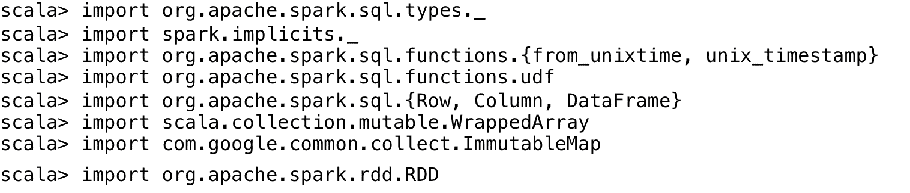

# 家庭电力消耗数据集的预处理

为家庭电力消耗创建一个名为`HouseholdEPC`的`case`类：

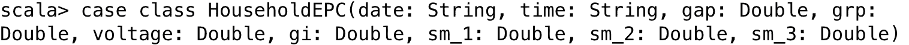

将输入数据集读入 RDD 并计算其中的行数。

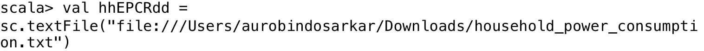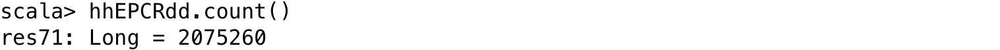

接下来，删除标题和包含缺失值的所有其他行（在输入中表示为`?`），如下面的步骤所示：

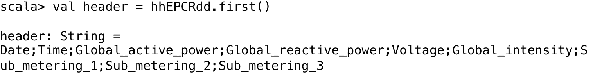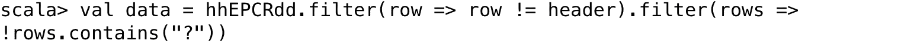

在下一步中，将`RDD [String]`转换为我们之前定义的`case`类的`RDD`，并将 RDD 转换为`HouseholdEPC`对象的 DataFrame。

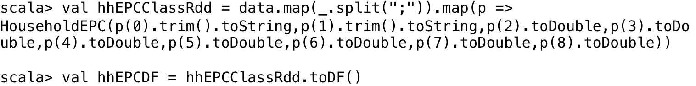

在 DataFrame 中显示一些样本记录，并计算其中的行数，以验证 DataFrame 中的行数是否与输入数据集中预期的行数匹配。

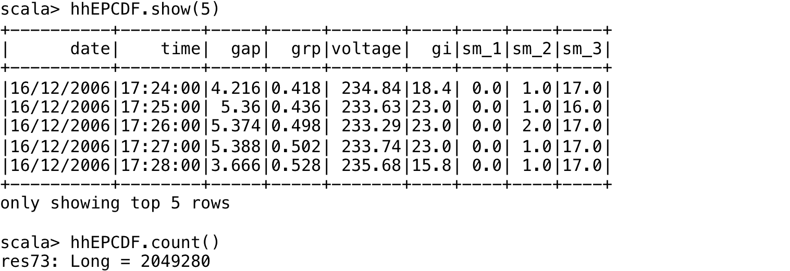

# 计算基本统计数据和聚合

接下来，计算并显示 DataFrame 中数值列的一些基本统计数据，以了解我们将要处理的数据。


我们还可以显示一些或所有列的基本统计数据，四舍五入到四位小数。我们还可以通过在列名前加上`r`来重命名每个列，以使它们与原始列名区分开来。

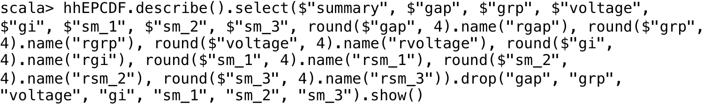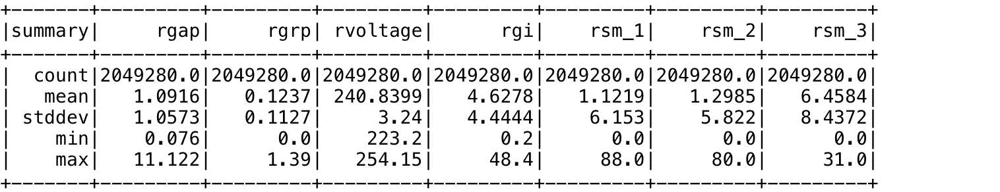

此外，我们使用聚合函数计算包含在 DataFrame 中的数据的不同日期的数量：

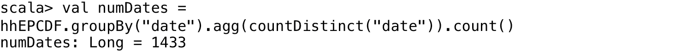

# 增强数据集

我们可以为星期几、每月的日期、月份和年份信息在 DataFrame 中增加新的列。例如，我们可能对工作日和周末的用电量感兴趣。这可以通过可视化或基于这些字段的数据透视来更好地理解数据。

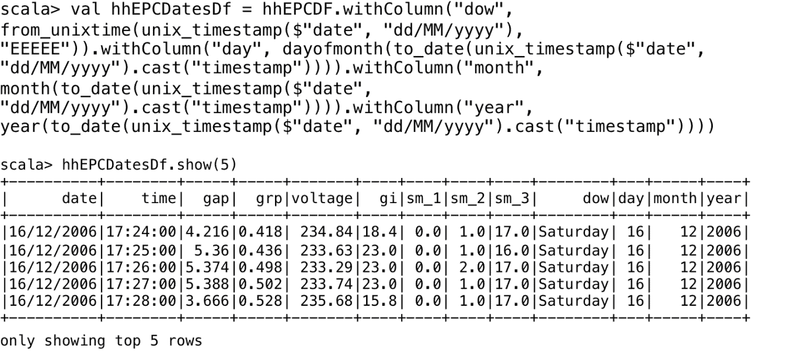

# 执行其他杂项处理步骤

如果需要，我们可以选择执行更多步骤来帮助进一步清洗数据，研究更多的聚合，或者转换为类型安全的数据结构等。

我们可以删除时间列，并使用聚合函数（如 sum 和 average）对各列的值进行聚合，以获取每天读数的值。在这里，我们使用`d`前缀来重命名列，以表示每日值。

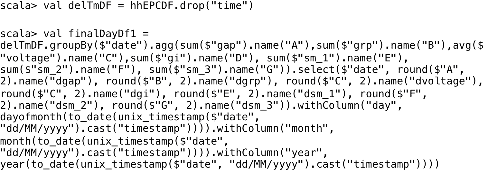

我们从这个 DataFrame 中显示一些样本记录：

```scala
scala> finalDayDf1.show(5)
```

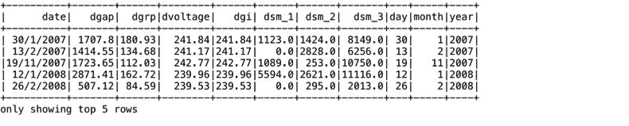

在这里，我们按年份和月份对读数进行分组，然后计算每个月的读数数量并显示出来。第一个月的读数数量较低，因为数据是在半个月内捕获的。

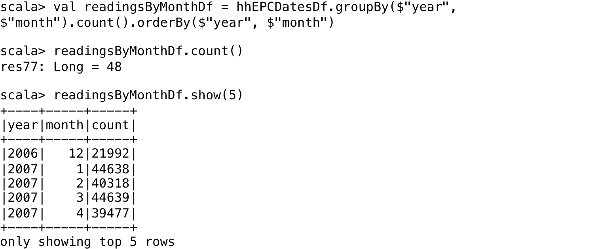

我们还可以使用`case`类将 DataFrame 转换为数据集，如下所示：

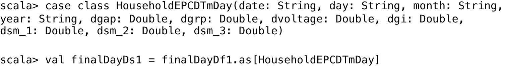

在这个阶段，我们已经完成了预处理家庭电力消耗数据集的所有步骤。现在我们将把重点转移到处理天气数据集上。

# 天气数据集的预处理

首先，我们为天气读数定义一个`case`类。

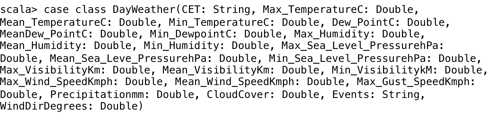

接下来，我们读取了四个文件的每日天气读数（从巴黎天气网站下载），大致与家庭电力消耗读数的持续时间相匹配。

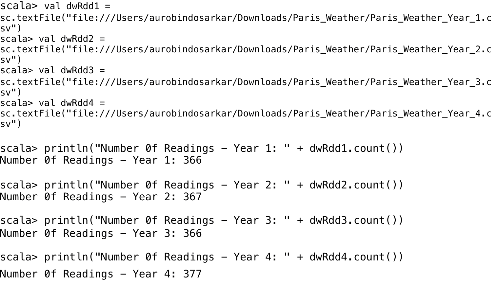

从以下显示的每个输入文件中删除标题。我们已经显示了标题值的输出，以便您了解这些数据集中捕获的各种天气读数参数：

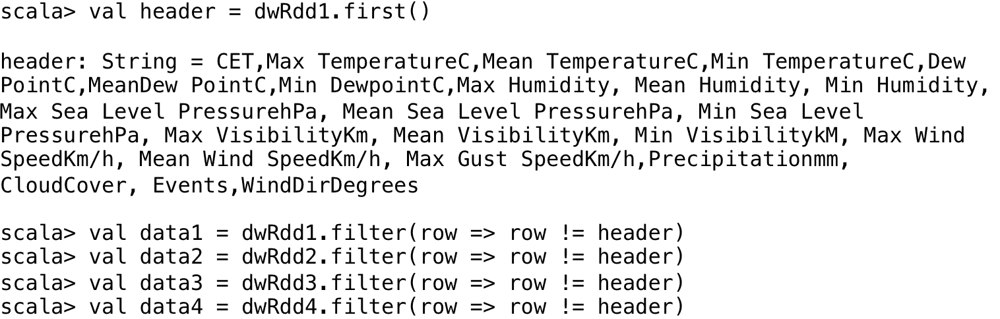

# 分析缺失数据

如果我们想要了解 RDD 中包含一个或多个缺失字段的行数，我们可以创建一个包含这些行的 RDD：

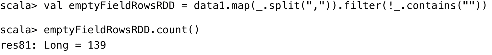

如果我们的数据以 DataFrame 的形式可用，我们也可以做同样的操作，如下所示：

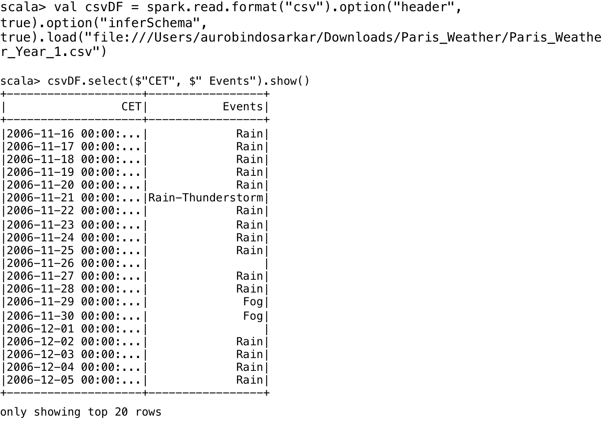

快速检查数据集发现，大多数具有缺失数据的行也在“事件”和“最大阵风速度公里/小时”列中具有缺失值。根据这两列的值进行过滤实际上捕获了所有具有缺失字段值的行。这也与 RDD 中的缺失值的结果相匹配。

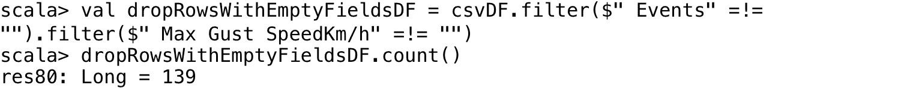

由于有许多行包含一个或多个缺失字段，我们选择保留这些行，以确保不丢失宝贵的信息。在下面的函数中，我们在 RDD 的所有缺失字段中插入`0`。

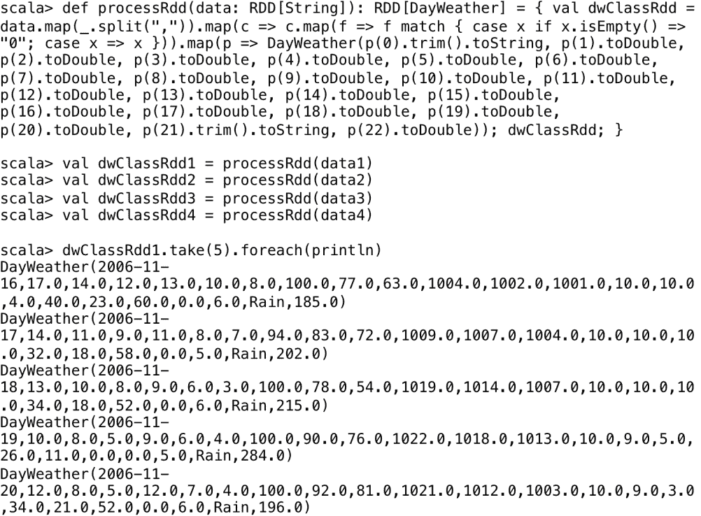

我们可以用字符串字段中的`0`替换前一步骤中插入的`NA`，如下所示：

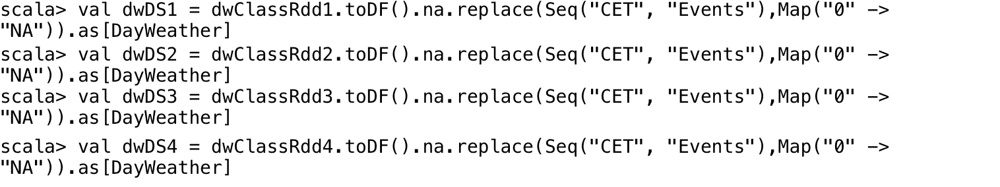

在这个阶段，我们可以使用`union`操作将四个数据集的行合并成一个数据集。

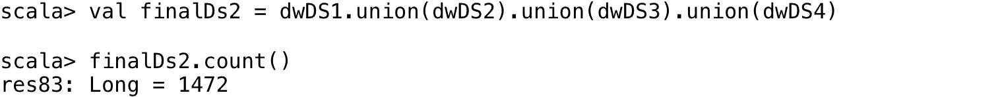

在这个阶段，我们第二个包含天气数据的数据集的处理已经完成。在接下来的部分，我们将使用`join`操作来合并这些预处理的数据集。

# 使用 JOIN 操作合并数据

在这一部分，我们将介绍 JOIN 操作，其中每日家庭电力消耗与天气数据进行了合并。我们假设家庭电力消耗的读数位置和天气读数的位置足够接近，以至于相关。

接下来，我们使用 JOIN 操作将每日家庭电力消耗数据集与天气数据集进行合并。

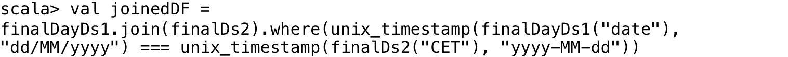

验证最终 DataFrame 中的行数是否与`join`操作后预期的行数相匹配，如下所示：

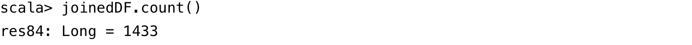

您可以计算新连接的数据集中各列之间的一系列相关性，以了解列之间的关系强度和方向，如下所示：

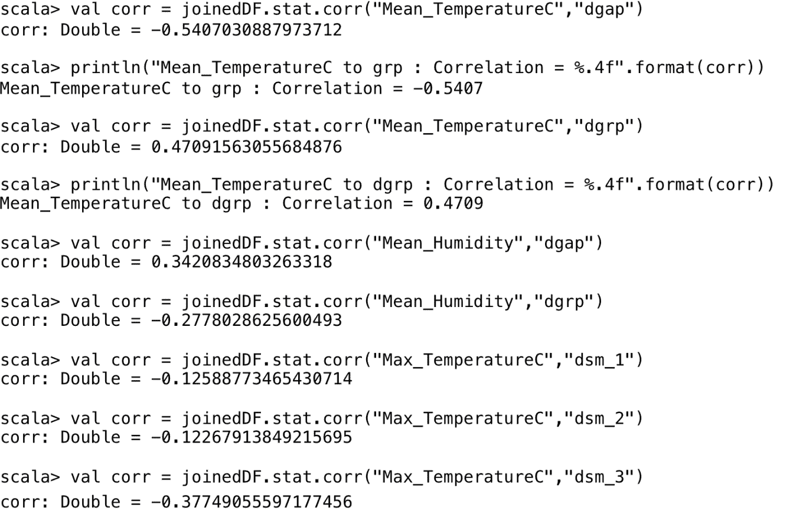

同样，您可以连接按年和月分组的数据集，以获得数据的更高级别的总结。

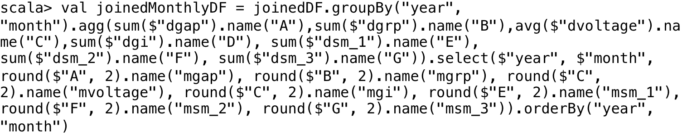

为了可视化总结的数据，我们可以在 Apache Zeppelin 笔记本中执行前面的语句。例如，我们可以通过将`joinedMonthlyDF`转换为表，并从中选择适当的列来绘制月度**全球反应功率**（**GRP**）值，如下所示：

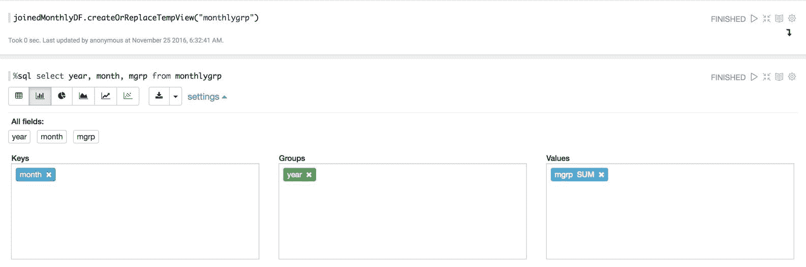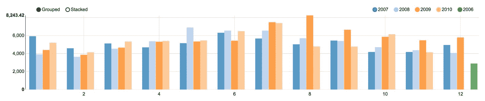

同样，如果您想按星期几分析读数，则按照以下步骤进行：

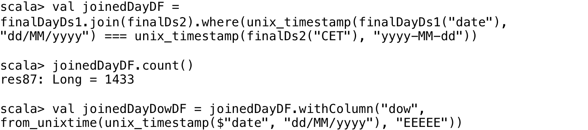

最后，我们打印连接的数据集的模式（增加了星期几列），以便您可以进一步探索此数据框架的各个字段之间的关系：

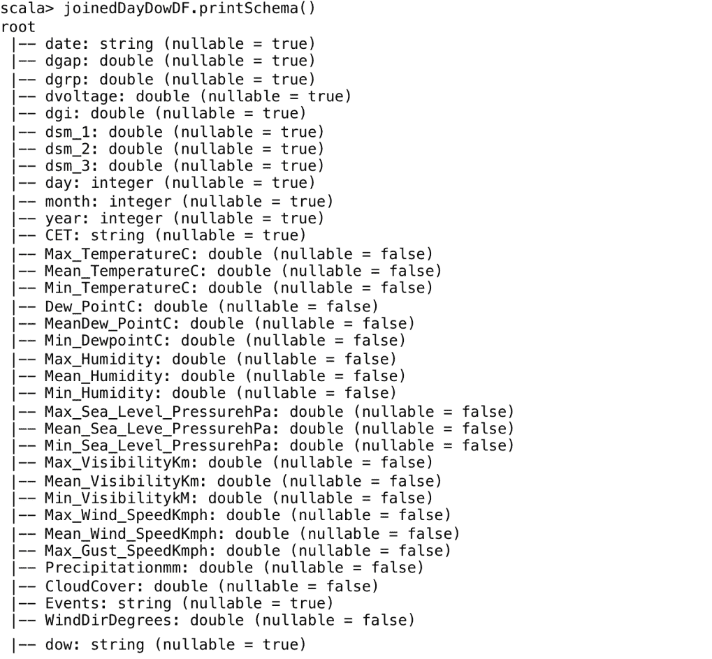

在下一节中，我们将把重点转移到整理文本数据上。

# 整理文本数据

在本节中，我们将探讨典型文本分析情况下的数据整理技术。许多基于文本的分析任务需要计算词频、去除停用词、词干提取等。此外，我们还将探讨如何逐个处理 HDFS 目录中的多个文件。

首先，我们导入本节中将使用的所有类：

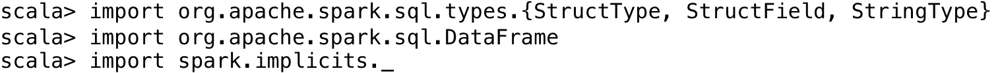

# 处理多个输入数据文件

在接下来的几个步骤中，我们初始化一组变量，用于定义包含输入文件的目录和一个空的 RDD。我们还从输入 HDFS 目录创建文件名列表。在下面的示例中，我们将处理包含在单个目录中的文件；但是，这些技术可以很容易地扩展到所有 20 个新闻组子目录。

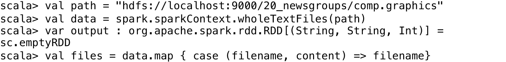

接下来，我们编写一个函数，计算每个文件的词频，并将结果收集到一个`ArrayBuffer`中：

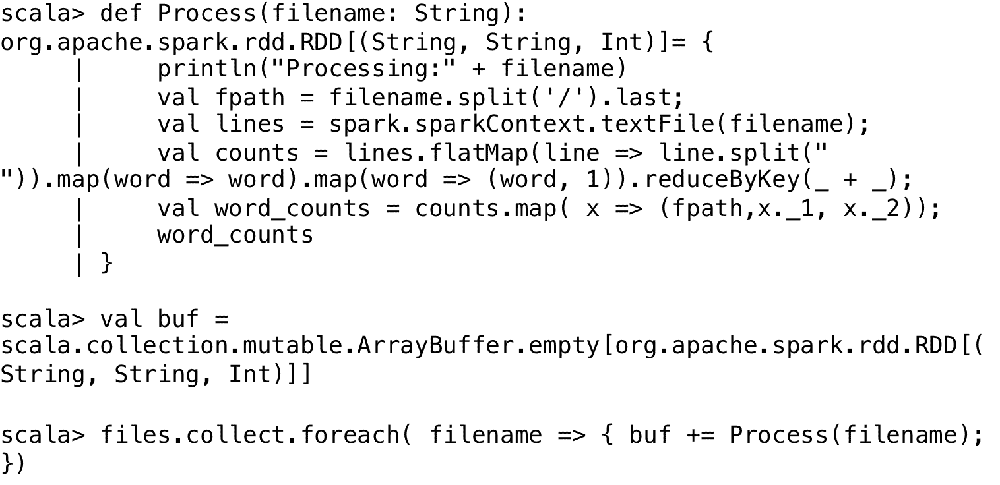

我们已经包含了一个打印语句，以显示选定的文件名进行处理，如下所示：

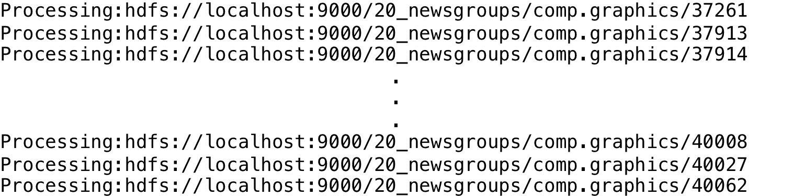

我们使用`union`操作将行添加到单个 RDD 中：


我们可以直接执行联合步骤，因为每个文件被处理时，如下所示：

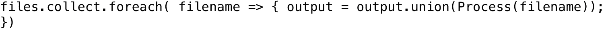

然而，使用`RDD.union()`会在血统图中创建一个新步骤，需要为每个新 RDD 添加额外的堆栈帧。这很容易导致堆栈溢出。相反，我们使用`SparkContext.union()`，它会一次性执行`union`操作，而不会产生额外的内存开销。

我们可以缓存并打印输出 RDD 中的样本行，如下所示：

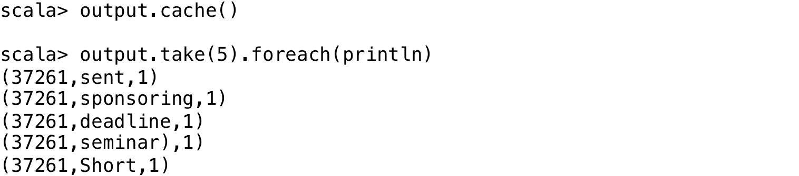

在下一节中，我们将向您展示过滤停用词的方法。为简单起见，我们只关注文本中格式良好的单词。但是，您可以使用字符串函数和正则表达式轻松添加条件，以过滤数据中的特殊字符和其他异常情况（有关详细示例，请参阅第九章，*使用 Spark SQL 开发应用程序*）。

# 去除停用词

在我们的示例中，我们创建了一组停用词，并从每个文件中的单词中过滤掉它们。通常，在远程节点上执行的 Spark 操作会在函数中使用的变量的单独副本上工作。我们可以使用广播变量在集群中的每个节点上维护一个只读的缓存副本，而不是将其与要在节点上执行的任务一起传输。Spark 尝试有效地分发广播变量，以减少总体通信开销。此外，我们还过滤掉由于我们的过滤过程和停用词移除而返回的空列表。

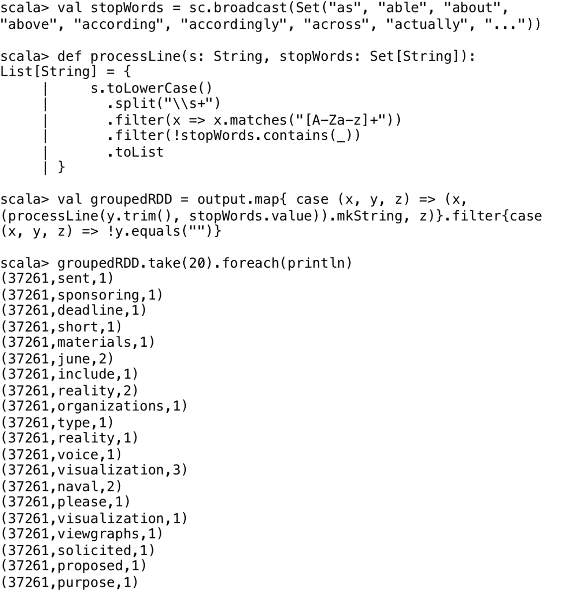

我们可以从 RDD 中的每个元组中提取单词，并创建包含它们的 DataFrame，如下所示：


在下面的示例中，我们展示了另一种从单词列表中过滤出停用词的方法。为了改善两个列表之间的单词匹配，我们以与从输入文件中提取的单词类似的方式处理停用词文件。我们读取包含停用词的文件，去除开头和结尾的空格，转换为小写，替换特殊字符，过滤掉空单词，最后创建一个包含停用词的 DataFrame。

我们在示例中使用的停用词列表可在[`algs4.cs.princeton.edu/35applications/stopwords.txt`](http://algs4.cs.princeton.edu/35applications/stopwords.txt)中找到。

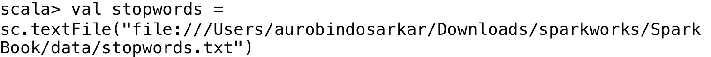

在这里，我们使用`regex`来过滤文件中包含的特殊字符。

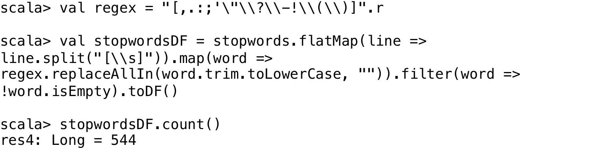

接下来，我们比较在去除原始单词列表中的停用词之前和之后列表中单词的数量。剩下的最终单词数量表明我们输入文件中的大部分单词是停用词。

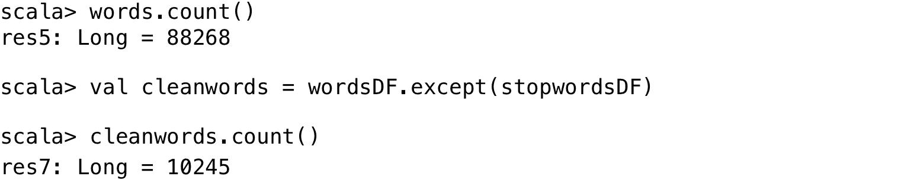

有关文本数据处理的更详细覆盖范围（包括年度`10-K`财务申报文件和其他文档语料库的处理、识别文档语料库中的主题、使用朴素贝叶斯分类器和开发机器学习应用程序），请参阅第九章，*使用 Spark SQL 开发应用程序*。

在接下来的部分，我们将把重点转移到使用 Cloudera 的`spark-time-series`库对时间序列数据进行整理。

# 整理时间序列数据

时间序列数据是与时间戳相关联的一系列值。在本节中，我们使用 Cloudera 的`spark-ts`包来分析时间序列数据。

有关时间序列数据及其使用`spark-ts`进行处理的更多详细信息，请参阅*Cloudera Engineering Blog*，*使用 Apache Spark 分析时间序列数据的新库*。该博客位于：[`github.com/sryza/spark-timeseries`](https://github.com/sryza/spark-timeseries)。

`spark-ts`包可以通过以下说明进行下载和构建：

[`github.com/sryza/spark-timeseries`](https://github.com/sryza/spark-timeseries)。

在接下来的子部分中，我们将尝试实现以下目标：

+   预处理时间序列数据集

+   处理日期字段

+   持久化和加载数据

+   定义日期时间索引

+   使用`TimeSeriesRDD`对象

+   处理缺失的时间序列数据

+   计算基本统计数据

对于本节，请在启动 Spark shell 时指定包含`spark-ts.jar`文件。

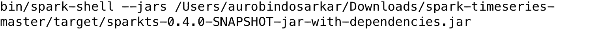

我们从 Yahoo Finance 网站下载了包含六只股票一年期价格和成交量数据的数据集。在使用`spark-ts`包进行时间序列数据分析之前，我们需要对数据进行预处理。

导入本节所需的类。

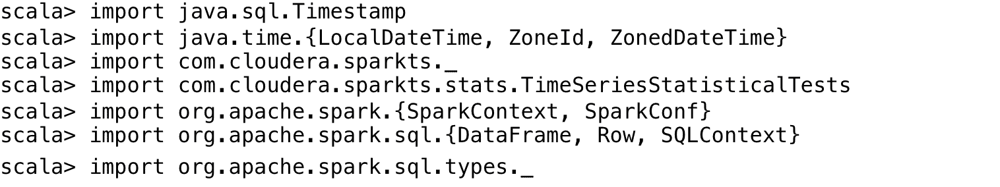

# 预处理时间序列数据集

从输入数据文件中读取数据，并定义一个包含数据集中字段的`case`类 Stock，以及一个用于保存股票代码的字段。

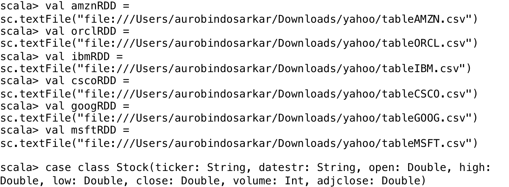

接下来，我们从每个文件中移除标题，使用`case`类映射我们的 RDD 行，包括一个用于股票代码的字符串，并将 RDD 转换为 DataFrame。

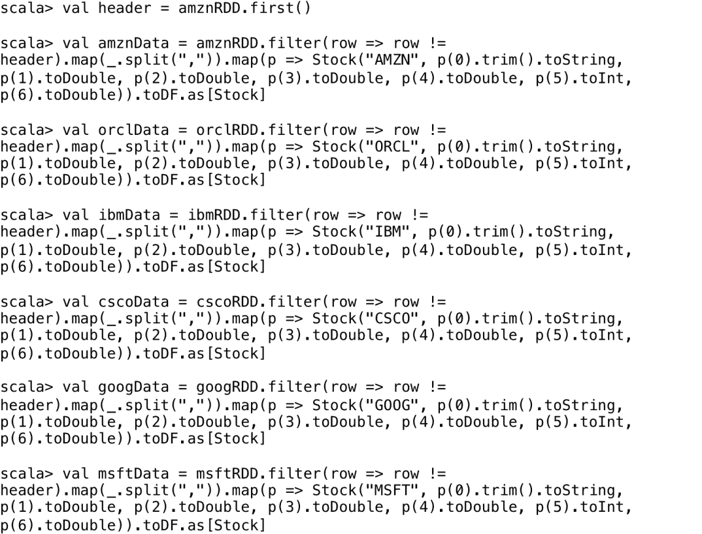

接下来，我们使用`union`将每个 DataFrame 的行合并起来。

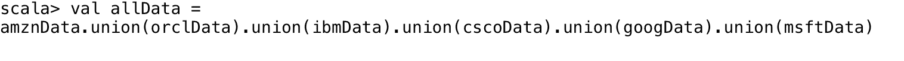

# 处理日期字段

接下来，我们将日期列分成包含日期、月份和年份信息的三个单独字段。

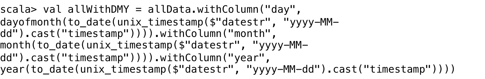

# 持久化和加载数据

在这个阶段，我们可以使用`DataFrameWriter`类将我们的 DataFrame 持久化到 CSV 文件中。覆盖模式允许您覆盖文件，如果它已经存在于`write`操作的先前执行中：

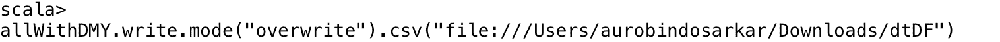

为了加载上一步写入磁盘的时间序列数据集，我们定义一个从文件加载观测值并返回 DataFrame 的函数：

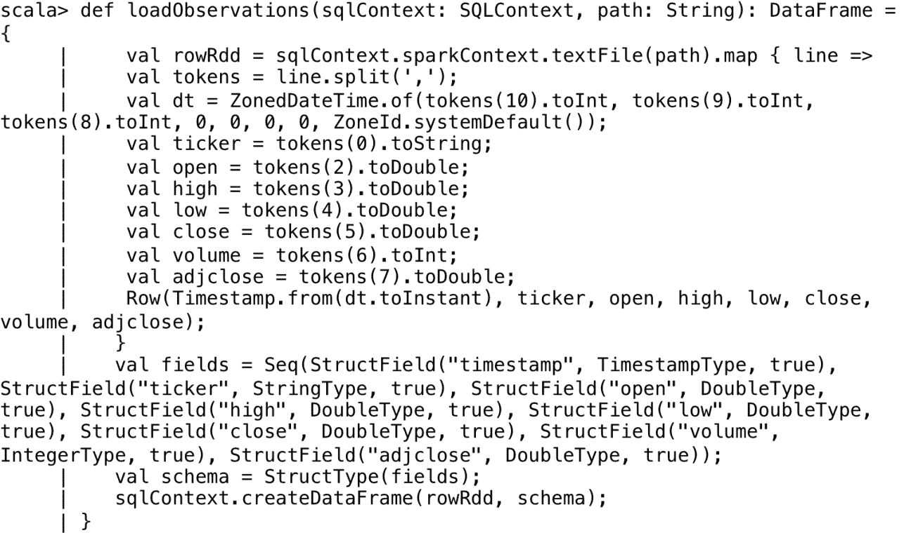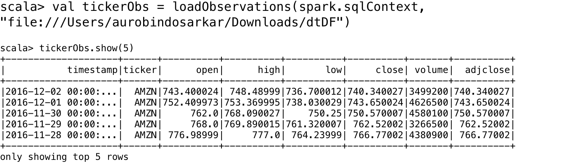

# 定义日期时间索引

我们为我们拥有数据的期间定义一个日期时间索引，以便每条记录（针对特定的股票代码）包括一个时间序列，表示为一年中每一天的`366`个位置的数组（加上额外的一天，因为我们已经从 2015 年 12 月 4 日下载了数据到 2016 年 12 月 4 日）。工作日频率指定数据仅适用于一年中的工作日。

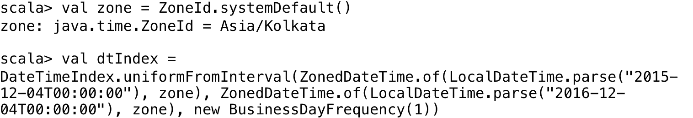

# 使用`TimeSeriesRDD`对象

`spark-ts`库中的主要抽象是称为`TimeSeriesRDD`的 RDD。数据是一组以元组（时间戳、键、值）表示的观测值。键是用于标识时间序列的标签。在下面的示例中，我们的元组是（时间戳、股票代码、收盘价）。RDD 中的每个系列都将股票代码作为键，将股票的每日收盘价作为值。

```scala
scala> val tickerTsrdd = TimeSeriesRDD.timeSeriesRDDFromObservations(dtIndex, tickerObs, "timestamp", "ticker", "close") 
```

我们可以缓存并显示 RDD 中的行数，这应该等于我们示例中的股票数量：

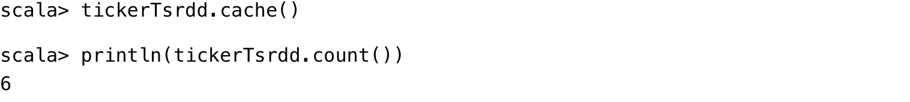

显示 RDD 中的几行以查看每行中的数据：

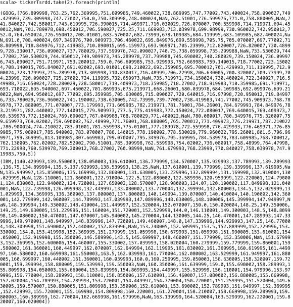

# 处理缺失的时间序列数据

接下来，我们检查 RDD 中是否有缺失数据。缺失数据标记为`NaN`值。在存在`NaN`值的情况下计算基本统计数据会导致错误。因此，我们需要用近似值替换这些缺失值。我们的示例数据不包含任何缺失字段。但是，作为练习，我们从输入数据集中删除一些值，以模拟 RDD 中的这些`NaN`值，然后使用线性插值来填补这些值。其他可用的近似值包括下一个、上一个和最近的值。

我们填写缺失值的近似值，如下所示：


# 计算基本统计数据

最后，我们计算每个系列的均值、标准差、最大值和最小值，如下所示：

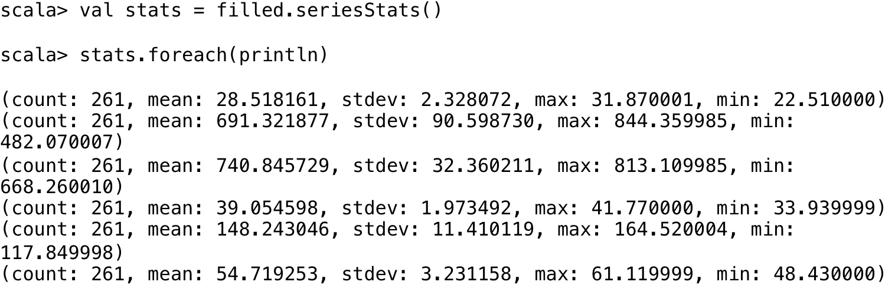

使用`TimeSeriesRDD`对象进行探索性数据分析和数据整理还有许多其他有用的函数。这些包括将 RDD 收集为本地时间序列、查找特定时间序列、各种过滤和切片功能、对数据进行排序和重新分区、将时间序列写入 CSV 文件等等。

# 处理可变长度记录

在这一部分，我们将探讨处理可变长度记录的方法。我们的方法基本上将每一行转换为等于最大长度记录的固定长度记录。在我们的例子中，由于每行代表一个投资组合并且没有唯一标识符，这种方法对将数据转换为熟悉的固定长度记录情况非常有用。我们将生成所需数量的字段，使其等于最大投资组合中的股票数量。这将导致在股票数量少于任何投资组合中的最大股票数量时出现空字段。处理可变长度记录的另一种方法是使用`explode()`函数为给定投资组合中的每支股票创建新行（有关使用`explode()`函数的示例，请参阅第九章，*使用 Spark SQL 开发应用程序)。*

为了避免重复之前示例中的所有步骤来读取所有文件，我们在本例中将数据合并为一个单独的输入文件。

首先，我们导入所需的类并将输入文件读入 RDD：

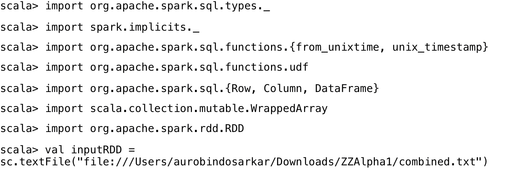

我们计算投资组合的总数，并打印 RDD 中的一些记录。您可以看到，第一个和第二个投资组合各包含一支股票，而第三个投资组合包含两支股票。

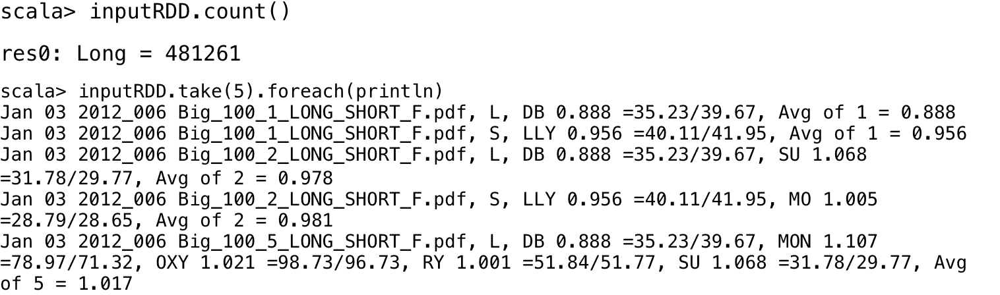

# 将可变长度记录转换为固定长度记录

在我们的示例数据集中，没有缺失的字段，因此，我们可以使用每行逗号的数量来推导出每个投资组合中不同数量的股票相关字段。或者，这些信息可以从 RDD 的最后一个字段中提取出来。

接下来，我们创建一个 UDF 来间接计算每行中逗号的数量，通过计算数据集中所有行中逗号的最大数量来使用`describe`。

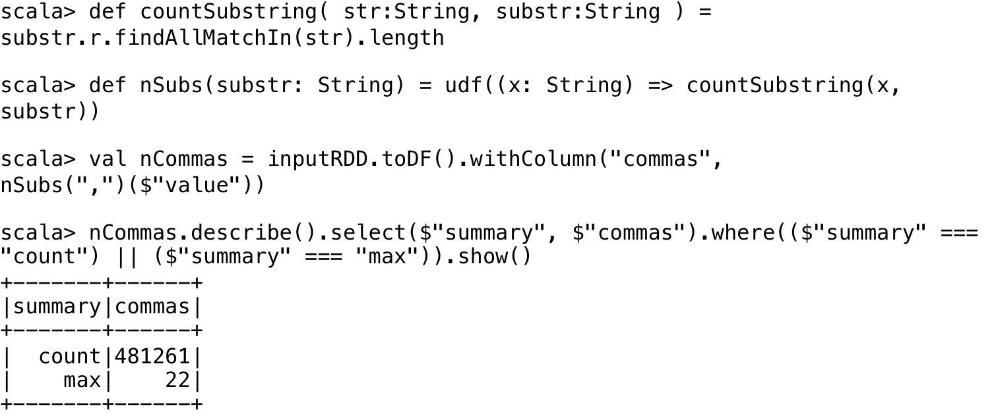

在下一步中，我们用一个包含逗号数量的列来增加 DataFrame。

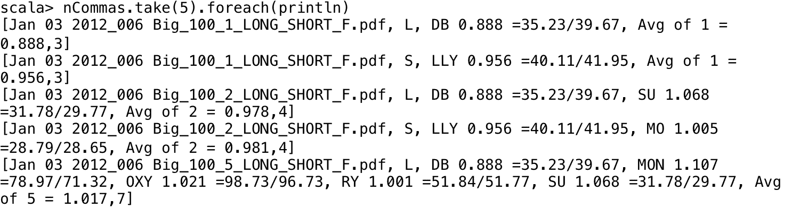

然后我们编写一个函数，在适当的位置插入每行中正确数量的逗号：

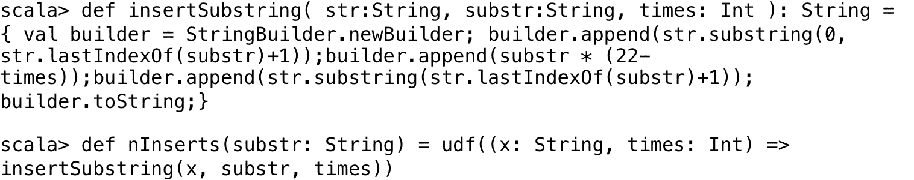

接下来，我们去掉逗号数量列，因为在后续步骤中不需要它：

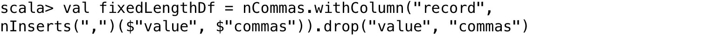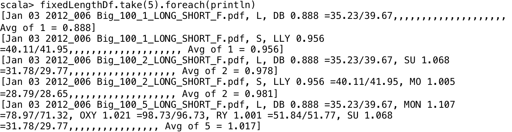

在这个阶段，如果你想要去掉 DataFrame 中的重复行，那么你可以使用`dropDuplicates`方法，如下所示：

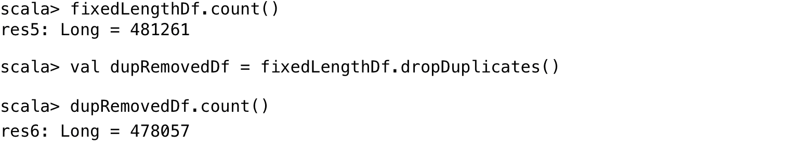

在下一步中，我们为最大投资组合中的最大股票数定义一个`Portfolio`的`case`类。

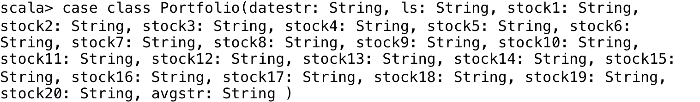

接下来，我们将 RDD 转换为 DataFrame。为了方便起见，我们将演示使用较少的与股票相关的列进行操作；然而，同样的操作可以扩展到投资组合中其他股票的字段：

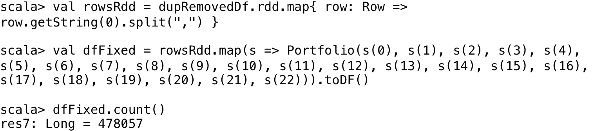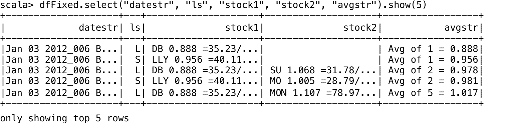

我们可以用`NA`替换较小投资组合中股票的空字段，如下所示：

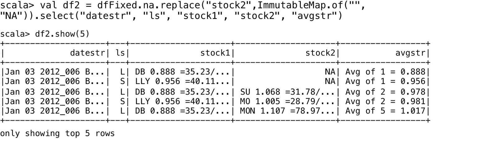

# 从“混乱”的列中提取数据

在这一节中，我们将继续上一节的工作，但是我们将只处理一个股票，以演示修改数据字段所需的数据操作，使得最终得到的数据比起开始时更加干净和丰富。

大多数字段包含多个信息，我们将执行一系列语句，将它们分开成独立的列：

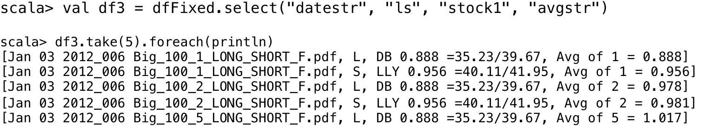

在下一步中，我们将`datestr`列中的第一个下划线替换为一个空格。这样就分离出了日期字段：

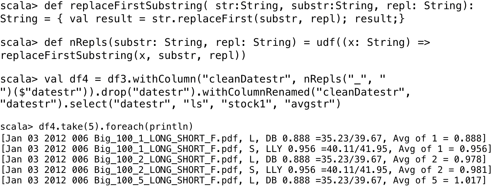

接下来，我们分离股票列中的信息，因为它包含了几个有用的信息，包括股票代码、卖出价格和购买价格的比率，以及卖出价格和购买价格。首先，我们通过用空字符串替换股票列中的`=`来去掉`=`：

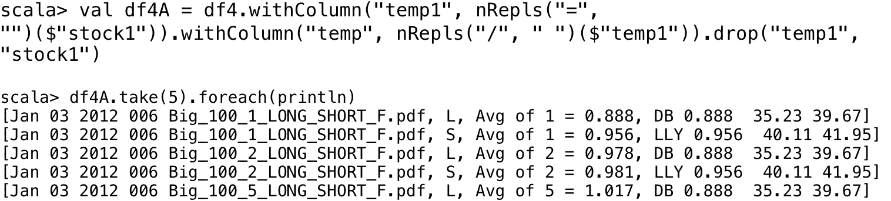

接下来，将每列中由空格分隔的值转换为值的数组：

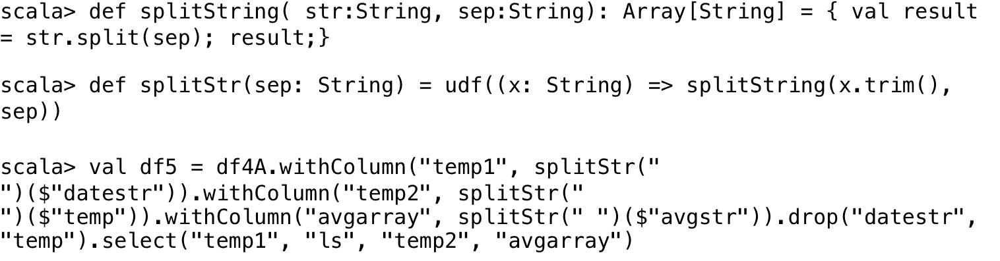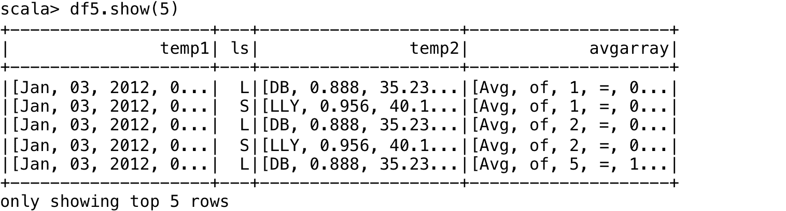

接下来，我们使用`UDF`从每列的数组中挑选出特定元素，放到它们自己的独立列中。

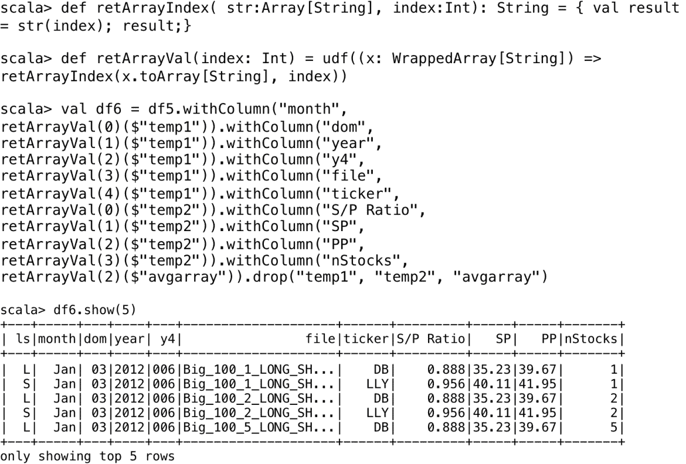

文件列对我们的分析来说并不特别有用，除了提取文件名开头的信息，表示任何给定投资组合的股票池。我们接下来就这样做：

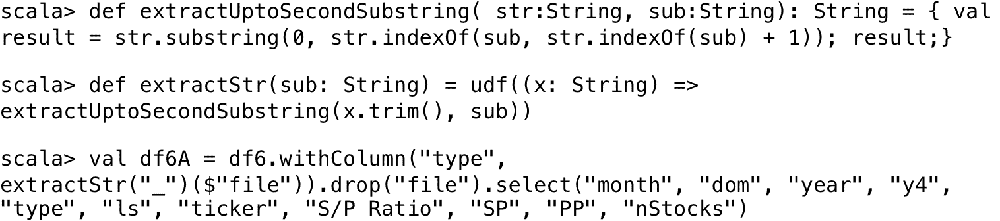

以下是准备进行进一步分析的 DataFrame 的最终版本。在这个例子中，我们只处理了一个股票，但是你可以很容易地将相同的技术扩展到给定投资组合中的所有股票，得到最终的、干净且丰富的 DataFrame，可以用于查询、建模和分析。

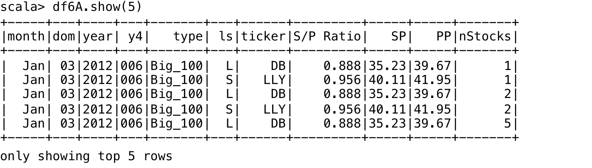

在下一节中，我们简要介绍了为了使用 Spark MLlib 机器学习算法解决分类问题而准备数据所需的步骤。

# 为机器学习准备数据

在这一节中，我们介绍了在应用 Spark MLlib 算法之前准备输入数据的过程。通常情况下，我们需要有两列，称为标签和特征，用于使用 Spark MLlib 分类算法。我们将用下面描述的例子来说明这一点：

我们导入了本节所需的类：

```scala
scala> import org.apache.spark.ml.Pipeline
scala> import org.apache.spark.ml.classification.{RandomForestClassificationModel, RandomForestClassifier}
scala> import org.apache.spark.ml.evaluation.MulticlassClassificationEvaluator
scala> import org.apache.spark.ml.feature.{IndexToString, StringIndexer, VectorIndexer} 
scala> import org.apache.spark.ml.linalg.Vectors 
```

# 为机器学习预处理数据

我们在本节中定义了一组在本节中使用的`UDF`。这些包括，例如，检查字符串是否包含特定子字符串，并返回`0.0`或`1.0`值以创建标签列。另一个`UDF`用于从 DataFrame 中的数字字段创建特征向量。

例如，我们可以通过以下方式将星期几字段转换为数字值进行分箱显示：

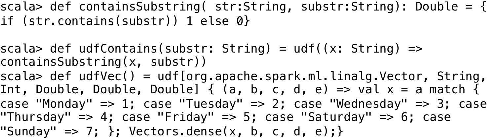

在我们的示例中，我们根据某一天是否下雨，从家庭电力消耗数据集的`Events`列中创建一个`label`。为了说明的目的，我们使用了之前连接的 DataFrame 中的家庭电力消耗读数的列，尽管来自天气数据集的读数可能更好地预测雨水。

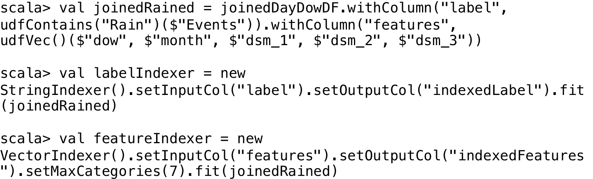

最后，我们还可以将 DataFrame 拆分，创建包含随机选择的 70%和 30%读数的训练和测试数据集。这些数据集用于训练和测试机器学习算法。


# 创建和运行机器学习管道

在本节中，我们介绍了一个使用索引器和训练数据来训练随机森林模型的机器学习管道的示例。我们不会对步骤进行详细解释，因为我们在这里的主要目的是演示前一节中的准备步骤实际上是如何使用的。

```scala
scala> val rf = new RandomForestClassifier().setLabelCol("indexedLabel").setFeaturesCol("indexedFeatures").setNumTrees(10)

scala> // Convert indexed labels back to original labels.
scala> val labelConverter = new IndexToString().setInputCol("prediction").setOutputCol("predictedLabel").setLabels(labelIndexer.labels)

scala> // Chain indexers and forest in a Pipeline.
scala> val pipeline = new Pipeline().setStages(Array(labelIndexer, featureIndexer, rf, labelConverter))

scala> // Train model. This also runs the indexers.
scala> val model = pipeline.fit(trainingData)

scala> // Make predictions.
scala> val predictions = model.transform(testData)

scala> // Select example rows to display.
scala> predictions.select("predictedLabel", "label", "features").show(5)
```

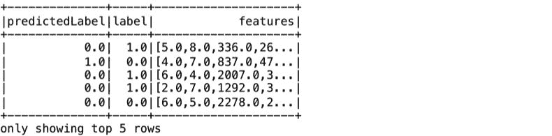

```scala
scala> // Select (prediction, true label) and compute test error.
scala> val evaluator = new MulticlassClassificationEvaluator().setLabelCol("indexedLabel").setPredictionCol("prediction").setMetricName("accuracy")

scala> val accuracy = evaluator.evaluate(predictions)
accuracy: Double = 0.5341463414634147                                          

scala> println("Test Error = " + (1.0 - accuracy))
Test Error = 0.46585365853658534

scala> val rfModel = model.stages(2).asInstanceOf[RandomForestClassificationModel]

scala> println("Learned classification forest model:\n" + rfModel.toDebugString)
```

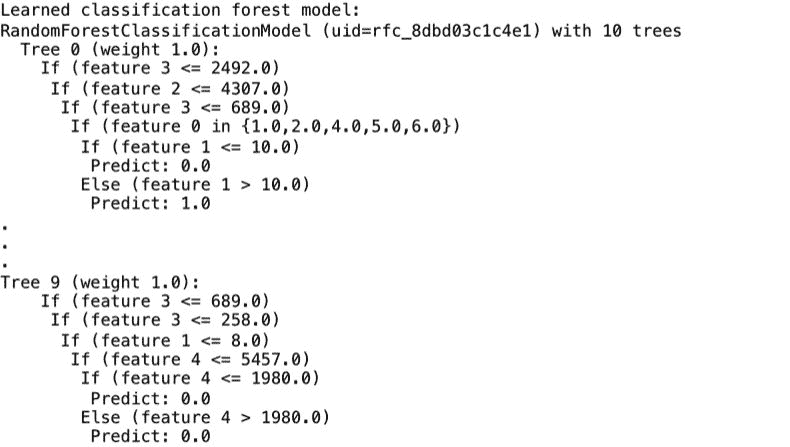

有关特定数据结构和操作的更多详细信息，包括向量、处理分类变量等等，用于 Spark MLlib 处理的内容，将在第六章中进行介绍，**在机器学习应用中使用 Spark SQL**，以及第九章中进行介绍，*使用 Spark SQL 开发应用程序*。此外，有关为图应用程序准备数据的技术将在第七章中进行介绍，**在图应用程序中使用 Spark SQL**。

# 摘要

在本章中，我们探讨了使用 Spark SQL 执行一些基本的数据整理/处理任务。我们涵盖了整理文本数据，处理可变长度记录，从“混乱”的列中提取数据，使用 JOIN 组合数据，并为机器学习应用程序准备数据。此外，我们使用了`spark-ts`库来处理时间序列数据。

在下一章中，我们将把重点转向 Spark Streaming 应用程序。我们将介绍如何在这些应用程序中使用 Spark SQL。我们还将包括大量的实践课程，演示在 Spark Streaming 应用程序中实现常见用例时如何使用 Spark SQL。
