# 第五章：在流应用中使用 Spark SQL

在本章中，我们将介绍在流应用中使用 Spark SQL 的典型用例。我们的重点将放在使用 Spark 2.0 中引入的 Dataset/DataFrame API 进行结构化流处理上。此外，我们还将介绍并使用 Apache Kafka，因为它是许多大规模网络流应用架构的重要组成部分。流应用通常涉及对传入数据或消息进行实时、上下文感知的响应。我们将使用几个示例来说明构建此类应用的关键概念和技术。

在本章中，我们将学习以下主题：

+   什么是流数据应用？

+   典型的流应用用例

+   使用 Spark SQL DataFrame/Dataset API 构建流应用

+   在结构化流应用中使用 Kafka

+   为自定义数据源创建接收器

# 介绍流数据应用

传统的批处理应用通常运行数小时，处理存储在关系数据库中的所有或大部分数据。最近，基于 Hadoop 的系统已被用于支持基于 MapReduce 的批处理作业，以处理非常大量的分布式数据。相比之下，流处理发生在持续生成的流数据上。这种处理在各种分析应用中被使用，用于计算事件之间的相关性、聚合值、对传入数据进行抽样等。

流处理通常会逐步计算统计数据和其他功能，以记录/事件为基础，或者在滑动时间窗口上进行实时计算。

越来越多的流数据应用正在应用机器学习算法和复杂事件处理（CEP）算法，以提供战略洞察和快速、智能地对快速变化的业务条件做出反应。这类应用可以扩展以处理非常大量的流数据，并能够实时做出适当的响应。此外，许多组织正在实施包含实时层和批处理层的架构。在这种实现中，尽可能地保持这两个层的单一代码库非常重要（有关此类架构的示例，请参阅第十二章，*大规模应用架构中的 Spark SQL*）。Spark 结构化流 API 可以帮助我们以可扩展、可靠和容错的方式实现这些目标。

流应用的一些真实用例包括处理物联网应用中的传感器数据、股票市场应用（如风险管理和算法交易）、网络监控、监视应用、电子商务应用中的即时客户参与、欺诈检测等。

因此，许多平台已经出现，提供了构建流数据应用所需的基础设施，包括 Apache Kafka、Apache Spark Streaming、Apache Storm、Amazon Kinesis Streams 等。

在本章中，我们将探讨使用 Apache Spark 和 Apache Kafka 进行流处理。在接下来的几节中，我们将使用 Spark SQL DataFrame/Dataset API 详细探讨 Spark 结构化流。

# 构建 Spark 流应用

在本节中，我们将主要关注新引入的结构化流特性（在 Spark 2.0 中）。结构化流 API 在 Spark 2.2 中已经是 GA，并且使用它们是构建流式 Spark 应用的首选方法。Spark 2.2 还发布了对基于 Kafka 的处理组件的多个更新，包括性能改进。我们在第一章，*开始使用 Spark SQL*中介绍了结构化流，本章中我们将深入探讨这个主题，并提供几个代码示例来展示其能力。

简而言之，结构化流提供了一种快速、可扩展、容错、端到端的精确一次流处理，而开发人员无需考虑底层的流处理机制。

它建立在 Spark SQL 引擎上，流计算可以以与静态数据上的批处理计算相同的方式来表达。它提供了几种数据抽象，包括流查询、流源和流接收器，以简化流应用程序，而不涉及数据流的底层复杂性。编程 API 在 Scala、Java 和 Python 中都可用，您可以使用熟悉的 Dataset / DataFrame API 来实现您的应用程序。

在第一章中，*开始使用 Spark SQL*，我们使用 IPinYou 数据集创建了一个流 DataFrame，然后在其上定义了一个流查询。我们展示了结果在每个时间间隔内得到更新。在这里，我们重新创建我们的流 DataFrame，然后在其上执行各种函数，以展示在流输入数据上可能的计算类型。

首先，我们启动 Spark shell，并导入本章实际操作所需的必要类。在我们的大多数示例中，我们将使用文件源来模拟传入的数据：

```scala
scala> import org.apache.spark.sql.types._
scala> import org.apache.spark.sql.functions._
scala> import scala.concurrent.duration._
scala> import org.apache.spark.sql.streaming.ProcessingTime
scala> import org.apache.spark.sql.streaming.OutputMode.Complete
scala> import spark.implicits._
```

接下来，我们将为源文件中的出价记录定义模式，如下所示：

```scala
scala> val bidSchema = new StructType().add("bidid", StringType).add("timestamp", StringType).add("ipinyouid", StringType).add("useragent", StringType).add("IP", StringType).add("region", IntegerType).add("cityID", IntegerType).add("adexchange", StringType).add("domain", StringType).add("turl", StringType).add("urlid", StringType).add("slotid", StringType).add("slotwidth", StringType).add("slotheight", StringType).add("slotvisibility", StringType).add("slotformat", StringType).add("slotprice", StringType).add("creative", StringType).add("bidprice", StringType)
```

接下来，我们将基于输入的 CSV 文件定义一个流数据源。我们指定在上一步中定义的模式和其他必需的参数（使用选项）。我们还将每批处理的文件数量限制为一个：

```scala
scala> val streamingInputDF = spark.readStream.format("csv").schema(bidSchema).option("header", false).option("inferSchema", true).option("sep", "\t").option("maxFilesPerTrigger", 1).load("file:///Users/aurobindosarkar/Downloads/make-ipinyou-data-master/original-data/ipinyou.contest.dataset/bidfiles")
```

您可以像在静态数据的情况下一样打印流 DataFrame 的模式：

```scala
scala> streamingInputDF.printSchema()
root
|-- bidid: string (nullable = true)
|-- timestamp: string (nullable = true)
|-- ipinyouid: string (nullable = true)
|-- useragent: string (nullable = true)
|-- IP: string (nullable = true)
|-- region: integer (nullable = true)
|-- cityID: integer (nullable = true)
|-- adexchange: string (nullable = true)
|-- domain: string (nullable = true)
|-- turl: string (nullable = true)
|-- urlid: string (nullable = true)
|-- slotid: string (nullable = true)
|-- slotwidth: string (nullable = true)
|-- slotheight: string (nullable = true)
|-- slotvisibility: string (nullable = true)
|-- slotformat: string (nullable = true)
|-- slotprice: string (nullable = true)
|-- creative: string (nullable = true)
|-- bidprice: string (nullable = true)
```

# 实现基于滑动窗口的功能

在本小节中，我们将介绍对流数据进行滑动窗口操作。

由于时间戳数据格式不正确，我们将定义一个新列，并将输入时间戳字符串转换为适合我们处理的正确格式和类型：

```scala
scala> val ts = unix_timestamp($"timestamp", "yyyyMMddHHmmssSSS").cast("timestamp")

scala> val streamingCityTimeDF = streamingInputDF.withColumn("ts", ts).select($"cityID", $"ts")
```

接下来，我们将定义一个流查询，将输出写入标准输出。我们将在滑动窗口上定义聚合，其中我们按窗口和城市 ID 对数据进行分组，并计算每个组的计数。

有关结构化流编程的更详细描述，请参阅[`spark.apache.org/docs/latest/structured-streaming-programming-guide.html.`](http://spark.apache.org/docs/latest/structured-streaming-programming-guide.html)

在这里，我们计算在 10 分钟的窗口内的出价数量，每五分钟更新一次，也就是说，在每五分钟滑动一次的 10 分钟窗口内收到的出价。使用窗口的流查询如下所示：

```scala
scala> val windowedCounts = streamingCityTimeDF.groupBy(window($"ts", "10 minutes", "5 minutes"), $"cityID").count().writeStream.outputMode("complete").format("console").start()
```

输出写入标准输出，因为我们在格式参数中使用了`console`关键字指定了`Console Sink`。输出包含窗口、城市 ID 和计算的计数列，如下所示。我们看到了两批数据，因为我们在输入目录中放置了两个文件：

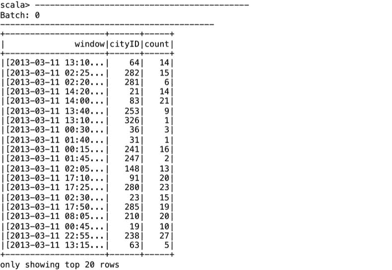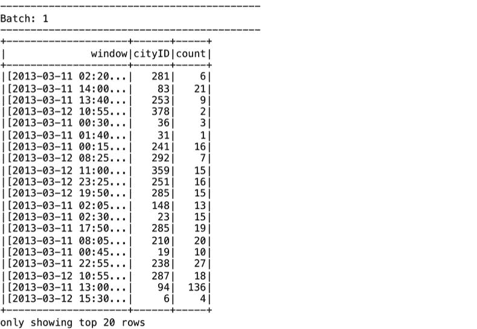

# 将流数据集与静态数据集进行连接

在本小节中，我们将举例说明如何将流数据集与静态数据集进行连接。我们将基于`cityID`来连接数据集，以实现包含城市名称而不是`cityID`的用户友好输出。首先，我们为我们的城市记录定义一个模式，并从包含城市 ID 及其对应城市名称的 CSV 文件创建静态 DataFrame：

```scala
scala> val citySchema = new StructType().add("cityID", StringType).add("cityName", StringType)

scala> val staticDF = spark.read.format("csv").schema(citySchema).option("header", false).option("inferSchema", true).option("sep", "\t").load("file:///Users/aurobindosarkar/Downloads/make-ipinyou-data-master/original-data/ipinyou.contest.dataset/city.en.txt")
```

接下来，我们将连接流和静态 DataFrame，如下所示：

```scala
scala> val joinedDF = streamingCityTimeDF.join(staticDF, "cityID")
```

我们将执行我们之前的流查询，指定城市名称的列，而不是连接的 DataFrame 中的城市 ID：

```scala
scala> val windowedCityCounts = joinedDF.groupBy(window($"ts", "10 minutes", "5 minutes"), $"cityName").count().writeStream.outputMode("complete").format("console").start()
```

结果如下。在这里，我们看到了一批输出数据，因为我们已经从源目录中删除了一个输入文件。在本章的其余部分，我们将限制处理为单个输入文件，以节省空间：

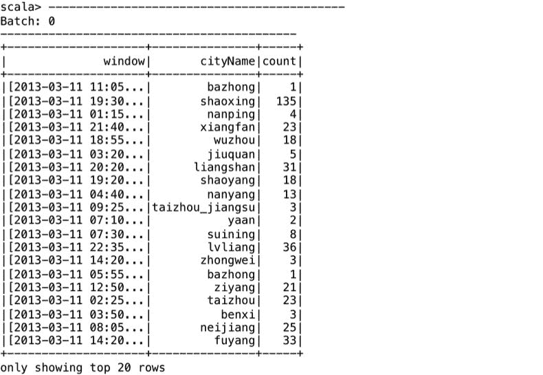

接下来，我们创建一个带有时间戳列和从先前创建的 DataFrame 中选择的几列的新 DataFrame：

```scala
scala> val streamingCityNameBidsTimeDF = streamingInputDF.withColumn("ts", ts).select($"ts", $"bidid", $"cityID", $"bidprice", $"slotprice").join(staticDF, "cityID") 
```

由于我们不计算聚合，并且只是希望将流式出价附加到结果中，因此我们使用`outputMode`"append"而不是"complete"，如下所示：

```scala
scala> val cityBids = streamingCityNameBidsTimeDF.select($"ts", $"bidid", $"bidprice", $"slotprice", $"cityName").writeStream.outputMode("append").format("console").start()
```

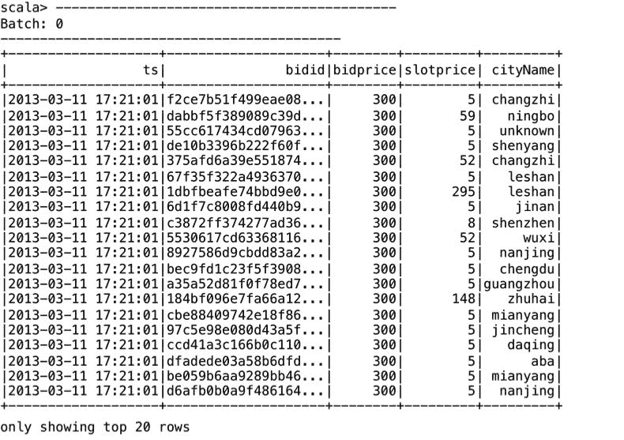

# 使用结构化流中的数据集 API

到目前为止，我们已经使用了与 DataFrame 不同的未类型化 API。为了使用类型化 API，我们可以从使用 DataFrame 切换到使用数据集。大多数流式操作都受到 DataFrame/Dataset API 的支持；但是，一些操作，如多个流式聚合和不支持的不同操作，尚不受支持。而其他操作，如外连接和排序，是有条件支持的。

有关不受支持和有条件支持的操作的完整列表，请参阅[`spark.apache.org/docs/latest/structured-streaming-programming-guide.html`](http://spark.apache.org/docs/latest/structured-streaming-programming-guide.html)。

在这里，我们提供了一些使用类型化 API 的示例。

首先，我们将定义一个名为`Bid`的`case`类：

```scala
scala> case class Bid(bidid: String, timestamp: String, ipinyouid: String, useragent: String, IP: String, region: Integer, cityID: Integer, adexchange: String, domain: String, turl: String, urlid: String, slotid: String, slotwidth: String, slotheight: String, slotvisibility: String, slotformat: String, slotprice: String, creative: String, bidprice: String)
```

我们可以使用在前一步中定义的`case`类，从流式 DataFrame 中定义一个流式数据集：

```scala
scala> val ds = streamingInputDF.as[Bid]
```

# 使用输出 sink

您可以将流式输出数据定向到各种输出 sink，包括文件、Foreach、控制台和内存 sink。通常，控制台和内存 sink 用于调试目的。由于我们已经在之前的部分中使用了控制台 sink，因此我们将更详细地讨论其他 sink 的用法。

# 使用 Foreach Sink 进行输出上的任意计算

如果您想对输出执行任意计算，那么可以使用`Foreach` Sink。为此，您需要实现`ForeachWriter`接口，如所示。在我们的示例中，我们只是打印记录，但您也可以根据您的要求执行其他计算：

```scala
import org.apache.spark.sql.ForeachWriter

val writer = new ForeachWriter[String] {
   override def open(partitionId: Long, version: Long) = true
   override def process(value: String) = println(value)
   override def close(errorOrNull: Throwable) = {}
}
```

在下一步中，我们将实现一个示例，使用在上一步中定义的`Foreach` sink。如下所示，指定在前一步中实现的`ForeachWriter`：

```scala
scala> val dsForeach = ds.filter(_.adexchange == "3").map(_.useragent).writeStream.foreach(writer).start()
```

结果将显示用户代理信息，如下所示：

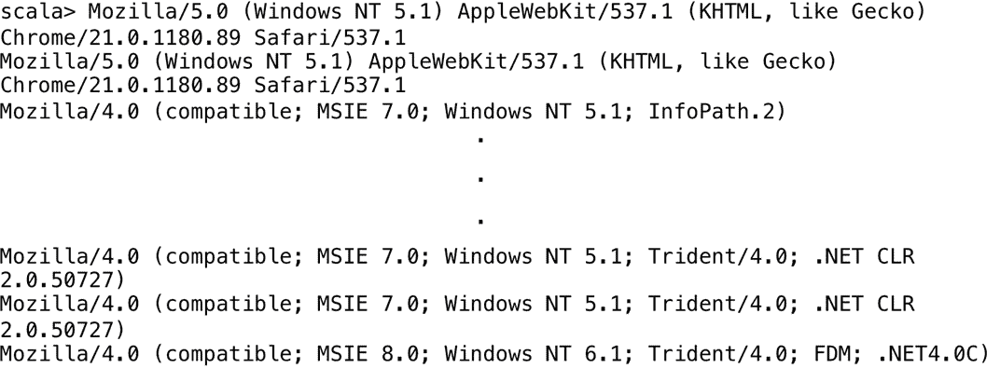

# 使用内存 Sink 将输出保存到表

如果您想将输出数据保存为表，可以使用内存 Sink；这对于交互式查询很有用。我们像以前一样定义一个流式 DataFrame。但是，我们将格式参数指定为`memory`，并指定表名。最后，我们对我们的表执行 SQL 查询，如下所示：

```scala
scala> val aggAdexchangeDF = streamingInputDF.groupBy($"adexchange").count()

scala> val aggQuery = aggAdexchangeDF.writeStream.queryName("aggregateTable").outputMode("complete").format("memory").start()

scala> spark.sql("select * from aggregateTable").show()   
```

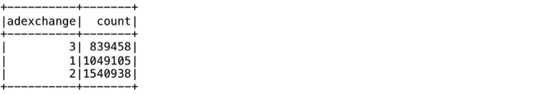

# 使用文件 sink 将输出保存到分区表

我们还可以将输出保存为分区表。例如，我们可以按时间对输出进行分区，并将其存储为 HDFS 上的 Parquet 文件。在这里，我们展示了使用文件 sink 将输出存储为 Parquet 文件的示例。在给定的命令中，必须指定检查点目录位置：

```scala
scala> val cityBidsParquet = streamingCityNameBidsTimeDF.select($"bidid", $"bidprice", $"slotprice", $"cityName").writeStream.outputMode("append").format("parquet").option("path", "hdfs://localhost:9000/pout").option("checkpointLocation", "hdfs://localhost:9000/poutcp").start()
```

您可以检查 HDFS 文件系统，查看输出 Parquet 文件和检查点文件，如下所示：

```scala
Aurobindos-MacBook-Pro-2:~ aurobindosarkar$ hdfs dfs -ls /pout
```

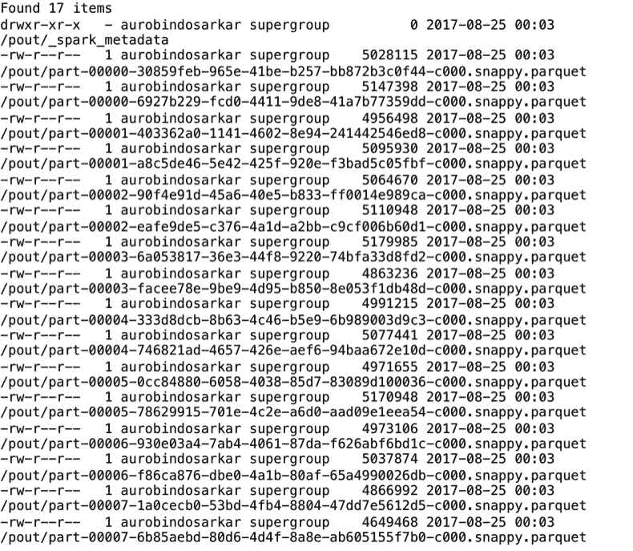

```scala
Aurobindos-MacBook-Pro-2:~ aurobindosarkar$ hdfs dfs -ls /poutcp
```

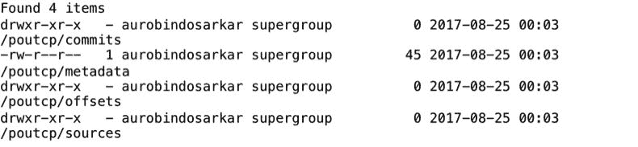

在下一节中，我们将探索一些有用的功能，用于管理和监视流式查询。

# 监视流式查询

在这个阶段，如果您列出系统中的活动流查询，您应该会看到以下输出：

```scala
scala> spark.streams.active.foreach(x => println("ID:"+ x.id + "             Run ID:"+ x.runId + "               Status: "+ x.status))

ID:0ebe31f5-6b76-46ea-a328-cd0c637be49c             
Run ID:6f203d14-2a3a-4c9f-9ea0-8a6783d97873               
Status: {
  "message" : "Waiting for data to arrive",
  "isDataAvailable" : false,
  "isTriggerActive" : false
}
ID:519cac9a-9d2f-4a01-9d67-afc15a6b03d2             
Run ID:558590a7-cbd3-42b8-886b-cdc32bb4f6d7               
Status: {
  "message" : "Waiting for data to arrive",
  "isDataAvailable" : false,
  "isTriggerActive" : false
}
ID:1068bc38-8ba9-4d5e-8762-bbd2abffdd51             
Run ID:bf875a27-c4d8-4631-9ea2-d51a0e7cb232               
Status: {
  "message" : "Waiting for data to arrive",
  "isDataAvailable" : false,
  "isTriggerActive" : false
}
ID:d69c4005-21f1-487a-9fe5-d804ca86f0ff             
Run ID:a6969c1b-51da-4986-b5f3-a10cd2397784               
Status: {
  "message" : "Waiting for data to arrive",
  "isDataAvailable" : false,
  "isTriggerActive" : false
}
ID:1fa9e48d-091a-4888-9e69-126a2f1c081a             
Run ID:34dc2c60-eebc-4ed6-bf25-decd6b0ad6c3               
Status: {
  "message" : "Waiting for data to arrive",
  "isDataAvailable" : false,  "isTriggerActive" : false
}
ID:a7ff2807-dc23-4a14-9a9c-9f8f1fa6a6b0             
Run ID:6c8f1a83-bb1c-4dd7-8974
83042a286bae               
Status: {
  "message" : "Waiting for data to arrive",
  "isDataAvailable" : false,
  "isTriggerActive" : false
}
```

我们还可以监视和管理特定的流式查询，例如`windowedCounts`查询（一个`StreamingQuery`对象），如下所示：

```scala
scala> // get the unique identifier of the running query that persists across restarts from checkpoint data
scala> windowedCounts.id          
res6: java.util.UUID = 0ebe31f5-6b76-46ea-a328-cd0c637be49c

scala> // get the unique id of this run of the query, which will be generated at every start/restart
scala> windowedCounts.runId       
res7: java.util.UUID = 6f203d14-2a3a-4c9f-9ea0-8a6783d97873

scala> // the exception if the query has been terminated with error
scala> windowedCounts.exception       
res8: Option[org.apache.spark.sql.streaming.StreamingQueryException] = None

scala> // the most recent progress update of this streaming query
scala> windowedCounts.lastProgress 
res9: org.apache.spark.sql.streaming.StreamingQueryProgress =
```

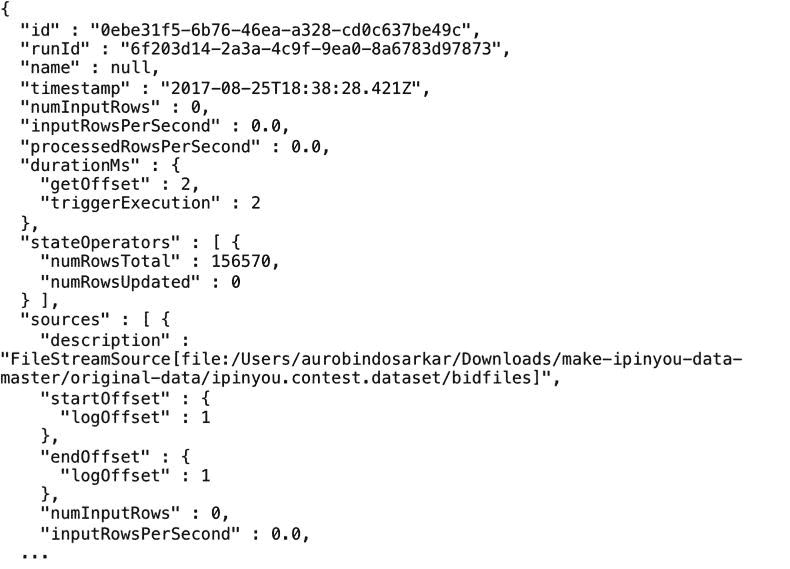

要停止流式查询执行，您可以执行`stop()`命令，如下所示：

```scala
scala> windowedCounts.stop()
```

在下一节中，我们将把重点转移到使用 Kafka 作为结构化流应用程序中传入数据流的来源。

# 使用 Kafka 与 Spark 结构化流

Apache Kafka 是一个分布式流平台。它使您能够发布和订阅数据流，并在其产生时处理和存储它们。Kafka 被业界广泛采用于面向 Web 规模应用程序，因为它具有高吞吐量、低延迟、高可伸缩性、高并发性、可靠性和容错特性。

# 介绍 Kafka 概念

Kafka 通常用于构建实时流数据管道，可在系统之间可靠地移动数据，还可对数据流进行转换和响应。Kafka 作为一个或多个服务器上的集群运行。

这里描述了 Kafka 的一些关键概念：

+   **主题**：用于发布消息的类别或流名称的高级抽象。一个主题可以有`0`、`1`或多个订阅其发布的消息的消费者。用户为每个新类别的消息定义一个新主题。

+   **生产者**：向主题发布消息的客户端。

+   **消费者**：从主题中消费消息的客户端。

+   **Broker**：一个或多个服务器，用于复制和持久化消息数据。

此外，生产者和消费者可以同时写入和读取多个主题。每个 Kafka 主题都被分区，写入每个分区的消息是顺序的。分区中的消息具有唯一标识每条消息的偏移量。

Apache Kafka 安装、教程和示例的参考网站是[`kafka.apache.org/`](https://kafka.apache.org/)。

主题的分区是分布的，每个 Broker 处理一部分分区的请求。每个分区在可配置数量的 Broker 上复制。Kafka 集群保留所有发布的消息一段可配置的时间。Apache Kafka 使用 Apache ZooKeeper 作为其分布式进程的协调服务。

# 介绍 ZooKeeper 概念

ZooKeeper 是一个分布式的开源协调服务，用于分布式应用程序。它使开发人员不必从头开始实现协调服务。它使用共享的分层命名空间，允许分布式进程相互协调，并避免与竞争条件和死锁相关的错误。

Apache ZooKeeper 安装和教程的参考网站是[`zookeeper.apache.org/`](https://zookeeper.apache.org/)。

ZooKeeper 数据保存在内存中，因此具有非常高的吞吐量和低延迟。它在一组主机上复制，以提供高可用性。ZooKeeper 提供一组保证，包括顺序一致性和原子性。

# 介绍 Kafka-Spark 集成

我们在这里提供一个简单的示例，以使您熟悉 Kafka-Spark 集成。本节的环境使用：Apache Spark 2.1.0 和 Apache Kafka 0.10.1.0（下载文件：`kafka_2.11-0.10.1.0.tgz)`。

首先，我们使用 Apache Kafka 分发提供的脚本启动单节点 ZooKeeper，如下所示：

```scala
bin/zookeeper-server-start.sh config/zookeeper.properties
```

Zookeeper 节点启动后，我们使用 Apache Kafka 分发中提供的脚本启动 Kafka 服务器，如下所示：

```scala
bin/kafka-server-start.sh config/server.properties
```

接下来，我们创建一个名为`test`的主题，我们将向其发送消息以供 Spark 流处理。对于我们的简单示例，我们将复制因子和分区数都指定为`1`。我们可以使用为此目的提供的实用脚本，如下所示：

```scala
bin/kafka-topics.sh --create --zookeeper localhost:2181 --replication-factor 1 --partitions 1 --topic test
```

我们可以使用此脚本查看主题列表（包括“test”）：

```scala
bin/kafka-topics.sh --list --zookeeper localhost:2181
```

接下来，我们启动一个基于命令行的生产者来向 Kafka 发送消息，如下所示。在这里，每行都作为单独的消息发送。当您输入并按下回车时，您应该在 Spark 流查询中看到每行出现（在不同的窗口中运行）。

```scala
bin/kafka-console-producer.sh --broker-list localhost:9092 --topic test
This is the first message.
This is another message.
```

在一个单独的窗口中，启动 Spark shell，并在命令行中指定适当的 Kafka 包，如下所示：

```scala
Aurobindos-MacBook-Pro-2:spark-2.1.0-bin-hadoop2.7 aurobindosarkar$ ./bin/spark-shell --packages org.apache.spark:spark-streaming-kafka-0-10_2.11:2.1.0,org.apache.spark:spark-sql-kafka-0-10_2.11:2.1.0
```

Spark shell 启动后，我们将创建一个格式指定为"kafka"的流式数据集。此外，我们还将指定 Kafka 服务器和其运行的端口，并明确订阅我们之前创建的主题，如下所示。键和值字段被转换为字符串类型，以使输出易于阅读。

```scala
scala> val ds1 = spark.readStream.format("kafka").option("kafka.bootstrap.servers", "localhost:9092").option("subscribe", "test").load().selectExpr("CAST(key AS STRING)", "CAST(value AS STRING)").as[(String, String)]
```

接下来，我们将启动一个流式查询，将流式数据集输出到标准输出，如下所示：

```scala
scala> val query = ds1.writeStream.outputMode("append").format("console").start()
```

当您在 Kafka 生产者窗口中输入句子时，您应该看到以下输出：

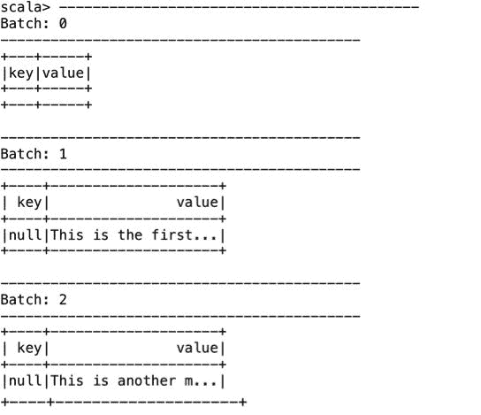

# 介绍 Kafka-Spark 结构化流

然后，我们将提供另一个 Kafka-Spark 结构化流的示例，其中我们将 iPinYou 竞价文件的内容定向到生产者，如下所示：

```scala
Aurobindos-MacBook-Pro-2:kafka_2.11-0.10.1.0 aurobindosarkar$ bin/kafka-console-producer.sh --broker-list localhost:9092 --topic connect-test < /Users/aurobindosarkar/Downloads/make-ipinyou-data-master/original-data/ipinyou.contest.dataset/bidfiles/bid.20130311.txt
```

我们还将创建一个名为`connect-test`的新主题，一个包含文件记录的新流式数据集，以及一个在屏幕上列出它们的新流式查询，如下所示：

```scala
scala> val ds2 = spark.readStream.format("kafka").option("kafka.bootstrap.servers", "localhost:9092").option("subscribe", "connect-test").load().selectExpr("CAST(key AS STRING)", "CAST(value AS STRING)").as[(String, String)]

scala> val query = ds2.writeStream.outputMode("append").format("console").start()
```

截断的输出如下所示。记录分布在多个批次中，因为它们在流中传输：

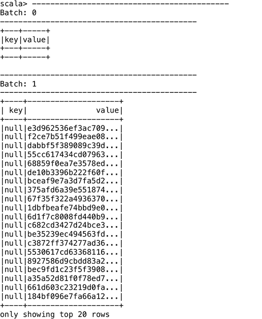

在下一节中，我们将创建一个用于访问任意流式数据源的接收器。

# 为自定义数据源编写接收器

到目前为止，我们已经使用了在 Spark 中内置支持的数据源。但是，Spark 流式处理可以从任意源接收数据，但我们需要实现一个接收器来从自定义数据源接收数据。

在本节中，我们将为来自**伦敦交通**（TfL）网站提供的公共 API 定义一个自定义数据源。该网站为伦敦的每种交通方式提供了统一的 API。这些 API 提供对实时数据的访问，例如，铁路到达情况。输出以 XML 和 JSON 格式提供。我们将使用 API 来获取伦敦地铁特定线路的当前到达预测。

TfL 的参考网站是[`tfl.gov.uk`](https://tfl.gov.uk); 在该网站上注册以生成用于访问 API 的应用程序密钥。

我们将首先扩展抽象类`Receiver`并实现`onStart()`和`onStop()`方法。在`onStart()`方法中，我们启动负责接收数据的线程，在`onStop()`中，我们停止这些线程。`receive`方法使用 HTTP 客户端接收数据流，如下所示：

```scala
import org.apache.spark.storage.StorageLevel
import org.apache.spark.streaming.receiver.Receiver
import org.jfarcand.wcs.{TextListener, WebSocket}
import scala.util.parsing.json.JSON
import scalaj.http.Http
import java.io.BufferedReader;
import java.io.IOException;
import java.io.InputStreamReader;
import org.apache.http.HttpResponse;
import org.apache.http.client.ClientProtocolException;
import org.apache.http.client.methods.HttpGet;
import org.apache.http.impl.client.DefaultHttpClient;
/**
* Spark Streaming Example TfL Receiver
*/
class TFLArrivalPredictionsByLine() extends ReceiverString with Runnable {
//Replace the app_key parameter with your own key
private val tflUrl = "https://api.tfl.gov.uk/Line/circle/Arrivals?stopPointId=940GZZLUERC&app_id=a73727f3&app_key=xxx"
@transient
private var thread: Thread = _
override def onStart(): Unit = {
   thread = new Thread(this)
   thread.start()
}
override def onStop(): Unit = {
   thread.interrupt()
}
override def run(): Unit = {
   while (true){
     receive();
     Thread.sleep(60*1000);
   }
}
private def receive(): Unit = {
   val httpClient = new DefaultHttpClient();
   val getRequest = new HttpGet(tflUrl);
   getRequest.addHeader("accept", "application/json");
   val response = httpClient.execute(getRequest);
   if (response.getStatusLine().getStatusCode() != 200) {
      throw new RuntimeException("Failed : HTTP error code : "
         + response.getStatusLine().getStatusCode());
   }
   val br = new BufferedReader(
      new InputStreamReader((response.getEntity().getContent())));
   var output=br.readLine();
   while(output!=null){        
      println(output)
      output=br.readLine()
   } 
}
}
```

以下对象创建了`StreamingContext`并启动了应用程序。`awaitTermination()`方法确保应用程序持续运行。

您可以使用*Ctrl *+ *C *来终止应用程序：

```scala
import org.apache.spark.SparkConf
import org.apache.spark.streaming.{Seconds, StreamingContext}
/**
* Spark Streaming Example App
*/
object TFLStreamingApp {
def main(args: Array[String]) {
   val conf = new SparkConf().setAppName("TFLStreaming")
   val ssc = new StreamingContext(conf, Seconds(300))
   val stream = ssc.receiverStream(new TFLArrivalPredictionsByLine())
   stream.print()
   if (args.length > 2) {
      stream.saveAsTextFiles(args(2))
   }
   ssc.start()
   ssc.awaitTermination()
   }
}
```

用于编译和打包应用程序的`sbt`文件如下所示：

```scala
name := "spark-streaming-example"
version := "1.0"
scalaVersion := "2.11.7"
resolvers += "jitpack" at "https://jitpack.io"
libraryDependencies ++= Seq("org.apache.spark" %% "spark-core" % "2.0.0",       "org.apache.spark" %% "spark-streaming" % "2.0.0",
"org.apache.httpcomponents" % "httpclient" % "4.5.2",
"org.scalaj" %% "scalaj-http" % "2.2.1",
"org.jfarcand" % "wcs" % "1.5")
```

我们使用`spark-submit`命令来执行我们的应用程序，如下所示：

```scala
Aurobindos-MacBook-Pro-2:scala-2.11 aurobindosarkar$ /Users/aurobindosarkar/Downloads/spark-2.2.0-bin-hadoop2.7/bin/spark-submit --class TFLStreamingApp --master local[*] spark-streaming-example_2.11-1.0.jar
```

流式程序的输出如下所示：

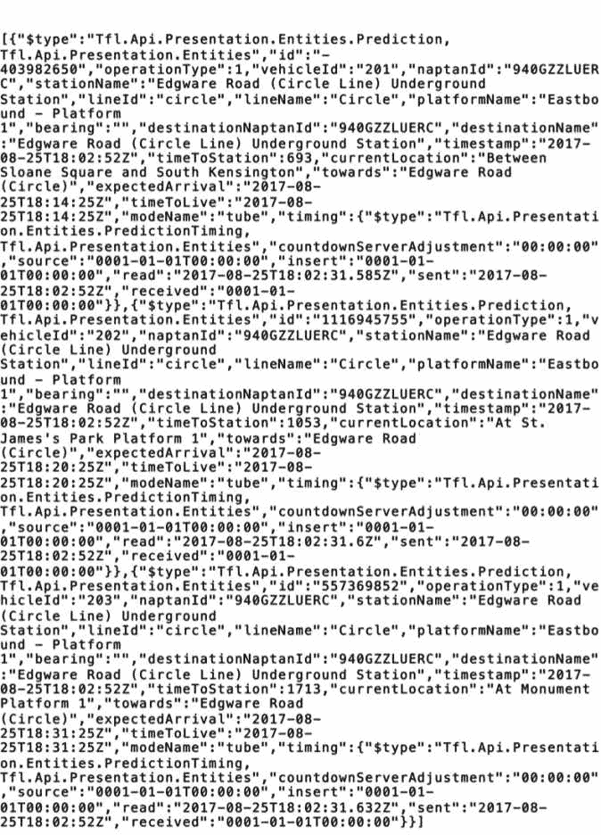

# 总结

在本章中，我们介绍了流式数据应用程序。我们提供了使用 Spark SQL DataFrame/Dataset API 构建流式应用程序的几个示例。此外，我们展示了 Kafka 在结构化流应用程序中的使用。最后，我们提供了一个为自定义数据源创建接收器的示例。

在下一章中，我们将把重点转移到在机器学习应用中使用 Spark SQL。具体来说，我们将探索特征工程和机器学习流水线的关键概念。
