# 第六章：在机器学习应用中使用 Spark SQL

在本章中，我们将介绍在机器学习应用中使用 Spark SQL 的典型用例。我们将重点介绍名为`spark.ml`的 Spark 机器学习 API，这是实现 ML 工作流的推荐解决方案。`spark.ml` API 建立在 DataFrames 之上，并提供许多现成的包，包括特征提取器、转换器、选择器以及分类、回归和聚类算法等机器学习算法。我们还将使用 Apache Spark 来执行**探索性数据分析**（**EDA**）、数据预处理、特征工程以及使用`spark.ml` API 和算法开发机器学习管道。

更具体地，在本章中，您将学习以下主题：

+   机器学习应用

+   Spark ML 管道的关键组件

+   理解特征工程

+   实施机器学习管道/应用程序

+   使用 Spark MLlib 的代码示例

# 介绍机器学习应用

机器学习，预测分析以及相关数据科学主题正在越来越受欢迎，用于解决各种业务领域的实际问题。

如今，机器学习应用正在推动许多组织的关键业务决策。这些应用包括推荐引擎、定向广告、语音识别、欺诈检测、图像识别和分类等。

在下一节中，我们将介绍 Spark ML 管道 API 的关键组件。

# 了解 Spark ML 管道及其组件

机器学习管道 API 在 Apache Spark 1.2 中引入。Spark MLlib 为开发人员提供了一个 API，用于创建和执行复杂的 ML 工作流。管道 API 使开发人员能够快速组装分布式机器学习管道，因为 API 已经标准化，可以应用不同的机器学习算法。此外，我们还可以将多个机器学习算法组合成一个管道。这些管道包括几个关键组件，可以简化数据分析和机器学习应用的实现。

ML 管道的主要组件如下：

+   **数据集**：Spark SQL DataFrames/Datasets 用于存储和处理 ML 管道中的数据。DataFrames/Datasets API 提供了一个标准 API 和一种通用的处理静态数据（通常用于批处理）以及流数据（通常用于在线流处理）的方式。正如我们将在接下来的章节中看到的，这些数据集将被用于存储和处理输入数据、转换后的输入数据、特征向量、标签、预测等。

+   **管道**：ML 工作流程被实现为由一系列阶段组成的管道。例如，您可以在 Edgar 网站的`10-K`申报的“完整提交文本文件”上有一个文本预处理管道。这样的管道会将文档中的行作为输入，经过一系列转换器（应用正则表达式和其他过滤器以特定顺序处理数据）后，产生一个单词列表作为输出。本章节以及第九章中提供了几个数据和 ML 管道的示例。

+   **管道阶段**：每个管道阶段包括按指定顺序执行的转换器或估计器。

+   变压器：这是一个将输入 DataFrame 转换为另一个 DataFrame，并向其添加一个或多个特征的算法。库中有几个变压器，如 RegexTokenizer、Binarizer、OneHotEncoder、各种索引器（例如`StringIndexer`和`VectorIndexer`）等。您还可以像我们在第九章中所做的那样，定义自己的自定义变压器，*使用 Spark SQL 开发应用程序*。

+   估计器：这是一个从提供的输入数据中学习的机器学习算法。估计器的输入是一个 DataFrame，输出是一个变压器。MLlib 库中有几个可用的估计器，如`LogisticRegression`、`RandomForest`等。这些估计器的输出变压器是相应的模型，如 LogisticRegressionModel、RandomForestModel 等。

# 理解管道应用开发过程中的步骤

机器学习管道应用开发过程通常包括以下步骤：

+   数据摄入：典型的机器学习管道摄入的输入数据来自多个数据源，通常以几种不同的格式（如第二章中描述的*使用 Spark SQL 处理结构化和半结构化数据*）。这些来源可以包括文件、数据库（关系型数据库、NoSQL、图数据库等）、Web 服务（例如 REST 端点）、Kafka 和 Amazon Kinesis 流等。

+   数据清洗和预处理：数据清洗是整体数据分析管道中的关键步骤。这个预处理步骤修复数据质量问题，并使其适合机器学习模型消费。例如，我们可能需要从源 HTML 文档中删除 HTML 标记并替换特殊字符（如`&nbsp`;等）。我们可能需要根据 Spark MLlib 管道的标准化格式重命名列（或指定列）。最重要的是，我们还需要将 DataFrame 中的各个列组合成包含特征向量的单个列。

+   特征工程：在这一步中，我们使用各种技术从输入数据中提取和生成特定特征。然后将这些特征组合成特征向量，并传递到流程的下一步。通常，使用`VectorAssembler`从指定的 DataFrame 列创建特征向量。

+   模型训练：机器学习模型训练涉及指定算法和一些训练数据（模型可以从中学习）。通常，我们将输入数据集分割为训练数据集和测试数据集，通过随机选择一定比例的输入记录来创建这些数据集。通过在训练数据集上调用`fit()`方法来训练模型。

+   模型验证：这一步涉及评估和调整 ML 模型，以评估预测的准确性。在这一步中，将模型应用于测试数据集，使用`transform()`方法，并计算模型的适当性能指标，例如准确性、误差等。

+   模型选择：在这一步中，我们选择变压器和估计器的参数，以产生最佳的 ML 模型。通常，我们创建一个参数网格，并使用交叉验证的过程执行网格搜索，以找到给定模型的最合适的参数集。交叉验证返回的最佳模型可以保存，并在生产环境中加载。

+   **模型部署**：最后，我们将最佳模型部署到生产环境中。对于一些模型，将模型参数（如系数、截距或具有分支逻辑的决策树）转换为其他格式（如 JSON），以便在复杂的生产环境中进行更简单、更高效的部署可能更容易。有关此类部署的更多详细信息，请参阅第十二章，*大规模应用架构中的 Spark SQL*。

部署的模型将需要在生产环境中进行持续维护、升级、优化等。

# 引入特征工程

特征工程是利用数据的领域知识创建对应用机器学习算法至关重要的特征的过程。任何属性都可以成为特征，选择一组有助于解决问题并产生可接受结果的良好特征是整个过程的关键。这一步通常是机器学习应用中最具挑战性的方面。特征的质量和数量/数量对模型的整体质量有很大影响。

更好的特征也意味着更灵活，因为它们可以在使用不太理想的模型时产生良好的结果。大多数机器学习模型都能很好地捕捉基础数据的结构和模式。良好特征的灵活性使我们能够使用更简单、更快速、更易于理解和维护的模型。更好的特征通常也会导致更简单的模型。这些特征使得更容易选择正确的模型和最优化的参数。

有关特征工程的优秀博客，请参考：发现特征工程，如何进行特征工程以及如何擅长它，Jason Brownlee，网址：[`machinelearningmastery.com/discover-feature-engineering-how-to-engineer-features-and-how-to-get-good-at-it/`](https://machinelearningmastery.com/discover-feature-engineering-how-to-engineer-features-and-how-to-get-good-at-it/)

从处理和计算成本的角度来看，为真实世界数据集中的每一条信息生成一个特征向量是不切实际的。通常，特征转换，如索引和分箱，用于减少预测变量的维度。此外，通常会从模型中删除不相关和低频值，并将连续变量分组为合理数量的箱。一些原始特征可能高度相关或冗余，因此可以从进一步考虑中删除。此外，多个特征可以组合以产生新特征（从而降低总体维度）。根据模型，我们可能还需要对某些变量的值进行归一化，以避免使用绝对值产生偏斜的结果。我们对训练数据集应用转换，以获得将输入机器学习算法的特征向量。

因此，特征工程是一个迭代过程，包括多个数据选择和模型评估周期。如果问题定义良好，那么迭代过程可以在适当的时候停止，并尝试其他配置或模型。

# 从原始数据中创建新特征

从原始数据中选择特征可能会导致许多不同的特征集，但我们需要保留与要解决的问题最相关的特征。

特征选择可以揭示各种特征的重要性，但首先必须识别这些特征。特征的数量可能受到我们收集数据的能力的限制，但一旦收集到数据，它完全取决于我们的选择过程。通常，它们需要手动创建，这需要时间、耐心、创造力和对原始输入数据的熟悉程度。

原始输入数据的转换取决于数据的性质。例如，对于文本数据，这可能意味着生成文档向量，而对于图像数据，这可能意味着应用各种滤波器来提取图像的轮廓。因此，这个过程在很大程度上是手动的、缓慢的、迭代的，并且需要大量的领域专业知识。

# 估计特征的重要性

我们必须从数百甚至数千个潜在特征中选择一个子集，包括在建模过程中。做出这些选择需要更深入地了解可能对模型性能产生最大影响的特征。通常，正在考虑的特征会被评分，然后根据它们的分数排名。一般来说，得分最高的特征会被选择包括在训练数据集中，而其他特征会被忽略。此外，我们也可以从原始数据特征中生成新特征。我们如何知道这些生成的特征对手头的任务有帮助呢？

可以使用不同的方法来估计特征的重要性。例如，我们可以将相关特征集合分组，并比较没有这些特征的模型与完整模型的性能（包括删除的特征）。我们还可以对完整模型和删除模型进行 k 折交叉验证，并在各种统计指标上进行比较。然而，这种方法在生产中可能会太昂贵，因为它需要为每个特征组建立每个模型 k 次（对于 k 折交叉验证），而这可能会很多（取决于分组的级别）。因此，在实践中，这种练习定期在代表性模型样本上进行。

特征工程的其他有效技术包括可视化和应用已知对某些类型数据有效的特定方法。可视化可以是一个强大的工具，快速分析特征之间的关系，并评估生成特征的影响。在各个领域使用众所周知的方法和技术可以加速特征工程的过程。例如，对于文本数据，使用 n-gram、TF-IDF、特征哈希等方法是众所周知且广泛应用的特征工程方法。

# 理解降维

主要地，降维处理着眼于在模型中实现预测变量数量的适当减少。它通过选择成为训练数据集一部分的特征来帮助，在使用各种转换限制特征矩阵中结果列的数量后。被评估为与问题高度不相关的属性需要被移除。

一些特征对模型的准确性比其他特征更重要。在其他特征存在的情况下，有些特征会变得多余。

特征选择通过选择在解决问题中最有用的特征子集来解决这些挑战。特征选择算法可以计算相关系数、协方差和其他统计数据，以选择一组好的特征。如果一个特征与因变量（被预测的事物）高度相关，通常会包括该特征。我们还可以使用主成分分析（PCA）和无监督聚类方法进行特征选择。更先进的方法可能会通过自动创建和评估各种特征集来搜索，以得出最佳的预测特征子组。

# 好特征的衍生

在本节中，我们将提供有关提取良好特征和评估这些特征的措施的额外提示。这些特征可以由领域专家手工制作，也可以使用 PCA 或深度学习等方法自动化（有关这些方法的更多细节，请参见第十章，*在深度学习应用中使用 Spark SQL*）。这些方法可以独立或联合使用，以得到最佳的特征集。

在机器学习项目中，数据准备和清理等任务与解决业务问题所使用的实际学习模型和算法一样重要。在机器学习应用中缺乏数据预处理步骤时，得到的模式将不准确或无用，预测结果的准确性也会降低。

在这里，我们提供了一些关于提取良好的预处理特征和清理数据的一般提示：

+   探索对分类值进行分组和/或限制成为特征矩阵中预测变量的分类值的数量，仅选择最常见的值。

+   通过从提供的特征计算多项式特征来评估并添加新特征。但是，要小心避免过拟合，当模型紧密拟合包含过多特征的数据时可能会发生过拟合。这会导致模型记住数据，而不是从中学习，从而降低其准确预测新数据的能力。

+   使用排名指标（如 Pearson 相关系数）独立地评估每个特征与类的相关性。然后我们可以选择特征的子集，例如排名前 10％或前 20％的特征。

+   使用诸如 Gini 指数和熵之类的标准来评估每个特征的好坏。

+   探索特征之间的协方差；例如，如果两个特征以相同的方式变化，选择它们作为特征可能不会为整体目的服务。

+   模型也可能对训练数据集欠拟合，这将导致模型准确性降低。当模型对数据集欠拟合时，应考虑引入新特征。

+   日期时间字段包含大量信息，模型很难利用其原始格式。将日期时间字段分解为月份、日期、年份等单独的字段，以便模型利用这些关系。

+   将线性变换器应用于数值字段，例如权重和距离，以用于回归和其他算法。

+   探索将数量度量（如权重或距离）存储为速率或时间间隔内的聚合数量，以暴露结构，如季节性。

在下一节中，我们将提供 Spark ML 管道的详细代码示例。

# 实施 Spark ML 分类模型

在实施机器学习模型的第一步是对输入数据进行 EDA。这种分析通常涉及使用 Zeppelin 等工具进行数据可视化，评估特征类型（数值/分类），计算基本统计数据，计算协方差和相关系数，创建数据透视表等（有关 EDA 的更多细节，请参见第三章，*使用 Spark SQL 进行数据探索*）。

下一步涉及执行数据预处理和/或数据整理操作。在几乎所有情况下，现实世界的输入数据都不会是高质量的数据，可以直接用于模型。需要进行几次转换，将特征从源格式转换为最终变量；例如，分类特征可能需要使用一种独热编码技术将每个分类值转换为二进制变量（有关数据整理的更多细节，请参见第四章，*使用 Spark SQL 进行数据整理*）。

接下来是特征工程步骤。在这一步中，我们将导出新特征，以及其他现有特征，包括在训练数据中。使用本章前面提供的提示来导出一组良好的特征，最终用于训练模型。

最后，我们将使用选定的特征训练模型，并使用测试数据集进行测试。

有一个很好的博客，其中包含了一个详细的分类模型应用于 Kaggle 知识挑战-泰坦尼克号：灾难中的机器学习的逐步示例，参见：*使用 Apache Spark 构建分类模型*，作者 Vishnu Viswanath，网址为：[`vishnuviswanath.com/spark_lr.html`](http://vishnuviswanath.com/spark_lr.html)。

这些步骤以及每个阶段的操作和输入/输出如下图所示：

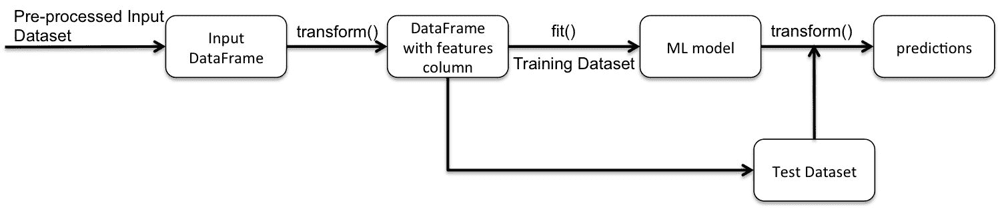

我们将使用公开可用的糖尿病数据集，该数据集包含 101,766 行，代表了 130 家美国医院和综合配送网络的十年临床护理记录。它包括 50 多个特征（属性），代表患者和医院的结果。

数据集可以从 UCI 网站下载，网址为[`archive.ics.uci.edu/ml/datasets/Diabetes+130-US+hospitals+for+years+1999-2008`](https://archive.ics.uci.edu/ml/datasets/Diabetes+130-US+hospitals+for+years+1999-2008)。

源 ZIP 文件包含两个 CSV 文件。第一个文件`diabetic_data.csv`是主要的输入数据集，第二个文件`IDs_mapping.csv`是`admission_type_id`、`discharge_disposition_id`和`admission_source_id`的主数据。第二个文件足够小，可以手动分成三部分，每部分对应一个 ID 映射集。

本节中的示例紧密遵循了 Beata Strack、Jonathan P. DeShazo、Chris Gennings、Juan L. Olmo、Sebastian Ventura、Krzysztof J. Cios 和 John N. Clore 在 Biomed Res Int. 2014; 2014: 781670 中提出的方法和分析：HbA1c 测量对医院再入院率的影响，可在[`europepmc.org/articles/PMC3996476`](http://europepmc.org/articles/PMC3996476)上找到。

首先，我们将导入此编码练习所需的所有软件包：

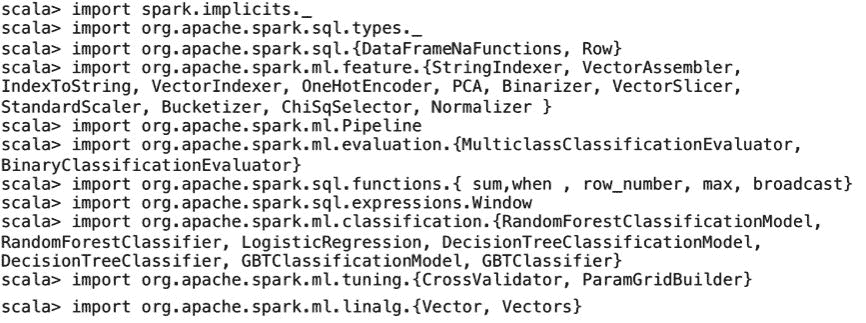

# 探索糖尿病数据集

数据集包含最初由临床专家选择的属性/特征，这些属性/特征基于它们与糖尿病状况或管理的潜在联系。

特征及其描述的完整列表可在[`www.hindawi.com/journals/bmri/2014/781670/tab1/`](https://www.hindawi.com/journals/bmri/2014/781670/tab1/)上找到。

我们将输入数据加载到 Spark DataFrame 中，如下所示：

```scala
scala> val inDiaDataDF = spark.read.option("header", true).csv("file:///Users/aurobindosarkar/Downloads/dataset_diabetes/diabetic_data.csv").cache() 
```

我们可以显示在上一步中创建的 DataFrame 的模式，以列出 DataFrame 中的列或字段，如下所示：

```scala
scala> inDiaDataDF.printSchema() 
```

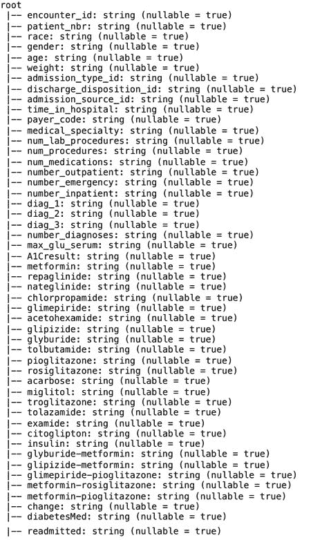

接下来，我们打印一些样本记录，以对数据集中字段中包含的值有一个高层次的了解：

```scala
scala> inDiaDataDF.take(5).foreach(println)
```


我们还可以使用`dataFrame.describe("column")`计算数值列的基本统计信息。例如，我们显示一些数值数据列的计数、平均值、标准差以及最小和最大值：

```scala
scala> inDiaDataDF.select("num_lab_procedures", "num_procedures", "num_medications", "number_diagnoses").describe().show() 

+-------+------------------+------------------+------------------+------------------+ 
|summary|num_lab_procedures|    num_procedures|   num_medications|  number_diagnoses| 
+-------+------------------+------------------+------------------+------------------+ 
|  count|            101766|            101766|            101766|            101766| 
|   mean| 43.09564098028811| 1.339730361810428|16.021844230882614| 7.422606764538254| 
| stddev| 19.67436224914214|1.7058069791211583| 8.127566209167293|1.9336001449974298| 
|    min|                 1|                 0|                 1|                 1| 
|    max|                99|                 6|                 9|                 9| 
+-------+------------------+------------------+------------------+------------------+ 

```

原始输入数据集包含不完整、冗余和嘈杂的信息，这在任何真实世界的数据集中都是预期的。有几个字段存在高比例的缺失值。

我们计算具有特定字段缺失的记录数，如下所示：

```scala
scala> inDiaDataDF.select($"weight").groupBy($"weight").count().select($"weight", (($"count" / inDiaDataDF.count())*100).alias("percent_recs")).where("weight = '?'").show()
+------+-----------------+ 
|weight|     percent_recs| 
+------+-----------------+ 
|     ?|96.85847925633315| 
+------+-----------------+ 

scala> inDiaDataDF.select($"payer_code").groupBy($"payer_code").count().select($"payer_code", (($"count" / inDiaDataDF.count())*100).alias("percent_recs")).where("payer_code = '?'").show() 

+----------+----------------+ 
|payer_code|    percent_recs| 
+----------+----------------+ 
|         ?|39.5574160328597| 
+----------+----------------+ 

scala> inDiaDataDF.select($"medical_specialty").groupBy($"medical_specialty").count().select($"medical_specialty", (($"count" / inDiaDataDF.count())*100).alias("percent_recs")).where("medical_specialty = '?'").show() 

+-----------------+-----------------+ 
|medical_specialty|     percent_recs| 
+-----------------+-----------------+ 
|                ?|49.08220820313268| 
+-----------------+-----------------+ 
```

如前所述，具有许多缺失值的特征被确定为体重、付款码和医疗专业。我们删除体重和付款码列，但是医疗专业属性（可能是一个非常相关的特征）被保留：

```scala
scala> val diaDataDrpDF = inDiaDataDF.drop("weight", "payer_code") 
```

数据集还包含一些患者的多次住院就诊记录。在这里，我们提取了一组有多次住院就诊的患者。

我们观察到这类患者的总数是显著的：

```scala

scala> diaDataDrpDF.select($"patient_nbr").groupBy($"patient_nbr").count().where("count > 1").show(5) 

+-----------+-----+ 
|patient_nbr|count| 
+-----------+-----+ 
|    4311585|    2| 
|    4624767|    2| 
|   24962301|    3| 
|   11889666|    2| 
|    2585367|    2| 
+-----------+-----+ 
only showing top 5 rows 

scala>  diaDataDrpDF.select($"patient_nbr").groupBy($"patient_nbr").count().where("count > 1").count() 
res67: Long = 16773 
```

如参考研究/论文中所述，这样的观察结果不能被视为统计独立，因此我们只包括每位患者的第一次就诊。完成这些操作后，我们验证了 DataFrame 中没有剩余的患者记录对应于多次就诊记录：

```scala
scala> val w = Window.partitionBy($"patient_nbr").orderBy($"encounter_id".desc) 

scala> val diaDataSlctFirstDF = diaDataDrpDF.withColumn("rn", row_number.over(w)).where($"rn" === 1).drop("rn") 

scala> diaDataSlctFirstDF.select($"patient_nbr").groupBy($"patient_nbr").count().where("count > 1").show() 
+-----------+-----+ 
|patient_nbr|count| 
+-----------+-----+ 
+-----------+-----+ 

scala> diaDataSlctFirstDF.count() 
res35: Long = 71518 
```

与参考研究/论文中一样，我们也删除了导致患者死亡的就诊记录，以避免偏见：

```scala
scala> val diaDataAdmttedDF = diaDataSlctFirstDF.filter($"discharge_disposition_id" =!= "11") 

scala> diaDataAdmttedDF.count() 
res16: Long = 69934 
```

执行上述操作后，我们剩下了`69,934`次就诊，构成了用于进一步分析的最终数据集。

接下来，我们执行一系列的`JOIN`操作，以更好地了解数据在`discharge disposition`、`admission types`和`admission sources`的顶级类别方面的情况：

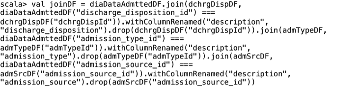

```scala
scala> joinDF.select("encounter_id", "dchrgDisp", "admType", "admission_source").show() 
```

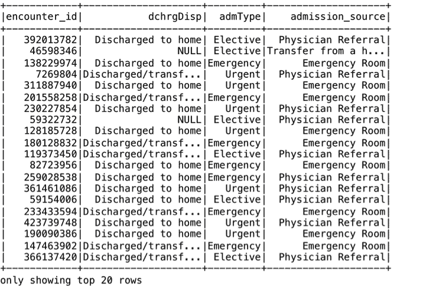

```scala
scala> joinDF.select("encounter_id", "dchrgDisp").groupBy("dchrgDisp").count().orderBy($"count".desc).take(10).foreach(println) 
```

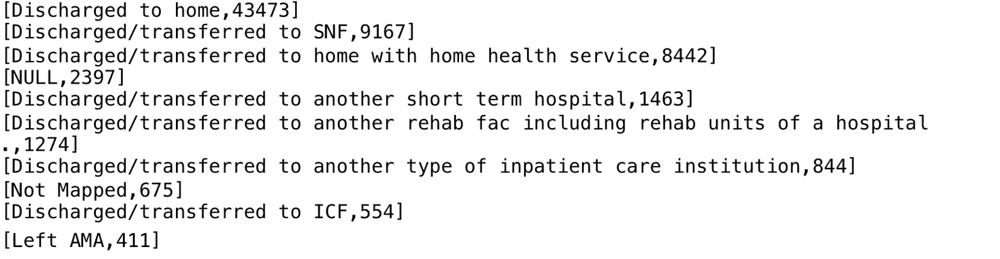

```scala
scala> joinDF.select("encounter_id", "admType").groupBy("admType").count().orderBy($"count".desc).take(5).foreach(println) 
[Emergency,35988] 
[Elective,13698] 
[Urgent,12799] 
[NULL,4373] 
[Not Available,2752] 

scala> joinDF.select("encounter_id", "admission_source").groupBy("admission_source").count().orderBy($"count".desc).take(5).foreach(println) 

[ Emergency Room,37649]                                                          
[ Physician Referral,21196] 
[NULL,4801] 
[Transfer from a hospital,2622] 
[ Transfer from another health care facility,1797] 
```

在接下来的部分，我们将执行一系列数据整理或数据预处理步骤，以提高整体数据质量。

# 数据预处理

预处理数据需要进行几个数据整理步骤。我们将从处理缺失字段值开始。在处理空值或缺失值时，我们有几个选项。我们可以使用`df.na.drop()`删除它们，或者使用`df.na.fill()`用默认值填充它们。这样的字段可以用该列的最常出现的值替换，对于数值字段，也可以用平均值替换。此外，您还可以对该列训练回归模型，并用它来预测缺失值的行的字段值。

在这里，数据集中的缺失字段用`?`表示，因此我们使用`df.na.replace()`函数将其替换为"Missing"字符串。

这个操作以`medical_specialty`字段为例，如下所示：

```scala
 scala> diaDataAdmttedDF.select("medical_specialty").where("medical_specialty = '?'").groupBy("medical_specialty").count().show() 

+-----------------+-----+ 
|medical_specialty|count| 
+-----------------+-----+ 
|                ?|33733| 
+-----------------+-----+ 

scala> val diaDataRplcMedSplDF = diaDataAdmttedDF.na.replace("medical_specialty", Map("?" -> "Missing")) 
```

`medical_specialty`字段可以有值，例如心脏病学、内科、家庭/全科医学、外科医生或缺失。对于模型来说，缺失值看起来就像`medical_specialty`的任何其他选择。我们可以创建一个名为`has_medical_specialty`的新二元特征，并在行包含该值时赋值为`1`，在未知或缺失时赋值为`0`。或者，我们也可以为`medical_specialty`的每个值创建一个二元特征，例如`Is_Cardiology`、`Is_Surgeon`和`Is_Missing`。然后，这些额外的特征可以在不同的模型中代替或补充`medical_specialty`特征。

接下来，根据原始论文中的分析，我们在本章的进一步分析中删除了一组列，以保持问题的规模合理，如下所示：

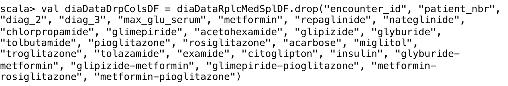

与参考研究/论文中一样，我们也考虑了四组就诊情况：未进行 HbA1c 测试、进行了 HbA1c 测试并且结果在正常范围内、进行了 HbA1c 测试并且结果大于 8%、进行了 HbA1c 测试并且结果大于 8%。

执行这些分组的步骤如下：

```scala
scala> diaDataDrpColsDF.groupBy($"A1Cresult").count().show() 

+---------+-----+                                                                
|A1Cresult|count| 
+---------+-----+ 
|     None|57645| 
|       >8| 5866| 
|     Norm| 3691| 
|       >7| 2732| 
+---------+-----+ 

scala> def udfA1CGrps() = udf[Double, String] { a => val x = a match { case "None" => 1.0; case ">8" => 2.0; case ">7" => 3.0; case "Norm" => 4.0;}; x;}  

scala> val diaDataA1CResultsDF = diaDataDrpColsDF.withColumn("A1CResGrp", udfA1CGrps()($"A1Cresult")) 

scala> diaDataA1CResultsDF.groupBy("A1CResGrp").count().withColumn("Percent_of_Population", ($"count" / diaDataA1CResultsDF.count())*100).withColumnRenamed("count", "Num_of_Encounters").show() 
+--------------------+-----------------+---------------------+ 
|           A1CResGrp|Num_of_Encounters|Percent_of_Population| 
+--------------------+-----------------+---------------------+ 
|No test was perfo...|            57645|    82.42771756227299| 
|Result was high a...|             5866|    8.387908599536706| 
|Normal result of ...|             3691|     5.27783338576372| 
|Result was high b...|             2732|    3.906540452426573| 
+--------------------+-----------------+---------------------+ 
```

由于我们的主要目标是关注导致早期再入院的因素，再入院属性（或结果）有两个值：`Readmitted`，如果患者在出院后 30 天内再次入院，或`Not Readmitted`，它涵盖了 30 天后的再入院和根本没有再入院。

我们创建了一个新的有序特征，名为`Readmitted`，有两个值：`Readmitted`和`Not Readmitted`。您也可以对年龄类别使用类似的方法：

```scala
scala> def udfReAdmBins() = udf[String, String] { a => val x = a match { case "<30" => "Readmitted"; case "NO" => "Not Readmitted"; case ">30" => "Not Readmitted";}; x;} 

scala> val diaDataReadmtdDF = diaDataA1CResultsDF.withColumn("Readmitted", udfReAdmBins()($"readmitted")) 
```

我们显示了几个特征的数量与目标变量的值，如下所示。这将有助于识别基于输入数据集中各种属性的记录数量的偏差：

```scala
scala> diaDataReadmtdDF.groupBy("race").pivot("Readmitted").agg(count("Readmitted")).show() 
+---------------+--------------+----------+                                      
|           race|Not Readmitted|Readmitted| 
+---------------+--------------+----------+ 
|      Caucasian|         49710|      2613| 
|          Other|          1095|        51| 
|AfricanAmerican|         12185|       423| 
|       Hispanic|          1424|        70| 
|          Asian|           478|        25| 
|              ?|          1795|        65| 
+---------------+--------------+----------+ 

scala> diaDataReadmtdDF.groupBy("A1CResGrp").pivot("Readmitted").agg(count("Readmitted")).orderBy("A1CResGrp").show() 
+--------------------+--------------+----------+                                 
|           A1CResGrp|Not Readmitted|Readmitted| 
+--------------------+--------------+----------+ 
|No test was perfo...|         54927|      2718| 
|Normal result of ...|          3545|       146| 
|Result was high a...|          5618|       248| 
|Result was high b...|          2597|       135| 
+--------------------+--------------+----------+ 

scala> diaDataReadmtdDF.groupBy("gender").pivot("Readmitted").agg(count("Readmitted")).show() 
+---------------+--------------+----------+                                      
|         gender|Not Readmitted|Readmitted| 
+---------------+--------------+----------+ 
|         Female|         35510|      1701| 
|Unknown/Invalid|             3|      null| 
|           Male|         31174|      1546| 
+---------------+--------------+----------+  
```

接下来，我们将各种年龄范围分组为不同的类别，并将其添加为一列，以获得我们的最终版本的数据集，如图所示。此外，我们删除了`gender`为`Unknown/Invalid`的三行：

```scala
scala> def udfAgeBins() = udf[String, String] { a => val x = a match { case "0-10)" => "Young"; case "[10-20)" => "Young"; case "[20-30)" => "Young"; case "[30-40)" => "Middle"; case "[40-50)" => "Middle"; case "[50-60)" => "Middle"; case "[60-70)" => "Elder";  case "[70-80)" => "Elder"; case "[80-90)" => "Elder"; case "[90-100)" => "Elder";}; x;} 

scala> val diaDataAgeBinsDF = diaDataReadmtdDF.withColumn("age_category", udfAgeBins()($"age")) 

scala> val diaDataRmvGndrDF = diaDataAgeBinsDF.filter($"gender" =!= "Unknown/Invalid") 
```

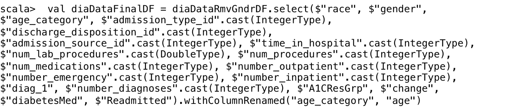

经过预处理步骤后的最终 DataFrame 的模式如下所示：

```scala
scala> diaDataFinalDF.printSchema()
```

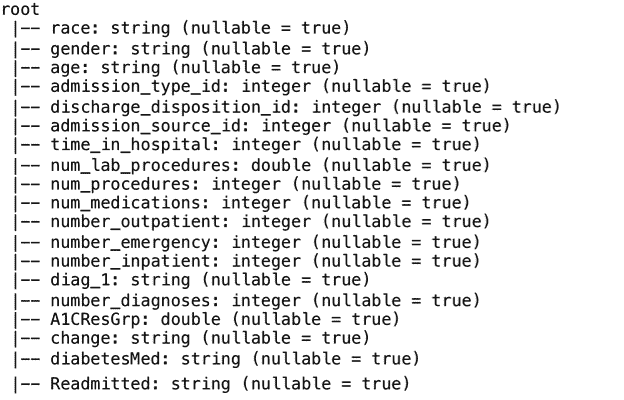

我们显示了最终数据框中的一些样本记录，如下所示：

```scala
scala> diaDataFinalDF.take(5).foreach(println)
```

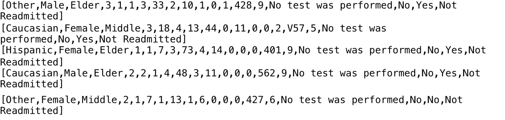

完成数据预处理阶段后，我们现在将重点转移到构建机器学习管道上。

# 构建 Spark ML 管道

在我们的示例 ML 管道中，我们将有一系列管道组件，这些组件在以下部分详细说明。

# 使用 StringIndexer 对分类特征和标签进行索引

在这个练习中，我们将训练一个随机森林分类器。首先，我们将按照`spark.ml`的要求对分类特征和标签进行索引。接下来，我们将把特征列组装成一个向量列，因为每个`spark.ml`机器学习算法都需要它。最后，我们可以在训练数据集上训练我们的随机森林。可选地，我们还可以对标签进行反索引，以使它们更易读。

有几个现成的转换器可用于对分类特征进行索引。我们可以使用`VectorAssembler`将所有特征组装成一个向量（使用`VectorAssembler`），然后使用`VectorIndexer`对其进行索引。`VectorIndexer`的缺点是它将对每个具有少于`maxCategories`个不同值的特征进行索引。它不区分给定特征是否是分类的。或者，我们可以使用`StringIndexer`逐个对每个分类特征进行索引，如下所示。

我们使用`StringIndexer`将字符串特征转换为`Double`值。例如，`raceIndexer`是一个估计器，用于转换种族列，即为输入列中的不同种族生成索引，并创建一个名为`raceCat`的新输出列。

`fit()`方法然后将列转换为`StringType`并计算每个种族的数量。这些步骤如下所示：

```scala
scala> val raceIndexer = new StringIndexer().setInputCol("race").setOutputCol("raceCat").fit(diaDataFinalDF) 

scala> raceIndexer.transform(diaDataFinalDF).select("race", "raceCat").show() 
```

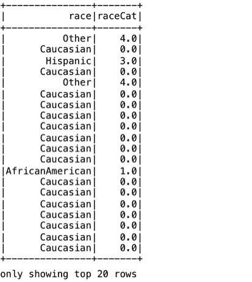

`raceIndexer.transform()`将生成的索引分配给列中每个种族的值。例如，`AfricanAmerican`被分配为`1.0`，`Caucasian`被分配为`0.0`，依此类推。

```scala
scala> raceIndexer.transform(diaDataFinalDF).select("race", "raceCat").groupBy("raceCat").count().show() 
+-------+-----+ 
|raceCat|count| 
+-------+-----+ 
|    0.0|52323| 
|    1.0|12608| 
|    4.0| 1145| 
|    3.0| 1494| 
|    2.0| 1858| 
|    5.0|  503| 
+-------+-----+ 

scala> val raceIndexer = new StringIndexer().setInputCol("race").setOutputCol("raceCat").fit(diaDataFinalDF) 

scala> val rDF = raceIndexer.transform(diaDataFinalDF) 

```

类似地，我们为性别、年龄组、HbA1c 测试结果、药物变化和糖尿病处方药物创建索引器，并在每个步骤中将它们适配到生成的数据框中：

```scala
scala> val genderIndexer = new StringIndexer().setInputCol("gender").setOutputCol("genderCat").fit(rDF) 

scala> val gDF = genderIndexer.transform(rDF) 

scala>  val ageCategoryIndexer  = new StringIndexer().setInputCol("age").setOutputCol("ageCat").fit(gDF) 

scala> val acDF = ageCategoryIndexer.transform(gDF) 

scala>  val A1CresultIndexer  = new StringIndexer().setInputCol("A1CResGrp").setOutputCol("A1CResGrpCat").fit(acDF) 

scala> val a1crDF = A1CresultIndexer.transform(acDF) 

scala> val changeIndexer  = new StringIndexer().setInputCol("change").setOutputCol("changeCat").fit(a1crDF) 

scala> val cDF = changeIndexer.transform(a1crDF) 

scala> val diabetesMedIndexer  = new StringIndexer().setInputCol("diabetesMed").setOutputCol("diabetesMedCat").fit(cDF) 

scala> val dmDF = diabetesMedIndexer.transform(cDF)
```

我们打印包含各种索引器列的最终数据框的模式：

```scala
scala>  dmDF.printSchema() 
```

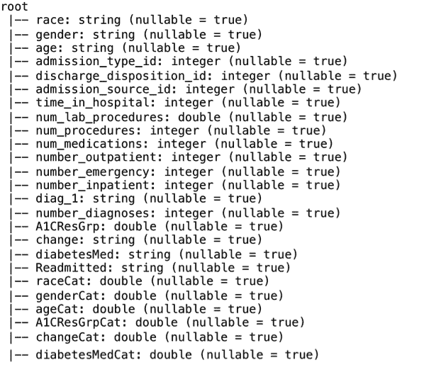

我们还可以使用`StringIndexer`对标签进行索引，如下所示：

```scala
scala> val labelIndexer = new StringIndexer().setInputCol("Readmitted").setOutputCol("indexedLabel") 
```

或者，我们也可以简洁地定义我们的特征索引器，如下所示。然后可以使用`VectorAssembler`将`StringIndexers`的序列与数值特征连接起来，以生成特征向量：

```scala
scala> val stringIndexers = catFeatColNames.map { colName => 
     |   new StringIndexer() 
     |     .setInputCol(colName) 
     |     .setOutputCol(colName + "Cat") 
     |     .fit(diaDataFinalDF) 
     | }
```

我们不需要为每个索引器显式调用`fit()`和`transform()`方法，这可以由管道自动处理。

管道的行为可以总结如下：

+   它将执行每个阶段，并将当前阶段的结果传递给下一个阶段

+   如果阶段是一个转换器，那么管道会调用它的`transform()`

+   如果阶段是一个估计器，那么管道首先调用`fit()`，然后调用`transform()`

+   如果它是管道中的最后一个阶段，那么估计器在`fit()`之后不会调用`transform()`

# 使用 VectorAssembler 将特征组装成一个列

现在我们的索引工作已经完成，我们需要将所有特征列组装成一个包含所有特征的向量列。为此，我们将使用`VectorAssembler`转换器，如下所示。然而，首先，由于每个标签的记录数量存在显著偏差，我们需要以适当的比例对记录进行抽样，以使每个标签的记录数量几乎相等：

```scala
scala> val dataDF = dmDF.stat.sampleBy("Readmitted", Map("Readmitted" -> 1.0, "Not Readmitted" -> .030), 0) 

scala> val assembler = new VectorAssembler().setInputCols(Array("num_lab_procedures", "num_procedures", "num_medications", "number_outpatient", "number_emergency", "number_inpatient", "number_diagnoses", "admission_type_id", "discharge_disposition_id", "admission_source_id", "time_in_hospital", "raceCat", "genderCat", "ageCat", "A1CresultCat", "changeCat", "diabetesMedCat")).setOutputCol("features") 
```

或者，我们也可以按照以下步骤实现相同的效果：

```scala
scala> val numFeatNames = Seq("num_lab_procedures", "num_procedures", "num_medications", "number_outpatient", "number_emergency", "number_inpatient", "number_diagnoses", "admission_type_id", "discharge_disposition_id", "admission_source_id", "time_in_hospital") 

scala> val catFeatNames = catFeatColNames.map(_ + "Cat") 

scala> val allFeatNames = numFeatNames ++ catFeatNames 

scala> val assembler = new VectorAssembler().setInputCols(Array(allFeatNames: _*)).setOutputCol("features") 
```

我们应用`transform()`操作并打印生成的数据框的一些样本记录，如下所示：

```scala
scala> val df2 = assembler.transform(dataDF) 

scala> df2.select("Readmitted", "features").take(5).foreach(println) 
```

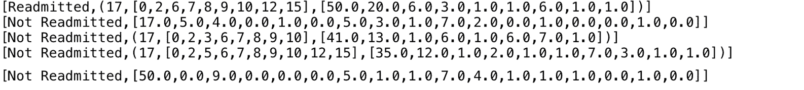

`VectorIndexer`用于对特征进行索引。我们将传递用于预测的所有特征列，以创建一个名为`indexedFeatures`的新向量列，如下所示：

```scala
scala> val featureIndexer = new VectorIndexer().setInputCol("features").setOutputCol("indexedFeatures").setMaxCategories(4).fit(df2) 
```

在接下来的部分，我们将训练一个随机森林分类器。

# 使用 Spark ML 分类器

现在数据已经符合`spark.ml`机器学习算法的预期格式，我们将创建一个`RandomForestClassifier`组件，如下所示：

```scala
scala> val rf = new RandomForestClassifier().setLabelCol("indexedLabel").setFeaturesCol("indexedFeatures").setNumTrees(10) 

```

标准化的 DataFrame 格式，允许轻松地用其他`spark.ml`分类器替换`RandomForestClassifier`，例如`DecisionTreeClassifier`和`GBTClassifier`，如下所示：

```scala
scala> val dt = new DecisionTreeClassifier().setLabelCol("indexedLabel").setFeaturesCol("indexedFeatures") 

scala> val gbt = new GBTClassifier().setLabelCol("indexedLabel").setFeaturesCol("indexedFeatures").setMaxIter(10)
```

在接下来的部分，我们将通过将标签和特征索引器以及随机森林分类器组装成管道的阶段来创建我们的管道。

# 创建 Spark ML 管道

接下来，我们将使用到目前为止定义的所有组件来创建一个管道对象。由于所有不同的步骤都已经实现，我们可以组装我们的管道，如下所示：

```scala
scala> val pipeline = new Pipeline().setStages(Array(labelIndexer, featureIndexer, rf)) 
```

在接下来的部分，我们将从输入数据集中创建训练和测试数据集。

# 创建训练和测试数据集

为了训练和评估模型，我们将在两个 DataFrame 之间随机拆分输入数据：一个训练集（包含 80%的记录）和一个测试集（包含 20%的记录）。我们将使用训练集训练模型，然后使用测试集评估模型。以下内容可用于拆分输入数据：

```scala
scala> val Array(trainingData, testData) = df2.randomSplit(Array(0.8, 0.2), 11L) 
```

我们现在将使用管道来拟合训练数据。拟合管道到训练数据会返回一个`PipelineModel`对象：

```scala
scala> val model = pipeline.fit(trainingData) 
```

在接下来的部分，我们将对我们的测试数据集进行预测。

# 使用 PipelineModel 进行预测

前一步骤中的`PipelineModel`对象用于对测试数据集进行预测，如下所示：

```scala
scala> val predictions = model.transform(testData) 

scala> predictions.select("prediction", "indexedLabel", "features").show(25) 
```

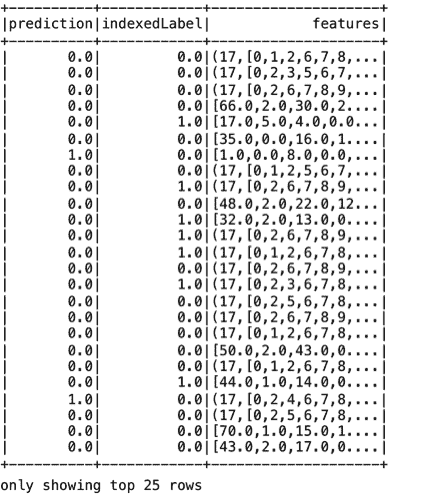

接下来，我们将通过测量预测的准确性来评估我们的模型，如下所示：

```scala
scala> val evaluator = new MulticlassClassificationEvaluator().setLabelCol("indexedLabel").setPredictionCol("prediction").setMetricName("accuracy")

scala> val accuracy = evaluator.evaluate(predictions) 
accuracy: Double = 0.6483412322274882                                            

scala> println("Test Error = " + (1.0 - accuracy)) 
Test Error = 0.3516587677725118 

```

最后，我们还可以打印我们的随机森林模型，以了解我们模型中创建的十棵树中使用的逻辑，如下所示：

```scala
scala> val rfModel = model.stages(2).asInstanceOf[RandomForestClassificationModel] 

scala> println("Learned classification forest model:\n" + rfModel.toDebugString) 

```

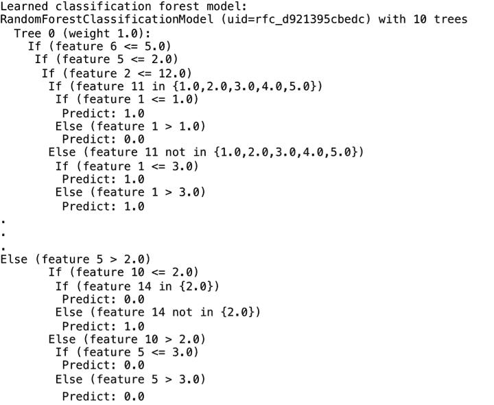

在接下来的部分，我们将展示通过交叉验证从一组参数中选择最佳预测模型的过程。

# 选择最佳模型

为了选择最佳模型，我们将对一组参数进行网格搜索。对于每组参数的组合，我们将进行交叉验证，并根据某些性能指标保留最佳模型。这个过程可能会很繁琐，但是`spark.ml`通过易于使用的 API 简化了这一过程。

对于交叉验证，我们选择一个值`k`作为折叠数，例如，`3`的值将把数据集分为三部分。从这三部分中，将生成三个不同的训练和测试数据对（用于训练的数据占三分之二，用于测试的数据占三分之一）。模型将根据三个对的选择性能指标的平均值进行评估。

每个参数都分配了一组值。我们示例中使用的参数是`maxBins`（用于离散化连续特征和在每个节点分割特征的最大箱数）、`maxDepth`（树的最大深度）和`impurity`（用于信息增益计算的标准）。

首先，我们创建一个参数网格，如下所示：

```scala
scala> val paramGrid = new ParamGridBuilder().addGrid(rf.maxBins, Array(25, 28, 31)).addGrid(rf.maxDepth, Array(4, 6, 8)).addGrid(rf.impurity, Array("entropy", "gini")).build() 
```

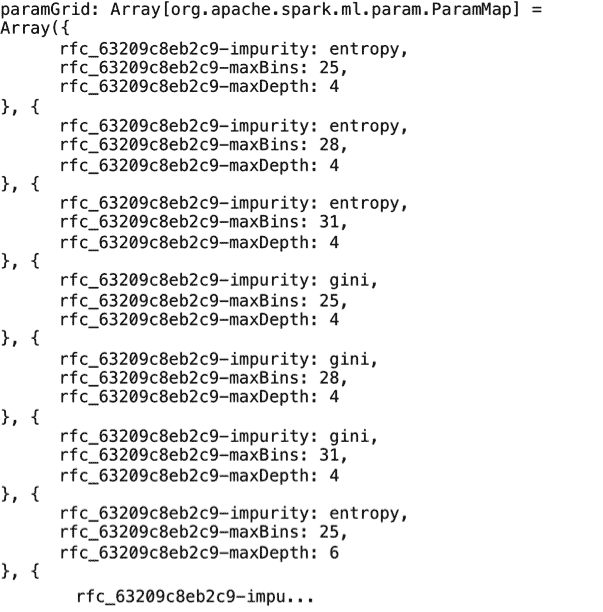

接下来，我们将定义一个评估器，根据其名称，它将根据某些指标评估我们的模型。内置的评估器可用于回归，二元和多类分类模型。

```scala
scala> val evaluator = new BinaryClassificationEvaluator().setLabelCol("indexedLabel")
```

最后，选择`k=2`（对于真实世界的模型设置更高的数字），数据在交叉验证期间将被分成的折叠数，我们可以创建一个`CrossValidator`对象，如下所示：

```scala
scala> val cv = new CrossValidator().setEstimator(pipeline).setEvaluator(evaluator).setEstimatorParamMaps(paramGrid).setNumFolds(2) 
```

在运行交叉验证时，特别是在更大的数据集上，需要小心，因为它将训练**k x p 个模型**，其中*p*是网格中每个参数值的数量的乘积。因此，对于*p*为`18`，交叉验证将训练`36`个不同的模型。

由于我们的`CrossValidator`是一个估计器，我们可以通过调用`fit()`方法来获得我们数据的最佳模型：

```scala
scala> val crossValidatorModel = cv.fit(df2) 
```

现在我们可以对`testData`进行预测，如下所示。与交叉验证之前的值相比，准确度值略有改善：

```scala
scala> val predictions = crossValidatorModel.transform(testData) 

scala> predictions.select("prediction", "indexedLabel", "features").show(25) 
```

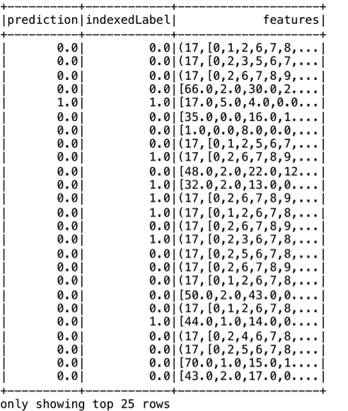

```scala
scala>  val accuracy = evaluator.evaluate(predictions) 
accuracy: Double = 0.6823964115630783 

scala>  println("Test Error = " + (1.0 - accuracy)) 
Test Error = 0.3176035884369217 
```

在接下来的部分，我们将展示 Spark ML 公开的常用接口的强大功能，以便简化 ML 管道的开发和测试。

# 在管道中更改 ML 算法

在较早的部分中，我们展示了如何轻松地用其他分类器替换 RandomForestClassifier，例如 DecisionTreeClassifier 或 GBTClassifer。在本节中，我们将用逻辑回归模型替换随机森林分类器。逻辑回归解释了一个基于其他变量（称为自变量）的二元值因变量之间的关系。二元值`0`或`1`可以表示预测值，例如通过/不通过，是/否，死/活等。根据自变量的值，它预测因变量取一个分类值（例如`0`或`1`）的概率。

首先，我们将创建一个`LogtisticRegression`组件，如下所示：

```scala
scala> val lr = new LogisticRegression().setMaxIter(10).setRegParam(0.3).setElasticNetParam(0.8).setLabelCol("indexedLabel").setFeaturesCol("indexedFeatures") 
```

我们可以使用之前的标签和特征索引器，并将它们与逻辑回归组件结合起来创建一个新的管道，如下所示。此外，我们使用`fit()`和`transform()`方法来训练，然后对测试数据集进行预测。请注意，代码看起来与之前用于随机森林管道的方法非常相似：

```scala
scala> val pipeline = new Pipeline().setStages(Array(labelIndexer, featureIndexer, lr)) 

scala> val Array(trainingData, testData) = df2.randomSplit(Array(0.8, 0.2), 11L) 

scala> val model = pipeline.fit(trainingData) 

scala> val predictions = model.transform(testData) 

scala> predictions.select("A1CResGrpCat", "indexedLabel", "prediction").show() 
+------------+------------+----------+ 
|A1CResGrpCat|indexedLabel|prediction| 
+------------+------------+----------+ 
|         0.0|         0.0|       0.0| 
|         0.0|         0.0|       0.0| 
|         3.0|         0.0|       0.0| 
|         3.0|         0.0|       0.0| 
|         0.0|         1.0|       0.0| 
|         0.0|         0.0|       0.0| 
|         0.0|         0.0|       0.0| 
|         0.0|         0.0|       0.0| 
|         0.0|         1.0|       0.0| 
|         0.0|         0.0|       0.0| 
|         0.0|         1.0|       0.0| 
|         0.0|         1.0|       0.0| 
|         0.0|         1.0|       0.0| 
|         0.0|         0.0|       0.0| 
|         0.0|         1.0|       0.0| 
|         0.0|         0.0|       0.0| 
|         0.0|         0.0|       0.0| 
|         0.0|         0.0|       0.0| 
|         1.0|         0.0|       0.0| 
|         0.0|         0.0|       0.0| 
+------------+------------+----------+ 
only showing top 20 rows 

scala> predictions.select($"indexedLabel", $"prediction").where("indexedLabel != prediction").count() 
res104: Long = 407 
```

在接下来的几节中，我们将介绍 Spark 中提供的一系列工具和实用程序，可用于实现更好的 ML 模型。

# 介绍 Spark ML 工具和实用程序

在接下来的几节中，我们将探索 Spark ML 提供的各种工具和实用程序，以便轻松高效地选择特征并创建优秀的 ML 模型。

# 使用主成分分析选择特征

如前所述，我们可以使用**主成分分析**（**PCA**）在数据上派生新特征。这种方法取决于问题，因此有必要对领域有很好的理解。

这个练习通常需要创造力和常识来选择一组可能与问题相关的特征。通常需要进行更广泛的探索性数据分析，以帮助更好地理解数据和/或识别导致一组良好特征的模式。

PCA 是一种统计程序，它将一组可能相关的变量转换为通常较少的一组线性不相关的变量。得到的一组不相关的变量称为主成分。`PCA`类训练一个模型，将向量投影到一个较低维度的空间。以下示例显示了如何将我们的多维特征向量投影到三维主成分。

根据维基百科[`en.wikipedia.org/wiki/Principal_component_analysis`](https://en.wikipedia.org/wiki/Principal_component_analysis)，“这种转换是这样定义的，以便第一个主成分具有最大可能的方差（即，它尽可能多地解释数据的变异性），而每个随后的成分依次具有在约束下可能的最高方差，即它与前面的成分正交。”

我们将使用用于在本章前面用于分类的随机森林算法拟合的数据集来构建我们的模型：

```scala
scala> val pca = new PCA().setInputCol("features").setOutputCol("pcaFeatures").setK(3).fit(df2) 

scala> val result = pca.transform(df2).select("pcaFeatures") 

scala> result.take(5).foreach(println) 
[[-52.49989457347012,-13.91558303051395,-0.9577895037038642]] 
[[-17.787698281398306,-2.3653156500575743,0.67773733633875]] 
[[-42.61350777796136,-8.019782413210889,4.744540532872854]] 
[[-36.62417236331611,-7.161756365322481,-0.06153645411567934]] 
[[-51.157132286686824,-2.6029561027003685,0.8995320464587268]] 
```

# 使用编码器

在本节中，我们使用独热编码将标签索引的列映射到二进制向量的列，最多只有一个值为 1。这种编码允许期望连续特征的算法（如`LogisticRegression`）使用分类特征：

```scala

scala> val indexer = new StringIndexer().setInputCol("race").setOutputCol("raceIndex").fit(df2) 

scala> val indexed = indexer.transform(df2) 

scala> val encoder = new OneHotEncoder().setInputCol("raceIndex").setOutputCol("raceVec") 

scala> val encoded = encoder.transform(indexed) 

scala> encoded.select("raceVec").show() 
```

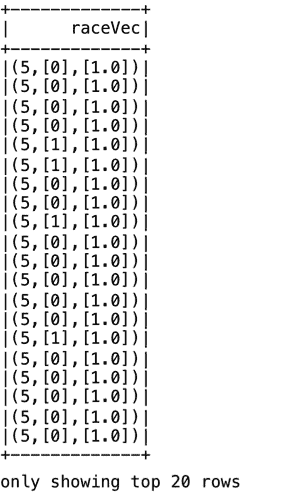

# 使用 Bucketizer

Bucketizer 用于将连续特征的列转换为特征桶的列。我们指定`n+1`分割参数，将连续特征映射到 n 个桶中。分割应严格按升序排列。

通常，我们将`Double.NegativeInfinity`和`Double.PositiveInfinity`添加为分割的外部边界，以防止潜在的 Bucketizer 边界异常。在下面的示例中，我们指定了六个分割，然后为数据集中的`num_lab_procedures`特征（值在`1`到`126`之间）定义了一个`bucketizer`，如下所示：

```scala
scala> val splits = Array(Double.NegativeInfinity, 20.0, 40.0, 60.0, 80.0, 100.0, Double.PositiveInfinity) 

scala> val bucketizer = new Bucketizer().setInputCol("num_lab_procedures").setOutputCol("bucketedLabProcs").setSplits(splits) 

scala> // Transform original data into its bucket index. 

scala> val bucketedData = bucketizer.transform(df2) 

scala> println(s"Bucketizer output with ${bucketizer.getSplits.length-1} buckets") 
Bucketizer output with 6 buckets 
```

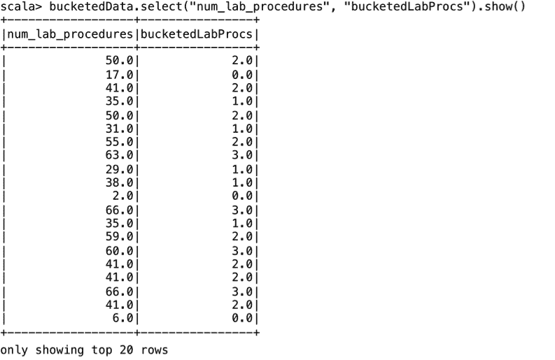

# 使用 VectorSlicer

`VectorSlicer`是一个转换器，它接受一个特征向量并返回原始特征的子集的新特征向量。它用于从向量列中提取特征。我们可以使用`VectorSlicer`来测试我们的模型使用不同数量和组合的特征。

在下面的示例中，我们最初使用四个特征，然后放弃其中一个。这些特征切片可用于测试包括/排除特征对于特征集的重要性：

```scala
scala> val slicer = new VectorSlicer().setInputCol("features").setOutputCol("slicedfeatures").setNames(Array("raceCat", "genderCat", "ageCat", "A1CResGrpCat")) 

scala> val output = slicer.transform(df2) 

scala> output.select("slicedFeatures").take(5).foreach(println) 
[(4,[1],[1.0])] 
[[0.0,1.0,0.0,0.0]] 
[(4,[],[])] 
[(4,[1],[1.0])] 
[[1.0,1.0,1.0,0.0]] 

scala> val slicer = new VectorSlicer().setInputCol("features").setOutputCol("slicedfeatures").setNames(Array("raceCat", "genderCat", "ageCat")) 

scala> val output = slicer.transform(df2) 

scala> output.select("slicedFeatures").take(5).foreach(println) 
[(3,[1],[1.0])] 
[[0.0,1.0,0.0]] 
[(3,[],[])] 
[(3,[1],[1.0])] 
[[1.0,1.0,1.0]] 
```

# 使用卡方选择器

`ChiSqSelector`启用卡方特征选择。它在具有分类特征的标记数据上运行。`ChiSqSelector`使用独立性的卡方检验来选择特征。在我们的示例中，我们使用`numTopFeatures`来选择一定数量的具有最大预测能力的顶级特征：

```scala
scala> def udfReAdmLabels() = udf[Double, String] { a => val x = a match { case "Readmitted" => 0.0; case "Not Readmitted" => 0.0;}; x;} 

scala> val df3 = df2.withColumn("reAdmLabel", udfReAdmLabels()($"Readmitted")) 

scala> val selector = new ChiSqSelector().setNumTopFeatures(1).setFeaturesCol("features").setLabelCol("reAdmLabel").setOutputCol("selectedFeatures") 

scala> val result = selector.fit(df3).transform(df3) 

scala> println(s"ChiSqSelector output with top ${selector.getNumTopFeatures} features selected") 
ChiSqSelector output with top 1 features selected 

scala> result.select("selectedFeatures").show() 
```

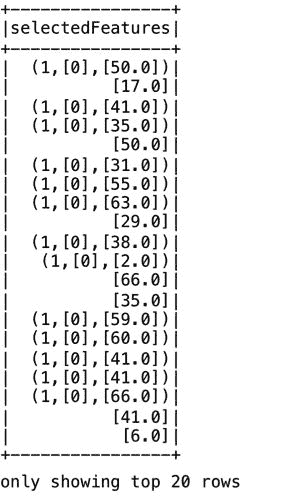

# 使用标准化器

我们可以使用`Normalizer`对象（一个转换器）对数据进行标准化。`Normalizer`的输入是由`VectorAssembler`创建的列。它将列中的值标准化，产生一个包含标准化值的新列。

```scala
val normalizer = new Normalizer().setInputCol("raw_features ").setOutputCol("features") 
```

# 检索我们的原始标签

`IndexToString`是`StringIndexer`的反向操作，将索引转换回它们的原始标签。由`RandomForestClassifier`生成的模型的随机森林变换方法产生一个包含索引标签的预测列，我们需要对其进行非索引化以检索原始标签值，如下所示：

```scala
scala> val labelIndexer = new StringIndexer().setInputCol("Readmitted").setOutputCol("indexedLabel").fit(df2) 

scala> val featureIndexer = new VectorIndexer().setInputCol("features").setOutputCol("indexedFeatures").setMaxCategories(4).fit(df2) 

scala> val Array(trainingData, testData) = df2.randomSplit(Array(0.7, 0.3)) 

scala> val gbt = new GBTClassifier().setLabelCol("indexedLabel").setFeaturesCol("indexedFeatures").setMaxIter(10) 

scala> val labelConverter = new IndexToString().setInputCol("prediction").setOutputCol("predictedLabel").setLabels(labelIndexer.labels) 

scala> val pipeline = new Pipeline().setStages(Array(labelIndexer, featureIndexer, gbt, labelConverter)) 

scala> val model = pipeline.fit(trainingData) 

scala> val predictions = model.transform(testData) 

scala> predictions.select("predictedLabel", "indexedLabel", "features").show(5) 
+--------------+------------+--------------------+ 
|predictedLabel|indexedLabel|            features| 
+--------------+------------+--------------------+ 
|    Readmitted|         0.0|(17,[0,2,5,6,7,8,...| 
|Not Readmitted|         1.0|[43.0,1.0,7.0,0.0...| 
|    Readmitted|         1.0|(17,[0,2,5,6,7,8,...| 
|    Readmitted|         0.0|(17,[0,1,2,6,7,8,...| 
|    Readmitted|         0.0|(17,[0,2,6,7,8,9,...| 
+--------------+------------+--------------------+ 
only showing top 5 rows 
```

在下一节中，我们将转向介绍使用 k-means 算法的 Spark ML 聚类的示例。

# 实施 Spark ML 聚类模型

在本节中，我们将解释使用 Spark ML 进行聚类。我们将使用一个关于学生对某一主题的知识状态的公开可用数据集。

数据集可从 UCI 网站下载，网址为[`archive.ics.uci.edu/ml/datasets/User+Knowledge+Modeling`](https://archive.ics.uci.edu/ml/datasets/User+Knowledge+Modeling)。

数据集中包含的记录属性已从前面提到的 UCI 网站复制在这里供参考：

+   **STG**：目标对象材料的学习时间程度（输入值）

+   **SCG**：用户对目标对象材料的重复次数程度（输入值）

+   **STR**：用户对目标对象相关对象的学习时间程度（输入值）

+   **LPR**：用户对目标对象相关对象的考试表现（输入值）

+   **PEG**：用户对目标对象（输入值）的考试表现

+   **UNS**：用户的知识水平（目标值）

首先，我们将编写一个 UDF 来创建两个级别，表示学生的两个类别——低于平均水平和高于平均水平，从原始数据集中包含的五个类别中。我们将训练和测试 CSV 文件合并，以获得足够数量的输入记录：

```scala
scala> def udfLabels() = udf[Integer, String] { a => val x = a match { case "very_low" => 0; case "Very Low" => 0; case "Low" => 0; case "Middle" => 1; case "High" => 1;}; x;} 
```

我们将读取输入数据集，并创建一个名为`label`的列，由 UDF 填充。这样可以让我们每个类别的记录数几乎相等：

```scala
scala> val inDataDF = spark.read.option("header", true).csv("file:///Users/aurobindosarkar/Downloads/Data_User_Modeling.csv").withColumn("label", udfLabels()($"UNS")) 

scala> inDataDF.select("label").groupBy("label").count().show() 
+-----+-----+ 
|label|count| 
+-----+-----+ 
|    1|  224| 
|    0|  179| 
+-----+-----+ 

scala> inDataDF.cache() 
```

接下来，我们将把数字字段转换为`Double`值，验证 DataFrame 中的记录数，显示一些样本记录，并打印模式，如下所示：

```scala
scala> val inDataFinalDF = inDataDF.select($"STG".cast(DoubleType), $"SCG".cast(DoubleType), $"STR".cast(DoubleType), $"LPR".cast(DoubleType), $"PEG".cast(DoubleType), $"UNS", $"label") 

scala> inDataFinalDF.count() 
res2: Long = 403 

scala> inDataFinalDF.take(5).foreach(println) 
[0.0,0.0,0.0,0.0,0.0,very_low,0] 
[0.08,0.08,0.1,0.24,0.9,High,1] 
[0.06,0.06,0.05,0.25,0.33,Low,0] 
[0.1,0.1,0.15,0.65,0.3,Middle,1] 
[0.08,0.08,0.08,0.98,0.24,Low,0] 

scala> inDataFinalDF.printSchema() 
root 
 |-- STG: double (nullable = true) 
 |-- SCG: double (nullable = true) 
 |-- STR: double (nullable = true) 
 |-- LPR: double (nullable = true) 
 |-- PEG: double (nullable = true) 
 |-- UNS: string (nullable = true) 
 |-- label: integer (nullable = true) 

```

接下来，我们将使用`VectorAssembler`来创建特征列，如下所示：

```scala
scala> val allFeatNames = Seq("STG", "SCG", "STR", "LPR", "PEG") 

scala> val assembler = new VectorAssembler().setInputCols(Array(allFeatNames: _*)).setOutputCol("features") 

scala> val df2 = assembler.transform(inDataFinalDF) 

scala> df2.cache() 

scala> import org.apache.spark.ml.clustering.KMeans 

Below, we create the k-means component with 2 clusters. 

scala> val kmeans = new KMeans().setK(2).setSeed(1L) 

scala> val model = kmeans.fit(df2) 
```

您可以使用`explainParams`来列出 k-means 模型的详细信息，如下所示：

```scala
scala> println(kmeans.explainParams) 
featuresCol: features column name (default: features) 
initMode: The initialization algorithm. Supported options: 'random' and 'k-means||'. (default: k-means||) 
initSteps: The number of steps for k-means|| initialization mode. Must be > 0\. (default: 2) 
k: The number of clusters to create. Must be > 1\. (default: 2, current: 2)
maxIter: maximum number of iterations (>= 0) (default: 20)
predictionCol: prediction column name (default: prediction)
seed: random seed (default: -1689246527, current: 1)
tol: the convergence tolerance for iterative algorithms (>= 0) (default: 1.0E-4)
```

通过计算**平方误差总和**（**WSSSE**）来评估聚类的质量。标准的 k-means 算法旨在最小化每个簇中点到质心的距离的平方和。增加`k`的值可以减少这种误差。通常，最佳的`k`是 WSSSE 图中出现“拐点”的地方：

```scala
scala> val WSSSE = model.computeCost(df2) 
WSSSE: Double = 91.41199908476494 

scala> println(s"Within Set Sum of Squared Errors = $WSSSE") 
Within Set Sum of Squared Errors = 91.41199908476494 

scala> model.clusterCenters.foreach(println) 
[0.310042654028436,0.31230331753554513,0.41459715639810407,0.4508104265402843,0.2313886255924172] 
[0.4005052083333334,0.40389583333333334,0.5049739583333334,0.4099479166666665,0.7035937499999997] 

scala> val transformed =  model.transform(df2) 

scala> transformed.take(5).foreach(println) 
[0.0,0.0,0.0,0.0,0.0,very_low,0,(5,[],[]),0] 
[0.08,0.08,0.1,0.24,0.9,High,1,[0.08,0.08,0.1,0.24,0.9],1] 
[0.06,0.06,0.05,0.25,0.33,Low,0,[0.06,0.06,0.05,0.25,0.33],0] 
[0.1,0.1,0.15,0.65,0.3,Middle,1,[0.1,0.1,0.15,0.65,0.3],0] 
[0.08,0.08,0.08,0.98,0.24,Low,0,[0.08,0.08,0.08,0.98,0.24],0] 

```

在这里，我们将计算数据集中标签和预测值之间的差异数量：

```scala
scala> transformed.select("prediction").groupBy("prediction").count().orderBy("prediction").show() 
+----------+-----+ 
|prediction|count| 
+----------+-----+ 
|         0|  211| 
|         1|  192| 
+----------+-----+ 

scala> val y1DF = transformed.select($"label", $"prediction").where("label != prediction") 

scala> y1DF.count() 
res14: Long = 34 
```

现在，我们将分开包含预测值为`0`和`1`的 DataFrames 以显示样本记录：

```scala
scala> transformed.filter("prediction = 0").show() 
```

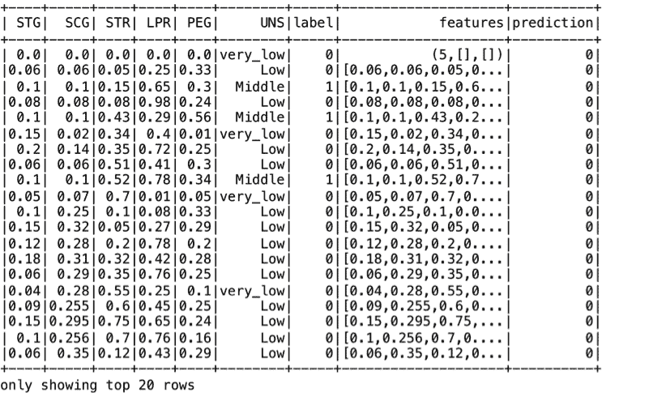

```scala
scala> transformed.filter("prediction = 1").show()
```

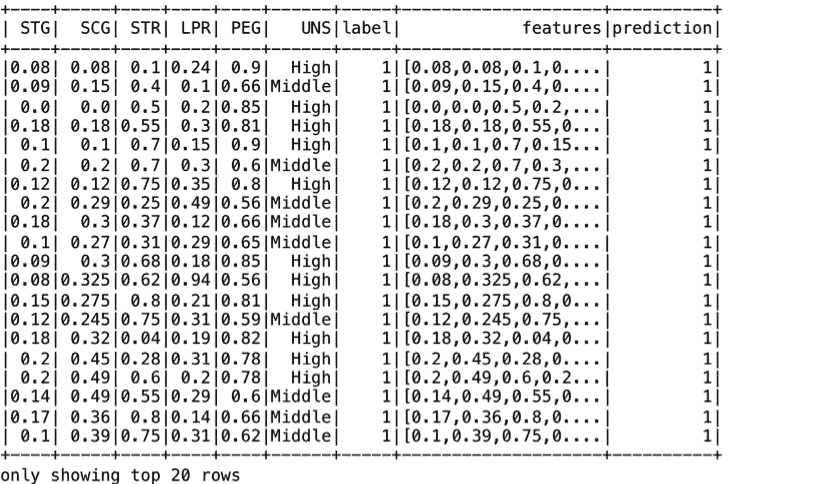

我们还可以使用`describe`来查看每个预测标签的摘要统计信息，如下所示：

```scala
scala> transformed.filter("prediction = 0").select("STG", "SCG", "STR", "LPR", "PEG").describe().show() 
```

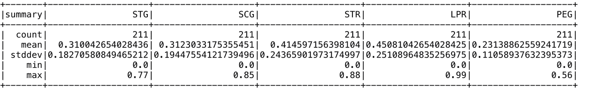

```scala
scala> transformed.filter("prediction = 1").select("STG", "SCG", "STR", "LPR", "PEG").describe().show() 
```

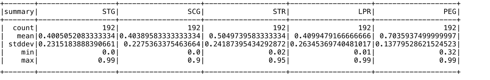

```scala
scala> println("No. of mis-matches between predictions and labels =" + y1DF.count()+"\nTotal no. of records=  "+ transformed.count()+"\nCorrect predictions =  "+ (1-(y1DF.count()).toDouble/transformed.count())+"\nMis-match = "+ (y1DF.count()).toDouble/transformed.count()) 

No. of mis-matches between predictions and labels =34
Total no. of records= 403
Correct predictions = 0.9156327543424317
Mis-match = 0.08436724565756824
```

接下来，我们将输入一些测试输入记录，模型将预测它们的簇：

```scala
scala> val testDF = spark.createDataFrame(Seq((0.08,0.08,0.1,0.24,0.9, Vectors.dense(0.08,0.08,0.1,0.24,0.9)))).toDF("STG", "SCG", "STR", "LPR", "PEG", "features") 

scala> model.transform(testDF).show() 
+----+----+---+----+---+--------------------+----------+ 
| STG| SCG|STR| LPR|PEG|            features|prediction| 
+----+----+---+----+---+--------------------+----------+ 
|0.08|0.08|0.1|0.24|0.9|0.08,0.08,0.1,0....|         1| 
+----+----+---+----+---+--------------------+----------+ 

scala> val testDF = spark.createDataFrame(Seq((0.06,0.06,0.05,0.25,0.33, Vectors.dense(0.06,0.06,0.05,0.25,0.33)))).toDF("STG", "SCG", "STR", "LPR", "PEG", "features")

scala> model.transform(testDF).show() 
+----+----+----+----+----+--------------------+----------+ 
| STG| SCG| STR| LPR| PEG|            features|prediction| 
+----+----+----+----+----+--------------------+----------+ 
|0.06|0.06|0.05|0.25|0.33|[0.06,0.06,0.05,0...|         0| 
+----+----+----+----+----+--------------------+----------+ 

```

关于流式机器学习应用程序和大规模处理架构等主题，将在[第十二章中详细介绍，*大规模应用架构中的 Spark SQL*。

# 总结

在本章中，我们介绍了机器学习应用程序。我们涵盖了机器学习中最重要的一个主题，称为特征工程。此外，我们提供了使用 Spark ML API 构建分类管道和聚类应用程序的代码示例。此外，我们还介绍了一些工具和实用程序，可以帮助更轻松、更高效地选择特征和构建模型。

在下一章中，我们将介绍 GraphFrame 应用程序，并提供使用 Spark SQL DataFrame/Dataset API 构建图应用程序的示例。我们还将对图应用程序应用各种图算法。
