# 第七章：在图应用中使用 Spark SQL

在本章中，我们将介绍在图应用中使用 Spark SQL 的典型用例。图在许多不同的领域中很常见。通常，图是使用特殊的图处理引擎进行分析的。GraphX 是用于图计算的 Spark 组件。它基于 RDD，并支持图抽象和操作，如子图、aggregateMessages 等。此外，它还公开了 Pregel API 的变体。然而，我们的重点将放在建立在 Spark SQL Dataset/DataFrame API 之上的 GraphFrame API 上。GraphFrames 是一个集成系统，结合了图算法、模式匹配和查询。GraphFrame API 目前仍处于测试版（截至 Spark 2.2），但绝对是 Spark 应用的未来图处理 API。

具体来说，在本章中，您将学习以下主题：

+   使用 GraphFrames 创建大规模图形

+   执行一些基本的图操作

+   使用 GraphFrames 进行模式分析

+   使用 GraphFrames 处理子图

+   执行图算法

+   处理包含多种关系类型的图形

+   GraphFrames 中的分区

# 介绍大规模图应用

基于大型数据集的图分析在各个领域变得越来越重要，比如社交网络、通讯网络、引用网络、网页图、交通网络、产品共购网络等。通常，图是从表格或关系格式的源数据中创建的，然后应用程序（如搜索和图算法）在其上运行以得出关键见解。

GraphFrames 提供了一个声明式 API，可用于大规模图形上的交互式查询和独立程序。由于 GraphFrames 是建立在 Spark SQL 之上的，它能够实现跨计算的并行处理和优化：

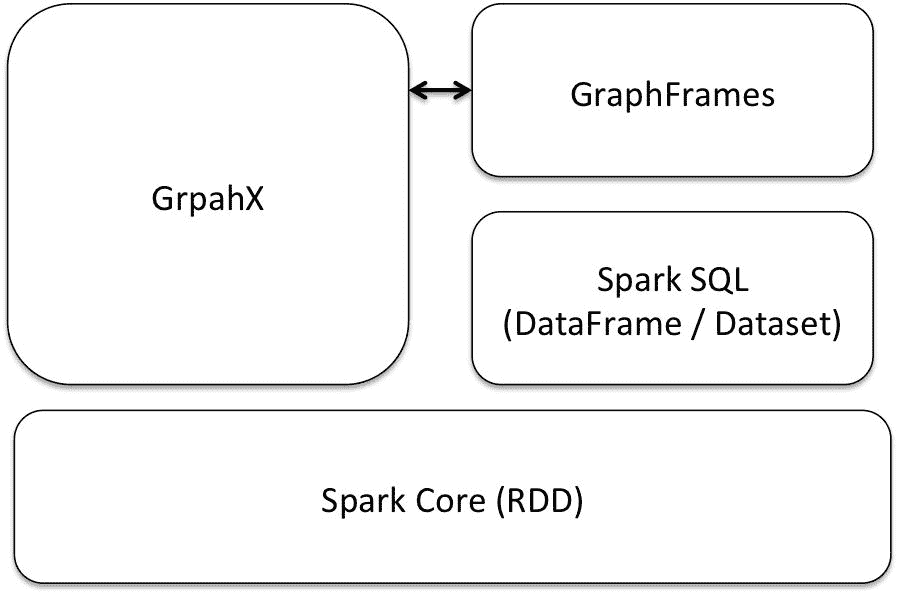

GraphFrame API 中的主要编程抽象是 GraphFrame。在概念上，它由表示图的顶点和边的两个数据框组成。顶点和边可以具有多个属性，这些属性也可以用于查询。例如，在社交网络中，顶点可以包含姓名、年龄、位置等属性，而边可以表示节点（网络中的人）之间的关系。由于 GraphFrame 模型可以支持每个顶点和边的用户定义属性，因此它等同于属性图模型。此外，可以使用模式定义视图，以匹配网络中各种子图的形状。

在接下来的章节中，我们将从几个公共数据集中构建图形，这些数据集以关系格式可用，然后在它们上运行各种图操作和算法。GraphFrames 优化了关系和图计算的执行。这些计算可以使用关系运算符、模式和算法调用来指定。

在接下来的章节中，我们将使用 Spark shell 来定义图形、查询它们，并在其上交互式地运行算法。

# 使用 GraphFrames 探索图形

在本节中，我们使用 Spark GraphFrames 来探索建模为图的数据。图的顶点和边被存储为数据框，并且支持使用 Spark SQL 和基于数据框的查询来操作它们。由于数据框可以支持各种数据源，我们可以从关系表、文件（JSON、Parquet、Avro 和 CSV 等）等读取输入顶点和边的信息。

顶点数据框必须包含一个名为`id`的列，用于指定每个顶点的唯一 ID。同样，边数据框必须包含名为`src`（源顶点 ID）和`dst`（目标顶点 ID）的两列。顶点和边数据框都可以包含用于属性的额外列。

GraphFrames 提供了一个简洁的语言集成 API，统一了图分析和关系查询。该系统基于连接计划和执行代数优化来优化各个步骤。可以将机器学习代码、外部数据源和 UDF 与 GraphFrames 集成，以构建更复杂的应用程序。

我们将从一个包含亚马逊共购数据的文件中读取顶点和边开始我们的编码练习。节点代表各种物品，源和目标顶点之间的边定义了一个**alsopurchased**关系。这些练习的数据集可以从[`snap.stanford.edu/data/amazon0601.html`](https://snap.stanford.edu/data/amazon0601.html)下载。

按照以下方式启动 Spark shell，以在 Spark shell 环境中包含 GraphFrame 库：

```scala
./bin/spark-shell --packages graphframes:graphframes:0.3.0-spark2.0-s_2.11 --driver-memory 12g
```

首先，我们导入我们示例中需要的所有包，如下所示：

```scala
scala> import org.apache.spark.sql.types._
scala> import org.apache.spark.sql.functions._
scala> import spark.implicits._
scala> import org.apache.spark.sql.Row
scala> import org.graphframes._
```

# 构建图框架

可以使用两个 DataFrame 构建 GraphFrame：一个顶点 DataFrame 和一个边 DataFrame。在这里，我们从包含边信息的单个 DataFrame 中创建 GraphFrame。

我们将从包含在我们的输入文件中的边的源和目标顶点派生顶点 DataFrame。

读取输入文件以创建边的 RDD，如下所示：

```scala
scala> val edgesRDD = spark.sparkContext.textFile("file:///Users/aurobindosarkar/Downloads/amzncopurchase/amazon0601.txt")
```

接下来，为边定义一个模式，并将边 RDD 转换为 DataFrame，如下几个步骤所示：

```scala
scala> val schemaString = "src dst"
scala> val fields = schemaString.split(" ").map(fieldName => StructField(fieldName, StringType, nullable = false))

scala> val edgesSchema = new StructType(fields)

scala> val rowRDD = edgesRDD.map(_.split("\t")).map(attributes => Row(attributes(0).trim, attributes(1).trim))

scala> val edgesDF = spark.createDataFrame(rowRDD, edgesSchema)
```

接下来，通过从边 DataFrame 中选择不同的源和目标顶点，为顶点创建一个 DataFrame。两个结果 DataFrame 的并集，选择不同的顶点，给我们最终的顶点 DataFrame：

```scala
scala> val srcVerticesDF = edgesDF.select($"src").distinct
scala> val destVerticesDF = edgesDF.select($"dst").distinct
scala> val verticesDF = srcVerticesDF.union(destVerticesDF).distinct.select($"src".alias("id"))
```

我们可以通过将它们与源站点报告的数字进行匹配，来验证这些 DataFrame 中的节点和顶点的数量（对于我们的输入数据集）：

```scala
scala> edgesDF.count()
res0: Long = 3387388                                                          
scala> verticesDF.count()
res1: Long = 403394
```

接下来，我们从顶点和边 DataFrame 创建一个`GraphFrame`，用于亚马逊共购数据：

```scala
scala> val g = GraphFrame(verticesDF, edgesDF)
```

在下一节中，我们将探索我们刚刚创建的图的一些属性。

# 基本图查询和操作

在本节中，我们将涵盖图的简单查询和操作，包括显示顶点、边以及顶点的入度和出度，如下所示：

```scala
scala> g.vertices.show(5)
+---+                                                                     
| id|
+---+
|296|
|467|
|675|
|691|
|829|
+---+
only showing top 5 rows
scala> g.edges.show(5)
+---+---+
|src|dst|
+---+---+
| 0| 1|
| 0| 2|
| 0| 3|
| 0| 4|
| 0| 5|
+---+---+
only showing top 5 rows
scala> g.inDegrees.show(5)
+----+--------+                                                                
| id|inDegree|
+----+--------+
| 467|     28|
|1090|      9|
| 296|      5|
|3959|      7|
|6240|     44|
+----+--------+
only showing top 5 rows
scala> g.outDegrees.show(5)
+---+---------+                                                                
| id|outDegree|
+---+---------+
|296|       10|
|467|       10|
|675|       10|
|691|       10|
|829|       10|
+---+---------+
only showing top 5 rows
```

我们还可以对边和顶点及其属性应用过滤器，如下所示：

```scala
scala> g.edges.filter("src == 2").show()
+---+---+
|src|dst|
+---+---+
|  2|  0|
|  2|  1|
|  2|  3|
|  2|  4|
|  2|  6|
|  2| 10|
|  2| 47|
|  2| 54|
|  2|118|
|  2|355|
+---+---+
scala> g.edges.filter("src == 2").count()
res6: Long = 10
scala> g.edges.filter("dst == 2").show()
+---+---+
|src|dst|
+---+---+
|  0|  2|
|  1|  2|
|  3|  2|
+---+---+
scala> g.inDegrees.filter("inDegree >= 10").show(5)
+----+--------+                                                                
| id|inDegree|
+----+--------+
| 467|      28|
|6240|      44|
|1159|      12|
|1512|     110|
| 675|      13|
+----+--------+
only showing top 5 rows
```

此外，我们还可以使用`groupBy`和`sort`操作，如下面的示例所示：

```scala
scala> g.inDegrees.groupBy("inDegree").count().sort(desc("inDegree")).show(5)
+--------+-----+                                                              
|inDegree|count|
+--------+-----+
|   2751|     1|
|   2487|     1|
|   2281|     1|
|   1512|     1|
|   1174|     1|
+--------+-----+
only showing top 5 rows
scala> g.outDegrees.groupBy("outDegree").count().sort(desc("outDegree")).show(5)
+---------+------+                                                            
|outDegree| count|
+---------+------+
|       10|279108|
|        9| 13297|
|        8| 11370|
|        7| 11906|
|        6| 12827|
+---------+------+
only showing top 5 rows
```

在下一节中，我们将探索图中存在的结构模式。

# 使用 GraphFrames 进行模式分析

查找模式有助于我们执行查询，以发现图中的结构模式。网络模式是图中反复出现的子图或模式，代表顶点之间的交互或关系。模式可以用于我们的产品共购图，以根据图表示的产品的结构属性、它们的属性和它们之间的关系，获得有关用户行为的见解。这些信息可以用于推荐和/或广告引擎。

例如，以下模式表示一个使用情况，其中购买产品**(a)**的客户也购买了另外两种产品**(b)**和**(c)**：

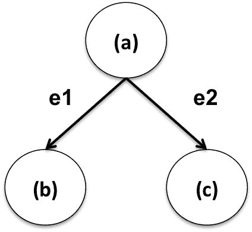

有关模式分析的详细内容，请参阅*Abhishek Srivastava*的*《亚马逊产品共购网络》*中的*模式分析*。

在本节中，我们将使用 GraphFrames 主要对代表购买网络数据集中各种关系的`3-`和`4-`节点模式进行建模。GraphFrame 模式查找使用一种用于表达结构查询的声明性**领域特定语言**（**DSL**）。在模式中，顶点和边被赋予名称。模式的基本单位是边。例如，`(a) – [e] -> (b)`表示从顶点`a`到顶点`b`的边`e`。顶点用括号`(a)`表示，而边用方括号`[e]`表示。模式被表示为边的并集，边模式可以用分号连接。

我们将从一个简单的查询开始我们的编码练习，在这个查询中，我们搜索购买产品`a`也意味着购买产品`b`，反之亦然的产品组合。这里的查找操作将搜索双向边连接的顶点对：

```scala
scala> val motifs = g.find("(a)-[e]->(b); (b)-[e2]->(a)")
scala> motifs.show(5)
+--------+---------------+--------+---------------+                            
|       a|             e|       b|             e2|
+--------+---------------+--------+---------------+
| [85609]| [85609,100018]|[100018]| [100018,85609]|
| [86839]| [86839,100042]|[100042]| [100042,86839]|
| [55528]| [55528,100087]|[100087]| [100087,55528]|
|[178970]|[178970,100124]|[100124]|[100124,178970]|
|[100124]|[100124,100125]|[100125]|[100125,100124]|
+--------+---------------+--------+---------------+
only showing top 5 rows
```

我们也可以对结果应用过滤器；例如，在下面的过滤器中，我们指定了顶点`b`的值为`2`：

```scala
scala> motifs.filter("b.id == 2").show()
+---+-----+---+-----+                                                          
|  a|    e|  b|   e2|
+---+-----+---+-----+
|[3]|[3,2]|[2]|[2,3]|
|[0]|[0,2]|[2]|[2,0]|
|[1]|[1,2]|[2]|[2,1]|
+---+-----+---+-----+
```

下面的例子指定了从`a`到`b`和`c`的两条单独的边。这种模式通常表示的情况是，当客户购买产品**(a)**时，她也会购买**(b)**和**(c)**中的一个或两个：


此外，模式还指定了相同的顶点`a`是边`e1`和`e2`的共同源：

```scala
scala> val motifs3 = g.find("(a)-[e1]->(b); (a)-[e2]->(c)").filter("(b != c)")

scala> motifs3.show(5)
+--------+---------------+--------+---------------+--------+                  
|       a|             e1|       b|             e2|       c|
+--------+---------------+--------+---------------+--------+
|[109254]|   [109254,8742]| [8742]|[109254,100010]|[100010]|
|[109254]|   [109254,8741]| [8741]|[109254,100010]|[100010]|
|[109254]| [109254,59782]| [59782]|[109254,100010]|[100010]|
|[109254]|[109254,115349]|[115349]|[109254,100010]|[100010]|
|[109254]| [109254,53996]| [53996]|[109254,100010]|[100010]|
+--------+---------------+--------+---------------+--------+
only showing top 5 rows
```

由于边的列包含冗余信息，当不需要时，我们可以省略模式中顶点或边的名称；例如，在模式`(a)-[]->(b)`中，`[]`表示顶点`a`和`b`之间的任意边。

结果中没有边的列。同样，`(a)-[e]->()`表示顶点`a`的出边，但没有指定目标顶点的名称：

```scala
scala> val motifs3 = g.find("(a)-[]->(b); (a)-[]->(c)").filter("(b != c)")
scala> motifs3.show()
+--------+--------+--------+                                                  
|       a|       b|       c|
+--------+--------+--------+
|[109254]| [8742]| [100010]|
|[109254]| [8741]| [100010]|
|[109254]| [59782]|[100010]|
|[109254]|[115349]|[100010]|
|[109254]| [53996]|[100010]|
|[109254]|[109257]|[100010]|
|[109254]| [62046]|[100010]|
|[109254]| [94411]|[100010]|
|[109254]|[115348]|[100010]|
|[117041]| [73722]|[100010]|
|[117041]|[193912]|[100010]|
|[117041]| [52568]|[100010]|
|[117041]| [57835]|[100010]|
|[117041]|[164019]|[100010]|
|[117041]| [63821]|[100010]|
|[117041]|[162691]|[100010]|
|[117041]| [69365]|[100010]|
|[117041]| [4849]|[100010]|
|[148522]| [8742]|[100010]|
|[148522]|[100008]|[100010]|
+--------+--------+--------+
only showing top 20 rows
scala> motifs3.count()
res20: Long = 28196586
```

在下面的例子中，我们指定了从`a`到`b`和`c`的两条单独的边，以及从`b`到`a`的另一条边。这种模式通常表示的情况是，`a`和`b`之间存在相互关系（表明产品之间存在密切的相似性）：

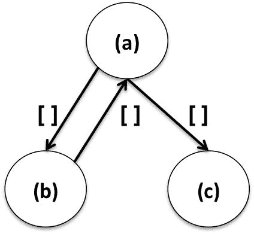

```scala
scala> val motifs3 = g.find("(a)-[]->(b); (a)-[]->(c); (b)-[]->(a)").filter("(b != c)")
scala> motifs3.show()
+-------+--------+--------+                                                    
|      a|       b|       c|
+-------+--------+--------+
|[85609]|[100018]| [85611]|
|[85609]|[100018]| [85610]|
|[85609]|[100018]| [85752]|
|[85609]|[100018]| [28286]|
|[85609]|[100018]| [93910]|
|[85609]|[100018]| [85753]|
|[85609]|[100018]| [60945]|
|[85609]|[100018]| [47246]|
|[85609]|[100018]| [85614]|
|[86839]|[100042]|[100040]|
|[86839]|[100042]| [46600]|
|[86839]|[100042]|[100039]|
|[86839]|[100042]|[100041]|
|[86839]|[100042]| [27186]|
|[86839]|[100042]|[100044]|
|[86839]|[100042]|[100043]|
|[86839]|[100042]| [86841]|
|[86839]|[100042]| [86838]|
|[55528]|[100087]| [55531]|
|[55528]|[100087]| [40067]|
+-------+--------+--------+
only showing top 20 rows
scala> motifs3.count()
res17: Long = 15657738
```

在下面的例子中，我们指定了从`a`和`c`到`b`的两条单独的边。这种模式通常表示的情况是，当客户购买不相关的产品（`a`和`c`）时，他们也会购买`b`。这是一个汇聚的模式，企业可以利用这些信息，例如将这些产品一起存放：

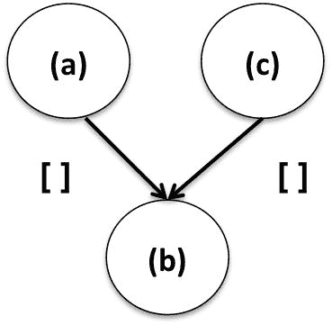

```scala
scala> val motifs3 = g.find("(a)-[]->(b); (c)-[]->(b)").filter("(a != c)")
scala> motifs3.show(5)
+--------+------+--------+                                                    
|       a|     b|       c|
+--------+------+--------+
|[365079]|[8742]|[100010]|
|[241393]|[8742]|[100010]|
| [33284]|[8742]|[100010]|
|[198072]|[8742]|[100010]|
|[203728]|[8742]|[100010]|
+--------+------+--------+
only showing top 5 rows
scala> motifs3.count()
res24: Long = 119218310
```

在下面的例子中，我们指定了从`a`到`b`和从`b`到`c`的边，以及从`c`到`b`的另一条边。这种模式通常表示的情况是，当客户购买产品**(a)**时，她可能也会购买**(b)**，然后继续购买**(c)**。这可能表明购买商品时的一些优先考虑。此外，模式中的强连接组件表明了**(b)**和**(c)**之间的密切关系：

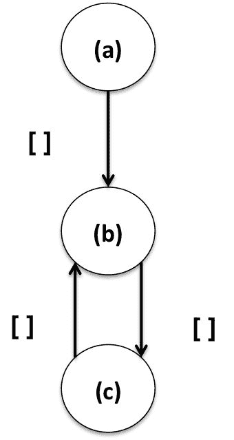

```scala
scala> val motifs3 = g.find("(a)-[]->(b); (b)-[]->(c); (c)-[]->(b)")
scala> motifs3.show(5)
+--------+-------+--------+                                                    
|       a|      b|       c|
+--------+-------+--------+
|[188454]|[85609]|[100018]|
| [85611]|[85609]|[100018]|
| [98017]|[85609]|[100018]|
|[142029]|[85609]|[100018]|
| [64516]|[85609]|[100018]|
+--------+-------+--------+
only showing top 5 rows
scala> motifs3.count()
res26: Long = 23373805.
```

4-节点模式示例非常消耗资源，需要超过 100GB 的磁盘空间和超过 14GB 的 RAM。或者，您可以参考下一节创建一个较小的子图来运行这个示例。

在下一个例子中，我们展示了一个`4-节点`的模式。这种模式通常表示的情况是，客户购买**(b)**的概率更高：

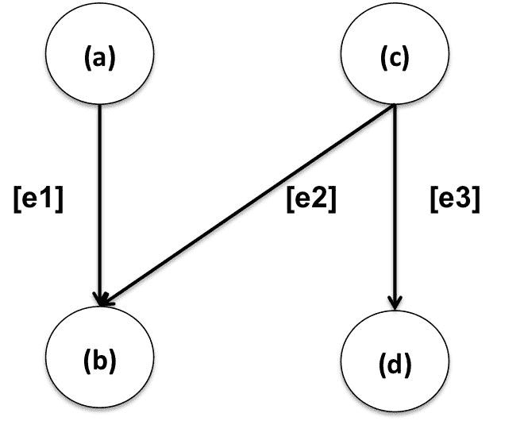

```scala
scala> val motifs4 = g.find("(a)-[e1]->(b); (c)-[e2]->(b); (c)-[e3]->(d)").filter("(a != c) AND (d != b) AND (d != a)")
scala> motifs4.show(5)
```

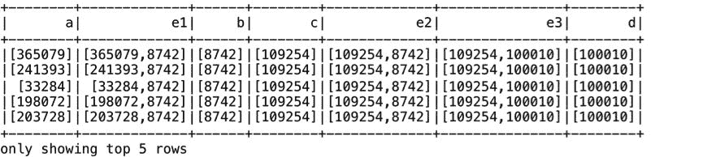

```scala
scala> motifs4.count()
res2: Long = 945551688
```

在下一节中，我们将把重点转移到创建和处理子图。

# 处理子图

GraphFrames 提供了一种强大的方式来基于模式查找和 DataFrame 过滤器选择子图。以下示例展示了如何基于顶点和边过滤器选择子图：

```scala
scala> val v2 = g.vertices.filter("src < 10")
scala> val e2 = g.edges.filter("src < 10")
scala> val g2 = GraphFrame(v2, e2)
scala> g2.edges.groupBy("src").count().show()
+---+-----+                                                                    
|src|count|
+---+-----+
| 7|   10|
| 3|   10|
| 8|   10|
| 0|   10|
| 5|   10|
| 6|   10|
| 9|   10|
| 1|   10|
| 4|   10|
| 2|   10|
+---+-----+
scala> val paths = g.find("(a)-[e]->(b)").filter("e.src < e.dst")
scala> val e2 = paths.select("e.*")
scala> e2.show(5)
+------+------+                                                                
|   src|   dst|
+------+------+
|100008|100010|
|100226|100227|
|100225|100227|
|100224|100227|
|100223|100227|
+------+------+
only showing top 5 rows
```

在下一节中，我们将对我们的图应用一系列图算法。

# 应用图算法

GraphFrames 提供了一套标准的图算法。我们提供了图算法的简要描述和应用它们的代码片段。

首先，我们计算每个顶点的**强连通分量**（**SCC**），并返回一个图，其中每个顶点都分配给包含该顶点的 SCC。我们显示 SCC 中节点的计数，如下所示：

```scala
val result = g.stronglyConnectedComponents.maxIter(10).run()
result.select("id", "component").groupBy("component").count().sort($"count".desc).show()
+---------+------+                                                            
|component| count|
+---------+------+
|        0|395234|
|   312598|   111|
|   379229|   105|
|   107295|    81|
|   359845|    70|
|    40836|    64|
|   357970|    64|
|   189338|    61|
|   369081|    59|
|   152634|    58|
|   167178|    55|
|    35086|    50|
|    81674|    48|
|   376845|    48|
|   177702|    47|
|   319708|    44|
|   130664|    43|
|   279703|    41|
|   273764|    41|
|   324355|    40|
+---------+------+
only showing top 20 rows
```

接下来，我们计算通过每个顶点的三角形数量。三角形的数量是顶点邻域密度的度量。在网络中，三角形计数有许多实际应用，例如社区检测、角色行为、垃圾邮件检测、检测具有共同主题的网页子集等：

```scala
val results = g.triangleCount.run()
results.select("id", "count").show()
+------+-----+                                                                  
|    id|count|
+------+-----+
|100010|   73|
|100140|   15|
|100227|  332|
|100263|    9|
|100320|    8|
|100553|   41|
|100704|    3|
|100735|   13|
|100768|   37|
| 10096|   58|
|100964|   87|
|101021|   30|
|101122|   52|
|101205|  152|
|101261|   31|
|101272|   19|
|102113|   38|
|102521|   23|
|102536|    2|
|102539|   37|
+------+-----+
only showing top 20 rows
```

在下面的示例中，我们将应用 PageRank 算法来确定产品的重要性的估计值。基本假设是更受欢迎的产品很可能会从其他产品节点接收更多的链接：

```scala
val results = g.pageRank.resetProbability(0.15).tol(0.01).run()
val prank = results.vertices.sort(desc("pagerank"))
prank.show(5)
+-----+------------------+                                                      
|   id|          pagerank|
+-----+------------------+
|   45| 586.2075242838272|
| 1036| 512.2355738350872|
| 1037|  506.900472599229|
|   50| 485.4457370914238|
| 1039|438.64149165397276|
+----+------------------+
only showing top 5 rows
```

在下一个示例中，我们应用标签传播算法来找到图中产品的社区：

```scala
val results = g.labelPropagation.maxIter(10).run()
results.select("id", "label").show()
+-----+-----+                                                                  
|label|count|
+-----+-----+
| 1677|    2|
| 5385|   23|
| 7279|   11|
| 9233|    7|
| 9458|   10|
| 9978|   80|
|10422|    8|
|11945|   13|
|13098|    6|
|13452|   12|
|14117|   49|
|21899|   20|
|23019|   12|
|27651|   80|
|29824|   17|
|30421|    9|
|32571|    4|
|37310|    1|
|41424|   48|
|45726|    4|
+-----+-----+
only showing top 20 rows
results.select("id", "label").groupBy("label").count().sort(desc("count")).show(5)
+-----+-----+                                                                  
|label|count|
+-----+-----+
| 1110| 2830|
|  352| 2266|
| 9965| 1413|
| 9982|  828|
|11224|  761|
+-----+-----+
only showing top 5 rows
```

在下面的示例中，我们应用最短路径算法来找到图中两个顶点之间的路径，以使其构成的边的数量最小化：

```scala
val results = g.shortestPaths.landmarks(Seq("1110", "352")).run()
results.select("id", "distances").take(5).foreach(println)
[8,Map(352 -> 3, 1110 -> 9)]                                                  
[22,Map(352 -> 4, 1110 -> 4)]
[290,Map(352 -> 4, 1110 -> 6)]
[752,Map()]
[2453,Map(352 -> 8, 1110 -> 11)]
```

在下一节中，我们将展示如何将 GraphFrames 保存到持久存储，然后检索相同的内容以重新创建原始的 GraphFrame。

# 保存和加载 GraphFrames

由于 GraphFrames 是建立在 DataFrame API 上的，它们支持保存和加载到各种数据源。在下面的代码中，我们展示了将顶点和边保存到 HDFS 上的 Parquet 文件：

```scala
g.vertices.write.parquet("hdfs://localhost:9000/gf/vertices")
g.edges.write.parquet("hdfs://localhost:9000/gf/edges")
```

我们可以从持久存储中重新创建顶点和边的 DataFrame，然后显示图，如下所示：

```scala
val v = spark.read.parquet("hdfs://localhost:9000/gf/vertices")
val e = spark.read.parquet("hdfs://localhost:9000/gf/edges")
val g = GraphFrame(v, e)
```

在下一节中，我们将使用更丰富的数据集来演示基于 GraphFrames 的应用中的顶点和边属性的使用。

# 分析建模为图的 JSON 输入

在本节中，我们将分析一个建模为图的 JSON 数据集。我们将应用前几节中的 GraphFrame 函数，并介绍一些新的函数。

在本节的实践练习中，我们使用一个包含亚马逊产品元数据的数据集；约 548,552 个产品的产品信息和评论。该数据集可以从[`snap.stanford.edu/data/amazon-meta.html`](https://snap.stanford.edu/data/amazon-meta.html)下载。

为了简化处理，原始数据集被转换为 JSON 格式文件，每行代表一个完整的记录。使用本章提供的 Java 程序（`Preprocess.java`）进行转换。

首先，我们从输入文件创建一个 DataFrame，并打印出模式和一些示例记录。这是一个具有嵌套元素的复杂模式：

```scala
scala> val df1 = spark.read.json("file:///Users/aurobindosarkar/Downloads/input.json")
scala> df1.printSchema()
root
|-- ASIN: string (nullable = true)
|-- Id: long (nullable = true)
|-- ReviewMetaData: struct (nullable = true)
|   |-- avg_rating: double (nullable = true)
|   |-- downloaded: long (nullable = true)
|   |-- total: long (nullable = true)
|-- categories: long (nullable = true)
|-- categoryLines: array (nullable = true)
|   |-- element: struct (containsNull = true)
|   |   |-- category: string (nullable = true)
|-- group: string (nullable = true)
|-- reviewLines: array (nullable = true)
|   |-- element: struct (containsNull = true)
|   |   |-- review: struct (nullable = true)
|   |   |   |-- customerId: string (nullable = true)
|   |   |   |-- date: string (nullable = true)
|   |   |   |-- helpful: long (nullable = true)
|   |   |   |-- rating: long (nullable = true)
|   |   |   |-- votes: long (nullable = true)
|-- salerank: long (nullable = true)
|-- similarLines: array (nullable = true)
|   |-- element: struct (containsNull = true)
|   |   |-- similar: string (nullable = true)
|-- similars: long (nullable = true)
|-- title: string (nullable = true)
scala> df1.take(5).foreach(println)
```

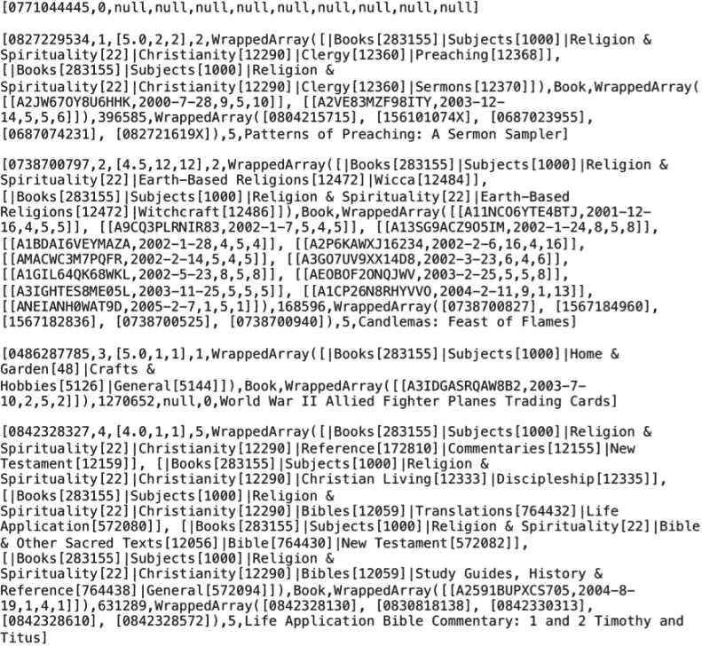

我们可以打印出数据中的一组结构元素的数组。更具体地说，我们打印出与当前产品一起购买的类似产品的列表：

```scala
scala> val x1=df1.select(df1.col("similarLines"))
scala> df1.select(df1.col("similarLines.similar")).take(5).foreach(println)
```

我们还可以通过使用 explode 来展开评论元素的嵌套结构，并访问其中的特定元素：

```scala
scala> val flattened = df1.select($"ASIN", explode($"reviewLines.review").as("review_flat"))
scala> flattened.show()
+----------+--------------------+
|     ASIN|         review_flat|
+----------+--------------------+
|0827229534|[A2JW67OY8U6HHK,2...|
|0827229534|[A2VE83MZF98ITY,2...|
|0738700797|[A11NCO6YTE4BTJ,2...|
|0738700797|[A9CQ3PLRNIR83,20...|
|0738700797|[A13SG9ACZ9O5IM,2...|
|0738700797|[A1BDAI6VEYMAZA,2...|
|0738700797|[A2P6KAWXJ16234,2...|
|0738700797|[AMACWC3M7PQFR,20...|
|0738700797|[A3GO7UV9XX14D8,2...|
|0738700797|[A1GIL64QK68WKL,2...|
|0738700797|[AEOBOF2ONQJWV,20...|
|0738700797|[A3IGHTES8ME05L,2...|
|0738700797|[A1CP26N8RHYVVO,2...|
|0738700797|[ANEIANH0WAT9D,20...|
|0486287785|[A3IDGASRQAW8B2,2...|
|0842328327|[A2591BUPXCS705,2...|
|0486220125|[ATVPDKIKX0DER,19...|
|0486220125|[AUEZ7NVOEHYRY,19...|
|0486220125|[ATVPDKIKX0DER,19...|
|0486220125|[AJYG6ZJUQPZ9M,20...|
+----------+--------------------+
only showing top 20 rows
scala> val flatReview = flattened.select("ASIN", "review_flat.customerId")
```

接下来，我们创建节点和边的 DataFrame，如下所示：

```scala
scala> val nodesDF = df1.select($"ASIN".alias("id"), $"Id".alias("productId"), $"title", $"ReviewMetaData", $"categories", $"categoryLines", $"group", $"reviewLines", $"salerank", $"similarLines", $"similars")
```

对于边的 DataFrame，我们使用类似或也购买产品列`similarLines`上的 explode 来为数组中的每个元素创建新行：

```scala
scala> val edgesDF = df1.select($"ASIN".alias("src"), explode($"similarLines.similar").as("dst"))
scala> val g = GraphFrame(nodesDF, edgesDF)
```

接下来，我们展示一些使用节点属性的基本操作：

```scala
scala> g.edges.filter("salerank < 100").count()
res97: Long = 750                                                              
scala> g.vertices.groupBy("group").count().show()
+------------+------+                                                          
|       group| count|
+------------+------+
|       Video| 26131|
|         Toy|     8|
|         DVD| 19828|
|      Sports|     1|
|        null|  5868|
|Baby Product|     1|
| Video Games|     1|
|        Book|393561|
|       Music|103144|
|    Software|     5|
|          CE|     4|
+------------+------+
```

接下来，我们仅为图书组产品创建一个子图：

```scala
scala> val v2 = g.vertices.filter("group = 'Book'")
scala> val g2 = GraphFrame(v2, e2)
scala> g2.vertices.count()
res6: Long = 393561                                                            
```

重要的是要注意，边的数量等于原始图中的边的数量。GraphFrame 不会自动删除与图书组产品无关的边：

```scala
scala> g2.edges.count()
res7: Long = 1788725    
```

在接下来的步骤中，我们暂时将顶点和边的 DataFrame 连接起来，以摆脱 DataFrame 中的额外边，并创建一个仅与图书产品相关的`GraphFrame`：

```scala
scala> val v2t = v2.select("id")
scala> val e2t = v2t.join(e2, v2t("id") === e2("src"))
scala> e2t.count()
res8: Long = 1316257                                                          
scala> val e2t1 = v2t.join(e2, v2t("id") === e2("src")).drop("id")
scala> val e2t2 = v2t.join(e2t1, v2t("id") === e2t1("dst")).drop("id")
scala> e2t2.count()
res9: Long = 911960                                                            
scala> val g2f = GraphFrame(v2, e2t2)
scala> g2f.vertices.count()
res10: Long = 393561                                                          
scala> g2f.edges.count()
res11: Long = 911960
```

我们可以将模式查找与包含顶点属性的过滤器相结合：

```scala
scala> g2.edges.take(5).foreach(println)
[B00008MNUJ,0822959046]                                                        
[0786632550,0793529395]
[0942272463,0942272692]
[0942272463,1567183298]
[0060537612,0689820305]
scala> val es = g.edges.filter("salerank < 100")
scala> val e3 = es.select("src", "dst")
scala> val g3 = GraphFrame(g.vertices, e3)
scala> val motifs = g3.find("(a)-[e]->(b); (b)-[e2]->(a)")
scala> motifs.show()
```

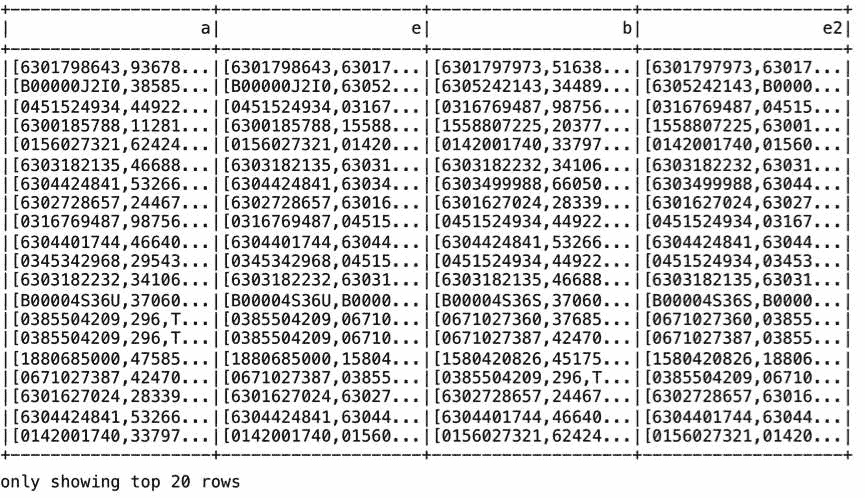

```scala
scala> motifs.filter("b.ReviewMetaData.avg_rating > 4.0").show()
```

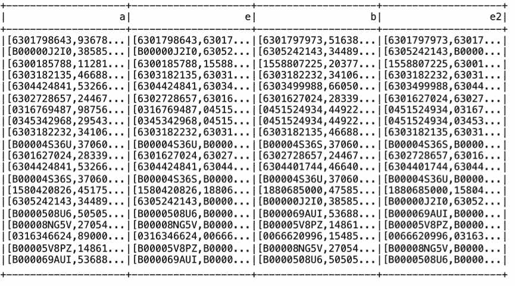

```scala
scala> val paths = g3.find("(a)-[e]->(b)").filter("a.group = 'Book' AND b.group = 'Book'").filter("a.salerank < b.salerank")
scala> val e2 = paths.select("e.src", "e.dst")
scala> val g2 = GraphFrame(g.vertices, e2)
scala> g2.vertices.take(5).foreach(println)
```

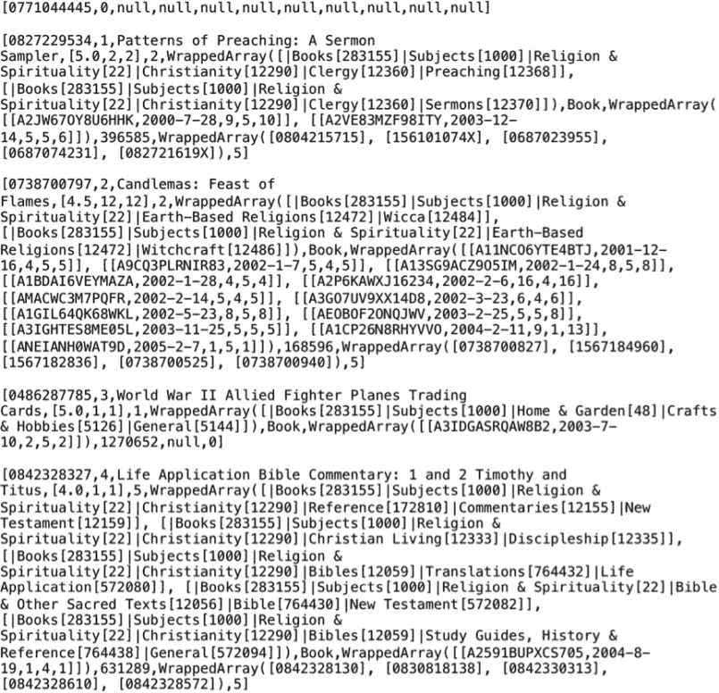

GraphFrames 提供了`AggregateMessages`原语来开发图算法。该组件可用于在顶点之间发送消息，也可用于聚合每个顶点的消息。

在下面的示例中，我们计算相邻产品的购买产品数量的总和：

```scala
scala> import org.graphframes.lib.AggregateMessages
scala> val AM = AggregateMessages
scala> val msgToSrc = AM.dst("similars")
scala> val msgToDst = AM.src("similars")
scala> val agg = g.aggregateMessages.sendToSrc(msgToSrc).sendToDst(msgToDst).agg(sum(AM.msg).as("SummedSimilars"))
scala> agg.show()
+----------+--------------+                                                    
|       id| SummedSimilars|
+----------+--------------+
|0004708237|             5|
|0023605103|            35|
|0027861317|            30|
|0028624599|            30|
|0028633784|            40|
|0028642074|            45|
|0030259282|            10|
|0060082135|            20|
|0060279257|            20|
|0060298804|            25|
|0060392436|            25|
|0060540745|           125|
|0060611561|           100|
|0060921005|            15|
|0060925175|            48|
|0060929081|            54|
|0060959126|            10|
|0060960388|            29|
|006097060X|            50|
|0060988940|            25|
+----------+--------------+
only showing top 20 rows
```

在接下来的部分中，我们将探索包含多种关系类型的边的 GraphFrames。

# 处理包含多种关系类型的图

在接下来的几个示例中，我们使用包含关系列的增强边 DataFrame。我们根据相似购买数量和产品所属类别的数量在列中插入两种关系类型。

为此，我们将节点和边的 DataFrame 进行连接，然后在关系计算完成后删除与节点相关的列，以获得我们最终的边 DataFrame（关系列适当填充）：

```scala
scala> val joinDF = nodesDF.join(edgesDF).where(nodesDF("id") === edgesDF("src")).withColumn("relationship", when(($"similars" > 4) and ($"categories" <= 3), "highSimilars").otherwise("alsoPurchased"))
scala> val edgesDFR = joinDF.select("src", "dst", "relationship")
scala> val gDFR = GraphFrame(nodesDF, edgesDFR)
```

接下来，我们计算每种关系类型的记录数量，并列出一些边以及关系值：

```scala
scala> gDFR.edges.groupBy("relationship").count().show()
+-------------+-------+                                                        
| relationship| count|
+-------------+-------+
|alsoPurchased|1034375|
| highSimilars| 754350|
+-------------+-------+
scala> gDFR.edges.show()
+----------+----------+-------------+                                          
|       src|       dst| relationship|
+----------+----------+-------------+
|0004708237|4770027508|alsoPurchased|
|0023605103|0830812717| highSimilars|
|0023605103|0830812865| highSimilars|
|0023605103|0800611365| highSimilars|
|0023605103|0801063914| highSimilars|
|0023605103|0802819478| highSimilars|
|0027861317|0803706197| highSimilars|
|0027861317|0525452710| highSimilars|
|0027861317|0152014829| highSimilars|
|0027861317|068980718X| highSimilars|
|0027861317|0761317910| highSimilars|
|0028624599|1889392138|alsoPurchased|
|0028624599|0934081239|alsoPurchased|
|0028624599|0761528245|alsoPurchased|
|0028624599|0761518045|alsoPurchased|
|0028624599|0811836878|alsoPurchased|
|0028633784|0812046943| highSimilars|
|0028633784|0812046005| highSimilars|
|0028633784|0028629051| highSimilars|
|0028633784|0140144358| highSimilars|
+----------+----------+-------------+
only showing top 20 rows
```

在下面的示例中，我们筛选出销售排名在 2,000,000 以下的产品顶点和具有`highSimilars`关系的边：

```scala
scala> val v2 = gDFR.vertices.filter("salerank < 2000000")
scala> val e2 = gDFR.edges.filter("relationship = 'highSimilars'")
scala> val g2 = GraphFrame(v2, e2)
```

在下面的示例中，我们从选定的列创建一个子图，并根据特定产品组进行过滤。我们还根据`highSimilars`关系选择边的子集。此外，我们找到图形并对其应用进一步的过滤，以获得最终结果：

```scala
scala> val v2 = gDFR.vertices.select("id", "group", "similars").filter("group = 'Book'")
scala> val e2 = gDFR.edges.filter("relationship = 'highSimilars'")
scala> val g2 = GraphFrame(v2, e2)
scala> val result1 = g2.find("(a)-[]->(b); (b)-[]->(c); !(a)-[]->(c)").filter("(a.group = c.group) and (a.similars = c.similars)")
scala> val result2 = result1.filter("a.id != c.id").select("a.id", "a.group", "a.similars", "c.id", "c.group", "c.similars")
scala> result2.show(5)
+----------+-----+--------+----------+-----+--------+                          
|       id|group|similars|       id|group|similars|
+----------+-----+--------+----------+-----+--------+
|0002551489| Book|       5|0002154129| Book|       5|
|0006388515| Book|       5|0679738711| Book|       5|
|0020438001| Book|       5|0395169615| Book|       5|
|0023078251| Book|       5|0394704371| Book|       5|
|0023237309| Book|       5|0874415098| Book|       5|
+----------+-----+--------+----------+-----+--------+
only showing top 5 rows
```

接下来，我们对基于节点和边关系属性的子图应用一些图算法。在下面的示例中，我们首先找到图中匹配模式的图形，然后根据节点和边属性的组合进行过滤。我们在最终子图上运行 BFS 算法：

```scala
scala> val paths = gDFR.find("(a)-[e]->(b)").filter("e.relationship = 'highSimilars'").filter("a.group = b.group")
scala> val e2 = paths.select("e.src", "e.dst", "e.relationship")
scala> val g2 = GraphFrame(gDFR.vertices, e2)
scala> val numEHS = g2.edges.count()
numEHS: Long = 511524  
scala> val bfsDF = gDFR.bfs.fromExpr("group = 'Book'").toExpr("categories < 3").edgeFilter("relationship != 'alsoPurchased'").maxPathLength(3).run()
scala> bfsDF.take(2).foreach(println)
```

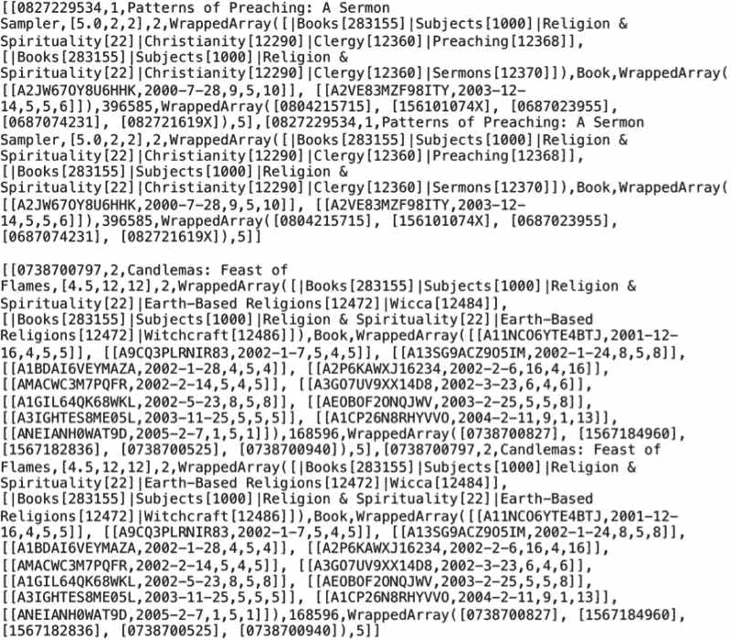

在下面的示例中，我们在图书子图上运行 PageRank 算法，以找到前十本书的标题：

```scala
scala> val v2 = gDFR.vertices.select("id", "group", "title").filter("group = 'Book'")
scala> val e2 = gDFR.edges.filter("relationship = 'highSimilars'")
scala> val g2 = GraphFrame(v2, e2)
scala> val results = g2.pageRank.resetProbability(0.15).tol(0.01).run()
scala> val prank = results.vertices.sort(desc("pagerank"))
scala> prank.take(10).foreach(println)
```

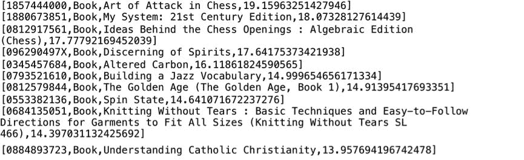

# 了解 GraphFrame 的内部结构

在接下来的部分中，我们将简要介绍 GraphFrame 的内部结构，以及其执行计划和分区。

# 查看 GraphFrame 的物理执行计划

由于 GraphFrames 是构建在 Spark SQL DataFrames 上的，我们可以查看物理计划以了解图操作的执行，如下所示：

```scala
scala> g.edges.filter("salerank < 100").explain()
```

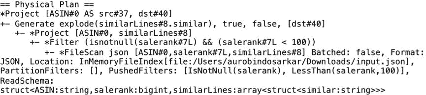

我们将在第十一章中更详细地探讨这一点，*调整 Spark SQL 组件以提高性能*。

# 了解 GraphFrames 中的分区

Spark 将数据分割成分区，并并行在分区上执行计算。您可以调整分区级别以提高 Spark 计算的效率。

在下面的示例中，我们检查重新分区 GraphFrame 的结果。我们可以根据顶点 DataFrame 的列值对 GraphFrame 进行分区。在这里，我们使用组列中的值按组或产品类型进行分区。在这里，我们将通过比较记录的分布前后来呈现重新分区的结果。

首先，我们按照所示创建两个 GraphFrames。由于`group`列中存在空值，我们将其替换为`unknown`的值：

```scala
scala> val v1 = g.vertices.select("id", "group").na.fill("unknown")
scala> val g1 = GraphFrame(v1, g.edges)
```

接下来，在重新分区原始 GraphFrame 后，我们创建第二个 GraphFrame。在这里，我们使用组数作为我们的初始分区数：

```scala
scala> val v2 = g.vertices.select("id", "group").na.fill("unknown")
scala> val g2t1 = GraphFrame(v2, g.edges)
scala> val g2t2 = g2t1.vertices.repartition(11, $"group")
scala> val g2 = GraphFrame(g2t2, g.edges)
```

显示以下两个图中的顶点表明，第二个图中的记录是按组聚集在一起的：

```scala
scala> g1.vertices.show()
+----------+-------+
|       id|   group|
+----------+-------+
|0771044445|unknown|
|0827229534|   Book|
|0738700797|   Book|
|0486287785|   Book|
|0842328327|   Book|
|1577943082|   Book|
|0486220125|   Book|
|B00000AU3R|  Music|
|0231118597|   Book|
|1859677800|   Book|
|0375709363|   Book|
|0871318237|   Book|
|1590770218|   Book|
|0313230269|   Book|
|B00004W1W1|  Music|
|1559362022|   Book|
|0195110382|   Book|
|0849311012|   Book|
|B000007R0T|  Music|
|078510870X|   Book|
+----------+-------+
only showing top 20 rows
scala> g2.vertices.show()
+----------+-----+                                                            
|       id| group|
+----------+-----+
|6303360041|Video|
|B0000060T5|Video|
|6304286961|Video|
|B000063W82|Video|
|B0000060TP|Video|
|0970911300|Video|
|B00000IBNZ|Video|
|B00000IC8N|Video|
|6303454488|Video|
|B00005LAF3|Video|
|6304733542|Video|
|6301045734|Video|
|6301967917|Video|
|6304702329|Video|
|0792296176|Video|
|6301966422|Video|
|B00000I9PH|Video|
|6303864120|Video|
|6304972857|Video|
|6301701720|Video|
+----------+-----+
only showing top 20 rows
```

第一个图的默认分区数为`9`，而第二个图根据指定为`11`：

```scala
scala> g1.vertices.rdd.partitions.size
res85: Int = 9
scala> g2.vertices.rdd.partitions.size
res86: Int = 11
```

我们还可以将分区的内容写入文件以探索其内容，如下所示：

```scala
scala> g1.vertices.write.csv("file:///Users/aurobindosarkar/Downloads/g1/partitions")
scala> g2.vertices.write.csv("file:///Users/aurobindosarkar/Downloads/g2/partitions")
```

以下是来自输出文件中一个分区的样本内容，用于显示第一个图中记录的混合情况：

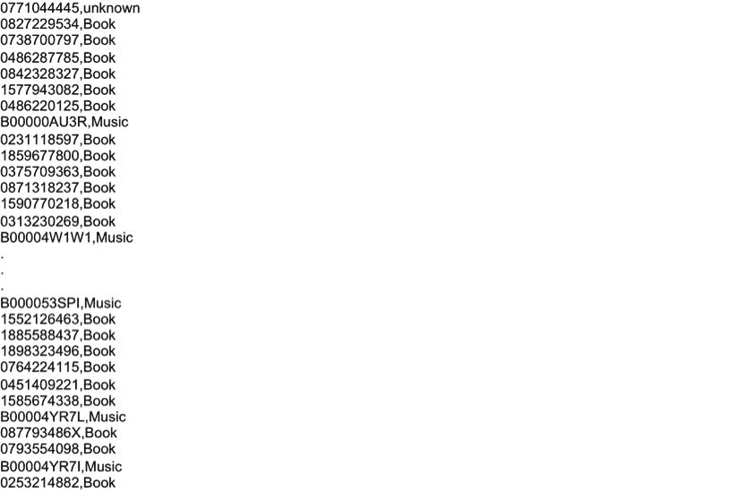

以下是来自输出文件中一个分区的样本内容，用于显示属于同一组的记录的第二个图：

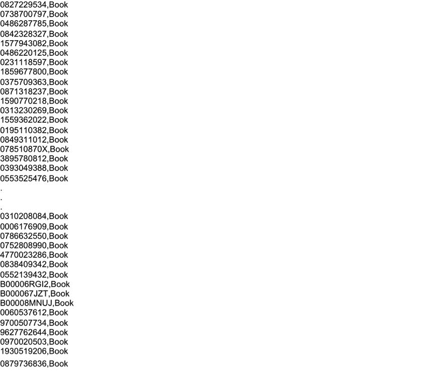

我们注意到我们的大部分记录都属于五个主要产品组，我们可能希望减少总分区数。我们使用 coalesce 操作来实现这一点，如下所示：

```scala
scala> val g2c = g2.vertices.coalesce(5)
scala> g2c.rdd.partitions.size
res90: Int = 5
```

# 摘要

在本章中，我们介绍了 GraphFrame 应用程序。我们提供了使用 Spark SQL DataFrame/Dataset API 构建图应用程序的示例。此外，我们还将各种图算法应用于图应用程序。

在下一章中，我们将把重点转移到使用 SparkR 的 Spark SQL。此外，我们还将探索使用 Spark SQL 和 SparkR 进行典型用例和数据可视化。
