# 第八章：使用 Spark SQL 与 SparkR

许多数据科学家使用 R 进行探索性数据分析、数据可视化、数据整理、数据处理和机器学习任务。SparkR 是一个 R 包，通过利用 Apache Spark 的分布式处理能力，使从业者能够处理数据。在本章中，我们将介绍 SparkR（一个 R 前端包），它利用 Spark 引擎进行大规模数据分析。我们还将描述 SparkR 设计和实现的关键要素。

更具体地，在本章中，您将学习以下主题：

+   什么是 SparkR？

+   理解 SparkR 架构

+   理解 SparkR 的 DataFrame

+   使用 SparkR 进行探索性数据分析（EDA）和数据整理任务

+   使用 SparkR 进行数据可视化

+   使用 SparkR 进行机器学习

# 介绍 SparkR

R 是一种用于统计计算和数据可视化的语言和环境。它是统计学家和数据科学家使用最广泛的工具之一。R 是开源的，提供了一个动态交互环境，具有丰富的包和强大的可视化功能。它是一种解释性语言，包括对数值计算的广泛支持，具有用于向量、矩阵、数组的数据类型，以及用于执行数值操作的库。

R 提供了对使用 DataFrame 进行结构化数据处理的支持。R 的 DataFrame 使数据操作更简单、更方便。然而，R 的动态设计限制了可能的优化程度。此外，交互式数据分析能力和整体可伸缩性也受到限制，因为 R 运行时是单线程的，只能处理适合单台机器内存的数据集。

有关 R 的更多详细信息，请参阅[R 项目网站](https://www.r-project.org/about.html)。

SparkR 解决了这些缺点，使数据科学家能够在分布式环境中处理大规模数据。SparkR 是一个 R 包，提供了一个轻量级的前端，让您可以从 R 中使用 Apache Spark。它结合了 Spark 的分布式处理功能、易于连接各种数据源的特性以及内存外数据结构，与 R 的动态环境、交互性、包和可视化功能。

传统上，数据科学家一直在使用 R 与其他框架，如 Hadoop MapReduce、Hive、Pig 等。然而，有了 SparkR，他们可以避免使用多个大数据工具和平台，以及在多种不同的语言中工作来实现他们的目标。SparkR 使他们可以在 R 中进行工作，并利用 Spark 的分布式计算模型。

SparkR 接口类似于 R 和 R 包，而不是我们迄今为止遇到的 Python/Scala/Java 接口。SparkR 实现了一个分布式 DataFrame，支持对大型数据集进行统计计算、列选择、SQL 执行、行过滤、执行聚合等操作。

SparkR 支持将本地 R DataFrame 转换为 SparkR。SparkR 与 Spark 项目的紧密集成使 SparkR 能够重用其他 Spark 模块，包括 Spark SQL、MLlib 等。此外，Spark SQL 数据源 API 使其能够从各种来源读取输入，如 HDFS、HBase、Cassandra，以及 CSV、JSON、Parquet、Avro 等文件格式。

在下一节中，我们将简要介绍 SparkR 架构。

# 理解 SparkR 架构

SparkR 的分布式 DataFrame 使编程语法对 R 用户来说非常熟悉。高级 DataFrame API 将 R API 与 Spark 中优化的 SQL 执行引擎集成在一起。

SparkR 的架构主要由两个组件组成：驱动程序上的 R 到 JVM 绑定，使 R 程序能够向 Spark 集群提交作业，并支持在 Spark 执行器上运行 R。

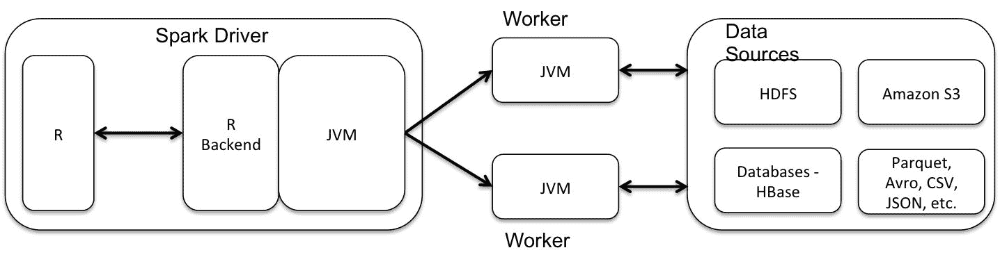

SparkR 的设计包括支持在 Spark 执行器机器上启动 R 进程。然而，序列化查询和在计算后反序列化结果会带来一些开销。随着在 R 和 JVM 之间传输的数据量增加，这些开销也会变得更加显著。然而，缓存可以实现在 SparkR 中高效的交互式查询处理。

有关 SparkR 设计和实现的详细描述，请参阅："SparkR: Scaling R Programs with Spark" by Shivaram Venkataraman1, Zongheng Yang, *et al,*，可在[`cs.stanford.edu/~matei/papers/2016/sigmod_sparkr.pdf`](https://cs.stanford.edu/~matei/papers/2016/sigmod_sparkr.pdf)上找到。

在下一节中，我们将介绍 SparkR 的分布式 DataFrame 组件 Spark DataFrames 的概述。

# 理解 SparkR DataFrames

SparkR 的主要组件是一个名为**SparkR DataFrames**的分布式 DataFrame。Spark DataFrame API 类似于本地 R DataFrames，但使用 Spark 的执行引擎和关系查询优化器扩展到大型数据集。它是一个分布式的数据集合，以列的形式组织，类似于关系数据库表或 R DataFrame。

Spark DataFrames 可以从许多不同的数据源创建，例如数据文件、数据库、R DataFrames 等。数据加载后，开发人员可以使用熟悉的 R 语法执行各种操作，如过滤、聚合和合并。SparkR 对 DataFrame 操作执行延迟评估。

此外，SparkR 支持对 DataFrames 进行许多函数操作，包括统计函数。我们还可以使用诸如 magrittr 之类的库来链接命令。开发人员可以使用 SQL 命令在 SparkR DataFrames 上执行 SQL 查询。最后，可以使用 collect 运算符将 SparkR DataFrames 转换为本地 R DataFrame。

在下一节中，我们将介绍在 EDA 和数据整理任务中使用的典型 SparkR 编程操作。

# 使用 SparkR 进行 EDA 和数据整理任务

在本节中，我们将使用 Spark SQL 和 SparkR 对我们的数据集进行初步探索。本章中的示例使用几个公开可用的数据集来说明操作，并且可以在 SparkR shell 中运行。

SparkR 的入口点是 SparkSession。它将 R 程序连接到 Spark 集群。如果您在 SparkR shell 中工作，SparkSession 已经为您创建。

此时，启动 SparkR shell，如下所示：

```scala
Aurobindos-MacBook-Pro-2:spark-2.2.0-bin-hadoop2.7 aurobindosarkar$./bin/SparkR
```

您可以在 SparkR shell 中安装所需的库，例如 ggplot2，如下所示：

```scala
> install.packages('ggplot2', dep = TRUE)
```

# 读取和写入 Spark DataFrames

SparkR 通过 Spark DataFrames 接口支持对各种数据源进行操作。SparkR 的 DataFrames 支持多种方法来读取输入，执行结构化数据分析，并将 DataFrames 写入分布式存储。

`read.df`方法可用于从各种数据源创建 Spark DataFrames。我们需要指定输入数据文件的路径和数据源的类型。数据源 API 原生支持格式，如 CSV、JSON 和 Parquet。

可以在 API 文档中找到完整的函数列表：[`spark.apache.org/docs/latest/api/R/`](http://spark.apache.org/docs/latest/api/R/)。对于初始的一组代码示例，我们将使用第三章中包含与葡萄牙银行机构的直接营销活动（电话营销）相关数据的数据集。

输入文件以**逗号分隔值**（**CSV**）格式呈现，包含标题，并且字段由分号分隔。输入文件可以是 Spark 的任何数据源；例如，如果是 JSON 或 Parquet 格式，则只需将源参数更改为`json`或`parquet`。

我们可以使用`read.df`加载输入的 CSV 文件来创建`SparkDataFrame`，如下所示：

```scala
> csvPath <- "file:///Users/aurobindosarkar/Downloads/bank-additional/bank-additional-full.csv"

> df <- read.df(csvPath, "csv", header = "true", inferSchema = "true", na.strings = "NA", delimiter= ";")
```

类似地，我们可以使用`write.df`将 DataFrame 写入分布式存储。我们在 source 参数中指定输出 DataFrame 名称和格式（与`read.df`函数中一样）。

数据源 API 可用于将 Spark DataFrames 保存为多种不同的文件格式。例如，我们可以使用`write.df`将上一步创建的 Spark DataFrame 保存为 Parquet 文件：

```scala
write.df(df, path = "hdfs://localhost:9000/Users/aurobindosarkar/Downloads/df.parquet", source = "parquet", mode = "overwrite")
```

`read.df`和`write.df`函数用于将数据从存储传输到工作节点，并将数据从工作节点写入存储，分别。它不会将这些数据带入 R 进程。

# 探索 Spark DataFrames 的结构和内容

在本节中，我们探索了 Spark DataFrames 中包含的维度、模式和数据。

首先，使用 cache 或 persist 函数对 Spark DataFrame 进行性能缓存。我们还可以指定存储级别选项，例如`DISK_ONLY`、`MEMORY_ONLY`、`MEMORY_AND_DISK`等，如下所示：

```scala
> persist(df, "MEMORY_ONLY")
```

我们可以通过输入 DataFrame 的名称列出 Spark DataFrames 的列和关联的数据类型，如下所示：

```scala
> df
```

Spark DataFrames[age:`int`, job:`string`, marital:`string`, education:`string`, default:`string`, housing:`string`, loan:`string`, contact:`string`, month:`string`, day_of_week:`string`, duration:`int`, campaign:`int`, pdays:`int`, previous:`int`, poutcome:`string`, emp.var.rate:`double`, cons.price.idx:`double`, cons.conf.idx:double, euribor3m:`double`, nr.employed:`double`, y:`string`]

SparkR 可以自动从输入文件的标题行推断模式。我们可以打印 DataFrame 模式，如下所示：

```scala
> printSchema(df)
```

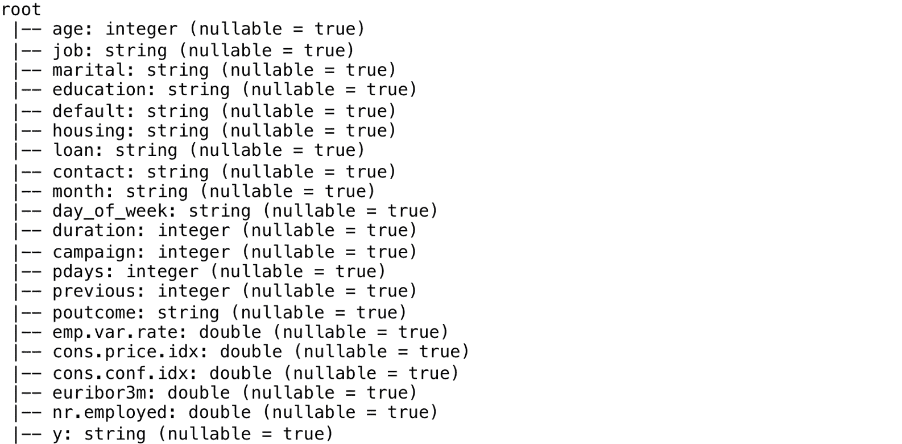

我们还可以使用`names`函数显示 DataFrame 中列的名称，如下所示：

```scala
> names(df)
```

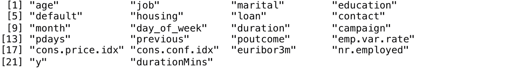

接下来，我们显示 Spark DataFrame 中的一些样本值（从每个列中）和记录，如下所示：

```scala
> str(df)
```

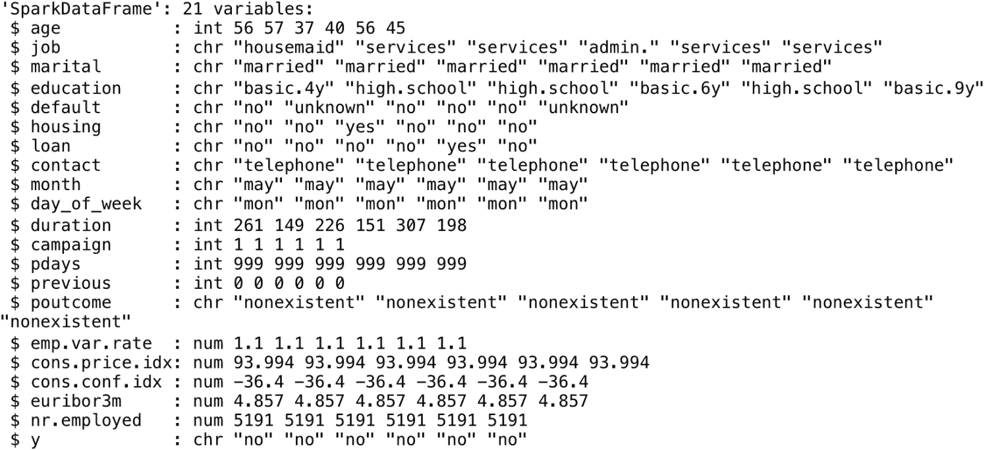

```scala
> head(df, 2)
```

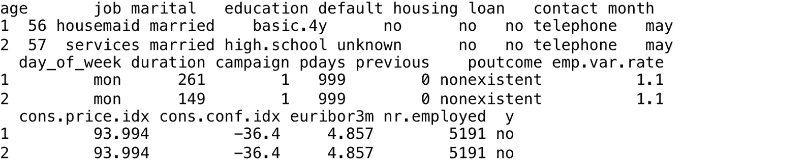

我们可以显示 DataFrame 的维度，如下所示。在使用`MEMORY_ONLY`选项的 cache 或 persist 函数后执行 dim 是确保 DataFrame 加载并保留在内存中以进行更快操作的好方法：

```scala
> dim(df)
[1] 41188 21
```

我们还可以使用 count 或`nrow`函数计算 DataFrame 中的行数：

```scala
> count(df)
[1] 41188

> nrow(df)
[1] 41188
```

此外，我们可以使用`distinct`函数获取指定列中包含的不同值的数量：

```scala
> count(distinct(select(df, df$age)))
[1] 78
```

# 在 Spark DataFrames 上运行基本操作

在这一部分，我们使用 SparkR 在 Spark DataFrames 上执行一些基本操作，包括聚合、拆分和抽样。例如，我们可以从 DataFrame 中选择感兴趣的列。在这里，我们只选择 DataFrame 中的`education`列：

```scala
> head(select(df, df$education))
education
1 basic.4y
2 high.school
3 high.school
4 basic.6y
5 high.school
6 basic.9y
```

或者，我们也可以指定列名，如下所示：

```scala
> head(select(df, "education"))
```

我们可以使用 subset 函数选择满足某些条件的行，例如，`marital`状态为`married`的行，如下所示：

```scala
> subsetMarried <- subset(df, df$marital == "married")

> head(subsetMarried, 2)
```


我们可以使用 filter 函数仅保留`education`水平为`basic.4y`的行，如下所示：

```scala
> head(filter(df, df$education == "basic.4y"), 2)
```

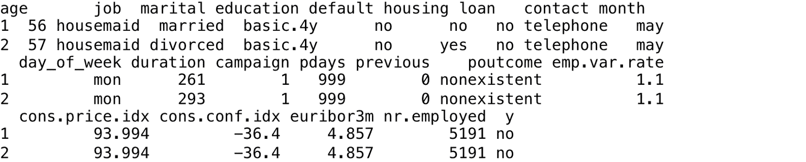

SparkR DataFrames 支持在分组后对数据进行一些常见的聚合。例如，我们可以计算数据集中`marital`状态值的直方图，如下所示。在这里，我们使用`n`运算符来计算每个婚姻状态出现的次数：

```scala
> maritaldf <- agg(groupBy(df, df$marital), count = n(df$marital))
```

```scala
> head(maritaldf)
marital count
1 unknown 80
2 divorced 4612
3 married 24928
4 single 11568
```

我们还可以对聚合的输出进行排序，以获取最常见的婚姻状态集，如下所示：

```scala
> maritalCounts <- summarize(groupBy(df, df$marital), count = n(df$marital))

> nMarriedCategories <- count(maritalCounts)

> head(arrange(maritalCounts, desc(maritalCounts$count)), num = nMarriedCategories)
marital count
1 married 24928
2 single 11568
3 divorced 4612
4 unknown 80
```

接下来，我们使用`magrittr`包来进行函数的管道处理，而不是嵌套它们，如下所示。

首先，使用`install.packages`命令安装`magrittr`包，如果该包尚未安装：

```scala
> install.packages("magrittr")
```

请注意，在 R 中加载和附加新包时，可能会出现名称冲突，其中一个函数掩盖了另一个函数。根据两个包的加载顺序，先加载的包中的一些函数会被后加载的包中的函数掩盖。在这种情况下，我们需要使用包名作为前缀来调用这些函数：

```scala
> library(magrittr)
```

我们在下面的示例中使用 `filter`、`groupBy` 和 `summarize` 函数进行流水线处理：

```scala
> educationdf <- filter(df, df$education == "basic.4y") %>% groupBy(df$marital) %>% summarize(count = n(df$marital))

> head(educationdf)
```

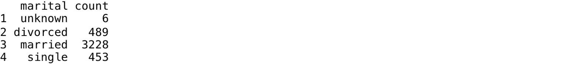

接下来，我们从迄今为止使用的分布式 Spark 版本创建一个本地 DataFrame。我们使用 `collect` 函数将 Spark DataFrame 移动到 Spark 驱动程序上的本地/R DataFrame，如所示。通常，在将数据移动到本地 DataFrame 之前，您会对数据进行汇总或取样：

```scala
> collect(summarize(df,avg_age = mean(df$age)))
avg_age
1 40.02406
```

我们可以从我们的 DataFrame 创建一个 `sample` 并将其移动到本地 DataFrame，如下所示。在这里，我们取输入记录的 10% 并从中创建一个本地 DataFrame：

```scala
> ls1df <- collect(sample(df, FALSE, 0.1, 11L))
> nrow(df)
[1] 41188
> nrow(ls1df)
[1] 4157
```

SparkR 还提供了许多可以直接应用于数据处理和聚合的列的函数。

例如，我们可以向我们的 DataFrame 添加一个新列，该列包含从秒转换为分钟的通话持续时间，如下所示：

```scala
> df$durationMins <- round(df$duration / 60)

> head(df, 2)
```

以下是获得的输出：

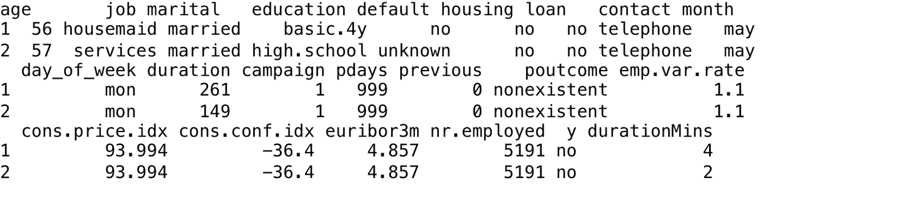

# 在 Spark DataFrames 上执行 SQL 语句

Spark DataFrames 也可以在 Spark SQL 中注册为临时视图，这允许我们在其数据上运行 SQL 查询。`sql` 函数使应用程序能够以编程方式运行 SQL 查询，并将结果作为 Spark DataFrame 返回。

首先，我们将 Spark DataFrame 注册为临时视图：

```scala
> createOrReplaceTempView(df, "customer")
```

接下来，我们使用 `sql` 函数执行 SQL 语句。例如，我们选择年龄在 13 到 19 岁之间的客户的 `education`、`age`、`marital`、`housing` 和 `loan` 列，如下所示：

```scala
> sqldf <- sql("SELECT education, age, marital, housing, loan FROM customer WHERE age >= 13 AND age <= 19")

> head(sqldf)
```

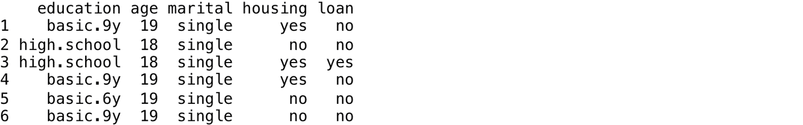

# 合并 SparkR DataFrames

我们可以明确指定 SparkR 应该使用操作参数 `by` 和 `by.x`/`by.y` 在哪些列上合并 DataFrames。合并操作根据值 `all.x` 和 `all.y` 确定 SparkR 应该如何基于 `x` 和 `y` 的行来合并 DataFrames。例如，我们可以通过明确指定 `all.x = FALSE`，`all.y = FALSE` 来指定一个 `inner join`（默认），或者通过 `all.x = TRUE`，`all.y = FALSE` 来指定一个左 `outer join`。

有关 join 和 merge 操作的更多详细信息，请参阅 [`github.com/UrbanInstitute/sparkr-tutorials/blob/master/merging.md.`](https://github.com/UrbanInstitute/sparkr-tutorials/blob/master/merging.md)

或者，我们也可以使用 `join` 操作按行合并 DataFrames。

在下面的示例中，我们使用位于 [`archive.ics.uci.edu/ml/Datasets/Communities+and+Crime+Unnormalized`](https://archive.ics.uci.edu/ml/datasets/Communities+and+Crime+Unnormalized) 的犯罪数据集。

与之前一样，我们读取输入数据集，如下所示：

```scala
> library(magrittr)
> csvPath <- "file:///Users/aurobindosarkar/Downloads/CommViolPredUnnormalizedData.csv"
> df <- read.df(csvPath, "csv", header = "false", inferSchema = "false", na.strings = "NA", delimiter= ",")
```

接下来，我们选择与犯罪类型相关的特定列，并将默认列名重命名为更有意义的名称，如下所示：

```scala
> crimesStatesSubset = subset(df, select = c(1,2, 130, 132, 134, 136, 138, 140, 142, 144))
```

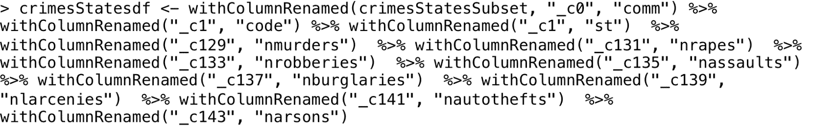

```scala
> head(crimesStatesdf, 2)
```

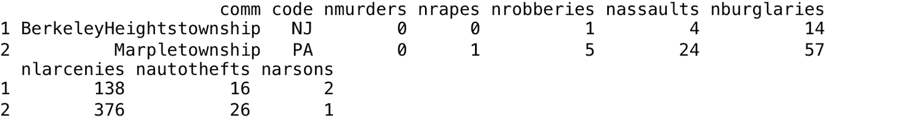

接下来，我们读取包含美国州名的数据集，如下所示：

```scala
> state_names <- read.df("file:///Users/aurobindosarkar/downloads/csv_hus/states.csv", "csv", header = "true", inferSchema = "true", na.strings = "NA", delimiter= ",")
```

我们使用 names 函数列出了两个 DataFrames 的列。两个 DataFrames 之间的共同列是 "code" 列（包含州代码）：

```scala
> names(crimesStatesdf)
[1] "comm" "code" "nmurders" "nrapes" "nrobberies"
[6] "nassaults" "nburglaries" "nlarcenies" "nautothefts" "narsons"

> names(state_names)
[1] "st" "name" "code"
```

接下来，我们使用共同列执行内部连接：

```scala
> m1df <- merge(crimesStatesdf, state_names)
> head(m1df, 2)
```

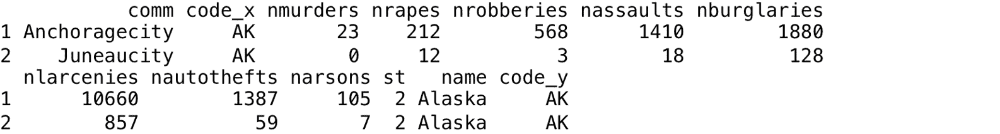

在这里，我们根据明确指定的表达式执行内部连接：

```scala
> m2df <- merge(crimesStatesdf, state_names, by = "code")
> head(m2df, 2)
```

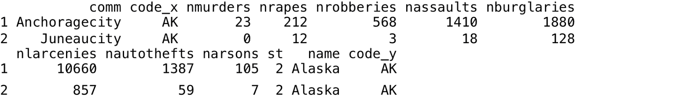

在下面的示例中，我们使用位于 [`archive.ics.uci.edu/ml/Datasets/Tennis+Major+Tournament+Match+Statistics.`](http://archive.ics.uci.edu/ml/datasets/Tennis+Major+Tournament+Match+Statistics) 的网球锦标赛比赛统计数据集。

以下是获得的输出：

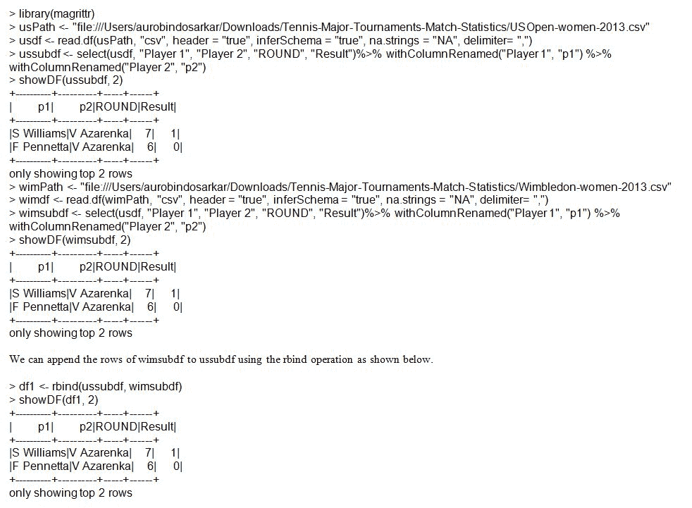

# 使用用户定义函数（UDFs）

在 SparkR 中，支持多种类型的**用户定义函数**（**UDFs**）。例如，我们可以使用 `dapply` 或 `dapplyCollect` 在大型数据集上运行给定的函数。`dapply` 函数将函数应用于 Spark DataFrame 的每个分区。函数的输出应该是一个 data.frame。

模式指定了生成的 Spark DataFrame 的行格式：

```scala
> df1 <- select(df, df$duration)

> schema <- structType(structField("duration", "integer"),
+ structField("durMins", "double"))

> df2 <- dapply(df1, function(x) { x <- cbind(x, x$duration / 60) }, schema)
> head(collect(df2))
```

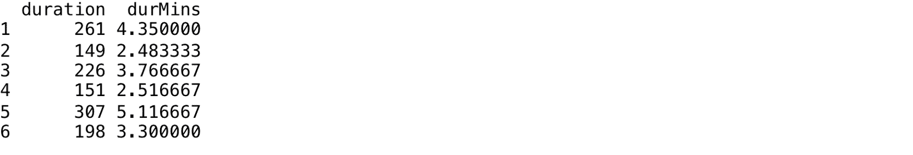

类似于 dapply，`dapplyCollect`函数将函数应用于 Spark DataFrames 的每个分区，并收集结果。函数的输出应为`data.frame`，不需要 schema 参数。请注意，如果 UDF 的输出无法传输到驱动程序或适合驱动程序的内存中，则`dapplyCollect`可能会失败。

我们可以使用`gapply`或`gapplyCollect`来对大型数据集进行分组运行给定函数。在下面的示例中，我们确定一组顶部持续时间值：

```scala
> df1 <- select(df, df$duration, df$age)

> schema <- structType(structField("age", "integer"), structField("maxDuration", "integer"))

> result <- gapply(
+ df1,
+ "age",
+ function(key, x) {
+ y <- data.frame(key, max(x$duration))
+ },
+ schema)
> head(collect(arrange(result, "maxDuration", decreasing = TRUE)))
```

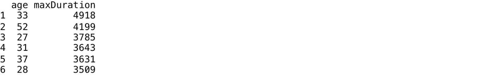

`gapplyCollect`类似地将一个函数应用于 Spark DataFrames 的每个分区，但也将结果收集回到`R data.frame`中。

在下一节中，我们介绍 SparkR 函数来计算示例数据集的摘要统计信息。

# 使用 SparkR 计算摘要统计信息

描述（或摘要）操作创建一个新的 DataFrame，其中包含指定 DataFrame 或数值列列表的计数、平均值、最大值、平均值和标准偏差值：

```scala
> sumstatsdf <- describe(df, "duration", "campaign", "previous", "age")

> showDF(sumstatsdf)
```

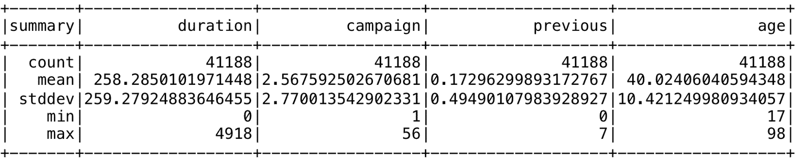

在大型数据集上计算这些值可能会非常昂贵。因此，我们在这里呈现这些统计量的单独计算：

```scala
> avgagedf <- agg(df, mean = mean(df$age))

> showDF(avgagedf) # Print this DF
+-----------------+
| mean            |
+-----------------+
|40.02406040594348|
+-----------------+
```

接下来，我们创建一个列出最小值和最大值以及范围宽度的 DataFrame：

```scala
> agerangedf <- agg(df, minimum = min(df$age), maximum = max(df$age), range_width = abs(max(df$age) - min(df$age)))

> showDF(agerangedf)
```

接下来，我们计算样本方差和标准偏差，如下所示：

```scala
> agevardf <- agg(df, variance = var(df$age))

> showDF(agevardf)
+------------------+
| variance         |
+------------------+
|108.60245116511807|
+------------------+

> agesddf <- agg(df, std_dev = sd(df$age))

> showDF(agesddf)
+------------------+
| std_dev          |
+------------------+
|10.421249980934057|
+------------------+
```

操作`approxQuantile`返回 DataFrame 列的近似分位数。我们使用概率参数和`relativeError`参数来指定要近似的分位数。我们定义一个新的 DataFrame，`df1`，删除`age`的缺失值，然后计算近似的`Q1`、`Q2`和`Q3`值，如下所示：

```scala
> df1 <- dropna(df, cols = "age")

> quartilesdf <- approxQuantile(x = df1, col = "age", probabilities = c(0.25, 0.5, 0.75), relativeError = 0.001)

> quartilesdf
[[1]]
[1] 32
[[2]]
[1] 38
[[3]]
[1] 47
```

我们可以使用`skewness`操作来测量列分布的偏斜程度和方向。在下面的示例中，我们测量`age`列的偏斜度：

```scala
> ageskdf <- agg(df, skewness = skewness(df$age))

> showDF(ageskdf)
+------------------+
| skewness         |
+------------------+
|0.7846682380932389|
+------------------+
```

同样，我们可以测量列的峰度。在这里，我们测量`age`列的峰度：

```scala
> agekrdf <- agg(df, kurtosis = kurtosis(df$age))

> showDF(agekrdf)
+------------------+
| kurtosis         |
+------------------+
|0.7910698035274022|
+------------------+
```

接下来，我们计算两个 DataFrame 列之间的样本协方差和相关性。在这里，我们计算`age`和`duration`列之间的协方差和相关性：

```scala
> covagedurdf <- cov(df, "age", "duration")

> corragedurdf <- corr(df, "age", "duration", method = "pearson")

> covagedurdf
[1] -2.339147

> corragedurdf
[1] -0.000865705
```

接下来，我们为工作列创建一个相对频率表。每个不同的工作类别值的相对频率显示在百分比列中：

```scala
> n <- nrow(df)

> jobrelfreqdf <- agg(groupBy(df, df$job), Count = n(df$job), Percentage = n(df$job) * (100/n))

> showDF(jobrelfreqdf)
```

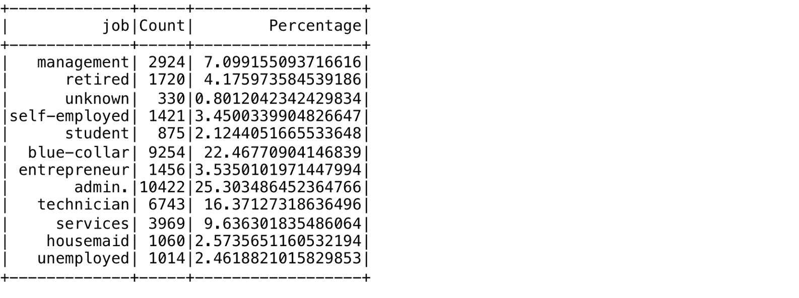

最后，我们使用`crosstab`操作在两个分类列之间创建一个列联表。在下面的示例中，我们为工作和婚姻列创建一个列联表：

```scala
> contabdf <- crosstab(df, "job", "marital")

> contabdf
```

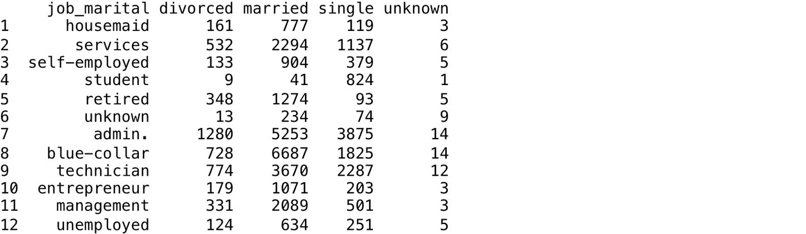

在下一节中，我们使用 SparkR 执行各种数据可视化任务。

# 使用 SparkR 进行数据可视化

ggplot2 包的 SparkR 扩展`ggplot2.SparkR`允许 SparkR 用户构建强大的可视化。

在本节中，我们使用各种图表来可视化我们的数据。此外，我们还展示了在地图上绘制数据和可视化图表的示例：

```scala
> csvPath <- "file:///Users/aurobindosarkar/Downloads/bank-additional/bank-additional-full.csv"

> df <- read.df(csvPath, "csv", header = "true", inferSchema = "true", na.strings = "NA", delimiter= ";")

> persist(df, "MEMORY_ONLY")

> require(ggplot2)
```

请参考 ggplot 网站，了解如何改进每个图表的显示的不同选项，网址为[`docs.ggplot2.org`](http://docs.ggplot2.org)。

在下一步中，我们绘制一个基本的条形图，显示数据中不同婚姻状态的频率计数：

```scala
> ldf <- collect(select(df, df$age, df$duration, df$education, df$marital, df$job))

> g1 <- ggplot(ldf, aes(x = marital))

> g1 + geom_bar()
```

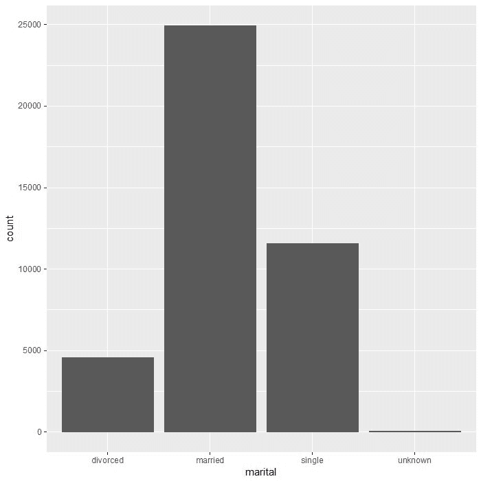

在下面的示例中，我们为年龄列绘制了一个直方图，并绘制了教育、婚姻状况和工作值的频率计数的几个条形图：

```scala
> library(MASS)

> par(mfrow=c(2,2))

> truehist(ldf$"age", h = 5, col="slategray3", xlab="Age Groups(5 years)")

> barplot((table(ldf$education)), names.arg=c("1", "2", "3", "4", "5", "6", "7", "8"), col=c("slateblue", "slateblue2", "slateblue3", "slateblue4", "slategray", "slategray2", "slategray3", "slategray4"), main="Education")

> barplot((table(ldf$marital)), names.arg=c("Divorce", "Married", "Single", "Unknown"), col=c("slategray", "slategray1", "slategray2", "slategray3"), main="Marital Status")

> barplot((table(ldf$job)), , names.arg=c("1", "2", "3", "4", "5", "6", "7", "8", "9", "a", "b", "c"), main="Job")
```

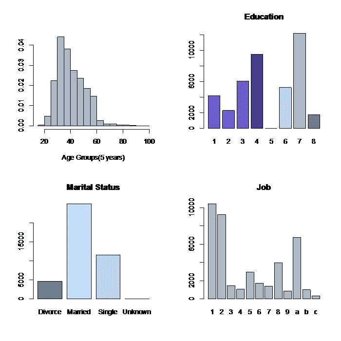

以下表达式创建了一个条形图，描述了按婚姻类型分组的教育水平的比例频率：

```scala
> g2 <- ggplot(ldf, aes(x = marital, fill = education))

> g2 + geom_bar(position = "fill")
```

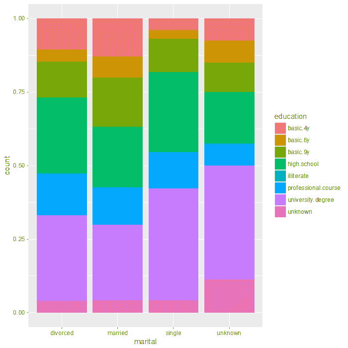

以下表达式绘制了一个直方图，显示了数据中分箱的年龄值的频率计数：

```scala
> g3 <- ggplot(ldf, aes(age))

> g3 + geom_histogram(binwidth=5)
```

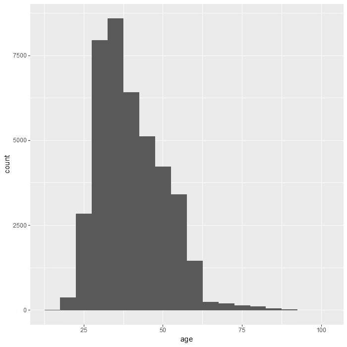

以下表达式返回了一个与先前绘制的直方图相当的频率多边形：

```scala
> g3 + geom_freqpoly(binwidth=5)
```

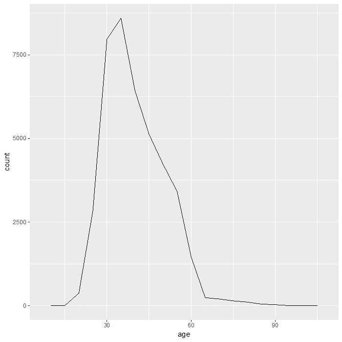

以下表达式给出了一个箱线图，描述了不同婚姻状态下通话持续时间值的比例频率：

```scala
> g4 <- ggplot(ldf, aes(x = marital, y = duration))

> g4 + geom_boxplot()
```

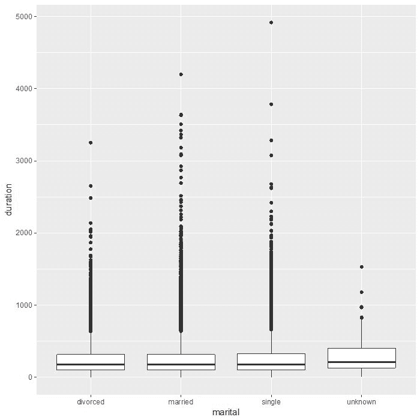

以下表达式在不同教育水平上展示了年龄直方图：

```scala
> g3 + geom_histogram() + facet_wrap(~education)
```

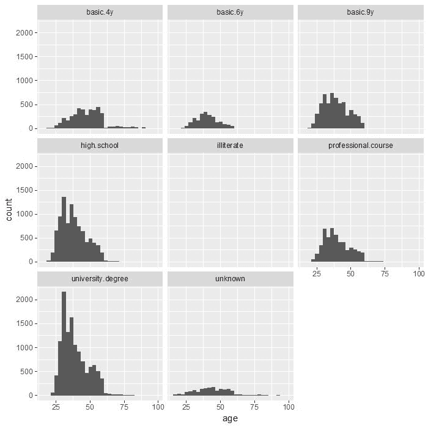

在下面的例子中，我们同时展示了不同列的几个箱线图：

```scala
> par(mfrow=c(1,2))

> boxplot(ldf$age, col="slategray2", pch=19, main="Age")

> boxplot(ldf$duration, col="slategray2", pch=19, main="Duration")
```

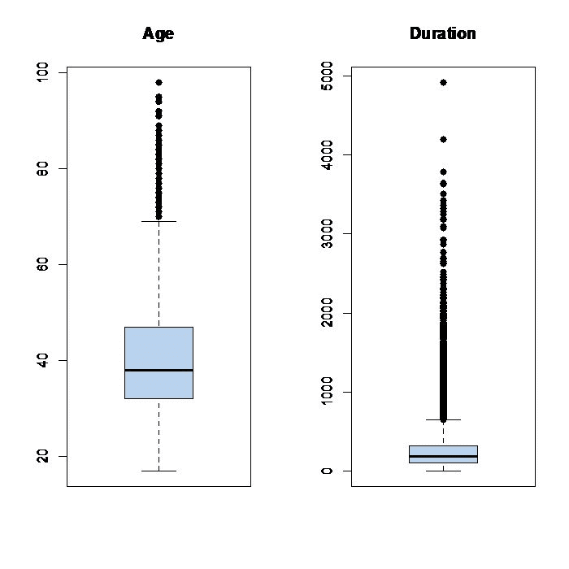

在构建 SparkR 中的表达式或函数时，我们应该避免计算昂贵的操作。例如，即使在 SparkR 中 collect 操作允许我们利用 ggplot2 的特性，我们也应该尽量节约地收集数据，因为我们需要确保操作结果适合单个节点的可用内存。

以下散点图的问题是过度绘制。点被绘制在彼此之上，扭曲了图形的视觉效果。我们可以调整 alpha 参数的值来使用透明点：

```scala
> ggplot(ldf, aes(age, duration)) + geom_point(alpha = 0.3) + stat_smooth()I
```

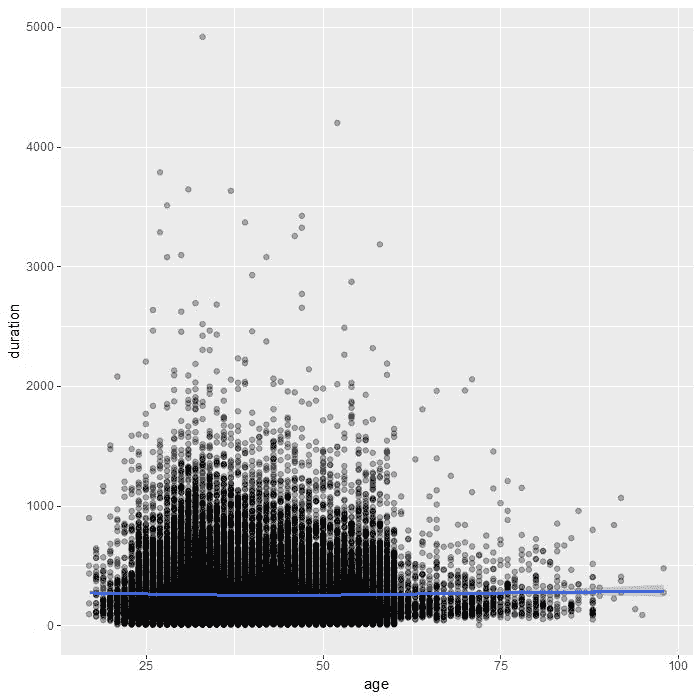

要将面板显示为二维面板集或将面板包装成多行，我们使用`facet_wrap`：

```scala
> ageAndDurationValuesByMarital <- ggplot(ldf, aes(age, duration)) + geom_point(alpha = "0.2") + facet_wrap(~marital)

> ageAndDurationValuesByMarital
```

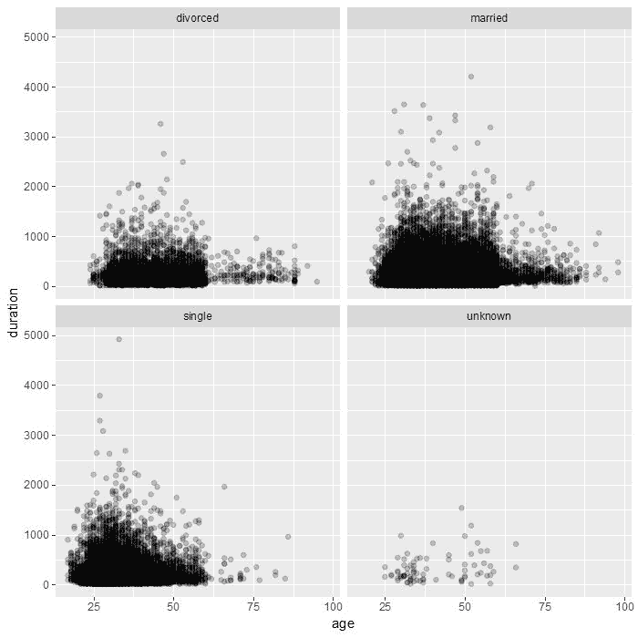

调整后的 alpha 值改善了散点图的可视化效果；然而，我们可以将点总结为平均值并绘制它们，以获得更清晰的可视化效果，如下例所示：

```scala
> createOrReplaceTempView(df, "customer")

> localAvgDurationEducationAgeDF <- collect(sql("select education, avg(age) as avgAge, avg(duration) as avgDuration from customer group by education"))

> avgAgeAndDurationValuesByEducation <- ggplot(localAvgDurationEducationAgeDF, aes(group=education, x=avgAge, y=avgDuration)) + geom_point() + geom_text(data=localAvgDurationEducationAgeDF, mapping=aes(x=avgAge, y=avgDuration, label=education), size=2, vjust=2, hjust=0.75)

> avgAgeAndDurationValuesByEducation
```

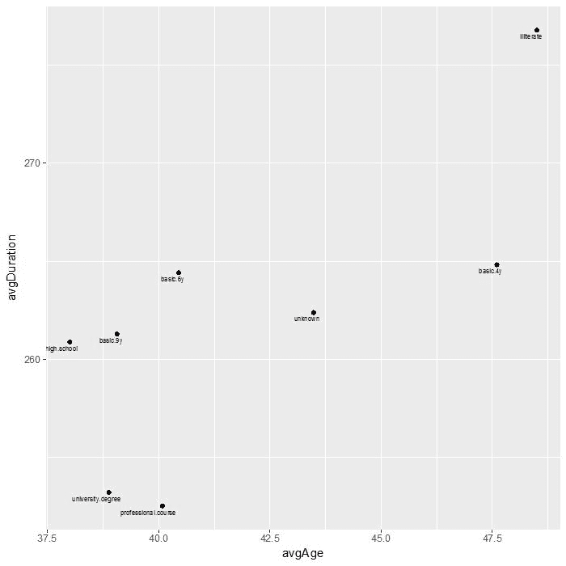

在下一个例子中，我们创建了一个密度图，并叠加了通过平均值的线。密度图是查看变量分布的好方法；例如，在我们的例子中，我们绘制了通话持续时间的值：

```scala
> plot(density(ldf$duration), main = "Density Plot", xlab = "Duration", yaxt = 'n')

> abline(v = mean(ldf$duration), col = 'green', lwd = 2)

> legend('topright', legend = c("Actual Data", "Mean"), fill = c('black', 'green'))
```

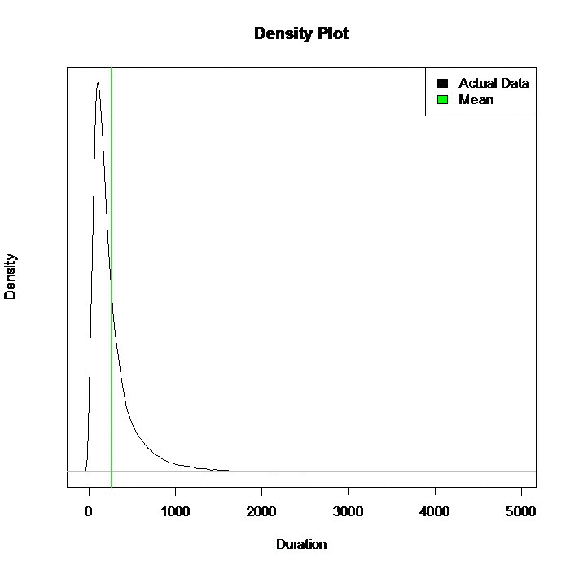

在下一节中，我们将展示一个在地图上绘制值的例子。

# 在地图上可视化数据

在本节中，我们将描述如何合并两个数据集并在地图上绘制结果：

```scala
> csvPath <- "file:///Users/aurobindosarkar/Downloads/CommViolPredUnnormalizedData.csv"

> df <- read.df(csvPath, "csv", header = "false", inferSchema = "false", na.strings = "NA", delimiter= ",")

> persist(df, "MEMORY_ONLY")

> xdf = select(df, "_c1","_c143")

> newDF <- withColumnRenamed(xdf, "_c1", "state")

> arsonsstatesdf <- withColumnRenamed(newDF, "_c143", "narsons")
```

我们要可视化的数据集是按州计算的平均纵火次数，如下所示：

```scala
> avgArsons <- collect(agg(groupBy(arsonsstatesdf, "state"), AVG_ARSONS=avg(arsonsstatesdf$narsons)))
```

接下来，我们将`states.csv`数据集读入 R DataFrame：

```scala
> state_names <- read.csv("file:///Users/aurobindosarkar/downloads/csv_hus/states.csv")
```

接下来，我们使用`factor`变量将州代码替换为州名：

```scala
> avgArsons$region <- factor(avgArsons$state, levels=state_names$code, labels=tolower(state_names$name))
```

要创建一个美国地图，根据每个州的平均纵火次数着色，我们可以使用`ggplot2`的`map_data`函数：

```scala
> states_map <- map_data("state")
```

最后，我们将数据集与地图合并，并使用`ggplot`显示地图，如下所示：

```scala
> merged_data <- merge(states_map, avgArsons, by="region")

> ggplot(merged_data, aes(x = long, y = lat, group = group, fill = AVG_ARSONS)) + geom_polygon(color = "white") + theme_bw()
```

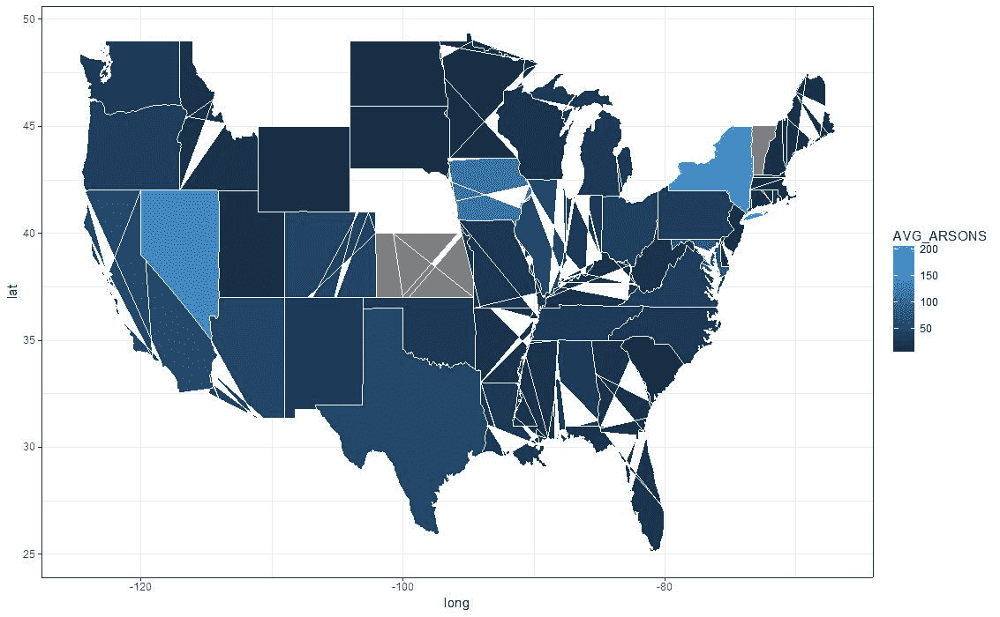

有关在地理地图上绘图的更多信息，请参阅 Jose A. Dianes 的*使用 SparkR 和 ggplot2 探索地理数据* [`www.codementor.io/spark/tutorial/exploratory-geographical-data-using-sparkr-and-ggplot2`](https://www.codementor.io/spark/tutorial/exploratory-geographical-data-using-sparkr-and-ggplot2)。

在下一节中，我们将展示一个图形可视化的例子。

# 可视化图形节点和边缘

可视化图形对于了解整体结构特性非常重要。在本节中，我们将在 SparkR shell 中绘制几个图形。

有关更多详情，请参阅 Katherine Ognynova 的*使用 R 进行静态和动态网络可视化* [`kateto.net/network-visualization`](http://kateto.net/network-visualization)。

在下面的例子中，我们使用一个包含在 stack exchange 网站 Ask Ubuntu 上的交互网络的数据集：[`snap.stanford.edu/data/sx-askubuntu.html`](https://snap.stanford.edu/data/sx-askubuntu.html)。

我们从数据的百分之十的样本中创建一个本地 DataFrame，并创建一个图形的绘制，如下所示：

```scala
> library(igraph)

> library(magrittr)

> inDF <- read.df("file:///Users/aurobindosarkar/Downloads/sx-askubuntu.txt", "csv", header="false", delimiter=" ")

> linksDF <- subset(inDF, select = c(1, 2)) %>% withColumnRenamed("_c0", "src") %>% withColumnRenamed("_c1", "dst")

> llinksDF <- collect(sample(linksDF, FALSE, 0.01, 1L))

> g1 <- graph_from_data_frame(llinksDF, directed = TRUE, vertices = NULL)

> plot(g1, edge.arrow.size=.001, vertex.label=NA, vertex.size=0.1)
```

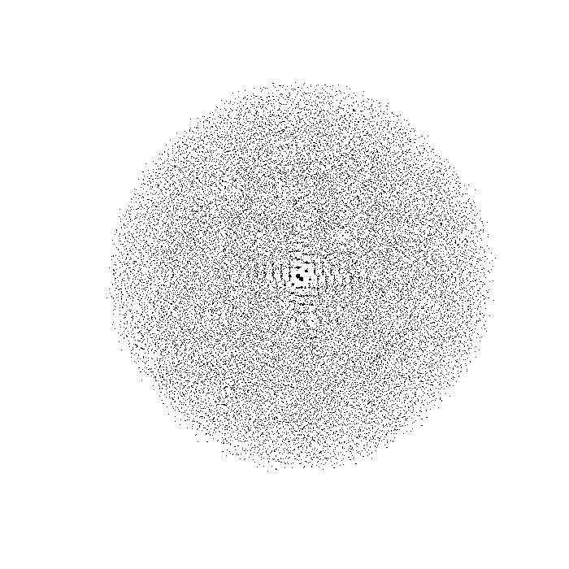

通过进一步减少样本量并移除某些边缘，例如循环，我们可以在这个例子中获得更清晰的可视化效果，如下所示：

```scala
> inDF <- read.df("file:///Users/aurobindosarkar/Downloads/sx-askubuntu.txt", "csv", header="false", delimiter=" ")

> linksDF <- subset(inDF, select = c(1, 2)) %>% withColumnRenamed("_c0", "src") %>% withColumnRenamed("_c1", "dst")

> llinksDF <- collect(sample(linksDF, FALSE, 0.0005, 1L))

> g1 <- graph_from_data_frame(llinksDF, directed = FALSE)

> g1 <- simplify(g1, remove.multiple = F, remove.loops = T)

> plot(g1, edge.color="black", vertex.color="red", vertex.label=NA, vertex.size=2)
```

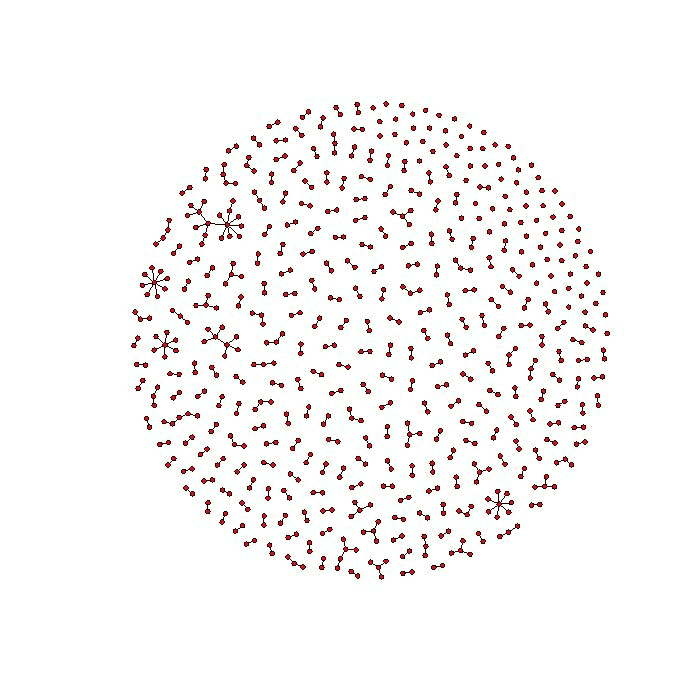

在接下来的部分中，我们将探讨如何使用 SparkR 进行机器学习任务。

# 使用 SparkR 进行机器学习

SparkR 支持越来越多的机器学习算法，例如**广义线性模型**（**glm**），朴素贝叶斯模型，K 均值模型，逻辑回归模型，**潜在狄利克雷分配**（**LDA**）模型，多层感知分类模型，用于回归和分类的梯度提升树模型，用于回归和分类的随机森林模型，**交替最小二乘**（**ALS**）矩阵分解模型等等。

SparkR 使用 Spark MLlib 来训练模型。摘要和 predict 函数分别用于打印拟合模型的摘要和对新数据进行预测。`write.ml`/`read.ml`操作可用于保存/加载拟合的模型。SparkR 还支持一些可用的 R 公式运算符，如`~`、`.`、`:`、`+`和`-`。

在接下来的示例中，我们使用[`archive.ics.uci.edu/ml/Datasets/Wine+Quality`](https://archive.ics.uci.edu/ml/datasets/Wine+Quality)上可用的葡萄酒质量数据集：

```scala
> library(magrittr)

> csvPath <- "file:///Users/aurobindosarkar/Downloads/winequality/winequality-white.csv"
```

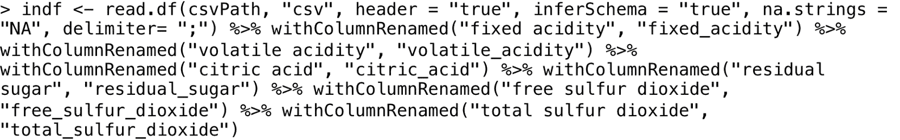

```scala
> winedf <- mutate(indf, label = ifelse(indf$quality >= 6, 1, 0))

> winedf <- drop(winedf, "quality")

> seed <- 12345
```

我们使用 sample 函数创建训练和测试 DataFrames，如下所示：

```scala
> trainingdf <- sample(winedf, withReplacement=FALSE, fraction=0.9, seed=seed)

> testdf <- except(winedf, trainingdf)
```

接下来，我们对 SparkDataFrame 拟合逻辑回归模型，如下所示：

```scala
> model <- spark.logit(trainingdf, label ~ ., maxIter = 10, regParam = 0.1, elasticNetParam = 0.8)
```

接下来，我们使用 summary 函数打印拟合模型的摘要：

```scala
> summary(model)
```

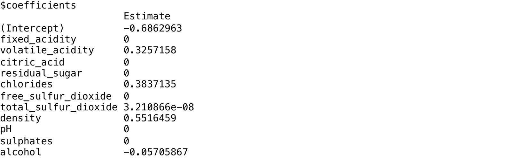

接下来，我们使用 predict 函数对测试 DataFrame 进行预测：

```scala
> predictions <- predict(model, testdf)

> showDF(select(predictions, "label", "rawPrediction", "probability", "prediction"), 5)
```

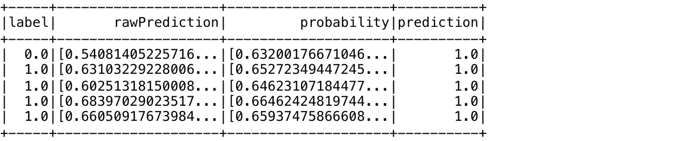

仅显示前 5 行

接下来，我们计算标签和预测值之间的不匹配数量：

```scala
> nrow(filter(predictions, predictions$label != predictions$prediction))
[1] 111
```

在下面的示例中，我们在 Spark DataFrames 上拟合了一个随机森林分类模型。然后我们使用`summary`函数获取拟合的随机森林模型的摘要和`predict`函数对测试数据进行预测，如下所示：

```scala
> model <- spark.randomForest(trainingdf, label ~ ., type="classification", maxDepth = 5, numTrees = 10)

> summary(model)
```

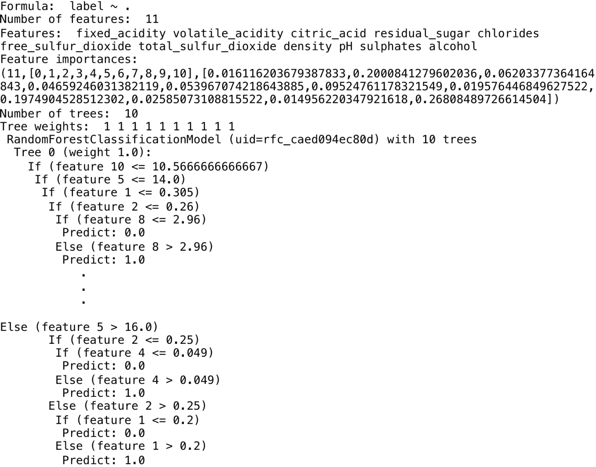

```scala
> predictions <- predict(model, testdf)

> showDF(select(predictions, "label", "rawPrediction", "probability", "prediction"), 5)
```

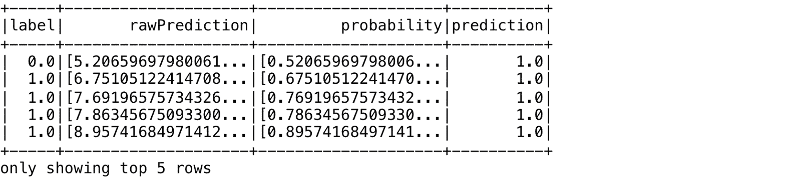

```scala
> nrow(filter(predictions, predictions$label != predictions$prediction))
[1] 79
```

与之前的示例类似，我们在以下示例中拟合广义线性模型：

```scala
> csvPath <- "file:///Users/aurobindosarkar/Downloads/winequality/winequality-white.csv"
```


```scala
> trainingdf <- sample(indf, withReplacement=FALSE, fraction=0.9, seed=seed)

> testdf <- except(indf, trainingdf)

> model <- spark.glm(indf, quality ~ ., family = gaussian, tol = 1e-06, maxIter = 25, weightCol = NULL, regParam = 0.1)

> summary(model)
```

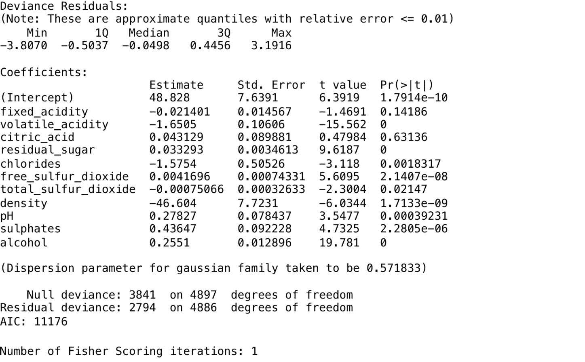

```scala
> predictions <- predict(model, testdf)

> showDF(select(predictions, "quality", "prediction"), 5)
```

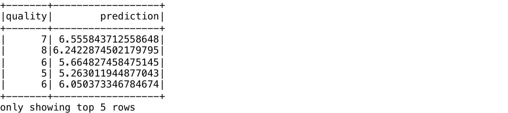

接下来，我们将介绍一个聚类的例子，我们将针对 Spark DataFrames 拟合一个多变量高斯混合模型：

```scala
> winedf <- mutate(indf, label = ifelse(indf$quality >= 6, 1, 0))

> winedf <- drop(winedf, "quality")

> trainingdf <- sample(winedf, withReplacement=FALSE, fraction=0.9, seed=seed)

> testdf <- except(winedf, trainingdf)

> testdf <- except(winedf, trainingdf)

> model <- spark.gaussianMixture(trainingdf, ~ sulphates + citric_acid + fixed_acidity + total_sulfur_dioxide + chlorides + free_sulfur_dioxide + density + volatile_acidity + alcohol + pH + residual_sugar, k = 2)

> summary(model)

> predictions <- predict(model, testdf)

> showDF(select(predictions, "label", "prediction"), 5)
```

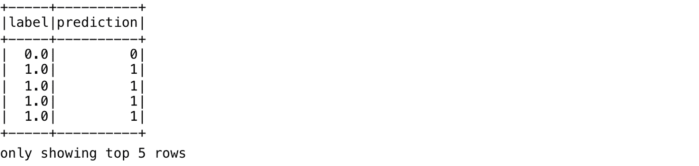

接下来，我们对从连续分布中抽样的数据执行双侧 Kolmogorov-Smirnov（KS）检验。我们比较数据的经验累积分布和理论分布之间的最大差异，以检验样本数据是否来自该理论分布的零假设。在下面的示例中，我们对`fixed_acidity`列针对正态分布进行了测试：

```scala
> test <- spark.kstest(indf, "fixed_acidity", "norm", c(0, 1))

> testSummary <- summary(test)

> testSummary
```

Kolmogorov-Smirnov 检验摘要：

```scala
degrees of freedom = 0

statistic = 0.9999276519560749

pValue = 0.0
#Very strong presumption against null hypothesis: Sample follows theoretical distribution.
```

最后，在下面的示例中，我们使用`spark.lapply`进行多模型的分布式训练。所有计算的结果必须适合单台机器的内存：

```scala
> library(magrittr)

> csvPath <- "file:///Users/aurobindosarkar/Downloads/winequality/winequality-white.csv"

> indf <- read.df(csvPath, "csv", header = "true", inferSchema = "true", na.strings = "NA", delimiter= ";") %>% withColumnRenamed("fixed acidity", "fixed_acidity") %>% withColumnRenamed("volatile acidity", "volatile_acidity") %>% withColumnRenamed("citric acid", "citric_acid") %>% withColumnRenamed("residual sugar", "residual_sugar") %>% withColumnRenamed("free sulfur dioxide", "free_sulfur_dioxide") %>% withColumnRenamed("total sulfur dioxide", "total_sulfur_dioxide")

> lindf <- collect(indf)
```

我们传递一个只读参数列表用于广义线性模型的 family 参数，如下所示：

```scala
> families <- c("gaussian", "poisson")

> train <- function(family) {
+ model <- glm(quality ~ ., lindf, family = family)
+ summary(model)
+ }
```

以下语句返回模型摘要的列表：

```scala
> model.summaries <- spark.lapply(families, train)
```

最后，我们可以打印两个模型的摘要，如下所示：

```scala
> print(model.summaries)
```

模型 1 的摘要是：

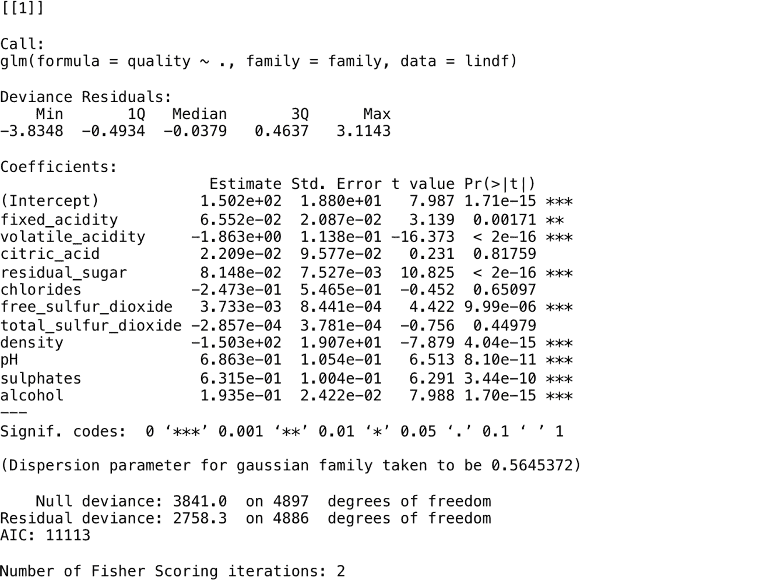

模型 2 的摘要是：

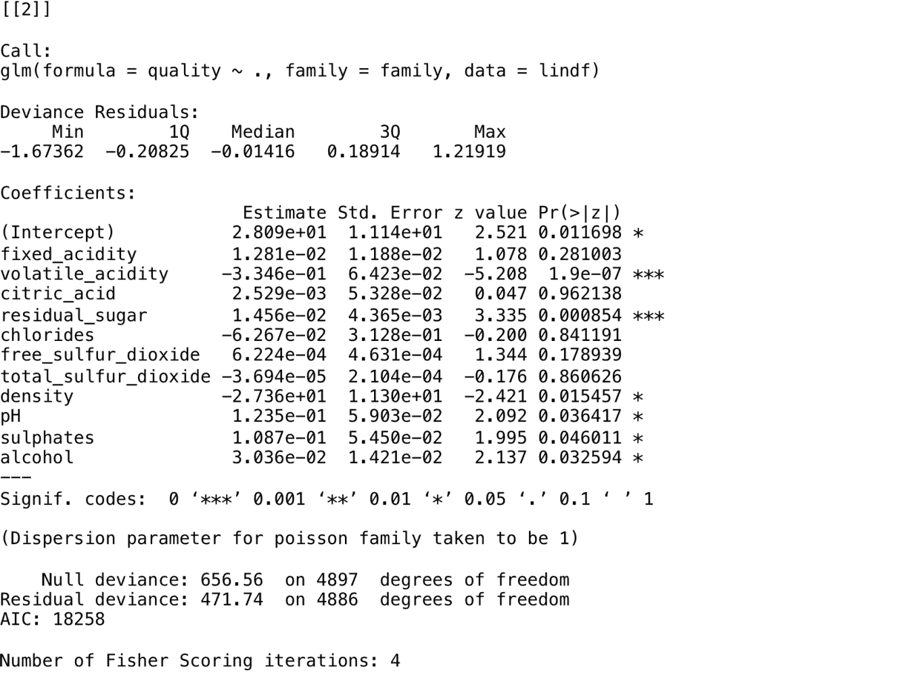

# 摘要

在本章中，我们介绍了 SparkR。我们涵盖了 SparkR 架构和 SparkR DataFrames API。此外，我们提供了使用 SparkR 进行探索性数据分析和数据整理任务、数据可视化和机器学习的代码示例。

在下一章中，我们将使用 Spark 模块的混合构建 Spark 应用程序。我们将展示将 Spark SQL 与 Spark Streaming、Spark 机器学习等结合的应用程序示例。
